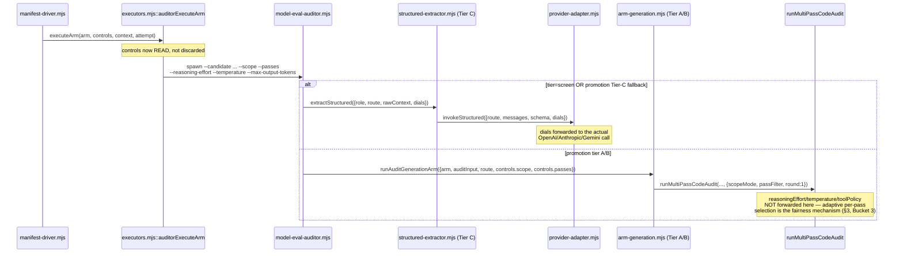

# Plan: Auditor Controls Execution Wiring

- **Date**: 2026-08-17
- **Status**: Implemented and shipped (audit-plan: 5 GPT rounds, 100% acceptance each, real design defects each round; Gemini gate: 2 rounds, CONCERNS both times, all findings fixed — round-2's genuine G1 architectural gap fixed and stop recorded per the gate's mechanical-fix exception rather than spending a 3rd round). Implementation: `/cycle --autonomous`, Clusters A/B/C per §6, each with its own scoped GPT audit (cloud run ids `<see .audit/cluster-{a,b,c}-r1-result.json>`) and full triage. Every `deferred-declared` finding across Clusters A–B was re-verified satisfied by Cluster C before the final gate (§6's own deferral-comes-due rule). **Final consolidated Gemini gate over the union diff of A–C: 2 rounds — round 1 `CONCERNS` (3 new findings, all mechanical-API claims), round 2 `APPROVE`.** All 3 round-1 findings were CHALLENGEd and confirmed false against the live code rather than fixed: G1 claimed `z.toJSONSchema` is hallucinated (it is a real Zod 4 API, already used at 10+ call sites in this repo including the exact file cited); G2 claimed `max_output_tokens` is an invalid OpenAI parameter (it is the correct Responses-API param name — `client.responses.parse()`/`.create()` is the call shape here, not Chat Completions; used identically at 7+ other call sites in this repo); G3 claimed the candidate's resolved model is never threaded into the generation call (it is, at `arm-generation.mjs`'s `model,` shorthand property passed into `_runMultiPassCodeAudit`'s opts, which `openai-audit.mjs`'s `runMultiPassCodeAudit` spreads over its `model: MODEL` default). See `.audit/union-a-c-gemini-r1-result.json` / `-r2-result.json` and `.audit/union-a-c-ledger.json` for the full record.
- **Author**: Claude + pill
- **Scope**: backend
- **Target domain(s)**: `model-eval`, `scripts`, `shared-lib`
- ⚠ **Cross-domain work** — touches `scripts/lib/model-eval/**` and `scripts/lib/comparison/controls.mjs` (`shared-lib`). One new edge is introduced (round-4 H4 fix): `provider-adapter.mjs` (model-eval) imports `TIER_C_MAX_OUTPUT_TOKENS` FROM `controls.mjs` (shared-lib). **Verified, not deferred (round-5 M2 fix)**: checked `.audit-loop/domain-map.json` directly — `model-eval`'s `allowedDeps` already lists `shared-lib` (alongside `audit-orchestration`/`stores`), and `shared-lib`'s own `allowedDeps` (`claude-hooks`/`findings`/`plan`) does not include `model-eval`, confirming the edge is both already-permitted and correctly one-directional. No `domain-map.json` change needed at implementation time.

## 0. Why this plan exists

`AuditorControlsSchema` ([controls.mjs:89](scripts/lib/comparison/controls.mjs:89)) declares
`reasoningEffort`, `promptTemplateId`, `outputSchemaId`, `maxOutputTokens`,
`toolPolicy`, `temperature`, `passes`, `scope`, `rounds` as required dials for
the auditor role. They are parsed, `.strict()`-validated, and hashed into the
campaign's `configDigest` — every consumer of a comparison's lock believes
these fields governed what actually ran. In reality
[`auditorExecuteArm`](scripts/lib/model-eval/executors.mjs:95) receives them as
a parameter literally named `_controls` and discards it; the spawned CLI
(`scripts/model-eval-auditor.mjs`) has no flags for any of the nine fields.

A GPT audit pass run against this exact code on 2026-08-17 flagged it (finding
labels H3/H12, categories "Configuration Propagation"/"Configuration Drift")
and explicitly called it *"the one substantive cluster not clearly answered in
the plan text."* The comment written above `auditorExecuteArm` claims the gap
is settled, pre-existing debt from a **"round-5 gate H3/H12"** finding,
attributed to the predecessor plan (`role-agnostic-comparison-core.md`). That
citation does not exist: exhaustive grep of `comparison-tooling-consolidation.md`
(every `R5`/`H3` occurrence: `R5/H1`, `R5/H2`, `R5/H3` [an unrelated `Symbol`-
construction topic], `R5/H4`, `R5/M2` — no `H12` anywhere in the file),
`role-agnostic-comparison-core.md` (round 5: `M4/M5` on xAI-preflight parity;
round 6: `H2/H3/H4` on `verdict.mjs` bugs — nothing matching), and a full scan
of `list-unremediated-acceptances` (418 rows) / `list-unlocked-fixes` (412
rows) across all repos and ages, turned up no durable record of this decision
anywhere. This plan both fixes the gap and gives the decision (wherever it
lands) a durable home — a plan document, not a source comment.

## 1. Context Summary

### What exists today (Code Trace)

- `AuditorControlsSchema` — [controls.mjs:89-94](scripts/lib/comparison/controls.mjs:89) (972d3a6c). `COMMON_SHAPE`
  ([controls.mjs:48-64](scripts/lib/comparison/controls.mjs:48)) is shared across all three roles
  (`auditor`, `adjudicator`, `final_review_shadow`); `passes`/`scope`/`rounds` are auditor-specific.
- `runManifestDriver` → `EXECUTORS.auditor.prepareContext`/`executeArm` —
  [executors.mjs:69-118](scripts/lib/model-eval/executors.mjs:69) (972d3a6c). `auditorExecuteArm` spawns
  `scripts/model-eval-auditor.mjs` with `--candidate --tier --thresholds --corpus --out
  --repo-roots --comparison-id --arm-id --attempt --supersede-prior` only.
- `scripts/model-eval-auditor.mjs::main()` — [model-eval-auditor.mjs:274-434](scripts/model-eval-auditor.mjs:274)
  (972d3a6c). Two execution tiers:
  - **`screen`** (always) and **promotion-tier's Tier-C fallback** both go through
    `scoreArmTierC` → [`extractStructured`](scripts/lib/model-eval/structured-extractor.mjs:236) →
    [`invokeStructured`](scripts/lib/model-eval/provider-adapter.mjs:47). Traced the full call: the
    prompt is one hardcoded string per role ([`buildAuditorPrompt`](scripts/lib/model-eval/structured-extractor.mjs:208)),
    the schema is hardcoded per role (`AuditorExtractionSchema`), and none of `invokeOpenAICompatible`/
    `invokeNativeAnthropic`/`invokeNativeGemini` ([provider-adapter.mjs:84-209](scripts/lib/model-eval/provider-adapter.mjs:84))
    send `temperature`, `reasoning`/effort, or an overridable `max_tokens` — Anthropic hardcodes
    `max_tokens: STRUCTURED_OUTPUT_MAX_TOKENS` (8000), OpenAI/Gemini omit the fields entirely (provider
    default). No tool-calling occurs anywhere in this path.
  - **Promotion-tier Tier A/B** (`computedJudgeTier === 'A'||'B'`) goes through
    [`runAuditGenerationArm`](scripts/lib/model-eval/arm-generation.mjs:115) →
    `runMultiPassCodeAudit` ([openai-audit.mjs:445](scripts/openai-audit.mjs:445)) → `buildAuditRunContext`
    ([legacy-production-audit.mjs:4594](scripts/lib/audit/legacy-production-audit.mjs:4594)) — the real
    production 5-pass pipeline. `buildAuditRunContext` already accepts `passFilter` (a pass subset) and
    `scopeMode` (`'diff'|'plan'|'full'`) — but `arm-generation.mjs:199` hardcodes `scopeMode: 'diff'` and
    never passes `passFilter`. `round: 1` is also hardcoded (`arm-generation.mjs:200`) — `round` here
    means *which* round (R1 vs R2+ ledger suppression), not *how many*; `runAuditGenerationArm`'s own
    comment states every generation call is "a fresh, single round" by design.
  - Reasoning effort inside the production pipeline is **adaptive per-pass, chosen internally, never
    caller-overridable** — grepped `legacy-production-audit.mjs` for every `reasoningEffort` occurrence;
    all three are read-after-the-fact (`result?.reasoningEffort`), none is a settable input.
    `arm-generation.mjs`'s own docstring is explicit that this path exists to give "a candidate and the
    baseline... identical search effort" to the *real production baseline* — i.e., matching adaptive
    production behavior is the fairness mechanism, not an artifact to override.

### Patterns reused vs new

Reused: the manifest-driver two-phase `prepareContext`/`executeArm` shape, the existing
`buildAuditRunContext` `passFilter`/`scopeMode` parameters (no new pipeline plumbing needed there),
`.strict()` Zod schemas + the "validated but structurally can't apply" red flag from the repo's own
`zodSchemaWithoutStrict` lesson. New: two narrow, literal-validated sentinel fields (§3, Bucket 2) and
optional provider-call parameters for effort/temperature/max-tokens (§3, Bucket 1b).

### Neighbourhood considered

`get-neighbourhood` over the touched files returned band `review` for every candidate (below this
repo's noise floor / near-floor) — no precedent cluster forces a reuse/extend/sibling decision beyond
what direct reading above already established. Proceeding on the traced design.

### Security incident neighbourhood

No incident scored above the noise floor for this change specifically (the two nearest, INC-001
symlink-path classification and INC-002 the disposable-DB-host wipe, are unrelated to LLM-call
parameterization and are not touched by this plan).

## 2. Proposed Architecture

### Key design decisions

The eight `AuditorControlsSchema` fields do not form one homogeneous "wire it
through" task — they split into three buckets by what the underlying execution
paths can actually honor (#3 Liskov/interchangeability, #10 Single Source of
Truth — a dial that can't be honored must not pretend to be one):

**Bucket 1 — real, cheap wins (wire through):**
- `scope` → `scopeMode`, Tier A/B only (arm-generation.mjs already threads a
  hardcoded value through an existing parameter).
- `passes` → `passFilter`, Tier A/B only (same — existing parameter, unused).
- `reasoningEffort` / `temperature` / `maxOutputTokens` → new optional
  parameters on `invokeStructured` and its three provider branches, Tier C
  only (screening + promotion's Tier-C fallback). Genuinely novel plumbing,
  but self-contained — no existing test/prompt/schema shape changes.
  **(round-4 H4 fix — schema-level ceiling, not CLI-only):** `maxOutputTokens`
  gains `.max(TIER_C_MAX_OUTPUT_TOKENS)` directly on the Zod field, not
  just at the CLI boundary — without this, a manifest (which never goes
  through the CLI's own validation, only the schema's) could declare a value
  above the real ceiling, get hashed into a valid campaign lock, and only fail
  when a spawned arm actually runs, making an accepted lock non-executable.
  The constant is DEFINED in `controls.mjs` (shared-lib) and IMPORTED by
  `provider-adapter.mjs` (model-eval) — not the reverse — so `controls.mjs`
  stays the single source of truth for the ceiling without model-eval/**
  importing INTO shared-lib backwards; `provider-adapter.mjs` drops its
  locally-defined `STRUCTURED_OUTPUT_MAX_TOKENS` in favor of the imported
  value (one ceiling, not two that could drift).
  **(round-2 H1/M1 redesign, scope corrected round-3 per H1 — exactly FIVE
  fields, not eight):** `reasoningEffort`, `temperature`, `maxOutputTokens`,
  `scope`, `passes` move from schema-required to schema-**optional** on
  `AuditorControlsSchema` specifically (not the shared `COMMON_SHAPE`), so
  "the caller didn't ask for this" becomes a real, distinguishable state
  instead of an arbitrary "default" value with no schema backing.
  `promptTemplateId`/`outputSchemaId`/`toolPolicy` do NOT join this set —
  round 2 mistakenly included them; round 3's H1 correctly caught that they
  apply uniformly regardless of tier and must stay required (Bucket 2).

**Bucket 2 — narrow the schema, don't fake the wiring (#8 No Hardcoding /
#9 No Dead Code applied to a *contract*, not just code — a field nobody can
honor is a dead promise). These three fields stay REQUIRED (round-3 plan-audit
H1 fix — see below for why making them optional was wrong):**
- `promptTemplateId` / `outputSchemaId` have no registry to select from — Tier
  C's prompt and schema are role-fixed. Building a registry for a single entry
  is the over-engineering cliff (no current requirement for a second template
  or schema). Narrow each to an APPEND-ONLY `z.enum([...])` of every
  historically-valid hash-embedded id (round-4 M1 fix — see below for why a
  single `z.literal()` was wrong from the first edit onward), e.g.
  `z.enum(['auditor-tier-c-v1-<hash1>'])` today, gaining a second entry the
  day the prompt changes — never removing old ones — so the digest still
  means something ("caller attests they know a real, historical prompt/schema
  build") and a typo or a genuinely divergent value is refused loudly instead
  of silently accepted-and-ignored.
  **(round-1 M1, corrected round-2 per M2, corrected round-3 per H1/M2,
  corrected round-4 per M1 — REQUIRED, fully specified, and REPRODUCIBLE):**
  round 2 mistakenly made these optional (round 3's H1 fixed that — they stay
  required, since Tier C runs in every comparison, directly or as a
  fallback). Round 3 then specified a single `z.literal()` per current
  content — round 4's M1 correctly caught that this breaks reproducibility on
  the FIRST prompt/schema edit: a previously-valid, previously-hashed
  manifest becomes permanently schema-invalid the moment the literal is
  bumped, even though it is a legitimate historical record. The append-only
  enum keeps every old identity resolvable forever while still refusing a
  value that was never real. **Exact hash specification (round-3 M2 fix,
  length corrected round-4 M1 — 8 hex chars, not 6, for lower collision risk
  in a value embedded in a durable campaign lock):** algorithm `sha256`
  (`crypto.createHash('sha256')`, matching this file's own existing
  `seedFromString` pattern); input for the prompt hash is
  `JSON.stringify(buildAuditorPrompt({evidenceHunk: '<CANON>', filePaths: ['<CANON>']}))`
  called with fixed canonical sentinel values (never real diff content — the
  point is to hash the STATIC template structure, not interpolated data);
  input for the schema hash is `JSON.stringify(z.toJSONSchema(AuditorExtractionSchema))`;
  both hashes are `.digest('hex').slice(0, 8)`.
  **(round-5 H1 fix — the enum validates PROVENANCE, not REPLAY; `controlsApplied`
  must say so honestly):** an append-only enum only proves the DECLARED id was
  real at some point — it does not select a historical prompt/schema
  implementation, and Tier C always calls whatever `buildAuditorPrompt`/
  `AuditorExtractionSchema` the running code CURRENTLY defines, regardless of
  which valid enum member a manifest declared. So an old manifest replays with
  NEW behavior under an OLD declared identity — this plan does not claim
  otherwise (it was never in scope to build a historical-prompt-selection
  registry — that IS Bucket 2's original over-engineering cliff). What it must
  not do is let `controlsApplied.promptTemplateId`/`.outputSchemaId` claim
  `true` when the declared id no longer matches what's actually running. Fix:
  at Tier-C execution time, the LIVE hashes are recomputed (the exact same
  sha256 spec above, run against `buildAuditorPrompt`/`AuditorExtractionSchema`)
  and compared to the manifest's DECLARED enum value — `true` only when they
  match (the declared identity is what's actually executing right now),
  `false` when the manifest declared a real-but-stale historical id (the code
  has moved on since). **Computed WHERE, exactly (Gemini-gate round-1 G1
  fix):** `deriveControlsApplied` itself does NOT call `buildAuditorPrompt`/
  `AuditorExtractionSchema` — it lives in `controls.mjs` (shared-lib), and
  those functions live in `structured-extractor.mjs` (model-eval); having the
  shared-lib function import them would be exactly the FORBIDDEN
  shared-lib→model-eval edge this plan has been careful to avoid everywhere
  else (an earlier draft's claim that `deriveControlsApplied` "needs no
  model-eval import" was self-contradicted by this same paragraph's own
  "recomputes... against the LIVE" language — caught by the mandatory Gemini
  gate, not by the GPT rounds). The live hashes are computed by
  `model-eval-auditor.mjs` (which already imports `structured-extractor.mjs`
  for other reasons and safely lives in `model-eval`) and passed INTO
  `deriveControlsApplied` as plain, already-computed strings —
  `deriveControlsApplied(controls, {branch, honoredDials, liveHashes:
  {promptTemplateId, outputSchemaId}})` — so the shared-lib function only ever
  does a string comparison, never a cross-domain import. This reuses the same
  recomputation machinery the versioning canary test already needs (§5), just
  computed at the call site that's actually allowed to import it, and it turns
  "reproducibility" into an honest claim: not "this replays old behavior" but
  "this evidence tells you truthfully whether the declared identity matches
  what ran." Both hashes are computed in-process
  from live JS values (never read from disk), so no EOL-canonicalization
  concern applies (that's a file-hashing problem, not an in-memory-string one).
  Test seam: `buildAuditorPrompt` and `AuditorExtractionSchema` are already
  exported (verified: `AuditorExtractionSchema` is exported at
  `structured-extractor.mjs:77`; `buildAuditorPrompt` needs a one-line export
  addition — currently module-private) — no new `_internals` object needed
  beyond that. A regression test (§5) recomputes both hashes and asserts they
  match the NEWEST member of the enum in `controls.mjs` (and that
  `deriveControlsApplied` correctly reports `false` for an older, still-valid
  member — round-5 H1) — still a human hand-append on a real edit (no cross-domain
  import from `comparison/controls.mjs` into `model-eval/**` — `controls.mjs`
  stays import-free of `model-eval/**`, preserving this plan's own
  domain-boundary claim at the top of the document), but now a mechanical,
  fully-specified recomputation rather than an arbitrary string choice.
- `toolPolicy` — no role in this schema's Tier-C paths uses tool-calling
  today, in EITHER branch (Tier A/B doesn't use `toolPolicy` either — it runs
  the production pipeline's own tool wiring, untouched by this plan). Same
  treatment: narrow to `z.literal('none')` at the auditor-role level (not a
  `COMMON_SHAPE` change — `final_review_shadow`/`adjudicator` are out of this
  plan's scope and keep the wider shape). Required, not optional, for the
  same reason as `promptTemplateId`/`outputSchemaId` — there is no branch
  where this field is meaningfully "about" one tier and not the other; it is
  simply always `'none'` today.
- `rounds` — the field's own name ("how many rounds") does not correspond to
  what `round` means anywhere in the execution path ("which round number").
  A model-eval generation call is architecturally a single fresh round by
  `arm-generation.mjs`'s own design. Add a role-level `.refine()` requiring
  `rounds === 1` for the auditor role, with an error message naming why —
  turns a silently-ignored field into an enforced, honest one. Multi-round
  comparison arms are a real, separate feature (each round needs its own
  ledger/suppression semantics) — not designed here.

**Bucket 3 — evidence, not enforcement, and covering ALL EIGHT fields
uniformly, not just the five optional ones (#16 Graceful Degradation applied
to a design boundary; #19 Observability — round-1 H1/H3, REDESIGNED round-2
per H1/M1/M2/M3, REDESIGNED round-3 per H2/H3/M1, EXTENDED round-4 per H2/H3):**

**Why refuse (rounds 1-2) doesn't work — round 3's finding.** `controls` is
ONE shared object for the WHOLE comparison (`COMMON_SHAPE`'s own lesson (b):
arms must share one dial). But `computedJudgeTier` — which branch (A/B vs C)
an ARM's generation/extraction runs through — is resolved from THAT ARM'S OWN
candidate route (`resolveEvaluationTier`, traced: `candidateRoute.judgeTier`/
`independenceGroup` vs baseline/judge — `route-catalog.mjs:305-333`), and
different arms in ONE comparison legitimately declare different candidate
models. A multi-arm campaign spanning both branches has no controls object
that satisfies a blocking refuse in both directions at once. **The fix**:
each arm's own result reports which dials actually governed ITS execution;
nothing blocks.

**Why the required Bucket-2 fields ALSO need this, not just the five optional
ones — round-4 H2's correction.** Round 3 reasoned that `promptTemplateId`/
`outputSchemaId`/`toolPolicy` are "always applicable" because Tier C runs in
every comparison, directly or as a fallback. That's true only for
Tier-C-*resolved* arms — an arm that resolves to Tier A/B never calls
`buildAuditorPrompt`/`AuditorExtractionSchema` at all; it runs the production
5-pass pipeline's OWN prompts (`PASS_PROMPTS`) and tool wiring, entirely
unidentified by these three fields. So they're REQUIRED (Bucket 2 — a value
must always be declared, since SOME arm in the comparison might resolve to
Tier C) but their *application* is exactly as tier-conditional as the five
optional fields — Bucket 2 vs Bucket 3 is a split about whether the SCHEMA
requires a value, not about whether the VALUE was actually exercised. All
eight fields therefore go through the SAME `controlsApplied` mechanism.

**Construction — centralized, not distributed (round-4 H3's fix).** Round 3's
spec asked `arm-generation.mjs` to report `false` for `reasoningEffort`/
`temperature`/`maxOutputTokens` despite never receiving those fields as
parameters (it only takes `{scope, passes}`) — an unimplementable signature,
and separately marked `scope: true` even when `scope` was omitted and
defaulted internally, which is wrong (an omitted dial reports as *absent*,
never `true`). Both defects share one root cause: building partial evidence
piecemeal across leaf functions that don't have full context. Fixed by
centralizing: `model-eval-auditor.mjs` — which RECONSTRUCTS the full
`controls`-shaped object from its own CLI flags (round-2 Gemini-gate G1 fix
— corrected from an earlier, false claim that this process "already holds
the FULL controls object"; the `--candidate` spawn path has no manifest at
all, so every field, including the four always-required Bucket-2 ones, must
arrive as a spawn flag — see §5's executors.mjs/model-eval-auditor.mjs
entries) AND knows which branch was resolved (`tier`/`computedJudgeTier`) —
is the ONE place that calls the pure function `deriveControlsApplied(controls,
{ branch, honoredDials, liveHashes })` after each arm's generation/extraction
call returns, producing the final per-arm evidence (`liveHashes` per §2
Bucket 2's Gemini-gate round-1 G1 fix, computed by this
same CLI, never by `deriveControlsApplied` itself).

**`honoredDials` must actually REACH the CLI (Gemini-gate round-1 G2 fix — a
missing plumbing step round 3-5's own GPT rounds never caught).** `invokeStructured`
returns `honoredDials` (§2.5), but `extractStructured` is called inside a
LOOP in `scoreArmTierC` (once per KD corpus case) — round 3-5's spec never
updated `scoreArmTierC`'s own return shape (`{metrics, raw}`) to carry
`honoredDials` back out, so it had no path from the provider layer up to
`main()`. Fixed: `scoreArmTierC` captures `honoredDials` from its FIRST
`extractStructured` call (dials are constant per arm — every KD case in the
loop uses the same `controls`, so the first call's `honoredDials` is
representative of the whole arm) and includes it in its own return value;
`runScreenTier`/`runPromotionTier` (both of which call `scoreArmTierC`, the
latter only on its Tier-C-fallback branch) thread it through to THEIR return
values, all the way to `main()`, where it's finally available for the
`deriveControlsApplied` call above. Tier A/B's branch of `runPromotionTier`
never receives `honoredDials` at all (it's a Tier-C-only concept) — `main()`
passes `honoredDials: undefined` for that branch, which `deriveControlsApplied`
treats identically to "nothing to report" (matching the existing `false`-when-
present-on-Tier-A/B rule for these three fields — presence on `controls` alone
already determines the `false`, `honoredDials` is only consulted on Tier C).

Leaf functions (`runAuditGenerationArm`, `extractStructured`) stay unchanged
from their Bucket-1 wiring purpose and don't construct evidence themselves —
`invokeStructured`/`extractStructured` still return `honoredDials` for the
three Tier-C-forwardable fields (§2.5), which the caller folds in.

**Nine fields declared, eight covered, one deliberately excluded (round-5 M1
fix).** `AuditorControlsSchema` has nine fields total; `rounds` is the
ninth. Unlike the other eight, `rounds` has NO tier-conditional application
at all — it is fixed at `=== 1` (Bucket 2's refine) and a model-eval
generation call is architecturally exactly one round on EITHER branch, so
there is no "did this govern execution" question to answer for it.
`deriveControlsApplied`/`controlsDivergence` deliberately cover only the
other eight; `rounds` is excluded BY DESIGN, not by oversight.

`deriveControlsApplied`'s rule for the eight covered fields: if absent on
`controls` → absent from the result (never `true` or `false`); for
`scope`/`passes` — `true` when present on a Tier-A/B-resolved arm, `false`
when present on a Tier-C-resolved arm (Tier C has no scope/pass concept);
for `toolPolicy` — `true` when present on Tier C, `false` on Tier A/B (same
logic, no capability nuance); for `promptTemplateId`/`outputSchemaId` — NOT
a simple branch check (round-5 H1 fix, above): on a Tier-C-resolved arm,
`true` only if the recomputed live hash matches the manifest's DECLARED enum
value, `false` if the declared value is real-but-stale; on a Tier-A/B-resolved
arm, always `false` when present (these fields never identify anything Tier
A/B runs — §2 Bucket-2's own H2-round-4 correction); for the three
provider-forwardable fields (`reasoningEffort`/`temperature`/`maxOutputTokens`)
on Tier C → whatever `honoredDials` reported (§2.5, including the round-5 H3
Anthropic-temperature-range case below); on Tier A/B → `false` when present.

**Comparison-level visibility (round-4 H1's fix — a bounded addition, not a
new reporting layer).** `runManifestDriver` (`manifest-driver.mjs:64`) already
collects every arm's full result into one `results` array before writing the
manifest's aggregate `--out` (verified directly: `results.push({armId, ok,
attempt, outcome, result})` per arm, `writeOutput({..., arms: results}, ...)`
at the end) — there is no separate aggregation/reporting layer to build (the
auditor role's manifest-driven comparisons are new in this cluster; no
existing bakeoff/campaign summary consumes them, so extending one would be
scope creep past a consumer that doesn't exist). The one addition: after the
per-arm loop, compute `controlsDivergence` — for each of the eight fields,
`'uniform'` if every arm that declared it reports the SAME `controlsApplied`
value, `'divergent'` if arms disagree (the exact heterogeneous-tier scenario
H1 raised) — and include it in the object passed to `writeOutput`. This
directly closes H1's "no consumer distinguishes requested from effective
configuration" gap: the one place that already sees every arm's result now
surfaces the divergence a human/automated reader of the manifest's output
would otherwise have to reconstruct by hand from N separate per-arm records.
`configDigest` itself is UNCHANGED — it continues to hash requested INTENT
(what the operator asked for), which was always its correct meaning;
`controlsApplied`/`controlsDivergence` are the new, honest record of EFFECT.

This also answers round-1 H3's real complaint ("a warning is... inadequate
for unattended campaigns or machine-readable results") more directly than a
refuse ever did — `controlsApplied`/`controlsDivergence` ARE the
machine-readable record H3 asked for.

- **Tier A/B**: `runAuditGenerationArm` sets `controlsApplied.scope`/`.passes`
  to `true` (they were threaded into the ctx); `.reasoningEffort`/
  `.temperature`/`.maxOutputTokens` to `false` if present on `controls` (they
  cannot be honored — the production pipeline's adaptive per-pass selection
  is the fairness mechanism, unchanged) or simply absent from the object if
  never declared.
- **Tier C** (screen, and promotion's Tier-C fallback): `scoreArmTierC`/
  `extractStructured` sets `.reasoningEffort`/`.temperature`/
  `.maxOutputTokens` to `true` when present AND the resolved provider
  transport supports it (§2.5's capability matrix), `false` when present but
  the transport can't honor it (e.g. `reasoningEffort` on Anthropic/Gemini —
  see §2.5), and `.scope`/`.passes` to `false` if present (Tier C has no
  scope/pass concept) or absent if never declared.

### 2.5 Provider Capability Matrix + CLI Validation (round-1 plan-audit H2/H4 fix)

**Per-provider forwarding — exact, not "universally wireable"**:

| Dial | OpenAI-compatible (`invokeOpenAICompatible`) | Anthropic (`invokeNativeAnthropic`) | Gemini (`invokeNativeGemini`) |
|---|---|---|---|
| `reasoningEffort` | Forwarded on `responses.parse` — **exact param shape needs a live-SDK check at implementation time, not asserted here (Gemini-gate round-1 G3 — flagged uncertain, not resolved by round-1 deliberation):** the OpenAI Responses API (this call's actual endpoint, per `client.responses.parse`) is documented elsewhere as taking a nested `reasoning: {effort}` object, distinct from the OLDER Chat Completions API's flat `reasoning_effort` string (used for o1/o3-mini specifically) — Gemini's round-1 review asserted the flat form applies here; neither claim was verified against this repo's actual installed `openai` package's TypeScript types before this plan was written. Resolve by checking `node_modules/openai`'s type definitions for `responses.create`'s reasoning parameter BEFORE writing the Phase 3 code, not by picking either claim on authority. | **No native equivalent** — not forwarded | **No native equivalent** — not forwarded |
| `temperature` | Forwarded as `temperature` on `responses.parse` | Forwarded as `temperature` on `messages.create`, ONLY if `<= 1` (round-5 H3 — see below) | Forwarded as `config.temperature` (round-5 H2 fix — NOT `generationConfig.temperature`; verified directly against this repo's actual `invokeNativeGemini`, which passes `config: {systemInstruction, responseMimeType, responseSchema}` as a flat object to `@google/genai` v2's `models.generateContent` — there is no `generationConfig` wrapper in this codebase's usage) |
| `maxOutputTokens` | Forwarded as `max_output_tokens` | Forwarded as `max_tokens`, replacing the hardcoded local constant | Forwarded as `config.maxOutputTokens` (round-5 H2 fix, same correction as `temperature`) |

**Anthropic's temperature range is [0, 1], not the wider range OpenAI/Gemini
accept (round-5 H3 fix).** `AuditorControlsSchema.temperature` stays
`>= 0` with no upper bound (COMMON_SHAPE, unchanged — a shared campaign-level
dial must not be narrowed by one provider's limit when other arms in the same
comparison route elsewhere). Instead, `invokeNativeAnthropic` treats a present
`temperature > 1` exactly like `invokeNativeGemini`/`invokeNativeAnthropic`
already treat a present-but-unsupported `reasoningEffort` (§2 Bucket 3): it is
NOT forwarded (never sent as a request Anthropic would reject with a live
4xx), and `honoredDials.temperature` reports `false`. This is a KNOWN, STABLE
provider constraint (unlike the OpenAI reasoning-effort/temperature
combination, which is model-specific and left to a real 4xx per this plan's
existing rationale) — worth hardening against directly rather than treating
identically.

**An EXPLICITLY-PRESENT `reasoningEffort` on an Anthropic/Gemini route is
NOT forwarded and NOT refused (round-3 redesign, superseding round-2's
`ControlsCapabilityError`)** — `invokeStructured` knows `route.transport`
before dispatch; when the transport can't honor a present `reasoningEffort`,
it simply omits the field from the SDK call (per the matrix above) and
returns `honoredDials: {reasoningEffort: false, ...}` alongside the normal
result, which `extractStructured`/`scoreArmTierC` fold into the arm's
`controlsApplied` evidence (§2 Bucket 3). An OMITTED `reasoningEffort` is the
common case for those transports and simply has nothing to report as
false — it's absent from `controlsApplied`, not present-and-false.

**OpenAI reasoning-model `temperature`+`reasoning.effort` conflicts are NOT
pre-validated by this plan.** Some OpenAI reasoning-tier models reject a
request carrying both parameters; which models do is a live, provider-side
fact this repo has no registry of and would go stale independently of any
model resolver. Forwarding both and letting the SDK's own request validation
produce a real 4xx is the correct behavior here — a loud provider error is an
honest failure, not the silent corruption this plan otherwise closes. Recorded
explicitly so it isn't mistaken for an oversight.

**CLI validation (`scripts/model-eval-auditor.mjs`)** — every new flag is
checked at the SAME preflight boundary the file already uses
(`RunPreflightError`, exit 2), reusing existing canonical vocabularies rather
than re-deriving them:

| Flag | Validation |
|---|---|
| `--scope` | Must be one of `diff`\|`plan`\|`full` (the exact `AuditorControlsSchema.scope` enum — import, don't re-literal) |
| `--passes` | Comma-separated; each entry must be a key of `PASS_PROMPTS` (`scripts/lib/prompt-seeds.mjs:289`) — the actual registered pass-identifier vocabulary; empty entries and exact duplicates are rejected. **Rebutted, not accepted (Gemini-gate round-1 G4):** Gemini's round-1 review claimed this file/symbol doesn't exist and that the canonical vocabulary is `PASS_NAMES` (`scripts/lib/config.mjs:438`) instead. Both symbols exist (`PASS_NAMES` is real too), but `PASS_NAMES` is the WRONG choice here: it lists `['structure', 'wiring', 'backend', 'frontend', 'sustainability', 'gemini-review']` — 6 entries including `'gemini-review'` (a REVIEW step, not a generation pass) and missing `'quickfix'`/`'duplication'`/`'adjacency'` (three real generation passes `PASS_PROMPTS` DOES have). Since `passFilter` selects among GENERATION passes specifically, `PASS_PROMPTS`'s 8 keys are the correct vocabulary — this citation is unchanged from round 1, verified directly against the file's actual content before this plan was first written. |
| `--reasoning-effort` | Must be one of `EFFORT_LEVELS` (`scripts/lib/comparison/controls.mjs:28`) — imported, single source of truth with the schema |
| `--temperature` | Numeric, `≥0` and finite, AND must pass `isCanonicalizableNumber` (`scripts/lib/comparison/lock.mjs`) — the exact check `AuditorControlsSchema` itself applies, so a value the CLI accepts can never be one the schema would later refuse |
| `--max-output-tokens` | Positive integer; upper-bounded at `TIER_C_MAX_OUTPUT_TOKENS` (round-5 M3 fix — this constant now lives in `scripts/lib/comparison/controls.mjs`, exported and imported by `provider-adapter.mjs`, per §2 Bucket 2's round-4 H4 fix; `provider-adapter.mjs`'s own former local `STRUCTURED_OUTPUT_MAX_TOKENS` is deleted, not duplicated) — a caller asking for more than the extraction boundary's own ceiling is a configuration error, not a request to silently clamp. This CLI check is now REDUNDANT with the schema's own `.max()` bound (round-4 H4) but kept for a fast, pre-spawn failure rather than waiting for the schema parse deeper in the call stack. |

## 3. Right-Sizing Gate

- **Band-aid**: leave `_controls` discarded, only fix the comment's provenance
  citation. Cheapest possible change; leaves the actual defect (digest implies
  enforcement that doesn't exist) live.
- **Over-engineered**: build a full prompt-template registry + output-schema
  registry + a generic per-role dial-injection framework capable of
  overriding the production pipeline's adaptive effort selection, "for
  future flexibility." No current requirement asks for a second prompt
  template, a second output schema, or per-arm effort override inside Tier
  A/B — all three would be speculative.
- **Chosen**: Bucket 1 wires the two dials that already have a real target
  (`scopeMode`/`passFilter`) plus the three dials Tier C's provider calls can
  genuinely accept (`reasoningEffort`/`temperature`/`maxOutputTokens`) —
  serves the *current* requirement (D7's own "n-arm PARITY with the existing
  single-candidate mechanism"). Bucket 2 corrects the schema to stop claiming
  control it can't exercise, at the smallest possible diff (a literal/refine,
  not a registry). Bucket 3 documents a real architectural boundary instead of
  silently crossing or silently ignoring it.

## 4. Sustainability Notes

- **Assumption that could change**: a second auditor prompt template or output
  schema is added later. The `z.literal()` narrowing (Bucket 2) is a one-line
  widen to a proper enum when that happens — it does not block the future
  need, it just refuses to pretend the need exists today.
- **Assumption that could change**: Tier A/B gains a legitimate need for
  caller-controlled effort (e.g., a deliberate "test this candidate at low
  vs. high effort" experiment distinct from production-parity testing). That
  is a different experiment design (arguably wants its OWN tier, not an
  override inside the production-parity tier) — flagged, not designed here.
- Extension point: `CONTROLS_BY_ROLE`'s per-role narrowing pattern (Bucket 2)
  generalizes to `adjudicator`/`final_review_shadow` if they ever accumulate
  the same "validated but unconsumed" drift — same fix shape, out of scope
  here (neither role has this defect today; the audit trail's H3/H12 findings
  named `auditor` specifically).

## 5. File-Level Plan

| File | Action | Purpose |
|---|---|---|
| `scripts/lib/comparison/controls.mjs` | modify | **(Phase 1 slice)** `AuditorControlsSchema` overrides exactly FIVE fields to `.optional()` — `reasoningEffort`, `temperature`, `maxOutputTokens`, `scope`, `passes`; `promptTemplateId`/`outputSchemaId`/`toolPolicy` stay REQUIRED. Defines and exports `TIER_C_MAX_OUTPUT_TOKENS` (round-4 H4 fix, renamed from an earlier `AUDITOR_TIER_C_...` draft per Gemini-gate round-2 G2 — `provider-adapter.mjs` is role-agnostic, serving `adjudicator`'s Tier-C path too, so the shared ceiling constant must not carry auditor-specific naming even though only `AuditorControlsSchema` references it for validation today), used both by `maxOutputTokens`'s `.max()` bound here and imported by `provider-adapter.mjs`. `COMMON_SHAPE`, `AdjudicatorControlsSchema`, `FinalReviewShadowControlsSchema` untouched. **(Phase 4 slice)** `promptTemplateId`/`outputSchemaId` → append-only `z.enum([...])` of 8-hex-char hash-embedded ids (round-4 M1 fix — never a single `z.literal()`), `toolPolicy` → `z.literal('none')`, `rounds` → `.refine(v => v === 1, ...)`. Exports the pure `deriveControlsApplied(controls, {branch, honoredDials, liveHashes})` function (round-4 H2/H3 fix; `liveHashes` param per Gemini-gate round-1 G1 fix) — lives here, not in `model-eval/**`; it does string comparisons only against `liveHashes` values the CALLER already computed, so it needs no `model-eval` import despite reasoning about prompt/schema identity. Update the schema's header comment to describe the two-bucket split. |
| `scripts/lib/model-eval/provider-adapter.mjs` | modify | Imports `TIER_C_MAX_OUTPUT_TOKENS` from `controls.mjs` (drops its own locally-defined `STRUCTURED_OUTPUT_MAX_TOKENS` in favor of the shared constant — round-4 H4). `invokeStructured` + its three provider branches accept optional `{reasoningEffort, temperature, maxOutputTokens}`, forward them per the §2.5 matrix, and return `honoredDials: {reasoningEffort, temperature, maxOutputTokens}` (booleans, one per field ACTUALLY PRESENT in the call — never thrown for a capability mismatch, per round-3's redesign). |
| `scripts/lib/model-eval/structured-extractor.mjs` | modify | `extractStructured({role, route, rawContext, signal, dials})` threads `dials` into `invokeStructured` and returns `honoredDials` unchanged on its own return value — no evidence CONSTRUCTION here (round-4 H3 fix moved that to the CLI, which has full context; this function only relays what the provider layer reported). Defaults preserve today's byte-identical behavior when `dials` is omitted. |
| `scripts/lib/model-eval/arm-generation.mjs` | modify | `runAuditGenerationArm` accepts `{scope, passes}`, passes `scopeMode: scope ?? 'diff'` and, ONLY when `passes` IS PRESENT, `passFilter: passes` — the key is OMITTED entirely when `passes` is absent (round-3 M1 fix: never `passFilter: passes ?? null`, which always adds the key). No `controlsApplied` construction here either (round-4 H3 — centralized in the CLI, which is the only place with full visibility into `reasoningEffort`/`temperature`/`maxOutputTokens` presence; this function was never passed those fields and has no basis to report on them). |
| `scripts/lib/model-eval/executors.mjs` | modify | `auditorExecuteArm(arm, controls, context, driverAttempt)` — drop the leading underscore. Pass `--scope`, `--passes`, `--reasoning-effort`, `--temperature`, `--max-output-tokens` as spawn args when present on `controls` (the five optional dials), AND, ALWAYS (they're required, therefore always present), `--prompt-template-id`, `--output-schema-id`, `--tool-policy`, `--rounds` (round-2 Gemini-gate G1 fix — see model-eval-auditor.mjs below for why). Replace the misleading header comment (§0) with accurate history, no fabricated round/finding citation. |
| `scripts/model-eval-auditor.mjs` | modify | New CLI flags for the five optional dials, validated per §2.5, PLUS four more for the required Bucket-2 fields — `--prompt-template-id`, `--output-schema-id`, `--tool-policy`, `--rounds` (all four validated against the same schema-level constraints: enum membership, `z.literal('none')`, `=== 1`). **(Gemini-gate round-2 G1 fix — a real gap the prior round's design missed):** `main()`'s `--candidate` (single-arm, non-manifest) path has NO manifest and NO `controls` object at all — it is a bare CLI invocation. When `auditorExecuteArm` spawns this CLI for a manifest-driven arm, the ONLY way the child process learns the manifest's declared `promptTemplateId`/`outputSchemaId`/`toolPolicy`/`rounds` (needed to construct a correct `controlsApplied` — Bucket 2's fields need the SAME per-arm evidence treatment as Bucket 3, per round-4 H2) is if `auditorExecuteArm` passes them as spawn args too, exactly like the five optional dials already were — the prior round's plan silently assumed the child "already holds the FULL controls object" when in fact spawning is the ONLY channel it has. These four new flags close that gap; unlike the five optional ones, they are unconditionally passed (never omitted) since the schema requires all four. `runScreenTier`/`runPromotionTier`'s return values are extended to carry `honoredDials` (threaded up from `scoreArmTierC`'s first-call capture, per Gemini-gate round-1 G2 fix — `scoreArmTierC` itself also gains this in its own return shape). After each tier's call returns, `main()` reconstructs a `controls`-shaped object from ALL nine flags (five optional + four required, the latter always present), computes `liveHashes` (imports `buildAuditorPrompt`/`AuditorExtractionSchema` from `structured-extractor.mjs` — a normal in-domain import, safe here unlike inside `controls.mjs`), and invokes `deriveControlsApplied(reconstructedControls, {branch: tier === 'screen' || computedJudgeTier === 'C' ? 'tier-c' : 'tier-a-b', honoredDials, liveHashes})`, folding the result into the object written by `--out` / persisted via `createEvalRun`/`updateEvalRunTerminal`'s `evidence` field. No refuse check of any kind. A plain `--candidate` invocation with none of the nine flags reports `controlsApplied` as entirely absent (nothing declared) — byte-identical execution behavior to today either way. |
| `scripts/lib/model-eval/manifest-driver.mjs` | modify | **(round-4 H1 fix)** After the per-arm loop (`manifest-driver.mjs:178`, where `results` is already fully populated), compute `controlsDivergence` — for each of the eight controls fields, `'uniform'` if every arm reporting that field in its own `controlsApplied` agrees, `'divergent'` otherwise — and include it in the object passed to `writeOutput` alongside the existing `{manifestId, role, comparisonId, tier, arms: results}`. `configDigest` itself is unchanged (it hashes requested intent, which was always its correct meaning); this is the one new field that makes effective-configuration divergence visible at the comparison level, where the plan's original defect (a digest implying uniform governance) actually surfaces. |
| `tests/comparison-controls-execution.test.mjs` | create | Regression cover: (a) a manifest declaring the five optional dials produces the expected spawn-arg list; (b) `AuditorControlsSchema` accepts each of the five OMITTED and refuses `promptTemplateId`/`outputSchemaId`/`toolPolicy` omitted (required) or present-with-a-wrong-value; (c) `rounds !== 1` refused; (d) omitting all five reproduces today's exact spawn-arg list; (e) `deriveControlsApplied` unit cases covering all eight fields × both branches × present/absent/honored/unhonored — including the round-4 H3 regression (a field never passed to a leaf function must never appear as `true` when actually absent); (f) hash-recomputation matches the CURRENT enum's newest entry and FAILS on a mutated fixture; (g) round-3 H2's multi-arm regression — two arms resolving to different tiers under one `controls` object both complete, each with distinct correct `controlsApplied`; (h) an old, previously-valid `promptTemplateId` enum member (simulating a historical manifest after a hash bump) still validates (round-4 M1 regression); (i) `auditorExecuteArm`'s spawn-arg list ALWAYS includes `--prompt-template-id`/`--output-schema-id`/`--tool-policy`/`--rounds` (never conditionally, since these are schema-required) alongside whichever of the five optional flags are present (round-2 Gemini-gate G1 regression). |
| `tests/provider-adapter.test.mjs` | modify | `invokeOpenAICompatible`/`invokeNativeAnthropic`/`invokeNativeGemini` forward dials into the mocked SDK call's actual request shape per §2.5 and return correct `honoredDials`, including `reasoningEffort: false` (no throw) for Anthropic/Gemini; a manifest-supplied `maxOutputTokens` above `TIER_C_MAX_OUTPUT_TOKENS` is refused by the SCHEMA (round-4 H4), never reaches this layer. |
| `tests/arm-generation.test.mjs` | modify | `controls.scope`/`controls.passes` reach the ctx as `scopeMode`/(conditionally-present, `Object.hasOwn`-asserted)`passFilter`; the function's return value carries NO `controlsApplied` key (round-4 H3 — that's the CLI's job now). |
| `tests/model-eval-auditor-cli-flags.test.mjs` | create | New CLI flags parse/validate per §2.5; `deriveControlsApplied` is invoked with the correct branch/honoredDials for each of screen / promotion-Tier-A/B / promotion-Tier-C-fallback, and the result appears in the `--out` JSON. Byte-identical when all flags omitted. |
| `tests/manifest-driver.test.mjs` | modify | `controlsDivergence` is `'uniform'` when all arms agree, `'divergent'` when a heterogeneous-tier campaign's arms report different `controlsApplied` for the same field (round-4 H1 regression cover), and absent/empty when no arm declared a given field at all. |
| `docs/plans/comparison-tooling-consolidation.md` | modify | Add one line to "Out of Scope (Future)" recording that the `auditorExecuteArm` controls-drop gap was misattributed to a nonexistent "round-5 gate H3/H12" finding, pointing at this plan as the actual resolution. |

### Implementation Phases

**Phase 1 — Schema optionality + ceiling constant + Tier A/B wiring**: Files: `scripts/lib/comparison/controls.mjs` (modify — the five-field `.optional()` override, `TIER_C_MAX_OUTPUT_TOKENS` export), `scripts/lib/model-eval/arm-generation.mjs` (modify — parameter wiring, conditional-`passFilter`-key fix; NO evidence construction here per round-4 H3), `tests/arm-generation.test.mjs` (modify). Both target parameters already exist in `buildAuditRunContext`; this phase stops hardcoding them and unlocks the schema.

**Phase 2 — Tier A/B → executors/CLI plumbing + CLI validation**: Files: `scripts/lib/model-eval/executors.mjs` (modify — `controls.scope`/`controls.passes` only, drop `_` prefix), `scripts/model-eval-auditor.mjs` (modify — `--scope`/`--passes` flags, validated per §2.5). Depends on Phase 1.

**Phase 3 — Tier C dial wiring + honoredDials + centralized evidence + CLI validation**: Files: `scripts/lib/model-eval/provider-adapter.mjs` (modify — dial forwarding, `honoredDials`, imports the ceiling constant), `scripts/lib/model-eval/structured-extractor.mjs` (modify — relays `honoredDials`), `scripts/lib/comparison/controls.mjs` (modify — `deriveControlsApplied` export, round-4 H2/H3), `scripts/lib/model-eval/executors.mjs` (modify — remaining three flags), `scripts/model-eval-auditor.mjs` (modify — remaining three flags, calls `deriveControlsApplied` for BOTH branches, folds result into the persisted output), `tests/provider-adapter.test.mjs` (modify), `tests/comparison-controls-execution.test.mjs` (create). Depends on Phase 1; independent of Phase 2's branch but shares executors.mjs/model-eval-auditor.mjs — sequenced after Phase 2.

**Phase 4 — Remaining schema correction (enum, not literal) + manifest-level divergence + provenance fix**: Files: `scripts/lib/comparison/controls.mjs` (modify — the enum/refine slice with the full sha256 spec, 8-hex-char hashes; `buildAuditorPrompt` gains a one-line export), `scripts/lib/model-eval/manifest-driver.mjs` (modify — `controlsDivergence`, round-4 H1), `scripts/lib/model-eval/executors.mjs` (modify — final comment rewrite), `docs/plans/comparison-tooling-consolidation.md` (modify), `tests/comparison-controls-execution.test.mjs` (modify — enum/refine + hash-recomputation + historical-value cases), `tests/model-eval-auditor-cli-flags.test.mjs` (create), `tests/manifest-driver.test.mjs` (modify). Depends on Phases 1-3.

**Close-out (not a phase)**: `npm run arch:refresh`, `npm run requirements:map` if `.requirements/ledger.json` exists, `npm test`.

## 6. Execution Clustering

- **Cluster A** — Phases 1–2 — fix-gate: yes
  - Coupling: Phase 1's schema-optionality change and ceiling constant are preconditions for the rest of this plan, and both phases wire `scope`/`passes` through the SAME execution branch (Tier A/B).
- **Cluster B** — Phase 3 — fix-gate: yes
  - Coupling: self-contained (Tier C branch + the centralized `deriveControlsApplied`, disjoint from Cluster A except the two shared CLI/executor files Phase 2 already touched — additive, not conflicting).
- **Cluster C** — Phase 4 — fix-gate: final
  - Coupling: the enum/refine correction, the manifest-level divergence check, and the comment/plan-doc fix all depend on knowing the FINAL dial set and evidence shape Clusters A/B actually produced.
- **Final gate**: mandatory consolidated Gemini review over the union diff of A–C.

## 7. Risk & Trade-off Register

- **Risk**: narrowing `promptTemplateId`/`outputSchemaId`/`toolPolicy`, and `rounds` to `=== 1`, is a breaking schema change for any manifest declaring a different (but previously schema-valid) value. **(round-1 M2 fix, unaffected by later rounds):** no committed manifest declares the `auditor` role today (checked: `.campaigns/*.json` has two `final_review_shadow` manifests only). Phase 4 adds an inventory-check tripwire regardless.
- **Risk**: Tier C's provider-call changes touch a file shared with `adjudicator`'s Tier-C path (`invokeStructured` is role-agnostic). Mitigation: new parameters are optional and additive; `adjudicator` callers that never pass `dials` get today's exact call shape and an absent `honoredDials` — regression-tested in Phase 3.
- **Risk (round-3 H2, resolved by the evidence redesign)**: a multi-arm comparison whose candidates resolve to different tiers under one shared `controls` object. Nothing blocks on tier resolution; heterogeneous-tier campaigns work, and round-4's `controlsDivergence` (manifest-driver.mjs) makes the resulting heterogeneity visible at the comparison level rather than only per-arm.
- **Risk (round-4 H4, closed)**: a schema-valid `maxOutputTokens` that fails only when a spawned arm actually runs. Closed by moving the ceiling into the schema itself, sourced from one constant both `controls.mjs` and `provider-adapter.mjs` reference.
- **Deliberately deferred**: Tier A/B caller-controlled effort override (an actual OVERRIDE of the production pipeline's adaptive selection, distinct from the recording this plan adds) — would need its own experiment-design decision. Recorded in §4, not a silent gap.
- **Deliberately deferred**: extending Bucket-2 narrowing to `adjudicator`/`final_review_shadow` — out of scope; today's audit trail's findings named `auditor` only.

## 8. Testing Strategy

- **Unit**: `AuditorControlsSchema` accepts each of the five Bucket-3 fields omitted AND present-with-a-valid-value; refuses `promptTemplateId`/`outputSchemaId`/`toolPolicy` omitted (required) or present-with-a-wrong-value, but ACCEPTS any historically-valid enum member (round-4 M1); `deriveControlsApplied` unit-tested directly across all eight fields × both branches (round-4 H2/H3 — this is now the single richest test surface in the plan, since it's the one function that owns the whole "did this dial actually govern execution" answer); `invokeStructured`'s three provider branches forward dials and return correct `honoredDials` (never throw).
- **Integration**: `auditorExecuteArm`'s spawn-arg construction end-to-end (mock `spawnSync`, assert argv, including that an omitted dial omits its flag); a multi-arm manifest where arms resolve to different tiers completes both successfully with distinct, correct per-arm `controlsApplied` AND a `controlsDivergence: 'divergent'` entry for the fields that actually differed (round-3 H2 + round-4 H1 combined regression).
- **Backward-compat regression**: every new test file/case pairs a "dials present" assertion with a "dials absent → byte-identical to pre-plan behavior" assertion.
- **Key edge case (Bucket-3 evidence)**: a manifest with a present `reasoningEffort: 'high'` resolving to Tier A/B must complete successfully and report `controlsApplied.reasoningEffort: false`; resolving to Tier C must report `true`; omitted entirely must produce no `reasoningEffort` key regardless of tier. Symmetrically for `scope`/`passes`.
- **Key edge case (provider capability)**: Anthropic/Gemini + present `reasoningEffort` completes (no throw), reports `honoredDials.reasoningEffort: false`.
- **Key edge case (reproducibility, round-4 M1)**: after a real prompt/schema edit bumps the enum with a NEW hash entry, a manifest built with the OLD (still-listed) entry must still validate — simulating replay of a historical manifest.
- **Key edge case (ceiling, round-4 H4)**: a manifest with `maxOutputTokens` above `TIER_C_MAX_OUTPUT_TOKENS` is refused at SCHEMA parse time, before any spawn — never reaches the CLI's own preflight.
- **Key edge case (versioning canary, M1/M2)**: the hash-recomputation test FAILS when `buildAuditorPrompt`/`AuditorExtractionSchema` is edited without a corresponding new enum entry — verified by mutating the prompt in a test-local fixture and confirming the assertion catches it (a canary that never fails on a real drift is not a canary).
