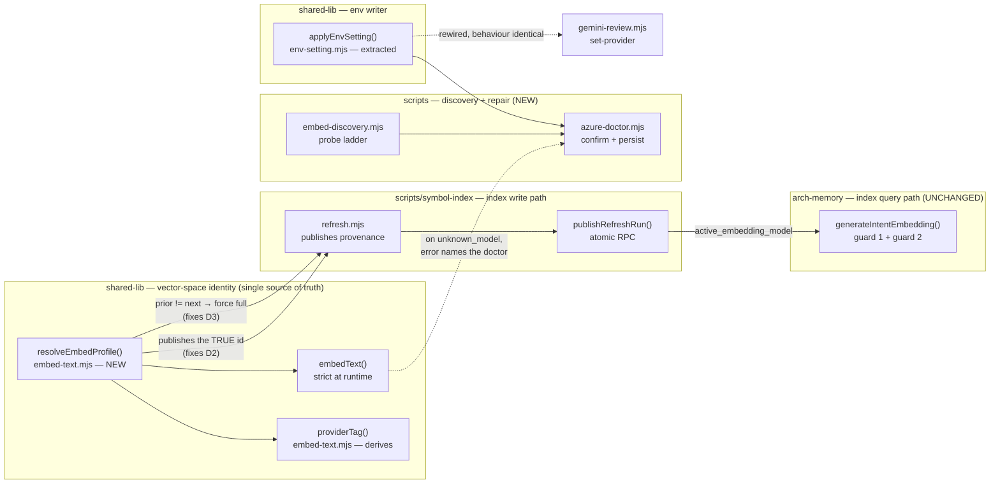
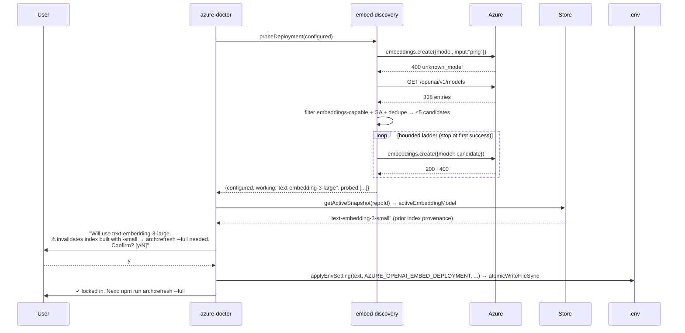

# Plan: Azure Embedding-Deployment Discovery + Provenance Truth

- **Date**: 2026-07-17
- **Status**: Complete (2026-07-17) — all 3 clusters implemented + audited; consolidated Gemini gate **APPROVE** (0 findings); live-verified against `contoso-ai-dev`. Cluster A shipped; B+C committed (`89560a5`, `3ed3084`), pending final push. Plan approved via GPT 3 rounds + Gemini APPROVE; per-cluster audits fixed 8 findings (A: H4/M4; B: H1/H2/H3/H4/M1).
- **Author**: Claude + Louis Strydom
- **Scope**: backend  ← Phase 0 (explicit `--scope=backend`; no UI surface)
- **Stack**: `js-ts` (detect-stack: `["js-ts","postgres"]`, from package.json)
- **Target domain(s)**: `shared-lib`, `scripts`, `install`, `root-scripts`
- ⚠ **Cross-domain work** — touches 4 domains; the boundary crossings are
  intentional and named in §2 (the vector-space identity is computed in
  `shared-lib`, consumed by `scripts/symbol-index`, and repaired from `scripts`).

---

## 1. Context Summary

### The ask

Under an active Azure work profile, `AZURE_OPENAI_EMBED_DEPLOYMENT` is often
unset, so `azureConfig.embedDeployment` falls back to a hardcoded guess
(`text-embedding-3-small`) that does not exist on the target resource → an
opaque `400 unknown_model` on every embedding call.

Requested shape (chosen by the user, honoured here): **try the configured
deployment → if it fails, discover what is actually in Azure by probing →
tell the user what it will use → user confirms → lock it in going forward.**

### Why "just document the env var" is not the fix

`defaults/work-profile.env.example` already documents
`AZURE_OPENAI_EMBED_DEPLOYMENT`. The user's **real** work `.env` template
omits it entirely — it carries only `AZURE_OPENAI_API_KEY`,
`AZURE_OPENAI_ENDPOINT`, `AZURE_AI_ENDPOINT`. Real `.env` files drift from the
shipped template, so the fallback path is the **normal** path, not an edge case.

### Code Trace (the evidence Phase 1 actually happened)

The failure and its blast radius were traced end-to-end, and **live-probed**
against the real resource (`contoso-ai-dev`) — not inferred:

```
config.mjs:624  buildAzureConfig() → embedDeployment = env.AZURE_OPENAI_EMBED_DEPLOYMENT
                                                       || 'text-embedding-3-small'   ← the guess
   ↓
embed-text.mjs:89   embedText() → cfg = azureConfig
embed-text.mjs:94-100  if (cfg.active) → client.embeddings.create({ model: cfg.embedDeployment })
                                          ↳ 400 unknown_model  ← the reported symptom
embed-text.mjs:50-54  providerTag() → `azure-openai:${cfg.embedDeployment}`   ← claims to be the
                                                                                vector-space identity
   ↓ (index write path)
symbol-index/refresh.mjs:154  concreteEmbedModel = resolveModel(symbolIndexConfig.embedModel)
config.mjs:423                symbolIndexConfig.embedModel = 'gemini-embedding-001'  ← NOT Azure-aware
symbol-index/refresh.mjs:459  publishRefreshRun({ activeEmbeddingModel: concreteEmbedModel })
db/rpc.mjs:283                publishRefreshRun() → publish_refresh_run() RPC (atomic)
   ↓ (index query path)
neighbourhood-query.mjs:92-102   guard 1: storedIsGemini = /gemini|^models\//.test(activeModel)
                                          storedIsAzure !== azureConfig.active → EMBEDDING_MISMATCH
neighbourhood-query.mjs:108-116  guard 2: activeModel !== azureConfig.embedDeployment → MISMATCH
```

Live probe results against `contoso-ai-dev` (2026-07-17):

| Deployment | Result |
|---|---|
| `text-embedding-3-large` | **HTTP 200 — deployed** |
| `text-embedding-3-small` (the hardcoded default) | 400 `unknown_model` |
| `text-embedding-ada-002` | 400 `unknown_model` |

### Three defects, not one

Tracing D1 surfaced two more that the fix **rides directly on**. Per the
AGENTS.md scope rule (*impact, not authorship*), they are in scope: locking in
the correct deployment is worthless if every query then fails.

| # | Defect | Evidence |
|---|---|---|
| **D1** | `embedDeployment` defaults to a guess that isn't deployed → opaque 400. | Live probe above. |
| **D2** | **Index provenance under Azure is a lie.** Vectors are made by `text-embedding-3-large`, but `refresh.mjs:459` publishes `activeEmbeddingModel = 'gemini-embedding-001'` (`symbolIndexConfig.embedModel` has no Azure branch). Guard 1 then throws `EMBEDDING_MISMATCH` on **every** Azure query — and the remedy the error names (`npm run arch:refresh`) republishes the same wrong name. **Unfixable loop.** Guard 2 is unreachable dead code. | Reproduced: `storedIsAzure=false`, `azure active=true` → `guard1 THROWS = true`, `guard2 reachable = false`. |
| **D3** | **Incremental refresh can silently mix vector spaces.** `refresh.mjs:165` defaults to `incremental`; it re-embeds only touched files but publishes the new provenance unconditionally. Change the deployment → touched symbols get `-large` vectors, untouched keep `-small`, and guard 2 then reads "consistent" because the published name matches. Latent today (D2 masks it); **activated the moment D2 is fixed and this feature starts changing the deployment.** | `refresh.mjs:165,240,459` + `publishRefreshRun` is unconditional. |

> **D2 makes an AGENTS.md claim false.** "Vector-space safety: adopting Azure on
> a Gemini-built index is **refused**; rebuild once with `npm run arch:refresh`"
> — the refusal works, but the prescribed rebuild cannot clear it. The doc needs
> correcting alongside the code (§7, Phase 6).

### Neighbourhood considered (Phase 0.5 — cloud:true, 50 candidates)

| Symbol | File | Score | Rec. | Bearing on this plan |
|---|---|---|---|---|
| `main` | `scripts/azure-limits.mjs:73` | **0.753** | `justify-divergence` | Already "probes all configured Azure deployments". Divergence justified in §2. |
| `runSetProvider` / `applyProviderSetting` | `scripts/gemini-review.mjs:1401` / `:1376` | 0.709 | review | **Prior art to extend** — a pure `.env` setting writer + atomic-write split. Reused, not reinvented (#1, #5). |
| `resolveProviderSetting` | `scripts/gemini-review.mjs:1359` | 0.709 | review | The read side of the same pattern. |
| `cmdSetActiveEmbeddingModel` | `scripts/cross-skill.mjs:1933` | 0.728 | review | Registered in the dispatcher but **no caller** — provenance is published via `publishRefreshRun`, not this. Do not wire into it. |
| `generateIntentEmbedding` | `scripts/lib/neighbourhood-query.mjs:83` | 0.698 | review | Owns both provenance guards. **Not modified** — D2's fix makes its existing guards correct rather than rewriting them. |
| `assertAzureClaudeReady` | `scripts/gemini-review.mjs:1427` | 0.703 | review | Precedent for a named-missing-vars fail-fast message. |
| `setupDatabase` | `setup.mjs:91` | 0.680 | review | Precedent: interactive choice → persist credentials. |
| `providerTag`, `embedText`, `isEmbedProviderAvailable` | `scripts/lib/embed-text.mjs:50/81/65` | 0.70–0.83 | review | The seam being changed. |

All candidates scored `review`/`justify-divergence` — none ≥0.90 (`reuse`) or
0.85–0.90 (`extend`). The one `justify-divergence` is addressed in §2.

### Past incidents to verify against (Phase 0.5c — 2 of 2)

| Incident | Status | Lesson that binds this plan |
|---|---|---|
| **INC-002** — test-suite wiped the prod DB; the only gate was "is `AUDIT_DB_TEST_URL` **set**" | `manual-verification-required` | *"An env-gate that checks 'is this variable **set**' is not a safety gate — it only proves intent, never that the target is safe."* **This is our bug class exactly**: `AZURE_OPENAI_EMBED_DEPLOYMENT` being set (or defaulted) never proved the deployment exists. The design answer is to **positively verify by probing**, not to trust presence. |
| **INC-001** — symlinked path bypassed the lexical sensitive-path classifier | `manual-verification-required` | Fail-closed on resolution errors; canonicalise a path before acting on it. Binds the `.env` writer (§8, R4). |

### What exists today vs. what's new

- **Reused**: `applyProviderSetting`'s pure-writer pattern, `atomicWriteFileSync`,
  `azureThrottle`, `createOpenAIClient({purpose:'embed'})`, both existing
  provenance guards, `refresh.mjs`'s existing "promote to full" precedent (:180).
- **New**: a probe ladder, one interactive doctor command, one shared env-writer
  module.

---

## 2. Proposed Architecture

### Key design decision — one resolved embedding profile, consumed by all THREE resolvers (#5, #1; audit H3)

**Corrected after audit H3 + verification.** D2's root cause is **three** places
independently resolving "which model built this index," and they disagree under
Azure:

- `symbol-index/embed.mjs:78-80` (the subprocess that makes the vectors) —
  **already Azure-aware**: `azureConfig.active ? azureConfig.embedDeployment :
  (ARCH_INDEX_EMBED_CONCRETE || symbolIndexConfig.embedModel)`. ✅ correct.
- `symbol-index/refresh.mjs:154` (what gets **published** as provenance) —
  `resolveModel(symbolIndexConfig.embedModel)`, **Gemini-only**. ✗ the bug.
- `embed-text.mjs::providerTag()` — `azure-openai:${cfg.embedDeployment}`. ✅ but a
  fourth private copy of the same rule.

So the vectors are made correctly while the *published* provenance is a stale
Gemini name — guard 1 then rejects every Azure query. **The fix is not to invent a
new resolver but to promote the one `embed.mjs` already has** into a single shared
function all consumers call, killing the divergence.

Critically, the audit caught a subtlety a naive `activeEmbedModelId()` would
re-introduce: a bare `opts.model || DEFAULT_GEMINI_EMBED_MODEL` on the public
branch would publish the **default** Gemini id even when a non-default
`ARCH_INDEX_EMBED_MODEL` / `symbolIndexConfig.embedModel` produced the vectors.
The resolver must take the **already-resolved concrete model** as input, not
re-apply its own default. So the seam is a small **profile object**, resolved
once, threaded to all consumers:

```js
// scripts/lib/embed-text.mjs — resolved ONCE, at the top of a refresh / embed run
export function resolveEmbedProfile({ azure = azureConfig, concreteModel } = {}) {
  if (azure.active) {
    return { kind: 'azure-openai', requestModel: azure.embedDeployment,
             provenanceId: azureProvenanceId(azure) };     // endpoint-qualified (H8)
  }
  // public: caller passes the concrete id it will actually embed with — NEVER
  // re-defaulted here (audit H3). Falling back to the default is a caller bug.
  if (!concreteModel) throw new Error('resolveEmbedProfile: concreteModel required off-Azure');
  return { kind: 'gemini', requestModel: concreteModel, provenanceId: concreteModel };
}
// A bare deployment name is NOT a unique vector space (audit H8): the same alias
// on a different AZURE_OPENAI_ENDPOINT can map to a different model/dim. The
// identity must include the resource. Normalize the endpoint to its origin so
// trailing-slash / case noise doesn't spuriously invalidate an index.
export function azureProvenanceId(azure) {
  const origin = new URL(azure.openaiEndpoint).origin.toLowerCase();  // https://contoso-ai-dev.openai.azure.com
  return `${origin}::${azure.embedDeployment}`;
}
// providerTag is a DISPLAY/log string ONLY — never persisted, never compared.
export function providerTag(profile) { return `${profile.kind}:${profile.provenanceId}`; }
```

**Canonical stored form (audit H9 — one representation, stated once).** The value
**persisted** by refresh AND **compared** by guard 2 is exactly
`profile.provenanceId` — i.e. `<endpoint-origin>::<deployment>` for Azure, or the
bare Gemini id for public. `providerTag()`'s `kind:`-prefixed string is for logs
and diagnostics **only**; it is never written to the store and never compared.
There is one persisted representation, and `refresh.mjs`, guard 2, and
`resolveEmbedProfile()` all use it. (Round 1's superseded `activeEmbedModelId()`
name does not appear anywhere in the final design — any earlier mention is
replaced by `resolveEmbedProfile()`.)

`embed.mjs`, `refresh.mjs` (publish `profile.provenanceId`), and `providerTag()`
all consume the **same** object.

**Why the Azure provenance id is endpoint-qualified (audit H8 — a design change
from round 1).** Round 1 stored the bare deployment name and claimed guard changes
were unnecessary. H8 refuted this: deployment aliases are **resource-local**, so
`text-embedding-3-large` on resource A and on resource B are different vector
spaces that would compare *equal*. Change `AZURE_OPENAI_ENDPOINT` while keeping the
alias → prior == next → D3's promotion stays incremental → **silent cross-resource
mix**, and guard 2 (`neighbourhood-query.mjs:108`) misses it identically because it
too compares only the bare name. So this plan now:

- publishes `azure-openai:<endpoint-origin>::<deployment>` as Azure provenance;
- **updates guard 2** in `neighbourhood-query.mjs` to compare the same
  endpoint-qualified id (the one file round 1 wrongly promised to leave untouched —
  §7 item 14 now covers it);
- treats **legacy bare-Azure provenance as incompatible** → one full rebuild
  (already required for D2, so no *additional* cost to existing Azure indexes).

**The Gemini/public path is unchanged.** It still stores the bare
`gemini-embedding-001`; guard 1's `/gemini|^models\//` regex still classifies it,
and the endpoint-qualified Azure form (`https://…::…`) never matches that regex.
Public users get zero format change and no rebuild.

Accepted edge (pre-existing, documented at `neighbourhood-query.mjs:86-91`): guard
1 uses a **substring** test (`/gemini|^models\//`), so an Azure deployment whose
name contains `gemini` still misclassifies — the endpoint-origin prefix does
**not** fix this (the substring still matches). It is neither improved nor worsened
here; it stays the same documented, inherited edge (§8 R5). Tightening guard 1 to
key off the `kind:` prefix is deliberately **out of scope** (a separate change to a
file this plan only minimally touches).

### Key design decision — verified-candidate selection, NOT universal discovery (#12; INC-002; audit H1)

**Honest framing (corrected after audit H1).** Azure data-plane requests route by
**deployment name**, which is tenant-chosen and need not equal the catalog model
id — `team-a-embedding-prod` is a legal deployment of `text-embedding-3-large`.
`GET /openai/v1/models` enumerates *model capabilities*, not *deployment aliases*,
and `GET /openai/deployments` 404s on this Foundry resource (data-plane key, no
control-plane listing). **So there is no way to enumerate arbitrary deployment
names.** Calling this "discovery" would over-promise: on a custom-named deployment
every catalog candidate can 400 while a working deployment exists under a name we
never tried.

What the feature actually is: **verified-candidate selection over an explicit,
ordered candidate-source contract** —

1. the **configured** deployment (`AZURE_OPENAI_EMBED_DEPLOYMENT`, or the
   `config.mjs` default) — tried first;
2. user-supplied **`--candidate <name>`** values (repeatable) — the escape hatch
   for custom-named deployments the catalog cannot see;
3. **catalog model ids** (embeddings-capable + GA) — optional candidates, useful
   precisely because Azure AI Foundry's *default* deployment name equals the model
   id (which is why the live resource's `text-embedding-3-large` was found). This
   covers the common auto-named case, not the custom-named one.

If every candidate across all three sources fails, the doctor reports the failure
and asks the user to supply `--candidate` — it never claims "no embedding
deployment exists," only "none of the tried names worked."

**Deterministic candidate policy (audit M3).** "Embeddings-capable + GA" does not
yield a *stable* order from a 338-entry response, so `selectEmbedDeployment` in
`embed-discovery.mjs` centralises a deterministic contract: (1) catalog lookup is
**always** attempted when Azure is active (not "optional"); (2) names are
normalized (trim/lower) and **deduped across all three sources**, preserving
first-source-wins order (configured → `--candidate` → catalog); (3) catalog
candidates are sorted by a **documented preference** (exact-configured-match first,
then a small pinned preference list `[3-large, 3-small, ada-002]`, then
lexicographic) so the probed subset is reproducible; (4) a **versioned static
fallback list** (same pinned order) is used when `/openai/v1/models` is non-200;
(5) the ≤6 probe budget is applied **after** dedup+sort, so it never silently drops
a higher-preference name for a server-order artefact.

**Why the catalog is candidates-only, never the source of truth.** It returns 338
entries listing **both** `3-small` and `3-large` as `embeddings: true,
generally-available` — yet only `-large` answers. Presence in the catalog is not
proof of deployment (INC-002's exact lesson: "set" ≠ "safe to use"). Every
candidate is confirmed by a real 1-token embeddings **probe** before selection.

### Key design decision — a typed probe outcome; only `unknown_model` advances the ladder (#15; audit H5)

A probe failure is **not** binary. Falling through from a *transient* failure of
the configured deployment to a different candidate would change config based on
**availability**, not on proof the original is invalid — silently repointing the
vector space because Azure was briefly throttled. `probeDeployment()` therefore
returns a **typed outcome**, and only one type advances the ladder:

| Probe result | Outcome | Ladder behaviour |
|---|---|---|
| 200 | `verified` | This candidate is selectable. |
| 400 `unknown_model` / deployment-not-found | `unsupported` | **The only case that advances** to the next candidate. |
| 401/403 auth/authz · 429 after the retry budget · timeout · DNS/TLS · 5xx · malformed | `unverified` | **Terminal.** Preserve the configured value, offer no replacement, write nothing, exit with a distinct non-zero code. |

Retry/timeout is delegated to the existing `azureThrottle` seam (Retry-After-aware);
`unverified` is only reached *after* that budget is spent. This means a throttled
or mis-authenticated resource can never be "repaired" into a different deployment —
it degrades to a loud, non-writing, non-zero exit.

### Key design decision — resilient at setup, strict at runtime (#15, #16)

The confirm gate cannot live in `embedText()`: it is per-embed and batched
(`arch:refresh` embeds in `Promise.all` batches of ≤25 — `embed.mjs:64`), and CI
has no TTY. An interactive gate there would decay into exactly the unconfirmed
auto-switching this design exists to prevent.

| Layer | Behaviour |
|---|---|
| **Setup** (`azure-doctor --fix`, TTY) | probe → discover → present → **confirm** → persist. |
| **Setup** (no TTY) | probe → discover → **print the suggestion, exit non-zero. Never writes.** |
| **Runtime** (`embedText`) | strict. No discovery, no auto-switch. On `unknown_model`, the error names the doctor command. |

### Key design decision — an explicit write-target contract; report vs persist (#5; audit H2)

The doctor writes `.env`, but "the effective Azure setting" can come from several
places (repo-root `.env`, a shell-sourced profile like `.env.work-test`, or an
**inherited** environment variable). Writing repo-root `.env` does **not** lock in
the choice if a higher-precedence source wins at runtime. The contract:

- **Mutation target is explicit**: `--env-file <path>` selects the file to write;
  its default is repo-root `.env`. The doctor writes **only** that file.
- **Detect the observable, don't claim unrecoverable provenance (audit H6→H10).**
  Rounds 1–2 tried to classify the value's *origin* (`env-file` vs
  `process-inherited`). H10 correctly killed this: verified against the code,
  dotenv here is **`override:false`** (`load-shared-env.mjs:13`), so a shell export
  **wins** over `.env` — meaning "the file contains the key" does NOT prove the
  file's value is live, and once dotenv has merged, a `process.env` value is
  **indistinguishable** from a repo-root-`.env` value. The origin claim was
  unattainable. Corrected to an **observable** contract instead:
    - `resolveEnvValue(key, {envFile})` **explicitly parses the target file** (never
      ambient dotenv) and returns `{fileValue, liveValue}` where `liveValue =
      process.env[key]`.
    - The doctor writes the target file, then compares: if `liveValue` is non-empty
      **and differs from what was just written**, it emits a warning — "a value is
      active in this process's environment that differs from what was written to
      `<file>`; if it comes from a shell export it will keep overriding `<file>`
      (dotenv is override:false). Unset the export to use the written value." This
      is 100% detectable (live value vs written value) and makes no claim it can't
      support.
  **Design lesson recorded (§8 R8): don't gate on provenance you cannot observe;
  gate on the observable difference.** This mirrors INC-002's "presence ≠ proof."
- **`--env-file` is loaded by the seam, explicitly** — the doctor does NOT rely on
  ambient `dotenv/config`. It reads and parses the chosen file on demand, so the
  write target and the value comparison use the same authoritative source.
- **Resolves the R4 ⨯ §9.3 contradiction** the audit flagged: canonicalize
  **`repoRoot`** (always exists), then the target path *within* it — do **not**
  `realpath` a `.env` that doesn't exist yet (the no-`.env` case must work). If the
  target exists, canonicalize it and fail closed if it resolves outside `repoRoot`
  (INC-001). If it doesn't exist, create it at the repo-root-joined path. Existence
  is checked on the canonical parent, never assumed.

### Key design decision — reuse the existing refresh lock; don't build a new one (#14; audit H4, right-sized)

Audit H4 correctly flags that `read prior snapshot → re-embed → publish` is not
inherently atomic: two refreshes with **different** effective deployments could
interleave and leave a mixed index. Verification shows the machinery to prevent
this **already exists** — `refresh.mjs:7`/`:90`: opening the `refresh_run` row
"acquires the per-repo running lock." So the right-sized fix is **not** a new
compare-and-swap generation token (that would be the over-engineering cliff for a
case the existing lock already covers); it is to **verify the prior-provenance read
happens inside that lock's window** and the full re-embed + publish complete before
it releases. If a gap exists between lock acquisition and the provenance read, move
the read inside it. The failure mode to document and test: concurrent same-repo
refreshes with differing deployments must serialize, last-writer-wins on a
**fully** re-embedded generation (never a partial merge). No new lock primitive.

### Key design decision — `check-setup` stays purely local (#3; audit M1)

Audit M1 is right that item 9's "read-only probe" still smuggles network latency,
credential dependence, and a remote failure mode into a fast, frequently-run,
pre-push-adjacent checker — contradicting §2's own rejection of network calls
there. Corrected: `check-setup.mjs` makes **zero** network calls. It checks only
the **local** condition — Azure profile active AND `AZURE_OPENAI_EMBED_DEPLOYMENT`
unset (i.e. the config is on the guess path) — and emits a read-only pointer to
`npm run azure:doctor -- --fix`. All online verification lives exclusively in the
doctor. (A future `--online` opt-in could delegate to the same typed probe service,
but is explicitly not built now — YAGNI.)

### CLI contract — `azure-doctor.mjs` (audit M2)

| State / flags | stdout | Prompt? | Writes? | Exit |
|---|---|---|---|---|
| Azure inactive | "profile inactive — nothing to check" | no | no | 0 |
| Report-only (no `--fix`), configured `verified` | selected deployment + probe table | no | no | 0 |
| Report-only, configured `unsupported`, a candidate `verified` | suggestion: "run `--fix` to lock in `<name>`" | no | no | **3** (actionable) |
| Report-only, all `unverified` (transient) | the typed failure + "not a config problem" | no | no | **4** (unverified) |
| Report-only, all `unsupported` | "no tried candidate worked; supply `--candidate`" | no | no | **5** (none found) |
| `--fix`, TTY, ≥1 `verified` | present + provenance-invalidation warning | **yes** | on `y` | 0 / 130 (declined) |
| `--fix`, **non-TTY** | prints the suggestion | no | **no** | **6** (refuses to auto-write) |
| `--json` (with or without `--fix`) | one machine-readable object; **never prompts** | no | no | mirrors the matrix |
| (no "multiple verified" row — see H11 resolution below) | — | — | — | — |

**Non-overloaded option grammar (audit H7).** Round 1 conflated two operations on
`--candidate` and left the automation-mutation policy self-contradictory. Corrected:

- **`--candidate <name>` (repeatable)** — an *ordered probe-source input* only. It
  adds names to the candidate ladder (for custom deployment aliases the catalog
  can't enumerate). It never selects.
- **The ladder stops at the first `verified` candidate — there is no
  "multiple verified" state (audit H11).** Round 2 introduced a `--select`
  disambiguation that contradicted "stop at first success" (you can't know a
  second candidate would verify if you stopped). Resolved by keeping the
  first-wins rule as the *single* selection mechanism: candidates are probed in
  the deterministic order (configured → `--candidate` in given order → sorted
  catalog), and the **first `verified` wins, full stop.** The user controls the
  outcome by ordering `--candidate`, not by a separate selector. `--select` is
  **removed** from the grammar; the "multiple verified" matrix row and its exit
  code 2 are gone.
- **One automation policy, stated once: `--json`/non-TTY NEVER writes. Full stop.**
  Round 1's "automation can mutate with a confirmation flag" clause is **removed** —
  it contradicted the matrix. Automation that wants to lock a value in does so the
  normal way (set `AZURE_OPENAI_EMBED_DEPLOYMENT` in its own env/secrets); the
  doctor's job in `--json` is to *report the verified name and exit code*, not to
  write. This makes "does it write?" a function of TTY alone — no flag can override
  it — which is the safe, testable invariant.

Exit codes are stable and distinct so a caller can tell "fixable" (3) from
"transient" (4) from "unknown name" (5) from "refused in CI" (6). (Exit code 2 and
the ambiguous state are removed with `--select` per H11 — first-verified always
wins.)

**The provenance-invalidation warning is advisory and best-effort (audit M7).** The
index-snapshot read (to tell the user "this invalidates your `-small` index") is
**not** a precondition for writing. If the store is unavailable, the RPC fails, the
snapshot is malformed, or the repo identity is missing, the doctor logs "couldn't
read the current index provenance — if an Azure index exists, rebuild it with
`npm run arch:refresh -- --full` after this change" and **proceeds with the write**
(the deployment fix is independently valid). It never blocks a healthy config fix on
an optional advisory read, and never claims a specific invalidation it couldn't
confirm.

### Justified divergence from `azure-limits.mjs` (neighbourhood: 0.753)

`azure-limits.mjs::main` already probes every configured Azure deployment, so the
memory flags overlap. A new command is still correct:

- **Different purpose**: `azure-limits` is a **read-only quota report** ("what is
  our TPM/RPM?"). The doctor **mutates config** (writes `.env`). Folding an
  interactive, file-writing repair into a read-only diagnostic breaks
  single-responsibility (#3) and makes a safe command have side effects.
- **Different failure semantics**: `azure-limits` prints `✗` per row and carries
  on (all four rows are independent). The doctor must halt and prompt.
- **Shared logic is extracted, not duplicated** (#1): the probe ladder lives in
  `scripts/lib/azure/embed-discovery.mjs`; `azure-limits` may later consume it.

Rejected alternative — folding into `check-setup.mjs`: it is a fast, broad,
frequently-run checker (pre-push). Adding network probes + interactive `.env`
mutation would make it slow and side-effecting. A **read-only** pointer there is
in scope (Phase 6); the repair is not.

### Module graph



### Data flow — `azure-doctor --fix`



---

## 6. Sustainability Notes

### Right-sizing gate (new structure IS introduced → gate fires)

- **Band-aid extreme** — change the default from `text-embedding-3-small` to
  `text-embedding-3-large` in `config.mjs:624`. Fixes *this* resource; the next
  Azure tenant with a different deployment name hits the identical opaque 400.
  Leaves D2/D3 untouched. **The root cause (we guess, then never verify) survives.**
- **Over-engineered extreme** — a general provider-capability-discovery framework:
  cached capability registry, per-purpose discovery for GPT/Claude/embed alike,
  runtime auto-healing with fallback chains, a new persisted capability artefact.
  **No current requirement** — only the embed path actually fails today, and
  runtime auto-healing is precisely the silent-provenance-switch we must prevent.
- **Chosen — and the current requirement each piece serves**:
  - `resolveEmbedProfile()` — D2 is reproduced, not hypothetical: Azure arch-memory
    is unusable today.
  - promote-to-full on provenance change — D3 activates the moment this feature
    changes a deployment; shipping the change without it *creates* the corruption.
  - probe ladder — the catalog demonstrably lies; there is no other way to know.
  - one doctor command — the user asked for confirm-and-lock-in.
  - `applyEnvSetting` extraction — a second `.env` writer would be the duplication
    (#1); the pattern already exists and is proven.
  - **Explicitly NOT built**: GPT/Claude deployment discovery (they are configured
    and working — YAGNI), runtime auto-heal (unsafe by design), a capability cache
    (a ≤6-call ladder run once at setup needs no cache).

### Manual vs scripted

Hand edits throughout — ~15 files, each a distinct judgment-heavy change. No
codemod (the over-engineering cliff for irregular work).

### Assumptions that could change

| Assumption | If it changes |
|---|---|
| Gemini model ids always contain `gemini`/`models/` (guard 1's basis) | An Azure deployment named `gemini-*` misclassifies. Pre-existing; documented, not introduced (§8 R5). |
| `/openai/v1/models` stays available on Foundry | Ladder degrades to a static candidate list; `probeDeployment` still works. Seam: `listEmbeddingCandidates()` is separate from `probeDeployment()`. |
| One embedding deployment per resource | If several are wanted per-repo, the env var already scopes per-repo. |
| `.env` is the right home for the locked-in value | It is where the var already belongs; a second artefact would be a second source of truth. |

### Extension points deliberately built in

`probeDeployment(client, name)` and `listEmbeddingCandidates(client)` are separate
exports, so a future GPT/Claude doctor reuses the ladder without touching the
embed path. Not wired now (YAGNI) — just not designed shut.

---

## 7. File-Level Plan

| # | File | Intent | Purpose | Why this file (principle) |
|---|---|---|---|---|
| 1 | `scripts/lib/embed-text.mjs` | modify | Add `resolveEmbedProfile()` (promoted from `embed.mjs:78`'s Azure-aware logic); `providerTag(profile)` derives from it; **no re-defaulting** off-Azure (H3). Runtime `unknown_model` error names the doctor. | Single source of truth (#5); the identity belongs with the router that uses it. |
| 2 | `scripts/symbol-index/refresh.mjs` | modify | Publish `profile.provenanceId` instead of `resolveModel(symbolIndexConfig.embedModel)` (**D2/H3**). Promote incremental→full when prior provenance ≠ next, **inside the existing per-repo running lock** (**D3/H4**). | Fixes the write path at its source (#5); reuses the lock (:7) + promote-to-full precedent (:180). |
| 2b | `scripts/symbol-index/embed.mjs` | modify | Replace the inline `azureConfig.active ? … : …` (`:78-80`) with a `resolveEmbedProfile()` call so the subprocess and the publisher share one resolver (**H3**). | Kills the third divergent resolver (#1). |
| 3 | `scripts/lib/env-setting.mjs` | create | `applyEnvSetting(text, key, value, {comment})` → `{text, changed}`. Pure; no IO; **no blank-line reformat by default** (R4). Extracted from `applyProviderSetting`. | DRY (#1); testable pure core (#11). |
| 4 | `scripts/gemini-review.mjs` | modify | Rewire `applyProviderSetting` onto `applyEnvSetting` (opt-in reformat flag preserves its current output); keep the export + behaviour identical. | DRY (#1); backward compat (#18). |
| 5 | `scripts/lib/azure/embed-discovery.mjs` | create | `probeDeployment()` (**typed outcome** — H5), `listEmbeddingCandidates()`, `selectEmbedDeployment({configured, candidates, catalog})` (**candidate-source contract** — H1). Client injected. | Modularity (#3); testable without network (#11). |
| 6 | `scripts/azure-doctor.mjs` | create | **Thin process adapter** (H6/H7/M5) around an injected `runAzureDoctor(options, deps)` — deps = {io, isTTY, discovery, resolveEnvValue, snapshotReader, writeFile}. CLI per the §2 table: `--fix`, `--json`, `--candidate` (repeatable probe source; first-verified wins — no `--select`), `--env-file`, `--selfcheck-relocation`. | Separation from read-only `azure-limits` (#3); injectable so the matrix is unit-testable (#11). |
| 6b | `scripts/lib/env-setting.mjs` | (see #3) | Also exports `resolveEnvValue(key, {envFile})` → `{value, origin, precedence}` (H6) — reads the file, never infers origin from `process.env`. | Origin truth (#12). |
| 7 | `scripts/lib/sync-path-map.mjs` | modify | Register `azure-doctor.mjs`. | The layout's single source of truth (AGENTS.md). |
| 8 | `package.json` | modify | `"azure:doctor": "node scripts/azure-doctor.mjs"`. | Discoverability. |
| 9 | `scripts/lib/config.mjs` | modify | **One-line M6 fix at the source.** Verified: today's `(env.X || 'default').trim()` maps absent/`''` → the guess but **whitespace → `''`** (an empty deployment name → 400, a *third* broken outcome). Change to `(env.X || '').trim() || 'text-embedding-3-small'` so absent/empty/whitespace **all** collapse to the one default path. Keeps the default *value* (user chose resilience over fail-loud); only removes the whitespace footgun. | Single source of truth for the predicate (#5). |
| 9b | `scripts/check-setup.mjs` | modify | **Purely local** check (M1): Azure active + `(AZURE_OPENAI_EMBED_DEPLOYMENT || '').trim() === ''` (the **same** predicate as item 9 — absent/empty/whitespace) → read-only pointer to `npm run azure:doctor -- --fix`. **Zero network calls; no checker/runtime divergence** (M6). | Checker mirrors config exactly, by construction. |
| 10 | `tests/embed-provenance.test.mjs` | create | `resolveEmbedProfile`/`providerTag` per profile; **non-default public model** publishes that model, not the default (H3); the D2 regression (published id == id that made the vectors); guard-2 reachability. | Tier 1 (deterministic seam). |
| 11 | `tests/azure-embed-discovery.test.mjs` | create | Injected client: configured-wins; `--candidate` fallback; catalog-candidates case; **typed outcomes** — `unknown_model` advances, auth/throttle/5xx are terminal `unverified` and never advance (H5); all-`unsupported` → none-found; bounded call count. | Tier 1. |
| 12 | `tests/env-setting.test.mjs` | create | Insert/replace/remove; **never reorders or drops unrelated lines**; preserves secrets verbatim; no reformat by default; CRLF preserved. | Tier 1 + R4. |
| 13 | `tests/refresh-provenance-promotion.test.mjs` | create | Provenance change forces full; unchanged stays incremental; the read+promote happens inside the running lock (**D3/H4**). | Tier 1. |
| 13b | `scripts/lib/neighbourhood-query.mjs` | modify | **Guard 2 (`:108`) compares the endpoint-qualified provenance id, not the bare deployment name (H8).** The one file round 1 wrongly promised to leave untouched. Guard 1 unchanged. | Makes the query guard match the endpoint-qualified identity (#5). |
| 13c | `tests/azure-doctor.test.mjs` | create | `runAzureDoctor` with injected deps — **every §2 matrix row**: inactive, verified/unsupported/unverified report exits, TTY confirm/decline, non-TTY refusal, `--json` never-writes, first-verified-wins, live-value-differs warning (H10), advisory-snapshot-read failure still allows write (M7). | Tier 1 — the CLI state machine is where the contract lives. |
| 14 | `AGENTS.md` | modify | Correct the false "rebuild once with `arch:refresh`" claim; document the doctor, the endpoint-qualified provenance, and the promote-to-full rule. | The claim is currently untrue under Azure. |
| 15 | `docs/runbooks/azure-work-profile.md` | modify | Doctor recipe; the deployment-name-is-vector-space-identity note. | Operational detail belongs in the runbook, not AGENTS.md. |

### 7b. Implementation Phases (Gate 1: ~19 files, 4 domains, a dependency chain → fires)

- **Phase 1 — Provenance truth (D2/H3/H8)**: `resolveEmbedProfile()` becomes the one
  resolver all sites consume; Azure provenance is endpoint-qualified; refresh
  publishes `profile.provenanceId`; guard 2 compares the same id. Files:
  `scripts/lib/embed-text.mjs` (modify), `scripts/symbol-index/embed.mjs` (modify),
  `scripts/symbol-index/refresh.mjs` (modify),
  `scripts/lib/neighbourhood-query.mjs` (modify),
  `tests/embed-provenance.test.mjs` (create).
- **Phase 2 — Refresh safety (D3/H4)**: promote incremental→full when the provenance
  about to be published differs from the prior active snapshot's, with the read+promote
  inside the existing per-repo running lock. Files:
  `scripts/symbol-index/refresh.mjs` (modify),
  `tests/refresh-provenance-promotion.test.mjs` (create).
- **Phase 3 — Shared env writer**: extract the pure writer; rewire gemini-review.
  Files: `scripts/lib/env-setting.mjs` (create), `scripts/gemini-review.mjs` (modify),
  `tests/env-setting.test.mjs` (create).
- **Phase 4 — Candidate selection + typed probe**: `probeDeployment` (typed
  outcome, H5), candidate-source contract (H1), client injected. Files:
  `scripts/lib/azure/embed-discovery.mjs` (create),
  `tests/azure-embed-discovery.test.mjs` (create).
- **Phase 5 — Doctor CLI**: injectable `runAzureDoctor` + thin adapter; confirm +
  persist + provenance warning + non-TTY refusal + origin-refusal. Files:
  `scripts/azure-doctor.mjs` (create), `tests/azure-doctor.test.mjs` (create),
  `scripts/lib/sync-path-map.mjs` (modify), `package.json` (modify).
- **Phase 6 — Wiring + docs**: runtime error points at the doctor; read-only
  check-setup warning; correct the false AGENTS.md claim. Files:
  `scripts/check-setup.mjs` (modify), `AGENTS.md` (modify),
  `docs/runbooks/azure-work-profile.md` (modify).

**Close-out (not a phase)**: `npm test` · `npm run context:check` · empirical
verify per §9.4.

---

## 8. Risk & Trade-off Register

| # | Risk | Mitigation |
|---|---|---|
| **R1** | Phase 1 changes what every Azure index publishes. An Azure index built *before* this lands stores `gemini-embedding-001` and will now correctly fail guard 1 → forces one full rebuild. | **Accepted and correct.** Those vectors are Azure-made but Gemini-labelled — the index is already unusable (D2). The rebuild is the *first* time the remedy actually works. Call it out in the AGENTS.md note. |
| **R2** | Probing costs real API calls on a rate-limited corporate resource (100K TPM). | Ladder is bounded (**≤6**: 1 configured + ≤5 GA candidates), 1-token `"ping"` input, stops at first success, runs through `azureThrottle` (existing concurrency + Retry-After seam). Setup-time only, never in `embedText`. |
| **R3** | Interactive confirm decays to auto-switch in CI. | Non-TTY **never writes** — prints the suggestion, exits non-zero. Explicitly tested. |
| **R4** | The doctor rewrites `.env`, a **secret-bearing** file — clobber/reorder/permissions risk. | Line-based in-place edit (proven by `applyProviderSetting`); `atomicWriteFileSync` (temp+rename). Tests assert unrelated lines and secret values survive byte-identical. **Design change vs the prior art**: `applyProviderSetting` collapses blank runs (`.replace(/\n{3,}/g,'\n\n')`) — `applyEnvSetting` must **not** reformat a user's file; that normalisation stays behind an opt-in flag so gemini-review's output is unchanged. Resolve `.env` via realpath before writing (INC-001: canonicalise before acting; fail closed if it escapes the repo root). |
| **R5** | Guard 1 misclassifies an Azure deployment named `gemini-*`. | **Pre-existing**, documented at `neighbourhood-query.mjs:86-91`; not introduced here. Inherited knowingly; a rename would be the fix if it ever bites. |
| **R6** | `/openai/v1/models` may not exist on every Foundry/AOAI shape. | `listEmbeddingCandidates` degrades to a static candidate list on non-200; `probeDeployment` is independent and still authoritative. |
| **R8** | The doctor's persistence promise could over-claim (write a file a shell export will shadow). | dotenv is `override:false` (verified) so provenance is unrecoverable — the doctor makes **no** origin claim; it writes the target and warns only on the **observable** live-value≠written-value difference (H10). Design lesson: gate on the observable, never on provenance you can't establish. |
| **R7** | Scope creep: D2/D3 are pre-existing and not what the user asked for. | Held to the AGENTS.md **impact** test: D2 makes the feature useless (every query fails) and D3 is *activated* by it. Neither is deferred on authorship grounds. GPT/Claude discovery, runtime auto-heal, and the capability cache **are** deferred — the new code does not depend on them. |

### Deliberately deferred (with the independence that makes it honest)

- **GPT/Claude deployment discovery** — same class, but those deployments are
  configured and verified working (`azure:limits` is green on all four rows). The
  embed path does not call them.
- **Runtime auto-heal in `embedText`** — deferred *because it is wrong*, not
  because it is hard: it is the unconfirmed provenance switch this design exists
  to prevent.
- **Removing the `text-embedding-3-small` default from `config.mjs`** — the user
  explicitly chose resilience over fail-loud. The default stays as the first probe
  candidate; discovery handles its failure. `config.mjs` is therefore **unchanged**.

---

## 9. Testing Strategy

Per the AGENTS.md testing doctrine. All four suites are **Tier 1 (deterministic
seams) → test-first**; none is Tier 3, but §9.4 is non-negotiable.

### 9.1 Unit / deterministic (test-first)

- **`embed-provenance`** — `resolveEmbedProfile()` returns the endpoint-qualified
  Azure id and the Gemini id when inactive; `providerTag()` composes from it. **The D2
  regression test**: the id published by refresh must equal the id that produced
  the vectors (the assertion that fails on today's code). Guard 2 reachable under
  Azure.
- **`azure-embed-discovery`** — injected client, no network: configured-wins (1
  call, no ladder); configured-fails → first working candidate; **the catalog-lies
  case** (catalog lists `3-small` GA, probe 400s, ladder continues to `-large`);
  all-fail → structured result, no throw; **bounded call count ≤6**.
- **`env-setting`** — insert when absent, replace when present, remove on clear;
  unrelated lines and secret values byte-identical; no blank-line reformat by
  default; CRLF preserved.
- **`refresh-provenance-promotion`** — prior ≠ next → mode forced to `full`; prior
  == next → stays incremental; no prior → existing auto-full path unchanged.

### 9.2 Regression guards (existing suites must stay green)

- `tests/openai-client.test.mjs` — the **opt-in invariant**: no Azure env ⇒
  byte-identical construction. Phase 1 touches a shared path; this is the guard.
- Consumer-sync: `tests/sync-path-map.test.mjs` + `tests/relocation-guard.test.mjs`
  (Tier 3 — `azure-doctor.mjs` must carry `--selfcheck-relocation`).

### 9.3 Edge cases

Azure active + no `.env` file · `.env` without the var · var present but empty ·
non-TTY `--fix` · Azure inactive (doctor exits 0 with "profile inactive", matching
`azure-limits`) · catalog 200 with zero embeddings-capable entries · every
candidate 400 · `.env` is a symlink (R4).

### 9.4 Pre-ship empirical verify (**mandatory** — AGENTS.md)

This asserts against a live runtime, so a green suite is not sufficient. Before
Done, against the real resource:

1. `set -a; . ./.env.work-test; set +a` then `node scripts/azure-doctor.mjs`
   (report-only) → must correctly identify `-large` as working and the configured
   default as broken.
2. `--fix` on a **copied** `.env` → confirm → assert the var is written, secrets
   survive, nothing reordered.
3. **Audit the success path** (doctrine: *"can this return green without having
   actually checked anything?"*): force every probe to fail → the doctor must NOT
   report success or write. Force a network error → must not read as "verified, 0
   problems".
4. Non-TTY: `node scripts/azure-doctor.mjs --fix < /dev/null` → prints suggestion,
   **exits non-zero, writes nothing**.
5. End-to-end D2: with `-large` locked in, `npm run arch:refresh -- --full` then a
   `get-neighbourhood` query → must return records instead of `EMBEDDING_MISMATCH`.
   **This is the proof D2 is actually fixed** and cannot be established by unit
   tests.

---

## 11. Execution Clustering (Gate 2: 3 clusters → fires)

- **Cluster A** — Phases 1–2 — fix-gate: `yes`
  - Coupling: both own the **index's vector-space identity**. Phase 2's
    promote-to-full decision compares the value Phase 1 makes truthful; landing 1
    without 2 lets a deployment change silently mix vector spaces. The seam
    (`resolveEmbedProfile()` → `embed.mjs` + `publishRefreshRun`, inside the
    per-repo running lock) must be audited as one unit.
  - author-tier: `frontier`
- **Cluster B** — Phases 3–5 — fix-gate: `yes`
  - Coupling: Phase 5 consumes Phase 3's writer and Phase 4's prober directly; the
    doctor is the only caller of both. Auditing them apart would hide the
    confirm→persist seam where the non-TTY refusal and the `.env` safety live.
  - author-tier: `standard`
- **Cluster C** — Phase 6 — fix-gate: `final`
  - Coupling: pure wiring + docs over the two landed clusters; the runtime error
    message and the AGENTS.md correction can only be written once A and B exist.
  - author-tier: `economy`
- **Final gate**: mandatory consolidated Gemini review over the union diff of
  Clusters A+B+C.

Partition check: Phases 1–6 each appear exactly once; close-out is outside the
phase set.

---

## Audit Trail

### Round 1 (GPT, `--mode plan`) — NEEDS_REVISION, H:5 M:2 L:0 — all fixed

| ID | Finding | Resolution |
|---|---|---|
| H1 | Catalog can't enumerate tenant-custom deployment names — "discovery" over-promises. | Reframed §2 as **verified-candidate selection** over an explicit source contract (configured → `--candidate` → catalog); catalog is candidates-only; honest "none tried worked" reporting. |
| H2 | `.env` write target undefined; effective value may come from inherited env / another file; R4 `realpath` contradicts the no-`.env` §9.3 case. | Added **write-target contract** (`--env-file`, default repo-root `.env`) + effective-origin honesty (report, don't falsely claim persistence) + canonicalize `repoRoot` not a non-existent `.env`. |
| H3 | `activeEmbedModelId` re-defaulting would publish the default Gemini id for a non-default embed model; three sites resolve independently. | Verified `embed.mjs:78` is **already** Azure-aware; refresh publishes a different value. Replaced with **`resolveEmbedProfile()`** (concrete model passed in, never re-defaulted) consumed by all three sites; regression test on a non-default public model. |
| H4 | `read → re-embed → publish` not atomic; interleaving refreshes with different deployments mix the index. | Verified an existing **per-repo running lock** (`refresh.mjs:7`); right-sized to "read+promote inside that lock, full re-embed, last-writer-wins" — **no new CAS token** (over-engineering avoided). |
| H5 | Probe fall-through doesn't distinguish `unknown_model` from auth/throttle/timeout/5xx → config changed on availability, not proof. | Added a **typed probe outcome**: only `unknown_model` advances; auth/throttle/transport/5xx are terminal `unverified` (preserve config, no write, distinct exit). |
| M1 | `check-setup` "read-only probe" still adds network latency/credential/failure to a fast local checker. | `check-setup` made **purely local** (zero network); it checks only the local unset-var condition and points at the doctor. |
| M2 | `azure-doctor` flags listed without an option grammar / exit-code / JSON contract. | Added the **CLI contract table** (per-state stdout/prompt/write/exit; `--json` non-interactive by definition; distinct exit codes 2–6). |

No findings were dismissed or rebutted — all 5 HIGH + 2 MEDIUM were valid and folded in. Two (H3, H4) corrected the plan using live-verified code facts.

### Round 2 (GPT, R2+ with ledger) — NEEDS_REVISION, H:3 M:3 L:0 — all fixed

HIGH 5→3 (−40%, still real design bugs — not rigor pressure — so R3 warranted). Three of six corrected flaws in round 1's own fixes.

| ID | Finding | Resolution |
|---|---|---|
| H6 | Origin of the effective env var can't be recovered from `process.env` (Node keeps only the value); module-level dotenv loads before CLI parsing — so R1's "compute effective origin" was unimplementable. | Added a **`resolveEnvValue(key,{envFile})` seam** that establishes origin by **parsing the file itself** (`env-file`/`process-inherited`/`default`); the doctor refuses to claim persistence when the value is `process-inherited`. |
| H7 | `--candidate` overloaded (probe-source vs selection); undefined confirmation flag; matrix contradiction (non-TTY writes nothing vs "automation can mutate"). | Split into **`--candidate`** (ordered probe source) + **`--select`** (disambiguation); **removed** the automation-mutation clause — `--json`/non-TTY **never writes**, making "writes?" a function of TTY alone. |
| H8 | A bare Azure deployment name is not a unique vector space — same alias on a different endpoint is a different space, so D3's compare-equal stays incremental and silently mixes; guard 2 has the same hole. | Azure provenance is now **endpoint-qualified** (`azure-openai:<endpoint-origin>::<deployment>`); **guard 2 updated** to compare it; legacy bare-Azure provenance = one rebuild (already required by D2). Corrects R1's "neighbourhood-query not modified" claim. |
| M3 | Catalog probing had no deterministic order / static fallback → probes an arbitrary subset of 338. | Centralised **deterministic candidate policy** in `embed-discovery.mjs`: always-on catalog, cross-source dedup, documented preference sort, versioned static fallback, budget applied after sort. |
| M4 | `check-setup` condition "unset" misses empty/whitespace, which also hit the broken default. | Uses the **same absent/empty/whitespace predicate** as config resolution; deterministic tests for all states. |
| M5 | No test for `azure-doctor.mjs` as the composed unit (parse + TTY + select + origin + write + JSON + exit codes). | Doctor is a **thin adapter around injected `runAzureDoctor(options, deps)`**; `tests/azure-doctor.test.mjs` covers every matrix row. |

No findings dismissed or rebutted — all valid. R2 net-added `neighbourhood-query.mjs` and `azure-doctor.test.mjs` to the plan.

### Round 3 (GPT, R2+) — NEEDS_REVISION, H:3 M:2 L:0 — GPT loop STOPPED here

**Stop decision (convergence rule): HIGH plateaued 5→3→**3**.** R3's findings were
internal-consistency defects introduced by R2's own edits (the plan contradicting
itself), not net-new design risk — the documented stop signal. All five were fixed
as a **consolidation pass** to make the plan self-consistent; no new round is
warranted (GPT max is 3, and no concrete net-new *design* bug remains).

| ID | Finding | Resolution |
|---|---|---|
| H9 | Two serialized provenance forms (`azureProvenanceId` bare vs `providerTag` prefixed); dangling `activeEmbedModelId` refs. | Pinned **one canonical stored form** = bare `profile.provenanceId`; `providerTag` is display-only, never persisted/compared; removed superseded API name. |
| H10 | `resolveEnvValue` still can't uphold the origin claim — dotenv `override:false` means a shell export shadows the file, and merged `process.env` is indistinguishable from `.env`. | Dropped the unattainable origin classification; the doctor now compares **live value vs written value** and warns only on the observable difference (R8 design lesson). |
| H11 | "Stop at first verified" contradicts "multiple verified → `--select`". | Removed `--select` and the multiple-verified state entirely; **first-verified-wins** is the single selection mechanism (user orders `--candidate`). |
| M6 | Whitespace `AZURE_OPENAI_EMBED_DEPLOYMENT` mishandled (verified: today it → `''` → 400, a third broken outcome); checker/runtime would diverge. | One-line **config fix** `(env.X||'').trim() || default` collapses absent/empty/whitespace; checker uses the identical predicate — no divergence. |
| M7 | No CLI behavior for a failed advisory snapshot read. | Made the provenance-invalidation warning **advisory/best-effort**: read failure logs a generic rebuild hint and **still writes**; never blocks a valid config fix. |

Two findings (H10, M6) were verified against the code before fixing (dotenv
`override:false`; the whitespace→`''` trim result). No findings dismissed.

**GPT audit trail: R1 H5→R2 H3→R3 H3, all fixed. Proceeding to the mandatory
Gemini final gate.**

### Gemini Final Gate (MANDATORY) — **APPROVE**

`gemini-pro-latest`, `--mode plan`, over the full 3-round GPT transcript (18
findings, all fixed). **Verdict: APPROVE — 0 new findings, 0 wrongly dismissed**
(119s). No CONCERNS, no re-review round needed. Plan is implementation-ready.

**Audit summary**: GPT R1 H5 M2 → R2 H3 M3 → R3 H3 M2, all 18 fixed (5 corrected
flaws in earlier-round fixes; 4 verified against live code before fixing). Gemini
APPROVE on the first gate round. Status → Approved.
