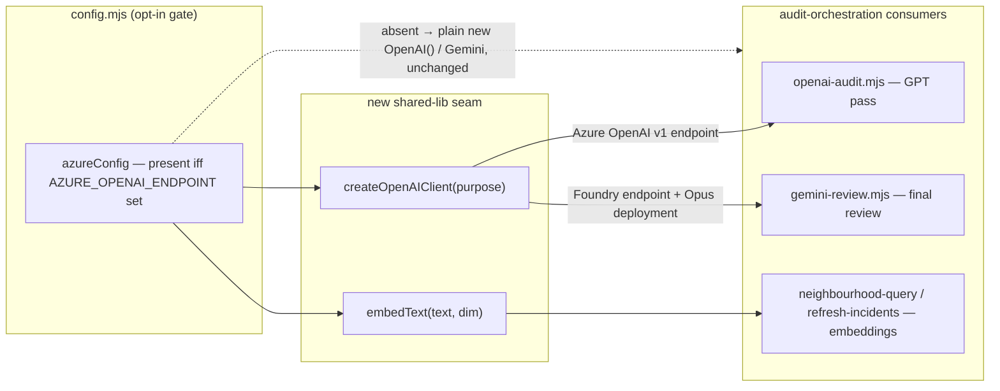

# Plan: Azure AI Foundry Work Profile

- **Date**: 2026-06-04
- **Status**: Complete
- **Author**: Claude + Louis
- **Scope**: backend

> **One-line intent**: let the *same* bundle run unchanged in a corporate
> Azure environment (restricted models: GPT-5.3-chat + Opus 4.6 via Foundry,
> Azure-OpenAI embeddings, local Postgres) so fixes made here stop drifting
> from the work repo. **The Azure path is fully opt-in; with no Azure env
> vars set, behaviour is byte-identical to today.**

### Audit trail

- **GPT plan audit** — R1: H5 M6 L1 (12 findings, all accepted + fixed). R2:
  H4 M2 (6 findings — 3 were self-contradictions my R1 edits introduced, all
  reconciled). Stopped GPT at R2.
- **Gemini final gate** — R1: 2 (zodResponseFormat reuse; api-version=preview
  precedent — 1 refuted-with-evidence). R2: 3 (one genuine design bug —
  embedding vector-space mismatch — earned a 3rd round per the exception). R3:
  3, all **implementation-completeness / known-unverifiable Foundry detail**.
- **Stop decision** — stopped after Gemini R3: findings decayed from design
  defects to completeness items that the **`/cycle` code audit verifies against
  real code** (the correct artifact). All R3 items folded into the plan as
  captured work, not left open. The Foundry endpoint route remains
  `manual-verification-required` against the live corporate endpoint.

### Code-audit + consolidated-gate trail

- **Cluster A** — R1 H4/M13 → R2 H2/M4 → in-scope HIGHs resolved (6 hardenings);
  residual HIGHs were Cluster C deliverables + 1 inert-kit false positive.
- **Cluster B** — 27 findings; fixed 2 real bugs (`redactSecrets().text` →
  `undefined` from the wrong redactor module; Anthropic Azure-key precedence)
  + write-path provenance + cache-key digest; deferred pre-existing items.
- **Consolidated Gemini gate** (union diff, mandatory) — R1: 2 HIGH (provenance
  regex + profile-switch re-embed) → R2: 1 HIGH (intra-Azure deployment swap) +
  1 MEDIUM. Resolutions: provider regex inverted to robust Gemini-detection;
  intra-Azure exact-deployment guard added; profile-switch re-embed already
  covered by `refresh-incidents.mjs` `modelChanged`. **Stopped at the R2 cap.**

### Accepted scope boundary (documented debt)

**Arch-index LLM summarizer (`summarise.mjs` / `summarise-domains.mjs`) is NOT
Azure-routed.** It still constructs `new Anthropic({apiKey: ANTHROPIC_API_KEY})`
directly (AGENTS.md "Pending migration"). Under an Azure-only profile with no
public Anthropic key, `arch:refresh` would emit null summaries. This is a **true
scope boundary**, not a band-aid: (1) the plan scoped the three *audit-loop* LLM
entry points + embeddings, not the arch-index summarizer; (2) the fix needs a
model-availability decision the user must make — their Azure exposes Opus + GPT
but **no Haiku**, so the summarizer would need to re-route to Opus (cost) or a
GPT deployment, which is a separate design choice. **Revisit trigger**: when
arch-memory is wanted on the Azure work profile — route `summarise*.mjs` through
`createAnthropicClient({baseURL})` / `createOpenAIClient({purpose:'foundry-claude'})`
and pick the summary model.

---

## 1. Context Summary

- **Scope / stack**: backend · `js-ts` (+ `postgres`) · ESM. No UI surface →
  `--no-persona --no-uxlock`.
- **Target domain(s)**: `audit-orchestration`, `shared-lib`.
  ⚠ **Cross-domain** — touches the LLM-client seam (`shared-lib`) and its
  consumers (`audit-orchestration`); the boundary crossing is intentional
  (the consumers must adopt the new factory).
- **Security incidents**: none matched the target paths (`records: []`).

### What exists today

| Concern | Today | Where |
|---|---|---|
| GPT client | `new OpenAI({ apiKey })` → `api.openai.com` | [openai-audit.mjs:3204](../../scripts/openai-audit.mjs#L3204) |
| GPT call | `openai.responses.parse()` + `zodTextFormat()` (one call site) | [openai-audit.mjs:536](../../scripts/openai-audit.mjs#L536) |
| Final reviewer | Gemini, **already** falls back to Claude Opus when `GEMINI_API_KEY` absent | [gemini-review.mjs:792](../../scripts/gemini-review.mjs#L792) |
| Claude factory | `createAnthropicClient()` — `CLAUDE_BACKEND` switch, redaction, cache | [anthropic-client.mjs:155](../../scripts/lib/anthropic-client.mjs#L155) |
| Embeddings | Gemini `embedContent` (2 active call sites) | [neighbourhood-query.mjs:99](../../scripts/lib/neighbourhood-query.mjs#L99), [refresh-incidents.mjs:128](../../scripts/security-memory/refresh-incidents.mjs#L128) |
| Model resolution | sentinels + `DEPRECATED_REMAP` (`gpt-5.3 → latest-gpt`) + live catalog | [model-resolver.mjs](../../scripts/lib/model-resolver.mjs) |
| DB DSN | `AUDIT_DB_URL` only; legacy `SUPABASE_AUDIT_*` fail-fast; `AUDIT_POSTGRES_SCHEMA` already aliased | [db/client.mjs:76](../../scripts/lib/db/client.mjs#L76) |
| Postgres setup | connect + verify extensions only — **never installs** | [setup-postgres.mjs](../../scripts/setup-postgres.mjs) |

### Patterns reused vs new (Neighbourhood considered)

The arch-memory query surfaced **existing Azure prior art** in the unported
"corporate kit": [`docs/plans/security/files/scripts/lib/security/azure-embed.mjs`](../plans/security/files/scripts/lib/security/azure-embed.mjs)
(similarity **0.76 → reuse/justify-divergence**). Its client construction is
the **canonical Azure-OpenAI v1 pattern** we will lift verbatim (superseded for
`gpt`/`embed` by the 2026-08-12 log entry — deployment-qualified routing):

```js
new OpenAI({
  baseURL: `${endpoint.replace(/\/+$/, '')}/openai/v1`,
  apiKey,
  defaultHeaders: { 'api-key': apiKey },
  defaultQuery: { 'api-version': apiVersion },   // default 'preview'
});
```

- **Reuse**: this v1 construction (kit-proven, tested); the
  `createAnthropicClient()` factory shape (cache key from effective env,
  `_internals` test exports, redaction default-on); the `db/client.mjs`
  alias precedent. (Note: the kit's `retryWithBackoff` is NOT in this repo's
  `lib/robustness.mjs` — `embedText` matches the existing no-retry Gemini path.)
- **New**: a sibling **`createOpenAIClient()`** factory (justify-divergence
  from `azure-embed.mjs::getClient` — that helper is embedding-private and
  in `docs/`, not an active shared seam; we need a shared, chat+embed-capable
  factory in `scripts/lib/`). One `embedText()` router. Azure config block.

---

## 1.5 Config Contract & Provider Precedence  *(addresses R1 H1, H4, M2, M3, M4)*

### Azure env vars (the complete, validated surface)

| Var | Required when | Purpose |
|---|---|---|
| `AZURE_OPENAI_ENDPOINT` | Azure profile (the **opt-in gate**) | `https://<res>.openai.azure.com` — GPT + embeddings |
| `AZURE_AI_ENDPOINT` | Azure profile + final review | `https://<res>.services.ai.azure.com` — Foundry Claude |
| `AZURE_OPENAI_API_KEY` | Azure profile | single Foundry/AOAI key (both endpoints) |
| `AZURE_OPENAI_API_VERSION` | no (default `preview`) | **v1-surface** api-version — literal `preview` is correct here (see note) |
| `AZURE_OPENAI_GPT_DEPLOYMENT` | Azure profile | **deployment name** for the GPT auditor (e.g. `gpt-5.3-chat`) |
| `AZURE_FOUNDRY_CLAUDE_DEPLOYMENT` | Azure profile + final review | deployment name for Opus (e.g. `opus-4-6`) |
| `AZURE_OPENAI_EMBED_DEPLOYMENT` | no (default `text-embedding-3-small`) | embedding deployment |
| `AZURE_CLAUDE_API_SHAPE` | no (default `openai`) | `openai` \| `anthropic` (see §2) |

**Logical-model vs deployment-name separation (H4)**: `OPENAI_AUDIT_MODEL` /
`CLAUDE_FINAL_REVIEW_MODEL` keep their **existing sentinel contract** —
`resolveModel()` still runs, unchanged. The Azure path does **not** overload
them as deployment names. The factory reads the dedicated `AZURE_*_DEPLOYMENT`
vars for the wire-level deployment; the sentinel value is retained only for
logging / pricing-key purposes. This removes the `gpt-5.3 → latest-gpt` remap
footgun *without* breaking the sentinel rule: when `azureConfig.active`, the
factory passes `AZURE_OPENAI_GPT_DEPLOYMENT` as the OpenAI `model` field and
never feeds a deployment name through `resolveModel`. `MODEL_CATALOG_REFRESH`
still defaults to `skip` under Azure (live catalog would 404).

### Validation rules (fail-fast, redacted) — `azureConfig` builder in config.mjs

- **All-or-nothing**: if `AZURE_OPENAI_ENDPOINT` is set, then `AZURE_OPENAI_API_KEY`
  and `AZURE_OPENAI_GPT_DEPLOYMENT` MUST be set, else throw a redacted actionable
  error naming the missing var(s). Partial Azure config never silently degrades
  to the public path.
- **Final-review subset**: if the resolved final-review provider is `azure-claude`,
  `AZURE_AI_ENDPOINT` + `AZURE_FOUNDRY_CLAUDE_DEPLOYMENT` MUST be present.
- **`AZURE_CLAUDE_API_SHAPE`** validated against `{openai, anthropic}` (reuse
  `validatedEnum`).
- **`AUDIT_STORE=postgres` (M4)**: promoted from no-op to a **validation signal**
  — if set without a canonical or alias DSN (`AUDIT_DB_URL` / `AUDIT_POSTGRES_URL`),
  **fail fast** with a redacted actionable error rather than silently using the
  local-only path. When a DSN is present it is informational only.
- Errors never echo key material (redact via existing `redactSecrets`).
- **`api-version` is the literal `preview` (Gemini-R1-M, refuted-with-precedent)**:
  the **Azure OpenAI v1 surface** (`/openai/v1`) takes `api-version=preview` as a
  literal — NOT a dated `2024-..-preview` string (that's the *legacy* surface).
  This is proven by the shipped kit
  [azure-embed.mjs:43](../plans/security/files/scripts/lib/security/azure-embed.mjs#L43)
  which defaults to exactly `'preview'`. It stays **overridable** via
  `AZURE_OPENAI_API_VERSION` for an operator pinned to the legacy dated surface.

### Final-review provider precedence (M2) — deterministic, top-wins

1. Explicit `--provider <p>` CLI flag (existing override) — **highest**.
2. `azureConfig.active` → `azure-claude`.
3. `GEMINI_API_KEY` present → `gemini` (today's path).
4. `ANTHROPIC_API_KEY` present → `claude-opus` (today's public fallback).

The mandatory final-review step **always runs** under exactly one of these; if
none resolves it errors (today's behaviour). Precedence #2 > #3 is intentional:
on the work profile Opus replaces Gemini even if a stray `GEMINI_API_KEY`
lingers — documented, and overridable via #1.

### `embedText` return contract (M3, Gemini-R2-M)

`embedText(text, { dim }) : Promise<{ result: number[], usage, latencyMs }>` —
the **project-standard `{result, usage, latencyMs}` contract** (AGENTS.md code
style), NOT a bare vector. This matches what `generateIntentEmbedding` in
[neighbourhood-query.mjs](../../scripts/lib/neighbourhood-query.mjs) already
returns, so the swap is shape-preserving at that call site. `result` is the
length-`dim` vector; the router validates `result.length === dim` and throws on
mismatch (ports the kit's dim guard). `usage` carries token counts when the
provider reports them (`{}` otherwise).

### Embedding-provenance / vector-space safety (Gemini-R2-H1) — **critical**

Embeddings are only comparable **within one provider's vector space**. The
arch-memory + security-memory indexes store the `(activeEmbeddingModel,
activeDim)` they were built with, and `neighbourhood-query.mjs` already guards
that a *query* embedding matches the stored `(activeModel, activeDim)`. Routing
queries to Azure `text-embedding-3-small` against an index built with Gemini
`gemini-embedding-001` would return **garbage similarity** even at equal dim.
Therefore:

- `embedText` records its **provider identity** (`azure-openai:text-embedding-3-small`
  vs `gemini:gemini-embedding-001`) so callers can compare against the index's
  stored provenance.
- The existing `(activeModel, activeDim)` guard is **extended to provider**: a
  query whose provider ≠ the index's stored provider **refuses** (clear error)
  rather than returning meaningless neighbours.
- **Operational contract**: adopting the Azure work profile on a repo previously
  indexed with Gemini requires a **fresh `npm run arch:refresh`** (and
  `security:refresh`) to rebuild the index in the Azure vector space. This is
  documented in the README as a first-run step, surfaced by the guard's error.

---

## 2. Proposed Architecture

**Decision: Azure exposes everything as an OpenAI-shaped surface, so the new
structure is exactly ONE client factory + ONE embedding router** — not a
provider-abstraction framework (see §5 right-sizing).

> **SUPERSEDED for `gpt`/`embed` — see the 2026-08-12 implementation-log entry
> below ("deployment-qualified routing").** Those two purposes are built as
> `AzureOpenAI({endpoint, deployment, apiVersion})` and the SDK derives
> `/openai/deployments/{deployment}/…`; a resource exposing only the standard
> deployment-qualified API has no `/openai/v1/*` route and 404s. The `/openai/v1`
> text in this section is the original contract, kept as the record of what was
> decided in June, not as current guidance.

- **GPT auditor** → Azure OpenAI v1 (`AZURE_OPENAI_ENDPOINT/openai/v1`).
- **Final reviewer (Opus 4.6, replacing Gemini)** → Azure AI Foundry
  inference (`AZURE_AI_ENDPOINT`). **Open question resolved** below.
- **Embeddings** → Azure OpenAI `text-embedding-3-small`, `dimensions: 768`.
- Everything keys off **presence of `AZURE_OPENAI_ENDPOINT`** (the opt-in gate).



### Open technical question — RESOLVED: how Claude/Opus is called on `…services.ai.azure.com`

Azure AI Foundry serves non-OpenAI catalog models (incl. Anthropic) through a
**unified, OpenAI-shaped chat-completions surface**. Therefore the final
reviewer routes through the **same `createOpenAIClient()` factory**, pointed at
`AZURE_AI_ENDPOINT`, with the Opus deployment name — *no* Anthropic SDK on this
path. This is the smallest honest design: one OpenAI-shaped factory serves both
Azure endpoints (#1 DRY, #4 single source of truth).

- **Config escape hatch (not over-build)**: `AZURE_CLAUDE_API_SHAPE` ∈
  `{openai, anthropic}`, default **`openai`**. The `anthropic` value routes the
  final reviewer through `createAnthropicClient({ baseURL })` instead — for orgs
  whose Foundry deployment exposes the *native* Anthropic Messages API. One env
  var, two code paths already needed; no registry. (#20 long-term flexibility,
  bounded.)
- **`anthropic-client.mjs` minimal change**: the `sdk` backend learns an
  optional `baseURL` (passed to `new Anthropic({ apiKey, baseURL })`) so the
  `anthropic` shape works. Default unchanged → no `baseURL` → public endpoint.
- ⚠ **Manual-verification-required (Gemini-R3-M)**: the live Foundry calling
  convention can only be confirmed against the corporate endpoint (unreachable
  from here). Crucially, **Foundry Serverless non-OpenAI models may route at
  `/models` rather than `/openai/v1`** — so `createOpenAIClient` selects the base
  path **per purpose** (`/openai/v1` for `gpt`/`embed` on `AZURE_OPENAI_ENDPOINT`;
  the Foundry inference path for `foundry-claude` on `AZURE_AI_ENDPOINT`), and
  the exact Foundry path is the **#1 live-smoke check** (§9) before declaring the
  work profile ready. The `openai` shape is the documented default.

### GPT chat-deployment + Responses API (`gpt-5.3-chat`)

The Azure **v1 surface** (`/openai/v1`) carries the Responses API, so
`openai.responses.parse()` is tried first.

**Capability classifier, NOT a 404 fallback (H3)**. AGENTS.md forbids retrying
404 (it's a client error — wrong endpoint / deployment / api-version), so a bare
404 must NOT silently trigger the fallback. The fallback fires **only** on a
*positive, known Responses-unsupported signal* for an otherwise-validated
deployment — e.g. an error code/body indicating the `responses` route is not
available on this deployment type (chat-only). Any other 4xx (incl. generic
404) stays a **hard config error** surfaced with `err.status` + the provider
message (per AGENTS.md "surface the real provider message"). The classifier
lives in one helper, `classifyResponsesSupport(err) → 'unsupported' | 'fatal'`,
unit-tested with canned fixtures. The fallback decision is made **once per
process** (cached) and logged — never re-probed per call.

**Strict JSON-Schema response_format (H2, M1, Gemini-R1-H)**. The chat-completions
fallback uses the **official `zodResponseFormat(schema, name)` helper from
`openai/helpers/zod`** — the chat-completions sibling of the `zodTextFormat()`
the Responses path already imports ([openai-audit.mjs:33](../../scripts/openai-audit.mjs#L33)).
It emits the exact strict shape `{ type: 'json_schema', json_schema: { name,
schema, strict: true } }` with `additionalProperties:false` and required-props
handled by the SDK itself. **No custom Zod→JSON-Schema converter** (the R1 draft
over-built one; `zodResponseFormat` is the vetted, version-matched path — and it
is NOT `zodToGeminiSchema()`, whose Gemini dialect differs). This deletes the
`zodToOpenAIJsonSchema` adapter from the plan (§5 right-sizing — reuse over a
hand-rolled strict-mode post-processor). A fixture test still asserts the emitted
`response_format` carries `json_schema.name` + `strict:true` for the actual audit
schemas.

**Fallback result extraction (H2)**. `responses.parse()` auto-parses into the
typed object; the chat-completions path does **not** — so the fallback must
explicitly: read `choices[0].message.content` (string), `JSON.parse` it,
`zodSchema.parse()` to validate, and return the **same `{result, usage,
latencyMs}` shape** `safeCallGPT` already produces (usage mapped from the chat
response's `usage`). A parse/validation failure routes through the existing
`safeCallGPT` graceful-degradation path (empty result), never a raw throw —
preserving the convergence + metadata (H5) contract unchanged.

---

## 6. Sustainability Notes

- **Assumption that may change**: "Azure exposes Claude as OpenAI-shaped." The
  `AZURE_CLAUDE_API_SHAPE` flag is the pre-built seam for the day it doesn't.
- **Migration path (Postgres → AWS/Azure managed)**: untouched — it's still
  just `AUDIT_DB_URL`. Guided-install only adds a *local-dev convenience*; it
  never assumes local in the connection layer.
- **Coupling**: the two new seams are the *only* files that change if a third
  provider (Bedrock/Vertex) is ever added — target met (1–2 adapter files).

---

## 7. File-Level Plan

### New files

1. **`scripts/lib/openai-client.mjs`** — `createOpenAIClient({ purpose })` where
   `purpose ∈ {gpt, foundry-claude, embed}`. Returns a cached `OpenAI` SDK
   client: Azure-v1 when `azureConfig` present (endpoint chosen by purpose —
   `AZURE_OPENAI_ENDPOINT` for gpt/embed, `AZURE_AI_ENDPOINT` for
   foundry-claude), else `new OpenAI({ apiKey: OPENAI_API_KEY })`. Cache key
   from effective resolved values (mirrors `anthropic-client.mjs`).
   `_internals` + `_resetClientCache` test exports. **Never logs the key.**
   **Egress model (Gemini-R2-H2) — deliberately NO client-level redaction
   wrapper**: unlike `createAnthropicClient` (whose callers pass free text), the
   GPT/embed path's egress safety is enforced **upstream** — `audit-scope.mjs` +
   `sensitive-egress-gate.mjs` filter sensitive files *before* the payload is
   built, and the secret-classifier gates security-memory writes. Wrapping the
   OpenAI client with `redactSecrets` would (a) **break the byte-identical
   guarantee** (today's `new OpenAI()` has no wrapper) and (b) risk corrupting
   legitimate code payloads (AGENTS.md notes blanket-redaction mangles real
   code). So the factory returns the SDK client directly, matching today; the
   existing upstream gate remains the egress boundary. *Why*: the single new
   provider seam (#1, #4), egress posture unchanged.
1b. **`scripts/lib/openai-responses-capability.mjs`** — `classifyResponsesSupport(err) →
   'unsupported' | 'fatal'` (H3, the capability classifier). The strict
   `response_format` itself reuses `zodResponseFormat` from `openai/helpers/zod`
   (no custom module — Gemini-R1-H). *Why*: H3 — the one genuinely-new seam
   (capability detection), fixture-tested.
2. **`scripts/lib/embed-text.mjs`** — `embedText(text, { dim })` router →
   `{result, usage, latencyMs}`: Azure (`text-embedding-3-small`, `dimensions:
   dim`) when `azureConfig` present, else Gemini `embedContent` (today's path).
   Ports `azure-embed.mjs`'s retry/dim-validation. **Exposes its provider
   identity** (`providerTag()`) so the `(activeModel, activeDim)` guard can be
   extended to refuse cross-provider queries (§1.5 Gemini-R2-H1). *Why*: removes
   the hard Gemini dependency from arch+security memory under the work profile,
   without silently mixing vector spaces.
3. **`defaults/work-profile.env.example`** — annotated template: Azure block
   (`AZURE_OPENAI_ENDPOINT`, `AZURE_AI_ENDPOINT`, `AZURE_OPENAI_API_KEY`,
   `AZURE_OPENAI_GPT_DEPLOYMENT=gpt-5.3-chat`,
   `AZURE_FOUNDRY_CLAUDE_DEPLOYMENT=<opus-deploy>`, `AZURE_OPENAI_EMBED_DEPLOYMENT`)
   + sentinels left at defaults (`OPENAI_AUDIT_MODEL`/`CLAUDE_FINAL_REVIEW_MODEL`
   commented — §1.5 keeps them logical, NOT deployment names) + `AUDIT_DB_URL`
   local + `MODEL_CATALOG_REFRESH=skip`.
4. **`docs/runbooks/azure-work-profile.md`** — deployment README (setup order, `~/.audit-loop.env`
   chmod-600 secret surface, Postgres guided-install, the
   `AZURE_CLAUDE_API_SHAPE` decision, live-smoke verification steps).
5. **Tests**: `tests/openai-client.test.mjs` (Azure-vs-public routing + the
   **no-Azure byte-identical** regression), `tests/embed-text.test.mjs` (port
   the kit's fake-client test), `tests/db-alias.test.mjs`,
   `tests/azure-config.test.mjs`.

### Modified files

6. **`scripts/lib/config.mjs`** — add frozen `azureConfig` block
   (`openaiEndpoint`, `aiEndpoint`, `apiKey`, `apiVersion` (default `preview`),
   `embedDeployment`, `claudeApiShape`, `active` = `!!openaiEndpoint`). When
   `azureConfig.active`: (a) set `process.env.MODEL_CATALOG_REFRESH ??= 'skip'`;
   (b) **per §1.5 H4** — `OPENAI_AUDIT_MODEL` / `CLAUDE_FINAL_REVIEW_MODEL` keep
   the existing sentinel/`resolveModel` contract **unchanged**; the wire-level
   deployment comes from `AZURE_OPENAI_GPT_DEPLOYMENT` /
   `AZURE_FOUNDRY_CLAUDE_DEPLOYMENT` (the factory reads these, never feeds a
   deployment name through `resolveModel`). This is the single source of truth;
   §1.5 governs. *Why*: kills the `gpt-5.3 → latest-gpt` footgun without breaking
   the sentinel rule (#3, #4).
7. **`scripts/openai-audit.mjs`** — line 3204 → `await createOpenAIClient({purpose:'gpt'})`;
   wrap the [536](../../scripts/openai-audit.mjs#L536) `responses.parse` call with
   the capability-classified chat-completions fallback (one selection point in
   `safeCallGPT`, using `classifyResponsesSupport` + `zodResponseFormat`).
   **Metadata invariant (H5)**: the fallback path returns through the *same*
   result shape `safeCallGPT` already produces, so `audit_runs.commit_sha` /
   `branch` / `plan_id` linkage in `runMultiPassCodeAudit` is preserved
   unchanged — the new path adds no parallel persistence. *Why*: §2 handling +
   no metadata regression.
8. **`scripts/gemini-review.mjs`** — `selectProvider`/`buildClient` gain an
   `azure-claude` provider per the §1.5 precedence table: builds the prompt as
   chat messages and calls `createOpenAIClient({purpose:'foundry-claude'})`,
   unless `AZURE_CLAUDE_API_SHAPE=anthropic` →
   `createAnthropicClient({ baseURL: aiEndpoint })`. **SDK shape translation
   (Gemini-R3-H2)**: the two SDKs differ — OpenAI takes `system` as a `messages[0]`
   role entry; Anthropic takes a top-level `system` param + `messages[]`. The
   `anthropic`-shape branch must hoist the system prompt to the top-level param
   and map roles accordingly (a small `toAnthropicMessages()` adapter), tested
   in `gemini-review-provider.test.mjs`. **Metadata invariant (H5)**:
   the azure-claude branch writes the same `audit_runs`/transcript linkage the
   existing gemini/claude-opus branches do — verified by asserting the result
   envelope carries the run's `commit_sha`/`plan_id` (no new write path).
   **Normalization reuse (M2)**: the azure-claude branch routes its request
   through `createOpenAIClient` but funnels the response through the *same*
   result-extraction + error-normalization helper the GPT fallback uses (H2),
   so error handling/metadata are not re-implemented per branch. *Why*: Opus
   replaces Gemini via the deterministic precedence with one normalization path.
9. **`scripts/lib/anthropic-client.mjs`** — `createAnthropicClient` accepts
   `options.baseURL`; sdk backend passes it to `new Anthropic({ apiKey, baseURL })`.
   Cache key gains `baseURL`. Default absent → unchanged.
   **Azure auth header (H4)**: when `baseURL` targets a Foundry endpoint, the
   Anthropic SDK's default `x-api-key` is insufficient — Azure expects the
   `api-key` header. The factory adds `defaultHeaders: { 'api-key': azureKey }`
   when `baseURL` is set *and* `AZURE_OPENAI_API_KEY` is present, so the single
   Foundry key authenticates the `anthropic`-shape path. (The default
   public-Anthropic path is untouched: no baseURL → no extra header.) *Why*: the
   `anthropic` escape hatch, correctly authenticated.
10. **Embedding call sites — both read AND write paths (Gemini-R3-H1)** — swap
    inline `embedContent` for `embedText(...)` in the **query** path
    (`scripts/lib/neighbourhood-query.mjs`, `scripts/security-memory/refresh-incidents.mjs`)
    **and the index-build/write path** (`scripts/symbol-index/summarise.mjs` /
    the `arch:refresh` embedding step, and the security index writer) so the
    index is *built* in the Azure vector space, not just queried in it. Extend
    the store's `(activeModel, activeDim)` provenance to record + enforce the
    provider tag. *Why*: a guard on reads alone is moot if writes still embed
    via Gemini — both sides must use the same provider.
11. **`scripts/lib/db/client.mjs`** — at [76](../../scripts/lib/db/client.mjs#L76)
    accept `AUDIT_POSTGRES_URL` as a back-compat alias for `AUDIT_DB_URL`; at
    [130](../../scripts/lib/db/client.mjs#L130) accept `AUDIT_POSTGRES_SSL_MODE`.
    **Warn-once** on alias use (mirrors `deprecatedRemap`'s `_warned` set);
    canonical wins when both set. `AUDIT_STORE=postgres` is a **validation
    signal per §1.5 M4** (NOT a silent no-op): set-without-DSN → fail fast;
    set-with-DSN → informational. *Why*: reconcile the work-repo drift without
    breaking existing `.env`s, and never silently fall through to local-only
    when the operator asked for postgres (#18 backward compat, #15 fail-fast).
12. **`scripts/setup-postgres.mjs`** — add a `--ensure-local` **guided preflight**
    (it orchestrates; it never silently installs/creates). M6 — explicit state
    machine, each state printing a clear next action:

    | State | TTY behaviour | Non-TTY behaviour |
    |---|---|---|
    | tools missing (`psql`/server) | print + offer winget/choco (POSIX: apt/brew hint) | print command, **exit non-zero** (no auto-install) |
    | server present, **DSN missing** | print "set AUDIT_DB_URL" + example | exit non-zero |
    | connection failed | print host/port/auth checklist (redacted) | exit non-zero |
    | DB/user absent | print the `createdb audit_loop` / role command (operator runs it — we don't create roles) | exit non-zero |
    | extensions missing | print existing `--preflight` install hint | exit non-zero |
    | migrations pending | chain existing `--migrate` | chain `--migrate` |
    | all green | report ready | report ready |

    Extension/role creation needs DB privileges we don't assume — `--ensure-local`
    *guides*, the existing `--migrate`/`--preflight-only` do the privileged work.
    *Why*: the "auto-check Postgres" requirement, right-sized to guided
    (#15 graceful degradation, #19 observability).
13. **`AGENTS.md`** — new "Azure AI Foundry Work Profile" section + env-var
    table rows; note the opt-in invariant. (Close-out also regenerates skills.)

### Close-out (not a phase)

`npm run skills:regenerate && npm run skills:check && npm test` — regenerate any
touched skill copies and prove the no-Azure regression + sync contract.

---

## 7b. Implementation Phases

**Phase 1 — Azure config gate**: add `azureConfig` + model-resolution bypass +
catalog-skip. Files: `scripts/lib/config.mjs` (modify),
`tests/azure-config.test.mjs` (create).

**Phase 2 — OpenAI client factory**: the shared Azure-v1/public factory. Files:
`scripts/lib/openai-client.mjs` (create), `tests/openai-client.test.mjs` (create).

**Phase 3 — Embedding router**: provider-aware `embedText`. Files:
`scripts/lib/embed-text.mjs` (create), `tests/embed-text.test.mjs` (create).

**Phase 4 — GPT auditor adoption**: factory swap + Responses→chat fallback.
Files: `scripts/openai-audit.mjs` (modify).

**Phase 5 — Final-reviewer adoption**: `azure-claude` provider + anthropic
`baseURL`. Files: `scripts/gemini-review.mjs` (modify),
`scripts/lib/anthropic-client.mjs` (modify).

**Phase 6 — Embedding call-site adoption**. Files:
`scripts/lib/neighbourhood-query.mjs` (modify),
`scripts/security-memory/refresh-incidents.mjs` (modify).

**Phase 7 — DB alias reconciliation**. Files: `scripts/lib/db/client.mjs`
(modify), `tests/db-alias.test.mjs` (create).

**Phase 8 — Postgres guided install**. Files: `scripts/setup-postgres.mjs`
(modify).

**Phase 9 — Work-profile surface**. Files: `defaults/work-profile.env.example`
(create), `docs/runbooks/azure-work-profile.md` (create), `AGENTS.md` (modify).

---

## 8. Risk & Trade-off Register

| Risk / trade-off | Decision | Mitigation |
|---|---|---|
| Foundry Claude API shape unverifiable offline | Default `openai` shape; `anthropic` escape hatch | §9 live smoke is a ship gate; `manual-verification-required` |
| `gpt-5.3-chat` may reject Responses API | Try `responses.parse`, fall back to chat `json_schema` | One-time per-process selection, logged |
| Azure `dimensions:768` vs schema VECTOR(768) | Lift kit's dim-validation (throws on mismatch) | Port `azure-embed.mjs` checks verbatim |
| Opt-in regression (silently changing today's path) | **Hard acceptance criterion + regression test** | `tests/openai-client.test.mjs` asserts no-Azure ≡ today |
| Embedding vector-space mismatch (Gemini vs Azure index) | Provider-aware guard refuses cross-provider queries; fresh `arch:refresh` required on adoption | §1.5 provenance contract; README first-run step |
| GPT/embed egress redaction | Upstream `audit-scope`/`sensitive-egress-gate` filtering (unchanged), NOT a client wrapper | Preserves byte-identical; documented in §7 #1 |
| Deferred: Gemini-on-Azure (no Gemini at work) | Out of scope — Opus replaces it | Documented; embeddings already covered |
| Deferred: AAD/Entra token auth | Out of scope — API-key only for v1 | Note in README; add later if org mandates |

---

## 9. Testing Strategy

**Tier-1 (test-first, deterministic seams)** per AGENTS.md testing doctrine:

- **`openai-client.test.mjs`** — (a) **regression/opt-in invariant**: with no
  `AZURE_*` env, `createOpenAIClient()` constructs a client whose `baseURL` and
  config are identical to `new OpenAI({apiKey})` (the no-Azure byte-identical
  guarantee — the load-bearing "won't touch our setup" gate); (b) with Azure
  env, baseURL is `…/openai/v1`, `api-key` header + `api-version` query present;
  (c) `purpose:'foundry-claude'` targets `AZURE_AI_ENDPOINT`.
- **`model-resolver-azure.test.mjs`** — with `azureConfig.active`,
  `OPENAI_AUDIT_MODEL=gpt-5.3-chat` resolves to the **literal** string (no remap
  to `latest-gpt`); `MODEL_CATALOG_REFRESH` defaults to `skip`.
- **`embed-text.test.mjs`** — port the kit's fake-client test; assert dim-768
  validation throws on mismatch; assert Gemini path used when Azure absent.
- **`db-alias.test.mjs`** — `AUDIT_POSTGRES_URL` resolves as DSN; warn-once
  fires; canonical `AUDIT_DB_URL` wins when both set; `AUDIT_STORE=postgres`
  **without** any DSN fails fast (M4).
- **`gemini-review-provider.test.mjs` (M5)** — the §1.5 precedence table:
  `azure-claude` chosen when `azureConfig.active` (even with `GEMINI_API_KEY`
  set); `--provider gemini` overrides; `azure-claude` builds the chat-message
  request shape; **no Azure key/endpoint leaks** in a thrown/ logged config
  error.
- **`anthropic-baseurl.test.mjs` (M5)** — `createAnthropicClient({baseURL})`
  passes `baseURL` into `new Anthropic()` options **and** the cache key, so a
  baseURL'd client is not served from the no-baseURL cache entry.
- **`openai-responses-capability.test.mjs` (H2/H3/M1)** — `zodResponseFormat`
  over the **actual audit Zod schemas** emits `json_schema.name` + `strict:true`;
  `classifyResponsesSupport` returns `fatal` for a generic 404 and `unsupported`
  only for the known Responses-unsupported signal.
- **`setup-postgres-ensure-local.test.mjs` (M5/M6)** — non-TTY path exits
  non-zero with the printed command for each missing-prerequisite state; never
  spawns an installer.

**Tier-2 (invariant, LLM seam)** — assert the **metadata-propagation invariant
(H5)**: a stubbed azure-claude / fallback path still yields a result envelope
carrying the run's `commit_sha`/`plan_id` (no parallel write path). Do not
assert on model prose.

**Manual (ship gate, `manual-verification-required`)** — against the live
corporate endpoint: `npm run anthropic:ping`-style smoke for the Foundry Opus
deployment, one GPT audit pass, one embedding call. Documented in the README;
cannot run from this repo's network.

---

## 11. Execution Clustering

- **Cluster A** — Phases 1–3 — fix-gate: yes
  - Coupling: the shared `shared-lib` provider seam. Config gate (`azureConfig`),
    the OpenAI factory, and the embed router are the single source of truth all
    consumers import; they must be designed + audited together so the
    cross-cutting wiring pass inspects the seam before anything consumes it.
- **Cluster B** — Phases 4–6 — fix-gate: yes
  - Coupling: the three `audit-orchestration` consumers (GPT auditor, final
    reviewer, embedding call sites) that adopt Cluster A's seam. Audited together
    so the route-adoption is consistent across all call sites.
- **Cluster C** — Phases 7–9 — fix-gate: final
  - Coupling: the deployment/infra surface (DB alias, Postgres guided-install,
    env template + README + AGENTS.md) — independent of the LLM seam, cohesive as
    the "how an operator stands up the work profile" story.
- **Final gate**: mandatory consolidated Gemini review over the union diff.

---

## 12. Rollback / Disable  *(addresses R1 L1)*

> §§3–5, 10 are intentionally absent — they are the `/plan` skill's
> frontend-only sections (UX, state map, Playwright acceptance criteria) and
> this is `backend` scope. §1.5 is the backend Config Contract that replaces
> them as the machine-checkable surface.

The Azure path is **disabled by unsetting one var** — `AZURE_OPENAI_ENDPOINT`.
With it absent, `azureConfig.active === false` and every seam returns to its
public construction (the §9 byte-identical regression test is the proof). No
migration, no data change, no flag cleanup — the work profile and the public
profile are the same code on two `.env`s. Per-feature granularity if ever
needed: drop `GEMINI_API_KEY` to force Opus final review *without* Azure
(precedence #4); set `AZURE_CLAUDE_API_SHAPE=anthropic` to switch only the
Claude transport. Rollback of an in-flight adoption = `git revert` of the
cluster commit(s); no stateful teardown because nothing persists Azure state.

---

## Implementation Log

### 2026-06-05
- **Completed (all 3 clusters)**:
  - **A** — `azureConfig`/`buildAzureConfig` (config.mjs), `createOpenAIClient`
    (openai-client.mjs), `embedText` router (embed-text.mjs),
    `classifyResponsesSupport` (openai-responses-capability.mjs) + 4 test files.
  - **B** — GPT auditor swapped to the factory + capability-classified
    chat-completions fallback (openai-audit.mjs); `azure-claude` final reviewer
    + anthropic `baseURL`/Azure-header (gemini-review.mjs, anthropic-client.mjs);
    all 3 embed sites routed through `embedText` with provenance guard
    (neighbourhood-query.mjs, symbol-index/embed.mjs, refresh-incidents.mjs).
  - **C** — DB aliases + `AUDIT_STORE` validation (db/client.mjs) + db-alias
    tests; `setup-postgres.mjs --ensure-local` guided install; work-profile env
    template, deployment README, AGENTS.md section.
- **Verification**: full suite 3417 pass / 0 fail; skills + plans lint in sync.
  Live Azure-endpoint smoke is **manual-verification-required** (corporate
  endpoint unreachable from here).
- **Deviations**: dropped the planned custom `zodToOpenAIJsonSchema` adapter in
  favour of the official `zodResponseFormat` (simpler); the capability module is
  `openai-responses-capability.mjs` (classifier only). Test named
  `tests/azure-config.test.mjs` (was `model-resolver-azure.test.mjs`).
- **Accepted scope boundary**: arch-index summarizer (`summarise*.mjs`) not
  Azure-routed — see "Accepted scope boundary" above.

### 2026-06-05 (live verification + follow-ups)
- **Smoke-tested live** against the user's Foundry resource: ✓ GPT
  `gpt-5.3-chat` (Responses API), ✓ embeddings `text-embedding-3-small` (768),
  ✓ Opus `claude-opus-4-6`, ✓ Sonnet `claude-sonnet-4-6`.
- **Corrected contract from ai-organiser's adapters**: Foundry Claude is the
  **native Anthropic API** at `/anthropic/v1/messages` with `Authorization: Bearer`
  (NOT OpenAI-shaped, NOT api-key). `AZURE_CLAUDE_API_SHAPE` now defaults to
  `anthropic`; anthropic-client uses the SDK `authToken` (Bearer) + `${aiEndpoint}/anthropic`
  baseURL. GPT/embeddings confirmed on `/openai/v1` + `api-key`.
- **Config ergonomics**: GPT deployment falls back to a concrete `OPENAI_AUDIT_MODEL`;
  Claude/summary deployments default to `claude-opus-4-6` / `claude-sonnet-4-6`.
- **Scope boundary CLOSED**: arch-index summariser now routes to Sonnet on
  Foundry (`summarise.mjs` + `summarise-domains.mjs`).

### 2026-08-12 (deployment-qualified routing — corrects the 2026-06-05 contract)

- **Routing bug**: GPT + embeddings were pinned to `baseURL =
  ${endpoint}/openai/v1` and emitted `…/openai/v1/embeddings`, carrying the
  deployment only as the body's `model`. The 2026-06-05 entry above records
  "GPT/embeddings confirmed on `/openai/v1` + `api-key`" — true of the resource
  smoke-tested then, but NOT general: resources and APIM front-ends exposing the
  standard **deployment-qualified** API have no `/openai/v1/*` route and 404.
- **Fix**: `gpt`/`embed` now construct the SDK's `AzureOpenAI` from
  `{endpoint, apiKey, deployment, apiVersion, maxRetries}` and the SDK derives
  every path — `/openai/deployments/{deployment}/embeddings`,
  `/openai/deployments/{deployment}/chat/completions`, `/openai/responses`
  (the Responses API is deliberately NOT deployment-qualified). No operation
  path is concatenated by hand anywhere.
- **Second defect, same root**: both purposes resolved to one `baseURL`, so the
  client cache key collided and `gpt`/`embed` **shared one instance**. The
  deployment is constructor-level route state, so `purpose` + `deployment` are
  now part of the key.
- **Consumer fixed with it**: `azure-doctor`'s probe ladder passed *candidate*
  deployment names as the body's `model`. The SDK prefers the constructor's
  deployment, so every probe would have hit the configured one and stamped the
  first candidate `verified`. `selectEmbedDeployment`/`probeDeployment` gained a
  `clientFor(name)` seam; the doctor supplies it via the existing `azure`
  snapshot-injection pattern.
- **api-version**: new `azureConfig.deploymentApiVersion`, default
  `2025-03-01-preview` (the dated version this surface requires).
  `azureConfig.apiVersion` keeps the undated `preview` sentinel for the
  Foundry-Claude `/openai/v1` route, which is otherwise untouched.
  `AZURE_OPENAI_API_VERSION` overrides both.
- **Tests**: an injected fake `fetch` captures the URL the *installed SDK*
  emits, asserted by full string equality. This is necessary, not stylistic —
  the deployment segment is added in `buildRequest`, which `buildURL` never
  runs, which is why the prior suite (asserting `client.baseURL` /
  `buildURL`) was green for this path's entire life while the wire URL was
  wrong. Negative control: reverting only the construction turns the URL tests
  red reporting `actual: '…/openai/v1/embeddings'`, while the Foundry/public/OSS
  tests stay green.
- **Verification**: focused suites 100 pass / 0 fail / 0 skipped; full suite
  11487 pass / 0 fail (26 skipped, all DB-gated); `context:check`,
  `skills:check`, `cli:flags:gate`, `requirements:map:check`, `plans:lint` clean.
- **Live Azure verification: `unverified`** — blocked prerequisite:
  `AZURE_OPENAI_ENDPOINT` / `AZURE_OPENAI_API_KEY` are unset on this machine, so
  `azureConfig.active` is `false` and no live 200 was obtained for embeddings or
  chat completions. `npm run azure:doctor` exits 0 on its inactive fast path,
  which exercises none of the changed routing. Close it on the Azure-configured
  machine with `npm run azure:doctor -- --fix` + `npm run azure:limits`.
