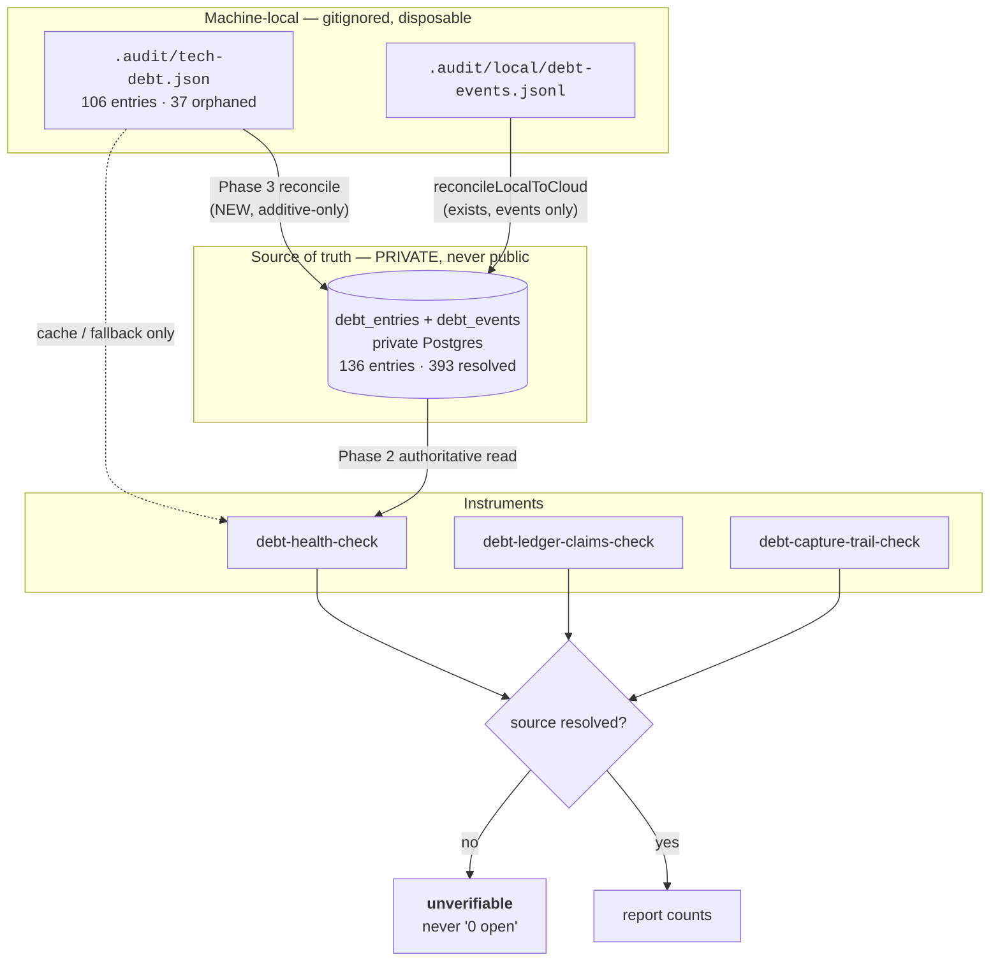

# Plan: Backlog and Drift Reduction — make the private ledger durable, the instruments honest, and the queues owned

- **Date**: 2026-09-04
- **Status**: Complete — all 14 phases implemented 2026-09-04 in one session.
  **The headline outcome is not a gate: 37 tech-debt entries that existed on a
  single disk and nowhere else were pushed into the private store** (136 → 173
  rows, 0 orphans remaining, verified by direct query independent of the tool
  that wrote them). Two of them, `062e1be1` and `49d85261`, would have been
  DELETED by the naive prune predicate the round-3 audit rejected — they carry
  a `reopened` event and no store row, the exact trap, live in real data.
  `status.md` went 1,566,206 → 26,523 bytes with all 408 entries conserved
  byte-for-byte. Three gates added to the pre-push chain; the debt ledger's
  false green is closed in seven scripts through one oracle.
- **Date**: 2026-09-04
- **Gate**: GPT plan-audit 4 rounds (27/27 accepted), Gemini final gate APPROVE on round 4 (coherence Strong, 0 over-engineering flags). See §10.
- **Author**: Claude + Louis Strydom
- **Scope**: backend
- **Base commit**: all `file:line` citations below are pinned to `88025501`.

---

## 1. Context Summary

**Detected scope**: `backend` · **stack**: `js-ts` (+ `postgres`) · no Python.
**Target domains** (`compute-target-domains`): `tech-debt`, `stores`,
`cross-skill-bridge`, `scripts`, `skills-content`, `docs`, `install` —
**cross-domain**, deliberately: this plan is about the seam between a
machine-local file and a private durable store, and that seam *is* the defect.
`status.md`, `AGENTS.md` and `.gitignore` are **untagged paths** (no rule in
`.audit-loop/domain-map.json`); see §8 R5 for why this plan does not add rules
for them.

### What this plan is, in one line

Six measured drift clusters share one root shape: **a fact is recorded somewhere
that cannot be read back**, and the instrument that should say so reports health
instead. Every fix below either moves a fact to a place that survives, or makes
an instrument refuse to answer a question it did not measure.

### The measurements this plan is built on

Every figure was measured on 2026-09-04 against `88025501`, with its command.
**Re-measure before acting** — this repo lands ~599 commits/30d from concurrent
sessions and these numbers move in minutes.

| # | Figure | Measured | Command |
|---|---|---|---|
| M1 | cloud `debt_entries` for this repo | 136 | `select count(*) from debt_entries where repo_id=…` |
| M2 | cloud `debt_events` by kind | resolved 393 · surfaced 193 · reopened 34 · escalated 18 | `select event,count(*) … group by 1` |
| M3 | local `.audit/tech-debt.json` entries | 106 | `readDebtLedger` |
| M4 | local ∩ cloud | 69 | set intersection on `topicId` |
| M5 | **local-only (durable nowhere but this disk)** | **37** (HIGH 19, MED 16, LOW 2; 24 from 2026-07, 13 from 2026-04; 4 cite a since-deleted file) | set difference |
| M6 | cloud-only (invisible to every local reader) | 67 | set difference |
| M7 | local entries carrying a cloud `resolved` event | **0** | join on `debt_events` |
| M8 | Q1 `list-unlocked-fixes` | code 26 · plan 30 · agedOut 185 | `cross-skill.mjs list-unlocked-fixes` |
| M9 | Q2 `list-unremediated-acceptances` | open 168 (code 80 / plan 88) · acceptedPermanent 50 | `cross-skill.mjs list-unremediated-acceptances` |
| M10 | Q3 `final-review-pending` | totalActionable 486 (unadjudicated 449) | `cross-skill.mjs final-review-pending --repo …` |
| M11 | shadow-only findings/week | …08-17: 285 · 08-24: 39 · **nothing after 2026-08-24** | `select date_trunc('week',created_at) … bucket='shadow-only'` |
| M12 | `FINAL_REVIEW_SHADOW` | **unset** (off) | resolved env via `load-env.mjs` |
| M13 | files > 1000 lines under `scripts/` | 19 | `find scripts -name '*.mjs' -exec wc -l` |
| M14 | 60-day line deltas | **+4551 across 11 files** vs **−3652 across 2** | `wc -l` vs `git show origin/main@{60.days.ago}:<path>` |
| M15 | `status.md` | 1,566,206 bytes · 408 entries · 2026-03→2026-09 | `wc -c` / `grep -c '^## '` |
| M16 | `status.md` doc-citation sites | 330 sites · 182 unique targets · **34 unresolved** (31 `docs/completed/`) | git-index set difference; reproduced twice |
| M17 | `npm test` | 14,711 tests · 0 fail · 39 skipped · 9m16s | `npm test` |
| M18 | `AGENTS.md` | 83,408 chars against the 92,000 cap (90.7%) | `wc -c` |
| M19 | readers of legitimately-absent inputs examined | **45** — 5 false-green, 2 false-green in JSON only, 12 honest-skip, rest N/A | census over `.gitignore`'s ignored set; 3 of the 5 re-confirmed by running them here |

### Two corrections made during exploration — recorded so nobody re-opens them

- **RETRACTED: "94-domain map vs 24 architecture-intent headings" was my own
  measurement error, not repo drift.** `npm run docs:architecture-intent:check`
  exits 0: *"documents all 35 domain-map domains (doc has 35)"*. 94 is the
  `rules` **array length** (path rules), not the domain count; the distinct
  `rules[].domain` set is 35; and my heading grep under-counted because the real
  extractor scopes to the `## Domains` section with a fence tracker
  (`scripts/check-architecture-intent-drift.mjs:44-50` @ `88025501`). I
  reimplemented a checker instead of running it. **Not in scope. Do not re-open.**
- **REDUCED: "retire ~15 spent one-off CLIs" was an over-claim.** Of the 21
  top-level scripts named by no test file, 20 carry live references (npm script,
  `docs/`, `skills/`, `scripts/lib/sync-inventory.mjs`, CI, or another module).
  *Untested-by-name is not dead.* Exactly **one** candidate has zero references
  of any kind — `scripts/migrate-v3-run-metadata.mjs` (npm 0, catalog 0, skills
  0, sync 0, CI 0, source 0; the only two `docs/` hits are the generated
  architecture map and requirements map). Genuine dead *files* are already
  `knip:gate`'s job, and it reports clean (20 baselined, 0 net-new). §7b Phase 11
  therefore removes one file, not fifteen.

### Code Trace

The design rests on reading these paths at `88025501`:

- **The false premise.** `scripts/lib/debt-memory.mjs:12-15` — *"The **committed**
  debt ledger at .audit/tech-debt.json is the durable, human-approved state. It's
  mirrored to the cloud `debt_entries` table … but the committed JSON remains the
  source of truth"*. Contradicted by `.gitignore:46` (`.audit/`, with a comment at
  `:37-45` explaining that **nothing** under it is tracked, verified by
  `git ls-files .audit/` being empty). The module's whole storage precedence
  (`:8-15`) inverts reality: the declared source of truth is untracked and
  per-machine; the declared mirror is the only durable copy.
- **How the 37 got stranded.** `persistDebtEntries`
  (`scripts/lib/debt-memory.mjs:143-157`) writes local first
  (`// Always write to committed JSON first (operator's source of truth)`, `:147`)
  then mirrors best-effort: `upsertDebtEntries(...).catch(e => ({ok:false,…}))`
  (`:153`). A failed mirror sets `cloudMirrored:false`, which no caller inspects
  and nothing retries. **M5.**
- **Why local never shrinks.** `removeDebt` (`:162-171`) deletes from both, so a
  resolve run from another worktree or machine shrinks the store and leaves this
  disk's copy intact. **M7** (0 of 106 local entries carry a `resolved` event)
  while **M2** shows 393 resolved events exist.
- **The missing route home.** `reconcileLocalToCloud` (`:192-229`) replays local
  **events** only (`readDebtEventsLocal` → `appendDebtEventsCloud`). There is
  **no reconcile path for local entries at all** — which is precisely why M5 is
  non-zero and has no way to fall.
- **The durable-write seam is already built for debt — and one call site still
  bypasses it.** `scripts/lib/audit-store-writers.mjs:269-278` **already
  registers `debt.entries`**, with `rowKey: (row) => \`${row.repo_id}:${row.topic_id}\``
  backed by the real `UNIQUE (repo_id, topic_id)` constraint, so it is
  legitimately replayable. Its comment (`:248-268`) records why it was promoted
  out of `lost`-only: reproduced in a consumer **2026-08-27, local
  `tech-debt.json` at 228 entries against a cloud mirror at 197 — 31 captured
  locally that never landed, with nothing to retry them.** That is the *same
  defect as M5*, already fixed for the capture path
  (`scripts/debt-auto-capture.mjs:237` calls `durableWrite('debt.entries', …)`).
  **`scripts/lib/debt-memory.mjs:153` is the sole remaining direct caller of
  `upsertDebtEntries`**, and it swallows the failure with
  `.catch(e => ({ ok: false, error: e.message }))`. So H1's fix is not new
  machinery: it is routing the one bypassing call site through the writer that
  already exists, satisfying AGENTS.md's rule that *every* audit-store write goes
  through `durableWrite`.
- **The false green, and its single oracle.** The defect is not in five scripts;
  it is in one function they all call. `readDebtLedger`
  (`scripts/lib/debt-ledger.mjs:47-49`) returns
  `{ version: 1, entries: [] }` on ENOENT — **an absent ledger and a genuinely
  empty one are the same value**, so no caller *can* tell them apart. Every
  consumer then reports clean in good faith. `scripts/debt-health-check.mjs:21`
  documents the resulting behaviour as intended — exit *"0 — ledger
  absent/empty"* — and `renderHuman:97-98` prints
  `Tech-debt ledger: 0 open entries (oldest: 0d)` then returns early. The only
  `existsSync` in that file (`:145`) guards **budgets**, not the availability
  verdict.
- **Census of the blast radius (45 readers of legitimately-absent inputs
  examined).** Five report clean having read nothing, all through that one
  oracle, and all verified by running them in this worktree where `.audit/` is
  genuinely absent:

  | Script | What it asserts on absence | Reach |
  |---|---|---|
  | `scripts/debt-pr-comment.mjs:171,196` | posts **"## ✓ No tracked debt overlaps this PR"** | **onto a pull request.** In CI — a fresh clone, where `.audit/` never exists — this is the *default* outcome. Highest severity: an affirmative public claim from an unread file. |
  | `scripts/debt-health-check.mjs:135` | `0 open entries` | synced to consumers |
  | `scripts/debt-review.mjs:345-350` | *"Ledger is empty — no debt to review"* | synced |
  | `scripts/debt-budget-check.mjs:78-79` | `reason:'no-budgets-configured'` | synced |
  | `scripts/debt-capture-trail-check.mjs:78-82` (via `scripts/lib/debt-capture-trail.mjs:49-54`, which swallows a missing `.audit/` with `catch { return []; }`) | *"nothing to verify — clean"* | not synced (see the gap below) |

- **Two more are honest to a human and green to a machine.**
  `scripts/debt-ledger-claims-check.mjs:86-89` prints a model of the right thing
  — *"UNVERIFIABLE … Not reported as clean: nothing was checked"* — while its
  `--json` envelope still emits `"ok": true` beside `"ledgerAvailable": false`.
  `scripts/context-staleness.mjs:170-176` has the same split, hardcoding
  `ok: true` at `:155-160`. Any machine consumer reading `ok` gets a green the
  human output explicitly denies.
- **The vocabulary to adopt already exists, fully worked.**
  `scripts/check-stale-skill-surface.mjs:203-206` emits
  `status:'unverifiable', reason:'clean-checkout-sandbox'`, and its comment at
  `:235` names *"the old silent existsSync-swallow into '0 skills, clean' this
  fix exists to close"* — the identical defect, already solved once in this
  repo. `scripts/check-upstream-probe-coverage.mjs:123,126` supplies the second
  half of the idiom: *"refusing to report clean"* / *"a ratchet with nothing in
  it is not coverage"*. Cluster A copies these, inventing nothing.
- **The convention already exists, and this file is credited with it.**
  `scripts/debt-ledger-claims-check.mjs:151-154` — *"fs.existsSync checked
  explicitly (not inferred from an empty ledger), **same as
  debt-health-check.mjs** — 'ledger absent' and 'ledger present with 0 entries'"*
  — and its exit contract reads *"0=clean **or unverifiable**"* (`:77`).
  `scripts/debt-capture-trail-check.mjs:133-136` says the same
  (*"'absent' and 'present with 0 entries' are distinct, same discipline as…"*)
  and renders an explicit note when the ledger is missing (`:105`). **Both
  siblings implement the discipline; the file they cite as the precedent does
  not.** So Cluster A adopts an existing in-repo vocabulary rather than inventing
  one.
- **The third sibling's own lesson.** `scripts/maintenance-checks.mjs:264-281`
  records why `debt-capture-trail-check` had to exist: *"debt-health-check.mjs
  has no way to see a ledger entry that was never written"* — found live
  2026-08-27, **517 defer rulings across 11 days silently uncaptured in a
  consumer repo**. Three checks, one per-machine file.
- **Blast radius.** `scripts/lib/sync-inventory.mjs:115,204,205` ships
  `debt-health-check.mjs`, `debt-resolve.mjs` and `debt-review.mjs` to consumer
  repos. The false green is not local.
- **An adjacent, unrelated defect the census surfaced — in scope by impact, not
  authorship.** `scripts/maintenance-checks.mjs` **is** synced
  (`scripts/sync-to-repos.mjs:438`) and spawns its checks as subprocesses, but
  **four of them are declared nowhere in the sync inventory**:
  `debt-ledger-claims-check.mjs` (`maintenance-checks.mjs:262`),
  `debt-capture-trail-check.mjs` (`:285`), `check-accepted-debt.mjs` (`:349`)
  and `slice-recurrence-check.mjs` (`:215`). Their siblings
  (`memory-health.mjs`, `check-model-freshness.mjs`, `context-staleness.mjs`,
  `debt-health-check.mjs`, `remediation-reconcile.mjs`) are all declared; these
  four were missed. That is exactly the `MODULE_NOT_FOUND` class recorded as a
  live 2026-07-22 wine-cellar-app incident in the comment block at
  `scripts/sync-to-repos.mjs:430-437`. **Why this is in scope**: Cluster A
  edits two of those four files and `sync-inventory.mjs` itself, so what this
  plan ships to consumers rides directly on that list being correct. Per
  AGENTS.md's impact-not-authorship rule, a pre-existing defect the change
  depends on is in scope for the fix/defer decision, and the independence
  needed to defer it does not exist here.
- **The closing command nothing advertises.** `scripts/debt-resolve.mjs` exists
  and is correct (removes the entry, emits a `resolved` event through
  `debt-memory`), but has **no npm alias and no `scripts/.cli-catalog.json`
  entry** — the catalog carries `debt:budget`, `debt:health`,
  `debt:ledger-claims`, `debt:capture-trail`, `debt:review` and no
  `debt:resolve`. The one command that closes debt is the one command nothing
  surfaces.
- **The ratchet template.** `scripts/knip-gate.mjs:1-77` — drift-only gate with a
  committed baseline, a stable key function, a pure `diffAgainstBaseline`, and
  **self-cleaning stale entries** (`:16-19`). Its docstring (`:5-14`) states the
  reason a gate must not fail on a pre-existing backlog: *"fails on the first
  push, teaches everyone to reach for `--no-verify`, and is then worse than no
  gate"*.
- **The rotation coupling.** `scripts/check-docs-refs.mjs:496` excludes
  `status.md` by **exact string equality** (`rel === 'status.md'`, class
  `HISTORICAL`); `scripts/check-npm-run-args.mjs:94` does the same
  (`p === 'status.md'`) and its `BASELINE` is **empty** (`:172`). Neither
  exclusion covers a `docs/status/` prefix. `status.md` holds **M16**: 34 unique
  unresolved targets that are invisible today only because of that exclusion.
- **The append contract.** `skills/ship/references/status-md-format.md:34-36`
  (append at the TOP, below the header) and `skills/ship/SKILL.md:1403`
  (*"status.md is a log — append, never rewrite history"*), `:1316`
  (*"status.md is append-only"*). `skills/ship/gate-contract.json:332-333`
  records the append-only convention as a **documented claim with no enforcing
  gate**.
- **The incident that proves the gap.** `3a17bbce`
  *"fix(status.md): restore ~19,257 lines of session log truncated by PR #87"* —
  19,257 insertions, **0 deletions**, merged as `9d204e04`. A partial Read
  followed by a whole-file Write replaced the log with a single entry, and it
  reached `main` through a full `npm run check` + pre-push run. **Nothing in this
  repo asserts a monotonic byte count, entry count, or oldest-entry date for
  `status.md`.**

### Neighbourhood considered

`get-neighbourhood` (k=8) returned **`precedent` / `bandReason:
above-floor-cluster`** — the strongest duplication signal — on
`scripts/lib/store/debt.mjs::readDebtEntriesCloud` (score 0.839), with
`upsertDebtEntries`, `appendDebtEventsCloud`, `readDebtEventsCloud`,
`removeDebtEntryCloud` and the `debt-ledger.mjs` local pair all in the cluster.

**Decision on the code, per the band's instruction: REUSE, write nothing new for
storage.** The private durable home this plan needs already exists in full —
tables `debt_entries` + `debt_events` (migration
`supabase/migrations/20260405092206_add_debt_memory.sql`), the store layer
(`scripts/lib/store/debt.mjs`), and the router (`scripts/lib/debt-memory.mjs`).
The consultation is what turned this plan from *"build durable private debt
storage"* into *"the storage exists; invert which side is authoritative and give
the orphans a route home"* — a materially smaller and more honest change. No new
table, no new column, no new store function.

### Past incidents to verify against

| Incident | Status | Bearing on this plan |
|---|---|---|
| **INC-001** — lexical sensitive-path classification bypassed by a symlink | `manual-verification-required` | *"Fail-closed on resolution errors… Never 'I couldn't classify it so I'll allow it.'"* This plan's `unverifiable` verdict (Cluster A) and the gitignore category gate (Cluster B) both adopt it: an unclassifiable input is never silently clean. |
| **INC-002** — production store wiped by a test whose only gate was "is `AUDIT_DB_TEST_URL` **set**" | `manual-verification-required` | *"An env-gate that checks 'is this variable set' is not a safety gate — it only proves intent to run, never that the target is safe."* Exactly the D2 shape: `existsSync` proves nothing about whether the question was answered. Also: Cluster A writes to a live private store, so §9 pins that **no destructive statement** is issued and the reconcile is additive-only. |

No trust boundary is crossed by this plan (no new egress, no new credential
path, no new external call), so no separate Security Considerations section is
required. The one privacy-relevant surface — what may become public — is the
entire subject of Cluster B.

---

## 2. Proposed Architecture

### The one-sentence design

**Invert the declared source of truth for debt** (private store authoritative,
local file a cache), **give every instrument a third verdict** (`unverifiable`,
distinct from clean), and **make the two facts that silently decay — file size
and ignore-category — into things a gate can see.**



### Key design decisions

| # | Decision | Principle |
|---|---|---|
| A1 | **The private store is authoritative; the local file is a cache.** Correct the docstring premise and make readers prefer the store when cloud is on, falling back to local only when it is off — and *saying which they read*. | #5 Single Source of Truth, #19 Observability |
| A2 | **A reconcile that is additive-only.** It pushes local-only entries into the store via the existing `upsertDebtEntries`. It never deletes, never adjudicates, and never invents an event. Stopping data loss and triaging debt are two jobs; conflating them would be fabricating audit evidence (`standing-queue-burndown.md` §0 doctrine). | #13 Idempotency, #15 Error Handling |
| **A10** | **A spilled push is not a completed one (R4-M2).** Adopting `durableWrite` means a push can legitimately end `spilled` — the entry is genuinely still absent from the store until a later drain. So the advertised "`localOnly == 0` on re-measure" postcondition is unassertable at that moment, and would either fail honest runs or get quietly relaxed. The CLI therefore **reports all four outcomes per entry**, and the postcondition is **`localOnly == spilled`**, reaching 0 only when every push was `written`. A `spilled` entry **keeps its local copy and is never prunable** — that local copy is the only copy until the drain lands (see the `write-spill` note in Cluster B). | #15 Error Handling, #19 Observability |
| **A7** | **Close the write hole, don't just report it (H1).** Reconcile alone is *recovery for legacy data, not durable write behaviour* — leave `persistDebtEntries` local-first-and-best-effort and the next failed mirror strands entry number 38. `scripts/lib/debt-memory.mjs:153` is routed through the **already-registered** `durableWrite('debt.entries', …)` writer, so a failed cloud write **spills and is replayed by the existing drain** instead of being silently accepted. Its four-outcome result is returned to callers rather than collapsed to a boolean. **No new writer, no new `rowKey`, no new machinery** — the seam and its constraint already exist and already serve `debt-auto-capture.mjs`. Reconcile then handles only the pre-existing 37; steady state is durable by construction. | #5, #13 Idempotency, #15 Error Handling |
| **A8** | **Prune on the topic's LATEST lifecycle state, never on absence and never on any historical event (H2 → R2-H4 → R3-H1).** Absence from `debt_entries` cannot distinguish *never mirrored* from *resolved remotely*. A `resolved` event separates them — but **"any resolved event" is itself unsafe**, because a debt topic's lifecycle is not monotonic: **M2 measured 34 `reopened` events**. Resolved in July, reopened in August, re-deferred locally, mirror fails ⇒ "has a resolved event" deletes precisely the orphan it should push. The predicate is therefore **recency-ordered and entry-relative**: prune only when the topic's **latest** event is `resolved` **and** that event is newer than this local entry's own `deferredAt`.<br><br>**Every ambiguity resolves toward keeping the entry (R4-H3).** At equal timestamps `reopened` outranks `resolved`; a missing or unparseable timestamp on either side, or a local `deferredAt` ahead of the store's clock beyond a stated tolerance, makes the entry **non-prunable** and it falls to `push`. Pruning demands unambiguous evidence; everything else keeps the data.<br><br>**Consistency comes from ONE statement, not a transaction (R4-H2).** A `withTx` wrapper does not by itself give a shared snapshot — under Postgres `READ COMMITTED` two consecutive `SELECT`s can observe different committed states, so the draft's claim was false. Classification instead runs as a **single CTE** returning, per topic, entry-presence alongside the latest lifecycle event, which is atomic under every isolation level and needs no isolation-level negotiation. The local ledger is re-read under its existing file lock immediately before any prune deletion. | #13, #15, INC-001 fail-closed |
| A3 | **A third verdict, not a louder failure.** `unverifiable` already exists in two siblings' vocabulary. These checks are advisory maintenance nudges by design (`maintenance-checks.mjs` `attention` semantics) — making them *block* would be the cried-wolf shape. They must stop lying, not start gating. | #16 Graceful Degradation |
| A4 | **Ratchet, never absolute.** Copy `knip-gate.mjs`'s exact shape: committed baseline, drift-only failure, self-cleaning stale entries, `--update-baseline`. An absolute 1000-line gate would fail on all 19 files on the first push. | #16, and `knip-gate.mjs:5-14` verbatim |
| A5 | **Guard before rotate.** The `status.md` monotonicity guard ships and is proven to fail *before* any content moves, so the rotation runs under an instrument that would have caught PR #87. | Verification discipline: *"a check is not trustworthy until seen to fail"* |
| A6 | **The gitignore category is declared in `.gitignore` itself**, in the comment convention the file already uses (12 rules already say "Category A"), not in a sidecar. A sidecar would be a second source of truth that drifts from the rules it describes — the exact failure §0 of the burndown doctrine rejects. | #5 Single Source of Truth |
| **A9** | **The rotation's authorization is COMMITTED, not passed at runtime (H4), and conservation is proved by IDENTITY, not by counting (R2-H2).** A `--authorize-rotation` flag is absent when CI re-runs the gate against the rotation commit, so the guard would either fail that commit forever or need a standing bypass — and a gate with a standing bypass is not a gate. Instead the guard reads a committed `docs/status/rotation-manifest.json`. **Counting is not enough**: equal totals are preserved by deleting real entries and adding invented or duplicated ones, and an archive digest only proves an archive is unchanged, never that it received exactly what the root lost. So the manifest records, per archived month, the **ordered list of per-entry digests** alongside the file's own SHA-256.<br><br>**Two laws, because frozen content and live content are different (G1).** A single "digests never shrink" rule over everything would **ban appending to the current entry** — a full-span digest changes on every edit, so adding a paragraph to today's entry destroys its old digest and the multiset shrinks. That would block ordinary work, and **this plan would trip its own gate**, since Phase 10 appends a backlog line to the status entry. So:<br>• **Archived entries (frozen)** — exact digest identity. Every digest in the manifest must still be present in its archive, in order. Archives are immutable by definition.<br>• **Root entries (live)** — **heading-presence + append-only**. No `## ` heading present in the previous commit's root may vanish unless it reappears in an archive the manifest vouches for; and where a retained entry's content changed, the new span must **start with** the old span. Editing today's entry is normal; deleting yesterday's is not.<br><br>A root reduction is legal exactly when every removed entry reappears in a vouched archive.<br><br>**Third law: the manifest is itself monotonic (G2-round-2).** The first two laws trust the manifest to say what was archived — so a commit that deletes `docs/status/2026-06.md` **and** its manifest record together passes both: the root is unreduced, and every *remaining* archive still matches its *remaining* record. The voucher must therefore be vouched for. The guard compares the current manifest against **the base of the whole push, resolved by `scripts/lib/push-range.mjs`** — never a hardcoded `HEAD^` (R3-G2). Hardcoding the parent is bypassable on any multi-commit push: an earlier commit deletes an archive and its record, the tip changes something unrelated, and a `HEAD`-vs-`HEAD^` comparison sees no shrinkage because both sides already lack it. AGENTS.md states the rule this obeys — *"One range, one resolver … Gates must not re-infer a base from working-tree state"* — and the same resolver supplies `AUDIT_PUSH_RANGE_REQUIRED`, which is how the fail-closed behaviour of G2-round-1 is expressed rather than being a second ad-hoc check. Every archive path and entry digest present at the push base must still be present at the tip. The manifest may **grow** as months rotate; it may never shrink or drop a digest. This is what makes the archives genuinely append-only rather than merely self-consistent. **Each digest covers the entry's FULL SPAN** — the `## ` header line through the byte before the next `## ` or EOF — **not the header alone** (R3-H3): a header-only digest leaves every paragraph beneath a retained heading free to be deleted or rewritten with the multiset unchanged, which is a quieter PR #87 that the guard would wave through. The stored list is **ordered**, and the guard checks order within each archive as well as membership, so a chronology-scrambling rewrite is caught too. The authorization is **evidence in the tree**, re-verifiable by anyone at any later commit, with no flag. | #13 Idempotency, #19 Observability |

### A stale invariant the record still asserts (R2-H1) — corrected, not obeyed

The round-2 audit flagged A7 as violating **`REQ-persistence-7bc1224d`**
(`status: active`, `confidence: high`): *"Only `audit.findings` and
`audit.runComplete` durable writers may declare `rowKey` values and thereby be
eligible for replay, while all other registered audit-store writers remain
keyless."* If that were live, A7 would be unbuildable.

**It is not live. Measured against `88025501`, six writers declare a `rowKey`**:

| Writer | `rowKey` | Line |
|---|---|---|
| `audit.findings` | `run_id:finding_fingerprint:pass_name` | `:132` |
| `audit.runComplete` | `run_id` | `:147` |
| `audit.convergenceState` | `run_id` | `:167` |
| `audit.diffComplexity` | `run_id` | `:179` |
| `learning.outcome` | `decision_key` | `:191` |
| `debt.entries` | `repo_id:topic_id` | `:271` |

The requirement's **own cited evidence test** contradicts it:
`tests/audit-store-durability-call-site.test.mjs:188-192` records
*"upsertDebtEntries: now REGISTERED as `debt.entries` (2026-08-27)"*. The
assertion was extracted from `audit-store-writers.mjs`'s docstring (`:21-28`),
which still says *"Today that is `audit.findings` … and `audit.runComplete`"* —
and the code moved past both the docstring and the extraction.

**A disagreement does not say which side is wrong.** The real invariant, the one
the code and the test both honour, is: *a writer may declare a `rowKey` only when
it is arbitrated by a real DB uniqueness constraint; a writer without one is
`lost`-only.* `debt.entries` satisfies it via `UNIQUE (repo_id, topic_id)`.

**In scope by impact, not authorship**: A7 rides on `debt.entries` staying
replay-eligible, and a future reader "restoring" the stale invariant would strip
that `rowKey` and silently reopen the 31-orphan consumer bug of 2026-08-27. So
this plan corrects the record in two places — a new `.requirements/overrides.json`
carrying an edited assertion, and the docstring that seeded it.

### The availability contract (M2) — `loadAuthoritativeDebt` is a total function

`cloud | local | unavailable` plus a `degraded` boolean does not cover the
states that actually occur, and the seven consumers do not want the same
answer — one of them **publishes to a pull request**. The verdict is therefore
a closed enum over conditions, and each consumer's latitude is fixed here
rather than decided per call site:

| Condition | `source` | May a COUNT be displayed? | Exit |
|---|---|---|---|
| cloud on, read OK | `cloud` | yes — authoritative | 0 / 1 on real findings |
| cloud on, credentials or repo identity unresolvable | `unavailable` | **no** | 0, verdict `unverifiable` |
| cloud on, read timeout or connection error | `unavailable` | **no** | 0, verdict `unverifiable` |
| cloud on, malformed response | `unavailable` | **no** | 0, verdict `unverifiable` — never parsed-as-empty |
| cloud on, read OK, local cache also present and differing | `cloud` | yes, **plus a divergence note** naming the counts | 0; divergence is a nudge, not a failure |
| cloud **off**, local ledger present and valid | `local` | yes, **labelled `local cache — not authoritative`** | 0 / 1 |
| cloud **off**, no local ledger (ENOENT) | `unavailable` | **no** | 0, verdict `unverifiable` |
| local ledger present but **malformed JSON** | `unavailable` | **no** | 0, `unverifiable`, reason `ledger-unparseable` |
| local ledger parses but is **schema-invalid** | `unavailable` | **no** | 0, `unverifiable`, reason `ledger-schema-invalid` |
| local ledger or `.audit/` **unreadable** (EACCES/EPERM/EISDIR) | `unavailable` | **no** | 0, `unverifiable`, reason `ledger-unreadable` |
| read raced an atomic replace (transient ENOENT mid-rename) | `unavailable` | **no** | 0, `unverifiable`, reason `ledger-read-raced` — retried once, then honest |

**The rule that generalises the table (R4-H4):** *no read failure of any kind may
produce an empty-but-valid ledger.* The original defect was one instance of that
— ENOENT collapsing into `{entries: []}` — and enumerating only ENOENT would have
left the identical bug reachable through four other doors.

Two rules bind every consumer: **a count is never printed without its source
label**, and **`unavailable` never renders as a number** — that is the entire D2
defect restated as a contract. `scripts/debt-pr-comment.mjs` is strictest: on any
`unavailable` it emits **no affirmative claim at all**, because a PR comment is
read by people who cannot see this table.

**One envelope shape, not a per-script choice (R2-M1).** "`ok` false-or-absent"
was underspecified — that half of the finding is right and is pinned below. But
the finding's stated mechanism does not apply here, and following it would have
done harm. **Measured at `88025501`: none of the seven affected scripts calls
`emit()`** — every one hand-rolls `process.stdout.write(JSON.stringify(…))` —
and `.emit-exit-baseline.json` currently reads `{count: 0, files: {}, ids: []}`.
The `emit({ok:false})` → non-zero-exit coupling therefore does not bind them,
and adopting `softFail` would have meant **migrating advisory checks onto the
gating path A3 explicitly keeps them off**, while growing a baseline whose gate
allows it to *shrink only*.

So the contract is a plain JSON shape, identical across all seven:

```json
{ "ok": false, "verdict": "unverifiable", "reason": "clean-checkout-sandbox",
  "source": "unavailable", "totalEntries": null }
```

- `ok:false` because the question was not answered — this is the whole D2 fix,
  and it is what stops a machine consumer reading a green.
- `verdict` is the closed enum `ok | attention | unverifiable`; consumers key on
  it rather than inferring from counts.
- Counts are `null`, never `0` (§2 availability table).
- **Exit stays 0**, per each script's existing documented 0/1/2 contract and A3.

**Do not "tidy" these onto `emit()` later.** `emit({ok:false})` sets a non-zero
exit by design, which would turn seven advisory nudges into push blockers — the
cried-wolf outcome this plan is otherwise written to avoid. If a future change
does move them, it must pass `{softFail:true, reason}` **and** re-baseline
`.emit-exit-baseline.json` deliberately with `--update`; nothing in this plan
does either.

### The gitignore policy's grammar and its honest limit (M1)

**Grammar — what "one token per rule" actually means.** `.gitignore` allows
comments, blanks, negations, duplicate patterns and directory globs, so binding
must be stated rather than assumed:

- A **comment block** is a run of consecutive `#` lines. It binds **downward**
  to the **rule group** beneath it: the contiguous run of non-blank,
  non-comment lines ending at the next blank line or comment block. One block
  may cover several rules — which is how the file is already written.
- A **negation** (`!pattern`) is an ordinary **member of its rule group**, not a
  separate case (R3-M1). The draft said negations "inherit the block above",
  which contradicted downward-only binding for a `pattern` / `!exception` pair;
  membership resolves it with one rule instead of two. A negation appearing
  **first** in a group is an **error** — it narrows nothing declared.
- The declaration is `Category: A | B | P` anywhere in the bound block. A `P`
  block additionally requires three tokens, so the gate has a real input rather
  than inferring intent from prose (R2-M2):
  - `Durable home: <where the recoverable content lives>`
  - `Recoverable: <what is reconstructible from that home>` — **must be
    non-empty**; an empty value is the contradiction the gate rejects.
  - `Disposable: <what is knowingly not recoverable>` — may be `none`, but must
    be stated rather than left implicit.

  `docs/reference/gitignore-policy.md` is **explanatory prose, not a generated
  artifact** (R3-M1). Calling it "rendered from the tokens" without a renderer,
  a check mode and a freshness test would have created exactly the
  tracked-but-unverified file the generated-artifact policy forbids. The
  **tokens in `.gitignore` are the sole authority**, the gate reads only them,
  and the doc explains the categories and their reasoning for humans.
- The baseline keys on **`(pattern, category, durable-home, recoverable,
  disposable)`** — all five, so weakening a `P` rule's recoverability claim is
  drift rather than a silent edit — and never on line number, so reordering the
  file is not drift while re-categorising a rule is.
- A pattern appearing twice must declare the same category both times;
  disagreement is an error, not a last-one-wins.

**The honest limit — what `P` claims, and what it does not.** The audit's
sharper half is right: `.audit/` is one broad rule over a directory holding
arbitrary run artifacts, and no prose list of tables can prove that *every*
descendant is recoverable. Over-claiming here would reproduce the exact
false-assurance this plan exists to remove. So `P` makes a **bounded** claim,
and the doc states both halves per rule:

- **Recoverable** — the load-bearing content, with its home. For `.audit/`:
  debt entries and events (`debt_entries` / `debt_events`), findings and runs
  (`audit_findings` / `audit_runs`).
- **Accepted as disposable** — named explicitly, not silently: per-run
  transcripts, `*-stderr.log`, `*-diff.patch`, round result JSONs, the session
  cache. Losing these costs a re-run, not a fact.
- **`.audit/write-spill/` is DISPOSABLE, not recoverable (R4-M1)** — and this is
  the entry most worth getting right. A spill artifact exists **precisely
  because the remote write did not land**, so until the drain succeeds it is a
  **sole local copy** with nothing to restore it from. Listing it as recoverable
  would have had the `P` category certifying the one thing it cannot vouch for,
  and A7 sharpens the stake by routing new debt writes through that path. The
  honest statement is that an **undrained spill is a real, bounded loss window**,
  accepted as the cost of not blocking on a store outage. To keep the window
  visible rather than assumed empty, `debt-reconcile --dry-run` **reports the
  count of undrained spill artifacts**, and the backlog snapshot carries it.

A `P` rule whose *recoverable* half is empty is a contradiction the gate
rejects: it is either `A` (nothing worth keeping) or it has a home. That is the
whole point of adding the category — to make "private **and** load-bearing"
force an answer to "so where does it durably live?"

### The rotation's entry grammar (R4-H5)

The guard only needs "a span starting at `## `". The **rotation tool needs
more** — it must decide each entry's month and what stays — and over 408 entries
spanning six months that cannot be left implicit:

- **Dated heading**: `^## (\d{4}-\d{2}-\d{2})\b` — the form
  `status-md-format.md:17,44` already mandates. The month is taken **verbatim
  from those characters**, with **no timezone conversion and no date parsing**;
  the string is the authority, so no clock is involved and the operation is
  reproducible anywhere.
- **Undated or malformed headings are NEVER rotated.** Any `## ` line not
  matching the grammar keeps its entry at the root. Rotation is opt-in by
  conformance, so an unparseable entry can never be silently relocated or
  dropped — the failure direction is "stays put", which is safe.
- **Duplicate headings are legal.** Two entries may share a date; digests cover
  full spans (A9), so identity does not depend on heading uniqueness.
- **Retained at the root**: the `# Project Status Log` header and every entry
  whose month equals the newest month present. A month is rotated **only in
  full** — never split — so an entry can never straddle a boundary.
- **The stub index contains no `## ` heading** (it uses `### ` links), so it
  contributes zero entry digests and is excluded from conservation **by
  construction** rather than by an exception the guard has to remember.
- **Pre-flight refusal**: if the parse finds zero dated entries, or the
  reassembly check fails, the tool writes nothing and exits non-zero.

### The snapshot line's grammar and provenance (H5)

The round-1 audit caught the draft example reporting Q1's 26 **code** rows while
M8 also measured 30 plan rows and 185 aged-out, and citing `upstream 0` with no
measurement — a subset printed as if it were the total, which is the reporting
dishonesty this plan is otherwise about. The line therefore carries every
dimension it names, or says it did not measure it:

```
Backlog 2026-09-04T09:14Z: Q1 26c/30p (+185 aged) · Q2 80c/88p (50 perm) · Q3 486 · debt 136 cloud/106 local (0 spilled) · upstream 0
```

One timestamp, because one process performs every read at one instant.

| Field | Read performed by the snapshot itself | Envelope path read |
|---|---|---|
| `Q1 <c>c/<p>p (+<n> aged)` | `cross-skill.mjs list-unlocked-fixes` | `byMode.code`, `byMode.plan`, `agedOut` |
| `Q2 <c>c/<p>p (<n> perm)` | `list-unremediated-acceptances` | `byMode.code`, `byMode.plan`, `byDisposition.acceptedPermanent` |
| `Q3 <n>` | `final-review-pending` | `counts.totalActionable` |
| `debt <n> cloud/<n> local (<n> spilled)` | the Cluster A reconcile classifier, read-only | both sides plus undrained spill artifacts, so a divergence **and** an open loss window are visible on the ship that caused them (R4-M1) |
| `upstream <n>` | `upstream list` | row count of the listing |

Every field is `unmeasured` when its producer reported `measured:false`,
`cloud:false`, or a non-repo scope.

**Who invokes what (R2-M3 → R3-H2): the snapshot reads for itself.**

The draft had Step 0.5 persist each envelope to `.audit/ship-<sid>-<queue>.json`
for the formatter to pick up. R3 was right that this was underspecified — and
the correct response is to **delete the mechanism, not specify it**. Reusing the
already-fetched envelopes saves four cheap store reads (all four run in ~2s, no
LLM, no spend) and cost, in exchange, an entire artifact protocol: envelope
versioning, atomic writes, collision behaviour, and a prior-SID index purely to
carry Q3 across ships. That is the over-engineering cliff, reached while
defending a two-second economy.

So: **`node scripts/backlog-snapshot.mjs` performs the four reads itself**, in
one process, at one instant, and prints one line to stdout. Consequences, all
simplifications:

- No `.audit/` artifacts, no `--sid`, no schema versioning, no collision rules.
- **No cross-ship carry** — Q3 is read live like the rest, so the "prev ship"
  marker and its per-field timestamp problem both disappear. Every field shares
  one honest measurement instant, which is the line's date prefix.
- Step 0.5 is unchanged; this is additive and independent of it.

**No script writes `status.md`.** The helper prints text; the agent inserts it
into the status entry it is already authoring. That is deliberate and
load-bearing: PR #87 destroyed 19,257 lines precisely because a tool rewrote
this file.

### Where each new check actually runs (H3)

A check that is not in the canonical chain is not a gate. Every script this plan
adds is named here with its alias, its position, and its consumer disposition —
no "and the Cluster D/E gates" hand-waving.

| Script | npm alias | Runs in | Consumer sync |
|---|---|---|---|
| `scripts/check-gitignore-policy.mjs` | `gitignore:policy:gate` | `npm run check` (with the other ratchets, after `knip:gate`) → pre-push hook | **no** — `.gitignore` content is repo-specific; a consumer's ignore set is its own |
| `scripts/file-size-ratchet.mjs` | `size:ratchet:gate` | `npm run check`, immediately after `knip:gate` (same family, same baseline idiom) | **no** — the baseline is this repo's file set |
| `scripts/check-status-log-integrity.mjs` | `status:integrity:gate` | `npm run check` | **no** — `status.md` is not synced (confirmed: absent from the sync manifest) |
| `scripts/debt-reconcile.mjs` | `debt:reconcile`, `debt:reconcile:push` | operator command; **not** in `check` (it writes to a store, and a gate must not) | **yes** — consumers have the same divergence |
| `scripts/rotate-status-log.mjs` | `status:rotate` | operator command, one-off | **no** |

`npm run check` is the pre-push chain, so "in `check`" means "blocks a push".
The three gates are **drift-only against a committed baseline**, so adding them
to `check` cannot fail the first push on pre-existing state — the property
`knip-gate.mjs:5-14` argues for at length. `debt:reconcile` is deliberately
**not** a gate: it mutates a store, and AGENTS.md's gate-level rule is that a
gate must not fire on state the current commit cannot change.

### Right-sizing gate

New structure is on the table three times. Each gets its three lines.

**(1) The file-size ratchet (Cluster D)**
- *Band-aid*: add a sentence to AGENTS.md asking people not to grow big files. M14 shows this is exactly the status quo — two decompositions with Complete plans were outrun by +4551 lines elsewhere.
- *Over-engineered*: a complexity gate — cyclomatic complexity, per-domain budgets, a trend dashboard, coupling metrics.
- **Chosen**: a line-count ratchet over files **already** above 1000 lines, reusing the knip baseline pattern. *Current requirement*: M14 — `runs-findings.mjs` grew +663 lines **after** its decomposition was accepted, independently corroborated by the Q2 burndown note ("91K to 114K chars since acceptance — the opposite of the cited decomposition"). Without a ratchet, decomposition is a treadmill.

**(2) The gitignore category gate (Cluster B)**
- *Band-aid*: document the third category in AGENTS.md and rely on review. AGENTS.md is at 90.7% of its cap (M18) and review already missed this for the whole life of the debt ledger.
- *Over-engineered*: a policy engine with per-path owners, expiry dates, an attestation record, and a report.
- **Chosen**: one required `Category:` token per ignore rule, parsed from the comment block the file already writes, with new/changed rules gated. *Current requirement*: the user's constraint. `.audit/tech-debt.json` must never be public **and** must not be lost — today nothing in the repo records that a private ignored path needs a durable home elsewhere, which is why 37 entries live on one disk.

**(3) The `status.md` rotation (Cluster E)**
- *Band-aid*: leave it. It grows ~13K lines per two months, is the top churn source (401 of the last 90 days' commits), and sits at 75% of `doc-citations.mjs`'s 2 MiB `documentBytes` ceiling.
- *Over-engineered*: a log service, an index, a search page, per-entry files.
- **Chosen**: move whole months to `docs/status/<YYYY-MM>.md`, keep the current month at the root, extend the two existing exclusions to the new prefix, under a monotonicity guard. *Current requirement*: M15 + the PR #87 incident. **Note the honest sequencing**: the guard (Phase 12) is worth shipping even if rotation were abandoned, because it closes the incident's blind spot on its own.

### Manual vs scripted

- **Scripted, and COMMITTED** (regular, verifiable, and re-run over time): the
  reconcile CLI (Phase 3) and the rotation CLI (Phase 13). Both are mechanical
  over many items with an assertable post-condition — reconcile asserts
  `localOnly == 0` on re-measure; rotation asserts digest conservation. **Both
  are committed tools, not throwaways** (R3-M2): each carries
  `--selfcheck-relocation`, an npm alias and tests, because their correctness is
  asserted by the suite and a consumer needs the reconcile too. An earlier draft
  called the rotation helper a Category-A throwaway; that was a leftover from
  when it was a one-shot script, and it contradicted every other section.
- **Manual** (judgment-heavy, few sites): the 4 `status.md:NNNN` line citations
  (Phase 13), the `.gitignore` category annotations (Phase 7 — 62 rules, each
  needing a human call on category and durable home), and the AGENTS.md
  corrections (Phase 14).

---

## 6. Sustainability Notes

- **Assumption that could change**: the private store stays single-tenant and
  reachable. If cloud is off, Cluster A degrades to "local cache, reported as
  such" — which is *why* the verdict vocabulary matters more than the read order.
- **What this deliberately does not do**: it does not adjudicate a single debt
  entry, close a single queue row, or decompose a single oversized file. It makes
  those jobs *possible to see and safe to do*. Burning them down is recurring
  work under the routes this plan repairs, not a one-time close-out
  (`standing-queue-burndown.md` §6).
- **Extension point built in**: the ratchet's baseline is keyed by path, so a
  future per-domain budget can reuse the same file without a format change.
- **Seam that stays loose**: nothing new depends on `.audit/tech-debt.json`'s
  *shape*. If the local cache is deleted entirely in a future cleanup, every
  reader still answers correctly from the store.

---

## 7. File-Level Plan

> **Path-resolvability note (deliberate, read before auditing).**
> `extractPlanPaths` requires at least one `/`, so `AGENTS.md`, `.gitignore` and
> `status.md` are **structurally invisible** to it no matter how they are
> written. Three of this plan's phases touch them. Every such phase is therefore
> clustered alongside slash-paths, and the audit of those clusters will not see
> the root-file edits — §9 covers them with explicit tests instead. This plan
> declares 30+ resolvable paths, far above the 5-path fuzzy-discovery threshold,
> so `--scope diff` is safe.

### Cluster A — debt durability and instrument honesty

| File | Intent | Purpose |
|---|---|---|
| `scripts/lib/debt-ledger.mjs` | modify | **The single oracle, and the whole of the D2 fix.** `readDebtLedger` (`:47-49`) stops returning an empty ledger on ENOENT and returns `{ version, entries, available: false, reason: 'clean-checkout-sandbox' }` instead — so an absent ledger becomes *representable* to every caller. Adopts `check-stale-skill-surface.mjs:203-206`'s vocabulary verbatim. Fixing it here rather than at five call sites is the point (#5). |
| `scripts/lib/debt-capture-trail.mjs` | modify | `findRoundLedgers` (`:49-54`) `catch { return []; }` swallows a missing `.audit/`. Return `{ ledgers, dirAvailable }` so its caller can tell "no deferrals" from "no directory". |
| `scripts/lib/debt-memory.mjs` | modify | Correct the false storage-precedence docstring (`:8-15`). Add `loadAuthoritativeDebt(context)` per the state table below. **Route `persistDebtEntries`'s mirror (`:153`) through `durableWrite('debt.entries', …)`** — the writer registered at `scripts/lib/audit-store-writers.mjs:269` — and return its four-outcome result instead of the boolean `cloudMirrored` (A7). |
| `scripts/lib/debt-reconcile.mjs` | create | Pure, testable classifier. Takes local entries, cloud entries, and **per topic the latest lifecycle event `{event, ts}`** — not a flat resolved-topic set, which is what made the draft unsafe (R3-H1). Returns `{localOnly, cloudOnly, both, locallyResolved}`, where `locallyResolved` requires `latest.event === 'resolved' && latest.ts > entry.deferredAt`. Everything else that is absent from the store falls to `localOnly` (push) — the safe direction. No I/O, so the whole decision is unit-testable without a database (mirrors `knip-gate.mjs`'s `diffAgainstBaseline`). |
| `scripts/debt-reconcile.mjs` | create | CLI over the above. `--dry-run` (default) reports the four sets; `--push` sends `localOnly` through `durableWrite('debt.entries', …)` (never a raw upsert, so a failure spills like any other); `--prune-resolved` drops a local entry **only** on that topic's own positive `resolved`-event evidence, classified from one consistent snapshot (A8) — no push-record artifact exists or is needed. **Additive-only against the store: never deletes a cloud row, never writes an event it did not observe.** `--selfcheck-relocation` per the CLI smoke contract. |
| `scripts/debt-pr-comment.mjs` | modify | **Highest severity — it publishes.** Must never post *"✓ No tracked debt overlaps this PR"* from an unavailable ledger; on `available:false` it says so or posts nothing. |
| `scripts/debt-health-check.mjs` | modify | Distinguish absent from empty. Report `unverifiable` — the vocabulary its own siblings already credit it with. Read through `loadAuthoritativeDebt` so the count is the store's when cloud is on. Print which source answered. |
| `scripts/debt-review.mjs` | modify | Stop asserting *"Ledger is empty"* when there is no ledger (`:345-350`). |
| `scripts/debt-budget-check.mjs` | modify | Split `reason:'no-budgets-configured'` (`:78-79,103-110`) from `reason:'ledger-unavailable'`. |
| `scripts/debt-capture-trail-check.mjs` | modify | Use `dirAvailable`; it already computes `debtLedgerAvailable` but only prints it when `deferredTotal > 0` (`:102`) — i.e. never in the clean-checkout case that matters. |
| `scripts/debt-ledger-claims-check.mjs` | modify | **JSON-envelope honesty**: `--json` emits `"ok": true` beside `"ledgerAvailable": false` (`:86-89` human path is already correct). Make `ok` false-or-absent when nothing was verified. Correct the `:151-154` comment citing a precedent that did not exist. |
| `scripts/context-staleness.mjs` | modify | Same JSON/human split — `ok: true` hardcoded at `:155-160` against an `unverifiable` human verdict at `:170-176`. |
| `scripts/.cli-catalog.json` | modify | Register `debt:resolve` and `debt:reconcile` so the closing commands are discoverable. |
| `package.json` | modify | Add `debt:resolve`, `debt:reconcile`, `debt:reconcile:push`, and the Cluster D/E gates. |
| `scripts/lib/sync-inventory.mjs` | modify | Ship the two new reconcile modules, **and close the four-script gap**: `debt-ledger-claims-check.mjs`, `debt-capture-trail-check.mjs`, `check-accepted-debt.mjs`, `slice-recurrence-check.mjs` are spawned by the synced `maintenance-checks.mjs` but declared nowhere — the `MODULE_NOT_FOUND` class of the 2026-07-22 incident. |
| `tests/debt-reconcile.test.mjs` | create | Tier-1 test-first for the pure diff; Tier-3 for the sync/relocation contract. |
| `tests/debt-ledger-availability.test.mjs` | create | The absent-input direction across every consumer, **asserted to fail before the fix** (§9), plus the JSON-envelope `ok` contract. |
| `tests/sync-inventory-maintenance-closure.test.mjs` | create | Derives the spawn list from `maintenance-checks.mjs` and asserts every spawned script is declared — so this gap cannot silently reopen. |
| `.requirements/overrides.json` | create | **Correct the stale record (R2-H1).** An edited assertion for `REQ-persistence-7bc1224d`: a writer may declare a `rowKey` only when arbitrated by a real DB uniqueness constraint; keyless writers are `lost`-only. The current text names two writers against six in code. `overrides.json` is the sanctioned hand-curated lever (`.requirements/README.md`), committed, and folded in by `requirements reconcile`. |
| `scripts/lib/audit-store-writers.mjs` | modify | Correct the docstring at `:21-28` that seeded the stale requirement — it still says "Today that is `audit.findings` … and `audit.runComplete`" while the module below it registers six keyed writers. Docstring only; **no registration changes.** |
| — | — | **No change to `.emit-exit-baseline.json`.** Verified: none of the seven scripts uses `emit()`, and the baseline is `{count: 0}`. Recorded here so a later reader does not "complete" the fix by migrating them and silently turning advisory checks into push blockers. |

### Cluster B — the gitignore privacy policy and its gate

| File | Intent | Purpose |
|---|---|---|
| `docs/reference/gitignore-policy.md` | create | The third category. A = derived/volatile (regenerable, loss is free). B = committed + freshness-verified. **P = private and load-bearing**: must never be public, is **not** regenerable, and therefore **must declare a durable home**. Table of every current rule with its category and, for P, its home. |
| `scripts/check-gitignore-policy.mjs` | create | Parse `.gitignore`'s comment blocks; every rule must carry `Category: A\|B\|P`, and every `P` rule must name a `Durable home:`. Drift-only against a committed baseline (knip shape) so the 62 existing rules do not fail the first push; a **new or changed** rule with no category fails. `--selfcheck-relocation`. |
| `.knip-baseline.json`-style `.gitignore-policy-baseline.json` | create | The accepted set, self-cleaning. |
| `tests/check-gitignore-policy.test.mjs` | create | Both directions: an undeclared new rule fails; a declared one passes; a `P` rule with no durable home fails. |
| `.gitignore` | modify | Annotate all 62 rules. `.audit/` gets `Category: P · Durable home: private Postgres debt_entries/debt_events + audit_findings; reconcile with npm run debt:reconcile`. Same for `scripts/lib/consumer-repos.local.json`, `runner-hosts.local.json`, `docs/upstream-issues/`, `docs/personal/`, `.audit-loop/solo-control/`. |
| `docs/README.md` | modify | Link the new reference doc. |

### Cluster C — queue ownership and per-ship visibility

| File | Intent | Purpose |
|---|---|---|
| `docs/plans/standing-queue-burndown.md` | modify | Refresh Q1/Q2 to M8/M9. **Re-adopt Q3** with the evidence that its own stated revisit condition is met (M11 + M12 + the bake-off plan's `Complete` status). Add the `declined-on-the-merits` outcome Q1 lacks. |
| `docs/plans/final-review-shadow-bakeoff.md` | modify | Record the handback of the 486-row queue now that the plan is Complete. |
| `scripts/backlog-snapshot.mjs` | create | Performs the five reads itself in one process (R3-H2), calls the formatter, prints one line to **stdout**. No flags beyond `--json` and `--selfcheck-relocation`. Writes no file, and specifically never touches `status.md`. Read-only: it must issue no write to the store. |
| `scripts/lib/store/backlog-snapshot.mjs` | create | **Pure formatter over the five results the CLI fetched** (R4-H1) — it performs no I/O and knows nothing about ship steps. Reads `byMode.code`/`byMode.plan` and `counts.totalActionable` — **never `rows.length`**, the capped-reader trap `standing-queue-burndown.md` §1 documents. Any result with `measured:false`, `cloud:false`, or `scope.mode !== 'repo'` renders that field as `unmeasured`, **never `0`** — an unasked question must not render as good news. |
| `skills/ship/SKILL.md` | modify | Step 2 runs `node scripts/backlog-snapshot.mjs` and pastes its single stdout line into the status entry. **It reuses no envelope from any earlier step** — the CLI does its own reads (R3-H2), which is what lets every field share one timestamp. Step 0.5 is untouched. |
| `skills/ship/references/status-md-format.md` | modify | Document the line's grammar and each field's read. |
| `tests/backlog-snapshot.test.mjs` | create | Formatting; `measured:false` → `unmeasured`; a capped envelope must not be read via `rows.length`; and code/plan counts stay distinct. |

### Cluster D — the file-size ratchet

| File | Intent | Purpose |
|---|---|---|
| `scripts/file-size-ratchet.mjs` | create | `knip-gate.mjs`'s shape exactly: `collectSizes` → pure `diffAgainstBaseline` → drift-only exit. Fails when a baselined file **grows**, or when a non-baselined file crosses 1000 lines. **A shrink FAILS too, and that is the ratchet (R3-G1).** The draft said "a shrunk file must pass", which would leave the baseline pinned at its historical high-water mark forever and let a file grow back to its old maximum unchallenged — a ratchet that only ever holds. This repo's own template already does the right thing: `knip-gate.mjs:16-19` treats a **stale baseline entry as drift and fails**, with instructions to remove it. So a shrink beyond a small tolerance (**±10 lines**, to avoid friction on ordinary edits) fails with `run --update-baseline to lock in the improvement`. **Two distinct self-cleaning cases (G3):** a file shrinking but staying **above** 1000 lines has its baseline **ratcheted down** and stays baselined; one dropping **below** 1000 is **removed** entirely — removing a still-oversized file would make it instantly fail as a non-baselined file over the limit. `--report`, `--update-baseline`, `--selfcheck-relocation`. |
| `.file-size-baseline.json` | create | The 19 files at their current sizes. |
| `tests/file-size-ratchet.test.mjs` | create | Pure-diff coverage plus the **direction it must not fire**: a shrinking file must never fail. |
| `scripts/migrate-v3-run-metadata.mjs` | delete | The one genuinely dead CLI (zero references of any kind). |

### Cluster E — status.md: guard, then rotate

| File | Intent | Purpose |
|---|---|---|
| `scripts/check-status-log-integrity.mjs` | create | The **conservation** law, not a size law (A9), in its **three** halves: exact digest identity for archived entries, heading-presence + append-only for live root entries (G1), and **manifest monotonicity against the parent commit** (G2-round-2) so an archive cannot be deleted alongside its own record. Each archive must match its manifest digest and entry order. A root-only reduction is legal exactly when the manifest absorbs it. **No runtime authorization flag** — the evidence is committed, so CI re-running this at any later commit reaches the same verdict. **This gate FAILS CLOSED (G2)**: the push base comes from `scripts/lib/push-range.mjs`, and when it is unresolvable — a shallow CI clone, `fetch-depth: 1`, a bootstrap — the gate exits **non-zero** under `AUDIT_PUSH_RANGE_REQUIRED`, because a data-integrity gate that cannot see its baseline provides zero protection exactly where merges land. **This is deliberately unlike Cluster A's advisory checks**, which report `unverifiable` and exit 0: those are nudges about a machine-local file, this guards against irreversible history loss. Any workflow running it must set `fetch-depth: 2` or greater. `--selfcheck-relocation`. |
| `docs/status/rotation-manifest.json` | create | One record per archived month: `{month, entryDigests: [...ordered sha256 over each entry's FULL SPAN...], entries, bytes, sha256}`. `entryDigests` is what makes conservation an **identity** claim rather than a count (A9 / R2-H2), and full-span rather than header-only is what makes it cover the content it claims to conserve (R3-H3); the file's own `sha256` only proves the archive is untampered. The committed authorization A9 depends on. |
| `tests/check-status-log-integrity.test.mjs` | create | **Replays PR #87**: a whole-file overwrite with no manifest change must fail. Plus: a correct rotation passes; a rotation whose manifest under-counts fails; a tampered archive file (digest mismatch) fails; **and re-running the guard on the rotation commit a second time still passes** — the property the runtime-flag design could not have. |
| `scripts/rotate-status-log.mjs` | create | **Implements `--selfcheck-relocation`** per the CLI smoke contract (R2-M4) and is added to `CLI_SMOKE_SET`. Moves whole months to `docs/status/<YYYY-MM>.md`, keeps the current month plus the `# Project Status Log` header at the root, writes the manifest, and asserts **conservation precisely**, in the file's own newest-first order (G4): the **retained root body first**, then the **archives in reverse-chronological order**, reproduces the original body byte-for-byte. The draft had archives before the root body, which would have reassembled older months ahead of newer ones and failed against a newest-first log. Comparison is **bodies only** — the root header and the stub index are excluded by construction, being entry-free. CRLF folded via `canonicalizeEol` first. |
| `docs/status/README.md` | create | Explains the split and where to grep. |
| `scripts/check-docs-refs.mjs` | modify | Extend the `HISTORICAL` exclusion from `rel === 'status.md'` to also cover `docs/status/`. Re-key the one `status.md→docs/personal/…` BASELINE entry. **Without this, M16's 34 unresolved targets become net-new drift and `npm run check` fails.** |
| `scripts/check-npm-run-args.mjs` | modify | Extend `isExcludedPath` to `docs/status/` for the same reason. |
| `tests/check-docs-refs.test.mjs` | modify | Pin that a `docs/status/` file is excluded — the coverage the current `=== 'status.md'` tests would not catch. |
| `docs/audit/shared-references/verification-discipline.md` | modify | Update the `grep -n '^## 2026-07-04' status.md` recipe to name the rotated location. **Canonical only** — `sync-shared-audit-refs.mjs` propagates to 8 skills and `npm run check` byte-verifies. |
| `docs/plans/dead-code-phase-1-orphan-introduced.md` | modify | Re-pin 4 decayed `status.md:NNNN` line citations to section headers. |
| `docs/plans/verification-discipline-cluster.md` | modify | Same. |
| `docs/plans/self-hosted-runner-management.md` | modify | Same. |
| `AGENTS.md` | modify | Correct the stale test figure (M17), point at the gitignore policy doc, record the ratchet and the status guard. |
| `status.md` | modify | The rotation itself. |

### 7b. Implementation Phases

- **Phase 1 — Make absence representable at the oracle**: `readDebtLedger` returns an availability discriminator instead of an empty ledger; `findRoundLedgers` stops swallowing a missing directory. Red-then-green: the new test must fail against current `main` first. Files: `scripts/lib/debt-ledger.mjs` (modify), `scripts/lib/debt-capture-trail.mjs` (modify), `tests/debt-ledger-availability.test.mjs` (create).
- **Phase 2 — Authoritative read + close the write hole**: correct the docstring premise; add `loadAuthoritativeDebt` implementing the §2 availability state table in full; route `persistDebtEntries:153` through the already-registered `durableWrite('debt.entries', …)` and return its four-outcome result (A7). Files: `scripts/lib/debt-memory.mjs` (modify), `tests/debt-memory-durable-write.test.mjs` (create).
- **Phase 3 — Reconcile the orphans**: pure four-way diff + CLI; push M5's 37 through the durable seam; prune only on per-topic positive `resolved`-event evidence, from a single consistent snapshot (A8). Files: `scripts/lib/debt-reconcile.mjs` (create), `scripts/debt-reconcile.mjs` (create), `tests/debt-reconcile.test.mjs` (create).
- **Phase 4 — Every consumer of the oracle stops lying**: seven scripts adopt the single JSON verdict shape, `debt-pr-comment.mjs` first because it publishes; the two JSON envelopes stop emitting `ok:true` over an unverified read. No `emit()` migration (see the availability contract). Files: `scripts/debt-pr-comment.mjs` (modify), `scripts/debt-health-check.mjs` (modify), `scripts/debt-review.mjs` (modify), `scripts/debt-budget-check.mjs` (modify), `scripts/debt-capture-trail-check.mjs` (modify), `scripts/debt-ledger-claims-check.mjs` (modify), `scripts/context-staleness.mjs` (modify).
- **Phase 5 — Correct the stale persistence record**: the edited assertion and the docstring that seeded it; no registration changes. Files: `.requirements/overrides.json` (create), `scripts/lib/audit-store-writers.mjs` (modify).
- **Phase 6 — Discoverability and the consumer sync closure**: register `debt:resolve` + `debt:reconcile`; declare the four undeclared maintenance scripts and lock the closure with a derived test. Files: `scripts/.cli-catalog.json` (modify), `package.json` (modify), `scripts/lib/sync-inventory.mjs` (modify), `tests/sync-inventory-maintenance-closure.test.mjs` (create).
- **Phase 7 — The policy, written down**: the third category and the per-rule annotation. Files: `docs/reference/gitignore-policy.md` (create), `docs/README.md` (modify), `.gitignore` (modify).
- **Phase 8 — The policy, enforced**: category gate, baselined and drift-only. Files: `scripts/check-gitignore-policy.mjs` (create), `.gitignore-policy-baseline.json` (create), `tests/check-gitignore-policy.test.mjs` (create).
- **Phase 9 — Queue ownership**: refresh Q1/Q2, re-adopt Q3 on its own revisit condition. Files: `docs/plans/standing-queue-burndown.md` (modify), `docs/plans/final-review-shadow-bakeoff.md` (modify).
- **Phase 10 — Per-ship backlog visibility**: the snapshot line from counts Step 0.5 already has. Files: `scripts/backlog-snapshot.mjs` (create), `scripts/lib/store/backlog-snapshot.mjs` (create), `tests/backlog-snapshot.test.mjs` (create), `skills/ship/SKILL.md` (modify), `skills/ship/references/status-md-format.md` (modify).
- **Phase 11 — The size ratchet**: gate, baseline, tests; delete the one dead CLI. Files: `scripts/file-size-ratchet.mjs` (create), `.file-size-baseline.json` (create), `tests/file-size-ratchet.test.mjs` (create), `scripts/migrate-v3-run-metadata.mjs` (delete).
- **Phase 12 — The conservation guard, proven to fail first**: entry-digest conservation + manifest check, the PR #87 replay, and the re-run-at-a-later-commit property. Files: `scripts/check-status-log-integrity.mjs` (create), `docs/status/rotation-manifest.json` (create), `tests/check-status-log-integrity.test.mjs` (create).
- **Phase 13 — Rotate under the guard**: extend both exclusions **before** moving content, then rotate, then re-pin the decayed citations. Files: `scripts/check-docs-refs.mjs` (modify), `scripts/check-npm-run-args.mjs` (modify), `tests/check-docs-refs.test.mjs` (modify), `scripts/rotate-status-log.mjs` (create), `docs/status/README.md` (create), `status.md` (modify), `docs/audit/shared-references/verification-discipline.md` (modify), `docs/plans/dead-code-phase-1-orphan-introduced.md` (modify), `docs/plans/verification-discipline-cluster.md` (modify), `docs/plans/self-hosted-runner-management.md` (modify).
- **Phase 14 — Correct the record**: the stale test figure and the new pointers. Files: `AGENTS.md` (modify).

**Close-out (not a phase)**: `npm run skills:regenerate` · `npm run skills:check` · `npm run plans:index` · `npm run requirements:map` · `npm run sync -- --dry-run` to confirm consumer impact · `npm run check`.

---

## 8. Risk & Trade-off Register

| # | Risk | Mitigation |
|---|---|---|
| R1 | **Cluster A writes to the live private store.** INC-002 was a production wipe from a test that assumed its target was disposable. | The reconcile is **additive-only against the store** — it upserts through the durable seam and nothing else. No `DELETE`, no `DROP`, no `TRUNCATE`. `--dry-run` is the default; `--push` is explicit. §9 pins that the CLI issues no destructive statement. Its only deletion is **local**, gated on positive evidence and an ordering precondition (A8). |
| R2 | **Pushing 37 entries could be seen as fabricating evidence.** | It is not: each is an already-recorded deferral with its own rationale, run id and timestamp, relocated to the store that should already hold it. The reconcile writes **no** `debt_events` it did not observe, and adjudicates nothing. |
| R3 | **The rotation could lose history** — exactly PR #87. | Phase 12 ships the guard *first*, red-then-green verified. Per **A9** the guard takes **no runtime authorization flag**: a root reduction is legal only when every removed entry's full-span digest reappears in an archive the committed manifest vouches for, so a silent loss is unrepresentable rather than merely discouraged, and CI re-running the guard at any later commit reaches the same verdict. |
| R4 | **Extending the two exclusions could hide real drift in future `docs/status/` files.** | Accepted, and it is the *same* trade already made for `status.md` — historical prose was true when written (`docs/reference/reference-integrity.md:162`). The exclusion is scoped to `docs/status/` only, which by construction holds nothing but rotated log entries. |
| R5 | **`status.md`/`AGENTS.md`/`.gitignore` are untagged domains and invisible to `extractPlanPaths`.** | Deliberately not fixed here. Adding domain rules for root files would change `arch:refresh` tagging for every inbound edge (AGENTS.md's retag warning) — a real cost for no current requirement. §9 covers these files with tests instead of relying on the audit seeing them. |
| R6 | **The ratchet could become cried-wolf at 599 commits/30d.** | Drift-only with an explicit, reasoned `--update-baseline`, exactly as `knip-gate.mjs` argues at `:5-14`. Growth is not forbidden — it is made deliberate. |
| R7 | **Concurrent sessions share this tree and these queues.** M8–M10 will have moved before this ships. | Every figure carries its command; §1 instructs re-measurement before acting. The plan's exit criteria are *routes repaired*, never *counts reached*. |
| R8 | **Consumers receive the changed debt scripts.** | Tier-3 obligation: the sync/relocation contract test lands in the same commit (`tests/debt-reconcile.test.mjs`), and close-out runs `sync --dry-run`. |
| R9 | **Making `readDebtLedger` return a new shape could break an unaudited caller.** It has 6+ importers. | The change is **additive** — `entries` keeps its meaning and an `available` field is added, so a caller that ignores it behaves exactly as today. Phase 1's test enumerates every importer via the import graph rather than a grep, and §9 asserts the unchanged-caller direction explicitly. |
| R10 | **`debt-pr-comment.mjs` posts to pull requests.** A wrong change here is externally visible. | It is the first file corrected in Phase 4, and its test asserts the *negative*: with the ledger unavailable it must not emit the affirmative "no tracked debt" claim. This is a claim-suppression fix, so the failure mode of the fix itself is silence, not a false statement. |

**Deliberately deferred, with the independence named** (per AGENTS.md's
impact-not-authorship rule):

- **Decomposing the 19 oversized files.** This plan installs the ratchet that
  stops the bleeding; it does not do the surgery. Independent: no code here
  calls into those files' internals.
- **Burning down Q1/Q2/Q3.** Recurring work under the repaired routes, owned by
  `standing-queue-burndown.md`. Independent: this plan changes who owns and how
  it is measured, not the rows.
- **`skills/ship/SKILL.md` is 75,349 bytes**, far over the ≤3K-token SKILL.md
  target. Noted, not touched. Independent: Phase 10 adds one line to an existing
  step and does not depend on the file's size.

---

## 9. Testing Strategy

**Tier 1 (test-first, deterministic)**: `debt-reconcile.mjs`'s pure three-way
diff; `file-size-ratchet.mjs`'s `diffAgainstBaseline`; `backlog-snapshot.mjs`'s
formatter; `check-gitignore-policy.mjs`'s parser.

**Tier 3 (non-negotiable, same commit)**: the consumer sync/relocation contract
for every new and changed script — new files registered in
`scripts/lib/sync-inventory.mjs`, each carrying `--selfcheck-relocation`, covered
by `tests/relocation-guard.test.mjs`'s existing `CLI_SMOKE_SET` mechanism.

**Red-then-green, one defect at a time — the checks must be seen to fail:**

| Check | The failing direction it must be seen to produce first |
|---|---|
| `debt-health-check` | With `.audit/` absent it must print `unverifiable`, **not** `0 open entries`. Assert the *current* behaviour fails this test before the fix. |
| `check-status-log-integrity` | Replay PR #87: replace `status.md` with a single entry, manifest untouched → exit non-zero. The A9 property the flag design lacked: re-run **on the rotation commit** → still passes, no flag. A manifest that under-counts, and a tampered archive digest, each fail. **G1 both ways**: appending a line to the newest entry **passes**; deleting a prior entry **fails**; a non-append rewrite of a retained entry **fails**. **G2**: with the push base unresolvable (simulated shallow clone) the guard exits **non-zero** — assert the exit code, not just the message, since exit 0 here is the whole defect. **Manifest monotonicity**: deleting an archive file *together with* its manifest record must **fail** — the bypass that passes all the other laws — while adding a new month's record passes. **R3-G2 explicitly**: a **two-commit push** where the FIRST commit deletes an archive+record and the tip is unrelated must **fail**; a `HEAD^`-anchored guard passes this and is the defect. |
| `file-size-ratchet` | A baselined file grown by one line → fail. **And the direction it must NOT fire**: a shrunk file must pass (false downgrades are silent). **G3's two self-cleaning cases separately**: a 1200→1100 file ratchets its baseline down and stays baselined; a 1200→900 file leaves the baseline; and a 1100-line file removed from the baseline by mistake must fail as a non-baselined file over the limit — the trap that makes the two cases distinct. **R3-G1, the ratchet's teeth**: a shrink beyond tolerance **fails** with the re-baseline instruction, a shrink within ±10 lines passes, and — the property the whole gate exists for — a file that shrank and was re-baselined must **fail** if it later grows back toward its old high-water mark. |
| `check-gitignore-policy` | A new rule with no `Category:` → fail. A `Category: P` rule with no `Durable home:` → fail. A `P` rule with an empty recoverable half → fail. A negation line inheriting its block → pass. A pattern declared twice with conflicting categories → fail. A reordered file → **pass** (baseline keys on pattern, not line). |
| `debt-reconcile` | Feed it a cloud set and a local set with a known orphan; assert the orphan appears in `localOnly` and that `--dry-run` performs **zero** writes. **A8 in all four lifecycle shapes**, since M2 proves reopen is real: (a) absent, no events → `localOnly`, push; (b) absent, latest is `resolved` newer than `deferredAt` → `locallyResolved`, prune; (c) absent, `resolved` **then `reopened`** → `localOnly`, **never pruned**; (d) absent, `resolved` **older** than this entry's `deferredAt` → `localOnly`, **never pruned** — (c) and (d) are the R3-H1 data-loss paths and each needs its own case. Plus the blunt safety assertion: run `--prune-resolved` over a ledger of pure orphans and assert it deletes **nothing** — the catastrophic outcome is eating the 37 this plan exists to recover. |
| `debt-memory` durable write | Force the cloud upsert to fail; assert the outcome is `spilled` with an artifact under `.audit/write-spill/`, **not** a swallowed `ok:false` — and that the existing drain replays it. |

**Vacuous-pass guards**: each new gate must be shown to fail in a **clean
checkout** too — a fresh worktree has no `.audit/`, and a check that skips on a
missing input passes having read nothing (AGENTS.md sandbox-honesty rule). The
new checks therefore report `unverifiable` rather than clean, and
`tests/` asserts that verdict explicitly rather than asserting exit 0.

**Edge cases**: two `topicId` formats coexist in the local ledger (8-hex from
2026-07, 12-hex from 2026-04) — the reconcile must key on the string, not a
length assumption. `status.md` rotation must handle CRLF (`canonicalizeEol` from
`scripts/lib/file-io.mjs`) since a byte-identity assertion on Windows will
otherwise fail spuriously.

**Availability, all seven doors (R4-H4)**: ENOENT, malformed JSON,
schema-invalid, EACCES, unreadable directory, mid-rename race, and cloud-off —
each must yield its own `reason` and **never** an empty-but-valid ledger. One
test per door, because enumerating only ENOENT is what left the bug reachable.

**Rotation grammar (R4-H5)**: an undated `## ` heading stays at the root; two
entries sharing a date both survive; a month is rotated whole or not at all; the
stub contributes no digests; a zero-dated-entry parse refuses and writes nothing.

**Not tested (stated plainly)**: nothing here drives a browser, so no UI lens
applies — `skills:fit-check` already reports this repo has no web surface.

---

## 10. Audit trail

**GPT plan-audit: 4 rounds, stopped at round 4** (default cap 3, absolute 5 —
extended once under the sanctioned exception, then stopped).

| Round | Verdict | Findings | Acceptance |
|---|---|---|---|
| 1 | SIGNIFICANT_GAPS | H:5 M:2 | 100% (7 accepted) |
| 2 | SIGNIFICANT_GAPS | H:4 M:4 | 100% (8 accepted) |
| 3 | SIGNIFICANT_GAPS | H:3 M:2 | 100% (5 accepted) |
| 4 | SIGNIFICANT_GAPS | H:5 M:2 | 100% (7 accepted) |

**27 findings, 27 accepted as fix-now, zero dismissed, zero deferred, zero
rebutted.** By the acceptance-rate rule the loop was productive throughout, and
the count rising at R4 was not a stop signal on its own — R4-H1 was propagation
debt from R3's own fix, which is the documented "new specified surface" pattern.

**Why stop at 4.** The *character* shifted. R1–R3 produced design corrections
that changed the architecture: adopt the durable-write seam, invert the source
of truth, replace counting with identity, delete the envelope protocol. R4 still
found two genuine correctness errors (`READ COMMITTED` does not give a shared
snapshot; a spill artifact is sole-copy and cannot be certified recoverable) but
its remaining three were **specification of implementation contracts** — error
taxonomies, tie-breakers, a parser grammar. Those are exactly what
`/audit-code` verifies against real code, which is the right artifact for them.
Continuing would buy more of that shift, not more design.

**Gemini final gate: 4 rounds → APPROVE.**

| Round | Verdict | New | Coherence | Over-engineering flags |
|---|---|---|---|---|
| 1 | CONCERNS | 4 (2 HIGH) | Adequate | none |
| 2 | CONCERNS_REMAINING | 1 HIGH | Strong | none |
| 3 | CONCERNS_REMAINING | 2 HIGH | Strong | none |
| 4 | **APPROVE** | **0** | Strong | none |

Beyond the 2-round cap under the genuine-design-defect exception, used twice and
then closed: every extra round returned a **concrete bypass**, never
implementation-completeness. Round 1 found that full-span digests would ban
appending to the current entry — *this plan would have tripped its own gate*, since
Phase 10 appends a line to the status entry — and that an `unverifiable` exit 0
would silently disable the integrity gate in CI, which is where merges land.
Round 2 found the manifest itself unprotected: delete an archive together with its
record and all other laws pass. Round 3 found the guard bypassable on a
multi-commit push via a hardcoded `HEAD^`, and the ratchet toothless because its
baseline never lowered. Each fix reached for machinery this repo already has —
`push-range.mjs` for the range, `knip-gate.mjs`'s stale-entry-fails idiom for the
ratchet — rather than new mechanism, which is why round 4 found nothing.
Deliberation quality: *"excellent … 0 GPT false positives"*; final assessment
*"a masterclass in right-sizing"* on reusing `durableWrite` instead of building a
storage layer.

**Two findings were accepted with their direction inverted**, and both are
recorded in the plan body rather than silently applied: R2-H1 (the persistence
invariant is stale, not the design — six writers declare a `rowKey` against the
requirement's two) and R2-M1 (the `emit()`/softFail rule does not bind these
seven scripts, and following it would have turned advisory checks into push
blockers). A finding that says "these disagree" does not say which side is
wrong.

---

## 11. Execution Clustering

- **Cluster A** — Phases 1–6 — fix-gate: yes
  - Coupling: one oracle and its dependents. Phase 1 makes an absent ledger
    representable in `readDebtLedger`; Phases 2–4 are the seven call sites that
    can only be corrected *because* of it; Phase 5 corrects the persistence
    record that Phase 2's durable-write routing depends on; Phase 6 ships the
    result to consumers. Auditing these apart would hide the exact wiring that
    matters — a call site fixed without the oracle is unfixable, and the oracle
    fixed without its call sites changes nothing observable.
  - Additional files: `.audit/tech-debt.json` (modify — machine-local data, not source)
- **Cluster B** — Phases 7–8 — fix-gate: yes
  - Coupling: the policy document and the gate that enforces it are one
    contract; the gate parses the exact annotation format the doc defines, and
    Cluster A's answer (the private store is `.audit/`'s durable home) is the
    worked example the doc cites.
- **Cluster C** — Phases 9–10 — fix-gate: yes
  - Coupling: both are queue *ownership* — the burndown doc names who owns each
    queue, and the snapshot line makes those same counts visible per push. The
    snapshot's field list is exactly the doc's queue list.
- **Cluster D** — Phase 11 — fix-gate: yes
  - Coupling: single-phase cluster, deliberately isolated. The ratchet touches
    nothing else and its baseline must be captured at a known-good tree before
    Cluster E's rotation changes file sizes.
- **Cluster E** — Phases 12–14 — fix-gate: final
  - Coupling: the guard, the rotation it protects, and the two gate exclusions
    that must change in the same breath. Splitting them would either rotate
    without a guard or break `npm run check` between clusters.
  - Additional files: `scripts/lib/file-io.mjs` (modify — only if
    `canonicalizeEol` needs a re-export for the byte-identity assertion)
- **Final gate**: consolidated Gemini review over the union diff.
