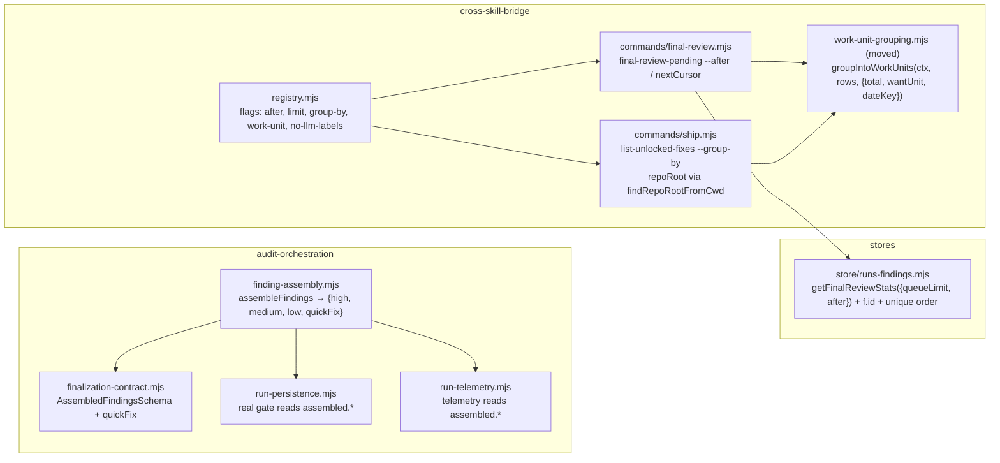

# Plan: Backlog-tooling honesty — telemetry parity, reachable credit queue, shared work-unit grouping, non-vacuous scans, cwd-independent locks
- **Date**: 2026-09-13
- **Status**: Approved
- **Author**: Claude + Louis Strydom
- **Scope**: backend
- **Target domain(s)**: `audit-orchestration`, `cross-skill-bridge`, `stores`, `tests`
- ⚠ **Cross-domain work** — touches >1 domain; every crossing below is an
  existing declared edge (cross-skill-bridge → stores via the store-port barrel;
  tests → everything), no new `allowedDeps` entry is needed.

> **Neighbourhood considered** — `get-neighbourhood` over the seven target
> paths returned 8 records, all `review` / `below-noise-floor-near`
> (`getFinalReviewStats`, `runTelemetry`, `assembleFindings`, and five
> `runs-findings.mjs` readers). Nothing rose above this repo's noise floor;
> every named symbol is one this plan modifies, not duplicates. No new
> abstraction is introduced except one module MOVE (§7 `work-unit-grouping.mjs`).

> **Past incidents to verify against** (1 shown) — **INC-001** (symlink bypass
> of the lexical sensitive-path classifier; `mitigation-passing`). Relevant to
> §7 item 5 only in the sense that `classifyTestPath` already resolves realpath +
> containment; this plan changes which *root* it is anchored to, never the
> classifier. **One provider-bound path exists and is traced** (audit R1 M3):
> `--group-by work-unit` may call `labelWorkUnits` → an LLM. Its prompt
> (`scripts/lib/work-unit-labels.mjs:66-71`) reads `m.detail ||
> m.detail_snapshot || m.category`, `m.primaryFile`, `unit.files` — and the
> grouper's row normalisation (`ship.mjs:231-238`) builds members as `{ id,
> primaryFile, category, createdAt, severity, embedding }`, so **`detail_snapshot`
> never reaches the labeller**: label input is category + file paths only, for
> all three readers, by construction of the shared function. §9 pins this with
> a test, plus one asserting `--no-llm-labels` issues zero provider calls.

## 1. Context Summary

Five defects, all measured 2026-09-13 at `d9778f70`, all in the machinery that
tells an operator what the backlog *is*. None is a bookkeeping row; each makes
a number read wrong or unreachable. They were found while clearing the
`unlocked-fixes` (490 rows, 157 code) and `final-review-credit` (2,217 rows)
backlogs, and together they are why "clear the backlog" was never a well-posed
task through the CLI.

**What exists today (Code Trace, pinned at `d9778f70`):**

1. **Telemetry recounts severity with a weaker filter than the verdict.**
   `runTelemetry(data, assembled, …)` — `scripts/lib/audit/run-telemetry.mjs:46`
   — destructures only `{ allFindings, passRegistry }` from `assembled` (`:56`),
   then at `:268-270` and `:313-315` recomputes `highCount`/`mediumCount` from raw
   `f.severity` after excluding only `enforcement === 'advisory'`. The real
   verdict in `assembleFindings` — `scripts/lib/audit/finding-assembly.mjs:724-742`
   — additionally drops LINTER/TYPE_CHECKER findings unless `strictLint`,
   filters by `countsTowardVerdict`, and maps through `effectiveSeverity` (a
   `refuted` finding counts as nothing). `assembleFindings` already returns
   `{ verdict, high, medium, low }` (`:843-844`) and the
   `AssembledFindingsSchema` requires them
   (`scripts/lib/audit/finalization-contract.mjs:134-137`). The real gate reads
   those — `scripts/lib/audit/run-persistence.mjs` passes `{ high, medium,
   quickFix: allFindings.filter(f => f.is_quick_fix).length }` to
   `evaluateConvergenceWithDetectors`. Telemetry's `converged` (`run-telemetry.mjs:320`)
   is therefore a *third* derivation, and diverges on any round carrying a
   refuted or linter HIGH. Store row `723b5dc5`. **Order matters**:
   `finalizeRun` — `scripts/lib/audit/run-finalization.mjs:60,132-133` — runs
   `assembleFindings` → `runTelemetry` → `runPersistence`, so the detector-aware
   verdict persistence computes (`evaluateConvergenceWithDetectors` +
   `resolveDetectorResultForRound({ round, suppressionUnavailable, ledger, cwd,
   checkDetectorsFn })`, `run-persistence.mjs`, inside the `cloudRunId` block)
   does not yet exist when telemetry reads counts — and a count-only
   `evaluateConvergence` can say `true` on a round the detector gate blocks
   (`REQ-safety-bb8b4eee`: unavailable scope / undispositioned matches). All
   three inputs the resolver needs are already on `data`
   (`FinalizationDataSchema` `:65,68` + `round`).

2. **The credit queue is capped at 50 with no offset.**
   `finalReviewPendingCmd` — `scripts/lib/cross-skill/commands/final-review.mjs:216`
   — clamps `--page-size` to `[1, 50]`, calls
   `getFinalReviewStats(repoName, { queueLimit: 50 })` (`:229`), then
   classifies and `.slice(0, pageSize)` (`:241-245`). The store read —
   `scripts/lib/store/runs-findings.mjs`, `getFinalReviewStats(repoName, { queueLimit = 50 })`
   — ends the `pendingQueue` UNION with `LIMIT $2` and no OFFSET. `actionablePairs`
   (the header totals) is already computed independently of the page. The
   registry entry declares `flags: ['repo', 'commit', 'page-size', render]`
   (`scripts/lib/cross-skill/registry.mjs:494-495`) and `assertKnownFlags`
   exits 2 on anything else. Rows 51..2,217 are unreachable.

3. **Work-unit grouping is wired to one of three backlogs.**
   `groupIntoWorkUnits(ctx, rows, { total, wantUnit })` —
   `scripts/lib/cross-skill/commands/ship.mjs:226-289`, module-private — is
   called only from `listUnremediatedAcceptancesCmd` (`:202-206`) behind
   `--group-by work-unit` / `--work-unit <key>` (registry `:545-548`). It maps
   rows via `r.audit_finding_id`, `r.primary_file`, `r.category`,
   `r.accepted_at`, `r.severity`, looks up vectors with
   `ctx.deps.getFindingEmbeddings(ids)` (keyed on `finding_embeddings.finding_id`
   = `audit_findings.id`), and clusters with `clusterWorkUnits`
   (`scripts/lib/work-units.mjs:139`). `listUnlockedFixesCmd` (`ship.mjs:125`)
   returns rows with the same `audit_finding_id` but a `fixed_at` date;
   `final-review-pending` rows carry `run_id + finding_fingerprint` and **no
   `audit_findings.id`** (the SQL projection at `runs-findings.mjs` selects
   `f.run_id, f.finding_fingerprint, …` and never `f.id`), so reuse is not a
   one-liner there. `ctx.deps` is the store-port barrel
   (`scripts/lib/cross-skill/store-port.mjs:26`), so `getFindingEmbeddings` is
   reachable from every command.

4. **Two static scans went vacuous with the orchestrator decomposition.**
   (a) `tests/run-finalisation-awaited.test.mjs:56-60` lists
   `legacy-production-audit.mjs`, `plan-audit-cloud.mjs`, `openai-audit.mjs` as
   `ORCHESTRATORS` and scans each for un-awaited `recordRunComplete(` /
   `recordConvergenceState(`. `legacy-production-audit.mjs` has **zero** such
   call sites (the writers were dropped from its import line in `d9778f70`);
   the writes now live in `scripts/lib/audit/run-persistence.mjs` as
   `await durableWrite('audit.convergenceState', …)` (`:339`) and
   `await durableWrite('audit.runComplete', …)` (`:447`, `:519`) — a spelling
   the `${writer}(` pattern cannot see. The scan passes on every file with no
   call sites; it cannot tell "all awaited" from "nothing to check".
   (b) `tests/legacy-production-audit-hardening.test.mjs:82-88` asserts the
   spine has no `fs.writeFileSync(` — true because the artifact writes moved to
   sibling modules, which the test does not read.

5. **Dangling-lock detection is anchored to `process.cwd()`.**
   `danglingLocksFor` — `ship.mjs:93-111` — sets
   `repoRoot = realpathSync(process.cwd())` (`:99`) and feeds it to
   `classifyTestPath`. Run from `scripts/lib/audit/` the CLI reported **269**
   dangling locks; from the repo root, **3**. Same pattern at `ship.mjs:402`
   (`lock-with-test`), `:509` (`findTestFilesFor(…, process.cwd())`), `:615`
   (`repoint-regression-spec`), `:743` (`record-regression-spec`). The repo
   already owns one resolver the cross-skill layer uses for provenance —
   `findRepoRootFromCwd()` in `scripts/lib/assert-repo-root.mjs:171-186`
   (`git rev-parse --show-toplevel`, cached per start dir, falls back to the
   start dir) — already the cross-skill layer's resolver: imported at
   `scripts/lib/cross-skill/commands/quality.mjs:147-149`. (The first draft cited
   `ship.mjs:4468-4470` — a line number read off a concatenated grep, not the
   file; corrected in audit R1.)

**Patterns reused vs new**: no new pattern. Item 1 reuses the assembled
counts the contract already requires; item 2 reuses `resolveNudgePage`
(`NUDGE_PAGE_DEFAULT 20 / NUDGE_PAGE_MAX 200`, the paging resolver the other
two backlog readers already use) so there is one paging contract; item 3
extracts the existing helper to a shared module rather than writing a second
clusterer; item 4 keeps the two scans and adds the vacuous-pass guard the
verification-discipline doc asks for; item 5 adopts the resolver the same file
already imports.

## 2. Proposed Architecture

**Key decisions and the principles behind them**

- **One convergence verdict, computed once in `assembleFindings`, consumed by
  both persistence and telemetry** (#5 single source of truth, #1 DRY). `assembled`
  gains `quickFix` (the count the real gate uses — `allFindings.filter(f =>
  f.is_quick_fix).length`, deliberately over ALL findings, matching
  `run-persistence.mjs` today) **and `convergence`** = the detector-aware result
  `evaluateConvergenceWithDetectors({ high, medium, quickFix },
  resolveDetectorResultForRound({ round: round || 1, suppressionUnavailable,
  ledger, cwd: process.cwd(), checkDetectorsFn: checkDetectors }))` — i.e. the
  exact expression `run-persistence.mjs` evaluates today, moved one stage
  earlier so it exists before telemetry runs. Shape: `{ converged: boolean,
  reason: string|null }` plus the three counts. `run-persistence.mjs` reads
  `assembled.convergence` (its stderr "not converged: <reason>" line and the
  `audit.convergenceState` write are unchanged); `run-telemetry.mjs` records
  `assembled.convergence.converged` — never a local `evaluateConvergence`. The
  schema makes both fields **required**, so a hand-built `assembled` cannot omit
  them silently. One behavioural delta, stated: today the detector census runs
  only inside the `cloudRunId` block; after this it runs on every round.
  `checkDetectors` is a filesystem census (no network, no model), and a verdict
  that exists only when the cloud is on is the kind of half-measurement this
  repo keeps paying for.
  *Right-sizing*: band-aid = copy the four filters into run-telemetry (a fourth
  spelling) and keep calling the count-only evaluator; over-built = a
  `ConvergenceOracle` service injected through the contract; chosen = two extra
  fields on an object the contract already validates, computed by the one
  expression that already exists.
- **`final-review-pending` traverses by keyset cursor, not offset** (#5, #13
  idempotency, #18 backward compat). The queue is mutated by the very
  adjudication that walks it — every `final-review-adjudicate` removes a row —
  so an offset skips one row per adjudication (audit R1 H2). Design:
  - **Total order is made unique**: `ORDER BY severity_rank DESC, created_at
    DESC, run_id DESC, finding_fingerprint DESC` (the last two are the
    `audit_findings` identity; today's order stops at `created_at` and is not
    unique under ties).
  - **Cursor = the last RAW fetched row** (before `isActionable` filtering),
    encoded by `encodeQueueCursor({ severityRank, createdAt, runId,
    fingerprint })` → base64url JSON; decoded by `decodeQueueCursor` (both
    exported from `final-review.mjs`, pure, refusing a malformed cursor with
    `CommandError('BAD_INPUT')`). `createdAt` travels as the store's
    `created_at::text` (microsecond-exact), never a JS `Date` (millisecond —
    a µs-tied pair would repeat or skip).
  - **Store**: `getFinalReviewStats(repoName, { queueLimit, after })` wraps the
    existing UNION as a subquery and applies `WHERE (severity_rank, created_at,
    run_id, finding_fingerprint) < ($3, $4::timestamptz, $5, $6)` when `after` is
    present — a single row-value comparison is correct because every key is
    DESC. `actionablePairs` stays page-independent (unchanged).
  - **CLI**: `--page-size` stays as the documented alias, `--limit` is added,
    both resolved through `resolveNudgePage` (cap 200, one resolver);
    `--after <cursor>` continues. The envelope carries `limit`, `after`,
    `nextCursor` (**present even when the actionable page is empty**, null only
    when the store returned fewer than `limit` raw rows), and `pageFilteredOut`
    (raw rows in the page that were not actionable). A caller loops on
    `nextCursor`, never on `shownCount`. No `--offset` — it would be the
    mutation-unsafe contract the cursor exists to replace.
- **Move, don't copy, `groupIntoWorkUnits`** (#1, #3 modularity). It becomes
  `scripts/lib/cross-skill/work-unit-grouping.mjs` with one new option,
  `dateKey` (`'accepted_at' | 'fixed_at' | 'created_at'`), because the three
  readers stamp their recency column differently and coalescing silently would
  hide a missing column. `final-review-pending`'s SQL projection adds
  `f.id AS audit_finding_id` so the embedding lookup key is the same column for
  all three callers. The honesty fields (`partial`, `unclustered`,
  `unclusteredIds`, `labels`) are unchanged by construction — same function.
- **Vacuous-pass guards, not new scans** (#11 testability). (a) `ORCHESTRATORS`
  becomes a list of `{ file, expectCallSites }`; the writer pattern set gains
  the `durableWrite('audit.runComplete'` / `durableWrite('audit.convergenceState'`
  spelling; a `(file, writer)` pair that finds zero call sites **fails** unless
  the entry declares `expectCallSites: 0` with a reason. (b) The
  `fs.writeFileSync(` scan walks `scripts/lib/audit/*.mjs` and additionally
  asserts `atomicWriteFileSync(` appears ≥1 time across that set — the subject
  must exist for the absence to mean anything.
- **Repo root from git, at every lock-related site** (#5). All five
  `realpathSync(process.cwd())` / `process.cwd()` anchors in `ship.mjs` become
  `realpathSync(findRepoRootFromCwd())`. No new resolver; `findRepoRootFromCwd`'s
  fall-back-to-start-dir keeps non-git fixtures working. *Manual, not scripted*:
  five irregular sites.

## 6. Sustainability Notes

- **Assumption**: `assembled` is the only object that crosses the
  finding-assembly → persistence/telemetry seam. If a fourth consumer appears,
  it reads `assembled.{high,medium,quickFix}` — the contract test in
  `tests/finding-assembly.test.mjs` is where a new count gets added.
- **Assumption**: `finding_embeddings.finding_id` is `audit_findings.id`. If the
  embedding key ever changes, `work-unit-grouping.mjs` is the one place all
  three readers meet it.
- **Extension point**: `dateKey` is the only per-reader knob in the grouper.
  Anything else a reader needs should be a column on its row, not a branch in
  the grouper.
- **Deliberately not built**: `--offset` anywhere (mutation-unsafe on a queue
  the reader drains — audit R1 H2); a cursor for `shadowOnlyQueue` /
  `final-review-stats` (nothing reads past its first page today).

## 7. File-Level Plan

| File | Intent | What changes |
|---|---|---|
| `scripts/lib/audit/finding-assembly.mjs` | modify | Compute `quickFix = allFindings.filter(f => f.is_quick_fix).length` beside `high/medium/low`; compute `convergence` via `evaluateConvergenceWithDetectors` + `resolveDetectorResultForRound` (imports move here from run-persistence); return both. |
| `scripts/lib/audit/finalization-contract.mjs` | modify | `AssembledFindingsSchema` gains `quickFix: z.number().int()` and `convergence: z.object({ converged: z.boolean(), reason: z.string().nullable() }).strict()` — both required. |
| `scripts/lib/audit/run-persistence.mjs` | modify | Delete the inline `evaluateConvergenceWithDetectors(...)` block; `const detectorVerdict = assembled.convergence`; stderr reason line and `audit.convergenceState` payload unchanged. |
| `scripts/lib/audit/run-telemetry.mjs` | modify | Delete both local `gatingFindings/highCount/mediumCount` recounts (`:268-270`, `:313-315`), the local `quickFix` and the `evaluateConvergence` import; destructure `high, medium, quickFix, convergence` from `assembled`; `converged = convergence.converged`. |
| `tests/run-telemetry.test.mjs` | modify | New describe: parity — (a) one `refuted` HIGH + one `LINTER` HIGH, real verdict `PASS`, telemetry `converged: true` (red today); (b) zero counts but `resolveDetectorResultForRound` yields `detector-not-run` (R2+ with `suppressionUnavailable: true`), telemetry `converged: false` with the same `reason` persistence records (red today); `dismissed` still counts from `allFindings`. |
| `tests/helpers/multi-pass-audit-fixtures.mjs` | modify | `minimalFinalizationData(overrides)` — the ONE contract-valid FinalizationData builder; `run-finalization`, `run-telemetry` and `finding-assembly` tests import it (audit-code A/R1 M6: three drifted copies). |
| `tests/finalization-contract.test.mjs` | modify | `minimalAssembled` fixture gains `quickFix` + `convergence` (the §8 "required field" consequence, landed in the same commit). |
| `tests/finding-assembly.test.mjs` | modify | Assert `assembled.quickFix` counts ALL `is_quick_fix` findings (including refuted — matches the gate today) and `assembled.convergence` carries `{converged, reason}`. |
| `scripts/lib/store/runs-findings.mjs` | modify | `getFinalReviewStats(repoName, { queueLimit = 50, after = null })`; `pendingQueue` UNION wrapped as a subquery projecting `f.id AS audit_finding_id` and `created_at::text AS created_at_cursor`; unique `ORDER BY severity_rank DESC, created_at DESC, run_id DESC, finding_fingerprint DESC`; `WHERE (severity_rank, created_at, run_id, finding_fingerprint) < ($3, $4::timestamptz, $5, $6)` when `after`; `LIMIT $2`. |
| `scripts/lib/cross-skill/commands/final-review.mjs` | modify | `export encodeQueueCursor/decodeQueueCursor`; `limit` via `ctx.deps.resolveNudgePage({ limit: page-size ?? limit })`; `--after` decoded and passed to the store; drop the client `.slice`; envelope adds `limit`, `after`, `nextCursor` (from the last RAW row; null when raw rows < limit), `pageFilteredOut`; `--group-by work-unit` / `--work-unit` / `--no-llm-labels` via the shared grouper with `dateKey: 'created_at'`. |
| `scripts/lib/cross-skill/registry.mjs` | modify | `final-review-pending.flags` += `limit`, `after`, `group-by`, `work-unit`, `no-llm-labels` (boolean); `list-unlocked-fixes.flags` += `group-by`, `work-unit`, `no-llm-labels` (boolean). |
| `scripts/cross-skill.mjs` | modify | `KNOWN_FLAGS` += `--after` — the legacy GLOBAL gate runs before the registry's, so a registry-only flag is refused before its command runs (found by the Cluster B live smoke: 6 green unit tests, `unknown flag "--after"` on first real use). |
| `tests/cross-skill-registry-conformance.test.mjs` | modify | Every registry flag must also be in `KNOWN_FLAGS` (negative control: dropping `--after` fails it). |
| `scripts/lib/cross-skill/work-unit-grouping.mjs` | create | `export async function groupIntoWorkUnits(ctx, rows, { total, wantUnit, dateKey })` — the body moved verbatim from `ship.mjs:226-289`, `createdAt: r[dateKey]`. |
| `scripts/lib/cross-skill/commands/ship.mjs` | modify | Remove the private grouper; import from `work-unit-grouping.mjs`; `listUnlockedFixesCmd` gains the same `--group-by`/`--work-unit` tail with `dateKey: 'fixed_at'`; `listUnremediatedAcceptancesCmd` passes `dateKey: 'accepted_at'`; five `process.cwd()` anchors → `findRepoRootFromCwd()`. |
| `tests/backlog-work-unit-grouping.test.mjs` | create | Fake `ctx.deps.getFindingEmbeddings`; three readers, three `dateKey`s; asserts `partial`/`unclustered` honesty carries over and `--work-unit` filters on `audit_finding_id`; **egress**: members handed to `labelWorkUnits` carry no `detail`/`detail_snapshot` key even when the input rows do (canned sensitive `detail_snapshot`), and `--no-llm-labels` results in zero calls on a spied provider. |
| `tests/final-review-pending.test.mjs` | modify | Cursor round-trip (`encode` ∘ `decode` = id; malformed → `BAD_INPUT`); store fake records `{queueLimit, after}`; `--after <c> --page-size 10` reaches the store decoded; `nextCursor` is derived from the last RAW row and present when every row in the page was filtered out; null when raw rows < limit; `pageFilteredOut` arithmetic. Unknown flag (`--offset`) still exits 2 (negative control). |
| `tests/final-review-pending-db.test.mjs` | create | Real Postgres (`AUDIT_DB_TEST_URL`, skip otherwise): seed both UNION branches incl. two rows 1 µs apart and a tied-severity pair; walk the whole queue by cursor with `queueLimit: 2` — every row exactly once, `actionablePairs` identical on every page, `audit_finding_id` present, beyond-end → `[]`; delete a row mid-walk and assert no skip; `final-review-stats` (no `after`) unchanged. |
| `scripts/db-test-container.mjs` | modify | Enrol `tests/final-review-pending-db.test.mjs` in `ISOLATED_SUITE_FILES`. |
| `.github/workflows/postgres-parity.yml` | modify | Enrol the same file in the parity job's list (lockstep with the line above). |
| `tests/dangling-regression-lock.test.mjs` | modify | Fixture git repo with `tests/x.test.mjs`; `process.chdir(<repo>/scripts)`; `listUnlockedFixesCmd` reports `danglingLocks.count === 0` for a lock naming `tests/x.test.mjs` (red today: 1). |
| `tests/run-finalisation-awaited.test.mjs` | modify | `ORCHESTRATORS` → `[{file, expectCallSites}]` incl. `run-persistence.mjs`; writer patterns include the `durableWrite('audit.…'` spelling; zero-hit pair fails unless declared. |
| `tests/legacy-production-audit-hardening.test.mjs` | modify | Phase-1 scan walks `scripts/lib/audit/*.mjs`; asserts ≥1 `atomicWriteFileSync(` in the set. |
| `skills/ship/SKILL.md` | modify | Step 0.5's `final-review-pending` note documents the cursor walk — first page bare, then `--after <nextCursor>` repeated **until `nextCursor` is null, continuing through pages whose `items` is empty** — and `--group-by work-unit`; `--offset` appears only as "not supported (mutation-unsafe)". BARE commands, no shell expansion; regenerated copy verified by `skills:check`. |

Regex-resolvable paths: 17 (≥5 — fuzzy discovery will not fire).

### 7b. Implementation Phases

**Phase 1 — Convergence counts owned by assembly**: add `quickFix` to
`assembleFindings` + schema; persistence and telemetry read `assembled.*`;
parity test red→green. Files: `scripts/lib/audit/finding-assembly.mjs`
(modify), `scripts/lib/audit/finalization-contract.mjs` (modify),
`scripts/lib/audit/run-persistence.mjs` (modify),
`scripts/lib/audit/run-telemetry.mjs` (modify), `tests/run-telemetry.test.mjs`
(modify), `tests/finding-assembly.test.mjs` (modify),
`tests/finalization-contract.test.mjs` (modify),
`tests/helpers/multi-pass-audit-fixtures.mjs` (modify).

**Phase 2 — Non-vacuous static scans**: retarget both tests and add the
zero-hit guards. Files: `tests/run-finalisation-awaited.test.mjs` (modify),
`tests/legacy-production-audit-hardening.test.mjs` (modify).

**Phase 3 — Shared work-unit grouper + cwd-independent locks**: extract the
grouper, wire `list-unlocked-fixes`, fix the five repo-root anchors. Files:
`scripts/lib/cross-skill/work-unit-grouping.mjs` (create),
`scripts/lib/cross-skill/commands/ship.mjs` (modify),
`scripts/lib/cross-skill/registry.mjs` (modify),
`tests/backlog-work-unit-grouping.test.mjs` (create),
`tests/dangling-regression-lock.test.mjs` (modify),
`scripts/cross-skill.mjs` (modify), `tests/cross-skill-registry-conformance.test.mjs` (modify).

**Phase 4 — Reachable credit queue**: unique order + keyset cursor in the
store; CLI `--after`/`nextCursor` via `resolveNudgePage`; grouping via the
shared grouper; real-Postgres suite enrolled in both runners; ship SKILL note.
Files: `scripts/lib/store/runs-findings.mjs` (modify),
`scripts/lib/cross-skill/commands/final-review.mjs` (modify),
`tests/final-review-pending.test.mjs` (modify),
`tests/final-review-pending-db.test.mjs` (create),
`scripts/db-test-container.mjs` (modify),
`.github/workflows/postgres-parity.yml` (modify), `skills/ship/SKILL.md` (modify).

**Close-out (not a phase)**: `npm run skills:regenerate && npm run skills:check`
(SKILL.md edit → generated copy); `npm run size:ratchet:gate` (re-baseline
`runs-findings.mjs` with `--update-baseline` in the same commit if it grew);
`npm run db:enrolment:gate`; `npm run emit:exit:gate`; `npm run cli:flags:gate`;
live smoke (optional, cwd-independence): `CLI=$(pwd)/scripts/cross-skill.mjs;
node "$CLI" list-unlocked-fixes` from the root and again from
`scripts/lib/audit/` (same absolute entry point) must report the **same**
`danglingLocks.count` — compared, not pinned to today's 3.

## 8. Risk & Trade-off Register

- **`quickFix` becomes a required contract field** → any test that hand-builds
  `assembled` without it now fails at `validateAssembledFindings`. That is the
  intended direction (a missing count is a silent zero); grep
  `tests/**` for `validateAssembledFindings`/`runTelemetry(` fixtures and add
  the field in the same commit.
- **`quickFix` counts ALL findings, not `countFor`** — this matches the real
  gate today (`run-persistence.mjs`). Changing the gate's population is out of
  scope; the plan makes telemetry equal the gate, whatever the gate is.
- **Raising the credit-queue cap 50 → 200** increases one SQL page; the query
  is already ordered by severity rank and indexed on `run_id`; 200 rows of the
  display-safe projection is well under any envelope limit.
- **`scripts/lib/store/runs-findings.mjs` is ratcheted** (`.file-size-baseline.json`:
  2370; measured 2367 at `d9778f70`). The cursor subquery adds lines; if the
  file crosses 2370 the same commit runs `node scripts/file-size-ratchet.mjs
  --update-baseline` — never pads or exempts. No other touched file is baselined
  (`ship.mjs` 830, `finding-assembly.mjs` 851, `run-persistence.mjs` 593).
- **Cursor precision**: `created_at` is `timestamptz` (µs). The cursor carries
  `created_at::text` and binds it back as `$4::timestamptz`; a JS `Date` in the
  cursor would truncate to ms and repeat/skip rows tied within a millisecond.
  The DB test seeds two rows 1 µs apart to pin this.
- **Detector census now runs on every round, not only cloud-on rounds** (see
  §2). `checkDetectors` walks the repo's detector registry on disk; measured
  cost is one directory read. A repo without detectors resolves
  `detector-not-run` exactly as it does today inside the cloud block.
- **`f.id AS audit_finding_id` in a UNION** — both branches must project the
  identical column list (Postgres requires it). A fake-store test cannot prove
  the projection, the fourth bind, or the row-value comparison, so the plan
  commits a **real-Postgres suite**: `tests/final-review-pending-db.test.mjs`,
  on the `AUDIT_DB_TEST_URL` / `skip` pattern of
  `tests/final-review-adjudicate.test.mjs:24`, **enrolled in BOTH**
  `ISOLATED_SUITE_FILES` (`scripts/db-test-container.mjs:66`) and
  `.github/workflows/postgres-parity.yml` (`:233` block) — two edits, never one
  (AGENTS.md: a DB suite no runner names has never run).
- **`process.chdir` in a test** is process-global; the dangling-lock test must
  restore cwd in `finally` and cannot run in parallel with another chdir test
  in the same file — keep it in the one file.
- **Deferred, stated**: `a2c3744e` (spine still 1,701 lines; store says fixed)
  belongs to `docs/plans/god-module-and-layering-debt.md`; this plan only
  corrects the record in `status.md`. The 333 plan-mode unlocked-fixes rows are
  written off in `status.md` at ship (precedent 2026-08-11), not touched here.

## 9. Testing Strategy

- **Unit (Tier 1, test-first)**: telemetry/verdict parity with a refuted HIGH +
  LINTER HIGH fixture AND a zero-count detector-blocked fixture (both must fail
  before Phase 1); `assembled.quickFix`/`convergence` presence; cursor
  encode/decode; `nextCursor` from the last RAW row; `pageFilteredOut`
  arithmetic; grouper `dateKey` for all three readers; `--work-unit` filter;
  dangling-lock classification from a subdirectory cwd (must fail before Phase
  3 — the 269-vs-3 defect in miniature).
- **Static-scan guards (Tier 1)**: both retargeted scans must be **seen to
  fail** — temporarily add a `recordRunComplete(` without `await` to a scratch
  copy / set `expectCallSites` wrong — before the green is trusted.
- **Integration (real Postgres, enrolled)**: `tests/final-review-pending-db.test.mjs`
  as described in §7 — full cursor walk, µs tie, mid-walk deletion.
  Live smoke: `final-review-pending --repo Lbstrydom/claude-engineering-skills
  --page-size 10` then `--after <nextCursor>` returns 10 rows disjoint from the
  first page; `list-unlocked-fixes --group-by work-unit` returns
  `grouping.basis === 'work-unit'`.
- **Negative controls**: an unknown flag on `final-review-pending` still exits
  2; `final-review-pending` with cloud off still returns `state: 'disabled'`
  regardless of paging flags.
- **Edge cases**: a cursor past the end → `items: []`, `nextCursor: null`,
  `counts` unchanged; a page whose every raw row is non-actionable →
  `items: []` but `nextCursor` non-null (the walk continues); a reader whose rows lack `dateKey` → `createdAt`
  undefined is passed through to `clusterWorkUnits` (which already tolerates
  it) — assert no throw.

## 11. Execution Clustering

- **Cluster A** — Phases 1–2 — fix-gate: yes
  - Coupling: both sit on the orchestrator-decomposition seam. Phase 1 changes
    what `assembled` carries across finding-assembly → persistence/telemetry;
    Phase 2 retargets the scans that watch exactly those modules
    (`run-persistence.mjs` joins `ORCHESTRATORS`). Auditing them together lets
    the wiring pass see that the new `quickFix` read and the new scan target
    name the same call sites.
- **Cluster B** — Phases 3–4 — fix-gate: final
  - Coupling: one grouper, three readers. Phase 3 creates
    `work-unit-grouping.mjs` and its `dateKey` contract; Phase 4 is its third
    consumer and adds the `audit_finding_id` column the grouper keys on. Split
    apart, Phase 4's audit would judge a call into a module it cannot see.
  - author-tier: standard
- **Final gate**: consolidated Gemini review over the union diff of Clusters A–B.

## Audit trail

- **R1** (`audit-plan-1789317327`, GPT, `--mode plan`): H:2 M:3 L:1, **acceptance
  100%** (5 accepted, 1 severity-adjusted). H1 → convergence computed once in
  assembly (telemetry runs before persistence); H2 → keyset cursor replaces
  offset; M1 → premise wrong (`ship.mjs` is 830 lines; the plan's own
  `ship.mjs:4468` citation was a concatenated-grep artefact, corrected), concern
  re-pointed at the ratcheted `runs-findings.mjs`; M2 → real-Postgres suite
  enrolled in both runners; M3 → label-egress traced and pinned; L1 → close-out
  smoke compares root vs subdirectory via an absolute entry point.
- **R2** (round 2, ledger-suppressed): H:0 M:1 L:0, acceptance 100%. M4 →
  propagation debt from R1's cursor redesign (diagram + ship-skill row still
  said `--offset`); aligned. Stopped after R2: the only finding was consumer
  propagation, not design.
- **Gemini gate** (`--mode plan`, run `d11e5dcf`): **APPROVE** — 0 new, 0 wrongly
  dismissed. Plan approved for `/cycle --autonomous`.

## Out of Scope (Future) — debt surfaced by the Cluster B code audit

The Cluster B audit read all of `scripts/lib/store/runs-findings.mjs` (2,357
lines) because `getFinalReviewStats` lives there, and raised 18 HIGH findings
against its **writers** — none on the cursor read path this plan changes, all
pre-existing. Independence: `getFinalReviewStats` is a read; it calls none of
the functions below. Recorded here so the deferral is visible, not a dismissal:

- **Repository scope not enforced in writers** — `applyRemediationVerificationResults`,
  `projectRemediationState`, run/finding mutations trust `runId` alone (R1 H1/H13).
- **Unverified write success** — `recordAdjudicationEvent`, `updateRunMeta`,
  `updatePassStatsPostDeliberation` discard affected-row counts (H2).
- **Destructive replay** — `recordFinalReviewFindings` deletes-then-inserts,
  losing adjudication state on retained rows; primary/shadow transactions are
  uncoordinated; shadow metadata cannot be cleared (H3/H4/H14/M8).
- **Reconciliation identity loss** — `selectReconcileTargets` keeps fingerprints,
  `markFindingsRemediation` re-resolves to the newest row (H5/H15).
- **Intra-batch dedup key narrower than the SQL conflict key** in `recordFindings` (H6/H16).
- **`pass_name` not restricted** in `resolveFindingBucket` / adjudicate / record-fix (H7).
- **Omission semantics differ** between the findings patch and the adjudication event (H8).
- **SELECT-then-UPDATE race** in `recordFinalReviewFix` (H9/M6).
- **Transactional error swallowed** in `persistKeptEmbeddings`; capability probes
  use the pool while a tx client is held (H10/H11/H17/H18).
- **Failure-to-success degradations** — adjudication fulfil-with-undefined, probe
  false-on-failure, SKILL.md count fallback prose (H12).
- **Offset paging** on `list-unlocked-fixes` / `list-unremediated-acceptances` (M7)
  — deliberately not built here (§6); these are windowed nudges, not drained queues.
- **`skills:hydrate` one-liner** overlays without pruning (M5) — repo-wide preflight boilerplate.

These belong to a store-writer hardening plan, not to a backlog-reader plan.
