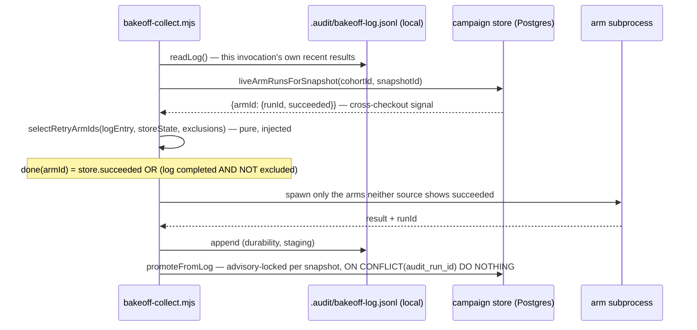

# Plan: Campaign Arm-State and Snapshot-Identity Integrity

- **Date**: 2026-08-19
- **Status**: Approved — audited (6 GPT rounds, 5 Gemini rounds total across sessions, all findings fixed), ready for implementation. Round 6 (2026-08-20, this /cycle session, operator-approved 1 GPT + 1 Gemini round to converge): GPT R1 found H1 (Phase 6 `isComplete` read a stale entry-level `configDigest` instead of each arm's own — fixed to per-arm), H2 (`--confirm-mismatch` promoted one arm's new hash while siblings stayed live on the old one — fixed: auto-quarantines the old pairing in the same locked transaction), M1 (strict NULL-vs-hash comparison on `plan_content_hash` forced a full re-spawn of all 5 genuinely-valid legacy snapshots, not just the 3 quarantined ones — fixed: grandfathered permissive-NULL, matching `config_digest`'s policy; quarantine alone now distinguishes bad legacy pairings), M2 (declared signature omitted `expectedPlanContentHash` — fixed). Gemini (CONCERNS) then found: HIGH (asked for a `client` parameter on `markSnapshotExcluded` to match `recordArmRun`'s round-5 pattern) — resolved at the ROOT instead: empirically verified against the live store that `withTx` is already re-entrant via `AsyncLocalStorage` [confirmed by comparing `pg_backend_pid()` across nested `withTx` calls — identical], so round 5's original H3 premise was itself wrong and the `client`-parameter design was removed from `recordArmRun` rather than duplicated onto `markSnapshotExcluded`; MEDIUM (the relatedness heuristic's regex kept full paths, so a transcript's `scripts/x.mjs` never matched a plan's bare `x.mjs` prose citation — fixed: basename normalisation, matching the manual method's own precedent); LOW (`unquarantine` was non-idempotent on retry-after-timeout — fixed: a zero-rows UPDATE now disambiguates "already lifted" [benign] from "never existed" [real error]). Stopped after 1 Gemini round per operator approval, all 3 findings resolved rather than deferred.

**Close-out (2026-08-20, same session).** Live-verified against `final-review-scoped-2026q3` (cohort `e52eec728688fcab`): quarantined the 3 documented mis-paired snapshots (`2bb342bdd692`, `307a360d0d52`, `bf6f7fa76385`) via `campaign.mjs quarantine`, then re-collected all 3 against their corrected plans (2 already identified in `docs/research/campaign-2026q3-mispaired-snapshots.md`; the third — `audit-plan-1786682531-transcript.json` — identified here via git-blame evidence: its cited files `contract`/`render-mermaid`/`refresh-subprocess` were all introduced by the single commit implementing `docs/plans/tiered-pipeline-refresh-god-module-decomposition.md`). Result: `N complete` 8 → 6 (post-quarantine) → 9/12 (post-re-collection) — better than the plan's original "5/12" estimate, since one snapshot's `qwen` arm succeeded on its first live retry.

Two more real bugs found and fixed via this live re-collection (neither introduced by this plan, both pre-existing since 2026-08-16/17, fixed here because they directly corrupted the arm-completion integrity this plan exists to guarantee):
- `classifyLogEntry`'s `armRuns` mapping read `arm.error`, but a LIVE bakeoff-log entry carries its failure under `arm.shadowError` — every genuinely failed live attempt silently promoted with `error: NULL`, which `liveArmRunsForSnapshot`'s `error IS NULL` gate read as success. 5 already-written production rows repaired after the code fix landed.
- A single-arm retry (`retryArmIds` computed from STORE state, independent of the local log) crashed with `existing.arms` unguarded when the local `bakeoff-log.jsonl` had no entry at all for that snapshot — a fresh-fixture scenario the surrounding code was clearly written to anticipate (per its own comments) but this one line missed.

Also explored (then reverted): adding `z-ai/glm-5.3` as a 7th shadow arm. Confirmed live on OpenRouter's catalog but returns a hard, structural HTTP 404 ("no endpoints found that can handle the requested parameters") for this campaign's structured-output + high-reasoning-effort requirements — not transient (3/3 real attempts, identical failure, ~0.2-0.3s each). Reverted rather than leave every snapshot permanently incomplete; the arms-array change forked the cohort in two (adding then removing an arm changes `configDigest`, which is hashed over the whole `arms` array), requiring a manual data migration (`cohort_id`/`snapshot_row_id`/`attempt`/`config_digest` correction on 16 rows) to reunify the genuinely-succeeded evidence back under the original lock. A useful lesson for any FUTURE arm-roster change to this campaign: expect the same fork, and budget the reunification step.
- **Author**: Claude + pill
- **Scope**: backend

- **Target domain(s)**: `scripts` (entry points), `shared-lib` (bakeoff/*), `model-eval` (campaign/*)
- ⚠ **Cross-domain work** — touches `scripts` (entry points), `shared-lib` (bakeoff pure modules), and `model-eval` (campaign/promote + store) domains; every boundary crossed here is one this plan deliberately widens (new store reads, a new pure module), not an accidental leak.

## 1. Context Summary

**What exists today.** `final-review-scoped-2026q3` is a live model-comparison
campaign (cohort lock `e52eec728688fcab`) run via `scripts/bakeoff-collect.mjs`
against six shadow-reviewer arms. Collection increasingly happens from
**pinned worktree fixtures** (`scripts/pinned-worktree.mjs`, shipped
2026-08-18) rather than the main checkout — a fixture is a fresh git worktree
with its own empty `.audit/` (gitignored, so absent from any new checkout).
That shift exposed six real defects over 2026-08-18/19, all measured against
this exact campaign, not hypothetical:

1. **Retry scoping is log-local, not store-authoritative.**
   `selectRetryArmIds` decides which arms to re-spawn by reading the LOCAL
   `.audit/bakeoff-log.jsonl`. A fresh fixture's log is empty, so retrying a
   partially-complete snapshot from one re-spawns **every** arm instead of the
   one that failed. Measured: expected 1 arm re-billed, got 6, promoted 0.
2. **Promotion compares attempt COUNTS, not identities.** A fresh fixture's
   log restarts attempt numbering at 1, colliding with the store's own
   attempt-1 (which may have been the failure). The count comparison
   concludes "already promoted" and silently drops a genuinely successful
   arm-run. Measured: snapshot `2bb342bdd692`'s `grok` arm succeeded in a
   fixture run, was invisible to promotion, and required a `--force` full
   re-collection (~$4, all 6 arms) to unstick — which then independently hit
   defect #4 below, compounding the cost.
3. **Two oracles for arm state, no divergence detection.** #1 and #2 are two
   symptoms of one root cause: the local log and the store can disagree about
   whether one `(snapshot, arm)` succeeded, and nothing surfaces the
   contradiction.
4. **No identity binding between a transcript and the plan it is paired
   with.** `--transcript`/`--plan` are checked only for existence, never
   relatedness. Snapshot identity hashes the transcript alone. Consequence,
   already partially remediated: an operator (me) mis-paired 3 of 9 real
   snapshots — reviewers judged a transcript against an unrelated design
   document, and nothing in the pipeline could detect it (see
   `docs/research/campaign-2026q3-mispaired-snapshots.md`, the incident
   record and quarantine list, committed `6233d014`).
5. **`isComplete` never checks `configDigest`**, only `envelopeScope` —
   reported by a parallel session's adjudication work, independently
   confirmed against current code in this plan's exploration below.
6. **No quarantine mechanism in the store.** The 3 mis-paired snapshots are
   documented in the incident file but the store still counts them:
   `campaign.mjs status` currently reports `N=8/12` when usable evidence is
   5. The markdown file is the only record, and this will recur for any
   future quarantine.

**Patterns reused.** The existing `classifyLogEntry` eligibility check
already refuses a snapshot whose live arms recorded more than one
`audited_sha` ("one snapshot is one revision") — §4's plan-identity fix
mirrors that exact shape for plan consistency, rather than inventing a new
pattern. `recordArmRun` already wraps its supersede+insert in `withTx`; this
plan's identity-keyed promotion reuses that transaction boundary, it does not
add a new one.

**Known constraint, deliberately not fixed here.** A parallel session traced
one instance of defect #4 to a *likely* contributing cause: `/audit-plan`
mints session ids at second granularity (`audit-plan-$(date +%s)`) with
unlocked round-file writes, so two concurrent sessions can collide on one SID
and clobber each other's round files. That is a `/audit-plan`
orchestration + `scripts/lib/file-io.mjs` write-locking fix, a different
subsystem from the bake-off collection pipeline this plan covers. Noted here
so it is not lost, not absorbed — see §8.

### Code Trace

- `node scripts/cross-skill.mjs get-neighbourhood` on the six modules below
  returned `isComplete` (`scripts/lib/bakeoff/summary.mjs:46-84`) at
  `above-floor-cluster` — genuine precedent, read in full before proposing
  §4's fix.
- `scripts/bakeoff-collect.mjs:93-98` (09741f93) — `selectRetryArmIds` takes
  `existing`/`existingScope`, both derived from `readLog().find(...)`
  (line 297) — no store read anywhere in the function or its call site.
- `scripts/bakeoff-collect.mjs:400` (09741f93) — `const arms = retryArmIds ?
  { ...existing.arms, ...mergeRetryHistory(newArms, existing.arms) } :
  newArms;` — on a fresh log (`existing` undefined), `retryArmIds` is `null`
  (line 94's early return), so `ARMS = fullArms` (line 341): every declared
  arm is spawned, confirming defect #1's exact mechanism.
- `scripts/bakeoff-collect.mjs:297-305` (09741f93) — the "already collected,
  skipping" guard is *also* `readLog()`-only: an already-complete snapshot,
  per the store, will be silently **re-collected in full** from a fresh
  checkout with no `--force` needed. This is the same root cause as #1,
  wider than "retry a partial snapshot" — worth stating precisely since it
  is a bigger blast radius than the incident that surfaced it.
- `scripts/lib/bakeoff/log.mjs:51-54` (09741f93) — `snapshotId(transcriptPath)`
  hashes `fs.readFileSync(transcriptPath)` alone; no `plan` parameter exists
  on the function. Confirms defect #4's identity mechanism exactly.
- `scripts/bakeoff-collect.mjs:433-434` (09741f93) — the log entry DOES
  already carry `plan` (`path` as passed on the CLI, unnormalised — could be
  relative or absolute depending on invocation). Plan intent is *recorded*,
  just never *validated* or *hashed into identity*.
- `scripts/lib/campaign/promote.mjs:207-223` (09741f93) —
  `resolvePromotionAttempts({existingAttempt, recordedAttempts, forced})`
  compares two **integers**. No `runId`/`audit_run_id` comparison anywhere in
  the function. `forced` is the only branch that bypasses the "already
  promoted" skip (`toRecord = forced ? k : k - n`).
- `scripts/lib/campaign/promote.mjs:164-168` (09741f93) — `isArmRetried`
  reads `entry.retriedArmIds`/`entry.forced`, both log-derived fields set by
  the collector based on the collector's OWN local log state at spawn time
  (`bakeoff-collect.mjs:431-432`). On a genuinely fresh checkout even
  `--force` doesn't set these (`force && existing`, and `existing` is
  `undefined`), so `forced` resolves `false` in `resolvePromotionAttempts`,
  and a real success is silently dropped — this is the exact, traced
  mechanism behind the `grok` incident in #2 above.
- `scripts/lib/campaign/promote.mjs:88-119` (09741f93) —
  `classifyLogEntry`'s existing "one snapshot is one revision" refusal
  (`shas.size > 1`) is the pattern §4 (plan-identity) reuses for plan
  consistency across attempts.
- `scripts/lib/bakeoff/scope.mjs:87-129` (09741f93) — `ResolvedScope` is
  exactly `{campaignId, arms, expectedScope}`. There is **no** `configDigest`
  field in the type at all — defect #5's fix requires widening this shape,
  not just adding a comparison inside `isComplete`.
- `scripts/lib/bakeoff/arms.mjs:282-288` (`scopeForEntry`) and `:331-351`
  (`resolveArms`) (09741f93) — **both** compute `configDigest`
  (`selected.configDigest` / `r.configDigest`) and then **discard** it when
  calling `createResolvedScope(campaignId, arms, envelopeScope)` — the digest
  is available at both call sites and simply never threaded through.
- `scripts/lib/bakeoff/summary.mjs:46-84` (09741f93) — `isComplete` checks
  `contractEpoch`, that every declared arm ran, and (lines 67-83) that every
  shadow-producing arm's `_shadow.scope === expectedScope`. No `configDigest`
  comparison exists anywhere in the function — independently confirms the
  parallel session's report.
- `.campaigns/final-review-scoped-2026q3.json`, `.campaigns/final-review-2026q3.json`
  — `grep -l "plan" .campaigns/*.json` returns nothing; `scripts/lib/comparison/arms.mjs`
  (`ArmSchema`) and `scripts/lib/campaign/config.mjs` (`CampaignConfigSchema`)
  have no `plan`/`planFile` field at any level. Confirms: `--plan` is
  **purely a CLI argument today**, with no persisted declaration of intent in
  the manifest schema.
- DB schema, confirmed both via direct queries AND the defining migration
  (`supabase/migrations/20260811000000_campaign_adjudication.sql:94-124`,
  09741f93): `campaign_snapshots(id, cohort_id, snapshot_id, audited_sha,
  transcript_path, created_at)`, `UNIQUE(cohort_id, snapshot_id)` — **exactly
  one row per snapshot in a cohort**, no plan column, no exclusion/status
  column. `campaign_arm_runs(id, cohort_id, snapshot_row_id, snapshot_id,
  arm_id, attempt, superseded_at, audit_run_id, usage, cost_usd, cost_status,
  error, created_at)`, `UNIQUE(cohort_id, snapshot_id, arm_id, attempt)` plus
  a partial unique index `idx_campaign_arm_runs_one_live` on `(cohort_id,
  snapshot_id, arm_id) WHERE superseded_at IS NULL` — **no uniqueness or
  lookup keyed on `audit_run_id` itself**, confirming defect #2 is baked into
  the schema's own indexing, not just the promotion function's logic. **The
  `error TEXT` column is the existing, nullable success/failure
  discriminator** on an arm run (`recordArmRun`,
  `scripts/lib/store/campaign.mjs:598-627`, 09741f93, sets it from the
  caller) — a live row with `error IS NULL` is a completed attempt; a live
  row with `error IS NOT NULL` recorded a failure. This is the field
  `liveArmRunsForSnapshot` (§7 Phase 2) must expose, not just liveness.
- `scripts/lib/store/campaign.mjs:1324-1332` (09741f93) — `loadCohortEvidence`
  builds `bySnapshot` (the structure `verdict.mjs`'s `nComplete` is computed
  from) **entirely** from `loadCohortArmRuns(cohortId)`, which has **exactly
  one call site** (verified: `grep -rn "loadCohortArmRuns("` returns only
  this one). This is the single, safe enforcement point for quarantine — a
  `WHERE`/join clause added to `loadCohortArmRuns`'s query makes every
  consumer (status, verdict, cost aggregation, adjudication-coverage gate)
  correct with zero other code touched.
- `scripts/lib/store/campaign.mjs:598-627` (09741f93) — `recordArmRun`
  already wraps its supersede-then-insert in `withTx`. This plan's
  identity-keyed promotion reuses that boundary; it does not add a new one.

### Neighbourhood considered

`get-neighbourhood` on the six target modules returned 8 candidates, headed
by `isComplete` at `above-floor-cluster` (score 0.836) — read in full (see
Code Trace) before designing §4. The remainder (`mintArmRun`,
`resolvePromotionAttempts`, `isCompleteForEntry`, `classifyArmCollisions`,
`promoteFromLog`, `mergeRetryHistory`, `classifyLogEntry`) are the same
functions this plan already reads and modifies — the neighbourhood query
confirms there is no *other*, unrelated implementation of arm-completion
logic elsewhere in the repo to reconcile with.

## 2. Proposed Architecture

**Core decision: "has this (snapshot, arm) already succeeded" is answered by
the UNION of the store and this invocation's own local log — not by the
store alone.** Round-1 draft made the store the sole oracle and demoted the
log to durability-only; round-4 audit (H2) found that this breaks the
NORMAL, non-error workflow gap between `bakeoff-collect.mjs` (writes the
log) and the later, separate `campaign.mjs reconcile` (promotes the log into
the store) — a completed arm sitting in the local log, not yet promoted,
would read as absent from the store and be silently re-spawned. The store
supplies what the log alone cannot see (successes from OTHER checkouts/
fixtures — the original defect); the log supplies what the store alone
cannot see (a just-collected, not-yet-promoted success in THIS invocation).
An arm is retry-eligible only when **neither** source shows a genuine,
non-quarantined success — both signals are filtered through the same
quarantine-exclusion check (§7 Phase 2), so a locally-cached "done" for a
now-quarantined pairing cannot block a correction either.

For the WRITE side, `resolvePromotionAttempts`/`isArmRetried` move from
*count or flag comparison against local state* to *identity comparison
against the store's own `audit_run_id` values, backed by a real DB
constraint AND a per-snapshot advisory lock* (§7 Phase 1/3 — added in
round-1 and round-4 audit; see H4/H1 round 4 below) that fully serializes
promotion for one snapshot, closing the concurrent-reconcile races a
constraint alone could not.

This is argued, not asserted: the alternative — an explicit reconciliation
step that detects log/store divergence and repairs it — would still need the
store to be consulted once divergence is *found*, so it doesn't remove the
need for identity-keyed promotion; it would only add a second mechanism on
top. The log exists for real reasons (batching within one process's spawns,
surviving a mid-collection crash, AND — round 4 — carrying the not-yet-
promoted truth about this invocation's own recent collections) that this
plan keeps and now formally reads from, not just writes to.

### Right-sizing gate: plan-identity binding (§7 Phase 4)

- **Band-aid**: leave `--plan` as an unvalidated CLI argument (today's
  state). Zero mechanism; the exact defect that mis-paired 3 real snapshots
  recurs the next time an operator guesses.
- **Over-engineered**: fold the plan's content hash into `snapshotId()`
  itself (`sha256(transcriptBytes + planBytes)`). This is a **breaking
  identity change** — every existing `snapshot_id` in `campaign_snapshots`,
  `campaign_arm_runs`, and `campaign_worksheet_rows` would need
  recomputation or the old rows become permanently unreferenceable by their
  own campaign. It buys the ability to treat "same transcript, different
  plan" as two first-class distinct snapshots — a property nobody has asked
  for; the actual requirement is *detecting and refusing/warning on* a
  mismatch, not *coexisting* with it.
- **Chosen**: keep `snapshotId()` transcript-only (no identity change, no
  migration of existing rows). Add a `planContentHash` **field per arm-run
  attempt** — recorded on the log entry and on `campaign_arm_runs` (new
  nullable column, §7 Phase 1), **not** on `campaign_snapshots`. This
  correction is itself a round-1 audit finding (H1): `campaign_snapshots` is
  exactly ONE row per `(cohort_id, snapshot_id)` (confirmed,
  `UNIQUE(cohort_id, snapshot_id)`), but this plan's own Close-out
  re-collects a quarantined snapshot's transcript against a *different*,
  corrected plan — so the pairing is a property of one COLLECTION EVENT (one
  arm-run attempt), not a fixed property of the snapshot row. Storing the
  hash on the snapshot would make the very re-collection this plan exists to
  enable overwrite or conflict with the original. Two independent, additive
  checks then apply **per attempt**, not per snapshot: (a) a
  **collection-time soft heuristic** (§7 Phase 4a) that warns when the
  transcript's cited files and the plan's own referenced paths share no
  overlap — this is the exact check that would have caught all 3 real
  mis-pairings, demonstrated by hand during quarantine; (b) a
  **promotion-time consistency check** (§7 Phase 4b), shaped identically to
  the existing `audited_sha` "one snapshot is one revision" refusal, that
  loudly flags — never silently accepts — a new attempt whose plan hash
  differs from the snapshot's currently-live (non-quarantined) attempts. The
  current requirement both serve: stop an operator's guess from entering the
  evidence base undetected, and make a *deliberate* re-pairing (the
  correction this plan's own quarantined snapshots need) visible rather than
  a silent supersession — while still letting that correction actually land,
  which a snapshot-level hash would have blocked.

### Component map

| Module | Change |
|---|---|
| `scripts/lib/store/campaign.mjs` | + `liveArmRunsForSnapshot` (read, success/failure discriminated, keyed by runId); + `audit_run_id`-conflict-safe promotion write; + quarantine write/read against `campaign_snapshot_exclusions`; `loadCohortArmRuns` gains a quarantine-exclusion join |
| `scripts/bakeoff-collect.mjs` | retry-scoping call site queries the store once, injects result into `selectRetryArmIds`; explicit `--allow-log-only-retry` flag for store-unavailable degradation; collection-time relatedness warning |
| `scripts/lib/bakeoff/log.mjs` | per-arm result shape: `planContentHash` field (not entry-level) |
| `scripts/lib/bakeoff/relatedness.mjs` **(new)** | pure heuristic: does a transcript's cited-file set overlap a plan's referenced paths? |
| `scripts/lib/campaign/promote.mjs` | `resolvePromotionAttempts` reworked to identity (runId-set) input, backed by a DB unique constraint; `classifyLogEntry` gains a plan-hash consistency check against LIVE, non-quarantined attempts only, same shape as its existing `audited_sha` check |
| `scripts/lib/bakeoff/scope.mjs` | `ResolvedScope` widened: `expectedConfigDigest` |
| `scripts/lib/bakeoff/arms.mjs` | `scopeForEntry`/`resolveArms` thread the already-computed `configDigest` through (currently discarded) |
| `scripts/lib/bakeoff/summary.mjs` | `isComplete` adds the `configDigest` comparison as its own PER-ARM check (round 6, H1), independent of the shadow-scope quantification |
| `scripts/campaign.mjs` | new `quarantine` verb (`--plan-hash` optional; defaults to matching legacy NULL-hash attempts) |
| `tests/audit-store-durability-call-site.test.mjs` | add `markSnapshotExcluded` to `NOT_A_DURABLE_WRITE` with its exemption reason |
| `supabase/migrations/*` **(new)** | `campaign_arm_runs.plan_content_hash`; unique index on `campaign_arm_runs.audit_run_id`; new table `campaign_snapshot_exclusions` |

## 5. Sustainability Notes

- **Assumption this design encodes**: one snapshot ATTEMPT has exactly one
  plan pairing, permanently. A snapshot itself (the transcript) can be
  re-paired across attempts over its lifetime — that is exactly what the
  Close-out recovery does — but no single attempt's pairing ever changes
  after the fact. If a future requirement needs *comparing two live,
  simultaneously-valid pairings for the same snapshot as genuinely distinct
  evidence*, that is the over-engineered option from the right-sizing gate
  above — revisit then, with that concrete requirement in hand, not
  speculatively now.
- **Migration path if outgrown**: `planContentHash` is additive and
  nullable; nothing here forecloses folding it into identity later if the
  requirement above ever materialises — it would still need the same
  migration-and-orphan discussion, just with a real trigger behind it.
- **Abstraction boundary**: the store becomes reachable through exactly one
  new read function per concern (`liveArmRunsForSnapshot`, the quarantine
  read/write pair) — not a general "arm-state" abstraction layer, which
  would be solving a problem this plan doesn't have (no second consumer of
  arm-completion state exists today).
- **Eliminated for one snapshot, not across snapshots**: concurrent
  `campaign.mjs reconcile` invocations racing on the same cohort took three
  audit rounds to close properly, and the history is worth keeping. Round 1
  (H4) found the original design let two concurrent reconciles both read an
  absent `audit_run_id` and compute the same `MAX(attempt)+1` — "identity,
  not count" was claimed but not enforced — and added a DB constraint (a
  unique partial index on `campaign_arm_runs (audit_run_id) WHERE
  audit_run_id IS NOT NULL`). Round 4 (H1, H4) found the constraint alone
  was still insufficient two different ways: the insert-ordering fix round 3
  proposed to pair with it was itself broken against a PRE-EXISTING
  constraint (`idx_campaign_arm_runs_one_live`), and a constraint on
  `audit_run_id` alone does nothing to serialize the plan-hash consistency
  CHECK with the WRITE it gates — two concurrent reconciles with different
  plan hashes could both read the same pre-write state, both pass, and both
  promote. The actual fix is a `pg_advisory_xact_lock` keyed on `(cohortId,
  snapshotId)`, held for the whole classify-admit-write sequence (§7 Phase
  3): promotion for ONE snapshot is now fully serialized, not just
  double-write-proofed, which is what let round 2's bounded-retry-on-
  attempt-collision logic be deleted rather than kept as a second layer —
  the race it defended against can no longer occur. What is NOT serialized
  is reconciliation ACROSS different snapshots in the same cohort, which
  was never contended (each snapshot's arms are independent) and needs no
  lock.

## 7. File-Level Plan

### Phase 1 — Schema migration
**Files**:
- `supabase/migrations/<timestamp>_campaign_arm_identity_and_quarantine.sql`
  (create):
  - `ALTER TABLE campaign_arm_runs ADD COLUMN plan_content_hash text NULL,
    ADD COLUMN config_digest text NULL` — both per-attempt, not per-snapshot
    (see §2 Right-sizing gate, H1). `config_digest` is round 5's H1 fix: the
    round-1 draft's `succeeded` computation had no way to tell a genuinely
    current success from one collected under a now-superseded campaign
    configuration, so after a config change a fresh fixture with an empty
    log could see six stale-but-`succeeded:true` stored arms and skip
    collection entirely — even though Phase 6's `isComplete` would
    (correctly, but too late) report the snapshot incomplete; the collector
    itself never even attempts to fix it. Both columns nullable, additive;
    existing rows read as "not recorded", never a guessed value.
  - A preflight `DO $$ ... RAISE EXCEPTION` block that queries for existing
    duplicate non-NULL `audit_run_id` values and, if any are found, fails
    the migration with an explicit message naming them (round 2, H2) —
    `CREATE UNIQUE INDEX` would otherwise fail with Postgres's own generic
    "could not create unique index" error, which does not say which rows
    are the problem. Expected to be a no-op today (every arm run mints a
    fresh `audit_runs` row), but the migration must not assume that
    silently.
  - `CREATE UNIQUE INDEX idx_campaign_arm_runs_audit_run_id ON
    campaign_arm_runs (audit_run_id) WHERE audit_run_id IS NOT NULL` — the
    DB-level identity constraint promotion needs (H4): a given
    `audit_run_id` can be recorded at most once across the whole table, so a
    conflict-safe insert (§7 Phase 3) makes double-promotion of the same run
    structurally impossible, not just application-discouraged. **The
    `ON CONFLICT` clause that targets this index must repeat its `WHERE
    audit_run_id IS NOT NULL` predicate** (round 2, H2) — Postgres only
    infers a partial unique index from a conflict target whose predicate
    matches; see §7 Phase 3.
  - `CREATE TABLE campaign_snapshot_exclusions (id UUID PRIMARY KEY DEFAULT
    gen_random_uuid(), cohort_id UUID NOT NULL, snapshot_id TEXT NOT NULL,
    scope TEXT NOT NULL CHECK (scope IN ('pairing','all')), plan_content_hash
    TEXT, excluded_at TIMESTAMPTZ NOT NULL DEFAULT NOW(), excluded_reason
    TEXT NOT NULL, lifted_at TIMESTAMPTZ NULL, lifted_reason TEXT NULL,
    CONSTRAINT exclusions_lift_coherent_chk CHECK ((lifted_at IS NULL) =
    (lifted_reason IS NULL)), CONSTRAINT exclusions_all_scope_ignores_hash
    CHECK (scope = 'pairing' OR plan_content_hash IS NULL), CONSTRAINT
    exclusions_snapshot_fk FOREIGN KEY (cohort_id, snapshot_id) REFERENCES
    campaign_snapshots (cohort_id, snapshot_id) ON DELETE CASCADE)` — a
    genuine composite foreign key against `campaign_snapshots`' own
    `UNIQUE (cohort_id, snapshot_id)` (round 4, M1: the earlier draft had
    only a bare `cohort_id` FK to `campaign_cohorts`, so a typo'd
    `snapshot_id` — a realistic CLI-argument mistake, unlike a sha256
    collision — would create a valid-looking, silently dangling exclusion
    that could later match a real snapshot; the DB now refuses it outright).
    **`lifted_at`/`lifted_reason` are round 5's M2 fix** — the original
    draft had no way to reverse a mistaken quarantine or correct a wrong
    `--plan-hash` short of raw DB surgery. Plus three indexes, each now
    scoped to ACTIVE (non-lifted) rows so a lifted exclusion never blocks a
    fresh one for the same key: a unique index on `(cohort_id, snapshot_id)
    WHERE scope = 'all' AND lifted_at IS NULL`; a unique index on
    `(cohort_id, snapshot_id, plan_content_hash) WHERE scope = 'pairing' AND
    plan_content_hash IS NOT NULL AND lifted_at IS NULL`; a unique index on
    `(cohort_id, snapshot_id) WHERE scope = 'pairing' AND plan_content_hash
    IS NULL AND lifted_at IS NULL` (Postgres treats NULL as distinct in a
    plain UNIQUE, so the NULL case needs its own partial index or duplicate
    "legacy" exclusions could be inserted silently — round 2, M1).
    `excluded_reason NOT NULL` and `excluded_at
    DEFAULT NOW()` are written together in ONE insert (§7 Phase 5's writer),
    closing M1's "reason without a timestamp" gap by construction rather
    than by convention.

  **Why a new table instead of columns on `campaign_snapshots`** (H1): a
  snapshot may accumulate more than one exclusion over its life — the legacy
  NULL-hash pairing quarantined now, and (hypothetically) a later
  hash-bearing pairing quarantined for an unrelated reason. Two nullable
  columns on the one-row-per-snapshot table can express only the LAST
  exclusion; a child table expresses all of them and lets `scope='pairing'`
  target exactly the bad collection event without touching a differently
  paired attempt on the same snapshot.

**Tests**: schema-only — covered by the Tier-2 DB suite added in Phase 5
(quarantine is the first real consumer of the new table; the
`plan_content_hash` column and `audit_run_id` index are exercised by Phase
2-4's tests). No standalone migration test beyond `setup-postgres.mjs
--migrate` succeeding, per this repo's migration convention.

### Phase 2 — Store-authoritative retry scoping
**Files**:
- `scripts/lib/store/campaign.mjs` (modify) — add a shared helper
  `isAttemptExcluded({cohortId, snapshotId, planContentHash}, activeExclusions)`
  (pure JS over an already-fetched, already-`lifted_at IS NULL`-filtered
  exclusions list — matches `scope='all'`, or `scope='pairing'` with
  `plan_content_hash IS NOT DISTINCT FROM` the attempt's hash; round 5, M2:
  "active" is decided once, at the fetch — `WHERE lifted_at IS NULL` — so
  the predicate itself never needs to know about lifting, and a lifted
  exclusion silently stops matching without any special-casing in the
  helper). **Both consumers fetch rows via plain SQL and filter in
  application code — neither expresses this predicate as a SQL join**
  (round 3, M2: a naive SQL join against `campaign_snapshot_exclusions`
  would produce a duplicate row per matching exclusion, since the schema
  intentionally permits an `all` exclusion and a `pairing` exclusion to
  coexist for one snapshot, corrupting the completion/cost/coverage
  aggregation `loadCohortArmRuns` feeds — and a SQL query cannot call a JS
  function to begin with, which the round-2 draft's "join reusing the
  helper" wording obscured). `liveArmRunsForSnapshot` (below) and Phase 5's
  `loadCohortArmRuns` each: (1) fetch their own rows with a plain query,
  (2) fetch `campaign_snapshot_exclusions WHERE cohort_id = $1 AND
  lifted_at IS NULL` for the cohort with one more plain query, (3) call
  `isAttemptExcluded` per row in JS. This is the ONE
  place the match RULE lives (single-oracle); it is invoked identically
  from both read paths, never re-expressed as SQL.
- `scripts/lib/store/campaign.mjs` (modify) — add
  `liveArmRunsForSnapshot({cohortId, snapshotId, expectedConfigDigest,
  expectedPlanContentHash})` (round 6, M2 — the signature omitted
  `expectedPlanContentHash` even though the predicate it drives requires
  it; named explicitly now so the call-site contract is not implicit),
  returning `{armId: {runId, attempt, auditRunId, succeeded}}` for every
  **live** (`superseded_at IS NULL`) row, where `succeeded = error IS NULL
  AND audit_run_id IS NOT NULL AND (config_digest IS NULL OR config_digest
  = expectedConfigDigest) AND (plan_content_hash IS NULL OR
  plan_content_hash = expectedPlanContentHash) AND NOT
  isAttemptExcluded(...)`. **Both `config_digest` and `plan_content_hash`
  now share ONE PERMISSIVE-NULL policy at this read** (round 6, M1
  correction — reverses round 4's stated asymmetry after finding it
  reintroduces the exact over-spawn defect this plan exists to fix, for the
  wrong population: a strict `IS NOT DISTINCT FROM` on `plan_content_hash`
  makes EVERY pre-migration row — not just the 3 known mis-paired
  snapshots, all 8 legacy rows including the 5 genuinely valid ones — read
  `succeeded:false` the very first time any of them is touched by an
  invocation carrying a real plan hash, because a legacy NULL can never
  equal a real hash under strict comparison. That forces a full,
  unbudgeted re-spawn of every arm on 5 snapshots nobody asked to
  re-verify — measured against this plan's own Close-out, which inventories
  only the 3 quarantined snapshots and budgets nothing for the rest.
  Quarantine is what actually needs to distinguish "bad legacy pairing"
  from "legacy pairing, never suspect": `isAttemptExcluded` already forces
  `succeeded:false` for the 3 mis-paired snapshots once they are quarantined
  (H1 round 2, unchanged below), so the strict hash comparison was doing
  redundant work for the bad rows and unwanted work for the good ones.
  Grandfathering `plan_content_hash` the same way `config_digest` already
  is (Gemini gate round 4, G1's reasoning below applies identically: this
  column is brand new, the 8 legacy rows all predate it, and only a REAL,
  differing hash — a genuinely different plan pairing actually collected —
  forces re-collection) removes the collateral cost without weakening the
  guarantee: a live row is trusted as done when its hash is unset (nothing
  to disagree about yet) OR matches the current invocation's hash, and
  distrusted only when it is quarantined OR carries a real, DIFFERENT hash.
  The G2 mixed-provenance risk this strictness was defending against (an
  operator recollecting under a new plan without quarantining the old
  pairing first, leaving some arms on the old hash and some on the new one)
  is now closed at the WRITE side instead: Phase 4's `--confirm-mismatch`
  atomically auto-quarantines the old, disagreeing pairing in the same
  locked transaction as the promotion (round 6, H2 correction, detailed
  there) — so no live snapshot can ever hold two different real hashes
  across its arms, regardless of what this READ predicate does with an
  unset one.
  `config_digest`'s own permissive-NULL policy is unchanged from round 4
  (Gemini gate round 4, G1 — `config_digest` is a column THIS migration
  adds, so every existing row in the live `final-review-scoped-2026q3`
  campaign — including the 5 currently-valid snapshots — predates it and
  reads `config_digest IS NULL`; an exact-match comparison would treat
  every one of them as stale on day one, breaking the very campaign this
  plan exists to fix; only a REAL, differing digest — meaning a genuine
  post-migration config change — forces re-collection) (H2
  round 1 — the existing, nullable `error`
  column is the success/failure discriminator, a live row can be a
  recorded FAILURE; **H1 round 2** — a live row can also be a
  genuinely-succeeded but QUARANTINED attempt, and it must read as
  `succeeded:false` too, or the Close-out recovery flow deadlocks itself:
  after quarantining the 3 legacy mis-paired snapshots, this read would
  still see their old live rows as done and the collector would skip
  re-collecting them against the corrected plan — the exact flow this plan
  exists to unblock; **H1 round 5** — a live row can also be a genuinely
  succeeded attempt collected under a STALE campaign configuration, and it
  must ALSO read as `succeeded:false`, or a config change makes the
  collector silently skip re-collection even though the same stale attempt
  would fail Phase 6's `isComplete` check too late to matter.
  `expectedConfigDigest`/`expectedPlanContentHash` are the SAME values
  `resolveArms`/`scopeForEntry` and the collector's own `--plan` hashing
  already compute — Phase 2 is an independent consumer of existing
  computations, not a new dependency on Phase 4's or Phase 6's own
  threading being implemented first. Quarantine (an evidence-exclusion
  decision), supersession (a liveness fact), configuration currency, and
  plan-pairing currency are four different axes; this read must honour all
  four). Cloud-off returns `{ok:true, cloud:false, rows:{}}`, mirroring
  every other read in this file.
- `scripts/bakeoff-collect.mjs` (modify) — **`main()` computes the CURRENT
  `--plan`'s hash and fetches the snapshot's active exclusions FIRST, before
  any spawn decision, and aborts immediately — non-zero exit, no spawn
  attempted — when `isAttemptExcluded({cohortId, snapshotId,
  planContentHash: currentPlanHash}, activeExclusions)` is true** (Gemini
  gate round 1 G1, sharpened by round 2 G1: without this abort the
  collector has no way to represent "this exact pairing is invalid" — it
  would see 0 succeeded arms [every attempt reads `succeeded:false` via
  `isAttemptExcluded`], spawn and PAY for every arm, log the results, have
  promotion correctly refuse them, and then — because round 4's H2 fix
  unions store AND log signals, and the log signal is ALSO exclusion-
  filtered — the VERY NEXT invocation repeats the exact same spawn-pay-
  refuse cycle, forever: an infinite billing loop bounded only by an
  operator noticing the drain. Round 1's fix checked only `scope='all'`
  membership, exempting `scope='pairing'` outright on the theory that a
  fresh collection under a CORRECTED plan is the expected Close-out
  path — but round 2 correctly showed that reasoning only covers the
  intended case, not the mistaken one: if an operator re-runs with the
  SAME already-quarantined plan by accident, that pairing is excluded too,
  and the identical billing loop reproduces. Checking the current plan's
  own hash against `isAttemptExcluded` — the SAME predicate Phase 3's
  promotion admission and Phase 2's `succeeded` computation already use —
  correctly aborts on BOTH `scope='all'` [matches unconditionally] and a
  `scope='pairing'` match on this exact hash, while a genuinely CORRECTED
  plan's different hash matches neither and proceeds normally, no special
  scope-based carve-out needed). The error names `campaign.mjs
  unquarantine` as the way forward if the quarantine was a mistake.
- `scripts/bakeoff-collect.mjs` (modify) — `main()` queries
  `liveArmRunsForSnapshot` once (only when a cohort is resolvable). The
  `--allow-log-only-retry` gate (below) fires on **any non-authoritative
  result, not only a thrown error** (round 3, H3 — the round-2 draft guarded
  a thrown store-read error but not the store's own clean
  `{ok:true, cloud:false, rows:{}}` reply when the cloud store is simply
  disabled; a resolvable cohort with `AUDIT_DB_URL` unset would otherwise
  silently treat "no data because cloud is off" the same as "confirmed
  nothing succeeded" and re-spawn every arm — the identical cost defect,
  reached through a different, non-throwing path). Two cases share one gate:
  a thrown error (`Store read failed: <message> — …`) or a `cloud:false`
  reply (`Cloud store is disabled — retry scoping has no authoritative arm
  state — …`); both require the explicit **`--allow-log-only-retry`** flag
  to proceed, mirroring §7 Phase 4's `--confirm-mismatch` pattern (a soft
  gate an operator can consciously cross, never a silent default).
  `--allow-log-only-retry` is for a genuinely offline/local-only workflow,
  not the default failure path.
- `scripts/bakeoff-collect.mjs` (modify) — widen `selectRetryArmIds(existing,
  existingScope, storeArmState, exclusions, expectedConfigDigest,
  expectedPlanContentHash)` so an arm is treated as already-done when
  EITHER the store shows `succeeded:true`, OR the local log's own entry
  shows a completed, non-error result for this exact snapshot+arm that is
  NOT matched by `isAttemptExcluded` AND whose OWN `configDigest`/
  `planContentHash` (round 5, H1/H2's per-attempt provenance) each satisfy
  the SAME permissive-null policy as the store signal (round 6, M1 —
  `configDigest == null || configDigest === expectedConfigDigest`, and
  likewise for `planContentHash`; a carried-forward arm from before either
  field existed is trusted, never treated as suspect on that basis alone)
  against `expectedConfigDigest`/`expectedPlanContentHash` (round 4, H2 — the
  round-1 draft made the store the SOLE decision input, but collection and
  promotion are two separate CLI invocations [`bakeoff-collect.mjs` then,
  later, `campaign.mjs reconcile`]: a just-collected success sitting in the
  local log, not yet promoted, would read as absent from the store and be
  silently re-spawned — a regression against the normal, non-error workflow
  gap, not just the fresh-fixture case the original defect was scoped to;
  **Gemini gate round 3, G1** — the local-log signal was exclusion-filtered
  from round 4 onward, but never provenance-filtered the way round 5's H1
  and Gemini round 2's G2 made the STORE signal — without this, running
  `bakeoff-collect` with a new `--plan` in a worktree whose local log still
  holds an old-plan collection would read the stale log entry as done and
  silently skip re-collecting it, reintroducing the exact mixed-provenance
  risk G2 closed on the store side, just through the other half of the
  union). The local-log signal is run through the SAME exclusion check as
  the store signal — reusing the quarantine-fetch this call site already
  needs for Phase 5 lookups — so a
  locally-cached "done" for a now-quarantined pairing cannot itself
  reintroduce round-2's H1 deadlock through the log-side path. **Stays
  synchronous and pure** (#11 Testability) — the store read and the
  exclusion fetch each happen once at the call site and are injected.
- `scripts/bakeoff-collect.mjs` (modify) — the "already collected, skipping"
  guard (line 297-305) gets the same store-aware, success-gated treatment
  (§1's Code Trace: the wider instance of the same defect).

**Tests**: `tests/bakeoff-per-arm-retry.test.mjs` (modify) — cases: (a)
fresh/empty local log + store showing 5 of 6 arms `succeeded:true` selects
only the missing arm; (b) a store-live arm with `succeeded:false` (recorded
error) is still selected for retry, not skipped (round 1, H2's negative case
— this is the one a naive "any live row = done" implementation gets wrong);
(c) a simulated store-read failure aborts with the warning unless
`--allow-log-only-retry` is passed (round 1, H3); (d) a `cloud:false` reply
(store simply disabled, no error thrown) aborts identically to (c) unless
`--allow-log-only-retry` is passed (round 3, H3 — the case a
thrown-error-only guard misses); (e) a store-live, `succeeded:true` arm that
is ALSO matched by an active exclusion reports `succeeded:false` and is
selected for retry (round 2, H1 — quarantine must gate this read too, or the
Close-out recovery flow deadlocks); (f) the store shows an arm ABSENT (not
yet promoted) but the local log's own entry shows it completed
successfully — the arm is treated as done, not re-spawned (round 4, H2 —
the normal collect-then-later-reconcile gap); (g) same as (f) but the log's
completed result is matched by an active exclusion — the arm IS re-spawned,
proving the log-side signal is exclusion-filtered too, not a backdoor around
quarantine (round 4, H2's own regression risk); (h) a store-live,
`succeeded`-shaped arm whose stored `config_digest` differs from
`expectedConfigDigest` reports `succeeded:false` and is selected for retry,
even with no error and no exclusion match (round 5, H1 — a config change
must force re-collection, not just a later, too-late `isComplete` failure);
(i) a snapshot with an active `scope='all'` exclusion makes `main()` abort
before any spawn, non-zero exit — asserted by checking zero provider calls
were attempted, not just the exit code (Gemini gate round 1, G1); (j) a
snapshot with a `scope='pairing'` exclusion matching the CURRENT `--plan`'s
own hash ALSO aborts before spawn — the mistaken-reuse case (Gemini gate
round 2, G1); (k) a snapshot with a `scope='pairing'` exclusion for a
DIFFERENT hash than the current `--plan` does NOT abort — collection
proceeds normally, proving the check is pairing-specific, not scope-based;
(l) a store-live, `succeeded`-shaped arm whose stored `plan_content_hash`
differs from `expectedPlanContentHash` reports `succeeded:false` and is
selected for retry (Gemini gate round 2, G2 — mixed-provenance prevention:
running with a new plan must re-spawn old-plan arms, not just fill in the
gaps); (m) the STORE shows an arm absent (not yet promoted), the local
log's own entry shows it completed successfully, but under a DIFFERENT
`planContentHash` than the current invocation's `--plan` — the arm IS
re-spawned, not treated as done (Gemini gate round 3, G1 — the log signal
must carry the same provenance filtering as the store signal, or a stale
local worktree silently ignores a new plan); (n) a store-live,
`succeeded`-shaped arm whose stored `plan_content_hash` is NULL (a legacy,
pre-migration row) reports `succeeded:true` against a real, non-null
`expectedPlanContentHash` and is NOT selected for retry (round 6, M1 — the
negative control for the grandfathering fix: this is the case a strict
`IS NOT DISTINCT FROM` implementation gets wrong, forcing a full re-spawn
of a genuinely-valid legacy snapshot the first time it is touched after
this column ships); (o) the log-side mirror of (n) — the local log's own
carried-forward arm result has `planContentHash: null` (predates the
field) and is trusted as done against a real current hash, not re-spawned
(round 6, M1 — same grandfathering policy applied to the log signal, so
(n) and (o) agree with each other the way (f)/(m) already require the
store and log signals to agree). Each starts with a negative
control against current behaviour.

### Phase 3 — Identity-keyed promotion
**Files**:
- `scripts/lib/campaign/promote.mjs` (modify) — rework
  `resolvePromotionAttempts` from `{existingAttempt: number,
  recordedAttempts: number, forced: boolean}` to accept the entry's attempts
  (each carrying its own `runId`) plus the store's existing `runId` set;
  returns the plans for attempts whose `runId` is NOT already recorded,
  numbered `MAX(existing attempt) + 1 + i`. `forced`/`isArmRetried` stop
  being the gate for whether to supersede — identity alone decides it.
- `scripts/lib/campaign/promote.mjs` (modify) — **`promoteFromLog` wraps ALL
  of one snapshot's classification, quarantine admission, and writes in a
  single transaction that opens with `SELECT pg_advisory_xact_lock(hashtext(cohortId::text),
  hashtext(snapshotId))`** (round 4, H1 + H4, unified fix; the explicit
  `::text` cast is Gemini gate round 4's G2 — `cohortId` is a UUID and
  Postgres has no implicit UUID→text cast for a function expecting text,
  so the uncast call fails outright at runtime with `function hashtext(uuid)
  does not exist`; `snapshotId` is already text and needs no cast). Round
  3's attempt was a constraint-only design and round 4 showed it was broken
  on
  two fronts at once: (H1) the "insert-then-conditionally-supersede"
  ordering cannot work at all — inserting a second live row for an arm that
  already has one violates the PRE-EXISTING `idx_campaign_arm_runs_one_live`
  partial index before the conditional-supersede step ever runs, so the
  normal correction case (replacing a failed or quarantined live run) would
  fail at insert time; (H4) the plan-hash consistency check was a read
  before an unserialized write, so two concurrent reconciles for the same
  snapshot with DIFFERENT plan hashes could both classify against the same
  pre-insert state, both pass, and both promote — the last write wins with
  no mismatch ever flagged. An advisory lock, held for the transaction's
  duration and auto-released at commit/rollback, closes both: only one
  process can be classifying-and-writing for a given `(cohortId,
  snapshotId)` at a time, so the plan-hash check and the writes it gates are
  atomic together (H4), and the pre-lock existence check ("is this `runId`
  already recorded anywhere for this arm?") is now race-free, so the
  ordinary case is simply **supersede-then-insert** — an already-recorded
  `runId` is skipped entirely (no supersede, no insert) before either step
  runs, and a genuinely new `runId` supersedes the current live row (if any)
  then inserts, exactly as `recordArmRun` already does today. Quarantine
  admission runs inside the SAME locked transaction: before writing each
  attempt, fetch the snapshot's active exclusions and call
  `isAttemptExcluded({cohortId, snapshotId, planContentHash:
  attempt.planContentHash}, exclusions)` — **per attempt, from its own
  carried hash** (round 5, H2), never from a single entry-level value; on
  `true`, skip with a clear log line (`quarantined pairing — not
  promoted`), never written — this closes round 3's H2 (a stale queued
  legacy-pairing log entry can no longer supersede a corrected live row,
  because quarantine is checked under the same lock that serializes the
  write).
- **No `client`-parameter threading needed on `recordArmRun` or
  `markSnapshotExcluded`** (round 6, correcting round 5's H3 — verified
  empirically against the live store, not re-derived from reading: `withTx`
  in `scripts/lib/db/query.mjs` is ALREADY re-entrant via an
  `AsyncLocalStorage` frame [`_txStore`] predating this plan by three months
  [committed 2026-05-20] — a nested `withTx` call detects the parent frame
  and issues a `SAVEPOINT` on the SAME `pg.PoolClient` rather than checking
  out a second connection, and every query helper (`one`/`many`/
  `insertReturning`/`updateWhere`) auto-binds to whichever client is active
  on that frame. Confirmed by running two nested `withTx` calls against the
  real store and comparing `pg_backend_pid()` inside each: identical PID.
  Round 5's H3 finding — "`recordArmRun` would open a SECOND, independent
  transaction... on a different pooled connection" — does not hold against
  this mechanism, which is exactly the "domain modules never juggle
  clients" invariant `query.mjs`'s own module docstring already states as a
  design principle for the whole store layer, not something this plan needs
  to re-invent per function.) `promoteFromLog` simply opens ONE outer
  `withTx`, acquires the advisory lock inside it, runs classification and
  quarantine admission, then calls the EXISTING, unmodified `recordArmRun(
  {...})` (and, for an auto-quarantine, `markSnapshotExcluded({...})`) for
  each admitted attempt exactly as both functions are written today — no
  new parameter, no call-site change to either function's signature. Both
  calls run on the SAME connection as the lock because `withTx`'s own
  internal `withTx` call finds the parent frame and joins it. This is
  smaller than round 5's design and removes API surface neither function
  needs, rather than adding a symmetric parameter to match a premise that
  does not hold.
- `scripts/lib/store/campaign.mjs` (modify) — the `audit_run_id` partial
  unique index (Phase 1) and its `INSERT ... ON CONFLICT (audit_run_id)
  WHERE audit_run_id IS NOT NULL DO NOTHING RETURNING id` remain as a
  defense-in-depth backstop (never expected to fire once the lock above is
  in place — a caller that bypasses `promoteFromLog` and calls
  `recordArmRun` directly is the only way to reach it) — **not** the
  primary correctness mechanism. Round 2's bounded-retry-on-attempt-
  collision logic is dropped: with per-snapshot promotion fully serialized,
  two different `runId`s can no longer race on the same computed attempt
  number, so the retry loop was solving a problem the lock already removes.
  **The actual check-and-throw mechanism** (round 5, M1 — the round-4 text
  said the backstop "rethrows," which is incoherent: `ON CONFLICT ... DO
  NOTHING` absorbs the conflict silently, so there is no database exception
  TO rethrow): the caller reads the `RETURNING id` result — zero rows means
  the conflict fired. Since the pre-lock existence check should make this
  path unreachable in correct operation, zero rows here is a manual,
  explicit `if (!insertedRow) throw new Error('invariant violated: …')` —
  not a caught DB error, a detected contradiction between what the
  pre-check found and what the constraint saw — surfacing that the locking
  invariant was bypassed somewhere, which needs investigation, not a
  workaround.

**Tests**: `tests/campaign-promote.test.mjs` (modify) — the load-bearing
case: a store already holding attempt-1 as a FAILURE, and a fresh entry
whose (different) `runId` represents a SUCCESS at local attempt-1, promotes
the success as attempt 2 rather than being skipped as "already recorded." A
second case reconciles an ALREADY-promoted `runId` a second time and asserts
the currently-live row is untouched — `superseded_at` unchanged, no insert
attempted (round 3, H1, now solved by the pre-lock existence check rather
than insert ordering). A third case (round 3, H2) attempts to promote an
attempt whose `planContentHash` matches an active exclusion and asserts it
is skipped, never written, even though nothing else about the entry is
invalid. A fourth, DB-dependent case (round 4, H1+H4) launches two
concurrent `promoteFromLog` calls for the SAME snapshot — one promoting a
NEW `runId` for arm A, the other classifying a mismatched `planContentHash`
for arm B — and asserts they execute serially (the second observably waits
on the first's advisory lock, verified via `pg_stat_activity` wait state or
a timing assertion) rather than interleaving; the mismatch check in the
second call sees the first call's committed state, not a stale pre-write
snapshot. A fifth case (round 6, correcting round 5's H3) asserts that
`recordArmRun`'s write made from WITHIN `promoteFromLog`'s locked
transaction is visible to a query on the advisory lock's own connection
before the outer transaction commits, and invisible to a second,
independent connection until it does — proving the lock and the write
genuinely share one transaction via `withTx`'s existing re-entrancy, with
no parameter changes to either function. Negative controls against current
behaviour first.

**Cluster A** — Phases 1-3 — fix-gate: yes
Coupling: Phase 1's migration is a hard prerequisite for both Phase 2 (the
`error`/`audit_run_id` read shape) and Phase 3 (the `audit_run_id` unique
index the conflict-safe write depends on) — none of the three is
independently useful: the schema alone changes nothing, and either consumer
phase without the schema has no column/constraint to read or write against.

### Phase 4 — Plan-identity binding + relatedness heuristic
**Files**:
- `scripts/lib/bakeoff/relatedness.mjs` (create) — pure function
  `planLooksRelated(transcriptJson, planText)`. Concrete spec (round 1, M2 —
  the original draft left parsing, normalisation, and threshold unstated;
  round 3, M1 — the `transcript` parameter's shape was still ambiguous,
  which materially changes behaviour: regexing a raw artifact admits
  unrelated paths from prompt/context/prose, not just cited findings).
  `transcriptJson` is the **already-parsed** transcript object
  `bakeoff-collect.mjs` already holds in memory when it validates
  `--transcript` exists — the same shape `build-audit-transcript.mjs`
  produces. Extract path-shaped tokens matching
  `/[\w./-]+\.(mjs|js|ts|json|md|sql)\b/g` from EACH finding's
  `section`/`file` field only (`transcriptJson.findings[].section` /
  `.file`) — never a raw-text regex over the whole artifact. **Two distinct
  empty cases, two different defaults** (Gemini gate round 1, G2, sharpened
  from round 3's M1): if `transcriptJson.findings` is MISSING or not an
  array — a structurally invalid transcript we cannot even attempt to read
  — treat the citation set as empty and return `related: false` (the
  soft-gate warning fires: relatedness genuinely cannot be established, and
  a malformed input is not evidence of a clean pairing). If
  `transcriptJson.findings` IS a valid array but has **zero entries** — a
  genuinely clean, 0-finding review, a normal and expected outcome — return
  `related: true` with `reason: 'no-findings-to-compare'`: an empty finding
  set cannot inject a mis-paired finding into the evidence, so it poses none
  of the risk `--confirm-mismatch` exists to catch. The round-3 draft
  conflated these two cases under one `related: false`, which would have
  forced every clean audit through `--confirm-mismatch` — training
  operators to pass it habitually and defeating the guardrail for the
  mis-paired case it exists to catch. Extract the same token shape from
  (b) the plan's raw markdown body when `findings` is non-empty; normalise
  each token to its **basename** (the final `/`-delimited segment) and
  lower-case it (round 6, Gemini gate MEDIUM correction — the round-3/
  Gemini-round-1 spec extracted the FULL matched path
  [`/[\w./-]+\.(mjs|js|ts|json|md|sql)\b/g` keeps `/` and `.` in the
  captured text] and normalised only by stripping a leading `./`, so a
  transcript finding citing `scripts/bakeoff-collect.mjs` and a plan
  citing the bare `bakeoff-collect.mjs` in prose — the overwhelmingly
  common way a plan names a file in running text — produce two DIFFERENT
  strings and an EMPTY intersection despite citing the identical file. That
  is a false NEGATIVE on a genuinely related pair, exactly the failure this
  heuristic must not have: it would read a correct pairing as unrelated and
  train operators to pass `--confirm-mismatch` on clean audits, defeating
  the guardrail from the other direction. The manual method this heuristic
  claims to mirror already worked this way —
  `docs/research/campaign-2026q3-mispaired-snapshots.md` §Method's own
  regex, `/[a-z0-9-]+\.mjs/g`, deliberately excludes slashes and matches on
  basename alone — so basename normalisation is not a new choice, it is
  correcting a drift from the cited precedent. A same-basename collision
  across two different directories is the accepted trade-off, identical to
  the one the manual method already accepted); compute the
  intersection of the two basename sets. `related = overlap.size > 0` — the
  exact all-or-nothing threshold used by hand during the real quarantine
  (`docs/research/campaign-2026q3-mispaired-snapshots.md` §Method), not a
  re-derived one. Returns `{overlap: string[], related: boolean, reason?:
  string}`.
- `scripts/lib/bakeoff/log.mjs` (modify) — **each ARM's result object within
  the log entry gains its own `planContentHash` AND `configDigest`** (sha256
  of the plan file's bytes active for THAT specific collection call, same
  convention as `snapshotId`; `configDigest` is the SAME value `resolveArms`/
  `scopeForEntry` already compute for this collection call, per §7 Phase 2's
  Code Trace — stamped here for the identical reason `planContentHash` is:
  a value known only at collection time must be carried per-attempt so
  promotion can populate `campaign_arm_runs.config_digest`/`.plan_content_hash`
  correctly for each arm, including ones carried forward by
  `mergeRetryHistory` under an OLDER config/plan), stamped at collection
  time per arm — **not** a single entry-level field (round 5, H2: the
  entry-level design is incompatible
  with `mergeRetryHistory(newArms, existing.arms)` — Code Trace,
  `bakeoff-collect.mjs:83` — which carries OLD arms' results forward into a
  NEW log entry. A corrected `--plan` retry produces one entry whose
  top-level hash is the NEW plan, but whose carried-forward arm results
  were collected under the OLD one; writing the entry-level hash onto every
  attempt at promotion time — including the untouched historical arms —
  would silently mislabel them with a pairing they were never collected
  against, corrupting exactly the identity distinction this plan exists to
  create). Because `mergeRetryHistory` copies each arm's result object
  wholesale, a carried-forward arm naturally keeps its own historical hash;
  only a genuinely NEW collection call for an arm stamps the CURRENT
  `--plan`'s hash.
- `scripts/bakeoff-collect.mjs` (modify) — after the existing
  `fs.existsSync` checks, run `planLooksRelated`; on `related: false`, print
  a loud warning naming what was found in each and refuse to proceed without
  an explicit `--confirm-mismatch` flag (soft gate — a legitimate plan may
  genuinely share no filenames with its transcript, e.g. a narrative/UX
  plan).
- `scripts/lib/campaign/promote.mjs` (modify) — `classifyLogEntry` gains a
  plan-hash consistency check, shaped like the existing `audited_sha` check
  but scoped to **LIVE, NON-QUARANTINED** prior attempts only (H1 — reusing
  the `isAttemptExcluded` filter (§7 Phase 2) as the comparison population is
  what makes the fix and the recovery procedure compatible: once an operator
  quarantines
  the bad legacy pairing, it drops out of the comparison set, so the
  corrected re-collection is compared against nothing and needs no
  `--confirm-mismatch`; skipping the quarantine step and re-collecting
  directly still trips the check, which is the correct guardrail). The
  comparison uses `IS NOT DISTINCT FROM` (H5 — NULL-vs-NULL counts as a
  match, NULL-vs-hash counts as a mismatch): a snapshot whose only live
  attempts predate this column (`plan_content_hash IS NULL`) is silently
  compatible with further NULL-hash attempts, but a new hash-bearing attempt
  against it is a mismatch requiring acknowledgement. On mismatch,
  `campaign.mjs reconcile --confirm-mismatch` is the CLI surface (H5) — the
  flag threads as a parameter through `promoteFromLog` into
  `classifyLogEntry({..., confirmMismatch})`. No separate persistence field
  is needed on the log entry: promotion is a one-time, immutable event per
  `runId` (guaranteed by Phase 3's unique constraint), so the flag only has
  to be true at the single moment a mismatched attempt is promoted — it
  never needs re-asserting afterward.
  **`--confirm-mismatch` is a STATE TRANSITION, not a bare acknowledgement**
  (round 6, H2 — the round-5 draft let it promote ONE arm's new-hash
  attempt while every SIBLING arm's live row for the same snapshot stayed
  on the old hash: `resolvePromotionAttempts`/`recordArmRun` supersede only
  the same arm's prior row, so nothing in the promotion path touches arms
  B–F when arm A's mismatched attempt is confirmed and written. The
  snapshot's live evidence — and therefore its completion/cost aggregation
  — then genuinely mixes two plan pairings, exactly the outcome §2's core
  integrity objective and Phase 2's `succeeded` predicate both exist to
  prevent, and no later step ever revisits it because promotion is
  one-time-per-`runId`). The fix: when `confirmMismatch` is true and
  `classifyLogEntry` finds a mismatch, `promoteFromLog`'s SAME locked
  transaction (§7 Phase 3's `pg_advisory_xact_lock`) first calls
  `markSnapshotExcluded({cohortId, snapshotId, planContentHash: <the OLD,
  disagreeing hash found among this snapshot's current live,
  non-quarantined attempts>, scope: 'pairing', reason: 'auto-quarantined
  via --confirm-mismatch: promoting a corrected plan pairing'})` (§7
  Phase 5's writer, called as a plain function here — not a second
  transaction; it runs inside the transaction Phase 3 already opened) for
  EVERY distinct old hash it finds disagreeing with the new attempt, THEN
  proceeds to admit and write the new attempt. Because `isAttemptExcluded`
  (§7 Phase 2) is re-checked by every consumer of `campaign_arm_runs`
  (`liveArmRunsForSnapshot`, `loadCohortArmRuns`), the sibling arms' old-hash
  rows drop out of "live evidence" in the same atomic step the new attempt
  is admitted — there is no window where the snapshot's aggregation
  reflects two pairings at once, and no separate manual quarantine step is
  required before `--confirm-mismatch` is safe to use (though the Close-out
  workflow's manual quarantine-then-recollect sequence remains equally
  valid — this is the automated equivalent for a direct promote-through).
  This does not weaken the check `--confirm-mismatch` guards: a genuine
  mismatch still refuses without the flag, and the flag's effect is now
  fully specified rather than "acknowledge and hope nothing downstream
  disagrees."
- `campaign_arm_runs.plan_content_hash` AND `.config_digest` (Phase 1's
  columns) are both populated at promotion time from **each attempt's OWN
  `planContentHash`/`configDigest`** (round 5, H2 — never from a single
  entry-level value), in `promoteFromLog`.

**Tests**: new `tests/bakeoff-relatedness.test.mjs` — `planLooksRelated`
against small, **committed synthetic fixtures** under
`tests/fixtures/bakeoff-relatedness/` modelled on the 3 real quarantined
pairings' citation patterns (M2 — the original draft claimed fixtures
"committed under `.audit/transcripts/`", which is wrong: `.audit/` is
gitignored per this repo's generated-artifact policy, so nothing there can
be a committed fixture; a Tier-1 pure-function test needs inputs that exist
in a fresh checkout). Cases: zero overlap → `related:false` (mirrors all 3
real incidents); non-zero overlap → `related:true`; a valid, EMPTY
`findings: []` array → `related:true, reason:'no-findings-to-compare'`, NOT
`related:false` (Gemini gate round 1, G2 — the clean-audit false-positive);
a missing/malformed `findings` field → `related:false` with no `reason` (a
genuinely un-parseable input stays conservative, distinct from the valid-
but-empty case); a transcript finding citing a FULL relative path
(`scripts/bakeoff-collect.mjs`) against a plan citing the bare basename
(`bakeoff-collect.mjs`) in prose returns `related:true` (round 6, Gemini
gate MEDIUM correction — the negative control for the basename-vs-full-path
regression: a full-path vs full-path comparison here would fail, proving
the fix). `tests/bakeoff-log.test.mjs`
(modify) — `mergeRetryHistory` merging a new entry (new plan hash) with an
existing entry containing an untouched carried-forward arm asserts the
carried arm's result object KEEPS its own original `planContentHash`, not
the new entry's (round 5, H2 — the exact mislabelling bug). `tests/campaign-promote.test.mjs`
(modify) — the consistency-check case, including the NULL-vs-NULL
compatible / NULL-vs-hash mismatch pair (H5), and the "quarantined legacy
attempt drops out of the comparison, so correction needs no flag" case (H1).
A DB-dependent case (round 6, H2) promotes a mismatched attempt with
`confirmMismatch: true` for a snapshot whose OTHER arms are still live under
the old hash, then asserts: the new attempt is written; the sibling arms'
old-hash rows are no longer visible via `liveArmRunsForSnapshot`/
`loadCohortArmRuns` (auto-quarantined in the same transaction); and a
`campaign_snapshot_exclusions` row exists for the old hash with the
auto-quarantine reason — proving no window exists where the snapshot's live
evidence mixes two pairings.

### Phase 5 — Quarantine mechanism
**Files**:
- `scripts/lib/store/campaign.mjs` (modify) — `markSnapshotExcluded({cohortId,
  snapshotId, planContentHash = null, allPairings = false, reason})`
  (named to match the `WRITER_NAME` oracle's `mark[A-Z]` shape — see the
  round-5 H4 correction below), writing one row to
  `campaign_snapshot_exclusions` as a **plain, synchronous store write with
  a discriminated `{ok, applied, ...}` result — NOT routed through
  `durableWrite`** (round 5, H4 — reverses round 3/4's design after
  verifying the actual requirements ledger, not just the docstring: `.requirements/ledger.json`
  carries `REQ-persistence-7bc1224d`, `confidence: high`, `status: active`,
  backed by a real test (`tests/audit-store-durability-call-site.test.mjs`),
  asserting "only `audit.findings` and `audit.runComplete` durable writers
  may declare rowKey values… all other registered audit-store writers
  remain keyless." That test's own `NOT_A_DURABLE_WRITE` exemption map
  already exempts the ENTIRE campaign-harness write family —
  `recordArmRun`, `upsertSnapshot`, `upsertWorksheetRows`, and siblings —
  each on the same documented ground: "campaign harness CLI; discriminated
  result, checked by its caller" — synchronous, operator-initiated CLI
  writes are architecturally OUT of the fire-and-forget orchestrator
  telemetry contract `durableWrite`'s spill/replay machinery exists for.
  `markSnapshotExcluded` is squarely in that same family, not a third
  exception to a two-writer rule; treating it as an exemption is both the
  architecturally consistent answer AND simpler — no registry entry, no
  docstring update, no replay path to design.) `allPairings: true` writes
  `scope='all'`; otherwise `scope='pairing'` with `plan_content_hash:
  planContentHash` (defaulting to `null`, which matches exactly the legacy
  pre-Phase-4 rows this plan's own Close-out needs to quarantine). **The
  write targets the specific partial index matching the call's `scope`/hash
  combination, predicate-for-predicate** (round 2, M1 — three possible
  arbiter indexes exist from Phase 1, so a generic upsert cannot target all
  of them at once; **Gemini gate round 2, G3** — each `ON CONFLICT` clause
  must repeat its target index's FULL predicate, including `AND lifted_at
  IS NULL` — round 5's M2 fix added that clause to all three partial
  indexes but the write logic here was never updated to match, which is
  the same class of bug as round 2's H2: Postgres refuses to infer a
  partial index from a conflict target whose predicate doesn't match
  exactly, so the original three-clause list here would have made EVERY
  `markSnapshotExcluded` call fail outright with "no unique or exclusion
  constraint matching the ON CONFLICT specification" — never absorbed,
  never idempotent, just broken on first use):
  `INSERT ... ON CONFLICT (cohort_id, snapshot_id) WHERE scope='all' AND
  lifted_at IS NULL DO NOTHING` for `allPairings:true`; `ON CONFLICT
  (cohort_id, snapshot_id, plan_content_hash) WHERE scope='pairing' AND
  plan_content_hash IS NOT NULL AND lifted_at IS NULL DO NOTHING` when a
  hash is given; `ON CONFLICT (cohort_id, snapshot_id) WHERE scope='pairing'
  AND plan_content_hash IS NULL AND lifted_at IS NULL DO NOTHING` for the
  default. A zero-rows-affected result is success — "already quarantined" —
  never an error; this is what makes re-running the same `campaign.mjs
  quarantine` command idempotent WITHOUT needing `durableWrite`'s
  spill/replay: a failed run is re-run by the operator directly, same as
  every other campaign-harness CLI write, and the CLI's non-zero exit on a
  real failure (not a benign already-quarantined no-op) is what makes that
  failure visible (`emit({ok:false})`'s exit-code coupling, per this repo's
  own convention).
- `scripts/lib/store/campaign.mjs` (modify) — `loadCohortArmRuns` (the
  SINGLE call site feeding `loadCohortEvidence`, confirmed in Code Trace)
  fetches the cohort's `campaign_snapshot_exclusions` rows alongside its own
  arm-run rows and filters with the **same `isAttemptExcluded` helper §7
  Phase 2 introduces** — NOT a SQL join (round 3, M2: a join against a table
  that can hold both an `all` row and a `pairing` row for one snapshot would
  emit a duplicate arm-run row per match, corrupting the completion/cost/
  coverage counts this function feeds; filtering an already-fetched list in
  application code cannot over- or under-count). An arm-run row is dropped
  when EITHER an exclusion with `scope='all'` exists for its `(cohort_id,
  snapshot_id)`, OR one with `scope='pairing'` whose `plan_content_hash IS
  NOT DISTINCT FROM` the arm-run's own — one enforcement point, every
  consumer (`status`, `verdict`, cost aggregation, the
  `adjudication-coverage` gate) correct for free (#5 Single Source of
  Truth).
- `scripts/campaign.mjs` (modify) — new `quarantine --campaign <id>
  --snapshot <id> [--plan-hash <hash>|--all-pairings] --reason "<text>"`
  verb, alongside the existing `override`/`declare-inconclusive` pattern.
  Omitting both `--plan-hash` and `--all-pairings` quarantines the
  legacy/NULL-hash pairing — the exact shape of this plan's own 3 known
  incidents. **Resolves and validates the target `(campaign, snapshot)`
  exists before calling `markSnapshotExcluded`** (round 4, M1 — a friendly,
  named error for a typo'd `--snapshot`, rather than surfacing a raw
  FK-violation from the migration's new composite foreign key). On a real
  (non-idempotent-no-op) failure, exits non-zero — the same
  `emit({ok:false})` convention every other campaign-harness CLI write
  uses, per §2's H4 correction: no replay queue, the operator re-runs the
  command.
- `scripts/campaign.mjs` (modify) — new `unquarantine --campaign <id>
  --snapshot <id> [--plan-hash <hash>|--all-pairings] --reason "<text>"`
  verb (round 5, M2 — the original draft had no way to correct or reverse a
  quarantine short of raw DB surgery, and the three partial unique indexes
  actively blocked re-creating an exclusion for the same key afterward,
  which would have made a future correction-of-a-correction structurally
  impossible without another migration). Sets `lifted_at = NOW(),
  lifted_reason = <text>` on the matching row via an UPDATE, using the same
  scope/hash targeting logic as `markSnapshotExcluded`. **Checks the
  UPDATE's affected-row count** (Gemini gate round 3, G2) — zero rows means
  no active exclusion matched the given scope/hash, and the CLI exits
  non-zero with `No active exclusion found matching these parameters`
  rather than silently reporting success for a no-op. **Zero rows affected
  is disambiguated before it becomes an error** (round 6, Gemini gate LOW
  correction — the round-5 draft made every zero-rows UPDATE a hard
  failure, which makes the command non-idempotent: a client-side timeout
  after a successful lift, followed by an operator retry, hits zero rows
  the second time [the row's `lifted_at` is no longer NULL] and reports
  failure for a command that already succeeded — the same class of bug
  `markSnapshotExcluded`'s own `ON CONFLICT ... DO NOTHING` exists to avoid
  on the quarantine side). A zero-rows UPDATE is followed by one extra read
  (matching only on scope/hash, ignoring `lifted_at`): a matching row that
  IS already lifted is a benign no-op — exit 0, "already lifted" — while no
  matching row at all is the genuine error above. This keeps `quarantine`
  and `unquarantine` symmetric: both treat "the state I wanted already
  holds" as success, never as a failure to retry around.
- `tests/audit-store-durability-call-site.test.mjs` (modify) — add
  `markSnapshotExcluded: '<reason>'` to the `NOT_A_DURABLE_WRITE` map
  (round 5, H4 — verified against `.requirements/ledger.json`'s
  `REQ-persistence-7bc1224d`, `confidence: high`, `status: active`: the
  actual enforced invariant, backed by this test, is that only
  `audit.findings`/`audit.runComplete` may register a `rowKey`, and every
  other write-shaped campaign-harness export — `recordArmRun`,
  `upsertSnapshot`, and siblings — is exempted, not registered. Naming the
  function `markSnapshotExcluded`, not `quarantineSnapshot`, is deliberate:
  it matches the oracle's `WRITER_NAME` regex [`mark[A-Z]`], so a future
  editor cannot silently evade detection the way an unmatched name would —
  it MUST carry an explicit exemption entry, the same discipline every
  other campaign-harness writer already follows.)
- **Test enrolment**: the new Tier-2 DB suite is registered in
  `db-test-container.mjs`'s `ISOLATED_SUITE_FILES` (round 5, M3 — the
  concrete array, verified against source: `campaign-adjudication.test.mjs`,
  this plan's closest sibling, is already enrolled there, not in
  `DESTRUCTIVE_SUITE_FILES` or `CONTRACT_SUITE_FILES`) AND explicitly named
  in `.github/workflows/postgres-parity.yml`'s hand-maintained test command
  (alongside its existing `tests/campaign-adjudication.test.mjs` entry) —
  both `tests/campaign-promote.test.mjs` (gains its first DB-dependent case,
  the advisory-lock serialization test) and the new
  `tests/campaign-quarantine.test.mjs` are added to both.

**Tests**: new `tests/campaign-quarantine.test.mjs` — a `scope='pairing'`
exclusion with `plan_content_hash: null` excludes only NULL-hash arm-runs
for that snapshot, leaving a hash-bearing re-collection visible (H1's core
fix, and the exact Close-out scenario); a `scope='all'` exclusion excludes
every arm-run for that snapshot regardless of hash; `N complete` drops
accordingly in both cases; a `--snapshot` naming a non-existent snapshot
fails with a named, friendly error, never a raw FK violation (round 4, M1);
calling `markSnapshotExcluded` twice with the same scope/hash is idempotent
— the same per-scope `ON CONFLICT ... DO NOTHING` targets from round 2 M1,
now the ONLY idempotency mechanism (no `durableWrite` replay involved,
round 5 H4); `unquarantine` sets `lifted_at`/`lifted_reason` and the
snapshot's arm-runs reappear in `loadCohortArmRuns`'s result (round 5, M2);
re-quarantining the SAME key after a lift succeeds (the partial indexes'
`WHERE` clauses include `lifted_at IS NULL`, so a lifted row no longer
blocks a fresh one); calling `unquarantine` a SECOND time on an already-lifted
key exits 0 as a benign no-op, not the "no active exclusion" error (round 6,
Gemini gate LOW correction — the retry-after-timeout negative control); a
`--snapshot`/`--plan-hash` combination that never had ANY exclusion (lifted
or not) still exits non-zero with the real error, proving the disambiguation
does not swallow a genuine mistake. DB-dependent (`AUDIT_DB_TEST_URL`-gated), enrolled per
the Test enrolment bullet above.

**Cluster B** — Phases 4-5 — fix-gate: yes
Coupling: Phase 4 and Phase 5 both consume Phase 1's `plan_content_hash`
column and `campaign_snapshot_exclusions` table, and Phase 4's consistency
check reads through Phase 5's exclusion join as its comparison population —
reviewing them together is how the cross-cutting wiring between "a mismatch
was flagged" and "a mismatch is now excluded from N" gets checked in one
pass.

### Phase 6 — `configDigest` binding in `isComplete`
**Files**:
- `scripts/lib/bakeoff/scope.mjs` (modify) — `ResolvedScope` widened to
  `{campaignId, arms, expectedScope, expectedConfigDigest}`;
  `createResolvedScope`/`assertResolvedScope` updated to match.
- `scripts/lib/bakeoff/arms.mjs` (modify) — `scopeForEntry` and
  `resolveArms` both thread their already-computed `configDigest` into
  `createResolvedScope` instead of discarding it.
- `scripts/lib/bakeoff/summary.mjs` (modify) — `isComplete` adds
  `arms.every((a) => { const r = entry?.arms?.[a.id]; return r?.configDigest
  == null || r.configDigest === expectedConfigDigest; })` as its **own,
  PER-ARM check** (round 6, H1 correction — the round-5 draft read a single
  `entry?.configDigest`, a top-level field the collector rewrites on EVERY
  invocation to reflect that invocation's own current config. Phase 4 stamps
  `configDigest` per ARM specifically so `mergeRetryHistory` can carry an
  older invocation's arms forward without losing what THEY were collected
  under [§7 Phase 4's own rationale for `planContentHash`, identical for
  `configDigest`] — but an entry-level check throws that away and reads the
  freshest invocation's digest for every arm regardless of when it actually
  ran, so a carried-forward arm collected under a stale config could pass
  `isComplete` simply because a LATER, unrelated retry touched the same log
  line. Reading each arm's own stamped field is what Phase 4's per-attempt
  provenance was for), evaluated unconditionally over ALL of `arms` — still
  NOT nested inside the `!a.solo` shadow-scope quantification (H6: `configDigest`
  is snapshot/campaign-configuration provenance, not a shadow-output
  property; a scope with only solo/primary arms still has a config to
  verify, and quantifying over `arms` rather than `!a.solo`-filtered arms
  keeps this true — every declared arm, solo or shadow-producing, gets its
  own `configDigest` stamped at collection time per Phase 4). **Permissive
  on a missing digest, matching Phase 2's identical legacy-compatibility
  policy** (Gemini gate round 4, G1 — an exact-match comparison would fail
  every one of the 5 currently-valid, pre-migration `final-review-scoped-2026q3`
  snapshots on day one; see Phase 2's fuller rationale for why this is the
  deliberate opposite of the strict comparison an earlier round considered
  for `planContentHash`, since reversed by round 6's own M1 fix there too).

**Tests**: `tests/bakeoff-summary.test.mjs` (modify) — a snapshot collected
under an old `configDigest` no longer passes `isComplete` even when every
other check passes; a second case with a scope containing ONLY solo arms
still enforces the check (H6's negative case — the one a nested-placement
implementation gets wrong); a third case (Gemini gate round 4, G1) asserts
a snapshot with NO recorded `configDigest` (the pre-migration legacy shape)
STILL passes `isComplete` when every other check passes — the negative
control that would have failed against an exact-match implementation; a
fourth case (round 6, H1) asserts a snapshot with a MIX of arms — one
carried-forward arm stamped with an OLD `configDigest` (from a prior
invocation, via `mergeRetryHistory`) and the rest stamped with the CURRENT
one — fails `isComplete` on the stale arm alone, proving the check reads
each arm's own field rather than the entry's freshest one.
Negative controls against current behaviour first.

**Cluster C** — Phase 6 — fix-gate: final
Coupling: none with Clusters A/B — `scope.mjs`/`arms.mjs`/`summary.mjs`
share no code path with promotion, retry scoping, the migration, or
quarantine. Kept as its own cluster rather than folded in, since forcing an
unrelated review seam onto Cluster A or B would cost review clarity for no
coupling benefit.

**Close-out (not a phase)**:
- `npm test`, `npm run check`.
- Live verification against the real cohort `e52eec728688fcab`: run
  `campaign.mjs quarantine --campaign final-review-scoped-2026q3 --snapshot
  <id> --reason "<text>"` (default `--plan-hash` behaviour matches the
  legacy NULL-hash pairing exactly) against the 3 documented mis-paired
  snapshots and confirm `campaign.mjs status` reports `N complete: 5 / 12`
  (not 8).
- Re-collect the 3 quarantined transcripts against corrected plans. This now
  works end to end: `bakeoff-collect.mjs` sees the old attempts as
  `succeeded:false` (round-2 H1 — quarantine, not just supersession, gates
  `liveArmRunsForSnapshot`) and re-spawns cleanly, and the eventual
  `campaign.mjs reconcile` needs no `--confirm-mismatch`, since the
  quarantine step above already removed the old NULL-hash pairing from the
  comparison population before the corrected, hash-bearing re-collection is
  promoted (H1). Two pairings are
  already known (`docs/research/campaign-2026q3-mispaired-snapshots.md`'s
  "Re-collection" table: both `accepted-debt-*` transcripts →
  `accepted-debt-table-verification.md`). The third
  (`audit-plan-1786682531-transcript.json`) must have its correct plan
  identified from cited files BEFORE re-collecting — the incident file
  explicitly warns not to guess a second time.

## 8. Risk & Trade-off Register

- **Deferred, not fixed**: `/audit-plan`'s second-granularity SID minting +
  unlocked round-file writes (the likely root cause behind one instance of
  defect #4). Different subsystem (`skills/audit-plan/SKILL.md` +
  `scripts/lib/file-io.mjs`), needs its own plan.
- **Deferred, not fixed**: adjudication verdict writes failing a DB CHECK
  constraint and the CLI continuing past the failure (chip `task_2bc1c937`)
  — a producer/constraint bug, not an identity/state issue; kept separate on
  purpose.
- **Eliminated per-snapshot, not across the cohort**: concurrent
  `campaign.mjs reconcile` invocations racing on the SAME snapshot — see §5
  for the full three-round history. Closed via a `pg_advisory_xact_lock`
  keyed on `(cohortId, snapshotId)` (§7 Phase 3), not merely a DB constraint
  — a constraint alone (round 1's fix) proved insufficient against both a
  broken insert-ordering interaction with a pre-existing index and an
  unserialized read-then-write on the plan-hash check (both found round 4).
  Reconciliation across DIFFERENT snapshots in one cohort remains
  unserialized by design — snapshots are independent, so there is nothing
  to race.
- **Trade-off**: the advisory lock serializes promotion per snapshot, so a
  `campaign.mjs reconcile` invocation covering many snapshots in one cohort
  processes them one at a time under contention rather than in parallel.
  Accepted: `reconcile` already runs as a manual, infrequent, single-
  invocation operator step (§5) — the correctness gained (no more
  data-loss races) is worth serialization that was never a throughput
  concern in practice.
- **Trade-off**: the relatedness heuristic (§7 Phase 4a) is a heuristic, not
  a proof — a legitimate plan/transcript pairing with zero filename overlap
  will trip the warning and need `--confirm-mismatch`. Accepted: a
  false-positive costs one flag re-run; the alternative (no check) is the
  defect this plan exists to close.
- **Trade-off**: `--allow-log-only-retry` (H3) could be habitually passed by
  an operator working around a flaky store connection, quietly reintroducing
  the over-spawn defect this plan exists to fix. Mitigated by requiring the
  flag on every invocation (never persisted, never a config default) — the
  failure mode is explicit and visible in the operator's own command line,
  not silent.
- **Trade-off**: the NULL-hash compatibility policy (H5, `IS NOT DISTINCT
  FROM`) means a snapshot whose only live attempts pre-date Phase 4 silently
  accepts further NULL-hash attempts without ever demanding
  `--confirm-mismatch`. Accepted and time-bounded: only attempts collected
  BEFORE Phase 4 ships can have a NULL hash; every attempt collected after
  carries a real hash and is subject to the full consistency check.
- **What could go wrong**: the plan-hash consistency check (§7 Phase 4b)
  could be read as "blocking legitimate corrections" if the
  `--confirm-mismatch` requirement is too strict in practice. Mitigated by
  making it a confirmation, not a refusal — but worth revisiting after the
  3-snapshot re-collection in Close-out actually exercises it.

## 9. Testing Strategy

Covered per-phase above. Summary: every changed decision function
(`selectRetryArmIds`, `resolvePromotionAttempts`, `isComplete`,
`isAttemptExcluded`, `planLooksRelated`) is a **pure function taking
injected state** — none of this plan's core logic requires a live database
or a spawned subprocess to test, matching this repo's Tier-1 testing
doctrine for deterministic modules. Two live-DB-dependent cases are Tier-2,
following this repo's existing `AUDIT_DB_TEST_URL`-gated suite convention,
and are enrolled in BOTH `db-test-container.mjs` (`ISOLATED_SUITE_FILES`)
and `postgres-parity.yml` (round 2 M1; round 5 M3 names the exact array):
Phase 3's advisory-lock serialization test (round 4, H1+H4) and Phase 5's
quarantine-exclusion test. (An earlier draft also planned a Phase 5
replay-idempotency test; round 5's H4 correction removed the `durableWrite`
routing it was testing, so it no longer applies — quarantine idempotency is
now covered by the plain `ON CONFLICT ... DO NOTHING` case in Phase 5's own
Tests bullet.)

## 11. Execution Clustering

- **Cluster A** — Phases 1–3 — fix-gate: yes
  - **Coupling**: Phase 1's migration is a hard prerequisite for both Phase
    2 (the `error`/`audit_run_id`/`config_digest`/`plan_content_hash` read
    shape) and Phase 3 (the `audit_run_id` unique index the conflict-safe,
    advisory-locked write depends on) — none of the three is independently
    useful: the schema alone changes nothing, and either consumer phase
    without the schema has no column or constraint to read or write
    against. Auditing them together is how the schema↔consumer seam gets
    checked in one pass, the same reasoning the R2+ finding history in §7
    exists to prevent (three separate rounds found schema/consumer
    mismatches — H2's `ON CONFLICT` predicate, H3's transaction-sharing gap
    — that a split review across commits would have made harder to see
    together). Derived scope = the union of Phase 1 + Phase 2 + Phase 3
    `Files:`.
- **Cluster B** — Phases 4–5 — fix-gate: yes
  - **Coupling**: Phase 4 and Phase 5 both consume Phase 1's
    `plan_content_hash`/`config_digest` columns and the
    `campaign_snapshot_exclusions` table, and Phase 4's plan-hash
    consistency check reads through Phase 5's `isAttemptExcluded` filter as
    its comparison population — reviewing them together is how the
    cross-cutting wiring between "a mismatch was flagged" and "a mismatch
    is now excluded from N" gets checked in one pass; this is also where
    the round-5 quarantine-write-time-admission fix (H2) and the
    round-4/5 `markSnapshotExcluded` redesign (H4) both live, and both
    depend on Cluster A's schema, not on each other's implementation order.
    Derived scope = the union of Phase 4 + Phase 5 `Files:`.
- **Cluster C** — Phase 6 — fix-gate: final
  - **Coupling**: none with Clusters A/B —
    `scope.mjs`/`arms.mjs`/`summary.mjs` share no code path with promotion,
    retry scoping, the migration, or quarantine; `configDigest` threading
    for `isComplete` is independent of Phase 2's own, separate consumption
    of the same underlying value. Kept as its own cluster rather than
    folded into A or B, since forcing an unrelated review seam onto either
    would cost review clarity for no coupling benefit. Derived scope =
    Phase 6 `Files:`.
- **Final gate**: one consolidated Gemini review over the union diff of
  A+B+C, mandatory regardless of per-cluster convergence — mirroring the
  standalone `/audit-plan` process this plan itself already went through
  (5 GPT rounds + 4 Gemini rounds; see the R2+ finding history in §7 and
  §8's Risk & Trade-off Register), so the same "genuine bug, not rigor
  pressure" bar applies if the code-level Gemini gate returns `CONCERNS`.

**Every new/modified test starts with a negative control** — the case must
be shown failing against CURRENT code before the fix, not just passing
after (this repo's verification discipline: "a check is not trustworthy
until seen to fail").
