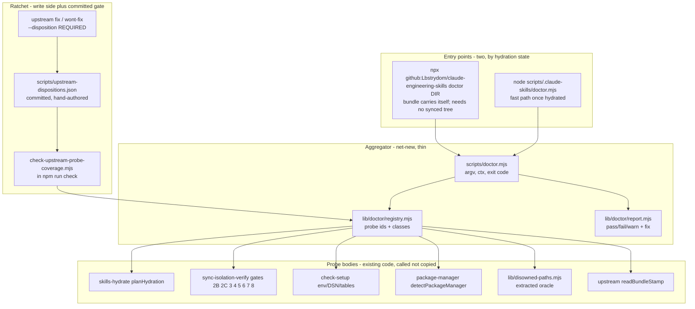
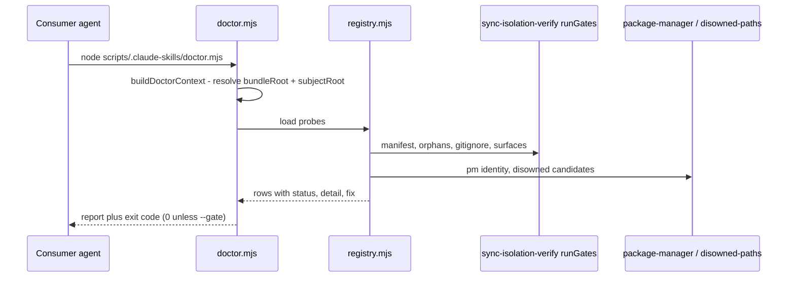

# Plan: Consumer friction doctor + upstream-report ratchet

- **Date**: 2026-08-20
- **Status**: Complete — audited 3 GPT plan rounds (18/18 findings accepted) + 2 Gemini plan
  rounds (4/4 addressed); implemented via `/cycle --autonomous` (degenerate single-cluster
  path), audited 6 code rounds (max cap; round-6 Gemini final review APPROVE, 0 new findings),
  shipped. See Audit Trail (plan) and Implementation Log (below) for detail.
- **Author**: Claude + Louis
- **Scope**: backend (consumer-facing CLI + sync surface + one `check` gate + one migration)
- **Target domain(s)**: `scripts`, `install`, `shared-lib`, `claudemd-management`
- ⚠ **Cross-domain work** — touches 4 domains. This is horizontal by construction
  (one diagnostic aggregating probes that each live in their owning subsystem, plus a
  gate in the `check` chain). No new domain.
- **Origin**: `/brainstorm` session 1787245915261, 2026-08-20.

> **Neighbourhood considered** (`get-neighbourhood`, k=8, refresh `8d91bfd9`, 2026-08-20).
> All eight candidates banded **`review`** — nothing cleared this repo's noise floor.
> Nearest was `manifestQualityWarnings` (`scripts/lib/persona-test/consistency.mjs:420`,
> sim 0.709, `below-noise-floor-near`, cliff 0.0014) — a persona-test manifest linter,
> unrelated. Also near: `actions-runner-doctor.mjs::main` (0.708) and
> `package-manager.mjs::detectPackageManager` (0.698) — both are *inputs* this plan
> delegates to, not duplication targets. **Verdict: proceed greenfield on the aggregator
> shell, reuse every probe body.** The reuse decisions are recorded per-probe in §2.

> **Past incidents to verify against** (2 of 2)
>
> | Incident | Affected paths | Status | Lessons |
> |---|---|---|---|
> | **INC-002** — production store wiped by a test-suite DSN gate | `tests/db-setup.test.mjs`, `scripts/lib/db/client.mjs` | `manual-verification-required` | An env-gate that checks "is the variable **set**" is not a safety gate. Anything the setup tooling checks for must be a real committed migration, not an informal hint. |
> | **INC-001** — lexical sensitive-path classifier bypassed by symlink | `scripts/lib/sensitive-paths.mjs` | `manual-verification-required` | Canonicalise before classifying; fail closed on resolution errors. |
>
> Both bind this plan: the doctor reads DSNs and walks consumer paths. See
> §"Security Considerations".

---

## 1. Context Summary

**Scope/stack**: backend, `js-ts` + `postgres` (`detect-stack`: `{stack:'js-ts', stackKinds:['js-ts','postgres']}`).

### The problem, restated from evidence

Consumer adoption friction is resolved incident-by-incident, and each resolution
becomes a runbook paragraph rather than permanent detection. Two symptoms:

1. **Five doctors, no door.** A consumer hitting *anything* must already know which
   of `check-setup.mjs`, `sync-isolation-verify.mjs`, `worktree:preflight:gate`,
   `runner:doctor` or `azure:doctor` answers their question. Four of the five are
   **source-repo npm scripts that do not exist in a consumer's `package.json`**, and
   the fifth is reached by typing a 60-character path into a gitignored directory.
2. **No ratchet.** 20 upstream reports have been filed; 19 are terminal. Closing one
   requires nothing but a commit sha.

### Code Trace

Every citation pinned to `ed8da0e9` (this worktree's HEAD).

**Probe inventory — what exists and where it is reachable from.**

| Failure class | Implementation (at `ed8da0e9`) | Reachable in a consumer? |
|---|---|---|
| Worktree hydration | `scripts/skills-hydrate.mjs:97` `planHydration`; canonical consumer one-liner `scripts/lib/worktree-preflight.mjs:156` `CONSUMER_HYDRATE_NPM_SCRIPT` | Only if the consumer **hand-added** the script — see the measurement below |
| Marker/remedy presence | `scripts/check-worktree-preflight.mjs:67` + `scripts/lib/worktree-preflight.mjs` `checkMarkerRemedies` | **No** — source-side gate over `skills/**`; reads *this* repo's `package.json` |
| Manifest hydration (manifest→disk) | `scripts/lib/sync-isolation-verify.mjs:298` `gate2B` | Long path only |
| Orphaned synced tooling (disk→manifest) | `sync-isolation-verify.mjs:361` `gate2C` | Long path only |
| Stale-path / ownership | `gate3` (`:394`) | Long path only |
| Fresh-clone executable contract | `gate4` (`:425`), over `CLI_SMOKE_SET` (`:57`) + `LIB_IMPORT_SET` (`:110`) | Long path only |
| npm-script reconciliation | `gate5` (`:491`) — flags `stale` and `unresolved` | Long path only |
| Manifest layout === isolated | `gate6` (`:563`) | Long path only |
| Managed `.gitignore` block | `gate7` (`:572`), via `parseGitignoreState` | Long path only |
| Skill-surface shadowing | `gate8` (`:621`), via `compareSkillSurfaces` | Long path only |
| Keys / DSN / tables / browser | `scripts/check-setup.mjs:594` `main`, report shape at `:150` (`pass/fail/warn/info` each carrying a **`fix`** string) | Synced, but **no npm script anywhere** |
| Azure route + credential sanity | `scripts/azure-doctor.mjs:278` → `lib/azure/route-doctor.mjs` `runRouteDoctor` | Source-only npm script |
| Actions-runner feasibility | `scripts/actions-runner-doctor.mjs:119` | Source-only npm script |
| Package-manager identity | `scripts/lib/package-manager.mjs:103` `detectPackageManager` — already returns an **ambiguity** verdict | Library only; nothing surfaces it |
| Disowned-file predicate | `scripts/lib/claudemd/file-scanner.mjs:52` `ignoredUntrackedPaths` — correct, candidate-scoped, stdin-fed, chunked | **Private to that module** — not exported |
| Bundle staleness | `scripts/lib/upstream/commands.mjs:60` `readBundleStamp`, `:120` `classifyReportFreshness` | Only inside `upstream report` |

**Upstream-report corpus** (`SELECT state, count(*) FROM upstream_issues GROUP BY state`,
run against the live store 2026-08-20 — *measured*):

```
fixed 17 · wont_fix 2 · open 1
```

Sampling the 20 titles (`ORDER BY created_at DESC LIMIT 25`, same run): **~5 are
environment/adoption failure classes** (worktree absence, orphaned tooling, vendored-dir
scanning, consumer-layout migration guard, installer shipping source-repo script paths).
**The other ~15 are ordinary code defects** — `LIMIT 20` with no `ORDER BY`, a too-tight
Gemini timeout, `--message-file` rejecting `/dev/stdin`, an inert `routePattern`. This
base rate is load-bearing and is what shrinks §2's ratchet design: **you cannot write an
environment probe for "LIMIT 20 with no ORDER BY"**, so a ratchet demanding a doctor probe
per closed report would be satisfiable only by lying.

**Measured consumer state** (2026-08-20, both live consumers):

| Consumer | `skills:hydrate` in `package.json` | `packageManager` field | Lockfiles | Synced tree |
|---|---|---|---|---|
| `wine-cellar-app` | **yes** | none | `package-lock.json` | present |
| `ai-organiser` | **NO** | none | `package-lock.json` | present |

`ai-organiser` carries the worktree-preflight marker in every synced `SKILL.md`
(byte-identical, `MARKER_BLOCK`), and that marker says *"Run `npm run skills:hydrate`
first."* In `ai-organiser` that command produces `npm error Missing script:
"skills:hydrate"`. This is the exact defect class `checkMarkerRemedies` was built to
close (`worktree-preflight.mjs:86` — *"the instruction ships and the tool does not"*),
recurring **one repo over**, because that gate reads the **source** repo's
`package.json` and no consumer's.

**Sync boundary** (verified): `scripts/sync-to-repos.mjs` **never writes a consumer's
`package.json`** — `grep -n 'scripts\['` returns nothing, and `:1019` only *reads* it to
choose an adoption tier. So a `package.json`-borne remedy can be **offered and verified**,
never installed. That constraint decides §2's bootstrap.

**Ratchet prior art**: `scripts/lib/gate-honesty/ratchet.mjs:36`
`computeRatchetDivergences` — a **pure set function** ("declare a contract or a baseline
exemption") with the impure fs shell in `scripts/check-gate-contracts.mjs`. Sibling:
`scripts/check-db-suite-enrolment.mjs` — iterates the **filesystem**, the only side that
can see a file no list mentions, and fails closed on zero candidates.

**Layout oracle**: `scripts/lib/assert-repo-root.mjs:140` `findRepoRootFromScript`
(walks up to the `scripts` ancestor). `scripts/setup-postgres.mjs:49` documents why
`path.resolve(__dirname,'..')` is wrong under the isolated layout.

### Patterns reused vs new

**Reused**: the `check-setup` report shape (`pass/fail/warn` + `fix`); `sync-isolation-verify`'s
gate bodies (called, never re-implemented); `findRepoRootFromScript` for layout; `emit` +
`assertKnownFlags` (`scripts/lib/cli-io.mjs:44`, `:260`); `computeRatchetDivergences`'s
pure-set/impure-shell split; `db:enrolment:gate`'s iterate-the-visible-side discipline;
the `scripts/gate-contracts/*.json` poison-pill contract.

**New**: one aggregator CLI; one probe registry; one exported disowned-path oracle
(extraction, not a second implementation); one committed disposition ledger + its gate;
one nullable column.

---

## 2. Proposed Architecture



### 2.1 Right-sizing gate

New structure on the table: one CLI, one probe registry, one committed ledger, one gate,
one column.

- **Band-aid extreme** — add a "Diagnostics" section to `consumer-adoption.md` listing all
  five commands. Rejected: that is precisely what exists (the runbook is 947 lines) and is
  what the brainstorm identified as the failure. It also cannot detect the `ai-organiser`
  gap, because prose does not run.
- **Over-engineered extreme** — a plugin architecture with auto-discovered probe modules, a
  severity DSL, a `--fix` mode that mutates the consumer's `package.json` and `.gitignore`,
  a DB-backed probe-coverage dashboard, and a scheduled health check per consumer.
  Rejected on three counts: nothing currently requires auto-discovery (the probe set is
  ~14 and enumerable); a `--fix` that writes a consumer's `package.json` crosses the
  boundary sync deliberately does not cross; and a DB-backed gate cannot run in the
  pre-push sandbox (§2.4).
- **Chosen (right-sized)** — a **thin aggregator over existing probe bodies** plus **two
  genuinely new probes** (hydration state, package-manager identity), and a ratchet whose
  teeth are on the **write path** with a **committed** ledger for the gate. Current
  requirements it serves: (a) one command a consumer can be told, unconditionally;
  (b) closing a report can no longer be a no-op. Nothing here is built for a future
  requirement.

**The delta is small, and this plan says so.** Of ~16 failure classes, **13 already have a
correct implementation**; the work is *reach* (one door, invocable before hydration),
*surfacing* (two probes over data already computed), and *one* new mechanism (the ratchet).
The three phases below are sized accordingly — Phase 1 writes ~250 lines of shell around
code it does not touch.

### 2.2 Key design decisions

| # | Decision | Principle |
|---|---|---|
| D1 | The doctor **calls** `sync-isolation-verify`'s `runGates`; it never re-implements a gate. | #1 DRY, #5 SSoT |
| D2 | **Two roots, never one.** `bundleRoot` (where doctor CODE lives) is derived via `findRepoRootFromScript(import.meta.url)` and used ONLY to locate probe modules. `subjectRoot` (the repo being DIAGNOSED) is a separate, explicitly-resolved value every probe receives — never re-derived from `import.meta.url`. Neither is probed by `existsSync('scripts/.claude-skills')` — **both candidate dirs exist in a consumer**. | #4 no hardcoding, #5 |
| D3 | Two entry points, chosen by hydration state — see §2.3a's root-resolution contract for how each computes `subjectRoot`; `npx github:…  doctor` is the one that works with **no synced tree, no consumer `package.json` edit, no hydration**. | #16 graceful degradation |
| D4 | `ignoredUntrackedPaths` is **extracted** to `scripts/lib/disowned-paths.mjs` and imported by both callers — one oracle, not a copy. | #1, #5 |
| D5 | Package-manager identity is `detectPackageManager`'s answer. **Two lockfiles + no `packageManager` field is reported as `ambiguous` and nothing is guessed or run.** | #12 validation |
| D6 | The doctor **never installs**. If it ever grows an install step, adjudication re-probes `node_modules`, never an exit code. | #15 error handling |
| D7 | Terminal transitions **require** a disposition; the gate reads the **committed** ledger. | #11 testability, #14 |
| D8 | Every probe carries a `fix` string; a probe with no actionable fix cannot be registered (schema-enforced). | #19 observability |
| D9 | The doctor is **advisory by default** (exit 0 with findings); `--gate` opts into a non-zero exit. Machine state (browser, runner, Azure quota) can **never** gate — only repo state can. | #16 |

**D9's rationale is a standing repo rule**: gate level follows the *kind* of state read.
Repo state (manifest drift, orphans, a missing `skills:hydrate`) is committed-or-derivable
and may block; machine state (is Chromium installed, can this `gh` identity make a runner)
differs per developer and may only advise.

### 2.3 The probe registry

`scripts/lib/doctor/registry.mjs` exports a frozen array. Each entry:

```js
{
  id: 'hydration/tooling-absent',   // stable; the ratchet's `probe:` refs point here
  title: 'Synced tooling present in this worktree',
  class: 'repo' | 'machine',        // drives --gate eligibility (D9)
  fix: 'npm run skills:hydrate',    // required, non-empty (D8)
  run(ctx) { … }                    // returns {status, detail} — status per the enum below
}
```

`ctx` carries `{bundleRoot, subjectRoot, layout, git, fs, exec, cloud}` — injected, so every
probe is unit-testable without a repo. **`subjectRoot` is the only root any probe body reads**;
`bundleRoot` exists solely so `registry.mjs` can resolve its own sibling modules. Ids are
**stable identifiers in a contract** (the ledger references them), so renaming one is a
two-sided edit the gate catches.

**Canonical outcome enum (closes R1-H3's contradiction)** — every probe returns exactly one of:

```
status: 'pass' | 'fail' | 'warn' | 'unknown' | 'not_applicable' | 'error'
```

`unknown` = a repo-state check that needs a resource it doesn't have right now (e.g. the DB
table probe with cloud off) — never coerced to `pass`. `not_applicable` = the probe's
precondition doesn't hold for this repo (e.g. a Python-only consumer probed for an npm
lockfile). `error` = the probe body threw; the registry catches it and wraps it, the probe
never crashes the run. **`--gate` predicate, total**: the process exits non-zero iff any
`class:'repo'` probe returns `fail` or `error`. `warn`, `unknown`, and `not_applicable` never
gate, regardless of class. `class:'machine'` never gates, regardless of status. **`--only`
narrows DISPLAY only** — in `--gate` mode every `class:'repo'` probe is always evaluated,
`--only` cannot silently drop a mandatory probe out of the gated set (it can drop it from the
default printed report, never from the exit-code computation). **Opacity fix (closes
R3-H4)**: a bare "`--gate --only <passing-probe>` exited 1" with no visible reason contradicts
D8's actionable-fix guarantee — every render mode (human and `--json`) therefore ALWAYS
includes a `gatingFindings` array listing every `class:'repo'` probe that returned `fail` or
`error`, **regardless of what `--only` narrowed the main report to**. A gated failure is never
silent: the probe id, `detail`, and `fix` that caused the non-zero exit are always visible
somewhere in the output, even when `--only` filtered it out of the primary section.

### 2.3a Root resolution + probe adapter contract

**Root resolution (closes R1-H1) — one function, `scripts/lib/doctor/context.mjs`
`buildDoctorContext(argv)`, is the only place either root is computed:**

- `bundleRoot = findRepoRootFromScript(import.meta.url)` — always. This is where
  `doctor.mjs`'s own sibling modules live; no probe ever reads it.
- `subjectRoot` — resolved in this order: (1) `--consumer-root <path>` if passed, realpath'd
  and required to exist and contain a `.git`; (2) else, when invoked as
  `node scripts/.claude-skills/doctor.mjs` (or `node scripts/doctor.mjs` in the source repo),
  `subjectRoot = bundleRoot` — the common case, where the tool runs from inside the repo it
  diagnoses; (3) `install.mjs doctor <target>` **always** passes `--consumer-root <target>`
  explicitly (default `target = process.cwd()` if omitted) — it never lets the doctor guess.
  `install.mjs` itself continues to use `resolveBundle` to acquire the bundle that CONTAINS
  `doctor.mjs`; that acquired copy's directory becomes `bundleRoot`, and `<target>` becomes
  `subjectRoot` — the two are never conflated, and the npx bootstrap case is exactly case (3).
- An unresolvable or non-repo `subjectRoot` is a hard error before any probe runs — never a
  silent fall-through to `bundleRoot`.

**Adapter contract (closes R1-M1, reconciled with R2-H1)** — every delegated subsystem the
registry calls is either already a pure function, or gets one added; the registry never
imports a CLI's `main`. **One rule per subsystem, never two** — R2's audit caught the plan
describing `sync-isolation-verify` two incompatible ways (D1's "calls `runGates`" vs an
earlier draft of this table's "calls `gate2B`/`gate2C` directly"); the row below is now the
single description, and D1 is unchanged because it was already right:

| Subsystem | Existing shape | What `probes.mjs` calls |
|---|---|---|
| `sync-isolation-verify.mjs` | `runGates({consumerRoot, gates})` (`:702`) is **already** the right adapter — it owns manifest loading (`loadConsumerManifest`), returns a `[{gate, pass, error, details}, …]` preflight sentinel on an unreadable/malformed manifest instead of throwing, and dispatches per-gate with each gate's own try/catch. **Currently un-exported** (only reachable via the test-only `_internals`) | `probes.mjs` calls the **newly-exported** `runGates({consumerRoot: ctx.subjectRoot, gates: ALL_GATES.filter(g => g !== '1')})` — `gate1` (pre-migration git-status) is migration-only, not a health check, so it is the one gate excluded. **One call, not eight** — the registry never touches `gate2B`/`gate2C`/etc. individually. Each result row maps `{pass:true}→'pass'`, `{pass:false}→'fail'`, the `preflight` sentinel → `'unknown'` with `error` as `detail` |
| `package-manager.mjs` `detectPackageManager(repoRoot)` | Already pure | Called directly; `ambiguous` verdict → `'warn'` |
| `check-setup.mjs` | **Not** pure today — `checkAuditApiKeys(env, report)` mutates a caller-supplied `Report` instance; `main()` owns argv + `process.exit`. **Already root-scoped, though**: `loadEnv(repoPath)` (`:54`) reads `.env` from an arbitrary `repoPath` **without touching `process.env`** — its own docstring says so, precisely so multiple repos can be checked in sequence — but is currently un-exported | **New**: export `loadEnv` (unchanged body) alongside `evaluateAuditSetup(env)`, `evaluateAuditSupabase(env)`, `evaluatePersonaTest(env)` — same evaluator bodies, but each constructs its OWN `Report` internally and **returns** `{items}` instead of mutating a passed-in one. `main()` becomes a thin renderer calling the same exported functions — zero behaviour change, verified by that script's existing tests. **`probes.mjs` calls `const env = loadEnv(ctx.subjectRoot)` before every check-setup adapter** (closes R3-H1) — this is the exact function `check-setup.mjs`'s own CLI already uses via its `--repo-path` flag, just invoked with `ctx.subjectRoot` instead of an argv-derived path; no new environment-loading mechanism is introduced, and none of `process.env` is read for the diagnosed repo's secrets |
| `azure-doctor.mjs --routes`, `actions-runner-doctor.mjs` | CLI mains, machine state, **unmodified** | **Never called.** Registered as `class:'machine'` probes whose `run()` returns a static `{status:'not_applicable', detail:'run the command yourself'}` — the doctor names the command, never imports the main |

`sync-isolation-verify.mjs` also gains an `ALL_GATES` export (§5 already assumed this existed
— it did not; this closes that latent gap too) so the registry filters the exclusion list
from the module's own constant rather than hand-listing gate ids a second time.

A subsystem not in this table is out of scope for Phase 1–2 — the registry does not grow a
new delegated adapter without adding a row here first.

**New probe bodies (only these two are net-new logic):**

- **`hydration/tooling-absent`** — is this a linked worktree, and is the tooling tree there?
  Uses the same `git rev-parse --path-format=absolute --git-common-dir` derivation
  `skills-hydrate.mjs:73` `resolveMainWorktree` uses. Sub-check
  **`hydration/remedy-missing`**: does the consumer's `package.json` define the script the
  marker names? This is `checkMarkerRemedies` asked **of the consumer** — the `ai-organiser`
  gap. Its `fix` prints `CONSUMER_HYDRATE_NPM_SCRIPT` verbatim (the canonical constant, so
  the doctor's suggestion and the runbook's copy cannot drift; `checkDocumentedRecipes`
  already gates that constant's copies).
- **`env/package-manager`** — surfaces `detectPackageManager`'s verdict, including
  `ambiguous`. On `ambiguous` the status is **`warn`** with the fix *"declare
  `packageManager` in package.json"* — never a guess.

**Delegated, not absorbed**: `runner:doctor` and `azure:doctor --routes` stay their own
CLIs. The doctor registers them as `class:'machine'` probes that **name the command**
rather than importing it — `azure:doctor --fix` writes a `.env`, and a diagnostic that
can write files is a different object. They appear in the output; they never gate.

### 2.4 The ratchet — where the teeth are, and why

**Requirement**: closing an upstream report must require either a doctor probe for its
failure class or a written exemption.

**The constraint that shapes it**: `npm run check` runs in a **throwaway worktree at the
commit being pushed** (`scripts/prepush-check.mjs`) with **no guaranteed cloud**. A gate
that reads `upstream_issues` would go green having read nothing whenever the DSN is absent
— the sandbox-honesty failure this repo keeps closing. So the ratchet is split:

- **Write side (`scripts/lib/upstream/commands.mjs` `upstreamTransition`)** — a transition
  to `fixed` or `wont_fix` **requires** `--disposition`, one of:
  - `probe:<probe-id>` — an environment/adoption class, now detected by that probe
  - `test:<repo-relative path>` — an ordinary code defect, closed by a regression test
  - `exempt:<reason>` — a written reason, non-empty
  A bare close throws before any write. This is *control the write side, not just the read*:
  a read-only ratchet over a table whose writer never populates the field measures nothing.
  **`ack` is unaffected** — only `fixed`/`wont_fix` are terminal, and `upstreamTransition`
  already treats them differently from `acknowledged` via its `to` param.
  **Reversal out of a terminal state — verified unreachable, not merely unhandled (addresses
  Gemini-round-1 G2)**: Gemini's final review raised whether reopening a `fixed`/`wont_fix` issue
  back to a non-terminal state could violate `chk_upstream_terminal_has_disposition` (state
  becomes non-terminal, `disposition` stays non-null, the boolean-equality CHECK fails). Two
  independent facts, both in **existing code this plan does not modify**, make that
  unreachable rather than merely unspecified: (1) the CLI dispatcher's verb set is `report |
  list | ack | fix | wont-fix | drain` (`quality.mjs:102`) — there is no "reopen" verb at all;
  (2) `LEGAL_TRANSITIONS` (`store/upstream-issues.mjs:18`) declares `fixed: []` and
  `wont_fix: []` — checked in `transitionUpstreamIssue` (`:238-244`) **before** any DB
  `updateWhere` runs, so any `to` value from a terminal `current.state` returns `illegal:
  true` and never reaches the database. An out-of-band raw `UPDATE` bypassing both is already
  the failure class R1-H4's constraint exists to catch — and it catches this specific
  variant too: an `UPDATE` that reverts `state` without also nulling `disposition` fails the
  CHECK outright (loud, correct); one that reverts both together succeeds cleanly, leaving
  only a stale (harmless, advisory-only) ledger entry the reconciler surfaces. **Forward-looking
  guardrail, not a fix for a live bug**: if a future change ever adds a "reopen" verb or
  widens `LEGAL_TRANSITIONS` to permit leaving a terminal state, that change MUST set
  `disposition = NULL` in the same `UPDATE` and prune the matching `issueId` from the ledger
  — stated here so the invariant travels with the code that would need to preserve it.
  **The full path, traced (closes R2-H2)**: `upstreamTransition` is a service function —
  requiring an option there does nothing unless the CLI DISPATCH layer parses it and
  forwards it. That layer is `scripts/lib/cross-skill/commands/quality.mjs`'s `upstreamCmd`
  (§1-adjacent trace, `quality.mjs:100`): its `ack | fix | wont-fix` branch (`:190-192`)
  today builds `{repoRoot, to, id, note, commit, actor, transitionFn}` from `ctx.flag(...)`
  calls with **no `disposition` field at all**. The fix adds one line —
  `disposition: ctx.flag('disposition')` — to that same object literal, and
  `upstreamTransition` does the required-for-terminal-states validation `commands.mjs`
  already does for `commit` (the existing `chk_upstream_fixed_has_commit` pattern this
  mirrors). `cross-skill.mjs`'s flag registry (`:181`, `:220` — the arrays listing
  `--commit`/`--state`/etc.) gains `--disposition` alongside them, or `assertKnownFlags`
  rejects it as unrecognized before it ever reaches `upstreamCmd`.
  **`upstreamTransition` is the ONLY writer of a terminal `upstream_issues` state** — verified
  (§1 Code Trace, `commands.mjs:459`) that no other call site in this repo writes `state`;
  Phase 4 adds a regression test asserting that remains true (a grep-based census of
  `UPDATE upstream_issues` / `transitionUpstreamIssue` call sites, gated in `check`), so a
  future second writer cannot silently reopen the bypass H4 found.
- **Ledger entry schema (closes R1-H5)** — one JSON object per **upstream issue**, keyed by its
  immutable DB id, not by probe id (multiple issues can share one probe or test disposition):
  ```json
  {
    "schemaVersion": 1,
    "issueId": "64223218-e2c4-4b40-afcf-27daff855da6",
    "state": "fixed",
    "disposition": { "kind": "probe", "value": "hydration/remedy-missing" },
    "recordedAt": "2026-08-20T21:40:00Z"
  }
  ```
  `disposition.kind` ∈ `probe|test|exempt`. **Exactly one active record per `issueId`** —
  the gate rejects a duplicate. A `test` disposition's `value` must be a repo-relative path
  that (a) is **tracked** (`git ls-files`, not merely present on disk — an untracked file
  proves nothing about CI) and (b) matches the repo's own enforced test glob
  (`tests/**/*.test.mjs`, the same set `run-tests.mjs` collects — not `tests/fixtures/**`).
  This is what makes R1-H5's "arbitrary existing path" bypass unavailable: `package.json` and
  a production source file both fail (a) is-tracked-as-test and (b) glob membership.
  **Shared-path warning is count-only, no free-text field (closes R2-M1)** — the schema above
  has no `rationale`/reason field, so a policy that required one to be "distinct" was
  unimplementable; the gate instead emits a **deterministic** advisory (never a failure) when
  one `test:` path is cited by **≥3** entries — pure `groupBy(value).count`, no judgement
  call the gate has no data to make. A genuinely repeated broad test file is still a taxonomy
  smell worth a human look; the gate just doesn't pretend to adjudicate WHY it's repeated.
- **Committed ledger (`scripts/upstream-dispositions.json`) — sequential in-process writes,
  no git-staging precondition (redesigned, closes R3-H2)**. An earlier draft required the
  ledger entry to already be `git`-staged before the DB write, verified via `git diff
  --cached --name-only` — **not executable**: a single CLI invocation cannot both write a
  file and have it already staged before it runs, and checking the filename appears in the
  index proves nothing about which VERSION is staged. The corrected protocol is simpler and
  has no such gap: `upstreamTransition` (a) upserts the normalized `{issueId, state,
  disposition}` entry into `scripts/upstream-dispositions.json` on disk, (b) **only then**
  performs the DB write, both within the same invocation, sequentially — no cross-invocation
  precondition, no git index involved. **Idempotent**: re-running the same transition with
  the same disposition is a no-op success (upsert, not append) rather than a duplicate-entry
  error. Committing the ledger file remains ordinary repo hygiene (same commit as the code
  change) — the `check-upstream-probe-coverage.mjs` gate is what verifies the COMMITTED
  content is self-consistent, not the CLI at write time. **What this trades away**: a crash
  between step (a) and (b) can still leave the ledger updated with no matching DB write (or
  vice versa) — that is a real, accepted gap, and it is exactly the direction the reconciler
  below exists to catch; no in-process guarantee can close a crash window without genuine
  distributed-transaction machinery, which is out of scope (§2.1's over-engineering cliff).
  Hand-authorable, reviewable in a diff, present in the sandbox. Same species as
  `scripts/gate-contracts/_exemptions.json`: **hand-authored source**, not a generated
  artifact, so the Category-A/B policy does not apply.
- **Gate (`scripts/check-upstream-probe-coverage.mjs`, `npm run upstream:coverage:gate`,
  added to `check`)** — validates the ledger against the registry, the filesystem, and
  itself: every `probe:` id resolves in `registry.mjs`; every `test:` path passes the (a)-(b)
  checks above; every `exempt:` reason is non-empty; no duplicate `issueId`; no entry names a
  probe id that no longer exists. **Fails closed** on an unreadable ledger, an unreadable
  registry, or zero entries.
- **DB-boundary enforcement (closes R1-H4, Phase 4, single migration — redesigned to close
  R3-H3)** — `CONSTRAINT chk_upstream_terminal_has_disposition CHECK ((state IN
  ('fixed','wont_fix')) = (disposition IS NOT NULL))`, mirroring the table's existing
  `chk_upstream_fixed_has_commit` pattern. This is what makes the invariant survive a write
  path this plan didn't anticipate (a future second writer, an admin console, a hand-run
  `UPDATE`) — the CLI-level check in `upstreamTransition` is necessary but, per R1-H4, not
  sufficient on its own. **Why "single migration" is now load-bearing**: an earlier draft
  split this into "add nullable column → run a Node backfill script → add the NOT NULL
  constraint" across two migration files in the same phase. That is not executable —
  `setup-postgres.mjs --migrate` applies every pending migration file in one ordered batch;
  it has no checkpoint mechanism to pause after file N, run an external script, and resume at
  file N+1. The corrected design (§2.4 Backfill below) generates the backfill `UPDATE`
  statements as **literal SQL inside the same migration file** that adds the constraint, so
  ordering is guaranteed by single-file, single-transaction execution — the same guarantee
  every other migration in this repo already relies on, not a new mechanism.
- **Reconciler (advisory, cloud, in `upstream list --worksheet`)** — flags any terminal DB
  row absent from the ledger, or whose ledger `disposition` value no longer resolves (a
  probe id that got renamed, a test file that got deleted). That is the direction the gate
  structurally cannot see, and it is exactly the *"which side am I iterating, and what is
  unrepresentable from it?"* question. Advisory because it needs cloud — it is the backstop
  for the crash window between the sequential ledger and DB writes (§2.4).

**The classification is three-way on purpose.** The measured base rate (§1: ~5 of 20
environment, ~15 code defects) means a probe-or-exempt binary would push 75% of closures
into `exempt`, and an exemption everyone uses is not a ratchet. `test:` is the honest third
answer: it is still *permanent detection*, just of a different kind.

**Backfill, redesigned around one guaranteed-ordered migration (closes R1-H4/R1-H5's
migration-ordering gap AND R3-H3/R3-M1's "not executable by a real migration runner" and
"backfill script has no defined flag surface" findings)**:

1. **Phase 3** — write the **ledger file only** (no DB/migration touched yet). 19 terminal
   rows exist today (§1); each gets one entry, `issueId` from the live `upstream_issues.id`.
   This is the pass that tells us whether the three-way split holds: if more than ~3 of 19
   land in `disposition.kind:"exempt"`, the taxonomy is wrong and must be revised **before**
   Phase 4 adds any DB constraint on top of it.
2. **Phase 4, migration A** (`…120000_upstream_disposition.sql`) — adds the nullable
   `disposition` column (as originally specified — still nullable, so it never conflicts with
   the 19 not-yet-backfilled rows).
3. **Phase 4, `backfill-upstream-dispositions.mjs` is a dev-time migration GENERATOR, not a
   runtime CLI other people invoke** — the plan author (or `/cycle`) runs it ONCE, locally,
   after Phase 3's ledger is final: `node scripts/backfill-upstream-dispositions.mjs --ledger
   scripts/upstream-dispositions.json --out
   supabase/migrations/20260820130000_upstream_disposition_required.sql`. It reads the
   ledger, emits one `UPDATE upstream_issues SET disposition = '<kind>:<value>' WHERE id =
   '<issueId>';` per entry as literal, reviewable SQL — **`disposition.value` is
   SQL-string-escaped (single quotes doubled, `.replaceAll("'", "''")`) before
   interpolation** (closes Gemini-round-2 G1 — an `exempt:` reason is free-text human prose
   and *will* contain an apostrophe eventually; unescaped, that breaks the generated
   statement's syntax and the migration never applies). **Immediately after the literal
   updates and before the constraint, it also emits ONE generated catch-all statement**
   (closes Gemini-round-1 G1 — a time-of-generation-to-time-of-deployment race: a report could be
   closed in production between when this file is generated and when it is deployed, and
   that row would have no literal `UPDATE` targeting it):
   ```sql
   UPDATE upstream_issues SET disposition = 'exempt:legacy-untracked-transition'
     WHERE state IN ('fixed','wont_fix') AND disposition IS NULL;
   ```
   This is a **narrow, intentional exception to "the gate iterates the filesystem/ledger, not
   the DB"** — it exists solely to keep a real deployment from crashing on a race the
   generator cannot see at generation time, is applied only inside this one generated
   migration, and any row it catches shows up in the reconciler (§2.4) as a ledger-absent
   terminal row on the very next `upstream list --worksheet`, so the race window is caught
   and closed manually rather than silently forgotten. Then the
   `chk_upstream_terminal_has_disposition` constraint follows — **all in the ONE file it
   writes**. `--dry-run` prints the generated SQL to stdout without writing the file (the
   default invocation writes it). This resolves M1's "ambiguous middle state": it is
   explicitly a one-shot authoring-time tool, never declared in `CLI_SMOKE_SET` or
   `sync-to-repos.mjs` (§6), with its own narrow `assertKnownFlags(['--ledger', '--out',
   '--dry-run'])` and `--selfcheck-relocation` proving import/path resolution only, before
   any file read.
4. **Migration B, the GENERATED file, is committed and reviewed like any other migration** —
   a human (or the audit loop) reads the 19 literal `UPDATE` statements, the catch-all, and
   the constraint before it ships. `setup-postgres.mjs --migrate` then applies migrations A
   and B in its normal single ordered batch; backfill, catch-all, and constraint are in the
   same transaction as B, so there is no window where the constraint exists without the data
   that satisfies it — including data that didn't exist yet when B was generated.

### 2.5 Data flow



### 2.6 Bootstrap provenance (closes R1-H2, GPT-adjudicated compromise, severity MEDIUM)

**Two acquisition stages exist, and they have different security properties — the plan must
not conflate them:**

- **Stage 0 — obtaining `install.mjs` itself.** `npx github:Lbstrydom/claude-engineering-skills
  doctor` fetches whatever `npx` resolves for an unpinned `github:` spec (the repo's default
  branch tip at request time) and runs it. **`install.mjs`'s own `--ref` flag cannot protect
  this stage** — it is parsed only after this code is already fetched and executing. This is
  not new exposure the doctor feature introduces (every `install.mjs` invocation, including
  the existing plain install path, has always worked this way); it is a pre-existing property
  this plan should document rather than silently inherit undocumented.
- **Stage 1 — `install.mjs` acquiring the bundle it deploys/inspects.** This IS SHA-pinned:
  `resolveBundle` (`install.mjs:165`) resolves `--ref` (or the default branch) to an immutable
  SHA and acquires the bundle at that exact SHA, printing the resolved SHA before anything
  else happens. A force-push or branch change after resolution cannot alter an already-cached,
  SHA-keyed acquisition. This is the mechanism that makes the doctor's own inspection code
  reproducible once stage 0 has run.

**What the plan commits to**:

1. Document both stages explicitly in the doctor's own `--help` output and in
   `docs/runbooks/consumer-adoption.md`'s new §Diagnostics section — not just here.
2. For a security-sensitive or reproducible invocation, recommend the npm `github:` spec's
   own commit-pin syntax, which DOES cover stage 0 (unlike `install.mjs`'s `--ref`, which only
   ever reaches stage 1): `npx github:Lbstrydom/claude-engineering-skills#<sha> doctor`. This
   is an existing `npx`/`npm` capability, not new tooling.
3. **Compatibility safeguard (kept from the original rebuttal, now scoped as a distinct
   concern from code provenance)**: the doctor's report prints the resolved stage-1 bundle SHA
   next to the consumer's `scripts/.sync-manifest.json` synced-bundle SHA, when the latter is
   present. A mismatch is an explicit `warn`-class finding (new probe:
   `provenance/bundle-mismatch`, `class:'repo'`). **The fix string must be invocable from the
   diagnosed layout alone (closes R2-H4)** — §1 already established that `sync-to-repos.mjs`
   never writes a consumer's `package.json` and that source-repo npm scripts (`npm run sync
   -- --target-path .`) are not generally available there, so the plan's earlier draft
   recommended exactly the class of unusable remedy this feature exists to eliminate. The
   corrected fix is a single, complete, consumer-invocable command built from data the probe
   already has — the CONSUMER's own synced SHA (read from its manifest, which is how the
   mismatch was detected in the first place):
   `npx github:Lbstrydom/claude-engineering-skills#<consumer-synced-sha> <subjectRoot>` — this
   re-runs the FULL installer (not the `doctor` subcommand) at the exact SHA the consumer was
   last synced from, using only the `npx` capability every consumer already has, never a
   locally-defined script. When the consumer manifest carries no SHA at all (pre-Phase-1
   bundle, or no manifest — §1's `path_recognised: NULL` case), the probe emits `unknown`
   rather than `warn` with a fix it cannot construct, and points at
   `docs/runbooks/consumer-adoption.md`'s fresh-install recipe instead. A fixture with no
   consumer `sync` script and no manifest SHA asserts both branches render a command that
   actually runs, never an assumed local script.

---

## 3. Security Considerations

Both surfaced incidents bind here.

- **INC-002 (DSN)** — the doctor reports on `AUDIT_DB_URL` and may open a pool for the
  table probe. It **prints identity, never the DSN**: host/port/database via
  `dbIdentity` (`scripts/lib/db/client.mjs:155`), and the credential **variable name**
  only, mirroring `azure:routes`. It issues **read-only** queries and executes no
  destructive statement, so `assertDisposableDbUrl` is not in its path. The table probe
  is **skippable and degrades to `unknown`** when cloud is off — never to "pass".
- **INC-001 (paths)** — the doctor walks consumer paths (orphan/manifest probes). Every
  path it classifies goes through `resolveAndClassify` (`scripts/lib/sensitive-paths.mjs`),
  which canonicalises before classifying and fails closed. Skip logging uses
  `formatSkipLog` — never basenames, never full paths.
- **No egress.** The doctor makes no LLM call and sends nothing to a third party. Its
  output may contain repo-relative paths and env-var **names**; it must never print a
  value. Guarded by a test asserting no probe's `detail`/`fix` interpolates
  `process.env[...]`.

---

## 4. Pre-registered traps — and how the design answers each

| Trap | Answer | Guarded by |
|---|---|---|
| The doctor is itself synced tooling and must obey its own rules | Layout **derived** via `findRepoRootFromScript`; never `existsSync` on a candidate dir (both exist in a consumer) | `tests/doctor-layout-derivation.test.mjs` runs the module under **both** layouts (source `scripts/`, isolated `scripts/.claude-skills/`) |
| The location running doctor CODE is not always the repo BEING diagnosed (R1-H1 — the npx bootstrap runs from a transient checkout) | `bundleRoot`/`subjectRoot` are two separate values (§2.3a); every probe reads only `subjectRoot`, and `install.mjs doctor <target>` always passes it explicitly | `tests/doctor-context.test.mjs` — asserts `subjectRoot ≠ bundleRoot` in the `install.mjs doctor` fixture |
| A "single command" that MODULE_NOT_FOUNDs on its own transitive dependency is the exact failure class it diagnoses (R1-H6) | Every runtime `lib/**` import of `scripts/doctor.mjs` is declared in `sync-to-repos.mjs`, verified by import-graph closure, not just `CLI_SMOKE_SET` membership | `tests/doctor-consumer-import-closure.test.mjs` (§8) |
| Must work in a linked worktree where the synced tree is absent | The **bootstrap is `npx github:… doctor`**, which carries the bundle. The offline fallback is the tracked `skills:hydrate` one-liner, and a probe verifies it exists | `tests/doctor-probes.test.mjs` — a fixture worktree with no `scripts/.claude-skills/` |
| Any remedy rides on `package.json`, never a synced script or a `.claude` hook | Every `fix` string a probe emits for a worktree-class fault names an npm script, and the hydration probe's fix is `CONSUMER_HYDRATE_NPM_SCRIPT` verbatim | `checkMarkerRemedies` + `checkDocumentedRecipes` already gate the constant; a new test asserts the doctor's fix string **is** the constant |
| Disowned-file question of the CANDIDATES, never the repo | `scripts/lib/disowned-paths.mjs` is the **extracted** `ignoredUntrackedPaths` — candidate list on **stdin**, `ls-files` chunked at 200 on argv, ENOBUFS impossible | `tests/disowned-paths.test.mjs` asserts the git invocation carries `--stdin` and that no call site passes an unbounded set; the existing WARN-on-degradation stays |
| Package-manager identity is `package-manager.mjs`'s answer | Probe reports the verdict verbatim. **Two lockfiles + no `packageManager` ⇒ `ambiguous`, warn, no guess** | A probe test with both lockfiles asserts status `warn` and that no `npm`/`pnpm` literal appears in the fix |
| Adjudicate an install by re-probing `node_modules`, never exit code | The doctor **installs nothing** (D6). The `node_modules`-absent probe reports presence by `fs` stat, not by any command's status | `tests/doctor-probes.test.mjs` |
| New CLI scripts need `assertKnownFlags` or `cli:flags:gate` fails | Both new CLIs call `assertKnownFlags(process.argv, KNOWN_FLAGS, {cli})` and get `scripts/.cli-catalog.json` entries | `npm run cli:flags:gate` |
| `emit({ok:false})` must set a non-zero exit | Both use `emit` from `lib/cli-io.mjs`. **The advisory default (D9) is expressed as `ok:true` with findings — not as `emit({ok:false, softFail:true})`** | `npm run emit:exit:gate` (ratchets the opt-out population; this plan adds **zero** opt-outs) |

**On the last row** — the tempting shortcut is `emit({ok:false, softFail:'advisory'})` so
the doctor can report faults and still exit 0. That is a misuse: `softFail` exists for a
CLI whose *envelope reports failure* but whose *contract tolerates it*, and it is
population-ratcheted for exactly that reason. A doctor that ran successfully and found
things **succeeded**; the findings are payload. `--gate` flips `ok` to `false` and takes the
non-zero exit honestly.

---

## 5. Sustainability Notes

- **Assumption that could change**: the probe set is small enough to enumerate. At ~14 it
  is; past ~40 auto-discovery earns its keep. The registry is a plain frozen array, so
  that migration is one file.
- **Assumption**: `npx github:…` is reachable. In an air-gapped consumer it is not, and
  the only bootstrap left is the tracked `skills:hydrate` one-liner. The doctor's own
  documentation must state this rather than assume network — recorded in §8.
- **Extension point deliberately built in**: `class:'repo'|'machine'` (D9). Adding a probe
  requires choosing, so the gate-level question is answered at authoring time instead of
  being discovered when someone's push breaks on their missing Chromium.
- **Extension point deliberately NOT built**: no `--fix` mode. Writing a consumer's
  `package.json` is a boundary `sync-to-repos.mjs` does not cross, and the doctor should
  not be the first thing to cross it.
- **What breaks in six months**: if `sync-isolation-verify`'s gate ids change, the doctor's
  registry drifts. Mitigated by importing `ALL_GATES` from that module rather than listing
  ids — one more single-oracle application.

---

## 6. File-Level Plan

**Create**

- `scripts/doctor.mjs` — aggregator CLI. Flags `--json`, `--gate`, `--only <id,…>`,
  `--consumer-root <path>`, `--selfcheck-relocation`. `assertKnownFlags` + `emit`.
  *Why*: the single door (#5).
- `scripts/lib/doctor/context.mjs` — `buildDoctorContext(argv)`, the **single** place
  `bundleRoot`/`subjectRoot` are resolved (§2.3a). *Why*: closes R1-H1; one oracle for root
  resolution (#5).
- `scripts/lib/doctor/registry.mjs` — frozen probe array + `probeIds()` + schema validation
  (`fix` non-empty, `class` in the closed set, ids unique, `run` return validated against the
  §2.3 outcome enum in tests). *Why*: the ratchet's `probe:` refs resolve here; one
  authority (#5).
- `scripts/lib/doctor/probes.mjs` — probe bodies; `ctx`-injected, calling the adapter table
  in §2.3a. *Why*: testable without a repo (#11).
- `scripts/lib/doctor/report.mjs` — the outcome-enum-aware report renderer, **extracted from
  `check-setup.mjs:150`** and widened from `pass/fail/warn/info` to the full §2.3 enum.
  *Why*: two renderers of one shape is how they drift (#1).
- `scripts/lib/disowned-paths.mjs` — `ignoredUntrackedPaths` extracted verbatim + exported.
  *Why*: single oracle (#5); the body is already correct and must not be re-derived.
- `scripts/check-upstream-probe-coverage.mjs` — the ratchet gate: registry/filesystem
  validation (§2.4) — probe ids, tracked-test-glob membership, exempt reasons, no duplicate
  `issueId`. Implements `--selfcheck-relocation` at the head of `main()` (closes R2-H3 — the
  plan's first draft gave this handler to `doctor.mjs` only). **Never** added to
  `CLI_SMOKE_SET` or declared in `sync-to-repos.mjs` — source-repo-only, same as the ledger
  it validates (§9). *Why*: #14.
- `scripts/lib/upstream/dispositions.mjs` — `parseDisposition`, `validateLedgerEntry`,
  `computeDispositionDivergences` (**pure**, mirroring `computeRatchetDivergences`); the
  ledger-entry schema from §2.4. *Why*: every failure mode unit-testable without a repo (#11).
- `scripts/upstream-dispositions.json` — the committed ledger. Hand-authored in Phase 3, then
  CLI-upserted (§2.4's sequential write) from Phase 4 onward.
- `scripts/backfill-upstream-dispositions.mjs` — **dev-time migration GENERATOR, run once
  locally, never at deploy/runtime** (redesigned — closes R3-H3's "not executable by a real
  migration runner" and R3-M1's "ambiguous middle state"): reads the Phase-3 ledger and
  WRITES migration B's SQL content (19 literal `UPDATE` statements + the constraint) to disk;
  it never opens a DB pool itself. Full flag surface: `--ledger <path>` (default
  `scripts/upstream-dispositions.json`), `--out <path>` (the migration file to write),
  `--dry-run` (print SQL, write nothing) — `assertKnownFlags` on exactly these three.
  **`--selfcheck-relocation` proves import/path resolution ONLY, and its ordering must be
  real, not aspirational (closes Gemini-round-2 G2)** — Node evaluates every **static**
  `import` before any module-body code runs, so a top-level `import './lib/load-env.mjs'`
  (the pattern `check-setup.mjs` and every other CLI entry point in this bundle uses) would
  already have executed the loader's side effects before an argv check could ever see
  `--selfcheck-relocation`. This script's `main()` therefore does the argv check **first**,
  at the very top, before any DB-adjacent import — `lib/load-env.mjs` and every `lib/db/**`
  module it needs are pulled in via a **dynamic `await import(...)`** inside the non-selfcheck
  branch, never a static import at file scope. On `--selfcheck-relocation` those imports
  never execute, so the script makes zero network calls and holds zero credentials — a
  guarantee that only holds because of *how* the imports are written, not because of when the
  flag is checked. Source-repo only — never synced, never in `CLI_SMOKE_SET` (§9 applies the
  same reasoning as the ledger it reads).
- `scripts/gate-contracts/upstream-coverage-gate.json` — poison pill + control for the new
  `check` gate (mandatory: `gates:poison` enumerates the chain).
- `supabase/migrations/20260820120000_upstream_disposition.sql` — migration A, hand-authored:
  `ALTER TABLE upstream_issues ADD COLUMN disposition TEXT` (**nullable** — the 19 historical
  rows are not yet backfilled when this runs) with a shape `CHECK (disposition IS NULL OR
  disposition ~ '^(probe|test|exempt):.+')`.
- `supabase/migrations/20260820130000_upstream_disposition_required.sql` — migration B,
  **generated** by `backfill-upstream-dispositions.mjs` from the Phase-3 ledger (committed
  after human review, like any other migration): the 19 backfill `UPDATE`s followed by
  `chk_upstream_terminal_has_disposition`, in that order, in the ONE file — guaranteeing the
  ordering `setup-postgres.mjs --migrate`'s normal single-batch, single-transaction-per-file
  execution already provides, rather than depending on a checkpoint the runner doesn't have
  (closes R3-H3).
- Tests: `tests/doctor-probes.test.mjs`, `tests/doctor-context.test.mjs` (root resolution,
  both entry-point shapes), `tests/doctor-adapters.test.mjs` (§2.3a table, one case per row),
  `tests/disowned-paths.test.mjs`, `tests/upstream-disposition-ratchet.test.mjs`,
  `tests/upstream-dispositions-ledger.test.mjs`,
  `tests/upstream-single-writer-census.test.mjs` (R1-H4: greps for `UPDATE upstream_issues` /
  `transitionUpstreamIssue` call sites; fails if a second writer appears).

**Modify**

- `scripts/check-setup.mjs` — export `evaluateAuditSetup(env)`, `evaluateAuditSupabase(env)`,
  `evaluatePersonaTest(env)` (§2.3a adapter row) returning `{items}` instead of mutating a
  passed-in `Report`; `main()` becomes a thin renderer over the same functions. Behaviour
  unchanged; covered by this script's existing tests.
- `scripts/lib/claudemd/file-scanner.mjs` — import `ignoredUntrackedPaths` from
  `lib/disowned-paths.mjs`.
- `install.mjs` — add a `doctor <target>` subcommand to `parseArgs` (`:92`) that (a) uses the
  existing `resolveBundle` to acquire the bundle at the resolved SHA (unchanged — §2.6 stage
  1), (b) resolves `target` (default `process.cwd()`) via realpath, requires a `.git`, and
  (c) invokes the acquired bundle's `scripts/doctor.mjs --consumer-root <resolved target>` —
  never lets `doctor.mjs` guess `subjectRoot` on this path (§2.3a). *Why*: the only
  pre-hydration door, and the fix for R1-H1's target-root confusion.
- `scripts/lib/upstream/commands.mjs` — `upstreamTransition` (`:459`) requires
  `--disposition` for terminal states, validates it against `dispositions.mjs`, performs the
  sequential ledger-then-DB write (§2.4), and remains the **sole** writer of a
  terminal `upstream_issues.state` (asserted by the new census test).
- `scripts/lib/cross-skill/commands/quality.mjs` — `upstreamCmd`'s `ack | fix | wont-fix`
  branch (`:190-192`) adds `disposition: ctx.flag('disposition')` to the object it already
  builds for `upstreamTransition` (closes R2-H2 — the CLI dispatch layer that must parse and
  forward the flag, traced separately from the service function it calls).
- `scripts/cross-skill.mjs` — add `--disposition` to the known-flags arrays (`:181`, `:220`)
  alongside `--commit`/`--state`/etc., or `assertKnownFlags` rejects it before it reaches
  `upstreamCmd`.
- `scripts/lib/store/upstream-issues.mjs` — persist `disposition` (`:210`).
- `scripts/lib/sync-isolation-verify.mjs` — export `runGates` and `ALL_GATES` (currently only
  reachable via the test-only `_internals`, per §2.3a's reconciled adapter row); add
  `doctor.mjs` to `CLI_SMOKE_SET` (`:57`) **and** declare `doctor.mjs`, `lib/doctor/**`,
  **and `lib/disowned-paths.mjs`** in `sync-to-repos.mjs` in the same commit
  (`cli-smoke-set-sync-parity` fails otherwise — the trap recorded at `:88`, and the specific
  R1-H6 gap: `lib/disowned-paths.mjs` is a runtime dependency of `probes.mjs` and was missing
  from this list in the plan's first draft). `check-upstream-probe-coverage.mjs` and
  `backfill-upstream-dispositions.mjs` are **never** declared here and **never** added to
  `CLI_SMOKE_SET` — §9 already establishes the ledger they operate on is source-governance
  only, so neither script has anything to relocate to. Both still implement
  `--selfcheck-relocation` (cheap, and consistent with every other top-level CLI entry point
  in this repo — including ones this repo pins into isolated worktrees for spend-bearing
  runs, per `docs/runbooks/pinned-revision-fixture.md`), covered by
  `tests/relocation-guard.test.mjs`'s library-module pattern rather than `CLI_SMOKE_SET`
  membership.
- `scripts/sync-to-repos.mjs` — declare `doctor.mjs` + `lib/doctor/**` +
  `lib/disowned-paths.mjs` (closes R1-H6).
- `scripts/.cli-catalog.json` — entries for `doctor` and `upstream:coverage*`.
- `package.json` — `"doctor"`, `"doctor:json"`, `"upstream:coverage"`,
  `"upstream:coverage:gate"`; append the gate to `check`.
- `docs/runbooks/consumer-adoption.md` — a §Diagnostics section pointing at ONE command
  (including §2.6's stage-0/stage-1 provenance note); fold the five-command scatter into it.
- `AGENTS.md` — a ≤6-line pointer stub (the file is char-capped at 92,000; `context:check`
  gates it).

### 6b. Implementation Phases

**Phase 1 — Extraction + registry (no behaviour change)**: root-resolution context, the
report class, and the disowned-path oracle; stand up the registry with schema validation,
the outcome enum, and the two new probe bodies; extract the check-setup adapter exports.
Files: `scripts/lib/doctor/context.mjs` (create), `scripts/lib/doctor/report.mjs` (create),
`scripts/lib/doctor/registry.mjs` (create), `scripts/lib/doctor/probes.mjs` (create),
`scripts/lib/disowned-paths.mjs` (create), `scripts/check-setup.mjs` (modify),
`scripts/lib/claudemd/file-scanner.mjs` (modify), `tests/disowned-paths.test.mjs` (create),
`tests/doctor-probes.test.mjs` (create), `tests/doctor-context.test.mjs` (create),
`tests/doctor-adapters.test.mjs` (create).

**Phase 2 — The CLI + its reach**: the aggregator, the `install.mjs doctor <target>`
bootstrap (with explicit root forwarding), sync declaration (including
`lib/disowned-paths.mjs`), catalog + npm scripts, docs, and the bundle-provenance probe.
Files: `scripts/doctor.mjs` (create), `install.mjs` (modify), `scripts/sync-to-repos.mjs`
(modify), `scripts/lib/sync-isolation-verify.mjs` (modify), `scripts/.cli-catalog.json`
(modify), `package.json` (modify), `docs/runbooks/consumer-adoption.md` (modify), `AGENTS.md`
(modify), `tests/doctor-layout-derivation.test.mjs` (create).

**Phase 3 — Ledger + backfill (taxonomy checkpoint)**: the pure disposition schema/logic, the
committed ledger, and the **19-row LEDGER-ONLY backfill** (no DB/migration touched — §2.4
backfill stage 1). Ends with an explicit read: if >3 of 19 land in `disposition.kind:
"exempt"`, stop and revise the taxonomy before Phase 4. Files:
`scripts/lib/upstream/dispositions.mjs` (create), `scripts/upstream-dispositions.json`
(create), `tests/upstream-dispositions-ledger.test.mjs` (create).

**Phase 4 — Ratchet teeth**: require the disposition at the write side (service function AND
its CLI dispatch layer — R2-H2), persist it via the sequential ledger-then-DB write (R3-H2),
run `backfill-upstream-dispositions.mjs` locally against the Phase-3 ledger to GENERATE
migration B (R3-H3), review the generated SQL, then apply migrations A and B together via
`setup-postgres.mjs --migrate`'s normal single batch, gate the ledger in `check`, poison-pill
the gate. Files:
`scripts/check-upstream-probe-coverage.mjs` (create),
`scripts/backfill-upstream-dispositions.mjs` (create),
`scripts/gate-contracts/upstream-coverage-gate.json` (create),
`scripts/lib/upstream/commands.mjs` (modify),
`scripts/lib/cross-skill/commands/quality.mjs` (modify), `scripts/cross-skill.mjs` (modify),
`scripts/lib/store/upstream-issues.mjs` (modify),
`supabase/migrations/20260820120000_upstream_disposition.sql` (create),
`supabase/migrations/20260820130000_upstream_disposition_required.sql` (create),
`tests/upstream-disposition-ratchet.test.mjs` (create),
`tests/upstream-single-writer-census.test.mjs` (create), `package.json` (modify).

**Close-out (not a phase)**: `node scripts/requirements.mjs extract --files <all new/changed
target files>` then `reconcile` — the injected requirements rubric flagged 12 target files
as not-yet-extracted (§1 Code Trace footnote); disposition the resulting candidates and
commit the ledger update **before** the final gate run (closes R2-M2, so the new
persistence/CLI invariants land in the repo's ratcheted surface, not as undocumented
behaviour) · `npm run skills:regenerate` · `npm run plans:index` · `npm run cli:flags` ·
`npm run check`.

---

## 7. Risk & Trade-off Register

| Risk / trade-off | Why accepted | What would change it |
|---|---|---|
| `npx github:…` bootstrap needs network, and stage 0 (fetching `install.mjs` itself) is unavoidably unpinned (§2.6) | It is already the documented install path; the offline fallback (tracked `skills:hydrate`) exists and is probed; a security-sensitive invocation has the `#<sha>` pin available today | An air-gapped or security-sensitive consumer reports needing the pinned form documented more prominently |
| The ledger duplicates state the DB holds, and the sequential ledger-then-DB write (§2.4) is an ordering guarantee, not atomicity — a crash between the two writes is still possible | The gate must run in a cloudless sandbox; a DB-only ratchet reads green having read nothing. The reconciler covers exactly this crash window, advisory, when cloud is available | The reconciler finds real drift in practice, not just in the design's own reasoning |
| Three-way disposition could be gamed via `exempt:` | The Phase-3 backfill is the empirical check, with a pre-declared threshold (>3/19 ⇒ revise) | The backfill blows the threshold |
| The doctor is one more synced file to keep working | It is in `CLI_SMOKE_SET`, so gate 4 proves it runs in every consumer | — |
| Extracting the report class touches `check-setup.mjs` | Mechanical, behaviour-preserving, covered by that script's existing tests | — |
| `runner:doctor` / `azure:doctor` stay separate | They read machine state and one of them **writes** a `.env`; folding a writer into a diagnostic is the over-engineering cliff | A consumer reports needing them from one command |

**Deliberately deferred** (with the independence that makes the defer honest, not a
band-aid): a `--fix` mode; auto-discovery of probes; a cross-consumer health dashboard;
folding `memory_friction` recurrence into the doctor. None is on any code path this plan's
correctness rides on — the doctor reads, the ratchet validates a committed file, and
neither calls into the deferred work.

---

## 8. Testing Strategy

**Tier 1 (test-first, deterministic)** — `computeDispositionDivergences`, `parseDisposition`,
`validateLedgerEntry`, the registry schema validator, and the §2.3 outcome-enum → `--gate`
exit-code reduction (one case per enum value × `class:'repo'|'machine'` × `--only`
present/absent — the full matrix H3 asked for). Pure set/parse logic; every §2.4 failure
mode asserted without a repo, mirroring `tests/gate-contract-ratchet.test.mjs`.

**Tier 2 (invariants + fixtures)** — probe bodies against fixture trees: a hydrated
consumer, an un-hydrated linked worktree, a consumer missing `skills:hydrate`, a
two-lockfile ambiguous repo, a tree with an orphaned synced file, and (R1-H1) a fixture
exercising `install.mjs doctor <target>` against a `target` that is NOT the bundle's own
`bundleRoot` — asserting every probe's `ctx.subjectRoot` equals `target`, never `bundleRoot`.
Each §2.3a adapter row gets one test asserting the adapter is side-effect-free (no
`process.exit`, no stdout write) and its result maps correctly into the outcome enum.

**Tier 3 (non-negotiable, same commit)** — the **consumer sync / relocation contract**:
`doctor.mjs`, `lib/doctor/**`, and `lib/disowned-paths.mjs` (R1-H6 — the module missed in this
plan's first draft) all added to `CLI_SMOKE_SET` *and* declared in `sync-to-repos.mjs`, plus
`--selfcheck-relocation`. `tests/cli-smoke-set-sync-parity.test.mjs` already enforces the
CLI_SMOKE_SET/sync-to-repos pairing; a new `tests/doctor-consumer-import-closure.test.mjs`
additionally walks `scripts/doctor.mjs`'s runtime import graph and asserts every transitive
`lib/**` import resolves under the GENERATED consumer manifest's file map — not source paths
— closing R1-H6's "the smoke test can pass while a transitive dependency is silently absent"
gap, which `CLI_SMOKE_SET` membership alone does not prove.

**Both directions, explicitly** — for the ratchet, the direction it must **NOT** fire is the
one worth writing: a valid `probe:` reference must pass, and a valid `test:` reference —
tracked, glob-matching, not a fixture (§2.4) — must pass. A false rejection here blocks
pushes; a false accept (R1-H5: `package.json` or a production file cited as `test:`) is what
the gate exists to stop. Both get a case, plus the H4 sole-writer census
(`tests/upstream-single-writer-census.test.mjs`) run in both directions: it must pass today
(one writer) and must FAIL against a deliberately-introduced second `UPDATE upstream_issues`
call site (the poison-pill fixture for that test).

**Negative control + red-then-green** — the poison pill contract is the mechanised form
(`scripts/gate-contracts/upstream-coverage-gate.json`): a control run that must exit 0 and
a tampered run that must exit non-zero **and match the gate's own stderr**. Before that,
each new check is observed failing once by hand — a check not seen to fail is not evidence.

**Vacuous-pass guards** — the gate fails closed on: unreadable ledger, unreadable registry,
zero ledger entries, zero registry probes. Each has a test. Asked of every green branch:
*can this return green having checked nothing?*

**Edge cases** — a linked worktree created **outside** the checkout (no upward
`node_modules`); a consumer with no `package.json` (tier 2 — the doctor must degrade, not
crash); cloud off (table probe → `unknown`, never `pass`); Windows path casing (the
`sameDirectory` fold at `assert-repo-root.mjs:51` — the doctor compares directories, never
strings).

**Empirical verify before "done"** — run `doctor` against **both live consumers**
(`wine-cellar-app`, `ai-organiser`). `ai-organiser` must report
`hydration/remedy-missing` as a **fail** with the `CONSUMER_HYDRATE_NPM_SCRIPT` fix;
`wine-cellar-app` must not. That is the plan's own negative control, and it is why the
`ai-organiser` gap was measured before designing rather than after.

---

## 9. Resolved Design Questions

Both were open in an earlier draft; resolved here so §6's file plan is the single source of
truth rather than something §9 still hedges against.

1. **Ledger location**: `scripts/upstream-dispositions.json` (beside `gate-contracts/`) —
   source-shaped, reviewable in a diff, sits next to the other hand-authored contract file
   (`_exemptions.json`) it is architecturally the same species as (§2.4).
2. **Does the ledger sync to consumers?** **No.** It is source-repo governance about the
   source repo's own upstream-report triage — a consumer has no use for it, and keeping it
   unsynced is one less thing `sync-isolation-verify` gate 3 (stale-path/ownership) must
   reason about.

---

## Audit Trail

**GPT plan-audit loop — 3 rounds, stopped at the default cap.**

| Round | Findings | Character | Accepted | Rate |
|---|---|---|---|---|
| 1 | 7 (H1–H6, M1) | Architecture-level gaps: target-root confusion, undefined adapter contract, ratchet consistency, ledger-schema loopholes, sync-closure omission, bootstrap trust boundary | 6 accepted, 1 severity-adjusted (H2, GPT-adjudicated `compromise`, HIGH→MEDIUM via rebuttal — `install.mjs`'s existing `resolveBundle` narrowed the claim) | 100% |
| 2 | 6 (H1–H4, M1–M2) | Self-consistency bugs introduced by Round 1's own fixes (D1 vs the new adapter table contradicted each other; the disposition flag was required at the service layer but never traced through its CLI dispatcher) plus real completeness gaps (missing relocation contract, an unusable remediation command, an unimplementable ledger policy, missing requirements extraction) | 6 accepted | 100% |
| 3 | 5 (H1–H4, M1) | Further propagation debt from Round 2's fixes — most notably a security-relevant gap (the check-setup adapter never actually threaded `subjectRoot` into environment loading) plus two non-executable mechanisms (git-staging precondition; two-migration-file ordering with no runner checkpoint) that needed real redesign, not just prose tightening | 5 accepted | 100% |

**Stop decision**: 3 rounds, the default cap — not extended to 4. Acceptance rate stayed
100% across all three rounds (well above the "continue" threshold), so this is **not** a
rigor-pressure stop; every round found concrete, fixable defects, and Round 3's H1 in
particular was a genuine security-relevant regression worth catching before implementation.
The reason to stop here rather than lean on the "genuine net-new bug" extension to Round 4 is
the trend in finding *character*: Round 1 found architecture-level gaps, Round 2 found
self-consistency bugs from Round 1's fixes plus completeness gaps, Round 3 found
narrower execution-mechanics bugs (a migration runner's checkpoint model, a CLI's flag
surface) — the same trajectory the skill's Gemini-round-cap guidance calls
"implementation-completeness," which is the mandatory Gemini review's job to catch against
the finished document, and ultimately the CODE audit's job to catch against real code. Total
18 findings across 3 rounds, 18 accepted, 0 dismissed, 0 deferred — every finding was folded
into the plan; there is no "Out of Scope (Future)" section because nothing was declined.

**Gemini final review — 2 rounds, stopped at the cap, both CONCERNS→fixed, no round 3.**

| Round | Verdict | Findings | Character | Action |
|---|---|---|---|---|
| 1 | CONCERNS | G1 HIGH (migration generation-to-deployment race), G2 HIGH (state-machine reversal crash claim) | Concrete correctness defects — the genuine kind Step 6 exists to catch | G1: **accepted**, fixed with a generated catch-all `UPDATE` before the constraint. G2: **challenged** with code citations (`LEGAL_TRANSITIONS` `fixed:[]`/`wont_fix:[]` checked before any DB write, no `reopen` verb exists) — the scenario is unreachable through any code this plan touches; added a forward-looking guardrail note for any future extension instead of a fix for a non-existent bug. |
| 2 | CONCERNS | G1 MEDIUM (unescaped SQL in the generated migration), G2 LOW (ESM static-import ordering contradicts the stated selfcheck guarantee) | Gemini's own words: "two minor mechanical findings... otherwise, this is production-ready" — the diminishing-returns tail (severity dropped HIGH→MEDIUM/LOW, `architectural_coherence: Strong`) | Both **accepted** and fixed directly (SQL-escape the interpolated value; move DB-adjacent imports to dynamic `await import()` inside the non-selfcheck branch) — trivial/easy per Gemini's own effort classification, cheap enough to fold in without a third round. |

**Stop decision**: 2 rounds, the cap. Round 2's findings are exactly the "implementation-
completeness/rising-praise" signal the skill's stop rule names — not a genuine net-new design
bug, so round 3 is not warranted, and both fixes were folded in directly rather than spent on
another $0.30+ review cycle to re-confirm two one-line changes. `deliberation_quality` across
both rounds: `claude_bias_detected: false`, `gpt_false_positive_count: 0`,
`deliberation_was_fair: true` on both.

**Final state**: 3 GPT rounds (18/18 accepted) + 2 Gemini rounds (4/4 findings addressed — 3
accepted-and-fixed, 1 challenged-and-verified-unreachable) = every raised concern resolved in
the plan document. `architectural_coherence: Strong`. No `wrongly_dismissed`, no
`over_engineering_flags`, in either Gemini round.

## Implementation Log

### 2026-08-23

- **Completed**: Full implementation via `/cycle --autonomous` (the plan carries no §11
  clustering block, so this ran the degenerate single-cluster path — the whole plan
  implemented and audited as one unit). Disposition ledger
  (`scripts/upstream-dispositions.json`) + `probe:`/`test:`/`exempt:` classification
  (`scripts/lib/upstream/dispositions.mjs`); a credential-free ledger-internal coverage
  gate (`upstream:coverage:gate`) AND a live-DB reconciliation gate
  (`upstream:reconcile:gate`, cross-checks the ledger against `upstream_issues`), both
  wired into `npm run check`; three migrations applied live; doctor probe registry
  widened with `resolveBundleGithubSpec` (derives GitHub refs from the bundle's own
  `package.json` rather than a hardcoded string); backfill generator hardened
  (per-row `WHERE state = ...` guard against a state-drifted row, `--out` path
  containment); single-writer poison-pill census widened for bare
  `require(...).transitionUpstreamIssue(...)`.
- **Audit**: 6 code-audit rounds (max cap for `/audit-code`; the quality threshold
  `HIGH==0 && MEDIUM<=2 && quickFix==0` was not fully met by round 6's raw finding
  count, but every HIGH/MEDIUM GPT actually sustained on deliberation was fixed — see
  round-6 detail below). 136 findings total across all rounds. Round 6: 14 findings,
  7 accepted/fixed (H7 quickfix — `upstream:reconcile:gate` had been fully built in
  rounds 1–4 but never invoked by anything automated, now wired into `check`; H6
  compromise — cloud-off under `--gate` now emits a visible stderr warning instead of
  silently reading as a clean reconciliation), 7 dismissed by GPT deliberation as
  re-raises of already-settled design questions across 2–5 prior rounds (migration
  immutability, poison-pill census scope vs. DB-constraint boundary, AGENTS.md
  headroom, `--report-path`/KNOWN_FLAGS duplication, selfcheck-before-flags
  ordering). **Mandatory Step 7 Gemini final review: APPROVE** — 0 new findings,
  0 wrongly-dismissed, 0 over-engineering flags, ~144K token context.
- **Remaining**: None from this plan's own scope. Full `npm run check` green
  (13521 tests, 0 fail) at ship time.
- **Deviations**: One incidental fix outside the plan's own diff — the new
  `upstream:reconcile:gate` npm script tripped `tests/gate-poison-pills.test.mjs`'s
  `GRANDFATHERED_EXEMPTIONS` ratchet (post-2026-07-31 exemptions must be added there
  deliberately, not just in `scripts/gate-contracts/_exemptions.json`); added the
  entry with the same DB-fixture-limitation reasoning as the pre-existing
  `efficacy:check`/`db:check-rls:gate` entries.
