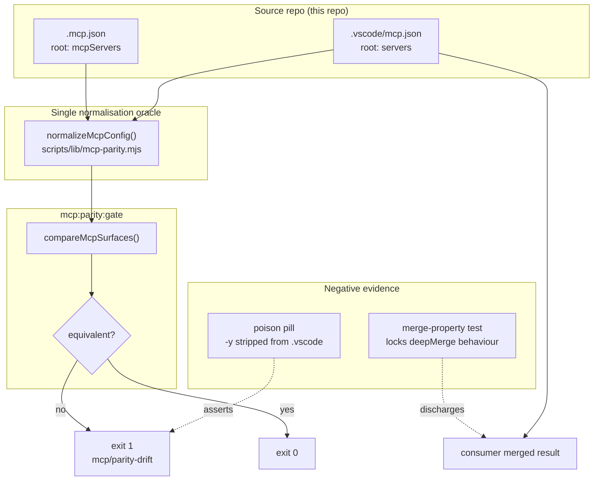

# Plan: Cross-Agent Delivery Parity

- **Date**: 2026-08-13
- **Status**: Complete
- **Author**: Claude + Louis
- **Scope**: backend
- **Target domain(s)**: `install`, `shared-lib`
- ⚠ **Cross-domain work** — touches >1 domain; the seam is deliberate (a gate in
  `install` reading config owned by `shared-lib`'s sync bundle). Confirmed intentional.

> **Origin**: a VS Code/Copilot user's repo review, 2026-08-13. Three of their
> findings were verified false or overstated before planning (see §8 Risk
> register) — this plan covers only what survived verification.

---

## 1. Context Summary

**Detected scope**: backend (`detect-stack` → `js-ts`, stackKinds `js-ts`+`postgres`).
No UI surface; this is CLI tooling, gates and instruction prose. Phases 3–4 (UX
and frontend-technical principles) are skipped by scope.

### What exists today

This repo maintains **two MCP configuration files with deliberately different
schemas**, one per agent host:

| File | Root key | Read by | Distributed to consumers? |
|---|---|---|---|
| `.mcp.json` | `mcpServers` | Claude Code | No |
| `.vscode/mcp.json` | `servers` | VS Code / Copilot | **Yes** — `EDITOR_FILES` |

[AGENTS.md:185](../../AGENTS.md) requires them "mirrored when adding servers".
**Nothing enforces it**, and a real drift was live at planning time.

### Code Trace

All citations pinned to `4b54f3e2`.

- **The drift itself** — `.mcp.json:5 (4b54f3e2)` passed `["-y", "@playwright/mcp@latest",
  "--headless"]`; `.vscode/mcp.json:6 (4b54f3e2)` passed `["@playwright/mcp@latest",
  "--headless"]`. Missing `-y` makes `npx` prompt for package install on a cold
  machine; with no interactive terminal the VS Code MCP process never starts and
  the tools silently never appear. *Already fixed by hand in this session* — this
  plan builds the gate that would have caught it.
- **Distribution path** — `scripts/lib/sync-inventory.mjs:224 (4b54f3e2)`
  `EDITOR_FILES = ['.vscode/mcp.json']` → `bundleForRepo` `sync-inventory.mjs:295
  (4b54f3e2)` → mirrored authoritatively in `scripts/sync-to-repos.mjs:654 (4b54f3e2)`.
  Only the VS Code file reaches consumers; `.mcp.json` never does.
- **Consumer write is a deep merge** — `scripts/sync-to-repos.mjs:1662 (4b54f3e2)`
  calls `deepMerge(consumerJson, ourJson)`, defined at `sync-to-repos.mjs:986
  (4b54f3e2)`.
- **Gate family template** — `scripts/check-npm-run-args.mjs (4b54f3e2)`, 323
  lines, drift-gate + baseline shape; `scripts/check-stale-skill-surface.mjs
  (4b54f3e2)`, 356 lines, the *absence-is-the-invariant* shape.
- **Poison-pill obligation** — `scripts/check-gate-poison-pills.mjs:1-28 (4b54f3e2)`
  plus `scripts/gate-contracts/_exemptions.json (4b54f3e2)`: *"any gate added after
  2026-07-31"* must carry a poison pill or an explicit `policyOverride`. Today is
  2026-08-13, so **a new gate here is pill-mandatory**. Contract shape read from
  `scripts/gate-contracts/context-check.json (4b54f3e2)`.
- **Honesty defect** — `.claude/settings.json:31-48 (4b54f3e2)` wires
  `.claude/hooks/arch-memory-check.sh` on `UserPromptSubmit` with a harness-level
  `"timeout": 12`. `README.md:66-67 (4b54f3e2)` describes this as
  "Arch-memory consult hook — auto-fires…" with **no host qualifier**.

### Measured facts

- **`deepMerge` is LEAF-PATH authoritative** (`measured`, by executing the real
  function at `sync-to-repos.mjs:986 (4b54f3e2)` against synthetic consumer
  configs). Precisely:
  - a source **leaf** — a scalar or an **array** — is authoritative at its path
    (arrays replace wholesale, never concatenate);
  - a source **plain object** is *merged recursively*, not replaced;
  - a consumer-only path at **any depth** survives.

  Two measured counterexamples, both of which falsified an earlier draft:

  ```
  # (1) consumer-only sibling keys survive on a server we own
  ours.playwright   = {type, command, args:['-y','@playwright/mcp@latest','--headless']}
  merged.playwright = {…ours…, env:{CONSUMER_FLAG:'1'}, cwd:'/somewhere'}      ← consumer keys kept

  # (2) a DECLARED key whose value is an object is NOT authoritative
  ours.x.env   = {SOURCE_FLAG:'1'}
  merged.x.env = {CONSUMER_FLAG:'1', SOURCE_FLAG:'1'}                          ← union, not ours
  ```

  **Draft 1 claimed descriptor identity; draft 2 claimed top-level key authority.
  Both were false and both were caught by audit.** Leaf-path authority is the
  third and measured formulation. It is sufficient for this plan's purpose:
  `args` is an array, therefore a leaf, therefore authoritative — which is exactly
  why fixing `-y` in our source reaches every consumer.
- **The two source files differ in exactly two tolerable ways** (`measured`, by
  diffing the parsed objects at `4b54f3e2`): the root key name (`mcpServers` vs
  `servers`), and `.mcp.json` carrying `"env": {}` where `.vscode/mcp.json` omits
  `env`. **This is an observation about today's files, not a closed set** — KD-2
  therefore validates strictly rather than projecting onto it.

### Neighbourhood considered

`get-neighbourhood` (refresh `81708ffd`, cloud on) returned 8 records, **all band
`review`**, top `bandReason: below-noise-floor` at similarity 0.627. Nothing in
this repo occupies the "compare two config files across schemas" space.

The nearest siblings are all in `scripts/check-context-drift.mjs` (`runDriftCheck`,
`checkPair`, `bodiesEqual`, `checkAgentsSize`) — the AGENTS.md↔CLAUDE.md pairing
checker. **Decision: write a sibling, not an extension.** `check-context-drift.mjs`
compares *prose surfaces for textual/structural drift*; this compares *machine
configs for semantic equivalence*. Folding MCP parity into it would overload a
script whose entire vocabulary (`ctx/` finding ids, heading allowlists, character
caps) is about markdown. Recorded per Phase 0.5's instruction that the band does
not make the reuse/extend/sibling choice.

---

## 2. Proposed Architecture



### Key design decisions

**KD-1 — The gate compares the two SOURCE files. The consumer-merge question is
discharged by a NARROW, measured property — not by a claim of descriptor
identity. (#1 DRY, #16 Graceful Degradation)**

The review asked the gate to "test the consumer-facing deep-merged result, not
only the source files". The honest reason that needs no merge simulator inside
the gate is **key-wise authority**, not descriptor identity:

> For every **leaf path** we declare (scalar or array), `deepMerge` makes our
> source value authoritative in the consumer's merged config. Therefore a parity
> fix in our source **does** reach every consumer at that path — and `args` is an
> array, hence a leaf, which is exactly the property the missing `-y` needed.

The property test asserts **only that**, in the direction that is true:

```
for every source leaf path p (scalar or array) under servers.*:
    deepMerge(arbitraryConsumer, ours)  at p   deep-equals   ours at p
plus: consumer-only servers survive untouched
plus: consumer-only paths at ANY depth survive
```

**Explicitly NOT asserted** (each pinned by a fixture so the distinction cannot
silently rot):
- the merged descriptor equals ours — it does not; consumer sibling keys (`env`,
  `cwd`) survive on servers we own;
- a declared **object-valued** key is authoritative — it is not; `env` unions.

Both are **accepted, declared behaviour**. A consumer adding an env var to their
playwright server is legitimate local customisation of their own co-owned file;
this plan's scope is *our two files agreeing with each other*, not policing
consumer configs we deliberately merge into rather than overwrite.

Fixtures required by this test (H1 R2): overlapping `env` objects, an array key,
a scalar key, a consumer-only nested field, and an empty source object (`{}` must
be shown to merge as a no-op, not as a clear).

**H1's alternative — make managed descriptors atomic authoritative replacements —
is rejected.** It would change `deepMerge`'s behaviour at the sync boundary and
silently delete consumer customisation on every sync, converting a co-owned file
into an owned one. That is a far larger and more destructive change than the
defect warrants, and it contradicts the existing documented intent at
`sync-to-repos.mjs:1501-1502 (4b54f3e2)` ("co-owned configs … are written via
deepMerge, which preserves consumer keys"). We take H1's option 2: enumerate what
we own, and limit the claim to it.

If `deepMerge` is ever "improved" to concatenate arrays, the property test fails
and tells us the gate's premise is void. **That test is the gate's load-bearing
premise and must say so in a comment naming this plan.**

**The test must exercise the PRODUCTION `deepMerge` — which requires a seam that
does not exist yet (M3 R3).** Verified at `4b54f3e2`: `deepMerge` is a plain,
**non-exported** function inside `sync-to-repos.mjs`, and that file has no export
block. A test therefore cannot import it today, and a test-local reimplementation
would recreate the exact two-spellings problem KD-2 exists to prevent — with the
added irony that the reimplementation would be of the very function whose real
behaviour falsified two drafts of this plan.

**Required step, in Phase 1**: extract `deepMerge` verbatim into
`scripts/lib/json-merge.mjs` and import it from `sync-to-repos.mjs`. Behaviour-
preserving move, no signature change. This is a genuine prerequisite, not scope
creep: without it the plan's load-bearing property is untestable against the code
it makes a claim about.

**KD-2 — The normaliser VALIDATES; it does not project. One oracle.
(#5 Single Source of Truth, #12 Validation)**

`scripts/lib/mcp-parity.mjs` is the single oracle, imported by both the gate and
the tests — never a second spelling of "what these two files have in common"
(the prose↔code-seam failure AGENTS.md documents, where two spellings of one
predicate hid a defect for months).

**A projection onto `{type, command, args, envKeys}` is unsafe and is rejected.**
Any field outside that set — `url`, `headers`, `cwd`, `envFile`, a future
transport option — would be silently dropped *before* comparison, so the two
files could differ in a launch-critical value while the gate reported equality.
That is a gate whose scope does not match its claim, and this plan exists
precisely because an unenforced claim let a launch-critical difference ship.

So the contract is **closed-world and fails loudly**:

1. Canonicalise the root key: `mcpServers` ≡ `servers`.
2. Determine the descriptor variant from its fields. Today only **`stdio`** is
   supported, with this **executable schema** (M1 R3 — "unknown field" alone is
   not enough to make a *malformed known* field fail deterministically):

   | Field | Required | Type | Valid values |
   |---|---|---|---|
   | `type` | optional | string | must equal `"stdio"` if present; absent ⇒ `stdio` |
   | `command` | **required** | string | non-empty |
   | `args` | optional | array of string | may be empty; every element non-empty; absent ⇒ `[]` |
   | `env` | optional | object | every **value** a string; absent ⇒ `{}` |

   Additionally: each `servers.*` value must be a **plain object** (not array,
   null or scalar); **no root-level fields other than the server map are
   permitted**; and any field outside the table above is an unknown field. A
   violation of any row fails `mcp/unsupported-descriptor` with the offending
   server + field named in `diagnostics` — never a coerced or skipped value.
3. **Compare every field by value**, using deterministic canonical JSON (sorted
   keys). **Including `env` values.** Absent `env` ≡ `{}`.

   > An earlier draft ignored `env` values and compared key sets only. That was a
   > direct contradiction of rule 4 in the same decision: env values select
   > endpoints, browser install locations, feature flags and auth modes, so two
   > files could differ in a launch-critical value and the gate would report
   > equality — the exact failure class this gate exists to prevent. Genuine
   > host-specific variance is now modelled as a *narrow declared exception*
   > (KD-3), not as a blanket blind spot.

   **3a. Compare env values, but NEVER emit them (M3 R4 — security).** MCP `env`
   entries routinely carry tokens and credentials. A naive canonical-JSON diff
   would place a secret in stderr, in `--json` diagnostics, in CI logs and in
   poison-pill output. So the comparison is over values while **every emitted
   diagnostic names only the server and the variable**:

   ```
   mcp/parity-drift: servers.playwright env value differs for BROWSER_TOKEN
   ```

   Never the values, never a diff of them, and **not a truncated prefix** — a
   prefix of a secret is still secret material. If a future need for
   distinguishability arises, emit a **salted hash**, not the value. This mirrors
   the repo's existing `formatSkipLog` discipline in `sensitive-paths.mjs`, which
   emits `[redacted:<sha256-hex8>]` rather than the identifying string. A test
   asserts a run with differing env values emits **neither value** on stdout or
   stderr.
4. **An unknown field, or an unsupported descriptor variant (e.g. a remote
   `url` server), is a hard configuration error** — exit non-zero with
   `mcp/unsupported-descriptor`, never a silent pass. Adding remote-transport
   support is then a deliberate act with its own parity semantics, which is the
   correct cost.

Rule 4 is what makes this safe for *future* server additions, which is the whole
point of the gate.

**KD-3 — Exceptions are a declared, validated allowlist inside the gate contract.
(#4 No Hardcoding)**

Location is explicit: the `exceptions` array of
`scripts/gate-contracts/mcp-parity-gate.json` — **not** a separate config file,
and not `_exemptions.json` (which is the poison-pill registry and has a different
job).

**Contract loading contract (M2 R4).** That file serves two readers, so its
handling must be pinned: `check-gate-poison-pills.mjs` reads the pill half via
`loadCliGateContracts`, and `check-mcp-parity.mjs` reads **only** the `exceptions`
array. The parity CLI therefore:

- requires the file to exist and parse; **missing or malformed ⇒
  `mcp/unreadable-contract`**, exit 1 (a fourth code, added here — an unreadable
  policy file must never degrade to "no exceptions", which would silently change
  the verdict);
- treats `exceptions` as **optional**; absent ⇒ `[]`;
- **rejects unknown fields inside an exception entry** (same closed-world stance
  as KD-2 rule 4), but ignores sibling top-level keys it does not own (`gate`,
  `gates`, `guards`, …) — those belong to the pill reader and are validated there.

Precedence places `mcp/unreadable-contract` immediately after
`mcp/unreadable-config`.

**Two exception kinds, both narrow, both requiring a non-empty `reason`:**

```json
{ "kind": "presence",  "server": "<name>", "presentIn": "claude"|"vscode", "reason": "…" }
{ "kind": "env-value", "server": "<name>", "var": "<ENV_VAR_NAME>",        "reason": "…" }
```

- **`presence`** excuses a server existing in one host and not the other.
  `presentIn` is a **single host string, not an array** (M1 R4) — a presence
  asymmetry has exactly one present side, and an array invites `["claude",
  "vscode"]`, which is not an asymmetry at all.
- **`env-value`** (added for H2) excuses a *named* env var on a *named* server
  holding different values per host. It is scoped to one variable — there is no
  wildcard, and no way to excuse env values wholesale.

**Every exception must be ACTIVE, or it is stale (M1 R4).** A dormant exception
silently pre-authorises a *future* divergence at that coordinate — it would sit in
the contract with a plausible reason and wave through drift that never existed
when it was written. So the gate requires each exception to correspond to a real,
current asymmetry:

- `presence` — the server must be present in exactly the declared host and absent
  from the other. Present in both, or absent from both ⇒ `mcp/invalid-exception`.
- `env-value` — the server must be present in **both** files, both must declare
  the named `var`, and the two values must **actually differ today**. Any of
  those failing ⇒ `mcp/invalid-exception`.

This makes the allowlist self-pruning: the moment an asymmetry is resolved, its
exception fails and must be deleted.

Validation rules, each with its own test:

- **An exception NEVER suppresses a descriptor mismatch** for a server present in
  both. `presence` applies only to the server-set comparison; `env-value` applies
  only to the one named variable's value. Every other field difference fails.
- `reason` non-empty, else the contract is invalid (mirrors `_exemptions.json`).
- Duplicate entries (same kind + server + var) rejected.
- **Stale entries rejected**: an exception naming a server absent from both files,
  or an `env-value` naming a var neither file declares, fails the gate. Otherwise
  the allowlist rots into permanent noise.
- Every consumed exception is named in the gate's output, so a passing run still
  shows what it excused.
- **Env values are NOT resolved at gate time** — no `process.env` lookup, no
  interpolation. The comparison is over literal configuration semantics, so the
  gate's verdict does not depend on the machine it runs on.

**KD-3b — The gate's invocation contract (explicit, because the pill depends on it).**

| Aspect | Contract |
|---|---|
| Argv | `node scripts/check-mcp-parity.mjs [--json] [--selfcheck-relocation]`. **No path arguments** — the two inputs are fixed repo-relative constants, so the pill cannot be pointed at a decoy. |
| Root resolution | Repo root derived from the script's own location via `fileURLToPath(import.meta.url)`, **never `process.cwd()`** — the pill runner executes against a tmpdir copy, and a cwd-derived root would read the real tree and pass. |
| `--selfcheck-relocation` | Per the CLI smoke contract: prints `OK` and exits 0 at the head of `main()`, proving the module's imports resolve after relocation into a consumer's `scripts/.claude-skills/`. It runs **no parity logic** and reads no config. |

**Test isolation for the fixed-path CLI (M2 R3).** Because the CLI takes no input
paths and derives its root from its own location, a CLI-level test cannot vary
inputs by argument and **must not mutate the checkout** (that would break parallel
test safety and leak across cases). The mechanism is stated so it is not
improvised: each CLI case **copies `scripts/` + the two config files into a
tmpdir**, writes the case's variant configs there, and executes the *copied*
script — so root-from-own-location resolves to the tmpdir. This is the same
isolation shape `check-gate-poison-pills.mjs` already uses, and each case asserts
the real working tree is byte-identical afterwards.

**Consequently the ORACLE, not the CLI, carries the semantic test burden.**
`compareMcpSurfaces()` is pure and takes two parsed configs, so drift /
descriptor / exception cases are tested against it directly and cheaply. The
tmpdir CLI tests cover only what is genuinely CLI-level: exit codes, the `--json`
stdout contract, and unreadable/missing input.
| Inputs | `<root>/.mcp.json` and `<root>/.vscode/mcp.json`. |
| Exit 0 | Equivalent (possibly via a declared exception). |
| Exit 1, stderr `mcp/parity-drift` | A real difference. |
| Exit 1, stderr `mcp/unsupported-descriptor` | KD-2 rule 4. |
| Exit 1, stderr `mcp/unreadable-config` | Either file missing or malformed JSON. **Never a skip** — a gate that goes green on unreadable input is the sandbox-honesty hole (a fresh worktree is exactly where this bites). |
| Exit 1, stderr `mcp/invalid-exception` | A malformed, duplicate, stale or mis-scoped exception entry (KD-3). **Added for H2 R3** — the earlier draft demanded tests assert "the right code" for these cases while defining no code for them. |

**Code precedence** (deterministic, highest first), so one run with several
problems always reports the same code: `mcp/unreadable-config` →
`mcp/unreadable-contract` → `mcp/invalid-exception` →
`mcp/unsupported-descriptor` → `mcp/parity-drift`.
Rationale: an unreadable input makes every later judgement meaningless; an
invalid exception must never be masked by the drift it was (wrongly) trying to
excuse. `diagnostics` still lists every problem found, so precedence picks the
headline code without hiding the rest.
| Output | **One result schema for every outcome, in both modes.** `--json` emits **exactly one JSON value + newline on stdout and nothing else** — no prose, for success *or* failure: `{ok, code, servers:{compared, drifted}, exceptionsUsed, diagnostics}` where `code` is `null` on success and one of the tokens above on failure. Without `--json`, stdout carries the human summary. **Human diagnostics always go to stderr**, never stdout, so a caller can parse stdout unconditionally. `compared` is the vacuous-pass guard — `compared: 0` is a failure, not a clean pass. |
| Flags | Registered via `assertKnownFlags` (else `cli:flags:gate` fails); `--selfcheck-relocation` per the CLI smoke contract. |

**KD-4 — The poison pill is the drift we just found.**

Mechanism, per `check-gate-poison-pills.mjs:20-24 (4b54f3e2)`: the runner copies
the repo to a tmpdir, applies `overlay` as a `{destination → fixture}` map, runs
`argv`, and asserts the real working tree is byte-identical afterwards. So the
contract is:

```json
"overlay": { ".vscode/mcp.json": "tests/fixtures/poison/mcp-vscode-missing-dash-y.json" },
"argv": ["scripts/check-mcp-parity.mjs"],
"expectExit": 1,
"expectStderr": "mcp/parity-drift"
```

**Two artifacts, deliberately separate (M1 R2) — a single one decays.** If the
overlay were frozen historical bytes, then the first time either MCP file gains a
server the pill would fail because the fixture *lacks that server*, while still
satisfying `expectExit: 1` + `expectStderr: mcp/parity-drift`. It would keep
passing while no longer proving that stripping `-y` is what the gate detects —
a green check whose claim has quietly changed.

| Artifact | Role | Maintenance |
|---|---|---|
| `tests/fixtures/mcp-historical-4b54f3e2/{claude,vscode}.json` | **Immutable PAIR** — the real `4b54f3e2` bytes of *both* files. | Never edited. |
| `tests/fixtures/poison/mcp-vscode-missing-dash-y.json` | **Live** poison overlay — a counterpart of the CURRENT `.vscode/mcp.json` differing *only* by the removed `-y`. | Updated deliberately whenever the active config changes. |

> **The historical fixture must be a PAIR, not a single file (H3 R3).** Semantic
> parity takes two inputs. An earlier draft froze only the VS Code side, which
> would have been compared against the *live* `.mcp.json` — reintroducing exactly
> the working-tree dependence that H3 R1 removed, and guaranteeing that the
> regression test eventually fails on unrelated evolution of the Claude-side file
> rather than on the `-y` defect it claims to pin. Both sides are frozen together,
> and the oracle is called on the pair directly (it is pure and takes two parsed
> configs — see KD-2), never through the fixed-path CLI.

A test parses the active config and the poison overlay and asserts their **sole
semantic delta is the `-y` argument**. That test is what makes updating the
active MCP config a deliberate act rather than a silent pill-decay, and it fails
loudly if someone edits one without the other.

The control run (un-overlaid) must exit 0; without it a crashed gate would
masquerade as a passing pill.

**KD-5 — Copilot instruction surface: document the deliberate ABSENCE; add no
third surface. The rule is BINARY and scoped, never "unexplained".**

*Right-sizing gate (below) drives this.* Correct [AGENTS.md:184](../../AGENTS.md)
to state what is true — this repo ships no `.github/copilot-instructions.md`
because AGENTS.md **is** the cross-agent surface, and a third file would be a
third thing to keep in sync with no content of its own.

An earlier draft said the checker should notice an "unexplained" file. **That is
not implementable**: prose in AGENTS.md saying "we have no such file" cannot be
evaluated programmatically, and "explained" had no definition. The rule is
therefore stated as a binary:

| Aspect | Decision |
|---|---|
| Governed surface | **This repository only** — the source repo's own working tree. Consumer repos are explicitly NOT governed: their `.github/` is theirs, and the sync never writes there. |
| Rule | `.github/copilot-instructions.md` is **categorically absent today.** Its presence fails. |
| Finding id | `surface/copilot-instructions-present` |
| Remediation | Move the content into `AGENTS.md` (cross-agent) or `CLAUDE.md` (Claude-only), then delete the file. If a genuine Copilot-only need appears later, that is a **plan**, not a gate override — it must settle distribution + ownership first. |
| Escape hatch | **None.** A categorical rule with a bypass is not categorical; changing the policy means editing the rule and saying why. |

**Ownership boundary (M3 R2).** Putting this in `check-stale-skill-surface.mjs`
requires broadening that script's documented responsibility from *skill* surfaces
to *agent instruction and skill* surfaces. **We accept that broadening and state
it in the script's `@fileoverview`**, because the alternative — a new ~100-line
script to assert one file's absence — is the over-engineering cliff for a
one-predicate check, and the two rules are the same shape (a retired/forbidden
path that would shadow or compete with the canonical surface). The script is
renamed in *documentation only*, not on disk: its `@fileoverview` will say it
guards "agent-facing surfaces that must not exist", and the existing
`.github/skills/` + `.agents/skills/` rules stay exactly as they are.

**The boundary must be ENFORCED IN CODE, not merely declared (H4 R3).** Verified
at `4b54f3e2`: this checker is explicitly invoked against consumer roots —
`sync-to-repos.mjs:785` and `:844` emit `check-stale-skill-surface.mjs --repo
${targetRoot}`. So a rule added unconditionally would fire **inside consumer
repos**, directly violating KD-5's "this repository only" scope and failing a
consumer for a file they legitimately own. Broadening the `@fileoverview` does
nothing to prevent this.

**Mechanism: an EXPLICIT opt-in flag, never an inferred predicate (H1 R4).** An
earlier draft gated the rule on "no `--repo` override AND the resolved root is the
script's own repo root". **That is insufficient**: it is equally true when a
*relocated copy* is run directly from a consumer's `scripts/.claude-skills/`,
which is precisely how this tooling is distributed. The inference cannot
distinguish the two, and no amount of probing makes it durable — a synced module
must derive its situation, not sniff for it.

So the rule fires **only when explicitly requested**:

```
node scripts/check-stale-skill-surface.mjs --gate --source-surfaces
```

This repo's own `skills:check` passes `--source-surfaces`; **no consumer
invocation ever does**, and a relocated copy run with no flags cannot
accidentally acquire it. The existing `.github/skills/` / `.agents/skills/` rules
keep their current, deliberately unchanged applicability. Three tests pin the
boundary — the third is the one an inferred predicate would have failed:

- `--repo <tmpConsumerRoot>` with the file present → **passes**;
- `--gate --source-surfaces` with the file present → **fails**
  `surface/copilot-instructions-present` (tracked *and* untracked);
- **a relocated copy executed with no `--repo` and no `--source-surfaces`, from a
  consumer-shaped tree containing the file → passes.**

**KD-6 — Decline the Node rewrite of the arch-memory hook.** See §8.

### Right-sizing gate

New structure on the table: a gate script, a lib module, a contract, a fixture.

- **Band-aid extreme** — fix the missing `-y` by hand (already done) and add a
  line to AGENTS.md saying "remember to mirror". The root cause — no mechanical
  check — resurfaces on the next server added, and the AGENTS.md line asking for
  it has existed all along and did not work.
- **Over-engineered extreme** — a general cross-host config-equivalence framework
  with a schema-mapping DSL, a merge simulator that models each consumer's
  existing file, and a pluggable per-host adapter registry. Nothing needs this:
  there are **two** files, **one** supported descriptor variant, and **one** merge
  function whose behaviour is measured and locked by a test.
- **Chosen** — one gate + one strict-validating normaliser + one pill + one
  property test (~250 lines total; the strictness of KD-2 rule 4 is what pushed it
  past the ~150 an earlier draft estimated, and it is the part that makes the gate
  safe for servers not yet added). Current requirement: a real drift shipped,
  silently, to every consumer, and the invariant AGENTS.md already states has no
  enforcement. The design is a true function of the problem because the normaliser
  supports exactly today's one descriptor variant and **refuses** everything else
  rather than guessing — the failure direction that cannot produce a false green.

For **KD-5** the same three lines: band-aid = commit the reviewer's untracked
local files unreviewed (ships unvetted content we never wrote, into a surface with
a consumer-overwrite hazard); over-engineering = an opt-in managed-block installer
with ownership checks for a file whose content is already in AGENTS.md;
**chosen** = make the absence deliberate, documented, and guarded by the script
that already does absence-guarding. No current requirement demands a Copilot-only
file, and "Copilot users might want one" is the YAGNI the gate exists to catch.

**Manual vs scripted**: every edit here is judgment-heavy and under ~10 sites.
Done by hand; no codemod.

---

## 6. Sustainability Notes

- **Assumption that could change**: `deepMerge`'s key-wise authority (§1, KD-1).
  Locked by the KD-1 property test, which is the designed tripwire.
- **Deliberately NOT owned**: consumer-added keys on servers we manage. Preserved
  by design and unaudited by this gate — see KD-1. If that ever needs policing it
  is a separate plan about the sync boundary, not an extension of this gate.
- **Adding a third agent host** (say a `.cursor/mcp.json`): the normaliser gains
  one root-key alias and the gate one more pairwise comparison. The `Map`-based
  canonical form was chosen over pairwise diffing so N hosts stay O(N)
  normalisations against one canonical shape rather than O(N²) special cases.
- **Extension point deliberately built in**: the exceptions allowlist. Deliberately
  *not* built in: per-host adapters, schema DSL, merge simulation.

---

## 7. File-Level Plan

> **The remediation is part of this delivery, not a prerequisite assumed done.**
> An earlier draft relied on "already fixed by hand in this session", which does
> not survive a clean checkout, a rebase, or an independent implementer — and the
> gate's control run depends on that state being correct. It is now a tracked
> file below, with the exact target bytes.

| File | Intent | Purpose |
|---|---|---|
| `.vscode/mcp.json` | modify | **The remediation itself.** `servers.playwright.args` MUST be exactly `["-y", "@playwright/mcp@latest", "--headless"]`. Verify before building the gate; if a clean checkout already has it, this is a no-op — state that rather than skipping the check. |
| `.mcp.json` | **unchanged** | Stated explicitly so an implementer does not "fix" the correct side. It already carries `-y`; it is the reference, not the defect. |
| `scripts/lib/mcp-parity.mjs` | create | `normalizeMcpConfig()`, `compareMcpSurfaces()`. The single oracle (KD-2). Pure; no fs, no process exit. |
| `scripts/check-mcp-parity.mjs` | create | CLI gate. Reads both files, calls the oracle, emits `mcp/parity-drift`. Must register flags via `assertKnownFlags` and implement `--selfcheck-relocation`. |
| `scripts/gate-contracts/mcp-parity-gate.json` | create | Contract + poison pill (KD-4). |
| `scripts/lib/json-merge.mjs` | create | Verbatim extraction of `deepMerge` so the KD-1 property test can exercise the **production** function (M3 R3). Behaviour-preserving. |
| `scripts/sync-to-repos.mjs` | modify | Import `deepMerge` from the new module; delete the local copy. No behaviour change. |
| `tests/fixtures/mcp-historical-4b54f3e2/claude.json` + `vscode.json` | create | **Immutable PAIR** of the exact bad `4b54f3e2` bytes (H3 R3). The red test reads THESE, never the working tree. |
| `tests/fixtures/poison/mcp-vscode-missing-dash-y.json` | create | **Live** pill overlay — current `.vscode/mcp.json` minus `-y` only (KD-4, M1). |
| `tests/mcp-parity.test.mjs` | create | Oracle unit tests **+ the KD-1 `deepMerge` property test**. Red-then-green against the committed fixture. |
| `package.json` | modify | Add `mcp:parity:gate`; insert into `check` chain. |
| `AGENTS.md` | modify | Correct the `.github/copilot-instructions.md` claim (KD-5); label the arch-memory hook Claude-specific. **Reword in place — must not grow the file** (8,422 chars headroom). |
| `README.md` | modify | Qualify the arch-memory hook line as Claude Code-only. |
| `scripts/check-stale-skill-surface.mjs` | modify | Add the **categorical** rule from KD-5: the presence of `.github/copilot-instructions.md` in this repo's working tree fails with `surface/copilot-instructions-present`, **irrespective of content, documentation, or git-tracked status** (an untracked file changes local host behaviour just as a tracked one does — that is precisely how this gap surfaced). Broaden the `@fileoverview` to "agent-facing surfaces that must not exist". Tests for both tracked and untracked presence. |

### 7b. Implementation Phases

**Phase 0 — `deepMerge` extraction seam**: verbatim move so the KD-1 property is
testable against production code at all (M3 R3). Files:
`scripts/lib/json-merge.mjs` (create), `scripts/sync-to-repos.mjs` (modify).

**Phase 1 — Remediation baseline + oracle + tests (red first)**: freeze the bad
config pair as immutable fixtures, confirm/apply the `-y` repair, then build the
strict normaliser and prove it rejects the pair before any wiring exists.
Files: `tests/fixtures/mcp-historical-4b54f3e2/claude.json` (create),
`tests/fixtures/mcp-historical-4b54f3e2/vscode.json` (create),
`.vscode/mcp.json` (modify), `scripts/lib/mcp-parity.mjs` (create),
`tests/mcp-parity.test.mjs` (create).

**Phase 2 — Gate + pill**: CLI wrapper, contract, live pill overlay,
`check`-chain entry. Files: `scripts/check-mcp-parity.mjs` (create),
`scripts/gate-contracts/mcp-parity-gate.json` (create),
`tests/fixtures/poison/mcp-vscode-missing-dash-y.json` (create),
`package.json` (modify).

**Phase 3 — Instruction-surface honesty**: the prose corrections and the
absence-guard extension. Files: `AGENTS.md` (modify), `README.md` (modify),
`scripts/check-stale-skill-surface.mjs` (modify).

**Close-out (not a phase)**: `npm run check` · `npm run gates:poison` ·
`npm run context:check` (confirm AGENTS.md did not grow).

---

## 8. Risk & Trade-off Register

### Review claims that did NOT survive verification

Recorded so they are not re-raised.

| Claim | Verdict |
|---|---|
| "Commit the untracked `copilot-instructions.md` + `mermaid.instructions.md`" — the review's #1 | **Falsified.** Neither file exists in this repo (`git status -uall .github/` empty; `.github/` holds only `ISSUE_TEMPLATE/`, `PULL_REQUEST_TEMPLATE.md`, `dependabot.yml`, `workflows/`). They are the reviewer's own local workspace files. |
| "`context:check` reports clean while untracked files alter VS Code behavior" | **Falsified** — depends entirely on the above. |
| Hook timeout "degrades to an unbounded synchronous command" | **Overstated.** `.claude/settings.json:39 (4b54f3e2)` sets a harness-level `"timeout": 12`. Absent GNU `timeout` degrades the inner 8s bound to the outer 12s, not to unbounded. |

**Generalisable lesson**: the reviewer audited *inside a live developer workspace*
and could not separate repo policy from local operator state, which drove their
top-priority recommendation. An agent reviewing a checkout it does not control
must distinguish `HEAD` from the working tree before asserting repo policy.

### KD-6 — Node rewrite of `arch-memory-check.sh`: declined

The stated risk (unbounded execution) does not exist — the harness bound holds.
The residual is real but small: without GNU `timeout` the *inner* 8s bound
silently vanishes, so a slow RPC blocks a prompt for 12s instead of 8s. Rewriting
a working 250-line hook to shave 4s in a degraded case is the over-engineering
cliff. **Deferred with a named independence**: no part of this plan's code calls
the hook or depends on its timing, so this is a true scope boundary, not a
correctness dependency being waved past.

### Other risks

- **AGENTS.md character cap.** 83,578/92,000 at `4b54f3e2`. Phase 3 edits **must
  reword in place**. If any edit nets positive, condense the same section to
  compensate — never raise the cap, never squeeze in by shaving unrelated words.
- **The gate's premise is a test, not a proof.** If the KD-1 property test is ever
  skipped or deleted, the gate keeps passing while its justification is gone. This
  is the "a check whose scope no longer matches its claim" failure mode. Mitigation:
  the property test names the gate in its title so `check-gate-contracts.mjs`'s
  test-reference validation binds them.
- **Scope discipline.** Six files are modified by a concurrent session
  (`scripts/lib/arch-render.mjs`, `audit-shadow.mjs`, `audit/finding-verification.mjs`,
  `plan-paths.mjs`, `repo-inventory.mjs`, `tests/audit-shadow.test.mjs`) plus 3
  untracked test files. **Leave all untouched; stage by name only.**

---

## 9. Testing Strategy

**Tier 1 (test-first)** — `mcp-parity.mjs` is a deterministic pure module, so it
takes the Tier-1 path per the testing doctrine.

- **Red-then-green, one defect at a time**: first assert the oracle flags the
  immutable `mcp-historical-4b54f3e2.json` fixture as drift. **See it fail
  before wiring anything** — a check not yet observed failing is not evidence.
  Reading the fixture rather than the working tree is what makes the red test
  reproducible on a clean checkout (H3).
- **Pill-decay guard (M1)**: assert the live poison overlay and the active
  `.vscode/mcp.json` differ **only** in the `-y` argument.
- **CLI integration tests over the `--json` contract (M3)**, one per outcome:
  clean, drift, unreadable JSON, missing input, unsupported descriptor,
  stale/invalid exception, unreadable contract. Each asserts stdout parses as
  exactly one JSON value and carries the right `code`, and that no prose reached
  stdout.
- **Secret-leak test (M3 R4)**: a run with differing `env` values emits the
  variable name but **neither value** on stdout or stderr.
- **Negative control**: the current (fixed) pair must compare equal. Without it, a
  normaliser that throws on every input would "detect" the drift by crashing.
- **Vacuous-pass guard**: assert `compared > 0` and that it equals the number of
  servers actually declared, so a normaliser returning an empty Map cannot read as
  "no drift". This is the `db:enrolment:gate` lesson — iterate the side that can
  see what the other cannot.
- **Property test (KD-1)** — assert the TRUE property, and assert the false ones
  are false so the distinction can't silently rot. **The unit is the LEAF PATH,
  never the key** (an earlier draft said "every key we declare", which contradicts
  KD-1's own `env`-union case — H1 R3):
  - for every source **leaf path** (scalar or array) under `servers.*`, the merged
    value at that path deep-equals ours;
  - consumer-only servers survive;
  - consumer-only paths at any depth survive;
  - **and explicitly false**: a declared *object-valued* key (`env`) does **not**
    deep-equal ours — it unions. Pinned with a comment naming this plan and KD-1
    so a future reader sees it was measured, not overlooked.
- **KD-2 edge cases**: server in one file only (fail unless a valid exception
  declares it); env key present in one only (fail); **env value differing without
  an `env-value` exception (fail)**; env value differing *with* one (pass);
  **unknown field on a known descriptor (fail `mcp/unsupported-descriptor`)**;
  **a `url`-style remote descriptor (fail, not silently ignore)**; malformed JSON
  or missing file (fail `mcp/unreadable-config`, never skip — the sandbox-honesty
  hole).
- **KD-3 exception validation** (all fail `mcp/invalid-exception`): empty reason;
  duplicate entry; stale entry naming an absent server or an undeclared env var;
  and the key one — **an exception must NOT suppress a descriptor mismatch** for a
  server present in both. Plus a **precedence** test: a run with both an invalid
  exception and real drift reports `mcp/invalid-exception`, with both listed in
  `diagnostics`.
- **M3/Phase 0 regression — an INTEGRATION test over the real sync write path is
  the primary guard** (Gemini gate, R4). Two drafts got this wrong in opposite
  directions: R3 asked for referential identity (not observable), and R4's fix
  substituted a static source assertion — a brittle implementation-detail check
  that proves the import exists but never observes the sync path *using* it.

  **The production path IS observable.** Verified: `sync-to-repos.mjs` accepts
  `--target-path` (and `--dry`), so the co-owned-config merge can be executed
  against an isolated tmpdir consumer root — the same isolation shape as KD-3b.
  The test:

  1. Seeds a tmpdir consumer root with a `.vscode/mcp.json` carrying a
     consumer-only nested field (`env.CONSUMER_FLAG`), a consumer-only server,
     and a stale `args` array.
  2. Runs the real sync at that path.
  3. Asserts on the **written file**: consumer-only nested fields and servers
     survive; source scalar/array leaves (notably `args`, hence `-y`) are
     overwritten.

  This directly observes the production write path and pins KD-1's leaf-path
  authority where it actually matters, rather than at the library boundary.

  Retained as a cheap **secondary** DRY guard — explicitly *not* the behavioural
  proof: a static assertion that `sync-to-repos.mjs` imports `deepMerge` from
  `./lib/json-merge.mjs` and declares no local copy, in the shape of the existing
  [anthropic-client-migration.test.mjs](../../tests/anthropic-client-migration.test.mjs).
- **KD-5 boundary (H4)**: the two `--repo`-scoped tests described in KD-5 — a
  consumer root with the file passes; source-repo self-inspection with the file
  fails. Both tracked and untracked presence fail in the source repo.
- **Poison pill + control** via `npm run gates:poison`.

---

## 11. Execution Clustering

- **Cluster A** — Phases 0–2 — fix-gate: yes
  - Coupling: Phase 0's extraction is the seam Phase 1's property test imports,
    and Phase 2's contract declares the pill that exercises Phase 1's oracle. The
    `check`-chain entry is only safe once the oracle's negative control passes.
    All three share the `deepMerge` / `normalizeMcpConfig` seams and must be
    audited together — in particular, the extraction touches the live sync path,
    so the wiring pass must see it beside its consumer.
- **Cluster B** — Phase 3 — fix-gate: final
  - Coupling: single-phase cluster; instruction-prose edits plus the
    `--source-surfaces` boundary work. Independent of Cluster A — no shared code
    path, no import between them.
- **Final gate**: consolidated Gemini review over the union diff of Clusters A+B.

---

## 12. Audit Trail

**GPT plan audit — 4 rounds, stopped at the cap.**

| Round | Verdict | Findings | Accepted as fix-now |
|---|---|---|---|
| 1 | SIGNIFICANT_GAPS | H:3 M:3 | 6/6 — **100%** |
| 2 | NEEDS_REVISION | H:2 M:3 | 5/5 — **100%** |
| 3 | SIGNIFICANT_GAPS | H:4 M:3 | 7/7 — **100%** |
| 4 | NEEDS_REVISION | H:1 M:4 | 5/5 — **100%** |

**Stop decision**: stopped after round 4 (default cap 3, absolute 5). Acceptance
stayed at 100% throughout, which by the rigor-pressure rule justified exceeding
the default cap — the rounds were buying real corrections, not manufacturing
work. Stopped before 5 because the HIGH count fell 4 → 1 and round 4's remaining
findings were trending from design defects toward completeness precision.

**What the loop actually caught** — worth recording, because three of these were
defects in *my own reasoning*, not omissions:

- **The merge premise was wrong twice.** Draft 1 claimed the consumer's merged
  descriptor is identical to ours; draft 2 claimed top-level key authority. Both
  were falsified by *executing* `deepMerge` rather than reading it. Leaf-path
  authority is the third and measured formulation. **Lesson: a claim about a
  function's behaviour is a hypothesis until run.**
- **A fix introduced a security defect.** R2's H2 fix (compare `env` values, don't
  ignore them) created the R4 M3 leak — MCP env values carry credentials, and a
  naive diff would print them to CI logs. Redaction is now specified.
- **Round-3 findings were largely propagation debt from round-2 fixes** —
  contradictions left behind when KD-1 was corrected but §9 was not. Expected and
  legitimate; this is why a rising HIGH count with high acceptance is not a stop
  signal.
- **Three claims were verified against source before acceptance**, not taken on
  trust: `deepMerge` is genuinely non-exported (M3 R3);
  `check-stale-skill-surface.mjs` is genuinely invoked against consumer roots at
  `sync-to-repos.mjs:785,844` (H4 R3); and `sync-to-repos.mjs` genuinely accepts
  `--target-path` (Gemini gate). All three held.

**Gemini independent final gate — 1 round, verdict `CONCERNS` → resolved.**

Reviewer: `claude-opus-5` (Gemini unavailable; the documented fallback). One new
MEDIUM, **zero wrongly-dismissed, zero over-engineering flags**. The finding
corrected *me*: I had asserted an integration test of the sync write path "is not
observable", and the reviewer showed it is. Accepted and fixed — the static
source assertion was demoted to a secondary DRY guard and a real integration test
over `--target-path` is now the primary regression guard.

**Stop decision**: gate closed after 1 round. The single finding was a concrete
design defect, fixed rather than deferred; nothing remains outstanding. The
2-round Gemini cap was not reached.

---

## Implementation Log

### 2026-08-13 — both clusters shipped

- **Cluster A** (`2e1a2be6`) — Phases 0–2. `deepMerge` extracted to
  `scripts/lib/json-merge.mjs`; the strict-validating oracle
  `scripts/lib/mcp-parity.mjs`; the gate `scripts/check-mcp-parity.mjs` + contract
  + live poison pill; 46 tests including the real-sync integration test over
  `--target-path`. In-cluster fix-gate: HIGH 0 / MEDIUM 0.
- **Cluster B** (`56edfb66`, `a89478bd`) — Phase 3. `--source-surfaces` enforces
  the `.github/copilot-instructions.md` absence; AGENTS.md + README label the
  arch-memory hook Claude-Code-only acceleration.
- **Consolidated gate** — `APPROVE` on round 3 (claude-opus-5 fallback), 0 new
  findings, 0 over-engineering flags. Rounds 1–2 found the vacuous-pass guard
  unenforced, a `TypeError` on `JSON.parse`'d `null`, and a forged `gateAddedAt`
  backdate on the re-keyed exemption.

**Deviations from the plan, and why:**

1. **KD-3's exception location was unimplementable.** The plan put the allowlist
   inside `scripts/gate-contracts/mcp-parity-gate.json`, but `CliGateContractSchema`
   is `.strict()` and owned by the gate-honesty subsystem — it rejected the key.
   Widening a deliberately-closed contract for one gate is worse than a sibling
   file, so exceptions live in `mcp-parity-exceptions.json` (absent today; there
   are none). The oracle's exception logic is unchanged and fully tested.
2. **`scripts/.cli-catalog.json` was outside Cluster A's declared scope.** An
   existing gate requires every npm script to carry a catalog entry, so adding one
   was mechanically mandatory rather than a design choice.
3. **The KD-5 rule could not be poison-pilled.** Verified against the runner, not
   inherited from prose: both `overlay` and `applyMutation` refuse a destination
   that does not already exist, and every rule this command enforces is an
   ABSENCE — so the tamper is file creation. Recorded as a `policyOverride` with
   the real date, and covered by four-direction tests instead.

**Empirical confirmation of KD-5's boundary.** Both consumer repos carry a
`.github/copilot-instructions.md`. An unconditional rule — or the inferred
"am I the source repo?" predicate the plan audit rejected — would have started
failing both of them for a file they legitimately own. One correction to the
plan's own reasoning: the relocated-copy scenario cited in KD-5 does not arise,
because `check-stale-skill-surface.mjs` is not in the consumer bundle. The live
risk was the `--repo <targetRoot>` invocation at `sync-to-repos.mjs:785,844`.

**Known follow-up, not in this plan.** `/cycle` Step 3C's per-cluster audit
envelope is `clusterStartRef..WORKTREE`, and `--scope=diff` recomputes the changed
set from the working tree — so on a shared tree it cannot separate this cluster's
edits from a concurrent session's. Measured here: 52 changed files reached the
prompt against 11 declared, 44 of them another session's. `--changed` does not
constrain it (`openai-audit.mjs:622` — it is an R2+ impact-set input). Needs its
own plan.
