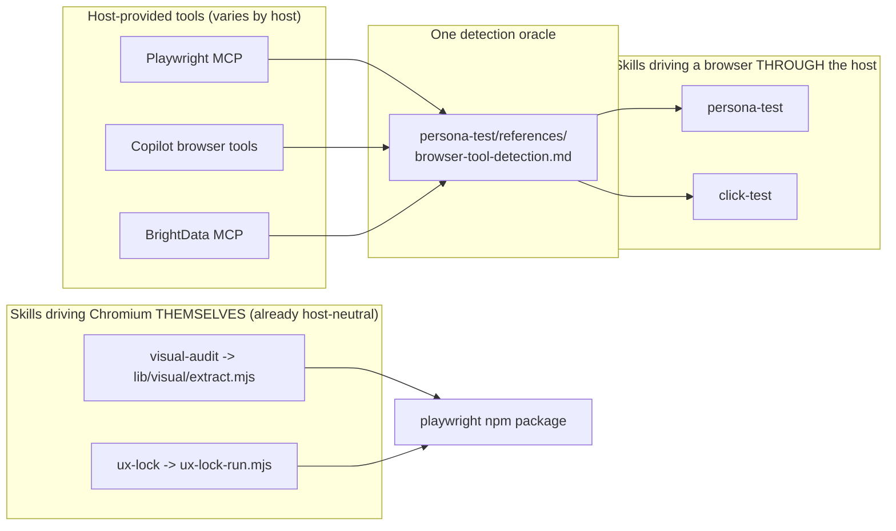

# Plan: Cross-Host Parity v2 — Skills Correct on VS Code Copilot

- **Date**: 2026-09-02
- **Status**: Complete (cross-host unverified) — E1–E6 in §9 are NOT yet run; see Copilot acceptance below
- **Author**: Claude + Louis Strydom
- **Scope**: backend (documentation / skill-text; skill text IS the product)
- **Target domain(s)**: `skills-content` (after R1/M2 resolved P2 to prose-only,
  the `install`-domain file dropped out of scope — see D7)
- ⚠ **Cross-domain work**: none remaining. The original `install` touch was a
  read-only assessment of a description validator, removed by D7.
- ⚠ **Untagged paths**: `AGENTS.md` — matches no rule in
  `.audit-loop/domain-map.json`. It is repo-root instruction prose, not a
  domain module; no rule is warranted.

---

## 1. Context Summary

**Detected scope**: backend · **stack**: `js-ts` (+ `postgres`) ·
**Python framework**: none. Backend engineering principles apply; UX and
technical-principle phases are skipped by scope.

### The problem

The bundle's 16 skills are authored for Claude Code and shipped to a
population that substantially runs **VS Code + GitHub Copilot**. Copilot
discovers `.claude/skills/` natively, so it reads the same files — and several
of them assert things that are true only in Claude Code. Nothing in the repo
tests for this class, and every instance is individually plausible.

### Code Trace

All refs pinned at `e6c1f1c0`.

- **Browser tiering is NOT uniform across the four browser skills** — the single
  most consequential finding, because it halves the work:
  - `skills/persona-test/references/browser-tool-detection.md:20,65,75,83
    (e6c1f1c0)` — the canonical ladder: Tier 1 Playwright MCP → Tier 2
    BrightData → Tier 3 "the built-in WebFetch tool" → Tier 4 blocked. Tiers 1–3
    are all **host-provided tool** tiers.
  - `skills/click-test/SKILL.md:164 (e6c1f1c0)` delegates detection to that file
    ("Same logic as persona-test") and then declares its own **abstract
    capability contract** at `:172` — `navigate`, `evaluate`, `click`,
    `keyboard`, `wait`, `currentUrl`, aborting with `[BLOCKED] Tool <name>
    missing capability: <cap>`. That contract is *already* host-neutral; only
    the tier list naming it is not.
  - `/visual-audit` reaches the browser at
    `scripts/lib/visual/extract.mjs:68 (e6c1f1c0)` —
    `await import('playwright')` then `chromium.launch()` at `:89`, inside a
    **synced node script**. Its own docstring at `:5` says *"nothing else
    imports playwright"*.
  - `/ux-lock` shells `node scripts/ux-lock-run.mjs spec|verify`
    (`skills/ux-lock/SKILL.md:177,268 (e6c1f1c0)`), which runs
    `npx playwright test` (`:170`).
  - **Therefore**: visual-audit and ux-lock are already host-independent — they
    never touch a host MCP tool. Only **persona-test** and **click-test** are in
    scope for the browser workstream.
- **`$ARGUMENTS`** — **19 occurrences across 9 FILES** (`measured`, by literal
  substring count over `skills/**/*.md` at `e6c1f1c0`). Per file, and the
  columns sum to 19 — an earlier phrasing of this list was misread as 18 by the
  R2 audit, so it is now one row per file with no parentheticals:

  | File | Count |
  |---|---|
  | `skills/persona-test/SKILL.md` | 7 |
  | `skills/ship/SKILL.md` | 3 |
  | `skills/click-test/SKILL.md` | 2 |
  | `skills/ux-lock/SKILL.md` | 2 |
  | `skills/ux-lock/references/verify-mode-generation.md` | 1 |
  | `skills/audit-code/SKILL.md` | 1 |
  | `skills/audit-plan/SKILL.md` | 1 |
  | `skills/brainstorm/SKILL.md` | 1 |
  | `skills/ai-context-management/SKILL.md` | 1 |
  | **Total** | **19** |

  Note `/ux-lock` contributes **3** (2 in its SKILL.md + 1 in its reference) —
  that is the row pair the earlier prose blurred.
- **Orchestration** — `skills/cycle/SKILL.md:44 (e6c1f1c0)`: *"Each step is a
  delegation to the underlying skill"*, naming `/audit-code`, `/audit-plan`
  etc. Research input: Copilot has no documented skill-invokes-skill mechanism.
- **Hook claims** — `AGENTS.md:1153 (e6c1f1c0)` states the quickfix hook *"fires
  on every Edit/Write (PostToolUse)"* with no host qualifier;
  `skills/ship/SKILL.md:1187 (e6c1f1c0)` asserts *"The `UserPromptSubmit` hook
  injects `> Relevant prior friction` callouts"*. Contrast the arch-memory
  section, which already models the correct treatment: the rule is host-neutral
  and mandatory, the hook is labelled Claude-Code-only **acceleration**.

### Patterns reused vs new

Reused, no new machinery: the **abstract capability contract** already in
click-test; the **single-detection-oracle** rule (browser-tool-detection.md is
the one detector, cited by click-test rather than copied); the arch-memory
section's **rule-vs-acceleration** phrasing; the `skills:consumer-refs:gate`
baseline shape for anything unreachable. Nothing here introduces a new
abstraction, config surface, or artifact.

### Neighbourhood considered

Architectural-memory consultation is **not applicable**: this plan introduces no
new function, class, component, route or constant. Per AGENTS.md's "When NOT to
consult", doc-only changes are exempt. `compute-target-domains` was run and its
output is in the header above.

---

## 2. Proposed Architecture



### Key design decisions

- **D1 — Add a driver tier, do not add a detector.** Copilot's browser tools
  become a peer of Playwright MCP inside the existing ladder in
  `skills/persona-test/references/browser-tool-detection.md`. click-test keeps
  citing that file. *(#1 DRY, #5 Single Source of Truth.)* The alternative —
  teaching each skill about Copilot — is the two-oracles defect the repo
  already prohibits for `classifySelector` and `sensitive-paths`.
- **D2 — Tier on CAPABILITY, name the tool second.** click-test's existing
  `navigate/evaluate/click/keyboard/wait/currentUrl` contract already decides
  fitness without naming a vendor. Promote that framing into the ladder so a
  future host needs no edit. *(#20 Long-Term Flexibility, #16 Graceful
  Degradation.)*

  **D2a — the ladder becomes a normative driver contract, not a tier list**
  (R1/H1). Naming a tier "Copilot browser tools" is not an adapter; without the
  five items below, two implementers write two different contracts — the
  two-oracles defect D1 exists to prevent. `browser-tool-detection.md` must
  therefore define:

  1. **Capability vocabulary with operation semantics** — the closed set
     `navigate`, `readText`, `evaluate`, `click`, `type`, `keyboard`,
     `screenshot`, `wait`, `currentUrl`, each with one line saying what
     "supported" means. Two carry the load: `evaluate` = runs arbitrary JS in
     page context and returns a serialisable result (a fetch-and-parse tool does
     **not** satisfy it); `readText` = returns the rendered page's text content
     (a static fetcher **does** satisfy it, which is why it is a separate
     member). `readText` was added in R3 — the R2 draft used the phrase
     "page-text retrieval" in the degraded set while claiming the vocabulary was
     closed, so a static-fetch driver could not be evaluated against it at all.
     A closed set with a member used outside it is not closed.

     **"Probed" means read from the mapping table, not negotiated at runtime**
     (R3/H1). A host does not answer capability questions; item 5's table
     declares what each known driver supports, and detection matches the
     available driver against that row. Probing is therefore a lookup plus an
     availability check, which is what makes selection deterministic.
  2. **Deterministic selection — ONE rule, not two** (R2/H2). The R1 draft had
     both "first driver satisfying the set" and a separate tie-breaker; if
     selection is first-match over a fixed order, a tie-breaker can never fire,
     so one of the two was dead. Resolved: the probe order **is** the
     preference, and it is ordered by the tie-breaker's own principle —
     credential-free drivers first. **Order: Playwright MCP → host-native
     browser tools (Copilot) → BrightData → static fetch.** Select the first
     that satisfies the caller's minimum set. No second rule.
  3. **Per-consumer minimum capability sets, enumerated** (R2/H2). No skill may
     say "the interaction set" without listing it:

     | Consumer | Minimum set | If unmet |
     |---|---|---|
     | click-test | `navigate`, `evaluate`, `click`, `keyboard`, `wait`, `currentUrl` | `[BLOCKED]` — its DOM scan IS a `page.evaluate` call; a static fetcher can never serve it |
     | persona-test — full journey | `navigate`, `click`, `type`, `evaluate`, `screenshot`, `wait`, `currentUrl` | fall to read-only degraded |
     | persona-test — read-only degraded | `readText` alone | `blocked` |

     > **Corrected during implementation (Cluster A R3/M1, caught again by the
     > consolidated Gemini gate as G1).** This row read `navigate`, `readText`
     > until the implementation showed the two are incompatible: `navigate`'s
     > own definition requires waiting for a document to be ready, which a
     > one-shot fetch has no document to wait on. `static-fetch` therefore
     > cannot supply `navigate`, and a degraded set demanding it could **never**
     > be satisfied by the only driver that degraded mode exists for — the
     > fallback would abort `blocked` instead of degrading. Resolved by making
     > `readText` self-sufficient (it takes a URL) and requiring it alone.
     >
     > The implementation was fixed at the time; **this table was not**, so the
     > plan and the code disagreed for two rounds. Worth naming because the plan
     > is the audit spec: left stale, the next audit would have flagged the
     > correct implementation as wrong.

  4. **Degraded ≠ blocked ≠ clean — three statuses, each with its evidence**
     (R2/H2). A partial surface is never silently a pass:

     | Status | When | Required evidence | Permitted stages |
     |---|---|---|---|
     | `ok` | minimum set for the full journey met | driver name + capabilities probed | all |
     | `degraded` | read-only set met, interaction set not | driver name + **the missing capabilities, named** + `[DEGRADED MODE]` banner in the report | observation only; **no** interaction, flow or state-change stage may be claimed as run |
     | `blocked` | read-only set unmet | driver name + missing capability + per-driver probe failure reason | none — abort before scanning |

     A `degraded` run **must not** report a clean verdict, and its findings
     carry the degraded status; this is the repo's existing capture-honesty
     rule (an empty or partial capture degrades to `unverified`, never to
     "verified / 0 findings").
  5. **A host→capability mapping table** — one row per known driver, so adding
     a host is one row and no prose edit.

- **D2b — sequencing: the contract is written BEFORE the tier is added.** Item 1
  and item 5 are the same edit; adding the Copilot row without the vocabulary
  reproduces exactly the ambiguity H1 flagged.
- **D3 — Scope the browser workstream to 2 skills, not 4.** Evidence in §1.
  Editing visual-audit and ux-lock would be churn against files that already
  hold the property. *(Right-sizing.)*
- **D4 — `$ARGUMENTS` gets an input-acquisition CONTRACT, not a gloss** (R1/H3).
  `argument-hint` is display-only (verified research input), so no frontmatter
  field can deliver arguments on Copilot. "Whatever the user typed after the
  skill name" is therefore necessary but not sufficient — it says nothing about
  the three cases that actually bite. The contract each affected skill states:

  0. **Orchestrator-supplied input is a first-class source** (R3/H2), and it
     outranks the other two. When `/cycle` (or any skill) delegates, it passes
     the delegated skill's arguments **literally** — the plan path, the
     sub-command, the flags it was itself given. This is not inference from
     conversation: the orchestrator already holds those values. Without this
     source the plan contradicted itself — D4 would force an inlined
     `/audit-code` to ask-and-stop for a plan path no user message names,
     deadlocking every inline cycle. Two constraints keep it honest: the
     orchestrator passes **only** values it was given or derived from the plan
     (never invented), and an inlined skill treats them exactly as a host
     suffix, including the override-flag prohibition in rule 2 — `/cycle` may
     not synthesise `--no-tests` any more than a conversation may.
  1. **Source, in priority order** — orchestrator-supplied input (rule 0) when
     present; else the host's verbatim invocation suffix when
     it supplies one; otherwise the **designated text**, defined operationally
     (R2/H1) as: *the span of the user's current message that names this skill
     or its subject, in that message only.* Three consequences, so this is
     followable rather than aspirational: an earlier turn is **not** designated
     text; a file path mentioned while discussing something else is **not**
     designated; and if the current message names no such span, the input is
     **empty** and rule 3 applies. When in doubt, it is empty — that routes to
     ask-and-stop, which is the safe direction.
  2. **Never infer.** Flags, file paths and sub-commands are read only from that
     designated text — never from surrounding conversation. This is the
     load-bearing clause: `/ship`'s `--no-tests` / `--ignore-p0` /
     `--skip-ux-lock` disable gates, and inferring one from ambient prose would
     silently switch off a brake nobody asked to switch off.
  3. **Empty input is a defined state, per site.** Where the skill has a
     documented default, take it — `/ship` with no plan path ships without a
     plan update; `/persona-test` with no sub-command runs the default test
     flow. Where input is **required** — `/audit-code` and `/audit-plan` need a
     plan path, `/ux-lock verify` needs one — ask one prescribed clarification
     question and **stop before any side effect**, never guess a target.
     (The R1 draft used `/skills` as the default-taking example; corrected,
     since `skills/skills/SKILL.md` contains no `$ARGUMENTS` and is out of
     scope — R2/H1.)
  4. **Grammar class is declared per site**, because the 19 occurrences are not
     one kind: free text (`/plan`, `/brainstorm`), a sub-command dispatch
     (`/persona-test`, `/ux-lock`, `/ai-context-management`), or a path plus
     optional flags (`/ship`, `/audit-code`, `/audit-plan`, `/click-test`).
  5. **Applied at EVERY site, not the first one** (R2/H1). P2's original "first
     use" wording contradicted the per-site contract. One skill states the
     contract once, in full, at its first `$ARGUMENTS` use; every **subsequent**
     site in that skill carries its own grammar class and empty-input behaviour
     inline, because that is the site an implementer actually reads. This
     matters most in `skills/persona-test/SKILL.md`, whose 7 sites span
     sub-command dispatch, quoted-string parsing and flag detection.

  *(#15 Error Handling, #12 Validation — make the contract explicit rather than
  inferred, and fail loudly rather than guess.)*
- **D5 — Hook claims become rule + portable path + accelerator** (R1/H4).
  Qualifying a claim makes it honest; it does not restore what the hook did.
  Each hook-backed behaviour therefore states three things, exactly as the
  arch-memory section already does: **(a)** the mandatory all-host rule and its
  acceptance condition, **(b)** the portable execution path and when it runs,
  **(c)** the Claude Code hook as an optional accelerator.

  **The portable path is NOT equivalent to the hook, and the plan must say so**
  (R2/H4). The R1 draft claimed both paths "already exist and ship" — true, but
  it implied a parity that does not hold, which is the same overstatement class
  this plan exists to fix. Stated per behaviour:

  | Behaviour | Mandatory all-host rule + acceptance condition | Portable path (cadence) | Accelerator (Claude Code only) |
  |---|---|---|---|
  | Quick-fix detection | A shortcut signature is surfaced to the author before the change is called done — accepted when either the hook fired or a `quickfix`-wave audit ran over the change | Layer-2 `quickfix` wave inside `/audit-code`, **once per audit** | `.claude/hooks/quickfix-scan.mjs`, **after every edit** |
  | Friction closure | A friction note the commit may have resolved is surfaced once after a successful push — accepted when the session-review command ran and its output was reported | `node scripts/cross-skill.mjs quality session-review` at `/ship` Step 6.6, **once per ship** | `UserPromptSubmit` hook, **per prompt** |

  **The cadence gap is real and is disclosed, not papered over**: on a host
  without hooks, a shortcut is caught at audit time rather than at edit time —
  later, and only for changes that get audited. That is a weaker guarantee, and
  saying so is the point; a reader who believes the guarantees are identical
  will not compensate for the difference. *(#5 Single Source of Truth, #16
  Graceful Degradation, #19 Observability.)*
- **D6 — `context: "fork"` is evaluated and DECLINED.** See §8.
- **D7 — Frontmatter scope is RESOLVED to prose-only** (R1/M2). The plan
  previously said "assess and then decide", which hands the decision to the
  implementer. Decision: **no frontmatter key is added by this plan.**
  `argument-hint` is display-only so it cannot serve D4's requirement, and menu
  polish across nine skills is not a current requirement — YAGNI. The
  conditional "if the validator rejects it, drop it" branch is removed with it.
  *(Right-sizing.)*

### Right-sizing gate

- **Band-aid**: qualify the two hook sentences and stop. The browser ladder and
  `$ARGUMENTS` stay Claude-only, and the next skill copies the pattern.
- **Over-engineered**: a host-capability abstraction layer — a
  `host-profile.json`, per-host tool-name maps, a detection CLI, `context:
  "fork"` adopted across the roster. No current requirement needs any of it;
  the roster has two hosts and one of them already works.
- **Chosen**: extend the ONE existing ladder with a capability-first tier,
  define `$ARGUMENTS` in prose, and mirror an existing phrasing pattern for the
  hooks. Serves the current requirement (Copilot users hit real dead ends)
  with no new artifact, config surface, or abstraction.

**Manual vs scripted**: the `$ARGUMENTS` edit spans 9 skills but the sites
differ (sub-command dispatch vs override-flag detection vs a plain input line),
so it is judgment-heavy and **done by hand**. No codemod.

---

## 6. Sustainability Notes

- **Assumption that could change**: Copilot's frontmatter set and browser-tool
  names. Mitigated by D2 — the ladder keys on capabilities, so a rename costs
  one line in one file.
- **Assumption already falsified once**: that `disable-model-invocation` was
  Claude-only. It is not. The lesson encoded here is to state the *rule* in the
  body (every host reads it) and let frontmatter be enforcement.
- **Extension point deliberately built in**: a new host is added as a tier row
  in `browser-tool-detection.md` plus nothing else.
- **Deliberately NOT built**: any per-host config file. Two hosts do not justify
  a registry.

---

## 7. File-Level Plan

| # | File | Change | Why (principle) |
|---|---|---|---|
| P1 | `docs/audit/shared-references/browser-tool-detection.md` (canonical; generated copies land in both consuming skills via `scripts/sync-shared-audit-refs.mjs`) | Write D2a's normative driver contract (closed vocabulary incl. `readText`, ONE ordered selection rule, per-consumer minimum sets, and the **three-status** `ok`/`degraded`/`blocked` model with its evidence requirements — a partial surface is `degraded`, not automatically `blocked`), THEN add the Copilot row; replace the `webfetch({url})` row with a host-neutral static-fetch row | D1, D2, D2a, D2b (#1, #5, #16) |
| P1 | `skills/persona-test/SKILL.md` | `browser_tool` value set gains the Copilot driver; degraded-mode wording stops naming WebFetch (`:211,247,340`) | D2 (#16) |
| P1 | `skills/click-test/SKILL.md` | `:164`-`:176` — keep the delegation, restate the abort in capability terms, drop "Static-only WebFetch" as the only named failure (`:197` table row) | D1, D2 |
| P2 | `skills/persona-test/SKILL.md`, `skills/ship/SKILL.md`, `skills/click-test/SKILL.md`, `skills/ux-lock/SKILL.md`, `skills/ux-lock/references/verify-mode-generation.md`, `skills/audit-code/SKILL.md`, `skills/audit-plan/SKILL.md`, `skills/brainstorm/SKILL.md`, `skills/ai-context-management/SKILL.md` | State D4's contract in full **once** per skill at its first `$ARGUMENTS` use, then annotate **every one of the other 19−9 sites** with its own grammar class and empty-input behaviour (D4 rule 5). Not "first use only" — that phrasing was a regression corrected in R3/H3 | D4, D7 (#15, #12) |
| P3 | `skills/cycle/SKILL.md` | Add the **no-dispatch branch** (`:44`) — see below | D6, R1/H2 |
| P4 | `AGENTS.md` | Host-qualify the quickfix Layer-1 sentence (`:1153`) — **condense, do not append** (≈1000 chars headroom against the 92000 cap) | D5 |
| P4 | `skills/ship/SKILL.md` | Qualify the `UserPromptSubmit` claim at `:1187` | D5 |
| — | `.skill-consumer-refs-baseline.json` | Re-baseline only if a declared site count legitimately moves | — |

Path count is well above the 5-path fuzzy-discovery threshold, so
`/audit-code --scope diff` will scope from the regex-resolvable set.

### The no-dispatch branch (P3 — what "inline fallback" means concretely)

R1/H2 was right that "document the inline fallback" was the whole spec. The
remedy is deliberately **narrow**: `/cycle` already defines stage order, the
artifact handed between stages, operator approval points, terminal/blocked
conditions and resume semantics (Steps 0–8, the Step 3 decision table,
`--cluster` resume). Re-specifying those would create a second orchestration
contract that drifts from the first. What is missing is only the branch:

- **Detection**: a host that cannot invoke another skill by `/name`.
- **Behaviour at each delegation point**: open the named skill's `SKILL.md`,
  **pass its arguments explicitly per D4 rule 0** — the plan path, sub-command
  and flags `/cycle` already holds — follow it inline, then return to `/cycle`'s
  next step. Stating the inputs is not optional: without it, an inlined
  `/audit-code` has no user-message span naming a plan and D4 would make it
  ask-and-stop (R3/H2).
- **What must survive the fallback, stated as invariants**: the step order; the
  Step 3 implementation-gate pause (a fallback must not turn a paused cycle into
  an autonomous one); `--no-ship` / `--no-persona` / `--no-uxlock` honoured
  identically; and blocked/terminal conditions propagating to `/cycle`'s Step 8
  summary rather than being swallowed by the inlined skill.
- **What is NOT claimed**: inline execution is not a subagent and does not get
  a clean context; `/cycle`'s Step 8 summary says which steps ran inline so a
  reader can tell a dispatched run from an inlined one.

### 7b. Implementation Phases

**Phase 1 — Browser tier (host-neutral driver ladder)**. Recast the one
detection oracle capability-first and add the Copilot tier; propagate the
naming into the two consuming skills. The contract is a **shared reference**,
not a private one — a packaged skill contains only its own directory, so a
cross-skill `../persona-test/references/…` citation would ship click-test
without its own contract. Files:
`docs/audit/shared-references/browser-tool-detection.md` (create),
`scripts/sync-shared-audit-refs.mjs` (modify),
`skills/persona-test/references/browser-tool-detection.md` (generated),
`skills/click-test/references/browser-tool-detection.md` (generated),
`skills/persona-test/SKILL.md` (modify), `skills/click-test/SKILL.md` (modify).

**Phase 2 — Arguments contract**. State D4's contract in full once per skill at
its first `$ARGUMENTS` use, and annotate **every remaining site** with its own
grammar class and empty-input behaviour — all 19, not 9 (D4 rule 5; R3/H3).
**Prose only — no frontmatter key is added** (D7). Files:
`skills/persona-test/SKILL.md` (modify),
`skills/ship/SKILL.md` (modify), `skills/click-test/SKILL.md` (modify),
`skills/ux-lock/SKILL.md` (modify),
`skills/ux-lock/references/verify-mode-generation.md` (modify),
`skills/audit-code/SKILL.md` (modify), `skills/audit-plan/SKILL.md` (modify),
`skills/brainstorm/SKILL.md` (modify),
`skills/ai-context-management/SKILL.md` (modify).

**Phase 3 — Orchestration fallback**. Add the no-dispatch branch and its
surviving invariants. Files: `skills/cycle/SKILL.md` (modify).

**Phase 4 — Hook rule + portable path + accelerator**. Restate each hook-backed
behaviour as D5's three parts, naming the existing portable path in each case.
Files: `AGENTS.md` (modify), `skills/ship/SKILL.md` (modify).

**Phase 5 — Regression contract**. Extend `tests/skill-consumer-refs.test.mjs`
with the parity assertions in §9. Files:
`tests/skill-consumer-refs.test.mjs` (modify).

**Close-out (not a phase)**, in order, each result recorded:
`node scripts/sync-shared-audit-refs.mjs` → `node scripts/regenerate-skill-copies.mjs`
→ `node scripts/build-manifest.mjs` → `node scripts/skills-help.mjs --out docs/SKILLS-INDEX.md`
→ `node scripts/check-context-drift.mjs --strict` (AGENTS.md cap) →
`npm test` → the full pre-push `npm run check` (which itself terminates in
`npm test`; both are named because the plan may not assume the aggregate's
contents — R1/L1).

---

## 8. Risk & Trade-off Register

| Risk | Mitigation |
|---|---|
| **Phases 2, 3 and 4 all edit `skills/ship/SKILL.md` or its siblings** — a cross-cluster collision | Cluster B owns Phases 2–5, so every file has exactly one owner |
| **Phase 2 adds prose to skills whose descriptions are near the 1024-char cap** (`skills/ship/SKILL.md` is at 804) | D7 makes Phase 2 **body-only**; body text does not count against the description cap, and no frontmatter key is added |
| **AGENTS.md cap**: ~1000 chars headroom, and Phase 4 must *shrink* the quickfix paragraph while adding a qualifier | Condense the existing Layer-1 text; verify with `node scripts/check-context-drift.mjs --strict` before regenerating |
| **A capability-first ladder could read as permission to skip detection** | The abort path is preserved verbatim; Phase 1 explicitly must not weaken `[BLOCKED]` |
| **`context: "fork"` looks attractive for `/cycle`** | Deliberately deferred (below) |

### Deliberately deferred

- **`context: "fork"` adoption** — a real behaviour change (skill runs in a
  subagent, only its final result returns). `/cycle` and `/audit-code` surface
  intermediate state the operator acts on; forking would hide it. No current
  requirement. **Independence**: nothing else in this plan reads or writes that
  frontmatter key, so deferring it blocks nothing here.
- **`.github/skills/` and `.agents/skills/` population** — the repo
  deliberately ships one discovery root and enforces that; unchanged.
- **Copilot browser tools for `/visual-audit` and `/ux-lock`** — evidenced in §1
  as unnecessary; they self-drive Chromium.

---

## 9. Testing Strategy

### The regression contract (R1/M1 — Phase 5)

The formatting and sync gates **structurally cannot see** what this plan
changes: `skills:check` and `skills:consumer-refs:gate` would stay green if a
later edit deleted the no-dispatch branch, reintroduced a host-specific browser
tier, left a `$ARGUMENTS` site with no acquisition rule, or turned a hook back
into the sole enforcement path. This class has recurred four-plus times in this
repo, which is the repo's own promote-a-one-off-check trigger.

**Scope: extend `tests/skill-consumer-refs.test.mjs`** — already the home for
host-contract assertions — rather than build a general compatibility-marker
framework. Assert on **structured markers, never exact prose** (or the tests
become a spell-checker):

| # | Assertion |
|---|---|
| T1 | Every skill that drives a browser through the host (persona-test, click-test) cites `skills/persona-test/references/browser-tool-detection.md` and defines **no second tier list** — one detector, enforced |
| T2 | The driver contract names every capability in the closed vocabulary and carries a mapping row per known host |
| T3 | Every skill using `$ARGUMENTS` states an input-acquisition contract and an empty-input behaviour at that site |
| T4 | `skills/cycle/SKILL.md` contains a no-dispatch branch AND the Step-3 pause invariant survives it |
| T5 | Every hook-backed behaviour states all three of rule / portable path / accelerator — asserted by presence of the three markers, not wording |

Each must be **seen to fail** before it counts: delete the marker, watch it go
red, restore it. A test never observed failing is not evidence.

**Marker format and discovery boundary** (R2/M1). Both were undefined, leaving
the implementer to invent them, and two assertions were unrepresentable as
written:

- **Format — the marker carries FIELDS, not just a kind** (R3/H4). A bare kind
  marker cannot establish a closed vocabulary, a grammar class, or three named
  parts, so tests asserting its presence would go green having checked nothing
  — the fake-check class the repo's poison-pill suite exists to catch. One HTML
  comment per contract, whose payload is what the test reads:

  ```
  <!-- host-contract: input-acquisition; grammar=path+flags; empty=ask-and-stop -->
  <!-- host-contract: browser-driver; caps=navigate,readText,evaluate,click,type,keyboard,screenshot,wait,currentUrl; drivers=playwright-mcp,copilot-browser,brightdata,static-fetch -->
  <!-- host-contract: no-dispatch; preserves=step-order,step3-pause,skip-flags,blocked-propagation -->
  <!-- host-contract: hook-rule; rule=<slug>; portable=<command-or-wave>; accelerator=<hook-path> -->
  ```

  The test parses the payload and asserts on **structure** — that `caps` equals
  the closed vocabulary, that `grammar` is a member of the declared class set,
  that `hook-rule` carries all three of `rule`/`portable`/`accelerator`. The
  prose beneath stays free.
- **Discovery iterates the FILESYSTEM, never a hard-coded list.** A list of
  today's two browser skills passes forever while a newly added host-driven
  skill goes unnoticed — the repo's own "which side am I iterating, and what is
  unrepresentable from it?" defect. Walk, classify, require the marker on every
  hit. **Scope: `skills/**/*.md` plus `AGENTS.md`** — not `skills/*/SKILL.md`
  (R3/H4): reference files carry contracts too (the inventory table above lists
  an `$ARGUMENTS` site in `skills/ux-lock/references/verify-mode-generation.md`),
  and one of the two hook-backed behaviours lives in `AGENTS.md`, so a
  skills-only walk would leave the quickfix rule untested. Classifiers:
  *host-driven browser skill* = cites `browser-tool-detection.md`; *hook claim*
  = matches `/\.claude\/hooks|UserPromptSubmit|PostToolUse/`; *`$ARGUMENTS`
  site* = the literal token.
- **T1's negative half is restated as a positive.** "Defines no second tier
  list" is unprovable by presence check; the testable form is: a host-driven
  browser skill contains **no `## Tier` heading** — the tier list lives only in
  the one detector file. That is mechanical and it fails loudly if someone
  copies the ladder.

### Empirical acceptance on a real Copilot host — REQUIRED, and NOT satisfiable here

R2/H3 is correct and is the most important finding of this audit: every
assertion above proves that **local prose markers exist**, and not one of them
exercises the host whose behaviour is this plan's entire premise. The repo's own
pre-ship-empirical-verify doctrine says a skill asserting on a live runtime must
run against one real environment before being called done — this plan asserts on
a runtime that nothing in its test set touches.

**Stated constraint, not a design workaround**: the agent implementing this plan
cannot drive VS Code + GitHub Copilot. The step therefore cannot be executed as
part of implementation, and the plan must not let marker tests imply host
validation they cannot provide. Following the `/ship` Step 6.8 contract, the
status is **`unverified`** with a named concrete blocked prerequisite — *no
Copilot host available to the implementing agent* — and the checklist below is
run by the operator in VS Code:

| # | Check | Pass condition |
|---|---|---|
| E1 | Invoke a skill with no argument suffix | The skill takes its documented default, or asks and stops — it never guesses a target |
| E2 | Invoke `/ship` in a conversation that elsewhere mentions skipping tests | No override flag is inferred; gates run |
| E3 | Run `/click-test` where Copilot browser tools are the only driver | Either a real scan, or `[BLOCKED]` naming the missing capability — never a clean empty pass |
| E4 | Run `/persona-test` with only read-only capability | `degraded` status with the missing capabilities named and the `[DEGRADED MODE]` banner present |
| E5 | Run `/cycle` | The no-dispatch branch engages, each inlined skill receives its arguments explicitly (D4 rule 0) rather than stalling for input, and the Step-3 implementation-gate pause still happens |
| E6 | Confirm nested `/name` dispatch is genuinely unavailable | Documented either way; if dispatch works, the no-dispatch branch is dead code and Phase 3 is revisited |

**Ownership, evidence and the status transition** (R3/H5). "Do not claim it is
validated" is a reporting rule, not a mechanism — every close-out gate could
pass while the plan's central claim stayed untested, with nothing making the
test ever happen. So:

| | |
|---|---|
| **Accountable owner** | the repo operator (the only party with a Copilot host) — named in the plan's Status line, not left to "someone" |
| **Evidence location** | a `## Copilot acceptance (E1–E6)` section appended to **this plan file**, one row per check with the observed result and the date. Durable, reviewable, and it travels with the plan |
| **Status transition** | plan `Status:` stays **`Complete (cross-host unverified)`** — never plain `Complete` — until all six rows are filled. Filling them flips it to `Complete` |
| **What may not be claimed meanwhile** | that the bundle is verified on Copilot; that E6's premise (no nested dispatch) is confirmed; that Phase 3's branch is known-reachable |
| **What is NOT gated** | merge and ship. Blocking a docs merge on a manual host test the implementing agent cannot run would be the cried-wolf gate that earns `--no-verify`. The honesty mechanism is the status label plus the empty evidence table, both visible in review |

**If E6 shows nested `/name` dispatch DOES work in Copilot**, Phase 3's
no-dispatch branch is dead code: reopen the plan, do not leave it in place
"just in case" — an unreachable branch that claims to handle a case is worse
than no branch.

- **Must pass**: `npm test` (explicitly — R1/L1), and `npm run check` in full,
  specifically
  `skills:consumer-refs:gate` (no `npm run` alias and no out-of-closure `docs/`
  path may enter synced skill text — name synced tooling as
  `node scripts/<name>.mjs`), `skills:check` (byte-identical regeneration +
  the 1024-char cap + trigger uniqueness), `context:check` (AGENTS.md cap),
  and `docs:refs:gate`.
- **Edge case to assert by hand**: the three `disable-model-invocation` locks
  survive — `tests/skill-consumer-refs.test.mjs` already pins `/ship`'s lock and
  the body statement in every locked skill.
- **Negative control**: after Phase 1, re-read the ladder and confirm the
  `[BLOCKED]` abort still has no path that returns a clean verdict — the
  "can this go green having checked nothing?" question from AGENTS.md.

---

## 11. Execution Clustering

- **Cluster A** — Phases 1–1 — fix-gate: yes
  - Coupling: single seam — the one detection oracle and its two consumers.
    `skills/click-test/SKILL.md` cites
    `skills/persona-test/references/browser-tool-detection.md` by relative path,
    so the ladder and both consumers must move together or the citation
    describes tiers that no longer exist.
- **Cluster B** — Phases 2–5 — fix-gate: final
  - Coupling: host-contract prose over one overlapping file set, plus the test
    that pins it. `skills/ship/SKILL.md` is edited by both Phase 2 and Phase 4;
    `skills/cycle/SKILL.md` and `AGENTS.md` share Phase 4's
    rule-vs-acceleration phrasing; and Phase 5's assertions (T3, T4, T5) are
    written against the exact markers Phases 2–4 introduce, so the test cannot
    be authored before them and must not be separated from them. Splitting
    would put `skills/ship/SKILL.md` under two clusters, violating the
    partition invariant.
- **Final gate**: consolidated Gemini review over the union diff.

---

## Copilot acceptance (E1–E6)

**Status: not started.** Owner: the repo operator — the only party with a
Copilot host. The implementing agent cannot drive VS Code + GitHub Copilot, so
every cross-host claim in this plan is **`unverified`** until these rows carry a
result and a date.

| # | Check | Result | Date |
|---|---|---|---|
| E1 | A skill invoked with no argument suffix takes its documented default, or asks and stops — it never guesses a target | — | — |
| E2 | `/ship` invoked in a conversation that elsewhere mentions skipping tests infers **no** override flag; gates run | — | — |
| E3 | `/click-test` where Copilot browser tools are the only driver: a real scan, or `[BLOCKED]` naming the missing capability — never a clean empty pass | — | — |
| E4 | `/persona-test` with only read-only capability: status `degraded`, missing capabilities named, `[DEGRADED MODE]` banner present | — | — |
| E5 | `/cycle` engages the no-dispatch branch, each inlined skill receives its arguments explicitly, and the Step-3 implementation-gate pause still happens | — | — |
| E6 | Nested `/name` dispatch is genuinely unavailable | — | — |

**If E6 shows dispatch DOES work**, the no-dispatch branches in `/cycle` and
`/audit-plan` are dead code — reopen the plan rather than leaving them in
place. An unreachable branch that claims to handle a case is worse than no
branch.

---

## Audit trail

**GPT plan audit — stopped at round 3 (the default cap).**

| Round | Verdict | Findings | Acceptance |
|---|---|---|---|
| R1 | SIGNIFICANT_GAPS | H:4 M:2 L:1 | 100% (7 accepted, 0 dismissed, 0 deferred) |
| R2 | SIGNIFICANT_GAPS | H:4 M:1 | 100% (5 accepted) |
| R3 | SIGNIFICANT_GAPS | H:4 M:2 | 100% (6 accepted) |

**Why stop here, with the HIGH count flat rather than falling.** The rule keys
on acceptance rate, not count: three rounds at 100% acceptance is the documented
"the plan is gaining real surface" case, not rigor pressure. The cap is the
reason to stop, and the round-3 finding *character* confirms it is the right
moment — every R3 finding was an **internal contradiction introduced by the R2
edits** (a closed vocabulary using a term outside itself; two selection rules
where one was dead; `first use` surviving in §7 after D4 moved to per-site;
a marker format that could not carry what the tests claimed to read). That is
the loop converging on its own edits, which the next round would continue
indefinitely.

**One correction rejected on the evidence**: R2/H1 claimed the `$ARGUMENTS`
inventory summed to 18 against a stated 19. Re-counted mechanically at
`e6c1f1c0` — the total is **19**; `/ux-lock` contributes 3 (2 + 1 in its
reference), which the original parenthetical blurred. The finding was accepted
as a real *prose* defect and its arithmetic premise recorded as wrong.

Ledger: `.audit/audit-plan-1788335409-ledger.json` (18 entries).

### Code audit (implementation)

| Stage | Verdict | Findings | Acceptance |
|---|---|---|---|
| Cluster A R1 | SIGNIFICANT_ISSUES | in-cluster H:3 M:6 qf:2 | 36% (4 fixed, 6 deferred+debt, 1 dismissed) |
| Cluster A R2 | SIGNIFICANT_ISSUES | in-cluster H:2 M:3 | 2 fixed (shared-reference promotion, marker DRY) |
| Cluster A R3 | SIGNIFICANT_ISSUES | in-cluster H:2 M:1 | 3 fixed (injection, static-fetch/navigate, per-site scope) |
| Union R1 | SIGNIFICANT_ISSUES | H:8 M:13 | 33% (7 fixed, 11 deferred+debt, 3 dismissed) |
| Union R2 | SIGNIFICANT_ISSUES | H:6 M:10 L:1 | 18% — **rigor-pressure stop** |
| **Gemini gate R1** | CONCERNS | 1 MEDIUM (G1) | plan/implementation drift — fixed |
| **Gemini gate R2** | **APPROVE** | 0 | coherence Strong |

**Why the GPT loop stopped at union R2.** Acceptance fell to 18% (≤⅓ is the
documented rigor-pressure threshold) and the character confirmed it: 12 of 17
findings were the same already-deferred hydrate-bootstrap block and
monolith-size observations re-described. H:8→6 with acceptance collapsing is
"the loop is manufacturing work", not "the plan is gaining surface".

**G1 is worth recording.** The consolidated gate found the degraded capability
set contradictory. Three checks said it was fabricated — the canonical, both
generated copies and the SKILL.md all read `readText` alone, and the reviewed
patch contained only the corrected line. A repo-wide grep found the stale row in
**this plan**. The implementation was right; the spec was stale, and had it
shipped, the next audit would have flagged working code as wrong.

**Deferred + debt-captured: 23 entries**, each with independence named. The two
largest classes are the `skills:hydrate` bootstrap duplicated across all 16
skills, and documentation-monolith debt — AGENTS.md sits **171 characters**
under its 92,000 cap, which this plan contributed to.

**Dismissed 3×, same finding**: that the delivery gate scans untracked files.
Tracked-only was the blind spot, not the invariant — measured the same day, two
new files citing unreachable paths were invisible to the gate that exists to
catch exactly that.
