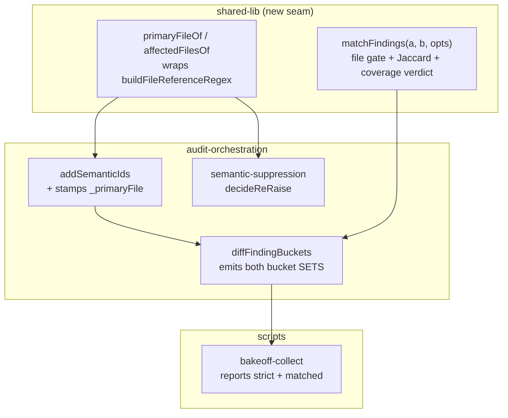

# Plan: Cross-Model Finding Matching

- **Date**: 2026-08-08
- **Status**: Approved (audited)
- **Author**: Claude + Louis
- **Scope**: backend

## Audit trail

| Gate | Rounds | Result |
|---|---|---|
| GPT (`/audit-plan`) | 3 (cap) | H 5 → 2 → 3, M 4 → 4 → 2. 18 of 20 findings accepted and fixed; **2 rebutted and upheld** — H2 (the "repository registry" premise is false: `ALL_EXTENSIONS_PATTERN` is a frozen *extension* list) and M3 (INC-001 governs read/egress decisions; this path makes none). GPT conceded both. |
| Gemini (final) | 2 (cap) | CONCERNS → CONCERNS. All 5 findings accepted; both R1 findings verified against source before acceptance (`gemini-adapter.mjs:38` camelCase, `model-call.mjs:45` `reasoning_tokens` — both confirmed). |

**Stop decision.** Halted at both caps. The GPT HIGH count stopped falling at R3
(5 → 2 → 3), and the rise was **not** new scope — it was contradictions my own
R1/R2 edits introduced. Gemini R2's three findings were concrete design defects,
which normally earns another round, but they were all instances of *three
recurring classes* rather than new territory; §2.6 now states those classes as
invariants, which is the fix a fourth round could not have produced. Remaining
risk is implementation-completeness, and that belongs to `/audit-code` against
real code — the right artifact. Deliberation quality was assessed
`claude_bias_detected: false`, `deliberation_was_fair: true`, coherence `Strong`.

---

## 1. Context Summary

**Detected scope**: `backend` · **Stack**: `js-ts` (+ `postgres`) · no Python.

- **Target domain(s)**: `audit-orchestration`, `findings`, `shared-lib`, `scripts`
- ⚠ **Cross-domain work** — touches 4 domains; the seam is deliberate (one
  extractor in `shared-lib`, consumed by `audit-orchestration`), and §11 clusters
  the boundary so `/audit-code`'s wiring pass inspects it.

### The defect, measured

Reviewer findings are matched by `semanticId` (`scripts/lib/findings.mjs`, `1a89c1ac`)
— sha256 over `category|section|detail`, lowercased. All three fields are
**model-authored free prose**.

Measured over the 5 collected bake-off snapshots (`.audit/bakeoff/*/`), Gemini
primary findings × solo-Opus findings:

| Metric | Value | Method |
|---|---|---|
| Cross-model pairs compared | 48 | `measured` |
| Matched by `_hash` | **0** | `measured` |
| Named the **same source file** | **9** | `measured` — path scan over `section` |
| `buckets.both` across all 5 snapshots | **0** | `measured` |

The canonical example — both reviewers flagged the same file, and the hash
cannot see it:

```
gemini  section: "scripts/check-gate-poison-pills.mjs"
        category: "Logic Error"
opus    section: "scripts/check-gate-poison-pills.mjs — extractCheckGates()"
        category: "Scope-completeness / silent gate undercount"
```

**Consequence.** `diffFindingBuckets`' `both` bucket is unreachable across
models, so `shadowOnly` degenerates to *"every finding the shadow produced"*.
The bake-off's headline `opusUnique` (sum of `buckets.shadowOnly`,
`scripts/bakeoff-collect.mjs`) therefore measures **volume, not
uniqueness** — the reported `opus unique = 25` is exactly `opus total = 25`.
Blind human adjudication (§6.3 of `docs/plans/final-review-shadow-bakeoff.md`,
which scores accepted HIGH/MED clusters) currently rescues the final verdict, so
this is a **validity defect in the instrument, not a wrong verdict yet**.

### The same root cause, second consumer

`scripts/lib/semantic-suppression.mjs` `decideReRaise` calls its
`requireSameFile` check *"the single biggest false-suppression guard"* and
resolves the file via `normalizePath(candidate.section)`. On a prose section
that yields the whole prose string, so the guard returns `different-file` and
**no suppression ever fires** for those findings — a stated safety guard that is
silently inert. Verified directly: `normalizePath` on the two strings above does
not produce equal values.

### Prior art — the extractor already exists

`populateFindingMetadata` (`scripts/lib/ledger.mjs`) already pulls file
references out of exactly this prose, using the registry-derived
`buildFileReferenceRegex`. Run against the real section strings:

| Input `section` | `_primaryFile` |
|---|---|
| `scripts/check-gate-poison-pills.mjs` | `scripts/check-gate-poison-pills.mjs` |
| `scripts/check-gate-poison-pills.mjs — extractCheckGates()` | `scripts/check-gate-poison-pills.mjs` |
| `…tiered-shadow-summary.mjs & …tiered-shadow-compare.mjs` | `…tiered-shadow-summary.mjs` (+2 in `affectedFiles`) |
| `§0.3 (Activation Addendum) vs §6.1` | `§0.3` ← **no file; must degrade, not match** |

The mismatched pair resolves to the *same* file. The final-review path simply
never calls it: `addSemanticIds` (`scripts/gemini-review.mjs`) sets
`id`/`_hash`/`_source` and **not** `_primaryFile`.

`jaccardSimilarity` is likewise already imported and used in
`gemini-review.mjs` by `applyDebtSuppression`, at a calibrated `0.30` (vs
`suppressReRaises`' `0.35`, the asymmetry documented in-line).

### Code Trace

All refs pinned at `1a89c1ac`:

- `runShadowAndPersist` `scripts/gemini-review.mjs:1674` → `diffFindingBuckets` → `dedupByHash` → `semanticId` `scripts/lib/findings.mjs`
- `runShadowReview` `scripts/gemini-review.mjs:1583` → `applyDebtSuppression` (Jaccard 0.30) → `applyScopeFilter` → `addSemanticIds`
- `populateFindingMetadata` `scripts/lib/ledger.mjs:266` → `buildFileReferenceRegex` → `normalizePath`
- `decideReRaise` `scripts/lib/semantic-suppression.mjs` → `normalizePath(candidate.section)`
- `readArmResult` / `summarise` `scripts/bakeoff-collect.mjs` → `buckets.shadowOnly`

### Neighbourhood considered

`get-neighbourhood` returned **`precedent` / `above-floor-cluster`** on
`runShadowReview` (score 0.833) with `runShadowAndPersist`, `diffFindingBuckets`,
`dedupByHash`, `addSemanticIds` and `applyDebtSuppression` all in the cluster —
i.e. every symbol this plan touches already exists and the space is occupied.
**Decision: reuse + extend, do not write siblings.** `populateFindingMetadata`
and `jaccardSimilarity` are lifted into a shared seam rather than reimplemented;
`diffFindingBuckets` gains a matcher argument rather than being duplicated.

### Past incidents to verify against

| Incident | Status | Lesson that binds here |
|---|---|---|
| **INC-001** — lexical path classification bypassed by symlinks | `manual-verification-required` | Consulted and found **not binding here** — see below. It still fixes the shape of D1: one shared extractor, never an ad-hoc regex per consumer. |

**Why INC-001 does not bind (corrected after R1/M3).** An earlier draft of this
plan cited INC-001 as if it required canonicalisation here. That was an
over-claim. INC-001's lesson governs paths that decide whether content is **read
or egressed** — a symlink can redirect a read into `~/.ssh/`. This design makes
no such decision: the extracted path is a grouping key for an observation-only
metric (D1a), nothing is opened, and the `section` string it comes from was
written by the reviewer and has already cleared the egress envelope.

Adding `realpath` would be actively wrong here, not merely unnecessary: it would
destroy the zero-I/O purity that D1 and the whole Tier-1 test strategy rest on,
and it would **reject historical or deleted paths that are valid observation
keys** — breaking the offline re-derivation D5 exists to enable.

No trust boundary is crossed (no egress, no new external input), so no separate
Security Considerations section.

---

## 2. Proposed Architecture



### Key design decisions

**D1 — Reuse the existing extractor; do not write a new one (#1 DRY, #5 SSoT).**
`buildFileReferenceRegex` + `normalizePath` already handle the real prose. The
new module exposes the extraction primitive so `ledger.mjs`, `gemini-review.mjs`
and `semantic-suppression.mjs` share **one** oracle.

**Two representations, one extractor — and they are NOT the same value (R3/H1).**
An earlier draft required a single shared function to be simultaneously
byte-identical to the ledger's behaviour *and* to report "no file" for
`§0.3 (Activation Addendum)`. Those contradict: the ledger's current fallback
returns the prose fragment `§0.3` as `_primaryFile`. Resolving it by splitting
the two roles apart:

| | `extractFileRefs(section)` — **new, shared** | `_primaryFile` / `affectedFiles` — **ledger, unchanged** |
|---|---|---|
| Returns | only regex-extracted, `normalizePath`'d **paths**; `[]` when none | `files[0]` **or the prose fallback** when `files` is empty |
| Used by | matching (`affectedFilesOf`), suppression (`primaryFileOf`) | `generateTopicId`, ledger reporting |
| On `§0.3 …` | `[]` → **unmatchable** | `§0.3` → unchanged |

`populateFindingMetadata` becomes `extractFileRefs(...)` **plus its existing
fallback**, so its output is unchanged for every input — the refactor is
genuinely behaviour-preserving, and the ledger's `topicId` (which folds
`_primaryFile` in) cannot shift and silently break R2+ suppression.
`primaryFileOf`/`affectedFilesOf` are the matching-side wrappers over
`extractFileRefs` alone, with **no** prose fallback: a heading is not a file, and
D4 requires it to be `unmatchable` rather than a bogus grouping key that would
merge two unrelated §-referenced findings.

**D2 — Match on `file AND text-similarity`, not on either alone (#12 Validation).**
File alone over-matches (two genuinely different defects in one file would
collapse into `both`, understating uniqueness — the mirror of today's error).
Text alone is what already fails. The conjunction is the cheapest rule that can
be wrong in neither direction. Threshold reuses `jaccardSimilarity`, calibrated
by the protocol in §2.5c rather than guessed.

**D1a — Matching groups CLAIMS about paths; it never resolves files (R1/H2).**
The extracted path is a **grouping key**, not a file handle. Nothing is opened,
stat'ed, or egressed. Three consequences, stated because a later maintainer will
otherwise "fix" them: a path that no longer exists on disk is a **valid** key
(historical snapshots must stay re-computable, so a existence filter would be a
bug); the module needs no repository file registry and no revision scoping —
`buildFileReferenceRegex` derives from the frozen **extension** list at
`scripts/lib/language-profiles.mjs:294`, not from a listing of the repo; and the
module therefore stays pure and offline, which is what makes Tier-1 testing and
offline re-derivation possible at all.

**D3 — Emit BOTH bucket sets; never replace the old one (#18 Backward Compat).**
`buckets` (exact-hash, unchanged) and `bucketsMatched` (file+similarity) ship
side by side. This is what avoids a `CONTRACT_EPOCH` bump: the pre-registered
metric keeps its exact meaning, so the 5 collected snapshots stay eligible and
the campaign is not restarted. The new metric is **additive evidence**, and §6.3
continues to be scored on adjudicated clusters either way.

**Compatibility is defined on MEMBERSHIP, not on bytes (R1/M1).** Phase 2 stamps
`_primaryFile`/`affectedFiles` onto finding objects, so any serialization
containing those objects necessarily changes bytes. The guarantee is therefore
stated precisely, and this is what the Phase-3 test asserts:

> For every snapshot, `buckets.{both,primaryOnly,shadowOnly}` counts are
> unchanged, and the **set of `_hash` values** in each strict bucket is
> unchanged, and their **order** is unchanged. No claim is made about the
> serialized byte length of the enclosing objects.

A test asserting literal byte identity would fail for a reason that is not a
regression, and would then be relaxed until it asserted nothing — which is the
gate-honesty failure this repo already has a suite for.

**D4 — A finding with no extractable file is `unmatchable`, never `unique`.**
The `§0.3` row above is the case. It enters neither `both` nor `shadowOnly`; it
lands in an explicit `unmatchable` count that the readout prints. This is the
anti-green invariant applied to matching: *absence of a comparable key is not
evidence of distinctness.* Coverage is reported as a ratio, and a run whose
coverage is below a floor reads **`unknown`**, mirroring the memory-health
cluster-density metric's treatment of low embedding coverage.

**D5 — Persist the shadow's FULL finding list under a NEW field (#19 Observability).**
`_shadow.shadowOnlyFindings` today carries only the shadow-only subset, which is
why buckets cannot be re-derived from disk.

**`shadowOnlyFindings` keeps its exact current meaning and contents (R1/H3).**
Widening a field named `shadowOnly…` to mean "all" would silently change what
every existing reader gets — the same class of defect as the `shadowOnly` metric
this plan is fixing. The full list ships as a **new sibling** field:

| Field | Meaning | Status |
|---|---|---|
| `_shadow.shadowOnlyFindings` | shadow-only subset (strict view) | unchanged |
| `_shadow.allFindings` | full deduped shadow list, stable order | **new** |
| `_shadow.matchSchemaVersion` | integer, `1` | **new** |
| `_shadow.matchConfig` | `{threshold, coverageFloor}` as run | **new** |

Old records have no `matchSchemaVersion`; readers treat **absent as `0`** and
report those snapshots as *not re-derivable*, never as re-derived-and-empty.

Re-derivation needs more than the list, so all four fields ship together: both
complete source lists (`new_findings` for the primary is already persisted;
`allFindings` supplies the shadow), the **config the run used** (a threshold
change must be visible, or two snapshots computed under different rules would be
averaged), and a **stable order** — `allFindings` is written in `dedupByHash`
first-seen order, which is already deterministic for a given result.

---

## 2.5 The Matching Contract

A pairwise predicate does not define a bucketing. This section is the contract
`matchFindings` implements and `tests/finding-match.test.mjs` asserts (R1/H1).

### 2.5a Set matching — mutual-best, one-to-one

Given primary set `P` and shadow set `S` (each already `dedupByHash`'d):

1. **Candidate pairs**: every `(p, s)` where `affectedFilesOf(p) ∩ affectedFilesOf(s) ≠ ∅`
   **and** `jaccardSimilarity(sig(p), sig(s)) ≥ threshold`, where
   `sig(f) = "${f.category} ${f.section} ${f.detail}"` — the same signature
   `applyDebtSuppression` already builds.

   **Set intersection, NOT `primaryFileOf` equality (R2/M1).** `_primaryFile` is
   `files[0]` — positional. Two reviewers naming the same file set in a different
   order would get different primaries and never match. This is not hypothetical:
   it is in the measured data. On snapshot `c63035cbe740`, Gemini wrote
   `…tiered-shadow-summary.mjs & …tiered-shadow-compare.mjs` and Opus wrote
   `…tiered-shadow-compare.mjs + …tiered-shadow-summary.mjs` — the same two files,
   reversed. Under primary-equality that pair is unmatchable by construction;
   under intersection it is a candidate. `primaryFileOf` remains the **reporting**
   key (which file a finding is filed under); `affectedFilesOf` is the **matching**
   key. The multi-file test asserts order-independence, not merely determinism.
2. **Resolution**: sort candidates by similarity **descending**, then by
   `(p._hash, s._hash)` ascending as a total-order tiebreak (determinism is
   required — two runs over one snapshot must bucket identically). Accept greedily,
   skipping any pair whose `p` or `s` is already matched.
3. **Result**: each finding is matched **at most once**. Many-to-many is therefore
   impossible by construction, which is the specific ambiguity a bare pairwise
   predicate leaves open.

The greedy mutual-best rule is chosen over optimal bipartite matching
deliberately: `|P|,|S| ≤ ~10` per snapshot, the greedy and optimal results differ
only when three findings contest one file at near-identical similarity, and a
Hungarian-algorithm dependency for that is the over-engineering cliff.

### 2.5b Partition and conservation invariants

Every finding lands in exactly one class per arm:

| Class | Definition |
|---|---|
| `both` | member of an accepted pair |
| `primaryOnly` | in `P`, unmatched, **and** has a non-null primary file |
| `shadowOnly` | in `S`, unmatched, **and** has a non-null primary file |
| `unmatchable` | **no extractable file** — counted per finding, per side |

**Conservation (asserted in tests, not just documented):**

```
|P| == both + primaryOnly + unmatchablePrimary
|S| == both + shadowOnly + unmatchableShadow
```

A finding whose `section` yields no file (`§0.3 (Activation Addendum) …`)
is `unmatchable` on **both** sides. It is never `shadowOnly` — that would be the
exact error this plan exists to fix, in a new place. **An exact `_hash` match
with no extractable file is still `unmatchable` in the matched view**, and still
`both` in the strict view; the two views disagree there by design, and that
disagreement is information, not a bug.

`coverage = 1 − (unmatchablePrimary + unmatchableShadow) / (|P| + |S|)`. Below
`coverageFloor` the snapshot's matched verdict is **`unknown`**, not a number —
mirroring memory-health's treatment of low embedding coverage.

**Empty state — `|P| + |S| == 0` (R2/H1).** The denominator is zero when both
reviewers returned no findings, which is a real and important outcome, not an
error. `coverage` is then **`null`** and the verdict is **`not-applicable`** —
never `NaN` (which JSON-serialises to `null` and is then indistinguishable from
"not computed"), never `1.0` (which would read as perfect coverage from zero
evidence), and never `unknown` (which means "measured, but too little of it").
Three distinct states, three distinct values, because a consumer must be able to
tell "both reviewers agreed there is nothing" from "the instrument did not run":

| State | `coverage` | verdict |
|---|---|---|
| matched normally | `0.0–1.0` | the bucket counts |
| some findings, coverage below floor | `0.0–1.0` | `unknown` |
| no findings on either side | `null` | `not-applicable` |
| matching disabled (`enabled:false`) | `null` | `null` (`bucketsMatched: null`) |

### 2.5b-i The persisted shape of `bucketsMatched` (R2/M3)

One concrete schema, so `gemini-review.mjs`, the run record, `bakeoff-collect.mjs`
and the tests implement the same thing:

```jsonc
"bucketsMatched": {
  "both": 3,                       // accepted pairs
  "primaryOnly": 2,
  "shadowOnly": 4,
  "unmatchablePrimary": 1,         // per-arm, never summed into one field
  "unmatchableShadow": 0,
  "coverage": 0.9,                 // null in the empty/disabled states above
  "verdict": "ok",                 // "ok" | "unknown" | "not-applicable"
  "pairs": [                       // evidence for `both`, BOTH sides kept
    { "primaryHash": "a1b2c3d4", "shadowHash": "e5f6a7b8",
      "similarity": 0.41, "sharedFiles": ["scripts/check-gate-poison-pills.mjs"] }
  ]
}
```

`pairs` keeps **both** hashes and the similarity that joined them, not one arm's
objects. Without it a `both` count is an unauditable assertion — you could not
answer "which two findings did it merge, and how close were they?", which is the
first question anyone will ask of a matched result, and the only way to spot a
false merge after the fact. The finding objects themselves are not duplicated
here; they are already in `new_findings` and `_shadow.allFindings`, reachable by
hash.

### 2.5c Calibration protocol (R1/H4)

Run **before** the rule is wired to anything, and recorded here on completion.

- **Labelling**: the operator labels each of the 48 Gemini×solo-Opus pairs
  `same-defect` / `different-defect`, **blind to the similarity score** (the
  score is computed after labelling, from a separate file). Labels are committed
  to `tests/fixtures/cross-model-pairs.json` — they are the fixture, so the
  calibration is reproducible and reviewable rather than a one-off script's
  memory.
- **Objective**: maximise recall **subject to a hard constraint of zero false
  merges** on the labelled set. Rationale asymmetry: a false merge silently
  erases a genuine unique finding (the failure this plan is fixing), a false
  split leaves the status quo. Precision is bought first.
- **Tie handling**: if several thresholds satisfy the constraint, take the
  **lowest** (highest recall). If none does, the file-gate is insufficient on
  its own and the deferral trigger in §3 fires immediately rather than shipping
  a threshold that merges wrongly.
- **Score before redact, so the corpus matches runtime (R3/M1).** Redaction
  changes the token set, and Jaccard is a function of tokens — a threshold
  selected from redacted text would not be the threshold that applies to the
  unredacted text matched at runtime. So `similarity` is computed **at
  extraction time, from the raw signature**, and committed as a number; the
  `primarySig`/`shadowSig` strings are committed **redacted, for human review
  only**, and are never re-scored by the tests. The one canonical
  `sig(f) = "${f.category} ${f.section} ${f.detail}"` (§2.5a) is used at scoring
  time in all three places. A pair whose raw text **refuses** the secret gate is
  excluded from the corpus entirely and the exclusion is counted in this section
  — never silently dropped, and never scored from a redacted substitute.
- **Recorded result**: `threshold = <TBD — filled in by Phase 3 before wiring>`,
  with the labelled-set recall, the confusion matrix, and the excluded-pair count
  written into this section. A plan that ships with `TBD` still here has not
  completed Phase 3.
- **Held-out honesty**: the 48 pairs are the *calibration* set. The 7
  not-yet-collected snapshots are the *held-out* set, reported separately and
  **never** used to retune — the floor-vs-ratio lesson, applied before the fact.

### 2.5d `findingMatchConfig` (R1/H4)

| Key | Env | Default | Range | Invalid → |
|---|---|---|---|---|
| `threshold` | `AUDIT_FINDING_MATCH_THRESHOLD` | from §2.5c | `0.0–1.0` | clamp + warn |
| `coverageFloor` | `AUDIT_FINDING_MATCH_COVERAGE_FLOOR` | `0.6` | `0.0–1.0` | clamp + warn |
| `enabled` | `AUDIT_FINDING_MATCH_ENABLED` | `true` | bool | `!== 'false'` |

Precedence: env → default. All numeric keys go through `clampConfigNumber`
(clamp-and-warn, never `NaN`-through) — the repo's existing rule that *a bound a
typo can disable is not a bound*. `enabled: false` emits `bucketsMatched: null`
(the honest "not computed"), never an empty bucket set that reads as zero.

**Aggregation refuses to mix configs (R2/H2).** Recording `matchConfig` prevents
nothing on its own; the aggregate has to act on it. Because the threshold is
env-overridable, snapshots computed under different configs are an **expected
operational state**, not a corner case. So `summarise` in `scripts/bakeoff-collect.mjs`:

0. **first drops snapshots whose `bucketsMatched` is `null`** and reports them as
   `matching disabled/not computed: N` (Gemini gate). Without this they carry a
   cohort digest identical to an enabled snapshot at the same threshold —
   `enabled` is not a bucket-shaping parameter — so a disabled run would join a
   real cohort and the aggregate would dereference `.both` on `null`. `enabled`
   is **also** added to the digest payload so a config change stays visible, but
   the filter is what makes the aggregation safe; the digest alone would only
   move the crash into its own group;
1. groups the survivors by their **cohort digest** — defined explicitly
   (R3/M2) as the first 8 hex of sha256 over the canonical JSON
   `{matchSchemaVersion, threshold, coverageFloor, enabled}`, keys in that fixed
   order, numbers serialised to 4 decimal places. `matchSchemaVersion` **is** part of
   the identity: a schema change with an unchanged threshold still changes what
   the buckets mean, and would otherwise be mixed in silently;
2. aggregates the matched metrics **only** over the largest single-cohort group;
   **ties break on the lowest digest** (lexicographic), never on input order, so
   two runs over one log report the same cohort;
2b. **never does arithmetic on a `null` coverage** (Gemini R2). JS coerces
   `null` to `0` in `+`, so a `sum/N` mean would silently drag the campaign's
   coverage down by every `not-applicable` snapshot — a fabricated measurement
   in exactly the shape of a real one. Snapshots with `coverage === null` are
   excluded from the mean, the divisor is the count of **non-null** coverages,
   and they are reported separately as `not-applicable: N`. A cohort whose
   coverages are *all* null reports `coverage: null`, never `0`;
3. reports the excluded groups explicitly —
   `matched metrics: 9 snapshot(s) at threshold 0.34; 3 EXCLUDED at 0.41 —
   re-run those or read them separately`.

Never a silent mean across thresholds, and never a refusal to report anything
(which would push an operator to eyeball it). Snapshots with
`matchSchemaVersion` absent (`0`) form their own group and are reported as
*not re-derivable*. The **strict** metrics are unaffected and continue to
aggregate across every snapshot — they do not depend on the config, which is the
practical payoff of D3's two-view design.

### 2.5e Suppression-guard data flow (R1/H5)

`decideReRaise` compares a **candidate** (in-memory finding) against a
**neighbour** (a persisted row carrying `primary_file`). Both sides must resolve,
and they resolve differently:

- **Candidate**: `affectedFilesOf(candidate)` — the **set**, not the positional
  primary (Gemini R2). §2.5a rejected primary-equality for matching because
  `files[0]` is order-dependent; the suppression guard is the same comparison and
  inherits the same bug. A multi-file candidate whose `files[0]` differs from the
  neighbour's stored primary would fail `requireSameFile` and silently skip a
  legitimate suppression. Never the raw `section` — that is today's bug.
- **Neighbour**: the persisted `primary_file` column, **trusted as-is**. It was
  written by `populateFindingMetadata` and re-deriving it from a row we did not
  parse would invent a second oracle. The column is single-valued, so the test is
  **membership**: `primary_file ∈ affectedFilesOf(candidate)`. That is the
  order-independent form of the same check, and it needs no schema change.
- **Legacy rows** whose `primary_file` is null/empty, and **candidates** with no
  extractable file: `requireSameFile` returns `different-file` → **no
  suppression**. Fail-open toward keeping the row, because a false suppression
  hides data and a false keep costs one duplicate row — the asymmetry the module
  already argues for its threshold.

`tests/finding-match.test.mjs` covers the guard directly: same file → suppress;
different file → not; candidate unresolvable → not; neighbour null → not.

---

### 2.6 Three invariants that hold at EVERY hop

The audit found the same three defect classes repeatedly, each time in whichever
component the previous round had not yet touched: positional file comparison
(§2.5a, then §2.5e), a nullable metric meeting arithmetic (§2.5b empty state,
then the §2.5d aggregate), and a provenance flag dropped at a boundary (`_shadow`
usage in D5, then the Gemini normaliser mapping). Patching instances is why they
kept recurring. Stated once, as review criteria for **every** hop in the diagram:

1. **File comparison is set-membership, never positional.** `files[0]` is an
   artifact of prose ordering. Any code comparing "same file?" uses
   `affectedFilesOf` intersection or membership. `_primaryFile` is for
   *reporting* only. — *Applies to: matching, suppression, and any future consumer.*
2. **A nullable metric never meets an arithmetic operator.** `null` coerces to
   `0` in JS, turning "not measured" into a measurement. Filter first, divide by
   the surviving count, report the excluded count. — *Applies to: coverage means,
   cost sums, any future rate.*
3. **A hand-built envelope carries provenance, or it forfeits it.** Every place
   that rebuilds an object field-by-field (rather than spreading) must copy the
   `usageMissing`/`unmatchable`/`verdict` flags. This defect already shipped once
   in this codebase — the shadow envelope dropped cache tokens — and the fix for
   it is what these reviews keep re-finding one hop downstream.

Any new consumer added later is reviewed against these three before merge.

### Right-sizing gate

- **Band-aid extreme** — relabel `shadowOnly` → `shadowTotal` and stop claiming
  uniqueness. Honest and zero-risk, but the instrument still cannot answer the
  question it exists for, and `semantic-suppression`'s inert guard stays inert.
- **Over-engineered extreme** — embed every finding, add a `finding_pair_matches`
  table, a calibration harness, a coverage gate in `check`, and a cross-model
  cosine threshold per model pair. Real infrastructure for a 5-snapshot campaign
  with 48 pairs, and it needs the cloud store to be up to compare two JSON files.
- **Chosen** — the file-gate + Jaccard conjunction, built from two primitives
  that already exist in this repo, no new storage, no embeddings, no network.
  **Current requirement served**: the bake-off must distinguish "Opus found
  something Gemini missed" from "Opus said 25 things", and it must do so this
  campaign. Embeddings are deferred with a named trigger (below), not rejected.

**Manual vs scripted**: the wiring is 5 call sites, judgment-heavy and
irregular. Done by hand. Threshold calibration is a throwaway Category-A script
against `.audit/bakeoff/**` — gitignored, never committed.

---

## 3. Sustainability Notes

- **Assumption that could change**: reviewers keep naming files in `section`. If
  a future reviewer stops, coverage drops and the metric reads `unknown` rather
  than silently degrading — that is the designed failure mode, and the coverage
  ratio is the early warning.
- **Named deferral trigger for embeddings**: if measured coverage stays ≥80% but
  the file-gate + Jaccard rule disagrees with blind adjudication on >20% of
  adjudicated pairs, the text half is too weak and cosine over
  `finding_embeddings` replaces `jaccardSimilarity` **behind the same
  `matchFindings` seam** — one file changes, by construction of D1/D2.
- **Extension point deliberately built in**: `matchFindings(a, b, opts)` takes
  the similarity function as an option, so the swap above is a parameter change,
  not a rewrite.

---

## 4. File-Level Plan

| File | Intent | Purpose |
|---|---|---|
| `scripts/lib/finding-match.mjs` | create | `primaryFileOf`, `affectedFilesOf`, `matchFindings`, `matchCoverage`. Pure, zero-I/O — the single matching oracle (#5). |
| `scripts/lib/ledger.mjs` | modify | `populateFindingMetadata` delegates extraction to the new module; behaviour byte-identical (regression-locked). |
| `scripts/gemini-review.mjs` | modify | `addSemanticIds` stamps `_primaryFile`/`affectedFiles`; `diffFindingBuckets` emits `bucketsMatched` + `unmatchable`; `runShadowAndPersist` persists the full shadow list (D5). |
| `scripts/lib/semantic-suppression.mjs` | modify | `decideReRaise` resolves the file via `primaryFileOf`, closing the inert guard. |
| `scripts/bakeoff-collect.mjs` | modify | `readArmResult` reads both bucket sets; `summarise`/`printProgress` report strict vs matched, coverage, and `unknown`. |
| `scripts/lib/config.mjs` | modify | `findingMatchConfig` — threshold + coverage floor, `clampConfigNumber`-validated. |
| `scripts/lib/gemini-usage.mjs` | create | `normalizeGeminiUsage` — the single billed-output oracle (#5). |
| `scripts/lib/audit-shadow.mjs` | modify | Call-site swap to the normaliser. |
| `scripts/lib/arm-eval/producers/model-call.mjs` | modify | same |
| `scripts/lib/brainstorm/gemini-adapter.mjs` | modify | same |
| `scripts/lib/model-eval/provider-adapter.mjs` | modify | same |
| `scripts/gemini-review.mjs` | modify | Adopt the normaliser (its inline fix landed in `1a89c1ac`; folding it in keeps one oracle, not two). |
| `tests/finding-match.test.mjs` | create | Tier 1 — extraction, conjunction rule, one-to-one resolution, conservation, `unmatchable`, coverage `unknown`, and the four `decideReRaise` guard cases. |
| `tests/fixtures/cross-model-pairs.json` | create | Committed labelled fixture (48 pairs + strict-bucket baseline) — Category B, so the tests do not read gitignored `.audit/**`. |
| `tests/cross-model-buckets.test.mjs` | create | Tier 1 — both bucket sets coexist; strict set preserved per D3 (counts + `_hash` sets + order); determinism. |
| `tests/gemini-billed-output.test.mjs` | create | Tier 1 — **discovery-based** census over `scripts/**`, so a fifth adapter reading candidates-only fails without a list edit. |

### 4b. Implementation Phases

- **Phase 1 — Extraction seam.** Build the shared oracle and prove it is a pure
  refactor of existing behaviour. Files: `scripts/lib/finding-match.mjs` (create),
  `scripts/lib/ledger.mjs` (modify), `tests/finding-match.test.mjs` (create).
- **Phase 2 — Wire the two broken consumers.** Stamp `_primaryFile` on the
  final-review path; fix the inert suppression guard. Files:
  `scripts/gemini-review.mjs` (modify), `scripts/lib/semantic-suppression.mjs` (modify),
  `scripts/lib/config.mjs` (modify).
- **Phase 3 — Calibrate, then emit both bucket sets.** Extract + commit the
  labelled fixture, run the §2.5c protocol and record the threshold in §2.5c
  BEFORE wiring the rule; then add `bucketsMatched`, `unmatchable`, coverage,
  and the four D5 persistence fields. Files: `scripts/gemini-review.mjs` (modify),
  `tests/fixtures/cross-model-pairs.json` (create),
  `tests/cross-model-buckets.test.mjs` (create).
- **Phase 4 — Campaign readout.** Report strict vs matched side by side, with
  coverage and the `unknown` state. Files: `scripts/bakeoff-collect.mjs` (modify).
- **Phase 5 — One Gemini billed-output oracle.** Extract the normaliser, swap the
  five call sites, lock it with the behavioural test + structural census. Files:
  `scripts/lib/gemini-usage.mjs` (create), `scripts/lib/audit-shadow.mjs`,
  `scripts/lib/arm-eval/producers/model-call.mjs`,
  `scripts/lib/brainstorm/gemini-adapter.mjs`,
  `scripts/lib/model-eval/provider-adapter.mjs`, `scripts/gemini-review.mjs` (modify),
  `tests/gemini-billed-output.test.mjs` (create).

**Close-out (not a phase)**: `npm run check`.

---

## 5. Risk & Trade-off Register

| Risk | Mitigation |
|---|---|
| **The new rule over-matches** — two distinct defects in one file collapse into `both`, understating uniqueness (the mirror of today's error). | The conjunction (D2) requires text similarity too. Calibrated in Phase 3 against the 48 real pairs, red-then-green, before it is wired to anything. |
| **Threshold tuned on the data it will judge.** 48 pairs is a small, self-selected set. | The calibration set is the 5 collected snapshots; the rule is then applied to the 7 not yet collected. Report both numbers separately — never retune after seeing the second set (the floor-vs-ratio lesson). |
| **Changing a metric mid-campaign invalidates the cohort.** | D3: the pre-registered `buckets` is untouched, so `CONTRACT_EPOCH` does not bump and no snapshot is discarded. `bucketsMatched` is additive. |
| **`populateFindingMetadata` refactor silently changes ledger behaviour.** | Phase 1 is a pure refactor with the existing behaviour regression-locked first; the extraction table in §1 becomes the fixture. |
| Extraction picks a `§0.3`-style non-path as `_primaryFile`. | D4 — no extractable *file* means `unmatchable`, counted and printed, never scored as unique. |

### Deliberately deferred

- **Embeddings / pgvector for cross-model matching** — deferred with the named
  trigger in §3, not on grounds of difficulty. The independence claim: the
  chosen rule does not call, and does not depend on, `finding_embeddings` or the
  cloud store, so it works with the store offline and can be swapped behind
  `matchFindings` without touching a call site.
- **Re-deriving `bucketsMatched` for the 5 already-collected snapshots** — not
  possible for the `opus` arm, because the shadow's full finding list was never
  persisted (that is what D5 fixes going forward). Stating the limit rather than
  faking a backfill. Gemini-vs-solo-Opus *is* re-derivable and is what Phase 3
  calibrates on.

---

## 6. Testing Strategy

**Tier 1 (test-first)** — `finding-match.mjs` is deterministic and pure, so
extraction, the conjunction rule, `unmatchable`, and the coverage `unknown`
verdict are all written before the implementation.

Key edge cases, each with a negative control (a check unseen failing is not
evidence):

1. The measured mismatched pair → **matches** (`both`).
2. Two different defects, same file, dissimilar text → stays **two uniques**.
3. Same text, different files → **not** a match.
4. Prose section with no file (`§0.3 …`) → `unmatchable`, not `unique`.
5. Multi-file section, **reversed order** (`a.mjs & b.mjs` vs `b.mjs + a.mjs`) → **matches**, using the real `c63035cbe740` pair as the fixture. Order-independence, not merely determinism (R2/M1).
6. Coverage below floor → verdict `unknown`; **zero findings on both sides** → `coverage: null`, verdict `not-applicable`; **disabled** → `bucketsMatched: null`. Three states, three values, never a clean zero (R2/H1).
6b. `summarise` over snapshots with two different `matchConfig` digests → aggregates the majority group and **names the excluded one**; never a silent cross-threshold mean (R2/H2).
6c. The committed fixture passes the secret classifier — re-asserted on every run, so a future regeneration cannot introduce a leak (R2/M4).
7. `buckets` (strict) preserved on all 5 snapshots — per D3's precise statement:
   same counts, same `_hash` **sets**, same order. Not byte identity (R1/M1).
8. Conservation: `|P| == both + primaryOnly + unmatchablePrimary` and the shadow
   equivalent, asserted on every fixture — a partition that leaks is the defect
   class this plan is fixing.
9. Determinism: matching the same snapshot twice yields identical buckets
   (the §2.5a tiebreak is what makes this assertable).

### Fixtures must be committed, not scraped from `.audit/**` (R1/M4)

`.audit/bakeoff/**` is a Category-A artifact — gitignored, absent from a fresh
clone, and absent from the pre-push sandbox worktree. A test reading it would
**pass in CI having checked nothing**, which is precisely the sandbox-honesty
failure AGENTS.md names ("*can this go green in a clean checkout having checked
nothing?*").

So Phase 3 **extracts and commits** `tests/fixtures/cross-model-pairs.json`.
The extraction script is Category A (throwaway, gitignored); its **output** is
Category B (committed, deterministic from the same inputs).

**The fixture must carry enough to run the test it backs (R3/H3).** Counts
cannot validate ordered hash membership, so a counts-only fixture would leave D3's
guarantee permanently unassertable in a clean checkout — a promised regression
test that can never run. The committed shape is therefore:

```jsonc
{
  "pairs": [ { "primaryHash": "…", "shadowHash": "…", "label": "same-defect",
               "similarity": 0.41, "sharedFiles": ["…"],
               "primarySig": "<redacted>", "shadowSig": "<redacted>" } ],
  "snapshots": [ { "snapshotId": "21245f6aae1c",
      "strict": { "both": ["…hashes, in emitted order…"],
                  "primaryOnly": ["…"], "shadowOnly": ["…"] } } ]
}
```

Ordered `_hash` **lists**, not counts — counts are then derivable from them, so
one representation serves both halves of D3 (#5).

**Sanitisation is a step, not an assumption (R2/M4).** An earlier draft called
the fixture "sanitised by construction" because the prose concerns this public
repo and had already been sent to providers. That reasoning is wrong twice over:
prior egress is not evidence of safety (it is evidence of a prior risk taken),
and a finding's `detail` routinely **quotes source lines** — which is exactly
where a credential-shaped literal, an absolute home path, or a copied env value
would appear. Committing is a *new and permanent* disclosure to a public repo,
so it gets a real gate:

- The extractor pipes every `category`/`section`/`detail` through
  `redactSecrets` (`scripts/lib/sensitive-paths.mjs`) and the high-confidence
  classifier in `scripts/lib/security/secret-classifier.mjs` — the same
  REFUSE-vs-REDACT split `npm run security:refresh` already uses: a
  high-confidence secret shape **refuses** (non-zero exit, fixture not written),
  low-confidence PII auto-redacts.
- `tests/cross-model-buckets.test.mjs` re-runs the classifier over the committed
  fixture and **fails** on a hit — so the gate is enforced on every future edit,
  not only at creation. A one-time clean scan is not a guarantee about the next
  person to regenerate it.
- Reuse, not new machinery: both modules exist and are already the repo's egress
  oracle. This is the fifth consumer of one classifier, not a sixth
  implementation.

### One Gemini usage normaliser, not five copies (R1/M2, R2/M2)

The first draft proposed editing four adapters identically and locking them with
a source-text census. Both halves were wrong, and R2 named why: a text census
false-*fails* on legitimate single-field references (logging, diagnostics,
tests) and false-*passes* a new Gemini call site that never mentions
`candidatesTokenCount` at all. A census over source text cannot express a
behavioural contract.

**The contract belongs in one function (#1 DRY, #5 SSoT):**

```js
// scripts/lib/gemini-usage.mjs — pure, no I/O
export function normalizeGeminiUsage(usageMetadata)
// → { input_tokens, output_tokens, thinking_tokens, usageMissing }
```

**`usageMissing` is part of the return type, not an afterthought (R3/H2).** A
`{input, output, thinking}` triple that sanitises absent fields to `0` makes a
**measured zero indistinguishable from an unavailable count** — the exact
anti-green failure this whole plan exists to fix, reintroduced in the fix for it.
`usageMissing: true` when `usageMetadata` is absent, or when
`promptTokenCount`/`candidatesTokenCount` is not a finite number. It feeds the
existing `costForBudget` `unmeterable` path unchanged, so an unmeterable Gemini
call keeps its pre-flight reservation instead of reconciling to a fake €0.

**The normaliser owns the READ, the call site owns its own contract (Gemini gate).**
The five call sites do not share a usage shape today, verified at `1a89c1ac`:
`scripts/lib/brainstorm/gemini-adapter.mjs:38` returns camelCase
`{inputTokens, outputTokens}`; `scripts/lib/arm-eval/producers/model-call.mjs:45`
returns snake_case with **`reasoning_tokens`**, not `thinking_tokens`. Passing
the normaliser's object through raw would silently break both downstream
consumers — replacing an under-metering bug with a zeroed-field bug.

So `normalizeGeminiUsage` is the single place that **reads `usageMetadata` and
decides what billed output means**; each call site then **maps** that result into
its own established shape (`outputTokens: n.output_tokens`,
`reasoning_tokens: n.thinking_tokens`, …). One oracle for the semantics, no
forced convergence of five public contracts — which also keeps Phase 5 a
mechanical, reviewable diff instead of a cross-subsystem rename.

**`usageMissing` is NOT optional in that mapping (Gemini R2).** The existing
shapes do not carry it, so "map to your established shape" would drop the flag at
the very hop it was added to survive — and an unmeterable call would reconcile to
a fake €0 exactly as before, with a normaliser in place that looks like it fixed
it. Every call site therefore **adds** `usageMissing` to its own shape (additive,
so no existing consumer breaks) and the census asserts its presence at each site.
Rejected alternative: inferring missingness downstream from `input_tokens === 0`
— that is the measured-zero-vs-absent conflation this flag exists to end.

Every Gemini call site derives its usage **only** through this. The
test then asserts behaviour, and the census triggers on the right token:

1. **Behavioural** — folds thoughts into `output_tokens`, reports
   `thinking_tokens` as the share within it, and sets `usageMissing` for absent
   and partial metadata. A real `{candidates: 0, thoughts: 0}` response yields
   `usageMissing: false` — a measured zero, preserved as one.
2. **Structural census** — no file under `scripts/**` may reference
   **`usageMetadata`** (the Google-specific response object) except
   `gemini-usage.mjs`. Triggering on `usageMetadata` rather than
   `candidatesTokenCount` is what closes R2/M2's second half: a new caller that
   reads `promptTokenCount` and `thoughtsTokenCount` but never mentions
   `candidatesTokenCount` still has to touch `usageMetadata` to get at them, so
   it is caught. It also cannot false-fail on logging, which reads the
   normalised object. Deliberate exceptions are in-file allowlist entries with a
   reason — reviewable, not silent.

This also collapses Phase 5 from four parallel edits to one extraction plus four
one-line call-site swaps, which is the shotgun-surgery risk R1/M2 raised.

**Billed-output field contract** (verified, not assumed): for `@google/genai`,
`usageMetadata.candidatesTokenCount` counts emitted answer tokens and
`thoughtsTokenCount` counts reasoning tokens; the two are **disjoint** and both
bill at the output rate. Evidence on a real run: bake-off snapshot
`21245f6aae1c` reported `candidatesTokenCount: 310` beside
`thoughtsTokenCount: 17792` — if candidates already included thoughts it could
not be the smaller number.

**Billed-output field contract** (verified before the fix ships, not assumed):
for `@google/genai`, `usageMetadata.candidatesTokenCount` counts emitted answer
tokens and `thoughtsTokenCount` counts reasoning tokens; the two are **disjoint**
and both bill at the output rate. Evidence on real runs: bake-off snapshot
`21245f6aae1c` reported `candidatesTokenCount: 310` beside
`thoughtsTokenCount: 17792` — if candidates included thoughts it could not be
the smaller number. Absent/partial `usageMetadata` sanitises each field
independently to `0` (a missing count is not a measured zero, and is surfaced by
the existing `usageMissing`/`unmeterable` path rather than invented here).

---

## 7. Execution Clustering

- **Cluster A** — Phases 1–2 — fix-gate: `yes`
  - Coupling: both halves of one seam. Phase 2's call sites are the proof that
    Phase 1's oracle is correct; auditing them apart would review an extractor
    with no consumer and two consumers with no contract.
  - `author-tier: standard`
- **Cluster B** — Phases 3–4 — fix-gate: `yes`
  - Coupling: the bucket structure and the readout that interprets it. A metric
    emitted in Phase 3 and misread in Phase 4 is exactly the defect this plan
    exists to fix, so the seam must be audited as one.
  - `author-tier: frontier`
- **Cluster C** — Phase 5 — fix-gate: `final`
  - Coupling: single mechanical change across four sibling adapters, independent
    of the matching work; grouped alone so it cannot mask a matching regression.
  - `author-tier: economy`
- **Final gate**: consolidated Gemini review over the union diff of Clusters A–C.
