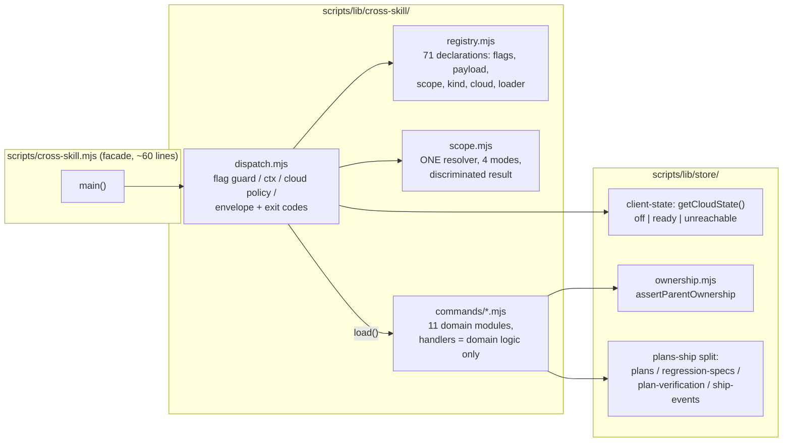

# Plan: cross-skill CLI — declarative command registry

- **Date**: 2026-08-12
- **Status**: In Progress — approved 2026-08-12; Cluster A started via /cycle --autonomous
- **Author**: Claude + Louis
- **Scope**: backend
- **Target domain(s)**: `cross-skill-bridge`, `shared-lib`, `stores`
- ⚠ **Cross-domain work** — touches >1 domain; the crossings are the point: the
  registry moves cross-cutting contracts OUT of per-command code into one
  dispatcher, and the store seams gain the discriminated contracts the CLI needs.

## 1. Context Summary

**Scope + stack**: backend-only; `js-ts` (Node ESM CLI + Postgres store).

**The problem, measured** (all figures `measured` at commit `c318f6a4` unless
noted): `scripts/cross-skill.mjs` is 3,584 lines with **71 subcommands**, one
global `KNOWN_FLAGS` union of **94 flags**, **5** distinct repo-scope
resolvers, and **44** `isCloudEnabled` branch points. `scripts/lib/store/plans-ship.mjs`
is 1,528 lines mixing five store domains. The 2026-08-12 remediation session
(`docs/plans/cross-skill-cli-integrity.md`) fixed 21 defects in this file; **12
were siblings of a defect fixed in the same session, and one (F17) was
introduced by the fix for another (F4)**. The `/audit-code` HIGH count
oscillated 9→6→8→4→5→7 across six rounds because god-module and
deferred-cluster findings cannot be retired from inside the file.

**Diagnosis**: not "file too long". Five cross-cutting contracts live in
convention and are re-implemented independently by all 71 handlers:

| Contract | Today | Defect family it produced (from cross-skill-cli-integrity.md) |
|---|---|---|
| Flag validity | one global 94-flag union; `assertKnownFlags` validates names only | accepted-but-inert flags: F4, F11, F16 (a flag read by one command is silently accepted by the other 70) |
| Repo scope | 5 resolvers, grown one per incident | ambient-vs-requested confusion: F4, F5, F10; F17 was a *new* resolver reintroducing an *old* collapse |
| Cloud degradation | `isCloudEnabled()` boolean; 44 ad-hoc branches | configured-off vs unreachable collapse: F7 sibling, deferred (re-types every handler) |
| Result emission | each handler hand-builds envelope + exit | unverified write success: F2, F3, F8, F15, F20 |
| Payload parsing | `--json` / flags / stdin ad-hoc per handler | argv-built payload dropping a declared flag: F16 |

71 handlers × 5 concerns ≈ 355 cells where convention can drift. Every one of
the 21 defects was one of those cells drifting. Fixing cells does not change
the grid — the fix is to make the contracts **declarative data enforced in one
place**, so each class becomes structurally unrepresentable or mechanically
enumerable.

**Code Trace** (deep read of the whole file at `096b78c7`, counts re-verified
at `c318f6a4`): dispatch is a name→handler map (`commands` object,
`scripts/cross-skill.mjs`, "Dispatcher" section) consumed by `main()`, which
runs `assertKnownFlags(process.argv, KNOWN_FLAGS)` once, globally. Arg access
is module-global (`argOption`/`hasFlag`/`argList`/`argAll` closing over `rest`).
The five scope resolvers: `resolveRepoId(payload)` (writers),
`resolveShipNudgeScope()` (nudge readers, `--all-repos` chain),
`resolveScopedRepoId()` (`--repo-id`-or-ambient),
`resolveRequestedRepoScope(repoName)` (`--repo`-authoritative, added 2026-08-12),
`resolveRepoUuidQuiet()` (v5-uuid fetch). Store writers:
`recordShipEvent`/`recordRegressionSpecRun` return discriminated results since
2026-08-12 (`scripts/lib/store/plans-ship.mjs`); `resolveRepoForStoreResult`
(`scripts/lib/store/repo.mjs`) is the discriminated repo resolver, with the
null-returning `resolveRepoForStore` kept as a wrapper for ~50 legacy call
sites. Thin-dispatch precedent already in-file: `cmdQuality` → `scripts/lib/friction/commands.mjs`,
`cmdUpstream` → `scripts/lib/upstream/commands.mjs`.

**Prose consumer surface** (measured): **14 skill files** invoke
`cross-skill.mjs` in prose; **36 distinct subcommands** appear in SKILL.md /
references text. Nothing compiles that seam (AGENTS.md "Contracts across the
prose↔code seam"), so subcommand names, flag names, and output fields are a
**frozen public API** for this plan.

**Neighbourhood considered**: `get-neighbourhood` returned only `review`-band
matches (below the repo noise floor) — the nearest symbols are this file's own
`main`/`cmdQuality`/`cmdUpstream` dispatchers, i.e. the pattern this plan
generalises, not a duplicate implementation to reuse. Proceeding as an
extension of the existing thin-dispatch discipline.

**Patterns reused vs new**: reused — thin dispatch to `lib/` command modules
(`quality`/`upstream` precedent), discriminated store results
(`resolveRepoForStoreResult` precedent), pinned-surface tests
(`tests/learning-store-exports.test.mjs` precedent), ratchet baselines
(`scripts/check-cli-flags.mjs` precedent). New — the registry as declarative
data, the declaration-checked arg accessor, tri-state cloud state.

> **Past incidents to verify against** (1 shown)
>
> | Incident | Affected paths | Status | Lessons |
> |---|---|---|---|
> | **INC-001** — symlink bypassed lexical sensitive-path classification | `scripts/lib/sensitive-paths.mjs`, egress gate, symbol indexer | `manual-verification-required` | Canonicalise before classifying. Handlers being MOVED here (`lock-with-test`, `groundingNoteFor`) call `classifyTestPath`/`classifyReadPath` — the moves must keep the single-oracle calls intact, never inline a copy. |

## 2. Proposed Architecture



### Design decisions

**D1 — The command spec is data (#10, #3, #8).** One registry entry per
subcommand:

```js
{
  name: 'record-ship-event',
  flags: [],                    // see grammar below; dispatcher derives payload flags
  positionals: 'none',          // 'none' | { verbs: ['add','mirror', …] } (sub-verb grammar)
  payload: 'json',              // 'json' | 'flags' | 'both' | 'none'
  scope: 'ambient-ok',          // 'none' | 'ambient-ok' | 'explicit-required' | 'global-optin'
  kind: 'write',                // 'read' | 'write' | 'local'
  cloud: 'degrade-noop',        // 'none' | 'degrade-noop' | 'require'
  degradeShape: {},             // see D4 — the EXACT legacy cloud-off envelope for this command
  load: () => import('./commands/ship.mjs').then((m) => m.recordShipEventCmd),
}
```

**Flag declaration grammar (audit R1-H3).** `flags` entries are objects
`{name, kind}` with `kind ∈ 'valued' | 'boolean' | 'repeatable'`; a bare
string is shorthand for `valued`. `positionals` covers the sub-verb commands
(`quality add`, `upstream report`, `arm-eval-toggle on|off`,
`persona-outcomes label`) so bare words are declared, not smuggled — **and
the dispatcher enforces it (Gemini R1)**: `assertKnownFlags` validates flag
names only and deliberately ignores bare words, so the dispatcher adds a
positional check — for `positionals:'none'`, any bare argument that is not a
declared flag's value and not the trailing `{`-prefixed payload arg (when
`payload` admits one) is `BAD_INPUT`; for `{verbs:[…]}`, the first bare word
must be in the verb list. Without this, `quality bogus-verb` relies on each
handler's own usage check — which is the per-handler convention this plan
exists to retire.

**Forwarding commands are declared, not squeezed (shadow R1-M1; transport
pinned by shadow G2):** commands that forward `rest` wholesale to another CLI
(`friction-log` → `scripts/friction-log.mjs`, `learning-replay` →
`scripts/learning/replay.mjs`) carry `forward: {to: '<path>'}` instead of a
flag list; the dispatcher skips per-command flag/positional validation for
them — the target CLI owns its own grammar — and the conformance suite
requires `forward` entries to name their target and forbids them from also
declaring `flags`. **`forward:` is metadata, not a new transport**: the
handler bodies stay the existing thin wrappers verbatim (dynamic-import the
target's run function, pass `rest`, emit its result, propagate its exit
semantics — `friction-log`'s exit-1-on-`!ok` included), frozen by the golden
envelopes like any other command. The field's only runtime meaning is "skip
flag validation here"; everything else it states is for conformance to
check, not for the dispatcher to reimplement.
**Deliberate scope boundary**: the registry declares *lexical shape*
(existence, kind, positional verbs); value semantics — enums, number ranges,
path validation — stay handler-owned (Zod / existing validators, as today).
Encoding full value grammars in the registry is the over-engineered cliff:
no current defect came from a value-grammar gap, all four families came from
existence/shape gaps.

**The registry starts EMPTY and grows one cohort at a time (audit R1-H1).**
Phase 1 ships the registry *mechanism* with zero entries; each cohort adds
its commands' declarations alongside their migrated handlers, so an entry
never points at a module that does not exist yet. Dispatch rule, load-bearing:
a name present in the registry is served by the registry path **only** — a
`load()` failure is a hard error (`REGISTRY_LOAD_FAILED`, exit 1), **never** a
fallback to the legacy map, because falling back would mask a real loader
defect as working legacy behaviour. Only names absent from the registry route
to the legacy map.

**The FROZEN INVENTORY is the conservation law (audit R2-H1).** Conformance
that quantifies only over registry entries proves nothing about a command
that never arrives in it, and a count-based ratchet lets *deleting* a legacy
command read as migration progress. So Phase 1 commits
`tests/fixtures/cross-skill-inventory.json` — the 71 command names captured
from the legacy map at HEAD — and the conformance suite asserts, at every
commit: `registryNames ∪ legacyNames = INVENTORY` and
`registryNames ∩ legacyNames = ∅`. A command can *move* but never vanish or
appear unaccounted; the ratchet's number is derived (`legacyNames.length`),
not free-standing. Phase 5's end state is `registryNames = INVENTORY`,
`legacyNames = ∅`, and the golden/store-call harnesses iterate the INVENTORY,
never "whatever happens to be migrated". Adding a genuinely new command later
means editing the inventory fixture in the same commit — a reviewed,
deliberate act (the learning-store-exports pin pattern).

New behaviour is added by adding an entry + a handler (open/closed, #3);
nothing modifies the dispatcher. Handlers are lazy-loaded so cold-start cost
does not scale with command count.

**D2 — Per-command flag validation, both directions (#12, #10).** The
dispatcher computes the command's allowed set as
`declaredFlags(cmd) ∪ payloadFlags(cmd.payload) ∪ UNIVERSAL_FLAGS` and runs
`assertKnownFlags` against it — an undeclared flag exits 2 *for that command*,
killing the accepted-but-inert class (F4/F11/F16) structurally rather than by
census. The reverse direction (`--report-path` class: read but undeclared)
dies too: handlers receive a **declaration-checked accessor** — `ctx.flag('x')`
throws `UNDECLARED_FLAG` if `--x` is not in the entry's declaration — so a
handler cannot read a flag the registry does not admit.

**`UNIVERSAL_FLAGS` is minimal by MEASUREMENT, not assertion (audit R1-H2;
tightened again by shadow G2 — "every command honours `--help`" was itself an
unmeasured claim of the same shape that produced the rejected
`GLOBAL_FLAGS`):** the measured universal set is **`--selfcheck-relocation`
alone**. `--help` is honoured only in the *subcommand position*
(`cross-skill.mjs --help`) in the legacy CLI — a per-command
`record-ship-event --help` reaches the handler and BAD_INPUTs today, and
byte-compatibility keeps that; the dispatcher handles `--help`/`-h` at entry
exactly as `main()` does now. Both universal behaviours are trapped **before**
`initLearningStore()`/cloud evaluation (Gemini G2-L — `--help` offline must
not touch the pool), which is also today's ordering. Payload-source flags (`--json`, `--stdin`) are
**derived** from the `payload:` declaration — a `payload:'none'` command
refuses them. `--out`, `--format`, `--repo`, `--repo-id`, `--limit` and every
other formerly-global name become per-command declarations present only where
the handler actually reads them.

**`ctx.payload()` is the legacy algorithm verbatim (audit R3-H1 — F16 lived
on exactly this boundary, so the contract is executable, not a name):** the
existing `parsePayload` moves into `dispatch.mjs` unchanged, with its
precedence frozen — `--json <inline>` wins, else `--stdin` reads fd 0, else a
trailing bare `{`-prefixed arg parses, else `{}`. The accessor marks
`--json`/`--stdin` consumed for flag accounting. Flag-to-payload-field
merging (the `p.field ?? argOption('x')` pattern in `payload:'both'`
commands) stays **handler-owned exactly as today** — byte-compatibility
forbids changing per-command merge behaviour, and a declarative merge DSL is
the over-engineered cliff (no defect came from merge rules; F16 came from a
flag never being read at all, which D2's declaration-checked accessor now
catches).

**D3 — One scope resolver with modes (#1, #10, #15).**
`scripts/lib/cross-skill/scope.mjs` exports `resolveCommandScope(policy, ctx)`
returning a discriminated union
`{kind: 'scoped', repoId} | {kind: 'global'} | {kind: 'none'} | {kind: 'unresolved', reason} | {kind: 'error', code, message}`.
Policy semantics: `explicit-required` = `--repo`/`--repo-id` decides, conflict
is an error, unknown name is `UNKNOWN_REPO`, lookup throw is `REPO_LOOKUP_FAILED`
(never conflated — the F17 lesson); `ambient-ok` = explicit beats ambient;
`global-optin` = `--all-repos` allowed, evaluated before ambient — and
**`--all-repos` combined with `--repo`/`--repo-id` is a refusal, never a
silent winner** (Gemini G2-M; this is `resolveShipNudgeScope`'s existing
`conflicting-scope` rule, carried forward as policy rather than rediscovered).
The five existing resolvers become internal helpers of this module or are
deleted.

**Dispatcher-to-handler contract per union member (audit R2-M1)** — the
handler receives `ctx.scope` **frozen** (`Object.freeze`), and which members
ever reach it is decided by the dispatcher from (policy × command kind):

| resolver result → | `none` policy | `ambient-ok` | `explicit-required` | `global-optin` |
|---|---|---|---|---|
| `scoped` | n/a (not resolved) | handler | handler | handler |
| `global` | n/a | n/a | n/a | handler (`--all-repos`) |
| `none` / `unresolved` | handler (no scope field) | handler (null repoId — the legacy unscoped/`measured:false` paths need it) | `CommandError` before handler | handler (measured:false envelope semantics preserved) |
| `error` | n/a | **write**: `CommandError` before handler (fail closed); **read**: handler, with `scope.kind='error'` visible — because several legacy readers must emit their own `measured:false`-with-reason envelope, not a generic error | `CommandError` before handler | `CommandError` before handler |

The matrix in §9 tests both layers: the resolver's classification AND the
dispatcher's routing decision per cell.

**D4 — Tri-state cloud as ADVISORY classification, additive (#16, #18, #19).**
`getCloudState()` returns `'off' | 'ready' | 'unreachable'` derived from
(a) `dbConfig.url` presence — the static truth for `'off'` — and (b) the
last observed evidence: the pool-init error `initLearningStore` currently
swallows, plus connection-class errors recorded by store operations
(module-level state; no extra round-trip). **Honesty boundary (audit R1-H6):
pool-init evidence cannot prove a later query will succeed, and a failed init
can recover — so the classification is advisory and is used ONLY for envelope
honesty** (distinguishing the `not-configured` vs `store-unreachable` hints,
exactly as `cmdFinalizeOutcomes` already does today via `dbConfig.url`). It
**never gates a write**: writes always attempt and report their own
discriminated outcome (D5), which is ground truth regardless of what the
classification believed. Commands declaring `cloud:'require'` verify with a
**real probe query** (the `auditRunExists` tri-state pattern), never the
classification. `isCloudEnabled()` is untouched — its 44 call sites in this
file disappear as commands migrate; the ~100 sites elsewhere are out of scope.
`degrade-noop` emits the command's canonical cloud-off envelope (plus
`degraded: 'store-unreachable'` when evidence says unreachable — additive
field, see D6).

**Which rule wins, stated precisely (audit R2-H4):** the ROUTING truth for
`degrade-noop` is the same gate legacy uses — the `isCloudEnabled()`-equivalent
pool-presence check — because byte-compatibility requires it: when the pool
failed to construct, the legacy CLI emits the cloud-off envelope, so migrated
commands must too. The classification never *routes differently* from that
gate; it only ANNOTATES the envelope (`degraded` hint) so a dead store stops
masquerading as an unconfigured one. "Never gates a write" therefore means:
whenever the legacy gate would have attempted the write, the migrated command
attempts it identically and reports the store's own discriminated outcome —
the classification cannot veto an attempt. **Evidence lifecycle (narrowed —
audit R3-H3):** evidence is `dbConfig.url` presence + the pool-init failure
captured by `_recordInitFailure`, **and nothing else** — the earlier draft
also claimed "connection-class store errors update the state", but no shared
query boundary exists to classify those without instrumenting
`scripts/lib/db/query.mjs`, which is scope creep serving no incident. The
init-failure evidence alone covers the case that motivated D4 (the
`finalize-outcomes` unreachable-vs-unset distinction, which derives from
exactly this signal today). Single-shot CLI: each invocation re-derives the
evidence at init, so no reset path is owed; a mid-invocation connection drop
surfaces through the write's own discriminated failure (D5), which is the
ground truth anyway. **Who initialises (shadow R1-M2):** the DISPATCHER
calls `initLearningStore()` once, before cloud-policy evaluation, for every
command whose `cloud ≠ 'none'` — today each handler calls it itself, and a
migrated handler no longer does; the conformance suite asserts `commands/**`
never calls `initLearningStore` (it is the dispatcher's, via the port). This absorbs the `initLearningStore`-collapse deferral
from cross-skill-cli-integrity.md at the CLI boundary, where it bit — as an
envelope-honesty fix, which is what the incident actually was.

**D5 — Dispatcher-owned emission mechanics + a precise outcome contract
(#15, #19; reshaped by audit R1-H4).** The contract:

- A handler returns the **full envelope object** (the same shape the legacy
  command emits — byte-compatibility D6 forbids normalising envelope shapes)
  **or throws** `CommandError(code, message, extra, exitCode)`.
- Only the dispatcher calls `emit`/`process.exit`. It emits the returned
  envelope verbatim; it maps a thrown `CommandError` to the standard
  `{ok:false, error:{code, message, …}}` error envelope; an unexpected throw
  maps to `EXCEPTION` + exit 1 (today's behaviour, preserved).
- **A returned envelope must have `ok: true`, and the dispatcher ENFORCES it
  before emission (audit R3-M2):** a returned envelope with `ok !== true`
  from a command not declaring `softFail` is a contract violation — the
  dispatcher emits `{ok:false, error:{code:'CONTRACT_VIOLATION', …}}` and
  exits 1 instead of forwarding it. Failure travels as `CommandError`, never
  as a returned `ok:false` — that is what makes hand-built "ok:true
  regardless" (F2/F3/F8/F15/F20) unwritable, with a validator rather than a
  convention.
- **Exception, enumerated**: commands whose *legacy* behaviour emits
  `ok:false` at exit 0 (`lock-with-test` refusals do today) carry
  `softFail: true` in their registry entry — a frozen legacy quirk, visible
  as data, not a loophole discovered later. The conformance suite asserts
  `softFail` is declared *only* where a golden fixture proves the legacy CLI
  did it.
- **Exit-code table (frozen)**: 0 success (and declared softFail), 1
  operational failure (store refusal, EXCEPTION), 2 input/validation
  (BAD_INPUT, unknown flag/subcommand), 6 `ux-lock-run` strict-selectors
  (unchanged, different CLI). `degradeShape` is defined as **the exact legacy
  cloud-off envelope** for that command — and the hand-written-vs-captured
  duality is closed, not latent (shadow R1-M3): **the runtime emits the
  registry's `degradeShape`**, and the golden suite **asserts it equals the
  fixture captured from the live legacy CLI** — a hand-written shape that
  drifts from reality is a red test, not a silent lie. The capture is the
  oracle, the registry field is the runtime datum, and a test pins them
  together.
- A write handler maps its store's discriminated result: `{ok:false}` from
  the store becomes a thrown `CommandError` with the store's reason.

**D5b — `ctx.deps` is a COMPOSED store port (#6, #11; audit R2-H2, corrected
by R3-H2 and shadow R1-H1).** The store-call goldens need an injection seam,
and the legacy handlers don't have one — they import store functions
directly. The port cannot be the `scripts/learning-store.mjs` barrel alone:
**several commands' store functions live outside it** (verified —
`cross-skill.mjs` imports `scripts/lib/store/nav-audit.mjs`,
`scripts/lib/store/persona-outcomes.mjs`,
`scripts/lib/store/persona-outcomes-hash-backfill.mjs` directly, plus dynamic
imports of `scripts/lib/store/arm-eval.mjs` and
`scripts/lib/store/upstream-issues.mjs`), so a barrel-only port with a
barrel-only import ban would leave those commands either unmigratable or
smuggling direct imports. Fix: **`scripts/lib/cross-skill/store-port.mjs`**
composes the barrel + the out-of-barrel store modules into one namespace
(load-time collision check: two exports sharing a name is a hard error —
**executed in Phase 1 when the port module first lands**, so "the composition
is collision-free" is measured on day one, not assumed; shadow G2-L) —
that module is what `ctx.deps` defaults to, and
**`dispatch(argv, {deps, cloudGate})` overrides both the store AND the cloud
gate in tests** — without the `cloudGate` override, a hermetic test has no
pool, `degrade-noop` routes to the cloud-off envelope, and the recording stub
would never be reached (the R2 draft's harness was unrunnable as specified).
Migrated handlers call `ctx.deps.recordShipEvent(…)`; the transformation is
mechanical per handler. Enforced, not conventional: the conformance suite
asserts via the import graph that **`commands/*.mjs` imports neither
`learning-store.mjs` nor anything under `scripts/lib/store/`** — the port is
the only way in. Non-store libs (validators, Zod schemas, renderers) stay
direct imports.

**Port-coverage boundary, stated honestly (shadow G2-H — "the port covers
exactly the persistence seam" was overclaimed):** three access patterns
exist, each handled by name:

1. **Direct store calls** — via `ctx.deps`; intercepted by the store-call
   goldens. The common case.
2. **Injected-store orchestrators** — `finalize-outcomes` already passes its
   store functions as a parameter into `finalizeRoundOutcomes(…, {store})`;
   the migrated handler passes `ctx.deps.*` there, so the port intercepts
   with no orchestrator change. Any similar seam follows suit.
3. **Self-contained sub-CLIs** — the `forward:` commands and the
   learning wrappers (`learning-weekly-review`, `learning-backfill-outcomes`,
   `learning-replay`) run orchestrations that import stores internally. The
   port cannot and does not intercept those; their entries carry
   `portExempt: true`, the store-call goldens skip them, and conformance
   requires every `portExempt` entry to be a `forward:`/wrapper command — a
   plain `write` command cannot claim the exemption. A documented coverage
   boundary beats an import-graph assertion the exempt commands would
   silently violate.

**What the store-call fixtures can and cannot prove (audit R3-H2 —
correcting the R2 claim):** legacy handlers cannot be driven through the
stub (they bypass `ctx.deps` by construction), so there is **no legacy-side
capture**. Fixtures are captured from the **migrated** handler on its first
green run; the migration commit itself is protected by (a) the move-only
diff being reviewed against the legacy source, (b) the cloud-off envelope
goldens, and (c) the existing behavioural + DB-gated suites. From that point
the store-call fixtures pin against **future** drift — a later change that
drops a store call, reorders writes, or changes argument shapes. Stating the
weaker, true guarantee beats claiming the impossible one.

**D6 — Byte-compatibility with an explicit additive allowlist (#18).**
Subcommand names, flag names, envelope field names/values, exit codes: frozen
(36 prose-consumed subcommands, 14 skill files). Migration is
behaviour-preserving, verified by golden-envelope tests (§9). New fields may
only be **added**, and each addition must be enumerated in the golden test's
`ADDITIVE_FIELDS` allowlist — an unlisted new field fails the test, so drift
is deliberate or absent.

**D7 — Parent-ownership as a single-statement join, not check-then-write
(#12, #14; tightened by audit R1-H5).** The genuinely deferred tenant gap:
`record-regression-spec-run`, `record-plan-verify-run`,
`record-plan-verify-items`, `record-correlation` take a parent UUID and write
without proving the parent exists or belongs to any resolvable scope. Fix at
the **store** layer, as one statement per write — the child INSERT **joins
through the parent row**, in a CTE that keeps both refusal reasons
distinguishable (audit R3-H4: a bare join returns 0 rows for *not-found* and
*not-owned* alike, losing the distinction this decision promises):

```sql
WITH parent AS (
  SELECT id, repo_id FROM <parent_table> WHERE id = $1
), ins AS (
  INSERT INTO <child_table> (…)
  SELECT … FROM parent WHERE ($2::uuid IS NULL OR parent.repo_id = $2)
  RETURNING id
)
SELECT (SELECT count(*) FROM parent) AS parent_found,
       (SELECT count(*) FROM ins)    AS inserted;
```

One round trip, no TOCTOU window, and the writer maps the pair:
`parent_found = 0` → `PARENT_NOT_FOUND`; `parent_found = 1, inserted = 0` →
`PARENT_NOT_OWNED`; both counts positive → success. Two properties hold
unconditionally:

- **Parent-must-exist, always**: a dangling parent UUID writes 0 rows and the
  store reports `PARENT_NOT_FOUND` — today it either FK-errors late or
  silently attaches to nothing, depending on the table.
- **Repo predicate when scope resolves**: with an ambient/explicit `repoId`,
  a cross-repo parent writes 0 rows → `PARENT_NOT_OWNED`. When scope is
  genuinely unresolvable the repo predicate relaxes (`$2 IS NULL`) but the
  existence join still applies — the earlier draft's "skip the check
  entirely" degrade is gone; what remains un-checked without scope is only
  the tenant match, and that is logged, never silent.

**Writer signatures + threading (audit R3-H5):** the four writers gain an
**additive, optional** `{repoId}` option (default `null` = relax the tenant
predicate; existing callers are untouched). In migrated commands the
dispatcher's resolved `ctx.scope.repoId` (or `null` for
`unresolved`/`none`) is what the handler passes through — the registry's
`parent:` metadata declares *which* commands are parent-scoped for
conformance; the SQL is the enforcement.

**Threat-model note (the audit's adversarial framing, answered):** this is a
single-tenant store whose DSN is the secret — the defence target is
*defects* (wrong id threaded, wrong checkout), not attackers who already
hold the DSN and can write SQL directly. That bounds the design (no
signatures, no session binding) without weakening the defect defence above.
Registry entries declare `parent: {table, idField}` over a **closed
allowlist** of parent tables; **this is the one deliberate behaviour change
in the plan** — new refusals, shipped last (Cluster F), each red-then-green.

**The join lives in the WRITER's SQL, not in a dispatcher pre-check (audit
R2-H3).** The first draft created `ownership.mjs` + registry metadata but
never modified the four child-write store functions — which invites exactly
the check-then-write implementation this decision rejects. Corrected: Phase 7
**rewrites the four store writers' INSERTs to the join form**
(`recordRegressionSpecRun`, `recordPlanVerificationRun`,
`recordPlanVerificationItems`, `recordPersonaAuditCorrelation` — in the
post-D8-split modules); `ownership.mjs` provides the shared join-clause
builder + the closed parent-table allowlist rather than a standalone
`SELECT`-then-write API. The registry's `parent:` metadata exists for
conformance (declaring which commands are parent-scoped) — enforcement is in
the SQL.

**Module-size discipline (audit R1-M2).** Command modules are grouped by
store seam, and each handler is thin (domain logic only — the dispatcher owns
every cross-cutting concern), but a module trending past **~400 lines splits
at migration time** rather than being defended. The first draft's single
`arch-memory.mjs` (15 commands spanning refresh lifecycle, symbol writes, and
graph reads) was itself a mini god-module; it is now `arch-refresh.mjs`
(writes/lifecycle) + `arch-query.mjs` (reads), and `plan-verify.mjs` is split
from `plans.mjs` on the same seam logic.

**D8 — `plans-ship.mjs` domain split (#2, #7).** Mechanical split into
**five** modules matching the five domains §1 names (the first draft listed
four and left the correlation domain unassigned — shadow R1-H2):
`scripts/lib/store/plans.mjs`, `scripts/lib/store/regression-specs.mjs`,
`scripts/lib/store/plan-verification.mjs`, `scripts/lib/store/ship-events.mjs`,
`scripts/lib/store/persona-correlations.mjs` (`recordPersonaAuditCorrelation`,
`getCandidateAuditFindings`, `getExistingCorrelationHashesForSession` — at
`plans-ship.mjs:1105/1272` today); `plans-ship.mjs` remains as a re-export
barrel so the `learning-store.mjs` surface (pinned at 183 exports by
`tests/learning-store-exports.test.mjs`) is byte-identical. No behaviour
change; independent of the registry (separable cluster).

### Right-sizing gate

- **Band-aid extreme**: keep fixing per-command. Empirically non-convergent —
  12 sibling defects and 1 fix-introduced regression in one session; the audit
  oscillates instead of converging.
- **Over-engineered extreme**: a plugin framework with codegen'd command specs,
  auto-generated docs, a config file for registry entries, or a new CLI
  surface. No current requirement needs any of it; specs-as-JS-data in one
  module is enough.
- **Chosen**: declarations as plain data + one enforcing dispatcher — the
  smallest structure under which each measured defect family (four families,
  ≥2 incidents each) becomes unrepresentable or enumerable. The current
  requirement it serves is concrete: 21 defects in one session, and the two
  deferred clusters from `cross-skill-cli-integrity.md` land here natively.

**Manual vs scripted**: the 71 registry declarations are written **by hand**
(judgment-heavy: each command's scope/cloud/kind policy is a decision, and
mis-declaring is exactly the bug class at stake). The golden-envelope fixture
capture is **scripted** (regular, verifiable — the fixture is the assertion),
via a dev script run per cohort; the script is committed because the fixtures
must be regenerable at review time (`node scripts/dev/capture-cross-skill-envelopes.mjs`),
but its output is committed test fixtures, not runtime state.

## 3. Execution Model (Phase 1.5)

Dependencies are real and ordered:

1. **Foundation before any migration** — registry/dispatcher/scope/cloud-state
   must exist and be conformance-tested before the first command moves.
2. **Template cohort before bulk cohorts** — three commands (one `local`, one
   `write`/`ambient-ok`, one `write`/`explicit-required`) migrate first to
   prove the pattern and the golden harness; every later cohort copies them.
3. **Cohorts are serial** (each lands green: full suite + golden + ratchet),
   but internally each command move is independent — a cohort can pause
   mid-way with the tree green, which matters in this shared working tree.
   **Each cohort's declaration review is a named step, not an ambient virtue
   (audit R3-M1):** before a cohort lands, every new registry entry is read
   against (a) the legacy handler's source — every `argOption`/`hasFlag` read
   maps to a declared flag, the scope chain maps to the declared policy — and
   (b) the incident table in §1, so a mis-declared policy cannot reintroduce
   an incident *as data*. The registry declarations ARE the command-contract
   matrix; a prose copy of all 71 rows in this plan would be a second source
   of truth that drifts, so the review happens where the declarations are
   executable.
4. **Ownership predicate (D7) last** — it is a behaviour change and must not
   be entangled with behaviour-preserving moves; it depends on the writers
   being registry-migrated (Cluster B) so `parent:` declarations have a home.
5. **plans-ship split (D8) is order-independent** of Clusters B–D; it is
   sequenced before F only to keep F's diffs on the post-split files.

Failure semantics: every phase is a normal commit on `main` (no long-lived
branch); a broken cohort is rolled forward or reverted commit-wise. The
legacy dispatch map keeps working throughout — a half-migrated CLI is fully
functional, with the ratchet pin recording exactly how far migration got.

## 5. Sustainability Notes

- **Assumption that could change**: the CLI stays single-process,
  one-command-per-invocation. If it ever becomes a long-lived server, the
  module-global `rest`/ctx model needs revisiting — registry entries are
  already per-invocation data, so the seam is the dispatcher only.
- **Extension points**: new command = new entry + handler (no dispatcher
  edit); new scope mode = one resolver; new cross-cutting policy (e.g. a
  future `auth:` field) = one dispatcher change + registry field, not 71 edits.
  The conformance suite quantifies over the registry, so new commands are
  born covered.
- **What breaks in 6 months if requirements change**: adding a policy
  dimension is O(1); renaming an envelope field is still O(consumers) — the
  prose seam remains the hard boundary, deliberately (D6 fence, not a gap).
- **Consumer repos**: everything under `scripts/lib/**` syncs via the import
  graph automatically (`sync-to-repos.mjs` resolves transitive deps); new
  modules need `tests/relocation-guard.test.mjs` entries in the same commits
  (Tier-3 sync/relocation contract).

## 7. File-Level Plan

**Created:**

| File | Purpose / key exports | Why |
|---|---|---|
| `scripts/lib/cross-skill/registry.mjs` | `REGISTRY` (71 entries), `GLOBAL_FLAGS`, `getCommand(name)` | D1; SSoT for the command surface (#10) |
| `scripts/lib/cross-skill/dispatch.mjs` | `dispatch(argv)`, `CommandError`, ctx builder with declaration-checked `flag()/flagList()/payload()` | D2, D5; the one enforcement point |
| `scripts/lib/cross-skill/scope.mjs` | `resolveCommandScope(policy, ctx)` — discriminated | D3; kills resolver accretion (#1) |
| `scripts/lib/cross-skill/store-port.mjs` | the COMPOSED store namespace (barrel + nav-audit + persona-outcomes(+backfill) + arm-eval + upstream-issues), collision-checked | D5b (shadow R1-H1) |
| `scripts/lib/cross-skill/commands/plans.mjs` | upsert-plan, update-plan-status, plan-satisfaction, finalize-outcomes | domain module (#2) |
| `scripts/lib/cross-skill/commands/plan-verify.mjs` | record-plan-verify-run, record-plan-verify-items | split from plans per audit R1-M2 (verification is its own store seam) |
| `scripts/lib/cross-skill/commands/ship.mjs` | record-ship-event, record-regression-spec, record-regression-spec-run, list-unlocked-fixes, list-unremediated-acceptances, lock-with-test (+worksheet), recommend-skills, preview-gate | domain module (regression specs assigned here per audit R3-H5 — the first draft assigned them to NO module) |
| `scripts/lib/cross-skill/commands/persona.mjs` | list/add-persona, record-persona-session (+auto-correlate), persona-outcomes, get-persona-sessions-by-{repo,url}, get-recent-findings, get-reachability-evidence, record-correlation | domain module |
| `scripts/lib/cross-skill/commands/final-review.mjs` | final-review-{stats,pending,adjudicate,record-fix}, shadow-overlap | domain module |
| `scripts/lib/cross-skill/commands/model-eval.mjs` | model-ab-{adjudicate,stats,decision}, arm-eval-{run,decision,stats,adjudicate,toggle,maybe-capture,export} | domain module |
| `scripts/lib/cross-skill/commands/arch-refresh.mjs` | {open,publish,abort}-refresh-run, record-symbol-definitions/index/embedding, record-layering-violations, set-active-embedding-model | refresh-pipeline writes; split per audit R1-M2 (the single module was a mini god-module: 15 commands across lifecycle, writes, and reads) |
| `scripts/lib/cross-skill/commands/arch-query.mjs` | resolve-repo-identity, get-active-refresh-id, get-neighbourhood, get-incident-neighbourhood, compute-target-domains, get-callers-for-file, list-symbols/layering-violations-for-snapshot, compute-drift-score | arch-memory reads |
| `scripts/lib/cross-skill/commands/learning.mjs` | learning-record, learning-stats, learning-weekly-review, learning-backfill-outcomes, learning-quickfix-stats, learning-replay | domain module |
| `scripts/lib/cross-skill/commands/misc.mjs` | whoami, detect-stack, record-nav-audit-run, get-nav-first-seen, audit-effectiveness, friction-log, get-friction-neighbourhood; declarations-only wrappers for `quality`/`upstream` (implementations stay in `scripts/lib/friction/commands.mjs` / `scripts/lib/upstream/commands.mjs`) | domain module |
| `scripts/lib/store/client-state.mjs` | `getCloudState()`, `_recordInitFailure()` (fed by `initLearningStore`) | D4 (#16) |
| `scripts/lib/store/ownership.mjs` | `assertParentOwnership({table, id, repoId})` over a closed parent-table allowlist | D7 (#12) |
| `scripts/lib/store/plans.mjs`, `scripts/lib/store/regression-specs.mjs`, `scripts/lib/store/plan-verification.mjs`, `scripts/lib/store/ship-events.mjs`, `scripts/lib/store/persona-correlations.mjs` | plans-ship.mjs split — five modules for the five domains | D8 (#2, #7; shadow R1-H2) |
| `scripts/dev/capture-cross-skill-envelopes.mjs` | regenerates golden fixtures (hermetic, cloud-off) | §9 harness |
| `tests/cross-skill-registry-conformance.test.mjs` | quantifies over `REGISTRY` — see §9 | the payoff (#11) |
| `tests/cross-skill-golden-envelopes.test.mjs` | envelope-projection comparison vs committed fixtures + `ADDITIVE_FIELDS` | D6 |
| `tests/cross-skill-store-calls.test.mjs` | dispatch against a RECORDING stub store; compares called-function + args projections vs fixtures (audit R1-M1 — the cloud-path complement to the cloud-off golden envelopes) | §9 |
| `tests/fixtures/cross-skill-inventory.json` | the FROZEN 71-command inventory captured from the legacy map at HEAD — the conservation law (registry ∪ legacy = inventory, always) | audit R2-H1 |
| `tests/cross-skill-registry-ratchet.test.mjs` | ratchet derived from the inventory: `legacyNames.length` decrease-only, `registry ∪ legacy = INVENTORY`, disjointness | migration ratchet |
| `tests/cross-skill-scope-resolver.test.mjs` | mode × failure-state matrix for `resolveCommandScope` | D3 |
| `tests/store-ownership.test.mjs` | DB-gated ownership-predicate suite — **two edits**: `db-test-container.mjs` `*_SUITE_FILES` **and** `postgres-parity.yml` (`db:enrolment:gate` enforces) | D7 |

**Modified:** `scripts/cross-skill.mjs` (shrinks to facade: shebang + dispatch
call + legacy map during migration; deleted content moves, not changes),
`scripts/lib/store/plans-ship.mjs` (becomes re-export barrel),
`scripts/lib/store/repo.mjs` (feeds `_recordInitFailure`),
`tests/relocation-guard.test.mjs` (new lib modules), `tests/learning-store-exports.test.mjs`
(comment-only: barrel now re-exports from split files; pin count unchanged),
`tests/cross-skill-cli-integrity.test.mjs` — disposition per assertion class
(shadow R1-LOW; a one-clause "retarget" would quietly vacate negative
assertions whose subject file empties): **behavioural cases** (spawned-CLI)
are unchanged throughout; **source-text negative assertions** move
file-by-file in the SAME commit as the code they guard (the `functionBody`
helper pointed at the new module), keeping their in-suite negative controls;
an assertion **retires** only when the guarded expression becomes
structurally impossible (e.g. the flag-census pair is superseded by registry
conformance) and the retiring commit says so in the test file.

**Deleted (end state):** the five in-file scope resolvers, the global
`KNOWN_FLAGS` union, the in-file `commands` map, ~2,900 lines of
`cross-skill.mjs` (moved, not lost).

### 7b. Implementation Phases

**Phase 1 — Foundation**: registry/dispatcher/scope/cloud-state modules +
their unit tests; **the registry ships EMPTY** (audit R1-H1) — no command
migrated, no entry declared; `main()` routes registry-known names to the
registry (a `load()` failure is a hard error, never a legacy fallback) and
everything else to the legacy map. Files: `scripts/lib/cross-skill/registry.mjs` (create),
`scripts/lib/cross-skill/dispatch.mjs` (create), `scripts/lib/cross-skill/scope.mjs` (create),
`scripts/lib/cross-skill/store-port.mjs` (create),
`tests/fixtures/cross-skill-inventory.json` (create),
`scripts/lib/store/client-state.mjs` (create), `scripts/lib/store/repo.mjs` (modify),
`scripts/cross-skill.mjs` (modify), `tests/cross-skill-scope-resolver.test.mjs` (create),
`tests/cross-skill-registry-conformance.test.mjs` (create), `tests/relocation-guard.test.mjs` (modify).

**Phase 2 — Harness + template trio**: golden-envelope harness + fixtures +
the stub-store call-shape harness; ratchet pin; migrate `whoami` (local),
`record-ship-event` (write/ambient-ok), `persona-outcomes`
(write/explicit-required) as the copyable template — their registry entries
are the registry's FIRST entries. Files:
`scripts/dev/capture-cross-skill-envelopes.mjs` (create),
`tests/cross-skill-golden-envelopes.test.mjs` (create),
`tests/cross-skill-store-calls.test.mjs` (create),
`tests/cross-skill-registry-ratchet.test.mjs` (create),
`scripts/lib/cross-skill/registry.mjs` (modify),
`scripts/lib/cross-skill/commands/ship.mjs` (create),
`scripts/lib/cross-skill/commands/persona.mjs` (create),
`scripts/lib/cross-skill/commands/misc.mjs` (create),
`scripts/cross-skill.mjs` (modify).

**Phase 3 — Mutating writers cohort**: every remaining `kind:'write'` command
migrates (plans, regression specs, correlations, nav-audit, final-review
writes, model-ab/arm-eval writes, learning-record, symbol-index writes).
Files: `scripts/lib/cross-skill/commands/plans.mjs` (create),
`scripts/lib/cross-skill/commands/plan-verify.mjs` (create),
`scripts/lib/cross-skill/commands/final-review.mjs` (create),
`scripts/lib/cross-skill/commands/model-eval.mjs` (create),
`scripts/lib/cross-skill/commands/arch-refresh.mjs` (create),
`scripts/lib/cross-skill/commands/persona.mjs` (modify),
`scripts/lib/cross-skill/commands/ship.mjs` (modify),
`scripts/lib/cross-skill/registry.mjs` (modify),
`scripts/cross-skill.mjs` (modify).

**Phase 4 — Readers cohort**: all `kind:'read'` commands (nudge readers,
persona/session readers, stats/decision readers, neighbourhood queries).
Files: `scripts/lib/cross-skill/commands/ship.mjs` (modify),
`scripts/lib/cross-skill/commands/persona.mjs` (modify),
`scripts/lib/cross-skill/commands/final-review.mjs` (modify),
`scripts/lib/cross-skill/commands/model-eval.mjs` (modify),
`scripts/lib/cross-skill/commands/arch-query.mjs` (create),
`scripts/lib/cross-skill/registry.mjs` (modify),
`scripts/cross-skill.mjs` (modify).

**Phase 5 — Locals, forwarders, legacy retirement**: detect-stack,
resolve-repo-identity, friction/learning forwarders, `quality`/`upstream`
declaration wrappers; delete the legacy map + in-file resolvers + global
`KNOWN_FLAGS`; ratchet pin reaches 0 and the ratchet test flips to asserting
the legacy map no longer exists. Files:
`scripts/lib/cross-skill/commands/learning.mjs` (create),
`scripts/lib/cross-skill/commands/misc.mjs` (modify),
`scripts/cross-skill.mjs` (modify),
`tests/cross-skill-registry-ratchet.test.mjs` (modify),
`tests/cross-skill-cli-integrity.test.mjs` (modify).

**Phase 6 — plans-ship split**: mechanical domain split behind the barrel —
five modules for the five domains. Files: `scripts/lib/store/plans.mjs` (create),
`scripts/lib/store/regression-specs.mjs` (create),
`scripts/lib/store/plan-verification.mjs` (create),
`scripts/lib/store/ship-events.mjs` (create),
`scripts/lib/store/persona-correlations.mjs` (create),
`scripts/lib/store/plans-ship.mjs` (modify → barrel),
`tests/learning-store-exports.test.mjs` (modify, comment-only).

**Phase 7 — Ownership joins (store)**: the shared join-clause builder +
closed parent allowlist, **and the four child-write INSERTs rewritten to the
join form** (audit R2-H3 — the SQL is the enforcement, not a pre-check);
DB-gated suite (two-edit enrolment rule). Files:
`scripts/lib/store/ownership.mjs` (create),
`scripts/lib/store/regression-specs.mjs` (modify),
`scripts/lib/store/plan-verification.mjs` (modify),
`scripts/lib/store/persona-correlations.mjs` (modify — the correlation writer
lives HERE after Phase 6's split, not in `store/persona.mjs`; shadow G2-M
caught the stale reference),
`tests/store-ownership.test.mjs` (create), `scripts/db-test-container.mjs` (modify — path corrected from `scripts/lib/…`, audit CA-r1),
`.github/workflows/postgres-parity.yml` (modify).

**Phase 8 — Ownership adoption (CLI)**: `parent:` declarations on the four
ID-addressed writers; handlers thread `ctx.scope.repoId` into the writers'
new `{repoId}` option; refusal paths red-then-green; degrade path logged.
Files: `scripts/lib/cross-skill/registry.mjs` (modify),
`scripts/lib/cross-skill/dispatch.mjs` (modify),
`scripts/lib/cross-skill/commands/plan-verify.mjs` (modify),
`scripts/lib/cross-skill/commands/persona.mjs` (modify),
`scripts/lib/cross-skill/commands/ship.mjs` (modify),
`tests/cross-skill-cli-integrity.test.mjs` (modify).

**Close-out (not a phase)**: `npm run arch:refresh && npm run arch:render`
(domain map gains `scripts/lib/cross-skill/**` rules for `cross-skill-bridge`),
`npm run skills:check`, `npm run sync:dry` (confirm consumer bundle picks up
the new modules), full `npm run check`.

## 8. Risk & Trade-off Register

- **Concurrent sessions in a shared tree** (highest operational risk — another
  session was editing `cross-skill.mjs` *during this plan's drafting*). Mitigation:
  cohort commits are small and land green; every commit scoped with
  `ship-commit --path`; capture `--expect-head`; a cohort can stop mid-way
  with the ratchet recording progress. Coordination note goes in `status.md`
  when a cohort starts.
- **Silent prose-seam breakage** (renamed field/flag breaks 14 SKILL.md files
  invisibly). Mitigation: D6 freeze + golden tests + `ADDITIVE_FIELDS`
  allowlist; grep census of `skills/**` for any name before touching it.
- **Golden fixtures encode the reader's expectations, not reality** (the
  `severity`-vs-`code` lesson). Mitigation: fixtures are captured from the
  LIVE legacy CLI by the capture script, never hand-written.
- **Mis-declared registry entries** — a wrong `scope:` policy reintroduces the
  ambient-vs-explicit bug *as data*. Mitigation: declarations reviewed against
  the incident table in cross-skill-cli-integrity.md; conformance tests assert
  policy/flag coherence (e.g. `--all-repos` declared ⇒ `scope:'global-optin'`);
  behaviour tests for the six known-incident pairs stay.
- **Ownership refusals break an unknown automation caller** (D7). Mitigation:
  shipped last, separately revertible; refusal message names the parent table
  + repo mismatch; unresolvable-scope degrade path preserves current
  behaviour; one release of soak before tightening further.
- **Deferred, deliberately**: the 183-export `learning-store.mjs` barrel
  (frozen surface, wrong time), the repo-wide `isCloudEnabled` call sites
  outside this CLI, mechanical-wave layering findings (model-ab→audit-arms
  etc.) — each named in the debt ledger, none blocks this work.

## 9. Testing Strategy

- **Conformance (the payoff — quantified over `REGISTRY`, not sampled):**
  every entry has a valid policy tuple; every declared flag is either consumed
  by the handler under test-double ctx or listed in a per-command
  `forwarded:` field (replay/friction forwarders); no two entries share a
  name; every `write` entry's handler, probed with a stubbed store returning
  `{ok:false}`, throws `CommandError` rather than returning a success
  envelope (the D5 vocabulary: handlers return envelopes, stores return
  discriminated results, handlers map between them — audit R3-M2 fixed this
  bullet's earlier wording, which conflated the two); `--all-repos` ⇔
  `global-optin` coherence; every `parent:` table is on the ownership
  allowlist. These are universal assertions — a new command cannot be born
  outside them.
- **Golden envelopes (behaviour preservation) — coverage model stated
  honestly (audit R1-M1):** hermetic cloud-off invocations per migrated
  command — **multiple per command**: the happy path, each BAD_INPUT refusal,
  and the cloud-off degrade — compared as a projection against committed
  fixtures captured from the legacy implementation; `ADDITIVE_FIELDS` is the
  only escape hatch. **What this proves**: the flag/payload/exit surface and
  the cloud-off envelope shape. **What it cannot prove**: cloud-path
  behaviour — write handlers no-op before their store call when cloud is off.
  That half is covered by the next bullet, not hand-waved onto this one.
  Sandbox-honest: cloud-off is the natural state of the pre-push worktree, so
  these cannot vacuously skip.
- **Store-call goldens (the cloud-path complement, audit R1-M1):**
  `tests/cross-skill-store-calls.test.mjs` dispatches migrated commands
  against a **recording stub store** (cloud reads as ready; every store
  function records `{name, args}` and returns a canned discriminated result)
  and compares the called-function + args projection against fixtures captured
  from the legacy handlers under the same stub. A migration that drops a store
  call, reorders writes, or changes an argument shape fails here even though
  the cloud-off envelope was identical. Existing behavioural suites
  (`tests/cross-skill-*.test.mjs`) and the DB-gated suites remain the live
  layer on top.
- **Scope resolver matrix:** mode × {explicit-id, explicit-name, both-agree,
  both-conflict, unknown-name, lookup-throw, ambient-ok, ambient-error,
  no-identity} — each cell asserts the discriminated kind, incl. the
  F17 regression cell (lookup-throw must be `error`, never `unresolved`).
- **Red-then-green for every new refusal** (D7 refusals, `require`-policy
  failures): the failing assertion is written against the legacy behaviour
  first, per verification-discipline §3; one defect at a time.
- **Ratchet:** pinned legacy-map count, decrease-only, with a comment naming
  the cohort that moved it (learning-store-exports pattern).
- **Existing suites as regression net:** `tests/cross-skill-*.test.mjs`
  (behavioural cases), `tests/learning-store-exports.test.mjs` (barrel pin),
  `tests/relocation-guard.test.mjs` (+ new modules), full `npm test` green
  with unmoved skip count per cohort.
- **Edge cases named:** payload precedence (`--json` vs trailing bare JSON vs
  stdin) byte-compatible; unknown subcommand envelope unchanged;
  `quality`/`upstream` sub-verb positional dispatch unchanged.
  `--selfcheck-relocation` keeps **today's semantics** (corrected — audit
  R2-H5 caught this plan demanding the check run *before* registry imports,
  which contradicts the CLI-smoke contract): the facade's static imports
  (dispatch + registry) load first and the handler then prints `OK` — import
  survival IS the relocation test, per `CLI_SMOKE_SET`. The lazily-loaded
  `commands/*.mjs` modules are NOT exercised by that path, so each gets an
  import-test entry in `tests/relocation-guard.test.mjs` (the same mechanism
  library modules already use), added in the same commit that creates it.

## Security Considerations

- Moved handlers keep their single-oracle calls: `classifyTestPath`
  (`lock-with-test`), `classifyReadPath` (`groundingNoteFor`),
  `validatePlanPath` (store-side) — the INC-001 lesson means **no inlined
  copies** of path classification may appear in command modules. Enforcement
  restated (audit R2-M2 — a token grep neither catches an alternate
  containment implementation nor an omitted oracle): (a) the conformance
  suite asserts **via the import graph** that each path-consuming command's
  module imports the oracle (`scripts/lib/path-validation.mjs`); (b) each
  such command carries **behavioural refusal tests** (escapes-repo,
  not-a-file, in-repo symlink pointing outside) that run against the migrated
  handler — an omitted or home-rolled oracle fails those on the symlink case,
  which is precisely INC-001's discriminating input. The
  `realpathSync`/`startsWith` grep survives only as a cheap tripwire and is
  documented as such, not as the invariant.
- The egress seam is untouched: no new fields reach LLM-bound payloads; the
  ownership predicate adds a store read, not an egress write.
- `assertParentOwnership` uses a **closed allowlist of parent tables** —
  never an interpolated table name from caller input.

## Audit trail

| Round | Verdict | Findings | Acceptance | Notes |
|---|---|---|---|---|
| GPT R1 | SIGNIFICANT_GAPS | H:6 M:2 | 8/8 (100%) | staged-migration contradiction (registry now grows empty→full), GLOBAL_FLAGS reintroduced the inert-flag class, flag grammar, outcome contract, D7 TOCTOU, cloud-state honesty, golden coverage model, module split |
| GPT R2 | SIGNIFICANT_GAPS | H:5 M:2 | 7/7 (100%) | frozen-inventory conservation law, ctx.deps store port, D7 join-in-SQL (file plan contradicted design), routing-vs-annotation, selfcheck semantics self-contradiction, dispatch table, INC-001 enforcement |
| GPT R3 | SIGNIFICANT_GAPS | H:6 M:2 | 7/8 (88%) | payload algorithm frozen verbatim, store-call harness redesigned honestly (legacy capture was impossible as specified), evidence claim SHRUNK, CTE distinguishes not-found/not-owned, writer signatures + module omissions, envelope validator. **1 dismissed**: R3-H6 claimed the barrel path resolves wrong — false on the filesystem (`scripts/learning-store.mjs` exists; verified by `ls` + the export-pin test's own import before dismissal). |

| Gemini G1 | **APPROVE** (shadow: CONCERNS) | primary 1 M; shadow 2 H + 3 M + 1 L, 0 overlap | 7/7 fixed | primary: positionals declared but unenforced. Shadow (verified against source before accepting): the store port cannot be the barrel alone (nav-audit/persona-outcomes/arm-eval/upstream-issues live outside it — `store-port.mjs` added); D8 listed four modules for five domains (correlations now `persona-correlations.mjs`); forwarding commands get `forward:`; dispatcher owns `initLearningStore`; `degradeShape` pinned to the captured fixture by a test; integrity-suite disposition per assertion class |

| Gemini G2 | **APPROVE** (shadow: CONCERNS) | primary 1 M + 1 L; shadow 1 H + 3 M + 1 L | all folded as final edits | gate CLOSED at the 2-round cap. Folded: `--all-repos`+explicit conflict is a refusal; `--help` trapped pre-init AND demoted from "universal" (it is subcommand-position-only in legacy — the universal claim was itself unmeasured); port-coverage boundary named in three patterns (`portExempt` for sub-CLI wrappers); `forward:` pinned as metadata-not-transport; Phase 7's stale `store/persona.mjs` reference → `persona-correlations.mjs`; port collision check executed in Phase 1 |

**Stop decision**: GPT loop stopped at the 3-round default cap. Acceptance
stayed high (productive rounds, not rigor pressure), but R3's findings were
predominantly tightenings of R2's own additions — the surface being audited
was the audit's previous fixes, which is the converging tail, and the round
caps exist precisely to cut it. The verdict string `SIGNIFICANT_GAPS` reads
against the *pre-fix* text each round; every HIGH across all three rounds is
either fixed in this document or dismissed with filesystem evidence.

## 11. Execution Clustering

- **Cluster A** — Phases 1–2 — fix-gate: yes
  - Coupling: the dispatcher, scope resolver, cloud state, harness and the
    template trio are one seam — the trio is the executable proof the
    foundation's contracts hold, and every later cohort copies it verbatim.
- **Cluster B** — Phase 3 — fix-gate: yes
  - Coupling: all mutating writers share the D5 discriminated-result mapping
    and the D3 write-path scope semantics; auditing them together lets the
    wiring pass see every writer against the same contract.
- **Cluster C** — Phase 4 — fix-gate: yes
  - Coupling: readers share the degrade-noop envelope semantics and the
    measured-vs-unmeasured distinction (`measured:false` is never a zero).
- **Cluster D** — Phase 5 — fix-gate: yes
  - Coupling: legacy-map deletion + ratchet flip + the last migrations must
    land atomically or the ratchet asserts a map that half-exists.
- **Cluster E** — Phase 6 — fix-gate: yes
  - Coupling: the plans-ship split is one mechanical refactor behind one
    barrel; splitting it across commits would leave the barrel lying about
    where functions live.
- **Cluster F** — Phases 7–8 — fix-gate: final
  - Coupling: the store predicate and its CLI adoption are one behaviour
    change; the refusal tests only mean something once both halves exist.
- **Final gate**: consolidated Gemini review over the union diff of all
  clusters (mandatory), shadow reviewer observed per standing config.
