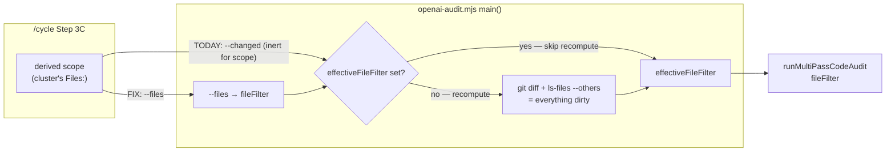

# Plan: /cycle's per-cluster audit must name the flag that actually scopes

- **Date**: 2026-08-13
- **Status**: Approved
- **Author**: Claude + Louis
- **Scope**: backend
- **Target domain(s)**: `audit-orchestration`, `skills-content`
- ⚠ **Cross-domain work** — a `skills-content` doc change whose correctness is a
  property of `audit-orchestration` CLI behaviour. That is the seam this plan is
  about, so the crossing is the point rather than an accident.

> **The fork this plan was commissioned to settle does not exist.** It was posed
> as "constrain the audit vs make /cycle refuse". Exploration found the
> constraining mechanism already shipped and working — `/cycle` simply never
> names it. See §2 KD-1.

---

## 1. Context Summary

**Detected scope**: backend (`detect-stack` → `js-ts`). Prose + one test; no UI.
Phases 3–4 skipped by scope.

### What exists today

`scripts/openai-audit.mjs` accepts three flags a caller might reasonably think
bound the audited file set. Only one does.

| Flag | What it actually does | Scopes the prompt? |
|---|---|---|
| `--files <list>` | Explicit allowlist. **When present, `--scope` is ignored.** | **YES** |
| `--changed <list>` | R2+ impact set — feeds reopen detection / `suppressReRaises` | No |
| `--diff <file>` | Unified diff for line-level annotation context | No |

`/cycle` Step 3C names `--changed` and `--diff`. It never mentions `--files`.

### Code Trace

All citations pinned to `c0390f74`.

- **The allowlist that already exists** — `scripts/openai-audit.mjs:593-594
  (c0390f74)` parses `--files` into `fileFilter`; `:632 (c0390f74)` states the
  precedence in-source: *"When `--files` is explicitly provided, `--scope` is
  ignored."* At `:762-764` it becomes `effectiveFileFilter`, and `:765`'s guard
  `if (!effectiveFileFilter && scopeMode === 'diff')` means a caller-supplied
  allowlist **skips the git recompute entirely**. `effectiveFileFilter` is then
  the `fileFilter` handed to `runMultiPassCodeAudit` at `:883 (c0390f74)`.
- **What `--changed` is for** — `:622-624 (c0390f74)`, documented in-source as
  *"comma-separated changed file paths for R2+ impact set computation"*. It
  reaches `runMultiPassCodeAudit` as `changedFiles` and feeds reopen detection,
  never the file set sent to the model. **AGENTS.md is already correct about
  this** (the R2+ CLI-flags table: *"Files modified this round (authoritative for
  reopen detection)"*), which is why this is a `/cycle` defect and not a
  repo-wide doc drift.
- **What `--diff` is for** — `:618-620 (c0390f74)`, *"unified diff file for R2+
  annotated context (highlights changed lines)"*. `/cycle`'s use of it is not
  wrong, merely insufficient.
- **The recompute that widens scope** — `:765-836 (c0390f74)`: on `--scope=diff`
  with no `--files`, it unions `git diff <base>` with `git ls-files --others
  --exclude-standard`, filters infra, applies exclusions, and assigns
  `effectiveFileFilter = allChanged` at `:831`. On a shared tree "everything
  dirty since base" includes another session's work.
- **The defect site** — `skills/cycle/SKILL.md` Step 3C item 3 (cited by section,
  not line — the file is edited often): *"invoke `/audit-code --scope=diff` with
  `--changed`=the derived scope and a `clusterStartRef..WORKTREE` `--diff`.
  Reconcile changed-files: a changed file belonging to **no** cluster's derived
  scope is an out-of-scope edit → **fail closed**."*
- **Blast radius is one file** (`measured`, by scanning every `skills/*/SKILL.md`
  at `c0390f74`): `audit-code` names both flags; `audit-plan` names `--changed`
  only to say plan mode does not need it; `cycle` names `--changed` with no
  `--files`. No other skill is affected.

### Measured evidence

**The original incident** (`measured`, `.audit/audit-code-clusterA-1786639349-r1-stderr.log`
lines 13-18): a per-cluster audit invoked per Step 3C with `--changed` listing 11
files and a `--diff` restricted to those 11 reported
`--scope=diff (vs f0c2649f): 52 changed files → scoping audit to diff` and
`+44 changed file(s) not referenced by the plan, now in scope`. 65 files reached
the prompt. 26 of 31 findings concerned code the cluster never touched.

**The fix, demonstrated** (`measured`, executed at `c0390f74` with one unrelated
file made dirty to simulate a concurrent session):

```
# WITH --files — the git recompute never runs
$ node scripts/openai-audit.mjs code <plan> --scope diff \
    --files scripts/openai-audit.mjs,skills/cycle/SKILL.md
  [scope] +1 changed file(s) not referenced by the plan, now in scope: skills/cycle/SKILL.md
  [scope] 1 scope file(s) not admitted (infra/extension/not-on-disk): scripts/openai-audit.mjs
  → no "--scope=diff (vs …)" line at all; the unrelated dirty file never enters scope

# WITHOUT --files, per the current Step 3C recipe
$ node scripts/openai-audit.mjs code <plan> --scope diff \
    --changed scripts/openai-audit.mjs,skills/cycle/SKILL.md
  [scope] --scope=diff (vs c0390f74): 1 changed files → scoping audit to diff
  [scope] Files: scripts/check-deps.mjs
  → scoped to the UNRELATED file; both --changed entries ignored for scoping
```

The second run is the defect in miniature; the first is the remedy. Same binary,
same commit, same tree — the only variable is which flag the caller names.

### Neighbourhood considered

`get-neighbourhood` returned 6 records, top band **`precedent` /
`above-floor-standout`** at 0.778 — `applyExclusions` (`openai-audit.mjs:175`),
with `loadExcludePatterns` at 0.728.

Opened both, as the band requires. They are the `--exclude-paths` / `.auditignore`
**denylist**: micromatch, applied to `allChanged` at `:829`. **Decision: reuse
neither — the allowlist this plan needs already exists as `--files`.** Recording
why the denylist is the wrong instrument even though it is the nearest neighbour:
excluding "everything that isn't mine" is unbounded and stale by construction,
which is the denylist-vs-allowlist lesson AGENTS.md already records for
`isDisposableDbHost` (*"Never re-express this as 'not $VENDOR'"*). The caller
knows what it owns; it should say so positively.

---

## 2. Proposed Architecture



### Key design decisions

**KD-1 — Use the existing `--files` allowlist. Write no new scoping code.
(#1 DRY, #5 Single Source of Truth)**

The commissioned fork was (a) build a constraining mechanism vs (b) make `/cycle`
refuse when the tree is dirty outside the cluster. **Both are answered by a flag
that already ships.** `--files` is an explicit allowlist whose precedence over
`--scope` is stated in the source and demonstrated above. Nothing in
`openai-audit.mjs` needs to change.

Branch (b) is additionally rejected on the merits now that (a) is free: refusing
whenever a concurrent session has anything dirty would block per-cluster audits
routinely on this repo's actual working setup, to prevent a problem `--files`
already prevents.

**KD-1b — The same wrong-flag advice is in the CLI's own refusal message, and
that is the higher-leverage site. (#5 Single Source of Truth)**

`auditSubjectFileGuard` (`scripts/lib/audit-scope.mjs:274 (c0390f74)`) is the
"audit your success paths" guard that refuses a run reading zero subject files.
Its remediation hint reads:

> *"Pass `--changed <files>` explicitly (with `--diff <patch>`), or
> `--scope=plan|full`."*

That is the same defect as `/cycle`'s, in the worst possible place: the message
an operator reads at the exact moment they are trying to fix a scope problem. It
sends them to the flag that cannot fix it. **Correcting it is in scope** — same
class, same root cause, and by the impact test the plan's remedy is not credible
while the tool's own recovery advice contradicts it.

**KD-2 — The reconciliation needs its OWN source of truth, because `--files`
deliberately removes the one it used to borrow. (#12 Validation)**

Step 3C's *"a changed file belonging to no cluster's derived scope is an
out-of-scope edit → fail closed"* is kept, but it can no longer read the audit's
recomputed set — supplying `--files` skips that recompute by design, which is the
whole point. So `/cycle` must compute the worktree change universe itself, and
the protocol has to be stated or it cannot be implemented deterministically:

**This is CODE, not prose — because `/cycle` is an LLM following instructions.**
The Gemini gate caught the architectural error in an earlier draft: it specified
NUL-delimited stream parsing (`STATUS\0old\0new`), mental application of
`isAuditInfraFile`, and argv-marshalling discipline, all as SKILL.md prose for a
model to carry out. A model cannot reliably parse a NUL byte stream inline, and
asking it to hand-apply a JS predicate invites hallucinated admission decisions
on the exact check that is supposed to be deterministic. **Every deterministic
step below therefore lives in a script that `/cycle` invokes and whose JSON it
reads.** The SKILL.md's job is to call it and act on the verdict — nothing else.

```bash
# ONE call. /cycle reads the JSON; it never parses git output itself.
node scripts/cycle-cluster-scope.mjs --base <clusterStartRef> \
  --scope-file .audit/cluster-<ID>-scope.txt --json
```

Internally (in code, with tests) it does what the earlier draft asked prose to do:

```js
git rev-parse --verify `${base}^{commit}`              // immutable full OID
git -c core.quotepath=off diff --name-status -z -M     // tracked, status-aware
git ls-files --others --exclude-standard -z            // untracked
```

> **An earlier draft of this block was wrong, and was caught by running it rather
> than by reading it.** It used `--name-only -z --diff-filter=ACMRD`. Measured on
> a throwaway repo with one rename, one delete and one untracked file, that
> command emitted `a/keep.txt` and `a/new.txt` — **the rename's OLD path
> `a/old.txt` was absent entirely**, so a file renamed OUT of a cluster's scope
> would have evaded the fail-closed check. `--name-status -z -M` emits
> `R100 | a/old.txt | a/new.txt`. `--name-only` discards the status metadata that
> makes both operands recoverable, and rename detection is not on by default.

- **Base**: `clusterStartRef` resolved to a **full immutable commit OID** via
  `rev-parse --verify <ref>^{commit}` and retained in that form, per the repo's
  one-range-one-resolver invariant; validated as an ancestor of `HEAD` first
  (Step 3a already requires this); never the dirty-aware default.
- **`-z` NUL-delimited** so a path containing a space or newline cannot split into
  two, and `core.quotepath=off` so non-ASCII paths are not backslash-escaped into
  non-matching strings.
- **Parsing is status-aware**: records are `STATUS\0path\0` except `R*`/`C*`,
  which are `STATUS\0oldPath\0newPath\0`. A parser that reads fixed pairs will
  desynchronise on the first rename and mis-attribute every subsequent path.
- **No `--diff-filter`.** The earlier draft's `ACMRD` omitted `T` (type change,
  e.g. file → symlink). The set is "everything that differs", so filtering it is
  an opportunity to forget a letter; take all statuses and let the comparison
  decide.
- **Renames/copies contribute BOTH operands** — the old path left the cluster's
  scope, the new one entered it.
- **Comparison** is on repo-relative POSIX paths, normalised the same way the
  cluster's derived scope is, against the union of ALL clusters' scopes.
- A path in the reconciliation set that is in **no** cluster's scope → fail
  closed, per the existing rule.

**TWO SETS, TWO PURPOSES — and conflating them is a contradiction the earlier
draft actually contained.** The reconciliation set must include deleted paths and
the OLD side of a rename, because that is how you detect an edit leaving a
cluster's scope. The `--files` allowlist must NOT include them, because the audit
admission policy rejects paths that are not on disk — so feeding them in
guarantees the requested-vs-admitted shortfall that KD-3 then stops on. The
earlier draft passed "the same derived scope" to both and was therefore
unsatisfiable in either direction.

| Set | Contents | Consumer |
|---|---|---|
| **Reconciliation set** | every changed path, **including deletes and both rename operands** | the fail-closed ownership check |
| **Audit allowlist** (`--files`) | that set **filtered to paths existing on disk** | `openai-audit.mjs` scope |

The requested-vs-admitted count comparison (KD-3) is against the **allowlist**,
never the reconciliation set.

**A deletion-only cluster cannot be code-audited, and that is correct.** Its
allowlist is empty, so `auditSubjectFileGuard` refuses — *"0 implementation files
reached the prompt"*. That is the guard working: there is no code to read. Step
3C must say so explicitly and route such a cluster to the consolidated Gemini
gate over the union diff (which reads the patch, where a deletion IS visible)
rather than reporting a vacuous per-cluster pass.

**KD-3 — Empty-scope is ALREADY guarded; the gap is when `--allow-infra-scope`
is mandatory. (#16 Graceful Degradation)**

Checked before designing anything: `auditSubjectFileGuard` already aborts with
*"0 implementation files reached the prompt; refusing to emit a verdict over code
that was never read."* So the silent-empty-scope failure this plan might have
re-invented a guard for **does not exist** — it is closed, and the plan should
not add a second one.

What is NOT covered is the *partial* case. Measured in §1: passing
`--files scripts/openai-audit.mjs,skills/cycle/SKILL.md` admitted one and
reported *"1 scope file(s) not admitted (infra/extension/not-on-disk)"* — a
silent narrowing that still produces a verdict. So Step 3C must state:

**The check is a PRE-flight in CODE, not a post-mortem in prose.** Two errors in
earlier drafts, both corrected here. First, the comparison ran *after* invoking —
by which point the model has been paid and has emitted a verdict over the
narrowed set, the confident-but-hollow outcome being prevented. Second, and worse
(Gemini gate, reinstating R3-H3): it asked `/cycle` to "evaluate the same three
admission tests" itself. `/cycle` is an LLM reading prose; it cannot execute
`isAuditInfraFile`, and a hand-applied admission decision on a
deterministic-by-design check is exactly the hallucination surface this plan
exists to close.

So `scripts/cycle-cluster-scope.mjs` (KD-2) owns the admission pre-flight too,
**by importing the real predicates rather than restating them**:

- imports `isAuditInfraFile` from `scripts/lib/audit-scope.mjs` — one oracle, no
  second implementation to drift;
- applies the same on-disk and extension tests;
- returns per-path `{path, admitted, reason}` plus `allowInfraScopeRequired: bool`
  and `commaUnsafePaths: string[]`;
- **exits non-zero when any declared path would not be admitted**, so `/cycle`
  stops before spending rather than judging JSON it might misread.

`/cycle`'s instruction reduces to: run it, and if it exits non-zero, stop and
show the operator its `reason` lines. Per-path attribution is available because
the script computed it — the CLI's aggregate-only report never enters the
picture. The post-invocation count comparison is kept as a cheap secondary check
that the two admission paths have not drifted.

> **The accounting is by COUNT, not per-path, because that is what the tool
> actually emits.** An earlier draft required every requested path to be named as
> admitted or not-admitted. Measured, the scope report emits only an aggregate —
> `1 scope file(s) not admitted (infra/extension/not-on-disk)` — and Step 3C is
> prose that cannot invoke the admission policy's internals to reconstruct the
> per-path reason. `isAuditInfraFile` is also only one of three admission tests
> (infra / extension / on-disk), so a prose rule keyed on it alone would
> mis-attribute the other two. A count comparison is implementable today, detects
> every shortfall, and is honest about not knowing which path was dropped —
> the operator reads the tool's own line for that. **Making the report per-path
> is a real improvement and is deliberately NOT in this plan** (§8).

**KD-4 — Guard BOTH halves: the premise behaviourally, the recipe structurally.
(#11 Testability)**

An earlier draft proposed only a documentation assertion and explicitly deferred
the behavioural one as "costs a real audit invocation". That was wrong on the
facts — the premise is testable without spending anything, and a doc test alone
cannot detect the assumption it rests on changing.

**(a) The premise — extract a pure resolver.** The precedence that makes this
whole plan correct (`--files` wins, and the git recompute is skipped) is a single
untested branch inline in `main()` at `openai-audit.mjs:762-765`. Extract it into
`scripts/lib/audit-scope.mjs` — the module that already owns
`isAuditInfraFile`, `classifyFiles` and `auditSubjectFileGuard`, so this is
joining an existing home, not creating one:

```js
resolveEffectiveScope({ fileFilter, scopeMode, excludePatterns })
  → { files: string[] | null, source: 'allowlist' | 'diff-recompute' | 'none' }
```

Full return contract, so an implementer does not have to guess:

| Input | `source` | `files` |
|---|---|---|
| non-empty `fileFilter` | `allowlist` | the filter minus exclusions, **order preserved, de-duplicated** |
| non-empty `fileFilter`, all excluded | `allowlist` | `[]` — an EMPTY allowlist, not a fallback to recompute |
| no `fileFilter`, `scopeMode: 'diff'` | `diff-recompute` | `null` — caller must run the git block |
| no `fileFilter`, `scopeMode: 'plan'`/`'full'` | `none` | `null` |

The `all excluded → []` row is the load-bearing one: silently degrading an
emptied allowlist into a working-tree recompute would resurrect this plan's own
defect. An empty result is then caught downstream by `auditSubjectFileGuard`,
which already refuses a zero-subject-file run (KD-3) — so the two guards compose
rather than duplicate. Paths are compared as given; **normalisation is the
caller's job** and is not silently applied here, so a caller cannot be surprised
by a path it did not write.

`main()` calls it and branches on `source === 'allowlist'` to skip the git block.
Pure — no fs, no git, no process — so a test asserts directly that an explicit
allowlist yields `source: 'allowlist'`, that exclusions still apply to it, and
that `scopeMode` is ignored when it is present. If someone inverts the
precedence, that test fails rather than a recipe silently widening.

**(b) The recipe — assert the executable line, not the prose.** A token check for
`--files` anywhere in Step 3C passes if the flag appears only in explanatory text
while the command still says `--changed`. So `skills/cycle/SKILL.md` gains ONE
canonical fenced block with stable delimiters:

````markdown
<!-- cycle:cluster-audit-command -->
```bash
# 1. One scripted call does ALL the deterministic work: resolves the base to an
#    immutable OID, computes the reconciliation set, filters to on-disk paths,
#    runs the admission pre-flight, writes the patch. Exits non-zero — and
#    /cycle STOPS — on an out-of-scope edit, an unadmittable path, or a comma.
node scripts/cycle-cluster-scope.mjs --base "$CLUSTER_START" \
  --scope-file "$SCOPE_FILE" --out-dir .audit --cluster "$ID" --json > "$SCOPE_JSON"

# 2. Audit, using ONLY values that call produced. Read them with node, not jq:
#    node is guaranteed here (we just invoked it); jq is not, and this repo is
#    Windows-primary. It is also absent from check-deps.mjs.
FILES=$(node -p "require('./$SCOPE_JSON').filesCsv")
PATCH=$(node -p "require('./$SCOPE_JSON').diffPath")
INFRA=$(node -p "require('./$SCOPE_JSON').allowInfraScopeRequired ? '--allow-infra-scope' : ''")

node scripts/openai-audit.mjs code "$PLAN" --scope diff \
  --files "$FILES" --changed "$FILES" --diff "$PATCH" $INFRA
#   --files   : THE scoping flag — an allowlist; makes --scope a no-op
#   --changed : R2+ reopen/impact detection only — does NOT scope
#   --diff    : annotation context only — does NOT scope; must be a real file
```
<!-- /cycle:cluster-audit-command -->
````

**No path is ever interpolated into a shell word by the agent.** An earlier draft
wrote `git diff "$BASE" -- $SCOPE_PATHS`, an unquoted scalar expansion that
word-splits on any path containing a space — while the same draft was carefully
using `-z` elsewhere to avoid precisely that. Gemini flagged the contradiction:
a ` ```bash ` block that a test extracts and an agent runs is executable, not
illustrative, and defending it as "illustrative" does not make it safe. The scope
list now crosses the boundary as a **file** (`--scope-file`, one path per line)
and comes back as pre-rendered `filesCsv` / `diffPath` values. The script does
its own argv marshalling internally, in code.

The test extracts **that block by its delimiters** and asserts the invocation
carries `--files`. The HTML-comment fences are invisible when rendered and are a
deliberate machine anchor, so legitimate prose edits around them cannot trip the
test and cannot satisfy it either.

**`--diff` takes a materialised file, not a range.** An earlier draft wrote
`--diff <clusterStartRef..WORKTREE patch>`, which is a description; the flag
(`openai-audit.mjs:618-620`) reads a path. The block above writes the patch first.
Untracked files are absent from `git diff` output by construction — that is
acceptable here because `--diff` supplies annotation context only, and the
authoritative change set for reconciliation comes from KD-2's separate commands,
which DO include untracked.

**Marshalling and ordering — now properties of the script, not instructions to
an agent:**

- **Argv, never string interpolation.** `cycle-cluster-scope.mjs` invokes git via
  `execFile`-style argv arrays. No path is ever concatenated into a shell word,
  so spaces, newlines and globs cannot corrupt it.
- **One snapshot feeds everything.** The reconciliation set, the on-disk-filtered
  allowlist, `filesCsv` and the patch are all derived from a single read inside
  one process invocation. The earlier draft's risk — two reads disagreeing across
  a concurrent edit, leaving a file in the patch but absent from the ownership
  check (the fail-open direction) — is closed by construction rather than by
  telling the agent to be careful about ordering.

**Transport limitation, stated because it is real**: `--files` is comma-delimited
(`openai-audit.mjs:594` splits on `,`), so a repository path containing a comma
cannot be expressed. `/cycle` must **detect a comma in any derived-scope path and
stop** rather than silently truncate the allowlist into two wrong paths — a
silently-narrowed allowlist is the same class of failure this whole plan exists
to remove. This does turn an otherwise-valid filename into an unsupported
operational state; that is a genuine cost of deferring the transport change, and
the honest trade is a loud stop over a silent corruption. The detection is
listed in §7 and tested in §9, not left as prose.

Deliberately NOT attempted: a general "does this doc's flag usage match the CLI's
behaviour" oracle. Flag *semantics* have no mechanical oracle — `cli:flags:gate`
sees that a flag is registered, `npm-args:gate` sees an `npm run` separator bug,
neither knows what a flag *means*. Two narrow assertions about one known-critical
recipe is the honest scope.

### Right-sizing gate

New structure on the table: one test file. (No new flag, no new gate, no config.)

- **Band-aid extreme** — fix only the prose in Step 3C. The recipe becomes
  correct today and silently rots the next time someone edits it, which is
  exactly how it got here; and the CLI's own refusal message keeps sending
  operators to the wrong flag.
- **Over-engineered extreme** — a doc↔CLI flag-semantics validator, or a new
  `--scope=allowlist` mode, or making `--changed` double as a scope filter
  (which would silently change reopen-detection semantics for every existing
  caller).
- **Chosen** — correct the recipe **and** the tool's own remediation hint, and
  pin the load-bearing premise with a behavioural test made possible by a small
  extraction into a module that already owns the neighbouring scope functions.
  Current requirement: a measured incident where 26 of 31 findings were about
  untouched code, and a premise (`--files` beats `--scope`) that the entire
  remedy rests on and that nothing currently asserts.

**On the extraction specifically** — it is the one piece of new structure here,
so it earns its own line. It is NOT justified by "cleaner": it is justified by
KD-4a's requirement that the precedence be assertable at all. If the resolver
could be tested where it sits, this plan would not move it.

**Manual vs scripted**: four files, judgement-heavy prose and one behaviour-
preserving extraction. By hand.

---

## 6. Sustainability Notes

- **Assumption that could change**: `--files`' precedence over `--scope`
  (`openai-audit.mjs:632`). If that inverted, Step 3C would silently widen again.
  **KD-4a's `resolveEffectiveScope` tests now cover exactly this** — an earlier
  draft of this bullet said the tests asserted "the doc, not the binary", which
  contradicted §9 once the behavioural half was added. The residual limit is
  narrower: the tests pin the *resolver's* contract, and a static assertion pins
  that `openai-audit.mjs` imports it with no inline copy, but nothing asserts
  end-to-end that a real CLI run honours it. The §1 measurement is that evidence,
  taken once by hand.
- **Deliberately not owned**: `--changed`'s R2+ semantics are untouched, so
  `suppressReRaises` and reopen detection are unaffected. This plan adds a flag
  to a documented recipe; it changes no CLI behaviour at all.

---

## 7. File-Level Plan

| File | Intent | Purpose |
|---|---|---|
| `scripts/cycle-cluster-scope.mjs` | create | The deterministic half of Step 3C, moved out of prose (KD-2/KD-3). Resolves `--base` to an immutable OID; computes the reconciliation set (status-aware, rename-both-operands, untracked included); filters to on-disk paths for the allowlist; runs the admission pre-flight by **importing** `isAuditInfraFile`; detects comma-unsafe paths; writes the patch; emits `{filesCsv, diffPath, allowInfraScopeRequired, admissions[], outOfScope[]}`. **Exits non-zero** on out-of-scope edits, unadmittable paths or comma-unsafe paths. Needs `assertKnownFlags` + `--selfcheck-relocation` per the CLI contract. |
| `scripts/lib/audit-scope.mjs` | modify | Add `resolveEffectiveScope({fileFilter, scopeMode, excludePatterns})` → `{files, source}` (KD-4a). Joins the module already owning `isAuditInfraFile` / `classifyFiles` / `auditSubjectFileGuard`. Also fix `auditSubjectFileGuard`'s remediation hint, which currently tells the operator to pass `--changed` (KD-1b). |
| `scripts/openai-audit.mjs` | modify | Call `resolveEffectiveScope` at `:762-765` and branch on `source === 'allowlist'` to skip the git recompute. Behaviour-preserving extraction — no CLI or scope semantics change. |
| `skills/cycle/SKILL.md` | modify | Step 3C item 3: the canonical delimited command block (KD-4b) passing `--files`; state that `--changed` is reopen/impact only and `--diff` is annotation context; the reconciliation protocol and its two-sets distinction (KD-2); the pre-flight admission check, `--allow-infra-scope` decision and comma detection (KD-3); the deletion-only-cluster route to the consolidated gate. |
| `tests/cycle-audit-scope-contract.test.mjs` | create | Both halves of KD-4: behavioural assertions on `resolveEffectiveScope`, and extraction of the delimited Step 3C block from `skills/cycle/SKILL.md` (the canonical source, never the generated `.claude/` copy). |

**Close-out (not a phase)**: `npm run skills:regenerate` (propagates to
`.claude/skills/cycle/SKILL.md`) · `npm run skills:check` · `npm run check`.

> **Gate 1 re-evaluated twice, and now MET on one criterion — still no phases.**
> 5 files across two domains, which trips "≥2 distinct subsystems". But §7b's
> purpose is sequencing work that must land in order, and there is no dependency
> chain here: the new script, the resolver extraction and the SKILL.md edit are
> independently landable; only the tests depend on them. Phasing would put the
> script and the recipe documenting it in separate audit windows — the opposite
> of what clustering is for, and the seam most worth auditing together.
> **No §7b, no §11**, recorded as a deliberate judgement against a tripped
> criterion rather than an untripped one.

---

## 8. Risk & Trade-off Register

- **The doc test anchors on HTML-comment delimiters**, so a future editor who
  removes them breaks it. That is intended — the delimiters ARE the contract, and
  losing them means the canonical command is no longer identifiable. A false trip
  is cheap and visible; a false pass is what this buys insurance against.
- **The extraction touches `openai-audit.mjs`'s scope resolution**, which every
  audit in this repo depends on. It is behaviour-preserving by construction (move
  a branch, call it, branch on the returned tag) and covered both by the new unit
  tests and by the existing suite — but it is the one place in this plan where a
  mistake is wide rather than local, and it should be reviewed as such.
- **This plan's own audit needs `--allow-infra-scope`** if it is to see
  `openai-audit.mjs`. It should not need to — this plan modifies no audit
  infra — but the flag is named here so the audit's scope line can be read
  knowingly rather than puzzled over.
**Deliberately deferred, each with its independence named:**

- **Per-path scope-admission reporting.** The scope report emits an aggregate
  not-admitted count; per-path would be better (KD-3). Independent: this plan's
  correctness rests on detecting a shortfall, which the count already does — not
  on knowing which path caused it.
- **A non-comma transport for `--files`.** A repo path containing a comma cannot
  be expressed today. Independent: no path in this repo contains one, and
  `/cycle` stops rather than truncating if that ever changes, so the plan's
  fail-closed property holds without the redesign.
- **`--diff` excludes untracked files.** Inherent to `git diff`. Independent:
  `--diff` supplies annotation context only; the reconciliation set that the
  fail-closed rule actually consumes comes from KD-2's commands, which include
  untracked explicitly.
- **Scope discipline**: the working tree is clean at `c0390f74` and no concurrent
  session is running, so this plan's own audit will be correctly scoped — the
  first time that has been true today.
- **This plan sits UNDER the fuzzy-discovery threshold, knowingly.** `plan-paths`
  reports `regex-resolvable: 4 (fuzzy fires below 5)`, so fuzzy keyword discovery
  added 11 files from plan words. That is legitimate here — the plan genuinely
  touches 2 files — and the rule is to know it, never to invent paths to clear
  it. **The consequence is that `/audit-code --scope plan` would review 15 files
  instead of 4.** The remedy is this plan's own subject — audit it with an
  explicit allowlist covering **every** file §7 declares:

  ```bash
  node scripts/openai-audit.mjs code docs/plans/cycle-cluster-audit-scope.md \
    --scope diff --allow-infra-scope \
    --files scripts/lib/audit-scope.mjs,scripts/openai-audit.mjs,skills/cycle/SKILL.md,tests/cycle-audit-scope-contract.test.mjs
  ```

  `--allow-infra-scope` is required: both backend files are audit infrastructure
  and would otherwise be silently not-admitted — the very partial-admission case
  KD-3 describes, which would have left the load-bearing extraction unreviewed.
  An earlier draft of this bullet listed only the two non-infra files and would
  have done exactly that.

---

## 9. Testing Strategy

**Tier 1** — `resolveEffectiveScope` is a pure deterministic module and the doc
assertion is a string check over a committed file.

**Behavioural (KD-4a) — `resolveEffectiveScope`:**

- an explicit `fileFilter` yields `source: 'allowlist'` **whatever `scopeMode`
  says** — this is the plan's load-bearing premise, asserted directly;
- exclusion patterns still apply to an allowlist (today's `:763` behaviour is
  preserved, not dropped by the extraction);
- no `fileFilter` + `scopeMode: 'diff'` yields `source: 'diff-recompute'`, so the
  caller still knows to run the git block;
- the function performs no git and no fs — assert it runs with `process.cwd()`
  pointed at an empty tmpdir and still returns the allowlist unchanged.

**Extraction safety**: assert `openai-audit.mjs` imports `resolveEffectiveScope`
and retains no inline copy of the precedence branch — the same static shape as
`tests/anthropic-client-migration.test.mjs`, catching a future re-inlining.

**`cycle-cluster-scope.mjs` (KD-2/KD-3) — the deterministic half, now testable
because it is code.** Fixtures are throwaway git repos, so every case is real
git output rather than a hand-written string:

- a **rename** out of a cluster's scope is detected (the old path is in the
  reconciliation set) — the case the R2 draft's `--name-only` command silently
  dropped, reproduced as a regression test;
- a **delete** outside scope fails closed; a **type change** (file → symlink)
  does too — the `--diff-filter` omission from R2;
- an **untracked** file outside scope fails closed;
- a path containing a **space** survives round-trip (proves the argv marshalling);
- a path containing a **comma** exits non-zero rather than emitting a
  two-element allowlist;
- **deleted / old-rename paths are in the reconciliation set but NOT in
  `filesCsv`** — the two-sets invariant, asserted in both directions;
- a **deletion-only cluster** yields an empty allowlist and says so, rather than
  a vacuous pass;
- `allowInfraScopeRequired` is true iff a declared path satisfies the imported
  `isAuditInfraFile` — asserted against the real predicate, not a copy.

**Documentation (KD-4b) — the delimited block:**

- **Red-then-green**: write the assertion against the CURRENT
  `skills/cycle/SKILL.md` and watch it FAIL before editing. A doc assertion only
  ever seen passing is indistinguishable from one matching the wrong thing.
- **Vacuous-pass guard**: assert the delimiters were found and the extracted
  block is non-empty BEFORE asserting on its contents. An `indexOf` returning
  `-1` and a slice of nothing must not read as a pass.
- **Anti-prose guard**: assert `--files` appears **inside the extracted block**,
  not merely somewhere in the section — that is the exact hole M3 named.
- **Data-flow guard, not just a token check**: assert `--files` and `--changed`
  receive **the same variable token**, and that it is the scope variable rather
  than a constant, a path literal, or `$PLAN`. A token-presence assertion alone
  would pass on `--files "$PLAN"` — the flag would be present and the scoping
  still wrong, which is M1's point and the whole failure this plan is about.
- **Comma detection**: assert `/cycle` stops on a derived-scope path containing a
  comma (fixture path `a,b.mjs`), rather than emitting a two-element allowlist.
- **Source, not copy**: assert the path read is `skills/cycle/SKILL.md`; a test
  pointed at the generated `.claude/` copy would pass on stale bytes.

**Cross-check already performed, recorded rather than automated**: the
`--files`-vs-`--changed` comparison in §1 was executed against the real CLI at
`c0390f74` and is the evidence the remedy works end-to-end. It stays manual — it
costs a real audit invocation — and §6 names that as the known limit. The
`resolveEffectiveScope` tests are what make it unnecessary to repeat.


---

## 12. Audit Trail

**GPT plan audit — 3 rounds, stopped at the default cap.**

| Round | Verdict | Findings | Accepted as fix-now |
|---|---|---|---|
| 1 | NEEDS_REVISION | H:1 M:3 | 4/4 — **100%** |
| 2 | NEEDS_REVISION | H:3 M:3 | 6/6 — **100%** |
| 3 | SIGNIFICANT_GAPS | H:3 M:2 | 5/5 — **100%** |

**Gemini gate — 2 rounds, `CONCERNS_REMAINING` → `APPROVE`.** Reviewer
`claude-opus-5` (the documented fallback). Round 1: 2 new + 1 wrongly-dismissed,
all one root insight. Round 2: `APPROVE`, 0 wrongly-dismissed, 0
over-engineering flags, one LOW (`jq` portability) fixed on the spot.

**Stop decision**: GPT stopped at the 3-round default with acceptance at 100%
throughout — the rounds were buying real corrections, but the Gemini gate is
mandatory and round 3's findings were converging on one theme rather than
opening new ones. Gemini closed at its 2-round cap on `APPROVE`.

**What the loop actually changed — the plan was wrong three times, in three
different ways:**

- **A command written but never run.** R2-H1: the reconciliation used
  `git diff --name-only --diff-filter=ACMRD`, which silently drops the OLD path
  of a rename, so a file renamed out of a cluster would have evaded the
  fail-closed check. Executing it on a throwaway repo showed exactly that;
  `--name-status -z -M` was the fix. **A git incantation is an instrument, and
  an unrun instrument is a hypothesis.**
- **A contradiction between two sets I had merged.** R3-H1: deleted and
  old-rename paths MUST be in the reconciliation set and MUST NOT be in
  `--files` (the admission policy rejects paths not on disk). The draft passed
  "the same derived scope" to both, making it unsatisfiable in either direction.
- **A capability mismatch the GPT rounds never saw.** The Gemini gate's three
  findings shared one root: `/cycle` is an LLM following prose, and the plan had
  it parsing NUL-delimited byte streams, hand-applying `isAuditInfraFile`, and
  maintaining argv-marshalling discipline. None of that is reliably doable in
  prose. That reframed the design — every deterministic step moved into
  `scripts/cycle-cluster-scope.mjs`, and the SKILL.md's job shrank to "call it,
  act on the exit code". **The plan got smaller in prose and stronger in
  guarantees.**

**One irony worth recording**: an earlier draft defended an unquoted
`$SCOPE_PATHS` as "illustrative" while the same section used `-z` to protect
against precisely the corruption that expansion causes. A ` ```bash ` block a
test extracts and an agent runs is executable, and calling it illustrative does
not make it safe.
