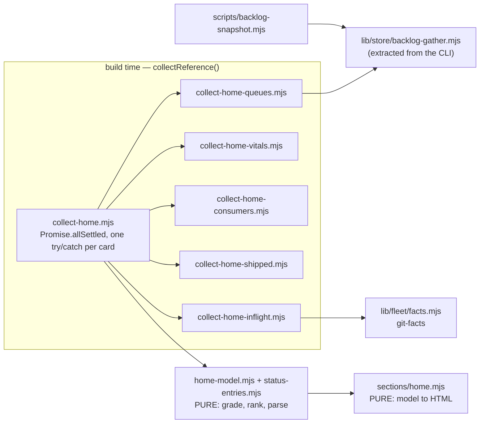

# Plan: Dashboard Home summary — what changed, is it healthy, what needs me
- **Date**: 2026-10-06
- **Status**: Complete
- **Author**: Claude + Louis
- **Scope**: full-stack (a Node build-time collector layer + a static HTML tab) · stack `js-ts`
- **Target domain(s)**: `dashboard`, `scripts`, `tests` — plus a NEW declared edge `dashboard → fleet`
- ⚠ **Cross-domain work** — Home reads `fleet` (in-flight), `stores` (queue envelopes) and shared-lib helpers. The one new edge is intentional and one-way (see §6).

## 1. Context Summary

**Why.** A `/persona-test` of the local dashboard (store session `d53c9c25-a8d6-40d2-8822-2f701d27bcc6`, 2026-10-06; 4 P1, 4 P2, 2 P3) found that for an engineer the highest-value questions — *what changed lately, is the project healthy, what needs me* — have **no view**, although every answer already exists as a CLI or a file. 23 views (10 Reference + 13 Telemetry), no landing summary, and `Start Here` is static prose. The first P1 is this plan; the other three P1s and the P2/P3s are recorded as follow-ups (§8) and deliberately not built.

**What Home is.** A new first tab on the Reference page (`dashboard/index.html`) with four cards — Health, Recently shipped, Needs you, In flight — each a collector plus a pure presenter, each stamped with its own source and observation time. `Start Here` stays, as the second tab of the same group.

**Code Trace** (all at `5b6fedd3`):
- Tab registry and slicers: `scripts/lib/dashboard/render.mjs:55-145` (`SLICERS`, `REGISTRY.reference`; first entry is the default selected tab, `render.mjs:233` `tab(s.id, s.title, i === 0)`); validation at the top of `renderDocument` `render.mjs:186-188`.
- Collector composition and the degradation contract: `scripts/lib/dashboard/collect-reference.mjs:443-584` — every collector runs in its own `try/catch`, writes `sources.<name> = {status, detail}`, and a failed one yields an empty, well-formed value (`collect-reference.mjs:496-532`). Template for a small collector: `scripts/lib/dashboard/collect-visual.mjs:1-53`.
- Schemas: `scripts/lib/dashboard/schema.mjs:20-27` (`SourceStatusSchema`: `ok | missing-optional | invalid | unexpected-error`), `:49` onward (reference data).
- Section contract: sections are `default(slice, ui) → string`, arity 2, never import `helpers.mjs` — enforced by `tests/dashboard-section-contract.test.mjs:1-40`.
- Hard-coded count to fix: `scripts/lib/dashboard/render.mjs:119` (`Which of the 16 bundled skills …`).
- Queue logic to REUSE: `scripts/backlog-snapshot.mjs:62-74` (`readEnvelope`, a private function that returns `null` on any failure so the formatter renders `unmeasured`), `:108-116` (the five reads), formatter `scripts/lib/store/backlog-snapshot.mjs:38-60` (`isMeasured`, never `rows.length`, never `0` for an unasked question).
- Sync state: `scripts/lib/sync-receipt.mjs` (`readSyncReceipt`, `latestReceiptEntry`); the registered consumers: `scripts/lib/consumer-repos.mjs` (`CONSUMER_REPOS`, `localRegistryStatus`). **This source repo has no `.sync-receipt.json`** (measured: absent here, present in each consumer) — so "consumer sync state" here means reading the *consumers'* receipts.
- Context-size oracle: `scripts/check-context-drift.mjs:89` (`DEFAULT_MAX_AGENTS_MD_CHARS = 92000`), its `maxAgentsMdChars` config, and the measure itself — `agentsContent.length`, i.e. **characters** of the decoded string (`:287`).
- Maintenance heartbeat: `scripts/maintenance-checks.mjs:501` (`loadHeartbeat`), default overdue window 7 days (`:61`).
- In-flight facts: `scripts/lib/fleet/facts.mjs` (`gatherFacts`, `buildStatusFrom`) and `scripts/lib/fleet/git-facts.mjs` (`runGit`, `tipSubject`).
- Plans already collected: `collect-reference.mjs:69` (`discoverPlans`, bucketed by `Status:`) — Home reuses `reference.plans`, it does not re-read `docs/plans`.
- Status log: `status.md` (current month, newest entry first; entries are `## YYYY-MM-DD — title`), older months in `docs/status/YYYY-MM.md`. The queue line it carries (`Backlog <ISO>: Q1 68c/8p (+353 aged) · Q2 … · Q3 … · debt … · upstream N`) is written by `renderBacklogSnapshot` and pasted by `/ship` Step 2b.
- Skill roster oracle: `scripts/lib/store/skill-census.mjs:41` (`ALL_SKILLS`); the reference page already collects `skills` from `skills/`.

**Neighbourhood considered** (arch-memory, 2026-10-06): top hit `scripts/backlog-snapshot.mjs:main` — band `precedent`, 0.47. Opened and decided: **extend by extraction, not by sibling.** Its five reads are the thing Home needs, but they live inside the CLI's `main` as a private function, so reusing them means moving them into a module both callers import — otherwise Home would grow a second copy of "what is a queue" and the two would drift (the failure `backlog-snapshot`'s own header documents, where counting rows once reported 20 against 232). Next hits (`sections/ship-health.mjs`, `collect-telemetry.mjs:collectShipHealth`, `sections/purpose-health.mjs`) are review-band siblings for the section/collector *shape*, followed by convention, not imported.

**Security incident neighbourhood**: no incident matched on these paths. Home reads local files and runs read-only git; it writes nothing and sends nothing. The one trust boundary is **consumer receipts read from other repos' working trees** — treated as untrusted data (strict Zod, size-capped, escaped on render), see §6.

**Execution model (Phase 1.5).** The four card collectors are independent of each other, so they run concurrently (`Promise.allSettled`); the "Needs you" list is a pure derivation over the other cards' results and runs after. Within the queue card, the five store reads are independent child processes (the CLI ran them sequentially; Home runs them in parallel under a 20 s per-read cap, so the worst case adds ~20 s to a build rather than ~100 s). No chain needs atomicity: Home is read-only, so a failure is simply a degraded card.

## 2. Proposed Architecture

**Layering of the work (#2, #3, #11).** Everything that touches a process or the filesystem is in a thin `collect-home-*` module returning plain data with its own `{status, detail, asOf, source}`. Every *decision* — chip grading, trend, ranking the Needs-you list, parsing `status.md` — is a pure function in `home-model.mjs` / `status-entries.mjs`, tested without git or a store. The section is a pure `model → HTML` function.

**Measurement, collector, card — three different things.** A *measurement* is one independently-obtainable value, and it owns the status: `{id, label, value, status, asOf, source, detail}`. A *collector* returns an array of measurements (queues: five; vitals: AGENTS size, plans, skills, maintenance; consumers: one aggregate plus a row per consumer; shipped: the status log and the merge log; in-flight: one). A *card* is only a presentation grouping over the measurements it shows. Consequences: a chip derives its state from ITS measurement (the Plans chip stays measured when the maintenance heartbeat is unreadable); `unmeasured` is per measurement; N01 fires per unmeasured measurement and is grouped under its card; and a card shows its own warning only when *every* measurement in it is non-ok.

**Card contract.** Every card value is `{ status: SourceStatus, asOf: ISO|null, source: string, detail: string, … }`, and the failure *kind* is preserved end to end rather than collapsed to `null`:

- `gatherBacklogEnvelopes` returns BOTH `envelopes` (the CLI's `null`-on-failure shape, so the formatter and its `unmeasured` rendering are unchanged) AND `outcomes: { q1, q2, q3, upstream, debt }`, each `{ kind: 'ok' | 'store-off' | 'store-unreachable' | 'timeout' | 'schema-fault' | 'process-failed' | 'malformed', detail }` with a bounded, secret-free `detail` (exit code or "no JSON line", never stderr text or a DSN).
- **The classification is built from measurement, not guessed.** A reader that cannot reach the store typically exits non-zero *with a JSON envelope on stdout* (the `cross-skill.mjs` readers emit `{ok:false, …}`; `emit({ok:false})` sets exit 1), so the exit code alone cannot separate "store down" from "reader broke". Phase 1 therefore starts by **running each of the five readers with the store deliberately unreachable** (`AUDIT_DB_URL` aimed at a closed loopback port, and once with it empty — the air-gap signal) and records each one's actual exit code and envelope as a fixture, `tests/fixtures/dashboard-home/store-unreachable-envelopes.json` (a real capture, not a hand-written one). The reader maps the envelope — parsed from the last JSON line on stdout *regardless of exit code* — through the repo's existing typed vocabulary (`db/errors.mjs`: `isSchemaFaultSqlstate` / `describeSchemaFault` for a schema fault) plus the captured connection-class codes.
- **One decision tree, evaluated top to bottom, first match wins** (so the kinds are mutually exclusive):
  1. The card deadline fired and the child was aborted → `timeout` → `missing-optional`.
  2. A parseable envelope exists (read from the last JSON line on stdout, **whatever the exit code**):
     - `cloud:false`, or `measured:false` caused by a disabled store → `store-off` → `missing-optional`;
     - `ok:false` whose `error.code` is in `STORE_UNREACHABLE_CODES` (the connection-class codes seen in the Phase 1 capture; a closed list) → `store-unreachable` → `missing-optional`;
     - `ok:false` with a typed schema fault (`isSchemaFaultSqlstate`) → `schema-fault` → `unexpected-error`;
     - `ok:false` with any other code → `process-failed` → `unexpected-error`;
     - `ok` and measured → `ok`.
  3. No parseable envelope and exit 0 → `malformed` → `unexpected-error`.
  4. No parseable envelope and non-zero exit → classified by the captured **(reader, exit-code) signature**: if the Phase 1 capture shows that exact reader failing that exact way when the store is unreachable → `store-unreachable`; **anything else (module-load crash, uncaught exception, an unknown exit) → `process-failed` → `unexpected-error`**.
  `store-unreachable` therefore requires structured evidence — a recognised envelope code or a captured signature — never the mere absence of output, so a crashing reader cannot masquerade as an unreachable store. A thrown collector is `unexpected-error`; an envelope the capture did not anticipate falls through to `process-failed` (fail loudly, never hide a defect as an expected absence).
- **Aggregate `sources.home`**: `ok` if every card is `ok`; `missing-optional` if every non-ok card is `missing-optional`; otherwise `unexpected-error` with a detail naming the failing cards. The build keeps its existing exit rule (`invalid | unexpected-error` ⇒ non-zero), so an unreachable store does NOT fail a build but a broken reader does; both are pinned by a test.
- The presenter renders each non-ok card with its own warning and its `detail`; the other cards render normally.

**Consumer comparison target (what is being compared to what).** A receipt's `source.commitSha` is a commit of the *claude-engineering-skills* repo; a consumer project's own HEAD is a different history and is never compared. So:

- **Run in the source repo** (`package.json` name `claude-engineering-skills`): for each registered consumer, read its receipt and compare `source.commitSha` against THIS repo's history using git, not string equality: equal ⇒ `current`; an ancestor of HEAD ⇒ `behind N` (`git rev-list --count <sha>..HEAD`); a sha this clone does not have, or one that is not an ancestor and not equal ⇒ `not comparable` (newer, divergent, or a fork) — reported as that, never as current or behind. Reuse `detectSourceRollback` from `sync-receipt.mjs` for the rollback case. An unreadable or schema-invalid receipt ⇒ `unreadable (reason)`.
- **Run in a consumer**: there is no offline way to know the upstream HEAD, so the card shows "last synced <time> from <sha7>" as a `neutral` chip — a fact, not a judgement.
- **Completeness is explicit.** The card carries `{total, inspected, omitted}`; reading is capped at 20 receipts, and with `omitted > 0` it displays "+N not inspected" and the chip can never be `ok` (it is at best `warn`), and N01 lists the omitted count.

**1 — Health strip.** A row of chips; each chip is `{id, label, value, state, source, asOf, detail, href?}` with `state ∈ ok | warn | bad | neutral | unmeasured`. **`ok` is only reachable from a measured value that met a stated rule**; a measured value with no rule to judge it is `neutral` (grey, shows the number), never green. The grading table is one committed constant (`HEALTH_RULES` in `home-model.mjs`), no thresholds hidden in presenters:

| Chip | Source | ok | warn | bad |
|---|---|---|---|---|
| Queues Q1 / Q2 / Q3 / debt / upstream | shared readers; trend from the previous `Backlog` line in `status.md` | measured and ≤ previous | measured and grew | — (no threshold without a baseline) |
| (no previous line) | | `neutral` | | |
| AGENTS.md size | **characters of the decoded text**, never bytes (`statSync` would grade non-ASCII differently from the gate): `agentsMdCharCount(text)` and `resolveMaxAgentsMdChars(root)` from a NEW shared module `scripts/lib/claudemd/context-size.mjs` that `check-context-drift.mjs` is changed to import (it measures `agentsContent.length` at `check-context-drift.mjs:287` and resolves the cap from its config, default 92000) — one oracle, not a copy | < 95 % of cap | 95–100 % | > 100 % |
| Plans | `reference.plans` buckets | none In Progress older than 14 d | ≥1 In Progress older than 14 d | — |
| Consumers | each registered consumer's latest receipt vs the **source repo's** history (see below) | all inspected AND every one current | ≥1 behind, or any not inspected / unreadable | — |  *(not comparable ⇒ `neutral`: measured on 2026-10-06, all three real receipts record a pre-squash BRANCH commit that is never an ancestor of main, so a persistent warn would be a cried wolf; receipts carry no bundle hash, so there is no content-based alternative — follow-up: record one)* |
| Maintenance | heartbeat file vs its own 7-day window | within window | overdue | — |
| Skills | `reference.skills.length` vs `ALL_SKILLS.length` | equal (neutral chip showing the count) | — | unequal (the census roster is stale) |

Any source whose `status` is not `ok` renders `unmeasured` with its reason, regardless of table.

**2 — Recently shipped.** `parseStatusEntries(text, limit)` reads the head of `status.md` (capped at 256 KB — entries are newest-first), returns `{entries:[{date,title,planPath|null}], skippedHeadings}`; `git log --first-parent -n N <default branch>` supplies squash-merge subjects. They are **two separately bounded lists** — `home-shipped-log` (status entries, ≤ 10) and `home-shipped-merges` (git subjects, ≤ 10) — newest first; a `status.md` heading that does not match `## YYYY-MM-DD — …` is *counted and surfaced* ("3 headings unparsed"), not silently dropped. A plan path named in an entry links to the Plans tab (cross-tab link, no plan body embedded).

**3 — Needs you.** `rankNeedsYou(model)` over a closed rule table (`NEEDS_RULES`): each rule is `{id, severity 1-3, when(model) → measured?true|false|'unmeasured', text, command}`. Output ≤ 8 rows, ranked by severity then by age, each with the exact command to run. The complete rule table is below; an `unmeasured` measurement is an item too (N01), one row per measurement, so the list can still be capped honestly with a true "+N more". **`NEEDS_RULES` — committed in full (severity 3 = highest; ties broken by age anchor, then by rule id ascending, so the order is deterministic):**

| id | fires when (measured) | fires when unmeasured | sev | age anchor | text | command or link |
|---|---|---|---|---|---|---|
| N01 | any measurement unmeasured or degraded | (this rule IS the unmeasured case; one row per measurement, grouped under its card) | 3 | none | "CARD unmeasured — DETAIL" | one command per measurement id: queues (all five): `node scripts/cross-skill.mjs whoami`; consumers: `node scripts/sync-status.mjs`; maintenance: `node scripts/maintenance-checks.mjs --status`; AGENTS.md size: `npm run context:check`; skills roster: `npm run skills:check`; plans: link to the Plans tab; status log / merge log / in-flight: the build's own stderr (`node scripts/build-dashboard.mjs reference`) |
| N02 | skills roster differs from the census roster | n/a | 3 | none | "Census roster is stale (N skills vs M)" | `npm run skills:check` |
| N03 | upstream open > 0 | covered by N01 | 3 | oldest report if the envelope carries it, else none | "N upstream report(s) open" | `npm run upstream:queues` |
| N04 | Q2 total > 0 and not below previous | covered by N01 | 2 | trend | "N accepted finding(s) never remediated" | `node scripts/cross-skill.mjs list-unremediated-acceptances` |
| N05 | Q1 code > 0 and not below previous | covered by N01 | 2 | trend | "N code fix(es) have no regression lock" | `node scripts/cross-skill.mjs lock-with-test --worksheet` |
| N06 | a plan In Progress older than 14 days | covered by N01 | 2 | plan date | "Plan SLUG In Progress for N days" | link to the Plans tab (no command) |
| N07 | a consumer behind this HEAD | covered by N01 | 2 | receipt time | "NAME is N commit(s) behind" | `npm run sync -- --target NAME` with the real validated name |
| N08 | maintenance heartbeat overdue | covered by N01 | 2 | heartbeat time | "Weekly maintenance overdue by N day(s)" | `node scripts/maintenance-checks.mjs` |
| N09 | AGENTS.md at or above 95 % of cap | covered by N01 | 2 | none | "AGENTS.md at N % of its cap" | `npm run context:check` |
| N10 | Q3 actionable > 0 | covered by N01 | 1 | trend | "N final-review finding(s) await a ruling" | `node scripts/cross-skill.mjs final-review-pending --repo` plus the slug the queue card actually used (if none resolved, the card is unmeasured, not this rule) |
| N11 | debt (cloud) > 0 and not below previous | covered by N01 | 1 | trend | "N deferred-debt item(s) open" | `npm run debt:review` |

"Nothing needs you" is printed **only** when no rule fired AND no card is unmeasured. The list shows the top 8 and always prints "+N more" with the true count — nothing is dropped silently, and N01's rows are bounded by the number of measurements (a fixed small set), with the overflow always counted in "+N more".

Commands are literals from the table; the only interpolated values are a consumer name (`^[A-Za-z0-9._-]+$`) and a repository slug (`^[A-Za-z0-9._-]+/[A-Za-z0-9._-]+$`, N10 only), each accepted only if it matches its pattern and otherwise omitted with the row downgraded to "command unavailable" (never interpolated unvalidated), and every npm invocation that takes a flag uses the `--` form (repo rule: `npm run sync -- --target <name>`; written with a real name, never an angle-bracket placeholder).

**4 — In flight.** `gatherFacts({cwd, prs:false, checks:false})` then `buildStatusFrom(facts)`: worktrees, branches ahead of base, overlaps. `prs:false` renders `PRs: not queried (not requested for the dashboard build)`. `checks:false` is a new option on `gatherFacts`: the `.fleet.json` extension hook is **consumer code**, and a dashboard build must not execute it. Rows capped at 15 with "+N more".

**Page weight and the 26 MB page.** Home is budgeted at < 100 KB of HTML (hard list caps above; a test asserts the rendered panel length for a worst-case fixture). It does **not** fix `index.html`'s size (the Plans panel embeds plan bodies, ~10 MB) — that is the largest follow-up (§8) and is stated so Home is not mistaken for it.

**Content hash.** `collect-reference.mjs:577-580` computes `provenance.sourceHash` over everything except provenance. The invariant (REQ-persistence-c1ec5078) is that identical *collected content* hashes identically **without collection-time provenance** — not that two builds of one commit must match. Queue counts, worktrees and receipts are collected content even though they change without a commit, so `home` is **included**, through a canonical projection `homeContentProjection(home)` that strips only provenance (`asOf`, `observedAt`, `builtAt`, durations) and keeps every measurement, state and decision. Tests: two builds differing only in timestamps hash identically; a changed queue count changes the hash; and the first is run against a projection that does not strip timestamps and must go red.

**Freshness is computed in the browser, not at build time.** A static page cannot know how old it will be when opened. The Home panel carries `data-built-at`; a small block in `dashboard.js` computes the age on load and reveals a "built N hours ago — rebuild with `npm run dashboard:build`" line when it exceeds 24 h (the build also always prints the absolute build time). The age computation is a pure function exposed to tests only when `module` exists (a `module.exports` guard at the end of the IIFE file), and verified empirically with Playwright's `page.clock` set 25 h ahead.

**Bounded projections (payload).** Every displayed string passes a fixed truncation before escaping: titles 140 chars, paths 120, git subjects 140, diagnostics/details 200, receipt labels 60; a truncated value gets "…" and keeps the full text in a `title` attribute (itself capped at 400). The < 100 KB budget is a **byte** budget (`Buffer.byteLength` of the rendered panel, after escaping) tested with maximal-length, escape-heavy (`&<>"'` repeated) strings in every field — a convenient short fixture would prove nothing.

**Execution bounds.** Every external command has a deadline and bounded output: queue readers run via async `execFile` with a 20 s timeout, `maxBuffer` and Node's kill-on-timeout so a timed-out child is terminated and reaped; git calls go through `runGit` (10 s timeout, `GIT_TERMINAL_PROMPT=0`); at most 20 consumer receipts are read (each ≤ 1 MB); `gatherFacts` gets a new `maxBranches: 30` option (more are listed as "+N not analysed", never silently skipped) so its per-branch git calls are bounded; **Deadline and cancellation contract.** `Promise.race` against a timer is NOT a deadline when the work is synchronous: `gatherFacts` and `runGit` use `spawnSync`, which blocks the event loop so the timer cannot even fire, and a race never cancels the loser. So the contract is split by how a card does its work:

- **Async cards** (the five queue reads): `execFile` with an `AbortSignal` from one shared `AbortController` plus its own timeout; on abort the child is killed and reaped.
- **Synchronous cards** (in-flight, the git half of Recently shipped, **and consumer history inspection** — the ancestry check, commit count and rollback detection for up to 20 receipts are all `git` calls in this repo): run inside a `node:worker_threads` `Worker` (`scripts/lib/dashboard/home-worker.mjs`, built-in, no dependency). The main thread keeps the event loop free, enforces the card deadline, and on expiry calls `worker.terminate()` — the only way to actually stop synchronous work in-process. A `spawnSync` child already running when the worker is terminated is bounded by `runGit`'s own 10 s timeout, so nothing outlives the build by more than that.
- `collect-home.mjs` owns one function, `withDeadline(card, ms)`, that gives every card the same behaviour: on expiry the card yields `{status: 'missing-optional', detail: 'timed out after Ns'}` (an expected absence, not a defect) and its resources are released (abort or terminate). The overall Home budget is 45 s per card, concurrent, so the worst-case added to a build is ~45 s, not a sum.
- A test proves it: a card that blocks synchronously for 10× the deadline is cut at the deadline, and the other cards still return.

**Skill-count fix.** `REGISTRY` `desc` may be a function of the validated data; the census entry's description interpolates the roster count from the census rows, and drops the number entirely when there are no rows (cloud off) rather than print a wrong one.

### UX decisions (principle numbers from `references/ux-principles.md`)
- Home is the default landing tab and sits first in the `Orientation` group (Gestalt proximity/common region; one clear entry point). Start Here is kept, second.
- **State is never colour-only**: every chip carries a text label (`OK`, `WARN`, `BAD`, `—`, `unmeasured`) and a glyph (accessibility; WCAG 1.4.1).
- Chips link to the owning tab or to a command; the command text is selectable `<code>` (copy-pasteable).
- Cards order = the three questions: *Health* (is it ok) → *Needs you* (what do I do) → *Recently shipped* (what changed) → *In flight* (what is moving).
- Mobile: the card grid collapses to one column at ≤ 640 px; interactive targets (links, cross-tab buttons) ≥ 44 px; no horizontal scroll.

### State map
| Card | Empty | Loading | Error | Success | Edge |
|---|---|---|---|---|---|
| Health chip | n/a | n/a (static build) | `unmeasured` + reason | state chip | measured, no baseline → `neutral` |
| Shipped | "No `status.md` — nothing to list" (missing-optional) | n/a | warning panel, other cards intact | ≤10 rows | unparsed headings counted |
| Needs you | "Nothing needs you" **only when every source was measured**; otherwise lists the unmeasured sources | n/a | warning panel | ≤8 ranked rows | all sources unmeasured → all listed |
| In flight | "No worktrees besides main" (measured) | n/a | `not queried (reason)` | ≤15 rows + "+N more" | detached HEAD, no remote |

## 6. Sustainability Notes

- **Assumption that may change:** the queue store is reachable at build time. It usually is on the maintainer's machine and never in a sandbox; the design makes unreachable a first-class, honest state, not an error.
- **New edges `dashboard → fleet` and `dashboard → claudemd-management`** (declared in `.audit-loop/domain-map.json` `allowedDeps.dashboard`; the second because Home reads the shared AGENTS size measure from `scripts/lib/claudemd/context-size.mjs`). Direction is one-way: `fleet` never imports `dashboard`. Per AGENTS.md ("retagging changes every edge INTO it"), `tests/arm-vocabulary-layering.test.mjs` is run to check the inbound side; no module is retagged.
- **Extension point:** `HEALTH_RULES` and `NEEDS_RULES` are tables; a new chip or rule is one row plus one test row, no presenter edit.
- **Receipts from other repos are untrusted input**: parsed with `.strict()` Zod, file size capped at 1 MB, every string escaped through `ui.escapeHtml`, never interpolated into a command except the validated consumer name.

**Right-sizing gate.**
- *Band-aid:* a static prose "Home" with links to CLIs — still no answer to "what changed / is it healthy", and it goes stale like Start Here.
- *Over-engineered:* a live dashboard server with polling, a metrics table and per-card refresh.
- *Chosen:* a build-time snapshot — one collector per card, one pure grading table, one pure presenter — serving the three current questions the persona session could not answer. The only new abstraction is the extracted queue-reader module, and it exists to *remove* a duplicate, not add one.

**Manual vs scripted:** all edits by hand (a handful of new files and ~6 small edits); no codemod.

## 7. File-Level Plan

| File | Intent | Purpose / key exports |
|---|---|---|
| `scripts/lib/store/backlog-gather.mjs` | create | `gatherBacklogEnvelopes({repo, here, run, timeoutMs, signal})` — the five reads extracted from the CLI; async, parallel, `run` injectable, abortable. **Single contract: returns `{ envelopes: {q1,q2,q3,upstream,debt}, outcomes: {q1,q2,q3,upstream,debt} }`** — `envelopes` carries `null` for any read that failed (never an empty envelope), `outcomes` carries the typed kind + detail from the decision tree. Exports the pure `classifyReaderResult({exitCode, stdout, aborted, reader})`. |
| `scripts/backlog-snapshot.mjs` | modify | Calls `gatherBacklogEnvelopes` (default 120 s cap, as today) and passes ONLY `result.envelopes` to `renderBacklogSnapshot`; `outcomes` is ignored by the CLI, so its output line is byte-identical (pinned by test). |
| `scripts/lib/store/backlog-snapshot.mjs` | modify | Add `parseBacklogLine(line)` — the reader that matches the writer `renderBacklogSnapshot`; returns the per-queue numbers or `null`. |
| `scripts/lib/claudemd/context-size.mjs` | create | `agentsMdCharCount(text)`, `resolveMaxAgentsMdChars(root)`, `DEFAULT_MAX_AGENTS_MD_CHARS` — the gate's own measure and cap resolution, shared. |
| `scripts/check-context-drift.mjs` | modify | Import the shared measure/cap (behaviour byte-identical, pinned by its existing tests plus a parity test). |
| `scripts/lib/fleet/facts.mjs` | modify | Add `checks:false` (skip the extension hook) and `maxBranches` options to `gatherFacts`. Defaults unchanged. |
| `scripts/lib/dashboard/assets/dashboard.js` | modify | Home freshness: age from `data-built-at` on load; guarded `module.exports` of the pure age function. |
| `scripts/lib/dashboard/status-entries.mjs` | create | PURE `parseStatusEntries(text, limit)`, `latestBacklogLine(text)`. |
| `scripts/lib/dashboard/home-model.mjs` | create | PURE `HEALTH_RULES`, `gradeHealth(cards)`, `NEEDS_RULES`, `rankNeedsYou(model)`, `buildHomeModel(cards)`. |
| `scripts/lib/dashboard/collect-home-queues.mjs` | create | Queue card via `gatherBacklogEnvelopes` + `isMeasured` + trend from `status.md`. |
| `scripts/lib/dashboard/collect-home-vitals.mjs` | create | AGENTS size, plans summary (from collected `reference.plans`), skills count vs `ALL_SKILLS`, maintenance heartbeat. |
| `scripts/lib/dashboard/collect-home-consumers.mjs` | create | Registered consumers' latest receipt vs this HEAD; in a consumer, its own receipt. |
| `scripts/lib/dashboard/collect-home-shipped.mjs` | create | `status.md` entries + `git log --first-parent`. |
| `scripts/lib/dashboard/collect-home-inflight.mjs` | create | `gatherFacts` + `buildStatusFrom`, capped. |
| `scripts/lib/dashboard/collect-home.mjs` | create | Composer: `withDeadline` per card, `Promise.allSettled`, per-card isolation, then `buildHomeModel`; the aggregate `sources.home`; `homeContentProjection`. Returns `{home, sources}`. |
| `scripts/lib/dashboard/home-worker.mjs` | create | `worker_threads` entry that runs the synchronous cards (in-flight, git half of shipped) so the main thread can enforce the deadline and `terminate()` it. |
| `scripts/lib/dashboard/sections/home.mjs` | create | PURE `default(slice, ui) → string`; arity 2; no helper imports. |
| `scripts/lib/dashboard/schema.mjs` | modify | Strict `HomeSchema` + `sources.home`; reference data gains `home`. |
| `scripts/lib/dashboard/render.mjs` | modify | Register `home` first in `REGISTRY.reference`; `SLICERS.home`; `desc` may be a function; census desc interpolates the roster count. |
| `scripts/lib/dashboard/collect-reference.mjs` | modify | Call `collectHome(root, {plans, skills})` in its own `try/catch`; set `sources.home`. |
| `scripts/lib/dashboard/assets/dashboard.css` | modify | Home card grid, chip states (text + glyph + colour), ≤ 640 px single column, 44 px targets. |
| `scripts/lib/dashboard/sections/start-here.mjs` | modify | One line pointing at Home. |
| `.audit-loop/domain-map.json` | modify | `allowedDeps.dashboard` += `fleet`. |
| `docs/architecture-intent.md` | modify | Extend the `dashboard` paragraph (Home, new `fleet` edge). |
| `tests/backlog-gather.test.mjs` | create | Reader extraction: output parity with the old CLI line, null-on-failure, parallel timeout, `parseBacklogLine` round-trip + a fixture from a REAL status.md line. |
| `tests/dashboard-home-status-entries.test.mjs` | create | Parser: real `status.md` head fixture, no-heading file, non-dated headings counted, 256 KB cap. |
| `tests/dashboard-home-model.test.mjs` | create | Every `HEALTH_RULES` row both ways, `neutral` for no baseline, `unmeasured` never `ok` (negative control), ranking order, empty-vs-unmeasured "Nothing needs you". |
| `tests/dashboard-home-collectors.test.mjs` | create | Throwaway git repos: no `status.md`, no remote, detached HEAD, 12 worktrees (cap), corrupted receipt (degrades one card), `prs:false` text. |
| `tests/dashboard-home-section.test.mjs` | create | HTML: roles/aria, text-not-colour, escaped hostile strings, panel < 100 KB worst case, degraded card isolation. |
| `tests/dashboard-section-contract.test.mjs` | modify | Add `home.mjs` to `SECTION_FILES`. |
| `tests/dashboard.test.mjs` | modify | First tab is Home; census desc interpolation (with and without rows). |
| `tests/fleet-cli.test.mjs` | modify | `gatherFacts({checks:false})` never spawns the hook (assert on the hook's side effect); `maxBranches` caps the git calls and reports "+N not analysed". |
| `tests/context-size.test.mjs` | create | Characters not bytes (non-ASCII fixture), cap resolution parity with `check-context-drift.mjs`. |
| `tests/dashboard-home-freshness.test.mjs` | create | The pure age function at 23 h / 24 h / 25 h and with a missing or invalid `data-built-at`; `sourceHash` stable across timestamp-only differences, changing with a measurement (and red against the mutant). |
| `tests/dashboard-home-deadline.test.mjs` | create | A card blocking synchronously for 10x the deadline is terminated at the deadline and the other cards return; an aborted async card releases its child; `store-off` vs `store-unreachable` vs `schema-fault` classification from the captured fixture. |
| `tests/fixtures/dashboard-home/store-unreachable-envelopes.json` | create | A REAL capture of each queue reader's exit code and envelope with the store unreachable and with the DSN empty. |

##### 7b. Implementation Phases

**Phase 1 — Shared queue readers**: extract the five reads so the CLI and Home share one definition; add the line parser. Files: `scripts/lib/store/backlog-gather.mjs` (create), `scripts/backlog-snapshot.mjs` (modify), `scripts/lib/store/backlog-snapshot.mjs` (modify), `tests/backlog-gather.test.mjs` (create)

**Phase 2 — Pure core and card collectors**: parser, grading and ranking tables, and the five collectors plus the composer; the `checks:false` option. Files: `scripts/lib/dashboard/status-entries.mjs` (create), `scripts/lib/dashboard/home-model.mjs` (create), `scripts/lib/dashboard/collect-home-queues.mjs` (create), `scripts/lib/dashboard/collect-home-vitals.mjs` (create), `scripts/lib/claudemd/context-size.mjs` (create), `scripts/check-context-drift.mjs` (modify), `tests/context-size.test.mjs` (create), `scripts/lib/dashboard/collect-home-consumers.mjs` (create), `scripts/lib/dashboard/collect-home-shipped.mjs` (create), `scripts/lib/dashboard/collect-home-inflight.mjs` (create), `scripts/lib/dashboard/collect-home.mjs` (create), `scripts/lib/dashboard/home-worker.mjs` (create), `scripts/lib/fleet/facts.mjs` (modify), `tests/dashboard-home-status-entries.test.mjs` (create), `tests/dashboard-home-model.test.mjs` (create), `tests/dashboard-home-collectors.test.mjs` (create), `tests/dashboard-home-deadline.test.mjs` (create), `tests/fixtures/dashboard-home/store-unreachable-envelopes.json` (create)

**Phase 3 — Tab, schema and wiring**: schema, section, registry, CSS, collector call, census count fix. Files: `scripts/lib/dashboard/schema.mjs` (modify), `scripts/lib/dashboard/sections/home.mjs` (create), `scripts/lib/dashboard/render.mjs` (modify), `scripts/lib/dashboard/collect-reference.mjs` (modify), `scripts/lib/dashboard/assets/dashboard.css` (modify), `scripts/lib/dashboard/assets/dashboard.js` (modify), `scripts/lib/dashboard/sections/start-here.mjs` (modify), `tests/dashboard-home-section.test.mjs` (create), `tests/dashboard-home-freshness.test.mjs` (create), `tests/dashboard-section-contract.test.mjs` (modify), `tests/dashboard.test.mjs` (modify), `tests/fleet-cli.test.mjs` (modify)

**Phase 4 — Registration and empirical verification**: layering edge, architecture note, and a recorded Playwright run of the built page. Files: `.audit-loop/domain-map.json` (modify), `docs/architecture-intent.md` (modify)

**Close-out (not a phase)**: `npm run dashboard:build` (or `node scripts/build-dashboard.mjs reference`) · `npm run skills:check` · `npm run docs:architecture-intent:check` · `npm run size:ratchet:gate` · `npm run knip:gate` · `npm run cli:flags:gate` · `npm run emit:exit:gate` · `npm run stdout:flush:gate` · `node --test tests/dashboard-*.test.mjs tests/backlog-gather.test.mjs tests/arm-vocabulary-layering.test.mjs tests/fleet-cli.test.mjs`

## 8. Risk & Trade-off Register

- **Build time.** Cards run concurrently under a per-card 45 s deadline that is enforced (abort for async work, `worker.terminate()` for synchronous work), so the worst case Home adds to a build is ~45 s, not a sum; a sandbox without a store returns in seconds with every queue `unmeasured`. Accepted: Home is a snapshot, refreshed by `dashboard:build`.
- **Staleness is the main way this could mislead.** Every figure carries `asOf`; the header states the build time; a page older than 24 h shows a "built N hours ago — rebuild with `npm run dashboard:build`" line. It does not auto-refresh (static page by design).
- **`status.md` format drift.** The parser counts and surfaces unparsed headings; a fixture is taken from the real file; the `Backlog` line parser has a writer↔reader round-trip test (the formatter is the producer, `/ship` pastes it — a prose↔code seam, so a REAL line is a fixture).
- **Consumer receipts read outside the repo.** Read-only, strict-Zod, 1 MB cap, escaped; absent registry ⇒ the card is `missing-optional`, not an error. Consumer names appear only in the *local, gitignored* page — never in a committed file or a test fixture (fixtures use synthetic names; AGENTS: this repo is public).
- **`gatherFacts` runs consumer code** (the `.fleet.json` hook) unless told not to — Home passes `checks:false`, pinned by a test that fails if the hook executes.
- **Home does not make the page faster.** `index.html` stays ~26 MB and Home is *inside* it, so first paint is unchanged. Stated here so nobody expects otherwise.
- **Deliberately deferred (follow-ups, in priority order):** (1) slim `index.html` by loading plan bodies on demand; (2) the CLI tab lists only npm-script-backed commands — `scripts/fleet.mjs` is invisible; (3) the Architecture tab reads the generated map (33 domains) instead of the committed domain map (37); (4) collapse the empty Nav Audit / Visual Audit tabs; (5) the duplicated DESIGN & PLANS group label; (6) per-tab freshness stamps on Telemetry; (7) Process Flows draws only the plan-to-ship chain.

## 9. Testing Strategy

- **Tier 1, test-first (pure):** `home-model` — every `HEALTH_RULES` row at both boundaries (94/95/100/101 % of the cap), `neutral` for a measured value with no baseline, ranking order and the 8-row cap; `status-entries` — real-file head, no entries, non-dated headings, cap; `parseBacklogLine` round-trip.
- **Negative controls (the 'unmeasured never green' rule, each seen to fail):** feed `gradeHealth` a card whose `status` is `unexpected-error` — it must return `unmeasured`; the test is first run against a mutated grader that returns `ok` for it and must go red. Same for the Needs-you "Nothing needs you" sentence: it must not appear when any source is unmeasured.
- **Throwaway git repos (collectors):** no `status.md`; no remote; detached HEAD; 20 qualifying branches (more than the 15-row cap, asserts "+5 more") with `maxBranches` bounding the git calls; a corrupted receipt degrades exactly one card; a `.fleet.json` whose hook writes a marker file — Home must leave the marker absent.
- **Reader extraction parity:** the CLI's output line is byte-identical before and after (golden test against fake envelopes); a reader returning garbage yields `null`, never an empty envelope.
- **Section/HTML:** tablist semantics (`role=tab`, `aria-controls=panel-home`, `aria-selected`), chip text labels, hostile strings escaped (`</script>`, quotes), panel < 100 KB for a worst-case fixture, one degraded card leaves the other three intact, build exit code unchanged for a degraded card.
- **Empirical (once, recorded in the plan log; NOT a committed browser test — a Playwright test that skips without a browser would pass having checked nothing):** build the real page and drive it with Playwright at 1280 and 390 px: Home is the selected tab, screenshots read, DOM chips match the model, no horizontal overflow, cross-tab link works, console clean.

## 10. Acceptance Criteria (Playwright-verifiable)

- [P0] [visibility] Home is the default landing tab
  - Setup: open `dashboard/index.html` fresh.
  - Assert: `getByRole('tab', { name: 'Home' })` has `aria-selected="true"` and its `tabpanel` is visible.
- [P0] [state] An unmeasured source is never shown as OK
  - Setup: build with the store unreachable (every queue read fails).
  - Assert: every chip with `data-state="unmeasured"` has text `unmeasured` and no chip has `data-state="ok"` while its `data-measured` is `false`.
- [P1] [text] Recently shipped lists dated entries
  - Setup: open Home on a repo with a normal `status.md`.
  - Assert: `getByTestId('home-shipped-log')` contains between 1 and 10 `listitem`s, each with a date and a title; `getByTestId('home-shipped-merges')` contains at most 10.
- [P1] [navigation] A Home card links to its tab
  - Setup: click the Plans link inside Home.
  - Assert: `getByRole('tab', { name: 'Plans' })` is selected.
- [P1] [a11y] State is not conveyed by colour alone
  - Setup: open Home.
  - Assert: every `getByTestId('home-chip')` has non-empty visible text naming its state; axe-core reports no `serious` or `critical` violation inside the Home panel.
- [P1] [responsive] Mobile has no horizontal scroll
  - Setup: viewport 390×844.
  - Assert: `document.documentElement.scrollWidth <= innerWidth`; every link/button in Home has a bounding box ≥ 44 px tall.
- [P2] [state] A degraded card is isolated
  - Setup: build with one collector forced to fail.
  - Assert: that card shows its own warning; the other three cards render their content.
- [P1] [state] A page opened long after its build says so
  - Setup: open Home with the browser clock set 25 hours after `data-built-at` (`page.clock`).
  - Assert: `getByTestId('home-stale-banner')` is visible and names the age.
- [P2] [text] The census description shows the real roster count
  - Setup: open the Telemetry page with the store reachable.
  - Assert: the Skill Census panel description contains `17` and not `16`.

## 11. Execution Clustering

- **Cluster A** — Phases 1–2 — fix-gate: yes
  - Additional files: `docs/plans/dashboard-home-summary.md` (modify)
  - Coupling: the shared queue readers, the pure grading/ranking core and the five card collectors all produce or consume the one card contract (`{status, asOf, source, …}`) and the one `isMeasured` rule; the seam between collector output and `home-model` input must be audited as one unit.
- **Cluster B** — Phase 3 — fix-gate: yes
  - Coupling: schema, section, registry, CSS and the collector call are one vertical slice; the strict schema must accept exactly what Cluster A emits and the section must render exactly what the schema validated.
- **Cluster C** — Phase 4 — fix-gate: final
  - Coupling: the domain-map edge and architecture note describe the imports Clusters A and B introduced; the empirical run verifies the assembled page.
- **Final gate**: consolidated Gemini review over the union diff of Clusters A–C.

## Audit trail

- **/audit-plan** (session audit-plan-1791273418): GPT R1 H:3 M:4 L:1 → R2 H:3 M:2 → R3 H:2 M:2; all 20 findings accepted as fix-now (acceptance 100% each round; 0 dismissed, 0 deferred). Stopped at the 3-round default cap — every finding was a concrete contract gap (unit of measure, error propagation, rule table, hash projection, deadline enforcement, comparison target, failure classification, measurement granularity) and each is resolved in the plan above. Gemini final gate R1 **APPROVE** (blocking 0, debt 3): G1 and G3 fixed; G2 dismissed — it claimed `scripts/sync-status.mjs` does not exist, but it does (260 lines; header usage `node scripts/sync-status.mjs`).

## Implementation Log (2026-10-06, /cycle --autonomous)

- **Cluster A** (shared readers, pure core, collectors): 4 code-audit rounds. R1 31 findings (25 accepted, 6 dismissed with stated independence), R2 7, R3 only the audit tool's 60-file bound plus boundary edges, R4 one real HIGH (a receipt opened before its file type was checked, so a FIFO could stall the build) and an unevaluable-staleness conflation — both fixed.
- **Cluster B** (tab, strict schema, wiring, CSS, freshness JS): 2 rounds; the HIGH was a measurement registry indexed by an unrestricted id (`constructor`, `__proto__`) — fixed with a Map and registered-id checks.
- **Cluster C**: edges `dashboard → fleet` and `dashboard → claudemd-management` declared in `.audit-loop/domain-map.json`; architecture note extended.
- **Empirical (Playwright, real built page)**: Home is the default tab; with the store reachable it shows queue counts with trend, ranked Needs-you rows with exact commands, 10 shipped entries and 10 merges; with the store air-gapped every queue chip is `unmeasured` and nothing reads OK; 390 px has no horizontal overflow and no target under 44 px; Home panel ~16 KB.
- **Found while verifying and fixed in-cycle**: with the live page, the same 'store not configured' text repeated 5x in Health and Needs-you (now grouped to one row), stacked chips filled a screen (now a grid), and the Consumers chip warned permanently because all three real receipts record a pre-squash branch commit (now neutral with the reason).
- **Deviations**: the 400-char title attribute cap and the 100 KB panel budget cannot both hold for worst-case input, so all titles share one 30,000-byte budget (a truncated value loses only its hover text).
- **Follow-ups (not built)**: record a bundle hash in sync receipts so consumer currency can be judged by content; rank the In-flight card by recent activity (it lists many stale untracked branches); slim index.html (26 MB, the Plans panel); CLI tab alias-less CLIs; Architecture tab reading the committed domain map; collapse empty Nav/Visual tabs; merge the duplicated DESIGN & PLANS group; Telemetry freshness stamps.
- **Open until commit**: `docs:refs` reports the plan file itself as missing while it is untracked.
