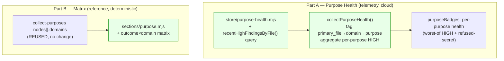

# Plan: Dashboard "Purpose" view — v3 (per-domain health + outcome×domain matrix)

- **Date**: 2026-05-31
- **Status**: Complete
- **Author**: Claude + Louis
- **Audit trail**: `/audit-plan` — GPT-5.5 R1(3H/5M)→R2(2H/2M)→R3(1H/2M), all fixed (error-handling, per-signal availability, primary_file path+sensitive-skip contract, matrix a11y, honesty/reconciliation). Gemini gate **APPROVE**, coherence **Strong**, 0 wrongly-dismissed; its 1 advisory (null-guard before String(file)) folded in.
- **Scope**: full-stack (cloud telemetry extension + a deterministic reference renderer/CSS addition)
- **Target domain(s)**: `dashboard` (single domain; `ruleCount=47`)
- **Builds on**: v2 (shipped `5d5bd13`); two dashboard-contained items from
  [dashboard-purpose-view-v2.md §11](../plans/dashboard-purpose-view-v2.md).

> **Neighbourhood considered**: target domain `dashboard`. Part A extends the v2
> `purpose-health` store+collector; Part B is a renderer addition to the v1/v2
> `purpose` section reading data the collector already returns. Reuse, no new
> rendering path. The `shared-lib` catch-all re-tagging from §11 is **explicitly
> excluded** (global arch-memory blast radius — separate effort).

---

## 1. Context Summary

Two items that *finish* what v2 started, both dashboard-contained:

- **Part A — per-domain health attribution (cloud).** v2's Purpose Health
  attributes only `preserve-trust-safety`; the other 7 purposes render
  `na`/"repo-wide only". Light them up by attributing recent HIGH audit
  findings to purposes via `audit_findings.primary_file → tagDomain → domain →
  purpose`. This is the honest weakness flagged in the v2 persona verdict.
- **Part B — outcome×domain matrix (deterministic).** A validation grid
  (purposes × mapped domains) so a reader can see the whole membership at once.

**What exists (Phase 1 re-read):**
- [store/purpose-health.mjs](../../scripts/lib/store/purpose-health.mjs) — `getPurposeHealth(repoId,{windowDays})` → 3 repo-scoped `count(*)::int` reads. **Part A adds a 4th** (HIGH findings grouped by `primary_file`).
- [collect-telemetry.mjs](../../scripts/lib/dashboard/collect-telemetry.mjs) `collectPurposeHealth` — owns the taxonomy join; assembles `purposeBadges`. **Part A** extends the badge classification.
- [collect-purposes.mjs](../../scripts/lib/dashboard/collect-purposes.mjs) — already returns `nodes[].domains` (each purpose's domains). **Part B reuses this as-is** — no collector change.
- [sections/purpose.mjs](../../scripts/lib/dashboard/sections/purpose.mjs) — **Part B** appends a collapsed matrix `<details>`.
- [domain-tagger.mjs](../../scripts/lib/symbol-index/domain-tagger.mjs) — `tagDomain`/`computeTargetDomains` + `loadDomainRules` (reused by Part A).
- `audit_findings(run_id→audit_runs, severity HIGH|MEDIUM|LOW, primary_file nullable, created_at)` — verified `supabase/migrations/20260330063355_learning_store.sql`.

**Reused vs new:** ~95% reuse. New = 1 store query + classification logic (Part A); 1 renderer block + CSS (Part B). No new files, no schema migration.

---

## 2. Proposed Architecture



### Part A — per-domain health attribution

**Store** — add one read to `getPurposeHealth` (repo-scoped, windowed, `::int`):
```sql
-- HIGH findings grouped by file, this repo, in the window. primary_file is
-- NULLABLE → its bucket is the "unattributable" count.
SELECT f.primary_file AS file, count(*)::int AS n
  FROM audit_findings f JOIN audit_runs r ON f.run_id = r.id
 WHERE r.repo_id = $1 AND f.severity = 'HIGH'
   AND f.created_at >= now() - ($2 * interval '1 day')
 GROUP BY f.primary_file;
```
Returned as `highByFile: Array<{file: string|null, n: number}> | null` (null
when the query fails — degrades like the others). The existing repo-wide
`recentHighFindings` scalar stays (the headline total).

**Collector** (`collectPurposeHealth`) — owns the attribution join (#1, #5).
The whole attribution block runs inside a try/catch; **(H1)** if
`loadDomainRules`/`tagDomain`/validation throws, it sets
**`attributionAvailable = false`** (a `detail` note + redacted stderr log) and
passes that to the classifier — it NEVER crashes the section. Critically, this
is NOT "every badge → na": the classifier (step 3) degrades only the
HIGH-attributed purposes to `na`, while `preserve-trust-safety` is STILL judged
on its independent `refusedSecrets` signal. (`refusedSecrets` comes from a
separate query unaffected by a tagging failure.) Steps:

1. Load rules once (`loadDomainRules(root)`); build `domain → purposeIds` from
   the SAME validated `domainPurposes`.
2. **(H3) `primary_file` path contract** — `primary_file = f._primaryFile ||
   f.section`, so it is USUALLY a repo-relative POSIX path but MAY be a section
   heading (the `|| f.section` fallback), i.e. not a path. **Guard null FIRST**
   (Gemini-p1): `if (file == null) → unattributable` — do NOT `String(null)`
   (that yields the literal `"null"`, which is unattributable only by accident).
   Otherwise normalize: `String(file).replace(/\\/g,'/').replace(/^\.\//,'')`.
   - **(H2) Sensitive-path skip FIRST** — run the normalized value through the
     repo's canonical classifier (`classifyPath` from
     [lib/sensitive-paths.mjs](../../scripts/lib/sensitive-paths.mjs)); if it is
     `sensitive` (`.env`, keys, `secrets/`, …), do NOT tag/attribute it — count
     it as `unattributable`. A finding on a sensitive file never influences a
     per-purpose tally. (See Security Considerations.)
   - **(M1) No separate path-vs-non-path detection** — we do NOT try to decide
     "is this a path". We just `domain = tagDomain(normalized, rules)`;
     `tagDomain` returns no domain for anything matching no rule (a `null` file,
     a `section`-name fallback like "Structure", a path outside the rule set),
     and EVERY no-match → `unattributable`. A matched `domain` with ≥1 purpose →
     add `n` to each of those purposes' `highTally`; a matched domain mapping to
     NO purpose → `unattributable`.
3. **Pure classifier** — `classifyPurposeBadges({purposes, domainCountByPurpose,
   highTally, refusedSecrets, attributionAvailable})` (exported via `__test__`,
   unit-tested directly). **(H1-r2) Each signal is judged on ITS OWN availability
   — never conflate "unavailable" with "healthy":**
   - **`preserve-trust-safety`** is judged on BOTH signals independently:
     `at-risk` if (`attributionAvailable` AND `highTally>0`) OR (`refusedSecrets
     !== null` AND `refusedSecrets>0`). `ok` only if at least one signal is
     available AND no available signal fired. `na` ONLY if BOTH are unavailable
     (`attributionAvailable===false` AND `refusedSecrets===null`). The reason
     names which signals were read. So a failed HIGH-by-file query does NOT
     blank trust-safety when its refused-secret signal is fine.
   - **Every other purpose** is HIGH-attributed only:
     - `attributionAvailable===false` → `na` (HIGH unattributable this run).
     - else if the purpose has **zero mapped domains** (`domainCountByPurpose[p]
       === 0`) → `na` ("no domains to assess") — NOT a false `ok`.
     - else `highTally[p] > 0` → `at-risk`, else `ok`.
   - `scope` is `purpose-specific` whenever the badge is `ok`/`at-risk`;
     `repo-wide-only` when `na`.
4. `reason`: `at-risk` → `"N recent HIGH in its domains"` (+ `" · M refused secrets"` for trust-safety); `ok` → `"no HIGH findings in its domains (30d)"`.

**(M1) Honesty — per-purpose tallies do NOT sum to the repo total** (corrected):
a HIGH in a multi-purpose domain counts toward EACH such purpose, so the
per-purpose tallies are a "touches this outcome" signal and deliberately
**over-count** vs the repo total. The authoritative totals are the repo-wide
`recentHighFindings` scalar + the `unattributable` count (null-file /
non-path / no-purpose-domain findings) — surfaced explicitly so nothing is
silently dropped. The plan makes no claim that the buckets sum to the total.

### Part B — outcome×domain matrix (deterministic, reference)

**Home decision (Gestalt / cognitive-load, Nielsen #8 minimalism):** NOT a new
tab — there are already 6 reference tabs; a 7th for one grid is tab bloat.
Instead a **collapsed `<details>` "Outcome × domain matrix"** appended to the
existing Purpose tab, below the hygiene region. Progressive disclosure: power
users open it; everyone else isn't taxed.

**Data:** built entirely from `purposes.nodes` (each node already carries its
`domains[]`). Rows = purposes in declaration order; columns = the sorted union
of all mapped domain ids; cell = "delivered" when the domain ∈ that purpose's
domains. No collector or schema change (#1 — reuse the single source).

**Markup (a11y — a real data grid):**
```html
<details class="purpose-matrix"><summary><h3 id="purpose-matrix-title">Outcome × domain matrix</h3></summary>
  <div class="table-wrap matrix-scroll" role="group" aria-labelledby="purpose-matrix-title" tabindex="0">
    <table>
      <thead><tr><th scope="col">Purpose</th><th scope="col">{domain}</th>…</tr></thead>
      <tbody>
        <tr><th scope="row">{purpose label}</th>
            <td>✓<span class="visually-hidden"> delivers</span></td>  <!-- delivered -->
            <td></td>                                                  <!-- not delivered (empty) -->
        …</tr>
      </tbody>
    </table>
  </div>
</details>
```
- `<th scope="col">` / `<th scope="row">` make it screen-reader navigable — a SR
  announces "{purpose}, {domain}, ✓ delivers" from the header association.
- **(M2) Cell state is real text** (`✓` + a `.visually-hidden` " delivers"
  span), NOT `aria-label` on a generic non-interactive `<span>` (which isn't
  reliably announced). Never colour-only (WCAG 1.4.1). A non-membership cell is
  an empty `<td>` — the header association still gives it context.
- The wide grid scrolls horizontally inside `.table-wrap`; the scroll container
  is made **keyboard-focusable** (`tabindex="0"` + `role="group"` +
  `aria-labelledby`) so keyboard users can scroll it — addressing the v2-audit
  `.table-wrap` focusability note for THIS new wide table specifically (without
  globally changing the shared class).
- All domain ids / labels escaped via `ui.escapeHtml`.
- Deterministic: rows in declaration order, columns sorted; folded into the
  existing reference `sourceHash` (Part B adds no nondeterminism).

---

## 3. UX Design Decisions

- **Matrix as progressive disclosure** (#33 cognitive load) — collapsed by
  default; the Purpose tab's primary read (outcomes + invariants) is unchanged.
- **Health honesty preserved** (#19) — lighting up all badges is only honest
  because each is now backed by a real per-domain query; the `unattributable`
  count prevents the "everything's ok" illusion when findings can't be placed.
- **Colour never alone** (#41, WCAG 1.4.1) — health badges already pair glyph +
  text; matrix cells use a real `✓` glyph + a `.visually-hidden` " delivers" span (NOT aria-label on a span), empty cells stay empty — the `<th scope>` headers carry the context.
- **Footnote update** — the v2 "only trust-safety attributed" note becomes
  "per-purpose health = recent HIGH findings in each purpose's domains;
  trust-safety also reflects refused secrets; N HIGH were unattributable."

### ASCII wireframe (additions)

```
TELEMETRY → Purpose Health
  3 recent HIGH · 1 plan failing P0/P1 · 0 refused · 1 HIGH unattributable
  Deliver quality audits      🟠 at risk   2 recent HIGH in its domains
  Preserve trust & safety     🟢 ok        no HIGH in domains · 0 refused
  Platform & tooling          🟠 at risk   1 recent HIGH in its domains
  …

REFERENCE → Purpose  (bottom, collapsed)
  ▶ Outcome × domain matrix
      Purpose                 audit-orch  findings  shared-lib  …
      Deliver quality audits      ✓          ✓
      Platform & tooling                                 ✓
      …
```

---

## 4. Technical Architecture (frontend)

- **purpose-health.mjs** — `default({src, purposeHealth}, ui)` unchanged shape;
  the badges just carry richer health/scope now. New repo-wide line item:
  `unattributable`.
- **purpose.mjs** — a `renderMatrix(nodes, esc)` helper appended after hygiene;
  pure string builder; no imports.
- **CSS** — `.purpose-matrix`, `.matrix-scroll` (focus-visible outline + max
  overflow), cell markers — on existing tokens; no new colour primitives.
- **State**: stateless renders. No client JS change (matrix is static; the
  `<details>` is native).

---

## 5. State Map

| Component | State | Render |
|---|---|---|
| Purpose Health badge | `highByFile` available, purpose has HIGH | `at-risk` + "N recent HIGH in its domains" |
| Purpose Health badge | available, no HIGH for its domains | `ok` + "no HIGH in its domains (30d)" |
| Purpose Health badge | `highByFile == null` (query failed) | `na` (attribution unavailable) — repo-wide summary still shows the scalar |
| Repo-wide summary (M4 — `unattributable` render contract) | attribution available, `unattributable === 0` | show "0 HIGH unattributable" (reassuring transparency — the attribution IS complete) |
| Repo-wide summary | attribution available, `unattributable === N` (>0) | show "N HIGH unattributable to a purpose" |
| Repo-wide summary | attribution unavailable (`highByFile == null` / threw) | `unattributable` is `null` → OMIT the line entirely (showing "0" would falsely imply complete attribution) |
| Matrix | purposes present | collapsed `<details>` grid; rows×cols from nodes |
| Matrix | no purposes (missing-optional purpose tab) | not rendered (the Purpose tab already shows its empty panel) |
| Matrix | a purpose with zero domains | its row renders all-empty cells (valid) |

---

## 6. Sustainability Notes

- **Attribution seam** — `tagDomain(primary_file)` is the join. If finer domain
  rules land later (the excluded §11 item), attribution sharpens automatically
  with no code change. Multi-purpose double-counting is documented intent.
- **Matrix scales by data** — columns = mapped domains (currently ~20). Beyond
  ~40 the horizontal scroll covers it; if it ever needs transpose/virtualise,
  that's a renderer-local change (the data shape is unchanged).
- **Determinism** — Part B adds only sorted/ordered reference output; a build-
  smoke test keeps the two-build `sourceHash` identical.
- **No schema migration / no new file** — lowest-surface way to finish §11.

---

## 7. File-Level Plan

| File | Disposition | Change | Why |
|---|---|---|---|
| `scripts/lib/store/purpose-health.mjs` | edit | add `highByFile` read (pinned SQL above) to `getPurposeHealth`; same `repo_id`/window/`::int` discipline; null on failure | Part A data (#16) |
| `scripts/lib/dashboard/collect-telemetry.mjs` | edit | in `collectPurposeHealth`: `loadDomainRules`; normalize+tag each `highByFile.file → domain → purposes` (try/catch → na on throw, H1); aggregate per-purpose HIGH; add `unattributable` to `repoWide`. Extract a PURE `classifyPurposeBadges({purposes, domainCountByPurpose, highTally, refusedSecrets, attributionAvailable})` (worst-of, null-safe) and export it via `__test__` (L1) | Part A join (#1, #19) |
| `scripts/lib/dashboard/schema.mjs` | edit | add `repoWide.unattributable` (count.nullable, optional) to the `purposeHealth` telemetry block; widen nothing else (badge enum already covers at-risk/ok/na) | boundary validation (#12, back-compat) |
| `scripts/lib/dashboard/sections/purpose-health.mjs` | edit | render the `unattributable` line; update the footnote (no longer "only trust-safety") | Part A view |
| `scripts/lib/dashboard/sections/purpose.mjs` | edit | append `renderMatrix(nodes, esc)` — collapsed `<details>` `<table>` with `<th scope>`, escaped, `✓` + visually-hidden text (no span aria-label), focusable scroll region | Part B (#27, a11y) |
| `scripts/lib/dashboard/assets/dashboard.css` | edit | `.purpose-matrix`, `.matrix-scroll` (focus-visible, overflow-x), `.visually-hidden` (SR-only cell text — clip-rect pattern), cell markers — existing tokens | Part B style (#40, a11y) |
| `tests/dashboard-purpose-health.test.mjs` | edit | per-domain attribution: a HIGH in a purpose's domain → that purpose `at-risk`; null-file/no-purpose → `unattributable`; worst-of for trust-safety; `highByFile==null` → `na`; the new SQL is repo-scoped+`::int`+windowed | Part A regression |
| `tests/dashboard-purpose.test.mjs` | edit | matrix render: `<th scope="col">`/`<th scope="row">`, a cell marked for a known membership, escaping, focusable scroll region present | Part B regression |

---

## 8. Risk & Trade-off Register

| Risk | Lk | Impact | Mitigation |
|---|---|---|---|
| `primary_file` → domain via the `shared-lib` catch-all over-attributes to `platform-foundation` | Med | Low | Honest by the same v2 logic; the matrix + the `unattributable`/coverage context make concentration visible; finer rules (excluded) is the real fix |
| Lighting up all badges implies more precision than exists | Med | Med | `unattributable` count + the footnote; `ok` strictly means "no HIGH in its domains", not "audited & clean" — reason string says exactly that |
| Multi-purpose domain double-counts a HIGH across purposes | Low | Low | Documented as "touches this outcome" (non-exclusive), matching how invariants already attach in v1/v2 |
| Wide matrix unusable on mobile | Med | Low | Horizontal scroll in a focusable region; collapsed by default; it's a power-user validation aid, not a primary flow |
| New SQL perf (M3) | Low | Low | Same shape as the EXISTING `recentHighFindings` scalar (already shipped) — just adds `GROUP BY primary_file`. Indexes: `audit_runs.repo_id` is indexed; note a Postgres FK does NOT auto-create an index, so `audit_findings.run_id` may be unindexed (the join scans this repo's findings). No dedicated `(severity, created_at)` index, so it filters `audit_findings` for the repo's runs in the 30-day window — acceptable for an INFREQUENT build-time query (dashboard build, not a request path; mirrors `getSecurityStats`). If finding volume ever makes it slow, add a partial index `(repo_id via run, severity, created_at)` then — not needed for v1 of this feature. |
| Determinism regression from matrix | Low | Med | Sorted columns + declaration-order rows; two-build sourceHash test |

**Deferred (v4):** finer domain rules (global arch-memory re-tag); health
history/sparkline; reference-side static health placeholder; severity tiers
beyond at-risk (e.g. `failing` from failing plan-verification attributed by
plan→domain once that join is trustworthy).

---

## 8.5 Security Considerations

The Part A attribution flow reads `audit_findings.primary_file` for the repo.
Two boundaries:

- **No path egress to the page** — the rendered Purpose Health section shows
  ONLY per-purpose counts + purpose labels + the repo-wide totals. A
  `primary_file` value is NEVER written into the HTML (it's consumed in-process
  for `tagDomain` and discarded). So there is no sensitive-path *display*
  surface, even before the skip below.
- **Sensitive-path skip (defence in depth)** — before tagging, each normalized
  `primary_file` passes `classifyPath` (the canonical
  [lib/sensitive-paths.mjs](../../scripts/lib/sensitive-paths.mjs)); a
  `sensitive` classification routes the finding to `unattributable` and it never
  touches a per-purpose tally. This keeps the feature consistent with the repo's
  sensitive-path discipline even though no path is rendered.
- **Repo scoping** — every query (including the new `highByFile`) filters
  `repo_id = $1` on the shared multi-tenant store; a string-match test pins it.

No external API egress is introduced; all reads are the in-process pg pool.

---

## 9. Testing Strategy

- **Part A (collector, fixture/mocked counts):** a HIGH whose `primary_file`
  tags to a purpose's domain → that purpose `at-risk` with the right reason; a
  null-`primary_file` HIGH and a HIGH whose domain maps to no purpose →
  `unattributable`; trust-safety worst-of (refusedSecrets>0 OR HIGH>0);
  `attributionAvailable===false` → all purposes `na`; trust-safety worst-of with
  `refusedSecrets===null` (HIGH-only + "signal unavailable" note). Tested by
  calling the named pure helper `classifyPurposeBadges({purposes, highTally,
  refusedSecrets, attributionAvailable})` directly (exported via
  `collect-telemetry.mjs` `__test__`).
- **(M2) Part A (collector failure modes):** with a stubbed `getPurposeHealth`
  return — (a) a sensitive `primary_file` (e.g. `.env`) → counted
  `unattributable`, never in a per-purpose tally; (b) `loadDomainRules`/tag
  throwing → attribution `na` for HIGH-based purposes, section still renders
  (status `ok` with a detail note, NOT a crash); (c) a non-path `f.section`
  fallback → `unattributable`.
- **Part A (store):** string-match the new query is repo-scoped (`r.repo_id =
  $1`), windowed, `::int`, `GROUP BY` (extends the v2 repo-scoping test).
- **Part B (renderer, pure):** matrix emits `<th scope="col">`+`<th
  scope="row">`; a known membership cell shows `✓` + visually-hidden " delivers", a non-membership
  cell isn't; domain ids escaped; the scroll region has `tabindex="0"` +
  `aria-labelledby`.
- **Determinism:** two `reference` builds → identical `sourceHash` (matrix adds
  no nondeterminism).
- **Build smoke:** `telemetry` shows ≥2 purpose-specific badges now; `reference`
  shows the collapsed matrix.
- **Live (click-test + persona):** does the lit-up health read honestly; is the
  matrix a useful at-a-glance validation for a system designer.

---

## 10. Acceptance Criteria (Playwright-verifiable)

- [P1] [state] Purpose Health attributes per-purpose HIGH, not just trust-safety.
  - Setup: telemetry build with cloud + seeded HIGH findings whose files tag to a purpose's domains.
  - Assert: ≥2 rows carry a non-`n/a` badge (`getByText(/at risk|ok/)`), and at least one reason reads "recent HIGH in its domains".
- [P1] [text] Unattributable findings are surfaced, not dropped.
  - Setup: a HIGH with null `primary_file` (or a no-purpose domain).
  - Assert: the repo-wide summary shows an "unattributable" count.
- [P2] [state] Attribution-unavailable degrades to n/a, not a false "ok".
  - Setup: telemetry build with the by-file query failing (cloud off → whole section already empty; simulate at unit level).
  - Assert: badges read `n/a`, not `ok`.
- [P0] [a11y] The matrix is a screen-reader-navigable grid.
  - Setup: open the "Outcome × domain matrix" `<details>` in the Purpose tab.
  - Assert (Playwright-native, NO axe-core dependency — M5): a `getByRole('table')`; its `th[scope="col"]` set includes the domain names and its `th[scope="row"]` set includes the purpose labels; every data cell is a `<td>` (headers are `<th>`). (An axe-core scan is OPTIONAL extra signal where the runner already has `@axe-core/playwright`; it is NOT required to pass this criterion, and no new dependency is added.)
- [P1] [interaction] The matrix is reachable and collapsible.
  - Setup: Purpose tab active.
  - Assert: a `getByRole('group', { name: /outcome × domain matrix/i })` (or the `<summary>` toggling a region); expanding reveals the table.
- [P1] [state] A known membership is marked; a non-membership is not.
  - Setup: matrix open; a purpose+domain pair known to map (and one that doesn't).
  - Assert: the mapped cell exposes a "delivers"/`✓` marker; the unmapped cell does not.
- [P2] [responsive] The wide matrix scroll region is keyboard-focusable.
  - Assert: the scroll container has `tabindex="0"` and an accessible name (`aria-labelledby`).

---

## 11. Out of Scope (v4 / future)

- Finer domain rules to de-concentrate the `shared-lib` catch-all (global
  arch-memory re-tag — separate effort, its own `arch:refresh` + verification).
- Health history / trend sparkline.
- `failing` tier from `plan_verification_items` attributed per-purpose (needs a
  trustworthy plan→domain→purpose join).
- Reference-side static health placeholder linking to the live telemetry badge.
- Matrix transpose / virtualisation for very large domain counts.
