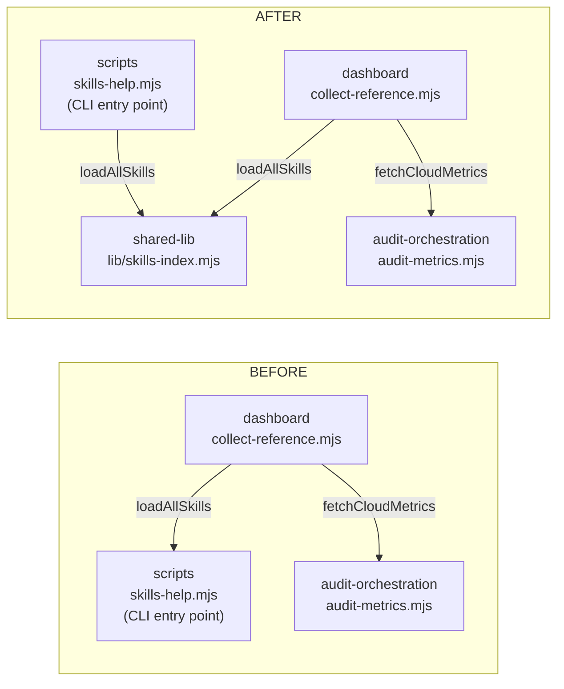

# Plan: Resolve the `dashboard → scripts` layering edge (skills-help extraction)

- **Date**: 2026-08-01
- **Status**: Complete
- **Author**: Claude + Lbstrydom
- **Scope**: backend
- **Supersedes**: item 1 of [`refactor-architecture-debt-remainder-2026-07.md`](refactor-architecture-debt-remainder-2026-07.md)
- **Closes**: tech-debt topicIds `7cd98d98`, `dafaf6c8`, `1f6dd42d`
- **Target domain(s)**: `dashboard`, `scripts`, `shared-lib`
- ⚠ **Cross-domain work** — touches 3 domains; the boundary crossing IS the subject, not a side effect.
- ⚠ **Untagged paths**: `.audit-loop/domain-map.json` — matches no rule in the domain map (it is the map). No action.

---

## Verdict

**Option (a) — extract to a neutral `shared-lib` module.** Rejecting (b) and (c) on
evidence, not preference. The one-line version: the `"scripts"` entry in
`allowedDeps.dashboard` was never an adjudication — it was a ratchet baseline
that swallowed these three findings *after* they were raised — and that single
import is the **only** thing producing the edge, so extracting it lets the grant
be **deleted outright** rather than narrowed.

---

## 1. Context Summary

Detected scope **backend**, stack **js-ts**, no Python. Pure module-boundary work:
no UI, no schema, no LLM surface.

### Code Trace

The evidence for every claim below, re-verified 2026-08-01 against current source
(the brief's facts held, plus three that change the decision):

| # | Claim | Evidence |
|---|---|---|
| 1 | The import exists, unchanged | [`collect-reference.mjs:15`](scripts/lib/dashboard/collect-reference.mjs) — `import { loadAllSkills } from '../../skills-help.mjs'`; consumed once at [`:441`](scripts/lib/dashboard/collect-reference.mjs) |
| 2 | `loadAllSkills` has **exactly one** non-test importer | Repo-wide grep: `collect-reference.mjs` + `tests/skills-help.test.mjs`. Nothing else. |
| 3 | `skills-help.mjs` tags `scripts`; `scripts/lib/*.mjs` tags `shared-lib` | `tagDomain()` (the repo's own resolver) run against `domain-map.json` rules |
| 4 | **This import is the SOLE producer of `dashboard → scripts`** | Only two `../../*.mjs` imports exist under `scripts/lib/dashboard/**`: `skills-help.mjs` (→ `scripts`) and `audit-metrics.mjs` (→ **`audit-orchestration`**, rule 24 `scripts/audit-*.mjs`, already separately declared). `sections/` has no `../../` imports. |
| 5 | The observed graph agrees | `.audit-loop/domain-deps-observed.json` → `deps.dashboard` includes `scripts`; only `cross-skill-bridge`, `dashboard`, `tests` do |
| 6 | `dashboard` **already declares** `shared-lib` | `allowedDeps.dashboard = [arch-memory, audit-orchestration, learning-store, nav-audit, plan, **scripts**, **shared-lib**, stores, visual-audit]` |
| 7 | `scripts` **already declares** `shared-lib` | `allowedDeps.scripts` includes `shared-lib` — the CLI's new import needs no map change |
| 8 | The three debt entries are one edge, three hashes | All three carry `affectedFiles: [collect-reference.mjs, skills-help.mjs]`, `pass: Architecture`, `sourceName: gpt-5.6-terra`; deferred 07-15, 07-15, 07-16 by three different runs |
| 9 | **The declaration post-dates the findings** | `_comment_allowedDeps` records the baseline as domain-map-reconciliation **Phase C, 2026-07-17** |
| 10 | …and disclaims itself | That same comment opens: *"BASELINE, NOT ENDORSEMENT … Set to the OBSERVED graph"* |
| 11 | Nothing flags a stale `allowedDeps` entry | `computeDeadIntent` ([`adapter-contract.mjs`](scripts/lib/arch-intent/adapter-contract.mjs)) computes dead **domains** (rules owning zero paths), not dead **edges**; `tests/domain-map-dead-intent.test.mjs` asserts only that |
| 12 | The precedent has a test file already | [`tests/layering-contracts.test.mjs`](tests/layering-contracts.test.mjs) holds L1–L4 from `_adjudication_2026_07_31` |

**Patterns reused vs new**: no new pattern. This is **L5** in the existing
layering series — same map file, same test file, same three assertion shapes
(module resolves to `shared-lib` / old home no longer exports it / adjudication
recorded).

### Neighbourhood considered

Consultation returned **`precedent` / `above-floor-cluster`** on
`parseSkill` (`scripts/skills-help.mjs:79`, sim 0.79) and a `review` band on
`loadAllSkills` (`:199`). Both are the symbols this plan **moves**. The band is
correctly firing on the code being relocated, not on a duplicate — **decision:
move, do not write a sibling.** No competing implementation exists: the only
other skills-parsing module,
[`scripts/lib/skill-refs-parser.mjs`](scripts/lib/skill-refs-parser.mjs), parses
a different artifact (see §2.3).

---

## 2. Proposed Architecture

### 2.1 The edge, before and after



`dashboard → scripts` disappears. `dashboard → shared-lib` and
`scripts → shared-lib` both already exist and are already declared (trace #6, #7).
**Net effect on the intent layer: minus one grant, plus zero.**

### 2.2 Why (a), and why not (b) or (c)

**(c) — "the debt-generation path is wrong"** is rejected first, because if the
finding were a measurement artifact the other two options would be moot. It
isn't. The finding says *a library module imports an executable entry point* —
which is **true**, **specific**, and **fixable**, and the entry point genuinely
carries CLI concerns the collector does not want (`parseArgs`, `ArgvError`,
`assertRepoRoot`, `HELP_TEXT`, three renderers, a `main()`). Compare
`_adjudication_2026_07_20`'s `supabase -> stores`, which *was* correctly called
FABRICATED and fixed in the extractor. This is not that shape.

*What (c) is right about, narrowly*: three entries for one edge is genuine
re-raise churn, and all three deferral rationales are **authorship-based**
("unrelated to this plan's 13 files", "pre-existing … repo-wide noise") — the
exact failure mode AGENTS.md names ("*Scope is decided by impact, not
authorship*"). But that is a known, separately-owned class (semantic-suppress +
the memory-health recurrence trigger). It does not make this finding false, and
it is **out of scope** here.

**(b) — accept-by-declaration** is rejected because *the declaration is not an
adjudication*. This is the decisive fact, and it is the one the original triage
missed in the other direction:

- The three findings were raised **2026-07-15 / 07-15 / 07-16**.
- `"scripts"` entered `allowedDeps.dashboard` on **2026-07-17**, in the Phase-C
  baseline that set `allowedDeps` **to the observed graph wholesale** so the
  check would become a ratchet.
- That baseline's own comment leads with **"BASELINE, NOT ENDORSEMENT."**

So the edge is *declared* but was never *decided*. Writing an
`_adjudication_2026_08_01` block affirming it would convert a mechanical
snapshot into recorded intent — i.e. manufacture an endorsement the map
explicitly disclaims. The `_adjudication_2026_07_20` blocks are the honest
counter-example: each one adjudicates an edge **on the merits** and even records
what it makes worse (`_debt_4`: declaring `brainstorm → requirements` *closes a
cycle*, recorded as debt rather than hidden). Option (b) has no such merits
argument available — only "it is already in the list."

**The L4 precedent applies, and it points at extraction.**
`_adjudication_2026_07_31` chose RE-TAG over DECLARE for `install.mjs → install`
with this reasoning: *"Declaring tests -> root-scripts would have granted every
test module access to the whole current and future root-scripts domain to
express one narrow relationship; re-tagging removes the edge instead."*

Identical shape here — `"scripts"` grants `dashboard` the whole current and
future root-CLI-entry-point domain (~60 scripts) to express one import of one
function. One difference, and it makes the case **stronger**, not weaker: L4
faced a *proposed* declaration and declined it; here the over-broad grant is
already standing and can be **removed**. And because of trace #4 the removal is
total — this is not "narrow the grant", it is "delete it", since nothing else in
`dashboard` reaches the `scripts` domain.

The one legitimate objection to (a) — *"the grant is harmless, dashboards are
read-model consumers by construction"* (the `dashboard -> plan` reasoning from
`_adjudication_2026_07_20`) — does not carry, because that entry blesses reading
from a **producer module** (`parsePlanStatus` in `lib/plan-status.mjs`). It is
precisely the pattern this import breaks.

### 2.3 Where it goes — `skills-index.mjs`, not `skill-refs-parser.mjs`

The brief asked whether `skill-refs-parser.mjs` is the right home or merely the
nearest. It is the **nearest**. Both tag `shared-lib`, so the domain outcome is
identical and the choice is purely cohesion:

| | `skill-refs-parser.mjs` (exists) | `skills-index.mjs` (new) |
|---|---|---|
| Parses | the `## Reference files` **table** in a SKILL.md body, and `summary:` frontmatter of **reference** files | the **SKILL.md frontmatter** → name / oneLiner / triggers / usage |
| Contract doc | `docs/reference/skill-reference-format.md` | none — shape is the frontmatter itself |
| Consumer | `check-skill-refs.mjs` (the `skills:check` lint) | `skills-help.mjs` CLI + dashboard reference tab |
| Question answered | "is this skill's reference index well-formed?" | "what skills exist, and what do they do?" |

Different input, different consumer, different question. Merging them makes
`skill-refs-parser.mjs` the skills grab-bag and drags a lint dependency into the
dashboard's import closure. **New module.**

**What moves**: `parseSkill` and `loadAllSkills` only — verbatim, and they are
already pure (`fs`, `path`, `yaml`; no `ArgvError`, no `assertRepoRoot`).
**What stays**: `parseArgs`, `filterBySearch`, the three renderers, `HELP_TEXT`,
`main`, `__test__`. `filterBySearch` is pure but is a CLI search concern with
exactly one caller (`main`) and no second consumer — moving it would be
speculative.

### 2.4 No re-export — the repo already ruled on this

`skills-help.mjs` **imports and uses**; it must **not** re-export. This is not a
judgment call: [`tests/layering-contracts.test.mjs:42`](tests/layering-contracts.test.mjs)
(L1) asserts `CoverageSchema` is gone from its old home, commented *"a re-export
here lets a consumer silently recreate the stores -> arch-memory edge."* A
re-export would leave `../../skills-help.mjs` a working import path for
`loadAllSkills` and the whole exercise reversible by one careless line.

Consequence: `tests/skills-help.test.mjs` must be split, not left pointing at the
old module (§7 Phase 3).

### 2.5 Thread the root at the call site (R1/M3)

`collectReference` computes `const root = process.cwd()`
([`:434`](scripts/lib/dashboard/collect-reference.mjs)) and threads it to **every**
sibling collector — `discoverPlans(root)` `:457`, `collectArchitecture(root)` `:471`,
`collectCli(root)` `:481`, `collectNav(root)` `:493` — while calling `loadAllSkills()`
**bare**. It is the lone unthreaded collector, and promoting its callee to a shared seam
without fixing that would ship the inconsistency into `shared-lib`.

**Fix**: `loadAllSkills(path.join(root, 'skills'))`. The parameter is a *skills
directory*, not a repo root (`loadAllSkills(skillsRoot = 'skills')` → `path.resolve(...)`),
so passing `root` directly would be a bug. Zero behaviour change today (cwd === root);
the point is that the dependency becomes visible at the call site.

**Not doing** (deliberated to LOW): making the root a *required* parameter and re-rooting
`parseSkill`'s returned `path`. The explicit-param-with-cwd-default shape already matches
this file's own convention (`discoverPlans(root = process.cwd())` `:68`); `parseSkill`'s
`path` is **rendered by the dashboard**, so re-rooting changes user-visible output; and no
current consumer needs it. Recorded as a named assumption in §4.

### 2.6 Key design decisions

| Decision | Principles |
|---|---|
| Move rather than duplicate — the `precedent` band names the symbols being relocated | #1 DRY, #5 Single Source of Truth |
| New module, not the adjacent parser — different input/consumer/question | #3 Modularity, #2 SRP |
| No re-export from the CLI — the edge must be *unreachable*, not merely unused | #20 Long-Term Flexibility |
| Delete `"scripts"` from `allowedDeps.dashboard`, don't just stop using it | #5 — a stale grant is a second, false source of truth about intent |
| Add the assertion to the existing L1–L4 file rather than a new test module | #1 DRY, #3 |
| Move the two functions **verbatim** | #18 Backward Compat — a behaviour change here is unverifiable noise |
| Thread the root at the call site, but do **not** make it required (§2.5) | #19 Observability (the dep becomes visible) vs. YAGNI — no consumer needs the redesign |

---

## 3. Design Right-Sizing (AGENTS.md gate)

New structure is on the table (one new module, one intent-layer edit), so the
gate fires.

- **Band-aid extreme** — option (b): write an `_adjudication_2026_08_01` note,
  close the three entries, change no code. Cost is one paragraph today and an
  **unbounded grant forever**: every future `dashboard → any root CLI` import is
  pre-blessed and lands silently, and the note itself misrepresents a ratchet
  snapshot as a considered decision. This is the "*defer because the real fix is
  harder*" cliff — except here the real fix is *smaller* than the note.

- **Over-engineered extreme** — introduce a first-class **layer** concept in the
  domain map: a `layer: entrypoint|library|domain` field on all 71 rules, a
  repo-wide lint forbidding library→entrypoint edges, applied across every
  domain. No current requirement calls for it: after this change the ratchet
  *already* catches the general case (any new `dashboard → scripts` edge fails an
  undeclared-edge check), and no second instance of this class is open. Building
  a taxonomy to police one import is the abstraction-without-a-requirement cliff.

- **Chosen** — move two pure functions (~50 lines, verbatim), retarget one import
  line, delete one array entry, add one test assertion to a file that already
  holds four of the same shape.

**Why this is the smallest thing that is a true function of the problem**: the
problem is not the import in isolation — it is *the grant that exists solely to
cover the import*. Trace #4 establishes those are the same object: remove the
import and the grant covers nothing; remove the grant and the import is a
violation. So the smallest honest change is the one that retires **both** in one
step, which is what (a) does and what neither (b) (keeps both) nor (c) (keeps
both, edits the measurement) does. Everything the plan adds beyond the move —
one assertion, one map deletion — exists because trace #11 shows nothing else
would catch a regression.

### Manual vs scripted

**Manual.** Two functions, three import sites, one array entry. Far below the
~5-regular-edits threshold, and the test split is judgment-heavy (which cases
follow the functions, which stay with the CLI). No codemod.

---

## 4. Sustainability Notes

- **Assumption that could change**: that `dashboard` needs nothing else from a
  root CLI. If a second such need appears, it arrives as a **loud** undeclared-edge
  failure with the grant gone — which is the point. Under (b) it would arrive silently.
- **Seam built in**: `skills-index.mjs` becomes the single answer to "what skills
  exist?" — any future consumer (a fit-check, a manifest builder, another
  dashboard tab) imports it without re-opening this question.
- **Named assumption — the cwd contract** (R1/M3): `loadAllSkills` resolves its
  skills directory relative to `process.cwd()`, and `parseSkill` returns a
  `process.cwd()`-relative `path` that the dashboard **renders**. Both production
  consumers run from the repo root (the CLI additionally asserts it via
  `assertRepoRoot`), so this holds today, and §2.5 makes it visible at the call
  site rather than implicit. **Revisit trigger** — a third consumer that does not
  run from repo root, *or* a need for the rendered `path` to be root-relative.
  Then make the root required **and** re-root `parseSkill` together, as one
  deliberate API change with its own verification — not as a rider.
- **Deliberately NOT built**: a general entry-point/library layer rule (§3).
  Revisit trigger — a *second* library→entrypoint edge appearing in a different
  domain. One instance is a fix; two is a pattern worth a lint.
- **Cheap to reverse**: if `skills-index.mjs` turns out to want merging into
  `skill-refs-parser.mjs` later, both are `shared-lib` — a pure file move with no
  intent-layer consequence.

---

## 5. File-Level Plan

| File | Intent | Purpose |
|---|---|---|
| [`scripts/lib/skills-index.mjs`](scripts/lib/skills-index.mjs) | **create** | New home for `parseSkill` + `loadAllSkills`, moved verbatim. Imports `node:fs`, `node:path`, `yaml` only. Module docstring records *why* it is not in `skills-help.mjs` (this plan). |
| [`scripts/skills-help.mjs`](scripts/skills-help.mjs) | modify | Delete both function bodies; `import { loadAllSkills } from './lib/skills-index.mjs'` — **`loadAllSkills` only**: `parseSkill` has no CLI call site (it was only ever reached via `loadAllSkills`), so importing it would be dead code and `knip:gate` would flag it. Also drops the now-unused `yaml`, `path` and `fileURLToPath` imports. **No re-export.** Keeps `parseArgs`, `filterBySearch`, renderers, `HELP_TEXT`, `main`, `__test__`. **`__test__` stays exactly `{ parseArgs, renderCompactMd, renderDetailMd, renderJson, escapePipe }`** — verified current contents; the moved symbols must not be added to it (§2.4). |
| [`scripts/lib/dashboard/collect-reference.mjs`](scripts/lib/dashboard/collect-reference.mjs) | modify | Line 15 → `from '../skills-index.mjs'`. **Also** thread the root at :441 — `loadAllSkills(path.join(root, 'skills'))` (§2.6). |
| [`tests/dashboard-collect-reference.test.mjs`](tests/dashboard-collect-reference.test.mjs) | **create** | First coverage of `collectReference` — exercises the real collector → `skills-index.mjs` import path (§6). |
| [`.audit-loop/domain-map.json`](.audit-loop/domain-map.json) | modify | Remove `"scripts"` from `allowedDeps.dashboard`. Add `_adjudication_2026_08_01` recording **L5 REFACTORED (not declared)** in the established prose style, naming the baseline-vs-adjudication distinction and the three closed topicIds. **Do NOT touch `rules`** — see below. |

> **No new `rules` entry.** The map's Phase-A comment urges *"When you add a new
> `scripts/lib/<subsystem>/`, add a rule here too."* That does not apply here:
> `skills-index.mjs` is a **file**, not a subdirectory, so it correctly falls through
> the `scripts/lib/**` → `shared-lib` catch-all (rule 62), which is exactly the
> ownership this plan wants and which L5 assertion #1 verifies. Adding a rule would be
> a redundant, higher-precedence entry that future renames must maintain for no gain.
| [`tests/skills-index.test.mjs`](tests/skills-index.test.mjs) | **create** | Receives the `parseSkill` / `loadAllSkills` cases from `skills-help.test.mjs`, repointed at the new module. |
| [`tests/skills-help.test.mjs`](tests/skills-help.test.mjs) | modify | Drop the moved cases + the moved names from its import list; keep `filterBySearch`, `__test__`, and the CLI-subprocess cases. |
| [`tests/layering-contracts.test.mjs`](tests/layering-contracts.test.mjs) | modify | Add L5 (3 assertions — see §6). |
| [`docs/plans/refactor-architecture-debt-remainder-2026-07.md`](docs/plans/refactor-architecture-debt-remainder-2026-07.md) | modify | Item 1 → RESOLVED, pointer here. Items 2–3 untouched (explicitly out of scope). |
| [`docs/plans/local-dashboard.md`](docs/plans/local-dashboard.md) | modify | Two prose claims go **false** on this change — `:23` ("`skills-help.mjs` — exports `loadAllSkills()` / `parseSkill()` … Reference collector reuses this") and `:47` ("`skills-help.mjs` → reuse its exports"). Repoint both at `scripts/lib/skills-index.mjs`. **Not caught by any gate**: `docs:refs:gate` resolves cited *paths*, and `skills-help.mjs` still exists. |

### Implementation Phases

**Phase 1 — Extract.** Move `parseSkill` + `loadAllSkills` verbatim into the new
module (with the §4 cwd contract as an `@param` docstring); retarget both importers;
thread the root at the collector call site (§2.5). Files:
`scripts/lib/skills-index.mjs` (create), `scripts/skills-help.mjs` (modify),
`scripts/lib/dashboard/collect-reference.mjs` (modify).

**Phase 2 — Prove the edge is gone, then remove the grant.** *Order is
load-bearing* (§6). Files: `.audit-loop/domain-map.json` (modify).

**Phase 3 — Lock it.** Split the tests; add L5; add the consumer-path gate. Files:
`tests/skills-index.test.mjs` (create), `tests/dashboard-collect-reference.test.mjs`
(create), `tests/skills-help.test.mjs` (modify), `tests/layering-contracts.test.mjs` (modify).

**Phase 4 — Close the record.** Resolve the three debt entries; update the
superseded plan item; repoint the two stale `local-dashboard.md` claims. Files:
`docs/plans/refactor-architecture-debt-remainder-2026-07.md` (modify),
`docs/plans/local-dashboard.md` (modify).

```bash
for id in 7cd98d98 dafaf6c8 1f6dd42d; do node scripts/debt-resolve.mjs "$id" --rationale "Extracted loadAllSkills to scripts/lib/skills-index.mjs (shared-lib); dashboard no longer imports a root CLI entry point and allowedDeps.dashboard no longer grants scripts." --run-id layering-l5-2026-08-01 || echo "FAILED: $id"; done
```

**Postcondition**: all three ids are absent from `.audit/tech-debt.json`, and
`.audit/local/debt-events.jsonl` carries three `resolved` events stamped
`layering-l5-2026-08-01`. `debt-resolve` exits 2 on not-found, so a silent partial
close-out is not possible — but check the loop output for any `FAILED:` line.

**Close-out (not a phase)**: `npm run check`.

*(No §11 Execution Clustering — Gate 2 not met: four phases, one cohesive
cluster, single sitting.)*

---

## 6. Testing Strategy

### The ordering constraint

Removing `"scripts"` from `allowedDeps.dashboard` **before** the observed edge is
gone turns the ratchet against itself — the still-live import becomes an
undeclared violation. Phase 2 therefore verifies first, edits second:

```bash
npm run arch:refresh && npm run arch:render
```

then assert `deps.dashboard` in `.audit-loop/domain-deps-observed.json` no longer
contains `"scripts"`. Only then delete the entry.

`arch:refresh` also re-indexes the two **moved symbols** — the cloud `symbol_index`
otherwise keeps serving `parseSkill` at `skills-help.mjs:79` and `loadAllSkills` at
`:199` to the architectural-memory consultation.

> **Nothing here is committed, and that is deliberate.** Both regenerated artifacts are
> **Category A**: `.audit-loop/domain-deps-observed.json` (`.gitignore:66`) and
> `docs/architecture-map.md` (`.gitignore:163`, reclassified B → A on 2026-07-20 —
> timestamp + commit sha + refresh_id + 33 LLM-written summaries, rendered from the
> cloud index). Do **not** add either to close-out or to `npm run check`: the pre-push
> sandbox is a clean worktree with no gitignored inputs and no cloud dependency, so a
> check that required them could not pass. The **only** committed artifact this plan
> touches is `.audit-loop/domain-map.json`.
>
> **Cost note**: `arch:refresh` runs LLM domain summaries and, with
> `CLAUDE_BACKEND=cli` set locally, bills Agent SDK credit. Use the **incremental**
> refresh (not `--full`) — three changed files. If a refresh is unavailable, the L5
> assertions below are the durable guard and the envelope reconciles on the next
> scheduled render.

### L5 assertions (added to `tests/layering-contracts.test.mjs`)

Mirroring the shapes already in that file — the third is the one trace #11 says
nothing else provides:

1. **`skills-index.mjs` resolves to `shared-lib`** — extends the existing
   *"every new shared module resolves to shared-lib"* test.
2. **`loadAllSkills` / `parseSkill` are reachable through **no** export of
   `skills-help.mjs`** — the L1 shape. Assert against the module namespace **and
   the `__test__` object**, because `__test__` is itself an export and would be an
   equivalent backdoor. (Its current contents are
   `{ parseArgs, renderCompactMd, renderDetailMd, renderJson, escapePipe }` — clean
   today; the assertion is what keeps it that way.)
3. **`allowedDeps.dashboard` does not contain `"scripts"`** — the inverse of L2's
   "declares its dispatch edge". `computeDeadIntent` covers dead *domains*, not
   dead *edges*, so without this the grant can creep back unnoticed.

Plus the existing *"the adjudication is recorded in the domain map"* test,
extended to `_adjudication_2026_08_01`.

### Regression coverage

- `tests/skills-index.test.mjs` — the moved cases must pass **unchanged** against
  the new module. Any edit to an assertion means the move was not verbatim.
- `tests/skills-help.test.mjs` — CLI subprocess cases (`--json`, `--out`,
  `--search`, unknown-flag) prove the CLI still works through the new import.
- **`tests/dashboard-collect-reference.test.mjs` (new — the consumer-path gate).**
  `collectReference` has **zero** coverage today: `grep collectReference tests/`
  matches nothing across all 13 dashboard test files. It is the one collector
  nothing exercises, and it is the one this plan re-points. That gap is why the
  manual check below is not sufficient on its own — `collect-reference.mjs` wraps
  `loadAllSkills` in a try/catch that degrades to `unexpected-error` rather than
  throwing, so a broken import surfaces as a **silently empty section**, not a
  crash, and a passing build proves nothing.

  The test calls `await collectReference()` against the real repo and asserts
  `sources.skills.status === 'ok'`, `skills.length > 0`, and that the sentinel skill
  **`ship`** is present. Sentinel authority: [`skills.manifest.json`](skills.manifest.json),
  the committed inventory (15 skills), which is itself freshness-gated by
  `npm run skills:check` — so the sentinel cannot go stale without an existing gate
  failing first. That executes the actual `collect-reference.mjs → skills-index.mjs` path.

  > **Assert on `sources.skills` ONLY — never "no source degraded".** `collectReference`
  > also collects plans, architecture, cli, nav, visual and purposes, and reads
  > `.audit-loop/domain-deps-observed.json` — a **Category A, gitignored** artifact.
  > The pre-push hook runs `check` in a **clean worktree with no gitignored inputs**
  > (`prepush-check.mjs`), so a generalised "nothing degraded" assertion would pass
  > locally and fail on every push. This is the AGENTS.md sandbox-honesty rule applied
  > in the other direction: the test must not depend on state a clean checkout lacks. **No fixture repo**: the repo's own `skills/` tree is a stable 15-skill
  fixture, and a synthetic one is easy to get wrong — note that `loadAllSkills`
  reads `skills/` and *deliberately excludes* the `.claude/skills/` mirror
  ([`skills-help.mjs:196`](scripts/skills-help.mjs)), so a fixture built under
  `.claude/skills/` would pass while asserting nothing.

- Dashboard (secondary, manual): `npm run dashboard` and confirm the skills section
  populates. Check the section, not the exit code.

### Edge cases

- `loadAllSkills()` resolves `skills` against `process.cwd()` and `parseSkill`
  returns a `process.cwd()`-relative `path`. Both move verbatim; `assertRepoRoot`
  stays in the CLI. The dashboard already called it cwd-relative — unchanged.
- Consumer sync: `sync-to-repos.mjs` walks the import closure, so
  `scripts/lib/skills-index.mjs` is picked up automatically via the already-listed
  `scripts/skills-help.mjs` and `scripts/build-dashboard.mjs` entries — **no
  `CORE_SCRIPTS` / `sync-inventory.mjs` edit**. Confirm with `npm run sync:dry`
  (Tier-3 seam: a silent break ships to consumers).

---

## 7. Risk & Trade-off Register

| Risk | Likelihood | Mitigation |
|---|---|---|
| Map edited before the edge is gone → self-inflicted ratchet failure | Medium | Phase 2 ordering + the verify-then-edit step in §6 |
| Test split loses a case | Low | Move assertions verbatim; the two files' union must equal today's file |
| A re-export creeps back in "for compatibility" | Low | L5 assertion #2 makes it a red test, per the L1 precedent |
| `arch:refresh` cost / unavailability | Medium | Incremental refresh; L5 is the durable guard, the envelope is Category A |
| New lib module missed by consumer sync | Low | Walker auto-resolves; `npm run sync:dry` confirms |
| Broken collector import degrades to a **silently empty** skills section rather than failing | Medium | `tests/dashboard-collect-reference.test.mjs` asserts `status === 'ok'` and a non-empty list — the try/catch cannot mask it (R1/M2) |

**Trade-off accepted**: `filterBySearch` stays in the CLI even though it is pure.
Moving it has no consumer and would widen a change whose entire argument is that
it is minimal.

**Deliberately deferred** (and why that is OK — each is *independent* of this
change, not merely unauthored by it):

- **The 3× re-raise churn** (one edge, three semantic hashes, three
  authorship-based deferrals). Owned by semantic-suppress + the memory-health
  recurrence trigger; this plan's outcome does not depend on it, and closing the
  three entries removes the instance either way.
- **Items 2 and 3** of `refactor-architecture-debt-remainder-2026-07.md` — out of
  scope per the brief.
- **A general entry-point/library layer rule** — §3, no current requirement.

---

## 8. Audit Trail

`/audit-plan`, 2026-08-01. Run id `9f2c1a44…b7f3`.

| Round | Reviewer | Verdict | H | M | L |
|---|---|---|---|---|---|
| R1 | GPT (gpt-5.6-terra) | NEEDS_REVISION | 0 | 3 | 0 |
| R1 deliberation | GPT | 1 overrule (self), 2 compromise | — | — | — |
| R2 | GPT (gpt-5.6-terra) | NEEDS_REVISION | 0 | 1 | 2 |
| Final gate | **Gemini `gemini-pro-latest`** | **APPROVE** — 0 new, 0 wrongly-dismissed | 0 | 0 | 0 |
| Shadow (observation-only) | `claude-opus-5` | APPROVE — 3 shadow-only | 0 | 1 | 2 |

**Dispositions** — 9 findings, all closed:

- **R1/M1** (regenerate + commit `docs/architecture-map.md`) → **DISMISSED**, GPT
  overruled its own finding. The map is gitignored (`.gitignore:163`), untracked, and
  Category A per AGENTS.md; the recommendation would have committed a Category-A
  artifact and made `npm run check` depend on a cloud refresh the pre-push sandbox
  cannot satisfy. Kernel folded into §6 (why there is nothing to commit).
- **R1/M2** (no coverage on the changed consumer) → **FIXED**. Confirmed stronger than
  filed: `collectReference` has zero coverage across all 13 dashboard test files.
  GPT's fixture-repo remedy was rejected — its `.claude/skills/` fixture would have
  asserted against a directory `loadAllSkills` deliberately excludes.
- **R1/M3** (ambient cwd dependency) → **PARTIAL, LOW**. Real kernel found and folded
  in (§2.5): `collectReference` threads `root` to five sibling collectors and calls
  `loadAllSkills()` bare. Signature redesign rejected — no current requirement, and
  `parseSkill`'s returned `path` is rendered by the dashboard.
- **R2/M1** (`__test__` as a leaky compatibility export) → **premise verified FALSE**
  (`__test__` = `{parseArgs, renderCompactMd, renderDetailMd, renderJson, escapePipe}`);
  hardening adopted anyway — L5 #2 now asserts against `__test__` as well as the
  module namespace, since `__test__` is itself an export.
- **R2/L1**, **R2/L2** → **FIXED** verbatim (loop close-out + postcondition; named
  sentinel `ship` with `skills.manifest.json` as authority).
- **Shadow ×3** → **all FIXED** (observation-only; did not gate). Doc-staleness in
  `local-dashboard.md:23/47` un-caught by `docs:refs:gate` (a *path* gate); test must
  assert `sources.skills` only, not "nothing degraded", or it fails in the clean
  pre-push worktree; state that no new `rules` entry is wanted.

**Stop decision** — GPT loop stopped at **R2** (cap 3). HIGH flat at 0; MEDIUM 3 → 1;
R2 yielded one false-premise conditional plus two specificity nits — the
implementation-completeness profile the convergence rule designates as the stop
signal, not a reason to run R3. Gemini gate closed at **round 1** on APPROVE (cap 2).
