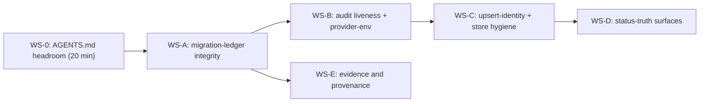

# Plan: Debt Burndown — Workstreams A–E (master)

- **Status**: In Progress — WS-0, WS-A, WS-B, WS-C Complete; **WS-E/E1 Complete** (2026-07-19). **WS-D and WS-E/E2(b) remain open** (verified against the code 2026-07-19; the prior "Complete" labels on WS-D/WS-E were wrong — see §9). WS-C2 closed 2026-07-19: measurement refuted the prescribed nullable→total migration; resolved with a root-cause identity fix + five evidenced pragmas, no DDL.
- **Date**: 2026-07-18
- **Origin**: Cross-session deferred-items investigation (4 parallel read-only agents at HEAD) + `/brainstorm --with-gemini` prioritisation (session `1784380501405`; GPT-5.6 + Gemini-pro + Claude synthesis).
- **Shape**: One master plan, five workstreams. Each WS is sized for its own `/plan`-refinement + `/audit-plan` + implementation cycle; this document is the stable spine and gets updated (per-WS detail deepened, statuses stamped) as each WS starts. Do not implement from this file alone once a WS has its refined section — the refined section wins.

## 0. Doctrine (applies to every WS)

Commercial-grade reliable / efficient / effective. No band-aids: every fix is the
smallest structurally-honest change at the shared seam, and every fix asks the
class question — *which siblings share this defect shape?* — before touching the
single instance. Scope is decided by impact, not authorship. Any WS that can
emit a "clean/green/0-findings" outcome must be adversarially checked: *can this
read green without having checked anything?*

## 1. Sequencing

Rationale: WS-0 is a 20-minute unblock (the next one-line AGENTS.md addition
trips the 1200-line ctx gate mid-ship). WS-A goes first among the real
workstreams because it unblocks `--migrate` for every later schema change
(WS-C may need migrations) and defuses a trap that fires on every clean
checkout. WS-E is independent of WS-B/C/D and small — it may interleave
anywhere after WS-A; the only hard constraint is **E2 must land before the
tiered-recall Phase-14 shadow window resumes**, and E1 before we care about
`AI-Gate` on another commit. WS-D last: it is user-facing but read-only
reporting; nothing corrupts while it waits.

## 2. WS-0 — AGENTS.md headroom (pre-step, not a full WS)

**Problem**: AGENTS.md sits at 1199/1200 (`ctx/oversized-agents-md`). The next
addition — including the ones these workstreams will make — fails `npm run
context:check` mid-flow.

**Fix**: condense ONE dossier-grade section to the stub + `docs/` pattern the
file itself mandates (candidates, largest first: "Tiered-Recall Audit
Pipeline" → `docs/plans/tiered-recall-audit-pipeline.md` already carries the
detail; "Shadow Final-Review A/B" → its plan doc). Target ≥50 lines of
headroom so the five workstreams' doc touches don't re-trip the gate one at a
time.

**Acceptance** (amended 2026-07-18 — the original "≥50 lines" was invented
without measurement; see the Outcome): `npm run context:check` green with
**headroom greater than the largest observed single-change growth of
`AGENTS.md`**, measured from git history rather than guessed; no load-bearing
invariant lost (the stub keeps the invariant lines, moves only operational
detail).

**Measurement** (last 25 commits touching `AGENTS.md`): **max growth = 28
lines**, mean = 3.5. So the bar is **> 28 lines of headroom**, and the four
remaining workstreams at the observed mean need ~14 lines total.

### Outcome (2026-07-18) — DONE (35 lines headroom, bar met)

**1199 → 1165 lines (35 lines headroom).** Both named candidates were
condensed, and **no information was lost** — verified before each cut, not
assumed:

- **Tiered-Recall Audit Pipeline** 65 → 25 lines. Every removed term
  (`stage1-triager-resolver`, `allowTiered`, `comparedRuns`,
  `tieredFallbackReason`, the 2026-07-14 incident, …) was confirmed present
  in the 852-line plan doc first. Kept inline: the four load-bearing
  invariants (per-call `allowTiered` eligibility, the forced `{backend:'sdk'}`
  pin, "a *window met* reading is not self-evidencing", Phase-14 pending).
- **Shadow Final-Review A/B** 32 → 20 lines. Here the check **failed**: the
  plan doc contained **zero** occurrences of the `--worksheet` surface and the
  PowerShell `<angle-bracket>` convention, so cutting them would have deleted
  a recurrence guard that has already bitten twice. That content was
  **moved into the plan doc first**, and the repo-wide convention kept as a
  one-line invariant in AGENTS.md.

**Why the criterion was amended rather than chased** (`/audit-code` R1 M3+M4
raised this as an acceptance-criteria shortcut — correctly, since recording a
shortfall is not meeting it):

The original "≥50" had **no derivation** — it was a round number. Chasing it
would have meant condensing sections that must NOT be condensed: the
remaining large ones are **load-bearing agent instructions**, not dossiers.
`Architectural Memory — Pre-fix Consultation` is a MANDATORY behavioural rule
an agent has to read **inline** (a pointer is not followed mid-task), and
`Consumer-repo layout` is already stubbed with its residual `CLI smoke
contract` **absent** from the runbook. `Cross-Skill Data Loop` has no single
canonical target doc — externalising it would mean authoring one, i.e. scope
creep. Condensing any of those to hit an undefended number optimises the
metric against the goal.

So the criterion was replaced with a **measured** one (the audit's own
sanctioned alternative): headroom must exceed the largest single-change
growth `AGENTS.md` has ever actually seen. **35 > 28** — met, with the
observed mean (3.5) implying ~14 lines for all four remaining workstreams.

**Revisit trigger**: headroom < 28 lines (the measured max) → condense again,
re-measuring first; next candidates `Cross-Skill Data Loop` (needs a target
doc authored) or `Security incident memory`, after the same
verify-the-target-first check that saved the worksheet/PowerShell guard here.

## 3. WS-A — Migration-ledger integrity (EOL-invariant hashing)

### Problem

`setup-postgres.mjs --migrate` aborts with a sha256 "mismatch" on
`20260521120000_persona_test_candidates.sql`. Investigation verdict: **not
drift — CRLF/LF**. The file was committed once and never edited; the
`.gitattributes` `* text=auto eol=lf` pin landed later (2026-06-05,
`2bf6099`); the migration was applied 2026-07-14 from a stale CRLF working
copy, so the ledger holds the CRLF hash (`7b4a4963…`) while any fresh
checkout materialises LF (`2c46651d…`). The hasher
(`scripts/setup-postgres.mjs:254-258`) hashes raw bytes. `--check-drift` is
silent *on this checkout only* because the stale CRLF copy is still on disk —
the trap fires on every clean clone.

Also confirmed: `20260718120000_plans_status_vocabulary.sql` is
**applied-but-unledgered** (constraint live in the DB — verified via
`pg_get_constraintdef` — no `audit_loop_migrations` row).

### Design (the class fix, not the one-row patch)

Both brainstorm models and the synthesis converged: patching the one ledger
row is the band-aid. Three legs, all required:

1. **Normalize at the hashing seam — byte-level, not text-level (R1-M1).**
   `sha256()` in `setup-postgres.mjs` hashes **canonicalized bytes** via an
   explicit `canonicalizeMigrationBytes(buf)` with a stated contract:
   **replace only the byte sequence `0x0D 0x0A` with `0x0A`; every other
   byte — lone `CR`, BOM, UTF-8 multibyte, any non-UTF-8 byte — passes
   through unchanged.** Operate on the Buffer directly; do **not** decode to
   a string first (`Buffer` has no `.replace`, and decoding would silently
   rewrite malformed UTF-8, widening a tamper guard into a normalizer). LF
   files hash identically before and after the change; checkout mode becomes
   permanently irrelevant.
2. **One-time ledger-wide reconcile — not just the known row.** The same
   stale tree applied migrations on 2026-07-14; other rows may carry CRLF
   hashes (dormant for the same reason this one was). Extend `--check-drift`
   with a distinct classification.

   **Two explicitly non-interchangeable hash primitives (R3-H1).** The R2
   draft said `storedHash === sha256(legacyCrlfBytes(file))`, which is
   **broken**: leg 1 makes `sha256()` canonicalize CRLF→LF, so hashing
   reconstructed all-CRLF bytes through it returns the *canonical LF* hash,
   never the historical raw-CRLF hash sitting in the ledger — no legacy row
   could ever be classified `eol-legacy`. The repair would fail to repair
   the one incident it exists for, and the likely field response (an ad-hoc
   raw-hash exception during implementation) would reintroduce exactly the
   tamper-guard ambiguity this design removes. So:

   | Primitive | Definition | Used for |
   |---|---|---|
   | `hashCanonicalMigrationBytes(buf)` | `sha256(canonicalizeMigrationBytes(buf))` | **All** current apply/verify/ledger comparisons — the one true hash going forward |
   | `hashRawBytes(buf)` | `sha256(buf)`, no canonicalization | **Only** reconstructing the historical legacy representation during classification. Never written to the ledger. |

   Classification, stated exactly:
   - `stored === hashCanonicalMigrationBytes(file)` → **match** (no action)
   - else `stored === hashRawBytes(legacyCrlfBytes(file))` → **`eol-legacy`**
     (repairable; repair writes the *canonical* hash)
   - else → **`shaMismatch`** — the real tamper guard, **unchanged**: a
     genuine content edit must still abort.

   **`legacyCrlfBytes` needs its own exact contract (R2-M3)** — an
   under-specified inverse can misclassify a tampered row as repairable,
   which would defeat the guard. Contract: apply
   `canonicalizeMigrationBytes` first, then replace **every remaining
   `0x0A` with `0x0D 0x0A`**, preserving all other bytes exactly (lone `CR`
   included). This reconstructs precisely one legacy representation: the
   all-CRLF text a Windows checkout produced. A historical file with
   **mixed** endings therefore cannot match, and is classified
   `shaMismatch` requiring manual investigation — deliberately fail-closed,
   because "some other byte pattern also hashes to the stored value" is
   indistinguishable from tampering and must never auto-repair.
3. **`--repair-eol` as a guarded, atomic reconciliation (R1-H1).** Not a
   loose UPDATE. Contract:
   - Runs inside the **same migration advisory lock** the apply path takes,
     so a concurrent `--migrate` cannot interleave.
   - **Single transaction**; each UPDATE is **compare-and-swap** —
     `WHERE filename = $1 AND sha256 = $2` (the exact legacy hash observed
     during classification). A row that changed between classify and write
     updates 0 rows → the whole transaction aborts and reports, rather than
     overwriting a hash it never inspected.
   - Touches **only** `eol-legacy` rows; a true `shaMismatch` is never
     written and remains a hard abort.
   - Emits an auditable result (per-row: filename, old hash, new hash) and
     is idempotent — a second run classifies zero rows and writes nothing.
4. **~~The unledgered migration is an ADOPT~~ — OBSOLETE (measured
   2026-07-18): the condition no longer exists.**

   > `--check-drift` now reports **`applied: 72 / 72`, `unapplied: []`** —
   > `20260718120000_plans_status_vocabulary.sql` was ledgered via `--migrate`
   > by parallel work during this cycle. There is no unledgered migration
   > left to adopt, so this leg was **not implemented**, and the
   > exact-unledgered-set preflight it required was not built.
   >
   > **Consequence for any FUTURE adopt-based repair** (the requirement is
   > retained, not dropped): `--adopt` is a whole-DB ledger seed whose only
   > safety property is the expected-schema manifest diff. Before using it to
   > repair a single row, enumerate the unledgered set via `--check-drift`
   > and confirm it is exactly the intended file — otherwise migrations that
   > never ran get recorded as applied. `runAdopt` now at least **names every
   > previously-unledgered file it is about to record** (this cycle's change)
   > instead of reporting a bare count, so that check is possible from its
   > own output.
   >
   > **Known blocker for consumers** (found by the consolidated Gemini gate,
   > spun off): `runAdopt` resolves its manifest from
   > `tests/fixtures/expected-schema.json`, a source-repo test path that is
   > **not synced to consumer repos** — so `--adopt` is structurally
   > unavailable there regardless of the above.

   *(Historical rationale, retained: `--adopt` states the real intent for an
   already-live migration, where re-running `--migrate` leans on the body's
   incidental idempotency.)*
   **Design retained for a future adopt-based repair (R3-H2), not built —
   see the OBSOLETE note above.** `--adopt` is a whole-DB seeding mode: it
   ledgers *every* absent migration, so on a DB with any other unapplied file
   it would record migrations as applied that never ran, converting a narrow
   repair into silent schema drift. Should such a repair ever be needed:

   > **Exact-unledgered-set preflight + whole-DB `--adopt`.** Enumerate the
   > unledgered set (`--check-drift`) and assert it is **exactly** the
   > intended file. Any other member → **abort** with the set printed; the
   > operator decides per file (a genuinely-unapplied migration must be
   > `--migrate`d, never adopted). Then verify the postconditions: the ledger
   > row exists, the live schema object the migration creates matches its
   > body, and the unledgered set is empty.

   The abort *is* the safety property: adoption proceeds only in the state
   where whole-DB and single-target semantics are provably identical.
5. **Working-tree closure — scoped, never repo-wide (R1-M6).** Renormalize
   **only the enumerated migration paths**:
   `git add --renormalize supabase/migrations/` — never `git add
   --renormalize .`, which would stage unrelated EOL churn across a
   961-file repo and directly violates this repo's own "stage by name only,
   never `git add -A`/`.`" invariant. Start from a clean worktree; review
   the staged path list before committing. Verification (stages nothing):
   `git ls-files --eol supabase/migrations/ | grep -v 'w/lf'` returns empty.

Ordering note: with normalize-at-seam in place, ordering ceases to matter —
the old "UPDATE the ledger before renormalizing" footgun disappears entirely,
which is itself evidence this is the right seam.

### File-level plan

| File | Change |
|---|---|
| `scripts/setup-postgres.mjs` | `canonicalizeMigrationBytes()` (byte-level CRLF→LF) feeding `sha256()`; `--check-drift` gains the `eol-legacy` category; new `--repair-eol` (lock + single transaction + compare-and-swap, `eol-legacy` rows only) |
| `docs/runbooks/postgres-parity.md` | §drift: document `eol-legacy`, `--repair-eol`, and the adopt-vs-apply rule for an already-live migration; retire the manual break-glass hash-UPDATE recipe for this class |
| `tests/setup-postgres-hashing.test.mjs` (new) | Canonicalization + classification + repair-guard cases (below) |

### Acceptance

**Unit (hermetic, no DB):**
- CRLF and LF copies of the same migration hash identically.
- **Byte-preservation (R1-M1)**: mixed endings, **lone `CR`** (preserved,
  not folded), BOM, UTF-8 multibyte SQL text, and a non-UTF-8 byte sequence
  each hash to the byte-exact expected value — proving canonicalization
  touches `0x0D 0x0A` and nothing else.
- A genuine content edit still classifies as true `shaMismatch` (the tamper
  guard is narrowed by exactly one benign class, not weakened generally).
- `--repair-eol` compare-and-swap: a row whose stored hash changed between
  classification and write updates 0 rows and aborts the transaction.
- `--repair-eol` is idempotent: a second run classifies 0 rows, writes none.

**Disposable-Postgres integration (R3-M2) — required, not optional.**
The hermetic units above cannot exercise what `--repair-eol` actually risks:
advisory-lock scope, transaction ownership, compare-and-swap row counts,
rollback, and SQL parameter binding. Operator verification against the
shared store is **not** a substitute — it is a single unrepeatable trial on
production data. This repo already owns the right lab: a suite guarded by
`AUDIT_DB_TEST_URL` + `assertDisposableDbUrl` (the guard added after the
2026-07-14 wipe). Seed a fixture ledger with one canonical row, one
legacy-CRLF row, and one true-mismatch row, then assert:
- only the legacy row updates; canonical and mismatch rows are untouched;
- an injected CAS conflict (hash changed mid-transaction) updates 0 rows and
  **rolls the whole transaction back**;
- the lock is actually held for the repair's duration (a concurrent session
  blocks);
- a second run is a no-op.

**Live store (operator-run, not in any suite):**
- `--check-drift` classifies the persona row `eol-legacy` (plus any siblings
  from the same 2026-07-14 tree).
- `--repair-eol` repairs exactly those, reporting each.
- ~~`--adopt` ledgers `plans_status_vocabulary`~~ — **not needed**: measured
  2026-07-18, `unapplied: []` (already ledgered via `--migrate` by parallel
  work). Verified precondition, not an assumption.
- Final `--check-drift` exits 0; a renormalized fresh-clone simulation also
  exits 0.

**Live status — DONE (2026-07-19, run against the production store with
explicit authorization).**

| Step | Result |
|---|---|
| Pre-state | `applied: 72 / 72`, `unapplied: []`, `shaMismatch: 0`, exactly **one** `eol-legacy` row (`20260521120000_persona_test_candidates.sql`), hashes matching the investigation byte-for-byte |
| `--repair-eol --dry-run` | named the single candidate, wrote nothing |
| `--repair-eol` | `repaired 1 row(s)` — `7b4a4963…` → `2c46651d…` |
| `--check-drift` | **`✓ no drift`, exit 0** |
| `applied_at` | **`2026-07-14 19:47:23+00` — preserved.** The Gemini-G1 fix verified on production data: a hash correction did not rewrite deployment history |
| `--migrate` | `applied 0, skipped 72` — the original failure is gone |
| Fresh-clone simulation | worktree refreshed to `w/lf`; `--check-drift` still exits **0** |

**The renormalize step (leg 5) turned out to be unnecessary** — `git add
--renormalize supabase/migrations/` staged nothing, because canonical hashing
makes the worktree's line endings irrelevant to the ledger. The fix removed
the need for its own workaround, which is the strongest evidence it was cut
at the right seam.

### Safety

`--repair-eol` writes to the shared prod store: operator-run only, never from
tests (the `assertDisposableDbUrl` guard stays authoritative for suites).

## 4. WS-B — Audit liveness + provider-env preconditions

One plan, four symptoms, two shared seams: **(i)** unbounded optional LLM work
inside audit entry points; **(ii)** ambient-provider-env leaking into
behaviour (the family the just-shipped `normalizeBaseUrl` fix belongs to).

### B1 — Bounded brief generation (the hang class)

**Problem**: `initAuditBrief()` → `_llmCondense` (`scripts/lib/context.mjs:175`)
awaits `anthropic.messages.create(...)` / Gemini with **no bound**. Under
`CLAUDE_BACKEND=cli` the Claude leg spawns `claude -p`, observed hung (exit
143) in a harness env. `gemini-review` is belt-covered by
`armReviewWatchdog` (600 s, slow); **`openai-audit.mjs:684` and `:828` have no
watchdog at all** — a brief hang blocks the GPT audit unbounded
(`.catch(() => {})` at :828 catches rejection, not a hang).

**Design**: bound at the `_llmCondense` seam, not per call site. The
timeout contract is **executable, not adjectival (R1-H2)**:

| Element | Contract |
|---|---|
| **Total deadline** | `briefConfig.totalTimeoutMs` (default **30 s**) — a wall-clock budget for the WHOLE brief step, started once. Not per-provider: two providers × per-attempt budgets must not be able to sum past it. |
| **Per-attempt** | Each provider attempt gets `min(perAttemptMs default 20 s, remaining total)`. When the remaining budget is under a floor (~2 s), the next provider is **skipped**, not started. |
| **Provider order** | Unchanged: Claude → Gemini → regex. Deterministic. |
| **Cancellation** | Every adapter takes an `AbortSignal`. The signal MUST reach the underlying work: for the SDK/HTTP path, the request's abort; for the **cli** path, terminate the spawned `claude -p` **process group** — a bare `Promise.race` leaves the child running (the exact exit-143 orphan observed). |
| **Termination is itself bounded (R3-H3)** | "Kill and `await` exit" is **not** sufficient: a child (or a descendant) that ignores the initial signal makes that await unbounded — an unbounded wait inside the fix for unbounded waits. Contract: signal the process group → wait a **finite grace interval** (~2 s) → **escalate** (`SIGKILL` / `taskkill /T /F` on Windows) → **settle the caller at the overall deadline regardless of whether the child has been reaped.** Reaping continues in the background and is logged; it can never hold the audit. The same rule binds an abort-aware HTTP transport: if it does not settle after abort, the deadline settles the caller anyway. |
| **Late settlement** | A raced-out attempt's promise is consumed (`.catch(() => {})` attached at race time) so a late rejection can never surface as an unhandled rejection after fallback. |
| **Adapter without cancellation** | If a transport cannot honour abort, it is **not eligible** for brief-gen; the step logs the skip and falls through. No unbounded await is permitted at this seam, ever. |
| **Failure semantics** | Timeout is a one-line stderr note and a regex-brief fallback — **never** an audit-blocking error. Brief-gen is optional enrichment. |

**Verification of the cli transport comes first** — inspect what
`anthropic-client.mjs`'s cli path currently accepts and extend it to take a
signal/timeout; the plan does not assume it already can (the earlier draft's
"verify before choosing" was the unresolved-decision smell R1-H2 named).

**Sibling sweep (same item)**: enumerate every optional LLM enrichment
awaited inline in an audit entry point (`initAuditBrief`,
`generateRepoProfile`, neighbourhood/arch-memory queries) and assert each is
bounded or non-blocking under the same contract — a `grep`-driven checklist
recorded in the WS-B log, not a vibe.

### B2 — Shadow-entry precondition (replaces run-into-a-stub)

**Problem**: forced `{backend:'sdk'}` needs `ANTHROPIC_API_KEY`; a keyless
session leaves `providers.anthropicClient = null`
(`legacy-production-audit.mjs:3307-3309` swallows the construction error —
deliberately, since the legacy audit doesn't need it), and the tiered
shadow's **required** Sonnet generator becomes a throwing stub
(`tiered-pipeline.mjs:864/:904`) — the whole shadow pipeline runs to a
generic failure. All 51 local "intermittent" records were one keyless
14-hour window.

**Design** (the honest middle between reporting-only and a global fail-fast,
which would break keyless legacy runs): keep client construction
non-blocking, but **stop inferring the cause from `null` (R1-H3)**.

A null client today conflates *credentials missing*, *malformed
configuration*, *transport/SDK init failure*, and *a future regression in
construction*. Persisting "`ANTHROPIC_API_KEY` missing" for all of them
would be **false diagnostics** — the precise failure this repo already
names in its own code: *"a diagnostic that lies is worse than none"*
(`tiered-shadow-summary.mjs:245`).

So the catch at `legacy-production-audit.mjs:3309` stops discarding the
error and records a small **readiness result** alongside the client:

| State | Meaning | Shadow behaviour |
|---|---|---|
| `available` | client constructed | run normally |
| `credentials-missing` | the sdk backend's key requirement is unmet (`anthropic-client.mjs:278` shape) | **skip** with the named reason |
| `disabled` | intentionally off by config | **skip**, named |
| `config-invalid` / `transport-init-failed` | anything else — the error is retained verbatim | **surface as a failure**, not a benign skip (this is an operational defect and must not be hidden behind a routine skip line) |

The shadow entry point skips only on `credentials-missing`/`disabled`,
persisting a distinct status plus a loud stderr line; every other state
propagates the real error. No paid shadow work is wasted in the skip cases,
and a genuine construction regression can never masquerade as "no key".

**Retained errors must be redacted before they leave the process (R2-M1).**
"Verbatim" was wrong: provider construction/config exceptions routinely
carry endpoint URLs, proxy settings, request metadata, and credential-bearing
query components — and these records flow into the store, stderr, the report
and the dashboard. Contract: a **readiness diagnostic normalizer** at the
construction seam emits an allowlisted structure — `{provider,
readinessState, errorCode/name, sanitizedMessage}` — with secrets and
credential-bearing URL components stripped by the repo's existing redaction
seam (`lib/secret-patterns.mjs` / `redact.mjs` — reuse, do not hand-roll;
note the documented rule that `sanitizer.mjs`'s blanket 20+-char redaction
is the wrong tool for prose). Any unredacted cause stays in-process only
(never persisted, never rendered). This is the same egress discipline the
repo already enforces for audit payloads, applied one seam earlier.

### B3 — Surface both-pipelines-failed reasons

`tiered-shadow-summary.mjs:247` filters `shadowFailureReasons` on
`legacyOk === true`, so a record where both pipelines failed loses its shadow
reason into the anonymous `legacyFailures` count. Add an additive
`shadowFailureReasonsAll` reducer (filter only `!shadowOk`) + a print line in
`tiered-shadow-report.mjs:182`. Dashboard shares `summarize()` — both
surfaces update together. (B2 makes the *specific* keyless case a named skip;
B3 is the general diagnosability fix for whatever fails next.)

### B4 — Azure test hermeticity (the shape-sibling chip)

`tests/openai-client.test.mjs` references `AZURE_OPENAI_ENDPOINT` but its
`beforeEach` only resets the client cache — an ambient Azure endpoint
silently activates the Azure path inside tests. **Class fix**: extract the
just-shipped `AMBIENT_PROVIDER_ENV` scrub into one shared test helper
(single env-var list covering Anthropic + OpenAI + Azure + Gemini families)
and adopt it in both provider suites — one list, two consumers, no third
drift-prone copy.

**Isolation semantics are part of the contract (R1-M2)** — delete-only is
not enough:

- **Snapshot and restore**: capture the prior value of every managed
  variable (including "was unset", distinct from "was empty"), and restore
  it in a `finally` so a **failing or throwing test** cannot leak state into
  the next one.
- **Scoped, not ambient**: the helper wraps a test body
  (`withScrubbedProviderEnv(async () => { … })`) rather than mutating
  `process.env` for the file's lifetime; nested scopes restore correctly.
- **Single source of truth**: participating suites must not mutate provider
  env directly — the variable-family list lives in one module.
- **Concurrency safety is enforced by the helper, not by convention
  (R3-M1).** `process.env` is process-global, so two interleaved
  snapshot/scrub/restore scopes would restore the wrong environment — and a
  future `test(..., {concurrency: true})`, a parallel subtest, or a runner
  config change could introduce that interleaving silently, with the failure
  appearing as an unrelated flaky provider test. A documented "don't do
  that" is not a safeguard. The helper therefore owns a **re-entrant async
  serialization guard** around the full lifecycle: concurrent scopes queue
  rather than interleave, and a nested scope inside an owning scope
  proceeds without deadlocking (ownership propagation). Node's
  file-level isolation remains true today; the guard makes correctness
  independent of it.

**Tests for the helper itself**: restoration after a thrown test body;
unset-vs-empty round-trip; nested scopes; plus the hostile-shell proof — the
suite passes green with `AZURE_OPENAI_ENDPOINT` injected (the same standard
the `normalizeBaseUrl` fix was held to).

### File-level plan

| File | Change |
|---|---|
| `scripts/lib/context.mjs` | B1 — total/per-attempt brief budget; pass `timeoutMs` to the Claude leg; `abortSignal` for the previously-unbounded Gemini leg; late-rejection consumed |
| `scripts/lib/audit/provider-readiness.mjs` (new) | B2 — `classifyProviderReadiness` + `isBenignUnavailability`, with the redaction boundary |
| `scripts/lib/audit/legacy-production-audit.mjs` | B2 — classify at the swallow site; carry `anthropicReadiness` in `providers` |
| `scripts/lib/audit/tiered-pipeline.mjs` | B2 — the stub names the readiness state instead of a bare "unavailable" |
| `scripts/lib/audit/tiered-shadow-summary.mjs` | B3 — additive `shadowFailureReasonsAll` |
| `scripts/tiered-shadow-report.mjs` | B3 — print only the reasons the gated line cannot show |
| `tests/helpers/provider-env.mjs` (new) | B4 — one env-family list; snapshot/restore; serialised scopes |
| `tests/openai-client.test.mjs` | B4 — adopt the scrub (it reset the cache but never the env) |

### Tests

- B1: fake provider that never resolves → brief degrades to regex within the
  budget; audit proceeds; cli-backend child is killed (no orphan process).
- B2: shadow-enabled + null client → shadow record carries the named skip
  reason; no generator invoked; legacy result unaffected.
- B3: fixture with `legacyOk:false` + `shadowError` → reason visible in
  `shadowFailureReasonsAll`, absent from `shadowFailureReasons` (precedence
  preserved).
- B4: suite green with `AZURE_OPENAI_ENDPOINT` injected in the hostile shell
  (the same proof standard the baseURL fix used).

## 5. WS-C — Upsert-identity backlog + store hygiene

**Problem**: the on-conflict defect class has bitten five times (one 403k-row
incident); the lint (`scripts/lib/lint/on-conflict.mjs`, already gating new
code) reports an 8-finding whole-tree backlog on pre-existing writers.

**Design — measure-first, per the `upsertPromptVariant` lesson** (a brief's
"live collision" claim proved false there; severity is decided by evidence,
not by shape).

> **WS-C is deliberately NOT implementable from this section alone (R1-H4).**
> Phase C0 below produces the artifact that makes it implementable. Do not
> write DDL before C0 exists — that is the whole point of measure-first.

### C0 measurements (2026-07-19) — measure-first, and it changed the plan

Live store, read-only:

| Table | Rows | Scope-column state | Constraint |
|---|---|---|---|
| `plans` | 38 | `repo_id` nullable, **0 NULLs** | `UNIQUE (repo_id, path)` |
| `persona_audit_correlations` | **0** | `audit_finding_id` nullable | `UNIQUE (persona_session_id, persona_finding_hash, audit_finding_id)` |
| `personas` | 1 | `repo_name` nullable, NULL on the row | `UNIQUE (name, app_url)` — scope absent |
| `persona_test_sessions` | 1 | `repo_name`/`repo_id` nullable | `UNIQUE (session_id)` — scope absent |

**No live corruption anywhere** — no duplicate clusters, no backfill needed,
no duplicate-resolution policy required. The exposure is latent, so every fix
below is preventive.

#### C1 is ALREADY CORRECTLY DEFENDED — the two lint findings are false positives

Both "nullable-conflict-key" sites were traced to code, not assumed:

- **`plans-ship.mjs:34`** — `upsertPlan` early-returns when `!repoId`, with a
  comment naming this exact defect class ("a NULL here INSERTs a duplicate plan
  row on every call instead of updating… Refuse."). The nullable expression the
  lint sees is unreachable with a null.
- **`plans-ship.mjs:365`** — the `audit_missed` shape (null `audit_finding_id`)
  is written through a **partial unique index** (`uq_correlations_missed`,
  `conflictWhere: 'audit_finding_id IS NULL'`), which is the correct Postgres
  answer to NULL-distinct. The 3-column target is used only on the branch where
  the id is non-null.

So the item the plan called "highest priority — the literal 403k-row shape" is
already solved. **The remaining work is in the LINT, not the code**: it reads
the value expression without seeing the guard or the partial-index branch, and
a linter that cries wolf on correct code trains people to ignore it. Either
teach it those two shapes or suppress them with a written justification.

#### C2's fix has a prerequisite the plan missed

Gemini-G2's "add the scope column to the constraint now" **cannot be applied
naively here**: `personas.repo_name` and `persona_test_sessions.repo_name`/
`repo_id` are **nullable**, and adding a nullable column to a unique constraint
reintroduces C1 exactly — NULLs are distinct, so rows with a null scope would
never conflict and would insert unboundedly. Making the column total
(backfill + `SET NOT NULL`, or a sentinel) is a **precondition**, not a
follow-up. With 1 row per table the backfill is trivial, but the ordering is
load-bearing and must be stated in the migration.

#### C0 — Identity matrix (required first deliverable, blocks C1/C2)

One row per affected writer, appended to the WS-C log in this doc. Until a
writer has its row, its fix is not specified:

| Column | Content |
|---|---|
| Writer | `file:line` + table |
| Logical entity key | what a row *is*, in domain terms |
| Nullability semantics | can each key column be NULL, and what does NULL **mean** (unknown / not-applicable / not-yet-linked)? |
| Current DB reality | actual constraints + indexes (`pg_indexes`/`pg_constraint`), not the assumed ones |
| Callers + scope | every call site; single-repo or multi-repo writer |
| Measurement | live row count, NULL rate per key column, duplicate clusters under the *intended* identity |
| Chosen canonical identity | the unique constraint that will exist |
| Exact `ON CONFLICT` target | must match that constraint |
| Migration policy | backfill, duplicate resolution (which row wins), rollback check |

#### C1 — nullable conflict key (the incident shape)

`plans.repo_id` (`plans-ship.mjs:34`); `persona_audit_correlations.audit_finding_id`
(`:365`). Highest priority — this is the 403k-row shape.

**Correction (R1-H4): "partial unique index + aligned conflict target" is
NOT a valid branch for the NULL case and is removed.** In Postgres, NULLs
are distinct in a unique index, so a partial index that excludes NULL rows
cannot arbitrate competing NULL-key upserts at all — `ON CONFLICT` would
simply never match and every NULL-key write would insert a new duplicate.
That is the incident, not a fix for it. The admissible branches are:

1. **Make the identity non-null** — backfill a real value, then `SET NOT
   NULL` + a unique constraint over the true key. Preferred when NULL means
   "unknown but knowable".
2. **Introduce an explicit sentinel** for a genuinely-absent relationship
   (e.g. a `GLOBAL_*` bucket, the pattern WS-A-adjacent code already uses)
   so the key is total and comparable. Preferred when NULL means
   "not-applicable".
3. **Split the identity** — if NULL marks a different *kind* of row, that
   kind may deserve its own constraint (or its own table), rather than being
   forced into one conflict target.

Whichever branch the C0 data supports must be *stated with its evidence*.
Schema changes ride the WS-A-repaired migration path.

#### C2 — omitted-scope identity

6 writers with live callers: `symbol_index`, `symbol_layering_violations`,
`learning_decisions`, three persona tables.

**Default: include the scope column in the unique constraint + conflict
target NOW (Gemini-G2).** The R1 draft allowed "accept as-is with a written
future-uniqueness rule" where single-tenancy makes the column currently
redundant. That is the weaker design: it delegates a **database integrity
constraint to human memory and a doc line**, and its failure mode is silent
— the day a second repo scope writes the table, an upsert **overwrites the
first tenant's row** instead of inserting or erroring. For genuinely
single-tenant data the constraint is free (no behavioural change today, one
migration) and converts a documented promise into a structural guarantee.
Structure beats documentation whenever the cost is this low.

Per writer, C0 still decides the *shape* (which columns constitute
identity, backfill/duplicate policy). A writer may omit scope from the
constraint only where C0 shows the column is **not part of the entity's
identity at all** (i.e. adding it would be semantically wrong, not merely
redundant) — that is an evidence-backed design statement, not a deferral,
and it must be written as such in the log.

#### C3 — non-literal target

`regression_specs`: one-time manual review; record the verdict + rationale
here; add an in-code lint suppression **with that rationale** if it is
legitimately unresolvable statically.

#### C4 — dead writers

`syncExperiments` + `syncPromptRevision` (`scripts/lib/store/bandit-fp.mjs:414/:447`)
→ **delete** (decision 2026-07-18; engineer-flow rationale: dead exports
pollute arch-memory reuse recommendations — the anti-duplication mechanism
ends up recommending dead code — and cost porting effort every refactor;
git history is the archive; `upsertPromptVariant` precedent). Remove
functions + barrel entries + any tests pinning them. Table drops deferred
to the migration-domain cleanup (M4's territory), not this WS.

#### C2 — RESOLVED 2026-07-19. Measurement refuted the prescribed migration.

The C0 matrix above never covered `symbol_index`,
`symbol_layering_violations` or `learning_decisions` — so per this section's
own rule those three fixes were unspecified. Measuring them first (live,
read-only) changed the answer for **all six** findings. **No DDL was applied,
and none should be**: the section's default ("include the scope column NOW")
is right in general but wrong on this evidence, and the escape hatch it
defines — scope "is not part of the entity's identity at all" — is what
actually applies.

| Writer | Measurement (2026-07-19, live) | Verdict |
|---|---|---|
| `symbol_index.repo_id` | `refresh_id` NOT NULL FK → `refresh_runs.repo_id` NOT NULL. **0 of 223,623** rows have `symbol_index.repo_id <> refresh_runs.repo_id` | **FD-redundant.** Adding `repo_id` cannot change which rows conflict; it would rebuild a 223k-row unique index for zero semantic gain. Pragma. |
| `symbol_layering_violations.repo_id` | Same FD; 0 violating rows; NOT NULL | **FD-redundant.** Pragma. |
| `learning_decisions.repo_id` | `decision_key` globally unique by construction (`<audit_run_id uuid>:…` \| `<type>:<external_id>`); 1876 rows, **0 NULL** `repo_id`, 2 repos | **The prescribed fix was actively harmful.** `UNIQUE(repo_id, decision_key)` *weakens* the constraint (permits one key under two repos) and, `repo_id` being nullable, reintroduces the exact NULL-distinct bug WS-C exists to close. Pragma. |
| `personas.repo_name` | 1 row, `repo_name` NULL. `unique (name, app_url)` = "Unique per app"; `personas_app_url_idx`; `listPersonasForApp` reads by `app_url` alone | **Scope is the APP, not the repo.** Adding `repo_name` would fragment one app's persona into per-repo copies and break that reader. Evidence-backed omission, not a deferral. Pragma. |
| `persona_test_sessions.repo_name` + `repo_id` | 1 row; `session_id` = `persona-test-<unix seconds>`, LLM-authored per SKILL.md, no repo component | **Real defect — but widening is a band-aid.** `repo_id` is legitimately NULL when persona-test runs against a deployed URL from outside a resolvable repo, so `(repo_id, session_id)` needs a sentinel bucket in which two same-second sessions **still collide**. Root-cause fixed instead. |

**The one real defect, fixed at its root**: `session_id` is now minted in code
by `buildPersonaSessionId()` ([`scripts/lib/persona-test/session-id.mjs`](../../scripts/lib/persona-test/session-id.mjs))
— unix seconds (legibility) + a `crypto.randomUUID()` suffix (the actual
uniqueness mechanism; 122 random bits). `record-persona-session` mints when `sessionId` is omitted and
returns it as `sessionKey`; an explicitly-passed id still flows through
verbatim, so re-posting (the documented idempotency path) is unchanged.
SKILL.md Phase 6 now tells the skill *not* to build one. A session is a
globally-unique **event**; `repo_id`/`repo_name` are annotations on it.

**Migration applied: none.** The ordering constraint the brief specified
(backfill → `SET NOT NULL` → widen constraint → update `onConflict`) is
correct as stated and was the right thing to guard against — it simply turned
out to apply to zero tables once each column's role was measured rather than
inferred from the lint's shape-level signal.

**Pragmas are load-bearing claims, so they are mechanically verified**:
[`tests/on-conflict-scope-identity.test.mjs`](../../tests/on-conflict-scope-identity.test.mjs)
asserts every claim each pragma rests on — the `refresh_id` FK + NOT NULL
chain, `UNIQUE (decision_key)` being global (and *not* repo-composite),
`UNIQUE (name, app_url)`, `UNIQUE (session_id)`, plus behavioural proof
against disposable Postgres that a second scope **INSERTs rather than
overwriting** and that re-upserting the same key still **UPDATEs in place**.
If a future migration falsifies a pragma, the suite fails instead of the
pragma quietly becoming a lie.

**Verification**: `on-conflict:all` → 0 gating (8 suppressed, 1 unresolved =
C3, reviewed); `npm run check` exit 0 (7582 tests) at the time WS-C2 landed;
live `setup-postgres --check-drift` → `72 applied / 72 source files, no drift`
(unchanged — no migration added). Schema/behaviour tests ran against the
disposable container (`db-test-container.mjs`), never `AUDIT_DB_URL`.
`/audit-code` R1 (H:2 M:5 L:4) → R2 (H:0 M:3 L:1, all 4 pre-existing
architecture/domain-map items, deferred as independent); Gemini final gate
**APPROVE**, 0 new findings, 0 wrongly dismissed, 0 over-engineering flags.

#### A latent lint bug this workstream flushed out (in-scope by impact)

`extractUpsertSites` split its source on `'\n'`, so on a **CRLF** working tree
every line kept a trailing `'\r'` — and `SUPPRESSION_RE`'s `(.*)$` cannot match
that, because JS treats `\r` as a line terminator (`.` won't consume it, and a
non-multiline `$` won't match before it). Every `@on-conflict-ok` pragma
therefore **silently stopped suppressing on Windows checkouts** while still
working on LF ones: a platform-dependent quality gate. The five WS-C2 pragmas
ride entirely on this path, so it was in-scope by the impact test despite being
pre-existing. Fixed at the line-splitting layer (`split(/\r?\n/)`), not by
patching the regex. The regression test in
[`tests/on-conflict-lint.test.mjs`](../../tests/on-conflict-lint.test.mjs) was
verified **non-vacuous by mutation** — reverting the split makes it fail.

This is why the pragmas got their own verification suite: the bug was invisible
to review and only surfaced because a file rewrite normalised line endings.

**Acceptance**: every C1/C2 writer has a C0 row citing its measurement;
**`npm run on-conflict:all`** → 0 findings, or each remaining finding
carries an in-code suppression with a written verdict; each schema change
has a stated rollback verification.

> Verified 2026-07-18 (R2-M2 was **refuted**): the CLI
> `scripts/on-conflict-lint.mjs` **does** exist, and both
> `on-conflict:check` (wired into `npm run check`) and `on-conflict:all` are
> real package scripts — the audit's claim that only
> `scripts/lib/lint/on-conflict.mjs` exists was false (the lib module is the
> rule; the CLI is its entry point). The finding's useful kernel is adopted:
> acceptance cites the **supported package script**, not a raw `node`
> invocation, so it runs through the same path as the quality gate.

## 6. WS-D — Status-truth surfaces (dashboard + the canonical parser)

**Problem**: the Plans tab buckets by directory
(`scripts/lib/dashboard/collect-reference.mjs:48`); `docs/completed/` is now
empty, so **every plan renders Active**. Worse, the collector re-implements
the `Status:` parse inline (line 84) — a second parser of the exact contract
`scripts/lib/plan-status.mjs` was built to own (the reference-integrity
plan's own root-cause shape, one layer down).

### Measured population (2026-07-18 — grounding pass, ran before design)

The dashboard's inclusion predicate is **not** "every file in `docs/plans/`":
`collect-reference.mjs:64-78` skips `*-audit-summary*` names and requires the
**first H1** to match `Plan: …`. Measured against the canonical parser:

| Classification | Count | Bucket after fix |
|---|---|---|
| `kind:'terminal'` | 115 | Completed |
| `kind:'active'` | 5 | Active |
| `ok:false` (`absent`) | 1 (`browser-mcp-and-tooling.md`) | Active + `malformed` badge |
| `unrecognized` / `duplicate` | **0** | — |

So the parser swap is **safe** — zero dashboard-included plans regress into a
failure state — and the tab goes from a useless *Active 121 / Completed 0* to
a true *Active 6 / Completed 115*.

**This measurement killed two earlier design assumptions** (recorded because
the corrections are the point):

- A third **"Archive (no status)"** group is **over-engineering**: it would
  hold exactly **one** file, and `collect-reference.mjs:89` already computes a
  `malformed` flag for a missing Status that `sections/plans.mjs:193` already
  renders as a badge. Use the existing affordance.
- The "**re-stamp the 7 `Audit-complete.` prefixes**" item was **wrong and is
  deleted**. All 7 are `*-audit-summary.md` files, which
  `check-plan-status.mjs:28` (`isAuditSummary`) **exempts by design** — a
  documented carve-out backed by `docs/README.md` and a consolidated-Gemini
  round-2 finding. `node scripts/check-plan-status.mjs` exits **0** today
  ("157 file(s), all conform or are exempt"), so the claim that they "fail
  closed if ever linted" was false. Re-stamping them would fight a deliberate
  design decision.

**Design**:

1. `discoverPlans` scans **only** `docs/plans/`, imports `parsePlanStatus`,
   and buckets by its result: `kind:'terminal'` → **Completed**; everything
   else (`kind:'active'` and any `ok:false`) → **Active**. Rationale: Active
   must contain exactly the *might-still-need-work* set; an unknown status is
   genuinely "might need work", so Active is the honest side to fail toward,
   and the existing `malformed` badge marks it as unlabelled rather than
   asserting a lifecycle state it doesn't know.
   **One parser, not two (R1-M3).** Keeping the inline line-84 regex "just
   for display" would leave the same two-implementations-of-one-contract
   shape this plan exists to kill, one layer down. Instead
   `parsePlanStatus` (or a presentation adapter colocated with it) returns
   the **display metadata too** — the raw trimmed status string alongside
   `{ok, token, kind, reason}` — and the collector consumes only that
   result. The inline regex is deleted outright, not demoted.
   Every `ok:false` subtype maps explicitly: `absent` → Active +
   `malformed:true` + "no status" display; `unrecognized`/`duplicate` →
   Active + `malformed:true` + the offending value shown (so a future plan
   that introduces one is visibly wrong rather than silently normalized).
   The measured corpus has zero of these today — the mapping exists so the
   change stays correct when that stops being true.
   **`duplicate` needs a typed presentation contract (R3-L1)**: by
   definition it carries ≥2 status lines with potentially conflicting
   values, so "the raw offending value" is ambiguous. The canonical result
   exposes `rawStatusValues: string[]` (all trimmed values, **source
   order**) plus a derived `displayStatus`; the dashboard renders the values
   joined in source order, bounded (first 3 + "+N more"), so a duplicate is
   visibly a duplicate rather than silently showing whichever line won.
2. `render.mjs:101`: fix the copy that still says done plans live in
   `docs/completed/`.

#### Captured decision item — dashboard vs linter "what is a plan" (Gemini-G2, round 2)

The dashboard includes a document by its **`# Plan:` H1** and (after this
WS) shows an `absent` status as Active + `malformed`. The linter
(`check-plan-status.mjs:58`) instead skips `absent` outright — *"not a plan;
not a failure"*. So a document with a `Plan:` H1 and **no** Status line
passes CI while rendering as malformed in the dashboard: two definitions of
"is this a plan".

**Not silently adopted here, and deliberately so.** The `absent` exemption
is not an oversight — it is an explicit, separately-audited contract from
`reference-integrity-gate.md` ("*No `Status:` line → not a plan … **Not a
failure.** 20 real files depend on this*"). Tightening the linter to flag
`Plan:`-H1-without-Status would overturn another plan's already-settled decision
as a side effect of a dashboard fix, which is precisely the scope-creep this
repo's doctrine forbids.

Measured exposure: **exactly one** file today
(`browser-mcp-and-tooling.md`). WS-D therefore **records** the divergence
and leaves the contract intact; the honest options, to be decided when WS-D
runs (not before):
1. Give that one file a Status line — the divergence disappears without any
   contract change (**recommended**; smallest honest fix).
2. Tighten the linter to use the H1 for inclusion — a real change to the
   reference-integrity contract; requires its own plan + audit, not a
   drive-by edit.
3. Accept permanently and document that the two consumers answer different
   questions (dashboard: "show me plan-shaped docs"; linter: "validate
   declared statuses").

**Tests**: fixtures for terminal → Completed, active → Active, absent →
Active + `malformed`; a `Complete`-status file in `docs/plans/` lands in
Completed (the directory no longer decides); the collector holds no `Status`
regex of its own as bucketing authority (source-scan assertion, mirroring the
repo's existing retire-the-duplicate-parser pins); `docs/completed/` absent
from the collector.

## 7. WS-E — Evidence & provenance

### E1 — `AI-Gate` run-pointer writer (make `passed` reachable)

**Problem**: `ship-commit.mjs:167` reads `.audit/last-audit-run.json` via
`resolveEvidence` (freshness vs HEAD commit time; `passed` additionally
verified against the store's convergence row — fail-closed and correct). But
**nothing writes the file** (dated June 4; grep finds only readers). Every
commit ships `AI-Gate: not-run` regardless of actual audits — provenance
systematically understates rigor, cross-repo-confirmed.

**Artifact classification (R1-H5) — settled, not assumed.** The pointer
carries a cloud `runId` + wall-clock timestamp, so it is **Category A**
(derived from external/mutable state, volatile provenance) under this repo's
generated-artifact policy: local runtime state, **gitignored**, never
committed, never freshness-verified. Verified: `.gitignore:75` already lists
`.audit/last-audit-run.json` — the classification is pre-existing and the
writer must not change it.

**Correction to the earlier draft**: "the file ships to consumers via the
normal sync closure" was **wrong** and is withdrawn. Verified against
`scripts/lib/sync-path-map.mjs` — the pointer is *not* in the sync map and
must never be. **Only the writer code syncs**; each consumer's own audit run
produces its own local pointer. Shipping an upstream repo's run pointer into
a consumer would be exactly the false-evidence failure the `AI-Gate` gate
exists to prevent.

**Design**: one writer at the audit-pipeline completion seam in
`openai-audit.mjs`, atomically writing `{runId, sid, round, ts}` via
`atomicWriteFileSync` — the shape `resolveEvidence` (`ship-commit.mjs:167`)
and `build-dashboard.mjs audit-run` already parse.

**Publication condition (R1-M4)** — "a run finished with a `cloudRunId`" is
too weak, because a run id exists *before* the outcome is durable:

| Rule | Contract |
|---|---|
| **When** | Publish only after the run reaches a **terminal outcome AND its convergence/verdict row is durably persisted** — the same row `ship-commit`'s fail-closed `passed` verification reads. Publishing earlier would let `AI-Gate: passed` be verified against a row that is still being written. |
| **Cloud-off** | No cloud `runId` → **no pointer**. A cloud-off run can never verify `passed`; a runId-less pointer would only manufacture malformed-evidence friction. |
| **Non-passing runs** | Still published (the pointer records *that an audit ran*, not that it passed) — `resolveEvidence` + the store verdict decide the gate value. This keeps `not-run` meaning "no audit", not "audit failed". |
| **Write failure** | Never partial: `atomicWriteFileSync`'s temp+rename guarantees it. A failure surfaces as an audit-completion **warning** and leaves any prior pointer untouched — it must not fail the audit. |
| **Freshness basis** | The `ts` must satisfy the freshness relation `resolveEvidence` already applies against HEAD commit time; the writer records the run's terminal time, not the process start. |

**Timestamp freshness alone is not identity — the pointer must name what it
audited (R2-H1).** This is the most consequential finding of the plan audit
and it invalidates the naive design. Concretely: a run starts against commit
**A**; commit **B** is created while it is in flight; the run terminates
*after* B's commit timestamp. The pointer's `ts` is then newer than HEAD,
so `resolveEvidence` reads **fresh** and `AI-Gate: passed` attaches to **B —
a commit that was never audited.** That is precisely the false-evidence
class this trailer exists to prevent, and no amount of publication-ordering
discipline fixes it, because the defect is that the evidence never claims a
subject.

Required contract:

- **Capture an immutable audit-target identity BEFORE input collection —
  and it MUST be a tree/content identity, not merely a commit SHA
  (Gemini-G1).** A commit SHA alone does not close the hole, it only
  narrows it: an audit reads the **worktree**, while `HEAD` names the
  *base* commit. Because `ship-commit` validates trailers **before the new
  commit exists**, HEAD at validation time is still the parent. So: audit a
  clean tree at commit `A` → pass → modify files → commit. At validation,
  `auditedSha === HEAD` compares `A === A` and **succeeds**, attaching
  `AI-Gate: passed` to a new commit whose content was never audited. The
  base-commit check is satisfied by construction while the claim it encodes
  is false — the precise false-provenance class E1 exists to eliminate.
  Therefore capture the **content identity of what was actually read**,
  recorded as `auditedTree` **in addition to** `auditedSha`.

  **`auditedTree` must be the WORKTREE's identity, not the index's
  (Gemini-G1 round 2).** A plain `git write-tree` hashes the **index**,
  while a code audit reads the **files on disk** — and the two diverge
  routinely (unstaged edits). If the index holds a broken version and the
  worktree holds the fix, the audit evaluates the *good* content while
  `auditedTree` records the *broken* index; committing the index then
  satisfies `committedTree === auditedTree` and re-opens the same false-pass
  hole one level down. The capture must hash **exactly the bytes the audit
  read**: stage the worktree into a **temporary index**
  (`GIT_INDEX_FILE=<tmp> git add -A` → `git write-tree`) and hash that, or
  equivalently hash the audited file set directly — via `lib/vcs.mjs`, never
  a raw shell-out. Consequence, and it is the correct one: committing only a
  **subset** of the audited worktree yields a different tree → `not-run`.
  Fail-closed — partial commits are not covered by a whole-worktree audit.
- **Persist it with the convergence row**, so the store's verdict is bound
  to a subject, not just a time.
- **Publish it in the pointer** (`auditedSha` alongside `runId/sid/round/ts`).
- **`resolveEvidence` verifies content identity, not just recency**:
  `passed` requires the **tree being committed** to equal `auditedTree`
  (with `auditedSha === HEAD` and the existing freshness check retained as
  cheap secondaries). A mismatch degrades to `not-run` — the honest answer:
  *what you are committing is not what was audited*. This is the only check
  of the three that a post-audit edit cannot satisfy.
- This **extends the evidence contract**, so
  `docs/reference/commit-provenance.md` and the trailer validator's schema
  move together with the writer; the `AI-Run-ID` field's "best-effort
  correlation hint, not proof" language is what `auditedSha` upgrades.

Scope note: the identity capture is a small addition to the audit pipeline,
but it is **load-bearing for E1's entire purpose** — without it, making
`passed` reachable would make it reachable *incorrectly*, which is worse
than the current honest `not-run`.

**E1 data contract + file map (R3-H4).** The path spans four hops, so
naming only `openai-audit.mjs` under-specifies it. Phase E1a is a
**recon deliverable**: identify the authoritative convergence row (table +
store adapter under `scripts/lib/store/`) that `ship-commit`'s `passed`
verification actually reads, and record it here before writing code.

| Hop | Component | Change |
|---|---|---|
| 1. Capture | `openai-audit.mjs`, **before** audit input collection | Resolve **both** the target commit SHA and the audited **tree identity** via the structured `lib/vcs.mjs` contract (never a raw `git` shell-out); a `{ok:false}` VCS result makes the run **evidence-less** (no pointer) rather than guessing |
| 2. Persist | the convergence/verdict store adapter (named in E1a) | Add `audited_sha` **and `audited_tree`**; **forward migration required** if relationally stored — rides the WS-A-repaired migration path |
| 3. Publish | `openai-audit.mjs` completion seam | `atomicWriteFileSync` the pointer incl. `auditedSha` + `auditedTree`, only after hop 2 is durable |
| 4. Verify | `resolveEvidence` (`ship-commit.mjs:167`) + trailer validator + `docs/reference/commit-provenance.md` | `passed` requires **committed tree === `auditedTree`** (primary), plus `auditedSha === HEAD` and freshness |

**Legacy rows / old pointers**: a convergence row or pointer without
`auditedTree` (or without `auditedSha`) is treated as **unverifiable →
`not-run`**, never as a pass.
Fail-closed by construction, so the field's introduction cannot retroactively
legitimise unbound historical evidence (including the stale June-4 pointer).

Doctrine unchanged: never hand-written, `waived` is not reachable. Verify
against `docs/reference/commit-provenance.md` field rules and update its
"absence means" language, which currently describes a world where nothing
ever writes the pointer.

### E2 — Tiered-recall failure instrumentation (before the window resumes)

**Problem**: the anchor-normalizer premise is stale —
`normalizeModifiedAnchorPaths` is retired
(`tiered-pipeline.mjs:107-122`); `hydrateAnchor`
(`scripts/lib/audit/diff-path-map.mjs:176`) + producer-schema V3 already
implement the derive-from-`diffPathId` design. What's missing is
**instrumentation**: `model-eval-discovery.mjs:270` persists `reasonCode`
only, discarding `reasonDetail` + the raw failing anchor (though `rawIndex`
exists precisely to tie them back); the shadow log's `comparison` object
persists counts only.

**Design**: (a) `preparedMalformedDetails` in the eval record — per
malformed candidate `{reasonCode, reasonDetail, rawAnchor}` via `rawIndex`;
(b) `tieredDiscoveryMalformedReasons` inside the shadow `comparison` object
(`tiered-shadow-compare.mjs:~343`), keeping the `?? null` absent≠zero
discipline.

**Both payloads are model-produced, i.e. untrusted, and must be explicitly
bounded (R1-M5)** — "bounded" as an adjective was the gap; the contract:

| Element | Contract |
|---|---|
| **Cardinality — two budgets, not one (R3-H5)** | Bounding exemplars *per reason code* leaves the **number of reason codes** unbounded: a model emitting thousands of distinct strings yields thousands of one-element buckets and an unbounded count map. So: (a) reason-code keys are **validated and byte-capped** (≤120 B, non-conforming → `reason_code_invalid`); (b) at most **K = 20 reason buckets** are retained, chosen deterministically (count desc, then key asc), with every remaining valid reason folded into a single `__other` bucket carrying its aggregate count and distinct-key count; (c) at most **N = 5 exemplars** per retained bucket, selected first-N by `rawIndex`. Total persisted size is thereby bounded by construction, not by hope. |
| **Size** | Per-field byte caps (`reasonDetail` ≤ 500 B; `rawAnchor` serialized ≤ 2 KB); over-cap values are truncated, never dropped silently. |
| **Truncation metadata** | Every bounded collection carries `{truncated: bool, omittedCount: n}` so a reader can tell "5 of 5" from "5 of 400". |
| **Counts survive bounding** | Aggregate counts remain over **all** candidates — exemplars are bounded, the tally is not. A capped exemplar list must never be mistaken for the population. |
| **`rawIndex` validation** | Validated as an in-range integer index into the round's findings before use; an out-of-range value records the reason code with a null anchor rather than throwing or indexing garbage. |
| **Render safety** | These strings reach the dashboard and report output: escaped at the render boundary (the dashboard already has an XSS-safe inline renderer — reuse it, do not hand-roll). |
| **Aggregation** | Top-N reason aggregation is deterministic (count desc, then reason string asc) — no map-iteration-order dependence. |

Then a paid gate-1 confirmation run
(operator-triggered, separate decision) — expected near-zero residual under
V3; a non-trivial count points at `hydrateAnchor`/`buildDiffPathMap` edge
cases (modified-unequal paths, renames), which would be fixed **there**,
never by resurrecting the normalizer (a source-scan test pins its
retirement) and never via the two rejected band-aids (generator
`required→optional` demotion at `discovery-portfolio.mjs:112`; relaxing
`schemas.mjs:203`).

### E2 file-level plan

| File | Change |
|---|---|
| `scripts/model-eval-discovery.mjs` | `preparedMalformedDetails` via `boundMalformedDetails` — two budgets (buckets AND exemplars), validated `rawIndex`, capped key/detail/anchor, deterministic ordering, counts over the full population |
| `scripts/lib/audit/tiered-shadow-compare.mjs` | `tieredDiscoveryMalformedReasons` beside the existing raw count, same `?? null` absent≠zero discipline |
| `scripts/lib/dashboard/render.mjs` | WS-D residue: the Plans-tab description still claimed done plans live in `docs/completed/` |

**Tests**: malformed candidate's persisted record carries detail + raw
anchor tied by `rawIndex`; shadow field absent≠zero semantics; the
existing retirement pin stays green.

## 8. Out of scope (trigger-gated — dormant, not forgotten)

| Item | Why not now | Revisit trigger |
|---|---|---|
| M1 per-provider retry/backoff for `openai-compatible`/`openrouter` | No observed flakiness; `classifyLlmError` gives generic retryability | An OSS gateway shows recurring timeout/429 patterns in the (WS-B-improved) shadow telemetry |
| M4 stores-domain SQL bootstrap layer smell | Pre-existing, independent, works | A dedicated migration-domain cleanup (also the home for WS-C's deferred table drops) |
| Full corpus normalisation (20 no-Status, ~33 free-form H1s) | Design doesn't depend on it; judgement calls per file. Measured 2026-07-18: only **1** of those files is dashboard-visible, and the 7 `Audit-complete.` statuses are audit summaries the lint **exempts by design** — so the corpus state costs nothing today | R21 stands; revisit only if a *new* consumer starts reading Status across the whole corpus |
| Mermaid 49 `unquoted-special-chars` WARNs | Advisory only | Batch cleanup opportunistically or when a WARN class is promoted to ERROR |
| `skills.manifest.json` + `architecture-map.md` volatile provenance | Real "messy middle" but zero correctness impact | Small standalone "retire volatile provenance from committed artifacts" plan |
| Orchestrator `if (cloudRunId)` execution-untested bodies | Pin-covered residual | The documented tail-extraction refactor |
| Recurring twice-dismissed findings (fuzzy-dedup `_hash`, map-reduce usage zeroing, silent cloud-init failures, orphan `HEAD~1` base) | Need debt-capture, not perpetual re-dismissal | Capture into `.audit/tech-debt.json` during the next `/audit-code` Step 3.6 pass; fix map-reduce usage zeroing when cost telemetry is next load-bearing |
| Adjacency-wave live shakedown | Watch item, not a fix | Next real `/audit-code --scope diff` must show non-zero coverage, not `not-triggered` |
| Tiered-recall Phase-14 window | Restarts after E2 lands | Any "met" reading checked against `tieredStage0Verified > 0` and `excludedMalformedAnchors === 0` on the rows |

## 9. Audit trail (`/audit-plan`, SID `audit-plan-1784382097`, 2026-07-18)

**Gate: CLOSED at the Gemini 2-round cap.** GPT rounds 1–3 + Gemini rounds
1–2; 26 findings, 24 fixed in-plan, 1 dismissed with evidence, 1 folded in
as a captured decision item.

| Round | Verdict | Findings | Outcome |
|---|---|---|---|
| Pre-audit grounding | — | 3 self-corrections | Measured the WS-D corpus before designing: killed the "Archive (no status)" third group (**1** file, not 20 — over-engineering) and **deleted** the "re-stamp 7 `Audit-complete.`" item (all 7 are `*-audit-summary.md`, **exempt by design**; `check-plan-status.mjs` exits 0 today — the claim they'd "fail closed" was false) |
| GPT R1 | SIGNIFICANT_GAPS | H:5 M:6 | All valid + in-scope → all fixed. Requirements adopted, prescriptions right-sized (no framework-building) |
| GPT R2 | NEEDS_REVISION | H:2 M:3 | 4 fixed; **M2 dismissed with evidence** — GPT claimed `scripts/on-conflict-lint.mjs` doesn't exist; it does, and `on-conflict:check` is wired into `npm run check`. Kernel adopted (cite the package script) |
| GPT R3 | NEEDS_REVISION | H:5 M:2 L:1 | All fixed. **H1/H2 were logic errors introduced by my own R2 edits** — a canonicalizing hasher can never detect a legacy row (two named primitives now), and the adopt guard contradicted its own postcondition (one strategy now selected). Not rigor pressure; the plan got deeper |
| Gemini G1 | CONCERNS | H:1 M:1 | Both fixed. **G1 found a real false-provenance bypass**: `ship-commit` validates *before* the new commit exists, so `auditedSha === HEAD` compares parent-to-parent and passes for un-audited content → content identity now mandatory. G2: scope column joins the constraint now rather than living in a doc-line promise |
| Gemini G2 | CONCERNS_REMAINING | H:1 M:1 | **G1 fixed** (concrete design defect — `git write-tree` hashes the *index*, but the audit reads the *worktree*; capture now hashes what was actually read). **G2 folded in as a captured decision item**, not adopted: it would overturn `reference-integrity-gate.md`'s separately-audited `absent` contract as a side effect of a dashboard fix. Exposure measured: 1 file |

**Stop rationale**: Gemini's 2-round cap reached. Round-2 G1 was the
genuine-design-defect exception (fixed); round-2 G2 is a cross-plan contract
question, which the cap's rule routes to "fold in as a captured item" rather
than a third round. The remaining surface is implementation detail that the
**code** audit verifies against real code — the right artifact.

**Deliberately not "fixed"**: one dismissal (R2-M2) stands on direct
evidence, not judgement — the file and package scripts were verified to
exist.

## 10. Per-WS status log

| WS | Status | Notes |
|---|---|---|
| WS-0 | **Complete** (2026-07-18) | 1199 → 1165 lines (35 headroom > the measured 28-line max). **Re-measured 2026-07-19: AGENTS.md is now 1167 lines, so headroom is 33, not 35 — ~5 lines from this plan's own revisit trigger (<28).** Two sections condensed, target-doc coverage verified first — which caught that the worksheet/PowerShell recurrence guard was NOT in the target doc and had to be moved rather than cut. |
| WS-A | **Complete** (2026-07-19) | EOL-invariant hashing + `eol-legacy` classification + guarded `--repair-eol` + mode-exclusivity guard, shipped with 27 hermetic + 10 real-Postgres tests. Live repair executed against production: `✓ no drift`, `applied_at` preserved, `--migrate` unblocked. The `--adopt` consumer-distribution defect found during the audit is fixed in the same workstream. |

### WS-0 + WS-A implementation audit trail (`/cycle --autonomous`, 2026-07-18)

**Gate: Gemini APPROVE** (0 new, 0 wrongly-dismissed) after 2 GPT rounds + 4
consolidated Gemini rounds. The Gemini cap was deliberately exceeded: every
round past 2 returned a **concrete correctness defect**, never rigor pressure.

| Round | Result | The defects that mattered |
|---|---|---|
| GPT R1 | H:0 M:8 L:1 | **M1** mode flags weren't mutually exclusive — `--migrate --adopt` vs `--adopt --migrate` silently ran different modes, and adding the ledger-writing `--repair-eol` made that reachable with a mutating mode on either side. **M3/M4** WS-0's ≥50-line acceptance recorded as "consciously unmet" — correctly flagged as an acceptance-criteria shortcut; resolved by replacing the invented number with a **measured** bar (max observed `AGENTS.md` growth = 28 lines over 25 commits; 35 > 28). |
| GPT R2 | H:0 M:9 | All duplication/architecture findings in files this change doesn't touch or depend on. One accepted: a `@duplicate-justification` pragma on `sha256`, because its divergence from `sync-to-repos:sha256` is now **load-bearing** (raw-byte transfer integrity vs EOL-invariant tamper guard) and a future "unification" would break one of them. |
| Gemini G1 | CONCERNS | **Real bug in my code**: `--repair-eol` stamped `applied_at = now()`, destroying the record of when a migration was actually deployed. A hash correction is not a re-deployment. Fixed + pinned by a test that backdates `applied_at` and asserts it survives. |
| Gemini G2 | CONCERNS_REMAINING (1 **wrongly-dismissed**) | **I was wrong and the gate was right.** I deferred the `expected-schema.json` consumer-path finding claiming independence — while the plan *mandated* `--adopt` and I had *modified* `runAdopt`. Authorship, not impact. Resolved by **measuring**: `unapplied: []` (the target migration was ledgered by parallel work), so the adopt leg is genuinely obsolete → mandate removed → independence now true. The underlying consumer defect is real and was **spun off**, not dropped. |
| Gemini G3 | CONCERNS_REMAINING | **In-scope by impact, not authorship**: `runAdopt`'s blanket upsert is pre-existing, but *my* canonical hashing changed what it writes over existing rows — adopt would have silently rewritten an `eol-legacy` row to the canonical hash, performing `--repair-eol`'s job without its lock, CAS, or classification. Seeding is now `seedUnledgeredMigrations()`, recording only rows that don't exist; a fresh adopt is byte-identical to before. |
| Gemini G4 | **APPROVE** | 0 findings. |

**Empirical verification (not fixtures)**: the canonical hash of the real
CRLF-on-disk migration equals the recorded LF hash `2c46651d…`, and its
reconstructed legacy hash equals the live ledger's `7b4a4963…` — so
classification was proven against production values before any write. Live
`--check-drift` then reported exactly one `eol-legacy` row and `shaMismatch: 0`.

**Two bugs were caught by *running* things rather than reading them**: the
CAS integration test passed vacuously at first (pre-corrupting a row makes it
classify as `shaMismatch`, so no candidate, so no conflict), and the first
racing harness deadlocked by monkey-patching `client.query`. Both fixed; the
test now asserts the race actually fired.

**Spun off, not silently deferred**: `--adopt` unusable in consumer repos
(`tests/fixtures/expected-schema.json` is never synced); `--max-tokens`
bypassing `resolveDepth()` in `brainstorm-round.mjs`.
| WS-B | **Complete** (2026-07-19) | B1 bounded brief-gen (total+per-attempt deadline, abort on both legs); B2 `provider-readiness.mjs` classifier with redaction boundary; B3 `shadowFailureReasonsAll`; B4 shared `provider-env` helper. GPT R1 (H:3 M:11 L:1) + Gemini ×2 → 3+2 findings, all fixed. **One non-code deliverable outstanding (2026-07-19)**: B1's *sibling sweep* — the required grep-driven checklist enumerating every optional LLM enrichment awaited inline in an audit entry point (`initAuditBrief`, `generateRepoProfile`, arch-memory queries), each asserted bounded — was never recorded. Only `_llmCondense` was actually bounded; the siblings were never enumerated, so an unbounded sibling would still hang an audit. |
| WS-C | **Complete** (2026-07-19) | C0 measured (no live corruption). C1: both findings proved false positives → reasoned `@on-conflict-ok` pragmas (flow-sensitivity, not a lint gap worth AST flow analysis). C3: `regression_specs` reviewed by hand — correct on both branches, verdict recorded in code. C4: dead writers deleted (`syncExperiments` targeted a table that does not exist). **C2: measured, and the measurement killed the prescribed migration** — all 6 findings resolved with **no DDL at all** (see §5 C2 log). `on-conflict:all` → 0 gating. |
| WS-D | **INCOMPLETE** — label corrected 2026-07-19 | The core swap DID land: `collect-reference.mjs:29` imports `parsePlanStatus`, buckets on `parsed.kind === 'terminal'` (`:126`), and the inline line-84 regex is deleted with the two-parser hazard documented (`:115-119`). **Not done**: (1) the `duplicate` typed presentation contract (R3-L1) does not exist — `parsePlanStatus` returns `{ok:false, reason:'duplicate'}` with **no `raw`** (`plan-status.mjs:66`), and `rawStatusValues`/`displayStatus` appear nowhere; because `collect-reference.mjs:120` sets `hasStatusLine = parsed.raw != null`, a duplicate-`Status:` plan is **silently excluded from the dashboard**, the opposite of the promised Active + `malformed` badge. (2) `docs/completed/` is still scanned (`:69`) vs design item 1's "scans **only** `docs/plans/`". (3) The promised source-scan pin ("collector holds no `Status` regex of its own") does not exist — `tests/dashboard.test.mjs:207-243` is behavioural only, so the correct delete is unprotected against reintroduction. (4) No `duplicate`/`unrecognized` fixtures. |
| WS-E | **E1 Complete** (2026-07-19); **E2 leg (b) still open** | **E1 landed 2026-07-19** — all four hops. Hop 1: `gitWorktreeTree()` + `gitIndexTree()` ([`vcs.mjs`](../../scripts/lib/vcs.mjs)), captured in [`openai-audit.mjs`](../../scripts/openai-audit.mjs) **before** input collection so the identity names the bytes the audit read, not the tree at completion. The worktree is staged into a throwaway `GIT_INDEX_FILE` (never the repo's index) because an audit reads files on disk and the two diverge on unstaged edits. Hop 2: `audited_sha`/`audited_tree` via `recordConvergenceState`, migration `20260719120000` — the subject is recorded whether or not the run converged, since what was audited is a fact of the run independent of its verdict, and the store copy is what lets a forged local marker be contradicted. Hop 3: `writeGateEvidence` **refuses to write at all** without an identity (evidence-less > evidence that cannot support its claim). Hop 4: `evaluateGateVerification` checks `committedTree === auditedTree` **first** — it is local, free, and the only one of the three checks a post-audit edit cannot satisfy. `--path` partial commits deliberately leave the comparand null and refuse, because the index tree can match while a subset is committed (that would be a false pass). Legacy markers/rows are unverifiable → `not-run`, never backfilled. Proven by the attack itself, end-to-end through the real CLI (`ship-commit-cli.test.mjs` "audit clean tree → edit → commit is REFUSED"), with the wiring mutation-tested. **Still open — E2 leg (b) is a dead read**: `tiered-shadow-compare.mjs:349` reads `_stageBreakdown?.discoveryMalformedReasons`, but nothing anywhere writes that key (both producers at `tiered-pipeline.mjs:641`/`:1288` emit `discoveryMalformedRaw`/`discoveryContradictedRaw`). It is permanently `null`, and `?? null` makes that indistinguishable from "absent" — so "diagnosable from stored rows" holds for the eval record but **not** for the shadow comparison, which is the surface the Phase-14 window actually reads. **E2 leg (a) is done** (`boundMalformedDetails`, `model-eval-discovery.mjs:276`, both budgets + redaction-before-truncation, tested). *Superseded detail follows:* **E1's contract was entirely absent** until this date — `auditedTree`/`auditedSha`/`audited_tree`/`audited_sha` return **zero hits** across `scripts/`, `tests/`, `supabase/`, `docs/reference/`. `buildGateEvidence` (`gate-evidence.mjs:51`) emits only `{runId, sid, round, ts}`; `resolveEvidence` (`commit-trailers.mjs:96-122`) still verifies **recency only** — `const fresh = evidenceMs > headCommitTs * 1000` (`:121`) — with no `committedTree === auditedTree` check. So `AI-Gate: passed` is reachable for a commit whose content was never audited (audit a clean tree → edit → commit; freshness passes). Per this plan's own words that is **worse than the previous honest `not-run`**, because the writer half now ships. **E2 leg (a) is genuinely done** (`boundMalformedDetails`, `model-eval-discovery.mjs:276`, both budgets + redaction-before-truncation, tested). **Leg (b) is a dead read**: `tiered-shadow-compare.mjs:349` reads `_stageBreakdown?.discoveryMalformedReasons`, but nothing anywhere writes that key (both producers at `tiered-pipeline.mjs:641`/`:1288` emit `discoveryMalformedRaw`/`discoveryContradictedRaw`). It is permanently `null`, and `?? null` makes that indistinguishable from "absent" — so the "diagnosable from stored rows" claim holds for the eval record but **not** for the shadow comparison, which is the surface the Phase-14 window actually reads. |
