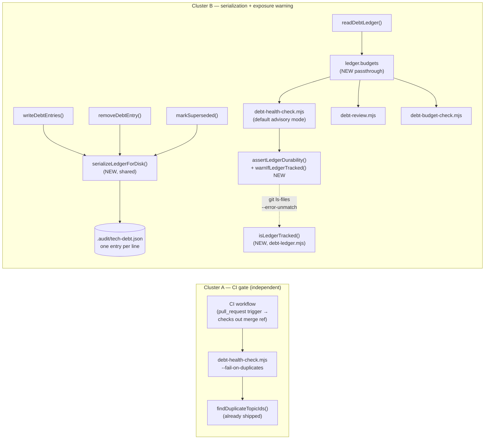

# Plan: Debt-Ledger Merge-Safety — CI Gate + Serialization Hardening

- **Date**: 2026-09-15
- **Status**: Implemented and code-audited to convergence. Plan audit: GPT converged after 4 rounds, Gemini APPROVE round 1. Implementation: Cluster A (CI-gate) converged after 4 code-audit rounds (PASS, H:0/M:1 — one pre-existing, already-adjudicated parser-consistency item); Cluster B (serialization + tracked-ledger warning + budgets passthrough + docstring fix + merge-acceptance test) converged after 2 rounds (PASS, H:0/M:0). Consolidated final gate (union diff, both clusters): round 1 CONCERNS (2 findings — missing promised unit tests, unsanitized git env in the new test harness — both fixed), round 2 **APPROVE** (0 new, 0 wrongly dismissed). 446 tests passing. Not yet shipped/committed.
- **Author**: Claude + Louis Strydom
- **Scope**: backend

- **Target domain(s)**: `tech-debt`, `stores`
- ⚠ **Cross-domain work** — the `budgets`-passthrough change on `readDebtLedger` touches both the ledger's own domain and its CLI consumers; the crossing is intentional (a shared accessor replacing duplicated raw reads).

## Neighbourhood considered

`get-neighbourhood` (k=8) against `debt-ledger.mjs` / `debt-review-helpers.mjs` / `debt-health-check.mjs` returned one `precedent` (`above-floor-cluster`) hit and seven `review`-band hits (all files this plan already touches, so no new duplication risk):

- **`mergeLedgers`** (`scripts/lib/debt-ledger.mjs:493`, `precedent`) — merges the *session* ledger (this audit round's findings) with the *debt* ledger for `suppressReRaises()` input, topicId-keyed `Map`, session wins collisions. **Decision: sibling, not reuse/extend, and NOT an idiom for the new serializer.** Its purpose (runtime suppression input for the CURRENT run) is orthogonal to this plan's concerns, and — corrected during round-1 plan audit (H2) — its topicId-keyed-`Map` idiom must **not** be reused for `serializeLedgerForDisk`: a Map keyed by topicId silently collapses repeated keys to one value, which is exactly the data-loss shape this plan exists to prevent (see Design decisions below, "the serializer is format-only"). `findDuplicateTopicIds` (already shipped) legitimately uses the Map idiom because its job IS to detect the collision, not resolve it; the serializer's job is the opposite — render whatever it's given, unconditionally.
- The `review`-band hits (`readDebtLedger`, `writeDebtEntries`, `removeDebtEntry`, `findStaleEntries`, `groupByPrinciple`, `debt-health-check.mjs::main`, `assertLedgerDurability`) are the exact functions this plan modifies — expected, not new precedent.

## Security incident neighbourhood

`get-incident-neighbourhood` (k=3) returned INC-002 (destructive-DSN test safety) and INC-001 (symlink path-canonicalization bypass) — neither has path overlap with this plan's targets, and neither's mechanism (DB DSN validation; symlink resolution) applies directly. **However, INC-001's lesson generalizes to a genuine new surface this plan considered and rejected**: see Security Considerations below.

## 1. Context Summary

### What exists today

An upstream bug report (id `00052a5a-a9b4-4b5c-ad99-16eeeab36ff6`, filed this session from consumer `Lbstrydom/wine-cellar-app`, verified via `node scripts/cross-skill.mjs upstream history --id ...` before designing against it — not taken on faith) documents 22 duplicated `topicId` entries (44 array elements for 22 logical items) in that consumer's `.audit/tech-debt.json` on `main`. 8 pairs are one untouched copy beside a second copy of the *same* topicId already marked `resolved`; 14 pairs are byte-identical duplicates. The reporter's inferred mechanism: `.audit/tech-debt.json` is a flat JSON array with no VCS-aware merge handling, so a plain 3-way `git merge` touching different array elements on each branch can silently union non-conflicting line ranges instead of conflicting — topicId is a logical record key git's line-based diff3 cannot see.

**Correction to the upstream report, found while verifying it (verification-discipline: don't take a filed report's causal narrative on faith).** The report attributes the exposure partly to `.audit/tech-debt.json` "isn't covered by the managed `.gitattributes` block that pins `.audit-loop/migrations/**`" — implying that block, if extended, would change merge *semantics*. It wouldn't: `scripts/lib/sync-eol-pins.mjs` (verified — the only `.gitattributes`-generating module in this repo) manages EOL normalization (`text eol=lf`) only, never merge drivers. This doesn't invalidate the core finding (the duplication is real, independently confirmed by the reporter's own regression test), but it means "extend an existing gitattributes mechanism" was never actually cheap — there is no existing merge-driver mechanism to extend.

**A second, more consequential fact found while verifying (not addressed in the upstream report at all): this repo's own `.gitignore` ignores `.audit/` in its entirety** (`.gitignore:69`, comment: *"Nothing under .audit/ is tracked (verified: `git ls-files .audit/` is empty)"*), and `debt-ledger.mjs`'s own module header states the same is true "in every consumer checked." A plain `git merge` cannot duplicate array elements in a file git does not track — untracked files are invisible to git's merge machinery. **The incident is therefore only possible in a consumer that tracks `.audit/tech-debt.json` in git, which is a deviation from this tooling's shipped default**, not something every consumer is exposed to. (Memory: `wine-cellar-app` has a documented history of diverging from upstream's expected file-tracking conventions — `project_wine_diverged_expected_schema_blocks_sync.md` — so a deliberate or legacy divergence here is plausible, though this plan doesn't attempt to confirm which.)

This changes the shape of the right fix. It does **not** mean the incident is fake or the fix is unnecessary — a real consumer hit real, silent data corruption, and any consumer choosing (deliberately or by legacy accident) to track this file remains exposed today with zero warning that they've done so. It means the fix should (a) help unconditionally regardless of tracking status where that's cheap, and (b) for the tracked-file case specifically, prefer the cheapest change that closes the *observed* failure signature over a larger migration that a broader read of the codebase (below) shows is not actually cheap.

**A brainstorm session (this conversation, `/brainstorm` + `/brainstorm debate`) explored two structural alternatives before this plan was written**: a `.gitattributes` merge driver (rejected — confirmed dead by both external models independently: it never runs on GitHub/GitLab web-UI merges or bot auto-merges, a structural blind spot, not an adoption-friction problem) and a per-topicId-file storage migration (`.audit/tech-debt/<topicId>.json`, one file per entry). The per-file option is **deferred, not built, in this plan** — see Risk & Trade-off Register §"Per-topicId-file storage — deferred" for why, discovered only during this plan's own Phase 1 exploration (the brainstorm assumed a smaller blast radius than the actual codebase has).

### Code Trace

- `scripts/lib/debt-review-helpers.mjs:findDuplicateTopicIds` (shipped earlier this session, commit not yet pushed) — groups `ledger.entries` by `topicId`, flags groups with count > 1. Detection already exists; this plan adds the CI-blocking mode that consumes it.
- `scripts/debt-health-check.mjs:main` (current HEAD) — reads `readDebtLedger()`, folds `stale`/`recurring`/`violations`/`duplicates` into `summary.triggered`, always exits 0 (healthy/unverifiable) or 1 (attention) or 2 (op-error) — **never distinguishes "any attention" from "specifically duplicates,"** which is why a CI gate needs a new, narrower mode rather than reusing the existing exit contract as-is.
- `scripts/lib/debt-ledger.mjs:writeDebtEntries` (lines 272-368, current HEAD) — the ONLY one of the three ledger-file writers that already sorts by topicId before writing (`sortedEntries = [...byTopic.values()].sort((a,b) => a.topicId.localeCompare(b.topicId))`, line 351, comment: *"Sort by topicId for stable diffs (makes merges localized)"*) — **this repo already ships half of the brainstorm's "sorted array" mitigation**, just not the "one record per line" half; all three writers use `JSON.stringify(next, null, 2)` (multi-line pretty-print per entry), which is exactly the shape that lets git's diff3 misalign on repetitive near-identical multi-line blocks.
- `scripts/lib/debt-ledger.mjs:removeDebtEntry` (lines 378-407) and `:markSuperseded` (lines 434-477) — both mutate-in-place/filter (never re-append), so they preserve whatever order the file was already in, but both still write via the same multi-line `JSON.stringify(..., null, 2)` as `writeDebtEntries` — meaning any ledger that has ever had an entry removed or superseded gets re-serialized in the same merge-hostile multi-line format regardless of what `writeDebtEntries` does. **Fixing only `writeDebtEntries`'s serialization would be incomplete.**
- `scripts/lib/debt-ledger.mjs:assertLedgerDurability` (lines 63-152) — already has exactly the oracle this plan's warning needs: `ignoredUntrackedPaths` (`scripts/lib/disowned-paths.mjs`), asked of the ledger path, currently used only to warn about the OPPOSITE condition (ignored-and-untracked ⇒ "this file won't survive a checkout"). The inverse condition (tracked, not ignored-and-untracked) is exactly "this file IS exposed to git merges" — the actual precondition for the incident — and nothing currently checks or warns about it.
- **Three independent raw-file-read bypasses of `readDebtLedger` for the ledger's top-level `budgets` field**, found via `Grep` across `scripts/*.mjs` for `readFileSync.*[Ll]edger`: `scripts/debt-health-check.mjs:205`, `scripts/debt-review.mjs:409`, `scripts/debt-budget-check.mjs:80` (`loadBudgets`). All three exist because `readDebtLedger`'s hydrated return (`{version, entries, available, reason}`) never surfaces `budgets`, which lives only on the raw parsed JSON. This is a pre-existing duplicated-logic smell independent of the merge-safety fix, but directly in scope because a serialization-format change touches the same raw-read/raw-write boundary these three reach around.
- `scripts/lib/debt-git-history.mjs:countCommitsTouchingTopic` / `:findFirstDeferCommit` — uses `git log -S<topicId> -- <ledgerPath>` (pickaxe search scoped to the single flat file) as a fallback metric source for `debt-pr-comment.mjs`. Confirmed **not directly affected** by this plan (no on-disk layout change), but flagged here because it's exactly the kind of consumer a per-topicId-file migration (deferred, see below) would need to rewrite — recorded so a future implementer of that migration doesn't have to rediscover it.
- Verified (`Grep`, 42 files reference `readDebtLedger|writeDebtEntries|DEFAULT_DEBT_LEDGER_PATH|ledgerPath`) that no other call site raw-reads/writes `.audit/tech-debt.json`'s entries directly — `audit-loop.mjs:414-419` (the only other candidate that mentions the literal path) goes through `readDebtLedger()` correctly.

### Known user-visible issues

N/A — backend/tooling-only, no persona-test data applies (get-persona-sessions-by-repo not consulted; scope excludes frontend).

## 2. Proposed Architecture

### Design decisions

- **CI-gate mode is a new flag on the existing advisory CLI, not a new binary** (#1 DRY — this repo already ships four debt-* CLIs; a fifth for one flag would be needless surface). `--fail-on-duplicates` narrows the exit-code decision to duplicates ONLY (ignoring stale/recurring/budget for exit-code purposes, though still printed) so a CI step gating on it doesn't flap on unrelated advisory noise (#16 graceful degradation — the gate must be surgical or teams disable it from fatigue).
- **`--fail-on-duplicates` exit contract (fixed round-1 audit H1 — the original wording left op-error/unavailable ambiguous)**, evaluated in this order, unchanged from the existing default-mode contract except the last row:

  | Ledger state | Exit | Same as default mode? |
  |---|---|---|
  | Corrupt JSON / unreadable (`readDebtLedger` throws) | 2 | Yes — untouched op-error path |
  | Absent / gitignored (`available === false`) | 0 | Yes — untouched "unverifiable, never a false clean" contract |
  | Available, `duplicates.length === 0` | 0 | No — default mode would still be 1 if stale/recurring/budget triggered; `--fail-on-duplicates` ignores those for its exit code |
  | Available, `duplicates.length > 0` | 1 | No — default mode's exit already covers this today; the flag's only behavioral difference is NARROWING what triggers exit 1, not widening it |

  Human/JSON output is unchanged in both modes — the flag only changes which conditions map to which exit code, never what's printed.
- **"Validate the prospective merged tree" needs no new CLI logic.** GitHub Actions' default `pull_request`-trigger checkout ref (`refs/pull/<n>/merge`) already **is** the merge result; the CLI just needs to run against whatever is on disk. This is documented in the new flag's usage text (#3 no hardcoding a workflow when the platform already provides the primitive) rather than built as a git-diffing feature.
- **Serialization is factored into ONE shared function** (`serializeLedgerForDisk`) called by all three writers (#1 DRY, #5 single source of truth) — the trace above shows this is necessary, not optional: fixing only `writeDebtEntries` would leave `removeDebtEntry`/`markSuperseded` reintroducing the merge-hostile format on the very next mutation.
- **The serializer is format-only — it MUST NOT deduplicate by topicId (fixed round-1 audit H2).** `serializeLedgerForDisk(ledger)` takes `ledger.entries` exactly as given and renders each element as one JSON-line, in existing array order — no `Map` construction, no reconciliation, no "last write wins." If it ever read an already-duplicate-laden ledger (e.g. one already corrupted by a merge, or read mid-repair), it must round-trip both copies unchanged. A Map-keyed-by-topicId implementation (the pattern `mergeLedgers`/`findDuplicateTopicIds` use for their own, different purposes) would silently discard one of exactly the resolved/unresolved pairs this plan exists to stop losing — making the serializer itself a second, silent place duplicates could disappear without triage. Deduplication stays where it already correctly lives: `findDuplicateTopicIds` (detection, surfaced to a human) + `debt-resolve.mjs` (the only sanctioned removal path).
- **The tracked-ledger warning does NOT reuse `ignoredUntrackedPaths` (corrected round-1 audit M1 — the original design inverted it incorrectly).** The inverse of "ignored AND untracked" is not "tracked" — a third state exists (untracked but matching no ignore pattern, e.g. a file nobody has `git add`ed yet), which is exactly as invisible to `git merge` as an ignored file, so treating "not ignored-and-untracked" as "merge-exposed" would false-positive on it. The actual precondition for merge exposure is TRACKED, which needs a direct check: a new small `isLedgerTracked(absPath, repoRoot)` helper in `debt-ledger.mjs`, using `git ls-files --error-unmatch -- <relPath>` (exit 0 = tracked, exit 1 = not, anything else = degraded/unknown) — the same idiom this repo already has three separate untied instances of (`worktree-identity.mjs:267`, `remove-legacy-synced.mjs:isTracked`, `sync-divergence.mjs:304`). This plan adds a fourth, narrowly scoped instance rather than consolidating the existing three (out of scope here — noted as a candidate for a future single-oracle extraction if a fifth caller appears).
- **`budgets` becomes a first-class field on `readDebtLedger`'s return**, closing three independent raw-read duplicates with one accessor (#5 single source of truth) — additive only (`entries` keeps its exact meaning; existing callers destructuring `{entries}` are unaffected).

## 3. Sustainability Notes

### Right-sizing gate (new structure: `serializeLedgerForDisk`, the tracked-ledger warning)

- **Band-aid extreme**: patch `writeDebtEntries`'s `JSON.stringify` call only, leave `removeDebtEntry`/`markSuperseded` as-is. Leaves the format inconsistent the moment an entry is resolved or removed — the root cause resurfaces on the very next non-`writeDebtEntries` mutation.
- **Over-engineered extreme**: the full per-topicId-file storage migration (one file per entry) — see Risk Register for why it's deferred, not just "more work than needed here."
- **Chosen**: one shared serializer, called by all three writers, closing the actual observed failure signature (multi-line near-identical blocks) at the cost of one small new function — the current requirement is "stop producing the exact byte pattern that let diff3 misalign," not "eliminate every theoretical git-merge edge case."

### Assumptions that could change

- Assumes `topicId` values remain machine-generated 12-char lowercase hex (`generateTopicId`, `lib/ledger.mjs:49-59`) for the compact-serialization change to produce genuinely short, diffable lines. The `PersistedDebtEntrySchema` only declares `topicId: z.string()` (no format constraint) — if a future code path starts writing non-hex topicIds, the mitigation still works structurally (one JSON object per line regardless of key content) but loses none of its safety either way; noted only because it's the kind of unstated assumption that's worth a comment at the write site.
- Assumes GitHub Actions' `pull_request`-trigger default checkout behavior is stable API surface (it is; documented platform behavior, not an implementation detail this repo controls).

## 4. Risk & Trade-off Register

### Per-topicId-file storage — deferred (not built in this plan)

The original ask (this session's brainstorm) specified a per-topicId-file I/O adapter (`.audit/tech-debt/<topicId>.json`) as the structural fix, on the assumption it was a contained change to `debt-ledger.mjs`'s read/write boundary alone. **Phase 1 exploration for this plan found the actual blast radius is larger**:

- Three call sites raw-read the flat file for `budgets` (fixed in this plan regardless — but a per-file migration would need to relocate `budgets` somewhere, since it's a ledger-wide field with no natural per-topicId home).
- `debt-git-history.mjs`'s pickaxe-based fallback metrics (`git log -S<topicId>`) are written against a single flat-file path; a migration would need to rewrite them to per-topicId `git log` (arguably an improvement — no more pickaxe undercounting — but real rework, plus its consumer `debt-pr-comment.mjs`).
- **A genuine new security surface**: `topicId` has no format constraint at the schema level (`z.string()`, unbounded), and using it to construct a filesystem path (`.audit/tech-debt/<topicId>.json`) would need path-traversal defenses (reject/canonicalize before use — the same discipline INC-001 established for symlink targets, applied to a different mechanism) that don't exist today because topicId has never been used as a path component.
- A one-off migration script (+ reverse, for rollback) with its own test coverage.

None of this makes the migration wrong — it makes it a **separate, larger, its-own-plan** piece of work, and building it now would violate the design right-sizing gate ("smallest thing that's a true function of the problem"): the actual incident's failure signature (14 byte-identical duplicate pairs, 8 "one side touched, one side untouched" pairs) is fully consistent with git diff3 misaligning on repetitive **multi-line** JSON blocks — exactly what compact one-record-per-line serialization (this plan, Cluster B) directly targets. **Revisit trigger**: a consumer reports continued duplicate-topicId incidents on a ledger already using the compact serialization from this plan (i.e., the cheap fix demonstrably didn't close the gap) — at that point the per-file migration's now-larger, now-understood scope is the next plan to write, informed by this one's Code Trace.

### The fix only protects consumers who deviate from the shipped default

`.audit/tech-debt.json` is gitignored by default in every consumer (verified: this repo's own `git ls-files .audit/` is empty). A consumer following the default is never exposed to this incident class at all — no merge ever touches an untracked file — and for them, Cluster A's CI gate and Cluster B's serialization/warning are inert-but-harmless (the gate reports `unverifiable` on a missing ledger, per `debt-health-check.mjs`'s existing availability contract; the warning simply never fires because `isLedgerTracked` reports `false`). This plan does not attempt to determine why the affected consumer tracks the file, or to recommend untracking it — that's a per-consumer decision outside this repo's authority, and the new tracked-ledger warning (Cluster B) is deliberately worded to inform, not prescribe (mirrors `assertLedgerDurability`'s existing "state the fact, not an imperative" tone for the unknown-cloud-mirror case).

### CI-gate false negative: a consumer whose workflow checks out only the head ref

If a consumer's CI is misconfigured to check out the PR head branch instead of the merge ref (or triggers on `push` rather than `pull_request`), `--fail-on-duplicates` validates a tree that was never actually merged, missing the exact failure this exists to catch. Documented in the new flag's usage text as a prerequisite, not silently assumed — consistent with this plan's own citation above of "validate the prospective merged tree, not either branch independently."

## 5. Testing Strategy

- **Unit**: `findDuplicateTopicIds` already covered (shipped this session). New: `serializeLedgerForDisk` — one-entry-per-line output, valid JSON round-trip, stable across all three writers, AND (round-1 audit H2) **preserves both copies of a pre-existing duplicate topicId unchanged** — the negative-control test that proves the serializer never deduplicates. New: `isLedgerTracked` — mock the underlying `git ls-files --error-unmatch` call (three branches: tracked → true; untracked → false; git-unavailable/non-repo → degraded/unknown, mirrors `assertLedgerDurability`'s existing degraded-branch test pattern) and the resulting `warnIfLedgerTracked` (tracked → warns once; untracked → silent; degraded → silent, never a false positive).
- **CLI integration**: `debt-health-check.mjs --fail-on-duplicates` — the full exit-contract table from §2 Design decisions, all four rows (op-error stays 2, unavailable stays 0, available-clean is 0, available-with-duplicates is 1 REGARDLESS of stale/recurring/budget state — proves the narrowing works, not just the union). `debt-review.mjs` / `debt-budget-check.mjs` — budgets read via `ledger.budgets` produces identical results to the old raw read (regression, not new behavior).
- **Merge-level acceptance test (round-1 audit M2; tightened round-2 audit M2 — "zero duplicates" alone doesn't prove a merge was correct, and a genuine conflict is a legitimate third outcome the first draft didn't account for).** A real two-branch `git merge` reproduction, in the shape this session's own incident investigation proposed. The property under test is NOT "the merge always succeeds cleanly" — it's **"the merge never silently corrupts,"** which allows exactly two acceptable outcomes and forbids a third:
  - **(a) Clean merge** — `git merge` exits 0. Assert ALL of: final entry count equals the expected count (no entry silently dropped), each branch's actual edit is present in the merged content (not just "no duplicate" — the RIGHT content), and `findDuplicateTopicIds` returns `[]`.
  - **(b) Loud conflict** — a genuine, detectable content conflict. Acceptable — a human resolves it, same as any other merge conflict. **Detected precisely, not by exit code alone (round-3 audit M3 — a non-zero exit can also mean an unrelated operational failure, e.g. a bad ref or missing commit identity, which proves nothing about the intended content merge)**: the test repo pre-configures `user.name`/`user.email` so those specific operational failures can't occur, and outcome (b) is confirmed by `git merge` exiting exactly 1 **combined with** `git status --porcelain` showing an unmerged path (`UU`/`AA` status codes) for the ledger file — the standard two-part signal for an actual content conflict, not `<<<<<<<` marker presence alone (a marker could theoretically appear in legitimate JSON string content) and not "any non-zero exit" (128/spawn errors mean the harness itself is broken, and must fail the test loudly rather than being read as a passing outcome).
  - **(c) FORBIDDEN — the actual bug**: `git merge` exits 0 (looks clean) but the result has duplicate topicIds, a dropped entry, or the wrong side's edit. This is the only failing outcome; (a) and (b) both pass.

  Two scenarios, seeded via `writeDebtEntries` so the base ledger is already in the new compact/sorted format: **Scenario 1** — branch X resolves existing entry `e5` (adds `status`/resolution fields) without touching anything else; branch Y independently resolves a *different* existing entry `e8`. Mirrors the incident's 8 "one side touched, one side untouched" pairs. **Scenario 2** — branch X and branch Y each `writeDebtEntries` a *new* entry with topicIds crafted to be lexicographically adjacent (e.g. differing only in the last hex digit), so both insertions land at nearly the same line in the sorted file — deliberately stresses the near-identical-adjacent-block condition that mirrors the 14 byte-identical-duplicate pairs.

  Run both scenarios against the OLD `JSON.stringify(..., null, 2)` multi-line format too, as a control, with an important honesty caveat: git's diff3 line-context behavior on repetitive multi-line text is a real but not perfectly deterministic mechanism, so the control's outcome is **logged, not hard-asserted** — this plan does not claim to force a git internal to misbehave on demand. What IS hard-asserted, on BOTH formats: outcome (c) never happens for the NEW compact format across all scenario runs (the actual safety property this plan delivers); the control run against the OLD format is recorded evidence for the "compact serialization addresses the observed signature" claim, not proof by construction.
- **Edge cases**: an entry with a `topicId` containing no unusual characters but a very long `detailSnapshot`/`contentAliases` array still serializes as one line (no accidental line-wrapping from a stray formatter); `removeDebtEntry` on a ledger last written by `writeDebtEntries` preserves the compact format (proves the shared-serializer fix, not just each function tested alone).

## 6. File-Level Plan

### Cluster A files

- **`scripts/debt-health-check.mjs`** (modify) — add `--fail-on-duplicates` flag; new exit-code branch scoped to `summary.duplicates.length > 0` only; usage-text CI recipe (`pull_request` trigger note).
- **`tests/debt-health-check.test.mjs`** (modify) — CLI tests for the new flag (exit 0/1 in both directions, independent of other advisory dimensions).

### Cluster B files

- **`scripts/lib/debt-ledger.mjs`** (modify) — `serializeLedgerForDisk()` (new, exported for tests, format-only per H2 fix above); `writeDebtEntries`/`removeDebtEntry`/`markSuperseded` call it instead of inline `JSON.stringify(..., null, 2)`; `isLedgerTracked(absPath, repoRoot)` (new, exported — `git ls-files --error-unmatch`, per M1 fix above) + `warnIfLedgerTracked()` (new, exported, sibling to `assertLedgerDurability`, warn-once pattern), called once from `debt-health-check.mjs`; `readDebtLedger` return gains `budgets` (sourced from the already-parsed raw JSON it reads internally).
- **`scripts/debt-health-check.mjs`** (modify — same file as Cluster A, different hunk) — replace its raw `budgets` read with `ledger.budgets`; call `warnIfLedgerTracked()` once in the default (non-`--fail-on-duplicates`) path.
- **`scripts/debt-review.mjs`** (modify) — replace its raw `budgets` read with `ledger.budgets`.
- **`scripts/debt-budget-check.mjs`** (modify) — replace its raw ledger-`budgets` read (the non-`--budgets-file` branch of `loadBudgets`) with `ledger.budgets`.
- **`scripts/lib/debt-review-helpers.mjs`** (modify) — correct the `findDuplicateTopicIds` docstring's "Deliberately deferred" note: replace the adoption-friction framing with the debate's actual finding (a `.gitattributes` merge driver never runs on GitHub/GitLab web-UI or bot-driven merges — structural, not friction), and separate out the per-topicId-file migration as its own named deferred option pointing at this plan doc's Risk Register.
- **`tests/debt-ledger.test.mjs`** (modify) — `serializeLedgerForDisk` unit tests (including the H2 negative control: pre-existing duplicates survive unchanged); `isLedgerTracked` unit tests (tracked / untracked / degraded branches — a pure function, safe in-process).
- **`tests/debt-ledger-durability.test.mjs`** (modify — final-gate G1) — `warnIfLedgerTracked` unit tests, added here rather than `debt-ledger.test.mjs`: this file already runs each case in a fresh child process (its established pattern for `assertLedgerDurability`'s own warn-once state), which `warnIfLedgerTracked`'s module-level latch needs for the same reason — an in-process describe block would leak the "already warned" flag across test cases within the file.
- **`tests/debt-ledger-merge-safety.test.mjs`** (create) — the M2 merge-level acceptance test (see §5 for the full outcome-(a)/(b)/(c) contract, and the exact `git status --porcelain`-based conflict-detection recipe fixed round-3 audit M3). Throwaway git repo with `user.name`/`user.email` pre-configured (so an operational failure can't masquerade as outcome (b)), branches, real `git merge` invocations via `child_process`. Hard-asserts outcome (c) — silent duplication, entry loss, or wrong-side content with a clean exit — never occurs for the new compact format across both scenarios; logs (does not hard-assert) the old-format control's outcome for the same scenarios. Isolated in its own file rather than folded into `debt-ledger.test.mjs` because it spawns real git subprocesses against temp repos (heavier setup/teardown than the rest of that suite's in-memory-fixture tests).
- **`tests/debt-budget-check-cli.test.mjs`** (modify) — budgets-via-`ledger.budgets` regression.
- **`debt-review.mjs`'s budgets-read swap has no existing CLI test file to extend** (verified: `Grep` for `debt-review\.mjs` under `tests/` returns no test suite — its CLI `main()` is currently untested at that level; only its pure helpers in `debt-review-helpers.test.mjs` are covered). Closing that pre-existing coverage gap is out of scope for this fix (design right-sizing: this plan fixes the merge-safety issue, not unrelated test debt) — verify the swap with a manual smoke run (`node scripts/debt-review.mjs --local-only` against a seeded ledger with budgets) during implementation instead of adding a new CLI test suite.

Close-out (not a phase): none — no build/regen step touches these files (no skills:regenerate needed, backend-only CLI change).

## 7. Implementation Phases

**Phase 1 — CI-blocking duplicate gate**: `debt-health-check.mjs`'s `--fail-on-duplicates` flag + usage text. Files: `scripts/debt-health-check.mjs` (modify), `tests/debt-health-check.test.mjs` (modify).

**Phase 2 — Shared ledger serialization**: `serializeLedgerForDisk()` in `debt-ledger.mjs`, adopted by all three writers. Files: `scripts/lib/debt-ledger.mjs` (modify), `tests/debt-ledger.test.mjs` (modify).

**Phase 3 — Tracked-ledger exposure warning + budgets passthrough**: `isLedgerTracked()` + `warnIfLedgerTracked()` + `readDebtLedger`'s `budgets` field, wired into all three raw-read call sites. Files: `scripts/lib/debt-ledger.mjs` (modify, same file as Phase 2 — different functions), `scripts/debt-health-check.mjs` (modify, same file as Phase 1), `scripts/debt-review.mjs` (modify — no existing CLI test file; verify via manual smoke run), `scripts/debt-budget-check.mjs` (modify), `tests/debt-ledger.test.mjs` (modify), `tests/debt-budget-check-cli.test.mjs` (modify).

**Phase 4 — Docstring correction**: `scripts/lib/debt-review-helpers.mjs` (modify) — no test (doc-only).

**Phase 5 — Merge-level acceptance test**: the M2 real-`git merge` reproduction proving the compact serialization (Phase 2) actually closes the observed failure signature, with the old format run as a control in the same harness. Files: `tests/debt-ledger-merge-safety.test.mjs` (create).

## 8. Execution Clustering

- **Cluster A** — Phase 1 — fix-gate: yes
  - Coupling: N/A (single phase, independent of Cluster B — the CI gate works whether or not the serialization change ships).
- **Cluster B** — Phases 2-5 — fix-gate: final
  - Coupling: Phases 2 and 3 both touch `debt-ledger.mjs`'s write path and are tested together (Phase 3's warning is only meaningful once Phase 2's serialization exists to protect); Phase 4 documents the combined decision from both; Phase 5 is the acceptance test proving Phase 2's actual claim (needs Phase 2 landed to test against). Additional files: none beyond §6/§7 listings.

- **Final gate**: mandatory consolidated Gemini review over the union diff of both clusters.
