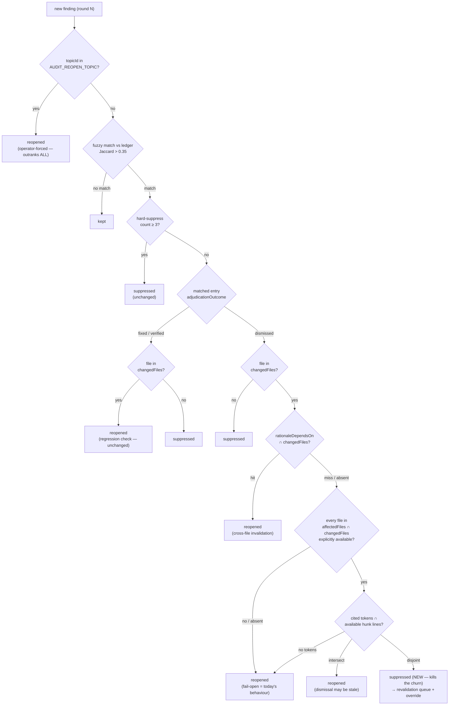

# Plan: Dismissed-FP Reopen Policy (split `dismissed` from `fixed`)

- **Date**: 2026-07-16
- **Status**: Complete (closed 2026-07-22) — this plan's committed scope was
  **Phase 1 only**, which shipped and cleared the Gemini gate (see below).
  Nothing actionable remains *under this plan*: Phase 2 is explicitly out of
  scope, its design is SUPERSEDED, and it must not be built from this document
  (see "Phase 2 … DO NOT IMPLEMENT from this document" + "Why Phase 2 is not in
  this plan's scope"). The pending Phase-1 empirical protocol (a local 5-run
  re-raise experiment) is a **trigger to author a fresh Phase-2 plan** on the
  `evidence-triage.mjs` primitives if it fires ≥1/5 — it is not remaining work
  on this plan. Status was previously "In Progress"; corrected because the
  label implied live scope here.
  <br>_Original Phase-1 record:_ Phase 1 implemented 2026-07-17 (`buildRulingsBlock`
  rewritten; `tests/rulings-block-guard.test.mjs` +
  `tests/sensitive-egress.test.mjs` extended (written test-first: confirmed RED
  against the old implementation, then GREEN). Full suite 6545 pass / 0 fail.
  **Phase 2 (Layer 3) SHIPPED 2026-08-14 — see "Layer 3 as shipped" below.** It
  was NOT built from this document's superseded token-intersection design, and
  it did not need the `evidence-triage` anchors either: making `is_reopened`
  representable earlier the same day supplied a cheaper signal than the anchor
  work this plan assumed would be required. The 5-trial empirical protocol below
  never ran; the scope call was taken deliberately on two independent field
  occurrences, and the policy ships with a kill switch and its own
  false-negative counter instead of on the protocol's evidence. Recorded that
  way rather than retro-fitting the protocol to the decision.
  <br>**2026-08-14 (earlier)**: a second independent field
  occurrence was recorded, and investigating it found + fixed a SEPARATE defect
  (the `is_reopened` prompt→schema contract was unrepresentable, so the reopen
  signal had never been recordable at all). That fix is **not** Phase 2 and
  changes no routing — it is the instrument Phase 2's decision was missing. See
  "2026-08-14 field evidence" below the protocol table. Approved — 3 GPT rounds
  + 2 Gemini rounds.
  GPT: HIGH 3→3→3, stopped at the cap on a **scope decision**, not convergence
  (the findings were real but concentrated in Phase 2, which this plan now
  defers — see "Why Phase 2 is not in this plan's scope"); R1-H2 went to
  deliberation, ruling `compromise` (HIGH→MEDIUM). Gemini final gate: round 1
  `CONCERNS` (2 MEDIUM, both defects introduced by the R3 restructure — a
  circular marker-budget dependency and a Phase-1/Phase-2 test-matrix scope leak
  that would have build-broken an autonomous implementer); both fixed; round 2
  **`APPROVE`** (0 new findings, 0 wrongly-dismissed, no Claude bias detected).
  **Shipping scope = Phase 1 only**: `buildRulingsBlock` + 2 test files, ~60
  lines.
- **Author**: Claude + Louis Strydom
- **Scope**: backend

- **Target domain(s)**: `shared-lib` (`ledger.mjs`, `text-normalize.mjs`), `audit-orchestration` (`legacy-production-audit.mjs`, `llm-helpers.mjs`)
- ⚠ **Cross-domain work** — the coupling is deliberate and follows the existing
  allowed direction (`audit-orchestration` → `shared-lib`). The new pure
  primitive lands in `shared-lib` so `shared-lib` never imports upward; see
  §"Where the token primitive lives".

## Neighbourhood considered

`get-neighbourhood` against `ledger.mjs` + `evidence-triage.mjs` returned
`suppressReRaises` (`scripts/lib/ledger.mjs:287-418`) as the top match
(score 0.862, similarity 0.770, recommendation **`justify-divergence`**).
**This plan does not diverge** — it *modifies that exact function* rather than
writing a sibling suppressor, so the high score is expected self-similarity.
Same for `buildRulingsBlock` (0.789) and `populateFindingMetadata` (0.805) —
both files this plan directly edits.

The load-bearing reuse signals from the query:

- **`scripts/lib/text-normalize.mjs`** (in-flight, untracked as of writing) —
  created by `docs/plans/stage0-evidence-relevance-split.md` (round-2 M1) as
  *"dependency-neutral text-normalization primitives shared between `shared-lib`
  (`vcs.mjs`) and `audit-orchestration` (`evidence-triage.mjs`) — extracted so
  neither domain imports from the other for a primitive this generic."* That is
  **precisely** this plan's cross-domain problem, already solved one plan
  earlier. `extractCodeTokens` belongs there — not in a new module.
- **`quoteAppearsOnSide`** (`evidence-triage.mjs:139`, 0.794) and
  **`extractFileDiffSection`** (`evidence-triage.mjs:49`, 0.785) already parse
  diff hunks. They are `audit-orchestration`; `ledger.mjs` is `shared-lib`, and
  the domain map allows `shared-lib → {findings, plan}` **only** — importing
  them into `ledger.mjs` would be an illegal upward edge. Resolved by
  dependency injection (§"Key design decisions" #3), not by a new parser.

## Past incidents to verify against

No `security-strategy.md` incident matches this surface (no auth/payment/PII/
egress path is touched; the ledger is local JSON and the prompt block is
already sent to the auditor today). The relevant *prior art* is not a security
incident but a recurring correctness class in this repo: **vacuous-green /
silent-suppression bugs** (three tiered-shadow window incidents + the phantom
`AI-Gate` producer). This plan makes suppression *more* aggressive, so it sits
squarely in that class — §"Risk & Trade-off Register" and the testing strategy
treat "a real finding silently suppressed" as the primary failure direction.

---

## Context Summary

### What exists today (Code Trace)

The R2+ defence against finding churn is documented (AGENTS.md "R2+ Audit
Mode") as three layers. Layers 1 and 3 contain **the same conflation bug**:
they apply `fixed`-shaped semantics to `dismissed` entries.

**Layer 1 — rulings injection** (`buildRulingsBlock`, `ledger.mjs:429-510`,
reached via `llm-helpers.mjs:98`). It renders three groups (`DISMISSED`,
`SEVERITY ADJUSTED`, `FIXED`) under **one shared header**:

```
scripts/lib/ledger.mjs:467-471
  'These items were deliberated in prior rounds. Do NOT re-raise them unless',
  'the code they affect has materially changed (in which case mark as REOPENED).',
```

In a fix loop the code affected **has** materially changed every round — that
is what a fix loop *is*. So for a dismissed entry this header is not a weak
deterrent, it is an **explicit licence to re-raise**, and the auditor takes it.

Worse, it directly contradicts the block it is concatenated to.
`buildR2SystemPrompt` (`ledger.mjs:541`) emits
`${R2_ROUND_MODIFIER}\n\n${rulingsBlock}`, and `R2_ROUND_MODIFIER`
(`ledger.mjs:513-535`) already says exactly the right thing:

```
DO NOT:
- Re-raise findings from YOUR PRIOR RULINGS section below
- Paraphrase a dismissed finding as "new" — that contradicts your own judgment
```

The model therefore receives a strict prohibition, immediately followed by an
escape clause whose condition is always true. **Contradictory instructions, and
the permissive branch wins.** Layer 1 isn't under-powered; it is
self-cancelling.

Two further Layer-1 losses on the same path:
- the dismissal's reason is truncated to **100 chars**
  (`ledger.mjs:481`: `(d.rulingRationale ?? '').slice(0, 100)`) — a real
  disproof ("Zod schema at `src/schemas/wine.ts:42` accepts `style: null`;
  verified by direct parse + `tests/db/wine.test.ts:88` green against real
  Postgres") is ~155 chars and gets cut mid-sentence, so the evidence that
  would refute the re-raise never reaches the model;
- only the first **8** dismissed entries render (`.slice(0, 8)`), and the whole
  block is hard-capped at **1500 chars** (`ledger.mjs:504`).

**Layer 3 — post-output suppression** (`suppressReRaises`, `ledger.mjs:287`).
After a fuzzy match (Jaccard > `SUPPRESS_SIMILARITY_THRESHOLD`, default 0.35)
the reopen check runs (`ledger.mjs:392`):

```js
const scopeDirectlyChanged = bestMatch.affectedFiles.some(af => changedSet.has(normalizePath(af)));
if (scopeDirectlyChanged) { /* → reopened */ } else { /* → suppressed */ }
```

`bestMatch` may be a `dismissed` entry or a `fixed`/`verified` one — the branch
does not care. For `fixed` this is regression detection and **correct**. For
`dismissed` it re-litigates a claim whose truth did not change because the file
was edited for unrelated reasons.

**Layer 2** (`R2_ROUND_MODIFIER` pass rubric) is not implicated.

**The backstop** (`HARD_SUPPRESS_THRESHOLD = 3`, `ledger.mjs:325-345`) counts
`dismissed`/`overrule` **ledger entries** per `category|primaryFile` and
hard-suppresses at 3, *before* the reopen check — so it does eventually win, at
a cost of three rounds of operator disproof, and only if the auditor keeps the
category label stable across rounds.

> **Correction to an earlier session note**: the hard-suppress index iterates
> `resolved` (ledger entries), **not** suppression outcomes. This plan creates
> no new ledger entries, so it has **no interaction** with the hard-suppress
> count — an earlier claim that heuristic suppressions must be excluded from it
> (by analogy to `source: 'stage1-mechanical'`) was wrong. `stage1-mechanical`
> is excluded because it *writes entries*; this plan does not.

**Field evidence** (private consumer repo, 2026-07-16): a GPT false positive
("backend rejects `style: null`") re-raised **3 consecutive rounds**, new
content hash each round. The operator disproved it each round via direct Zod
parse + a passing real-Postgres integration test. Gemini's gate scored
`gpt_false_positive_count: 6`, coherence Strong. Both mechanisms above are
sufficient to explain it; the hash drift also defeats the exact-fingerprint
layer (`applyLedgerSuppression`) independently.

### Patterns reused vs new

**Reused** — `text-normalize.mjs` (the cross-domain-primitive home, and its
`normalizeWhitespace`); `suppressReRaises`'s existing three-step
narrow→score→reopen structure (this plan changes step 3's branch condition
only); the existing `opts` dependency-injection seam on `suppressReRaises`;
`normalizePath` for path identity; the `source`-aware filter idiom already in
`suppressReRaises` for per-class policy.

**New** — `extractCodeTokens` (one pure function in `text-normalize.mjs`); one
`opts.changedHunksByFile` parameter; a per-outcome-group header in
`buildRulingsBlock`.

---

## Proposed Architecture

### Right-sizing gate (the reopen policy)

- **Band-aid extreme**: raise `HARD_SUPPRESS_THRESHOLD` from 3 to 1, or lower
  `SUPPRESS_SIMILARITY_THRESHOLD`. Treats the symptom (churn count) while
  leaving the actual defect — `dismissed` and `fixed` sharing a reopen rule —
  in place, and buys the reduction with a blunt, global recall cut on *every*
  category+file pair including `fixed` ones. Rejected.
- **Over-engineered extreme**: GPT-5.6's full state machine
  (`suppressed_pending_revalidation` / `stale_unverified` states, a five-way
  `evidenceClass` taxonomy, severity-tiered bypass, an AST-anchor ladder), or
  Gemini-pro's rationale-diff micro-LLM triage pass ("does this diff invalidate
  this rationale? YES/NO"). Both are coherent designs, but no *current*
  requirement needs them: the anchor ladder is what the tiered pipeline's
  `EvidenceAnchorV2` already builds (duplicating it here would be a second,
  competing anchor implementation), and the micro-LLM pass adds a new
  silent-failure surface — an LLM that wrongly answers "NO" suppresses a real
  finding invisibly, which is the exact failure direction this repo has been
  burned by three times. Both rejected **for v1**, both recorded in §Out of
  Scope with revisit triggers.
- **Chosen**: split the reopen branch by `adjudicationOutcome`, and gate
  `dismissed` reopen on a **deterministic relevance check** — do the round's
  diff hunks for that file touch any identifier the finding actually cites? No
  LLM, no new state, no schema change. This is the smallest thing that is a
  true function of the problem: the defect is "file-touch is too coarse a
  staleness signal for a dismissal", and the fix narrows exactly that signal.
  It is also **convergent, not throwaway** — a token/hunk intersection is a
  fuzzy, retroactive `verifyAnchor`, so when `EvidenceAnchorV2` lands the same
  branch upgrades from "cited tokens intersect the hunk" to "the anchor's
  quote+lines intersect the hunk" without restructuring.

### Right-sizing gate (the prompt fix)

- **Band-aid**: strengthen the wording ("REALLY do not re-raise"). Leaves the
  contradiction in place; prompt-shouting against a still-present escape clause.
- **Over-engineered**: restructure the whole R2 prompt assembly / make the
  rulings block per-entry-templated.
- **Chosen**: give each outcome group its own header sentence, so the
  reopen-on-change clause attaches to `FIXED` (where it is correct) and not to
  `DISMISSED`; and stop truncating a dismissal's disproof below the length a
  real disproof needs. Two localized edits inside one function.

### Where the token primitive lives

`ledger.mjs` is `shared-lib`. The domain map allows `shared-lib → {findings,
plan}` — **not** `audit-orchestration`. So `ledger.mjs` may not import
`evidence-triage.mjs`'s existing `extractFileDiffSection`/`quoteAppearsOnSide`.
Three options were considered:

1. Duplicate a small diff parser inside `ledger.mjs` — rejected (DRY; a second
   diff parser is exactly the duplication the arch-memory wave flags).
2. Move diff parsing down into `shared-lib` (`vcs.mjs`) — plausible, but
   `vcs.mjs` is concurrently being modified by the stage0 plan (blame support),
   and hunk parsing is not obviously a VCS-contract concern. Deferred.
3. **Chosen — dependency injection.** `suppressReRaises` already takes an
   `opts` object (`{changedFiles, impactSet}`); add `changedHunksByFile`. The
   **caller** (`legacy-production-audit.mjs`, which *is* `audit-orchestration`
   and already holds the diff) computes it. `ledger.mjs` gains one import:
   `extractCodeTokens` from `text-normalize.mjs` (`shared-lib` → `shared-lib`,
   legal). No new domain edge; testable without a git fixture (Tier-1 doctrine).

### Key design decisions

1. **`fixed`/`verified` behaviour is byte-identical to today.** Regression
   detection stays aggressive. Only the `dismissed` branch changes. (Gemini-pro
   argued file-touch is too coarse for `fixed` too — deliberately **not**
   adopted: that is a separate, unevidenced change to the one mechanism that
   catches undone fixes. Recorded in §Out of Scope.)
2. **Fail-open on missing signal — via an EXPLICIT per-file availability
   record, never a bare map** (rewritten — R1 H1). The original draft failed
   open only when `changedHunksByFile` was `null` or the finding had no tokens.
   That left a real hole: a **non-null map missing an entry for an affected
   file** (binary change, rename-only change, malformed/partial diff, a
   path-normalization mismatch, an unsupported patch shape) yields no hunk text
   → an empty hunk-token set → empty intersection → **suppress**. That
   contradicts both the mermaid (`no hunk data → reopened`) and this very
   decision, in the silent-suppression direction. Absence of data was being
   read as evidence of irrelevance.

   The contract is therefore **explicit availability, not map presence**:
   ```
   ChangedHunks = Map<normalizedPath, {availability:'available', changedText: string}
                                    | {availability:'unavailable', reason: string}>
   ```
   The builder emits **one record per `changedFiles` entry**, using the *same*
   `normalizePath` for changed-file and diff-file identity (a normalization
   mismatch must surface as `unavailable`, never as a silent miss). Parser
   failure ⇒ `unavailable` ⇒ reopen.

   **The relevant set is `affectedFiles ∩ changedFiles` — NOT `affectedFiles`**
   (R2 H1 — a real bug this decision introduced in R1 and which would have made
   the whole feature dead code). `changedHunks` contains **only changed files**
   by construction. An earlier draft said "any affected file absent from the map
   → reopen"; for a finding affecting files `A` and `B` where only `A` changed,
   `B` is absent **precisely because it did not change** — so the rule would
   reopen every multi-file finding, unconditionally, forever. An unchanged file
   cannot invalidate a dismissal and must simply **not be consulted**.

   Corrected rule: let `relevant = entry.affectedFiles ∩ changedFiles`
   (normalized both sides). `dismissalMayBeStale` requires an explicit
   `available` record for **every member of `relevant`**, and reopens if any
   member is `unavailable` or absent from the map. Files outside `relevant` are
   ignored. `relevant` is non-empty by construction here (the branch is only
   reached when `scopeDirectlyChanged` already held). A missing signal degrades
   to today's behaviour, never to something stricter.
3. **The relevance check is a narrowing of file-touch, never a widening.** A
   dismissal that file-touch would have suppressed stays suppressed. The only
   behaviour change is: file touched **but** no cited identifier appears in the
   hunk → suppress instead of reopen.
4. **Token intersection is a HEURISTIC RELEVANCE PROXY, not a sound test**
   (rewritten — R1 H2, GPT ruling `compromise`). An earlier draft claimed it was
   "sound for both deterministic and judgment dismissals". **That was
   overstated and is withdrawn.** A change can invalidate a rationale while
   sharing zero retained lexical tokens with it — by altering a called
   dependency, a config/data contract, or control flow around the quoted
   terminology. What the check actually claims is narrower and defensible: it
   **narrows** file-touch, and every scenario it newly suppresses is one where
   the round's hunks for that file mention nothing the dismissal or the finding
   cites.

   The honest baseline is **file-touch (what ships today)**, *not* a perfect
   anchor system (which does not exist in production — see decision #6):

   | Scenario | file-touch (today) | token-intersection (proposed) |
   |---|---|---|
   | Cited disproof branch deleted | reopen | reopen — identifiers persist on the hunk's `-` lines |
   | Invalidating change in a **different** file | **suppress (miss)** | **suppress (same miss)** — pre-existing, see #5 |
   | Config/contract change, same file, zero lexical overlap | reopen | **suppress (NEW miss)** |
   | Unrelated edit to the same file (the field case, ~every round of a fix loop) | reopen (**churn**) | **suppress (the fix)** |

   Only row 3 is a genuine regression: same file, changed region, zero overlap
   with the finding **or** the rationale, on an entry a human already dismissed
   after a fuzzy match fired. It is accepted **because** rows 1/2/4 hold, and it
   is made recoverable by the revalidation queue (#7) rather than silently
   absorbed.

5. **The known residual hole is stated, not hidden**: a dismissal whose
   disproof lives in a **different file** (e.g. "handled upstream in `Y`") goes
   stale when `Y` changes, and neither today's policy nor this one reopens it
   (the finding's own file was never touched). Pre-existing; **partially closed**
   by `rationaleDependsOn` (#8).

6. **Phase 2 does NOT wait for `EvidenceAnchorV2`** (R1 H2 contested and
   sustained on this point; GPT: *"requiring production EvidenceAnchorV2 before
   addressing the legacy path would leave every existing, unanchored ledger
   entry on the known-bad file-touch behavior for an indeterminate period"*).
   Anchors are specified in `docs/plans/tiered-recall-audit-pipeline.md`, whose
   Phase-14 production-flip gate is **blocked**: the pipeline defaults OFF, and
   its shadow window was confirmed 2026-07-16 to hold **zero** valid comparisons
   across 46 attempts. Anchors reach production dismissals only after that
   plan's Stage 0 fix lands → 10-15 real shadow runs collect → Phase 14 approves
   → the legacy path retires. **100% of production audits run the legacy path
   today**, and 100% of existing ledger entries are unanchored — so gating on
   anchors would make this fix a no-op on precisely the entries that produced
   the field report.

7. **Heuristic suppressions are a first-class revalidation queue, not a log
   line** (R1 H2 compromise condition 3 — adopted; GPT: *"Do not treat ordinary
   suppression counters or an internal reason string as sufficient
   observability"*). This is the load-bearing safety property of the whole
   plan and the direct lesson of this repo's silent-suppression history: a
   novel false negative introduced by row 3 above **must be diagnosable and
   recoverable**, not discarded. An earlier draft called for a reason string +
   the existing counters — that is the same reader-green/producer-absent
   thinking that hid the phantom `AI-Gate` producer for 11 commits.

8. **`rationaleDependsOn` closes the cross-file case cheaply** (R1 H2 compromise
   condition 2 — adopted). An optional, validated, normalized, persisted ledger
   field: paths the dismissal's reasoning depends on. A change to **any** listed
   path bypasses the token check and reopens. Optional → no migration; absent →
   fail-open to the token path. This closes the row-2 miss that neither today's
   policy nor pure token-intersection catches.



---

## Sustainability Notes

- **Assumption that could change**: that identifier tokens are a usable proxy
  for "the claim's subject was touched". If the auditor starts emitting
  findings with no quotable identifiers, the fail-open branch returns us to
  today's churn — visibly (via the counters in §Testing), not silently.
- **Convergence, not a parallel track**: when `EvidenceAnchorV2` lands, the
  `TOK` branch's condition is replaced by an anchor-quote/line intersection.
  The branch *structure* (per-outcome policy + fail-open) survives unchanged.
  This plan is deliberately shaped so the tiered pipeline absorbs it rather
  than duplicating it.
- **Coupling**: `ledger.mjs` gains exactly one new import
  (`text-normalize.mjs`), in the already-legal direction, from a module built
  for this purpose. No new domain edge.
- **6-months-out risk**: if `text-normalize.mjs` accretes too much (it now
  serves `vcs.mjs`, `evidence-triage.mjs`, and `ledger.mjs`), it becomes a
  grab-bag. Trigger to split: when it exceeds ~5 exported primitives or gains a
  non-text dependency.

---

## File-Level Plan

### `scripts/lib/text-normalize.mjs` (modify)

Add `extractCodeTokens(text, {profile})` → `Set<string>`, plus the exported
`RELEVANCE_TOKEN_PROFILE_V1` and `RELEVANCE_STOP_TOKENS_V1`.

**Versioned tokenization contract (R1 M3 — the original draft specified this
with an ellipsis, in the same paragraph that called it "the single
highest-leverage tuning knob"; that is a policy, not a style detail, and it is
now written out completely).** Callers pass a **named profile**, never relying
on a generic normalizer's drifting defaults.

`RELEVANCE_TOKEN_PROFILE_V1` — exact grammar:

**Two ordered passes** (R2 M1 — the R1 draft's single ASCII-only regex
`/[A-Za-z_$][A-Za-z0-9_$]*/g` contradicted its own Unicode rule *and* could
never emit a full dotted token, so two faith-ful implementations would have
diverged. Precedence and detection expressions are now explicit):

**Pass A — compound pre-scan** (runs first, on the raw text; each match is
consumed so Pass B cannot re-split it differently):

| # | Detector | Emits |
|---|---|---|
| A1 | Backtick span: `` /`([^`]*)`/g `` | the span's **contents fed recursively through Pass A+B** (never one opaque token). `` `src/schemas/wine.ts:42` `` → `src`, `schemas`, `wine`, `wine.ts` |
| A2 | Path-ish: `/[\w$.\-\/\\]*[\/\\][\w$.\-\/\\]*/gu` | split on `/ \ : `; each segment through B; extensions are stop-tokens |
| A3 | Dotted: `/[\p{L}\p{N}_$]+(?:\.[\p{L}\p{N}_$]+)+/gu` | the **full dotted string** (`foo.bar.baz`) **and** each segment through B |
| A4 | Quoted contents: `/'([^']*)'/g`, `/"([^"]*)"/g` | contents through A+B (a cited literal is evidence) |

**Pass B — identifier scan** on the remaining text: `/[\p{L}\p{N}_$]+/gu`
(Unicode-aware — this is the fix; the ASCII class could not honour the Unicode
rule below). Each match then:

| Rule | Behaviour |
|---|---|
| `camelCase` / `PascalCase` | emit the **whole** token **and** its sub-words (`updateAvatar` → `updateavatar`, `update`, `avatar`) |
| `snake_case` / `SCREAMING_SNAKE` | emit whole + segments (`MAX_RETRIES` → `max_retries`, `max`, `retries`) |
| Hyphenated (`foo-bar`) | split on `-`; segments only (never the joined form — `-` is not an identifier char in the target languages) |
| Unicode | non-ASCII identifier chars **kept verbatim** (no transliteration, no stripping); **NFC-normalized** before comparison. Sub-word splitting uses `\p{Lu}`/`\p{Ll}` boundaries, so it degrades gracefully (no split) for caseless scripts |
| Case | lowercased **after** NFC (consistent with `normalizePath`'s documented Windows-correct lowercasing; a case-only collision is not a meaningful risk for a *relevance* check) |
| Min length | **3**, applied **after** all splitting — `max` survives, `id` does not |
| Duplicates / order | a `Set` — order-independent by construction, duplicates collapse |
| Nullish / non-string | `''` / `String()`-coerced; **never throws** (mirrors `normalizeWhitespace`'s documented contract) |

**Overlap rule**: Pass A matches are removed from the input before Pass B runs;
A1→A4 apply in order and do not re-enter each other except via the explicit
recursion in A1/A4 (depth-capped at 2 to bound pathological input).

`RELEVANCE_STOP_TOKENS_V1` — the **complete** initial set (no ellipsis; grouped
for reviewability, exported as one frozen `Set`):

```
keywords:   const let var function return if else for while switch case break
            continue new class extends import export default async await try
            catch finally throw typeof instanceof
primitives: null undefined true false void nan infinity
generics:   error err data value values type types string number boolean object
            array list map set key keys item items result results response
            request req res name names path paths file files line lines code
            test tests spec specs foo bar baz todo fixme note
extensions: ts tsx js jsx mjs cjs json md yml yaml sql
```

Rationale for the generics group: without it, `null` in the wine-cellar finding
("backend rejects `style: null`") intersects nearly every diff hunk and the
check degrades to a no-op. **Ownership**: this list is audit *policy* — changes
require a plan/audit round, not a drive-by edit; the version suffix (`_V1`) is
the change seam, and a new profile is added rather than mutating `V1` in place.

**Scope guard (R1 M3 + H2)**: `extractCodeTokens` is a general utility, but the
**gating** caller passes only code-bearing fields (see `dismissalMayBeStale`).
It must not be handed prose `category`/`detail` on the gating path.

### `scripts/lib/ledger.mjs` (modify)

1. **`buildRulingsBlock` (~429-510)** — replace the single shared header
   (467-471) with per-group headers:
   - `DISMISSED`: *"You ruled these claims FALSE. Do NOT re-raise them. If you
     believe a code change has invalidated the stated reason, you MUST cite the
     specific changed line that does so — a re-raise without that citation
     contradicts your own prior ruling."* (No unconditional
     "unless the code changed" escape.)
   - `FIXED`: keeps today's reopen-on-material-change clause verbatim — correct
     there.
   - `SEVERITY ADJUSTED`: keeps today's "do not re-escalate".
2. **Deterministic rendering + budget policy (R1 M2 — replaces the original
   draft's under-specified "never drop the DISMISSED group", which said nothing
   about what happens when DISMISSED *alone* overflows, and flagged
   `.slice(0, 8)` as a loss without ever replacing it).** Exact algorithm:
   - **Budget order**: DISMISSED first, then FIXED, then SEVERITY ADJUSTED.
   - **Reserve** header + omission-marker space **before** allocating entries
     (so the marker can never itself be truncated away) — using the marker's
     **provable worst-case bound**, not its actual text. See the
     no-circularity rule below.
   - **Priority within DISMISSED**: most-recently-adjudicated first
     (`resolvedRound` desc), tie-broken by `topicId` **ascending** — a total,
     stable, deterministic order with no reliance on object key order.
   - **Per-entry rationale budget**: 300 chars (DISMISSED), 100 (others). A
     longer rationale is truncated at a **word boundary** with an explicit `…`
     — never mid-token, which is what makes a cited symbol unusable.
   - **`.slice(0, 8)` is REMOVED** and replaced by the budget: entries render
     until the DISMISSED budget is exhausted, however many that is.
   - **Omitted entries are signalled with a BOUNDED marker** (R2 M4 — "name
     every omitted topicId" and "guarantee a 2500 cap" are mutually
     incompatible: the marker grows without bound on a high-cardinality
     ledger). The marker names **at most the first 5** omitted topicIds (by the
     same priority order) and then a count:
     `... and 37 more dismissed items (a1b2c3, d4e5f6, 7g8h9i, j1k2l3, m4n5o6, +32 more — see ledger)`.
     The full list lives in the ledger; the prompt's job is to tell the model
     *that* rulings exist, not to enumerate them.
   - **No circularity: reserve the WORST-CASE bound, render the actual marker
     into it** (Gemini gate G1 — an earlier draft demanded the marker be
     reserved *before* allocation **and** be "measured, not estimated" **and**
     name the exact omitted count/ids. Those are mutually unsatisfiable: the
     count is unknowable until allocation completes, and allocation needs the
     marker's length. G1 is correct; the resolution is to make the *reservation*
     a provable upper bound rather than the exact text):
     1. `MAX_MARKER_LEN` is a **real constant** — the marker names at most
        **5** ids, each `.slice(0, 6)` (the same truncation
        `buildRulingsBlock` already applies to entry lines, so the width is
        enforced at the **render point**, never assumed of the schema — this is
        R3 M2's fix, and it is what makes the bound provable at all), plus fixed
        chrome, plus a count field bounded by `String(dismissed.length).length`,
        which is known **before** allocation.
     2. Reserve `MAX_MARKER_LEN` **only if** `dismissed.length` could overflow
        the budget (knowable upfront from the entry count — no allocation
        needed). Otherwise reserve 0.
     3. Allocate entries against `cap − header − reservation`.
     4. Render the actual marker. It is `≤ MAX_MARKER_LEN` **by construction**
        (step 1), so it always fits the reservation. Leftover slack is left
        unused — deterministic, and cheaper than a fixed-point loop.
     - The honest claim is therefore: the **reservation** is a provably
       sufficient upper bound; the **rendered** marker is measured and fits
       within it. No pass depends on a later pass's output.
     - Assertion: `block.length <= 2500` for a fixture of 500 dismissed entries
       carrying **64-char** topicIds (proving the render-point `.slice(0, 6)`,
       not the schema, is what bounds it).
   - Cap 1500→**2500**.
3. **`suppressReRaises` (287)** — signature gains `changedHunks`:
   ```js
   export function suppressReRaises(findings, ledger,
     { changedFiles = [], impactSet = [], changedHunks = null } = {}) {
   ```
   Step 3's reopen branch (392) splits by `bestMatch.adjudicationOutcome`:
   - not `'dismissed'` → today's code path, untouched.
   - `'dismissed'` → reopen iff `scopeDirectlyChanged` **and**
     `dismissalMayBeStale(f, bestMatch, changedHunks)`.
4. **New pure helper `dismissalMayBeStale(finding, entry, {changedHunks, changedFiles, forcedReopenTopics})`**
   (exported for direct unit test). Returns `{reopen: boolean, rule: string}` —
   the **rule id is returned, not logged**, so the caller can build the queue
   record without `ledger.mjs` doing I/O (see #5). Evaluation order:

   | # | Condition | Result | Rule id |
   |---|---|---|---|
   | 1 | `changedHunks` is `null` | reopen | `no-hunk-data` |
   | 2 | `entry.rationaleDependsOn` ∩ `changedFiles` ≠ ∅ | reopen | `rationale-dependency-changed` |
   | 3 | any member of `relevant` (= `affectedFiles ∩ changedFiles`) is `unavailable`/absent | reopen | `hunk-unavailable` |
   | 4 | token set empty | reopen | `no-tokens` |
   | 5 | tokens ∩ available hunk tokens ≠ ∅ | reopen | `token-intersect` |
   | 6 | otherwise | **suppress** | `token-disjoint` |

   (`forcedReopenTopics` is handled earlier, at the top of the loop — see #7.)
   - **Token sources are CODE-BEARING FIELDS ONLY** (R1 H2/M3): the entry's
     `rulingRationale` + `detailSnapshot`, and the finding's `section` (which
     carries `file:symbol`). **Never** `category` or prose `detail` — mixing
     natural-language fields with code identifiers is what made the original
     union's semantics unstable.
5. **Revalidation queue — executable data flow (R2 H2; the R1 draft declared it
   load-bearing but never said how a record escapes a pure function).**
   `suppressReRaises` **stays pure and does no I/O** — consistent with this
   plan's own DI decision. It already returns
   `suppressed: [{finding, matchedTopic, matchScore, matchedSource, reason}]`;
   each **heuristic** suppression's entry gains one field:
   ```js
   revalidation: {
     topicId, findingId, priorRuling, priorRationale, resolvedRound,
     changedFiles, relevantFiles, findingTokens, hunkTokens,
     suppressionRule: 'token-disjoint', round,
   }
   ```
   The **caller** (`legacy-production-audit.mjs` — `audit-orchestration`, which
   owns I/O) filters `suppressed` for `.revalidation` and writes them:
   - **Artifact**: `.audit/revalidation-queue-<runId>.json`, `runId` from the
     same run identifier the audit already threads (`--run-id`, else the SID).
     One file per run, truncated/recreated at run start.
   - **Writer**: `atomicWriteFileSync` (the repo's crash-safe pattern).
   - **Schema**: `RevalidationQueueSchema` in `schemas.mjs`, validated at write
     (per the repo's validate-at-boundaries rule).
   - **Gitignore**: `.audit/revalidation-queue-*.json` — Category A
     (per-run telemetry, volatile), same treatment as the tiered pipeline's
     Stage-0 diagnostic log.
   - **Renderer**: the existing `R{n} POST-PROCESSING` stderr block gains
     `Heuristically suppressed: N → <path>` — a count **and** a pointer.
     Absent when N = 0 (no noise on the common path).
   - **Lifecycle**: the operator reads the artifact, and re-runs the round with
     `AUDIT_REOPEN_TOPIC=<topicId>[,...]` to force the entry back (see #7).
6. **`rationaleDependsOn`** (decision #8) — see the schema change below.
7. **Operator override outranks EVERY suppression branch (R2 M2).**
   `AUDIT_REOPEN_TOPIC` is parsed once into `forcedReopenTopics` and checked at
   the **top of the per-finding loop — before hard-suppress, before the fuzzy
   match, before the outcome split**. An earlier draft said it bypassed "the
   token check", which is incoherent: hard-suppress fires *first*, so a
   hard-suppressed topic could never be recovered and the queue's recovery
   promise would be void for exactly the entries most likely to need it.
   A forced topic routes straight to `reopened` with rule
   `operator-forced-reopen`. It is an operator escape hatch; it must beat
   everything or it is not one.

### `scripts/lib/schemas.mjs` (modify — R1 H2 compromise condition 2)

Add `rationaleDependsOn: z.array(z.string()).optional()` to
`LedgerEntrySchema` and `BatchLedgerEntrySchema`, plus `RevalidationQueueSchema`
(§Key design decisions #5). **Optional** → every existing ledger parses
unchanged, no migration.

### `scripts/lib/ledger.mjs` — `writeLedgerEntry` (modify — R2 M3)

**Normalization has a named seam** (R2 M3 — the R1 draft said paths are
"normalized via `normalizePath` at write time" while only adding a bare
`z.array(z.string())`; a Zod schema has no repo-root context and normalizes
nothing, so the claim was unimplementable as written). The actual point is
**`writeLedgerEntry`**, which already owns the merge-on-`topicId` write path:
it maps each `rationaleDependsOn` entry through `normalizePath` **before** the
schema parse, and **rejects the write loudly** on a path that escapes the repo
root — never silently stores it. Normalizing at write (not read) means a ledger
written by an older build is never re-interpreted by newer path rules.

### The `rationaleDependsOn` PRODUCER (R2 M3 — the load-bearing half)

A schema field with no producer is dead weight — the exact over-engineering
cliff this repo's design rule names, and R2 M3 is right that the R1 draft had
**no producer at all**, so the claimed cross-file protection would have fired
approximately never. The producer is the **adjudicating agent's ledger-writing
step**, and it must be instructed explicitly or the field stays empty forever:

- **`skills/audit-plan/references/ledger-format.md`** and
  **`skills/audit-code/references/ledger-format.md`** (modify): document the
  field in the writer-invocation example, with the rule — *when you dismiss a
  finding and your rationale's disproof rests on a file OTHER than the
  finding's own (e.g. "handled upstream in `Y`", "the schema in `Z` permits
  it"), list those paths in `rationaleDependsOn`.* Include a worked example.
- **`skills/audit-code/SKILL.md`** (modify, ~1 line in the triage step):
  point at the reference for cross-file dismissals.
- **Regeneration**: `npm run skills:regenerate` (the `.claude/skills/**` copy
  is generated + `skills:check`-enforced — Category B).
- **Deliberately NOT inferred by an LLM** from rationale prose: a wrong
  inferred path either reopens forever (churn) or, worse, creates false
  confidence in a protection that silently isn't there. Operator/agent-supplied
  and absent-by-default, with fail-open to the token path, is the honest shape.
- **Backfill: none.** Existing entries keep `undefined` → fail-open. The field
  earns its keep prospectively or it gets removed at the §Out-of-Scope revisit.

### `scripts/lib/audit/legacy-production-audit.mjs` (modify)

At the authoritative call site (**2321**), build and pass `changedHunks`:

```js
let { kept, suppressed, reopened } = suppressReRaises(allFindings, mergedLedger,
  { changedFiles, impactSet, changedHunks });
```

- Built by reusing `evidence-triage.mjs`'s `extractFileDiffSection` (same
  domain — legal, and the existing parser), keeping only `+`/`-` lines, and
  emitting **one explicit availability record per `changedFiles` entry** per
  the §Key-design-decisions #2 contract — including
  `{availability:'unavailable', reason}` for binary/rename-only/unparseable
  files. Path identity uses the **same `normalizePath`** on both sides.
- **Confirm at implementation** that `diffText` (or `diffFile`) is in scope at
  2321 — it is threaded through this module's ctx (see ~3119-3126) and read at
  1117, but the exact binding at the call site is unverified; if absent, thread
  it rather than re-reading the file (a second read of the same diff is the
  duplication this repo already consolidated — see the comment at 3101-3103).
- On a whole-diff read/parse failure → pass **`null`** (fail-open to today's
  behaviour) and log loudly. **Never an empty Map** — that reads as "no hunk
  intersects anything" and would suppress everything, silently. Per-file
  failures are `unavailable` records, which also fail open (#2 rule 3).
- `openai-audit.mjs:931` (plan-audit path, `changedFiles: []`) is **not**
  changed: with no changed files nothing reopens today either, and `null`
  → fail-open.

### Egress trace for the expanded prompt payload (R1 H3)

The original draft asserted "no egress path is touched because the prompt block
is already sent today." **That was an assertion, not a trace, and it was too
glib** — raising the per-entry rationale 100→300 chars and the cap 1500→2500
*does* enlarge an outbound provider payload, and the newly-admitted bytes
(chars 100-300 of a rationale) have never been sent before. This repo's own
rule applies: *name the field → prove the field means what the design assumes*.

**The trace has been performed** (R2 H3 correctly refused "trace it later" as a
specification for a Tier-3 seam). Result:

| Path | Gated? | Evidence |
|---|---|---|
| `ossStructuredCall` (GLM/OSS) | **yes** — `assertEgressSafe(messages, {label})` | `oss-structured-output.mjs:193` |
| `createOpenAIClient` (**the GPT audit pass — this plan's path**) | **NO gate** | no `assertEgressSafe`/`redactSecrets` in `openai-client.mjs` |
| `llm-helpers.mjs` / `legacy-production-audit.mjs` (prompt assembly) | **NO gate** | no redaction call on the assembly path |

So the flow is `buildRulingsBlock` → `llm-helpers.mjs:98` (`buildCachePrompt`,
where rulings join `historyBlock` → `history`) → `buildAuditPassPrompt` →
`createOpenAIClient` → provider, **with no redaction anywhere**. Today's
protection is entirely upstream *file* filtering (`audit-scope` excludes
`.env`/credentials from the **code** block) — which does nothing for a
rationale, since a rationale is authored text, not a read file.

> **Discovered pre-existing gap — reported, not silently inherited.** AGENTS.md
> ("Tiered-Recall Audit Pipeline") asserts *"All provider calls go through the
> existing guarded client factories (`createAnthropicClient` /
> `createOpenAIClient` / `ossStructuredCall`), which already call
> `assertEgressSafe` internally."* **That is false for two of the three
> factories** — only `ossStructuredCall` gates. Same false-reconnaissance class
> as the phantom `AI-Gate` producer. It is **out of scope here** and the
> independence is nameable: this plan's correctness does not ride on the
> whole-path gate, because it redacts its own component at that component's
> render point (below). Gating every audit prompt is a real, separate change
> needing its own plan — **it must not be smuggled in as a side effect of a
> ledger-semantics fix**, and it must not be quietly forgotten either.

**Required in Phase 1** (concrete, no investigation left):

1. **Boundary — `ledger.mjs::buildRulingsBlock`**, the render point. Apply
   `redactSecrets` (imported from `sensitive-egress-gate.mjs`, `shared-lib` →
   `shared-lib`) to `rulingRationale` **before truncation** (redact-then-slice:
   slicing first can bisect a secret into an unmatchable fragment and defeat
   pattern detection). `redactSecrets` is the **gentle, pattern-based,
   fail-closed** redactor (`scanForSecrets`/`redactSecretsImpl` from
   `secret-patterns.mjs`) — explicitly **not** `sanitizer.mjs`, whose blanket
   20+-char-token rule would corrupt rationale prose (the same distinction
   AGENTS.md draws for the security-incident redactor).
2. **Test — `tests/sensitive-egress.test.mjs`** (named, not "or"; it is the
   Tier-3 gate suite per AGENTS.md). Place a synthetic secret at **character
   150** of a dismissed rationale — inside the newly-admitted 100-300 window,
   invisible under today's truncation — and assert it is absent from the
   rendered block while the surrounding non-sensitive text survives. A second
   case pins **redact-before-truncate** ordering (secret straddling char 300).
3. A rationale is agent-authored free text that can quote code — treat it as an
   untrusted payload component, exactly like a diff body.

### `tests/text-normalize.test.mjs` (modify — Tier 1, test-first)

`extractCodeTokens`: camel/Pascal/snake/dotted/backtick extraction; stop-token
removal; min-length; `null`/non-string never throws; the real wine-cellar
strings (`"backend rejects style: null"` vs a diff hunk touching only
`updateAvatar`) → **disjoint**.

### `tests/rulings-block-guard.test.mjs` (modify — Tier 1, test-first) — **PHASE 1 CASES ONLY**

> **Plan correction (found at implementation):** earlier drafts named
> `tests/ledger.test.mjs` — **no such file exists**. `buildRulingsBlock`'s tests
> live in `tests/rulings-block-guard.test.mjs` (the other ledger suite is
> `tests/ledger-decompose.test.mjs`). The Phase-1 cases were added there.

> **Phase boundary (Gemini gate G2 — a guaranteed build break, caught late).**
> The R3 restructure deferred `suppressReRaises` to Phase 2 but left this file's
> matrix **carrying Phase-2 cases** (token intersection, the fail-open matrix,
> the revalidation queue) inside the Phase-1 cluster. Those cases test code
> Phase 1 does not create — an autonomous implementer would write them against
> a `dismissalMayBeStale` that doesn't exist and fail 100% of the time. The
> matrix is now split by phase; **everything below is `buildRulingsBlock`-only,
> and `suppressReRaises` is not touched in Phase 1.**

**Phase 1 — `buildRulingsBlock` (the entire Phase-1 test surface):**
- The **DISMISSED** header carries **no** unconditional "unless the code
  changed" clause (**the field-record regression** — this clause is the licence
  the auditor took every round); the **FIXED** header still does.
- A 300-char dismissed rationale survives untruncated; a longer one truncates
  at a **word boundary**, never mid-token.
- DISMISSED survives the cap when FIXED/ADJUSTED would overflow it.
- **DISMISSED overflowing alone** renders by priority order + the bounded
  omission marker; `block.length <= 2500` holds for 500 entries with 64-char
  topicIds; the marker is reserved-then-rendered with no circularity (G1).
- Selection is **deterministic across runs** (stable `resolvedRound` desc,
  `topicId` asc; high-cardinality fixture; no reliance on object key order).
- Existing graceful-degradation behaviour is preserved: missing/malformed
  ledger, entries lacking `topicId`, absent `rulingRationale` — none throw.

**Deferred to Phase 2 (DO NOT WRITE in Phase 1 — no code to test):** the
field-record suppression case (dismissed + token-disjoint hunk → suppressed),
its mirror (tokens intersect → reopened), the `fixed`-unchanged pin, the
`dismissalMayBeStale` fail-open matrix, hard-suppress ordering vs the outcome
split, the R1-L1 eligibility invariant table, and the revalidation-queue /
`AUDIT_REOPEN_TOPIC` cases. **These remain required** — they move with Phase 2
into its future plan, not into the bin.

### `tests/sensitive-egress.test.mjs` (modify — Tier 3 HARD, Phase 1)

Synthetic secret at char **150** of a dismissed rationale (inside the
newly-admitted 100-300 window) never reaches the rendered block; a second case
pins **redact-before-truncate** ordering with a secret straddling char 300.
See §Egress trace.

---

## Risk & Trade-off Register

| Risk | Direction | Mitigation |
|---|---|---|
| **A real finding is silently suppressed** (the primary fear) | recall | The check only narrows the *dismissed* branch, and only when a fuzzy match already fired (Jaccard > 0.35) against an entry the operator explicitly dismissed. Fail-open on every missing signal, via an **explicit availability record** (decision #2 — absence is never read as irrelevance). `fixed` untouched. **Not** merely a reason string: every heuristic suppression is a structured revalidation-queue record with an operator override (decision #7). |
| Config/contract change in the same file with zero lexical overlap (row 3 of decision #4) | recall | The one **new** miss this plan accepts. Bounded (same file + changed region + zero overlap with finding *or* rationale + a human already dismissed it) and **recoverable** via the revalidation queue rather than silent. |
| A rationale's cited disproof is deleted wholesale | recall | Non-issue: hunk text includes `-` lines, so the cited identifiers are still present and the entry reopens (confirmed in deliberation). |
| Stop-token list too aggressive → real staleness missed | recall | The list is the tuning knob; exported + directly tested. Start conservative (only universally-generic terms). |
| Stop-token list too weak → `null`-style tokens match everything → no-op | churn | Visible, not silent: the `suppressed`/`reopened` counters already print each round, and the memory-health *fuzzy re-raise rate* metric measures this class cross-run. |
| Cross-file stale dismissal ("handled upstream in `Y`") | recall | **Pre-existing and unchanged** — today's file-touch policy misses it identically. Named, not hidden. Out of scope. |
| Prompt-token growth (1500→2500 cap) | cost | ~1K chars ≈ 250 tokens per R2+ pass; ~5 passes/round → ~1.25K tokens/round. Negligible vs a re-raised FP's adjudication round + operator time. |
| The prompt fix alone might resolve it, making Layer 3 unnecessary | over-build | Plausible — hence the phase split below: Phase 1 ships alone and is measured before Phase 2 lands. |

---

## Out of Scope (Future)

| Item | Revisit trigger |
|---|---|
| `evidenceClass` taxonomy (`deterministic`/`judgment`/`unknown`) with per-class reopen bars (GPT-5.6) | Field data shows judgment dismissals need a *different* bar than deterministic ones — i.e. the uniform token check is observed wrong for one class. |
| Rationale-diff micro-LLM triage pass (Gemini-pro) | Phases 1+2 ship and the fuzzy re-raise rate is *still* material. Requires an answer to "how do we know when it wrongly says NO?" before it can gate anything. |
| Hunk-level reopen for `fixed` entries (Gemini-pro) | Evidence that `fixed` re-verification churn is itself material. Needs its own justification — it weakens regression detection. |
| AST/symbol-level anchors instead of token intersection | Superseded by `EvidenceAnchorV2` — do not build a competing anchor here. |
| Migrating `applyLedgerSuppression`'s exact-fingerprint layer (hash drift defeats it independently) | Separate defect, separate plan. |

---

## Testing Strategy

Tier 1 (test-first, per AGENTS.md testing doctrine): `extractCodeTokens`,
`dismissalMayBeStale`, and `suppressReRaises`'s branch split are all pure
functions with injected inputs — no git fixture, no LLM, no I/O. The
field-record case is pinned as a named regression test.

**Success-path adversarialism** (the doctrine this repo keeps re-learning): the
new branch's *green* outcome is "suppressed". The test that matters most is the
one proving suppression does **not** fire when tokens intersect — i.e. that the
check can still reopen. A suite that only asserts the churn stopped would pass
if we had disabled reopening entirely.

### Phase-1 empirical protocol (R1 M1 — replaces "one real audit round")

The original draft gated Phase 2 on "one real audit round" and "residual
churn", neither of which was executable — no oracle, no trial count, no
nondeterminism handling, no decision rule. **A single non-re-raise is not
evidence** that the contradictory prompt was the cause. By this repo's own
test-premise rule (GREEN ≠ REALIZED), that was a build-time spike, not a gate.
The protocol is a retained regression harness, not a one-off operator exercise:

| Element | Specification |
|---|---|
| **Fixture** | A disposable throwaway repo (never a live consumer), with a committed source file, a seeded ledger holding **one** `dismissed` entry whose rationale cites a real symbol in that file, and a diff touching a **different** symbol in the **same** file — the exact field-report shape. |
| **Config** | Pinned model route + prompt revision, recorded in the artifact. `SUPPRESS_SIMILARITY_THRESHOLD` at its default. |
| **Re-raise oracle** | A finding counts as a re-raise iff it is **semantically the same claim**, judged by: same `_primaryFile` **and** Jaccard(`category+section+detail`, the entry's snapshot) > 0.35 — i.e. **the same predicate `suppressReRaises` itself uses**, so the oracle can't disagree with the mechanism under test. Ambiguous cases are adjudicated by the operator and recorded verbatim. |
| **Trials** | **5 independent runs** (LLM nondeterminism: one run cannot distinguish "the prompt fix worked" from "the model happened not to re-raise"). |
| **Artifacts** | Full request payload, raw output, and resulting ledger retained per trial under the run's local artifact dir. |
| **Decision rule** | **Conservative, pre-registered**: Phase-1-only acceptance requires **0/5** re-raises. **Any** qualifying re-raise (≥1/5) advances to Phase 2. Inconclusive (e.g. fixture failed to exercise the path) ⇒ **not** acceptance — re-run or advance, never a default pass. |

Pre-registering the rule before collecting data is deliberate — the same
discipline the shadow-reviewer A/B uses, and the absence of which let three
tiered-shadow windows read as "met".

### 2026-08-14 field evidence — organic recurrence in this repo's own `/cycle` run

**Does NOT satisfy the protocol above by itself — recorded per the same
pre-registration discipline that protocol invokes.** This is real-world
evidence, not one of the 5 fixture trials, and must not be read as "the
trigger fired." It is, however, a second independent real-world hit of the
identical failure shape the 2026-07-16 wine-cellar-app field report first
surfaced — while Phase 1's prompt fix (`buildRulingsBlock`, live since
2026-07-17) was already in effect.

**What happened** (`/cycle --autonomous` on `final-review-scoped-second-reviewer.md`
Cluster A; artifacts in this repo's local, gitignored `.audit/cluster-A-*`):
GPT raised `[Adjacency] Statement may be trapped inside a conditional` against
`scripts/gemini-review.mjs:1193` at round 2 (finding H4) — a false claim about
the branch structure at lines 1186-1193. The operator/agent dismissed it with
a direct brace-by-brace disproof (ledger topicId `49da527ca28c`). At round 3,
GPT raised the **same claim near-verbatim** (finding H2, topicId
`0c3d779925cf`) with one added, also-false, trailing sentence. It was **not**
suppressed — it shipped as `reopened`.

**Measured, not assumed** — `ledgerFindingSimilarity` scored the round-3
finding against the round-2 ledger entry's stored `detailSnapshot` at
**0.5079365079365079** (verified by re-running the exact function against the
exact stored bytes; matches the `_matchScore` the pipeline itself recorded in
`cluster-A-r3-result.json`). That is **~1.45x the 0.35 threshold** — the fuzzy
matcher worked correctly and identified this as the same claim. Stripping the
added trailing sentence and rescoring moves the score by <0.02 either
direction — the added sentence is not what let this through.

**Root cause, confirmed**: `suppressReRaises`'s Step 3 reopen-on-touch check
(`scopeDirectlyChanged` — ledger.mjs) routed the match to `reopened` rather
than `suppressed` because `scripts/gemini-review.mjs` was genuinely a changed
file in this cluster's diff (an unrelated `reduced`-scope refactor touched the
same function, though not the disputed branch's truth value), and the check
does not condition on `adjudicationOutcome`. This is **exactly** mechanism #1
from the 2026-07-16 field report, reproduced from first principles against
this repo's own source rather than recalled from memory.

**What investigating it turned up — a second, unrecorded defect, since FIXED.**
Tracing why the re-raise survived surfaced a bug that is not the reopen policy
at all. `R2_ROUND_MODIFIER` had, since 2026-04-01, instructed the model to
*"raise it with is_reopened: true"* — while `ProducerFindingSchema` had **no
`is_reopened` property** and emits `additionalProperties: false`. Verified by
emitting the JSON Schema rather than reading the Zod source:

```
additionalProperties: false
required: [id, severity, category, section, detail, risk, recommendation,
           is_quick_fix, is_mechanical, principle, classification]
has is_reopened property? false      ← before
has is_reopened property? true       ← after
```

The model was **structurally forbidden** from answering; no value could reach
any consumer. Same class as the `EVIDENCE_CONTRACT_BLOCK` rejection recorded in
[`adaptive-context-blast-radius.md`](adaptive-context-blast-radius.md)
(*"schema-blocked, not merely expensive… the model cannot emit the field the
block demands"*) — recurring one function away. Two further halves of the same
defect: this prompt's closing sentence was the **same self-cancelling escape
clause** `buildRulingsBlock` had already had removed (one instance fixed, its
twin one section up in the same prompt left standing), and a producer-supplied
`is_reopened` would have been silently **stripped** by the non-strict
`PersistedFindingSchema` on the way to storage.

Fixed 2026-08-14: `is_reopened` is required on the producer schema (plain
boolean, matching `is_quick_fix`/`is_mechanical` — *not* `.nullable()`, which
renders as `anyOf` and is not something a required field should stake on
Gemini's dialect support), optional on the persisted schema, and the escape
clause now demands the same specific-changed-line citation the DISMISSED group
header demands. `suppressReRaises` records `_reopenDeclared` /
`_matchedOutcome` and returns a `reopenTelemetry` counter, surfaced in the round
summary and the result JSON's `_suppression`.

**This is observation only and deliberately does NOT change routing** — a test
pins that direction explicitly. Every historical `is_reopened` is
absent-by-construction rather than false, so there is not yet a single round of
data establishing whether the model's declaration tracks genuine staleness;
gating on it would swap a known-too-coarse rule for an uncalibrated one.

**Second write-side defect, found by checking the claim rather than assuming
it.** The first write-up of this section asserted the new signal "accumulates in
ordinary round logs". It did not. `recordSuppressionEvents` wrote
`reason: 'Scope changed'` — a hardcoded literal, identical for every reopened
finding — and `suppression_events` is the **only** place a reopen survives its
run (the counters go to stderr and the result JSON, both per-run and
gitignored). So the durable record could not distinguish a declared reopen from
a mechanical one, which is the entire distinction the policy decision turns on:
a constant in a telemetry column reads as a measurement while carrying no
information. Fixed via `reopenReason(f)` →
`Scope changed; declared=<yes|no>; matched=<outcome>`; free-text column, no
migration, historical prefix preserved. An older bundle's finding reports
`matched=unknown`, never `dismissed`, so version skew cannot inflate the churn
count. Pinned by `tests/reopen-reason-durability.test.mjs`, whose end-to-end
cases derive their input from real `suppressReRaises` output rather than a
hand-written factory built to the reader's expectations.

**Empirical verification — measured 2026-08-14, not reasoned about.** The
change alters a live structured-output contract on every audit call, so it was
run against real providers before being trusted (AGENTS.md "Pre-ship empirical
verify"). Offline first: `zodTextFormat` emits `strict: true` with every
property in `required` including `is_reopened` (which is *why* the field is
required — OpenAI strict mode admits no optional property), and
`zodToGeminiSchema` emits a plain `{"type":"boolean"}` with no `anyOf`. Then
live, mirroring the real `responses.parse` call shape over the real
`ProducerFindingSchema`:

| Probe | Provider / model | Result |
|---|---|---|
| Ordinary new finding | OpenAI `gpt-5.6-terra` | schema accepted; `is_reopened` present, boolean `false` |
| Ordinary new finding | Gemini `gemini-flash-latest` | schema accepted; strict re-parse OK; boolean `false` |
| **Genuine reopen scenario** | OpenAI `gpt-5.6-terra` | `is_reopened: true` **and** the detail cited the specific changed line |

The third row is the one that matters and the reason the first two are not
sufficient: had the model been unable to emit `true`, the telemetry would read
`declared=no` on every reopen forever — indistinguishable from "all reopens are
mechanical churn", silently corrupting the decision this field exists to
inform. It also confirms the tightened escape clause is obeyed rather than
merely present. (Probes are local-only under the gitignored `.audit/`; they
spend API credit, so they are deliberately NOT in `npm test`.)

**Bearing on next steps**: two independent real-world occurrences of the same
mechanism, zero fixture trials run — and, until 2026-08-14, an instrument that
could not record the one signal that most cheaply distinguishes a stale
dismissal from a re-litigated one. The reopen-policy decision now has a data
source it never had, and it accumulates from ordinary cloud-enabled rounds with
no bespoke experiment:

```sql
-- churn shape vs legitimate reopen, per repo, over real rounds
SELECT reason, COUNT(*)
FROM suppression_events
WHERE action = 'reopened' AND created_at > NOW() - INTERVAL '30 days'
GROUP BY reason ORDER BY 2 DESC;
```

### Layer 3 as shipped (2026-08-14) — the asymmetry, not a threshold change

`suppressReRaises`'s reopen branch now splits on `adjudicationOutcome`:

| Matched entry | Scope changed | Model declared `is_reopened` | Outcome |
|---|---|---|---|
| `fixed` / `verified` | yes | *irrelevant* | **reopened** (unchanged) |
| `dismissed` | yes | yes | **reopened** |
| `dismissed` | yes | no | **suppressed**, reason `…declared=no`, counted |
| any | no | *irrelevant* | suppressed, `scope unchanged` (unchanged) |

**A dismissal is a disproof; a fix is a repair.** Reopen-on-touch is correct
regression detection for the second and re-litigation for the first — editing a
file to fix other findings does not make a disproved claim true, and in an
active fix loop the audited files change every round, which is what made the
churn structurally guaranteed. `fixed` deliberately does NOT require a
declaration: regression detection must not depend on the model noticing a
regression in the very thing it was told had been handled.

**What this trades.** One known failure (every dismissed finding on a touched
file re-litigating) for a smaller unknown one (a genuinely stale dismissal the
model fails to declare is suppressed). That is a recall risk, so it is
reversible without a code change (`AUDIT_DISMISSAL_REOPEN_REQUIRES_DECLARATION=false`)
and never silent — each suppression carries its own reason string, distinct
from the scope-unchanged one, and increments
`reopenTelemetry.relitigationSuppressed`, so the policy's own false-negative
rate is measurable from `suppression_events` rather than inferred:

```sql
SELECT reason, COUNT(*) FROM suppression_events
WHERE action = 'suppressed' AND reason LIKE '%declared=no%'
GROUP BY reason;
```

**Two tests pinning the OLD behaviour were overturned deliberately**, not
deleted: the golden suite's reopen case and `ledger.test.mjs`'s
*"touching the file makes a prior dismissal untrustworthy"* both stated the
uniform policy as intent. They were retargeted to `fixed` entries — where the
mechanical reopen genuinely is unchanged, which is what those suites exist to
lock — and the dismissal path is now asserted in **both** directions, including
that a `fixed` entry still reopens WITHOUT a declaration (the direction that
must not fire).

**The empirical protocol below never ran.** Two independent field occurrences
plus a reversible, self-measuring policy were judged sufficient; the honest
record is that this was a scope call, not a protocol result. If
`relitigationSuppressed` climbs while real regressions go unreported, that is
the signal to revisit — and it is now countable, which it was not before.

---

`declared=no; matched=dismissed` is the churn shape. Two caveats on reading it:
it only accrues when the **cloud store is on** (a local-only run still leaves no
durable trace), and rows written before 2026-08-14 all carry the old literal, so
the series starts here rather than reaching backwards. Read a few real rounds
before choosing between the pre-registered 5-trial fixture protocol above and a
direct policy change. **Either way, Phase 2 is a fresh plan document built on
`evidence-triage.mjs`'s `resolveAnchorLocation`/`tagPreExisting` (see
"2026-07-17 re-examination" below) — never an amendment to this document's
superseded Phase-2 design.**

---

## Implementation Phases

> **Scope decision taken at R3 (audit trail below).** This plan **ships Phase 1
> only**. Phase 2's design is retained in this document as **specification, not
> as approved work** — it is gated on Phase 1's measurement AND on its own
> audit round. See "Why Phase 2 is not in this plan's scope".

**Phase 1 — Layer 1 (prompt) — THE SHIPPING SCOPE.** Per-group headers
(the DISMISSED escape clause removed), the deterministic budget/priority policy
with a measured omission marker, the rationale truncation 100→300,
**and the egress redaction + `tests/sensitive-egress.test.mjs` case** (which
gates the truncation change — the expanded payload cannot ship untraced). Then
run the 5-trial protocol above.

Files: `scripts/lib/ledger.mjs` (`buildRulingsBlock` only),
`tests/ledger.test.mjs`, `tests/sensitive-egress.test.mjs`. **No** schema
change, **no** new module, **no** caller wiring, **no** new state.
`suppressReRaises` is **not touched in Phase 1.**

**Phase 2 — Layer 3 (suppression) — DEFERRED, and its DESIGN IS NOW SUPERSEDED.
DO NOT IMPLEMENT from this document.** Entry conditions, both required:
1. the Phase-1 protocol returns **≥1/5** re-raises (i.e. the prompt fix alone
   did not solve it); **and**
2. a dedicated plan + its own audit round — which must **start from the
   primitives below, not from this document's token-intersection design**.

### 2026-07-17 re-examination — the design is obsolete; the goal is more needed

Re-checked one day after the deferral, because the repo moved. Two findings
pull in **opposite** directions, and both matter:

**(a) The goal is MORE justified than at deferral time.** The tiered pipeline —
whose `EvidenceAnchorV2` would eventually have made this whole layer moot — got
*further* from production, not closer. `docs/research/experiment-4-discovery-model-glm-disqualification.md`
(2026-07-17) disqualified GLM-5.2 as a `required` discovery generator on three
axes (**36% availability**, 80.9% FP, highest cost); the two-required-generator
portfolio's availability ceiling is `0.36 × 0.92 = 33%`, matching the observed
~26% completion. A replacement is **shortlisted but not committed** (a two-gate
eval must run first). The shadow window sits at **2 of 10-15** compared runs
with **0% finding overlap**. So the legacy path stays production for the
foreseeable future — and the legacy path is exactly where the field defect
lives. Nothing is going to fix this for us.

**(b) The DESIGN is superseded — by work that landed the same night.**
`d907993` ("Stage 0 evidence-relevance split") shipped, in `main`, the
machinery this plan's tokenizer was a crude lexical proxy for:

| Landed primitive (`scripts/lib/audit/evidence-triage.mjs`) | What it does | Phase-2 mechanism it obsoletes |
|---|---|---|
| `resolveAnchorLocation(anchor, diffText, headContent)` | Locates a quote: in-hunk, else a **line-indexed search of head content** (`outside_hunk_in_head`), else `fabricated`/`unverifiable` — with the hunks returned | The whole `changedHunks` availability-record contract (**R3 M1**), and the `extractCodeTokens` grammar (**R2 M1**) |
| `mapHeadLineToBase` / `mapHeadRangeToBase` | Diff-derived line mapping to the BASE revision — never raw line-number equality across revisions | Hand-rolled hunk/line reasoning |
| `tagPreExisting({file,startLine,endLine}, {blameAdapter, impactAdapter})` | Two gates: lines predate the commit (**blame**) AND **no changed file depends on/references the file** (**impact**). Returns `unknown` — i.e. **fails open** — unless BOTH hold | `dismissalMayBeStale`'s entire token-intersection heuristic **and** `rationaleDependsOn` + its producer + skill-doc changes (**R3 H1, R3 M3**) |

The decisive one is **`impactAdapter`**: *"returns true if no changed file in
this diff depends on/references `file`"*. That is the reopen question asked
**properly** — a real reachability analysis — where this plan's design asked it
lexically ("do the hunks happen to mention a word the rationale used"). And
`rationaleDependsOn` existed **only** to hand-declare cross-file dependencies
that `impactAdapter` now computes mechanically; its "no producer" defect (R3 M3)
dissolves because there is nothing left for an operator to declare.

Under a Gate-A/B design, **four of the five carried findings simply evaporate**
(R3 H1, R3 H3, R3 M1, R2 M1) — they were defects in machinery that should not be
built. What remains is small: call `resolveAnchorLocation` + `tagPreExisting`
from the `dismissed` branch through the existing `opts` DI seam (`ledger.mjs` is
`shared-lib` and still may not import `audit-orchestration` — the caller
computes and injects, exactly as this plan already specified).

**One real gap survives, and it is the thing a future plan must solve**: these
primitives need a **quote** (an `EvidenceAnchorSchema`-shaped citation), and a
legacy ledger dismissal carries only prose `rulingRationale`. The tractable
shape is to ask the adjudicating agent for **the quote its disproof rests on**
when it writes a dismissal — strictly better than R1-H2's `rationaleDependsOn`
ask (a quote is verifiable by `resolveAnchorLocation`; a hand-declared path
list is not), and it satisfies GPT's compromise condition 2 more honestly than
the field it actually asked for.

**GPT's R1-H2 was more right than I credited.** It said *gate Phase 2 on the
`EvidenceAnchorV2` contract*; I countered that anchors sit behind a blocked
Phase-14 gate and that 100% of production runs the legacy path. **Both halves of
my counter were true and remain true** — but neither of us anticipated the
*primitives* landing in `main` **decoupled from the pipeline flip**. The tiered
pipeline being OFF does not stop `ledger.mjs`'s caller from importing
`evidence-triage`'s pure functions. The rebuttal won the schedule argument and
lost the design argument.

**This validates the deferral rather than undermining it**: had Phase 2 shipped
on 2026-07-16 as specified, we would be deleting a bespoke tokenizer, an
availability-record contract, a `rationaleDependsOn` field, its producer, and
two skill-doc changes — 24 hours later.

### Why Phase 2 is not in this plan's scope (R3 stop decision)

Three audit rounds held HIGH at **3 → 3 → 3**. The findings were never rigor
pressure — every one was a concrete, real defect. But they were defects in
machinery added to satisfy the *previous* round: R1 asked for fail-open → the
availability record broke multi-file findings (R2 H1); R2 asked for an
executable queue and an override → the override proved unimplementable at its
specified position (R3 H2) and the queue's tokens don't survive JSON (R3 H3);
the `rationaleDependsOn` field added for R1's compromise cannot fire from where
the flow places it (R3 H1). That is the **over-engineering ratchet**, and a
round 4 would find real bugs in round 3's fixes, indefinitely — because the
apparatus is genuinely complex.

**4 of R3's 5 findings live in Phase 2 — work that may never be built.** Phase 2
was pre-registered from the first draft as *conditional* on a measurement that
has not run. Auditing it to convergence presumes the outcome of that
experiment, and building it now would be the over-engineering cliff this plan's
own §Right-sizing gate rejects. The honest boundary: **ship the smallest thing
that is a true function of the problem (the self-cancelling prompt), measure,
then decide.** This is a scope boundary, not a defer-because-it's-harder — the
independence is nameable: **Phase 1 does not call, depend on, or presuppose any
Phase-2 code path**; it touches one function (`buildRulingsBlock`) that
`suppressReRaises` does not consume.

Nothing is lost by deferring: if the protocol returns ≥1/5, Phase 2 is written
then, with R1-R3's findings as **binding inputs** rather than rediscovered.

### Open findings Phase 2's future plan MUST resolve (carried, not discarded)

| From | Defect | Constraint on any future design |
|---|---|---|
| R3 H1 | `rationaleDependsOn` is unreachable: `dismissalMayBeStale` runs only when `scopeDirectlyChanged` (= `affectedFiles ∩ changedFiles ≠ ∅`) is already true, so a dismissal invalidated by a change to **only** its dependency file `Y` takes the `FT2 → no → suppressed` path and never consults the field | The cross-file check must be evaluated **independently of** `scopeDirectlyChanged` — i.e. the `dismissed` branch's entry condition is `scopeDirectlyChanged ∨ (rationaleDependsOn ∩ changedFiles ≠ ∅)`, not `scopeDirectlyChanged` alone |
| R3 H2 | `AUDIT_REOPEN_TOPIC` carries a **ledger** `topicId`, but at loop-top the incoming finding has no topic association — the fuzzy match is what creates it. The override cannot be resolved where decision #7 places it | Likely correct shape: apply the override by **removing the named entries from the `resolved` candidate pool** at the top of `suppressReRaises`. They then match nothing, count toward no `overruleCountIndex`, and every affected finding falls through to `kept` — which beats hard-suppress **and** the fuzzy match without needing per-finding topic resolution |
| R3 H3 | `extractCodeTokens` returns `Set<string>`; queue records carry `findingTokens`/`hunkTokens` and are JSON-written + Zod-validated. `JSON.stringify(new Set())` → `{}` — a Set schema validates in memory but doesn't survive the round trip; an array schema rejects the in-memory value | Serialize as **sorted arrays** at the queue boundary (`[...set].sort()`); `RevalidationQueueSchema` types them as `z.array(z.string())`. Also define record ordering + a token cap (an unbounded hunk token set can bloat the artifact) |
| R3 M1 | The changed-hunk availability builder is deferred with "confirm at implementation", and its adapter contract from `extractFileDiffSection` is unspecified for added files, rename old/new paths, path prefixes, and parser non-matches — the very cases that decide `available` vs `unavailable`, on which the entire fail-open guarantee rests | The builder needs a per-`fileStatus` mapping table specified **before** implementation, not discovered during it. Note `EvidenceAnchorV2` already models exactly this (`diffPathId`, `oldFile`/`newFile`, `fileStatus`) — a strong signal Phase 2 should consume the anchor contract rather than re-derive it |
| R1 H2 (GPT compromise) | The interim heuristic's three conditions | Any Phase-2 design must still satisfy: code-bearing token sources only; persisted `rationaleDependsOn`; a first-class revalidation queue with operator override — counters/reason strings are **not** sufficient observability |

**Phase 3 — none.**

## Execution Clustering

**Cluster 1 (the only cluster) — Phase 1.** `fix-gate: n/a` (nothing precedes
it).
- Files: `scripts/lib/ledger.mjs` (`buildRulingsBlock` only),
  `tests/ledger.test.mjs`, `tests/sensitive-egress.test.mjs`.
- Surface: **1 modified source function**, 2 test files, ~60 lines.
- One `/audit-code` round is proportionate (it touches prompt semantics and a
  Tier-3 egress seam, but it is small, pure, and unit-pinned). A full `/cycle`
  is not: no UI, no plan-verification surface.

Phase 2 is **not a cluster** — it is not in this plan's shipping scope and must
not be auto-implemented (see Implementation Phases).

**Sequencing constraints**:
- `scripts/lib/ledger.mjs` is **clean** in the working tree — no collision with
  the in-flight stage0 work.
- Phase 1 no longer touches `scripts/lib/text-normalize.mjs` (that was a Phase-2
  file), so **the earlier "must land after stage0 commits" constraint no longer
  applies** to this plan's shipping scope. Phase 2, if it is ever built, would
  reinstate it.
