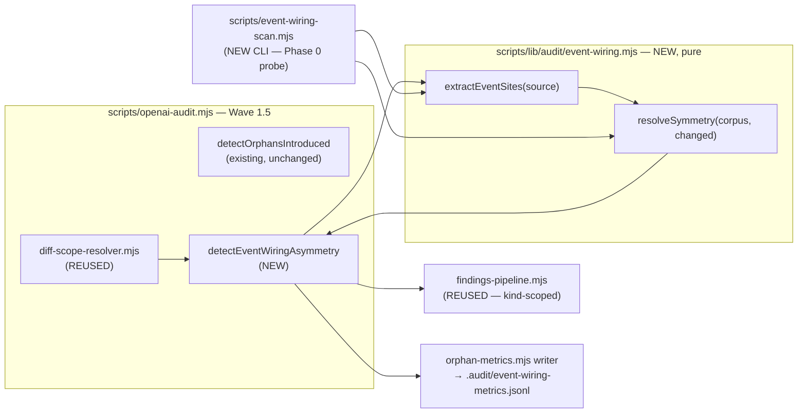

# Plan: Event-Wiring Symmetry Check

- **Date**: 2026-07-28
- **Status**: Draft
- **Author**: Claude + Louis
- **Scope**: backend (tooling — detector module + orchestration wiring)
- **Target domain(s)**: `audit-orchestration`, `shared-lib`, `tests`
- ⚠ **Cross-domain work** — touches >1 domain; the detector lives in `shared-lib`
  (`scripts/lib/audit/`) and wires into `audit-orchestration` (`scripts/openai-audit.mjs`),
  tests in `tests`. Identical split to
  [`dead-code-phase-1-orphan-introduced.md`](dead-code-phase-1-orphan-introduced.md) —
  confirmed intentional there, reused here.

> **Neighbourhood considered** (arch-memory, `k=8`)
>
> | Symbol | File | Domain | Score | Band |
> |---|---|---|---|---|
> | `detectOrphansIntroduced` | `scripts/lib/audit/orphan-introduced.mjs:58` | audit-orchestration | 0.660 | `review` (below-noise-floor) |
> | `runMultiPassCodeAudit` | `scripts/openai-audit.mjs:429` | audit-orchestration | 0.616 | `review` |
> | `isTestFile` | `scripts/lib/audit/orphan-introduced.mjs:198` | audit-orchestration | 0.556 | `review` |
>
> Repo cliff is 0.0438 above the top score — **nothing cleared the noise floor**, so this
> is greenfield logic. But `detectOrphansIntroduced` is the correct **structural
> template** (pure detector + orchestration-owned I/O + shared findings pipeline), and
> `isTestFile` / `isDocExampleFile` are **direct reuse** (#1 DRY). Decision recorded in
> §2: *sibling detector in the same wave slot*, not an extension of
> `detectOrphansIntroduced` (different evidence source — source text, not the import
> graph) and not a new wave (would duplicate four modules).

---

## 0. TL;DR — what this is, and the gate before building it

**The class**: a symbol can be exported, imported, and reachable, and still be dead —
because nothing dispatches the event it listens for, or nothing listens for the event it
dispatches. Import-graph tools (the shipped orphan wave, `knip`, `ts-prune`) model
`import` edges only. An event bus is a second, invisible wiring medium.

**The problem this plan must not repeat**: phase 1 shipped an audit wave on a hypothesis
and spent 11 weeks proving it wrong — 78% false positives, 0 of 113 findings triaged, 3
true positives (see that plan's §Telemetry Verdict). This plan therefore **opens with a
falsification gate, not with construction**.

| | Orphan-introduced (shipped) | Event-wiring (field prior art) |
|---|---|---|
| Findings | 113 | 7 |
| Actionable | 10 (**9%**) | 5 (**71%**) |
| Triaged by a human | **0 (0%)** | **7 (100%)** |
| Scope | diff-triggered | repo-wide (no diff scope at all) |

The field numbers are from **one repo, one run** (`wine-cellar-app`, 2026-07-03). That is
encouraging, not sufficient. **Phase 0 is a go/no-go probe, and `no-go` is a real
outcome** — see §8 R1.

---

## 1. Context Summary

**Scope/stack**: `js-ts` + postgres (`detect-stack`), backend tooling. No UI, no
migration, no new table.

### What exists today

- **`scripts/lib/audit/orphan-introduced.mjs`** — the shipped dead-code wave. Pure
  detector; file-level; consumes `arch-intent`'s import graph. Its telemetry verdict
  (recorded 2026-07-28) is the direct motivation for this plan's design constraints.
- **`scripts/lib/audit/diff-scope-resolver.mjs`** — orchestration-side git I/O:
  resolves `baseRef`/`headRef`, enumerates `ChangedFile[]`, materialises preimages via
  `git worktree`. **Reusable as-is.**
- **`scripts/lib/audit/findings-pipeline.mjs`** — fingerprinting, ledger suppression
  (kind-scoped, per phase 1's Gemini final-gate fix), `accept-v1` marker handling.
  **Reusable as-is.**
- **`scripts/lib/audit/orphan-metrics.mjs`** — lock-safe single-batch JSONL writer.
  **Reusable, with a new sink path.**
- **Wave 1.5** in `scripts/openai-audit.mjs` — the post-arch-intent / pre-Wave-2 slot
  where mechanical detectors run.
- **`scripts/lib/audit/duplication-report.mjs`** + the `@duplicate-justification` pragma
  — the repo's established **in-source suppression pragma** pattern. Directly mirrored
  here (§2, escape hatch).

### Code Trace (evidence Phase 1 exploration happened)

Detector contract read end-to-end:
`scripts/lib/audit/orphan-introduced.mjs:58` (`detectOrphansIntroduced`) → its finding
emission at `:142-151` (`{severity:'MEDIUM', kind:'orphan-introduced', file: path, …}` —
**`file`, confirming file-level granularity**) → pass-state derivation at `:157-175`
(`INHERITED_STATES` propagation) → helpers `isTestFile:198` / `isDocExampleFile:215`.

Telemetry read from `.audit/orphan-metrics.jsonl` (1,843 records, 1,730 run summaries +
113 findings) and reclassified against HEAD; the dominant FP,
`scripts/lib/solo-control/stratified-sample.mjs`, traced to its only live caller
`scripts/solo-control-audit.mjs:1290` (a destructured `await import(...)`), and both
confirmed created in the same commit (`cb892c7`) via `git log --diff-filter=A`.

Prior art read (consumer repo, `docs/migration/tools/`): `frontend-inventory-scan.mjs`
— 727 lines total; the event block is `:198-231`. Its catalog build is `:347-369`
(`eventCatalog` Map → `orphan: dispatchers.size===0 ? 'listen-only' : listeners.size===0 ?
'dispatch-only' : null`), and the native-event blocklist is `:34-66`
(`NATIVE_EVENTS` / `isCustomEventName`). Its output report and the 7 recorded verdicts
are `frontend-inventory.md:8-35` (same `docs/migration/` directory, consumer-side).

### Patterns reused vs new

| Reused | New |
|---|---|
| Pure-detector + orchestration-owns-I/O split (orphan-introduced) | Event extraction from source text |
| `diff-scope-resolver` for `ChangedFile[]` | Symmetry resolution (dispatch set vs listen set) |
| `findings-pipeline` fingerprint + kind-scoped ledger suppression | `@event-consumer-external` pragma |
| `orphan-metrics` JSONL writer | Churn auto-suppression (a phase-1 lesson, §2) |
| `isTestFile` / `isDocExampleFile` | — |
| `@duplicate-justification` pragma shape | — |

### Past lessons (binding on this design)

1. **A wave that emits at high FP is worse than no wave** — it trains operators to scroll
   past all audit output. (Phase 1 §Telemetry Verdict, decision 3.)
2. **A stopping rule must have a verdict for silence.** Phase 1's rule ("80%
   dismiss-without-action") was unmeasurable at 0/113 triaged: zero findings were
   dismissed *and* zero were actioned, so neither branch fired and the rule sat unresolved
   for 11 weeks. §6 fixes this explicitly.
3. **The blind spot kills the check, not the edge case.** Dynamic `import()` was scored
   *Medium* risk in phase 1's register and turned out to be the dominant failure mode.
   The analogue here is dynamic/computed event names — §2 treats it as the primary design
   problem, not a footnote.

---

## 2. Proposed Architecture



### Key design decisions

**D1 — A sibling detector in Wave 1.5, NOT an extension of `detectOrphansIntroduced`,
NOT a new wave.** (#2 Single Responsibility, #1 DRY.) Its evidence source is source
*text*, not the import graph, so folding it into the orphan detector would give one
function two unrelated inputs. A separate *wave* would duplicate `diff-scope-resolver`,
`findings-pipeline`, the metrics writer, and the orchestration slot. Sibling detector in
the same slot is the middle.

**D2 — Diff-*triggered* at SITE granularity, repo-wide *evidence*.** A finding fires only
when a dispatch site was **added by this diff**; the listener search covers the **entire
repo**. This asymmetry is the single biggest precision lever: "you added a dispatch in
this change and nothing anywhere listens" is a near-certain defect, while "this repo
contains unused events" is the noisy half.

> **R1/H1 fix — a changed *path* is not an added *site*.** The original contract
> (`resolveSymmetry(corpus, changedPaths)`) could not distinguish a dispatch added by
> this diff from a pre-existing dispatch sitting in a file edited for an unrelated
> reason — which is precisely the FP class D2 exists to exclude. **Site-level diffing is
> mandatory, not an optimisation.** Contract (see §7 `AddedDispatchSites`):
>
> 1. Orchestration obtains **before and after source** for every changed source file
>    (`diff-scope-resolver` already materialises preimages via `git worktree` — reused).
> 2. `extractEventSites` runs on **both** versions.
> 3. The detector receives the **multiset difference** `after − before` of dispatch-site
>    *signatures*, never a path list.
> 4. A **signature** is `{eventName, dispatchForm, enclosingSymbol}` — deliberately NOT
>    line number, so reformatting or an unrelated edit above the site does not
>    manufacture an "added" dispatch. Multiset (not set) semantics so a second dispatch
>    of an already-dispatched name in the same symbol still registers.
> 5. Per-status handling: `A`/`C` → all sites are added; `M` → the difference; `R` →
>    diff old path's preimage against new path's postimage (a rename alone adds nothing);
>    `D` → contributes no dispatch sites, and its listeners are removed from the corpus.
> 6. Unreadable / binary / oversize files: **fail-closed to "no added sites"** (never
>    emit a finding from a file we could not read) and increment a `skippedFiles`
>    counter surfaced in the report.
> 7. **Only `runtime: 'production'` dispatch sites are candidates** (R2/H3). A dispatch
>    added inside a test or doc-example file is counted (`testDispatchSites`) but never
>    reported — a test firing an event to exercise a handler is normal and has no
>    production consumer obligation. Without this clause rule 5's "`A` → all sites are
>    added" would make every new test file a finding generator.

**D2b — The symmetric trigger: a REMOVED production listener.** (R2/H2 — a genuine
coverage hole, not a rigor nit.) Deleting the sole production listener for an event that
is still dispatched produces **exactly the same runtime defect** — an event fired into
the void — yet generates no *added* dispatch and so no finding. Since orchestration
already holds before/after source for every changed file (D2), the second trigger is
nearly free:

> A finding also fires when this diff **removes the last production listener** for an
> event name that still has ≥1 production dispatch site anywhere in the after-corpus.

Both triggers converge on one predicate — *this change made a live dispatch consumerless*
— which is why they share a finding kind and a fingerprint namespace. The fingerprint
keys on `eventName` plus the trigger (`added-dispatch` | `removed-listener`) so the two
directions cannot collide or double-count the same event.

This is **not** the `listenOnly` direction deferred in D3 (an event listened for but never
fired, which stays out of v1 on field evidence). D2b is still the dispatch-has-no-consumer
class; only the change that caused it differs.

**D3 — Dispatch-only direction ONLY in v1.** All 7 field orphans were dispatch-only;
listen-only produced nothing. Listen-only is also structurally more FP-prone (a listener
can be fed by a dispatch from inline HTML, a service worker, an extension, or a computed
name). Ship one direction; §6's stopping rule decides whether the second ever earns its
place. (#20 Long-Term Flexibility — the extractor returns both sets; only the reporter is
one-directional, so enabling the other side is a reporter change.)

**D4 — Dynamic event names degrade the finding, they do not suppress it.** This is the
load-bearing decision and it is **evidence-driven, against my first instinct**.

The strict rule ("if any unresolved dynamic listen site exists in the corpus, suppress
dispatch-only findings — we cannot prove nobody listens") is the obvious anti-phase-1
move. **The field data falsifies it**: wine had **7 dynamic-name listen sites**
(`frontend-inventory.md:13`), so a strict rule would have suppressed all 7 findings and
lost both real defects. The value would have been zero.

So instead, mirroring the prior art's own caveat mechanism
(`frontend-inventory-scan.mjs:200,206,213` count `dynamicDispatch` / `indirectDispatch` /
`dynamicListen` separately; `frontend-inventory.md:19` prints the caveat):

- Every finding carries `dynamicListenSites: N` and `indirectDispatchSites: N` as
  first-class fields.
- When `N > 0`, the `rationale` string **names the uncertainty inline** — e.g.
  *"no listener found; NOTE: 7 dynamic-name `addEventListener` sites exist in this repo
  and may consume it."*
- Severity is capped at **MEDIUM** and the finding **never gates** (`/audit-code`
  convergence thresholds are unaffected — this is not a `quickFix`-class finding).

The difference from phase 1 is not "we handled the blind spot" — it is **the blind spot
is printed on the finding instead of being silently absent**. A reader can discount it;
phase 1's reader could not. (#19 Observability, #16 Graceful Degradation.)

**D5 — `@event-consumer-external` pragma as the escape hatch.** (#8 No Hardcoding, #3
Open/Closed.) Both field FPs share one cause — *a real consumer outside the analysed
set*:

| FP | Consumer location |
|---|---|
| `wineapp:sources-changed` | a browser-extension content script |
| `wine-shop:navigate` | a live legacy DOM fallback, kept by design |

Neither is fixable by better parsing; both are semantic. A pragma above the dispatch —
`// @event-consumer-external: <reason>` — converts a permanent recurring FP into a
one-time annotation, exactly as `@duplicate-justification` does for the duplication wave.
Consistency with the existing pragma is deliberate (#10 Single Source of Truth for "how
this repo suppresses a mechanical finding").

**D6 — Deduplicate recurrence; never suppress on silence.** (R1/M4 fix — the original
D6 auto-suppressed a fingerprint after 3 un-dispositioned emissions, which **contradicted
this plan's own §6 principle that silence is a failing outcome, not a hiding
condition**. Suppressing an unreviewed finding makes the live audit output *less*
truthful in exactly the window where nobody has looked at it yet.)

The real problem phase 1 exposed is a **counting** problem, not a display problem: one
fingerprint emitted 41 times became 36% of the dataset and corrupted its own denominator.
The fix is therefore at the record layer, not the presentation layer:

- Recurrence collapses into **one durable lifecycle record per fingerprint**
  (`firstSeen`, `lastSeen`, `occurrences`, `disposition`) — see D12.
- The finding stays **visible on every run** while open, rendered once with its
  occurrence count and age (`open since 2026-08-02, seen 7×`).
- The stopping rule counts **distinct fingerprints**, never emissions — so a single
  un-triaged FP contributes exactly 1 to the denominator no matter how often it recurs.
- Age escalates through the **existing ledger/review workflow**, it does not silence.

**D7 — Regex extraction, not AST — with a narrow, published grammar.** (Right-sizing,
§5; grammar per R1/M1.) The prior art is regex and achieved 71% precision on real code,
and **AST would not have fixed a single observed FP** — both were external-consumer
/semantic, not parse failures. AST buys resolution against concatenated names, the
`dynamicDispatch` bucket that measured **0** in the field. Paying `@babel/parser` cost to
solve a measured-zero problem is the over-engineering cliff. Revisit if `dynamicDispatch`
counts rise (§6 tracks it, so this is falsifiable rather than assumed).

**Construction is not dispatch** — the single most important grammar rule, and one the
prior art blurs. `new CustomEvent('a:b')` on its own creates an object; it does not fire
anything. v1 recognises exactly these forms and nothing else:

| Recognised as a **dispatch** | Recognised as a **listen** |
|---|---|
| `<target>.dispatchEvent(new CustomEvent(<static>, …))` | `<target>.addEventListener(<static>, …)` |
| `<target>.dispatchEvent(new Event(<static>, …))` | configured wrapper, e.g. `addTrackedListener(<ns>, <target>, <static>, …)` |
| `<target>.dispatchEvent(<identifier>)` → **`indirectDispatch++`, NOT a named dispatch** | `<x>Registry.add(<target>, <static>, …)` |

`<static>` = a single-quoted/double-quoted string, or a template literal **with zero
substitutions**. Anything else → `dynamicDispatch++` / `dynamicListen++`, never a name.
A bare `new CustomEvent(...)` not in argument position of a `dispatchEvent` call is
**ignored entirely** (it is neither dispatch nor evidence).

The scanner is **lexically aware, not a raw regex over bytes** — but "strip string
literals" was self-contradictory (R2/H5), since every event name *is* a string literal.
The corrected contract is a **tokenising pre-pass** that classifies rather than deletes:

1. **Pragmas are harvested first, then** comments (line + block) are masked to whitespace
   — never a source of names. Order is load-bearing (Gemini R2, MEDIUM): an earlier draft
   said comments are masked *and* that "pragma spans survive tokenising", which is
   incoherent — masking preserves offsets but destroys the very text the pragma matcher
   must read. The pre-pass therefore emits `pragmas[]` (`{name, reason, span}`) during the
   comment scan, before masking, and the masked view is used only for grammar matching.
2. String and template literals are **preserved and tagged** as literal tokens with their
   decoded value and byte span (standard escapes decoded; a literal containing an
   un-decodable escape is treated as dynamic).
3. A literal yields an event name **only when it sits in the recognised argument position
   of a recognised call** (dispatch arg 1 of `CustomEvent`/`Event`; listen arg 1 of
   `addEventListener` / a configured wrapper). A free-floating string equal to an event
   name — in a log line, a doc example, a test assertion — is **never** evidence.

`enclosingSymbol` (part of D2's signature) is resolved by the same pre-pass from the
nearest enclosing declaration, in this precedence: named function/method declaration →
`const|let|var <name> = (arrow|function)` → class method `<Class>#<method>` → object
literal property holding a function → **`<module-toplevel>`** when none applies. Nested
functions resolve to the innermost match; an anonymous callback with no named ancestor
inherits its nearest named ancestor plus an ordinal (`handleUndo#cb2`) so two anonymous
callbacks in one symbol stay distinguishable. **Determinism matters more than fidelity
here**: the value is only ever compared before-vs-after, never displayed as truth, and
this is exactly why the signature omits line numbers.

HTML/template files are scanned only inside `<script>` regions plus inline `on*=`
attribute values. This is bounded lexing, not parsing, and stays within the right-sizing
envelope.

**Wrapper config schema** (R3/M2 — pinned, because "a wrapper-pattern list" is not
implementable). `.audit-loop/event-wiring.json`:

```jsonc
{ "version": 1,
  "wrappers": [
    { "direction": "listen",            // "listen" | "dispatch"
      "callee": "addTrackedListener",   // exact identifier, or "*Registry.add" (single leading-* glob only)
      "eventArgIndex": 2,               // 0-based; the arg that must be a static name
      "targetArgIndex": 1 }             // 0-based, optional — recorded for D9's v2 target metadata
  ] }
```

Zod rules: `version` literal `1`; `callee` matches `^\*?[A-Za-z_$][\w$]*(\.[A-Za-z_$][\w$]*)?$`;
indices are non-negative integers and must differ; `wrappers` max 32. **Duplicate
`(direction, callee)` is an error, not last-wins** — a silently-shadowed wrapper is the
kind of config bug that produces confident false positives. The file is
Zod-validated and defaults to an empty list when **absent**. A **present-but-invalid** config is a hard failure — exit
2, rejected before scanning, no findings emitted (R2/H6: an earlier draft said
WARN-and-continue here while the CLI table said exit 2; the exit-2 branch wins because
continuing with built-ins-only would silently under-scan a repo whose listeners are
*entirely* behind a custom wrapper, producing confident false positives — the precise
failure class this plan exists to avoid). #12 Defensive Validation.

**Pragma association** (R2/M1). `// @event-consumer-external: <reason>` binds to the
**next recognised dispatch site** in source order, and only within the same enclosing
symbol. Intervening blank lines and other comments are permitted; any intervening code is
not. It suppresses that **one site**, never a whole symbol or file. The `<reason>` is
**mandatory** and non-empty (a reasonless suppression is indistinguishable from a typo).
Because the pre-pass masks comments rather than deleting them, pragma spans survive
tokenising and are matched against dispatch-site spans. A pragma binding to no dispatch
site emits `Orphaned suppression pragma`, so a stale pragma left behind after its dispatch
moves cannot silently keep suppressing.

**D8 — Listener evidence is CLASSIFIED by runtime, and a test-only listener never
resolves a production dispatch.** (R1/H3 fix — **this reverses the original D8, which was
wrong.**)

The original rule counted a listener found anywhere — including `tests/` — as a real
consumer, on the reasoning that "an event consumed only by a test is still wired, just
not in production." That reasoning does not survive contact with the motivating defect. A
test listener runs in a test process; it consumes nothing at runtime. Counting it as a
consumer creates a **systematic false negative precisely for events that are tested but
have no production subscriber** — which is the exact shape of `cellar:mutation` (a
designed fan-out, never wired). The check would have been blind to the bug that justifies
its existence.

Every extracted site therefore carries a `runtime` classification, and resolution is
compatibility-based:

| `runtime` | Assigned when the file is… | Resolves a production dispatch? |
|---|---|---|
| `production` | tracked source, not test, not doc-example | **Yes** |
| `test` | matches `isTestFile` (reused from `orphan-introduced.mjs:198`) | **No** — reported separately |
| `doc-example` | matches `isDocExampleFile` (`:215`) | **No** — ignored |

A dispatch with **only** test listeners is still a finding, downgraded to LOW and
labelled `contract exercised only by tests`. That is a genuinely different and useful
statement, and it keeps the evidence rather than discarding it.

Corpus breadth is unchanged and still deliberate: wine's scanner covered `public/js` only,
a plausible contributor to its 2 FPs, so evidence is accepted from any tracked
`.js/.mjs/.cjs/.ts/.tsx/.html/.template` file. **Breadth of evidence, classification on
use** — the two are separate knobs, and conflating them was the original D8's error.

**D9 — v1 asserts NAME-PRESENCE, never "a consumer exists".** (R1/M3 fix.) Matching on
event name alone ignores `EventTarget` identity: a listener bound to a worker, an iframe,
a detached emitter, or a different `document` does not consume a dispatch from elsewhere.
Name-only matching is conservative in the FP direction (a same-named incompatible
listener *suppresses* a finding) — so it can hide a real defect while claiming symmetry.

v1 does not attempt target resolution. Instead the contract is made honest in the
**wording and the schema**: the finding asserts *"no listener for this name exists
anywhere in the repo"*, and the absence of a finding asserts only *"a same-named listener
exists somewhere"* — explicitly **not** "it is wired correctly". `resolveSymmetry` returns
`evidence: 'name-presence'` on every record so no downstream consumer can over-read it.
Retaining lightweight receiver metadata is a v2 extension point, and it stays regex-
compatible (the target expression is already captured by the grammar).

**D10 — Advisory enforcement is a schema-validated classification, default-deny.**
(R1/H4 fix.) The original plan asserted "never gates" while also stating
`findings-pipeline.mjs` is reused *unchanged* — the guarantee had no implementation. A
MEDIUM cap does not establish non-gating if a downstream aggregator counts by severity.

Every finding gains `enforcement: 'advisory' | 'gating'`, Zod-validated, and an **unknown
or absent value is treated as `gating`** (fail-closed — a new detector cannot accidentally
opt itself out of the gate by omission). Event-wiring findings are the first `advisory`
producer.

**The four consumers that must honour it** (R2/H4 — naming them, because "the pipeline
enforces it" was hand-waving; each is a named file in §7's *Modified* table):

| Consumer | File | Behaviour on `advisory` |
|---|---|---|
| Convergence evaluator | [`scripts/lib/audit/convergence.mjs`](../../scripts/lib/audit/convergence.mjs) | excluded from `HIGH`/`MEDIUM`/`quickFix` counts |
| Final adjudication | [`scripts/lib/audit/final-adjudication.mjs`](../../scripts/lib/audit/final-adjudication.mjs) | cannot produce a blocking verdict |
| Findings pipeline | [`scripts/lib/audit/findings-pipeline.mjs`](../../scripts/lib/audit/findings-pipeline.mjs) | classification preserved through fingerprint + kind-scoped suppression |
| Report rendering | [`scripts/openai-audit.mjs`](../../scripts/openai-audit.mjs) | rendered in a distinct **Advisory** block, never folded into the gate summary |

Advisory findings remain fully **visible, fingerprinted, suppressible and
dispositionable** — the classification removes gating power only, never presence. Proven
by an end-to-end orchestration test that injects an event-wiring finding and asserts
convergence thresholds are unmoved (§9).

**D11 — Corpus building is orchestration-owned, cached on content, not on `headRef`.**
(R1/M2 fix.) The original §5 assumption proposed caching "per `headRef`", which is stale
for a dirty worktree, for staged-but-uncommitted changes, and for two worktrees at the
same HEAD with different contents — all normal states in this repo (two sessions share a
checkout). The cache key is **content-only** — `sha256(EXTRACTOR_VERSION ‖ wrapperConfigHash ‖
sorted[(path, contentHash)])` — where `contentHash` is the file's **git blob OID** when
its worktree copy is clean, and `sha256` of the actual **worktree bytes** when the tracked
file is dirty. **Untracked files are never in the corpus** (R3/M4 — "untracked-but-
included" was an inconsistency with `git ls-files`; the corpus is tracked-files-only, full
stop, so diff candidates and listener evidence always read the same after-state).
(R2/M2: an earlier draft called the key "content-keyed" while
including `mtime`, which changes without a content change and would have caused spurious
misses; and left `blob-or-worktree-hash` undefined. Both corrected — `mtime` is gone
entirely, and the clean/dirty rule is now explicit.) `wrapperConfigHash` is in the key
because the same bytes yield different sites under a different wrapper list.

Cache location is `.audit-loop/cache/event-wiring/<key>.json` — an existing **Category-A**
gitignored directory, so no new artifact policy question arises. It is namespaced per
repo by living inside that repo, which also gives the two-worktree safety goal for free
(separate worktrees, separate `.audit-loop/`). Writes go through the repo's atomic
write helper; a corrupt or unparseable entry is discarded and recomputed rather than
throwing (#16 Graceful Degradation). Cleanup is LRU by mtime above a 50-entry cap —
mtime is fine for *eviction*, where it was wrong for *identity*.

Ownership sits in orchestration, never in the pure module. Traversal policy: tracked files only (`git ls-files -z`), extension
allow-list, skip generated/minified (`.min.`, `.generated.`, existing `generatedNoise`
classification from `sensitive-paths.mjs`), per-file byte cap and total-byte budget,
symlinks resolved through `resolveAndClassify` (sensitive → skipped), read errors counted
not thrown. Every skip class is a counter in the report (#19 Observability).

**D12 — A durable per-fingerprint lifecycle record, not JSONL archaeology.**
(R1/H2 fix.) The original plan claimed §6's verdicts were "decidable from
`.audit/event-wiring-metrics.jsonl` alone" while the rule's own inputs included ledger
dispositions and a 14-day deletion window — **neither of which an append-only metrics
JSONL contains.** That was a straight internal contradiction.

Lifecycle state extends the **existing adjudication ledger** (one source of truth for
"what happened to a finding" — #10), not a parallel metrics-derived store. Per
fingerprint: `firstSeen`, `lastSeen`, `occurrences`, `disposition`
(`null|fixed|dismissed|pragma-suppressed`), `dispositionAt`, and two **machine-observed
resolution** timestamps. Written through the same atomic/lock-safe path the plan ledger
already uses. The metrics JSONL stays as it is — an append-only *observation* log for
analysis — and §6 names the ledger as the authority for dispositions.

**Auto-close on observed resolution (R2/H1).** The original draft could only close a
record via a human disposition or a deletion, so the overwhelmingly common outcome — *the
developer wires the listener* — left the record **open forever**: the finding stops being
emitted, nothing marks it fixed, and it sits in §6's `E` denominator without ever
reaching `A`, biasing the stopping rule toward RETIRE. Every open record is therefore
re-evaluated each run against the current corpus:

| Observation on a later run | Record transition | Counts as `A`? |
|---|---|---|
| Event now has a **production listener** (the dispatch survived, the wiring landed) | `resolvedObservedAt` set → `disposition = 'fixed'` | **Yes** |
| Event name **absent from the entire corpus** (dispatch removed) | `deletionObservedAt` set → `disposition = 'fixed'` | **Yes** |
| **Every remaining dispatch site for the event is pragma-suppressed** | `disposition = 'pragma-suppressed'` | **Yes** |
| Still dispatch-only | `occurrences++`, `lastSeen` updated, stays open | No |

> **The pragma row is load-bearing** (Gemini final gate, HIGH). Without it the plan's own
> primary escape hatch broke its own stopping rule: adding `@event-consumer-external`
> suppresses the *finding*, but the dispatch still exists and still has no listener, so
> the record fell through to "still dispatch-only → stays open" — permanently inflating
> `E` while §6 simultaneously listed `pragma-suppressed` as counting toward `A`. The
> transition that was supposed to set that disposition never fired. Every honest
> suppression would therefore have pushed the check toward a false RETIRE verdict.
>
> This requires `resolveSymmetry` to return **pragma coverage** in a channel *separate
> from* `findings` (Gemini R2, MEDIUM — as first written this collided with the Phase-0
> gate: if a pragma-suppressed event stayed in `findings` so the lifecycle evaluator could
> see it, the CLI would print all 7 oracle events and fail its own GO criterion; if it
> were dropped outright, Phase 1 could never transition the record). The return shape is
> explicit about which channel is which:
>
> ```
> resolveSymmetry(…) → {
>   findings[],   // POST-suppression — what the CLI prints and the wave emits.
>                 // A fully pragma-suppressed event NEVER appears here.
>   coverage[],   // {eventName, totalDispatchSites, pragmaSuppressedSites} for EVERY
>                 // event considered, suppressed or not. Metadata, never rendered.
>   counters
> }
> ```
>
> Phase 0's oracle compares `findings` only (5 actionable, neither keep — gate intact);
> Phase 1's lifecycle evaluator reads `coverage` (transition fires — ledger intact). One
> function, two consumers, no conflict.

Both are **observations of the corpus, not inferences from silence** — the distinction
this plan keeps insisting on, now applied to its own bookkeeping.

**Absence is only trustworthy on a complete corpus — but "complete" means no *unintended*
gaps.** (R3/M3 — the first draft of this clause was a genuine self-inflicted bug: it keyed
on `skippedFiles > 0`, and since every real repo permanently contains a `.min.js` or a
generated file, the detector would have been **inert forever** while reporting exit 3.
A safety rule that can never be satisfied is not safety, it is a disabled feature.)

Skips are therefore two distinct counters, and only one of them means "we don't know":

| Class | Examples | Meaning | Blocks absence-claims? |
|---|---|---|---|
| `excludedFiles` | minified, generated, non-allow-listed extension, sensitive path | **Policy** — deliberately outside the corpus by definition | **No** — a defined corpus boundary is not a gap |
| `skippedFiles` | read error, oversize past the byte cap, undecodable encoding, budget exhaustion | **Failure** — a file we *meant* to read and could not | **Yes** |

Any transition depending on something being *absent* (`deletionObservedAt`, and the
dispatch-only predicate itself) requires **`skippedFiles === 0`**. On a failure-partial
corpus the record is left untouched, no new finding is emitted, `partial: true`, CLI exit
3. `excludedFiles` is reported for transparency but never gates. This keeps the repo's
"can this return green without having actually checked anything?" rule intact while
leaving the check operable.

---

## 5. Sustainability Notes

### Right-sizing gate

- **Band-aid extreme** — grep for the event name by hand when a bug is reported. The root
  cause (no systematic check for a whole wiring medium) resurfaces on the next one; both
  wine defects sat undetected for months before an ad-hoc scan found them.
- **Over-engineered extreme** — full AST across every language, a committed
  `event-contract.json` declaring every event's intended consumers (the `nav-contract`
  analogue), a repo-wide `/event-map` skill, and cross-repo event topology. **No current
  requirement**: there is exactly one field repo, one defect class, and a measured-zero
  dynamic-dispatch count. This is the shape phase 1 drifted toward.
- **Chosen** — one pure regex extractor + a symmetry resolver, reusing four existing
  modules, diff-triggered with repo-wide evidence, advisory-only, with an in-source pragma
  and day-one telemetry. **Current requirement**: two confirmed defects
  (`cellar:mutation`, `wineShop:coldStartAction`) in a live consumer, in a class provably
  invisible to every import-graph tool including the pivot candidate (`knip`).

### Manual vs scripted

The Phase 0 probe is a **script**, not a manual sweep: the transformation is regular
(same extraction over N repos) and **verifiable** (wine's 7 known verdicts are a
ready-made oracle — the probe must reproduce them). It is **not** a throwaway
Category-A artifact, because the probe's core *is* the eventual detector — building it
standalone first is the falsification step, not scaffolding to discard.

### Assumptions that could change

- **Event names are string literals at the dispatch site.** Measured true in the field
  (`dynamicDispatch: 0`). Tracked in telemetry; D7's regex choice is contingent on it.
- **A repo-wide listener scan is affordable.** ~86K lines scanned in the field run
  without difficulty. If a consumer repo makes this slow, the corpus caches on a
  **content manifest hash + `EXTRACTOR_VERSION`** (D11) — deliberately *not* on `headRef`,
  which is stale for a dirty worktree, for staged-but-uncommitted changes, and for two
  worktrees at the same HEAD (a routine state here — two sessions share this checkout).
- **Operators will triage** — the assumption phase 1 got wrong. This time it is not
  assumed: §6's rule treats silence as a **failing** outcome, so the check retires itself
  if it is ignored rather than waiting to be noticed.

### Extension points deliberately built in

- `resolveSymmetry` returns both `dispatchOnly` and `listenOnly`; only the reporter is
  one-directional (D3).
- The extractor takes a **wrapper-pattern list** (wine needed `addTrackedListener(...)`
  and `<x>Registry.add(...)`, `frontend-inventory-scan.mjs:222-231`). Config-driven, so a
  new consumer's custom listen wrapper is a config entry, not a code change (#8).

---

## 6. Stopping Rule (PRE-REGISTERED — written before any data)

Evaluated at the **first** of: 30 distinct fingerprints emitted, or 12 weeks from first
ship. **No ambiguous case** — this is the clause phase 1 lacked.

**Authority (R1/H2 fix — corrected).** An earlier draft claimed every verdict was
"decidable from `.audit/event-wiring-metrics.jsonl` alone". That was false: the rule's
own inputs include ledger dispositions and a deletion observation, neither of which an
append-only metrics log holds. The authority is the **lifecycle record of D12** (in the
adjudication ledger). The metrics JSONL is the observation log that feeds `E`'s
denominator and the blind-spot counters; it is not the disposition store.

Let `E` = **distinct fingerprints** emitted (never emissions — D6), and `A` = fingerprints
whose lifecycle record shows **any** of:

- `disposition = 'fixed'`;
- `deletionObservedAt` set within 14 days of `firstSeen` (a deletion is an action, and it
  is *observed* by a later run finding the name absent — not inferred from silence);
- `disposition = 'pragma-suppressed'` (an explicit, recorded human judgement — see D5).

| # | Condition | Verdict |
|---|---|---|
| 1 | `E < 10` at evaluation time | **RETIRE — inert.** Fires too rarely to justify its surface. |
| 2 | `E ≥ 10` and `A/E ≥ 0.40` | **KEEP.** |
| 3 | `E ≥ 10` and `A/E < 0.40` | **RETIRE — noisy.** |

**An untriaged finding counts toward `E` and NOT toward `A`.** Silence is a failing
outcome, not an unresolved one. This single clause is what makes the rule decidable at
0% triage — the exact state that left phase 1's rule hanging for 11 weeks.

The three rows are **mutually exclusive and exhaustive** over `(E, A)`, so no tie-break is
needed and no input state is undecidable. (The former churn row is gone: with D6 counting
distinct fingerprints, runaway recurrence can no longer inflate the denominator, so the
condition it guarded against is unconstructable.)

---

## 7. File-Level Plan

### New files

| File | Purpose | Key exports |
|---|---|---|
| [`scripts/lib/audit/event-wiring.mjs`](../../scripts/lib/audit/event-wiring.mjs) | Pure extractor + symmetry resolver. No I/O, no git, no fs — mirrors `orphan-introduced.mjs`'s purity contract (#11 Testability). | `extractEventSites(source, {path, wrappers})` → `{dispatches[], listens[], dynamicDispatch, indirectDispatch, dynamicListen, pragmas[]}` (each site carries `{eventName, dispatchForm, enclosingSymbol, runtime}`); `diffSites(before, after)` → `{addedDispatches[], removedListeners[]}` (D2/D2b multiset differences over the same before/after pair — **one function, both directions**, per R3/H1; a removed listener is keyed `{eventName, runtime, enclosingSymbol}` so only *production* removals reach resolution); `resolveSymmetry({corpus, addedDispatches, removedListeners})` → `{findings[], counters}`; `NATIVE_EVENTS`; `EXTRACTOR_VERSION` |
| [`scripts/event-wiring-scan.mjs`](../../scripts/event-wiring-scan.mjs) | Standalone CLI — the Phase 0 probe, and a usable diagnostic afterwards. | `main()`, `--repo <path>`, `--json`, `--oracle <file>` |
| [`scripts/lib/audit/event-wiring-corpus.mjs`](../../scripts/lib/audit/event-wiring-corpus.mjs) | Orchestration-side corpus builder + content-keyed cache (D11). Impure by design — this is the seam that keeps `event-wiring.mjs` pure. | `buildCorpus({repoPath, wrappers})` → `{sites, counters, cacheKey}` |
| [`tests/event-wiring.test.mjs`](../../tests/event-wiring.test.mjs) | Unit tests over the pure module + the wine oracle fixture. | — |
| `tests/fixtures/event-wiring/wine-oracle/` | The versioned Phase-0 evaluation pack (§7b): `snapshot.md`, minimised fixtures, `expected.json`. | — |

**CLI result envelope (R1/M5).** `scripts/event-wiring-scan.mjs` ships even on a NO-GO,
so its failure contract is part of v1, not a follow-up. In `--json` mode **stdout carries
exactly one validated document** and every diagnostic goes to stderr (the repo's
established `--out` discipline). Exit codes:

| Code | Meaning |
|---|---|
| `0` | Scan completed — `{ok:true, findings:[…], counters:{…}, partial:false}`. Zero findings is a success, not an error. |
| `1` | Operational scan failure (repo unreadable, corpus build threw) — `{ok:false, error:{code,message}}`. |
| `2` | Invalid invocation (unknown flag, bad `--repo`, malformed/unreadable `--oracle`, invalid wrapper config) — rejected **before** scanning. |
| `3` | Partial scan — completed but `counters.skippedFiles > 0`; `partial:true`. Distinct from `0` so a caller can never read a truncated scan as clean (the repo's "success paths are where to be adversarial" rule). |
| `4` | Oracle mismatch (`--oracle` only) — the Phase-0 NO-GO signal. |

**Precedence** (R3/L1 — first match wins, so no two codes can both apply): `2` → `1` →
`3` → `4` → `0`. A partial scan therefore reports `3` **before** `4`: an oracle comparison
run on an incomplete corpus is not a legitimate mismatch verdict, and reporting `4` would
manufacture a NO-GO out of a read failure. The oracle pack is minimised fixtures, so a
partial scan over it always indicates a rig fault, never a real disagreement.

> **CLI contract (repo gates — not optional).** `scripts/event-wiring-scan.mjs` is a
> net-new top-level CLI, so it **must** use `assertKnownFlags` from
> [`scripts/lib/cli-io.mjs`](../../scripts/lib/cli-io.mjs) or the pre-push
> `cli:flags:gate` fails, and it must implement the
> `--selfcheck-relocation` handler per AGENTS.md's CLI smoke contract before being added
> to `CLI_SMOKE_SET`. Verify locally with `npm run cli:flags:gate` before pushing.

### Modified files

| File | Change |
|---|---|
| [`scripts/lib/schemas.mjs`](../../scripts/lib/schemas.mjs) | Add `EventSiteSchema`, `EventWiringFindingSchema`, `EventWiringPassStateSchema` (reusing phase 1's pass-state enum shape for `INHERITED_STATES` parity). |
| [`scripts/openai-audit.mjs`](../../scripts/openai-audit.mjs) | Wave 1.5c: call `detectEventWiringAsymmetry` after the orphan detector, reusing the already-resolved `DiffScope`. Findings join the existing pipeline. |
| [`scripts/lib/audit/orphan-metrics.mjs`](../../scripts/lib/audit/orphan-metrics.mjs) | Parameterise the sink path **and the summary `kind`** (`:116` hardcodes `'orphan-run-summary'`, `:142` defaults `'orphan-introduced'`), and pass `_meta` through generically instead of destructuring orphan-specific fields (`:121` `removedEdgeTargetCount`). **NOT a "one-line generalisation"** — that earlier claim was wrong (Gemini final gate, LOW): reusing it as-is would inject mislabelled `orphan-run-summary` records into the event-wiring log and corrupt §6's own denominator. All params default to today's values, so the existing caller is byte-identically unaffected (#18). |
| [`scripts/lib/audit/findings-pipeline.mjs`](../../scripts/lib/audit/findings-pipeline.mjs) | **(a)** D10 — carry `enforcement` through fingerprinting + kind-scoped suppression; fail-closed default. **(b)** `findingFingerprint` (`:89`) special-cases only `orphan-introduced` (`:90`) and delegates everything else to `semanticId(f)` (`:113`), which includes the **file path** — so D2b's `(eventName, trigger)` fingerprint is not achievable by default (Gemini final gate, MEDIUM; verified in source). Add an `event-wiring-symmetry` intercept whose canonical string is **`${f.kind}\|${trigger}\|${eventName}`** — kind-prefixed exactly as the orphan exception's `${f.kind}\|${f.subKind}\|${file}` (`:107,109`) is, and **excluding the file path**. Without the path, the same event dispatched from two files produces one record instead of double-counting `E`; without the kind prefix, `(trigger, eventName)` shares a global hash namespace with every other pass and could collide (Gemini R2, LOW — verified: the orphan branch does prefix with kind). |
| [`scripts/lib/audit/convergence.mjs`](../../scripts/lib/audit/convergence.mjs) | D10 — exclude `advisory` findings from `HIGH`/`MEDIUM`/`quickFix` convergence counts. |
| [`scripts/lib/audit/final-adjudication.mjs`](../../scripts/lib/audit/final-adjudication.mjs) | D10 — an `advisory` finding can never produce a blocking verdict. |
| [`scripts/lib/ledger.mjs`](../../scripts/lib/ledger.mjs) | **D12 lifecycle host (R3/H2)** — add `readLifecycle(ledgerPath, fingerprint)` / `upsertLifecycle(ledgerPath, record)` beside the existing `writeLedgerEntry` (`:128`) / `batchWriteLedger` (`:232`), reusing their atomic-write + lock path verbatim. Lifecycle records live in a `lifecycle` key alongside `entries` in the same ledger file — one artifact, one lock, no parallel store (#10). Concurrent-run safety is whatever `batchWriteLedger` already guarantees; this adds no new concurrency model. |
| [`docs/plans/dead-code-phase-1-orphan-introduced.md`](dead-code-phase-1-orphan-introduced.md) | Already amended (2026-07-28) — its §Telemetry Verdict item 4 forward-references this plan. |

### Files NOT modified

- `scripts/lib/audit/orphan-introduced.mjs` — untouched. This plan does **not** extend it
  (that was explicitly ruled out by its telemetry verdict).
- `scripts/lib/audit/diff-scope-resolver.mjs` — reused as-is (its preimage materialisation
  is what makes D2's site-level diff possible without new git plumbing).
- ~~`scripts/lib/audit/findings-pipeline.mjs` — reused as-is~~ → **corrected (R1/H4)**:
  it needs the D10 `enforcement` filter and is listed under *Modified* above. The original
  claim that it was reused unchanged while also guaranteeing non-gating behaviour was
  incoherent.
- `.audit-loop/domain-map.json` — `scripts/lib/audit/**` → `audit-orchestration` already
  covers the new module (added in phase 1).

### 7b. Implementation Phases

- **Phase 0 — Evaluation pack + falsification probe (GO/NO-GO GATE).** Build the
  versioned oracle pack FIRST (so the criterion exists before the code that must satisfy
  it), then the pure extractor, the site-differ, the corpus builder and the CLI; run
  `npm run event-wiring:oracle`; then run across the three consumer repos to record §6's
  baseline. Files: `tests/fixtures/event-wiring/wine-oracle/` (create),
  `scripts/lib/audit/event-wiring.mjs` (create),
  `scripts/lib/audit/event-wiring-corpus.mjs` (create),
  `scripts/event-wiring-scan.mjs` (create), `tests/event-wiring.test.mjs` (create),
  `package.json` (modify — the `event-wiring:oracle` script).
- **Phase 1 — Wave wiring + advisory enforcement + lifecycle.** Schemas (incl. the
  `enforcement` classification), Wave 1.5c orchestration, metrics sink, D12 lifecycle
  record, pragma handling. Files: `scripts/lib/schemas.mjs` (modify),
  `scripts/openai-audit.mjs` (modify),
  `scripts/lib/audit/orphan-metrics.mjs` (modify),
  `scripts/lib/audit/findings-pipeline.mjs` (modify — D10 fail-closed filter; **this file
  is no longer "reused unchanged"**, per R1/H4),
  `scripts/lib/audit/convergence.mjs` (modify — D10),
  `scripts/lib/audit/final-adjudication.mjs` (modify — D10),
  `tests/event-wiring.test.mjs` (modify).
- **Close-out (not a phase)**: `npm run cli:flags:gate`, `npm test`,
  `npm run plans:index`.

### Phase 0's GO/NO-GO gate (R1/H5 — rewritten to be unambiguous and externally checkable)

The first draft stated two different, mutually inconsistent criteria (an oracle that
"surfaces exactly the 5 actionable" vs a GO condition of "reproduce wine's 2 known
defects with ≤1 new FP"), never defined *actionable*, and left the judgement
self-assessed against a moving repo. Replaced by a **versioned evaluation pack** built
*before* any detector code:

**The pack** — `tests/fixtures/event-wiring/wine-oracle/` (committed):

- `snapshot.md` pinning the **immutable commit sha** of `wine-cellar-app` the pack was
  derived from, so the oracle can never drift with the consumer repo.
- Minimised source fixtures — the dispatch and listener sites only, not the 356-file
  tree — so the pack is reviewable and carries no consumer source wholesale.
- `expected.json`: all **7** events, each with `{name, class: 'dispatch-only',
  disposition, isConfirmedDefect}` transcribed from
  `frontend-inventory.md:21-35`. The two `isConfirmedDefect: true` records are
  `cellar:mutation` and `wineShop:coldStartAction`. Vocabulary is fixed here so
  *actionable* has exactly one meaning for the rest of the plan: **actionable =
  disposition ∈ {DELETED, REAL-BUG}** (5 of 7); **confirmed defect = REAL-BUG** (2 of 7).
- `npm run event-wiring:oracle` — a machine comparison emitting a diff and a non-zero
  exit on any mismatch. **The command is the verdict; no human adjudicates it.**

**ONE GO criterion** (the second one is deleted, not reconciled):

> **GO** iff `npm run event-wiring:oracle` exits 0 — i.e. the extractor reproduces all 7
> records and their classes exactly, and with the 2 `@event-consumer-external` pragmas
> applied surfaces exactly the 5 actionable ones and neither of the 2 keeps.
>
> **NO-GO** otherwise.

The cross-repo run over the three consumers is **evidence gathered and recorded, not a
gate clause** — its purpose is to populate §6's baseline and to check the check is not
inert outside wine, which §6 row 1 will decide on real data rather than on a judgement
call now. Conflating it into the gate is what made the original criterion
self-adjudicated.

**A NO-GO is a terminal, non-negotiable outcome**: ship the standalone CLI as an
on-demand diagnostic, record the verdict in this plan's audit trail, and do not add a
wave. Phase 0's artifacts are useful either way, which is what makes the gate cheap to
honour.

---

## 8. Risk & Trade-off Register

| # | Risk | Likelihood | Mitigation |
|---|---|---|---|
| **R1** | **The signal doesn't generalise beyond wine** — n=1 repo, n=2 defects, and this public repo barely uses custom events (the check may be permanently inert here). | **High** | This is the plan's central risk and the reason Phase 0 is a gate rather than a step. A `no-go` verdict is a success of the process, not a failure of it. |
| R2 | Dynamic event names hide a real listener → FP. | Medium | D4: counted, printed on the finding, severity-capped, never gates. Measured `dynamicDispatch: 0` / `dynamicListen: 7` in the field. |
| R3 | Consumer outside the analysed set (extension, service worker, inline HTML). | Medium | D5 pragma + D8 wider corpus. Both observed FPs are exactly this class. |
| R4 | A second 78%-FP wave lands and further erodes trust in audit output. | Medium | R1's gate, §6's silence-is-failure rule, and D10's enforced non-gating channel — three independent brakes, each of which alone would have caught phase 1 earlier. |
| R5 | Regex misses a listen wrapper unique to a consumer repo → FP. | Medium | Wrapper patterns are config-driven (D7). Wine needed two; both are one-line entries. A present-but-invalid config **hard-fails at exit 2** rather than scanning with built-ins only (R2/H6, R3/M1 — the "WARN and continue" wording that survived an earlier edit is removed; continuing would under-scan a wrapper-only repo and emit confident FPs). |
| R6 | Telemetry sink parameterisation regresses the existing orphan writer. | Low | Default argument preserves current path; existing tests cover it (#18). |
| R7 | **Name-only matching hides a real defect** — a same-named listener on an incompatible target suppresses a genuine finding (a false *negative*, the direction that fails silently). | Medium | D9 makes v1's claim `name-presence` in schema and wording, so no consumer can over-read a non-finding as "wired". Target metadata is a v2 extension point the grammar already captures. **Accepted knowingly**: v1 trades recall for precision, which is this plan's entire thesis. |
| R8 | The D12 lifecycle record becomes a second source of truth beside the ledger. | Low | It **is** the ledger — D12 extends the existing adjudication record rather than adding a store (#10). The metrics JSONL is explicitly demoted to an observation log with no authority. |
| R9 | Modifying `findings-pipeline.mjs` (D10) regresses the orphan wave or the LLM passes. | Medium | Fail-closed default (`gating` when absent/unknown) means every existing producer is byte-identically unaffected; the pipeline's 26 existing unit tests are the regression net; the new behaviour is additive and covered by its own orchestration invariant test (§9). |

**Deliberately deferred**: listen-only direction (D3); AST extraction (D7); cross-repo
event topology; any committed event-contract artifact. Each is recoverable — none is
foreclosed by the v1 shape.

---

## 9. Testing Strategy

Per AGENTS.md's testing doctrine this is a **Tier 1 deterministic seam** (crisp
inputs/outputs, no LLM), so it lands **test-first**.

### Unit (`tests/event-wiring.test.mjs`)

- `extractEventSites` — **grammar (D7)**: `dispatchEvent(new CustomEvent('a:b'))` → named
  dispatch; **bare `new CustomEvent('a:b')` with no enclosing `dispatchEvent` → NOTHING
  emitted** (construction ≠ dispatch — the rule the prior art blurs); zero-substitution
  template literal → static; substituted template / concatenation / identifier name →
  `dynamicDispatch++`; `dispatchEvent(identifier)` → `indirectDispatch++`;
  `addEventListener('a:b',…)` vs `addEventListener(varName,…)` → `dynamicListen++`;
  native blocklist rejects `click`/`change`/`submit`; configured wrappers
  (`addTrackedListener`, `*Registry.add`); **an event name appearing only inside a comment
  or an unrelated string literal is ignored** (lexical pre-pass); HTML scanned only in
  `<script>` + `on*=`.
- `diffDispatchSites` — **D2/H1, the precision core**: same file, dispatch present in
  *both* before and after → **no** added site (this is the FP the original contract would
  have emitted); dispatch present only in after → added; reformatting/line-shift alone →
  no added site (signature excludes line number); a second dispatch of an already-present
  name in the same symbol → added (multiset, not set); `R` rename with no body change →
  nothing added; `D` → no sites, and its listeners leave the corpus.
- `resolveSymmetry`: added dispatch + production listener elsewhere → **no** finding;
  added dispatch + **no** listener anywhere → finding; added dispatch + **test-only**
  listener → LOW `contract exercised only by tests` finding, **not** suppressed
  (D8/H3 — the reversal; this case would otherwise have hidden `cellar:mutation`);
  doc-example listener → ignored; every record carries `evidence: 'name-presence'` (D9);
  every record carries `enforcement: 'advisory'` (D10).
- `diffDispatchSites` — **runtime candidacy (R2/H3)**: a dispatch added in a `tests/` file
  → counted in `testDispatchSites`, **never a candidate**; a dispatch added in production
  resolved by a listener in another production file → no finding.
- **D2b removed-listener trigger**: diff deletes the only production listener while a
  production dispatch survives → finding; deletes one of two listeners → **no** finding;
  deletes the listener **and** the last dispatch → no finding (nothing is fired);
  deletes a *test* listener only → no finding; the two triggers on the same event name
  in one diff produce **one** record per `(eventName, trigger)`, never a double-count.
- Lifecycle (D12/D6): 2nd and 7th observation of one fingerprint → `occurrences` 2 and 7,
  **still surfaced both times**, `E` contribution stays exactly 1;
  **auto-close (R2/H1)** — an open record whose event gains a production listener on a
  later run → `resolvedObservedAt` + `disposition='fixed'` (counts toward `A`); whose
  event vanishes entirely → `deletionObservedAt` + `fixed`; `disposition` transitions are
  ledger writes, not metrics writes.
- **Partial-corpus safety**: with `skippedFiles > 0`, a run emits **no** new dispatch-only
  finding and performs **no** record close, sets `partial:true`, and exits 3 — asserted
  directly, because this is the branch that could otherwise return green having checked
  nothing.
- Config contract (R2/H6): config absent → built-ins, scan proceeds, exit 0; config
  present-but-invalid → **exit 2, zero findings, nothing scanned**.
- Pragma (R2/M1): binds to the next dispatch site in the same symbol; intervening blank
  lines/comments OK, intervening code breaks the binding; empty `<reason>` → rejected;
  suppresses one site, not the symbol.
- Pragma: `@event-consumer-external` suppresses; a pragma matching no dispatch emits its
  own `Orphaned suppression pragma` finding (mirroring the duplication wave, so a stale
  pragma cannot silently persist). **Lifecycle**: an event whose *every* remaining
  dispatch site is pragma-suppressed transitions to `disposition='pragma-suppressed'`
  (counts toward `A`); an event with 2 dispatch sites and only 1 pragma stays **open** —
  asserted directly, because getting this backwards silently biases §6 toward RETIRE.
- Fingerprint: the same event dispatched from two different files produces **one** record
  (`(eventName, trigger)` only, never the path) — the intercept, not `semanticId`.
- Determinism: same corpus → byte-identical findings and fingerprints.

### Orchestration invariant tests

- **D10 fail-closed**: a finding with `enforcement` absent or unrecognised is treated as
  `gating`; an `advisory` finding injected into a run leaves `HIGH`/`MEDIUM`/`quickFix`
  convergence counters **unmoved** (the end-to-end proof H4 demands — a severity cap
  alone is not the guarantee).
- **D11 cache**: two worktrees at the same `headRef` with different contents produce
  **different** cache keys; a dirty working tree invalidates; `EXTRACTOR_VERSION` bump
  invalidates.
- Kind-scoping: event-wiring findings reach the pipeline with `kind` set, so ledger
  suppression cannot leak across passes (phase 1's Gemini final-gate fix).

### Oracle fixture (the load-bearing test)

Wine's 7 investigated events with their recorded verdicts
(`frontend-inventory.md:21-35`) become a committed fixture. The extractor must classify
all 7 as dispatch-only, and — with the two `@event-consumer-external` pragmas applied —
must surface exactly the 5 actionable ones. **This test is the plan's precision claim
made executable**; if it cannot be made to pass, Phase 0 returns `no-go`.

### Integration smoke

Run `scripts/event-wiring-scan.mjs` against a `git worktree` of this repo (never a
destructive checkout — phase 1's R2/L1 lesson) and assert exit code + JSON shape.

### Explicitly NOT tested

No LLM-output assertions — there is no model in this path. No mocking of the whole audit
orchestrator to test call order; the wave-wiring assertion is one invariant test
("event-wiring findings reach the pipeline with `kind` set, so ledger suppression stays
kind-scoped").

---

## 10. Open Questions — resolved by R1

All three questions posed to the auditor were answered; two against the original design.

1. **Is D4 right?** (caveat-rather-than-suppress) — **Upheld, unchallenged.** R1 did not
   contest it, and the field evidence stands: a strict suppression rule would have
   discarded all 7 wine findings including both real defects. D4 is retained with its
   MEDIUM cap, now backed by D10's *enforced* advisory channel rather than an assertion.
2. **Does D8's test-listener treatment create a trap?** — **Answered: worse than a trap.**
   R1/H3 showed it is a correctness hole, not a consistency wart: a test listener would
   have suppressed exactly the `cellar:mutation`-shaped defect the check exists to find.
   **D8 reversed** — test listeners are classified, not counted.
3. **Is Phase 0's gate honest?** — **Answered: no, as originally written.** R1/H5 found
   two mutually inconsistent criteria, an undefined *actionable*, and a self-adjudicated
   verdict against a drifting repo. Replaced by a versioned pack, a pinned snapshot sha,
   a fixed vocabulary, and one machine-checked criterion (`npm run event-wiring:oracle`
   exit 0). The cross-repo run was demoted from gate clause to recorded evidence.

---

## 11. Execution Clustering

- **Cluster A** — Phases 0 — fix-gate: yes
  - Coupling: the probe is a single coherent unit — pure extractor, its CLI driver, and
    the oracle test that validates it against wine's 7 recorded verdicts. Splitting the
    extractor from its oracle would let an unvalidated extractor reach the gate, which is
    the one thing Phase 0 exists to prevent.
  - **This cluster's gate is the GO/NO-GO decision (§7b), not just audit convergence.** A
    `no-go` verdict terminates the plan here with Cluster A's artifacts shipped as a
    standalone diagnostic.
  - author-tier: standard
- **Cluster B** — Phases 1 — fix-gate: final
  - Coupling: schemas, orchestration wiring, metrics sink, pragma handling and churn
    suppression all touch the Wave-1.5 seam and the shared findings pipeline; the audit
    must inspect where `detectEventWiringAsymmetry` and `detectOrphansIntroduced` agree on
    `DiffScope` and diverge on test-file treatment (D8) — the exact seam a split would
    hide.
  - author-tier: standard
- **Final gate**: mandatory consolidated Gemini review over the union diff (A+B), or over
  Cluster A alone if the Phase 0 gate returns `no-go`.

---

## Audit history

`/audit-plan` — 2026-07-28, SID `audit-plan-1785262333`. **3 GPT rounds + 2 Gemini
rounds; 31 findings, all accepted as valid + in-scope, 0 deferred, 0 dismissed.**

| Round | Verdict | Findings | Character |
|---|---|---|---|
| GPT R1 | `SIGNIFICANT_GAPS` | H:5 M:5 | Design defects — two reversed a decision outright |
| GPT R2 | `SIGNIFICANT_GAPS` | H:6 M:2 | Design defects + first self-inflicted contradictions |
| GPT R3 | `NEEDS_REVISION` | H:2 M:4 L:1 | One net-new bug; rest were leftovers from R2's edits |
| Gemini 1 | `CONCERNS` | H:1 M:1 L:1 | Concrete; 2 of 3 verified against real source |
| Gemini 2 | `CONCERNS` | M:2 L:1 | Concrete, but **all three self-inflicted by the Gemini-1 fix** |

**What the audit actually changed** (not polish — the design is materially different):

- **D8 reversed.** Test-file listeners no longer count as consumers. As written they were
  a systematic false negative for exactly the `cellar:mutation` shape that motivates the
  whole plan — the check would have been blind to its own justifying defect.
- **D6 replaced.** Churn auto-suppression contradicted §6's "silence is a failing
  outcome"; it became dedupe-into-a-lifecycle-record.
- **D2 upgraded** from file-level to **site-level** diffing. A changed *path* cannot
  distinguish an added dispatch from a pre-existing one — the precision claim was
  unimplementable as first written.
- **D2b added.** Removing the last production listener causes the identical defect and
  produced no finding at all.
- **Partial-corpus rule split** into policy-`excludedFiles` vs failure-`skippedFiles`;
  the original form made the detector **permanently inert** (any repo with one `.min.js`).
- **Pragma lifecycle transition added.** The plan's own escape hatch broke its own
  stopping rule: every honest suppression biased §6 toward a false RETIRE.
- **Three "reused unchanged" claims retracted** after reading the code —
  `findings-pipeline.mjs` (fingerprint + enforcement), `orphan-metrics.mjs` (hardcoded
  `kind`), and the un-named convergence/final-adjudication consumers.

**Stop decision — Gemini 2-round cap, honoured.** Gemini R2's three findings were
concrete design defects, which is the sanctioned exception for a third round. A third
round was **not** run, deliberately: all three were introduced by the Gemini-1 fix, the
third consecutive round in which editing generated roughly as many contradictions as it
resolved. That is the documented rigor-pressure signal in a different costume — the plan
has reached the length where prose consistency, not design quality, is the binding
constraint. Remaining risk is **contract-consistency between sections, not design
soundness**, and the correct next gate is `/audit-code` against real code (per the skill's
own routing of implementation-completeness concerns), not a sixth review of prose.

**Not independently verified**: Gemini R2's three findings were accepted on reading
without a fix-round of their own. Gemini R1's two code-grounded claims *were* verified
against source before acceptance (`findingFingerprint:89-113`, `orphan-metrics.mjs:116/121/142`)
— both confirmed true.
