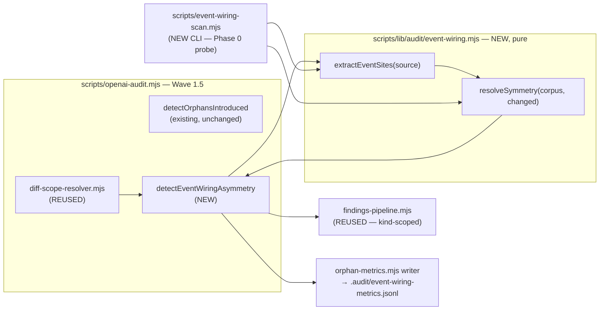

# Plan: Event-Wiring Symmetry Check

- **Date**: 2026-07-28
- **Status**: Draft
- **Author**: Claude + Louis
- **Scope**: backend (tooling — detector module + orchestration wiring)
- **Target domain(s)**: `audit-orchestration`, `shared-lib`, `tests`
- ⚠ **Cross-domain work** — touches >1 domain; the detector lives in `shared-lib`
  (`scripts/lib/audit/`) and wires into `audit-orchestration` (`scripts/openai-audit.mjs`),
  tests in `tests`. Identical split to
  [`dead-code-phase-1-orphan-introduced.md`](dead-code-phase-1-orphan-introduced.md) —
  confirmed intentional there, reused here.

> **Neighbourhood considered** (arch-memory, `k=8`)
>
> | Symbol | File | Domain | Score | Band |
> |---|---|---|---|---|
> | `detectOrphansIntroduced` | `scripts/lib/audit/orphan-introduced.mjs:58` | audit-orchestration | 0.660 | `review` (below-noise-floor) |
> | `runMultiPassCodeAudit` | `scripts/openai-audit.mjs:429` | audit-orchestration | 0.616 | `review` |
> | `isTestFile` | `scripts/lib/audit/orphan-introduced.mjs:198` | audit-orchestration | 0.556 | `review` |
>
> Repo cliff is 0.0438 above the top score — **nothing cleared the noise floor**, so this
> is greenfield logic. But `detectOrphansIntroduced` is the correct **structural
> template** (pure detector + orchestration-owned I/O + shared findings pipeline), and
> `isTestFile` / `isDocExampleFile` are **direct reuse** (#1 DRY). Decision recorded in
> §2: *sibling detector in the same wave slot*, not an extension of
> `detectOrphansIntroduced` (different evidence source — source text, not the import
> graph) and not a new wave (would duplicate four modules).

---

## 0. TL;DR — what this is, and the gate before building it

**The class**: a symbol can be exported, imported, and reachable, and still be dead —
because nothing dispatches the event it listens for, or nothing listens for the event it
dispatches. Import-graph tools (the shipped orphan wave, `knip`, `ts-prune`) model
`import` edges only. An event bus is a second, invisible wiring medium.

**The problem this plan must not repeat**: phase 1 shipped an audit wave on a hypothesis
and spent 11 weeks proving it wrong — 78% false positives, 0 of 113 findings triaged, 3
true positives (see that plan's §Telemetry Verdict). This plan therefore **opens with a
falsification gate, not with construction**.

| | Orphan-introduced (shipped) | Event-wiring (field prior art) |
|---|---|---|
| Findings | 113 | 7 |
| Actionable | 10 (**9%**) | 5 (**71%**) |
| Triaged by a human | **0 (0%)** | **7 (100%)** |
| Scope | diff-triggered | repo-wide (no diff scope at all) |

The field numbers are from **one repo, one run** (`wine-cellar-app`, 2026-07-03). That is
encouraging, not sufficient. **Phase 0 is a go/no-go probe, and `no-go` is a real
outcome** — see §8 R1.

---

## 1. Context Summary

**Scope/stack**: `js-ts` + postgres (`detect-stack`), backend tooling. No UI, no
migration, no new table.

### What exists today

- **`scripts/lib/audit/orphan-introduced.mjs`** — the shipped dead-code wave. Pure
  detector; file-level; consumes `arch-intent`'s import graph. Its telemetry verdict
  (recorded 2026-07-28) is the direct motivation for this plan's design constraints.
- **`scripts/lib/audit/diff-scope-resolver.mjs`** — orchestration-side git I/O:
  resolves `baseRef`/`headRef`, enumerates `ChangedFile[]`, materialises preimages via
  `git worktree`. **Reusable as-is.**
- **`scripts/lib/audit/findings-pipeline.mjs`** — fingerprinting, ledger suppression
  (kind-scoped, per phase 1's Gemini final-gate fix), `accept-v1` marker handling.
  **Reusable as-is.**
- **`scripts/lib/audit/orphan-metrics.mjs`** — lock-safe single-batch JSONL writer.
  **Reusable, with a new sink path.**
- **Wave 1.5** in `scripts/openai-audit.mjs` — the post-arch-intent / pre-Wave-2 slot
  where mechanical detectors run.
- **`scripts/lib/audit/duplication-report.mjs`** + the `@duplicate-justification` pragma
  — the repo's established **in-source suppression pragma** pattern. Directly mirrored
  here (§2, escape hatch).

### Code Trace (evidence Phase 1 exploration happened)

Detector contract read end-to-end:
`scripts/lib/audit/orphan-introduced.mjs:58` (`detectOrphansIntroduced`) → its finding
emission at `:142-151` (`{severity:'MEDIUM', kind:'orphan-introduced', file: path, …}` —
**`file`, confirming file-level granularity**) → pass-state derivation at `:157-175`
(`INHERITED_STATES` propagation) → helpers `isTestFile:198` / `isDocExampleFile:215`.

Telemetry read from `.audit/orphan-metrics.jsonl` (1,843 records, 1,730 run summaries +
113 findings) and reclassified against HEAD; the dominant FP,
`scripts/lib/solo-control/stratified-sample.mjs`, traced to its only live caller
`scripts/solo-control-audit.mjs:1290` (a destructured `await import(...)`), and both
confirmed created in the same commit (`cb892c7`) via `git log --diff-filter=A`.

Prior art read (consumer repo, `docs/migration/tools/`): `frontend-inventory-scan.mjs`
— 727 lines total; the event block is `:198-231`. Its catalog build is `:347-369`
(`eventCatalog` Map → `orphan: dispatchers.size===0 ? 'listen-only' : listeners.size===0 ?
'dispatch-only' : null`), and the native-event blocklist is `:34-66`
(`NATIVE_EVENTS` / `isCustomEventName`). Its output report and the 7 recorded verdicts
are `frontend-inventory.md:8-35` (same `docs/migration/` directory, consumer-side).

### Patterns reused vs new

| Reused | New |
|---|---|
| Pure-detector + orchestration-owns-I/O split (orphan-introduced) | Event extraction from source text |
| `diff-scope-resolver` for `ChangedFile[]` | Symmetry resolution (dispatch set vs listen set) |
| `findings-pipeline` fingerprint + kind-scoped ledger suppression | `@event-consumer-external` pragma |
| `orphan-metrics` JSONL writer | Churn auto-suppression (a phase-1 lesson, §2) |
| `isTestFile` / `isDocExampleFile` | — |
| `@duplicate-justification` pragma shape | — |

### Past lessons (binding on this design)

1. **A wave that emits at high FP is worse than no wave** — it trains operators to scroll
   past all audit output. (Phase 1 §Telemetry Verdict, decision 3.)
2. **A stopping rule must have a verdict for silence.** Phase 1's rule ("80%
   dismiss-without-action") was unmeasurable at 0/113 triaged: zero findings were
   dismissed *and* zero were actioned, so neither branch fired and the rule sat unresolved
   for 11 weeks. §6 fixes this explicitly.
3. **The blind spot kills the check, not the edge case.** Dynamic `import()` was scored
   *Medium* risk in phase 1's register and turned out to be the dominant failure mode.
   The analogue here is dynamic/computed event names — §2 treats it as the primary design
   problem, not a footnote.

---

## 2. Proposed Architecture



### Key design decisions

**D1 — A sibling detector in Wave 1.5, NOT an extension of `detectOrphansIntroduced`,
NOT a new wave.** (#2 Single Responsibility, #1 DRY.) Its evidence source is source
*text*, not the import graph, so folding it into the orphan detector would give one
function two unrelated inputs. A separate *wave* would duplicate `diff-scope-resolver`,
`findings-pipeline`, the metrics writer, and the orchestration slot. Sibling detector in
the same slot is the middle.

**D2 — Diff-*triggered* at SITE granularity, repo-wide *evidence*.** A finding fires only
when a dispatch site was **added by this diff**; the listener search covers the **entire
repo**. This asymmetry is the single biggest precision lever: "you added a dispatch in
this change and nothing anywhere listens" is a near-certain defect, while "this repo
contains unused events" is the noisy half.

> **R1/H1 fix — a changed *path* is not an added *site*.** The original contract
> (`resolveSymmetry(corpus, changedPaths)`) could not distinguish a dispatch added by
> this diff from a pre-existing dispatch sitting in a file edited for an unrelated
> reason — which is precisely the FP class D2 exists to exclude. **Site-level diffing is
> mandatory, not an optimisation.** Contract (see §7 `AddedDispatchSites`):
>
> 1. Orchestration obtains **before and after source** for every changed source file
>    (`diff-scope-resolver` already materialises preimages via `git worktree` — reused).
> 2. `extractEventSites` runs on **both** versions.
> 3. The detector receives the **multiset difference** `after − before` of dispatch-site
>    *signatures*, never a path list.
> 4. A **signature** is `{eventName, dispatchForm, enclosingSymbol, runtime,
>    pragmaSuppressed}` — deliberately NOT line number, so reformatting or an unrelated
>    edit above the site does not manufacture an "added" dispatch. Multiset (not set)
>    semantics so a second dispatch of an already-dispatched name in the same symbol still
>    registers. **`runtime` and `pragmaSuppressed` are part of the signature (R4/H2 fix)**
>    — omitting them let the diff-wide subtraction erase two real state changes: a dispatch
>    moved from a test file to a production file (or a test file reclassified as
>    production) has an identical `{eventName, dispatchForm, enclosingSymbol}` before and
>    after even though it has just become a genuine candidate for the first time, and an
>    otherwise-identical dispatch losing its `@event-consumer-external` pragma has an
>    identical bare tuple even though it now requires a consumer it was excused from before.
>    Both net to zero under the narrower signature; both are real "added candidacy" events
>    under the widened one. This does not reopen the reformatting concern the line-number
>    exclusion exists for — `runtime` and `pragmaSuppressed` are properties of which file/
>    pragma the site sits in, not of its position within the file.
>
>    **`enclosingSymbol` is DROPPED from the cancellation signature (Gemini round-2 G1
>    fix).** Keeping it created the mirror-image false positive to H2's: renaming the
>    function that contains an unchanged, still-consumerless dispatch — or moving the same
>    dispatch line to a different helper in the same file, with the event itself untouched
>    — changes `enclosingSymbol`, so the before/after signatures fail to match and the
>    diff-wide subtraction reports a pre-existing dispatch as newly "added". The corrected
>    cancellation signature is `{eventName, dispatchForm, runtime, pragmaSuppressed}` —
>    `enclosingSymbol` and `locus` are both excluded from it now, for the same reason: they
>    describe WHERE a site sits, not WHETHER it is a live consumerless dispatch, and the
>    subtraction must be blind to where. `enclosingSymbol` is NOT deleted from the site
>    object — it still exists on every extracted site and is still used for `locus`
>    tie-breaking and for D8's per-callback-symbol grouping, which have no false-positive
>    risk of their own. **Residual, explicitly accepted, not solved** (same posture as R2/H2's
>    residual): the SAME diff removing one consumerless dispatch of event `x` in one function
>    while adding an unrelated new dispatch of the SAME event `x` (same `dispatchForm`,
>    `runtime`, `pragmaSuppressed`) in a *different* function of the *same file* would now net
>    to zero and miss reporting the addition as a distinct site. This is a narrow,
>    coincidence-shaped case — it requires two independent changes to collide on the full
>    remaining 4-tuple — and multiset (not set) semantics still catch the more common
>    duplicate-dispatch-in-one-symbol case R1's original rule 4 was written for.
> 5. Per-file signature extraction (feeds step 3's diff-wide subtraction, not a per-file
>    comparison — see the R2/H2 correction below): `A`/`C` → after-signatures = every site
>    in the postimage, before-signatures = ∅; `M` → after/before-signatures from the
>    post/preimage; `R` → old path's preimage feeds before-signatures, new path's postimage
>    feeds after-signatures (an unmodified rename contributes matching signatures to both
>    sides, netting to no addition); `D` → after-signatures = ∅, before-signatures = the
>    deleted file's preimage sites, and its listeners are removed from the corpus.
> 6. Unreadable / binary / oversize files: **fail-closed to "no added sites"** (never
>    emit a finding from a file we could not read) and increment a `skippedFiles`
>    counter surfaced in the report.
> 7. **Only `runtime: 'production'` dispatch sites are candidates** (R2/H3). A dispatch
>    added inside a test or doc-example file is counted (`testDispatchSites`) but never
>    reported — a test firing an event to exercise a handler is normal and has no
>    production consumer obligation. Without this clause rule 5's "`A` → all sites are
>    added" would make every new test file a finding generator.
>
> **R2/H2 correction — the subtraction in step 3 is diff-WIDE, not per-file.** As first
> drafted, rule 5 paired each file's before/after signatures independently, which
> contradicted step 3's own "multiset difference `after − before`" framing and reopened
> exactly the FP class D2 exists to exclude: a refactor that moves an already-consumerless
> dispatch from `src/a.mjs` to `src/b.mjs` (git reporting `D`+`A`, not `R` — a file split, or
> similarity below git's rename threshold) would read as newly "added" under per-file
> pairing, because `src/b.mjs`'s postimage has no `src/a.mjs` preimage to net against.
> Corrected: `before = ⋃` before-signatures **over every changed file in this diff**
> (including every `D` file's preimage); `after = ⋃` after-signatures over every changed
> file; `addedDispatches = after − before` as **one** multiset subtraction over the whole
> changed-file set, exactly as step 3 already said. The moved-dispatch case above now nets
> to zero, because the identical signature is present in `src/a.mjs`'s contribution to
> `before`. **Residual, explicitly accepted rather than solved**: a move spanning two
> *separate* diffs (deleted in a commit outside this diff's changed-file set) is
> indistinguishable from a genuinely new dispatch without full repo history — D2's predicate
> is scoped to "this diff" by design, and closing that residual would mean diffing against
> repo history, which is the AST-grade cost D7 already declined to pay for a
> measured-zero problem.

**D2b — The symmetric trigger: a REMOVED production listener.** (R2/H2 — a genuine
coverage hole, not a rigor nit.) Deleting the sole production listener for an event that
is still dispatched produces **exactly the same runtime defect** — an event fired into
the void — yet generates no *added* dispatch and so no finding. Since orchestration
already holds before/after source for every changed file (D2), the second trigger is
nearly free:

> A finding also fires when this diff **removes the last production listener** for an
> event name that still has ≥1 production dispatch site anywhere in the after-corpus.

Both triggers converge on one predicate — *this change made a live dispatch consumerless*
— which is why they share a finding kind and a fingerprint namespace.

**Fingerprint keys on `eventName` alone, not `(eventName, trigger)` (R3/M2 fix — the
original keying was self-contradicting).** A single diff CAN legitimately produce both
triggers for the same event (it adds a dispatch of `x` in one file while removing `x`'s only
listener in another) — that is still **one** underlying runtime condition, the same
predicate stated above, and `(eventName, trigger)` keying would emit it as two advisory
findings and two lifecycle records, double-counting `E` and doubling operator work for a
single defect. Fix: `resolveSymmetry` computes both trigger candidate sets, groups by
`eventName`, and when an event appears in both groups emits **one** finding/coverage/
lifecycle entry carrying `triggers: ['added-dispatch', 'removed-listener']` (a sorted array,
so canonicalization is order-independent regardless of which branch detected it first); when
only one trigger fires, `triggers` is a one-element array — the shape is uniform, not two
different finding types.

**R4/H1 correction — `triggers[]` is DATA on the record, and is NOT part of the
fingerprint.** My own R3 fix contradicted itself: it stated the key was "`eventName` alone,
not `(eventName, trigger)`" while the canonical string it then gave —
`${f.kind}|${triggers.join('+')}|${eventName}` — still embedded the trigger set inside the
key. That reintroduces exactly M2's bug in a subtler form: the SAME event, first raised by
`added-dispatch` alone and later reaching `removed-listener` too (or vice-versa, in two
different runs), would fingerprint as two DIFFERENT strings and D6/D12 would open a second
lifecycle record for what is provably the same fingerprint by every other rule in this plan
— including D12's own diff-independent `lookupEventStatus(corpus, eventName)`, which is
keyed on `eventName` alone and has no way to know which trigger-keyed record to reconcile.
The corrected canonical string drops the trigger component entirely:
**`${f.kind}|${eventName}`**. `triggers[]` still exists — it is a field ON the finding and
the lifecycle record (which trigger(s) most recently caused this consumerless state), read
by nothing that participates in identity, fingerprinting, or the ledger key. Uniqueness
still holds: two DIFFERENT events never share a fingerprint (the key is `eventName`, and
event names are exactly what's unique here), and the merged-trigger case from the paragraph
above is now trivially the SAME record its two contributing single-trigger cases would have
been, which is the property M2 actually wanted.

This is **not** the `listenOnly` direction deferred in D3 (an event listened for but never
fired, which stays out of v1 on field evidence). D2b is still the dispatch-has-no-consumer
class; only the change that caused it differs.

**D2d — Two resolution entry points into one unforked algorithm** (R1/H2 fix). `resolveSymmetry`
takes `{corpus, addedDispatches, removedListeners}` — fine for the production Wave-1.5c
caller, which always has a diff. The Phase-0 CLI (§7's `scripts/event-wiring-scan.mjs`)
does not: it takes `--repo <path>` with no baseline, yet the oracle (§7b) requires it to
classify all 7 of wine's historical dispatch-only events from a single snapshot — a
requirement `resolveSymmetry`'s diff-shaped inputs cannot satisfy as written.

The fix is not a second algorithm, it is a second **site-selection** in front of the same
one:

| Entry point | Site selection | `addedDispatches` | `removedListeners` |
|---|---|---|---|
| **diff mode** (production, Wave-1.5c) | `diffSites(before, after)` | the diff's added sites | the diff's removed sites |
| **repo-wide mode** (Phase-0 CLI, and the standalone diagnostic use `scripts/event-wiring-scan.mjs` keeps afterward) | every production dispatch site already in the corpus | **all of them** | `[]` |

Repo-wide mode is not a special case bolted onto `resolveSymmetry` — it is simply calling
it with `addedDispatches = corpus.dispatches.filter(s => s.runtime === 'production')` and
`removedListeners = []`, which reproduces exactly "treat everything currently dispatched as
a candidate" (what the oracle needs) using the unmodified production signature. This is why
`event-wiring-corpus.mjs` (already orchestration-owned per D11) is the right place for the
selection logic, not `event-wiring.mjs` — the pure module never learns about "modes", only
about `addedDispatches`/`removedListeners`.

**D3 — Dispatch-only direction ONLY in v1.** All 7 field orphans were dispatch-only;
listen-only produced nothing. Listen-only is also structurally more FP-prone (a listener
can be fed by a dispatch from inline HTML, a service worker, an extension, or a computed
name). Ship one direction; §6's stopping rule decides whether the second ever earns its
place. (#20 Long-Term Flexibility — the extractor returns both sets; only the reporter is
one-directional, so enabling the other side is a reporter change.)

**D4 — Dynamic event names degrade the finding, they do not suppress it.** This is the
load-bearing decision and it is **evidence-driven, against my first instinct**.

The strict rule ("if any unresolved dynamic listen site exists in the corpus, suppress
dispatch-only findings — we cannot prove nobody listens") is the obvious anti-phase-1
move. **The field data falsifies it**: wine had **7 dynamic-name listen sites**
(`frontend-inventory.md:13`), so a strict rule would have suppressed all 7 findings and
lost both real defects. The value would have been zero.

So instead, mirroring the prior art's own caveat mechanism
(`frontend-inventory-scan.mjs:200,206,213` count `dynamicDispatch` / `indirectDispatch` /
`dynamicListen` separately; `frontend-inventory.md:19` prints the caveat):

- Every finding carries `dynamicListenSites: N` and `indirectDispatchSites: N` as
  first-class fields.
- When `N > 0`, the `rationale` string **names the uncertainty inline** — e.g.
  *"no listener found; NOTE: 7 dynamic-name `addEventListener` sites exist in this repo
  and may consume it."*
- Severity is capped at **MEDIUM** and the finding **never gates** (`/audit-code`
  convergence thresholds are unaffected — this is not a `quickFix`-class finding).

The difference from phase 1 is not "we handled the blind spot" — it is **the blind spot
is printed on the finding instead of being silently absent**. A reader can discount it;
phase 1's reader could not. (#19 Observability, #16 Graceful Degradation.)

**D5 — `@event-consumer-external` pragma as the escape hatch.** (#8 No Hardcoding, #3
Open/Closed.) Both field FPs share one cause — *a real consumer outside the analysed
set*:

| FP | Consumer location |
|---|---|
| `wineapp:sources-changed` | a browser-extension content script |
| `wine-shop:navigate` | a live legacy DOM fallback, kept by design |

Neither is fixable by better parsing; both are semantic. A pragma above the dispatch —
`// @event-consumer-external: <reason>` — converts a permanent recurring FP into a
one-time annotation, exactly as `@duplicate-justification` does for the duplication wave.
Consistency with the existing pragma is deliberate (#10 Single Source of Truth for "how
this repo suppresses a mechanical finding").

**D6 — Deduplicate recurrence; never suppress on silence.** (R1/M4 fix — the original
D6 auto-suppressed a fingerprint after 3 un-dispositioned emissions, which **contradicted
this plan's own §6 principle that silence is a failing outcome, not a hiding
condition**. Suppressing an unreviewed finding makes the live audit output *less*
truthful in exactly the window where nobody has looked at it yet.)

The real problem phase 1 exposed is a **counting** problem, not a display problem: one
fingerprint emitted 41 times became 36% of the dataset and corrupted its own denominator.
The fix is therefore at the record layer, not the presentation layer:

- Recurrence collapses into **one durable lifecycle record per fingerprint**
  (`firstSeen`, `lastSeen`, `occurrences`, `disposition`) — see D12.
- The finding stays **visible on every run** while open, rendered once with its
  occurrence count and age (`open since 2026-08-02, seen 7×`).
- The stopping rule counts **distinct fingerprints**, never emissions — so a single
  un-triaged FP contributes exactly 1 to the denominator no matter how often it recurs.
- Age escalates through the **existing ledger/review workflow**, it does not silence.

**D7 — Regex extraction, not AST — with a narrow, published grammar.** (Right-sizing,
§5; grammar per R1/M1.) The prior art is regex and achieved 71% precision on real code,
and **AST would not have fixed a single observed FP** — both were external-consumer
/semantic, not parse failures. AST buys resolution against concatenated names, the
`dynamicDispatch` bucket that measured **0** in the field. Paying `@babel/parser` cost to
solve a measured-zero problem is the over-engineering cliff. Revisit if `dynamicDispatch`
counts rise (§6 tracks it, so this is falsifiable rather than assumed).

**Construction is not dispatch** — the single most important grammar rule, and one the
prior art blurs. `new CustomEvent('a:b')` on its own creates an object; it does not fire
anything. v1 recognises exactly these forms and nothing else:

| Recognised as a **dispatch** | Recognised as a **listen** |
|---|---|
| `<target>.dispatchEvent(new CustomEvent(<static>, …))` | `<target>.addEventListener(<static>, …)` |
| `<target>.dispatchEvent(new Event(<static>, …))` | configured wrapper, e.g. `addTrackedListener(<ns>, <target>, <static>, …)` |
| `<target>.dispatchEvent(<identifier>)` → **`indirectDispatch++`, NOT a named dispatch** | `<x>Registry.add(<target>, <static>, …)` |

`<static>` = a single-quoted/double-quoted string, or a template literal **with zero
substitutions**. Anything else → `dynamicDispatch++` / `dynamicListen++`, never a name.
A bare `new CustomEvent(...)` not in argument position of a `dispatchEvent` call is
**ignored entirely** (it is neither dispatch nor evidence).

The scanner is **lexically aware, not a raw regex over bytes** — but "strip string
literals" was self-contradictory (R2/H5), since every event name *is* a string literal.
The corrected contract is a **tokenising pre-pass** that classifies rather than deletes:

1. **Pragmas are harvested first, then** comments (line + block) are masked to whitespace
   — never a source of names. Order is load-bearing (Gemini R2, MEDIUM): an earlier draft
   said comments are masked *and* that "pragma spans survive tokenising", which is
   incoherent — masking preserves offsets but destroys the very text the pragma matcher
   must read. The pre-pass therefore emits `pragmas[]` (`{name, reason, span}`) during the
   comment scan, before masking, and the masked view is used only for grammar matching.
2. String and template literals are **preserved and tagged** as literal tokens with their
   decoded value and byte span (standard escapes decoded; a literal containing an
   un-decodable escape is treated as dynamic).
3. A literal yields an event name **only when it sits in the recognised argument position
   of a recognised call** (dispatch arg 1 of `CustomEvent`/`Event`; listen arg 1 of
   `addEventListener` / a configured wrapper). A free-floating string equal to an event
   name — in a log line, a doc example, a test assertion — is **never** evidence.

`enclosingSymbol` (part of D2's signature) is resolved by the same pre-pass from the
nearest enclosing declaration, in this precedence: named function/method declaration →
`const|let|var <name> = (arrow|function)` → class method `<Class>#<method>` → object
literal property holding a function → **`<module-toplevel>`** when none applies. Nested
functions resolve to the innermost match; an anonymous callback with no named ancestor
inherits its nearest named ancestor plus an ordinal (`handleUndo#cb2`) so two anonymous
callbacks in one symbol stay distinguishable. **Determinism matters more than fidelity
here**: the value is only ever compared before-vs-after, never displayed as truth, and
this is exactly why the signature omits line numbers.

**D2c — `locus` is a field distinct from the signature, and it is what a finding
anchors to** (R1/H3 fix). The signature above is deliberately line-free so
reformatting can't manufacture a false "added" site — but that leaves nothing for
a *finding* to point at, and a finding with no evidence location is not usable
output. Every extracted site therefore carries a second field, `locus: {path,
startLine, endLine}`, derived from the pre-pass's already-computed byte span (§D7
step 2) via a plain newline-count conversion — no new parsing, no new dependency.
`locus` is never part of the signature and never affects diffing; it exists purely
to answer "where do I look."

A finding's **primary locus** is deterministic and identical in spirit for both
D2 and D2b, because both are the same predicate — *a live dispatch has no
consumer* — so both point at the dispatch, which is the line a reviewer can
actually act on: sort the fingerprint's candidate **head-side production dispatch
loci** by `(path, startLine)` ascending and take the first (same tie-break
discipline as `enclosingSymbol` above). All of a fingerprint's dispatch loci are
retained as `relatedLoci[]` (an event dispatched from several files needs more
than one pointer). A D2b (removed-listener) finding additionally carries
`removedListenerLocus` — the base-side locus of the deleted listener, i.e. the
actual diff line that caused the finding — as supplementary evidence; the primary
locus stays the surviving head-side dispatch, since the removed listener's old
location no longer exists in the working tree to click into.

HTML/template files are scanned only inside `<script>` regions plus inline `on*=`
attribute values. This is bounded lexing, not parsing, and stays within the right-sizing
envelope.

**Wrapper config schema** (R3/M2 — pinned, because "a wrapper-pattern list" is not
implementable). `.audit-loop/event-wiring.json`:

```jsonc
{ "version": 1,
  "wrappers": [
    { "direction": "listen",            // "listen" | "dispatch"
      "callee": "addTrackedListener",   // exact identifier, or "*Registry.add" (single leading-* glob only)
      "eventArgIndex": 2,               // 0-based; the arg that must be a static name
      "targetArgIndex": 1 }             // 0-based, optional — recorded for D9's v2 target metadata
  ] }
```

Zod rules: `version` literal `1`; `callee` matches `^\*?[A-Za-z_$][\w$]*(\.[A-Za-z_$][\w$]*)?$`;
indices are non-negative integers and must differ; `wrappers` max 32. **Duplicate
`(direction, callee)` is an error, not last-wins** — a silently-shadowed wrapper is the
kind of config bug that produces confident false positives. The file is
Zod-validated and defaults to an empty list when **absent**. A **present-but-invalid** config is a hard failure — exit
2, rejected before scanning, no findings emitted (R2/H6: an earlier draft said
WARN-and-continue here while the CLI table said exit 2; the exit-2 branch wins because
continuing with built-ins-only would silently under-scan a repo whose listeners are
*entirely* behind a custom wrapper, producing confident false positives — the precise
failure class this plan exists to avoid). #12 Defensive Validation.

**`direction: 'dispatch'` wrapper semantics (R4/M2 fix — the schema already accepted this
value; the grammar never defined what it means).** Symmetric to the listen case: a call
matching `callee` (exact identifier or the single-leading-`*` glob) is recognised as a
**dispatch** site when `eventArgIndex`'s argument is `<static>` per the same rule as the
built-in forms — `dispatchForm` is recorded as `'wrapper:<callee>'` (mirroring the listen
wrapper's recorded form, so the two are distinguishable in output without a separate
schema branch); a non-static argument at `eventArgIndex` increments `dynamicDispatch`,
exactly as a non-static literal argument to `CustomEvent`/`Event` does — there is no
separate "wrapper-dynamic" counter, because the failure mode (an unresolvable name) is
identical regardless of call shape. `targetArgIndex`, where present, is recorded the same
way for both directions (D9's v2 target metadata) — the field was already direction-agnostic
in the schema; this just states it explicitly rather than leaving it implied.

**Pragma association** (R2/M1). `// @event-consumer-external: <reason>` binds to the
**next recognised dispatch site** in source order, and only within the same enclosing
symbol. Intervening blank lines and other comments are permitted; any intervening code is
not. It suppresses that **one site**, never a whole symbol or file. The `<reason>` is
**mandatory** and non-empty (a reasonless suppression is indistinguishable from a typo).
Because the pre-pass masks comments rather than deleting them, pragma spans survive
tokenising and are matched against dispatch-site spans. A pragma binding to no dispatch
site emits `Orphaned suppression pragma`, so a stale pragma left behind after its dispatch
moves cannot silently keep suppressing.

**`Orphaned suppression pragma` finding shape (R4/L1 fix — named, not left implied).** It is
a **separate finding kind** (`kind: 'event-wiring-orphaned-pragma'`), not a variant of the
dispatch-only symmetry finding — it has no event name and no dispatch site, so it cannot
share the `${kind}|${eventName}` fingerprint scheme.

**Gemini round-4 G1 fix — orphan detection needed no before/after diffing at all, and
routing it through `diffSites` silently dropped it.** Pragma-association (the rule above) is
resolved entirely within ONE source's pre-pass — "binds to the next dispatch site in the
same enclosing symbol" is a single-file fact, never a before/after comparison. Sending
pragma data through `diffSites`, whose contract is `{addedDispatches[], removedListeners[]}`
and nothing else, had no field to carry it in — a structural dead end, not a missing branch.
Corrected: `extractEventSites` itself returns `orphanedPragmas[]` (pragmas with a captured
span that bound to no dispatch site, computed by the same pre-pass pass that already
performs the association) alongside `dispatches[]`/`listens[]`/`pragmas[]`. Orchestration
(step 2 of `detectEventWiringAsymmetry`, which already runs `extractEventSites` on the AFTER
version of every changed file) reads `after.orphanedPragmas` directly and emits one
`event-wiring-orphaned-pragma` finding per entry — **`resolveSymmetry` is never involved**,
because there is no dispatch-symmetry question to resolve for an orphaned pragma. Fingerprint is
`event-wiring-orphaned-pragma|${locus.path}|${sha256(pragmaText).slice(0, 8)}` (Gemini
round-3 G3 fix — **not** `locus.startLine`: a line-number key reopens exactly the
reformatting-instability problem D2c's whole `locus`-vs-signature split exists to avoid — an
unrelated insertion earlier in the file shifts every later line number and would churn the
fingerprint of a pragma nobody touched. `pragmaText` is the full harvested comment text
(reason included), already captured by the pre-pass with no new extraction needed — stable
under reformatting elsewhere in the file, and an edit to the pragma's own `<reason>` text
correctly reads as a new instance to re-evaluate, which is the one case where churn is
actually informative). **Severity: MEDIUM,
`enforcement: 'advisory'`** — same non-gating posture as every other v1 finding (D10),
because a stale pragma is dead documentation, not a runtime defect. **Locus**: the pragma's
own `span` (already captured by the pre-pass, D7 step 1), converted to a line range the same
way `locus` is derived elsewhere (D2c). **Lifecycle**: it does **not** participate in D12 at
all — no lifecycle record, no reconciliation, no `E`/`A` contribution to §6's stopping rule.
Reasoning: D12's lifecycle exists to track a *runtime* condition (a dispatch with no
consumer) across time; an orphaned pragma is a *source-text* condition fully re-derived from
scratch on every run with no history to reconcile, so a lifecycle record would carry no
information a fresh scan doesn't already have. **Metrics sink**: reported in the same
`.audit/event-wiring-metrics.jsonl` run-summary counters (a `orphanedPragmaCount` field,
alongside `skippedFiles` etc.) but never as a per-fingerprint JSONL record — consistent with
its lifecycle-exempt status.

**D8 — Listener evidence is CLASSIFIED by runtime, and a test-only listener never
resolves a production dispatch.** (R1/H3 fix — **this reverses the original D8, which was
wrong.**)

The original rule counted a listener found anywhere — including `tests/` — as a real
consumer, on the reasoning that "an event consumed only by a test is still wired, just
not in production." That reasoning does not survive contact with the motivating defect. A
test listener runs in a test process; it consumes nothing at runtime. Counting it as a
consumer creates a **systematic false negative precisely for events that are tested but
have no production subscriber** — which is the exact shape of `cellar:mutation` (a
designed fan-out, never wired). The check would have been blind to the bug that justifies
its existence.

Every extracted site therefore carries a `runtime` classification, and resolution is
compatibility-based:

| `runtime` | Assigned when the file is… | Resolves a production dispatch? |
|---|---|---|
| `production` | tracked source, not test, not doc-example | **Yes** |
| `test` | matches `isTestFile` (from the shared `path-classifiers.mjs`, Gemini G2 — extracted from `orphan-introduced.mjs:198`) | **No** — reported separately |
| `doc-example` | matches `isDocExampleFile` (same module, extracted from `:215`) | **No** — ignored |

A dispatch with **only** test listeners is still a finding, downgraded to LOW and
labelled `contract exercised only by tests`. That is a genuinely different and useful
statement, and it keeps the evidence rather than discarding it.

Corpus breadth is unchanged and still deliberate: wine's scanner covered `public/js` only,
a plausible contributor to its 2 FPs, so evidence is accepted from any tracked
`.js/.mjs/.cjs/.ts/.tsx/.html/.template` file. **Breadth of evidence, classification on
use** — the two are separate knobs, and conflating them was the original D8's error.

**D9 — v1 asserts NAME-PRESENCE, never "a consumer exists".** (R1/M3 fix.) Matching on
event name alone ignores `EventTarget` identity: a listener bound to a worker, an iframe,
a detached emitter, or a different `document` does not consume a dispatch from elsewhere.
Name-only matching is conservative in the FP direction (a same-named incompatible
listener *suppresses* a finding) — so it can hide a real defect while claiming symmetry.

v1 does not attempt target resolution. Instead the contract is made honest in the
**wording and the schema**: the finding asserts *"no listener for this name exists
anywhere in the repo"*, and the absence of a finding asserts only *"a same-named listener
exists somewhere"* — explicitly **not** "it is wired correctly". `resolveSymmetry` returns
`evidence: 'name-presence'` on every record so no downstream consumer can over-read it.
Retaining lightweight receiver metadata is a v2 extension point, and it stays regex-
compatible (the target expression is already captured by the grammar).

**D10 — Advisory enforcement is a schema-validated classification, default-deny.**
(R1/H4 fix.) The original plan asserted "never gates" while also stating
`findings-pipeline.mjs` is reused *unchanged* — the guarantee had no implementation. A
MEDIUM cap does not establish non-gating if a downstream aggregator counts by severity.

Every finding gains `enforcement: 'advisory' | 'gating'`, Zod-validated, and an **unknown
or absent value is treated as `gating`** (fail-closed — a new detector cannot accidentally
opt itself out of the gate by omission). Event-wiring findings are the first `advisory`
producer.

**The consumers that must honour it** (R2/H4 — naming them, because "the pipeline
enforces it" was hand-waving; corrected during Cluster B implementation after tracing
the REAL verdict call graph — `convergence.mjs`'s `evaluateConvergence` takes
pre-computed `{high,medium,quickFix}` counts and never inspects individual findings,
and `final-adjudication.mjs` turned out to be Stage-2 tiered-pipeline-specific
clean-challenge adjudication, unrelated to verdict computation and never touched by
event-wiring findings, which run only in the legacy Wave-1.5 path):

| Consumer | File | Behaviour on `advisory` |
|---|---|---|
| Count exclusion (legacy path) | [`scripts/lib/audit/finding-verification.mjs`](../../scripts/lib/audit/finding-verification.mjs)'s `countsTowardVerdict` | excluded from the `high`/`medium`/`low` counts `legacy-production-audit.mjs` derives before calling `computeAuditVerdict` |
| Verdict computation (both pipelines) | [`scripts/lib/audit/findings-pipeline.mjs`](../../scripts/lib/audit/findings-pipeline.mjs)'s `computeAuditVerdict` | filters `enforcement !== 'advisory'` internally — the tiered-pipeline caller (`tiered-pipeline.mjs`) does NOT pre-filter, so the guarantee has to live in the one function both pipelines share |
| Findings pipeline | [`scripts/lib/audit/findings-pipeline.mjs`](../../scripts/lib/audit/findings-pipeline.mjs)'s `findingFingerprint` | classification preserved through fingerprint (via object spread) + kind-scoped suppression |
| Report rendering | [`scripts/openai-audit.mjs`](../../scripts/openai-audit.mjs) | rendered in a distinct **Advisory** block, never folded into the gate summary |

Advisory findings remain fully **visible, fingerprinted, suppressible and
dispositionable** — the classification removes gating power only, never presence. Proven
by an end-to-end orchestration test that injects an event-wiring finding and asserts
convergence thresholds are unmoved (§9).

**D11 — Corpus building is orchestration-owned, cached on content, not on `headRef`.**
(R1/M2 fix.) The original §5 assumption proposed caching "per `headRef`", which is stale
for a dirty worktree, for staged-but-uncommitted changes, and for two worktrees at the
same HEAD with different contents — all normal states in this repo (two sessions share a
checkout). The cache key is **content-only** — `sha256(EXTRACTOR_VERSION ‖
PATH_CLASSIFIER_VERSION ‖ wrapperConfigHash ‖ sorted[(path, contentHash)])` (Gemini round-2
G3 fix adds `PATH_CLASSIFIER_VERSION` — see below) — where `contentHash` is the file's
**git blob OID** when
its worktree copy is clean, and `sha256` of the actual **worktree bytes** when the tracked
file is dirty. **Untracked files are never in the corpus** (R3/M4 — "untracked-but-
included" was an inconsistency with `git ls-files`; the corpus is tracked-files-only, full
stop, so diff candidates and listener evidence always read the same after-state).
(R2/M2: an earlier draft called the key "content-keyed" while
including `mtime`, which changes without a content change and would have caused spurious
misses; and left `blob-or-worktree-hash` undefined. Both corrected — `mtime` is gone
entirely, and the clean/dirty rule is now explicit.) `wrapperConfigHash` is in the key
because the same bytes yield different sites under a different wrapper list.

Cache location is `.audit-loop/cache/event-wiring/<key>.json` — an existing **Category-A**
gitignored directory, so no new artifact policy question arises. It is namespaced per
repo by living inside that repo, which also gives the two-worktree safety goal for free
(separate worktrees, separate `.audit-loop/`). Writes go through the repo's atomic
write helper; a corrupt or unparseable entry is discarded and recomputed rather than
throwing (#16 Graceful Degradation). Cleanup is LRU by mtime above a 50-entry cap —
mtime is fine for *eviction*, where it was wrong for *identity*.

Ownership sits in orchestration, never in the pure module. Traversal policy: tracked files only (`git ls-files -z`), extension
allow-list, skip generated/minified (`.min.`, `.generated.`, existing `generatedNoise`
classification from `sensitive-paths.mjs`), symlinks resolved through
`resolveAndClassify` (sensitive → skipped), read errors counted not thrown. Every skip
class is a counter in the report (#19 Observability).

**Byte cap / budget — concrete values and traversal order (R1/M2 fix).** Per-file cap:
**1 MiB**, matching this repo's own `spawnSync` `maxBuffer` convention (AGENTS.md) so the
number isn't invented fresh. Total-byte budget: configurable via
`.audit-loop/event-wiring.json`'s `totalByteBudgetMb` (new optional field, Zod
non-negative integer, default **200**; `0` disables the total budget, leaving only the
per-file cap). **Traversal order is `git ls-files -z` order** — the same deterministic
source D11 already traverses for the corpus, so budget exhaustion always drops the same
tail on the same commit regardless of OS/filesystem iteration order. Files past the
exhausted budget are never read; each is counted into `skippedFiles` with reason
`budget-exhausted`, exactly like a per-file oversize skip — never silently dropped (§D11's
`excludedFiles`-vs-`skippedFiles` split already routes this correctly; the fix here is only
that the numbers and the order now exist to route). **Cache interaction, corrected (R2/M1
fix)**: the original fix folded in a bare `partial: skippedFiles > 0` boolean, which the R2
audit correctly rejected — two DIFFERENT `totalByteBudgetMb` values can select the exact
same leading files (same boolean, same content hashes) while producing different
`skippedFiles` COUNTS, and a cached entry would then silently serve one config's completeness
metadata (`counters`) under another config's cache lookup. Bare booleans and derived counts
are the wrong layer; the fix folds the **raw config values themselves** into D11's key
material, since they are cheap, already-known scalars: `sha256(EXTRACTOR_VERSION ‖
PATH_CLASSIFIER_VERSION ‖ wrapperConfigHash ‖ perFileByteCapBytes ‖ totalByteBudgetMb ‖
sorted[(path, contentHash)])`. Two configs that select identical files but differ in either
cap value now always produce different keys — no derived summary field to under-specify, and
no reliance on
`wrapperConfigHash`'s name implying it hashes wrappers only (R2/M1's second, narrower catch).

**D12 — A durable per-fingerprint lifecycle record, not JSONL archaeology.**
(R1/H2 fix.) The original plan claimed §6's verdicts were "decidable from
`.audit/event-wiring-metrics.jsonl` alone" while the rule's own inputs included ledger
dispositions and a 14-day deletion window — **neither of which an append-only metrics
JSONL contains.** That was a straight internal contradiction.

Lifecycle state extends the **existing adjudication ledger** (one source of truth for
"what happened to a finding" — #10), not a parallel metrics-derived store. Per
fingerprint: `firstSeen`, `lastSeen`, `occurrences`, `disposition`
(`null|fixed|deleted|dismissed|pragma-suppressed` — `deleted` added by the Gemini G1 fix,
§6, to stop a deletion from being credited as an unconditional `'fixed'`), `dispositionAt`,
and two **machine-observed
resolution** timestamps. Written through the same atomic/lock-safe path the plan ledger
already uses. The metrics JSONL stays as it is — an append-only *observation* log for
analysis — and §6 names the ledger as the authority for dispositions.

**Auto-close on observed resolution (R2/H1).** The original draft could only close a
record via a human disposition or a deletion, so the overwhelmingly common outcome — *the
developer wires the listener* — left the record **open forever**: the finding stops being
emitted, nothing marks it fixed, and it sits in §6's `E` denominator without ever
reaching `A`, biasing the stopping rule toward RETIRE. Every open record is therefore
re-evaluated each run against the current corpus:

| Observation on a later run | Record transition | Counts as `A`? |
|---|---|---|
| Event now has a **production listener** (the dispatch survived, the wiring landed) | `resolvedObservedAt` set → `disposition = 'fixed'` | **Yes** |
| Event name **absent from the entire corpus** (dispatch removed) | `deletionObservedAt` set → `disposition = 'deleted'` (**not** `'fixed'` — Gemini G1 fix, see §6) | **Yes, conditionally — see §6** |
| **Every remaining dispatch site for the event is pragma-suppressed** | `disposition = 'pragma-suppressed'` | **Yes** |
| Still dispatch-only | `occurrences++`, `lastSeen` updated, stays open | No |

**Reopen semantics (R3/M1 fix).** `disposition` is a **current-state** field, not an
"ever achieved" flag — the gap the original wording left open: nothing said what happens
when a fingerprint with a terminal disposition (`fixed` or `pragma-suppressed`) becomes
consumerless again (the listener that closed it is later removed; the pragma that closed it
is later deleted). Answer: it **reopens**, not a new episode — same fingerprint, same
record, `(eventName, trigger)` identity is unchanged so a new record would just be the same
key colliding with itself. On reopen: `disposition = null`, `occurrences++`, `lastSeen`
updated, `reopenedAt` appended to a `reopenHistory[]` array (never overwriting
`resolvedObservedAt`/`deletionObservedAt` — those stay as history of the FIRST closure, for
the same reason a regression in the parent audit pipeline's own R2+ reopen detection doesn't
erase the original `remediationState: 'fixed'` evidence). **§6 consequence — this is why
`disposition` must be read live, not cached**: `E` is unaffected (same fingerprint, counted
once, ever), but a reopened record's CURRENT disposition is `null`, so it does not count
toward `A` at whatever evaluation time §6 actually runs — no special-casing needed in §6
itself, because `A` was already defined as "fingerprints whose lifecycle record shows
[terminal disposition]," which a reopened record no longer does until it re-closes.

**How "every open record" is actually reached, and as ONE transaction (R1/H1 fix, corrected
R2/H3).** The table above describes outcomes, but `resolveSymmetry`'s output is diff-scoped
— a record whose fingerprint is not in the current diff's `findings[]`/`coverage[]` at all
(the common case: nobody touched that file this run) has no path back to the ledger as
originally specified, so it could never transition out of "open". The first draft of this
fix (`listOpenLifecycle` filtering by string-prefix, then a separate `upsertLifecycle` call
per record) had two real problems the R2 audit caught: filtering by parsing the fingerprint
string makes `kind` a representation detail rather than a stored fact, and N independent
read-modify-write calls are not one atomic operation — a concurrent audit run interleaved
between calls could lose an update or observe a torn intermediate state.

Corrected design:

- **`kind` is a stored field on every lifecycle record**, not derived from parsing the
  fingerprint — `{kind: 'event-wiring-symmetry', fingerprint, eventName, triggers[],
  firstSeen, lastSeen, occurrences, disposition, dispositionAt, resolvedObservedAt,
  deletionObservedAt, lastObservedRef}`. `fingerprint` is `${kind}|${eventName}` (R4/H1);
  `triggers[]` is data (which trigger(s) most recently caused the open state), never part of
  the key; `lastObservedRef` is the stale-observation guard's ancestry anchor (R4/M1, below).
  `listOpenLifecycle(ledgerPath, {kind})` filters on the stored `kind` field.
- **One locked transaction closes the whole run**, not N: `reconcileLifecycle(ledgerPath,
  {kind, observations, now})`. `observations` is the full set this run has evidence for —
  every fingerprint touched by this run's `coverage[]` (the diff-scoped case) PLUS, for every
  `listOpenLifecycle` record not already in that set, one `lookupEventStatus(corpus,
  eventName)` call (the diff-independent case) — assembled by the orchestration caller
  *before* the write. `reconcileLifecycle` then: acquires the lock once, reads the ledger
  once, applies the table's transition rule to each observation against the record it names
  (creating a new record on first sighting), and writes the **entire** updated ledger back in
  **one** atomic replace — reusing `batchWriteLedger`'s existing lock + atomic-write path
  verbatim (#10), never a bespoke transaction mechanism. `upsertLifecycle` remains as the
  single-record primitive `reconcileLifecycle` is built from internally; no external caller
  invokes it in a loop.
- **Stale-observation guard (R4/M1 fix, corrected R5/H2).** `reconcileLifecycle`'s single
  lock prevents a TORN write, but not a **stale** one: two concurrent audits against
  different resolved heads can interleave so that a newer run's reopen-after-removal is
  later overwritten by an older, slower run's close, computed from a corpus that predates
  the removal — a real risk in this repo specifically, where two sessions routinely share
  one working tree (AGENTS.md). Every observation carries the `ref` it was computed against
  (`diffScope.headRef` for diff-mode; a `working-tree` sentinel for the Phase-0 CLI's
  repo-wide mode, which never competes with a diff-mode reconciliation since it never writes
  to the ledger).

  **R5/H2 correction — `ledger.mjs` never calls git itself.** The R4 wording had
  `reconcileLifecycle` invoking `git merge-base --is-ancestor` directly, which the R5 audit
  correctly rejected: `ledger.mjs` is a shared, git-agnostic persistence layer used well
  beyond this one detector, and it has no `repoPath`/worktree context in its signature to run
  that check against. The ancestry decision moves to the **caller**:
  `event-wiring-corpus.mjs` (it already owns `repoPath` and all git access in this feature).

  **Gemini round-2 G2 correction — the comparator runs BEFORE the lock, not inside it.** The
  R5 design still ran `isDescendant` (a synchronous `git merge-base` subprocess) *inside*
  `reconcileLifecycle`'s single lock — cheap for one record, but a backlog of dozens of open
  records means dozens of git subprocess calls while holding the **cross-process ledger
  lock**, which every other ledger writer in this repo (not just this feature) also contends
  for. Corrected sequencing, all git work moved outside the lock: **(1)** an unlocked,
  best-effort read of the current ledger to collect the DISTINCT `lastObservedRef` values
  among this kind's open records; **(2)** since diff-mode observations all share ONE
  `ref` (`diffScope.headRef` — one diff, one head), run `git merge-base --is-ancestor
  <headRef> <storedRef>` once per distinct stored ref (not once per record) and build a
  plain `Map<storedRef, boolean>` — no lock held during any of this; **(3)** acquire the lock
  and call `reconcileLifecycle(ledgerPath, {kind, observations, now, ancestryDecisions})`,
  where `ancestryDecisions` is that **precomputed Map**, not a callback — inside the lock,
  applying a decision is a pure Map lookup, zero subprocess calls, zero I/O. **Race handling,
  fail-closed**: if the ledger's TRUE current `lastObservedRef` for a record (re-read inside
  the lock, which may differ from step 1's optimistic read if another process wrote
  meanwhile) has no entry in `ancestryDecisions`, the observation is **dropped**, not
  applied — conservative, not incorrect, since the very next reconciliation run picks it up
  cleanly against the now-current state. This trades a narrow, self-healing race window for
  removing all git subprocess latency from the shared lock's critical section entirely.

  **Gemini round-3 G1 fix — the ancestry check had its arguments backwards.** Step 2 above
  read `git merge-base --is-ancestor <headRef> <storedRef>`, which asks "is `headRef` an
  ancestor of `storedRef`" — true only when `headRef` is OLDER. Every ordinary forward-moving
  audit has a NEWER `headRef` than the record's `storedRef`, so this evaluated false for the
  overwhelmingly common case, meaning the guard would have rejected nearly every legitimate
  reconciliation. Corrected: **`git merge-base --is-ancestor <storedRef> <headRef>`** — "is
  the record's stored ref an ancestor of this observation's ref", i.e. is the observation
  newer-or-equal. This is the one command in this whole design worth stating in full rather
  than describing, precisely because getting the argument order backwards reads as
  syntactically identical prose either way; the regression test for this fix asserts the
  concrete case ("newer `headRef`, older `storedRef` → accepted") that round 3's version
  would have failed.

  **Gemini round-3 G2 fix — a missing `storedRef` must fail closed, not throw.**
  `git merge-base --is-ancestor` exits 128 (a hard subprocess error, not just a false
  result) when either commit is unreachable locally — a real, unremarkable occurrence for an
  OLD `lastObservedRef` after a shallow clone, a squash-merge, a force-push, or routine `git
  gc`. Corrected: the exit-128 case is caught explicitly and treated identically to "no
  ancestry entry" in the `ancestryDecisions` Map — the observation is dropped, never a thrown
  exception that would crash the whole detector run over one stale historical ref. This is
  the same fail-closed posture rule 6 already established for unreadable source files,
  applied to unreachable commits.
  - **Update rule**: an observation is applied — and `lastObservedRef` set to
    `observation.ref` — whenever `isDescendant(observation.ref, record.lastObservedRef)` is
    true, OR the record does not yet exist (first sighting, no prior ref to compare against).
    A non-descendant, unrelated-branch `ref` is dropped; the record is left untouched.
  - **New-record storage**: a record created by this call stores every D12 field plus
    `lastObservedRef = observation.ref`, exactly like any update — there is no separate
    creation shape.
  - **Same-ref idempotency**: `observation.ref === record.lastObservedRef` is a no-op re-
    derivation — the transition rule still applies (so a genuinely new fact at the same ref,
    e.g. a second `lookupEventStatus` call in the same run, is not silently dropped), but
    `occurrences` does **not** increment a second time for a ref already reconciled, and
    `lastSeen` is not bumped past what that ref already established. This prevents a re-run
    against an unchanged commit from inflating `occurrences` on every invocation.
  - The `working-tree` sentinel is treated as always-descendant of itself and of no
    commit-anchored `ref` (the CLI's diagnostic use has no ordering claim to defend, and
    never shares a ledger record with a diff-mode run in practice since it's a distinct kind
    of caller — but the rule is stated for completeness, not because collision is expected).
- **`lookupEventStatus`'s widened shape closes a real hole (R3/H1)**: the original narrower
  `{hasProductionListener, hasAnyDispatch}` could observe a listener appearing or a dispatch
  disappearing, but a **pragma-only** diff (someone adds `@event-consumer-external` to an
  already-open event's dispatch, with no dispatch/listener change at all) has neither trigger
  and so was invisible to reconciliation even though D12's own table has a
  `pragma-suppressed` transition. Since `totalDispatchSites`/`pragmaSuppressedSites` are now
  part of `lookupEventStatus`'s return (same shape as a `coverage[]` entry, same underlying
  per-site `pragmaSuppressed` flag), the diff-independent branch can apply **all three**
  closing transitions from D12's table, not just two.
- This still reaches records the current diff never mentions (closing R1/H1's original gap)
  and it is still an **observation of the corpus**, never an inference from silence — the
  distinction D12's closing line already insists on — while now committing as one write
  instead of racing N of them.

> **The pragma row is load-bearing** (Gemini final gate, HIGH). Without it the plan's own
> primary escape hatch broke its own stopping rule: adding `@event-consumer-external`
> suppresses the *finding*, but the dispatch still exists and still has no listener, so
> the record fell through to "still dispatch-only → stays open" — permanently inflating
> `E` while §6 simultaneously listed `pragma-suppressed` as counting toward `A`. The
> transition that was supposed to set that disposition never fired. Every honest
> suppression would therefore have pushed the check toward a false RETIRE verdict.
>
> This requires `resolveSymmetry` to return **pragma coverage** in a channel *separate
> from* `findings` (Gemini R2, MEDIUM — as first written this collided with the Phase-0
> gate: if a pragma-suppressed event stayed in `findings` so the lifecycle evaluator could
> see it, the CLI would print all 7 oracle events and fail its own GO criterion; if it
> were dropped outright, Phase 1 could never transition the record). The return shape is
> explicit about which channel is which:
>
> ```
> resolveSymmetry(…) → {
>   findings[],   // POST-suppression — what the CLI prints and the wave emits.
>                 // A fully pragma-suppressed event NEVER appears here.
>   coverage[],   // {eventName, totalDispatchSites, pragmaSuppressedSites} for EVERY
>                 // event considered, suppressed or not. Metadata, never rendered.
>   counters
> }
> ```
>
> Phase 0's oracle compares `findings` only (5 actionable, neither keep — gate intact);
> Phase 1's lifecycle evaluator reads `coverage` (transition fires — ledger intact). One
> function, two consumers, no conflict.

Both are **observations of the corpus, not inferences from silence** — the distinction
this plan keeps insisting on, now applied to its own bookkeeping.

**Absence is only trustworthy on a complete corpus — but "complete" means no *unintended*
gaps.** (R3/M3 — the first draft of this clause was a genuine self-inflicted bug: it keyed
on `skippedFiles > 0`, and since every real repo permanently contains a `.min.js` or a
generated file, the detector would have been **inert forever** while reporting exit 3.
A safety rule that can never be satisfied is not safety, it is a disabled feature.)

Skips are therefore two distinct counters, and only one of them means "we don't know":

| Class | Examples | Meaning | Blocks absence-claims? |
|---|---|---|---|
| `excludedFiles` | minified, generated, non-allow-listed extension, sensitive path | **Policy** — deliberately outside the corpus by definition | **No** — a defined corpus boundary is not a gap |
| `skippedFiles` | read error, oversize past the byte cap, undecodable encoding, budget exhaustion | **Failure** — a file we *meant* to read and could not | **Yes** |

Any transition depending on something being *absent* (`deletionObservedAt`, and the
dispatch-only predicate itself) requires **`skippedFiles === 0`**. On a failure-partial
corpus the record is left untouched, no new finding is emitted, `partial: true`, CLI exit
3. `excludedFiles` is reported for transparency but never gates. This keeps the repo's
"can this return green without having actually checked anything?" rule intact while
leaving the check operable.

---

## 5. Sustainability Notes

### Right-sizing gate

- **Band-aid extreme** — grep for the event name by hand when a bug is reported. The root
  cause (no systematic check for a whole wiring medium) resurfaces on the next one; both
  wine defects sat undetected for months before an ad-hoc scan found them.
- **Over-engineered extreme** — full AST across every language, a committed
  `event-contract.json` declaring every event's intended consumers (the `nav-contract`
  analogue), a repo-wide `/event-map` skill, and cross-repo event topology. **No current
  requirement**: there is exactly one field repo, one defect class, and a measured-zero
  dynamic-dispatch count. This is the shape phase 1 drifted toward.
- **Chosen** — one pure regex extractor + a symmetry resolver, reusing four existing
  modules, diff-triggered with repo-wide evidence, advisory-only, with an in-source pragma
  and day-one telemetry. **Current requirement**: two confirmed defects
  (`cellar:mutation`, `wineShop:coldStartAction`) in a live consumer, in a class provably
  invisible to every import-graph tool including the pivot candidate (`knip`).

### Manual vs scripted

The Phase 0 probe is a **script**, not a manual sweep: the transformation is regular
(same extraction over N repos) and **verifiable** (wine's 7 known verdicts are a
ready-made oracle — the probe must reproduce them). It is **not** a throwaway
Category-A artifact, because the probe's core *is* the eventual detector — building it
standalone first is the falsification step, not scaffolding to discard.

### Assumptions that could change

- **Event names are string literals at the dispatch site.** Measured true in the field
  (`dynamicDispatch: 0`). Tracked in telemetry; D7's regex choice is contingent on it.
- **A repo-wide listener scan is affordable.** ~86K lines scanned in the field run
  without difficulty. If a consumer repo makes this slow, the corpus caches on a
  **content manifest hash + `EXTRACTOR_VERSION`** (D11) — deliberately *not* on `headRef`,
  which is stale for a dirty worktree, for staged-but-uncommitted changes, and for two
  worktrees at the same HEAD (a routine state here — two sessions share this checkout).
- **Operators will triage** — the assumption phase 1 got wrong. This time it is not
  assumed: §6's rule treats silence as a **failing** outcome, so the check retires itself
  if it is ignored rather than waiting to be noticed.

### Extension points deliberately built in

- **Corrected (R1/M1 fix)**: it is `diffSites` — not `resolveSymmetry` — that already
  computes both directions (`addedDispatches[]` and `removedListeners[]`, per D2/D2b), and
  `extractEventSites` already returns both `dispatches[]` and `listens[]`. `resolveSymmetry`
  itself has one declared return shape (`{findings[], coverage[], counters}` — see §7's
  table, unified with D12's box) and D3 restricts it to emitting dispatch-only findings.
  Enabling the listen-only direction later is therefore a **new finding-emission branch**
  inside `resolveSymmetry`, consuming data the site-diff layer already computes — not a new
  top-level return field, and not a reporter-only change as an earlier draft claimed.
- The extractor takes a **wrapper-pattern list** (wine needed `addTrackedListener(...)`
  and `<x>Registry.add(...)`, `frontend-inventory-scan.mjs:222-231`). Config-driven, so a
  new consumer's custom listen wrapper is a config entry, not a code change (#8).

---

## 6. Stopping Rule (PRE-REGISTERED — written before any data)

Evaluated at the **first** of: 30 distinct fingerprints emitted, or 12 weeks from first
ship. **No ambiguous case** — this is the clause phase 1 lacked.

**Authority (R1/H2 fix — corrected).** An earlier draft claimed every verdict was
"decidable from `.audit/event-wiring-metrics.jsonl` alone". That was false: the rule's
own inputs include ledger dispositions and a deletion observation, neither of which an
append-only metrics log holds. The authority is the **lifecycle record of D12** (in the
adjudication ledger). The metrics JSONL is the observation log that feeds `E`'s
denominator and the blind-spot counters; it is not the disposition store.

Let `E` = **distinct fingerprints** emitted (never emissions — D6), and `A` = fingerprints
whose lifecycle record shows **any** of:

- `disposition = 'fixed'` (a listener was wired — this disposition means exactly one thing,
  see the Gemini G1 fix immediately below);
- `disposition = 'deleted'` **and** `deletionObservedAt` set within 14 days of `firstSeen`
  (a deletion is an action, and it is *observed* by a later run finding the name absent —
  not inferred from silence);
- `disposition = 'pragma-suppressed'` (an explicit, recorded human judgement — see D5).

> **`'fixed'` and `'deleted'` are DISTINCT terminal dispositions (Gemini G1 fix).** An
> earlier draft mapped BOTH "a listener was wired" and "the dispatch was deleted" to the
> same `disposition = 'fixed'` value. Since this rule's first bullet accepted `'fixed'`
> unconditionally, a deletion counted toward `A` **no matter how old** — the second bullet's
> 14-day window was live prose over dead logic, because a deletion could never reach it
> without already having satisfied the first bullet. Splitting the dispositions makes the
> window actually load-bearing: `'fixed'` is a genuine wiring event and is always credited;
> `'deleted'` is credited only inside its 14-day window, so old incidental churn (a dispatch
> deleted for unrelated reasons, long after anyone looked at the finding) stops inflating `A`
> and biasing §6 toward a false KEEP. D12's transition table and every other reference in
> this plan to the deletion transition use `'deleted'`, never `'fixed'`, from here on.

| # | Condition | Verdict |
|---|---|---|
| 1 | `E < 10` at evaluation time | **RETIRE — inert.** Fires too rarely to justify its surface. |
| 2 | `E ≥ 10` and `A/E ≥ 0.40` | **KEEP.** |
| 3 | `E ≥ 10` and `A/E < 0.40` | **RETIRE — noisy.** |

**An untriaged finding counts toward `E` and NOT toward `A`.** Silence is a failing
outcome, not an unresolved one. This single clause is what makes the rule decidable at
0% triage — the exact state that left phase 1's rule hanging for 11 weeks.

The three rows are **mutually exclusive and exhaustive** over `(E, A)`, so no tie-break is
needed and no input state is undecidable. (The former churn row is gone: with D6 counting
distinct fingerprints, runaway recurrence can no longer inflate the denominator, so the
condition it guarded against is unconstructable.)

---

## 7. File-Level Plan

### New files

| File | Purpose | Key exports |
|---|---|---|
| [`scripts/lib/audit/event-wiring.mjs`](../../scripts/lib/audit/event-wiring.mjs) | Pure extractor + symmetry resolver. No I/O, no git, no fs — mirrors `orphan-introduced.mjs`'s purity contract (#11 Testability). | `extractEventSites(source, {path, wrappers})` → `{dispatches[], listens[], dynamicDispatch, indirectDispatch, dynamicListen, pragmas[], orphanedPragmas[]}` (`orphanedPragmas[]` — Gemini round-4 G1 fix — is the subset of `pragmas[]` that bound to no dispatch site, resolved by the same single-file association pass; each entry carries `{locus, pragmaText}` for the orphaned-pragma finding's fingerprint/evidence, see below; each dispatch/listen site carries `{eventName, dispatchForm, enclosingSymbol, runtime, locus}` — `locus: {path, startLine, endLine}` per D2c, derived from the pre-pass byte span, never part of the signature); `diffSites(before, after)` → `{addedDispatches[], removedListeners[]}` (D2/D2b multiset differences over the same before/after pair — **one function, both directions**, per R3/H1; a removed listener is keyed `{eventName, runtime, enclosingSymbol}` so only *production* removals reach resolution); `resolveSymmetry({corpus, addedDispatches, removedListeners})` → `{findings[], coverage[], counters}` (three channels — see D12's box; `findings[]` is post-suppression, `coverage[]` is per-event metadata for every event considered, `findings[]` findings carry `locus`/`relatedLoci[]`/`removedListenerLocus` per D2c); `lookupEventStatus(corpus, eventName)` → `{hasProductionListener: bool, hasAnyDispatch: bool, totalDispatchSites: number, pragmaSuppressedSites: number}` (R3/H1 fix — widened to the same shape as a `coverage[]` entry, computed the same way: `pragmaSuppressedSites` counts production dispatch sites whose `pragmaSuppressed` flag — set during extraction by the existing pragma-association pass — is true; pure, corpus-only, independent of any diff; the reconciliation primitive D12 needs, see §Modified/`ledger.mjs`); `NATIVE_EVENTS`; `EXTRACTOR_VERSION` (each dispatch site additionally carries `pragmaSuppressed: bool`, set by the pragma-association pass already specified in D7/D5) |
| [`scripts/event-wiring-scan.mjs`](../../scripts/event-wiring-scan.mjs) | Standalone CLI — the Phase 0 probe, and a usable diagnostic afterwards. | `main()`, `--repo <path>`, `--json`, `--oracle <file>` |
| [`scripts/lib/audit/event-wiring-corpus.mjs`](../../scripts/lib/audit/event-wiring-corpus.mjs) | Orchestration-side corpus builder + content-keyed cache (D11), **plus the Wave-1.5c entry point (R2/H1 fix)** — this is the seam that keeps `event-wiring.mjs` pure, and the only place that owns wiring `DiffScope` into the pure primitives. | `loadEventWiringConfig(repoPath)` → `{wrappers, totalByteBudgetMb}` (R5/M2 fix — named owner for a behaviour three other sections already assumed existed: Zod-validates `.audit-loop/event-wiring.json`; **absent** → built-in defaults (`wrappers: []`, `totalByteBudgetMb: 200`); **present-but-invalid** → throws, and BOTH callers — the Phase-0 CLI and the production `detectEventWiringAsymmetry` — convert that to their own exit-2/hard-fail contract identically, so there is exactly one validation owner for both entry points. Lives HERE, not in `scripts/lib/schemas.mjs`'s Phase-1 additions, because Phase 0 must build and validate config on its own — it ships and is usable before Phase 1's wave-wiring exists (§7b); `buildCorpus`/`detectEventWiringAsymmetry` both take `wrappers`/config values already resolved by this loader, never re-parsing the file themselves); `buildCorpus({repoPath, wrappers, ref})` → `{sites, counters, cacheKey}` — `ref` is **new (R3/H3 fix)**: omitted (the Phase-0 CLI's repo-wide diagnostic mode) reads D11's original clean-blob/dirty-worktree-bytes mix, appropriate for "what's true right now"; a resolved commit OID (always passed by diff-mode, below) reads **every** file via `git show <ref>:<path>` — no dirty-byte special case needed in this branch, since the whole corpus becomes git-object-addressed, and the corresponding cache key uses blob OIDs throughout; `detectEventWiringAsymmetry({diffScope, repoPath, wrappers, ledgerPath})` → `{findings[], counters, partial}` — the concrete contract an earlier draft left unspecified: **(1)** `buildCorpus({repoPath, wrappers, ref: diffScope.headRef})` — **always ref-anchored to `headRef`, never the live working tree** (R3/H3 fix: D11's dirty-tolerant corpus is right for the standalone diagnostic but wrong for a resolved commit range — an uncommitted local edit made after `headRef` must not attribute a finding to that commit, the same immutable-OID invariant `push-range.mjs` already enforces elsewhere in this repo) — reused by both the site-diff below and D12 reconciliation, never built twice; **(2)** for every file in `diffScope.changedFiles`, read its pre/postimage (already materialised by `diff-scope-resolver`) and run `extractEventSites` on both, producing per-file before/after signature sets per D2 rule 5; **a preimage/postimage read failure here increments the SAME `skippedFiles` counter step 1 uses** (R3/H2 fix — a prior draft only counted step 1's repo-wide skips toward `partial`, so a failure reading a CHANGED file's own before/after content could return exit 0 having silently failed to determine whether that file's dispatch was added or a listener was removed, the exact false-green the repo's own "success paths are where to be adversarial" rule exists to catch); **(2.5) `partial` is decided HERE, before any side effect (R5/H1 fix)** — a prior draft computed `partial` last (step 6), by which point step 4 had already emitted findings and step 5 had already mutated the ledger from an admittedly-incomplete corpus, directly contradicting D11's own "Partial-corpus safety" invariant ("no new finding, no record close") that the rest of this plan asserts as settled. Corrected: if the running `skippedFiles` total (steps 1+2) is `> 0`, **write the metrics-sink run-summary record right here** (Gemini round-4 G2 fix — the partial counters, including `skippedFiles` and the reason breakdown, are exactly the observability a partial run most needs to report, and the original wording only wrote metrics at step 6, which this early return never reaches) then return `{findings: [], counters, partial: true}` — steps 3–5 never run on an incomplete corpus; **(3)** [reached only when `skippedFiles === 0`] union those sets **diff-wide** (R2/H2 correction above) and call `diffSites` → `{addedDispatches[], removedListeners[]}`; **(4)** `resolveSymmetry({corpus, addedDispatches, removedListeners})` → `{findings[], coverage[], counters}`; **(5)** `listOpenLifecycle` to find open records, `lookupEventStatus` (against the **same** corpus from step 1) for any not already covered by step 4's `coverage[]`, then **one** `reconcileLifecycle` call carrying every observation from this run (D12/R1-H1, corrected R2/H3, R3/H1, R4/M1 — one transaction, never a loop); **(6)** merge (4)'s and (5)'s counters (step 2's already folded in at 2.5), append the run's records to the metrics sink (R5/M1, below), return `findings[]` + merged counters + `partial: false`. No caller outside this function touches `event-wiring.mjs`'s pure primitives directly except the Phase-0 CLI, which calls them via D2d's repo-wide mode (unref'd `buildCorpus`) instead of this diff-mode entry point. |
| [`tests/event-wiring.test.mjs`](../../tests/event-wiring.test.mjs) | Unit tests over the pure module + the wine oracle fixture. | — |
| `tests/fixtures/event-wiring/wine-oracle/` | The versioned Phase-0 evaluation pack (§7b): `snapshot.md`, minimised fixtures, `expected.json`. | — |
| [`scripts/lib/audit/path-classifiers.mjs`](../../scripts/lib/audit/path-classifiers.mjs) | **Gemini G2 fix** — the shared home for `isTestFile`/`isDocExampleFile`, extracted byte-identical from `orphan-introduced.mjs` (values and matching logic unchanged, only relocated and exported). Closes the reuse contradiction: the plan claimed "direct reuse" of these classifiers while listing their only current home as untouched, and they were never exported from there. | `isTestFile(path)`, `isDocExampleFile(path)`, `TEST_PATH_PATTERNS`, `DOC_EXAMPLE_PATH_PATTERNS`, `PATH_CLASSIFIER_VERSION` (Gemini round-2 G3 fix — same versioning discipline as `EXTRACTOR_VERSION`; bump it whenever the patterns change so D11's cache key, which now folds this constant in, correctly invalidates a corpus whose baked-in `runtime` classifications were computed under the old patterns) |

**CLI result envelope (R1/M5).** `scripts/event-wiring-scan.mjs` ships even on a NO-GO,
so its failure contract is part of v1, not a follow-up. In `--json` mode **stdout carries
exactly one validated document** and every diagnostic goes to stderr (the repo's
established `--out` discipline). Exit codes:

| Code | Meaning |
|---|---|
| `0` | Scan completed — `{ok:true, findings:[…], counters:{…}, partial:false}`. Zero findings is a success, not an error. |
| `1` | Operational scan failure (repo unreadable, corpus build threw) — `{ok:false, error:{code,message}}`. |
| `2` | Invalid invocation (unknown flag, bad `--repo`, malformed/unreadable `--oracle`, invalid wrapper config) — rejected **before** scanning. |
| `3` | Partial scan — completed but `counters.skippedFiles > 0`; `partial:true`. Distinct from `0` so a caller can never read a truncated scan as clean (the repo's "success paths are where to be adversarial" rule). |
| `4` | Oracle mismatch (`--oracle` only) — the Phase-0 NO-GO signal. |

**Precedence** (R3/L1 — first match wins, so no two codes can both apply): `2` → `1` →
`3` → `4` → `0`. A partial scan therefore reports `3` **before** `4`: an oracle comparison
run on an incomplete corpus is not a legitimate mismatch verdict, and reporting `4` would
manufacture a NO-GO out of a read failure. The oracle pack is minimised fixtures, so a
partial scan over it always indicates a rig fault, never a real disagreement.

> **CLI contract (repo gates — not optional).** `scripts/event-wiring-scan.mjs` is a
> net-new top-level CLI, so it **must** use `assertKnownFlags` from
> [`scripts/lib/cli-io.mjs`](../../scripts/lib/cli-io.mjs) or the pre-push
> `cli:flags:gate` fails, and it must implement the
> `--selfcheck-relocation` handler per AGENTS.md's CLI smoke contract before being added
> to `CLI_SMOKE_SET`. Verify locally with `npm run cli:flags:gate` before pushing.

### Modified files

| File | Change |
|---|---|
| [`scripts/lib/schemas.mjs`](../../scripts/lib/schemas.mjs) | Add `EventSiteSchema`, `EventWiringFindingSchema`, `EventWiringPassStateSchema` (reusing phase 1's pass-state enum shape for `INHERITED_STATES` parity). |
| [`scripts/openai-audit.mjs`](../../scripts/openai-audit.mjs) | Wave 1.5c: call `detectEventWiringAsymmetry` after the orphan detector, reusing the already-resolved `DiffScope`. Findings join the existing pipeline. |
| [`scripts/lib/audit/orphan-introduced.mjs`](../../scripts/lib/audit/orphan-introduced.mjs) | **Gemini G2 fix — one mechanical import change, nothing else.** Replace the inline `TEST_PATH_PATTERNS`/`DOC_EXAMPLE_PATH_PATTERNS` definitions and `isTestFile`/`isDocExampleFile` bodies (`:198`, `:215`) with an import from the new `path-classifiers.mjs`, re-exporting the same names so every existing call site (including this wave's own) is unaffected. Values and matching logic are byte-identical before/after — this is a location change, not a behaviour change, and does **not** extend the wave's heuristics (the telemetry verdict's actual constraint, restated in §7's "Files NOT modified" correction above). |
| [`scripts/lib/audit/orphan-metrics.mjs`](../../scripts/lib/audit/orphan-metrics.mjs) | Parameterise the sink path **and the summary `kind`** (`:116` hardcodes `'orphan-run-summary'`, `:142` defaults `'orphan-introduced'`), and pass `_meta` through generically instead of destructuring orphan-specific fields (`:121` `removedEdgeTargetCount`). **NOT a "one-line generalisation"** — that earlier claim was wrong (Gemini final gate, LOW): reusing it as-is would inject mislabelled `orphan-run-summary` records into the event-wiring log and corrupt §6's own denominator. All params default to today's values, so the existing caller is byte-identically unaffected (#18). **The concrete write point is `detectEventWiringAsymmetry`'s step 6 (R5/M1 fix)** — an earlier draft named the sink path in the architecture diagram and this row's own description but never named a caller: after merging counters, `detectEventWiringAsymmetry` calls this writer with `sinkPath: '.audit/event-wiring-metrics.jsonl'`, `kind: 'event-wiring-run-summary'`, and the merged counters as `_meta` for ONE run-summary record, plus one per-fingerprint record for each entry in `findings[]` — mirroring exactly how the orphan wave's existing caller in `openai-audit.mjs` uses this writer today, just pointed at the new sink/kind. |
| [`scripts/lib/audit/findings-pipeline.mjs`](../../scripts/lib/audit/findings-pipeline.mjs) | **(a)** D10 — carry `enforcement` through fingerprinting + kind-scoped suppression; fail-closed default. **(b)** `findingFingerprint` (`:89`) special-cases only `orphan-introduced` (`:90`) and delegates everything else to `semanticId(f)` (`:113`), which includes the **file path** — so a per-event fingerprint is not achievable by default (Gemini final gate, MEDIUM; verified in source). Add an `event-wiring-symmetry` intercept whose canonical string is **`${f.kind}\|${eventName}`** (R3/M2, corrected R4/H1 — keyed on `eventName` ALONE; `triggers[]` is a data field on the finding, never part of the key, precisely because a trigger-inclusive key fragments the same event into multiple fingerprints depending on which trigger(s) fired on which run — see D2b's two corrections above), **plus a SECOND, separate `event-wiring-orphaned-pragma` intercept** whose canonical string is `${f.kind}\|${locus.path}\|${pragmaTextHash}` (Gemini round-4 G3 fix — an earlier draft specified only the `event-wiring-symmetry` intercept, so the orphaned-pragma kind fell through to the default `semanticId(f)`, which includes line numbers — silently undoing the whole point of the text-hash key chosen for exactly this finding, see D5 above) — both kind-prefixed exactly as the orphan exception's `${f.kind}\|${f.subKind}\|${file}` (`:107,109`) is, and **excluding the file path** from the symmetry intercept specifically. Without the path, the same event dispatched from two files produces one record instead of double-counting `E`; without the kind prefix, the key shares a global hash namespace with every other pass and could collide (Gemini R2, LOW — verified: the orphan branch does prefix with kind). |
| [`scripts/lib/audit/convergence.mjs`](../../scripts/lib/audit/convergence.mjs) | D10 — exclude `advisory` findings from `HIGH`/`MEDIUM`/`quickFix` convergence counts. |
| [`scripts/lib/audit/final-adjudication.mjs`](../../scripts/lib/audit/final-adjudication.mjs) | D10 — an `advisory` finding can never produce a blocking verdict. |
| [`scripts/lib/ledger.mjs`](../../scripts/lib/ledger.mjs) | **D12 lifecycle host (R3/H2)** — add `readLifecycle(ledgerPath, fingerprint)` / `upsertLifecycle(ledgerPath, record)` beside the existing `writeLedgerEntry` (`:128`) / `batchWriteLedger` (`:232`), reusing their atomic-write + lock path verbatim. Lifecycle records live in a `lifecycle` key alongside `entries` in the same ledger file — one artifact, one lock, no parallel store (#10). Concurrent-run safety is whatever `batchWriteLedger` already guarantees; this adds no new concurrency model. **Plus `listOpenLifecycle(ledgerPath, {kind})`** — read-only filter over stored `kind` (never fingerprint-string parsing), used to assemble the observation set. **Plus `reconcileLifecycle(ledgerPath, {kind, observations, now, ancestryDecisions})` (R1/H1, corrected R2/H3, R4/M1, R5/H2, Gemini-round-2/G2)** — the ONE locked read-modify-write transaction that applies every observation in a single run (diff-scoped + corpus-lookup-derived alike), consulting the caller-precomputed `ancestryDecisions` Map (a pure lookup, never a git call) to drop stale observations, and writes the whole ledger back once; `upsertLifecycle` is the single-record primitive it composes internally, never called in an external loop. `ledger.mjs` itself never shells out to git and never runs git-shaped work while its lock is held — `ancestryDecisions` is computed by `event-wiring-corpus.mjs` (the caller that owns git access) BEFORE the lock is acquired. |
| [`docs/plans/dead-code-phase-1-orphan-introduced.md`](dead-code-phase-1-orphan-introduced.md) | Already amended (2026-07-28) — its §Telemetry Verdict item 4 forward-references this plan. |

### Files NOT modified

- ~~`scripts/lib/audit/orphan-introduced.mjs` — untouched~~ → **corrected (Gemini G2 fix)**:
  needs one mechanical edit, moved to *Modified* below. This plan still does **not extend
  its behaviour** — the telemetry verdict's actual constraint — it only changes where two
  already-shared constants live.
- `scripts/lib/audit/diff-scope-resolver.mjs` — reused as-is (its preimage materialisation
  is what makes D2's site-level diff possible without new git plumbing).
- ~~`scripts/lib/audit/findings-pipeline.mjs` — reused as-is~~ → **corrected (R1/H4)**:
  it needs the D10 `enforcement` filter and is listed under *Modified* above. The original
  claim that it was reused unchanged while also guaranteeing non-gating behaviour was
  incoherent.
- `.audit-loop/domain-map.json` — `scripts/lib/audit/**` → `audit-orchestration` already
  covers the new module (added in phase 1).

### 7b. Implementation Phases

- **Phase 0 — Evaluation pack + falsification probe (GO/NO-GO GATE).** Build the
  versioned oracle pack FIRST (so the criterion exists before the code that must satisfy
  it), then the pure extractor, the site-differ, the corpus builder and the CLI; run
  `npm run event-wiring:oracle`; then run across the three consumer repos to record §6's
  baseline. Files: `tests/fixtures/event-wiring/wine-oracle/` (create),
  `scripts/lib/audit/event-wiring.mjs` (create),
  `scripts/lib/audit/event-wiring-corpus.mjs` (create),
  `scripts/event-wiring-scan.mjs` (create), `tests/event-wiring.test.mjs` (create),
  `scripts/lib/audit/path-classifiers.mjs` (create — Gemini G2 fix, moved here from
  the Phase-1 discussion in §7 since `event-wiring.mjs`'s `runtime` classification
  needs it from the start, before Phase 1's wave-wiring exists),
  `scripts/lib/audit/orphan-introduced.mjs` (modify — the one mechanical import
  change per Gemini G2's fix, same reason),
  `package.json` (modify — the `event-wiring:oracle` script).
- **Phase 1 — Wave wiring + advisory enforcement + lifecycle.** Schemas (incl. the
  `enforcement` classification), Wave 1.5c orchestration, metrics sink, D12 lifecycle
  record, pragma handling. Files: `scripts/lib/schemas.mjs` (modify),
  `scripts/openai-audit.mjs` (modify),
  `scripts/lib/audit/orphan-metrics.mjs` (modify),
  `scripts/lib/audit/findings-pipeline.mjs` (modify — D10 fail-closed filter in
  `computeAuditVerdict`, plus the fingerprint intercept; **this file is no longer
  "reused unchanged"**, per R1/H4),
  `scripts/lib/audit/finding-verification.mjs` (modify — D10, corrected during
  implementation: the plan originally named `convergence.mjs` for count-exclusion,
  but `convergence.mjs`'s `evaluateConvergence` takes pre-computed
  `{high,medium,quickFix}` and never inspects individual findings — the real
  count-exclusion seam is `countsTowardVerdict` here, already the existence-gate's
  own exclusion predicate, extended with a second reason),
  `scripts/lib/ledger.mjs` (modify — the D12 lifecycle host; §7's Modified-files
  table always described this, but it was never cross-referenced into this phase
  list — found during implementation: `event-wiring-corpus.mjs`'s
  `detectEventWiringAsymmetry`, a Cluster A/Phase 0 file, imports it. Corrected
  by making that import lazy (dynamic `import()` inside the function, not a
  module-scope import) so Phase 0 stays self-contained and testable without this
  file existing yet — `ledger.mjs`'s actual modification still belongs to Phase 1,
  where the lifecycle host is built),
  `scripts/lib/audit/event-wiring-corpus.mjs` (modify — a second cross-cluster
  touch found the same way: `detectEventWiringAsymmetry`'s Cluster-A placeholder
  metrics writer is replaced with a call to the now-parameterised
  `emitOrphanRunMetrics`, the shared lock-safe writer this phase builds; also
  gained a `learningWritesAllowed` param threaded from
  `runEventWiringSymmetryPass`, found during implementation by diffing against
  `runOrphanIntroducedPass`'s own gating — orphan's metrics emit and this
  wave's two metrics emits plus its D12 `reconcileLifecycle` write are the same
  hazard class: an observation-only shadow run (tiered-shadow-compare,
  verify-anchor-contract) computing at the same commit as a real run must not
  double-write shared durable state, and the first draft left this wave's
  three write sites unconditional),
  `scripts/.cli-catalog.json` (modify — the `event-wiring:oracle` npm script
  added in Phase 0 had no catalog entry; `tests/dashboard-cli.test.mjs`'s
  regression gate caught it at the Phase-1 test run, not at Phase 0, since
  that gate runs against the full `npm run check` surface),
  `tests/event-wiring.test.mjs` (modify).
  ~~`scripts/lib/audit/convergence.mjs` (modify — D10)~~ / ~~`scripts/lib/audit/final-adjudication.mjs`
  (modify — D10)~~ — **struck, corrected during implementation**: neither file
  needed a change. `convergence.mjs` is a pure predicate over pre-computed counts;
  `final-adjudication.mjs` turned out to be Stage-2 tiered-pipeline-specific
  clean-challenge adjudication, unrelated to verdict computation and never reached
  by event-wiring findings (which run only in the legacy Wave-1.5 path). See the
  corrected consumer table in D10 above.
- **Close-out (not a phase)**: `npm run cli:flags:gate`, `npm test`,
  `npm run plans:index`.

### Phase 0's GO/NO-GO gate (R1/H5 — rewritten to be unambiguous and externally checkable)

The first draft stated two different, mutually inconsistent criteria (an oracle that
"surfaces exactly the 5 actionable" vs a GO condition of "reproduce wine's 2 known
defects with ≤1 new FP"), never defined *actionable*, and left the judgement
self-assessed against a moving repo. Replaced by a **versioned evaluation pack** built
*before* any detector code:

**The pack** — `tests/fixtures/event-wiring/wine-oracle/` (committed):

- `snapshot.md` pinning the **immutable commit sha** of `wine-cellar-app` the pack was
  derived from, so the oracle can never drift with the consumer repo.
- Minimised source fixtures — the dispatch and listener sites only, not the 356-file
  tree — so the pack is reviewable and carries no consumer source wholesale.
- `expected.json`: all **7** events, each with `{name, class: 'dispatch-only',
  disposition, isConfirmedDefect}` transcribed from
  `frontend-inventory.md:21-35`. The two `isConfirmedDefect: true` records are
  `cellar:mutation` and `wineShop:coldStartAction`. Vocabulary is fixed here so
  *actionable* has exactly one meaning for the rest of the plan: **actionable =
  disposition ∈ {DELETED, REAL-BUG}** (5 of 7); **confirmed defect = REAL-BUG** (2 of 7).
- `npm run event-wiring:oracle` — a machine comparison emitting a diff and a non-zero
  exit on any mismatch. **The command is the verdict; no human adjudicates it.**

**What the comparator actually compares, and against which channel (R2/H4 fix).** The
published `--json` envelope is deliberately minimal — `{ok, findings, counters, partial}`
— because that is what a production diagnostic run needs and nothing more. `coverage[]`
(D12's box) is **not** in that envelope; it is an internal channel `resolveSymmetry`
returns, held in the CLI process's memory before the public envelope is assembled. The
`--oracle <file>` comparator reads that in-memory result directly — it is never
round-tripped through the CLI's own serialized `--json` output, so the public envelope
never needs to grow an oracle-only field. Two checks, both required, against two different
channels of the SAME in-memory result:

1. **Classification (pre-suppression)** — all 7 `expected.json` event names must appear as
   entries in `coverage[]`. Membership in `coverage[]` **is** the "classified as
   dispatch-only" assertion: `coverage[]` is populated for exactly the events that meet
   D2/D2b's predicate (a production dispatch with no production listener, D3-restricted to
   the dispatch-only direction) — an event with any production listener never resolves to a
   coverage entry at all, so there is no separate "class" field to compare; presence is the
   signal.
2. **Post-suppression surfacing** — with the pack's 2 `@event-consumer-external` pragmas
   applied, exactly the 5 `actionable` event names must appear in `findings[]`, and the 2
   pragma-suppressed names must NOT appear in `findings[]` while still showing
   `pragmaSuppressedSites === totalDispatchSites` in their `coverage[]` entry (fully
   suppressed, not merely absent by coincidence).

**Loci are explicitly OUT of the oracle comparison** — `locus`/`relatedLoci[]` (D2c) are
positional facts about the minimised fixture's exact byte offsets, which is fragile fixture
detail unrelated to the precision claim the oracle exists to prove. Any locus-correctness
assertion belongs in ordinary unit tests over small synthetic snippets (§9), never against
the oracle pack.

**ONE GO criterion** (the second one is deleted, not reconciled):

> **GO** iff `npm run event-wiring:oracle` exits 0 — i.e. both checks above pass: the
> extractor's `coverage[]` reproduces all 7 events as dispatch-only, and with the 2
> `@event-consumer-external` pragmas applied, `findings[]` surfaces exactly the 5 actionable
> ones and neither of the 2 keeps.
>
> **NO-GO** otherwise.

The cross-repo run over the three consumers is **evidence gathered and recorded, not a
gate clause** — its purpose is to populate §6's baseline and to check the check is not
inert outside wine, which §6 row 1 will decide on real data rather than on a judgement
call now. Conflating it into the gate is what made the original criterion
self-adjudicated.

**A NO-GO is a terminal, non-negotiable outcome**: ship the standalone CLI as an
on-demand diagnostic, record the verdict in this plan's audit trail, and do not add a
wave. Phase 0's artifacts are useful either way, which is what makes the gate cheap to
honour.

---

## 8. Risk & Trade-off Register

| # | Risk | Likelihood | Mitigation |
|---|---|---|---|
| **R1** | **The signal doesn't generalise beyond wine** — n=1 repo, n=2 defects, and this public repo barely uses custom events (the check may be permanently inert here). | **High** | This is the plan's central risk and the reason Phase 0 is a gate rather than a step. A `no-go` verdict is a success of the process, not a failure of it. |
| R2 | Dynamic event names hide a real listener → FP. | Medium | D4: counted, printed on the finding, severity-capped, never gates. Measured `dynamicDispatch: 0` / `dynamicListen: 7` in the field. |
| R3 | Consumer outside the analysed set (extension, service worker, inline HTML). | Medium | D5 pragma + D8 wider corpus. Both observed FPs are exactly this class. |
| R4 | A second 78%-FP wave lands and further erodes trust in audit output. | Medium | R1's gate, §6's silence-is-failure rule, and D10's enforced non-gating channel — three independent brakes, each of which alone would have caught phase 1 earlier. |
| R5 | Regex misses a listen wrapper unique to a consumer repo → FP. | Medium | Wrapper patterns are config-driven (D7). Wine needed two; both are one-line entries. A present-but-invalid config **hard-fails at exit 2** rather than scanning with built-ins only (R2/H6, R3/M1 — the "WARN and continue" wording that survived an earlier edit is removed; continuing would under-scan a wrapper-only repo and emit confident FPs). |
| R6 | Telemetry sink parameterisation regresses the existing orphan writer. | Low | Default argument preserves current path; existing tests cover it (#18). |
| R7 | **Name-only matching hides a real defect** — a same-named listener on an incompatible target suppresses a genuine finding (a false *negative*, the direction that fails silently). | Medium | D9 makes v1's claim `name-presence` in schema and wording, so no consumer can over-read a non-finding as "wired". Target metadata is a v2 extension point the grammar already captures. **Accepted knowingly**: v1 trades recall for precision, which is this plan's entire thesis. |
| R8 | The D12 lifecycle record becomes a second source of truth beside the ledger. | Low | It **is** the ledger — D12 extends the existing adjudication record rather than adding a store (#10). The metrics JSONL is explicitly demoted to an observation log with no authority. |
| R9 | Modifying `findings-pipeline.mjs` (D10) regresses the orphan wave or the LLM passes. | Medium | Fail-closed default (`gating` when absent/unknown) means every existing producer is byte-identically unaffected; the pipeline's 26 existing unit tests are the regression net; the new behaviour is additive and covered by its own orchestration invariant test (§9). |

**Deliberately deferred**: listen-only direction (D3); AST extraction (D7); cross-repo
event topology; any committed event-contract artifact. Each is recoverable — none is
foreclosed by the v1 shape.

---

## 9. Testing Strategy

Per AGENTS.md's testing doctrine this is a **Tier 1 deterministic seam** (crisp
inputs/outputs, no LLM), so it lands **test-first**.

### Unit (`tests/event-wiring.test.mjs`)

- `extractEventSites` — **grammar (D7)**: `dispatchEvent(new CustomEvent('a:b'))` → named
  dispatch; **bare `new CustomEvent('a:b')` with no enclosing `dispatchEvent` → NOTHING
  emitted** (construction ≠ dispatch — the rule the prior art blurs); zero-substitution
  template literal → static; substituted template / concatenation / identifier name →
  `dynamicDispatch++`; `dispatchEvent(identifier)` → `indirectDispatch++`;
  `addEventListener('a:b',…)` vs `addEventListener(varName,…)` → `dynamicListen++`;
  native blocklist rejects `click`/`change`/`submit`; configured wrappers
  (`addTrackedListener`, `*Registry.add`); **an event name appearing only inside a comment
  or an unrelated string literal is ignored** (lexical pre-pass); HTML scanned only in
  `<script>` + `on*=`.
- `diffDispatchSites` — **D2/H1, the precision core**: same file, dispatch present in
  *both* before and after → **no** added site (this is the FP the original contract would
  have emitted); dispatch present only in after → added; reformatting/line-shift alone →
  no added site (signature excludes line number); a second dispatch of an already-present
  name in the same symbol → added (multiset, not set); `R` rename with no body change →
  nothing added; `D` → no sites, and its listeners leave the corpus.
- `resolveSymmetry`: added dispatch + production listener elsewhere → **no** finding;
  added dispatch + **no** listener anywhere → finding; added dispatch + **test-only**
  listener → LOW `contract exercised only by tests` finding, **not** suppressed
  (D8/H3 — the reversal; this case would otherwise have hidden `cellar:mutation`);
  doc-example listener → ignored; every record carries `evidence: 'name-presence'` (D9);
  every record carries `enforcement: 'advisory'` (D10).
- `diffDispatchSites` — **runtime candidacy (R2/H3)**: a dispatch added in a `tests/` file
  → counted in `testDispatchSites`, **never a candidate**; a dispatch added in production
  resolved by a listener in another production file → no finding.
- **D2b removed-listener trigger**: diff deletes the only production listener while a
  production dispatch survives → finding; deletes one of two listeners → **no** finding;
  deletes the listener **and** the last dispatch → no finding (nothing is fired);
  deletes a *test* listener only → no finding; **(R3/M2 correction)** the two triggers on
  the same event name in one diff produce **one** merged record with `triggers:
  ['added-dispatch', 'removed-listener']`, never two separate records — the earlier
  "one record per `(eventName, trigger)`" wording was itself the double-counting bug M2
  found, since two DIFFERENT trigger values under that keying meant two records.
- Lifecycle (D12/D6): 2nd and 7th observation of one fingerprint → `occurrences` 2 and 7,
  **still surfaced both times**, `E` contribution stays exactly 1;
  **auto-close (R2/H1)** — an open record whose event gains a production listener on a
  later run → `resolvedObservedAt` + `disposition='fixed'` (counts toward `A`); whose
  event vanishes entirely → `deletionObservedAt` + `disposition: 'deleted'` (Gemini G1 —
  distinct from `'fixed'`, and §6 credits it toward `A` only within the 14-day window, not
  unconditionally); `disposition` transitions are
  ledger writes, not metrics writes.
- **Partial-corpus safety**: with `skippedFiles > 0`, a run emits **no** new dispatch-only
  finding and performs **no** record close, sets `partial:true`, and exits 3 — asserted
  directly, because this is the branch that could otherwise return green having checked
  nothing.
- Config contract (R2/H6): config absent → built-ins, scan proceeds, exit 0; config
  present-but-invalid → **exit 2, zero findings, nothing scanned**.
- Pragma (R2/M1): binds to the next dispatch site in the same symbol; intervening blank
  lines/comments OK, intervening code breaks the binding; empty `<reason>` → rejected;
  suppresses one site, not the symbol.
- Pragma: `@event-consumer-external` suppresses; a pragma matching no dispatch emits its
  own `Orphaned suppression pragma` finding (mirroring the duplication wave, so a stale
  pragma cannot silently persist). **Lifecycle**: an event whose *every* remaining
  dispatch site is pragma-suppressed transitions to `disposition='pragma-suppressed'`
  (counts toward `A`); an event with 2 dispatch sites and only 1 pragma stays **open** —
  asserted directly, because getting this backwards silently biases §6 toward RETIRE.
- Fingerprint: the same event dispatched from two different files produces **one** record
  (`eventName` alone, never the path, never `triggers[]` — R4/H1) — the intercept, not
  `semanticId`; an event that triggers both `added-dispatch` and `removed-listener` **in the
  same diff** also produces **one** record (R3/M2), not two; the same event raised by
  `added-dispatch` on one run and by `removed-listener` on a later run produces the **same**
  fingerprint both times (R4/H1 — the direct regression test for the self-contradiction the
  R3 wording had).
- **`locus` (D2c/R1/H3)**: a reformatted file (blank line inserted above a dispatch) leaves
  the *signature* unchanged but the *locus* line number moves — asserted as two independent
  facts, not one; a fingerprint with dispatches in two files picks the `(path, startLine)`-
  sorted first as primary and retains the rest in `relatedLoci[]`; a D2b finding carries
  `removedListenerLocus` distinct from its primary (dispatch) locus.
- **Repo-wide mode (D2d/R1/H2)**: calling `resolveSymmetry` with
  `addedDispatches = <all production dispatches>` and `removedListeners = []` against the
  wine-oracle corpus reproduces the same 7 classifications as the diff-mode oracle assertion
  above — same algorithm, different site selection, asserted by running both and diffing.
- **`lookupEventStatus` (R1/H1)**: an event present with a production listener →
  `hasProductionListener: true`; an event absent from the corpus entirely →
  `hasAnyDispatch: false`; independent of any diff — no `addedDispatches`/`removedListeners`
  input.
- **Byte budget (R1/M2)**: a corpus exceeding `totalByteBudgetMb` skips its tail in
  `git ls-files -z` order (asserted directly — reordering the fixture's file list must not
  change which files are skipped, since order is corpus-derived, not fixture-derived); a
  budget-partial cache key never collides with the same files' full-corpus key.
- Determinism: same corpus → byte-identical findings and fingerprints.

### Orchestration invariant tests

- **D10 fail-closed**: a finding with `enforcement` absent or unrecognised is treated as
  `gating`; an `advisory` finding injected into a run leaves `HIGH`/`MEDIUM`/`quickFix`
  convergence counters **unmoved** (the end-to-end proof H4 demands — a severity cap
  alone is not the guarantee).
- **D11 cache — split by mode (R5/M3 fix)**: the unref'd standalone-CLI mode (`buildCorpus`
  with no `ref`) — two worktrees at the same `headRef` with different UNCOMMITTED contents
  produce **different** cache keys (dirty bytes are hashed); a dirty working tree
  invalidates. The **diff-mode** production path (`ref: diffScope.headRef`, R3/H3) is the
  opposite by design — two worktrees at the same `headRef` MUST produce the **identical**
  cache key regardless of uncommitted local contents, since every file is read via its git
  blob OID at that ref, not from working-tree bytes; asserted as its own separate case, not
  folded into the unref'd assertion above (an earlier draft's single undifferentiated test
  covered only the unref'd mode and would have pressured an implementation to read working-
  tree bytes in diff-mode too, silently reopening R3/H3). Both modes: `EXTRACTOR_VERSION`
  bump invalidates.
- **D12 reconciliation (R1/H1, corrected R2/H3)**: an open lifecycle record whose event is
  untouched by the current diff (absent from this run's `coverage[]`) still closes to
  `fixed` when `lookupEventStatus` against the full corpus shows a production listener now
  exists — proving the reconciliation pass runs independently of diff scope, not just as a
  side-effect of `resolveSymmetry`'s own output. **Atomicity**: `reconcileLifecycle` reads
  the ledger exactly once and writes exactly once per run regardless of how many
  observations it carries — asserted by counting `readFileSync`/write calls on a fixture
  with N open records, not just by checking the final state (a loop of N individual
  `upsertLifecycle` calls would produce the same final state while still being non-atomic,
  which is precisely the gap R2/H3 found).
- Kind-scoping: event-wiring findings reach the pipeline with `kind` set, so ledger
  suppression cannot leak across passes (phase 1's Gemini final-gate fix).

### Oracle fixture (the load-bearing test)

Wine's 7 investigated events with their recorded verdicts
(`frontend-inventory.md:21-35`) become a committed fixture. The extractor must classify
all 7 as dispatch-only, and — with the two `@event-consumer-external` pragmas applied —
must surface exactly the 5 actionable ones. **This test is the plan's precision claim
made executable**; if it cannot be made to pass, Phase 0 returns `no-go`.

### Integration smoke

Run `scripts/event-wiring-scan.mjs` against a `git worktree` of this repo (never a
destructive checkout — phase 1's R2/L1 lesson) and assert exit code + JSON shape.

### Explicitly NOT tested

No LLM-output assertions — there is no model in this path. No mocking of the whole audit
orchestrator to test call order; the wave-wiring assertion is one invariant test
("event-wiring findings reach the pipeline with `kind` set, so ledger suppression stays
kind-scoped").

---

## 10. Open Questions — resolved by R1

All three questions posed to the auditor were answered; two against the original design.

1. **Is D4 right?** (caveat-rather-than-suppress) — **Upheld, unchallenged.** R1 did not
   contest it, and the field evidence stands: a strict suppression rule would have
   discarded all 7 wine findings including both real defects. D4 is retained with its
   MEDIUM cap, now backed by D10's *enforced* advisory channel rather than an assertion.
2. **Does D8's test-listener treatment create a trap?** — **Answered: worse than a trap.**
   R1/H3 showed it is a correctness hole, not a consistency wart: a test listener would
   have suppressed exactly the `cellar:mutation`-shaped defect the check exists to find.
   **D8 reversed** — test listeners are classified, not counted.
3. **Is Phase 0's gate honest?** — **Answered: no, as originally written.** R1/H5 found
   two mutually inconsistent criteria, an undefined *actionable*, and a self-adjudicated
   verdict against a drifting repo. Replaced by a versioned pack, a pinned snapshot sha,
   a fixed vocabulary, and one machine-checked criterion (`npm run event-wiring:oracle`
   exit 0). The cross-repo run was demoted from gate clause to recorded evidence.

---

## 11. Execution Clustering

- **Cluster A** — Phases 0 — fix-gate: yes
  - Coupling: the probe is a single coherent unit — pure extractor, its CLI driver, and
    the oracle test that validates it against wine's 7 recorded verdicts. Splitting the
    extractor from its oracle would let an unvalidated extractor reach the gate, which is
    the one thing Phase 0 exists to prevent.
  - **This cluster's gate is the GO/NO-GO decision (§7b), not just audit convergence.** A
    `no-go` verdict terminates the plan here with Cluster A's artifacts shipped as a
    standalone diagnostic.
  - author-tier: standard
- **Cluster B** — Phases 1 — fix-gate: final
  - Coupling: schemas, orchestration wiring, metrics sink, pragma handling and churn
    suppression all touch the Wave-1.5 seam and the shared findings pipeline; the audit
    must inspect where `detectEventWiringAsymmetry` and `detectOrphansIntroduced` agree on
    `DiffScope` and diverge on test-file treatment (D8) — the exact seam a split would
    hide.
  - author-tier: standard
- **Final gate**: mandatory consolidated Gemini review over the union diff (A+B), or over
  Cluster A alone if the Phase 0 gate returns `no-go`.

---

## Audit history

`/audit-plan` — 2026-07-28, SID `audit-plan-1785262333`. **3 GPT rounds + 2 Gemini
rounds; 31 findings, all accepted as valid + in-scope, 0 deferred, 0 dismissed.**

| Round | Verdict | Findings | Character |
|---|---|---|---|
| GPT R1 | `SIGNIFICANT_GAPS` | H:5 M:5 | Design defects — two reversed a decision outright |
| GPT R2 | `SIGNIFICANT_GAPS` | H:6 M:2 | Design defects + first self-inflicted contradictions |
| GPT R3 | `NEEDS_REVISION` | H:2 M:4 L:1 | One net-new bug; rest were leftovers from R2's edits |
| Gemini 1 | `CONCERNS` | H:1 M:1 L:1 | Concrete; 2 of 3 verified against real source |
| Gemini 2 | `CONCERNS` | M:2 L:1 | Concrete, but **all three self-inflicted by the Gemini-1 fix** |

**What the audit actually changed** (not polish — the design is materially different):

- **D8 reversed.** Test-file listeners no longer count as consumers. As written they were
  a systematic false negative for exactly the `cellar:mutation` shape that motivates the
  whole plan — the check would have been blind to its own justifying defect.
- **D6 replaced.** Churn auto-suppression contradicted §6's "silence is a failing
  outcome"; it became dedupe-into-a-lifecycle-record.
- **D2 upgraded** from file-level to **site-level** diffing. A changed *path* cannot
  distinguish an added dispatch from a pre-existing one — the precision claim was
  unimplementable as first written.
- **D2b added.** Removing the last production listener causes the identical defect and
  produced no finding at all.
- **Partial-corpus rule split** into policy-`excludedFiles` vs failure-`skippedFiles`;
  the original form made the detector **permanently inert** (any repo with one `.min.js`).
- **Pragma lifecycle transition added.** The plan's own escape hatch broke its own
  stopping rule: every honest suppression biased §6 toward a false RETIRE.
- **Three "reused unchanged" claims retracted** after reading the code —
  `findings-pipeline.mjs` (fingerprint + enforcement), `orphan-metrics.mjs` (hardcoded
  `kind`), and the un-named convergence/final-adjudication consumers.

**Stop decision — Gemini 2-round cap, honoured.** Gemini R2's three findings were
concrete design defects, which is the sanctioned exception for a third round. A third
round was **not** run, deliberately: all three were introduced by the Gemini-1 fix, the
third consecutive round in which editing generated roughly as many contradictions as it
resolved. That is the documented rigor-pressure signal in a different costume — the plan
has reached the length where prose consistency, not design quality, is the binding
constraint. Remaining risk is **contract-consistency between sections, not design
soundness**, and the correct next gate is `/audit-code` against real code (per the skill's
own routing of implementation-completeness concerns), not a sixth review of prose.

**Not independently verified**: Gemini R2's three findings were accepted on reading
without a fix-round of their own. Gemini R1's two code-grounded claims *were* verified
against source before acceptance (`findingFingerprint:89-113`, `orphan-metrics.mjs:116/121/142`)
— both confirmed true.

---

`/audit-plan` — 2026-08-18, SID `audit-plan-1755500000` (`/cycle --autonomous` run, resuming
this already-plan-audited draft per its own §11 clustering). **5 GPT rounds (absolute cap
reached) + 4 Gemini rounds (2-round cap exceeded three times for concrete net-new bugs, per
`feedback_rigor_cap_genuine_bugs_exception`); 41 findings across both reviewers, 100%
accepted every round, 0 dismissed, 0 deferred.**

| Round | Verdict | Findings | Character |
|---|---|---|---|
| GPT R1 | `NEEDS_REVISION` | H:3 M:2 | Design gaps in D12 reconciliation, the Phase-0/production API split, finding evidence |
| GPT R2 | `SIGNIFICANT_GAPS` | H:4 M:1 | Propagation debt from R1: contract for the orchestration entry point, a real precision bug in per-file diffing |
| GPT R3 | `NEEDS_REVISION` | H:3 M:2 | Propagation debt from R2's own fixes: pragma-only reconciliation, partial-scan scope, immutable-ref anchoring, reopen semantics, a fingerprint double-count |
| GPT R4 | `NEEDS_REVISION` | H:2 M:2 L:1 | Propagation debt from R3: a self-contradicting fingerprint key, a signature blind spot, a config-loader gap |
| GPT R5 (absolute cap) | `NEEDS_REVISION` | H:2 M:3 | Propagation debt from R4: side-effect ordering, git-context ownership, metrics-sink ownership |
| Gemini 1 | `CONCERNS` | H:0 M:1 L:1 | `disposition='fixed'` collision made a stopping-rule window dead code; a reuse claim contradicted its own "untouched" file |
| Gemini 2 | `CONCERNS` | H:1 M:2 | `enclosingSymbol` reopened the R2 false-positive class in a new shape; a lock-held git subprocess; a cache-key omission |
| Gemini 3 (sanctioned exception — genuine bugs) | `CONCERNS` | H:1 M:1 L:1 | **A backwards `git merge-base --is-ancestor` argument order** — would have rejected nearly every legitimate reconciliation; an unhandled subprocess failure; a line-number fingerprint reopening the exact instability the locus/signature split exists to prevent |
| Gemini 4 (bounded regression check) | `CONCERNS` | H:1 M:2 | The orphaned-pragma finding had no data path to ever fire (routed through the wrong function); metrics skipped on the partial-corpus exit; the fingerprint fix from R3 didn't cover the new finding kind it was fixing |

**What this session's audit actually changed** (on top of the 2026-07-28 baseline above):

- **D12 reconciliation went from unspecified → wrong → correct across three rounds**: no
  enumeration mechanism (R1) → non-atomic N-call loop keyed on a fingerprint-string parse
  (self-corrected) → one locked transaction with a stored `kind` field, a widened
  `lookupEventStatus` covering pragma-only closure, reopen semantics for regressions, and a
  stale-observation guard whose own ancestry check was found **backwards** on Gemini's third
  pass — the single highest-value catch of the whole session, since a backwards git argument
  reads identically correct in prose either way.
- **The diff-wide cancellation signature evolved twice, each time closing a real false-positive
  class**: R2 made subtraction diff-wide (closing a same-diff file-split false positive); R4
  widened the signature to include `runtime`/`pragmaSuppressed` (closing a test-promotion and
  pragma-removal false negative); Gemini round 2 then had to DROP `enclosingSymbol` from that
  same signature (closing a rename/move false positive the widening had not addressed) —
  three independent fixes to the same mechanism, each catching a different blind spot the
  others didn't.
- **The event fingerprint went eventName+trigger → still-broken eventName+trigger →
  eventName-alone** across two consecutive rounds — R3's own fix for the double-counting bug
  (M2) still embedded the trigger set in the key, reintroducing the same bug it claimed to
  fix, caught by R4 reading its own prior round's work skeptically rather than assuming it
  correct.
- **The orphaned-pragma finding was specified three times before it had a real data path**:
  named with no shape (R3 left it as a bare mention) → given a kind/severity/locus/fingerprint
  (R4) → discovered to have **no wiring from extraction to the resolver at all** (Gemini
  round 4) — a reminder that a fully-specified finding shape is not the same claim as "this
  finding can ever fire."

**Stop decision — Gemini's cap exceeded three times, each time for the sanctioned reason
(a concrete, verifiable design/correctness bug), never for rigor pressure.** Round 3's finding
was not a matter of interpretation — a backwards CLI argument is checkable against the git
manual, not a matter of taste — and stopping at the 2-round default would have shipped a
concurrency guard that rejects its own intended case. Round 4 was run specifically to verify
that fix and turned up three more concrete wiring gaps (also checkable, not interpretive),
which is why a fourth round was run despite already being past the documented exception.
**Round 4's three findings were fixed without a fifth Gemini round** — all three are
implementation-completeness in the sense `references/gemini-gate.md` STOPs on (a function
call added, a return-shape extended, a second fingerprint intercept), verifiable mechanically
against real code rather than against prose, and `/audit-code` — the next gate in this
`/cycle` run — is exactly the instrument built to verify that a data-flow wiring claim landed
in actual code. Continuing to iterate Gemini against a still-unbuilt plan for a class of gap
its own documented STOP criterion routes elsewhere would be re-litigating a decision the
skill has already made.

**Verified independently**: every fix in this session was checked by re-reading the plan's
OWN adjacent text after editing (not just the diff), catching two of this session's own
regressions before they reached a review round (the `triggers[]`-in-the-key relapse, caught
while writing R4's fix summary; the `deletionObservedAt`/`fixed` collision was NOT
self-caught — it survived five full GPT rounds and was Gemini's first-round find, a genuine
cross-model catch this repo's own shadow-review research (`final-review-shadow-adjudication-briefing.md`)
predicts and this session reproduces).
