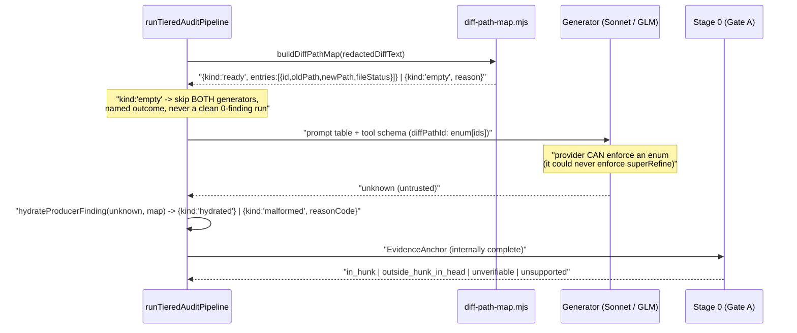

# Plan: Evidence-Anchor Path Contract — stop Stage 0 discarding valid findings as fabricated

- **Date**: 2026-07-17
- **Status**: In Progress — Cluster A shipped + gate-clear; Cluster B (Phases 3–7) pending
- **Author**: Claude + Louis Strydom
- **Scope**: backend (detected: `--scope=backend`; stack `js-ts` + `postgres`)
- **Target domain(s)**: `audit-orchestration`, `shared-lib`
- ⚠ **Cross-domain work** — touches >1 domain (`shared-lib` only via `schemas.mjs`, the
  single source of truth for LLM contracts); the boundary crossing is intentional and
  is the subject of §2's key decision.
- **Audit trail**: R1 GPT plan-audit → SIGNIFICANT_GAPS (H:4 M:3 L:0), all 7 valid +
  in-scope, all folded in (§9).

---

## 1. Context Summary

### What this fixes

The tiered-recall pipeline's Stage 0 rejects **~100% of discovery findings as
`fabricated`** — the bucket meaning "the model hallucinated this". Measured on a real
Sonnet call against a real committed diff (2026-07-17): **4 of 4 findings rejected, 4 of
4 were malformed by our own schema, 0 of 4 were genuine fabrications.** Field evidence:
`stage0Verified > 0` in **1 of 62** completed tiered-shadow runs. Those runs report
`tieredRunStatus: 'complete'` with 0 findings — a green run that verified nothing.

### Code Trace

The evidence path, followed end-to-end:

- Producer contract: [`EvidenceAnchorSchema`](../scripts/lib/schemas.mjs#L135) `schemas.mjs:135-175`
  — `diffPathId` **required**; `oldFile`/`newFile` `.nullable().optional()` (`:137-138`);
  `superRefine` (`:146-175`) then **conditionally requires** those optional fields per
  `fileStatus` (`modified` → both present AND equal `:172`; `added` → `newFile` `:162`;
  `deleted` → `oldFile` `:165`; `renamed`/`copied` → both `:159`).
- Wire format: `tiered-pipeline.mjs:644` `items: z.toJSONSchema(ProducerFindingV2Schema)`
  → `sonnetCall` (`:650-693`) with `tool_choice` (`:682`) → `return toolUse.input.findings`
  (`:693`) — **no Zod parse, no normalizer** between provider and Stage 0.
- Consumer: `runTieredAuditPipeline` (`:760`) → [`runStage0EvidenceTriage`](../scripts/lib/audit/evidence-triage.mjs#L493)
  `evidence-triage.mjs:493` → `resolveWithFallback` (`:418`) → [`resolveAnchorLocation`](../scripts/lib/audit/evidence-triage.mjs#L285)
  (`:285`) → `if (!EvidenceAnchorSchema.safeParse(anchor).success) return {status:'fabricated'}`
  (`:286`) → `rejected.push(envelope)` (`:512`, "LOCAL TELEMETRY ONLY").
- Telemetry terminus: `_stageBreakdown.stage0Rejected` (`tiered-pipeline.mjs:973`) →
  `tieredStageBreakdown` (`tiered-shadow-compare.mjs:314`) → `summarize()`
  (`tiered-shadow-summary.mjs:116`) → **and** `appendTieredShadowObservation`
  (`scripts/lib/store/tiered-shadow.mjs`) → Postgres `tiered_shadow_observations`
  (migration `20260713140000`), where the whole object lands in a **`comparison jsonb`**
  column. One integer; one fixed `reasonCode` (`evidence-triage.mjs:509`).

### Root cause (empirically established, not inferred)

1. **`superRefine` is a Zod runtime refinement — `z.toJSONSchema()` cannot express it.**
   Verified two ways: the emitted JSON Schema contains none of the path rules, and a
   refinement-carrying schema (`_def.checks.length === 1`) emits a **byte-identical**
   JSON Schema to its plain twin. The provider therefore *cannot* enforce the rules,
   contrary to the comment previously at `tiered-pipeline.mjs:665`.
2. **Models behave rationally against the schema they are shown.** `diffPathId` is
   required → populated correctly (4/4, a real path present in the diff).
   `oldFile`/`newFile` are optional → **omitted entirely** (4/4 `undefined`).
3. `resolveAnchorLocation` maps that shape failure onto `fabricated` — an accusation of
   hallucination — and the finding is destroyed.

**The `diff-path map` does not exist.** `schemas.mjs:136` describes `diffPathId` as
"from the diff-path map"; that map was specified in
[`tiered-recall-audit-pipeline.md:154`](tiered-recall-audit-pipeline.md#L154) (round-2
finding #8) and **never built**. No producer exists anywhere in `scripts/`. The model is
asked to cite an id from a map it is never given, so it invents one — and by convention
(every test in `evidence-triage.test.mjs`, and Sonnet 4/4) that invention is the file path.
This plan finishes the design the field name already promises.

### This is the third instance of one pattern

| # | Contract mismatch | Symptom | Status |
|---|---|---|---|
| 1 | V1 schema had no evidence fields; Zod stripped them → `evidenceType: null` | **every** candidate Stage-0-`fabricated` | fixed (`tiered-pipeline.mjs:546-551`) |
| 2 | GLM `modified` anchor rule | loud generator failure → `fallback_legacy` | fixed (`d907993`, normalizer) |
| 3 | Sonnet omits `oldFile`/`newFile` (this plan) | **every** candidate Stage-0-`fabricated`, silently | open |

The recurrence is the argument for fixing the *class*, not the instance. `fabricated`
silently absorbs every contract mismatch, so each recurrence costs a live repro to find.

### Patterns reused vs new

- **Reused**: the DTO-vs-internal-model seam already established by
  `StageOneTriageInputSchema` (a "minimized, redacted DTO", `tiered-pipeline.mjs:151-161`);
  the `_stageBreakdown` diagnostic seam (`:956-964`), added for exactly this class of
  question; the diff-header parsing core inside `extractFileDiffSection`
  (`evidence-triage.mjs:64-100`) — the map is a re-projection of data that parser already
  computes, though it must be **refactored, not called as-is** (§7i); the **absent ≠ zero**
  shape-check precedent in `summarize()` (`tiered-shadow-summary.mjs:140-143`).
- **New**: one small module (`diff-path-map.mjs`) and one producer-facing anchor schema.

### Neighbourhood considered

| Symbol | File | Sim | Rec |
|---|---|---|---|
| `runStage0EvidenceTriage` | `audit/evidence-triage.mjs:440` | 0.74 | review |
| `normalizeModifiedAnchorPaths` | `audit/tiered-pipeline.mjs:133` | 0.73 | review |
| `extractCanonicalAnchorFile` | `audit/tiered-pipeline.mjs:358` | 0.71 | review |
| `resolveAnchorLocation` | `audit/evidence-triage.mjs:270` | 0.71 | review |
| `extractFileDiffSection` | `audit/evidence-triage.mjs:49` | 0.68 | review |
| `normalizeFindingEvidence` | `schemas.mjs:250` | 0.68 | review |

All `review` (max 0.74 — below the 0.75 `justify-divergence` band), so no reuse is forced.
Two are nonetheless directly relevant and this plan **does not create siblings** for them:
`normalizeModifiedAnchorPaths` is **retired** by Phase 6 rather than duplicated, and
`extractFileDiffSection` is **reused** as the diff-path map's parser rather than
re-implemented (#1 DRY).

---

## 2. Proposed Architecture

### The decision: make the contract expressible in the schema the provider actually sees

The constraint classes are asymmetric, and this is the whole insight:

| Constraint | Expressible in JSON Schema? | Provider enforces? |
|---|---|---|
| required field, type, **`enum`** | **yes** | **yes** |
| cross-field conditional (`superRefine`) | **no** | **no** — silently ignored |

Today the anchor's path contract lives entirely in the second row. The fix is to move it
into the first: **the model cites an `id` from an enum of the actual files in this diff,
and we derive everything else from our own map.**

**But the enum is a funnel, never a trust boundary** (D6). Provider enforcement is exactly
what this bug proved we cannot rely on; re-trusting it for the enum would repeat the
mistake in a new coat. Every producer response is `safeParse`d at the seam regardless.



### Key design decisions

**D1 — The model's contract carries only what the model can know (#3 Modularity, #5 Single
Source of Truth).** `oldFile`/`newFile`/`fileStatus` are *facts about the diff*, not
claims about the finding. Gate A already re-verifies them against the real diff
(`evidence-triage.mjs:292-294`), i.e. **they are never trusted as model input** — so
asking for them yields zero information and exists only as a failure surface. They become
derived. `diffPathId` becomes `z.enum([...ids present in this diff])`.

**D2 — This eliminates the *path* causes by construction, not by taxonomy.** With paths and
`fileStatus` derived from our own map, the path-shaped schema-invalid cause (`:286`) and
both path-metadata-mismatch causes (`:293-294`) become **unreachable from a hydrated
anchor**.

**D2a — but `side` is still a model claim, and hydration must reconcile it (Gemini G1).**
Deriving `fileStatus` does **not** make every shape failure unreachable: `side` remains
model-supplied, and `EvidenceAnchorSchema`'s *other* superRefine rules (`:150-155`) still
hold — an `added` file has no base side; a `deleted` file has no head side. A model citing
`side:'base'` on a file the map says is `added` would, if blindly merged, produce an
internally contradictory anchor that fails `safeParse` at Gate A and lands in `malformed` —
misattributing a **model claim disproved by the diff** as *our* contract bug, the exact
error class this plan exists to fix.

So `prepareCandidates` reconciles `side` against the derived `fileStatus` **at the seam**:

| Derived `fileStatus` | Legal `side` | A conflicting claim is… |
|---|---|---|
| `added` | `head` only (determined) | `contradicted` — the diff disproves it |
| `deleted` | `base` only (determined) | `contradicted` |
| `modified` / `renamed` / `copied` | `base` or `head` — a genuine model choice | not checkable here; Gate A's content check decides |

`side` is **validated, not derived**, because for the common case it is a real choice
(which side the quote is on); only `added`/`deleted` determine it, and there a conflict is
definitive. A reconciliation failure is `contradicted` (model evidence failure), **never**
`malformed` (our bug) — this is exactly the attribution D3 exists to keep honest.

What remains in the model-evidence buckets is therefore: `unsupported` (quote not in the
diff) and `contradicted` (side disproved by the diff). Both are genuine model failures.
`malformed` is left meaning only *our contract broke*.

**D3 — Still split the classes, as defence in depth (#19 Observability).** D2 makes the
malformed class *near-zero*, not *impossible* — a future schema tightening could
reintroduce it, which is precisely how this bug recurred three times. The split is what
makes recurrence #4 visible in telemetry instead of costing a live repro. Sequenced
**first** (§11 Cluster A) so it provides the acceptance metric for the fix.

**D4 — `malformed` must NOT proceed to Stage 1 (#15 Error Handling; INC-001).** A
malformed anchor's quote has never been content-verified, so letting it through would put
unverified evidence in front of a human. It stays out of the eligible pool — the change is
**attribution and visibility**, not permissiveness. This preserves INC-001's lesson
("never *I couldn't classify it so I'll allow it*") while fixing the misattribution.
`unverifiable` (can't check — proceeds, safe default) and `malformed` (can't parse — does
not proceed, reported as **our** bug, loudly) are now distinct, where today the latter is
laundered as the model's lie.

**D5 — `verifyAnchor`'s closed 3-state contract stays byte-identical (#18 Backward
Compat).** Its docblock (`evidence-triage.mjs:314-319`) explicitly reserves
`resolveAnchorLocation` as the Stage-0-only detailed resolver for exactly this reason. All
new discriminator values land there; `verifyAnchor` is untouched.

**D6 — The producer boundary is untrusted and per-finding (R1/H2).** `hydrateProducerFinding`
takes `unknown`, `safeParse`s a producer DTO **before touching any field**, and returns a
discriminated non-throwing result per finding. One malformed finding degrades **itself**,
never the batch. The provider's enum is a funnel that reduces malformed rate; it is not
evidence of validity. An unknown id → `malformed` with a named reasonCode, counted.

**D8 — The evidence-type conditional moves to a `discriminatedUnion`, not an allowlist
(Gemini G3).** `ProducerFindingV2Schema` enforces "commission ⇒ `anchor`; omission ⇒
`triggerAnchor` + `causalChain`" via `superRefine` (`schemas.mjs:195-203`) — which is the
**same inexpressible class** as the path rules, and which §7d's guard would (correctly)
reject on the new provider-facing `ProducerFindingV3Schema`. The plan's own guard failing
the plan's own schema is a real contradiction, and allowlisting it would disarm the guard
on its first use.

The fix is D1's table again, not an exception: **`z.discriminatedUnion('evidenceType',
[commission, omission])`**. Verified against `zod@4.4.3` — it emits `oneOf` with per-branch
`required` arrays (so the **provider enforces it**) and carries `_def.checks.length === 0`
(so it **passes the trap guard**). One more constraint moves from row 2 to row 1 of D1's
table; nothing is weakened to accommodate it.

`EvidenceAnchorSchema` (internal) keeps its `superRefine` untouched — it is never handed to
a provider, so the guard's registry does not include it, and it remains the strict internal
oracle Gate A validates against.

**D7 — Ids are opaque ordinals, never paths (R1/M1).** `id` is `f0001`, `f0002`, …
assigned in the parser's diff-header order. Path-as-id would preserve the very convention
that hid this bug and reintroduce the rename/copy ambiguity (`oldPath !== newPath` cannot
be one path). The map's immutable serialized array is the **sole** source for both the
prompt table and the enum, so the two cannot drift.

### Right-sizing gate

- **Band-aid** — extend `normalizeModifiedAnchorPaths` to derive missing paths from
  `diffPathId` per `fileStatus`. ~10 lines. **Rejected**: it leaves the
  schema↔JSON-Schema contradiction intact, so the next conditional rule added to
  `superRefine` silently re-breaks the pipeline. That the root cause resurfaces is not
  hypothetical — it has now happened three times (§1). It also depends on the *undocumented,
  unenforced* convention that `diffPathId` is the file path, which D7 shows is itself unsafe.
- **Over-engineered** — a persistent diff-path-map service with content-hash ids, stable
  cross-round identity, and its own storage. **Rejected**: no current requirement; nothing
  needs anchor identity to survive a round.
- **Chosen** — build the map **in-memory, per run, from the diff we already parse**
  (`extractFileDiffSection`), pass it as a bounded prompt table, make the id an enum,
  derive the rest, and `safeParse` the response anyway. Serves two current, demonstrated
  requirements: Stage 0 must stop destroying valid findings (4/4 measured), and it must
  stop doing so silently (1/62 measured).

### Security Considerations

**This design DOES introduce a new egress surface — the draft's "no new egress class" claim
was wrong and is withdrawn (Cluster A audit R1/H3).** The enum enumerates file paths as
first-class, structured, citable ids inside the tool schema. `redactSecrets` masks secret
*values*; it does **not** exclude sensitive *paths*. A `.env` or `secrets/db.yaml` entry
would therefore be disclosed to the provider as a schema member — a path-level disclosure
that the redacted diff body alone does not imply.

Constraints, in order:

1. **Filter before mapping, not after.** Eligible files are resolved through the canonical
   `scripts/lib/sensitive-paths.mjs` seam (`filterDiffFiles` / `classifyPath` /
   `shouldSkipForIndexing`, incl. `resolveAndClassify`'s symlink-aware canonicalisation)
   **before** `buildDiffPathMap` runs. The prompt table and the enum are constructed
   **exclusively** from that filtered set — never from raw diff headers. A file excluded
   here simply has no id, so no anchor can cite it.
2. **Fail closed** on any classification/resolution error (`resolutionFailed` /
   `escapedRepo` → treated sensitive → excluded), per **INC-001**'s lesson: never "I
   couldn't classify it so I'll allow it." Note this *reverses* the draft's instruction —
   symlink-aware resolution is **required** here, not forbidden: an innocent-looking diff
   path that canonicalises into `~/.ssh/` is exactly INC-001's class, and the enum would
   otherwise hand the provider its name.
3. The map is still built from the **already-redacted** `discoveryCode`/`ctx.diffText`
   (`tiered-pipeline.mjs:530`), never re-read from git — otherwise the two halves of one
   payload can disagree, the exact failure `:525-529` documents. Filtering (1) and
   redaction (3) are complementary, not alternatives: one removes sensitive *files*, the
   other masks sensitive *values* in the files that remain.
4. **Tier-3 test obligation** (AGENTS.md: sensitive-path egress is a HARD test-first seam):
   a test asserting no sensitive path can appear in the map, the prompt table, or the enum
   lands in the **same commit** as the map builder.

---

## 6. Sustainability Notes

- **Assumption encoded**: a diff-path id is meaningful only within one run's diff. Made
  explicit by building the map per run, never persisting it, and using ordinals (D7).
- **What breaks in 6 months**: a new provider that cannot accept an enum-typed tool field.
  Handled by D8/§7f's capability contract rather than a silent fallback.
- **Coupling**: loosened. Today `schemas.mjs` (shared-lib) encodes generator wire format
  *and* internal evidence shape in one object; splitting producer-DTO from internal model
  means a wire-format change no longer ripples into Stage 1/2 or the ledger.
- **Extension point deliberately built in**: the map is the natural home for the
  `renamed`/`copied` pair, the one case no `diffPathId`-mirroring band-aid could derive.

---

## 7. File-Level Plan

| File | Intent | Purpose |
|---|---|---|
| `scripts/lib/audit/evidence-triage.mjs` | modify | Implement §7a's result matrix in `resolveAnchorLocation` (Stage-0-only); stable reasonCodes; `runStage0EvidenceTriage` returns a `malformed` bucket. `verifyAnchor` untouched (D5). |
| `tests/evidence-triage.test.mjs` | modify | One test per §7a row; pin `verifyAnchor` unchanged; pin `malformed` ∉ eligible pool (D4). |
| `scripts/lib/audit/tiered-pipeline.mjs` | modify | `_stageBreakdown.stage0Malformed`; build + thread the map; empty-map short-circuit; both generators' schemas; hydration wiring; retire the anchor-mirror normalizer. |
| `scripts/lib/audit/tiered-shadow-compare.mjs` | modify | Persist `tieredStage0Malformed` (copy-straight-through, `:314-320`). |
| `scripts/lib/audit/tiered-shadow-summary.mjs` | modify | Surface malformed as a named, non-silent exclusion; absent ≠ 0 (§7c). |
| `scripts/lib/audit/diff-path-map.mjs` | **create** | `buildDiffPathMap(diffText)` → `{kind:'ready'\|'empty'\|'invalid'}` (§7j); `prepareCandidates(unknown, map)` → per-finding discriminated result (§7g); budget helpers. Pure. Consumes `parseAllDiffSections` (§7i). |
| `tests/diff-path-map.test.mjs` | **create** | All 5 `fileStatus` values; rename pair; unknown id; empty diff; budget overflow; hostile input. |
| `scripts/lib/schemas.mjs` | modify | `ProducerEvidenceAnchorSchema` (id + side + lines + quote) + `ProducerFindingV3Schema` as a **`discriminatedUnion('evidenceType', …)`** — refinement-free, provider-enforceable (D8); per-run enum factory; exported `PROVIDER_FACING_SCHEMAS` registry (§7d). `EvidenceAnchorSchema` unchanged as the strict internal oracle. |
| `scripts/model-eval-discovery.mjs` | modify | Same contract (`:144` currently composes the retired normalizer). Covered by §9's acceptance. |
| `tests/tiered-pipeline-stage0-wiring.test.mjs` | modify | Fold in the `z.toJSONSchema`-drops-superRefine guard (keep — it pins the trap); retarget the wiring guard. |
| `tests/provider-contract-enforceable.test.mjs` | **create** | Generalised guard: coverage scan + refinement-free property over `PROVIDER_FACING_SCHEMAS`. See §7d. |
| `scripts/verify-anchor-contract.mjs` | **create** | The mandatory live-provider acceptance probe (§9a). Top-level CLI ⇒ **must** implement `--selfcheck-relocation` and be added to `CLI_SMOKE_SET`; models via `resolveModel()` sentinels only. |
| `tests/verify-anchor-contract.test.mjs` | **create** | Relocation smoke + arg parsing + exit-code semantics, hermetic (no live calls). |

### 7a. Closed Stage-0 result matrix (R1/M2 — publish before Phase 1)

The single source of truth for the taxonomy. Every `resolveAnchorLocation` return maps to
exactly one row.

**Ownership of `malformed` — two layers, one counter (R2/H6).** The apparent contradiction
(D6 hydrates before Stage 0, so how does Stage 0 ever see a malformed claim?) resolves into
the plan's own sequencing, and is load-bearing rather than incidental:

| Layer | Owner | When it fires |
|---|---|---|
| **Primary** | `prepareCandidates` (§7g), pre-Stage-0 | Every run **after** Cluster B. A malformed DTO is rejected here and never reaches Stage 0. |
| **Tripwire** | `resolveAnchorLocation`'s `safeParse` (`:286`), unchanged | (a) **Before** Cluster B lands — this is exactly Cluster A's measuring instrument, reading the *current* 100%-malformed reality; (b) **after** Cluster B, only if hydration regresses or a caller bypasses it. |

Both increment the **same** `stage0Malformed` aggregate, owned by `runTieredAuditPipeline`.
This is why Cluster A ships first: its counter reads ~100% today, and Cluster B's
acceptance is that same counter reading **0** — the tripwire firing post-Cluster-B is a bug
signal, not a normal path. The tripwire is retained permanently (defence in depth, D3); it
is not dead code, it is the regression detector for recurrence #4.

**`contradicted`** is likewise a **tripwire class, not a live path** (R2/M4): reachable
today on raw anchors, unreachable from a hydrated anchor once Cluster B lands (D2), and
retained so a hydration regression surfaces as a named class instead of silence. Every
consumer — including `model-eval-discovery.mjs` — routes through the same hydrator (§7h),
so there is no "non-hydrated path" exception.

| Result | Trigger | reasonCode | Stage-1 eligible? | Counter | Attribution |
|---|---|---|---|---|---|
| `in_hunk` | quote found on the cited side in the hunk | `…_content_verified` | **yes** | `stage0Verified` | — |
| `outside_hunk_in_head` | quote absent from hunk, found in HEAD (head-side only) | `…_content_verified` | **yes** (via Gate B) | `stage0Verified` | — |
| `unverifiable` | file not in the diff at all / no diffText | `…_diff_section_unavailable` | **yes** (safe default, unchanged) | `stage0Verified` | neither |
| `unsupported` | anchor well-formed, quote **not** in diff or HEAD | `…_quote_not_found` | no | `stage0Rejected` | **model evidence failure** |
| `contradicted` | anchor well-formed, metadata disagrees with the diff | `…_metadata_mismatch` | no | `stage0Rejected` | **model evidence failure** |
| `malformed` | DTO `safeParse` failed / unknown id — claim unreadable | `…_malformed_anchor` | **no** (D4) | **`stage0Malformed`** (new) | **OUR contract bug** |

**Accounting invariants — two, because there are two units (Gemini G2).** The draft's
single invariant (`verified + rejected + malformed + preExistingIndependent ===
discoveryRawFindings`) is **mathematically false** and is withdrawn:
`mergeIntoEnvelopes` (`candidate-envelope.mjs:119`) **merges duplicate raw findings by
fingerprint** into one envelope, so Stage-0 buckets count **envelopes** while
`prepareCandidates` rejects **raw findings**. Summing across the two units cannot balance.

The counters are therefore explicitly unit-tagged:

| Counter | Unit | Source |
|---|---|---|
| `discoveryRawFindings` | raw | generator output |
| `discoveryMalformedRaw` | **raw** | `prepareCandidates` (§7g) — pre-envelope |
| `stage0Verified` / `stage0Rejected` / `stage0PreExistingIndependent` | **envelope** | Stage 0 |
| `stage0MalformedTripwire` | **envelope** | `resolveAnchorLocation`'s `safeParse` (§7a tripwire) |

Two invariants, each within one unit:

1. **Raw-level (nothing vanishes before envelopes)**:
   `discoveryMalformedRaw + rawFindingsContributingToEnvelopes === discoveryRawFindings`.
2. **Envelope-level (nothing vanishes inside Stage 0)**:
   `stage0Verified + stage0Rejected + stage0PreExistingIndependent + stage0MalformedTripwire === envelopeCount`,
   where `envelopeCount ≤ rawFindingsContributingToEnvelopes` (dedup is lossy **by design**
   and is not an accounting leak).

The "loud" rule (§7c) fires on `discoveryMalformedRaw > 0 || stage0MalformedTripwire > 0`.
Reporting a single blended `stage0Malformed` across both units is forbidden — it is exactly
the kind of number that reads meaningful and cannot be reconciled.

### 7j. Empty-scope / invalid-input contract (R1/H1, R2/H5)

`buildDiffPathMap` returns a **three-way discriminated result**, never a bare array.
Semantic absence and invalid input are **different states** and must never share a
status — collapsing them would misattribute a broken input as an ordinary empty scope,
recreating the anti-green class under a new name:

- `{kind:'ready', entries}` — ≥1 eligible file.
- `{kind:'empty', reason:'no_eligible_diff_files'}` — a **well-formed** diff that
  legitimately contains no eligible files (empty diff, or all files removed by
  scope/sensitive filtering). **`z.enum([])` is not constructible**, so this MUST be
  handled before schema construction.
- `{kind:'invalid', reason}` — input that could not be parsed as a unified diff:
  `malformed_diff_header` / `truncated_diff` / `parser_threw`. Non-empty input that yields
  zero recognised entries is `invalid`, **not** `empty` — a parser that finds no `diff --git`
  header in non-whitespace input has failed, not found nothing. `extractFileDiffSection` is
  wrapped so a throw becomes `parser_threw`, never an exception escaping the builder.

| kind | Generators | `tieredRunStatus` | `comparedRuns` | Attribution |
|---|---|---|---|---|
| `ready` | run | `complete` | eligible | — |
| `empty` | **skipped** (no provider call) | `skipped_no_eligible_files` | excluded, own reason bucket | neither — a legitimate no-op |
| `invalid` | **skipped** | `failed_invalid_diff_input` | excluded, own reason bucket | **OUR bug** — counted with `stage0Malformed`'s loud rules (§7c) |

Neither `empty` nor `invalid` may ever report as a clean zero-finding `complete` run.

### 7c. Persistence + historical compatibility (R1/M3 — traced)

Traced, not assumed. `_stageBreakdown` → `comparison` object → `appendTieredShadowObservation`
(`scripts/lib/store/tiered-shadow.mjs`) → `tiered_shadow_observations.comparison`, a
**`jsonb` column** (migration `20260713140000`).

- **No SQL migration required** — the counter is a new key inside an existing `jsonb`
  column. Per AGENTS.md's jsonb-safe write seam: pass the value **raw**; do NOT
  hand-`JSON.stringify`, and `pgArray()` does not apply (object, not array).
- **Historical records**: the 62 existing rows lack the key → it reads `undefined`, and
  **`undefined` MUST NOT be coerced to 0** ("insufficient data", never "zero malformed
  confirmed"). Reuse the existing precedent verbatim: `typeof c.tieredStage0Malformed ===
  'number'` (`tiered-shadow-summary.mjs:140-143`).
- **Read consumers**: `summarize()` (CLI, authoritative) and the dashboard's **Tiered
  Shadow** tab, which shares `summarize()` — so they cannot disagree.
- **"Loud" defined operationally**: (i) a named stderr line at pipeline end when
  `stage0Malformed > 0`; (ii) a distinct `excludedMalformedAnchors` reason bucket in
  `summarize()`; (iii) a run with `stage0Malformed > 0 && stage0Verified === 0` is
  **excluded from `comparedRuns`** — it is a contract failure, not a comparison. It does
  **not** change process exit code (the shadow is observation-only and must never gate the
  build — `openai-audit.mjs:427`).

### 7i. Refactor `extractFileDiffSection`, don't call it (Gemini gate G2)

The draft claimed the map "reuses `extractFileDiffSection` rather than re-implementing it
(#1 DRY)". **That claim was false and is withdrawn**: the function's signature is
`extractFileDiffSection(diffText, filePath)` and it opens with `if (!diffText || !filePath)
return null;` (`evidence-triage.mjs:65`) — it extracts **one known** file's section.
`buildDiffPathMap` must **discover** all files, so it cannot call it without already
knowing the answer.

Phase 3 therefore performs a small **extract-shared-core refactor** (#1 DRY, honestly this
time):

```
parseAllDiffSections(diffText) -> [{ oldPath, newPath, fileStatus, section }]   // NEW — the shared core
extractFileDiffSection(diffText, filePath) = parseAllDiffSections(diffText).find(match)  // same public contract
buildDiffPathMap(diffText)     = parseAllDiffSections(diffText) -> ids + entries
```

**This is a reuse decision with teeth, not cosmetics.** That parser carries hard-won,
regression-locked behaviour a fresh implementation would silently lose: the CRLF-header fix
(consolidated Gemini G1 — `.` excludes `\r`, so a Windows diff failed *every* lookup) and
the quoted-path fix (G3 — `diff --git "a/path with spaces.js" …`), plus documented accepted
debt on Git's full C-style quoted-path grammar whose failure direction is deliberately SAFE
(`null` → `unverifiable`, never a false match). Constraints on the refactor:

- `extractFileDiffSection`'s public contract and return shape stay **byte-identical**
  (`verifyAnchor` and `resolveAnchorLocation` both depend on it) — the existing
  `evidence-triage.test.mjs` cases are the regression pin and must pass unmodified.
- The accepted quoted-path debt and its safe failure direction are **inherited, not
  re-litigated**; a header a caller cannot parse yields no map entry, and an anchor citing
  it resolves `unverifiable` exactly as today.
- `parseAllDiffSections` returning `[]` for non-whitespace input is the `{kind:'invalid'}`
  trigger in §7j — the two contracts meet here.

### 7g. The prepared-candidate protocol (R2/H6 — one owner, one identity)

The single seam between an untrusted provider response and Stage 0. `prepareCandidates`
lives in `diff-path-map.mjs` and is pure:

```
prepareCandidates(rawFindings: unknown, map) -> PreparedCandidate[]
PreparedCandidate =
  | { kind:'ready',     rawIndex, finding }              // internal shape, paths hydrated
  | { kind:'malformed', rawIndex, reasonCode, context }  // never enters Stage 0
```

- **`rawIndex` is the identity** that ties a malformed result back to its raw provider
  finding, so the §7a partition invariant is checkable and telemetry can name *which*
  candidate failed. Never a fingerprint (a malformed finding may not be fingerprintable).
- Per-finding and non-throwing (D6): one malformed candidate degrades **itself**, never
  the batch.
- **Aggregation owner**: `runTieredAuditPipeline` sums `prepareCandidates`' malformed count
  **plus** `runStage0EvidenceTriage`'s tripwire bucket into one `stage0Malformed`. Only
  `kind:'ready'` candidates are passed to `processFindings`/`mergeIntoEnvelopes`, which is
  why the partition invariant is stated over `discoveryRawFindings` (§7a) rather than over
  envelopes.

### 7h. `model-eval-discovery` migration (R2/M4 — one integration, not two)

`model-eval-discovery.mjs` routes through the **same** map builder, producer schema,
enum, and `prepareCandidates` as the tiered pipeline. There is no second, non-hydrated
integration — the earlier draft's "non-hydrated path" justification for `contradicted` is
withdrawn (§7a now justifies it as a permanent tripwire instead). Consequences: the
evaluator stops carrying model-supplied metadata as a failure surface, and §9's acceptance
applies to it unchanged. If the eval harness needs the *pre-hydration* shape for a
research question, it reads `PreparedCandidate.rawIndex` against its own captured raw
response — it does not fork the contract.

### 7d. The generalised trap guard (why this bug can't recur silently)

The root cause is not specific to `EvidenceAnchorSchema`: **any** Zod schema carrying a
refinement, handed to a provider via `z.toJSONSchema`, silently loses that constraint.
Verified mechanically: a refinement shows as `_def.checks.length === 1` while
`z.toJSONSchema` emits a **byte-identical** schema to its plain twin. So it is detectable,
and therefore lintable rather than memorable.

**Zod 4 detection mechanics — pinned here because the Zod-3 intuition is wrong and will
mislead an implementer** (Gemini gate G1 asserted this exact error; measured against
`zod@4.4.3`):

| Schema | `_def.type` | `ctor` | `_def.checks.length` |
|---|---|---|---|
| `z.object({a})` | `object` | `ZodObject` | 0 |
| `z.object({a}).superRefine(fn)` | `object` | `ZodObject` | **1** |
| `z.object({a}).refine(fn)` | `object` | `ZodObject` | **1** |
| `z.object({a: z.string().refine(fn)})` | `object` | `ZodObject` | **0** ← refinement is on the *child* |

- In Zod 4 `.superRefine()` does **NOT** wrap the schema in a `ZodEffects` node —
  **`ZodEffects` does not exist in Zod 4** (it is a Zod-3 concept, and AGENTS.md already
  warns that `_def.typeName`/`_def.shape()` are Zod-3 patterns). The node keeps
  `_def.type === 'object'` and gains a `_def.checks` entry. A guard hunting for
  `ZodEffects` finds nothing and silently passes — the failure mode this guard exists to
  prevent, reintroduced in the guard itself.
- **The last row is why the walk is mandatory**, not an optimisation: a refinement on a
  *nested* field leaves the root's `checks` empty. The guard MUST recurse the whole tree
  (object `shape`, array `element`, union `options`, `nullable`/`optional` inner) and flag
  a non-empty `checks` on **any** node — checking only the root passes a schema whose child
  carries the dropped constraint.
- The guard's own test fixtures MUST include all four rows above, so a future Zod upgrade
  that changes the representation fails the guard's tests rather than silently disarming it.

`tests/provider-contract-enforceable.test.mjs` walks each provider-facing schema tree and
fails if any node carries a refinement, with an explicit allowlist requiring a written
justification. This is not extra scope — it is the **enforcement of D1**, the principle
this plan already adopts. It generalises to every current and future LLM contract in the
repo, and (unlike a memory) it is committed, cross-agent, and travels with the code.

**Closing the "future schema" hole (R2/M5).** A hand-maintained list protects only today's
schemas. The guard is therefore **two assertions, not one**:

1. **Coverage** — a source scan (the established grep-guard pattern,
   `tests/anthropic-client-migration.test.mjs`) enumerates every `z.toJSONSchema(` call
   site in `scripts/` and fails if its argument is not a member of the exported
   `PROVIDER_FACING_SCHEMAS` registry. A new provider contract cannot be added without
   registering it — the list cannot silently fall behind.
2. **Property** — every registered schema's tree is refinement-free.

Deliberately **not** a provider-contract registry/factory refactor of the adapter layer
(R2/M5's recommendation): that is the over-engineered branch — no current requirement needs
adapters to *resolve* schemas through a boundary, only for the guard to *see* them all, and
a source scan achieves that at a fraction of the blast radius. Dynamic per-run schemas
(the id enum) are registered by their **factory**, which the scan treats as the call site;
the factory's static base is what carries (or must not carry) refinements.

### 7b. Implementation Phases

**Phase 1 — Stage 0 result matrix**: implement §7a; `malformed` out of the eligible pool;
partition invariant test. Files: `scripts/lib/audit/evidence-triage.mjs` (modify),
`tests/evidence-triage.test.mjs` (modify).

**Phase 2 — Make it visible**: `stage0Malformed` through `_stageBreakdown` → `comparison`
jsonb → `summarize()`; §7c's loud rules; absent ≠ 0. Files:
`scripts/lib/audit/tiered-pipeline.mjs` (modify),
`scripts/lib/audit/tiered-shadow-compare.mjs` (modify),
`scripts/lib/audit/tiered-shadow-summary.mjs` (modify),
`tests/tiered-shadow-summary.test.mjs` (modify),
`tests/tiered-pipeline-wiring.test.mjs` (modify — **added at execution time,
2026-07-17**: it carries the static source-pin asserting Stage 0's destructure
arity, which the new `malformed` bucket necessarily changes. Substantively
in-cluster — it pins Phase 2's own wiring — but the plan omitted it; `/cycle`'s
Step-3C reconciliation caught the gap and it was declared rather than silently
absorbed).

**Phase 3 — The diff-path map + budgets + capability probe**: extract
`parseAllDiffSections` as the shared parser core (§7i — `extractFileDiffSection`'s contract
unchanged, its tests the regression pin); pure module (§7j's three-way result, D7 ordinals,
§7g's `prepareCandidates`, §8's measured budgets) + the **blocking** GLM/Anthropic enum
capability probe (§7f). Wired to nothing yet. Files:
`scripts/lib/audit/evidence-triage.mjs` (modify — extract core only, no behaviour change),
`scripts/lib/audit/diff-path-map.mjs` (create), `tests/diff-path-map.test.mjs` (create),
`tests/evidence-triage.test.mjs` (modify — pin the refactor is behaviour-preserving).

**Phase 4 — Producer contract**: `ProducerEvidenceAnchorSchema` / `ProducerFindingV3Schema`
+ per-run enum factory; internal schema unchanged. Files: `scripts/lib/schemas.mjs`
(modify), `tests/schemas.test.mjs` (modify).

**Phase 5 — Trap guard**: the generalised refinement lint (§7d). Files:
`tests/provider-contract-enforceable.test.mjs` (create), `AGENTS.md` (modify — one
invariant stub pointing at the guard).

**Phase 6 — Wire + retire**: both generators emit the producer shape; `prepareCandidates`
before Stage 0 (D6, §7g); empty/invalid short-circuit (§7j); delete the anchor-mirror
normalizer + its obsolete tests; migrate `model-eval-discovery.mjs` onto the same contract
(§7h). Files: `scripts/lib/audit/tiered-pipeline.mjs` (modify),
`scripts/model-eval-discovery.mjs` (modify),
`tests/tiered-pipeline-stage0-wiring.test.mjs` (modify).

**Phase 7 — The acceptance probe**: §9a's CLI + its hermetic tests; run it for real. Files:
`scripts/verify-anchor-contract.mjs` (create), `tests/verify-anchor-contract.test.mjs`
(create).

**Close-out (not a phase)**: `npm test` · `npm run arch:refresh` (new module → symbol
index) · `npm run check`.

### 7f. Provider capability contract (R1/H4)

Enum-constrained-id support is a **required capability of the discovery contract**, not a
nice-to-have. There is **no free-form-id fallback** — the previously-drafted "keep the id
free-form for GLM and rely on unknown-id → malformed" is rejected: it would make the GLM
path *noisier* while still discarding valid findings, i.e. ship the bug with better
telemetry.

- Phase 3 runs a **blocking capability probe** against both live adapters (Anthropic
  tool-use; OpenRouter structured-output). A provider that cannot honour the bounded enum
  schema is **not eligible** for discovery — resolved at configuration time, named loudly,
  never silently selected.
- If a required generator is ineligible, that is a **required-generator failure** with a
  named reason (the existing §1.5 semantics), not a degraded success.
- **Decision point**: if OpenRouter cannot honour enums, this plan stops at Phase 5 and
  the GLM path is escalated as a separate provider-contract decision — it does **not**
  proceed on a fallback that reintroduces the defect.

---

## 8. Risk & Trade-off Register

| Risk | Mitigation |
|---|---|
| **Unbounded dynamic tool schema (R1/H3, R2/H8).** A diff can contain arbitrarily many files with arbitrarily long paths; the enum, prompt table, and request grow without limit. The enum is the mechanism the correctness rides on. | **Bounded by a named failure, NOT by partitioning — see §8a.** Explicit versioned budgets (`maxMapEntries`, `maxSchemaBytes`, `maxPromptTableBytes`) in one config object beside `oss-call-policy.json`'s conventions, with values measured in Phase 3 against the lowest supported provider. On overflow: a **named required-generator failure** (`discovery_map_exceeds_budget`), never a silent truncation and never a free-form-id fallback. Partitioning is **deferred** (§Out-of-Scope item 4). |
| **A model cites a valid id but the wrong file.** | Unchanged from today: Gate A still content-verifies the `quote` against that file's real diff section. Derivation cannot launder a fabricated quote — it only stops us destroying a real one. |
| **`renamed`/`copied` genuinely have two paths.** | The map carries both; hydration sets them from the map. The case no band-aid could handle — an argument *for* the map (D7). |
| **Retiring the anchor-mirror while GLM still needs lenient ingestion.** | `clampToJsonSchemaLimits` (the maxLength/maxItems half) is **retained** — only the anchor-mirror half is retired, and only once Phase 6 makes it unreachable. |
| **Re-trusting the provider (the meta-risk).** | D6: the enum is a funnel, not a trust boundary. `safeParse` at the seam regardless. §7d's guard prevents the class from silently returning. |
| **Deferred: the `discovery_generation` 120s timeout** (`oss-call-policy.json`); 6 observed timeouts; its own `calibrationNote` invites recalibration. | **Deliberately out of scope — and it does NOT gate this plan's verification.** Independence named per AGENTS.md: it is a *transport* failure in the GLM generator; this plan's correctness rides on the anchor shape and Stage 0's pure functions, neither of which touches OSS transport. §9's acceptance drives the Sonnet path directly (as the 2026-07-17 probe did) **and** the GLM path via Phase 3's probe, so the timeout blocks neither. Separate plan. |

### 8a. Why overflow fails loudly instead of partitioning (R2/H8 — right-sizing applied)

R2/H8 correctly identified that "deterministically partition and union the findings" left a
correctness-critical algorithm unspecified: no packing rule, no per-chunk context
definition, no cross-file finding policy, no dedup identity, no aggregate accounting. Its
recommendation was to specify that contract. **We do the opposite: we delete it.**

- **Band-aid** — silent truncation of the map. Rejected: makes valid changed files
  unauditable while reporting success. The exact anti-green class this plan exists to kill.
- **Over-engineered** — a full bounded-discovery partitioning contract (packing, per-chunk
  diff/context slicing, cross-file finding policy, dedup identity, aggregate accounting).
  Rejected: **no current requirement**. Partitioning changes recall and cost — a design
  that large must be driven by a measured need, not a hypothetical one, and specifying it
  now means implementing a recall-affecting algorithm no observed diff has yet demanded.
- **Chosen** — measure the real ceiling in Phase 3, set the budget from the lowest
  supported provider, and make overflow a **named required-generator failure**. Loud,
  correct, and honest: an over-budget diff is *not audited by the tiered path* and says so,
  falling back to legacy exactly as any other required-generator failure does (§1.5's
  existing semantics — no new failure machinery).

The deferral is a **true scope boundary, not deferred difficulty**: the tiered pipeline is
`shadowEnabled`-only today, so an over-budget diff loses an *observation*, never a gating
audit. §Out-of-Scope item 4 records the trigger that would promote partitioning to real work.

---

## 9. Testing Strategy

**Tier 1 (test-first — deterministic seams).** `diff-path-map.mjs` and the
`resolveAnchorLocation` matrix are pure functions with crisp I/O: both land with their
tests (AGENTS.md testing doctrine).

- **§7a matrix**: one test per row — trigger, reasonCode, eligibility, counter.
- **Partition invariant**: `verified + rejected + malformed + preExistingIndependent ===
  discoveryRawFindings`.
- **Map**: all 5 `fileStatus` values; rename pair (`oldPath !== newPath`); unknown id;
  path containing spaces (fixture exists, `evidence-triage.test.mjs:158`); **`{kind:'empty'}`
  for an empty and a fully-filtered diff**; budget overflow → partition, never truncate.
- **Untrusted boundary (D6)**: `hydrateProducerFinding` fed hostile input — `null`,
  `[]`, missing anchor, `side:'sideways'`, `endLine < startLine`, unknown id — returns
  `{kind:'malformed'}` per finding and **never throws**; one malformed finding does not
  degrade its batch.
- **Regression pin (the trap)**: `z.toJSONSchema(ProducerFindingV2Schema)` carries none of
  the `superRefine` rules — already written and passing in the working tree; keep it.
- **Generalised guard (§7d)**: every provider-facing schema is refinement-free.
- **Invariants**: `verifyAnchor`'s 3 states unchanged (D5); `malformed` ∉ eligible pool (D4).
- **Anti-green (the test that would have caught this on day one)**: a run where every
  anchor is malformed MUST NOT summarise as a clean 0-finding `complete` run — it must
  report `stage0Malformed > 0` and be excluded from `comparedRuns`. Likewise a
  no-eligible-files run must surface as `skipped_no_eligible_files`, never `complete`.
- **Historical compat**: a `comparison` blob without the new key yields "insufficient
  data", never `0`.

### 9a. `scripts/verify-anchor-contract.mjs` — the mandatory acceptance probe (R2/H7)

Static tests cannot prove a *provider* honours the enum, so this script is the ship gate.
It is a real top-level CLI and must obey the repo's rules for one — the earlier draft made
it mandatory without specifying it, which is exactly the "GREEN ≠ REALIZED" gap:

- **CLI**: `node scripts/verify-anchor-contract.mjs --rev <sha> [--generator sonnet|glm|all] [--json] [--out <file>]`.
  Default `--generator all`.
- **Repo-rule compliance (both currently unmet by the draft)**: implements
  `--selfcheck-relocation` (printing `OK`, exiting 0) at the head of `main()` and is added
  to `CLI_SMOKE_SET`; selects models via `resolveModel('latest-sonnet')` sentinels — **no
  pinned concrete ids**.
- **Fixture**: a *committed* revision, never the working tree (an uncommitted tree makes the
  result unreproducible and drags unrelated files into the payload — the confound that
  broke the 2026-07-17 shadow run). Default: a pinned known-good sha recorded in the script;
  `--rev` overrides. The diff is taken via the existing `vcs.mjs` contract.
- **Egress**: reuses `filterDiffFiles` + `redactSecrets` on the same path as production —
  the probe MUST NOT construct its own payload, or it stops testing the real seam.
- **Exit semantics**: `0` = acceptance met (`stage0Verified > 0 && stage0Malformed === 0`
  for every requested generator); `1` = acceptance failed (counters present, criteria
  unmet); `2` = could not run (provider unavailable / capability probe failed) — **never
  conflated with pass**, per the anti-green rule.
- **Evidence**: writes the per-generator counters + resolved model ids + rev to `--out`
  (gitignored, Category A) so the acceptance claim is reproducible rather than asserted.

**Acceptance covers every generator Phase 6 changes** — Sonnet **and** GLM **and**
`model-eval-discovery.mjs` (§7h). A Sonnet-only pass is **not** acceptance (R1/H4): it
would ship a fixed Sonnet path beside a still-broken GLM path. **The acceptance metric is
Phase 1-2's own counter** — which is why the detection cluster is sequenced first. A green
suite is not sufficient evidence here; the bug it is fixing lived under a green suite for
weeks.

---

## 11. Execution Clustering

- **Cluster A** — Phases 1–2 — fix-gate: yes
  - Coupling: one seam — the new `malformed` discriminator is meaningless unless it reaches
    telemetry, and telemetry has nothing to report without the discriminator. Together they
    are the **measuring instrument** for Cluster B; gated `yes` because B's acceptance
    criterion is A's counter reading zero.
  - author-tier: standard
- **Cluster B** — Phases 3–7 — fix-gate: final
  - Coupling: the map, the producer contract, the trap guard, the derivation, and the
    acceptance probe are one contract change — the schema is unenforceable without the map's
    id set, the map is dead code until a generator cites it, the guard pins the principle
    the contract encodes, and the probe is the only thing that proves a live provider
    honours it. Auditing them together lets the wiring pass inspect the producer↔consumer
    seam this bug lives in. Phase 3's capability probe is a **blocking gate inside** the
    cluster (§7f).
  - author-tier: frontier
- **Final gate**: mandatory consolidated Gemini review over the union diff.

---

## Out of Scope (Future)

1. **`discovery_generation` 120s timeout** — `scripts/lib/audit/oss-call-policy.json`;
   6 observed timeouts; its own `calibrationNote` invites recalibration. **Independence**:
   a transport-layer failure; this plan's correctness does not depend on OSS call latency
   (§8).
2. **The 42 `anthropicClient unavailable` shadow records** — investigated 2026-07-17 and
   **closed as not-a-bug**: all 42 carry `legacyOk: false`, and `summarize()`'s
   `legacyFailures`/`shadowFailures` split (`tiered-shadow-summary.mjs:117-118`) is a
   deliberate non-overlapping precedence. Correctly bucketed.
3. **Phase 14 / the shadow window** — the existing 62 "complete" runs are vacuous
   (`stage0Verified > 0` in 1). The window cannot begin collecting decision-grade data
   until this plan lands; it should restart from zero afterwards. **Independence**: a
   measurement-campaign decision, not a code dependency.
4. **Bounded-discovery partitioning (§8a)** — chunking an over-budget diff into multiple
   bounded map+enum requests and unioning the findings. **Independence**: the tiered path is
   `shadowEnabled`-only, so an over-budget diff loses an observation, never a gating audit;
   overflow already fails loudly and falls back to legacy (§1.5). **Promotion trigger**:
   any real diff hits `discovery_map_exceeds_budget`, OR the tiered path is promoted to
   gating (Phase 14) — whichever first. Then the full contract R2/H8 lists (packing rule,
   per-chunk context, cross-file policy, dedup identity, aggregate accounting) becomes real
   work driven by a measured ceiling.
5. **`audit_runs.scope_mode` column missing** — observed live during this plan's own R1
   audit (`[learning] recordRunStart failed: column "scope_mode" of relation "audit_runs"
   does not exist`). Schema drift between the migration ledger and the live DB, plausibly
   from the 2026-07-14 wipe restore. **Independence**: the learning-store write is
   best-effort and never blocks an audit; this plan touches neither. Needs its own
   `--check-drift` investigation.

---

## Audit Trail

**R1 (GPT, `--mode plan`)** — `SIGNIFICANT_GAPS`, H:4 M:3 L:0. All 7 triaged
`valid` + `in-scope` → `fix-now`; **zero** dismissed, zero rigor-pressure, no rebuttal
round required (no `uncertain`/`invalid` findings to deliberate).

| ID | Finding | Resolution |
|---|---|---|
| H1 | Empty-scope / parse-failure contract undefined; `z.enum([])` unconstructible; empty run could read as clean | **§7j** discriminated map result + `skipped_no_eligible_files` named outcome |
| H2 | Producer-output boundary untrusted + unspecified; provider enforcement is not a runtime trust boundary | **D6** + `hydrateProducerFinding(unknown, map)` per-finding discriminated result; §9 hostile-input tests |
| H3 | Dynamic tool schema unbounded; "measure later" is not a bound | **§8** explicit versioned budgets + deterministic partitioning; never truncate |
| H4 | GLM free-form-id fallback ships the bug with better telemetry; acceptance tested Sonnet only | **§7f** capability contract, fallback **removed**; §9 acceptance covers every changed generator |
| M1 | `id` semantics undefined; path-as-id recreates rename ambiguity | **D7** opaque ordinals in diff-header order; map is sole source for prompt + enum |
| M2 | Verdict taxonomy inconsistent across §2/§7/§9; `contradicted` unexplained | **§7a** closed result matrix; `contradicted` documented as deliberately transient |
| M3 | Persistence/read path untraced; historical records; "loud" undefined | **§7c** full trace — `comparison jsonb`, **no migration**, absent ≠ 0 precedent, loud defined operationally |

**R2 (GPT, `--round 2`, ledger-suppressed)** — `NEEDS_REVISION`, H:4 M:2 L:0
(`kept:6 suppressed:0 reopened:0`). HIGH plateaued 4→4, which is normally the
rigor-pressure stop — but all six were **concrete design defects introduced by R1's own
fixes** (internal contradictions and repo-rule gaps), not scope pressure, so they were
fixed under the "genuine net-new design bug" exception. **GPT loop stopped at R2**: the
findings' character shifted toward "specify this algorithm further", and on two of them
(H8, M5) the right answer was to *shrink* scope rather than specify — the signal that the
refinement surface, not the design, is now generating findings.

| ID | Finding | Resolution |
|---|---|---|
| H5 | Map result union conflates parse failure with empty scope; invalid input would read as an ordinary no-op | **§7j** three-way result — `ready` / `empty` / `invalid`, distinct statuses + attribution |
| H6 | `malformed` ownership contradictory — D6 hydrates before Stage 0, yet §7a has Stage 0 returning it; Phase 1 precedes the hydrator | **§7a + §7g** two layers (primary hydrator / permanent tripwire), one aggregate counter, `rawIndex` identity — and this *is* the Cluster A→B instrument-first story |
| H7 | Mandatory verification script unnamed, unspecified; violates `--selfcheck-relocation` + `resolveModel()` repo rules | **§9a** full CLI contract + both repo rules + committed-fixture + 3-way exit semantics; added to the file plan (Phase 7) |
| H8 | Partitioning named but algorithm unspecified (packing, dedup, accounting) — correctness-critical | **§8a** — partitioning **removed** from v1; overflow is a named required-generator failure; full contract deferred with a promotion trigger (§Out-of-Scope item 4). Right-sizing applied *against* the recommendation |
| M4 | `model-eval-discovery` migration conflicts with the `contradicted` rationale | **§7h** one integration — it routes through the same hydrator; `contradicted` re-justified as a permanent tripwire (§7a) |
| M5 | Guard's "provider-facing schema" set undefined; a manual list can't protect future calls | **§7d** two assertions — a source-scan coverage guard over every `z.toJSONSchema(` call site + the refinement property. Registry/factory refactor rejected as over-built |

**Gemini gate round 1** — `CONCERNS`, 2 new, 0 wrongly-dismissed. Both were
implementation-level and both were **empirically checked before adjudication** rather than
accepted on authority (the peer-relationship rule):

| ID | Finding | Adjudication |
|---|---|---|
| G1 (HIGH) | "`.superRefine` creates a `ZodEffects` wrapper, not a `_def.checks` entry — the guard will miss it" | **Mechanism REFUTED, concern PARTIALLY ACCEPTED.** Measured on `zod@4.4.3`: `.superRefine()` on an object keeps `_def.type==='object'`/`ZodObject` and **adds** `checks:1`; **`ZodEffects` does not exist in Zod 4** — a Zod-3 category error of exactly the kind AGENTS.md warns about. But the probe surfaced a real edge the finding gestures at: a **nested** refinement leaves the *root*'s `checks` empty (`z.object({a: z.string().refine(f)})` → `checks:0`), so a root-only check would miss it. **§7d** now pins the full Zod-4 truth table, explicitly refutes the `ZodEffects` hunt, mandates the tree walk, and requires all four rows as guard fixtures. |
| G2 (MEDIUM) | `extractFileDiffSection` takes a *known* `filePath` and returns `null` when it is falsy — `buildDiffPathMap` cannot call it to discover unknown files; the stated DRY reuse is impossible | **ACCEPTED — a real defect.** Verified at `evidence-triage.mjs:65`. The reuse claim was false and is withdrawn. **§7i** replaces it with an extract-shared-core refactor (`parseAllDiffSections`), preserving the parser's regression-locked CRLF + quoted-path fixes and its documented accepted debt, with `extractFileDiffSection`'s contract byte-identical and its existing tests as the pin. |

G1 is the session's second instance of a reviewer being confidently wrong about a
*mechanism* while right that a *hole* existed — the reason both were run to ground against
the real library rather than adjudicated on prose.

**Gemini gate round 2** — `CONCERNS`, 3 new, 0 wrongly-dismissed. All three were concrete
**design** defects (wrong contract / false invariant / internal contradiction), not
implementation nits, so all three were fixed under the gate's genuine-design-bug exception.

| ID | Finding | Adjudication |
|---|---|---|
| G1 (HIGH) | Deriving `fileStatus` doesn't stop a model hallucinating an impossible `side` (e.g. `side:'base'` on an `added` file); blind merge builds a contradictory anchor that fails Gate A as `malformed` | **ACCEPTED — D2's claim was overstated.** `side` stays model-supplied, so `EvidenceAnchorSchema`'s side↔fileStatus rules (`:150-155`) still bite. **D2a** adds side reconciliation at the `prepareCandidates` seam with a legality table, classified **`contradicted`** (model claim disproved by the diff), never `malformed` — preserving the attribution the whole plan is about |
| G2 (MEDIUM) | The partition invariant is mathematically false — `mergeIntoEnvelopes` dedups raw findings by fingerprint, so Stage-0 buckets count *envelopes* while `prepareCandidates` rejects *raw findings* | **ACCEPTED — a real unit error.** Verified at `candidate-envelope.mjs:119`. **§7a** withdraws the single invariant and replaces it with two unit-tagged ones (raw-level and envelope-level), splits the counter into `discoveryMalformedRaw` (raw) + `stage0MalformedTripwire` (envelope), and forbids a blended figure |
| G3 (HIGH) | `ProducerFindingV3Schema` would carry V2's commission/omission `superRefine` — which §7d's own guard forbids; the plan's guard rejects the plan's schema | **ACCEPTED — a real self-contradiction.** Fixed by D1's own table rather than an allowlist: **D8** makes V3 a `z.discriminatedUnion('evidenceType', …)`. Verified on `zod@4.4.3` — emits `oneOf` + per-branch `required` (provider-enforceable) with `checks:0` (guard-passing). The conditional moves from row 2 to row 1; the guard is not weakened |

**Gate stopped at round 2 (the cap).** Rounds 1→2 went 2→3 findings, but the character
stayed *design-level* throughout, so each round was justified under the exception rather
than by a falling count. The stop is deliberate: the three fixes are contract-level and
self-contained, and the residual risk is now implementation detail against real code —
which is `/audit-code`'s artifact, not the plan gate's (the skill's own
"implementation-completeness → hand off to the code audit" rule). **Final verdict of
record: CONCERNS, adjudicated — 3/3 accepted and fixed, 0 dismissed.** Not re-run;
`/audit-code` at Cluster A/B gates is the next real check.

---

## Implementation Log

### 2026-07-17 — Cluster A (Phases 1–2) — shipped, gate-clear

- **Completed**: Phase 1 (`resolveAnchorLocation`'s §7a result matrix — `malformed` /
  `contradicted` / `unsupported`, per-class `reasonCode` + `reasonDetail`,
  `ANCHOR_FAILURE_STATUSES` as the single source of truth, `malformed` as a 4th bucket
  that never reaches Stage 1 per D4) and Phase 2 (`stage0MalformedTripwire` →
  `_stageBreakdown` → `comparison` jsonb → `excludedMalformedAnchors`; the loud
  `CONTRACT BUG` stderr line; contract-failure runs excluded from `comparedRuns`;
  absent ≠ 0).
- **Remaining**: Cluster B (Phases 3–7) — diff-path map + `prepareCandidates`, producer
  contract (enum id + `discriminatedUnion`), the generalised trap guard, wire + retire
  `normalizeModifiedAnchorPaths`, and the live acceptance probe. Then the **mandatory
  consolidated Gemini gate over the union diff** (§11 Final gate) — deliberately NOT run
  for Cluster A alone.
- **Deviations**:
  1. **Phase 2 gained `tests/tiered-pipeline-wiring.test.mjs`** (declared in §7b). It
     carries the static source-pin asserting Stage 0's destructure arity, which the new
     4th bucket necessarily changes. Substantively in-cluster; the plan simply omitted it.
     `/cycle`'s Step-3C reconciliation caught it and failed closed — it was **declared**,
     not silently absorbed.
  2. **Section renumbering** (§4→§7, §7→§11, etc.). The original draft compressed the
     `/plan` template's numbering, which broke the machine-readable contract `/cycle`
     parses: with no `## 11. Execution Clustering` heading it would have set
     `hasClustering = false` and audited both clusters as one unit — destroying the
     instrument-first sequencing that is the whole point of A-before-B. The numbering is
     a contract, not cosmetics.
  3. **§Security Considerations rewritten** (audit R1/H3): the draft's "this adds no new
     egress class" was **wrong**. The enum enumerates paths as structured citable ids, so
     `filterDiffFiles` (excludes sensitive *files*) is required — `redactSecrets` only
     masks secret *values*. Now fail-closed with symlink-aware resolution and a Tier-3
     same-commit test obligation. This also **reverses** the draft's "do not add a realpath
     lookup" instruction: symlink resolution is required here (INC-001's class), not
     forbidden.
- **Audit**: GPT R1 `H:5 M:13 L:1` raw → 0 in-scope Cluster A defects after impact triage.
  19/19 outcomes labelled (run `605de4b9`). Full suite 6701 pass / 0 fail.
