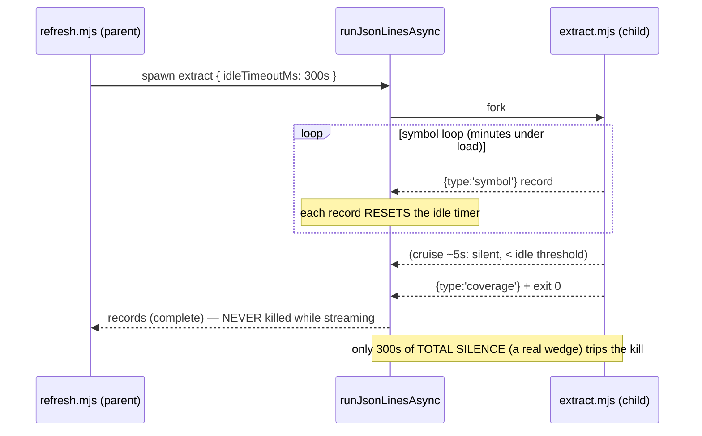

# Plan: Idle-timeout the extract subprocess (stop the coverage-sized SIGKILL truncating symbol extraction)

- **Date**: 2026-07-21
- **Status**: Complete
- **Author**: Claude + Louis
- **Scope**: backend

## 1. Context Summary

- **Detected scope / stack**: backend · `js-ts` (Node ESM CLI pipeline).
- **Target domain(s)**: `arch-memory` (symbol-index refresh) + `shared-lib` (subprocess helper).

### What exists today

`scripts/symbol-index/refresh.mjs` runs the symbol-index extract as a child
process and bounds it with a **total-duration** hard timeout:

```
runJsonLinesAsyncStrict('node', extractArgs, { stage: 'extract', timeoutMs: coverageConfig.hardTimeoutMs })
```

`hardTimeoutMs` defaults to **300 000 ms** (`COVERAGE_DEFAULTS`,
`scripts/lib/symbol-index/graph-verdict.mjs:41`). The child
(`scripts/symbol-index/extract.mjs main()`) runs two phases in order:

1. `extractSymbols(...)` — a **synchronous** ts-morph loop over every eligible
   file. This is the essential work and it **streams one JSON record per
   symbol** to stdout continuously (thousands of records).
2. `extractGraphAndViolations(...)` — the async dependency-cruiser **coverage
   cruise**. Measured at **5.3 s** on a clean run; it is silent (no records)
   for its duration, then emits violations + a `coverage` line.

`runJsonLinesAsync` (`scripts/lib/subprocess.mjs:95-110`) implements the timeout
as a single `setTimeout(kill, timeoutMs)` armed once at spawn: SIGTERM, then
SIGKILL after `killGraceMs`. On a kill it hands back whatever records streamed
before the kill (`cause.records`), and the strict wrapper throws
`KILLED_BY_SIGNAL` with `cause.timedOut === true`.

### The defect (the "SIGKILL issue")

The 300 s bound was sized for the **cruise** (the comment at extract time says
"coverage will report extraction_timeout"), but it is armed over the **whole
subprocess** — and the long pole is phase 1, not phase 2. Under machine load the
synchronous symbol loop alone can exceed 300 s, so the parent SIGKILLs the child
**mid-loop** and the tail of files is silently dropped. Field-observed
(2026-07-20, this repo, disposable DB): a full run recorded `extraction_timeout`
at exactly `elapsedMs = 300000` and published **8287** symbols where a clean run
of the same commit published **8433** — 146 symbols, an entire file's pragmas
among them, gone from a snapshot that still labelled itself `full`.

Bounding **total duration** is the wrong invariant. A process that is *still
streaming records* is making progress and is not wedged, regardless of how long
it has run.

### Code Trace (evidence Phase 1 happened)

- Parent arms the timeout: `refresh.mjs` extract call →
  `runJsonLinesAsyncStrict('node', extractArgs, { timeoutMs: coverageConfig.hardTimeoutMs })`
  (`scripts/symbol-index/refresh.mjs:410-413`).
- Timer is total-duration, armed once at spawn:
  `scripts/lib/subprocess.mjs:95-110` (`termTimer = setTimeout(... , opts.timeoutMs)`).
- Output arrives (and could reset an idle timer) at
  `child.stdout.on('data', ...)` `scripts/lib/subprocess.mjs:142-149`.
- Kill → partial records kept: `runJsonLinesAsyncStrict` throws
  `KILLED_BY_SIGNAL` w/ `cause.timedOut`, `subprocess.mjs:220-230`; refresh
  catches it and sets `extractionTimedOut`, `refresh.mjs:414-419`.
- Coverage default: `COVERAGE_DEFAULTS.hardTimeoutMs = 300_000`,
  `graph-verdict.mjs:41`; existing repair guard `hardTimeoutMs <= maxCruiseMs ⇒
  hardTimeoutMs = maxCruiseMs*2`, `graph-verdict.mjs:118-121`.
- Recovery net (shipped last commit, `f143d39`): on `extractionTimedOut` a full
  run copies un-reached files forward from the prior snapshot,
  `refresh.mjs` step 8b + step 13.

### Patterns reused vs new

- **Reused**: the existing SIGTERM→SIGKILL escalation, the `timedOut` throw
  contract, the `extractionTimedOut` → copy-forward recovery wiring, and the
  existing `hardTimeoutMs > maxCruiseMs` validation guard.
- **New**: one option on the generic subprocess helper — an **inactivity
  (idle) timeout** that resets on each streamed record.

### Neighbourhood considered

Arch-memory consultation returned only `review`-band candidates (`forceRelease`,
`isPidAlive` in `file-lock.mjs`; `installLifecycleHooks` in `decision-logger.mjs`)
— process-lifecycle utilities, none occupying the "subprocess stream timeout"
space. This is an extension of `runJsonLinesAsync`, not a sibling to any of them.

## 2. Proposed Architecture

**Replace the extract stage's total-duration timeout with an inactivity
(idle) timeout, backed by an EXPLICIT liveness heartbeat.** A subprocess that
keeps emitting records is alive; the timer resets on every stdout chunk and
fires only after *genuine silence* exceeds the threshold.

The idle timer is **parent-side** (a `setTimeout` in `runJsonLinesAsync`), so it
is immune to the child's synchronous CPU blocking. This is the key difference
from the historical "a timer inside a child wedged in synchronous cruise work
could never fire" note — that concern was about an *in-child* timer. Watching
for *silence from the parent* sidesteps it entirely.

**Liveness must be explicit, and the invariant must be honest about what it
bounds (audit H1, R1 + R2).** The child's only current stdout output is one
`{type:'symbol'}` record per discovered symbol — and `emitProgress` goes to
**stderr** (`extract.mjs:68`), which is `inherit`ed and invisible to the idle
timer. So a healthy extraction can be stdout-silent while ts-morph parses a
file, across a run of symbol-less files, or during warm-up before the first
record.

**Fix — per-file heartbeat + an honest invariant.** `extractSymbols` emits a
lightweight `{type:'progress', file:'<rel>'}` **stdout** record at the **top of
every file iteration** (via the existing `emit`, not `emitProgress`), *before*
that file's ts-morph work. `refresh.mjs`'s record filters
(`symbol`/`violation`/`import`/`coverage`/`summary`) ignore the unknown
`progress` type, so the **published snapshot is unchanged** — only the raw
(already-ignored) stdout carries the heartbeats.

A per-file (not per-N-files, not time-target) beat is required because
`extractSymbols` is **synchronous**: it cannot emit *mid-file*, so the maximum
silent interval is exactly **one file's processing time**. The R2 point — "a
file-count beat bounds files, not elapsed silence" — is correct, and the answer
is to name the invariant honestly rather than pretend elapsed time is bounded:
*the idle threshold is the longest a single unit of work (one file) may block
before the process is declared wedged.* A healthy file is
milliseconds-to-seconds and never approaches `hardTimeoutMs` (300 s); a single
file that blocks ts-morph for > 300 s **is** a pathology, and killing it — then
recovering the rest via copy-forward — is the correct outcome, not a false
positive. A synchronous loop cannot interrupt itself to emit, so the file
boundary is the tightest achievable unit of progress; the beat also carries the
file path, so a wedge kill names the offending file in the last record received.

With a per-file beat, extraction's max silence is one file, so the **only**
multi-second legitimate silent interval left is the coverage cruise, and the
existing `hardTimeoutMs > maxCruiseMs` guard is exactly the right liveness
invariant — the idle threshold exceeds the longest *expected* silent phase.



### Key design decisions (principles cited from references/engineering-principles.md)

1. **Idle, not total, is the correct invariant** (#20 Long-term flexibility,
   #16 Graceful degradation). Total-duration bounds an honest signal (wall
   time) that has nothing to do with health. Liveness (is it still producing
   output?) is what "wedged" actually means. Encoding the real invariant means
   no repo size or machine-load level ever truncates a healthy extraction — the
   defect class is closed, not merely made less likely.

2. **Reuse `hardTimeoutMs` as the idle threshold; no new config knob** (#4 No
   hardcoding, #5 Single source of truth). Its value (300 s) is already a valid
   idle threshold: the existing repair guard (`graph-verdict.mjs:118`) forces
   `hardTimeoutMs > maxCruiseMs` (120 s), which is *exactly* the property an idle
   threshold needs — it must exceed the longest legitimate silent phase, and
   after the heartbeat (decision 1) that phase is unambiguously the cruise. The
   semantic changes (total→idle); the value and the guard do not. On the
   naming smell the audit raised (L1 — a "hard timeout" that now means "max
   silence," validated against a key named for a *duration*): the value migrates
   cleanly and adding a parallel `extractIdleTimeoutMs`/`maxExpectedSilentPhaseMs`
   pair is **rejected as YAGNI** — no current requirement needs two knobs, and a
   second config surface that must be kept `> maxCruiseMs` in lockstep is *more*
   drift risk, not less. The dual role is documented at the definition and the
   guard (see §7 `graph-verdict.mjs`); a rename is a mechanical follow-up if the
   config ever grows a second silent phase, not a prerequisite of this fix.

3. **Additive, not breaking, on the generic helper** (#18 Backward compat). The
   new `idleTimeoutMs` option is orthogonal to the existing `timeoutMs`. Other
   callers (`summarise`, `embed`) are untouched and keep total-duration
   semantics. A caller may pass either, both, or neither.

3a. **Timeout-initiated termination is one idempotent path; natural exit is a
   different path** (audit M1 + R2 H2, #14 Transaction safety). The R2 finding is
   right that "route `close`/`error` through `beginTermination`" was contradictory
   — a normal `close` must resolve with the exit result and an `error` must
   reject with the *original* error; neither is a kill and neither may be
   relabelled `timedOut`/`KILLED_BY_SIGNAL`. Precise model:
   - **`onTimeout(reason)`** — called ONLY by a timer expiry (`'absolute'` from
     `timeoutMs`, `'idle'` from `idleTimeoutMs`). Idempotent: if `timedOut` is
     already set, no-op. Otherwise sets `timedOut = true`, records the first
     `killReason`, clears **the other** timeout timer (so an idle and an absolute
     expiry can't both fire), sends one SIGTERM, and arms the single grace
     SIGKILL timer. This is the only place a kill is initiated.
   - **`resetIdle()`** — on each stdout **chunk** (before line-split), if the idle
     timer is armed and `!timedOut`, clear + re-arm it.
   - **`close`** — clear **all** timers (absolute, idle, grace); if not already
     settled, resolve with the existing result shape plus `timedOut`/`killReason`.
     Does NOT call `onTimeout`.
   - **`error`** — clear all timers; resolve via the existing `spawnError` path
     (the strict wrapper maps it to `SPAWN_FAILED`, preserving the real error).
     Does NOT call `onTimeout` and never sets `timedOut`.
   The existing `settled` guard still ensures resolve/reject happens exactly
   once. So "we initiated a kill" (`onTimeout`) and "the child exited/errored on
   its own" (`close`/`error`) are cleanly separate; the only shared duty is
   clearing every timer, which each path does. This is additive to the current
   `settled` + `clearTimers()` design — it adds the idle timer, the
   first-reason record, and the idempotency guard on the kill path.

4. **Honesty and recovery unchanged** (#16, #19 Observability). An idle-timeout
   kill still sets `timedOut` → `KILLED_BY_SIGNAL` → `extractionTimedOut` → the
   shipped copy-forward recovery; coverage still records `unverified
   (extraction_timeout)`. A genuine wedge is still surfaced and recovered — it is
   just no longer *manufactured* by a healthy slow run. The recovery net remains
   the safety layer for the (now genuinely rare) case the timer fires.

5. **No separate absolute ceiling for now** (Design right-sizing — see §6). The
   child's output is finite by construction (one record per symbol over a fixed
   file list), so a "streams forever" runaway cannot occur here; an absolute
   ceiling would be a guard for a pathology this code cannot exhibit.

## 6. Sustainability Notes

### Right-sizing gate (new structure = one subprocess option)

- **Band-aid extreme**: raise `hardTimeoutMs` from 300 s to, say, 1 200 s. The
  root cause (a total-duration bound truncating streaming work) survives; a
  bigger repo or a more loaded machine blows the new constant exactly as before.
  This is the constant-chasing cliff.
- **Over-engineered extreme**: split extraction and the cruise into two separate
  subprocesses each with its own timeout, or add resumable/checkpointed
  extraction. Heavy machinery (a second spawn, file-list IPC, coverage IPC) to
  bound a 5 s measurement — no current requirement needs it.
- **Chosen**: one `idleTimeoutMs` option on the existing helper, reusing the
  existing `hardTimeoutMs` value and its existing `> maxCruiseMs` guard. It
  serves the **current** requirement — *a healthy, streaming extraction must
  never be killed for taking a long time* — with the smallest structural change
  that makes "progress = alive" the actual rule.

**Assumptions that could change**: the extract child streams records
continuously during the long phase (true today — one emit per symbol). If a
future phase went silent for longer than the cruise, the idle threshold would
need to exceed *that* phase's silence too — the `> maxCruiseMs` guard would move
to `> max(silent phases)`. Documented so a future silent phase is a conscious
decision, not a surprise kill.

**Deferred deliberately**: a generous absolute ceiling as a catastrophic guard
against a hypothetical "emits a record every 299 s forever" child. Not added
because this child's output is bounded; revisit only if a genuinely unbounded
streaming producer is ever put behind `idleTimeoutMs`.

## 7. File-Level Plan

- **`scripts/lib/subprocess.mjs`** (modify) — add `opts.idleTimeoutMs` to
  `runJsonLinesAsync`, implemented per decision 3a: an idle timer reset inside
  the existing `child.stdout.on('data', ...)` handler (on the **chunk**, before
  line-split); an idempotent `onTimeout(reason)` that is the *only* kill
  initiator (clears the other timeout timer, one SIGTERM, one grace SIGKILL,
  records the first `killReason`); `close`/`error` clear all timers and settle
  via the **existing** resolve/`spawnError` paths — they do NOT initiate
  termination and never set `timedOut`. Guard: `idleTimeoutMs` non-finite or
  `<= 0` → not armed (mirror the existing `timeoutMs` guard). All timers
  `.unref()`d; `settled` still guarantees a single settle. Carry `killReason`
  onto the result/`cause` so the throw attributes the right timeout. Update the
  JSDoc timeout note. *Why this file*: it is the single place the subprocess
  timeout lives (#5); the option is generic and reusable.
- **`scripts/symbol-index/extract.mjs`** (modify) — in `extractSymbols`, `emit`
  a `{type:'progress', file:'<rel>'}` **stdout** heartbeat at the top of every
  file iteration, before that file's ts-morph work (audit H1). Per-file, not
  batched: the loop is synchronous and cannot emit mid-file, so the file
  boundary is the tightest liveness unit and the max silent interval is one
  file. Do NOT route it through `emitProgress` (that is stderr, inherited,
  invisible to the timer). *Why this file*: the timer can only observe stdout;
  making extraction's liveness explicit here is what makes the idle threshold
  a provable "no single file may block longer than this" invariant rather than
  a bet on incidental symbol output.
- **`scripts/symbol-index/refresh.mjs`** (modify) — change the extract call from
  `{ timeoutMs: coverageConfig.hardTimeoutMs }` to
  `{ idleTimeoutMs: coverageConfig.hardTimeoutMs }`. Update the adjacent comment
  from "coverage will report extraction_timeout" to explain the idle semantic
  (a wedge = no output for the threshold). *Why this file*: it is the only extract
  call site and owns the `extractionTimedOut` → recovery wiring, which stays
  correct because the throw contract is unchanged.
- **`scripts/lib/symbol-index/graph-verdict.mjs`** (modify, comments only) —
  annotate `hardTimeoutMs` in `COVERAGE_DEFAULTS` and the repair guard to record
  its dual role: it is the extract **idle** threshold, and the existing
  `> maxCruiseMs` repair is what keeps a slow-but-working cruise's silence from
  tripping it. No value or logic change. *Why this file*: keeps the config's
  documented meaning in sync with its actual use (#19).
- **`tests/subprocess-idle-timeout.test.mjs`** (create) — unit tests, no DB.
  *Why this file*: this is a Tier-1 deterministic seam (subprocess control); a
  regression here silently truncates the index, so it lands with its test.

### Testing note — no §7b phases

Five files across two closely-coupled seams (`shared-lib` subprocess +
`arch-memory` extract/refresh), one cohesive mechanism (liveness-based
timeout), no independent sub-deliverables to cluster. Kept flat: no
Implementation-Phases block, no §11 clustering (a lone cluster is degenerate).
`/cycle` implements + audits it as a single unit.

## 8. Risk & Trade-off Register

| Risk / trade-off | Mitigation |
|---|---|
| A healthy but **silent** stretch of extraction (a slow ts-morph parse, a run of symbol-less files, warm-up before the first record) is false-killed. | The **per-file** heartbeat (decision 1, audit H1) emits a `progress` stdout record at the top of every file iteration, so the max silent interval is exactly one file's processing. A healthy file never approaches the 300 s threshold; a single file that does is a genuine wedge, correctly killed + recovered. After this the only multi-second legitimate silent phase is the cruise, which `hardTimeoutMs > maxCruiseMs` covers. |
| A slow-but-working **cruise** silent past the threshold. | `hardTimeoutMs` (idle threshold, 300 s) is guaranteed `> maxCruiseMs` (120 s) by the existing guard. A cruise silent past 300 s is genuinely stuck, and the recovery net makes even that correct: symbols are already complete → copy-forward finds nothing un-reached → publishes the complete index as `unverified`. |
| **Removing** the absolute total bound could let a pathological "streams slowly forever" child run unbounded. | Not possible for this child (finite records over a fixed file list; the heartbeat is also finite). Documented as a deliberate deferral (§6); a generous absolute ceiling remains one argument (`timeoutMs`, still supported) away. |
| Termination-path interleave (absolute timer vs idle timer vs `close`/`error` vs grace SIGKILL) misattributes the reason or double-kills. | Kill is initiated only by `onTimeout(reason)` (decision 3a): idempotent, first-reason-wins, clears the other timeout timer, one SIGTERM + one grace timer. `close`/`error` do NOT initiate a kill — they clear all timers and settle via the existing resolve/spawnError paths. Covered by Tier A tests 2–4. |
| Behaviour change for callers of the generic helper. | `idleTimeoutMs` is additive/opt-in; `summarise`/`embed` calls unchanged. A run that never goes idle is byte-identical to today; the extract run's **published snapshot** is byte-identical (the extra `progress` records are filtered out before persistence). |
| Idle timer not cleared on a fast/normal exit → dangling timer. | Every settle path (`close`/`error`/`onTimeout`) clears all timers, all `.unref()`d — same lifecycle as the existing total timer. Tier A test 3 proves the state machine clears every timer on a clean close (deterministic, via injected timers — not a flaky `_getActiveHandles` probe). |

## 9. Testing Strategy

The timing-sensitive logic and the real-subprocess behaviour are tested at
**two clearly-labelled tiers** — the R2 finding (M1) is right that a
real-child test with tight thresholds is not "deterministic," so the
determinism claim is confined to the tier that earns it.

**Tier A — deterministic timer state-machine unit tests (fake timers, NO
subprocess).** Extract the timer/termination logic from `runJsonLinesAsync`
into a tiny pure controller (`makeTimeoutController({onKill, timeoutMs,
idleTimeoutMs})` returning `{onData, onClose, onError, _state}`) driven by
**injected `setTimeout`/`clearTimeout`** (node:test mock timers). No child
process, no wall-clock — every assertion is on state transitions, so these are
genuinely deterministic:

1. **`onData` resets the idle deadline** — advance clock to just under
   `idleTimeoutMs`, fire `onData`, advance again to just under → no kill;
   advance past with no `onData` → exactly one `onKill('idle')`.
2. **Idempotent kill, first-reason-wins** — arm both timers; fire whichever is
   sooner → one `onKill` with that reason; advancing past the other fires
   nothing more; the other timer was cleared.
3. **`onClose` is not a kill** — `onClose` after a clean run clears all timers,
   settles with the exit result, `timedOut === false`, and no `onKill`.
4. **`onError` preserves the original error** — `onError(e)` clears timers and
   settles via the spawnError path; never sets `timedOut`, never `onKill`.
5. **Guards** — `idleTimeoutMs` of `0`/negative/`NaN`/`undefined` → idle timer
   never armed; neither bound → no timers armed (byte-identical to today).

**Tier B — real-subprocess integration smokes (labelled timing-tolerant, NOT
"deterministic").** A **generous** `IDLE = 1000 ms` with fixture children that
report milestones on stdout and use silence gaps of `≥5×IDLE` and
emit-intervals of `≤IDLE/4`, so host scheduling jitter has a ≥5× margin. These
prove the wiring from `runJsonLinesAsync` down to a real `child.kill`, not the
timing precision:

6. **Streaming child survives past its total lifetime** — emits every
   `~IDLE/4` for a total ≫ `IDLE`, exits 0 → all records returned, no kill.
   Asserted on the new contract directly (`timedOut === false`), not on "the old
   helper would have killed it" (audit M2 — an old helper ignoring the option
   would pass that framing too).
7. **Silent child is terminated — assert the OUTCOME, not the signal** (audit
   M3) — emits a few records then goes silent ≫ `IDLE`: strict wrapper throws
   `KILLED_BY_SIGNAL`, `cause.timedOut === true`, pre-silence records preserved.
   Do NOT assert SIGKILL — a normal child exits on SIGTERM. A **separate** case
   uses a fixture that traps+ignores SIGTERM to prove the grace→SIGKILL
   escalation fires. No open-handle assertion via `process._getActiveHandles`
   (unstable across Node versions, audit M1) — Tier A already proves timer
   cleanup deterministically via the controller state.

**Wiring test — prove refresh uses the idle path (audit M2), no subprocess.**
Extract the extract-spawn options into a pure builder
`buildExtractSpawnOpts(coverageConfig)` and assert it returns
`{ stage:'extract', idleTimeoutMs: coverageConfig.hardTimeoutMs }` and **no**
`timeoutMs`. A future edit reverting to a total `timeoutMs` fails here rather
than silently re-opening the defect; pins the production data flow without
spying on a live spawn.

**Heartbeat test (audit H1), no subprocess.** Call `extractSymbols` directly
over a fixture dir whose first files are **symbol-less**; assert a
`{type:'progress', file}` record is emitted for each file iteration
(so liveness never depends on symbol output), and assert `refresh.mjs`'s record
filter drops `progress` from the published record set (published snapshot
unchanged).

**Integration (already live-verified, not re-automated):** the forced-timeout →
copy-forward recovery path was verified last session on the disposable DB
(baseline 3565 symbols / 5 justified → forced timeout → recovered 3565 / 5). An
idle-timeout kill drives the identical `extractionTimedOut` wiring, so the
recovery seam needs no new DB integration test; the change here is *which*
timeout fires, not what happens after.

## Audit Trail

- **2026-07-21** — `/audit-plan` (GPT auditor + Gemini final gate).
  - R1: H1 (incidental liveness), M1 (termination idempotency), M2 (wiring not
    proven / false-green), M3 (test determinism + signal assertion), L1 (config
    naming). All accepted → fixed.
  - R2: H1 (file-count beat bounds files not elapsed silence → **per-file** beat
    + honest single-file-wedge invariant), H2 (termination controller
    contradictory for close/error → `onTimeout` kill-only, close/error settle
    separately), M1 (real-subprocess tests not "deterministic"; `_getActiveHandles`
    unstable → two-tier tests: deterministic fake-timer controller + generous
    real-subprocess smokes). All accepted → fixed. HIGH did not drop R1→R2, but
    both R2 HIGHs were concrete design holes in the R1 fixes (genuine-bug
    exception), not rigor pressure — fixed, then gated rather than a 3rd GPT round.
  - **Gemini final gate: APPROVE** (0 new, 0 wrongly dismissed).

- **2026-07-21** — `/audit-code` (GPT 5-pass + rebuttal + Gemini final gate).
  - R1: H:1 M:6. Only one finding was in-scope to this change (M3 — "removed the
    absolute wall-clock bound"); the rest were pre-existing debt in the changed
    files (`--files-from` lossy trim H1/M4, timeout>2³¹ clamp M1, verdict-oracle
    M2, `refresh.mjs` god-module M5, migration ownership M6).
  - **Rebuttal on M3 → GPT overruled Claude's challenge → DISMISSED**: no
    absolute ceiling. `extract.mjs` processes a FINITE file list so "runs
    indefinitely" is unreachable, and a wall-clock cap that kills a *progressing*
    extraction is exactly the truncation defect being fixed. The `timeoutMs`
    option remains available for a future need.
  - Deferred the 5 pre-existing findings to `.audit/tech-debt.json` (independence
    named per finding); added a visible TODO at the `--files-from` site.
  - R2: **PASS** (H:0 M:1 L:1). M1 = the same deferred manifest debt re-raised;
    L1 = a doc-accuracy nit (a comment said `error` "rejects" but
    `runJsonLinesAsync` always resolves) — FIXED.
  - **Gemini final gate: APPROVE** (0 new, 0 wrongly dismissed).
  - **Empirical end-to-end (disposable DB, never prod)**: a full refresh under a
    forced **3 s idle threshold** `extracted 3568 symbols`, `coverage: verified`,
    published — complete, no truncation. Under the old 3 s *total-duration*
    timeout the same run would have been SIGKILLed at 3 s wall-clock and
    truncated to a handful of symbols. The per-file heartbeat kept the healthy
    run alive. Root cause fixed.

