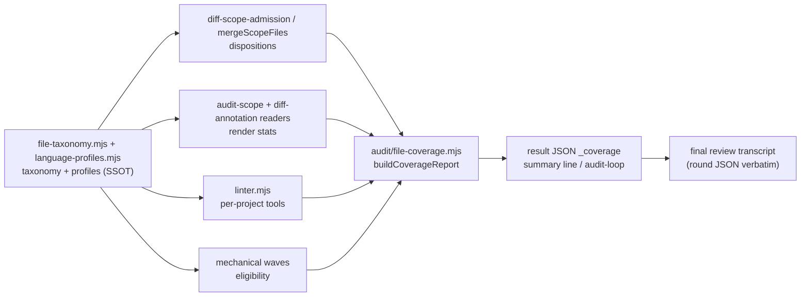

# Plan: File-Coverage Contract + First-Class C# Support
- **Date**: 2026-09-30
- **Status**: In Progress — implemented and audited in three clusters; uncommitted, awaiting `/ship`
- **Author**: Claude + Louis
- **Scope**: backend (CLI / audit tooling; no UI surface)
- **Target domain(s)**: `audit-orchestration`, `plan`, `shared-lib`
- ⚠ **Cross-domain work** — touches >1 domain; the boundary crossings are the admission oracle (`plan`) feeding the audit (`audit-orchestration`) through the shared registry (`shared-lib`). Intentional.

Detected scope: **backend**, stack `js-ts` (`detect-stack`), no Python framework. Principle set: engineering (#1–#20).

---

## 1. Context Summary

### The report

A consumer (storyline, an Electron/TS monorepo with one C# service) ran `/audit-code` on a 68-file diff.
- 12 of those files were `.cs` (~835 lines).
- Two rounds and the Step 7 final review returned `APPROVE` / `gateDisposition: approve`.
- **No C# file was audited, and no output said so.**
- The defects that mattered were in the C# and were found by hand.

The consumer asked for:
1. Visibility.
2. One extension registry.
3. A `cs` profile.
4. Tests.

Their diagnosis was partly off. Tracing the code shows the problem is wider than C#: **the bundle has no concept of per-file coverage at all.** Every place that decides whether a file is looked at keeps its own list and fails silently, so any language outside JS/TS/Python — and several JS/TS/Python files too — can be dropped with no trace.

### Code Trace (pinned to `e73a40ee`)

**Admission**
- `openai-audit.mjs:858-873 (e73a40ee)`: `git diff --name-only` plus untracked files go to `partitionDiffScope`.
- `lib/diff-scope-admission.mjs:63 (e73a40ee)`: admits a file iff `resolveReferenceExtension(f) !== null`.
- `lib/plan-paths.mjs:35-49,78-87 (e73a40ee)`: `PLAN_REFERENCE_EXTENSIONS` is a **third** extension list, separate from `language-profiles.mjs`. It admits `go/rs/java/rb/sh` without any profile, but not `cs`, `cjs`, `mts`, `cts` or `pyi`. The last four are extensions the js/ts/py profiles themselves claim.
- **The only trace of the drop** is `diff-scope-admission.mjs:89 (e73a40ee)`: `N non-code file(s) ignored (cs: N)`. It goes to stderr only and calls C# "non-code".

**All-unadmitted diff**
- `openai-audit.mjs:883-885 (e73a40ee)`: when every changed file is unadmitted, `auditable` is empty. The run prints "no changes detected" and **falls back to plan-referenced files**, so it audits unchanged code and returns a normal verdict.

**Second rejection point**
- `lib/audit/legacy-production-audit.mjs:362-378 (e73a40ee)`: `mergeScopeFiles` rejects files for four reasons (infra, extension, not-on-disk, URL) and folds them into one stderr line.
- `scopeRejected` never reaches `finalizationData`, which is `.strict()` (`finalization-contract.mjs:47-123`).

**Pass relevance**
- `lib/context.mjs:446,467-517 (e73a40ee)`: `codeExts` has no `.cs`. A C#-only repo counts 0 backend and 0 frontend files, so `passRelevance.backend/frontend/wiring` are `false`.
- `legacy-production-audit.mjs:827-829` then prints `backend SKIPPED (repo profile: not relevant)`.

**Silent head-truncation**
- Every pass reads files through the string-only `readFilesAsContext` or `readFilesAsAnnotatedContext` at 2000–10000 chars per file (`legacy-production-audit.mjs:890,923,1219,1275,1342,1383`).
- The head cut is invisible. `readFilesAsContextDetailed` (`audit-scope.mjs:145`) measures it, but the legacy path discards its stats.

**Vacuous-clean mechanical waves on a C#-only diff in a JS+C# repo** (extension census, this session):
- orphan-introduced: `diff-scope-resolver.mjs:674-678` prefilters to empty, then reports `ANALYZED_CLEAN`.
- event-wiring: `event-wiring-corpus.mjs:37,321` reports `ANALYZED_CLEAN`.
- duplication: `duplication-detector.mjs:186` returns `state:'clean'`.
- adjacency: `adjacency-detector.mjs:610-611` → `adjacency-state.mjs:170` returns `NOT_TRIGGERED`, which its own doc defines as "we looked".

**Sensitive-path false positive**
- `lib/sensitive-paths.mjs:109,114 (e73a40ee)`: `Token.cs`, `Tokens.cs` and `Password.cs` classify as **sensitive**, so they are never read. The code-file carve-out is its own hand-kept list: `m?[jt]sx?|c[jt]s|css|…`.

**File references in findings**
- `language-profiles.mjs:276-316`: `ALL_SUPPORTED_EXTENSIONS` has no `cs`, so `buildFileReferenceRegex` (used by `finding-match.mjs:87,137`) cannot see `.cs` paths in findings. R2+ same-file suppression breaks for C#.
- The same gap exists in `finding-verification.mjs:214` and `finding-grounding.mjs:124`.

**Tool pre-pass** (`lib/linter.mjs:123-221 (e73a40ee)`)
- `unknown`-profile files are dropped silently (`:207`).
- Every tool runs at `process.cwd()` (`:171`); the profile's `scope: 'project'` field is never read.
- Timeout is a flat 60 s (`:62`).
- **A non-zero exit with nothing parseable is recorded as `status:'ok'`, 0 findings** (`:181-187`), so an ESLint config crash reads as a clean lint.

**Final review**
- `gemini-review.mjs:299-303` renders `extractPlanPaths ∪ transcript.code_files`. A `.cs` file is in neither, so the reviewer never sees its code.
- The transcript is the round JSON passed through verbatim (`lib/audit/transcript.mjs:156-184`). **Any field added to the result reaches the reviewer for free.**

**Stack detection**
- `lib/repo-stack.mjs:17-85`: no C# marker. `stackKinds` enum (`schemas.mjs:1436`) is `js-ts|python|java|postgres`.
- A JS+C# repo is reported as `js-ts` only, and fit-check says **FITS**.

### Measured (not assumed) — `dotnet` 8.0.425, storyline `services/template-renderer-openxml` copied to a scratch dir

- Incremental `dotnet build tests/RendererTests.csproj`, after an earlier build: **0 warnings**.
- `--no-incremental`: **1 warning** (`xUnit2029` at `tests/ArchetypeLayoutTests.cs(231,13)`), the one the consumer saw in `dotnet test`.
- **An incremental build re-emits nothing for up-to-date projects**, so a naive pre-pass reads clean.
- Output lines look like `ABS\File.cs(l,c): warning CODE: msg (url) [ABS\proj.csproj]`. They are printed twice (inline and in the summary) unless `-clp:NoSummary` is used.
- Run in a directory with no project, `dotnet build` prints `MSBUILD : error MSB1003` with no file position. It is project-scoped.

### Patterns reused

- `final-review/code-coverage.mjs` `summariseCodeCoverage` / `COVERAGE_STATES`, together with `readFilesAsContextDetailed` stats and `mergeCodeRenderStats` (`audit-scope.mjs:258`). This is the existing measured-read vocabulary. The audit side will emit the same stats shape, not a parallel one.
- `language-profiles.mjs` "Extension metadata (single source of truth)": `CODE_EXTENSIONS` already derives from profiles. The new taxonomy extends that section rather than adding a module.
- `pythonBoundaryScanner`: the decorator-grouping pattern, reused for C# attributes and `///` doc comments.
- `repo-stack.mjs` `hasJavaSources`: the `git ls-files` detection pattern, reused for `hasCsharpSources`, because monorepo `.csproj` files are not at the repo root.
- The `db:enrolment:gate` shape: iterate the FILESYSTEM so the test sees a list that no registry mentions.

### Neighbourhood considered

| Band | Symbol | Decision |
|---|---|---|
| `precedent` (above-floor-cluster) | `countFilesByLanguage` `language-profiles.mjs:250` | **Extend.** The per-file classifier `classifyFileCoverage` sits beside it and replaces nothing. |
| `precedent` (above-floor-standout) | `finalizeRun` `run-finalization.mjs:55` | **Extend.** `_coverage` attaches here, alongside `_toolCapability`. |
| `review` | `partitionDiffScope`, `resolveReferenceExtension`, `_scanRepoFiles`, `readFilesAsContextDetailed`, `mergeCodeRenderStats` | Modified in place. None is duplicated. |

### Past incidents to verify against

| Incident | Status | Relevance |
|---|---|---|
| **INC-001** — lexical sensitive-path classification bypassed via symlink | `manual-verification-required` | Admitting more extensions widens what is sent to an LLM. The widening must ride the existing `safeReadFile` → `resolveAndClassify` → `redactSecrets` read path. No new reader, no new lexical-only gate. |

---

## 2. Proposed Architecture

### The contract (one sentence)

**Every changed file ends the audit with exactly one recorded disposition, and a disposition that means "not examined" is never reported as "examined and clean" — whether by a pass, a wave, a tool, or the final reviewer.**

### Taxonomy (single source of truth — `scripts/lib/file-taxonomy.mjs`, referenced by `language-profiles.mjs`)

**Module boundary (R1-M3).**
- `scripts/lib/file-taxonomy.mjs` is a focused, dependency-free module holding the file-kind data and one pure matcher. It declares languages by id with their extensions and fence language.
- `language-profiles.mjs` imports it. Profiles take their `extensions` from the taxonomy's language entry, so a profile can never claim an extension the taxonomy does not know. `classifyFileCoverage(path)` lives in `language-profiles.mjs`, because only it knows which languages have a profile.
- No import cycle: taxonomy ← profiles ← everything else.

**Ordered precedence (R1-M3).** First match wins. Paths are normalised (forward slashes; case-insensitive extension and suffix matching; exact names match case-sensitively, as the ecosystems do).
1. **Exact filenames**:
   - lockfiles → `non-code`: `package-lock.json`, `yarn.lock`, `pnpm-lock.yaml`, `packages.lock.json`, `Cargo.lock`, `poetry.lock`, `Gemfile.lock`, `composer.lock`, `go.sum`, `uv.lock`.
   - known extensionless build files → `declarative`: `Dockerfile`, `Makefile`, `Rakefile`, `Gemfile`, `Vagrantfile`, `Procfile`, `Jenkinsfile`.
2. **Compound suffixes**:
   - generated → `non-code`: `.g.cs`, `.g.i.cs`, `.designer.cs`, `.min.js`, `.min.css`, `.d.ts.map`, `.js.map`.
   - the existing `html.template` → `declarative` (html).
3. **Last extension** → language (`profiled` / `model-only`), `declarative`, or `non-code`.
4. Otherwise `uncovered`. That includes a no-extension file not named in rule 1, and a dotfile not named there (e.g. `.env`, which `sensitive-paths.mjs` owns) whose "extension" is its whole name. Common policy dotfiles (`.gitignore`, `.editorconfig`, `.gitattributes`, …) are exact-name `declarative` entries, so an ordinary diff does not raise an `uncovered` warning.

The classifier is a function of the **path only**: no filesystem access, no directory semantics. A directory named `Password/` is `sensitive-paths.mjs`'s concern, which runs later and independently.

| Class | Meaning | Examples | Admitted to LLM passes? |
|---|---|---|---|
| `profiled` | known language **with** a profile (boundaries, imports, tools) | js, ts, py, **cs** | yes |
| `model-only` | known source language, **no** profile: audited by the model, with no deterministic analysis | go, rs, java, kt, swift, rb, php, c/cpp, scala, dart, sh, ps1, vue, svelte, … | yes |
| `declarative` | config, markup or build definition that is reviewable text | json, yml, toml, sql, md, html, css/scss, xml, **csproj/props/targets/sln**, proto, graphql, tf, `Dockerfile`, `Makefile` | yes |
| `non-code` | expected exclusion: binary, asset, lockfile, generated | png, jpg, svg, woff, pdf, zip, dll, `*.lock`, `.map`, `.snap` | no (expected) |
| `uncovered` | **unrecognised**: not admitted, and **loudly reported** | anything else | no, **reported** |

**Classification and outcome are separate fields (R1-H1).** The class answers "what kind of file is this". A second field, `outcome`, answers "what happened to it". A profiled file can still be unreadable, so one field cannot express both.

### `_coverage` schema v1 (R1-H1) — Zod, `.strict()`, in `scripts/lib/audit/file-coverage.mjs`

```text
_coverage = {
  schemaVersion: 1,
  status: 'complete' | 'partial' | 'none' | 'incomplete',   // derived, see below
  gate:   'pass' | 'warn' | 'fail',                          // derived, see below
  changedTotal: int,                                         // |files[]|
  counts: { byClass: {profiled, modelOnly, declarative, nonCode, uncovered},
            byOutcome: {audited, notAdmitted, excludedInfra, excludedUser,
                        sensitive, deleted, unreadable, budgetOmitted} },
  uncoveredByExtension: { [ext]: int },
  files: [{                                                  // one per changed path — UNCAPPED; this is the canonical ledger (R2-H1)
    path,                       // repo-relative, normalizePath identity for dedup; display casing kept
    class,                      // taxonomy class
    language: string|null,      // taxonomy language id
    outcome,                    // terminal: audited | not-admitted | excluded-infra | excluded-user | sensitive | deleted | unreadable | budget-omitted
    read: { state: 'full'|'head-cut'|'none'|'unknown', charsOnDisk: int|null, bestCharsRendered: int|null,
            byPass: { [pass]: {charsRendered:int, headCut:bool, passCompleted:bool} } },
    changedLinesUnread: int|null, // null = not measured (no hunks), never 0-by-default
    changeKind: 'added'|'modified'|'deleted'|'renamed'|'untracked', renamedFrom: string|null,  // from git --name-status -z (R3-H1)
    analysis: { chunking: CapState|null, tools: [{id, status: ToolState}] },   // chunking null = file never chunked; importGraph dropped: no production consumer (R3-M1)
  }],
  tools:  [{ id, profile, status: ToolState, projects: [{path, kind, status: ToolState, reason?}], filesCovered:int }],
  toolPolicy: { disabled: bool, restore: bool, deadlineMs: int, maxProjects: int },   // effective, as parsed (R2-M5)
  waves:  [{ id, state: WaveState, eligible:int, changed:int, reason? }],
  invariantViolations: [string],  // non-empty ⇒ status 'incomplete'
}
```

**Closed vocabularies (R2-M3)**, exported from `file-coverage.mjs` and reused by every producer:

- `CapState` — capability states: `completed` · `unsupported` (no profile support) · `not_run` (applies, but did not run) · `failed` · `degraded` (e.g. the C# lexer bailed out on unbalanced input and whole-file chunking was used). Each carries an optional `reason`.
- `ToolState` — `ok` · `no_tool` (availability probe failed) · `spawn_error` (ENOENT / EACCES at spawn) · `failed` (non-zero exit with no located finding, a `toolFault`, or a parser throw) · `timeout` (per-tool) · `deadline_exceeded` (audit-wide) · `ambiguous_project` · `no_project` · `skipped_budget` · `not_applicable` (no in-scope file for this tool).
  - **Aggregation precedence** for a tool across its projects — worst wins: `spawn_error` > `failed` > `timeout` > `deadline_exceeded` > `ambiguous_project` > `skipped_budget` > `no_project` > `no_tool` > `ok` > `not_applicable`.
  - A file's tool status is its own project's status.
- `WaveState` — `completed` · `ineligible` (0 eligible changed files) · `partial` (examined k < n) · `errored` · `unavailable` (missing prerequisite). A wave's own richer state (`ANALYZED_CLEAN`, `NOT_TRIGGERED`, …) is kept in `reason`; this enum is the cross-wave projection.

**Denominator matrix (R2-H2)** — which files must be examined for coverage to be complete:

| Class \ outcome | `audited` (read full, or head-cut with `changedLinesUnread = 0`) | `audited` (head-cut, unread > 0 or unmeasured) / read `unknown` | `sensitive` / `unreadable` / `budget-omitted` | `not-admitted` | `excluded-infra` / `excluded-user` / `deleted` |
|---|---|---|---|---|---|
| `profiled`, `model-only`, `declarative` | examined | **short** | **short** | (impossible — invariant violation) | `deleted`: **short** (R3-H1: base-side hunks are not rendered to the passes). `excluded-*`: outside `required` but counted as `excludedRequired`, and that forces `gate: warn` (R3-M3) |
| `uncovered` | (impossible — invariant violation) | (impossible) | (impossible) | **short** | outside the denominator |
| `non-code` | (impossible) | (impossible) | (impossible) | outside the denominator (expected) | outside the denominator |

- `audited` with `read.state: 'none'` is an **invariant violation**.
- `required` = every in-denominator row. `examined` = required rows that are fully examined. `short` = required rows that are not.

**Terminal-outcome precedence** (the first that applies wins; each file gets exactly one):
1. `deleted`: git reports the change kind as `D` (R3-H1). This is never inferred from filesystem absence. A path git calls modified but that cannot be read (a dangling symlink, a sparse checkout, a race) is `unreadable`.
2. `excluded-infra`.
3. `excluded-user` (`--exclude-paths`/`.auditignore`).
4. `sensitive`: resolved-path classification (INC-001).
5. `not-admitted`: class `non-code` or `uncovered`.
6. `unreadable`: over `MAX_FILE_SIZE`, or read failure.
7. `budget-omitted`: no completed pass rendered it because `maxTotal` was spent.
8. `audited`: at least one completed pass rendered it.

**Identity (R1-H1)**
- Paths are deduplicated on `normalizePath`.
- `git diff --name-only` reports a rename as its **new** path only. The old path of a rename is not a changed file of the working tree, so it is out of the ledger by construction.
- Deletions are recorded as `deleted`.

**Invariant validator**
- Every changed path has exactly one record; no duplicate identities.
- No combination marked impossible in the matrix occurs.
- `changedTotal` equals the size of the changed set handed to the builder.
- The counts are recomputed from `files[]`, never accumulated separately.
- Any violation sets `status: 'incomplete'` and lists the reason. It **never** emits optimistic totals.

**Derivations**, over the denominator matrix:
- `status`:
  - `incomplete`: an invariant violation.
  - `none`: `presentRequired > 0` and no present required file was `audited` at all, where `presentRequired` is required rows that are not `deleted`. A deletion-only diff is therefore `partial`/`warn`: visible, but not a blocked round. **A file that was audited but head-cut is `short` (so `partial`), never `none`** — failing a round because a large file exceeds the per-file read window would leave every repo with a big file unable to converge, the cried-wolf gate.
  - `partial`: `short > 0`.
  - `complete`: everything else, including `required = 0` (e.g. a PNG-only diff).

**One canonical ledger, one projection (R2-H1)**
- The result JSON's `_coverage.files[]` is uncapped. At roughly 300 bytes a record, even a 3000-file diff is about 1 MB, which is the right cost for the canonical record.
- The final-review transcript builder (`lib/audit/transcript.mjs`, which already rewrites each round) replaces `files[]` with a **projection**:
  - `{projection: true, fullCount, digest: sha256(canonical files[]), shown: [every short or not-admitted record, capped at 200], shownTruncated: int}`.
- Counts, status and gate are always the canonical ones, computed before projection. The projection only cuts what the reviewer reads, never what was measured.
- `gate`:
  - **`fail` iff `status ∈ {none, incomplete}`.** The change was not measured, so the round is **INCOMPLETE**: verdict word, exit 3, no convergence (R1-H2).
  - **`warn` iff `status = partial` or `excludedRequired > 0`.** The suffix appears on the summary line and CONVERGED banner. Verdict and exit code are unchanged.
  - `pass` otherwise.
  - A non-code-only diff (PNGs only) is `complete`/`pass`: nothing source-shaped changed.
  - No configurable policy: no current requirement asks for one (right-sizing).

**Why unknown means `uncovered` and not `non-code`.** A default-deny that stays silent is today's defect. A default-deny that names each file makes the next unknown language visible the first time it is changed. `non-code` is an explicit list, so expected exclusions add no noise. (#5 SSOT, #16 graceful degradation.)



### Key decisions

1. **The taxonomy is the one registry, and every *generic* list derives from it** (#1 DRY, #5 SSOT).
   - Derived: `PLAN_REFERENCE_EXTENSIONS`, `_scanRepoFiles`, `context.mjs` `codeExts`, the sensitive-path code carve-out, the fence-language maps, and finding-reference, verification and grounding extraction.
   - **Capability-bound lists are NOT derived (R1-H4).** They must name only what their parser or adapter handles. This covers `arch-intent/adapter-contract.mjs` `SOURCE_EXTENSIONS` per REQ-correctness-067bf187, the waves' JS parsers, `CRUISABLE_EXTENSIONS`, and the egress allowlist for the symbol extractor. Each is registered in the drift test's capability registry with its reason, and the test asserts that an extension such a list names is at least known to the taxonomy.
2. **`_coverage` is a measurement with ONE hard edge** (#15, #19; R1-H2).
   - It rides the result JSON, so it reaches the final-review transcript.
   - `gate: fail` (no changed source audited, or ledger invariant broken) forces the round's verdict to `INCOMPLETE`, through the same `computeAuditVerdict({incomplete})` path a failed pass uses. That brings exit 3 and no convergence.
   - `gate: warn` changes only wording: the summary line and CONVERGED banner are never bare.
   - **Right-sizing:** failing on *any* uncovered file would make every repo with one unknown file type unable to converge — the cried-wolf gate that earns `--no-verify`. Failing when *nothing* changed was measured is the case the consumer hit, and it is unambiguous.
3. **Changed files are the target scope; plan files are supplemental, never a substitute** (R1-H2).
   - The plan-file fallback stays only for a truly empty diff.
   - When changed files exist but none is admissible, the run still reads plan files as supplemental context, but coverage is computed over the **changed** set. The result is `status: none` → `gate: fail` → `INCOMPLETE`.
   - The summary leads with "N changed file(s), none audited".
4. **Render evidence is measured per pass, and only completed passes count** (#11; R1-H3).
   - Each pass's reads go through the detailed readers, and their stats are captured **under that pass's name**.
   - A file's `read.state` is the best render across passes that **completed**. A failed or timed-out pass contributes nothing, so a full read by a failed pass cannot establish anything.
   - The field is named `read` / `bestCharsRendered` — render evidence, not a claim of examination.
   - When diff hunks are known (`--diff`, or R1's own base diff), `changedLinesUnread` counts changed lines beyond the best completed render. Otherwise it is `null`, meaning not measured.
   - Provider-side truncation does not exist silently: an over-context request errors and fails the pass. So "completed pass + rendered chars" is the strongest honest claim available.
5. **Waves declare eligibility through one helper** (#3 modularity).
   - `waveEligibility(changedFiles, isEligible)` returns `{eligible, ineligible, state}`.
   - When eligible = 0 and changed > 0, the wave reports `INELIGIBLE (0 of N changed files are js/ts)`, never `clean`, `ANALYZED_CLEAN` or `NOT_TRIGGERED`.
   - When only some files are eligible, the clean result carries `examined k of n`.
6. **Tool pre-pass is project-aware, bounded, and fails honestly** (#16; R1-M1, R1-H6).
   - **Project resolution** — `resolveToolProject(file, markers)` walks up from the file's directory to the repo root. It returns `{path, kind}` for the first directory holding **exactly one** matching project file; the order within a directory is `.csproj`, then `.sln`.
     - More than one candidate in the nearest directory gives `ambiguous_project` for that file's group. The tool is not run on a guess.
     - Reaching the root with nothing gives `no_project`.
     - The explicit project path is passed to the command; nothing relies on cwd auto-discovery.
     - Files are grouped by project, and each project is built once.
   - **Budget** — projects run serially.
     - Per-tool `maxProjects` (default 6): excess projects get `skipped_budget`.
     - Per-tool `timeoutMs` (dotnet 300 s).
     - **One monotonic absolute deadline** (`performance.now()` + `AUDIT_TOOLS_DEADLINE_MS`, default 900 s) is created once for the whole pre-pass (R2-M2).
       - Every process gets `min(toolTimeoutMs, deadline − now)` as its effective timeout.
       - A process killed by the deadline is `deadline_exceeded`, distinct from `timeout`.
       - Projects not yet started once the deadline has passed are also `deadline_exceeded`.
     - Every non-clean state is recorded in `_coverage.tools[].projects[]`. None counts as clean.
   - **Configuration (R2-M5)** — `AUDIT_TOOLS_DEADLINE_MS` and `AUDIT_DOTNET_RESTORE` are parsed once in `scripts/lib/config.mjs`.
     - The deadline uses `clampConfigNumber`: positive integer, `min 10000`, `max 3600000`. A malformed value falls back to the default with a stderr diagnostic.
     - Restore is `true` only for exactly `1`/`true`; any other set value warns and means `false`.
     - Both are documented in `docs/reference/environment-variables.md`.
     - The effective policy is recorded in `_coverage.toolPolicy`.
   - **Process-tree termination** — the runner becomes async: spawn, then on timeout kill the whole tree (`taskkill /PID <pid> /T /F` on Windows; a detached process group plus `process.kill(-pid)` on POSIX).
     - The dotnet args also pass `-nodeReuse:false -p:UseSharedCompilation=false -m:1` as defence in depth, so no MSBuild or VBCSCompiler server outlives the audit.
     - Covered by a real-process timeout test.
   - **Honest failure** — parsers may flag `toolFault` diagnostics: MSB/NU/NETSDK codes, or diagnostics located in a non-source file (`.csproj`, `.targets`, `.props`, `.sln`).
     - **A non-zero exit with no located finding, or any `toolFault`, is `failed`, not `ok`.** This is a general fix that also closes the ESLint config-crash false clean.
7. **C# profile**
   - **Boundaries** — a small **lexer** feeding brace and paren depth (R1-M2).
     - It masks line comments, block comments, preprocessor directive lines (`#if`/`#region`/…), char literals, regular strings, verbatim `@"…"` (with `""` escapes), interpolated `$"…{expr}…"` (with nested brace depth inside holes), and raw `"""…"""` / `$$"""…"""` literals, including multi-line.
     - **Scope stack, not absolute depth (R2-M1).** Each `{` pushes a scope kind decided by the declaration pending when it opens:
       - `namespace` after a `namespace X` header;
       - `type` after a class, struct, record, interface or enum header;
       - `code` for everything else — method, accessor, lambda, initializer, local function.
       - A file-scoped `namespace X;` sets the compilation-unit scope to `namespace` without a push.
     - Boundaries fire **only** when the innermost scope is compilation-unit, `namespace` or `type`, with paren depth 0. So a local function inside a method (`code` scope) is never a boundary, at any absolute depth, and a nested type inside a type is one.
     - Preceding `///` and `[Attr]` lines are grouped onto the declaration.
     - Scope-stack fixtures (R2-M1): a local function in a file-scoped namespace (not a boundary); a nested type (boundary); property accessors; a lambda and an object initializer inside a method (no boundary).
  - **Grammar (R3-M2).** A state machine parameterised by raw-string quote count *q ≥ 3* and interpolation dollar count *d ≥ 0*. It covers:
    - regular strings `"…"`, char literals, and verbatim `@"…"` with `""` escapes;
    - interpolated `$"…"`, and interpolated-verbatim `$@"…"` / `@$"…"`, with holes opened by one `{` and `{{` as a literal;
    - raw `"""…"""` delimited by exactly *q* quotes;
    - interpolated raw `$…$"""…"""`, where holes open on *d* consecutive `{` and fewer braces are literal text;
    - nested brace depth inside holes, and strings nested in holes.
  - **Structured result (R3-M1).** `scanBoundaries(lines)` returns `{state: 'completed'|'degraded', boundaries, reason}`.
    - An unbalanced end (depth ≠ 0, or an open string or comment) is `degraded` with `boundaries: []`: the whole file becomes one chunk, never a guessed split.
    - A valid file with no declarations is `completed` with `[]`, so the two are distinguishable.
    - `getBoundaries` stays as the array-returning wrapper for existing callers.
    - `chunkLargeFile` records the state per file on a run recorder that the coverage builder reads.
     - Prototyped against storyline's 45 real `.cs` files.
   - **Imports** — `using` extraction; `resolveImport → []`. This is honest rather than a fake path resolver: `buildDependencyGraph` has no production caller today.
   - **Tools** (both advisory by default, like every pre-pass):
     - `dotnet build <project> --no-incremental --no-restore -nologo -clp:NoSummary -nodeReuse:false -m:1 -p:UseSharedCompilation=false`.
       - **`--no-restore` by default (R1-H6):** the audit introduces no NuGet network activity. An unrestored project fails with `NETSDK1004`, which is `toolFault` → `failed` with the hint `run dotnet restore`.
       - `AUDIT_DOTNET_RESTORE=1` opts in to restore.
     - `dotnet format <project> --verify-no-changes --no-restore` as the second tool.
   - **Trust (R1-H6)** — MSBuild evaluates repository- and package-controlled `.targets` during a build. This is the same trust class as the existing ESLint config `require()` and `npx` resolution. It is documented next to the linter trust note and in the audit-code SKILL.md, and gated by the existing `--no-tools`.
8. **Stack detection learns C#**
   - A `csharp` stackKind, detected from the canonical `listRepoFiles` inventory. That covers tracked files plus non-ignored untracked ones, minus deletions (R1-M4). The trigger is a `.csproj`, `.sln` or `.cs` path.
   - fit-check and the partial-coverage banner treat it as a stack the symbol indexer does not cover.
   - `normalizeLanguage` maps `c#`, `csharp` and `cs` to a new `cs` bucket.

### Right-sizing

- **Band-aid extreme**: add `'cs'` to `PLAN_REFERENCE_EXTENSIONS` and reword the stderr line. The next language, the next hand-kept list, the vacuous waves and the silent head-cut all stay, and the consumer's next report would be the same bug with a different extension.
- **Over-engineered extreme**:
  - A language-plugin architecture with per-language AST parsers.
  - Roslyn-backed C# analysis.
  - C# ports of the duplication and adjacency waves.
  - A namespace-to-file import graph.
  - Hunk-windowed reading that re-architects the context budget.
- **Chosen**: one registry, a disposition per file, honest wave, tool and read states, and a regex-level `cs` profile with a real compiler pre-pass. Every piece serves a measured current failure listed in §1's trace. Nothing is added for a hypothetical language.

---

## 6. Sustainability Notes

- **Adding a language is one edit**: a language entry in `scripts/lib/file-taxonomy.mjs` gives admission, repo profiling, fence language, file references and sensitive carve-out. Adding a profile upgrades it from `model-only` to `profiled`. The drift test fails if a new hand-kept list appears in any shape its filesystem net detects (§9). Registered decision points are guaranteed by the behavioural matrix.
- **Assumptions that could change**:
  - MSBuild's diagnostic line format. The parser is pinned by a fixture captured from a real build (§9).
  - The `non-code` list. Growing it is safe; missing an entry is loud (`uncovered`), not silent.
- **Deliberately a seam**: `projectMarkers` is generic. Go (`go.mod`), Rust (`Cargo.toml`) and monorepo `tsconfig.json` can use it later with no linter change.

---

## 7. File-Level Plan

All paths are repo-relative.

| File | Change | Principle |
|---|---|---|
| `scripts/lib/file-taxonomy.mjs` (create) | languages (id, extensions, fence), declarative/non-code sets, exact-name and compound-suffix rules; `matchFileKind(path)` implementing the ordered precedence; derived `SOURCE_CODE_EXTENSIONS`, `AUDITABLE_EXTENSIONS`, `fenceLanguageFor(path)` | #1 #5 |
| `scripts/lib/language-profiles.mjs` | `cs` profile (`csharpBoundaryScanner` lexer, `using` regex, `exportRegex`, tools with `projectMarkers`); profiles take `extensions` from the taxonomy; `classifyFileCoverage(path)`; `ALL_SUPPORTED_EXTENSIONS` = auditable; `KNOWN_EXTENSIONLESS_FILENAMES` moves into the taxonomy | #1 #5 |
| `scripts/lib/plan-paths.mjs` | `PLAN_REFERENCE_EXTENSIONS` = `AUDITABLE_EXTENSIONS`; `resolveReferenceExtension` handles known extensionless names; `_scanRepoFiles` derives from `SOURCE_CODE_EXTENSIONS`; `mergeScopeFiles` returns `rejectedDetail: [{path, reason}]` | #5 |
| `scripts/lib/diff-scope-admission.mjs` | partition by taxonomy class; notices name `uncovered` (not "non-code") and give counts per class | #19 |
| `scripts/openai-audit.mjs` | carry dispositions into `runMultiPassCodeAudit`; changed-but-unadmitted is no longer "no changes detected"; `formatAuditSummaryLine` receives `_coverage` | #15 |
| `scripts/lib/audit/file-coverage.mjs` (create) | pure `buildCoverageReport({changed, dispositions, readStats, toolResults, waves, diffMap})` and `formatCoverageSuffix(coverage)` | #3 #11 |
| `scripts/lib/audit/legacy-production-audit.mjs` | detailed readers + stats accumulation; pass dispositions and `rejectedDetail` through to finalization | #19 |
| `scripts/lib/audit/finalization-contract.mjs` | `.strict()` schema gains `coverageInput` | #13 |
| `scripts/lib/audit/run-finalization.mjs` | attach `_coverage` to `mergedResult` | #19 |
| `scripts/lib/audit/tiered-pipeline.mjs` | attach `_coverage` (dispositions + read stats) so both code paths share the contract | #5 |
| `scripts/lib/audit-scope.mjs` | fence language from `fenceLanguageFor` | #5 |
| `scripts/lib/diff-annotation.mjs` | `readFilesAsAnnotatedContextDetailed` returns the same stats shape plus per-file `changedLinesUnread`; the string wrapper keeps its bytes | #11 |
| `scripts/lib/audit/findings-pipeline.mjs` | `formatAuditSummaryLine` appends the coverage suffix; never bare when `uncovered > 0` or `changedLinesUnread > 0` | #19 |
| `scripts/audit-loop.mjs` | CONVERGED banner gets the same suffix from the last round's `_coverage` | #19 |
| `scripts/lib/context.mjs` | `codeExts` derives from `SOURCE_CODE_EXTENSIONS` ∪ web declaratives, so a C#-only repo no longer drops backend | #5 |
| `scripts/lib/sensitive-paths.mjs` | token/password carve-out exempts `SOURCE_CODE_EXTENSIONS` (derived) | #5 |
| `scripts/lib/audit/finding-verification.mjs` | `EXT_RE` derives from the taxonomy | #5 |
| `scripts/lib/audit/finding-grounding.mjs` | `extractPaths` derives from the taxonomy | #5 |
| `scripts/lib/arch-intent/adapter-contract.mjs` | **unchanged** — capability-bound (R1-H4); registered in the drift test's capability registry | — |
| `scripts/gemini-review.mjs`, `scripts/lib/final-review/envelope.mjs` | the reviewer prompt names `_coverage` from the last round: status, gate, uncovered list, head-cut changed files. Admitted `.cs` is in `code_files` and so rendered. Request-level test (R1-H5) | #19 |
| `scripts/lib/audit/wave-eligibility.mjs` (create) | `waveEligibility(changed, isEligible)`, `INELIGIBLE` state helper | #3 |
| `scripts/lib/audit/orphan-pass.mjs`, `scripts/lib/audit/diff-scope-resolver.mjs` | orphan wave: all changed files outside the graph gives INELIGIBLE, not ANALYZED_CLEAN | #16 |
| `scripts/lib/audit/event-wiring-pass.mjs` | same | #16 |
| `scripts/lib/audit/duplication-detector.mjs` | `eligible.length === 0 && changed > 0` gives `ineligible`, not `clean` | #16 |
| `scripts/lib/audit/adjacency-detector.mjs`, `scripts/lib/audit/adjacency-state.mjs` | no JS target among changed files gives INELIGIBLE, not NOT_TRIGGERED | #16 |
| `scripts/lib/linter.mjs` | `projectMarkers`, `timeoutMs`, `toolFault`, non-zero-exit-no-located → `failed`; `parseMsbuildOutput`; log files with no tool | #16 |
| `scripts/lib/rule-metadata.mjs` | `dotnet-build` + `dotnet-format` registries | #4 |
| `scripts/lib/repo-stack.mjs` | `hasCsharpSources` → `csharp` stackKind | #5 |
| `scripts/lib/schemas.mjs` | `stackKinds` enum gains `csharp` | #13 |
| `scripts/lib/fit-check/rules.mjs`, `scripts/symbol-index/render-mermaid.mjs` | C# counted as a non-indexed stack (partial-coverage banner / not FITS) | #19 |
| `scripts/lib/config.mjs` | `LANGUAGES` gains `cs`; aliases `c#`, `csharp`; `toolRunConfig` parses `AUDIT_TOOLS_DEADLINE_MS` / `AUDIT_DOTNET_RESTORE` (R2-M5) | #4 #5 |
| `docs/reference/environment-variables.md` | document both new variables | — |
| `scripts/lib/audit/transcript.mjs` | project `_coverage.files[]` for the reviewer (R2-H1) | #19 |
| `skills/audit-code/SKILL.md` | Step 6 CENSUS gains a FILE COVERAGE block and the `uncovered` state; the `_coverage` read contract; Step 7 note | — |
| `skills/audit-code/references/gemini-gate.md` | final review: surface `_coverage` from the last round | — |

### 7b. Implementation Phases

**Phase 1 — Taxonomy + C# profile**: the registry module, the classification API and the `cs` profile, with unit tests. Files: `scripts/lib/file-taxonomy.mjs` (create), `scripts/lib/language-profiles.mjs` (modify), `tests/language-profiles-csharp.test.mjs` (create), `tests/file-taxonomy.test.mjs` (create)

**Phase 2 — Derive every generic list**: admission, repo profile, sensitive carve-out, fence languages, finding refs; security contract tests; the drift contract. Files: `scripts/lib/plan-paths.mjs` (modify), `scripts/lib/diff-scope-admission.mjs` (modify), `scripts/lib/context.mjs` (modify), `scripts/lib/sensitive-paths.mjs` (modify), `scripts/lib/audit-scope.mjs` (modify), `scripts/lib/audit/finding-verification.mjs` (modify), `scripts/lib/audit/finding-grounding.mjs` (modify), `tests/extension-list-drift.test.mjs` (create), `tests/helpers/extension-list-scan.mjs` (create), `tests/sensitive-paths-code-carveout.test.mjs` (create), `tests/audit-scope-merge.test.mjs` (modify), `tests/diff-annotation-encoding.test.mjs` (modify), `tests/finding-grounding.test.mjs` (modify), `tests/sensitive-paths.test.mjs` (modify), `tests/diff-scope-admission.test.mjs` (modify), `tests/fixtures/csharp/Sample.Layout.cs` (create), `tests/fixtures/csharp/Sample.Legacy.cs` (create), `scripts/lib/csharp-scanner.mjs` (create)

**Phase 3 — Coverage ledger + read stats**: build `_coverage` and thread it through both pipelines. Files: `scripts/lib/audit/file-coverage.mjs` (create), `scripts/lib/coverage-format.mjs` (create), `scripts/lib/diff-annotation.mjs` (modify), `scripts/lib/code-analysis.mjs` (modify), `scripts/lib/schemas.mjs` (modify), `scripts/lib/audit/legacy-production-audit.mjs` (modify), `scripts/lib/audit/finalization-contract.mjs` (modify), `scripts/lib/audit/finding-assembly.mjs` (modify), `scripts/lib/audit/run-finalization.mjs` (modify), `scripts/lib/audit/tiered-pipeline.mjs` (modify), `scripts/openai-audit.mjs` (modify), `tests/file-coverage.test.mjs` (create), `tests/coverage-orchestrator.test.mjs` (create)

**Phase 4 — Surface it**: verdict/summary line, audit-loop banner, final-review prompt, SKILL.md census. Files: `scripts/lib/audit/findings-pipeline.mjs` (modify), `scripts/audit-loop.mjs` (modify), `scripts/lib/audit/transcript.mjs` (modify), `scripts/lib/final-review/envelope.mjs` (modify), `skills/audit-code/SKILL.md` (modify), `tests/final-review-coverage-request.test.mjs` (create), `tests/coverage-surface.test.mjs` (create)

**Phase 5 — Honest wave states**: eligibility helper, then the four vacuous-clean waves. Files: `scripts/lib/audit/wave-eligibility.mjs` (create), `scripts/lib/audit/orphan-pass.mjs` (modify), `scripts/lib/audit/diff-scope-resolver.mjs` (modify), `scripts/lib/audit/event-wiring-pass.mjs` (modify), `scripts/lib/audit/event-wiring-corpus.mjs` (modify), `scripts/lib/audit/duplication-pass.mjs` (modify), `scripts/lib/audit/duplication-detector.mjs` (modify), `scripts/lib/audit/adjacency-pass.mjs` (modify), `scripts/lib/audit/adjacency-detector.mjs` (modify), `scripts/lib/audit/finding-assembly.mjs` (modify), `tests/wave-eligibility.test.mjs` (create)

**Phase 6 — Tool pre-pass + dotnet**: project resolution, budget, async runner with tree kill, honest failure, MSBuild parser, rule metadata. Files: `scripts/lib/linter.mjs` (modify), `scripts/lib/rule-metadata.mjs` (modify), `scripts/lib/config.mjs` (modify), `scripts/lib/language-profiles.mjs` (modify), `docs/reference/environment-variables.md` (modify), `scripts/lib/audit/legacy-production-audit.mjs` (modify), `tests/linter-msbuild.test.mjs` (create), `tests/fixtures/msbuild/build-noincremental-warning.out` (create), `tests/fixtures/msbuild/format-verify-stderr.out` (create)

**Phase 7 — Stack detection**: the `csharp` stackKind and its readers. Files: `scripts/lib/repo-stack.mjs` (modify), `scripts/lib/schemas.mjs` (modify), `scripts/lib/fit-check/rules.mjs` (modify), `scripts/symbol-index/render-mermaid.mjs` (modify), `scripts/lib/audit/architecture-pass.mjs` (modify), `tests/repo-stack-csharp.test.mjs` (create)

**Build notes (Phases 3-4, recorded so the plan matches what shipped)**:
- The ledger is built in `finding-assembly.mjs`, not in `legacy-production-audit.mjs`: only there is it known which passes SUCCEEDED, and a failed pass may not vouch for a file it rendered. `legacy-production-audit.mjs` measures (`renderFor` wraps every reader call and records the stats); the assembly decides.
- The wording helpers live in `scripts/lib/coverage-format.mjs` (shared-lib, dependency-free), because `final-review/envelope.mjs` is a pure module and must not import zod and the language registry to print a sentence, and because the audit layer imports shared-lib and not the reverse. `file-coverage.mjs` re-exports them.
- A map-reduce pass that completed only part of its units vouches for no file (`_mapCompletionRate < 1`); the pass-level render is a lower bound on what a fully completed map-reduce pass saw (units read at a wider window), so a complete one still counts.
- Annotation markers use the language's own comment syntax (`commentPrefixFor`): `#` for Python/Ruby/shell, `--` for Lua, header-only for markup-embedded languages.
- The reviewer sees an explicit **Audit Coverage** note (`coverageBlockFor`, derived from the transcript's latest `_coverage`) rather than a prompt-template edit: it is absent when coverage is complete, so a clean run's request is byte-identical, and it needs no per-mode branching.
- `status: none` means **no present required file was audited at all**; a head-cut file is `partial`. Failing a round because a large file exceeds the per-file read window would leave every repo with a big file unable to converge.
- `gemini-review.mjs` needed no change: an admitted `.cs` file is in the transcript's `code_files`, which the `full` scope already renders.

**Build notes (Phases 5-7)**:
- The waves are made honest at PASS level, each measuring eligibility against the change set it was actually handed, through one predicate it already owns (`isEligibleChange`, `isAdjacencyTarget`, `isEventWiringSourcePath`, the resolver's own filter). A wave whose change set filtered to nothing reports `INELIGIBLE — 0 of N changed file(s) are js/ts; nothing was examined`. orphan-introduced and event-wiring return `SKIPPED_INELIGIBLE`, which the existing `SKIPPED_*` plumbing already registers as a skipped pass.
- Each pass attaches `_wave` (`waveRecord`) to its result; `finding-assembly` collects them into `_coverage.waves`.
- Whole-repo tools keep the synchronous runner (existing tests inject `execFileSync`); PROJECT-scoped tools use an async, tree-killing runner. The generic honesty fixes (non-zero exit with nothing parseable, `toolFault`) apply to both.
- Adding `csharp` to `stackKinds` exposed a second false clean: `architecture-pass` reported `ANALYZED_CLEAN` for a stack in which every analyser is `unsupported`. It now reports `SKIPPED_UNSUPPORTED_STACK`.
- C# detection reads git's own inventory scoped to `cwd` (`listRepoFiles` always lists the whole repository, which would make every fixture directory inside this repo look like a C# repo), and subtracts `--deleted`.
- `dotnet format` writes its diagnostics to STDERR and its codes are words (`WHITESPACE`, `CHARSET`), so the tool is `combineStderr` with its own parser (`parseDotnetFormatOutput`); both fixtures under `tests/fixtures/msbuild/` are real captured output, sanitised.

**Close-out (not a phase)**: `node scripts/requirements.mjs extract --files scripts/lib/file-taxonomy.mjs,scripts/lib/audit/file-coverage.mjs,scripts/lib/linter.mjs,scripts/lib/diff-scope-admission.mjs` then `node scripts/requirements.mjs reconcile`, with the ledger diff reviewed (R3-L1); `npm run skills:regenerate`, `npm run skills:check`, `npm run bundle:deps`, `npm run size:ratchet:gate` (re-baseline only a recorded shrink), `npm test`, `npm run check`.

---

## 8. Risk & Trade-off Register

- **Wider admission means wider egress (INC-001).** Every new extension is read through the one existing `safeReadFile` → `resolveAndClassify` → `redactSecrets` path. No new reader is introduced. The sensitive-path carve-out change **narrows** a false positive (code files named `Token.cs`). It never widens what data-file names escape the classifier. The content scanner still gates at egress.
- **Running `dotnet build` executes repo- and package-controlled MSBuild targets** (R1-H6, deliberated to MEDIUM).
  - Same trust class as ESLint config `require()` and `npx` resolution. `/audit-code` audits the developer's own working tree; there is no untrusted-fork mode.
  - Hardening: `--no-restore` by default (no NuGet network access unless `AUDIT_DOTNET_RESTORE=1`); the trust note documented; process-tree kill on timeout; `--no-tools` gate; every invocation logged.
- **`dotnet build --no-incremental` is slow on large solutions.**
  - Bounded as follows (R1-M1): serial per-project runs, `maxProjects`, per-tool `timeoutMs`, and the audit-wide `AUDIT_TOOLS_DEADLINE_MS`.
  - The build runs once per *project that owns a changed file*, never the whole repo.
  - `timeout` and `skipped_budget` are recorded, not clean.
- **Making the tool runner async** changes `executeTools` callers: `legacy-production-audit.mjs`, already async, plus the `shared.mjs` barrel. Existing linter tests move to `await`.
- **`uncovered` noise from unlisted extensions.** This is intentional: it is how the list grows. The alternative is today's silence.
- **Deferred, with independence stated:**
  - *(a) Hunk-windowed reading* (changing how passes budget large files). This change measures and surfaces the head cut, but does not change the read strategy. No new code depends on the read strategy; coverage reports whatever the readers did.
  - *(b) `repoProfile.dominantLanguage` is never assigned* (census #21), so every repo buckets as `other` in the bandit. Nothing here reads it, and fixing it shifts every repo's learning bucket, so it needs its own decision. Filed as a separate task.
  - *(c) C# ports of the JS-only waves.* They now declare themselves ineligible, which is the honest state. Porting them is a feature, not a coverage defect.
  - *(d) AI-Gate provenance on partial coverage.* `_coverage` is in the result JSON, so `/ship` can read it later. The trailer semantics are unchanged: `passed`/`converged` still mean what the store verifies. A `gate: fail` round is already INCOMPLETE, so it can never be `passed`.
  - *(f) Rendering deleted files' base-side hunks to the audit passes* (R3-H1 residue). Deletions are now counted and surfaced as `short`. Rendering them is a reader feature, and the coverage contract reports correctly whether it exists or not.
  - *(e) A sandbox or trust-provenance runner for ALL executable analyzers* (R1-H6 residue). This is a cross-tool feature that would apply equally to eslint, tsc and ruff today. Nothing in this plan reads such a policy.

---

## 9. Testing Strategy

**Tier 1 (test-first, deterministic)**
- **Taxonomy** — a table-driven precedence matrix (R1-M3):
  - Every profile extension classifies as `profiled`.
  - `cs` is `profiled`, `go` is `model-only`, `csproj` is `declarative`, `png` is `non-code`, `xyz` is `uncovered`.
  - `package-lock.json` is `non-code` (lockfile beats `.json`); `Foo.g.cs` and `x.min.js` are `non-code` (generated).
  - `Dockerfile` and `.editorconfig` are `declarative`; `.env` and `NOTES` are `uncovered`; `FOO.CS` is `profiled`.
- **C# boundaries**
  - Fixture-based: a file-scoped namespace, a block namespace, records with `[property:…]` parameters, attributes and doc comments grouped, expression-bodied members, local functions not at member depth.
  - Lexer cases (R1-M2): verbatim `@"{"`; interpolated `$"{a}{{"` and nested `$"{(x ? "}" : "{")}"`; raw `"""{"""`; char `'{'`; `#if` directive lines; a block comment holding braces.
  - Unbalanced input gives `degraded`; a valid file with no declarations gives `completed` with `[]`.
  - Grammar fixtures (R3-M2): a four-quote raw string holding three quotes; one-dollar and three-dollar interpolated raw strings, including `{{` below the threshold as literal text; `$@"{a}"` and `@$"{a}"`; balanced brace text inside each literal that would otherwise create a false scope.
  - Properties over all storyline fixtures: boundaries are strictly ascending and unique, and every index is within range.
- **MSBuild parser**
  - Uses a **real captured log** (`tests/fixtures/msbuild/renderer-noinc.log`): absolute paths relativised; duplicate lines de-duplicated.
  - `MSB1003` is flagged `toolFault`; a `.targets`-file diagnostic is flagged `toolFault`.
- **`runTool`**
  - Non-zero exit with 0 findings → `failed` (red-then-green: this assertion fails on `e73a40ee`).
  - `toolFault` → `failed`.
  - `projectMarkers` groups files by nearest marker and sets `cwd`.
- **Admission**
  - A C#-only diff gives a non-empty `auditable` set.
  - An `.xyz`-only diff gives `uncovered` dispositions and no "no changes detected".
- **Coverage builder**
  - Exactly one record per changed path, deduplicated on normalised identity.
  - The terminal-outcome precedence table.
  - A duplicate or missing record gives `status: incomplete` with the reason.
  - Counts are recomputed from `files[]`.
  - The full denominator matrix, one test per cell (R2-H2). A mixed diff with one audited file and one `budget-omitted` `.cs` file gives `partial`, not `complete`. A 600-path diff keeps 600 records, and its transcript projection carries a digest that matches the canonical ledger (R2-H1).
  - Best render comes **only from completed passes** (R1-H3): a failed pass rendering the file in full plus a completed pass head-cutting it gives `head-cut`.
  - `changedLinesUnread` is `null` without hunks and exact with hunks.
  - A deletion-only `.cs` diff gives `partial`/`warn`, and its suffix names the deleted files (R3-H1). `--name-status -z` parsing handles renames (`R100` old→new), deletions, and a path containing spaces.
  - An exclusion-only source diff gives `gate: warn`, with a suffix naming the excluded count — never a bare clean summary (R3-M3).
  - A C#-only diff with admission working gives `complete`/`pass`. An `.xyz`-only diff gives `none`/`fail`, and the round verdict becomes `INCOMPLETE` (R1-H2). A PNG-only diff gives `pass`.
- **Summary line**:
  - `gate: warn` → suffix present.
  - `gate: fail` → INCOMPLETE wording.
  - Clean full coverage → byte-identical to today.
- **Tool runner**
  - `resolveToolProject`: nearest single project; two `.csproj` in one directory gives `ambiguous_project`; no marker gives `no_project`.
  - `maxProjects` and the deadline give `skipped_budget`.
  - A process straddling the audit-wide deadline is killed at the deadline, with status `deadline_exceeded` (R2-M2). The state aggregation precedence is tested per pair (R2-M3). A missing binary gives `spawn_error`.
  - Config (R2-M5): the deadline unset, valid, malformed, 0, negative, and oversized; restore unset, `1`, `true`, and `yes` (the last warns and means false).
  - A real child that sleeps past `timeoutMs` and spawns a grandchild ends with **both** gone — asserted by pid liveness (R1-H6/M1).
- **Security contract** (R1-M5):
  - `Token.cs` / `Password.cs` are no longer sensitive.
  - `token.json`, `tokens/x.txt`, `password.txt` and `secrets/Foo.cs` stay sensitive.
  - A symlinked `Innocent.cs` resolving into a sensitive target stays `sensitive` via `resolveAndClassify`.
  - The detailed and annotated readers both refuse a sensitive path and redact secrets in a `.cs` body.
- **Final-review request** (R1-H5): with the reviewer transport mocked, a transcript whose `changed_files`/`code_files` hold only a `.cs` file puts that file's content **and** the last round's `_coverage` status into the actual request body.
- **Wave eligibility**: C#-only changes → INELIGIBLE with count for all four waves; mixed → `examined k of n`.

**Tier 3 (sync / consumer contract)**
- **Drift contract, two sides (R1-M6)**
  - **(a) Behavioural matrix — primary.** For each *registered generic decision point*, run the whole taxonomy matrix through its real API and assert the expected result. The decision points are `resolveReferenceExtension`, `_scanRepoFiles`'s set, `generateRepoProfile`'s code set, the sensitive carve-out, `fenceLanguageFor`, `buildFileReferenceRegex`, `EXT_RE` and `extractPaths`. Example: every `SOURCE_CODE_EXTENSIONS` member is admitted, resolvable and file-referenceable.
  - **(b) Filesystem net — secondary heuristic (R2-M4).** Walk `scripts/**/*.mjs` for extension decisions in these shapes. Every hit must be in the capability registry, with a reason, or import the taxonomy.
  - A collection (array, Set or object keys) with **one or more** quoted `.ext` / `ext` members that are known taxonomy extensions.
  - `endsWith('.ext')`, or an `extname(…) === '.ext'` comparison.
  - An extension regex alternation, capturing or `(?:…)`, anchored with `$`.
  - Negative controls: a planted one-item list, a two-item list, an `endsWith` chain, a `(?:js|ts)$` regex, and a switch over `extname`.
  - **What it does not claim:** dynamically assembled lists evade it. The behavioural matrix (a) is the guarantee for registered decision points; (b) is a net for new ones. §6's claim is scoped to the shapes (b) detects.
- `bundle:deps:check` covers the new modules.

**Negative controls**
- (a) is shown to fail when one decision point is reverted to its old hand list. (b) is shown to fail on a planted list.
- The summary-line test is shown to fail with the suffix code removed.
- The tool-runner test is shown to fail when the `failed` coupling is removed. This is the red-then-green check against `e73a40ee`.

**Empirical (pre-ship)**
- Run `openai-audit.mjs code` against a scratch copy of storyline's C# service with a `.cs`-only diff. Expect: `.cs` admitted, `_coverage.byClass.profiled > 0`, `dotnet-build` T-finding `xUnit2029` present, no `uncovered`.
- Rerun with an `.xyz` file changed. Expect the summary line to carry the uncovered suffix.

---

## 11. Execution Clustering

- **Cluster A** — Phases 1–2 — fix-gate: yes
  - Coupling: Phase 2's derivations consume Phase 1's exported taxonomy sets. The seam is the export surface of `language-profiles.mjs`, which the drift test pins.
- **Cluster B** — Phases 3–4 — fix-gate: yes
  - Coupling: Phase 4 renders exactly the `_coverage` shape Phase 3 builds, so a field rename breaks the summary line and census together. The audit's wiring pass must see both sides.
- **Cluster C** — Phases 5–7 — fix-gate: final
  - Coupling: waves, tools and stack all feed `_coverage` sub-records (`waves`, `tools`) and all key on the Phase 1 taxonomy. They are independent of each other, but share the coverage contract Cluster B fixed.
- **Final gate**: mandatory consolidated Gemini review over the union diff.

---

## Audit trail

- **R1** (`audit-plan-1790757220`): H:6 M:6.
  - 11 accepted and 1 severity-adjusted, for an acceptance rate of 100%.
  - H6 went to GPT deliberation and was ruled a compromise at MEDIUM: harden, no sandbox.
  - Folded in: the `_coverage` v1 schema with separate classification and outcome fields; `gate: fail` → INCOMPLETE; render evidence from completed passes only; capability-bound lists not derived (REQ-correctness-067bf187); a request-level final-review test; `--no-restore` plus tree kill; project resolution and budget; the C# lexer; the taxonomy module and precedence rules; inventory-based detection; security contract tests; the behavioural drift matrix.
- **R2**: H:2 M:5. 7 accepted, for an acceptance rate of 100%; M4 was accepted with a narrower remedy.
  - Folded in: an uncapped canonical ledger plus a reviewer projection with a digest; the denominator matrix; the C# scope stack; one hard monotonic deadline; closed state vocabularies with precedence; a widened drift net with a scoped claim; env config through `config.mjs`.
- **R3**: H:1 M:3 L:1. 5 accepted, for an acceptance rate of 100%.
  - Folded in: VCS change kinds with deletions as `short`; a structured capability result plus a recorder, with `importGraph` dropped; the full raw/interpolated grammar; `excludedRequired` → warn; requirements refresh at close-out.
  - **Stopped at the 3-round default.** R3 findings refine the R1/R2 schema rather than adding design surface. Any remaining concern is implementation-completeness, which belongs to the code audit.
- **Build (2026-09-30, `/cycle --autonomous`)**: Clusters A, B and C implemented and audited.
  - Cluster A converged in 3 rounds.
  - Cluster B was audited once (36 findings: 8 fixed in-cluster, the rest deferred or dismissed with rationale).
  - Cluster C was audited once (34 findings, acceptance 88%): strict NUL-framed change-record parsing that reports a failed lookup, an empty duplication scope meaning nothing, a ledger recognised by shape, `_wave` on every event-wiring return, an execution failure outranking ineligibility, a fallback-cycle guard, own-property rule lookup, control-character-safe diagnostics, and the duplication preflight ahead of store access.
  - The consolidated Gemini gate over the union diff returned `APPROVE`, gate `approve` (0 blocking, 0 debt), round 1 of 2.
  - Deferred as independent of the coverage contract: the render-mermaid map/envelope transaction, `npx` probes for the JS/TS tools, the java stack detector's deleted-file handling, the resolver's private name-status parser and the event-wiring corpus byte budget.
