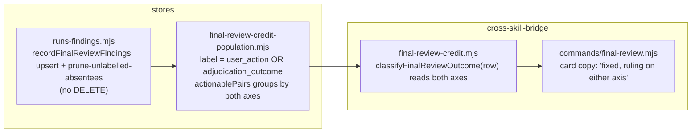

# Plan: Final-review credit — a ruling is a ruling on either axis, and a re-run must not erase it
- **Date**: 2026-09-14
- **Status**: Approved
- **Author**: Claude + Louis Strydom
- **Scope**: backend
- **Target domain(s)**: `stores`, `cross-skill-bridge`, `tests`
- ⚠ **Cross-domain work** — all crossings are existing declared edges (cross-skill-bridge → stores via the store-port barrel).

> **Neighbourhood considered** — `get-neighbourhood` over the three target
> modules returned `review` / `below-noise-floor-near` for six `runs-findings.mjs`
> writers (`recordFinalReviewFindings`, `adjudicateFinalReviewFinding`,
> `recordAdjudicationEvent`, …). Every named symbol is one this plan reads or
> modifies; no new abstraction is introduced.

> **Past incidents** — none of INC-001's paths are touched; every read and write
> here is the repo's own store. The one egress-adjacent surface (the credit card's
> `detail_snapshot` drop) is unchanged.

## 1. Context Summary

The `/ship` credit card says **2,232 shadow finding(s) await credit** (Q3). Two
measurements, both taken 2026-09-14 against the live store (repo
`6461a693`, queries in §9), say that number is mostly not work:

| Q3 population (2,280 rows — `oldPop` in §9) | `adjudication_outcome` | `user_action` | n |
|---|---|---|---|
| `merged` (code audit, primary bucket), `remediation_state = fixed` | `accepted` | NULL | **1,092** |
| `plan` (audit-plan), fixed | `accepted` | NULL | **505** |
| `merged` / `plan`, fixed | `severity_adjusted` | NULL | 46 |
| `merged`, fixed | `dismissed` | NULL | 6 |
| `final-review-shadow` | NULL | NULL | 449 |
| `merged`, fixed | NULL | NULL | 95 |
| shadow, adjudicated (both axes set) | accepted/dismissed | accepted-permanent/dismissed | 84 |

(The table's classes sum to 2,277; the remaining 3 are shadow rows with
`remediation_state='fixed'` and no ruling — in the 449+3 group below.)

**1,649 rows (72%) already carry a completed ruling** — written by the audit loop's own
triage through `recordAdjudicationEvent` (`scripts/lib/store/runs-findings.mjs:1908-1945`
at `1dc155c3`), whose `buildFindingAdjudicationPatch` (`:1895-1899`) sets
`audit_findings.adjudication_outcome` + `remediation_state` and never
`user_action`. The credit population's primary branch —
`CREDIT_BRANCH_PRIMARY_LABEL_GAP_WHERE` in
`scripts/lib/store/final-review-credit-population.mjs:54-57` — is
`bucket IS NULL AND remediation_state IN ('fixed','verified') AND user_action IS NULL`,
and the classifier `classifyFinalReviewOutcome`
(`scripts/lib/final-review-credit.mjs:74-99`) reads only `user_action` +
`remediation_state`. So a finding the loop ruled `accepted` and then fixed is
reported as **fixed-but-unlabelled** — the class the card exists to surface —
because the label sits on the other axis. `/ship` prints
`final-review-adjudicate … --action accepted` for rows that were adjudicated
weeks ago; running it writes `user_action='accepted-permanent'` on a row whose
`adjudication_outcome` already says `accepted`.

**The two-axis model is the design, not the defect.** AGENTS.md §Adjudication
Ledger: `adjudicationOutcome` (dismissed/accepted/severity_adjusted) is the
ruling; `user_action` is the ship-time disposition the credit flow added for
shadow rows (`accepted-permanent`, `auto_dismissed`, …). For a primary-bucket
row the triage ruling IS the adjudication. The census plan
(`docs/plans/skill-efficacy-census.md` Phase 1) widened the queue to primary
rows and defined "unlabelled" on the wrong axis.

**The second half: a re-run erases labels.** `recordFinalReviewFindings`
(`runs-findings.mjs`, tx1) runs
`DELETE FROM audit_findings WHERE run_id = $1 AND pass_name IN ('final-review','final-review-shadow')`
before re-inserting — so every re-run of `gemini-review.mjs` against the same
`--run-id` (round 2 of a Gemini gate; the seven consolidated passes yesterday)
drops every `user_action` / `adjudication_outcome` a human or agent had written
on that run's shadow rows. Cluster B of `backlog-tooling-honesty.md` raised this
as R1 H3/H14 and deferred it as writer debt; it is load-bearing for THIS plan,
because any label projected or read here dies on the next re-run.
`recordFindings` already upserts on `(run_id, finding_fingerprint, pass_name,
bucket)` (`:822-828`) and `buildFindingRow` never writes the adjudication
columns, so `DO UPDATE` preserves them by construction — the DELETE is the only
thing that loses state.

**Code Trace (pinned at `1dc155c3`)**: `/ship` Step 6.7 →
`finalReviewPendingCmd` (`scripts/lib/cross-skill/commands/final-review.mjs`) →
`getFinalReviewStats` (`runs-findings.mjs`) → `pendingQueueSql` +
`actionablePairs` (`final-review-credit-population.mjs`, both interpolating the
two branch predicates) → `classifyFinalReviewOutcome` / `summariseCounts`
(`final-review-credit.mjs:74-135`) → `renderFinalReviewCard`. Write side:
`write-code-outcomes.mjs` / `finalize-outcomes` → `recordAdjudicationEvent`
(`runs-findings.mjs:1908`); `gemini-review.mjs` → `recordFinalReviewFindings`
(`runs-findings.mjs`, DELETE at tx1).

**Patterns reused vs new**: no new module. The predicate module already exists
so both readers move together; the upsert already exists so the replay fix is a
deletion of a DELETE plus one bounded prune.

## 2. Proposed Architecture

**Key decisions**

- **Seam 1 — a COMPLETED ruling on either axis is a label** (#5 single source of
  truth for "is this adjudicated", #18 backward compat). The completed-ruling
  domain is named once, `COMPLETED_RULINGS = ['accepted','dismissed','severity_adjusted']`
  (exported from `final-review-credit-population.mjs` beside the predicates);
  `needs_triage` is a column value but NOT a ruling — a `needs_triage` row is
  as open as a NULL one (audit-plan R1 H1). `CREDIT_BRANCH_PRIMARY_LABEL_GAP_WHERE`
  becomes `bucket IS NULL AND remediation_state IN ('fixed','verified') AND
  (user_action IS NULL OR user_action = 'needs_triage') AND
  (adjudication_outcome IS NULL OR adjudication_outcome = 'needs_triage')` — on
  BOTH axes `needs_triage` is an open state, exactly as `classifyFinalReviewOutcome`
  already treats `user_action = 'needs_triage'` (Gemini plan-gate R2; the SQL had
  silently excluded those rows). The SQL twin of the JS list; the static test
  pins the two agree. `UNRULED_WHERE` uses the same two-axis clause. The shadow branch stays as it is (shadow rows are adjudicated
  through `adjudicateFinalReviewFinding`, which writes both axes — `:1025`).
  `classifyFinalReviewOutcome` gains `adjudication_outcome` as an input,
  consulted only when `user_action` is NULL or `needs_triage` AND only after
  the existing `regressed` precedence (`integrity-warning` / `regressed` keep
  winning — Gemini plan-gate R1): `dismissed` → `closed`; `accepted` /
  `severity_adjusted` → `closed` when fixed, else `accepted-unfixed`; NULL /
  `needs_triage` → today's branch. Concretely, the classifier first resolves
  ONE effective closing signal — `closedByAction = ua ∈ {dismissed,
  auto_dismissed} OR ((ua IS NULL OR ua = needs_triage) AND ao = 'dismissed')`
  — and only then applies today's rules in today's order (Gemini plan-gate R3):
  a `regressed` row with that signal is an `integrity-warning`, a `regressed`
  row without it is `regressed`, and the accepted/severity-adjusted branch is
  reached only after both. `actionablePairs`
  GROUPs BY the three columns so `summariseCounts` still sums exact totals.
  **No bulk write.** Measured 2026-09-14 with both predicates in one read
  (`.claude/tmp/measure-q3.mjs`, query in §9): population **2,280 → 631**,
  removed **1,649**, `oldPop − removed === newPop` holds, primary `needs_triage`
  rows 0 today. *Right-sizing*:
  band-aid = `UPDATE audit_findings SET user_action='accepted-permanent' WHERE
  adjudication_outcome='accepted'` (1,649 rows of duplicated state that the next
  triage write would drift from again); over-built = a `credit_label` view or a
  generated column; chosen = the reader asks both columns the question it
  already asks one of.
- **Seam 2 — the card and the docs say what the number is** (#19
  observability). The card's headline class is renamed from
  "fixed-but-unlabelled" to what it will now mean — *fixed with no completed
  ruling on either axis* — and the `/ship` SKILL.md Step 6.7 prose and
  `skills/ship/gate-contract.json` follow. The population moves 2,280 → 631
  (449 shadow never adjudicated + 95 `merged` fixed-without-ruling + 84 shadow
  adjudicated-but-still-in-population + 3), and the entry says why.
  **Cross-axis lifecycle, stated (R1 M2)**: `user_action` is the ship-time
  disposition and is a DURABLE OVERRIDE — the classifier reads it first, and a
  later `recordAdjudicationEvent` writes `adjudication_outcome` without touching
  it (`buildFindingAdjudicationPatch`), so the override survives. The
  disagreeing shape (`user_action` closes, a LATER completed ruling accepts, or
  the reverse) is not silently absorbed: `getFinalReviewStats` returns
  `axisConflicts` — a count over ALL of the repo's `audit_findings` where both
  axes are set (NOT the credit population, whose primary branch filters
  `user_action` open and so could never contain one — Gemini plan-gate R2):
  `user_action IN ('dismissed','auto_dismissed')` with `adjudication_outcome IN
  ('accepted','severity_adjusted')`, or `user_action IN ('accepted-permanent',
  'fix-now')` with `adjudication_outcome = 'dismissed'` (both accepting
  dispositions in `KNOWN_USER_ACTIONS` — R3) — computed independently of the
  pending page, and the card prints one line when it is > 0. Measured today
  over the whole repo: 0.
- **Seam 3 — replay preserves rulings** (#13 idempotency, #14 transaction
  safety). Each snapshot OWNS exactly one `pass_name` (R1 H3): tx1 owns
  `final-review`, tx2 owns `final-review-shadow`. In its own transaction each
  does: (1) `SELECT pg_advisory_xact_lock(hashtext($runId || ':' || $passName))`
  — serialises concurrent replacements of the same population; under READ
  COMMITTED two disjoint snapshots could otherwise each prune before seeing the
  other's rows and leave their union (R1 M1); no existing run lock covers this
  (`withTx` is a bare BEGIN/COMMIT); (2) `recordFindings` upserts the snapshot —
  `buildFindingRow` never writes the adjudication columns, so `DO UPDATE`
  preserves them; (3) `pruneUnrecordedUnruled(client, { runId, passName,
  keptKeys })` deletes rows of THAT pass_name for THAT run whose complete
  identity `(finding_fingerprint, bucket)` — compared null-safely with `IS NOT
  DISTINCT FROM`, NULL kept as NULL in `keptKeys` (Gemini plan-gate R2/R3) — is not in `keptKeys`
  (derived from the SAME normalised rows the upsert wrote — R1 H2) AND that
  carry no completed ruling on either axis (the same `COMPLETED_RULINGS` /
  `user_action IS NULL` predicate Seam 1 reads with). A labelled absentee is
  human/agent evidence and is kept. **Only a successful, authoritative snapshot
  may prune** (R1 H3): the payload gains `shadowRan: boolean` (gemini-review
  already holds `ran`); tx2 runs only when `shadowRan` — a shadow that did not
  run leaves prior shadow rows untouched, a shadow that ran and found nothing
  prunes the unruled ones. A prune failure rolls back its own tx (upsert
  included); tx2's failure never touches tx1's commit (unchanged contract).
  *Right-sizing*: band-aid = skip the DELETE when any row is labelled (then the
  snapshot never refreshes); over-built = snapshot versioning with a
  reconciliation log (Cluster B R1 H4's ask — nothing today reads it); chosen =
  lock + upsert + identity-complete prune of unruled absentees.

## 6. Sustainability Notes

- **Assumption**: `user_action` and `adjudication_outcome` never disagree in
  direction for the same row. Measured today: 0 rows with `user_action =
  'dismissed'` and `adjudication_outcome = 'accepted'` or vice versa across
  the repo (§9 query). The classifier reads `user_action` first, so if they ever
  do, the ship-time disposition wins and the disagreement is visible as a
  `closed` row that the other axis would have called open — a future
  `integrity-warning` class, not built now.
- **Extension point**: the label predicate lives in ONE place
  (`final-review-credit-population.mjs`) and its JS twin in
  `classifyFinalReviewOutcome`; the existing static test pins that both
  queries interpolate the shared predicates.
- **Deliberately not built**: embedding backfill for the residual Q3 rows
  (114 of 200 unembedded on yesterday's page) — separate; the remaining 15
  writer HIGHs from Cluster B — separate hardening plan.

## 7. File-Level Plan

| File | Intent | What changes |
|---|---|---|
| `scripts/lib/store/final-review-credit-population.mjs` | modify | `pendingQueueSql` projects `f.adjudication_outcome` in BOTH UNION arms (the classifier reads it; Gemini plan-gate R1); `export const COMPLETED_RULINGS`; `CREDIT_BRANCH_PRIMARY_LABEL_GAP_WHERE` adds `AND (f.adjudication_outcome IS NULL OR f.adjudication_outcome = 'needs_triage')`; `export const UNRULED_WHERE` — "no completed ruling on either axis AND `remediation_state IS NULL`": a recorded remediation (`fixed`/`verified`/`regressed`, or a `planned`/`pending` someone wrote) is evidence exactly like a ruling and is never pruned (Gemini plan-gate R1); the reader's label-gap clause uses the ruling half only; docblock states the two-axis rule and the 2,280 → 631 measurement. |
| `scripts/lib/store/runs-findings.mjs` | modify | `getFinalReviewStats`: `actionablePairs` selects/groups `adjudication_outcome` too; new `axisConflicts` count. `recordFinalReviewFindings({ primary, shadow, shadowRan, models, verdict })`: tx1 = advisory xact lock on `(runId, 'final-review')` + upsert + `pruneUnrecordedUnruled`; tx2 (only when `shadowRan`) = the same for `final-review-shadow`. `recordFindings` returns the normalised `keptKeys` it wrote (`{ fingerprint, bucket }`) so the prune compares the complete identity: `DELETE … WHERE run_id=$1 AND pass_name=$2 AND ${UNRULED_WHERE} AND NOT EXISTS (SELECT 1 FROM unnest($3::text[], $4::text[]) k(fp, b) WHERE k.fp = finding_fingerprint AND k.b IS NOT DISTINCT FROM bucket)` — `keptKeys` carries the bucket as written (NULL stays NULL in `$4`), null-safe on both sides. Pruned count on the stderr line. |
| `scripts/lib/final-review-credit.mjs` | modify | `classifyFinalReviewOutcome(row)` reads `adjudication_outcome`; `summariseCounts` unchanged in shape (groups now carry the third column); `renderFinalReviewCard` copy: "fixed, no ruling on either axis". |
| `scripts/lib/cross-skill/commands/final-review.mjs` | modify | Nothing structural — the projection already passes rows through; add `adjudication_outcome` to the display-safe item projection so the printed command's rationale is visible. |
| `tests/final-review-pending.test.mjs` | modify | Classifier product extended over the `adjudication_outcome` domain (`null, accepted, dismissed, severity_adjusted, needs_triage`), asserting the mapping is total and that `needs_triage` behaves exactly as NULL; **one fixture derived from a real stored row** (the `merged/accepted/NULL/fixed` shape above) must classify `closed`; the static predicate test asserts the new clause is present in the primary branch, absent from the shadow branch, and that `COMPLETED_RULINGS` and the SQL clause name the same three values; card copy incl. the `axisConflicts` line. |
| `tests/final-review-pending-db.test.mjs` | modify | Seed primary rows for EVERY `adjudication_outcome` value × `user_action NULL` × `fixed`/`verified`: `accepted`/`dismissed`/`severity_adjusted` are NOT in `pendingQueue` nor counted; NULL and `needs_triage` ARE (R1 H1). One `axisConflicts` row (user_action dismissed, adjudication accepted) is counted by the new field and still excluded from the page. |
| `tests/final-review-replay-db.test.mjs` | create | Real Postgres: record a primary+shadow snapshot; adjudicate one shadow row (both axes) and one primary; re-record a snapshot that keeps one and drops the other → kept rows keep labels, the dropped RULED row survives, the dropped unruled row is pruned, a third re-record is idempotent. Identity cases (R1 H2): the same fingerprint in two buckets, one kept and one dropped → only the dropped bucket's row goes; a NULL bucket; rows of the OTHER pass_name untouched. Ownership cases (R1 H3): `shadowRan:false` leaves prior shadow rows; `shadowRan:true, shadow:[]` prunes unruled shadow rows only; a prune that throws rolls back that tx's upsert; a shadow tx failure leaves tx1's rows committed. Concurrency (R1 M1): two connections replacing the same run's primary snapshot with disjoint sets → the final state is ONE of the two snapshots, never their union. Enrolled in `ISOLATED_SUITE_FILES` + `postgres-parity.yml` + both trigger filters. |
| `scripts/gemini-review.mjs` | modify | The one producer: passes `shadowRan: ran` (`ran = result._shadow.state === 'ran'`, already computed beside `shadowFindings = ran ? diff.shadow : []`) into `recordFinalReviewFindings`. No permissive default in the store: an absent `shadowRan` is treated as `false` (never prune what you did not measure) and the store logs one line naming the caller when `shadow.length > 0 && shadowRan !== true`. |
| `tests/gemini-review-shadow-persist.test.mjs` | create | Producer→store contract: a fake `recordFinalReviewFindings` captures the payload from the persistence block for (a) an executed non-empty shadow → `shadowRan:true`, `shadow` non-empty; (b) an executed EMPTY shadow → `shadowRan:true`, `shadow: []`; (c) a shadow that did not run (`_shadow.state !== 'ran'`) → `shadowRan:false`, `shadow: []`, every primary `_bucket` null. Exercises the real block via its exported seam (`_internals`) rather than a copy of it. |
| `scripts/db-test-container.mjs` | modify | Enrol `tests/final-review-replay-db.test.mjs`. |
| `.github/workflows/postgres-parity.yml` | modify | Enrol the same file in the job list and both `paths:` filters. |
| `skills/ship/SKILL.md` | modify | Step 6.7: the card's classes and what "no ruling on either axis" means; note that a re-run final review no longer erases labels. |
| `skills/ship/gate-contract.json` | modify | Disposition the new prose lines. |
| `tests/final-review-adjudicate.test.mjs` | modify | Existing suite gains: adjudicating a row then re-running `recordFinalReviewFindings` for that run keeps `user_action` (the seam-3 regression, on the suite that already owns the adjudicate fixture). |

Regex-resolvable paths: 12 (≥5 — fuzzy discovery will not fire).

### 7b. Implementation Phases

**Phase 1 — Read side, both axes**: predicate + classifier + counts + card copy +
tests. Files: `scripts/lib/store/final-review-credit-population.mjs` (modify),
`scripts/lib/final-review-credit.mjs` (modify),
`scripts/lib/store/runs-findings.mjs` (modify — `actionablePairs` only),
`scripts/lib/cross-skill/commands/final-review.mjs` (modify),
`tests/final-review-pending.test.mjs` (modify),
`tests/final-review-pending-db.test.mjs` (modify).

**Phase 2 — Replay preserves rulings**: upsert + prune, replay suite, enrolment.
Files: `scripts/lib/store/runs-findings.mjs` (modify — `recordFinalReviewFindings`),
`scripts/gemini-review.mjs` (modify), `tests/gemini-review-shadow-persist.test.mjs` (create),
`tests/final-review-replay-db.test.mjs` (create),
`scripts/db-test-container.mjs` (modify), `.github/workflows/postgres-parity.yml` (modify),
`tests/final-review-adjudicate.test.mjs` (a comment only — see §Audit trail).

**Phase 3 — Operator surface**: SKILL.md + gate contract. Files:
`skills/ship/SKILL.md` (modify), `skills/ship/gate-contract.json` (modify).

**Close-out (not a phase)**: `npm run skills:regenerate && npm run skills:check`;
`npm run db:enrolment:gate`; `npm run size:ratchet:gate` (`runs-findings.mjs` is
baselined at 2357 — re-baseline only if it moves past the tolerance); local DB
run `npm run db:local -- suites`; live acceptance is the EXACT identity from §9,
re-run after the change in one read: `newPop === oldPop − removed` (631 ===
2,280 − 1,649 today) with NO write — `SELECT count(*) FROM audit_findings WHERE
user_action IS NOT NULL` and `… WHERE adjudication_outcome IS NOT NULL` are
byte-identical before and after.

## 8. Risk & Trade-off Register

- **Rows leave Q3 without anyone re-reading them.** Deliberate: the ruling was
  made when the finding was triaged (`ruling_rationale` is on the event). This
  plan changes what the card asks, not what anyone decided.
- **`severity_adjusted` counted as accepted** — that is what the ledger means by
  it (the finding stood, at a different severity); a `dismissed` outcome is
  the only closing ruling.
- **Prune semantics keep labelled absentees** — a shadow row a re-run no longer
  raises but a human dismissed stays in the table with its label. It is not in
  Q3 (dismissed → closed), so it costs nothing; deleting it would erase the one
  piece of human evidence about that fingerprint.
- **A row that both readers used to count is now a ratio change in
  `skill-census` / the shadow briefing** — the briefing's numbers were computed
  from `user_action` only; the plan notes this in `status.md`, does not restate
  the briefing.
- **Deferred, stated**: the 15 other Cluster-B writer HIGHs; embedding backfill.

## 9. Testing Strategy

- **Unit (Tier 1, test-first)**: classifier over the full 5×7×5 product
  (`adjudication_outcome × user_action × remediation_state`), asserting the
  mapping is total and that a NULL/NULL/fixed row is still `fixed-unlabelled`
  while `accepted`/NULL/fixed is `closed` (red today); static predicate test
  asserts `adjudication_outcome IS NULL` appears in the primary branch and NOT
  in the shadow branch.
- **Real Postgres (enrolled)**: `final-review-pending-db` gains the two seeded
  rows; `final-review-replay-db` covers keep/prune/idempotent re-record;
  `final-review-adjudicate` gains adjudicate-then-replay.
- **Negative controls**: restore the DELETE → the replay suite fails; drop the
  `adjudication_outcome IS NULL` clause → the pending-db suite fails.
- **Measurement (executable, one read-only snapshot)** — `.claude/tmp/measure-q3.mjs`
  binds `repo_id = '6461a693-6690-4bf3-98ee-14c0385cc357'` and evaluates, in
  one process: `oldPop` = shadow branch ∪ today's primary branch; `newPop` =
  shadow branch ∪ the proposed primary branch; `removed` = today's primary
  branch ∩ `adjudication_outcome IN ('accepted','dismissed','severity_adjusted')`;
  asserts `oldPop − removed === newPop`. Result 2026-09-14: `{oldPop: 2280,
  newPop: 631, removed: 1649, primaryNeedsTriage: 0, identity: true}`. The
  direction-agreement check (`user_action='dismissed' ∧ outcome='accepted'` or
  `user_action='accepted-permanent' ∧ outcome='dismissed'`) → 0.

## 11. Execution Clustering

- **Cluster A** — Phases 1–2 — fix-gate: yes
  - Coupling: one store module, two functions on the same rows. Phase 1 changes
    what `getFinalReviewStats` counts as labelled; Phase 2 changes what
    `recordFinalReviewFindings` preserves — audited apart, the wiring pass could
    not see that the prune predicate (`user_action IS NULL AND
    adjudication_outcome IS NULL`) is the SAME predicate the reader now uses for
    "unlabelled", which is the invariant that makes the two halves one design.
- **Cluster B** — Phase 3 — fix-gate: final
  - Coupling: operator prose that names the classes Cluster A defines; nothing
    in it is auditable until A's card copy is final.
- **Final gate**: consolidated Gemini review over the union diff of Clusters A–B.

## Audit trail

- **R1** (GPT, `--mode plan`): H:3 M:2 L:1, acceptance 100%. H1 → `needs_triage`
  is not a completed ruling; `COMPLETED_RULINGS` named once, SQL twin pinned.
  H2 → prune compares the complete identity `(fingerprint, bucket)` (null-safe since gate R2)
  from the rows the upsert wrote, scoped to the owning pass_name. H3 → each tx
  owns one pass_name; `shadowRan` distinguishes "did not run" from "ran, found
  nothing"; only a successful snapshot prunes. M1 → advisory xact lock per
  (run, pass); two-connection test. M2 → `user_action` is a durable override;
  `axisConflicts` diagnostic (0 today). L1 → the population table is reconciled
  (2,277 + 3) and the acceptance condition is the exact measured identity
  2,280 − 1,649 = 631.
- **R2**: H:0 M:1, acceptance 100%. M3 → the producer (`scripts/gemini-review.mjs`)
  and a producer→store contract test join Phase 2; the store treats an absent
  `shadowRan` as `false` and names the caller when shadow rows arrive without it.
- **Gemini gate R1** (`--mode plan`): CONCERNS, 3 new — `pendingQueueSql` must
  project `adjudication_outcome` in both UNION arms; the prune must also spare
  rows with a recorded `remediation_state`; the classifier's new branch sits
  after the `regressed` precedence. All three folded in.
- **Gemini gate R2/R3**: R2's three concrete contract defects (null-safe
  bucket comparison; `axisConflicts` over the whole repo; `user_action =
  'needs_triage'` open on the SQL side) were accepted but the edit script that
  folded them in aborted before writing — R3 re-raised them against the
  unchanged document, adding one precision (`fix-now` is an accepting
  disposition; the classifier resolves one effective closing signal BEFORE the
  `regressed` rule). All folded in now; population re-measured 2,287 → 631
  (identity holds). One confirmation round follows because R3 reviewed a
  document that did not carry R2's fixes.
- **Gemini gate R4 (confirmation)**: **APPROVE** — 0 new, 0 wrongly dismissed.

## Out of Scope (Future) — debt surfaced by the Cluster A code audit

The Cluster A audit (R1, 23 HIGH / 6 MEDIUM) read the whole of
`scripts/lib/store/runs-findings.mjs` and `scripts/gemini-review.mjs`
because this plan's changes live in both. Two findings were real and directly
tied to this plan's own two-axis model (H8: `recordFinalReviewFix`'s dismissal
guard now checks `adjudication_outcome` too; H17: a producer defect that
drops findings from a batch no longer silently authorizes a prune) and were
fixed in the same round. One (M6) was a real test-quality gap in this plan's
OWN new test file, fixed by extracting `buildFinalReviewPersistPayload` as a
pure, fully-testable function.

The remaining 20 HIGH / 5 MEDIUM are pre-existing, independent debt — several
overlap what `docs/plans/backlog-tooling-honesty.md`'s Cluster B audit already
recorded yesterday in `runs-findings.mjs` (repository scope not enforced,
intra-batch dedup narrower than the DB conflict key, transactional errors
swallowed in `persistKeptEmbeddings`, capability probes bypassing a held
transaction client, reconciliation identity loss) — this audit re-found the
same class from a different diff base. New to this session, confined to
`scripts/gemini-review.mjs` (untouched by either plan's edits):

- **Fail-open schema validation** — `callReviewer` logs a Zod warning but still
  returns the invalid payload as a success.
- **Provider termination status ignored** — a truncated (`finish_reason:
  'length'`) response is accepted the same as a complete one.
- **Gemini adapter cancellation signal** — passed as a second argument;
  `@google/genai` expects `request.config.abortSignal`.
- **Provider/model attribution fallback** — any provider other than
  Gemini/Azure-Claude is attributed as `CLAUDE_OPUS_MODEL` (e.g. an
  OpenRouter request is mis-attributed).
- **`requestIdentity` dropped** between `runShadowReview`'s return and its
  caller, which reads it anyway (always `null` on that path).
- **Campaign-scope validation runs after client construction**, not before.
- **Diagnostic payloads carry raw provider error text/response excerpts**
  into stderr and the rethrown error.

These belong to a `gemini-review.mjs` hardening plan, not to a credit-queue
labelling plan. Not dismissed — recorded so the audit's cost was not wasted.

