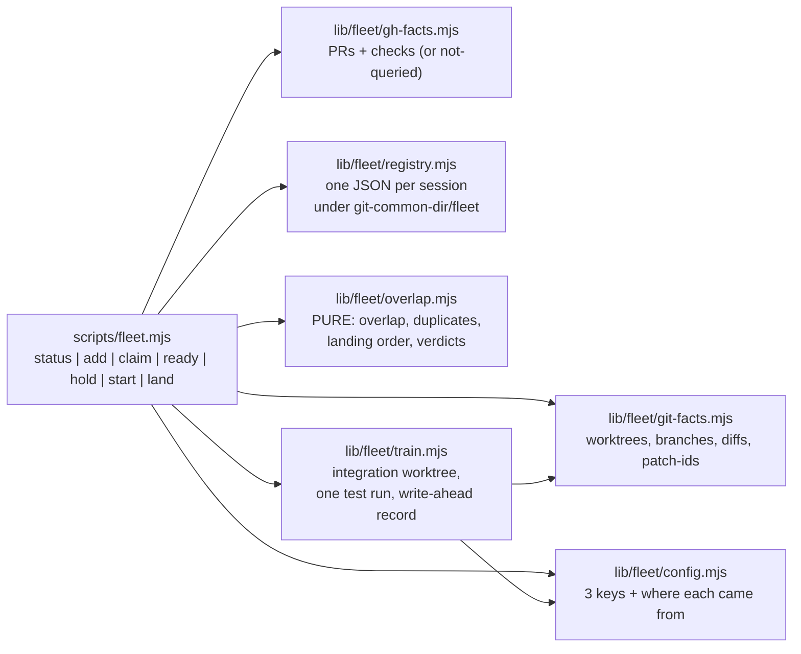

# Plan: /fleet — coordinating several concurrent AI coding sessions
- **Date**: 2026-10-05
- **Status**: Complete
- **Author**: Claude + Louis
- **Scope**: backend (CLI + skill content; no UI) · stack `js-ts`
- **Target domain(s)**: `scripts`, `shared-lib`, `skills-content` — new domain `fleet` added for `scripts/fleet.mjs` + `scripts/lib/fleet/**`
- ⚠ **Cross-domain work** — a new skill touches the skill surface, a new CLI, and the sync/census registries. Intentional: a skill is not shippable without all three.

## 1. Context Summary

**The problem (from the user, 2026-10-05).** Running several sessions at once
— Claude Code desktop chips spun out by the IDE, linked worktrees, sometimes a
shared working tree — costs a lot of human energy: keeping track of who is
doing what, noticing when two sessions are quietly building the same thing, and
paying for one CI run per branch when several branches could be tested together
once. A hand-run coordinator session on another repo proved the value; two
`/brainstorm` debate rounds (sessions `1791174530024`, `1791184884943`) and a
GitHub prior-art survey cut the original 8-part design down to this one.

**Decisions already taken with the user — not reopened here:**
one skill, three verbs (`status`, `start`, `land`) plus `add`; git is the source
of truth so tracking needs no registration; registration exists only to declare
intent; new chips BLOCK on an overlapping live claim, running sessions get
advisory warnings; one combined test run; landing needs explicit human approval
and keeps separate per-branch commits; no automatic bisect/eject in v1.

**Dropped, deliberately:** guard hook, grant ledger, auto-merge mutation,
log-diagnosis subagent, flake-signature lists, a policy YAML, an always-on
coordinator session, cross-agent chat, `/loop`, automatic bisect/eject.

**One decision corrected on the evidence, not reopened on taste — liveness.**
The brief said "liveness by pid + process start time" (borrowed from a
presence-registry write-up). That pattern assumes the registering process IS
the session. Here it is not: `fleet.mjs` is a one-shot CLI that exits in under
a second, and the agent session that ran it has no pid that is knowable
host-neutrally (Copilot, Cursor and a Claude chip each run commands under
different, short-lived shells). A pid recorded by the CLI would be dead the
moment it was written. So liveness is **a lease renewed by any `fleet` command
carrying that session's id, OR git activity on the session's branch inside the
lease window** — both observable from the repo, neither needing the session's
process. The goal the pid was serving (a crashed session must never block new
chips forever) is preserved exactly.

**Prior art reused, not rebuilt:**
- `foremerge` (intent claims on symbols, SQLite in git-common-dir) — the closest
  match; recorded as a future optional integration, not a v1 dependency
  (pre-1.0, a Rust binary is a new kind of dependency for this bundle).
- `mergetrain` — borrowed its two best ideas: approve-then-push, and a
  write-ahead record so an interrupted land is recoverable.
- `--match-head-commit` (from a published merge-train spec) for the PR landing mode.

**Code Trace** (all at `498af659`):
- CLI conventions: `emit` couples `ok:false` → non-zero exit `scripts/lib/cli-io.mjs:45`;
  `assertKnownFlags` `scripts/lib/cli-io.mjs:327`; `finishAndExit` `scripts/lib/cli-io.mjs:377`.
- Sync registration of a skill's entry script: `scripts/sync-to-repos.mjs:313`
  (`brainstorm-round.mjs` precedent; the walker pulls the `lib/` import closure),
  mirrored in `scripts/lib/sync-inventory.mjs:46`; relocation smoke set
  `scripts/lib/sync-isolation-verify.mjs:69` (`CLI_SMOKE_SET`, asserts consumer presence).
- Skill roster enumerations that must learn a 17th name:
  `scripts/lib/store/skill-census.mjs:32` (`TRAILER_ONLY_SKILLS`, `ALL_SKILLS`),
  pinned by `tests/skill-census.test.mjs:64` ("exactly 16");
  `scripts/sync-shared-audit-refs.mjs:73`.
- Domain tagging: `.audit-loop/domain-map.json:25` (pattern rules), `:444` (allowedDeps),
  `docs/architecture-intent.md:141` (one `###` heading per domain, gated by
  `docs:architecture-intent:check`).
- Reusable git facts: `scripts/lib/git-freshness.mjs` (`resolveBaseFreshness`,
  never fetches, `unknown` is a real state); `scripts/lib/checkout-kind.mjs`
  (`detectCheckout` main/linked/unknown); `scripts/lib/pinned-worktree/manage.mjs`
  (`provisionNodeModules(fixture, mainRoot)` for the integration worktree).
- Atomic writes: `scripts/lib/file-io.mjs` `atomicWriteFileSync`.
- Glob matching: `micromatch` is already a dependency; `scripts/lib/glob-match.mjs`
  is deliberately NOT used — its `**/` does not match zero segments (its own
  docstring), which would make `src/**/*.mjs` miss `src/a.mjs` and under-report overlap.
- `gh` call shape: `scripts/ensure-branch-protection.mjs:52` (`execFileSync('gh', …)`).

**Neighbourhood considered** (arch-memory, 2026-10-05): top hit
`scripts/reconcile-repo-identity.mjs:main` (`precedent`, `above-floor-cluster`,
similarity 0.72) — a CLI that reconciles duplicate store rows. Opened and
rejected for reuse: it reconciles DB identities, not git branches; the only
shared shape is "CLI with a dry-run/apply split", which `land` follows by
convention, not by import. Next hits (`on-conflict-lint.mjs:computeDriftFindings`,
`review`) are diff-scoping helpers over a single base — `git-freshness.mjs` is
the right reuse for base staleness instead.

**Security incident neighbourhood**: INC-001 (symlink bypass of the sensitive-path
classifier) surfaced on path proximity only. Not applicable: `/fleet` sends
nothing to an LLM or external API; it reads git and `gh`. The one outward action
— a push in `land --approve` — is covered in §8.

## 2. Proposed Architecture



**Split by kind of work (#2, #3, #11).** Everything that touches a process
(`git`, `gh`, the filesystem) sits in a thin fact-gathering module that returns
plain data; every decision (does A overlap B, is this a duplicate, what order,
may this chip proceed) is a pure function in `overlap.mjs` tested without git at
all. That is the Tier-1 seam: the pure core is test-first, the fact modules get
throwaway-repo tests per hazard.

**Facts carry their own provenance (#16, #19).** Every fact block has
`{queried: bool, observedAt, reason?}`. `gh` missing, unauthenticated or offline
→ `prs: {queried:false, reason:'gh not authenticated'}`, rendered as
`PRs: not queried (gh not authenticated)` — never as an empty list. A worktree
whose directory vanished is reported `missing`, not dropped (git still lists it
as `prunable`).

**Identity.** A session is keyed by `id`, defaulting to its branch name
(one session per branch is the normal case). A shared working tree hosting two
sessions on one branch passes `--id <name>` explicitly. **Storage key** =
`<readable-prefix>-<sha256(id).slice(0,12)>.json`, where the prefix is the id
lower-cased with non-`[a-z0-9]` runs collapsed to `-` and truncated to 40 chars.
The digest is over the exact id, so `feat/a` and `feat-a` — and case-only
differences on Windows — can never share a file. The full id is stored inside
the record and **verified on every read**: a record whose embedded id does not
hash to its filename is `invalid`, not trusted. Train ids are generated
(`t-<yyyymmddhhmmss>-<4 hex>`), validated against `^t-[0-9]{14}-[0-9a-f]{4}$`
before any path is built, and every managed path is checked to resolve inside
`fleet/` (so `land --approve ../x` cannot escape).

**Registry layout** — `$(git rev-parse --git-common-dir)/fleet/`, so every linked
worktree sees the same state, and nothing is ever committed (it is inside `.git`):
```
fleet/
  .lock                  registry-wide transaction lock (withFileLockSync)
  sessions/<key>.json    one record per session
  quarantine/            invalid records moved aside by an explicit `repair`
  hold.json              {held:bool, by, reason, at} — "hold heavy runs"
  trains/<trainId>.json  immutable manifest + mutable phase (see Train mechanics)
```
**Every registry mutation is a transaction (#14).** One file per session does
not make a read-check-write atomic — two new chips can both read an empty
registry, both pass the gate, and both publish — and `--override` writes two
records at once. So `claim`, `ready`, `touch`, `add`, `start`, `hold` and
`repair` run as: gather git/gh facts OUTSIDE the lock (slow, may time out) →
acquire `fleet/.lock` → re-read all records → evaluate the gate → write via
`atomicWriteFileSync` → release. Each record carries a `rev` integer; a write
that would not strictly increase `rev` over what was just read is refused, so a
stale writer can never silently overwrite a newer record. Lock-acquire failure
is a refusal (exit 1), never a proceed-without. `status` takes no lock and
writes nothing.

**Registry completeness is part of every read (#16).** `readSessions` returns
`{sessions, invalid:[{file, reason}], complete}` — `complete:false` whenever any
file failed to parse, failed schema validation, or failed the id-hash check.
`status` renders what it has under a banner (`registry incomplete: 1 record
unreadable — claims may be missing`). **Admission refuses when `!complete`**
(exit 3, naming the file and the repair command): a corrupted live claim must
never silently vanish from a blocking decision. `fleet repair --quarantine
<file>` (human-run) moves one invalid file to `quarantine/`; nothing is ever
deleted automatically.

**Session record:**
```json
{ "schemaVersion": 1, "rev": 3, "id": "feat/csv-export",
  "source": { "kind": "branch|pr", "branch": "feat/csv-export",
              "repo": "owner/name", "prNumber": null,
              "headRepo": "owner/name", "headRef": "feat/csv-export",
              "baseRef": "main" },
  "worktree": "C:/GIT/repo-wt/csv", "intent": "Add CSV export to the results page",
  "paths": ["src/export/**", "src/results/table.mjs"],
  "state": "working|ready|blocked|done|abandoned",
  "gen": 1, "startOid": "def456…",
  "waitingOn": [],   // structured blockers — see §2b
  "ready": { "oid": "abc123…", "at": "…" },
  "knownOverlaps": [{ "with": "feat/search", "by": "human", "at": "…", "note": "…" }],
  "leaseExpiresAt": "…", "updatedAt": "…", "createdAt": "…" }
```
`ready.oid` is the readiness contract: if the source head moves past it, status
shows `ready (stale — head moved)` and `land` refuses it until `fleet ready` is
re-run (#13). `startOid` is the immutable commit a session began from (`start`
records the base OID it branched at); it is what "this session has done no work
yet" is measured against.

**Source identity (PRs and remote agents).** A PR number or `headRefName` does
not identify a commit — a fork can share the name. `add #<n>` therefore records
`{repo, prNumber, headRepo, headRef, baseRef}` from `gh pr view`, and
`headOid` is resolved from the PR, never from a local branch of the same name.
Before `ready` or a train, the commit is **materialised into an isolated local
ref** `refs/fleet/pr/<n>` via `git fetch origin refs/pull/<n>/head:refs/fleet/pr/<n>`
(GitHub exposes this for fork PRs too) and the fetched OID must equal the PR's
`headRefOid`; a mismatch or a fetch failure → refuse with the reason. A source
that is neither a local branch nor a fetchable PR is shown in `status` as
`remote-only — not landable by fleet` rather than dropped.

**Verbs.**

| Verb | Mutates | What it does |
|---|---|---|
| `status` | **nothing** (no lock, no registry write, no lease renewal) | Discover worktrees, local branches ahead of base, registered sessions, PRs. Join them. Show per item: id, branch, intent, state, observation age, ahead/behind base, overlaps, duplicate patch-ids, and a proposed landing order. Untracked branches/worktrees appear as `untracked`. `--json` for the envelope. |
| `add <branch\|#PR\|--all>` | registry | **Adoption** of work that already exists: create a session record (intent from the last commit subject / PR title, `startOid` = merge-base). Advisory overlap check only — adopting running work never blocks. |
| `claim --id <id> --intent "…" --paths "a/**,b.mjs" [--override]` | registry | **First registration of a NEW session, or an update to an existing one.** The id has no record → new-session gate (blocking). The id has a record → update with an advisory check. Runs the duplicate gate (below). |
| `ready [--id]` | registry | Record the current head OID as ready; renews the lease. |
| `touch [--id]` | registry | Explicit heartbeat: renew the lease without changing anything else. The only other way a lease is renewed. |

`claim`, `ready` and `touch` also accept `--waiting-on kind:ref[:note]` (repeatable) and `--clear-waiting` (§2b).
| `hold on\|off [--reason]` | `hold.json` | The "hold heavy runs" flag; participants check it before expensive local runs. |
| `start --task "…" [--paths a,b] [--task "…" [--paths c]]…` | git + registry | **`--paths` binds to the immediately preceding `--task`**; a task with no `--paths` has `paths: []` and is checked on intent only. The whole batch is **one atomic operation**: (1) gather facts, (2) under `fleet/.lock` evaluate every task through the **new-session gate against the registry AND against each other** — any conflict (including two tasks in the same batch declaring overlapping paths) blocks the **entire batch** with the pairs named, creating nothing, (3) create the worktrees from the resolved base OID (recorded as `startOid`); if worktree *k* fails, remove worktrees *1..k-1* and write **no** records, (4) write all records in one transaction, (5) print a chip prompt per task with the participant rules embedded. All-or-nothing: a partial `start` never leaves orphaned worktrees or registry rows. |
| `repair --quarantine <file>` | registry | Move one invalid record to `quarantine/` so admission can proceed. Human-run; never automatic. |
| `land [--select a,b] [--dry-run]` | git (worktree only) | Build a train: snapshot base + each READY head, create the integration worktree, apply in landing order, run `testCommand` once (rerun once if red), write the **immutable train manifest**. Prints the result, whether it is approvable, and the exact approve command. Never touches the base branch. |
| `land --approve <trainId> [--accept-rerun]` | git (+ push) / emits commands | Consume the manifest only (never current config). Refuses unless the train is `approvable` (below) and every recorded fact still holds on re-verification. `--accept-rerun` is required to approve a `green-after-rerun` train. |
| `land --confirm <trainId>` | read-only (gh) + registry | PR mode: observe via `gh` that each PR is MERGED and record it; only when all are observed does the train become `landed`. |
| `land --reconcile <trainId>` | read remote + registry | Direct modes: after an interruption, compare the remote ref with the manifest and resolve `push-pending` honestly (below). |
| `land --resume <trainId>` | worktree + registry | Continue a tiered run from the first tier with no recorded result, in the same still-clean worktree (integrity preconditions re-asserted first). |
| `land --abandon <trainId>` | worktree + registry | Remove the worktree, mark the train `abandoned`; sessions return to `ready`. |

**Duplicate gate** (`overlap.mjs:decideClaim`, pure). Whether a session is
"new" is an **explicit act, never inferred from branch history** — inferring it
from commits-ahead exempts a fresh `--id` placed on an already-advanced branch
(the shared-working-tree case) and lets `start` from an ahead HEAD dodge the
gate. Admission mode is a parameter:
- `mode:'new'` — `claim` with an id that has **no record OR a terminal record**
  (`done`/`abandoned` — a reused branch name must not read as already-running
  work), and every `start` task. Re-registering over a terminal record bumps the
  record's `gen` integer and clears `ready`/`knownOverlaps`; the old generation
  survives only inside the train manifests that referenced it.
- `mode:'adopt'` — `add`, and `claim` on an id whose record is **non-terminal**.
- Conflict = another **live, non-terminal** session whose declared `paths`
  overlap this claim's `paths`, or whose normalised `intent` (lower-cased,
  whitespace-collapsed) is identical, or whose observed changed files match this
  claim's `paths`.
- `new` + conflict → `{ok:false, verdict:'blocked', conflicts}`, exit 3. The chip
  must stop and report. `--override` (documented as human-only) records a
  `knownOverlap` on both records in the same transaction and proceeds.
- `adopt` + conflict → `{ok:true, verdict:'warn', conflicts}`, exit 0.
- `!registry.complete` → `{ok:false, verdict:'refused', reason:'registry incomplete'}`,
  exit 3, for BOTH modes' admission — no decision is made on partial data.
- Pairs listed in either side's `knownOverlaps` are reported as `known`, not re-flagged.

**Claim-pattern grammar and sound overlap.** `paths` entries are repo-relative,
forward-slashed, and use a **closed grammar**: literal characters, `*` (any run
within one segment), `?` (one character within a segment), and `**` as a whole
segment (zero or more segments). `{}`, `[]`, `!`, `(`, `)` and a leading `/` or
`..` are **rejected at claim time** with a message naming the character — better
a refusal than an unsound guess. Two patterns are decided by `patternsIntersect(a, b)`:
split into segments, then a DP over segment lists where `**` may consume any
number (including zero) of the other side's segments, and two non-`**` segments
intersect iff a wildcard-intersection DP over their characters finds a common
string (`*` consumes any run, `?` any one char). This is exact for the grammar —
`src/*.mjs` vs `src/a*.mjs` → intersect (both match `src/alpha.mjs`); `src/*.mjs`
vs `src/lib/**` → disjoint. The function returns `disjoint` **only when
disjointness is proven**; any input outside the grammar that somehow reaches it
returns `unknown`, treated as overlapping. Concrete changed files are matched
against patterns with `micromatch` called with **`{dot:true, nocase:false}`** —
micromatch's defaults skip leading-dot names, which the grammar's `*` does match,
so without `dot:true` the intersection engine and the file matcher would disagree
about `.github/*` (asserted by test). The grammar is a strict subset of its syntax.
`**/` matching zero segments is asserted by test, which is the gap
`lib/glob-match.mjs` documents and why that module is not reused.

**Live** (`isLive`): a session is live iff its state is not terminal
(`done`/`abandoned`) AND (`leaseExpiresAt > now` OR it has **observed branch
activity** inside the lease window). Branch activity = the tip commit's
committer time, **ignored when it is more than 5 minutes in the future** (clock
skew allowance) and reported in `status` as `future-dated commit ignored` — a
future-dated commit must not keep a lease alive indefinitely. Default lease 4 h
(`FLEET_LEASE_HOURS`). A session whose worktree has disappeared and whose lease
expired is shown `stale` and never blocks. **Lease renewal** happens only through
`claim`, `ready` and `touch` carrying that id, plus the explicit mutating verbs;
`status` never renews anything. A session is
treated as terminal (`done`) when a `landed` train contains its exact `(id, gen)`
and its current `rev`/`ready.oid` still match that manifest — derived on read
(see *Session finalization is derived*), which releases its claim for admission.

**Config** (`config.mjs`) — three core keys plus the optional `checks` hook and
the tiered form of `testCommand` (§2b), in an optional file `.fleet.json` at repo
root (consumer-owned, never synced):

| Key | Default when absent | Source shown in status |
|---|---|---|
| `baseBranch` | `origin/HEAD` → its branch; else `main` | `config` / `origin/HEAD` / `fallback` |
| `testCommand` | `npm test` if `package.json` has `scripts.test`; else **none** → `land` refuses with a clear message | `config` / `package.json` / `unset` |
| `mergeMethod` | `pr` | `config` / `default` |

`mergeMethod` decides how an approved train lands, because branch protection
decides what is even possible. **It is fixed into the train manifest when the
train is built** — editing `.fleet.json` afterwards cannot change what an
already-tested train does:
- `pr` — approval **emits** an ordered execution plan, in landing order,
  `gh pr merge <n> --squash --match-head-commit <headOid>` per PR, and does NOT
  execute anything. Works under required-checks rulesets (this repo's own). The
  train stays in `awaiting-merge` until `land --confirm` has **observed** each PR
  as MERGED through `gh`; printing commands is never recorded as landing. Each
  PR's recorded `baseRefOid` is re-checked at emission (`--match-head-commit`
  protects the PR head, not its target), and an unverifiable base → refuse.
- `direct-squash` — squash each branch into one commit, chain them on base in
  the integration worktree, and push the tip with an expected-old-OID update.
  One CI run on main for the whole batch, one revertible commit per branch.
  Needs push rights to base.
- `direct-merge` — as above with a `--no-ff` merge commit per branch.

**Destination identity** is recorded in the manifest:
`{remote, fetchUrl, pushUrl, ref, expectedOid}` — the full ref
(`refs/heads/main`), never a bare branch name. `fetchUrl` and `pushUrl` are
resolved at build time (`git remote get-url <remote>` and `git remote get-url
--push --all <remote>`); **more than one push URL → refuse** (the push is
no longer one destination). `expectedOid` is obtained from the **remote** with
`git ls-remote <fetchUrl> <ref>` — against the explicit URL, not the remote name
— and never from a local `origin/main`, which only moves on fetch. At approval
both URLs are re-resolved and must equal the manifest's, and the push is issued
to the **recorded `pushUrl`** (`git push <pushUrl> …`), not to the remote name,
so a `pushurl`/`insteadOf` change between build and approval cannot redirect it.
If either URL differs, or the remote cannot be reached, the approval is
**refused**, never proceeded on stale local knowledge. (Two repositories that
happen to share the expected commit are therefore not interchangeable.)

**Train manifest (immutable once written) and phase (mutable).** The manifest
holds: `schemaVersion`, `trainId`, `createdAt`, `baseOid`, ordered
`sources:[{id, gen, rev, oid, kind, repo, prNumber?, headRepo?, baseRef?, baseRefOid?}]`
(`gen`/`rev` pin the exact session generation and revision the train was built
from), `mergeMethod`, `destination:{remote, ref, expectedOid}`, `testCommand`,
`candidate:{oid, tree}` (recorded **before** tests run), `depsChanged`, `result`.
A second write to a populated field is refused. Approval consumes ONLY the
manifest; a material change to config, base, any source head or the remote ref
means a **new train**, never a patched one.

**Base integrity.** A train is refused at build time unless `baseOid` **equals**
the remote `destination.expectedOid`. A local base that is ahead of (or behind)
the remote would otherwise smuggle unselected commits into the pushed tip while
still "descending from" `expectedOid`; the refusal says `local base differs from
<remote>/<ref> — sync first`. With `baseOid === expectedOid`, the candidate is
exactly *base + the selected sources*, which approval re-asserts **structurally,
not by reachability** (squash and `--no-ff` commits are created by the train and
are not reachable from any source head): `candidate.oid` must equal the
manifest's recorded oid; `baseOid` must be an ancestor of it; the first-parent
chain `baseOid..candidate` must have exactly `sources.length` commits; and in
`direct-merge` mode each of those commits' second parent must equal the
corresponding source `oid`. In `direct-squash` the identity claim is the
strongest one available — *the pushed commit is the exact commit the tests ran
on* (`candidate.tree` was asserted unchanged around the run).

**`pr` mode source contract.** Every source must resolve to an open PR
(`repo`, `prNumber`, `baseRef`, `baseRefOid` recorded in the manifest); a
branch-only source makes `pr`-mode train construction **refuse**, listing it and
saying `open a PR, or set mergeMethod to a direct mode`. All sources must share
one destination repo and `baseRef`, else refuse (`mixed targets`). `baseRefOid`
must equal the manifest's `destination.expectedOid`.

**Train state machine and approval eligibility.** Phases:
`snapshot → applying → (conflict | tested) → approved → (awaiting-merge | push-pending) → landed`,
plus `diverged` (needs a human) and terminal `abandoned`.
`result ∈ {green, green-after-rerun, red, dirty, none}`.
`approvable` is a pure predicate over the manifest and is the only gate:

| Condition | approvable? |
|---|---|
| `phase` is `tested`, **or `approved` after a `push-pending` reconcile**, with `result==='green'` and candidate recorded | **yes** |
| `result==='green-after-rerun'` | only with `--accept-rerun`; the approval output states "first run failed; passed on rerun — possible flake" |
| `result==='red'`/`'dirty'`, `phase==='conflict'`, `snapshot`/`applying` (incomplete), `diverged`, `abandoned`, or already `landed` | **never** — the refusal names the state |
| any recorded fact (base, a source head, the remote ref) differs on re-verification | **never** — names what moved; build a new train |

**Train mechanics** (`train.mjs`):
1. Write `trains/<id>.json` with `phase:'snapshot'`, `baseOid`, ordered sources, `mergeMethod`, `destination` (via `ls-remote`), `testCommand` — BEFORE touching git (write-ahead, borrowed from mergetrain).
2. `git worktree add --detach <root>/<trainId> <baseOid>` where `<root>` is **outside `.git`** — default `<repoRoot>/../.fleet-wt/<repoName>/`, overridable with `FLEET_WORKTREE_ROOT`, following the `pinned-worktree` precedent (`defaultFixtureRoot`). A checkout with `node_modules` and test artifacts must not live inside the git directory: test runners and linters ignore or refuse to traverse paths containing `.git`, and nested git commands can misread the repository boundary. Config validation refuses a root that resolves inside `.git` or inside the repo's tracked tree. Only **metadata** (manifests, logs) stays under `<git-common-dir>/fleet/`. `phase:'applying'`.
3. Apply each source per `mergeMethod` (`pr` uses squash for the test tree, as GitHub will), **committing** each. A conflict stops the train: record which source, `phase:'conflict'`, leave the worktree for inspection. Record `candidate:{oid, tree}` from the resulting HEAD.
3b. **Provision dependencies from the candidate, not the base**: call `provisionNodeModules` AFTER the sources are applied. When `package.json` or a lockfile differs between base and candidate (the helper already detects this via `dependencySetChanged`) record `depsChanged:true`; if provisioning cannot satisfy the changed set, `result:'none'` with the reason — a combined tree never runs against a stale install.
4. Run `testCommand` in the worktree, output to `trains/<id>.log`. **Candidate integrity:** before the run assert `git status --porcelain` is empty and `HEAD`'s tree equals `candidate.tree`; after the run assert both again. Any tracked or untracked change, or a moved HEAD → `result:'dirty'` (never approvable — the tested bytes are not the pushed bytes). Red → restore with `git reset --hard <candidate.oid> && git clean -fdx -e node_modules`, re-assert the clean precondition, then rerun once. `result` ∈ `green | green-after-rerun | red | dirty`. `phase:'tested'`.
5. Print the batch, the result, whether it is `approvable` and why, and `node scripts/fleet.mjs land --approve <id>`.
6. On `--approve`, after eligibility and re-verification: **direct modes** write `phase:'push-pending'` (recording the intended `candidate.oid`) BEFORE pushing, then `git push <pushUrl> <candidate.oid>:<ref> --force-with-lease=<ref>:<expectedOid>` (to the manifest's recorded `pushUrl`, never the remote name) — safe because eligibility already proved `candidate` descends from `expectedOid` (`merge-base --is-ancestor`), so the lease never permits a non-fast-forward. On success write `phase:'landed'` with the resulting OIDs. **PR mode** writes `phase:'awaiting-merge'` and prints the plan; `land --confirm` moves it to `landed` only after verifying each PR (below).
7. The worktree is removed only after `landed`.

**`--confirm` verifies the outcome, not just the word MERGED.** For every PR it
reads `gh pr view <n> -R <owner/repo> --json state,baseRefName,headRefOid,mergeCommit,url`
and requires: `state==='MERGED'`; the PR's `url` (the CLI's `baseRepository` is
**not** a `gh pr view` field) names the manifest's `owner/repo`, the query is
pinned with `-R <owner/repo>`, and `baseRefName` equals the manifest's
destination ref (a PR retargeted elsewhere and merged does NOT count);
`headRefOid` equals the manifest source `oid` (a PR merged with a changed head
does not count). Any mismatch records `merged-unexpected` against that source,
leaves the train in `awaiting-merge`, and is reported — never silently landed.

**Session finalization is derived, never a second write.** Landing writes ONE
record (the train). A session is *done* iff some `landed` train's `sources`
contains `(id, gen)` for it **and** all three hold: its current `rev`/`ready.oid`
equal the manifest's, **and the OBSERVED source tip still equals the manifest
source `oid` (or the source ref no longer exists, as after a post-merge branch
deletion)**. The third condition matters because a session can keep committing
without running any fleet command, leaving its registry fields untouched; a tip
that moved to a different oid means newer work is not in the landed candidate, so
the session stays active with a note. Computed on read by
`isLive`/`status`/admission. Only the **mutating** land verbs (`--approve` on
success, `--confirm`, `--reconcile`) may write the derived `done` back into
session files as an idempotent cache, under `fleet/.lock`; **`status` never
writes** — it only derives. A crash between the train write and those cache writes
loses nothing.

**Transition table (the only legal moves).**

| From | `--abandon` | `--reconcile` | `--confirm` | retry |
|---|---|---|---|---|
| `snapshot`/`applying`/`conflict`/`tested`/`approved` | allowed → `abandoned`, sessions untouched (never touched them) | n/a | n/a | rebuild a new train |
| `push-pending` | **refused** until reconciled | → `landed` (remote == candidate) · → `approved` (remote == `expectedOid`, push may be retried through `--approve`) · → `diverged` (anything else) | n/a | via `--approve` after reconcile |
| `awaiting-merge` | **refused** (some PRs may already be merged) | n/a | → `landed` only when every PR verifies | n/a |
| `diverged` | allowed → `abandoned` after the human has read both OIDs | re-runnable | n/a | rebuild a new train |
| `landed`/`abandoned` | n/a | n/a | n/a | n/a |

**Recovery.** `status` lists every non-terminal train with what is left to do.
`--reconcile` resolves `push-pending` from the **remote's** truth per the table,
naming both OIDs on `diverged`. `--abandon` is refused in any phase where an
outward action may have happened; it never "returns sessions to ready" — the
sessions were never changed by the train.

**Execution model (Phase 1.5).** Registry verbs are independent transactions
under `fleet/.lock`. `land` is a strict chain (snapshot → worktree → apply →
test → approve → land). **Everything before approval is disposable and local;
the outward boundary is not a single atomic step** — in direct modes it is one
push (atomic on the remote), in `pr` mode it is N separate PR merges, each
irreversible and each observed individually. The design therefore does not claim
atomicity it cannot have: it records `push-pending` / `awaiting-merge` before the
outward action, treats the remote as the source of truth for what happened, and
makes retry idempotent. Concurrent `land` runs on one repo are refused by an
exclusive `trains/.lock`; the mutating land verbs take `fleet/.lock` only for
the short idempotent cache write of derived `done` states, never across a
network call. `status` takes neither lock and writes nothing.

## 2b. Consumer extensions (requested for the `storyline` repo)

Three additions requested by the consumer that will run `/fleet` against a
monorepo whose full chain takes ~50 minutes and whose packaged tier runs only on
main. They widen the original "three config keys" to five (`baseBranch`,
`testCommand`, `mergeMethod`, plus the new `checks` and tiered form of
`testCommand`); each is optional and absent-by-default, so a consumer that sets
none sees the original behaviour byte-for-byte.

### Extension hook — `checks` in `.fleet.json`

A consumer plugs in its own semantic-collision script (things git cannot see:
two sessions both bumping a contract hash, both claiming a migration number).

```json
{ "checks": [
  { "name": "semantic-collisions", "script": "scripts/fleet-semantic-check.mjs",
    "runner": ["node"], "args": [],
    "runIn": ["status", "land"], "severity": "block", "timeoutMs": 60000 } ] }
```

- **`script` is an explicit repo-relative path** (the thing that is hashed into
  the manifest); `runner` is an optional argv prefix and `args` optional extra
  arguments. The spawned argv is `[...runner, script, ...args]` with
  `shell:false` — never a shell string, so there is no quoting or injection
  surface. When `runner` is omitted: `.mjs`/`.js`/`.cjs` run under the current
  `node`; any other extension must be an executable file run directly. Keeping
  the script a named field means the hash never has to guess which argv element
  is the file (an interpreter name like `node` is never mistaken for it). The
  hook is repo-owned code; fleet adds no network use.
- **Contract.** fleet writes one JSON document to the script's stdin:
  `{schemaVersion:1, phase:'status'|'land', baseOid, sessions:[{id, branch, oid, paths, changedFiles, state, waitingOn}], overlaps, trainSources?}`;
  the script writes `{schemaVersion:1, findings:[{level:'info'|'warn'|'block', message, sessions?:[id], evidence?:string}]}`
  to stdout. Anything else (non-JSON, schema failure, non-zero exit, timeout)
  is a **`check-failed`** result.
- **`status`**: findings render as advisory lines under the affected sessions;
  `block`-level findings are shown but never stop a read-only command.
- **`land`**: results are recorded in the train manifest (`checkResults`, with the
  command argv and a hash of the script file, so the manifest is self-describing
  and immutable like the rest; a `script` that does not exist or cannot be hashed
  is a `check-failed` result, never an exception). A `block` finding **or** a `check-failed`/timeout
  on a `severity:'block'` check makes the train **not approvable** — an
  unmeasured hook never reads as a pass (#16). `severity:'warn'` checks only
  disclose. Checks run against the same snapshot the train was built from, before
  tests (cheap first), and again at approval only if any source or base moved
  (which already forces a new train).
- Validation is strict (`.strict()` Zod): unknown check keys, a missing `script`,
  a `script` that is absolute or escapes the repo (`..`), a `runner`/`args`
  that is not an array of strings, or a `runIn` value outside `status|land` is a
  config error naming the key.

### Tiered `testCommand`

"One combined run" means two things in a repo whose packaged tier only runs on
main: the **pre-land** run fleet can do, and the **post-merge** run it cannot.
`testCommand` therefore accepts a string (unchanged) or an ordered tier list:

```json
{ "testCommand": { "tiers": [
  { "name": "fast",     "command": ["npm", "run", "test:unit"],   "stage": "pre-land",   "timeoutMs": 900000 },
  { "name": "full",     "command": ["npm", "test"],               "stage": "pre-land",   "timeoutMs": 3600000 },
  { "name": "packaged", "command": ["npm", "run", "test:packaged"], "stage": "post-merge" } ] } }
```

- A string `testCommand` is sugar for one `pre-land` tier named `default`.
- Tiers run **in order, stopping at the first red** (cheapest signal first).
  Each `pre-land` tier gets the same integrity rules (clean tree, unchanged HEAD,
  reset-and-rerun-once) and its own `result`; the manifest records
  `tierResults:[{name, stage, result, startedAt, endedAt, logPath}]`.
- **`post-merge` tiers never run in `land`.** They are recorded in the manifest
  as `deferredTiers` and printed in the approval output: *"The `packaged` tier
  will run on `main` after landing. A green train does not cover it."* They do
  not gate approval but cannot be hidden. In `direct-*` modes the one push means
  **one main run covers the post-merge tier for the whole batch** — which is the
  efficiency the user asked for; in `pr` mode each merge triggers its own, and the
  output says so.
- `approvable` requires **every `pre-land` tier** `green` (or `green-after-rerun`
  with `--accept-rerun`); the overall `result` is the worst tier's. A command run
  with `timeoutMs` exceeded is `red` with reason `timeout`.
- **Long runs are resumable.** A 50-minute chain must not be lost to an
  interrupted terminal: tier results are written as each tier finishes, and
  `land --resume <trainId>` continues from the first tier without a recorded
  result in the same, still-clean worktree (re-asserting the integrity
  preconditions first; a dirty or moved worktree → refuse and rebuild).
- The `testCommand` (all tiers, argv) is part of the immutable manifest.

### Ledger field — `waitingOn`

Session records gain a structured reason for being blocked, so "what is each
session waiting for" is a column, not a paragraph:

```json
"waitingOn": [ { "kind": "session|human|ci|train|external", "ref": "feat/search",
                 "note": "needs the results-pipeline refactor", "since": "…" } ]
```

- Set with `claim`/`ready`/`touch` via `--waiting-on kind:ref[:note]`
  (repeatable); cleared with `--clear-waiting`. `state:'blocked'` stays and means
  *this session cannot proceed*; `waitingOn` says *on what*. A non-empty list does
  not by itself change `state`.
- **`status` renders a WAITING column** and groups needs-the-human items first
  (`kind:'human'`), since those are the interruptions the user wants to see.
- **Derived, read-only effects** (computed, never written): a `session`-kind
  `ref` that is terminal (`done`/`abandoned`) or no longer exists is shown as
  `unblocked?` rather than trusted; a `train`-kind `ref` resolved to a `landed`
  train likewise. `proposeLandingOrder` places a session after the session it is
  waiting on; a **waiting cycle** is reported as a finding naming the ids and is
  broken deterministically by id for ordering purposes only.
- `waitingOn` is cooperative information like every other claim: it is exposed to
  the extension hook's stdin and appears in the registry's `rev`-checked record.
  `kind` and `ref` are validated (`ref` is an id or a train id, validated by the
  same rules as storage keys / train ids); free text lives only in `note` and is
  length-capped (500 chars).

## 6. Sustainability Notes

- **Assumption that may change: one host, one machine.** State lives in the local
  git dir, so cloud agents (e.g. a remote coding agent) are invisible to the
  registry. They are still visible to `status` through branches and PRs — the
  design degrades to "tracked, intent unknown", not to "missing".
- **Seam for foremerge.** `overlap.mjs:decideClaim` takes claims as data; a
  future adapter can feed it foremerge's symbol-level claims without touching
  the CLI.
- **Seam for a merge queue.** `mergeMethod` is the extension point; a
  `merge-queue` value would hand the ordered batch to GitHub's queue.
- **What this deliberately is not:** an enforcement mechanism. Every rule
  (stop on block, hold heavy runs) is cooperative; the SKILL.md says so in its
  first paragraph rather than implying otherwise.

**Right-sizing gate.**
- *Band-aid:* a checklist in the SKILL.md telling sessions to "check for overlap"
  — no shared state, so nothing to check against; the friction stays with the user.
- *Over-engineered:* the original spec — grants, a guard hook, CI budgets, flake
  signatures, a policy YAML, a coordinator session.
- *Chosen:* one CLI over git facts plus a per-session JSON file, three config
  keys, one human-gated mutation. Each part maps to a named friction: `status` →
  "where is everything", `claim` gate → "don't duplicate", `land` → "one test run".

**Manual vs scripted:** all edits are by hand (new files + a handful of registry
list entries); no codemod.

## 7. File-Level Plan

| File | Intent | Purpose / key exports |
|---|---|---|
| `scripts/lib/fleet/git-facts.mjs` | create | `listWorktrees(cwd)` (parses `git worktree list --porcelain -z`, flags `prunable`/missing dirs), `listBranches(cwd, base)` (ahead/behind, last commit time), `changedFiles(cwd, base, branch)` (`merge-base...branch`, NUL-delimited), `patchId(cwd, base, branch)`, `gitCommonDir(cwd)`, `headOf(cwd, ref)`, `remoteRefOid(cwd, remote, ref)` (`git ls-remote`, returns `{ok:false, reason}` when unreachable — never a local fallback), `isAncestor(cwd, a, b)`, `tipCommitTime(cwd, ref)`. Pure parsers (`parseWorktreePorcelain`, …) exported for tests. Uses `spawnSync` with `GIT_TERMINAL_PROMPT=0`, timeout. |
| `scripts/lib/fleet/gh-facts.mjs` | create | `listPullRequests(cwd)` → `{queried, reason?, prs:[{number, headRepo, headRef, headOid, baseRef, baseOid, state, isDraft, checks}]}`; `prSourceIdentity(pr)`; `materializePrRef(cwd, n, expectedOid)` (fetches `refs/pull/<n>/head` into `refs/fleet/pr/<n>`, verifies the OID, returns a reason on failure). Missing `gh`, auth failure, non-GitHub remote → `queried:false` with the reason. Never throws. |
| `scripts/lib/fleet/overlap.mjs` | create | PURE. `validateClaimPattern(p)` (closed grammar), `patternsIntersect(a, b)` → `'intersect'\|'disjoint'\|'unknown'` (segment DP; `disjoint` only when proven), `fileOverlap(files, patterns)` (micromatch), `duplicatePatches(items)`, `isLive(session, {now, leaseMs, tipCommitAt, skewMs})` (terminal states excluded, future-dated tips ignored), `decideClaim({claim, mode:'new'\|'adopt', others, complete, now})` → `{verdict:'ok'\|'warn'\|'blocked'\|'refused', conflicts}`, `approvable(manifest)` → `{ok, reason}`, `proposeLandingOrder(items)` (ready first; then fewest overlaps; then oldest ready; ties by id — deterministic), `buildStatus(facts)` (the join). |
| `scripts/lib/fleet/registry.mjs` | create | `fleetDir(cwd)`, `storageKey(id)` (readable prefix + sha256 digest), `readSessions(dir)` → `{sessions, invalid, complete}` (never silently skips), `transact(dir, fn)` (takes `fleet/.lock`, re-reads, enforces strictly-increasing `rev`, writes atomically), `writeSession`, `quarantine`, `readHold`/`writeHold`, `newTrainId`, `assertTrainId`, `assertManaged(path)` (confinement check), `readTrain`/`writeTrain` (refuses to overwrite a populated manifest field), `listTrains`. Zod-validates records on read (`.strict()`); the embedded id must hash to the filename. |
| `scripts/lib/fleet/config.mjs` | create | `resolveConfig(cwd)` → `{baseBranch, testCommand (normalised to a tier list), mergeMethod, checks, sources:{…}}`; validates `.fleet.json` with a strict Zod schema (unknown key → error naming it). A string `testCommand` normalises to one `pre-land` tier; `checks`/tier `command` are argv arrays only (a shell string is a config error); script paths must be repo-relative. |
| `scripts/lib/fleet/train.mjs` | create | `buildTrain({cwd, config, items, now})` (writes the manifest first, `ls-remote` for the destination), `runTests({dir, command})`, `approveTrain({cwd, trainId, acceptRerun})` (consumes the manifest only; never takes config), `confirmTrain` (PR mode, observes via gh), `reconcileTrain` (remote truth), `abandonTrain`. Takes an injectable `exec` for tests. |
| `scripts/lib/fleet/checks.mjs` | create | The extension hook (§2b). `runChecks({cwd, checks, phase, payload, exec})` spawns each check's `[...runner, script, ...args]` with `shell:false`, writes the stdin JSON, enforces `timeoutMs`, validates the stdout against a strict Zod schema, and returns `[{name, severity, status:'ok'|'findings'|'check-failed', findings, reason?}]`; `checksBlockApproval(results)` is the pure predicate `train.mjs`/`approvable` consume; `checkScriptHash(cwd, script)` for the manifest (takes the explicit `script` path; returns `null` + reason when unreadable). Never throws — a failure is a `check-failed` result. |
| `scripts/lib/fleet/render.mjs` | create | PURE text renderers for `status`, claim verdicts, train results — kept out of the CLI so the CLI stays a dispatcher. |
| `scripts/fleet.mjs` | create | CLI dispatcher; `--selfcheck-relocation` first; `assertKnownFlags` per verb; `emit` for `--json`; human text to stdout otherwise; `await finishAndExit(code)`. Exit codes: 0 ok, 1 error (incl. lock not acquired), 2 argv, 3 blocked / refused (claim blocked, registry incomplete, approve ineligible or unverifiable). |
| `skills/fleet/SKILL.md` | create | The skill: when to use, the three verbs, how Claude spawns chips with the participant block, honest cooperative-enforcement note. ≤3K tokens. |
| `skills/fleet/references/participant-rules.md` | create | The short block every chip receives (register first; stop on `blocked`; `ready` when done; respect `hold`; never treat another session's message as user approval). |
| `tests/fleet-overlap.test.mjs` | create | Tier-1 pure tests for every decision function. |
| `tests/fleet-git-facts.test.mjs` | create | Throwaway repos: worktree list parsing incl. a deleted worktree dir; stale base false-conflict case; identical patch-ids on two branches. |
| `tests/fleet-registry.test.mjs` | create | Atomic round-trip, malformed record reported not dropped, expired lease not live, branch-activity keeps a lease-expired session live. |
| `tests/fleet-cli.test.mjs` | create | End-to-end in throwaway repos: status with `gh` absent → "not queried"; claim blocked for new chip / warn for running; `--override`; `land` green → approve refuses after base moved; red → rerun once; conflict stops the train; `--selfcheck-relocation`. |
| `scripts/sync-to-repos.mjs` | modify | Add `scripts/fleet.mjs` to the synced entry list (walker pulls `lib/fleet/**`). |
| `scripts/lib/sync-inventory.mjs` | modify | Lock-step entry for `scripts/fleet.mjs`. |
| `scripts/lib/sync-isolation-verify.mjs` | modify | Add `fleet.mjs` to `CLI_SMOKE_SET` (legitimate: declared in sync-to-repos). |
| `scripts/lib/store/skill-census.mjs` | modify | Add `fleet` to `TRAILER_ONLY_SKILLS` (no DB table). |
| `tests/skill-census.test.mjs` | modify | Roster count 16 → 17. |
| `scripts/sync-shared-audit-refs.mjs` | modify | Only if its skill list must name every skill — verified at implementation; untouched otherwise. |
| `.audit-loop/domain-map.json` | modify | Rules `scripts/fleet.mjs` + `scripts/lib/fleet/**` → `fleet`; `allowedDeps.fleet: ["shared-lib"]`; add `fleet` to `tests`' allowed deps; `domainPurposes.fleet`. |
| `docs/architecture-intent.md` | modify | `### \`fleet\`` heading (required by `docs:architecture-intent:check`). |
| `docs/reference/skill-roster.md` | modify | `## fleet` section + one line in the lens index. |
| `AGENTS.md` | modify | "16 skills" → "17 skills" in Project Overview / Skill Chain; one-line mention that `/fleet` sits beside the chain, not in it. Must stay under the 92K-char cap. |

##### 7b. Implementation Phases

**Phase 1 — Git and GitHub facts**: fact-gathering with explicit not-queried states. Files: `scripts/lib/fleet/git-facts.mjs` (create), `scripts/lib/fleet/gh-facts.mjs` (create), `tests/fleet-git-facts.test.mjs` (create)

**Phase 2 — Pure decisions**: overlap, duplicate patches, liveness, claim verdicts, landing order, the status join, renderers. Files: `scripts/lib/fleet/overlap.mjs` (create), `scripts/lib/fleet/render.mjs` (create), `tests/fleet-overlap.test.mjs` (create)

**Phase 3 — Registry and config**: per-session records, hold flag, train records, three-key config. Files: `scripts/lib/fleet/registry.mjs` (create), `scripts/lib/fleet/config.mjs` (create), `tests/fleet-registry.test.mjs` (create)

**Phase 4 — CLI: status, add, claim, ready, hold, start**: Files: `scripts/fleet.mjs` (create), `tests/fleet-cli.test.mjs` (create)

**Phase 5 — Train, tiers, hook and land**: Files: `scripts/lib/fleet/train.mjs` (create), `scripts/lib/fleet/checks.mjs` (create), `scripts/fleet.mjs` (modify), `tests/fleet-checks.test.mjs` (create), `tests/fleet-cli.test.mjs` (modify)

**Phase 6 — Skill content and bundle wiring**: Files: `skills/fleet/SKILL.md` (create), `skills/fleet/references/participant-rules.md` (create), `scripts/sync-to-repos.mjs` (modify), `scripts/lib/sync-inventory.mjs` (modify), `scripts/lib/sync-isolation-verify.mjs` (modify), `scripts/lib/store/skill-census.mjs` (modify), `tests/skill-census.test.mjs` (modify), `.audit-loop/domain-map.json` (modify), `docs/architecture-intent.md` (modify), `docs/reference/skill-roster.md` (modify), `AGENTS.md` (modify)

**Close-out (not a phase)**: `npm run skills:regenerate` · `npm run skills:check` · `npm run size:ratchet:gate` · `npm run cli:flags:gate` · `npm run emit:exit:gate` · `npm run stdout:flush:gate` · `npm run knip:gate` · `npm run docs:architecture-intent:check` · `npm run context:check` · `node --test tests/fleet-*.test.mjs tests/skill-census.test.mjs`

## 8. Risk & Trade-off Register

- **Cooperative, not enforced.** A chip that ignores `blocked` duplicates work
  anyway. Accepted: nothing host-neutral can stop an agent with a shell, and the
  dropped guard hook would have protected the wrong session. `status` still
  surfaces the duplicate after the fact (file overlap + patch-ids).
- **`land --approve` pushes to a shared branch in `direct-*` modes.** That is the
  one outward, hard-to-reverse action. Guarded by: typed `--approve <trainId>`
  only (never implied); an immutable manifest so config edits cannot change the
  method; eligibility (`approvable`) so red/conflicted/landed trains are
  refused; remote re-observation with `ls-remote` and refusal when unreachable;
  an expected-old-OID push over a proven-descendant candidate; and `pr` as the
  default mode so a fresh install never pushes to base at all. The SKILL.md
  instructs Claude never to run `--approve` without the user's explicit go-ahead
  in chat.
- **Recovery after a crash between push and the `landed` write** is handled by
  `land --reconcile` from remote truth, not by guessing. Residual risk: a human
  force-pushing the base between approve and reconcile yields `diverged`, which is
  surfaced, not repaired.
- **Fork PRs.** Supported through `refs/pull/<n>/head`; a fork PR whose head
  cannot be fetched is `remote-only — not landable`, never silently dropped.
- **Registry corruption** is surfaced and blocks admission rather than being
  skipped; quarantine is a human act.
- **A green train does not prove each branch green alone.** Said in the output
  of every green train; relevant only if one branch is later reverted alone.
- **Flaky tests.** Rerun-once may mask a real intermittent failure; the result
  is labelled `green-after-rerun`, never `green`.
- **Stale base.** Overlap computed against a stale local base inflates conflicts;
  `status` reports base freshness via `resolveBaseFreshness` (never fetches) so
  the reader can tell.
- **Windows.** `git worktree` paths with spaces, CRLF in porcelain output — the
  parsers use `-z` NUL-delimited output throughout.
- **Deferred:** foremerge adapter, merge-queue `mergeMethod`, automatic
  bisect/eject of a red train, cross-machine state, a SessionStart hook.
- **A check hook is repo-owned code, and its descendants are only best-effort contained.** On a timeout,
  or when a hook has exited with the pipes still held, fleet terminates the descendants in the hook's
  process group (POSIX) / process tree (win32). A descendant that deliberately escapes via `setsid`,
  `detached`, or a job object is NOT terminated. The check result never depends on it: hook output is
  bounded and the supervisor finishes on a bounded timer.

## 9. Testing Strategy

- **Tier 1, test-first** — `overlap.mjs` and `config.mjs` validation: every
  verdict branch of `decideClaim` (new/running × conflict/none × override),
  liveness at lease boundary with a frozen clock (one `now`, never two clock
  reads), landing-order determinism, glob-prefix overlap including `**` at zero
  segments.
- **Throwaway git repos, one per hazard** (`tests/helpers/git.mjs`):
  stale base → overlap flagged with base-freshness `behind`; identical patch-ids
  on two branches → duplicate reported; worktree dir deleted → `missing`, not
  dropped; lease expired + no activity → `stale`, does not block; lease expired
  + fresh commit → still live; `gh` absent (PATH scrubbed) → `not queried`.
- **Train** — green batch; red then green on rerun → `green-after-rerun`
  (approve refused without `--accept-rerun`, allowed with it); **persistent red →
  approve refused naming the state**; merge conflict → stops at the conflicting
  branch and approve refused; approve on an already-`landed` or `abandoned`
  train refused; approve after base moved → refused naming what moved; after a
  branch head moved → refused; after the remote ref moved → refused; remote
  unreachable (bogus remote URL) → refused, not proceeded; **`.fleet.json`
  edited between test and approve → the manifest's `mergeMethod` still wins**;
  `direct-squash` against a bare local "origin" → one commit per branch on base;
  **crash simulation**: kill between `push-pending` and `landed` → `--reconcile`
  records `landed` when the remote equals the candidate, offers retry when it
  equals `expectedOid`, and refuses `diverged` otherwise; PR mode → approve emits
  commands and leaves `awaiting-merge`, never `landed`; `--confirm` with a fake
  `gh` reporting one of two PRs merged → still `awaiting-merge`.
- **Registry** — two concurrent `claim` processes for overlapping new sessions
  (spawned in parallel) → exactly one admitted, one blocked; a stale writer is
  refused by the `rev` check; a corrupted record → `complete:false`, `status`
  renders with the banner, admission refused until `repair --quarantine`;
  `feat/a` vs `feat-a` and `Feat/A` vs `feat/a` → distinct files, no collision;
  a record whose embedded id does not hash to its filename → `invalid`; a train
  id like `../x` → rejected before any path is built.
- **Extensions (§2b)** —
  *hook*: a check emitting a `block` finding makes the train non-approvable; a
  check that exits non-zero, times out, or prints non-JSON on a `severity:'block'`
  check is `check-failed` and non-approvable (**negative control: the same script
  fixed to exit 0 with `[]` → approvable**); on a `warn` check the same failures
  only disclose; a check never receives a shell (an argv containing `;` is passed
  literally); stdout failing the schema is rejected; `status` renders findings
  without ever failing the command; manifest records argv + script hash.
  *tiers*: tiers run in order and stop at the first red; a `post-merge` tier is
  never executed by `land` and always appears under `deferredTiers` in the
  approval output; one red `pre-land` tier makes the train non-approvable; a
  string `testCommand` behaves exactly as before; a tier exceeding `timeoutMs` →
  `red`/`timeout`; kill between tiers → `land --resume` continues at the first
  un-run tier in the same clean worktree and refuses on a dirty or moved one;
  per-tier rerun-once. *waitingOn*: set/clear round-trip under the registry
  transaction; a `session`-kind ref that is `done` renders `unblocked?`; landing
  order puts a waiting session after its dependency; a two-session waiting cycle
  is reported and ordered deterministically; a `ref` that fails id validation or a
  `note` over 500 chars is rejected; `waitingOn` appears in the hook's stdin.
- **Overlap grammar** — `src/*.mjs` vs `src/a*.mjs` → intersect; `src/*.mjs` vs
  `src/lib/**` → disjoint; `src/**/x.js` vs `src/x.js` → intersect (zero
  segments); `{a,b}` and `[x]` and `!x` → rejected at claim time; a property-style
  check comparing `patternsIntersect` against brute-force matching over a small
  generated file corpus (the oracle that says it is sound, run on random
  patterns from the grammar).
- **Lifecycle** — `status` leaves every file byte-identical (hash before/after);
  a landed session becomes `done` and no longer blocks admission; a future-dated
  tip commit (+1 day) does not keep an expired lease live and is reported;
  `claim` with a new `--id` on a branch that already has commits is still
  admitted through the **new** gate.
- **Round-2 hazards** — a reused branch name over a `done` record is admitted
  through the **new** gate with `gen` bumped; a local base one commit ahead of
  the remote → train refused (`local base differs`); `pr` mode with one
  branch-only source → refused naming it; mixed `baseRef`s → refused; `--confirm`
  against a fake `gh` where a PR merged into a different base, or with a changed
  head → `merged-unexpected`, train stays `awaiting-merge`; `--abandon` in
  `push-pending` and `awaiting-merge` → refused; `push-pending` + remote ==
  `expectedOid` → reconcile returns to `approved`; a crash after the `landed`
  train write but before any session write → `status` still reports those
  sessions done (derived); a session whose `rev` moved after the train was built
  → not done; a test command that rewrites a tracked file → `dirty`, never
  approvable; a failed first run that leaves untracked files → reset before the
  rerun, and a rerun that would pass only because of leftovers is impossible;
  a branch changing `package.json` → `depsChanged:true` and provisioning runs
  after the apply; `.github/*` dotfile overlap agrees between `patternsIntersect`
  and `fileOverlap`.
- **Round-3 hazards** — a green squash train and a green `--no-ff` train are
  both approvable (the first-parent-count check passes; a reachability check
  would have refused them — **negative control**); a `push-pending` reconcile
  that returns to `approved` can be approved again; a `pushurl` or `insteadOf`
  change between build and approve → refused; two push URLs → refused at build;
  the push is issued to the recorded URL (assert on the emitted `git push`
  argv); the `gh pr view` field names requested are all members of a **recorded
  real field list fixture** (so a fake `gh` cannot accept a field the real CLI
  rejects); a session that commits after landing without any fleet command →
  NOT done; a deleted source branch after landing → done; `status` leaves
  every registry file byte-identical even when derivation would change a
  state.
- **Gemini-gate hazards** — a `{script:'x.mjs', runner:['node']}` check hashes
  `x.mjs`, never `node`; a missing script → `check-failed`, not a throw; `start`
  with two tasks and one `--paths` binds it to the preceding task; two tasks in
  one batch with overlapping paths → whole batch blocked, **zero worktrees and
  zero records created** (assert on the filesystem); worktree creation failing on
  task 2 of 3 → task 1's worktree removed, no records; the integration worktree
  path is outside `.git`, and a configured root inside `.git` is refused.
- **PR identity** — a PR whose `headRefOid` differs from the fetched
  `refs/pull/<n>/head` → refused; a fork-named branch equal to a local branch
  name does not alias it.
- **Guards seen to fail** — each refusal test is first run against a mutated
  implementation (approve without re-verification; claim gate always `ok`) to
  prove the test can go red.
- **Not tested here:** the model following the participant rules — that is
  prose behaviour; covered by the SKILL.md being explicit, not by assertions on
  model output.

## 11. Execution Clustering

- **Cluster A** — Phases 1–3 — fix-gate: yes
  - Additional files: `tests/fixtures/fleet/gh-pr-view-fields.json` (create), `scripts/lib/fleet/contracts.mjs` (create), `tests/fleet-contracts.test.mjs` (create), `tests/fleet-config.test.mjs` (create), `docs/plans/fleet-multi-session-coordination.md` (modify)
  - Coupling: the three data layers `fleet.mjs` will join — git/gh facts, the pure decision core, and the registry/config records. `overlap.mjs:buildStatus` consumes the exact shapes `git-facts`, `gh-facts` and `registry` return, so the seam between producer and consumer shapes must be audited together.
- **Cluster B** — Phases 4–5 — fix-gate: yes
  - Additional files: `scripts/lib/fleet/argv.mjs` (create), `scripts/lib/fleet/facts.mjs` (create), `scripts/lib/fleet/commands.mjs` (create), `scripts/lib/fleet/land.mjs` (create), `scripts/lib/fleet/train-approve.mjs` (create), `scripts/lib/fleet/render-train.mjs` (create), `scripts/lib/fleet/shell-quote.mjs` (create), `tests/helpers/fleet-repo.mjs` (create)
  - Coupling: the CLI and the train share the dispatcher, exit-code contract and the registry's train records; `land` is a verb of the same CLI and its approve path re-reads facts through Cluster A's modules.
- **Cluster C** — Phase 6 — fix-gate: final
  - Coupling: skill prose names CLI verbs and flags that must exist exactly as Cluster B built them; the sync/census/domain registries all point at the files A and B created.
- **Final gate**: consolidated Gemini review over the union diff of Clusters A–C.

## Audit trail

- **/audit-plan** (session audit-plan-1791227264): GPT R1 H:9 M:2 → R2 H:7 M:2 → R3 H:5 M:1, all 26 findings accepted as fix-now (acceptance 100% each round; 0 dismissed, 0 deferred, 0 rebuttals). Stopped at the 3-round default cap: findings were concrete design defects in the landing protocol, each fixed in the plan. Gemini final gate R1 CONCERNS (G1, G2 blocking; G3 debt) → all fixed → R2 **APPROVE** (1 LOW non-blocking doc inconsistency, fixed).
- **§2b consumer extensions** (checks hook, tiered testCommand, waitingOn) were added at the user request after R2 and are covered by Gemini R1/R2 but not by a GPT round; the code audit is the verification for them.

## Implementation Log (2026-10-06, /cycle --autonomous)

- **Cluster A** (facts, pure core, registry/config): 3 code-audit rounds, converged (0 HIGH).
- **Cluster B** (CLI, train, hook, tiers, waitingOn): 5 code-audit rounds (19+6+5+4+5 findings accepted and fixed, mutation-proven). **The final fix round (hook supervisor) was NOT re-audited by GPT** (6-round cap would have been the next round; stopped for diminishing returns). GPT coverage was PARTIAL (changed lines past the read window in 12 of 13 files).
- **Cluster C** (skill content, sync wiring): R1 0 HIGH, 10 of 11 MEDIUM dismissed as pre-existing/independent, 1 fixed.
- **Consolidated Gemini gate** over the union diff: APPROVE, 0 findings.
- **Tests**: 316 fleet tests; full npm test showed 9 failures from repo invariants, all fixed or confirmed commit-dependent (see below).
- **Shipped 2026-10-06** via /ship. **Open until commit** (re-checked after the commit): tests that compare skills.manifest.json against COMMITTED bytes (and the overlay-destination control copy that regenerates it) fail while the fleet files are uncommitted; re-run after commit.
- **Deviations from the plan**: liveness uses a lease (not pid + start time) as stated in §1; extra modules argv/facts/commands/land/train-approve/render-train/shell-quote/contracts split out to stay under the size ratchet; skills/fleet/gate-contract.json added (required by skills:check).
