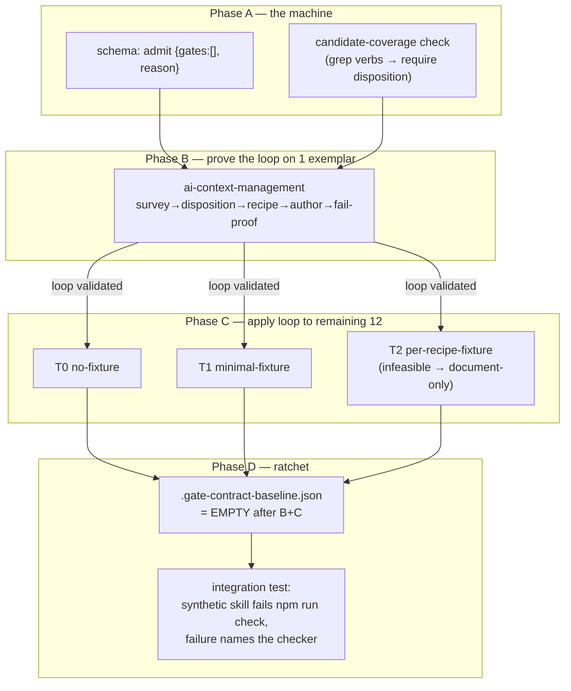

# Plan: Gate-contract authoring — bind the surveyed gates, ratchet the rest

- **Date**: 2026-07-20
- **Status**: Complete
- **Author**: Claude + Louis
- **Scope**: backend (contract JSON + schema + ratchet; no UI)

> **Target domain(s)**: `docs`, `install`, `skills-content`, `tests`
> ⚠ **Cross-domain work** — contracts colocate with skills, schema/oracle live
> in `scripts/lib/gate-honesty/`, the ratchet in `scripts/check-gate-contracts.mjs`,
> assertions in `tests/`.
> **Successor to** [`gate-contract-expansion.md`](./gate-contract-expansion.md)
> (Phases 1–2, shipped `c347ca9`). This is Phases 3–5, which that plan
> deliberately deferred until its §7a inventory + hermetic harness existed —
> both now do.

---

## 1. Context Summary

**Scope**: backend · stack `js-ts` (+ postgres) · no Python.

### What the parent plan already landed (do not redo)

- `scripts/lib/gate-honesty/oracles.mjs` — `buildHermeticEnv` (allowlist,
  fail-closed, `NODE_OPTIONS` dropped, TEMP/TMP/TMPDIR + git-config redirected),
  wired into the `cli-exit` adapter with a timeout + killed-child guard.
- The two verified defects closed (plan/ux-lock "ship gate"; the loader's
  `CHECKED`-counts-skipped bug).
- [`gate-contract-expansion-inventory.md`](./gate-contract-expansion-inventory.md)
  — survey rule, disposition vocabulary, band assignment for all 13 skills,
  every resolved `defect` row. Row-level fields fill **here**, per skill.

### The finding that shapes this plan

The registry is the binding constraint, and I verified it against the code, not
the survey. Of the four oracles:

- `cli-exit` — general: spawn a CLI, assert exit code + stderr. **The only reusable one.**
- `convergence-threshold` — hardwired to `CONVERGENCE_THRESHOLDS`/`evaluateConvergence` (audit-code's module, already contracted).
- `tiered-shadow-window` — hardwired to `summarize`/`windowProgress` (already contracted).
- `visual-gate-unverified` — hardwired to `gateUnverifiedReason` (visual-audit, already contracted).

And D2 (parent plan) forbids adding oracles. So **the executable-eligible set is
exactly the gates that reduce to a CLI exit code + stderr**: `nav-audit --gate`,
the `persona-test` consistency exit table, `ux-lock` verify's exit-0-on-failure,
`ai-context-management`'s exit map, and CLI usage-refusals (`click-test`/
`persona-test` bad-preset → fail). **Everything else is `document-only` under
D2** — numeric caps enforced by the agent (`audit-plan` Gemini ≤2), function-
identity claims (`personaFindingHash` single source), and negatives (`author-tier`
never routes) have no CLI exit to assert and no dedicated oracle.

This is not a disappointment to hide; it is the plan's spine (§2 D1). The value
splits three ways and the plan is honest about which is which:
1. **Executable** — a real behavioural binding. The prize, but a minority.
2. **Document-only** — forces an author to write down "judgement call, here's
   why", which is itself the anti-drift record. A first-class outcome.
3. **The ratchet** — makes every skill's gate-honesty status *explicit and
   non-silent*, which is the bulk of the durable value and does not depend on
   the executable/document ratio at all.

### Code Trace

- `scripts/lib/gate-honesty/schema.mjs:63-88` — `ExecutableGateSchema`
  discriminated on `oracle`; `GateContractSchema` requires `gates.min(1)` and is
  `.strict()` with **no** top-level `reason` → the empty-gates declaration needs
  a schema change (R3-H4, verified 2026-07-20).
- `scripts/lib/gate-honesty/schema.mjs:37` — `CLI_EXIT_SCENARIOS` closed enum,
  one value today → each new recipe is `enum entry + CLI_EXIT_RECIPES entry`.
- `scripts/lib/gate-honesty/schema.mjs:isApprovedStatedInSource` — `statedIn`
  legal ONLY as own `SKILL.md` or `AGENTS.md`.
- `scripts/check-gate-contracts.mjs:18-41` — the checker the ratchet extends;
  reached by `check → skills:check → check-gate-contracts.mjs` (verified in the
  parent plan §7c).
- `scripts/lib/skill-packaging.mjs:listSkillNames` — authoritative skill-root
  enumeration the baseline must reuse (R1-M1).
- `prepush-check.mjs` — the sandbox-worktree pattern the ratchet integration
  test borrows (R2-M2).

---

## 2. Proposed Architecture



### Key design decisions

**D1 — Author to honesty, not to coverage (#15).** The completion target is
"every enforcement-verb candidate has exactly one disposition", **not** "every
skill has an executable gate". A gate forced executable when it isn't is the
fake-check this whole suite exists to prevent. Expect a minority executable, a
majority document-only, and be explicit about the ratio in the final census.

**D2 — Respect the closed registry; measure the yield; escalate as a decision,
never a silent oracle add (#19, #20).** D2 from the parent plan holds: no oracle
is added here. But the plan must *count* the executable yield across all skills
and put it in front of the operator. If it is so low that the executable tier
adds little, the honest response is a **third, separately-scoped plan** to add
one or two well-designed general oracles (e.g. an "assert module exports
constant" generalisation of `convergence-threshold`) — decided on evidence, not
assumed now. This plan does not pre-authorise that; it surfaces the number.

**D3 — Sequence by FIXTURE COST, not by inventory band (#17).** The band
(gate-dense / thin) predicts gate *count*, not authoring *cost*. Cost is
dominated by the fixture a `cli-exit` recipe needs. Three tiers:
- **T0 — no fixture** (document-only gates; the empty-gates declarations). Free.
  Do first — they retire most of the inventory and de-risk the ratchet.
- **T1 — minimal fixture** (a CLI that refuses bad args / prints usage and exits
  non-zero with no project needed — `click-test`/`persona-test` preset
  validation, `ai-context-management` exit map). Cheap `cli-exit`.
- **T2 — full-project fixture** (`nav-audit --gate`, `ux-lock` verify,
  `persona-test` consistency — need `package.json`, source, generated
  artifacts). **Blocked on Phase A's fixture resolution.**

**D4 — The empty-gates declaration is a real contract, validated once (#1).**
`{version:1, skill, gates:[], reason}`. Schema change: allow `gates` empty **iff**
a non-empty top-level `reason` is present; reject `reason` when `gates` is
non-empty (so a real contract can't hide a hand-wave). One `validateGateContract`,
not a special case (R3-H4). **Mixed dispositions need no schema change** — a
contract already carries `executable` + `document-only` gates in one `gates[]`
(verified: `audit-code`'s live contract is 2+2), and a gate's `stated`+`statedIn`
already links it to the exact candidate line it disposes. So the only schema
work is the empty-gates rule above (audit R1-H1: the "add a per-candidate
`dispositions` collection" remedy is declined — it duplicates what `gates[]`
already expresses).

**D5 — Author one skill at a time; the plannable unit is the LOOP + one proof,
not 13 pre-filled contracts (audit R1-H1/H3/H4, and the parent plan's own R3
lesson one level down).** "Author 13 contracts" is inherently iterative
discovery: a candidate's disposition, and an executable recipe's feasibility,
cannot be pinned before that skill is actually worked with its fixture in hand.
A batch table that pre-decides them is dishonest — it did not decide them, it
guessed. So this plan delivers the **machine** (schema + per-skill loop +
coverage check + ratchet) and **proves it on one exemplar end-to-end**; the
remaining twelve are iterative applications of the validated loop, each its own
audit + commit. The per-skill loop:

1. **Survey** the skill's enforcement-verb candidates (mechanical, §7a rule).
2. **Disposition each**: `executable` | `document-only` | `not-a-gate`, all
   recorded **in the contract** — executable/document-only as `gates[]`,
   `not-a-gate` as `ignoredCandidates[]`. A candidate may not be dropped, and
   the store is the contract, never a plan (Gemini G1).
3. **For each executable**: prove the `cli-exit` recipe is *feasible* (a minimal
   `fixture()` reaches the exit decision under `buildHermeticEnv`) BEFORE writing
   the contract. Infeasible → `document-only` with the structural reason.
4. **Author** the `gate-contract.json`; **prove each recipe can FAIL** (§9).
5. **Audit + commit** that one skill.

**D6 — "Every candidate dispositioned" must be CHECKED, but the store is the
CONTRACT and the scope is the DIFF (audit R1-H1; Gemini G1/G2/G3).** A hand-
maintained catalog drifts precisely as the prose did — so it must be checked.
Three design corrections the Gemini gate forced, all load-bearing:

- **The disposition store is the contract, never a plan (Gemini G1).** An
  earlier draft had the CI check parse
  `docs/plans/gate-contract-expansion-inventory.md` at pre-push time — coupling a
  live gate to an immutable historical plan, which breaks the moment the plan is
  edited or archived. The `not-a-gate` list moves **into `gate-contract.json`**
  as an optional `ignoredCandidates: [{ line, reason }]` array (Zod-validated,
  colocated, synced-exempt like the rest of the contract). The check reads only
  contracts; a plan is never a runtime input.
- **The check is diff-scoped, not corpus-wide (Gemini G3).** A bare verb grep
  over every SKILL.md every push is unusable toil, and a noisy gate gets
  `--no-verify`'d — the failure mode the repo documents. So it runs on the
  **changed** SKILL.md surface only, exactly like `nav-audit`/`visual-audit`/
  `cli:flags` drift gates: an enforcement-verb line that is **new or modified in
  the diff** must be dispositioned; the existing corpus is dispositioned once
  during its skill's Phase C authoring and never re-litigated. Low toil, and it
  still catches the case that bit us — an unformalised claim in *new* prose.
- **Match direction: `stated` ⊂ line (Gemini G2).** `stated` is a snippet *of*
  the SKILL.md line, so a candidate is "covered" iff some gate's `stated` is a
  substring of the candidate line, OR the line is in the contract's
  `ignoredCandidates`. (An earlier draft had this reversed.)
- **A line with TWO claims needs TWO dispositions (Gemini-r2 G2).** Substring
  match alone lets a second enforcement claim added to an already-contracted
  line ride in on the first gate's `stated` ("must exit 1" → "must exit 1 and
  never delete files"). So coverage requires the count of distinct covering
  `stated`/`ignoredCandidates` matches on a line to equal its enforcement-verb
  hit count — a new claim on an edited line is uncovered until it gets its own
  disposition. This is what makes the diff-scoped check catch *edits*, not just
  new lines.

This is the right-sized form — coverage is verified against the contract's own
Zod-validated data, with no parallel datastore (D4) and no plan-parsing.

### Right-sizing gate

- **Band-aid**: author only the cheap T0/T1 gates, skip Phase C. Leaves the
  failure class alive — a new skill still escapes silently, which is the whole
  point of the parent finding.
- **Over-engineered**: extend the registry with a general oracle per gate shape
  so everything is executable, and generate SKILL.md prose from contracts (the
  v1-doc's own deferred idea, touching `skills:regenerate` — highest blast
  radius). Manufactures machinery D2 forbids and contracts for judgement calls.
- **Chosen**: author what the 4 oracles honestly fit, document-only the rest
  with reasons, ship the ratchet + baseline, and **measure** the executable
  yield so a registry-extension plan is an evidence-based decision, not a reflex.
  **Current requirement**: the parent plan's ratchet is undelivered and a new
  skill escapes silently today; that is the concrete thing Phase C fixes.

---

## 5. Sustainability Notes

- **Assumption that will change**: the executable yield is low *today* because
  the registry is small. If a registry-extension plan lands, this plan's
  document-only entries become re-authoring candidates — so each `document-only`
  `reason` should say *why no oracle fits* (structural), not just *that* none
  does, so a future reader can tell which are re-authorable and which are
  genuinely un-mechanisable judgement.
- **Seam preserved**: contracts are data; the deferred SKILL.md-generation-from-
  contract idea stays available and is neither built nor blocked here.
- **The ratchet is the durable artifact.** Its value is independent of how many
  gates end up executable — it converts silence into an explicit, reviewable
  declaration for every current and future skill.

---

## 7. File-Level Plan

### Phase A — the machine (schema + coverage check; blocks B, C, D)

| File | Intent | Purpose |
|---|---|---|
| `scripts/lib/gate-honesty/schema.mjs` | modify | admit `{gates:[], reason}` (empty iff `reason` present; `reason` rejected when `gates` non-empty); add optional `ignoredCandidates: [{line, reason}]` (the `not-a-gate` disposition store, Gemini G1). Mixed dispositions already work (D4) |
| `scripts/check-gate-contracts.mjs` | modify | the **diff-scoped candidate-coverage check** (D6): for each changed SKILL.md, every new/modified enforcement-verb line must be covered by a gate `stated` (⊂ line) or the contract's `ignoredCandidates`. **Diff bounds come from the existing `push-range.mjs` resolver** (Gemini-r2 G3) — the same one the pre-push sandbox uses; the check does not re-infer a base from working-tree state |
| `scripts/lib/gate-honesty/verb-pattern.mjs` | create | the frozen enforcement-verb pattern as **code, not a plan** (one source of truth for "what is a candidate"; Gemini G1 — no plan is a runtime input) |
| `tests/gate-honesty.test.mjs` | modify | schema tests: empty-gates accept, `gates:[]`-without-reason reject, non-empty-with-reason reject; coverage-check unit tests (undispositioned candidate fails; catalog-covered passes) |

### Phase B — prove the loop on ONE exemplar (D5)

Pick **`ai-context-management`** — a T1 skill with a real `cli-exit` candidate
(the `0/1/2` exit map) AND at least one document-only candidate, so the exemplar
exercises the whole loop: survey → disposition → recipe feasibility → author →
recipe-can-fail → coverage-check-passes.

| File | Intent | Purpose |
|---|---|---|
| `docs/plans/gate-contract-expansion-inventory.md` | modify | fill the `ai-context-management` candidate catalog: every verb hit, one disposition |
| `scripts/lib/gate-honesty/oracles.mjs` | modify | one `CLI_EXIT_RECIPES` entry + `CLI_EXIT_SCENARIOS` value for the exit-map gate; minimal `fixture()`, `buildHermeticEnv` |
| `skills/ai-context-management/gate-contract.json` | create | the exemplar contract (executable + document-only) |
| `tests/gate-honesty.test.mjs` | modify | pin the new census row; prove the recipe can FAIL (wrong `expectExit`) |

**Gate**: the exemplar must pass `gates:check` + `gate-honesty.test.mjs` + the
coverage check before Phase C authors any other skill. If the loop can't produce
one honest contract end-to-end, the remaining twelve are not yet specifiable.

### Phase C — apply the loop to the remaining 12 (iterative, T0 → T2)

**Not a batch table** — each skill is one application of the D5 loop with its own
audit + commit. Order by fixture cost (D3), and each row's dispositions are
*decided during authoring*, not pre-guessed here:

- **T0 (no fixture)**: `explain`, `skills` → `{gates:[], reason}`; `audit-plan`,
  `security-strategy` → mostly document-only (agent-enforced caps, redaction).
- **T1 (minimal fixture)**: `brainstorm` (names its own test already),
  `click-test` (verdict/threshold — **disposition decided at authoring: cli-exit
  if a minimal fixture reaches the verdict, else document-only; NO unit-seam
  import — that is not a registered oracle**, audit R1-H2).
- **T2 (per-recipe minimal fixture, feasibility-gated)**: `nav-audit` (exit
  table — one scenario per code, R3-H1), `persona-test` (consistency exit table
  — one scenario each), `ux-lock` (verify exit-0; `--strict-selectors`;
  **statedIn** restatement in SKILL.md if the reference-file gate goes
  executable, else document-only — R3-H5), `cycle`, `ship`. A T2 gate whose
  recipe proves infeasible under the minimal-fixture rule (§7a) becomes
  document-only — that is the expected, honest outcome, not a failure.

Files touched per skill: its `gate-contract.json` (create), `oracles.mjs`
(modify, only if it yields an executable recipe), `tests/gate-honesty.test.mjs`
(modify, census + recipe-can-fail), and its SKILL.md (modify, only for a
`statedIn` restatement).

### Phase D — ratchet (baseline converges to EMPTY)

| File | Intent | Purpose |
|---|---|---|
| `.gate-contract-baseline.json` | create | The declared-exception mechanism. **Empty is the ideal** — reached when B+C author every skill. A skill deliberately deferred (the "cut the T2 tail" option, §8) is **not** dropped: it lands as a baseline entry with a `reason`, so "uncontracted" is always either impossible or explicitly declared (resolving audit R2-H2 — the two states are consistent, not contradictory). Shape in §7b |
| `scripts/check-gate-contracts.mjs` | modify | see §7b for the full checker contract |
| `tests/gate-contract-ratchet.test.mjs` | create | unit: the ratchet's set logic + the checker-contract edge cases (§7b). **Integration: a synthetic skill added in a throwaway worktree fails `npm run check`, and the failure names the gate-contract checker** (R2-M2) |
| `docs/reference/gate-honesty.md` | modify | new census (incl. the executable:document yield, D2), the empty-gates declaration, the coverage check, the ratchet + empty-baseline lifecycle |

**Close-out (not a phase)**: `npm run gates:check && npm run skills:regenerate && npm run check`.
`gate-contract.json` is a `SKILL_LOCAL_FILE` — never packaged, never synced — so
`skills:regenerate` does **not** emit it into `.claude/skills/**` and produces no
diff for it (audit R1-L1). The only regeneration a SKILL.md `statedIn`
restatement can touch is `skills.manifest.json`'s content hash; that regen is
byte-deterministic and is staged with the SKILL.md edit. If `skills:regenerate`
shows any *other* changed file, stop — an unexpected diff means the edit reached
a surface it shouldn't.

### 7b. The ratchet checker contract (audit R1-M2)

The set rule ("skill root without a contract fails") is not enough on its own —
the checker's input/output contract must be specified or two implementers build
incompatible ones. All of the following are **failures**, emitted in
deterministic skill-root order, never silent passes:

- **Skill discovery**: `listSkillNames` is the sole authority; a root it returns
  with no `gate-contract.json` and no baseline entry → fail.
- **Baseline integrity**: unreadable/malformed baseline JSON → fail (never
  "treat as empty"). A baseline entry naming a root `listSkillNames` no longer
  returns → fail (stale exemption, R1-M1). Duplicate/normalisation-colliding
  entries → fail. **A baseline entry for a skill that ALSO has a
  `gate-contract.json` → fail** (Gemini-r2 G1): once a deferred skill is
  contracted, its exemption must be removed, or the exemption silently outlives
  its purpose — the same stale-declaration rot in the other direction.
- **Contract↔directory identity**: a `gate-contract.json` whose `skill` field
  disagrees with its directory name → fail (already a schema concern; the
  checker enforces it at enumeration too).
- **Unreadable/malformed contract** discovered during enumeration → fail with
  the path, never skipped.
- **Symlinks**: a symlinked skill root or contract file is rejected
  (fail-closed, mirroring the `statedIn` realpath policy).
- **Coverage check** (D6): diff-scoped; a new/modified enforcement-verb line in
  a changed SKILL.md that no gate `stated` (⊂ line) or `ignoredCandidates` entry
  covers → fail, naming the line. Reads contracts only — never a plan.

Deterministic ordering matters because the failure list is read by a human
fixing them; non-deterministic output makes a diff between two runs look like a
change.

**Baseline shape** (audit R2-M1) — minimal, Zod-validated by the same
`GateContractBaselineSchema`:
```json
{ "version": 1, "exemptions": [ { "skill": "<root>", "reason": "<why, non-empty>" } ] }
```
`exemptions: []` is the norm and the release target. `skill` must be a
`listSkillNames` root (canonicalised the same way `check-gate-contracts` lists
them — one normaliser, no second grammar); duplicate `skill` values → fail.

**Right-sizing the disposition model** (audit R2-H1/M3, decided not deferred).
The audit pushed for a versioned, Zod-validated candidate catalog with
deterministic IDs, source spans, and per-candidate evidence fields. **Declined
as over-built** — it duplicates what the contract already carries. The
coverage check (D6) needs only two things, both of which already exist or are
cheap:
- **"What is a candidate"** — the enforcement-verb pattern, frozen in
  `verb-pattern.mjs` (code, not a plan — Gemini G1). No per-candidate ID: a
  candidate *is* its SKILL.md line.
- **"Is it dispositioned"** — some gate's `stated` is a substring of the
  candidate line (`stated` ⊂ line, Gemini G2), OR the line is in the contract's
  `ignoredCandidates`. Substring match is exactly the link a stable-ID scheme
  would rebuild by hand.

The **`not-a-gate` vs `document-only` rubric** (R2-M3), one line each:
`not-a-gate` = the verb is descriptive or an instruction to the agent with no
enforcement claim (e.g. "always cite sources"); `document-only` = a real
enforcement claim with no mechanical oracle under the closed registry (e.g. a
numeric cap the agent honours). A downgraded executable candidate records its
**live-service blocker** (§7a) as the `reason` — that is the retained evidence,
no separate evidence datastore.

### 7a. Resolving the two D1a fixture contradictions (Phase C gate for T2)

Both were flagged by the parent plan's code-audit and block every T2 recipe.

First, a correction the audit forced (R2-H3). An earlier draft said "a recipe
that needs installed deps → document-only." **That is unsound and is
withdrawn.** The recipe entrypoint IS the real repo CLI file, launched by
absolute path; Node resolves *its* imports from the **repo's** `node_modules` by
walking up from the script's own location — not from the fixture cwd. So the CLI
gets its dependencies correctly and that is *desired* (same-module identity is
the suite's whole premise). Needing deps is normal, not a disqualifier.

The **only** things the fixture must supply are the CLI's *input reads* — the
files it opens relative to cwd, and the env it consults — and those are exactly
what `buildHermeticEnv` + a minimal `fixture(dir)` already control. So:

- **No `node_modules` symlink** (the realpath-escape contradiction never
  arises — deps come from the repo, not the fixture).
- **No working-tree copy, no `.gitignore` question** — the recipe's
  `fixture(dir)` writes the *minimal declared input files* the CLI reads (as the
  existing `visual-static-gate-refusal` recipe writes `visual-contract.json`).
- **The real feasibility line** (replacing the withdrawn deps rule): a gate is
  executable iff its exit decision is reachable from a minimal declared fixture
  under `buildHermeticEnv` **without a live network / provider / DB call**. A
  gate that *cannot* reach its decision without one of those is `document-only` —
  and the recipe records the specific blocker (which live dependency), not a
  vague "too hard". Needing files or deps is never the blocker; needing a live
  external *service* is.

> This *narrows* the prerequisites: the schema change (Phase A) is the only hard
> infra prerequisite; the "fixture harness" reduces to per-recipe minimal
> `fixture()` functions authored in B/C, not separate infrastructure.

---

## 8. Risk & Trade-off Register

- **Low executable yield could make Phase C feel like paperwork.** Mitigated by
  D1/D2: the document-only entries are the anti-drift record, and the ratchet
  (Phase D) is the durable win regardless. If the yield is genuinely too low to
  justify the per-skill authoring, **cut Phase C's T2 tail, keep Phase D** — the
  ratchet works over whatever contracts exist plus the baseline.
- **A recipe that passes against the wrong condition.** Every new recipe must be
  proven able to FAIL (assert once against a wrong `expectExit`) — an untested
  green recipe is the exact defect. Hard requirement in §9, not optional.
- **`statedIn` forces SKILL.md edits.** Any reference-file gate made executable
  needs its claim restated in the owning SKILL.md (an edit that must appear in
  that skill's Phase C row) or it stays document-only. Never widen the policy.
- **Multi-outcome `stated` (R3-H1).** A gate quoting an N-outcome table must be
  N scenarios or a narrowed quote. The `nav-audit` and `persona-test` exit
  tables are the live instances.
- **Ratchet integration test is expensive (~100s nested `check`).** Per parent
  R3-M1 it must **not** be opt-in behind a strictness flag — that reopens the
  substitution it exists to prevent. If cost is unacceptable, make it cheaper or
  state the chain is unproven; never silently downgrade it.
- **Baseline drift (R1-M1).** Empty after B+C; computed via `listSkillNames`; a
  stale entry (skill root gone) is a failure, not a silent pass (§7b).

### Carried forward — required inputs, all from the parent's audit
- R3-H1 — one scenario per exit outcome / narrowed `stated`.
- R3-H4 — `explain`/`skills` get `{gates:[], reason}`; schema change (Phase A).
- R3-H5 / R1-M3 — `statedIn` restatements listed in the phase that needs them.
- R2-M2 — ratchet integration fixture: worktree, names the checker, no opt-out.
- R1-M1 — baseline lifecycle: post-authoring, `listSkillNames`, rename=failure.

### Explicitly out of scope
- **Adding any oracle** (D2). If the yield warrants it, that is a third plan.
- **SKILL.md generation from contracts** — untouched, unblocked, not built.
- **Re-litigating the two existing contracts** (audit-code, visual-audit).

---

## 9. Testing Strategy

- **Schema (Phase A)**: `{gates:[], reason}` accepted; `gates:[]` without
  `reason` rejected; non-empty `gates` **with** `reason` rejected. Both accept
  and both reject paths — a one-sided test would let the fake-check back in.
- **Coverage check (Phase A, D6)**: diff-scoped. A new/modified enforcement-verb
  line with no covering gate `stated` (⊂ line) or `ignoredCandidates` entry
  fails and names the line; a covered line passes; an unchanged corpus line is
  not re-litigated. The `verb-pattern.mjs` pattern is pinned by its own test so
  "what counts as a candidate" cannot drift silently. Reads contracts only.
- **Exemplar gate (Phase B)**: `ai-context-management` passes `gates:check` +
  `gate-honesty.test.mjs` + the coverage check as a single green bar — the proof
  the loop produces one honest contract before Phase C authors any other.
- **Each new `cli-exit` recipe (Phase B/C)**: runs green against the real CLI
  under `buildHermeticEnv`, AND is proven able to fail (assert once against a
  wrong `expectExit`). An untested-green recipe is the defect this suite catches.
- **Census pinning**: `tests/gate-honesty.test.mjs` pins the exact contracted
  set + the executable/document/env-skipped counts; every phase updates it
  deliberately.
- **`stated`-verbatim drift**: a contract whose `stated` no longer appears in
  `statedIn` must fail loudly — the prose-drift detector.
- **Ratchet (Phase D)**: unit — net-new-without-declaration fails; explicit
  `{gates:[], reason}` passes; the empty baseline stays green; plus every §7b
  checker edge case (malformed baseline, skill≠dir, duplicate, symlink, stale
  entry). **Integration** (audit R2-M2): the synthetic skill must be an
  *otherwise-valid* surface — regenerate every derived artifact in the worktree
  first (`skills:regenerate`, index) so the ONLY thing wrong is the missing
  contract. Assert the run fails AND the failure text names the gate-contract
  checker — otherwise a manifest/reference/packaging failure firing *before* the
  ratchet would pass the test without proving the ratchet is reached at all.
- **Empirical yield check (D2)**: the census output records the
  executable:document ratio so the registry-extension decision is data-backed.

---

## Audit trail

_(to be appended by `/audit-plan`)_

| Round | Reviewer | Verdict | Findings | Outcome |
|---|---|---|---|---|
| R1 | GPT (`--mode plan`) | SIGNIFICANT_GAPS | H:4 M:2 L:1 | restructured to per-skill loop + exemplar; H1 partial-accept (completeness→coverage check; declined the dispositions-collection remedy — mixed dispositions already ship) |
| R2 | GPT | NEEDS_REVISION | H:3 M:3 | H3 real soundness bug fixed (deps≠document-only); H2 baseline/cut-tail contradiction reconciled; H1/M1/M3 rigor-pressure → right-sized (declined the Zod candidate-catalog) |
| G1 | Gemini `gemini-pro-latest` | CONCERNS_REMAINING (coherence Adequate) | 3 + 1 wrongly-dismissed | all fixed: disposition store moved plan→contract (`ignoredCandidates`); `stated`⊂line direction; diff-scoped to kill toil |
| G2 | Gemini `gemini-pro-latest` | CONCERNS (coherence **Strong**) | 3, all MEDIUM | folded in: baseline+contract collision, two-claims-two-dispositions, `push-range.mjs` diff base — gate closed at cap |

**GPT stop decision (after R2).** Cap is 3 unless HIGH actively dropping; it went
4→3 (weak). More telling, R2's findings turned to rigor pressure — "add a
versioned Zod candidate model with stable IDs and evidence fields." Two were
genuine design bugs (H2 contradiction, H3 soundness) and were fixed; the rest
were formalism the coverage check does not need, so I right-sized (declined the
model, defined the cheap minimum) and went to the mandatory Gemini gate rather
than a GPT R3 that would only escalate the formalism.

**Gemini stop decision (after G2).** Cap is 2. G2 returned three MEDIUMs, all
implementation-completeness (a baseline edge case, a coverage refinement, a
diff-base wiring), coherence rose Adequate→Strong, zero wrongly-dismissed. Per
the cap rule, implementation nits fold into the plan and hand off to `/cycle`'s
code audit — which verifies them against real code — rather than a third round.
All three captured above.

**Highest-value findings.** GPT-R2-H3 (a `cli-exit` recipe needing deps is *not*
a document-only signal — Node resolves the CLI's deps from the repo regardless
of cwd; the real line is a live network/provider/DB call) and Gemini-G1 (parsing
an immutable plan doc as a live CI data source — the disposition store belongs
in the Zod-validated contract, which also vindicated the H1 concern I'd partly
overridden). Both reshaped the design from the reviewer's side, not the
author's.

---

## Implementation Log

### 2026-07-20 — Phase A (schema) + Phase B (exemplar), via `/cycle --autonomous`

**Landed:**
- **Phase A schema** (`scripts/lib/gate-honesty/schema.mjs`): `gates` may be empty
  iff a non-empty top-level `reason` is present; `reason` rejected when `gates`
  non-empty; optional `ignoredCandidates[]` (the `not-a-gate` store, Gemini G1).
  5 schema paths tested.
- **Phase B exemplar** (`skills/ai-context-management/gate-contract.json`): two
  executable `cli-exit` gates (one scenario per exit outcome, R3-H1) running the
  real `check-context-drift.mjs` hermetically — feasibility proven before
  authoring (exit 1 for missing-import, 0 aligned) — plus one document-only gate.
  Census: contracted 2→3, executable 5→7, document-only 4→5, uncontracted 13→12.

**Deliberately deferred to a follow-on cycle** (right-sizing, not omission):
- **D6 coverage check + `verb-pattern.mjs`** — the diff-scoped candidate-coverage
  enforcement is the largest, most independently-auditable infra piece; the
  exemplar proves the per-skill loop end-to-end without it (the check gates
  *future* authoring, it does not validate the exemplar). Building it in the
  same pass would rush a component the whole initiative is about getting right.
- **Phase C** (the remaining 12 skills) and **Phase D** (ratchet) — the plan
  defines these as iterative, each its own audit + commit; Phase D's empty
  baseline requires all skills contracted first.

Status stays **Draft** — Phases A/B partial-land; C/D and the D6 check remain.

### 2026-07-21 — D6 candidate-coverage check (rest of Phase A)

**Landed** — Phase A is now complete (schema + coverage check + verb-pattern):
- `scripts/lib/gate-honesty/verb-pattern.mjs` — the frozen enforcement-verb set
  (pinned by test) + a PURE coverage core (`lineIsCovered`,
  `findUndispositionedCandidates`), testable without git.
- `scripts/check-gate-contracts.mjs` — diff-scoped shell: `resolvePushRange`
  (Gemini-r2 G3) → `git diff` changed SKILL.md `+` lines →
  `parseChangedSkillCandidates` → coverage decision, folded into the same
  failure gate. Made import-safe (guarded `main()`), so its export is testable.

**Two implementation-time refinements, recorded (not silent):**
- **Span coverage, not the plan's count formulation.** The plan wrote Gemini-G2
  as "#matches == #verb-hits"; that overcounts a single claim with two verbs
  ("must exit 1"). Implemented as SPAN coverage — every verb position must fall
  inside some covering `stated` span — which realises the same "a second claim
  is uncovered" intent without the overcount. Proven by test.
- **D6 scopes to CONTRACTED skills only.** The plan implied every changed
  candidate line needs a disposition; but an uncontracted skill has no
  dispositions yet (that is Phase C), so firing on it would block routine edits
  to the 12 not-yet-contracted skills. D6 checks only skills that HAVE a
  contract; the Phase-D ratchet forces the rest to be contracted, after which
  D6 keeps them current. Composes correctly; no premature toil.

**Proven to FIRE end-to-end**, not just unit-green: a committed undispositioned
enforcement line in the contracted exemplar → `check-gate-contracts` exits 1
naming the exact line; removing/dispositioning it → clean. 31 gate-honesty
tests. Honest degradation: an unresolvable range is reported + skipped, never
read as clean.

**Hardened via review, both silent-pass holes closed:**
- **Fail-closed under enforcement (audit H1/M2/M3).** An unresolvable range or a
  failed `git diff` now hard-fails when `AUDIT_PUSH_RANGE_REQUIRED=1` (the flag
  the pre-push sandbox sets alongside a base), and only warn-skips in unforced
  local runs — a diff gate must not go green having read nothing.
- **Config-independent diff format (Gemini G1).** The git invocation pins
  `-c diff.noprefix=false`, `--src-prefix=a/ --dst-prefix=b/`, `--no-ext-diff`,
  so a developer's `diff.noprefix=true` cannot silently defeat the `b/`-prefix
  parser and pass the gate — proven to still fire under a forced noprefix config.

**Still remaining**: Phase C (12 skills, iterative) and Phase D (ratchet +
empty baseline).

### 2026-07-21 — Phase C increment 1: explain + skills (empty-gates)

The first two Phase C skills, both `{gates:[], reason}` empty declarations —
proving the schema path with real contracts. Uncontracted 12 → 10; contracted
3 → 5.

**A finding worth recording**: the plan's human survey called these "no stated
gates", but the MECHANICAL D6 verb pattern flags exit-behaviours
(`explain:41`, `skills:66`) and descriptive matches ("detail **block**", a
table row, a frontmatter-doc "must"). Dispositioned per the mechanical pattern,
not the survey: each flagged line is agent behaviour the model enacts (an
instruction to exit-with-a-message, or how it handles a helper's exit) or plain
description — none is a mechanical exit/threshold/refusal a `cli-exit` recipe
can bind. So the empty-gates `reason` NAMES those claims and why none is a gate,
rather than asserting a bare "no gates". D6 is diff-scoped, so these existing
lines are not re-litigated unless edited.

Audit: GPT H:2 M:2 → both HIGH deferred/dismissed (Phase-D ratchet test; a
re-litigation of the audited D1/D2 document-only decision), M1/M2 recurring
false positives. **Gemini final gate: APPROVE** (0 new, 0 wrongly-dismissed) —
the independent reviewer confirmed the contracts and the H2 dismissal.

**Remaining Phase C (10 skills)**: audit-plan, brainstorm, click-test, cycle,
nav-audit, persona-test, plan, security-strategy, ship, ux-lock.

### 2026-07-21 — Phase C increment 2: audit-plan + security-strategy (document-only)

Two mostly-document-only skills. Uncontracted 10 → 8; document-only gates
5 → 12; contracted 5 → 7.

- **audit-plan** (3 document-only): the GPT/Gemini round caps, `--mode plan`
  required, and the mandatory-final-gate/`FINAL_GATE_SKIPPED` ladder — all
  enforced by the MODEL following the skill (round caps live in the agent's
  judgement; the flag is an instruction; the sentinel is agent output), none a
  CLI exit a `cli-exit` recipe can bind. Feasibility-checked: no executable
  candidate.
- **security-strategy** (4 document-only): the write-gated-on-round-trip-parse
  (agent-orchestrated — the model calls `parseSecurityStrategy()` then gates its
  own `atomicWriteFileSync`; `security:refresh`'s REFUSE runs *after*),
  never-include-real-secrets, never-inflate-threat-model, and the
  on-demand-non-blocking negative. Verified the round-trip parse is
  agent-orchestrated, not a single-CLI exit, before defaulting to document-only.

Audit: GPT H:2 (both deferred — Phase-D ratchet test; Phase C incomplete, this
being a partial step), M1 re-raised document-only-unverified (dismissed per D1,
as Gemini approved last increment), L1 false-positive. **Gemini: APPROVE**
(coherence Strong) + one LOW (G1: an `||` mutual-exclusivity assertion that
should be XOR — fixed).

**Remaining Phase C (8 skills)**: brainstorm, click-test, cycle, nav-audit,
persona-test, plan, ship, ux-lock.

### 2026-07-21 — Phase C increment 3: brainstorm + click-test (T1)

Uncontracted 8 → 6; executable 7 → 8; document-only 12 → 18; contracted 7 → 9.

- **brainstorm** — the FIRST executable gate beyond the exemplar: `argv-error-exit`
  (cli-exit) runs the real `brainstorm-round.mjs --bogus-flag` → exit 1 with an
  "Unknown flag" stderr. The stderr match is load-bearing: it proves the exit
  came from the ARGV validator, not a wrong-reason failure, so the gate asserts
  exactly the "Only exit 1 means an argv error" claim. Needs no providers (argv
  is validated first; keys stripped by buildHermeticEnv). Plus two document-only:
  the artifact sensitive-path refusal (recorded in JSON at exit 0 — not an
  exit-code signal — with its own named contract test) and the exit-0-on-provider-
  failure complement (not hermetically deterministic without a live provider).
- **click-test** — all 4 document-only. Verified it has NO CLI entry point
  (no scripts/click-test*.mjs); it drives a browser via Playwright MCP, so its
  verdict precedence, arg refusals, capability abort, and scanner-error caps are
  agent/scanner-internal — no exit code a cli-exit recipe can assert.

Audit: GPT H:2 both deferred (Phase-D ratchet test + empty baseline), M1/M2/M3/M5
dismissed (false positive / pre-existing D6+schema not exploited here / not my
file), **M4 fixed** (tieredEligibleCount/legacyEligibleCount now int + nonnegative).
**Gemini: APPROVE** (0 new, 0 wrongly-dismissed).

**Remaining Phase C (6 skills)**: cycle, nav-audit, persona-test, plan, ship,
ux-lock — the T2 tier, where the richest executable candidates live (nav-audit's
`--gate` exit table, persona-test's consistency exit codes).

### 2026-07-21 — Phase C increment 4: nav-audit + persona-test (T2, executable-rich)

Uncontracted 6 → 4; executable 8 → 11; document-only 18 → 22; contracted 9 → 11.

- **nav-audit** — 2 executable: `exit-2-tool-error` (an invalid nav-contract.json
  → exit 2 + "present but invalid") and `bootstrap-refuses-to-clobber`
  (--bootstrap over an existing contract → exit 2 + "refusing to overwrite").
  Both fire before any git/source read, so the fixtures are bare files (verified
  no git init needed). The `--gate` exit-1-on-regression is document-only — it
  needs an observed graph + contract + a real diff-scoped regression, beyond a
  minimal fixture.
- **persona-test** — 1 executable: `consistency-fatal-rig-exit-3` (a missing
  surfaces.json manifest → exit 3 + "fatal-rig", hermetic, no browser reached).
  The other consistency exit codes (2/4/6) need a live browser or an injected
  I/O failure → document-only. Plus document-only for the personaFindingHash
  single-source and no-typed-input-persisted (store-boundary) claims.

Executable yield so far (D2 measurement): **11 gates across 6 skills** — and the
pattern holds: executable clusters on skills with a real CLI (nav-audit,
persona-test, brainstorm, ai-context-management), document-only on the
agent/MCP-driven ones.

Audit: GPT H:3 — H1/H2/M1 deferred (Phase D ratchet+baseline; partial Phase C),
**H3 fixed** (the tieredEligible/legacyEligible pair now both-or-neither),
M2/M3/M4/M5/L1 dismissed (false-positive verbatim-check-exists; PATH required by
design; cohesion nit; not-my-file; by-design parallel registries).
**Gemini: APPROVE** (0 new, 0 wrongly-dismissed).

**Remaining Phase C (4 skills)**: cycle, plan, ship, ux-lock.

### 2026-07-21 — Phase C increment 5 (FINAL): cycle, plan, ship, ux-lock — PHASE C COMPLETE

The last 4 skills. **All 15 skills are now contracted; uncontracted = (none).**
Executable 11 → 12; document-only 22 → 35.

- **ux-lock** — 1 executable: `strict-selectors-fails-the-run` (a spec with an
  unmarked structural selector under `--strict-selectors` → exit 6; the
  selector-policy lint is PRE-RUN so no browser is reached). Plus document-only
  for verify-is-a-report-not-a-blocker (needs a live app) and the status rubric.
- **ship** — 3 document-only. The `--gate passed` refusal is real (observed live
  this session) but its exit code is git+evidence-state-dependent (1 vs 2), so a
  hermetic recipe cannot bind it deterministically — document-only, verified by
  ship-commit's own provenance tests. Plus Category-A-never-staged and the
  non-blocking-gate negatives.
- **cycle** — 4 document-only. An orchestrator with no CLI: preview-gate [HALT],
  fix-gate convergence (the SAME predicate audit-code's contract already binds),
  author-tier-never-routes, and mandatory-Gemini-gate are all enacted by
  orchestration, not a cycle exit code.
- **plan** — 4 document-only. An authoring skill with no CLI: Gate-1 triggers,
  never-a-lone-Phase-1, warnings-never-block, and the corrected §10-is-graded-
  not-gated claim are all model-enacted while authoring.

**Final executable yield (D2 measurement): 12 executable gates across 7 skills;
35 document-only across all 15.** The thesis held cleanly: executable clusters
on skills with a real CLI (ai-context-management, brainstorm, nav-audit,
persona-test, ux-lock, audit-code, visual-audit); everything else — the
orchestrator (cycle), authoring skills (plan), agent/MCP-driven skills
(click-test), and agent-enforced caps/writes (audit-plan, security-strategy,
ship) — is honestly document-only. No gate was forced executable.

Audit: GPT H:2 both deferred to **Phase D** (the empty baseline + ratchet test,
now UNBLOCKED since all skills are contracted — the next and final increment),
the rest dismissed (false-positive; PATH-required; cohesion nit; click-test has
no CLI so D5-disposition-at-authoring applies). **Gemini: APPROVE**.

**Remaining: Phase D only** — the ratchet + empty `.gate-contract-baseline.json`
+ the synthetic-skill integration test.

### 2026-07-21 — Phase D (ratchet + baseline + integration test) — the capstone

**Landed — the initiative is complete:**
- **`.gate-contract-baseline.json`** (`{version:1, exemptions:[]}`, committed) —
  empty in the release state, the declared-exception mechanism for a future
  deferred skill. `GateContractBaselineSchema` (strict; kebab-case `skill`,
  non-empty `reason`) added to `schema.mjs`.
- **`scripts/lib/gate-honesty/ratchet.mjs`** — the PURE `computeRatchetDivergences`
  implementing every §7b set rule (declare-or-fail keyed on file *absence* so a
  broken contract is not double-reported; contract↔directory identity; baseline
  integrity — stale/duplicate/now-contracted), emitted in deterministic
  skill-root order.
- **`checkRatchet` shell** in `check-gate-contracts.mjs` — fail-closed fs: symlink
  rejection on the baseline + every present `gate-contract.json`; malformed-JSON /
  schema-invalid baseline fails before the set rules; absent baseline → empty
  exemptions (still strict). Wired into `main()` **before** the D6 coverage check,
  running regardless of loader divergences. The loader now returns
  `{skillNames, contractedByDir}` so identity is checkable.
- **`tests/gate-contract-ratchet.test.mjs`** — 25 tests: the pure set rules,
  the fs shell (baseline load + symlink), the baseline schema, a non-opt-in
  wiring assertion (`check` → `skills:check` → `check-gate-contracts.mjs`), and
  the **worktree integration test** (R2-M2): the REAL checker binary run against
  an otherwise-valid synthetic uncontracted skill in a throwaway git worktree
  (node_modules junctioned, live SUT files overlaid) FAILS and names the skill;
  a baseline exemption then clears it.

**Two implementation-time decisions, recorded:**
- **Rule 1 keys on file ABSENCE, not contract validity.** A present-but-broken
  contract is already a loader divergence; re-flagging it in the ratchet would
  double-report. So `computeRatchetDivergences` treats "has a contract file" as
  declared even when the file is invalid, and the loader's divergence carries it.
- **The integration test overlays the live SUT files onto the HEAD worktree**
  rather than trusting whatever HEAD carries — so it exercises the current
  working-tree ratchet whether or not Phase D is committed yet (robust for local
  verification; a no-op once committed).

Status → **Complete.** All 15 skills contracted; the ratchet keeps them so.
