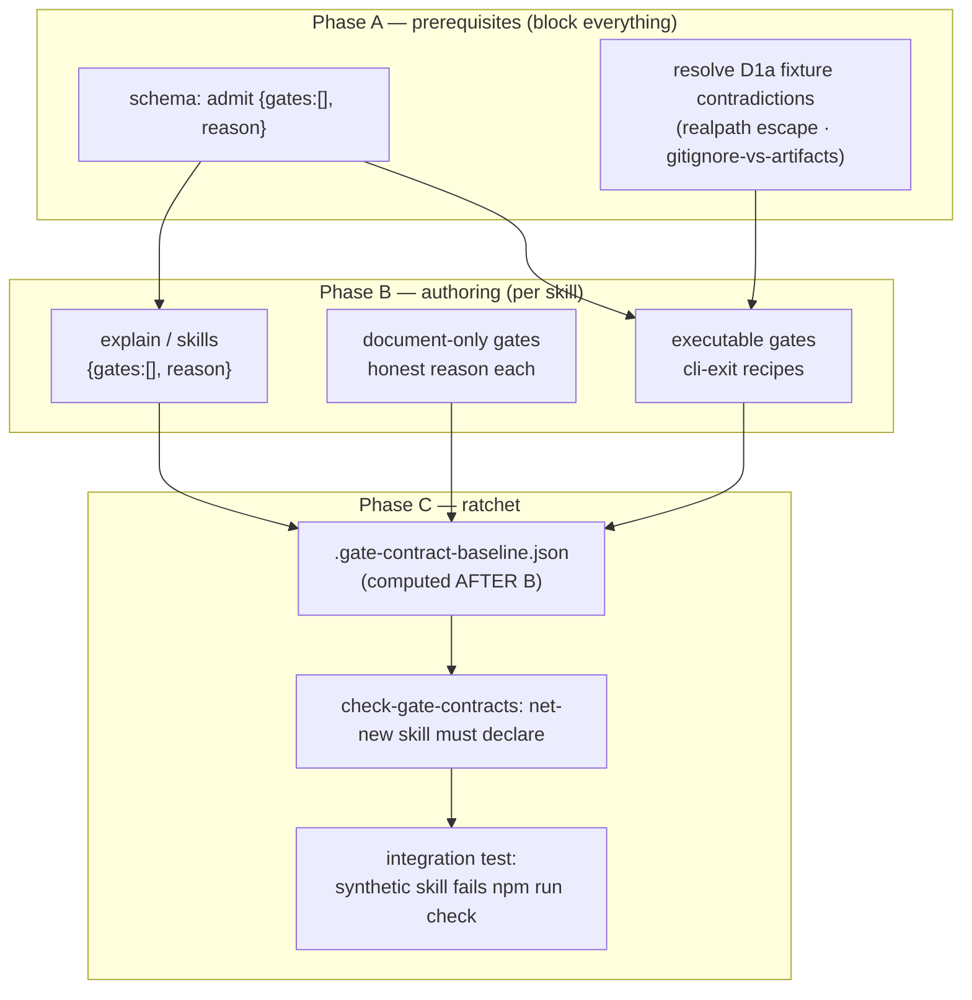

# Plan: Gate-contract authoring — bind the surveyed gates, ratchet the rest

- **Date**: 2026-07-20
- **Status**: Draft
- **Author**: Claude + Louis
- **Scope**: backend (contract JSON + schema + ratchet; no UI)

> **Target domain(s)**: `docs`, `install`, `skills-content`, `tests`
> ⚠ **Cross-domain work** — contracts colocate with skills, schema/oracle live
> in `scripts/lib/gate-honesty/`, the ratchet in `scripts/check-gate-contracts.mjs`,
> assertions in `tests/`.
> **Successor to** [`gate-contract-expansion.md`](./gate-contract-expansion.md)
> (Phases 1–2, shipped `c347ca9`). This is Phases 3–5, which that plan
> deliberately deferred until its §7a inventory + hermetic harness existed —
> both now do.

---

## 1. Context Summary

**Scope**: backend · stack `js-ts` (+ postgres) · no Python.

### What the parent plan already landed (do not redo)

- `scripts/lib/gate-honesty/oracles.mjs` — `buildHermeticEnv` (allowlist,
  fail-closed, `NODE_OPTIONS` dropped, TEMP/TMP/TMPDIR + git-config redirected),
  wired into the `cli-exit` adapter with a timeout + killed-child guard.
- The two verified defects closed (plan/ux-lock "ship gate"; the loader's
  `CHECKED`-counts-skipped bug).
- [`gate-contract-expansion-inventory.md`](./gate-contract-expansion-inventory.md)
  — survey rule, disposition vocabulary, band assignment for all 13 skills,
  every resolved `defect` row. Row-level fields fill **here**, per skill.

### The finding that shapes this plan

The registry is the binding constraint, and I verified it against the code, not
the survey. Of the four oracles:

- `cli-exit` — general: spawn a CLI, assert exit code + stderr. **The only reusable one.**
- `convergence-threshold` — hardwired to `CONVERGENCE_THRESHOLDS`/`evaluateConvergence` (audit-code's module, already contracted).
- `tiered-shadow-window` — hardwired to `summarize`/`windowProgress` (already contracted).
- `visual-gate-unverified` — hardwired to `gateUnverifiedReason` (visual-audit, already contracted).

And D2 (parent plan) forbids adding oracles. So **the executable-eligible set is
exactly the gates that reduce to a CLI exit code + stderr**: `nav-audit --gate`,
the `persona-test` consistency exit table, `ux-lock` verify's exit-0-on-failure,
`ai-context-management`'s exit map, and CLI usage-refusals (`click-test`/
`persona-test` bad-preset → fail). **Everything else is `document-only` under
D2** — numeric caps enforced by the agent (`audit-plan` Gemini ≤2), function-
identity claims (`personaFindingHash` single source), and negatives (`author-tier`
never routes) have no CLI exit to assert and no dedicated oracle.

This is not a disappointment to hide; it is the plan's spine (§2 D1). The value
splits three ways and the plan is honest about which is which:
1. **Executable** — a real behavioural binding. The prize, but a minority.
2. **Document-only** — forces an author to write down "judgement call, here's
   why", which is itself the anti-drift record. A first-class outcome.
3. **The ratchet** — makes every skill's gate-honesty status *explicit and
   non-silent*, which is the bulk of the durable value and does not depend on
   the executable/document ratio at all.

### Code Trace

- `scripts/lib/gate-honesty/schema.mjs:63-88` — `ExecutableGateSchema`
  discriminated on `oracle`; `GateContractSchema` requires `gates.min(1)` and is
  `.strict()` with **no** top-level `reason` → the empty-gates declaration needs
  a schema change (R3-H4, verified 2026-07-20).
- `scripts/lib/gate-honesty/schema.mjs:37` — `CLI_EXIT_SCENARIOS` closed enum,
  one value today → each new recipe is `enum entry + CLI_EXIT_RECIPES entry`.
- `scripts/lib/gate-honesty/schema.mjs:isApprovedStatedInSource` — `statedIn`
  legal ONLY as own `SKILL.md` or `AGENTS.md`.
- `scripts/check-gate-contracts.mjs:18-41` — the checker the ratchet extends;
  reached by `check → skills:check → check-gate-contracts.mjs` (verified in the
  parent plan §7c).
- `scripts/lib/skill-packaging.mjs:listSkillNames` — authoritative skill-root
  enumeration the baseline must reuse (R1-M1).
- `prepush-check.mjs` — the sandbox-worktree pattern the ratchet integration
  test borrows (R2-M2).

---

## 2. Proposed Architecture

### Key design decisions

**D1 — Author to honesty, not to coverage (#15).** The completion target is
"every enforcement-verb candidate has exactly one disposition", **not** "every
skill has an executable gate". A gate forced executable when it isn't is the
fake-check this whole suite exists to prevent. Expect a minority executable, a
majority document-only, and be explicit about the ratio in the final census.

**D2 — Respect the closed registry; measure the yield; escalate as a decision,
never a silent oracle add (#19, #20).** D2 from the parent plan holds: no oracle
is added here. But the plan must *count* the executable yield across all skills
and put it in front of the operator. If it is so low that the executable tier
adds little, the honest response is a **third, separately-scoped plan** to add
one or two well-designed general oracles (e.g. an "assert module exports
constant" generalisation of `convergence-threshold`) — decided on evidence, not
assumed now. This plan does not pre-authorise that; it surfaces the number.

**D3 — Sequence by FIXTURE COST, not by inventory band (#17).** The band
(gate-dense / thin) predicts gate *count*, not authoring *cost*. Cost is
dominated by the fixture a `cli-exit` recipe needs. Three tiers:
- **T0 — no fixture** (document-only gates; the empty-gates declarations). Free.
  Do first — they retire most of the inventory and de-risk the ratchet.
- **T1 — minimal fixture** (a CLI that refuses bad args / prints usage and exits
  non-zero with no project needed — `click-test`/`persona-test` preset
  validation, `ai-context-management` exit map). Cheap `cli-exit`.
- **T2 — full-project fixture** (`nav-audit --gate`, `ux-lock` verify,
  `persona-test` consistency — need `package.json`, source, generated
  artifacts). **Blocked on Phase A's fixture resolution.**

**D4 — The empty-gates declaration is a real contract, validated once (#1).**
`{version:1, skill, gates:[], reason}`. Schema change: allow `gates` empty **iff**
a non-empty top-level `reason` is present; reject `reason` when `gates` is
non-empty (so a real contract can't hide a hand-wave). One `validateGateContract`,
not a special case (R3-H4).

### Right-sizing gate

- **Band-aid**: author only the cheap T0/T1 gates, skip Phase C. Leaves the
  failure class alive — a new skill still escapes silently, which is the whole
  point of the parent finding.
- **Over-engineered**: extend the registry with a general oracle per gate shape
  so everything is executable, and generate SKILL.md prose from contracts (the
  v1-doc's own deferred idea, touching `skills:regenerate` — highest blast
  radius). Manufactures machinery D2 forbids and contracts for judgement calls.
- **Chosen**: author what the 4 oracles honestly fit, document-only the rest
  with reasons, ship the ratchet + baseline, and **measure** the executable
  yield so a registry-extension plan is an evidence-based decision, not a reflex.
  **Current requirement**: the parent plan's ratchet is undelivered and a new
  skill escapes silently today; that is the concrete thing Phase C fixes.

---

## 5. Sustainability Notes

- **Assumption that will change**: the executable yield is low *today* because
  the registry is small. If a registry-extension plan lands, this plan's
  document-only entries become re-authoring candidates — so each `document-only`
  `reason` should say *why no oracle fits* (structural), not just *that* none
  does, so a future reader can tell which are re-authorable and which are
  genuinely un-mechanisable judgement.
- **Seam preserved**: contracts are data; the deferred SKILL.md-generation-from-
  contract idea stays available and is neither built nor blocked here.
- **The ratchet is the durable artifact.** Its value is independent of how many
  gates end up executable — it converts silence into an explicit, reviewable
  declaration for every current and future skill.

---

## 7. File-Level Plan

### Phase A — prerequisites (block B and C)

| File | Intent | Purpose |
|---|---|---|
| `scripts/lib/gate-honesty/schema.mjs` | modify | admit `{gates:[], reason}` (empty iff `reason` present; `reason` rejected when `gates` non-empty); its own negative fixtures |
| `docs/plans/gate-contract-authoring.md` §7a | (this doc) | resolve the two D1a fixture contradictions before any T2 recipe |
| `tests/gate-honesty.test.mjs` | modify | schema tests for the empty-gates rule (both accept + both reject paths) |

### Phase B — authoring (per skill, T0 → T1 → T2)

| File | Intent | Tier | Notes |
|---|---|---|---|
| `skills/explain/gate-contract.json` | create | T0 | `{gates:[], reason:"read-only + cite-sources are agent-behavioural; no mechanical gate"}` |
| `skills/skills/gate-contract.json` | create | T0 | `{gates:[], reason:"'never drift' is a design property (reads frontmatter directly), not an enforced check"}` |
| `skills/audit-plan/gate-contract.json` | create | T0 | Gemini ≤2 / GPT ≤3 caps + `FINAL_GATE_SKIPPED` sentinel → document-only (agent-enforced); `--mode plan` required → cli-exit only if the CLI refuses its absence |
| `skills/security-strategy/gate-contract.json` | create | T0/T1 | `redactSecrets()` before egress; write-gated-on-round-trip-parse |
| `skills/brainstorm/gate-contract.json` | create | T1 | cheapest — already names `tests/brainstorm-artifact-context.test.mjs`; artifact-refusal is executable-adjacent |
| `skills/ai-context-management/gate-contract.json` | create | T1 | exit map `0/1/2` via cli-exit |
| `skills/click-test/gate-contract.json` | create | T1/T2 | verdict precedence (`auth-required`→never `Clean`) — try direct import (unit-seam) before cli-exit; touch-target threshold |
| `skills/nav-audit/gate-contract.json` | create | T2 | `--gate` exit table — **one scenario per exit code** (R3-H1: never quote 0/1/2 while exercising one) |
| `skills/persona-test/gate-contract.json` | create | T2 | consistency exit table (2/3/4/6) — one scenario each; confidence thresholds → document-only |
| `skills/ux-lock/gate-contract.json` | create | T2 | verify exits 0 on failure (now a clean claim post-D-1); `--strict-selectors` warn→fail; **statedIn**: selector policy prose is in a reference file → restate in SKILL.md (listed below) or document-only (R3-H5) |
| `skills/cycle/gate-contract.json` | create | T2 | `preview-gate [HALT]`, fix-gate predicate; `author-tier` never-routes → document-only negative |
| `skills/ship/gate-contract.json` | create | T2 | `--gate passed` refused without evidence (strongest positive); Category-A never-staged; non-blocking-gate negatives |
| `scripts/lib/gate-honesty/oracles.mjs` | modify | — | new `CLI_EXIT_RECIPES` entries + matching `CLI_EXIT_SCENARIOS` enum values; each uses `buildHermeticEnv` |
| `skills/ux-lock/SKILL.md` | modify | — | (only if the selector-policy gate is made executable) restate the reference-file claim in SKILL.md so `statedIn` is legal |
| `tests/gate-honesty.test.mjs` | modify | — | update the pinned census; each new recipe proven able to FAIL (assert once against a wrong `expectExit`) |

### Phase C — ratchet

| File | Intent | Purpose |
|---|---|---|
| `.gate-contract-baseline.json` | create | committed legacy-exception list; after B, contains only what legitimately has no contract |
| `scripts/check-gate-contracts.mjs` | modify | a skill root (via `listSkillNames`) with no contract AND not baselined = failure; a stale baseline entry (skill root gone) = failure |
| `tests/gate-contract-ratchet.test.mjs` | create | unit: the ratchet's set logic. **Integration: a synthetic skill added in a throwaway worktree fails `npm run check`, and the failure names the gate-contract checker** (R2-M2) |
| `docs/reference/gate-honesty.md` | modify | new census, the empty-gates declaration, the ratchet + baseline lifecycle |

**Close-out (not a phase)**: `npm run gates:check && npm run skills:regenerate && npm run check`.

### 7a. Resolving the two D1a fixture contradictions (Phase A gate for T2)

Both were flagged by the parent plan's code-audit and block every T2 recipe.

- **realpath escape**: `node_modules` symlinked into the fixture lets a dep that
  resolves via `__dirname`/`import.meta.url` walk *out* of the fixture. **Chosen
  resolution**: do not symlink `node_modules` at all for `cli-exit`. The gates
  worth T2 (`nav-audit --gate`, `ux-lock` verify) are exercised by asserting the
  CLI's **argument/exit contract**, which is reachable with the CLI's own file +
  a fixture input, not the full dep tree — **if a recipe genuinely needs
  installed deps to reach its exit decision, that is a signal the gate is
  integration-shaped and should be `document-only`, not a reason to solve the
  symlink problem.** (This keeps the harness a boundary, not a mini-CI.)
- **gitignore vs generated artifacts**: a `.gitignore`-respecting copy omits the
  generated artifacts the CLI reads. **Chosen resolution**: the recipe's
  `fixture(dir)` writes the *minimal* declared inputs each CLI needs directly
  (as the existing `visual-static-gate-refusal` recipe already does with
  `visual-contract.json`) — never a bulk working-tree copy. This sidesteps both
  contradictions: no copy, no symlink, no `.gitignore` question. The working-
  tree-copy design is **abandoned**, not deferred — the minimal-fixture pattern
  the harness already uses is sufficient for exit-contract assertions, and a
  recipe that needs more is a document-only signal.

> This resolution *narrows* Phase A: the schema change is the only hard
> prerequisite; the "fixture harness" reduces to per-recipe minimal `fixture()`
> functions, which are T1/T2 authoring, not separate infrastructure.

---

## 8. Risk & Trade-off Register

- **Low executable yield could make Phase B feel like paperwork.** Mitigated by
  D1/D2: the document-only entries are the anti-drift record, and the ratchet
  (Phase C) is the durable win regardless. If the yield is genuinely too low to
  justify the per-skill authoring, **cut Phase B's T2 tail, keep Phase C** — the
  ratchet works over whatever contracts exist plus the baseline.
- **A recipe that passes against the wrong condition.** Every new recipe must be
  proven able to FAIL (assert once against a wrong `expectExit`) — an untested
  green recipe is the exact defect. Hard requirement in §9, not optional.
- **`statedIn` forces SKILL.md edits.** Any reference-file gate made executable
  needs its claim restated in the owning SKILL.md (an edit that must appear in
  Phase B's file list) or it stays document-only. Never widen the policy.
- **Multi-outcome `stated` (R3-H1).** A gate quoting an N-outcome table must be
  N scenarios or a narrowed quote. The `nav-audit` and `persona-test` exit
  tables are the live instances.
- **Ratchet integration test is expensive (~100s nested `check`).** Per parent
  R3-M1 it must **not** be opt-in behind a strictness flag — that reopens the
  substitution it exists to prevent. If cost is unacceptable, make it cheaper or
  state the chain is unproven; never silently downgrade it.
- **Baseline drift (R1-M1).** Computed post-B via `listSkillNames`; a stale
  entry (skill root gone) is a failure, not a silent pass.

### Carried forward — required inputs, all from the parent's audit
- R3-H1 — one scenario per exit outcome / narrowed `stated`.
- R3-H4 — `explain`/`skills` get `{gates:[], reason}`; schema change (Phase A).
- R3-H5 / R1-M3 — `statedIn` restatements listed in the phase that needs them.
- R2-M2 — ratchet integration fixture: worktree, names the checker, no opt-out.
- R1-M1 — baseline lifecycle: post-authoring, `listSkillNames`, rename=failure.

### Explicitly out of scope
- **Adding any oracle** (D2). If the yield warrants it, that is a third plan.
- **SKILL.md generation from contracts** — untouched, unblocked, not built.
- **Re-litigating the two existing contracts** (audit-code, visual-audit).

---

## 9. Testing Strategy

- **Schema (Phase A)**: `{gates:[], reason}` accepted; `gates:[]` without
  `reason` rejected; non-empty `gates` **with** `reason` rejected. Both accept
  and both reject paths — a one-sided test would let the fake-check back in.
- **Each new `cli-exit` recipe (Phase B)**: runs green against the real CLI under
  `buildHermeticEnv`, AND is proven able to fail (assert once against a wrong
  `expectExit`). An untested-green recipe is the defect this suite catches.
- **Census pinning**: `tests/gate-honesty.test.mjs` pins the exact contracted
  set + the executable/document/env-skipped counts; every phase updates it
  deliberately.
- **`stated`-verbatim drift**: a contract whose `stated` no longer appears in
  `statedIn` must fail loudly — the prose-drift detector.
- **Ratchet (Phase C)**: unit (net-new-without-declaration fails; explicit
  `{gates:[], reason}` passes; the post-B baseline stays green) **and** the
  integration test (synthetic skill in a worktree fails `npm run check`, failure
  names the checker).
- **Empirical yield check (D2)**: the census output records the
  executable:document ratio so the registry-extension decision is data-backed.

---

## Audit trail

_(to be appended by `/audit-plan`)_
