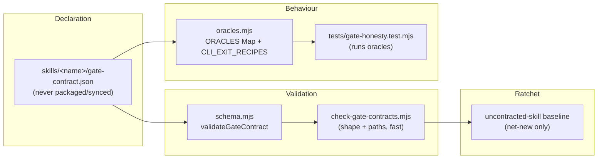

# Plan: Gate-contract expansion — bind stated gates to enforcers

- **Date**: 2026-07-20
- **Status**: Draft
- **Author**: Claude + Louis
- **Scope**: backend (defect closure + gate inventory + hermetic harness; no UI)

> **Target domain(s)**: `docs`, `install`, `skills-content`, `tests`
> ⚠ **Cross-domain work** — touches >1 domain; boundary crossings are
> intentional (contracts are colocated with skills, oracles live in
> `scripts/lib/gate-honesty/`, assertions in `tests/`).
> **Origin**: five same-shaped failures found in one day (2026-07-20), each a
> claim about verification that was not itself verified.

---

## 1. Context Summary

**Scope**: backend · stack `js-ts` (+ postgres) · no Python.

### Neighbourhood considered

`get-neighbourhood` returned **`precedent`** (`above-floor-standout`, sim 0.83)
on `scripts/check-gate-contracts.mjs::main`, plus `scripts/lib/gate-honesty/`
(`loader.mjs`, `schema.mjs`) and — importantly — `lintCanaryCoverage`
(`scripts/lib/efficacy-lints.mjs:340`), an **adjacent** mechanism asserting that
every canary gate in source has a test forcing it true.

**Decision: extend, do not create a sibling.** This plan works inside the
existing gate-honesty suite. No new subsystem, and **no new lint** — an earlier
draft claimed "one lint in the `efficacy-lints` family", but the ratchet lives
in `check-gate-contracts.mjs` and no lint was ever specified (audit R3-M2).
The claim is withdrawn rather than retro-fitted.

### Scope was narrowed after audit round 3 — read this first

This plan originally covered all five phases: close the defects, build the
inventory + harness, author ~11 contracts, and add the ratchet. Three audit
rounds produced H:4 → H:2 → **H:5**, and the round-3 findings were
overwhelmingly *"the contract-authoring phases are under-specified"* — because
**they cannot be specified before the survey that determines what the gates
are.** Specifying 30+ contracts up front was the error; each round of added
detail introduced new internal contradictions rather than converging.

**This plan is therefore Phases 1–2 only**: close the two verified defects, and
produce the inventory + hermetic harness. Contract authoring and the ratchet
move to a successor plan that the inventory *unblocks* and makes specifiable.
That is a scope boundary justified by evidence, not a deferral of the hard part
— the hard part (deciding what is actually true and building a harness that
cannot lie) is precisely what stays here.

### Code Trace

- `docs/reference/gate-honesty.md:1-187` — contract format, gate kinds, the
  closed `statedIn` policy, the v1 census, and the explicit v1 out-of-scope
  list ("contracts for the other 6+ skills").
- `scripts/lib/gate-honesty/schema.mjs:129` `validateGateContract` — one shared
  validator for loader + suite + CLI.
- `scripts/lib/gate-honesty/oracles.mjs:129-175` — `CLI_EXIT_RECIPES` (one
  recipe today) → `cliExit()` spawns the real CLI in a tmpdir, asserts
  `expectExit` + `expectStderrContains`; `ORACLES` Map of 4.
- `scripts/lib/skill-packaging.mjs:29` `SKILL_LOCAL_FILES = ['gate-contract.json']`
  — tolerated at a skill root, **never packaged, never synced**.
- `scripts/check-gate-contracts.mjs:18-41` — schema/path-only; oracles run in
  `tests/gate-honesty.test.mjs`.
- Adjacent linters read and ruled out as covering this: `check-skill-refs.mjs`
  (only the "## Reference files" table), `check-docs-refs.mjs:295` `scanPolicy`
  (only whether a cited path *resolves*).

### What exists today

2 of 15 skills contracted: **5 executable + 4 document-only** gates. 13
uncontracted — reported, never a failure.

### The motivating failures — and an honest correction

The five instances that prompted this plan are **not all contract-shaped**:

| Failure | A contract would catch it? |
|---|---|
| `check` green over unrun DB suites | No — script gate, not a skill's stated gate |
| Hook pointed at a 20-run-red CI job | No — observability |
| `ship` said `git add <gitignored>` | **No** — prose with no code enforcer |
| Test claimed to match a CHECK constraint | No — test-level claim |
| Comment counted as a guard (#57) | No — code-comment lint |

**Contract expansion would have caught none of them.** That is recorded here
because the opposite was asserted when this work was proposed, and building on
an unexamined premise is the failure this repo keeps paying for.

What *does* justify the work is separate and was found while planning it — see
§1.1.

### 1.1 A sixth instance, verified during this plan

- `skills/plan/SKILL.md:654` — §10 acceptance criteria "is **the ship gate**".
- `skills/ux-lock/SKILL.md:229` — verify "exits 0 even when criteria fail
  (gating is `/ship`'s job)".
- `/ship` — **never queries it.** `readPlanSatisfaction` exists
  (`scripts/lib/store/plans-ship.mjs:800`) and is reachable via
  `cross-skill.mjs:521 cmdPlanSatisfaction`, but ship's only mention of plan
  satisfaction is an *optional status.md reporting section*
  (`skills/ship/references/status-md-format.md:78`). Ship's Step 0.5 gates are
  persona-P0 and unlocked-fixes; there is no plan-satisfaction gate.

**Two skills each delegate the gate to the other; nobody enforces it.** This is
exactly what a contract catches, because the claim names a mechanism
(`/ux-lock verify` → `/ship`) that can be checked. A second confirmed case:
`skills/click-test/SKILL.md:571` calls
`scripts/cross-skill.mjs record-click-test` "required" — the subcommand does
**not exist** (verified absent from `cross-skill.mjs`).

Circular-delegation gates are the highest-value target in this plan, not the
long tail of thresholds.

### Survey result (13 skills, full breakdown in §7)

| Band | Skills | Verdict |
|---|---|---|
| Gate-dense | `cycle`, `ship`, `audit-plan`, `ux-lock`, `nav-audit`, `click-test`, `persona-test` | contract clearly earns its keep |
| Thin but real | `ai-context-management`, `security-strategy`, `brainstorm`, `plan` | 1–3 honest assertions each |
| **No stated gates** | `explain`, `skills` | no gates to contract — each gets an explicit `gates: []` declaration (§7), never invented gates |

---

## 2. Proposed Architecture



### Key design decisions

**D1 — Reuse `cli-exit`; add recipes, not oracles (#1 DRY, #20 flexibility).**
A recipe is ~14 lines (`args`, `fixture`, `expectExit`, `expectStderrContains`,
`envPrereq`). Every gate that reduces to "this CLI exits N with stderr matching
M" costs a recipe, not an adapter. **Cost is bimodal** — recipe ≈ 15 lines; a
new bespoke oracle ≈ 60–100 plus its own negative fixture.

**D1a — A hermetic recipe harness is a prerequisite, not a detail (audit
R1-H4).** The single existing recipe targets `visual-audit --gate`, which is
deterministic and touches nothing. The CLIs this plan adds recipes for —
`ship`, `cycle`, `nav-audit`, `persona-test` — resolve git state, generated
artifacts, `~/.audit-loop.env`, the cloud store, and providers. "Spawns the
real CLI in a tmpdir" is **not** sufficient isolation for those: the seam
resolves configuration *outside* that directory. Left unaddressed, the suite
becomes flaky, may touch real credentials or the production store, and gets
weakened with ad-hoc skips after the first red run — destroying the real-seam
premise it exists to defend.

Phase 2 therefore defines one shared harness, applied by every recipe:

- **Redirect every ambient-state root, not just `cwd`** (audit R2-H2 — a
  filtered env and a tmpdir `cwd` do NOT stop a child resolving the real
  `~/.audit-loop.env`, global git config, or a credential helper). The child
  gets fixture-owned `HOME`, `USERPROFILE`, `XDG_CONFIG_HOME`,
  `XDG_CACHE_HOME`, `TMPDIR`, plus `GIT_CONFIG_GLOBAL` and `GIT_CONFIG_SYSTEM`
  pointed at `/dev/null`-equivalents. This is the load-bearing half; the env
  allowlist alone is not sufficient.
- **Fixture topology — a bare `git init` is NOT enough** (audit R3-H2). These
  CLIs need `package.json`, `scripts/`, skill content and generated artifacts to
  reach their exit decision at all.
- **…but NOT a `git worktree` either** (Gemini G1). An earlier draft said
  worktree-off-HEAD. That is wrong *for this harness*: a worktree checks out the
  **committed** state, so a developer editing a CLI or a SKILL.md would see
  uncommitted fixes falsely fail and uncommitted breakages falsely pass —
  breaking the very TDD loop the harness exists to support. The harness instead
  **copies the working tree** into the tmpdir (respecting `.gitignore`,
  `node_modules` linked rather than copied), then `git init`s it with a seeded
  commit and `GIT_TERMINAL_PROMPT=0`.

  **The opposite choice is correct one layer up**, and the distinction is
  load-bearing: the successor plan's ratchet integration test (§7c) asserts the
  pre-push chain, whose whole point is to test *the commit being pushed* — a
  worktree is right there and a working-tree copy would be wrong. Two fixtures,
  two questions, two correct answers. Where a worktree IS used, teardown must
  call `git worktree remove --force` before any `fs.rmSync`, or every run leaks
  an orphaned entry into `.git/worktrees/` (Gemini G2).

  Defining this topology is Phase 2 work; a recipe may not be authored against
  an undefined fixture.
- **Environment allowlist, deny-by-default** — build the child env from an
  explicit list rather than filtering `process.env`. Filtering is
  fail-open: a credential variable added later leaks in silently, whereas an
  allowlist fails closed by construction. `AUDIT_DB_URL`, `AUDIT_DB_TEST_URL`,
  and every `*_API_KEY` are absent by definition, not by rule.
  **The allowlist must include `PATH` (and `Path` on Windows)** (Gemini G3) —
  omitting it breaks OS binary resolution, so `git`/`node` lookups fail and
  every recipe dies for a reason unrelated to the gate under test. Also carry
  `SystemRoot`/`COMSPEC` on Windows for the same reason.
- **No network, and no green-by-skipping.** A recipe whose CLI would call a
  provider is `document-only` — **not** `envPrereq`-skipped. `envPrereq`
  yields `env-skipped`, which must be reported as its own state and never
  counted as CHECKED; using it to dodge a provider call would make an
  executable gate green having executed nothing, which is the exact defect this
  suite exists to catch.
- **Bounded**: explicit `timeout` + child cleanup; deterministic clock/seed
  where the CLI uses either.
- **Teardown** in `finally` (the existing recipe's `fs.rmSync` retry-hardened
  pattern).

A recipe that cannot be made hermetic under this harness is a signal the gate
should be `document-only` — not a reason to relax the harness.

**D2 — NO new oracle. Fix the defect first, then contract the corrected
invariant (#15, audit R1-H2).**

An earlier draft proposed an `absent-subcommand` oracle to assert the
circular-delegation negatives ("nothing enforces X", "subcommand Y does not
exist"). **That was inverted and is withdrawn.** Such a contract would pass
*because the defect is present* — codifying a known-broken state as a green
test — and would then **fail when someone correctly implemented the missing
enforcer**. It would ratchet the repo into keeping a false operational
instruction.

The correct order for every unbacked claim is:

1. **Establish the intended invariant** (does this gate exist or not?).
2. **Make prose and code agree** — implement the enforcer, or delete the false
   claim.
3. **Contract the corrected invariant**, using the existing registry.

Consequence: the plan proposes **zero registry extensions**. Every gate must
fit `cli-exit` or be honestly `document-only`. If a gate fits neither, that is
a finding about the gate, not a reason to grow the registry.

**D3 — `document-only` stays first-class (#15).** The schema already
**refuses** an `oracle`/`implementation`/`params` on a document-only gate. Any
gate whose input is model output (persona confidence thresholds, "never inflate
the threat model", spec-authoring quality) is document-only, and that is a
correct outcome, not a consolation prize.

**D4 — The ratchet is on NET-NEW skills, not on coverage (#19).** Mirrors
`cli:flags:gate` (80 baselined, fails only on net-new drift). Since `explain`
and `skills` legitimately have no gates, "every skill contracted" is a false
target and would manufacture ceremony.

**Baseline lifecycle** (audit R1-M1 — an earlier draft said "baseline today's
13", which contradicted Phases 3–4 contracting 11 of them):

- The baseline is computed **after Phases 3–4 land**, never before. At that
  point the only legacy exceptions are **`explain` and `skills`**, each
  carrying an explicit `reason`.
- It is a **committed, reviewable artifact** (`.gate-contract-baseline.json`),
  not an inline constant — so removing an exemption is a visible diff.
- **Skill discovery uses the same authoritative source as packaging**
  (`skills/` roots per `skill-packaging.mjs`), so a rename cannot silently
  create an unbaselined skill or strand an obsolete entry.
- **Rename/delete/reintroduce**: an entry naming a skill root that no longer
  exists is a **failure**, not a silent pass — a stale exemption must not
  outlive its skill.
- The "no gates" declaration is a **complete, schema-valid contract**
  (`{version, skill, gates: [], reason}`), validated by the same
  `validateGateContract` — not a special-cased one-liner. That keeps one
  validator, not two.

**Schema evolution this requires** (audit R2-M1 — the earlier draft introduced
`reason` without saying how the closed schema admits it):

- `reason` is **required, non-empty, and permitted ONLY when `gates` is empty**.
- A non-empty `gates` array carrying a top-level `reason` is **rejected** —
  otherwise a real contract could carry a hand-wave that reads like an
  exemption.
- `gates: []` **without** `reason` is rejected — silence is what the ratchet
  exists to remove.
- The baseline artifact gets its **own** validation (shape + every named skill
  root exists), separate from contract validation. Two artifacts, two
  validators, one entry point.

### Right-sizing gate

- **Band-aid**: contract only `ship` (the skill that bit us today). Leaves the
  same class live in `cycle`, which has the densest gate surface in the repo.
- **Over-engineered**: contract all 13, extend the oracle registry per gate
  shape, and generate SKILL.md prose from contracts (the v1 doc's own deferred
  idea). Manufactures contracts for `explain`/`skills`, and SKILL.md generation
  touches `skills:regenerate`, the highest-blast-radius sync seam — explicitly
  deferred in v1 "contingent on observed contract↔prose drift", which has not
  been observed.
- **Chosen**: contract the gates that are (a) verified-unbacked, or (b)
  `cli-exit`-shaped and cheap, plus a net-new-skill ratchet. **Zero registry
  extensions** (D2). **Current requirement**: two *verified* unbacked
  claims (§1.1), not a coverage percentage.

---

## 6. Sustainability Notes

- **Assumption that could change**: the oracle registry stays small. If a third
  gate class appears, resist a per-gate adapter — prefer widening `cli-exit`'s
  recipe shape.
- **Deliberate extension point**: `CLI_EXIT_RECIPES` is a plain object; a new
  scenario is an additive key with no code change.
- **Seam if this outgrows itself**: contracts are data. Generating SKILL.md
  prose from them (v1's deferred v2) remains available and is *unblocked* by
  this plan, not prejudged by it.

---

## 7. File-Level Plan

Phases 1–2 only. **No `gate-contract.json` is created by this plan.** Every
contract, the schema change admitting `gates: []`, the ratchet, and the
`gate-honesty.md` census update belong to the successor plan that §7a's
inventory unblocks. (Gemini R2-G1: an earlier draft cut the scope in §1 but
left this table describing the moved-out work — the contradiction is the point
of the finding.)

| File | Intent | Purpose |
|---|---|---|
| `skills/plan/SKILL.md` | modify | Phase 1 — resolve the §10 "ship gate" claim per branch A2 |
| `skills/ux-lock/SKILL.md` | modify | Phase 1 — align the verify-is-a-report claim with `/ship` reality |
| `skills/click-test/SKILL.md` | modify | Phase 1 — delete the false "required `record-click-test`" claim |
| `docs/plans/gate-contract-expansion-inventory.md` | create | Phase 2 — the §7a inventory, filled in across all 13 skills |
| `scripts/lib/gate-honesty/oracles.mjs` | modify | Phase 2 — the shared hermetic harness **only** (D1a). No new oracle (D2); no new recipes (successor plan) |
| `tests/gate-honesty.test.mjs` | modify | Phase 2 — cover the harness; assert `env-skipped` is reported separately and never counted as CHECKED |

The gate targets previously listed here (cycle's `preview-gate [HALT]`, ship's
`--gate passed` refusal, nav-audit's exit table, persona-test's consistency
exit codes, …) are **inputs to the §7a inventory**, not files this plan writes.

**`explain` and `skills` — one source of truth** (audit R3-H4). An earlier
draft said both "create no contract" (§7) *and* "each carries an explicit
`reason`" (D4) — incompatible. Resolved in favour of D4: each gets a complete
`{version, skill, gates: [], reason}` contract stating that it has no gates and
why. That is not ceremony — it is the declaration the ratchet reads, and it is
what makes "no gates" auditable instead of indistinguishable from silence.
Authoring them belongs to the successor plan, alongside the ratchet that
consumes them.

### 7a. Normative gate inventory (Phase 2 deliverable — blocks Phases 3–4)

The §7 table names gate *families*, not gates. That is insufficient to author
deterministic JSON: two implementers would produce incompatible contracts, or
recipes that pass against unrelated conditions (audit R1-H3). **Every gate gets
one inventory row before any contract JSON is written**, with these columns —
all required, no blanks:

**Survey rule + completion criterion** (audit R2-M3 — "every gate" and
"cli-exit-shaped and cheap" were both undefined). The candidate set is
**mechanical**, not taste-based: every SKILL.md line matching the
enforcement-verb set — *blocks, fails, exits, refuses, requires, must, never,
always, threshold, cap, max, gate* — is a candidate. Each candidate gets
**exactly one** disposition, and the inventory is complete only when none is
unlabelled:

| Disposition | Meaning |
|---|---|
| `executable` | a registry oracle + hermetic fixture is specified |
| `document-only` | no honest mechanical oracle exists — reason recorded |
| `not-a-gate` | the verb is descriptive prose, not an enforcement claim |
| `defect` | the claim is unbacked → routes to Phase 1, **never contracted as-is** |

The `defect` row is the one that matters: it is how a survey finds the *next*
plan/ux-lock-style circular delegation instead of quietly contracting it (D2).
A candidate may not be dropped silently — `not-a-gate` is a decision that gets
written down.

**Where a newly-found `defect` goes** (audit R3-H3). "Routes to Phase 1" is not
executable once Phase 1 has closed, and the survey **will** find more. Each new
`defect` row is recorded with its evidence and routed one of two ways, decided
when found: **(a)** if closing it is a prose correction (the
`record-click-test` shape), fold it into Phase 2 and fix it there; **(b)** if
it needs a design decision or new enforcement (the ship-gate shape), it becomes
a **blocking input to the successor plan**, and its gate is not contracted
until resolved. What must never happen is contracting the broken state to keep
the census moving.

| Column | Rule |
|---|---|
| `gateId` | stable, kebab-case, unique within the skill |
| `statedIn` | `skills/<own>/SKILL.md` or `AGENTS.md` **only** — plus the heading anchor |
| `stated` | the **verbatim** string, copy-pasted; the schema requires an exact match |
| `kind` | `executable` \| `document-only` |
| `oracle` + `scenario` | executable only; must be an existing registry id |
| `implementation` | the real production seam the oracle imports/spawns |
| `expect` | exit code + stderr substring (cli-exit), or the asserted params/fixture |
| `docOnlyReason` | document-only only; why no honest mechanical oracle exists |

**Worked rows** (the format is the deliverable; these two are already resolved):

| gateId | statedIn | stated | kind | oracle/scenario | expect |
|---|---|---|---|---|---|
| `nav-gate-exit-table` | `skills/nav-audit/SKILL.md` §Exit codes | "`0` clean / advisory-only · `1` hard-gate divergence (with `--gate`) · `2` tool" | executable | `cli-exit` / `nav-gate-clean` | exit `0` on a contract with no declared-intent regression |
| `persona-confidence-thresholds` | `skills/persona-test/SKILL.md` | "Confidence threshold: ≥0.6 to report, ≥0.7 for P0" | **document-only** | — | input is model self-reported confidence; no mechanical oracle can assert a judgement threshold |

**A `stated` string may never be broader than what the oracle exercises**
(audit R3-H1). The worked `nav-gate-exit-table` row above is itself the
counter-example: it quotes the whole `0`/`1`/`2` table while the recipe
exercises only the clean-`0` case. A contract that quotes three outcomes and
verifies one is a *partial verification presented as verification* — the exact
defect this suite exists to catch, reproduced inside the suite.

Two honest resolutions, chosen per row: **split** into one gate per outcome
(`nav-gate-exit-clean`, `nav-gate-exit-divergence`, `nav-gate-exit-tool-error`,
each with its own recipe), or **narrow the `stated` quote** to the single
outcome actually exercised and record the unverified remainder as a
`document-only` sibling. Compound invariants get the same treatment. The
inventory row must show which was chosen.

**`statedIn` blocker (audit R1-M3, R3-H5).** Any SKILL.md **restatement** this
forces is real work that must appear in a phase's `Files:` list — an earlier
draft named ux-lock's `--strict-selectors` as a target while its canonical
prose sits in a reference file, and listed no edit anywhere. Since contract
authoring now lives in the successor plan, the restatements travel with it; the
inventory records, per row, *which* resolution was chosen so that plan inherits
a concrete file list rather than rediscovering the problem. Where the canonical prose lives in a
`references/*.md` (e.g. ux-lock's selector policy, `--strict-selectors`), the
closed policy admits only two honest resolutions: **restate** the assertion in
the owning SKILL.md (and list that edit in the phase), or mark it
**document-only**. **Never widen the policy to make a gate fit**, and never
demote a genuinely executable gate to document-only purely to dodge the anchor
— record which resolution each affected row took.

### 7b. Implementation Phases

**Phase 1 — Unbacked-claim closure (a DECISION, then an edit).** The two
verified defects. Each requires an accountable decision *before* any file
changes, because the two branches differ in ownership, data flow, failure
semantics, and file scope (audit R1-H1).

*Defect A — the plan/ux-lock/ship "ship gate".* Two exclusive branches:

| | **A1 — `/ship` really gates** | **A2 — prose is wrong (recommended)** |
|---|---|---|
| Intent | §10 P0 criteria block a ship | verify is a report; nothing blocks |
| Files | `skills/ship/SKILL.md` (new Step 0.5d gate), `scripts/cross-skill.mjs` (invocation), `skills/plan/SKILL.md`, `skills/ux-lock/SKILL.md` | `skills/plan/SKILL.md`, `skills/ux-lock/SKILL.md` |
| Must also define | stale/absent satisfaction data, cloud-off behaviour, override flag, ship_event `blockReasons` value, positive+negative tests | nothing new |
| Cost | new blocking gate + its failure semantics | prose correction |

**Recommendation: A2.** `/ship`'s existing gates (persona-P0, unlocked-fixes)
are *all* non-blocking by deliberate design, and `ux-lock`'s "verify is a
report, not a blocker" is the more considered of the two claims. A1 would add
the repo's first hard content gate to `/ship` and needs its own plan.
**A2 is a real decision, not a dodge — but it must be signed off, not assumed.**

*Defect B — `record-click-test`.* The subcommand does not exist and the
integration is explicitly deferred to v2, so the word "required" is the error.
Correct the prose; do **not** contract the absence (D2). Files:
`skills/click-test/SKILL.md` (modify).

Files (A2 + B): `skills/plan/SKILL.md`, `skills/ux-lock/SKILL.md`,
`skills/click-test/SKILL.md` (all modify). **If A1 is chosen instead, Phase 1
expands and this plan must be re-audited** — the file set above is not valid
for A1.

**Phase 2 — Normative gate inventory + hermetic harness.** No contract JSON is
authored before this lands (audit R1-H3/H4/M3). Files:
`docs/plans/gate-contract-expansion-inventory.md` (create — the §7a inventory,
filled in), `scripts/lib/gate-honesty/oracles.mjs` (modify — the shared
hermetic recipe harness), `tests/gate-honesty.test.mjs` (modify).

**Phases 3–5 — MOVED to the successor plan** (`gate-contract-authoring.md`,
to be written once §7a's inventory exists). They were: contract the four
highest-blast-radius skills; contract the remaining seven; add the net-new-skill
ratchet + baseline. Every audit finding about their specification
(R3-H1 multi-outcome gates, R3-H5 `statedIn` restatements, R2-M2 ratchet
fixture, R1-M1 baseline lifecycle) is **carried forward as a required input**
to that plan, recorded in §8 — not dropped.

**Close-out (not a phase)**: `npm run gates:check && npm run check`.

### 7c. Enforcement path — verified, not assumed

A close-out command is not an enforcement design (audit R1-M2). The chain that
makes the modified checker mandatory **already exists** and was verified
against `package.json` while writing this plan:

```
check  →  skills:check  →  node scripts/check-gate-contracts.mjs
```

(`check` contains `skills:check`; `skills:check` runs `check-gate-contracts.mjs`
as its fifth step.) `check` is what the pre-push hook runs, in the sandbox
worktree at the commit being pushed.

**So no new wiring is required — and that claim is itself now load-bearing.**
The successor plan's `tests/gate-contract-ratchet.test.mjs` must therefore assert the
chain, not just the checker's logic: a net-new uncontracted skill must fail
`npm run check`, not merely fail the checker when invoked directly. Without
that assertion this plan would rest on exactly the "stated verification not
itself verified" premise it exists to remove.

**Fixture strategy for that assertion** (audit R2-M2). Adding a synthetic skill
to the live checkout is unsafe — this repo routinely has concurrent sessions,
and a stray `skills/__ratchet_probe__/` would poison every other check running
at that moment. Nor is a bare tmpdir sufficient: `check` needs `node_modules`,
git metadata, and generated artifacts.

Use the pattern `prepush-check.mjs` already established: a **throwaway `git
worktree`** off the current commit, `node_modules` provided by symlink or
`npm ci --offline` (no network), the synthetic skill added **only there**, and
`npm run check` run with a bounded timeout and the same hermetic env boundary
as D1a. Assert exit non-zero **and** that the failure names the gate-contract
checker — not merely that something failed, which any unrelated breakage would
satisfy. Worktree removed in `finally`.

Cost note: this is the most expensive test the successor plan will carry (a full
nested `check`, ~100s). **It must not be made opt-in** (audit R3-M1): a normally
unset strictness flag would leave routine runs with only the direct-invocation
test — exactly the substitution §7c forbids. If the cost is unacceptable, the
honest options are to make it cheaper or to state plainly that the chain is
unproven; never to leave a flag that silently downgrades it.

---

## 8. Risk & Trade-off Register

- **Marginal-gate value declines sharply — a finding for the successor plan.**
  The verified defects and the gate-dense skills carry nearly all the value;
  the tail (e.g. `brainstorm`'s three assertions) is cheap but low-yield. When
  the successor plan sequences authoring, it should cut the tail before cutting
  the ratchet — the ratchet is what stops regression; the tail is inventory.
- **A contract can itself become a lie.** Mitigated by existing design: the
  suite runs oracles against the real seam, and the `lying-skill` fixture
  asserts three divergences are caught. No new oracle is added here (D2), so
  that guard stands unchanged — but any recipe added later must be proven able
  to fail (§9), or it is an untested green.
- **Deliberately deferred: the SKILL.md prose fact-lint.** The failure that
  actually bit us (`ship` naming a gitignored path; a dangling "Step 5.5b")
  is a *prose-vs-repo-fact* class that contracts cannot express, and neither
  existing linter covers (`check-docs-refs` only checks that a path resolves —
  `dashboard/index.html` resolves fine). It is the higher-leverage instrument
  for the observed failures and belongs in `efficacy-lints`, but it is a
  different mechanism and mixing it here would make both harder to review.
  **Tracked as its own plan; that is a scope boundary, not a debt dodge.**
- **Carried forward to the successor plan (not dropped).** Scope narrowing
  after R3 moved Phases 3–5 out; these audit findings are that plan's required
  inputs: R3-H1 (one gate per outcome / narrowed `stated`), R3-H5 (`statedIn`
  restatement file list), R2-M2 (ratchet integration fixture — worktree, no
  opt-out flag), R1-M1 (baseline lifecycle: computed post-authoring, rename =
  failure), R3-H4 (`explain`/`skills` get `gates: []` contracts).
- **`statedIn` policy constrains authoring.** Only the owning SKILL.md or
  AGENTS.md. Gates whose canonical prose lives in a `references/*.md` (e.g.
  ux-lock selector policy) must either be restated in SKILL.md or declared
  document-only. Do not widen the policy to make a gate fit.

---

## 9. Testing Strategy

Scoped to Phases 1–2 (Gemini R2-G1). **No contract, recipe, or ratchet
assertions here** — those travel with the successor plan.

**Phase 1 (prose corrections)** — no new tests; the existing `docs:refs:gate`
and `skills:check` already run over the edited SKILL.md files. The one thing to
verify by hand: after the `record-click-test` deletion, no other file still
names that subcommand.

**Phase 2 (harness)** — the harness is test infrastructure, so it is tested by
proving it *isolates*, not by proving a gate passes:

- **Isolation, positively asserted.** Spawn a probe script under the harness
  that attempts to read `HOME`, `~/.audit-loop.env`, `AUDIT_DB_URL`, and the
  global git config, and assert it sees **none** of them. A harness whose
  isolation is only asserted in prose is the failure this plan exists to
  remove.
- **`PATH` survives.** Assert the probe can still resolve `node` and `git`
  (Gemini G3 — an over-tight allowlist breaks every recipe for a reason
  unrelated to the gate).
- **Working-tree fidelity.** Modify a file in the working tree without
  committing, and assert the harness's copy contains the modification (Gemini
  G1 — this is the assertion that would have caught the worktree mistake).
- **Teardown leaves nothing**: no tmpdir, and — where a worktree is used —
  no orphaned `.git/worktrees/` entry (Gemini G2).
- **`env-skipped` is not a pass.** The oracle already returns a distinct
  `env-skipped` state; assert the suite reports it separately and never folds
  it into the CHECKED count, or an executable gate reads green having executed
  nothing (audit R2-H2).

**Carried to the successor plan**: census pinning, the ratchet assertions, the
recipe-can-fail proof, and the `stated`-no-longer-verbatim prose-drift case.

---

## Audit trail

| Round | Reviewer | Verdict | Findings | Outcome |
|---|---|---|---|---|
| R1 | GPT (`--mode plan`) | SIGNIFICANT_GAPS | H:4 M:3 | all 7 fixed |
| R2 | GPT | NEEDS_REVISION | H:2 M:3 | all 5 fixed |
| R3 | GPT | NEEDS_REVISION | H:5 M:2 | **scope narrowed** (below) + all 7 addressed |
| G1 | Gemini `gemini-pro-latest` | CONCERNS | 4 (coherence: Strong) | all 4 fixed |
| G2 | Gemini `gemini-pro-latest` | CONCERNS | 1 (coherence: Strong) | fixed; gate closed at cap |

**GPT stop decision (after R3).** The cap is 3 rounds unless HIGH is actively
dropping; HIGH went 4 → 2 → **5**. The increase was not rigor pressure — the
R3 findings were real self-contradictions, several introduced by the R2 edits
themselves. That pattern *is* the signal: the plan was accumulating
specification debt faster than it converged, because it tried to specify ~30
contracts before the survey that determines what they are. The response was to
**narrow scope to Phases 1–2** rather than spend a fourth round specifying work
that cannot yet be specified. Every displaced finding is carried into §8 as a
required input to the successor plan.

**Gemini stop decision (after G2).** Cap is 2 rounds. G2 returned a single
finding — that §7/§9 still described the moved-out work — which was a cleanup
of an incomplete edit, not a net-new design defect. Per the gate's own rule,
only a concrete design defect justifies exceeding the cap; a third round to
confirm a scrub is exactly the diminishing return the cap exists to prevent.
Fixed and closed.

**Most valuable findings, for the record.** R1-H2 (the withdrawn
`absent-subcommand` oracle would have codified a known defect as a passing
test, then failed when someone fixed it) and Gemini-G1 (a `git worktree`
fixture tests the *committed* state, silently breaking the local TDD loop —
while being the *correct* choice one layer up for the pre-push ratchet test).
Neither was visible from the author's side.
