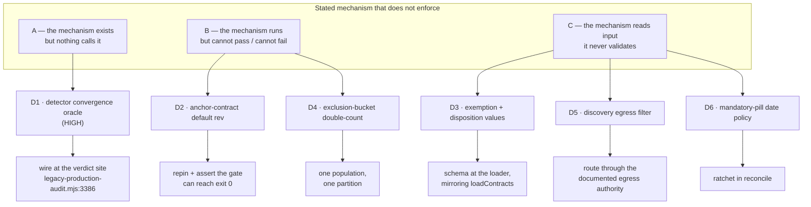

# Plan: Gate-honesty defects confirmed by blind adjudication

- **Date**: 2026-08-08
- **Status**: In Progress
- **Author**: Claude + Louis
- **Scope**: backend

> **Provenance**: every item here was raised by a final-review shadow reviewer
> during the bake-off, adjudicated **blind to arm** on 2026-08-08, and then
> verified against code at `561c18f0`. Source:
> [`final-review-shadow-bakeoff.md`](final-review-shadow-bakeoff.md) §0.7b.
>
> **Seven became six during Phase 1.** The claim that a script-keyed exemption
> silently covers a newly appended command was **accepted in adjudication and
> is false**: [`check-gate-poison-pills.mjs:168`](../../scripts/check-gate-poison-pills.mjs)
> (`561c18f0`) guards it with `commandCount.get(g.script) === 1`, so a
> script-level exemption stops applying to *every* command the moment a second
> one appears — a loud failure, not a silent inheritance. Measured: all 17
> current exemptions key single-command scripts. The mis-adjudication came from
> reading the exemption *keys* without reading the *consumer*, which is the
> failure mode "verify, don't judge" exists to prevent. Label corrected in the
> store; per-arm rate drops 1.75 → **1.50**.

- **Target domain(s)**: `audit-orchestration`, `install`, `scripts`
- ⚠ **Cross-domain work** — touches 3 domains. Intentional: the defects share a
  *class* (a stated mechanism that does not enforce), not a module. Each fix
  stays inside its own domain; nothing new spans them.

## 1. Context Summary

**Scope**: backend (CLI + library). Stack: `js-ts`. No frontend surface.

### Code Trace

Read at `561c18f0`:

- [`scripts/lib/audit/convergence.mjs:55-66`](../../scripts/lib/audit/convergence.mjs)
  — `evaluateConvergenceWithDetectors`, whose docblock states the detector gate
  is "REQUIRED, not optional" → `grep -rn "evaluateConvergenceWithDetectors\|checkDetectors" scripts/`
  returns **nothing** outside `convergence.mjs`, `detector.mjs` and tests.
- Production convergence, both sites:
  [`legacy-production-audit.mjs:3325`](../../scripts/lib/audit/legacy-production-audit.mjs)
  (author-tier telemetry, observation-only) and
  [`legacy-production-audit.mjs:3386`](../../scripts/lib/audit/legacy-production-audit.mjs)
  → `recordConvergenceState(cloudRunId, {round_converged_after})`. Both call
  the **count-only** `evaluateConvergence`. The second is the one
  `ship-commit.mjs` reads to license `AI-Gate: passed`.
- [`skills/audit-code/SKILL.md:484`](../../skills/audit-code/SKILL.md) — "Step
  5.0b — Re-run every detector at FULL scope (**blocks convergence**)". The
  claim is in the skill; the enforcement is in an uncalled function.
- [`scripts/lib/audit/detector.mjs:131`](../../scripts/lib/audit/detector.mjs)
  — `checkDetectors(ledger, opts)` takes the R2+ adjudication ledger, which
  `legacy-production-audit.mjs` already validates at
  [`:320 validateLedgerForR2`](../../scripts/lib/audit/legacy-production-audit.mjs).
  The input the oracle needs is already in scope at the call site.
- [`scripts/check-gate-poison-pills.mjs:110-124`](../../scripts/check-gate-poison-pills.mjs)
  — `loadContracts` validates through `loadCliGateContracts` and **throws** on
  divergence; `loadExemptions` two lines below is
  `JSON.parse(readFileSync(...)).exempt ?? {}`.
- [`scripts/lib/audit/tiered-shadow-summary.mjs:327-339`](../../scripts/lib/audit/tiered-shadow-summary.mjs)
  — `notCompared` is derived from `historicalComplete`; `excludedMalformedAnchors`
  on the next line is derived from `withComparison`.
- [`scripts/model-eval-discovery.mjs:57-60,166`](../../scripts/model-eval-discovery.mjs)
  — imports the map builders directly and filters with
  `shouldSkipForIndexing(path, ['sensitive'])`.
- [`scripts/verify-anchor-contract.mjs:96,189-193,297`](../../scripts/verify-anchor-contract.mjs)
  — `DEFAULT_FIXTURE_REV = 'cee4448'`; 0 raw findings →
  `contract_not_exercised` → generator `could_not_run` → `exitCode: 2`.

### Neighbourhood considered

`reconcile` ([check-gate-poison-pills.mjs:147](../../scripts/check-gate-poison-pills.mjs))
banded **`precedent` / `above-floor-cluster`** — the strongest duplication
signal. Opened it: it is the consumer of both loaders and already owns the
per-command decision logic. **Decision: extend it, do not write a sibling.** The
exemption schema belongs beside `loadContracts`'s existing validated path
(mirroring its throw-on-divergence shape), and the date ratchet belongs inside
`reconcile` where the gate list and the exemption set are both already in hand.
Everything else banded `review` — greenfield within its own file.

## 2. Proposed Architecture

The six defects are one class in three shapes. The fix shape follows from which:



### Key design decisions

**D1 — wire, don't delete** (#5 single source of truth, #19 observability).
The alternative was deleting `evaluateConvergenceWithDetectors` and the
SKILL.md claim. Rejected: the SKILL text at `:484` is a rule the audit loop
actually follows by hand, and `checkDetectors` is what makes "fixed 1 of 4"
non-converging. Deleting it would remove the enforcement and keep the
hand-executed rule — the worst of both. Wire it at **`:3386` only** (the store
verdict that licenses `AI-Gate: passed`), leaving `:3325`'s telemetry on the
count-only predicate: that site records what the *thresholds* said, and
changing it would silently redefine a recorded observation series.

**Fail direction is the whole decision, and ledger PRESENCE is the wrong
predicate** (audit R1-H1). `evaluateConvergenceWithDetectors` returns
`detector-not-run` when handed nothing, so wiring it makes an audit with no
detector result **non-converged** — stricter than today. The naive rule "no
ledger ⇒ pass an explicit empty result" conflates two states that must diverge:
a legitimate R1 run (no ledger can exist) and an R2+ run whose ledger was
**omitted, corrupt, or lost** (detectors are *unknown*, not *absent*). Granting
the second an explicit-empty result rebuilds this plan's own defect class on an
operational failure path.

The distinction is already computed in the file being changed.
[`validateLedgerForR2`](../../scripts/lib/audit/legacy-production-audit.mjs)
(`:320`, `561c18f0`) returns `{valid:true}` for `round < 2` and
`{valid:false, suppressionUnavailable:true}` for an R2+ ledger that is missing
or corrupt. So the call site keys on **round + validity**, never on presence:

| Round | Ledger state | `detectorResult` passed | Convergence effect |
|---|---|---|---|
| R1 | none (expected) | `{blocked:false, checked:0}` | unchanged — no detectors can exist yet |
| R2+ | valid | `checkDetectors(ledger, {cwd})` | the real gate |
| R2+ | missing / corrupt (`suppressionUnavailable`) | **nothing passed** | `detector-not-run` ⇒ **not converged** |

Row 3 is the finding's substance and the reason this is HIGH: an R2+ round that
lost its ledger currently converges on counts alone and can license
`AI-Gate: passed`. `suppressionUnavailable` is already propagated into
`_executionMeta`, so the reason is reportable, not silent.

**This table is the only statement of the rule.** Every other section points
here rather than paraphrasing — the first fix for this finding restated it as
"no ledger ⇒ explicit empty" in three other sections, and an implementer
following any of them would have written `if (!ledger) emptyResult` and
reinstated the defect (audit R2-H1). A rule stated four times is a rule with
three chances to drift.

**Testable seam** (audit R2-M1). `:3386` sits deep inside a large function, so
a test that reaches it through the production import proves little and mocks a
lot. The mapping in the table above is therefore extracted as a pure exported
function in `convergence.mjs`, beside the oracle it feeds:

```js
resolveDetectorResultForRound({ round, suppressionUnavailable, ledger, cwd, checkDetectorsFn })
//  round not a positive integer  -> undefined                  (=> detector-not-run)
//  round === 1                   -> { blocked: false, checked: 0 }
//  suppressionUnavailable        -> undefined                  (=> detector-not-run)
//  otherwise                     -> checkDetectorsFn(ledger, { cwd })
```

**As shipped, and two of those lines are corrections the build earned.** The
draft took `ledgerValidation` — which is `const`-scoped inside `if (isR2Plus)`
and **not visible** at the verdict site, so it would have thrown on every R2+
run. The function-scoped `suppressionUnavailable` (`:1644`) carries the same
fact and is the binding the signature now forces. The draft also had no
round-shape guard: `!(round >= 2)` is true for `undefined`, `NaN`, `0` and
negatives, so a lost round took the converges-clean branch — fail-open inside
the resolver written to fail closed. The orchestrator normalises `round || 1`,
so R1 behaviour is unchanged and the resolver stays strict. `checkDetectorsFn`
is injected rather than imported, which keeps the threshold free of a dependency
on the ripgrep call and lets all four rows be asserted without a filesystem.

The three rows are then unit-assertable without touching the orchestrator, and
`:3386` becomes a one-line call.

**A reference-level oracle is not enough** (audit R3-M1). "`legacy-production-audit.mjs`
imports both symbols" passes when the import is unused, used in a non-verdict
branch, or when the resolved result is computed and then not passed — which is
precisely the shape of the defect being fixed, so the guard would be as
unfalsifiable as the thing it guards.

**A poison pill is the WRONG mechanism here** (Gemini gate, R1-G1 — an idea
this plan proposed and then retracted). A pill breaks an *artifact* and asserts
the *gate* exits non-zero. Mutating the orchestrator's own enforcement so it
bypasses the detector makes the audit **converge** — exit 0 — which the runner
reads as "the gate failed to notice the tamper", inverting the pill's meaning
and permanently reddening `gates:poison`. Pills also cover `check`-chain
commands; `/audit-code` convergence is not one.

What the wiring actually gets, in decreasing strength:

1. **Unit tests on `resolveDetectorResultForRound`** — all three rows of the
   table above, including the `suppressionUnavailable` ⇒ `undefined` row that
   is the finding's substance. Strong, and covers the logic.
2. **A call-shape assertion** in `tests/audit-detector.test.mjs`: parse
   `legacy-production-audit.mjs` and assert `evaluateConvergenceWithDetectors`
   is called at the `:3386` site **with `resolveDetectorResultForRound(...)` as
   its second argument** — not merely imported. Falsifiable (delete the
   argument, the test fails) and cheap, but static: it proves the shape, not
   the runtime flow.
3. **Named residual**: nothing offline proves the stored
   `round_converged_after` reflects the detector gate on a real run, because
   that value is written inside a live orchestration with a cloud write. The
   pre-ship rule applies instead — Cluster A ships alone and is verified by one
   real `/audit-code` run whose R2+ ledger is deliberately withheld, observing
   non-convergence. That is an **empirical** check, recorded in §9, not a claim
   that a unit test covers it.

**D3 — mirror the validated half, do not invent a second validator**
(#1 DRY, #12 validation). `loadContracts` already throws on a bad contract via
`loadCliGateContracts`. The exemption loader gets the same shape: a Zod schema
requiring a non-empty reason string, and a throw carrying every divergence.

**D4 — one population is not enough; the partition needs a PRECEDENCE order**
(audit R1-H4). "Compute `excludedMalformedAnchors` over the same population as
its siblings" is necessary and insufficient: the regression fixture is a row
that is *both* contract-failure and stale-epoch, so aligning populations still
leaves it matching two predicates. The module already states the invariant it
breaks — "every excluded row lands in exactly one printed bucket … never
double-counted" ([`tiered-shadow-summary.mjs:320-326`](../../scripts/lib/audit/tiered-shadow-summary.mjs),
`561c18f0`) — and already implements precedence for one case (epoch first,
"we cannot judge its population under a contract we no longer claim").

The fix generalises that into a **single ordered classifier** over
`historicalComplete`, assigning each row the FIRST reason that matches:

1. `staleEpoch` — superseded contract; no other judgement is meaningful.
2. `fallback` — `tieredRunStatus === 'fallback_legacy'`: the tiered pipeline
   never produced a comparable side because it **fell back**, which is a
   different fact from producing one that turned out degenerate.
3. `malformedAnchors` — our schema ate the candidates; the population is empty
   because of us, so it cannot be called degenerate.
4. `noStage0Evidence` — Stage 0 verified zero.
5. `degenerateComparison` — everything else that fails `hasComparablePopulation`.
6. otherwise → `compared`.

**`fallback` is row 2, and omitting it was a real defect in the first draft of
this classifier** (Gemini gate R2-G1). `excludedFallback` already exists
([`tiered-shadow-summary.mjs:319`](../../scripts/lib/audit/tiered-shadow-summary.mjs),
`561c18f0`) and is already summed by the report. A fallback run fails
`hasComparablePopulation`, so a 5-state list would have swept it into
`degenerateComparison` and destroyed the distinction between "the pipeline fell
back" and "the pipeline ran and the populations were not comparable" — a
taxonomy regression shipped inside a taxonomy fix. It sits **above**
`malformedAnchors` because a run that fell back never reached the producer
boundary, so a malformed-anchor verdict on it would be a false diagnosis — the
same reasoning the module already applies to `staleEpoch`.

Note this makes `excludedFallback`'s population change (it is currently computed
over `withComparison`, like `excludedMalformedAnchors`), so it is part of the
same one-classifier migration rather than a bystander.

Unknown/unclassifiable rows land in an explicit `excludedUnclassified` bucket
rather than vanishing — a row that matches no reason is a defect in the
classifier, and a silent drop is what makes the sum look right while the
taxonomy is wrong. The assertion `comparedRuns + Σ(all exclusion reasons) ===
historicalCompleteRuns` then holds **by construction**, and the test asserts it
on the both-predicates fixture specifically.

**A new bucket is an output-contract change, and it has three consumers**
(audit R3-M2). `excludedUnclassified` is not confined to the summariser:

| Consumer | Change |
|---|---|
| [`scripts/tiered-shadow-report.mjs:145`](../../scripts/tiered-shadow-report.mjs) | **sums** the exclusion reasons — omitting the new bucket makes the printed total silently under-count, the exact defect D4 fixes, one file over |
| [`scripts/lib/dashboard/schema.mjs:438`](../../scripts/lib/dashboard/schema.mjs) | Zod shape — add `excludedUnclassified: count.default(0)`; the `.default(0)` keeps historical envelopes valid |
| [`scripts/lib/dashboard/collect-telemetry.mjs:681`](../../scripts/lib/dashboard/collect-telemetry.mjs) | zero-state initialiser — add the key or the dashboard reads `undefined` |

The `.default(0)` on the schema is what makes this backward-compatible: a
stored envelope written before this change stays valid and reads 0, rather than
failing validation and taking the whole telemetry panel down.

**D5 — route through the named authority, do not add a second filter**
(#5, #15). `diff-path-map.mjs`'s docblock names `resolveEligibleDiffPathMap` as
the authority "before any id can reach a tool schema".
`scripts/model-eval-discovery.mjs` is a second live-provider path that reaches
the same tool schema through `shouldSkipForIndexing`, which classifies a path
**string** and does not resolve symlinks — the INC-001 bypass class.

**The data flow, concretely** (audit R1-H3 — "filter through the authority" is
not a specification). The authority is
[`resolveEligibleDiffPathMap(diffText, {repoRoot})`](../../scripts/lib/audit/discovery-diff-scope.mjs)
(`:120`, `561c18f0`) → `{map, skipped}`. It calls `buildDiffPathMap` itself and
then, per entry and per side of a rename, applies **both** filters:
`shouldSkipForIndexing` (lexical) and — for any path that `existsOnDisk`
(`lstatSync`, which does not follow the final link) — `resolveAndClassify`
against `repoRoot`, which is the realpath-resolving check `shouldSkipForIndexing`
lacks.

So the change is a substitution, not an addition:

| today (`model-eval-discovery.mjs:166`) | after |
|---|---|
| `buildDiffPathMap(diffText)` then `entries.filter(e => !shouldSkipForIndexing(e.newPath,['sensitive']).skip && !shouldSkipForIndexing(e.oldPath,…).skip)` | `resolveEligibleDiffPathMap(diffText, { repoRoot })` |

- **`repoRoot`** is passed explicitly (the same value the script already uses to
  read the diff), never left to the `process.cwd()` default — the authority's
  own docblock records that an implicit cwd defeated an explicit test root.
- **`skipped[]` is logged, not discarded** — a dropped path is evidence the gate
  worked; silently shrinking the enum is how an egress filter becomes
  unfalsifiable.
- **`map.kind !== 'ready'`** propagates unchanged: the authority returns the
  invalid union untouched, and discovery already has a failure path for it.
- **Fail direction**: an entry whose classification cannot be resolved is
  dropped (the authority fails closed), so the enum can only ever shrink.

**The adaptation, exactly** (audit R2-M2). The caller currently consumes a raw
`buildDiffPathMap` result, and the authority returns the *same union* — it calls
`buildDiffPathMap` internally and returns its value untouched when
`kind !== 'ready'`. So `map` is a drop-in for what
`model-eval-discovery.mjs` already holds, and the only new value is `skipped`:

| Authority result | Discovery does |
|---|---|
| `{map:{kind:'ready', entries}, skipped}` | build the enum from `map.entries` — no manual `shouldSkipForIndexing` pass remains |
| `{map:{kind:'invalid', reason}, skipped:[]}` | unchanged from today: the existing invalid-union failure path |
| `skipped.length > 0` | one stderr line: `[discovery] N path(s) withheld by the egress gate` — **count and category only, never the paths** |

The count-only log is deliberate and follows the repo's existing skip-logging
rule (`formatSkipLog`: sensitive entries aggregate; basenames and full paths are
never emitted, even under debug). Logging the withheld paths to prove the filter
worked would be the disclosure the filter exists to prevent.

**Behaviour test at the real seam**: the D5 test drives
`model-eval-discovery`'s enum-construction path — not `resolveEligibleDiffPathMap`
in isolation, which is already covered — with a fixture containing a benign-named
symlink into a sensitive target, and asserts the id never appears in the built
schema.

#### D5b — the CONTENT path has the same weakness (Gemini gate, R1-G2)

Fixing only the enum would close one of two egress paths in the same script and
let the plan claim the seam was secured — the "fixed 1 of 4" shape D1 exists to
prevent, in D1's own plan. `scripts/model-eval-discovery.mjs:135` builds `files`
from `git diff-tree --name-only` and passes them to `readFilesAsContext`
(`:149`), whose filter is
[`isSensitiveFile → classifyPath(relPath)`](../../scripts/lib/audit-scope.mjs)
(`:22`, `561c18f0`) — **lexical, on the path string**, the same class of filter
D5 is replacing on the enum side.

**Verified before accepting, and the severity is lower than reported.** Reading
[`safeReadFile`](../../scripts/lib/audit-scope.mjs) (`:85-87`): it calls
`fs.realpathSync` and rejects anything resolving outside the cwd boundary. So
the headline case — a benign symlink into `~/.ssh/` — is **already blocked**,
by the boundary rather than by the classifier. The real residual is narrower:

- a symlink whose realpath stays **inside the repo** but points at a
  lexically-sensitive file (`<any-benign-name>.md` → `.env`) passes
  `isSensitiveFile`, because the classifier never sees `.env`;
- `redact: true` then masks secret *values* via `redactSecrets`, so what
  survives is structure and any secret shape the patterns miss.

Narrow, and defence-in-depth already covers most of it — but it is exactly the
INC-001 symlink-bypass class, on the Tier-3 seam, in a script that ships the
result to a third-party provider.

**Fix — derive the file list from the authority, do not filter it twice**
(Gemini gate R3-G2). The first draft proposed a second `resolveAndClassify`
pass over the `git diff-tree --name-only` output. That is two egress-filter
paths to keep in sync and a second shell-out to git, in a plan whose whole
subject is single sources of truth. `resolveEligibleDiffPathMap` has **already**
parsed the diff and returned the authorised entries, so:

```js
const { map, skipped } = resolveEligibleDiffPathMap(diffText, { repoRoot });
const files = map.kind === 'ready'
  ? [...new Set(map.entries.flatMap((e) => [e.newPath, e.oldPath]))]
  : [];
const discoveryCode = readFilesAsContext(files, { … });
```

One authority, one filter, one traversal — and the enum and the content are now
provably the same set, which the two-filter version could not guarantee. The
`git diff-tree --name-only` call disappears.

Test: the in-repo symlink case (`fixture/notes.md` → `fixture/.env`) — asserted
absent from the assembled context. The out-of-repo case is asserted too, as a
**negative control on the instrument**: it must fail for the boundary reason
even with this fix reverted, so a green there is not evidence for the new filter.

## 5. Sustainability Notes

The recurring assumption these six encode: *a mechanism that exists is a
mechanism that runs.* Five of the six were introduced **by a fix for the same
class** — D1's oracle was hardened against a silent-pass in the very round that
left it uncalled. The durable guard is not another checklist item but the
gate-contract system already in this repo: D1 and D6 both end with a contract
binding the claim to code, so the next regression fails a test rather than
waiting for a shadow reviewer.

### Right-sizing gate

Only D1 and D6 introduce new structure; the rest are edits inside existing
functions.

- **D1 band-aid**: delete the uncalled oracle and the SKILL claim. Root cause
  (an unenforced convergence rule) resurfaces the next time someone reads the
  SKILL and believes it. **Over-engineered**: a general "gate registry" that
  discovers stated gates and asserts a caller for each. No current requirement —
  there is one such gate. **Chosen**: one call site + one gate-contract entry.
- **D6 band-aid**: leave the policy as a comment and remember. **Over-engineered**:
  a policy DSL over the exemption file. **Chosen**: a date field on each
  exemption entry, compared against a constant in `reconcile` — the ratchet is
  four lines because the data to compare already exists.

#### D6 — what the ratchet actually enforces (audit R1-H2)

The draft said a post-cutoff exemption "without a contract" must fail, while
specifying a schema of only `{reason, addedAt}` and no contract-association
model. That phrasing described a conditional the schema could not implement.
**The rule is unconditional and needs no contract field**: the policy says a
gate added after 2026-07-31 must carry a **pill**, so for such a gate an
exemption is *not an available option*. `reconcile` therefore rejects any
exemption whose `addedAt > POLICY_CUTOFF`, full stop. Contract association is
already handled by the existing pilled/undeclared logic — an exemption removed
by the ratchet simply leaves its command undeclared, which is the pre-existing
loud failure.

**`addedAt` is self-reported, and the plan does not pretend otherwise.** Someone
adding a new exemption could backdate it. The ratchet is a speed bump against
*accident* — appending an entry without realising the policy applies — not a
defence against a determined author. The real control is that `addedAt` sits in
a reviewed diff. Stating this is the point: a ratchet advertised as tamper-proof
would be another stated-but-unenforced mechanism, in the fix for stated-but-
unenforced mechanisms.

**Migration provenance — the 17 dates are derived, not chosen** (audit R2-M3).
Assigning all 17 grandfathered entries a date by hand during one migration would
make the ratchet's only predicate arbitrary — and every entry would trivially
predate the cutoff because the migrator picked it. Each `addedAt` is instead
**derived from git**, the commit that introduced that entry's line:

```bash
git log --format=%ad --date=short -S'"<exemption key>"' -- scripts/gate-contracts/_exemptions.json | tail -1
```

**Not `--diff-filter=A`** (audit R3-H1): that restricts to commits which *add a
file*, so it finds nothing for an entry appended to the already-existing
`_exemptions.json` — which is every entry but the first. `-S` alone finds all
commits changing the key's occurrence count; `tail -1` takes the oldest, which
is the introduction. Verified on a live entry: `docs:check` → `2026-08-01`.

**Provenance is a JSON field, not a comment** (audit R3-H1): `_exemptions.json`
is parsed with `JSON.parse`, which has no comment syntax, so the `#` marker the
previous draft proposed would have made the file unparseable — a migration that
breaks the gate it is migrating. Each entry is:

```json
{ "reason": "…", "addedAt": "2026-08-01", "addedAtSource": "git-log-S" }
```

`addedAtSource` is a closed enum: `git-log-S` (derived as above) or
`file-creation` (the `-S` search returned nothing — entry predates the file or
moved into it). The fallback value is **visible imprecision, not silence**, and
the schema requires it, so an entry cannot omit provenance.

The migration commit records the command and the resulting table, so a reviewer
can re-derive any entry rather than trust it. This is derived provenance, not
proof: a date recovered from history is still a claim about history, but it is
one anyone can check, which the hand-assigned version is not.

> **DEVIATION, forced by the data (2026-08-09, Cluster B).** This section says
> `addedAt` — *when the exemption entry was written*. Implementation proved that
> wrong: deriving it from the registry's own history dated **all 17 entries
> `2026-08-01`**, the day the file was created, which is AFTER the cutoff — so the
> ratchet would have declared every grandfathered entry forbidden and failed on
> its own migration. The policy's subject is the GATE's age, not the registry's.
> Shipped as **`gateAddedAt`**, derived from `package.json` history
> (`git log -S '"<key>":' -- package.json | tail -1`), with `gateAddedAtSource`
> in `{git-log-S, unknown}` and an optional `policyOverride`.
>
> The ratchet immediately found one real case: **`gates:poison` itself** entered on
> `2026-08-01`, post-cutoff. A pill for the pill-runner is circular, so it carries
> an explicit `policyOverride` — visible in the diff, which is the point.
>
> **And the source label is now VERIFIED, not asserted** (audit clusterB-H2/H3):
> `verifyExemptionProvenance` re-derives every `git-log-S` date at check time and
> reports a divergence. Without it, `gateAddedAtSource` was a label claiming a
> provenance nothing checked — a stated-but-unenforced claim inside the fix for
> stated-but-unenforced claims. A failed derivation is `unverified` and reported,
> never silent agreement (14 of 17 verify; 3 exact-command keys legitimately
> cannot and say so).

**Date contract** (audit R1-M2): `addedAt` is a **calendar date string,
`YYYY-MM-DD`, UTC, no time component**, validated by regex *and* by a
round-trip (`new Date(s).toISOString().slice(0,10) === s`) so `2026-02-30`
fails rather than normalising to March 2. Comparison against the cutoff is
**lexicographic string comparison**, never `Date` parsing — ISO-8601 dates sort
correctly as strings, and this removes timezone and DST from the gate entirely.
A missing or malformed `addedAt` is a schema failure, not a grandfathering
default: silently treating it as old is the fail-open direction.

**Manual vs scripted**: all six are hand edits. No repeated regular
transformation, so no codemod.

## 7. File-Level Plan

| File | Intent | Purpose |
|---|---|---|
| [`scripts/lib/audit/legacy-production-audit.mjs`](../../scripts/lib/audit/legacy-production-audit.mjs) | modify | Wire `evaluateConvergenceWithDetectors` at the `:3386` verdict site, feeding it `resolveDetectorResultForRound(...)` (below). **Never branch on ledger presence** — see §2's three-row table, which is the single statement of this rule. |
| [`scripts/lib/audit/convergence.mjs`](../../scripts/lib/audit/convergence.mjs) | modify | Add `resolveDetectorResultForRound({round, suppressionUnavailable, ledger, cwd, checkDetectorsFn})` — the pure, exported seam that maps §2's table to a `detectorResult` (or `undefined`). Docblock names the production call site so the next reader can tell wired from stated. |
| [`skills/audit-code/gate-contract.json`](../../skills/audit-code/gate-contract.json) | modify | Bind the detector-convergence claim to its enforcing code + test. |
| [`scripts/verify-anchor-contract.mjs`](../../scripts/verify-anchor-contract.mjs) | modify | Replace `DEFAULT_FIXTURE_REV` with a **committed fixture diff** (below). `--rev <sha>` stays as an opt-in override. |
| `tests/fixtures/anchor-contract/known-defects.diff` | create | The pinned input: a unified diff carrying defects both generators found at `d3c6269`. Committed, so a shallow clone works and the input cannot drift. |
| [`scripts/check-gate-poison-pills.mjs`](../../scripts/check-gate-poison-pills.mjs) | modify | Schema-validate `loadExemptions` (non-empty `reason`, `addedAt` date); add the post-2026-07-31 ratchet to `reconcile`. |
| [`scripts/gate-contracts/_exemptions.json`](../../scripts/gate-contracts/_exemptions.json) | modify | Migrate the 17 entries from bare strings to `{reason, gateAddedAt, gateAddedAtSource}`; move the policy out of `_comment` into enforced data. |
| [`scripts/lib/audit/detector.mjs`](../../scripts/lib/audit/detector.mjs) | modify | `disposition` values must be non-empty (`z.string().min(1)`). |
| [`scripts/lib/audit/tiered-shadow-summary.mjs`](../../scripts/lib/audit/tiered-shadow-summary.mjs) | modify | Single ordered classifier over `historicalComplete`; add `excludedUnclassified`. |
| [`scripts/tiered-shadow-report.mjs`](../../scripts/tiered-shadow-report.mjs) | modify | Include the new bucket in the printed exclusion sum (D4 consumer). |
| [`scripts/lib/dashboard/schema.mjs`](../../scripts/lib/dashboard/schema.mjs) | modify | `excludedUnclassified: count.default(0)` — the default keeps stored envelopes valid. |
| [`scripts/lib/dashboard/collect-telemetry.mjs`](../../scripts/lib/dashboard/collect-telemetry.mjs) | modify | Add the key to the zero-state initialiser. |
| [`scripts/model-eval-discovery.mjs`](../../scripts/model-eval-discovery.mjs) | modify | BOTH egress paths through one authority: `resolveEligibleDiffPathMap` for the enum, and `resolveAndClassify` over the file list before `readFilesAsContext` (D5 + D5b). |
| [`tests/audit-detector.test.mjs`](../../tests/audit-detector.test.mjs) | modify | Add the wired-call assertion (D1) and the empty-disposition rejection (D3). |
| [`tests/gate-poison-exemption-schema.test.mjs`](../../tests/gate-poison-exemption-schema.test.mjs) | create | Exemption schema + date ratchet, both directions (D3, D6). |
| [`tests/tiered-shadow-summary.test.mjs`](../../tests/tiered-shadow-summary.test.mjs) | modify | Partition invariant on the both-predicates fixture; `excludedUnclassified` stays 0 (D4). |
| [`tests/verify-anchor-contract.test.mjs`](../../tests/verify-anchor-contract.test.mjs) | modify | D2's two directions, hermetically — see below. |
| [`tests/egress-path-scan.test.mjs`](../../tests/egress-path-scan.test.mjs) | modify | D5: the symlink case the lexical filter misses (Tier 3, same commit). |

**D2: a committed fixture, not another sha** (audit R2-H2). Repinning
`DEFAULT_FIXTURE_REV` from one historical revision to another fixes today's
symptom and keeps every property that caused it: the input is a git object a
shallow clone may not have, it is reachable only by network+history, and
nothing prevents the new rev drifting clean the way `cee4448` did. A default
whose validity rests on an untested external object is the same class of defect
as the gate it is meant to prove.

So the default input becomes a **committed fixture diff**,
`tests/fixtures/anchor-contract/known-defects.diff`, extracted once from
`d3c6269` (the rev that produced 16 verified findings). `--rev <sha>` remains
for ad-hoc runs against real history. This makes the default:

- **portable** — present in every clone, shallow or not;
- **immutable** — it cannot drift clean, because nothing rewrites it;
- **reviewable** — if someone weakens it, that is a visible diff.

**A committed diff alone does NOT deliver immutability** (Gemini gate R3-G1 —
the plan claimed a property it had not earned, which is this plan's own subject).
The probe assembles its prompt with `readFilesAsContext`, which reads **current
contents from the working tree**. Pinning the diff freezes the *changes*; the
*code the model actually analyses* still comes from live `HEAD`. As the repo
evolves — and specifically as the defects referenced in that historical diff get
fixed on main — the analysed content stops containing them and the probe drifts
clean exactly as `cee4448` did, one indirection later.

So the fixture is a **self-contained input bundle**, not a lone diff:

```
tests/fixtures/anchor-contract/
  known-defects.diff        # the unified diff (the change under review)
  files/<path>...           # snapshots of every file the diff references
  MANIFEST.json             # source rev, extraction date, expected finding count
```

The probe reads context from `files/` rather than the worktree when running in
fixture mode. Only then is "immutable" true: both halves of the model's input
are committed, so the same bytes go to the provider on every run forever.
`--rev <sha>` keeps the live-worktree behaviour for ad-hoc runs against real
history, and the mode is reported in the output (§ input-resolution contract),
so nobody has to infer which semantics a given run had.

Cost check: the referenced files are a handful of source files, ~50KB. That is
proportionate — and the alternative is a probe whose result depends on when you
run it, which is the defect being fixed.

**Committing a historical diff is itself an egress decision** (audit R3-H2).
The fixture is extracted from history and then *sent to live providers on every
run* — and deleted content is exactly where credentials and private paths
survive. Extraction is therefore gated, not a `git show > file`:

1. `filterDiffFiles(diff, ['sensitive'])` — the state-aware filter, so a hunk
   touching a sensitive path never enters the fixture.
2. `redactSecrets(...)` over the surviving text — secret *values*, not paths.
3. Manual read of the result before committing. It is ~200 lines; a human
   reading it once is proportionate and is the only step that catches what the
   patterns do not.

A test pins the outcome so a later edit cannot regress it: the fixture contains
no path `shouldSkipForIndexing` classifies sensitive, and no secret-shaped token
per `lib/secret-patterns.mjs`. This is a **Tier 3** seam (sensitive-path egress)
— the fixture and its guard land in the same commit, non-negotiably.

Scope note: this repo is public and the fixture is drawn from its own history,
so the realistic risk is low. The gate is applied anyway because the fixture is
a *template* — the next repo to adopt this probe will copy the recipe, and a
recipe that says "commit a historical diff" without the filter is the defect
travelling.

What stays live is the *provider call*: the probe exists to prove real models
produce well-anchored findings, so the assertion "≥1 finding on this input"
still depends on a model. That is inherent to an acceptance probe and is why it
is not in `npm test`.

**Input-resolution contract** (audit R3-M3), because "the default changes to a
committed diff" does not say how it is found or what wins:

- `DEFAULT_FIXTURE_PATH` resolves **relative to the repo root**, derived from
  the module's own location (`fileURLToPath(import.meta.url)`), never
  `process.cwd()` — the probe must behave the same run from a subdirectory.
- **Precedence**: `--rev <sha>` (if given) wins and takes the historical path;
  otherwise the fixture. The two are mutually exclusive; supplying `--rev`
  alongside a future `--fixture` flag is an `ArgvError`, not a silent pick.
- **Format**: a unified diff with `diff --git` headers, parsed by the same
  `buildDiffPathMap` the pipeline uses. A fixture that fails to parse is
  `could_not_run` + exit 2 — the same honest bucket as 0 findings, never a
  crash and never a pass.
- **Mode is reported**: the JSON result and the human line both carry
  `input: {mode: 'fixture'|'rev', ref}`, so a run's provenance is visible in
  its own output rather than inferred from which flags someone remembers using.

**Test split.** `tests/verify-anchor-contract.test.mjs` stays hermetic and
asserts the **grader** (0 findings ⇒ `could_not_run` + exit 2; ≥1 ⇒ gradeable)
plus that the default input **resolves and parses** — a check that is cheap,
offline, and would have caught the original defect's cousin (a default pointing
at something unreadable). The live half is the opt-in command:

```bash
node scripts/verify-anchor-contract.mjs --generator sonnet
```

**Named residual**: no CI check proves a *model* still finds defects in the
fixture; a future model could return 0 and the probe would exit 2. That is a
model-behaviour claim no offline test can make, and it now fails loudly rather
than silently — which is the whole point of the grader's exit-2 mapping.

### 7b. Implementation Phases

**Phase 1 — The dead oracle (D1)**: wire the detector gate into the production
verdict, with the no-ledger input made explicit. Files:
`scripts/lib/audit/legacy-production-audit.mjs` (modify),
`scripts/lib/audit/convergence.mjs` (modify),
`skills/audit-code/gate-contract.json` (modify),
`tests/audit-detector.test.mjs` (modify).

**Phase 2 — Validation at the pass-granting loaders (D3)**: schema for
exemption values; non-empty detector dispositions. Files:
`scripts/check-gate-poison-pills.mjs` (modify),
`scripts/lib/audit/detector.mjs` (modify),
`tests/gate-poison-exemption-schema.test.mjs` (create).

**Phase 3 — The date ratchet (D6)**: exemption entries carry `addedAt`;
`reconcile` refuses a post-cutoff exemption. Files:
`scripts/gate-contracts/_exemptions.json` (modify),
`scripts/check-gate-poison-pills.mjs` (modify),
`tests/gate-poison-exemption-schema.test.mjs` (modify).

**Phase 4 — Gates that cannot pass or cannot balance (D2, D4)**: repin the
anchor-contract fixture; put the exclusion buckets on one population. Files:
`scripts/verify-anchor-contract.mjs` (modify),
`scripts/lib/audit/tiered-shadow-summary.mjs` (modify),
`tests/tiered-shadow-summary.test.mjs` (modify).

**Phase 5 — Egress authority (D5)**: route discovery's path filter through
`resolveEligibleDiffPathMap`. Files: `scripts/model-eval-discovery.mjs` (modify),
`tests/egress-path-scan.test.mjs` (modify).

**Close-out (not a phase)**: `npm run skills:regenerate` (gate-contract change),
`npm run gates:poison`, `npm test`.

## 8. Risk & Trade-off Register

| Risk | Mitigation |
|---|---|
| **D1 makes convergence stricter and breaks R1 runs.** | R1 is the first row of §2's table (explicit empty ⇒ converges). §2's table is the ONLY statement of the rule; no other section restates it, because a restatement is what let "no ledger ⇒ empty" survive the first fix in three places (audit R2-H1). |
| **D1 changes what licenses `AI-Gate: passed`.** Intended, and the reason it is HIGH — but it can retroactively make a previously-converging audit non-converge. | Ship it alone (Cluster A, `fix-gate: yes`) and run one real `/audit-code` before building on it. Per the pre-ship empirical-verify rule: a gate change is not done until it has been *seen to fail*. |
| **D2's default could still fail in a fresh checkout, or drift clean again.** | Addressed at the cause, not the symptom: the default input is a **committed fixture**, so portability and immutability are structural. **Residual**: a future model returning 0 findings on it — a model-behaviour claim no offline test can make. It fails loudly (exit 2). **Revisit trigger**: the first `could_not_run` on the fixture means refresh the fixture — never loosen the grader, which would restore the vacuous pass this defect is about. |
| **D6's ratchet rejects legitimate new exemptions.** | That is the point; the escape hatch is editing the grandfathered set deliberately, which is a visible diff. |
| **D5 could over-filter and starve discovery.** | The authority is already what the tiered pipeline uses; a divergence in what reaches the tool schema is itself the bug being fixed. Assert the two paths agree on a fixture. |
| Deliberately deferred: the two `judgement` findings (F08 testing-philosophy, F11 `invalid`-union taxonomy). | Neither is a code defect a read can settle; escalated to the user rather than labelled. |

## 9. Testing Strategy

Tier 1 (test-first) for D3, D4, D6 — pure predicates over fixtures. Tier 3
(**same commit**) for D5: it is the sensitive-egress seam, which the testing
doctrine makes non-negotiable.

- **D1**: three rows of the §2 table, each pinned separately — R1 (no ledger)
  converges; R2+ with a valid ledger runs the real gate; **R2+ with
  `suppressionUnavailable` does NOT converge**, reason `detector-not-run`. The
  third is the finding's substance. Red-then-green: make `checkDetectors`
  return `blocked:true` and observe the verdict flip, so the wiring is proven
  by a failure and not by a green that would also appear if the call were
  removed.
- **D2**: grader-level and hermetic (see §7). 0 findings ⇒ `could_not_run` +
  exit 2; ≥1 ⇒ gradeable. The pinned rev's own yield is explicitly NOT covered.
- **D3**: `""`, `true`, `null`, `{}` each rejected with the key named; a valid
  entry passes. Same for an empty-string disposition.
- **D4**: partition invariant on a fixture containing a contract-failure row
  that is *also* stale-epoch — the row currently double-counted — plus
  `excludedUnclassified === 0`, so a row silently dropped by the classifier
  fails the test rather than balancing the sum.
- **D5**: a benign-looking in-repo symlink resolving into a sensitive target is
  dropped before the enum is built. The lexical filter passes this path today —
  that is the negative control, and the test must be seen failing against the
  pre-change code.
- **D6**: an exemption dated after the cutoff fails; a grandfathered one passes;
  a malformed `addedAt` (`2026-02-30`, `2026-8-1`, missing) fails rather than
  defaulting to grandfathered.

Every one of these must be **seen to fail first** — six consecutive
verification-script failures in one prior session were all instrument defects.

## 11. Execution Clustering

- **Cluster A** — Phases 1 — fix-gate: yes
  - Coupling: single phase, isolated deliberately. It changes the convergence
    verdict that every later cluster's own audit is graded by, so it must be
    green before anything builds on it.
- **Cluster B** — Phases 2–3 — fix-gate: yes
  - Coupling: both edit `reconcile`/`loadExemptions` and the same exemption
    file; Phase 3's `addedAt` field is only checkable once Phase 2's schema
    exists. Splitting them would mean two migrations of the same 17 entries.
- **Cluster C** — Phases 4–5 — fix-gate: final
  - Coupling: three independent single-file fixes with no shared seam, grouped
    so the consolidated Gemini pass sees them together rather than paying a
    gate for each.
- **Final gate**: consolidated Gemini review over the union diff of A+B+C.

### 11.1 A cluster's fix-gate is judged on IN-CLUSTER findings only

*(Added 2026-08-08 after Cluster A hit this for real.)*

`/cycle` Step 3C states the fix-gate as "reach `/audit-code` convergence
(`HIGH == 0 && MEDIUM <= 2 && quickFix == 0`) before the next cluster builds on
it". Taken literally that is **unreachable for every cluster but the last**, and
this plan is the proof: `/audit-code` grades one cluster's *diff* against the
*whole plan*, so an unimplemented phase belonging to a later cluster is reported
as `[Structure] Missing planned file` — HIGH.

Measured on Cluster A (`audit-code-clusterA-1786227147`):

| Round | HIGH | of which in-cluster | of which later-cluster phases |
|---|---|---|---|
| R1 | 6 | 2 | 1 (+3 pre-existing, independent) |
| R2 | 5 | 2 | 2 (+1 pre-existing) |
| R3 | 3 | **0** | 2 (+1 truncated/unactionable) |

At R3 Cluster A's own work was clean, and the gate would still have refused —
forever, because the two remaining HIGHs were *"`tests/fixtures/anchor-contract/
known-defects.diff` is absent"* and *"`_exemptions.json` still declares bare
strings"*: Cluster C's Phase 4 and Cluster B's Phase 3, both correctly
unimplemented at that point. A gate that cannot be satisfied by doing the work
correctly is not a gate; it is the cried-wolf shape that earns `--no-verify`.

**The rule.** A cluster's fix-gate is evaluated over the findings whose cited
file lies in **that cluster's derived scope**. Every other finding is recorded
and carried forward, never silently dropped. Precisely, each finding is one of:

| Cited file is… | Classification | Effect on this cluster's gate |
|---|---|---|
| in **this** cluster's derived scope | **in-cluster** | **gates** — fix it, including if pre-existing (impact, not authorship) |
| in a **later** cluster's derived scope | **deferred-declared** | does not gate; must be zero at the final gate |
| in an **earlier** cluster's scope | **regression** | **gates** — an earlier cluster went `stale`; stop per Step 3C.5 |
| in **no** cluster's scope | **out-of-scope** | unchanged: fail closed, stop and ask |

**Three properties keep this from becoming an escape hatch:**

1. **Deferral is bounded, not permanent.** `deferred-declared` is defined by
   membership of a *later* cluster's declared scope. The final cluster has no
   later cluster, so the bucket is empty by construction there — every
   completeness finding the earlier gates deferred must be satisfied before the
   consolidated gate. The finding is postponed to the point where it is
   actionable, not forgiven.
2. **"Pre-existing" is still not a defer reason.** The middle two rows are about
   *plan schedule*, never about authorship. A finding citing a file in this
   cluster's scope gates it even if the line predates the change — AGENTS.md's
   impact test is untouched, and Cluster A honoured it (the two in-cluster HIGHs
   it fixed at R2 were both in code written that hour, but the three it deferred
   were deferred for **independence**, each with the reason written down).
3. **The classification is mechanical.** Derived scope is already computed from
   the member phases' `Files:` lines; no judgement call decides which bucket a
   finding lands in, so the rule cannot be argued into covering an inconvenient
   result.

**Recording requirement.** Every `deferred-declared` finding is listed in the
cluster's hand-back summary with the cluster that owns it. A deferral nobody can
see is indistinguishable from a dismissal.

> **This is a `/cycle` skill defect, surfaced here.** The plan can only state the
> rule for its own execution; `skills/cycle/SKILL.md` Step 3C carries the
> unreachable wording for every clustered plan. Fixing it there is out of this
> plan's declared scope (no §7 file entry) and is filed as follow-up rather than
> smuggled in — but any clustered plan run before that lands will hit the same
> wall, so the rule belongs upstream.

---

## Implementation Log

### 2026-08-08 — Cluster A (D1) shipped

Commit `fix(convergence): the detector gate was enforced by a function nothing
called` · `AI-Gate: waived` (an audit ran but did not converge to a verified
verdict, so `passed` is unavailable by design) · full suite 10,197 pass / 0 fail.

Audit `audit-code-clusterA-1786227147`, 3 rounds, in-cluster HIGH 2 → 0. The
audit found **four defects in the implementation of the fix**, which is the
result worth recording:

- `ledgerValidation` is `const`-scoped inside `if (isR2Plus)` and is **not
  visible** at the verdict site — the first draft would have thrown a
  `ReferenceError` on every R2+ run. `suppressionUnavailable` (function-scoped,
  `:1644`) is the correct binding, and §2's table now names it so the mistake is
  not re-makeable.
- `!(round >= 2)` treated `undefined`/`NaN`/`0`/negative as "this is R1" —
  fail-open inside the resolver written to fail closed. Now `Number.isInteger`
  + `>= 1`, with the orchestrator normalising `round || 1` so R1 is unchanged.
- `typeof checked === 'number'` admitted `NaN`, `Infinity`, `-1` as a completed
  census.
- The call-shape guard anchored on exact indentation and broke when a comment
  was added inside the call. Re-anchored on index + window: a test that fails on
  reformatting is one people learn to delete.

Both wiring mutants (count-only predicate; hardcoded empty detector result) were
verified to fail the guard and the control to pass it, so the guard is known to
do work rather than assumed to.

**Deferred-declared at hand-back** (per §11.1): `tests/fixtures/anchor-contract/
known-defects.diff` absent (Cluster C, Phase 4) and `_exemptions.json` still
bare strings (Cluster B, Phase 3). **Deferred-independent**: fire-and-forget
`recordFindings`/`recordPassStats`, silent `.catch(() => null)` on cloud
bootstrap, and a truncated `noCloudRecording` finding — none of which the
convergence verdict rides on; `recordConvergenceState` is awaited, and a lost
write can only make `AI-Gate` stricter.

**Not started**: Clusters B and C. The run halted before B because a concurrent
session held `detector.mjs` (Cluster B scope) and the branch is diverged after
their rebase — local `9905abff` and remote `a1a8028f` are patch-identical, and
`git merge origin/main` is blocked by *their* staged file. Cluster A is
committed locally; nothing ships until that is reconciled.

### 2026-08-09 — Cluster C: D4 + D5/D5b shipped; D2 NOT done

**Shipped.** D4 (one ordered classifier over one population, plus
`excludedUnclassified` and three output-contract consumers) and D5/D5b (both
discovery egress paths routed through `resolveEligibleDiffPathMap`, with the
content file list derived from `map.entries` so the enum and the bodies are
provably one set). Full suite green.

Two corrections the build forced:

- **`fallback` does NOT belong in the ordered classifier.** The consolidated
  Gemini gate flagged its omission from the taxonomy and was right that it must
  stay distinguishable — but a `fallback_legacy` row has `tieredRunStatus`
  other than `complete`, so it is not in `historicalComplete` and cannot be a
  member of *its* partition. Putting it inside the classifier counted zero rows
  and silently zeroed the statistic; the pre-existing tests caught it.
  `excludedFallback` stays a separate figure over `withComparison`, reported
  alongside the partition rather than summed into it.
- **A partition fixture must use `tieredRunStatus: 'complete'`.** An `ok`
  fixture asserts against an EMPTY population, so every count reads 0 and the
  sum check passes having measured nothing — the vacuous-pass shape, in the
  test written to prove a sum.

**D2 is NOT done, and two of its premises are wrong.**

1. §D2 says to gate the extraction with `filterDiffFiles(diff, ['sensitive'])`.
   That function takes a diff **state object** (`{added, modified, deleted}`),
   not unified-diff text, so the call returns an empty result — which reads as
   "everything was filtered". Measured: 876,103 bytes in, 89 bytes out.
2. The fixture source rev `d3c6269` is an **876KB** diff, not the "~200 lines,
   ~50KB" §D2 estimated, so "a handful of source files, ~50KB" does not
   describe the bundle either. The cost check in §D2 was made against a figure
   nobody measured.

What a correct D2 needs: a right-sized **subset** of that rev (the files
carrying the 16 verified findings, not the whole commit); per-path
classification with `shouldSkipForIndexing` **and** `resolveAndClassify`
rather than `filterDiffFiles`; then the file snapshots plus `MANIFEST.json`.
Gemini's immutability argument (R3-G1) still stands and still decides the
shape: a committed diff alone does not deliver immutability, because
`readFilesAsContext` reads the live worktree.

## Audit trail

**GPT (`/audit-plan`, SID `audit-plan-1786179073`) — 3 rounds, stopped at the cap.**

| Round | Verdict | H | M | Outcome |
|---|---|---|---|---|
| R1 | SIGNIFICANT_GAPS | 4 | 2 | all 6 fixed |
| R2 | NEEDS_REVISION | 2 | 3 | all 5 fixed |
| R3 | SIGNIFICANT_GAPS | 2 | 3 | all 5 fixed |

Stopped at R3: HIGH plateaued 2 → 2. Both R3 HIGHs were defects **introduced by
the R2 fixes** (a `#` comment proposed for a `JSON.parse`d file; an unreviewed
historical diff committed as a live-provider fixture), not new design gaps —
which is the signal the cap describes, not a reason to keep going.

**Gemini gate — 3 rounds** (cap is 2; the third taken under the genuine-bug
exception, which R3 then justified twice over).

| Round | Verdict | Findings | Outcome |
|---|---|---|---|
| G1 | REJECT | 2 HIGH | both fixed; one accepted with **corrected severity** after verifying against code — `safeReadFile` already blocks the out-of-repo case, so the real residual was narrower than reported |
| G2 | CONCERNS | 1 HIGH | fixed — the ordered classifier omitted the existing `excludedFallback` bucket, a taxonomy regression inside a taxonomy fix |
| G3 | CONCERNS | 1 HIGH, 1 LOW | both fixed — the committed diff did not deliver the immutability it claimed (`readFilesAsContext` reads the live worktree); and the D5b filter duplicated an authority that already returns the authorised list |

**Stop decision (recorded per the cap rule).** Three Gemini rounds, each
surfacing a concrete design defect, so each extension was earned. Stopping now
because the remaining surface has changed character: G3's findings were both
about *how* a specified mechanism is built, and the next artifact — real code —
is what `/audit-code` checks. Continuing would be paying a design gate to
review implementation detail, which the cap exists to prevent.

**Three of the five design defects this audit caught were introduced by an
earlier round's fix.** Worth stating plainly: the loop's value here was less in
judging the original draft than in catching the repairs, and every one of those
was the same class the plan is about — a claim made slightly ahead of what the
mechanism delivers.
