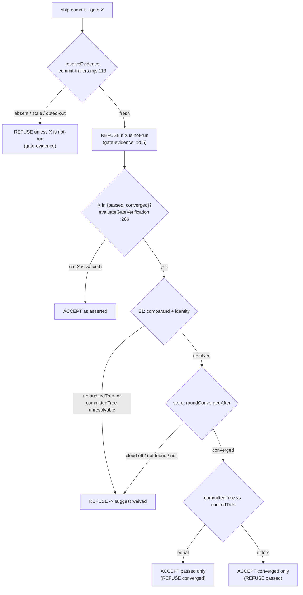

# Plan: An honest `AI-Gate` value for an audited-then-remediated ship

- **Date**: 2026-09-04
- **Status**: Complete
- **Author**: Claude + Louis Strydom
- **Scope**: backend
- **Stack**: `js-ts` (+ `postgres`); detected from `package.json`
- **Target domain(s)**: `shared-lib`, `ship`, `skills-content`, `docs`, `tests`, `audit-orchestration`
- ⚠ **Cross-domain work** — touches >1 domain. The crossings are intentional and
  are the ordinary shape of a provenance change: the decision lives in
  `shared-lib` (`commit-trailers.mjs`), its only caller is `ship`
  (`ship-commit.mjs`), and `skills-content` + `docs` carry the prose that
  teaches it. No new edge is introduced between domains — every one of these
  already exists (see §2.4).
- **Untagged paths**: none.

---

## 1. Context Summary

### The defect

`scripts/ship-commit.mjs` accepts `--gate passed | waived | not-run`. On the
single most desirable outcome of `/cycle --autonomous` — an audit ran, its
findings were accepted, the findings were **fixed**, and the result is shipped
— all three values are wrong:

| `--gate` | outcome with fresh evidence + a tree that moved post-audit |
|---|---|
| `passed` | REFUSED — `committedTree !== evidence.auditedTree` |
| `not-run` | REFUSED — evidence is `fresh` |
| `waived` | accepted — but documented as *"shipped past a gate via `--ignore-p0`/`--no-tests`, OR verification unavailable"* |

Nothing was bypassed and verification was available. More work was done, not
less. The trailer says the opposite of what happened, and a `/cycle` ship is
consequently **indistinguishable in git history from `/ship --no-tests`**.

### Measured evidence

All figures `measured` at HEAD `88025501` unless stated. Reproduction commands
and the full trace are in the investigation brief
(`.claude/tmp/gate-taxonomy-brief.md`, gitignored scratch — reproduced here in
the parts this plan depends on, since that file is not durable).

**(a) The dead-end is real**, reproduced by calling the two pure functions
directly with a `fresh` evidence stub and a differing `committedTree`:

```
passed  -> OK              (validateTrailerInput does not do the tree check)
waived  -> OK
not-run -> gate-evidence   (REFUSED)
passed w/ moved tree -> REFUSED   (evaluateGateVerification)
```

**(b) `passed` is broken by `/ship`'s own steps, not only by fixes.**
`auditedTree` is captured at the **start** of the audit run — deliberately,
so the hash names the bytes the audit read. But `/ship` Steps 2–5 are
MANDATORY and all write files *after* the audit and *before* Step 6.3's
commit: a `status.md` session entry, CLAUDE.md when needed, and the plan's
Implementation Log. So **even a zero-finding, converged, otherwise-untouched
audit loses `passed`.** Fixing findings is *sufficient* to break `passed`; it
is not *necessary*. This is the single most important fact in this plan and it
is currently written down nowhere.

**(b2) A second, independent reason `passed` was unreachable — found during
implementation, 2026-09-04.** In a **linked git worktree** `<root>/.git` is a
FILE (a `gitdir:` pointer), not a directory. `ship-commit.mjs` built the temp
index for the `--path` comparand at `path.join(repoRoot, '.git', …)`, so
`git read-tree` exited **128** (*"Unable to create …/.git/<name>.lock: No such
file or directory"*), `committedTree` stayed `null`, and the verified gates were
refused. Because `/ship`'s guard A makes `--path` **mandatory**, `passed` was
therefore **structurally unreachable for every scoped commit in every
worktree** — and this repo's sessions routinely run in worktrees. The 2-of-735
count in (c) is a floor on how unreachable it was, not the whole story.

Found by probing the refusal live rather than trusting that it fired for the
reason it named: the run reported the *comparand* as unresolvable where the
*store verdict* was the expected cause, and that mismatch is what exposed it.
Fixed here (resolve the real gitdir via `git rev-parse --git-dir`) because
`converged` is equally unreachable without it — in-scope by impact, not by
authorship. Regression: `tests/ship-commit-cli.test.mjs` row 5e, which asserts
*which* refusal appears, since both states refuse and only the reason
distinguishes them; a test asserting merely "exit 2" passes on the bug.

**(c) The historical distribution.**

```bash
git log --format='%(trailers:key=AI-Gate,valueonly)' | sort | uniq -c | sort -rn
```

→ **647 `not-run` · 86 `waived` · 2 `passed`** (plus 1722 pre-`provenance-v1`
commits with no trailer). `passed` is **0.27%** of gated commits, and
`docs/reference/commit-provenance.md` §"Verifying a historical `passed`"
records that an audit of *those two* found one whose stored tree did not match.

Consumer corroboration (operator-reported, a different store, **not**
re-measured here): `louis-strydom_wartsila/storyline`, whole history,
**21 `not-run`, 4 `waived`, 0 `passed`**. The prompting commit `8fdcbb0` was a
`/cycle --autonomous` run — 5 plan-audit rounds (22 findings, 22 accepted,
0 dismissed), an 18-finding code audit, a 2-round consolidated gate with 10
findings applied, every finding fixed — and it reads `AI-Gate: waived`.

**(d) The repo has rationalised this three times rather than naming it** —
`status.md` entries dated 2026-07-19, 2026-07-24 and 2026-07-20 (cited by
section header, not line, per verification-discipline §1: `status.md` is
append-newest-first). The last says *"the mechanical verification did not
hold, and that state has a name"*. It does not. It has `waived`'s name.

**(e) A separable docs↔binary contradiction.** `skills/ship/SKILL.md` §6.2
states *"`not-run` on a fix-heavy ship is the honest answer, not a failure."*
The binary refuses exactly that whenever evidence is fresh. The escape is
`--no-run-id`, and:

- `rg -n "no-run-id" skills/ship/SKILL.md` → **no output**. The flag appears
  **zero times** in the skill an agent actually reads. It exists only in the
  binary's `AGENT FIX` stderr string and in the v1 plan document.
- Its documented meaning is *"declares the audit unrelated"* — **false** on a
  fix-heavy ship.

So today there is **no honest path**: `waived` misdescribes what happened, and
`not-run` requires asserting something untrue.

### Code Trace

Read at commit `88025501` (this worktree). Line numbers pinned to that commit
per `docs/audit/shared-references/verification-discipline.md` §1.

The decision path, end to end:

`scripts/openai-audit.mjs:460-487` (`runMultiPassCodeAudit`) captures the
audit subject — `gitWorktreeTree(process.cwd())` → `ctx.auditedTree`,
`gitCommitSha` → `ctx.auditedSha`, `readActualIdentity` → `ctx.auditedBranch`
— **before** either pipeline runs
→ `scripts/lib/audit/run-persistence.mjs:217-231` forwards that context to
→ `scripts/lib/audit/gate-evidence.mjs:136-215` (`writeGateEvidence`) which
validates against the reader's own regexes and atomically writes
`.audit/last-audit-run.json`
→ at ship time `scripts/lib/commit-trailers.mjs:113-168` (`resolveEvidence`)
reads it back, deriving `state: fresh|stale|absent|malformed|unreadable`
from `evidenceMs > headCommitTs * 1000`
→ `scripts/lib/commit-trailers.mjs:252-266` (inside `validateTrailerInput`)
applies the gate↔evidence consistency rule — **this is where `not-run` is
refused on fresh evidence**, at `:255`
→ `scripts/ship-commit.mjs:429-483` resolves `committedTree`
(`gitIndexTree` when unscoped; a temp-index `read-tree HEAD` + `add -- <paths>`
+ `write-tree` reconstruction under `--path`, `:468-482`), deliberately
**inside** the `passed && fresh` branch to avoid a `git write-tree` spawn on
every docs-only commit (the adjacency decision is documented at `:440-455`)
→ `scripts/lib/commit-trailers.mjs:286-338` (`evaluateGateVerification`)
runs the E1 content check first and locally (`:296-317`), then the store
checks (`:319-335`) — **this is where `passed` is refused on a tree delta**,
at `:313`
→ on accept, `scripts/ship-commit.mjs:495` assigns `values.auditedTree`
→ `scripts/lib/commit-trailers.mjs:398-412` (`formatTrailerBlock`) emits the
block, gating `AI-Audited-Tree` on `v.gate === 'passed'` at `:408`.

Supporting reads: `scripts/lib/vcs.mjs:236-276` (`gitWorktreeTree` — a temp
`GIT_INDEX_FILE`, `read-tree HEAD` + `add -A` + `write-tree`);
`scripts/lib/commit-trailers.mjs:21` (`GATE_VALUES`, the frozen enum, with
exactly three references in the repo — `:21`, `:231`, `:254`);
`docs/reference/commit-provenance.md:36-38` (the schema table);
`docs/plans/provenance-trailers-and-gate-honesty.md:295-330` (§F1.3b, the
evidence table) and `:995` (the V2 row that proposes `--gate-reason`).

### Patterns reused vs new

**Reused, and this is the load-bearing precedent.** On 2026-08-04 this repo
faced a structurally identical problem: a `passed` claim was not re-checkable
from the commit alone, because the artifact the gate read
(`.audit/last-audit-run.json`) is transient and the store held a *different*
quantity (worktree tree vs index tree). The fix was **not** to add a second
store lookup — it was to **put the compared value on the commit**
(`AI-Audited-Tree`), making the claim self-verifying with pure git, forever.

This plan follows the *verification* half of that precedent exactly: the new
value is store-verified at write time, so it cannot be minted. It deliberately
does **not** follow the *self-verifying-artifact* half — §2.3 shows, with a
measured probe, that the precedent's mechanism only works when the audited
tree equals the commit's tree, which is exactly what `converged` denies. Where
a precedent's mechanism does not transfer, copying its shape would be cargo
cult; the honest move is to claim less.

**New**: one enum member and one accept path. No new module, no new artifact,
no new config surface, and no new trailer key.

### Neighbourhood considered

`get-neighbourhood` (refresh `1647f000`), k=8, kind=`function`, over
`scripts/lib/commit-trailers.mjs` + `scripts/ship-commit.mjs`. Every record
banded **`review`** — nothing rose above this repo's noise floor, so there is
no duplicate to reuse.

The reading that matters is the *near-miss*: the top record is
**`evaluateGateVerification`** (`commit-trailers.mjs:286-337`, domain
`shared-lib`, similarity 0.678, `bandReason: below-noise-floor-near`,
`cliff: 0.0021`) — 0.2 percentage points under the cutoff, described as
*"Checks whether evidence supports a `passed` gate claim via content-tree
identity and store verification."* That is the function this work belongs
**inside**. Decision: **extend it**, do not write a sibling verifier. A second
function deciding gate legality would be a second oracle over the same
evidence, which is the failure class AGENTS.md names for `classifySelector`
and `sensitive-paths.mjs`.

`resolveEvidence` (`:113-168`, similarity 0.676) is the other near-miss and is
deliberately **left alone** — it answers "did an audit run and against what",
not "what may this commit claim". Keeping that split is why the marker can
stay agent-writable without being sufficient.

### Security-incident neighbourhood

`get-incident-neighbourhood` returned INC-001 (lexical symlink classification)
and INC-002 (destructive test DSN) at composite 0.489 / 0.461 with
`pathOverlap: false` for both. Neither is a trust boundary this plan crosses —
no path classification, no destructive statement, no credential handling, no
new egress. **No Security Considerations section is warranted**, and inventing
one would be ceremony.

> ⚠ `docs/security-strategy.md` edited since last refresh — run
> `npm run security:refresh` to bring the security index current. (Noted, not
> caused by this work; out of scope for this plan.)

---

## 2. Proposed Architecture

### 2.1 The shape of the fix

Add **one** value to the closed `AI-Gate` grammar:

> **`converged`** — audit evidence exists whose timestamp **postdates the
> current `HEAD` commit**; that run's convergence verdict is **verified against
> the cloud store**; and what is being committed is **not byte-identical** to
> what that run read.

**The wording of that definition is deliberate and is the plan's own thesis
applied to itself** (audit R2 M1). The tempting phrasing — *"an audit ran this
cycle"* — asserts a **session** relationship that nothing enforces: the only
predicate in the code is `evidenceMs > headCommitTs * 1000`
(`commit-trailers.mjs:143`), so a marker written days ago against an unchanged
`HEAD` still reads `fresh`. Freshness bounds the evidence **relative to HEAD**,
not to an operator sitting. A value that opens by overclaiming its own
temporal scope could not credibly refuse the name `remediated` two paragraphs
later. The same substitution is made everywhere the value is documented — the
enum description, `skills/ship/SKILL.md`, `docs/reference/commit-provenance.md`
and the decision table below — so the phrase never re-enters through a copy.
If genuine same-session semantics are wanted later, that needs a durable
run-to-ship binding, not a timestamp used as a proxy; it is out of scope here
and belongs with the V2 receipt.

Nothing else about the taxonomy moves. `passed` keeps its exact code path and
its exact difficulty. `waived` remains legal in every state it is legal in
today.

> **`converged` is a non-exclusive OPT-IN label, not a forced classification**
> (audit R3 M1 — an earlier draft implied otherwise). Because `waived` is
> accepted on fresh evidence *without any verification being attempted*, an
> operator holding the exact fresh + store-converged + differing-tree state that
> earns `converged` **may still assert `waived` and get it**. That overlap is
> unavoidable under the validator-not-classifier model and is **accepted, not
> fixed**: closing it would require an evidence-backed eligibility contract for
> `waived` — enumerating verifiable waiver causes and validating them as
> cross-field rules — which is the two-field-with-illegal-pairs design §5.1
> rejects `--gate-reason` for. Rebuilding it under another name would be
> incoherent.
>
> The honest consequence: this change makes the honest label **available**, and
> `/ship` will teach agents to prefer it. It does **not** make the `waived`
> bucket mechanically homogeneous, and this plan claims no such thing.

> **The CLI is a VALIDATOR, not a classifier — with exactly one sanctioned
> exception.** `ship-commit` takes an operator-asserted `--gate X`, checks it
> against the closed grammar and the evidence, and either accepts **that value**
> or **refuses with exit 2**, naming the legal alternative in an `AGENT FIX`
> line. No *verification* outcome silently downgrades a request. This matters
> because a diagram drawn as "…→ waived" reads as routing, and an implementer
> who built the routing reading would turn every refusal into a granted lesser
> gate — the fail-open direction this binary exists to prevent.
>
> **The one exception is `--no-tests`, and it is deliberate** (audit R3 H1 — an
> earlier draft of this plan stated the "never rewrites" rule as an absolute,
> which is false). At `ship-commit.mjs:379-385`, *before* validation,
> `--no-tests` **caps** the gate: `opts.gate = evidence.state === 'fresh' ?
> 'waived' : 'not-run'`, printing a loud stderr line when that differs from what
> was asked. It can only ever downgrade. The comment above it explains why the
> override exists at all: a gate with no sanctioned override manufactures
> gate-tampering.

#### `--no-tests` precedence (evaluated BEFORE the table below)

This is a first-class dimension of the contract, not a footnote. Ledger
invariant **`REQ-behavioural-19096e7a`** (verified present in
`.requirements/ledger.json`, `status: active`, `confidence: high`) states:
*"When `--no-tests` is supplied, the CLI must invoke Git with `--no-verify` and
must cap `AI-Gate` to `waived` only with fresh audit evidence or otherwise to
`not-run`."*

| `--no-tests` + requested | Existing behaviour | Effect on this plan |
|---|---|---|
| `--gate converged` | capped to `waived` (fresh) / `not-run` (otherwise), loudly | **already correct — no new code** |
| `--gate passed` | same cap | unchanged |

**No enforcement change is required**, and that is the finding's remedy
right-sized: because the cap runs *ahead of* `validateTrailerInput`, a
`converged` request under `--no-tests` can never reach the verifier, so the new
value cannot be claimed while hooks are skipped. What the plan owes is
**accuracy plus a regression test** — the ledger records this invariant's gap
as `untested`, so §9 adds the case that closes it rather than assuming the cap
holds. Skipping hooks must never buy a stronger verdict.

The diagram below is therefore a map of **where refusals happen**, not of
outcomes:



#### Normative decision table

This table, not the diagram, is the contract. Rows are keyed by the **requested**
value; every cell is *accept as asserted* or *refuse, naming the alternative*.

| Requested | Evidence | Comparand (`committedTree`) | Store verdict | Result |
|---|---|---|---|---|
| `not-run` | absent / stale / `--no-run-id` | — | — | **accept** |
| `not-run` | fresh | — | — | **refuse** → `passed`\|`converged`\|`waived`, or `--no-run-id` (unchanged, `:255`) |
| `waived` | fresh | — | — | **accept** (unchanged — no verification attempted) |
| `waived` | absent / stale | — | — | **refuse** → `not-run` (unchanged) |
| `passed` | fresh | resolved, **==** audited | converged | **accept** + `AI-Audited-Tree` (unchanged) |
| `passed` | fresh | resolved, **!=** audited | any | **refuse** → `converged` *(was: → `waived`)* |
| `passed` | fresh | unresolvable / no `auditedTree` | any | **refuse** → `waived` (unchanged) |
| `passed` | fresh | resolved | not converged / cloud off / not found | **refuse** → `waived` (unchanged) |
| **`converged`** | fresh | resolved, **!=** audited | converged | **accept** *(the new cell)* |
| **`converged`** | fresh | resolved, **==** audited | converged | **refuse** → `passed` (the stronger claim is available; do not under-claim) |
| **`converged`** | fresh | unresolvable / no `auditedTree` | any | **refuse** → `waived` (cannot prove difference any more than equality) |
| **`converged`** | fresh | resolved | not converged / cloud off / not found | **refuse** → `waived` |
| **`converged`** | absent / stale | — | — | **refuse** → `not-run` |

Two properties fall out of the table and are worth naming, because they are
what keep the change small. First, the two accept states are **mutually
exclusive halves of one condition the code already computes** — `passed` is
`tree === audited`, `converged` is `tree !== audited` — so no new evidence is
gathered and no new refusal is invented. Second, **every refusal above them is
unchanged and still fail-closed**; the only altered refusal is the *suggestion*
on a `passed` tree-mismatch, which now names the value that is actually
earnable instead of sending the operator to `waived`.

### 2.2 Why `converged`, and not `remediated`

`remediated` / `converged-with-fixes` assert that the tree delta **is
findings-derived**. Nothing checks that. An agent that fixes ten findings and
also refactors something unrelated would earn the label for a delta that is
partly not remediation — a smaller lie than today's, but the same *kind* of
lie, and it would be re-litigated. AGENTS.md's standing rule (stated for R2
rulings-group headers, general in force) is that **a value may claim only what
its evidence establishes**; give a new value the weakest instruction that is
true.

`converged` claims exactly the three things that are mechanically checked
(#1 Single source of truth, #12 Validation). What it deliberately does not
claim — *why* the tree moved — is left unclaimed rather than asserted on
evidence that does not exist. §2.3 records the measured reason the tempting
in-git shortcut is unavailable, and §8.R1 carries the residual honestly.

**A tightening this plan explicitly does NOT claim** (audit R3 M2). An earlier
draft argued that because freshness is `evidenceMs > headCommitTs`, a foreign
commit "ages the marker out", so a legal `converged` delta must be the author's
own post-audit work. **That inference is unsound and has been removed.** Git
committer timestamps are user-controlled and non-monotonic
(`GIT_COMMITTER_DATE`, rebases, imports), so an intervening commit can carry a
timestamp *earlier* than the evidence and leave the marker fresh. Timestamp
ordering is not an identity model and cannot establish authorship of a delta.

What survives is only the mechanically true statement: **the evidence
postdates the current `HEAD` commit's committer timestamp.** Excluding
intervening commits would need a durable base binding — at minimum checking
`evidence.auditedSha` against the commit baseline — which is a different
mechanism and is out of scope here (§8.R3 carries the residual, now widened to
cover committed *and* uncommitted foreign changes).

This is the third instance in this document of the same failure mode — the
prose asserting more than the predicate establishes — and it is worth naming as
a pattern rather than fixing three times silently: **a plan whose thesis is
"claim only what the evidence establishes" is the one most likely to be caught
overclaiming.** All three were caught by audit, not by review.

### 2.3 `AI-Audited-Tree` is NOT emitted on `converged` (audit R1 H1/M1)

An earlier draft of this plan proposed emitting the audited tree on
`converged` too, so a reader could run
`git diff <AI-Audited-Tree> HEAD` and see exactly what moved after the audit.
**That was wrong, and the mechanism cannot deliver it.** The audit's
`auditedTree` is a *synthetic* tree written by `gitWorktreeTree`
(`vcs.mjs:236-276`) into a throwaway index. On `passed` it is harmless because
it **equals the commit's own tree** and is therefore reachable from a ref. On
`converged` it equals nothing that any ref points at.

Measured, not reasoned (fresh repo; commit; modify worktree; temp-index
`read-tree HEAD` + `add -A` + `write-tree`):

| Probe | Result |
|---|---|
| `git cat-file -t <auditedTree>` locally | `tree` — exists |
| reachable from any ref (`git rev-list --objects --all`) | **0 matches** |
| `git fsck --unreachable` | **lists it as an unreachable tree** |
| after `git gc --prune=now` | **GONE** |
| in a fresh `git clone` | **ABSENT** |

So the trailer would name an object that resolves for its author until the next
gc and **for nobody else, ever** — a provenance line that *looks* checkable and
silently is not. That is worse than omitting it.

**A second, independent reason** to omit it, which survives even if someone
later revisits the reachability problem: `gitWorktreeTree` is `read-tree HEAD`
+ `git add -A`, so the identity covers **all non-ignored worktree content,
including unrelated untracked files**. That is an *audit subject*, not a
publishable audit scope. Publishing an identity over it into permanent history
is a boundary this plan has no requirement to cross.

**Consequence — the plan gets smaller.** `formatTrailerBlock`'s existing
`v.gate === 'passed'` guard (`commit-trailers.mjs:408`) is left **untouched**;
fork (c) resolves to *do not generalise the key*; `docs/reference/commit-provenance.md`'s
"**`passed` only**" wording stays correct as written; and the compatibility
risk of the key's meaning changing disappears entirely.

**What `converged` claims without it is still complete.** It asserts the three
things that are mechanically checked — evidence exists that postdates `HEAD`,
the store says that run converged, and the committed tree is not the audited
one. Explaining *why*
the tree moved was a nice-to-have attached to a mechanism that cannot carry it.
Forensics are unchanged from `waived` today: `AI-Run-ID` is emitted on every
fresh-evidence gate and resolves the run in the store (#19 Observability, via
the store rather than via an unreachable object).

**The durable alternative is explicitly not built here.** Making the audited
snapshot reachable and distributable needs a ref namespace, a retention policy
and push/fetch semantics — an owned lifecycle surface. That is the
over-engineered extreme §5 rejects, and is materially the V2 ship-evidence
receipt §8 defers. Its promotion trigger is recorded there.

### 2.4 Domain crossings (all pre-existing)

`shared-lib` (the decision) ← `ship` (the only caller) ← `skills-content` +
`docs` (the prose) ← `tests`. No new import edge is created in either
direction, so no re-baselining of `.audit-loop/domain-map.json` is required —
and per AGENTS.md, that claim is verified mechanically by
`tests/arm-vocabulary-layering.test.mjs` in `npm test`, not by grep.

---

## 5. Right-sizing gate

New structure is on the table (a permanent enum member in a synced contract),
so this section is required and is the plan's central decision.

**Band-aid extreme.** Reword `skills/ship/SKILL.md` so it stops promising
`not-run`, document `--no-run-id`, and leave the taxonomy alone. Cost: near
zero. Why it is a band-aid: the workflow's own best outcome still labels
itself a bypass, the 86-row `waived` bucket stays undifferentiated, and the
root cause — *the grammar cannot express the state the tooling produces* —
resurfaces the next time anyone reads git history. It patches the symptom
because the real fix is larger, which AGENTS.md names explicitly as the
dishonest defer.

**Over-engineered extreme.** All of: a new enum value, **plus** a
`--gate-reason` closed vocabulary, **plus** reordering `/ship` so
documentation updates commit separately from audited code so `passed` becomes
reachable, **plus** a durable ship-evidence receipt binding the verdict. Each
is defensible alone; together they are three mechanisms for one question, and
the receipt is already an explicitly deferred V2 item this plan must not
smuggle in.

**Chosen: the enum value alone, plus the doc fixes that are true regardless.**

The current requirement it serves is concrete and dated: `8fdcbb0` shipped a
fully-remediated `/cycle --autonomous` run under a label reserved for
bypasses, and 86 commits in this repo sit in the same undifferentiated bucket.

### 5.1 Why not `--gate-reason` instead — the fork the brief demanded

The v1 plan's V2 table already proposes `--gate-reason` on `waived`
(`docs/plans/provenance-trailers-and-gate-honesty.md:995`), with the promotion
trigger *"first real waiver shipped without context"* — which `8fdcbb0` meets.
It looks cheaper. Adjudicated on the merits, it is not, for three reasons:

1. **Free text is not a taxonomy, and this binary's whole design rejects
   declarations.** `ship-commit.mjs`'s header states it *"validates against a
   closed grammar and refuses on semantic ambiguity"*, and the agent
   *"never formats trailers"*. A free-text reason is precisely the
   agent-declares-whatever shape that design excludes: an agent could type
   "converged, all findings fixed" on a run that did neither, and nothing
   would check. It would also be unqueryable — `git log --grep` over prose is
   not a gate column.

2. **A closed reason vocabulary is *more* machinery, not less — and it
   creates a two-field contract with illegal pairs.** To be verified rather
   than declared it needs its own enum, its own validation, its own AGENT FIX
   rows, *and* a cross-field rule binding legal reasons to legal gates
   (`bypass-flag` must be impossible on `passed`; a remediation reason must
   require the store lookup). AGENTS.md records this exact trap — *"Two-field
   contracts have illegal PAIRS; per-field enums pass"* — as a class this repo
   has already been bitten by. One field with four values has no illegal
   pairs to enforce.

3. **It answers a different question.** A reason explains an *unverified*
   disposition. The state at issue here is *verified* — the store row exists
   and says the audit converged. Filing a verified state under "waived, with
   an explanation" discards evidence the tooling already has.

`--gate-reason` stays in V2 for what it was actually written for: giving
**genuine** waivers context. The two are complementary rather than competing:
this plan gives the remediated case a label of its own, and a future reason
field would explain the waivers that remain. It does **not** guarantee the
`waived` bucket becomes homogeneous — that would require forcing the
classification, which §2.1 declines (see the non-exclusivity note there).

### 5.2 Why `/ship` is not reordered (fork (e))

§1(b) shows Steps 2–5 dirty the tree on every ship, so one could argue for
committing documentation separately to make `passed` reachable. Rejected:

- It would not work for the common case anyway. Whenever findings were fixed,
  the *code* commit's tree already differs from the audited tree. Reordering
  rescues only the zero-finding case.
- It taxes every ship in every consumer repo with a second commit, to rescue a
  trailer value that is 0.27% of history, and it fragments each change across
  two commits — worse for `git blame` and for the very provenance the trailer
  exists to serve.

What *is* adopted from this fork is free: **document why `passed` is rare**,
in `docs/reference/commit-provenance.md`. Its scarcity is a designed
consequence of an audit-then-document workflow, not a defect, and writing that
down stops the next reader re-deriving it — which has now happened at least
three times (§1(d)).

### 5.3 Manual vs scripted

Manual. The edits are ~8 files, irregular, and judgment-heavy (prose, byte-
pinned strings, one control-flow change). A codemod here is the
over-engineering cliff.

---

## 6. Sustainability Notes

- **Assumption encoded**: that the store's `audit_runs.round_converged_after`
  remains the convergence oracle. Already assumed by `passed`; this adds no
  new dependency, and the two values share one lookup.
- **If it changes**: both `passed` and `converged` degrade the same way, to
  `waived`, through the same branch. There is no second path to update.
- **Coupling**: unchanged. `GATE_VALUES` stays the single source of truth for
  the grammar (`commit-trailers.mjs:21`), and this plan does not add a second
  place where gate legality is decided (#5 Single source of truth).
- **Extension point**: `evaluateGateVerification` returns `null` for accept
  and a `{field, custom}` refusal otherwise. A future value slots into the
  same shape. That is a seam that already exists, not one added here.
- **Forward-only**: no history is rewritten. Commits before this change keep
  their `waived`. Going forward a remediated ship *can* be labelled honestly;
  whether it *is* depends on what the agent asserts (§2.1 non-exclusivity).
  Same discipline as `provenance-v1`.
- **What was deliberately NOT built**: a receipt, a reason vocabulary, a
  workflow reorder. Each has a named trigger in §8 or in the v1 plan's V2
  table.

---

## 7. File-Level Plan

| File | Change | Why (principle) |
|---|---|---|
| `scripts/lib/commit-trailers.mjs` | Add `'converged'` to `GATE_VALUES` (`:21`). Extend the gate↔evidence rule (`:252-266`) so `converged` requires `fresh`, exactly as `passed`/`waived` do. Extend `evaluateGateVerification` (`:286-338`) to run for `gate === 'converged'` as well as `passed`, sharing every refusal, and to accept on the *complementary* tree condition — including the new **refuse `converged` when the trees are EQUAL** cell (do not let a commit under-claim). **Leave `formatTrailerBlock`'s `gate === 'passed'` guard (`:408`) untouched** (§2.3). Update the `--gate` `expected` string (`:234`) and the AGENT FIX texts (`:296-335`) so every refusal names the alternative that is actually earnable — the tree-mismatch refusal at `:313` must now say `converged`, not `waived`. | #5 single source of truth; #12 validation; #15 error handling (a refusal must name the value that IS legal) |
| `scripts/ship-commit.mjs` | Resolve `committedTree` for `converged` too — widen the branch condition at `:429`/`:462` and **revise the adjacency comment at `:440-455`**, which currently justifies the narrow scope by reference to `passed` alone. **Do NOT assign `values.auditedTree` on the `converged` accept path** — `:495` stays `passed`-only (§2.3). Update the usage docstring (`:13`). | the comment is a load-bearing explanation, not decoration — leaving it stale would invalidate a documented decision silently |
| `tests/commit-trailers.test.mjs` | New cases: `converged` legal on fresh+converged+differing tree; **refused** when the store says non-converged; **refused** when cloud is off; **refused** on a null `committedTree`; `passed` still refused on a delta; `not-run` still refused on fresh. Update the byte-pinned `expected` string at `:70`. | negative controls — a gate is untrustworthy until seen to fail (verification-discipline §3) |
| `tests/ship-commit-cli.test.mjs` | End-to-end row: a real commit carrying `AI-Gate: converged` and **no** `AI-Audited-Tree`, parsed back through `git interpret-trailers --parse`. Plus the two directions the gate must NOT fire: a non-converged run cannot obtain `converged`, and an equal-tree commit cannot under-claim `converged`. | the §F1.4 taxonomy is asserted row-by-row here; a new accept state needs a row |
| `tests/gate-evidence-tree-identity.test.mjs` | Assert the E1 refusals still name a legal alternative now that there are two (`:57` currently matches `/--gate waived/`). | prevents the refusal text drifting away from the grammar |
| `skills/ship/SKILL.md` | §6.2: add `converged` to the `--gate` description; replace the "**To earn `passed`**" callout with one that names both verified values and says plainly that `/ship`'s own Steps 2–5 move the tree; **fix the `not-run` contradiction**; **document `--no-run-id`** (currently zero mentions) with its true meaning. | the prose↔code seam has no compiler; the SKILL.md is what the agent reads |
| `skills/ship/gate-contract.json` | **Add a distinct sibling entry `gate-converged-requires-verified-divergence`; leave `gate-passed-refused-without-evidence` untouched.** Decided here, not left to the implementer (audit R2 M2): the existing entry's `reason` is specifically about `passed`'s evidence requirement, so widening it would blur two independently-traceable claims into one. New entry, **and its field set is dictated by the schema, not chosen**: `DocumentOnlyGateSchema` (`scripts/lib/gate-honesty/schema.mjs:142-151`) is `.strict()` and permits **only** `{id, kind, reason, statedIn?, stated?}` — so the entry is exactly `kind: "document-only"`, `statedIn: "skills/ship/SKILL.md"`, `stated: "converged requires a store-verified converged verdict AND a committed tree that differs from the audited tree"`, plus a `reason` recording that — exactly like its `passed` sibling — the refusal's exit code depends on the git + `.audit/last-audit-run.json` evidence state, so a hermetic fixture cannot bind it deterministically. **Do NOT add `implementation`/`tests` keys**: they are legal only on the executable branch and `.strict()` rejects them here (checked against the emitted schema, not assumed). `executable` is not available either — its `cli-exit` oracle draws its `scenario` from the closed `CLI_EXIT_SCENARIOS` enum (`schema.mjs:46`, `:138`), which has no `converged` member, and inventing one would assert a determinism the evidence-state dependency denies. Verify with `npm run gates:check`. | gate honesty: a stated gate binds to enforcing code + test, and one entry per declared gate state keeps each claim independently traceable |
| `docs/reference/commit-provenance.md` | Schema table (`:36-38`): add `converged`. `AI-Audited-Tree`'s "**`passed` only**" wording is **unchanged** (§2.3) — add one sentence saying it is deliberately not emitted on `converged`, and why (the synthetic tree is unreachable and undistributable), so the omission reads as a decision rather than an oversight. Add a `converged` query to the cookbook, and a short subsection recording **why `passed` is rare** (§5.2). | the convention doc is the durable reference; §1(d) shows its absence costs a re-derivation each time |
| `docs/plans/provenance-trailers-and-gate-honesty.md` | Update the §F1.3b evidence table (`:295-330`) to the four-value grammar; annotate the V2 `--gate-reason` row (`:995`) with this plan's adjudication so the option is not silently re-proposed. | the v1 plan is the cited source of truth for §F1.3b; leaving it stale creates two disagreeing tables |
| `.claude/skills/ship/**` | **Generated** — `npm run skills:regenerate`; byte-verified by `npm run skills:check`. Never hand-edited. | Category B generated artifact |

### 7b. Implementation Phases

Gate 1 fires: 9 files, ≥2 subsystems (`shared-lib`/`ship` code and
`skills-content`/`docs` prose), and a dependency chain (the prose must
describe the grammar the code actually implements).

> **Non-publication invariant (binding on every phase below).** A successful
> `converged` commit carries `AI-Skill`, `AI-Models`, `AI-Gate: converged` and
> `AI-Run-ID` — and **never `AI-Audited-Tree`** (§2.3). No phase relaxes
> `formatTrailerBlock`'s `gate === 'passed'` guard, and no phase assigns
> `values.auditedTree` outside the `passed` accept path. This is an acceptance
> criterion, not a preference, and §9 asserts the absence directly.

**Phase 1 — Grammar + verification.** Add the enum member; extend the
gate↔evidence rule so `converged` requires `fresh`; extend
`evaluateGateVerification`'s **dispatch and refusal selection only** — it now
runs for `converged` as well as `passed`, accepting on the complementary tree
condition and refusing the equal-tree under-claim; update the refusal texts so
the tree-mismatch case names `converged`. **`formatTrailerBlock` is not
touched in this phase or any other.**
Files: `scripts/lib/commit-trailers.mjs` (modify).

**Phase 2 — Ship-side wiring.** Resolve `committedTree` for **both** verified
values (widen the branch condition), revise the adjacency comment that
justifies the narrow scope by reference to `passed` alone, and update the usage
docstring. **`values.auditedTree` assignment stays exclusively on the `passed`
path** (`:495`, unchanged).
Files: `scripts/ship-commit.mjs` (modify).

**Phase 3 — Tests, including the directions that must NOT fire.**
Files: `tests/commit-trailers.test.mjs` (modify),
`tests/ship-commit-cli.test.mjs` (modify),
`tests/gate-evidence-tree-identity.test.mjs` (modify).

**Phase 4 — Agent-facing prose + the separable contradiction fix.**
Files: `skills/ship/SKILL.md` (modify),
`skills/ship/gate-contract.json` (modify).

**Phase 5 — Durable reference + plan reconciliation.**
Files: `docs/reference/commit-provenance.md` (modify),
`docs/plans/provenance-trailers-and-gate-honesty.md` (modify).

**Close-out (not a phase)**: `npm run skills:regenerate` → `npm run skills:check`
→ `npm test` → `npm run check`.

---

## 8. Risk & Trade-off Register

**R1 — a `converged` commit carries no in-git record of what moved after the
audit.** Recovering the delta requires `AI-Run-ID` → the store's
`audit_runs.audited_tree`, so it depends on a mutable external system, and the
store's recorded tree is the *worktree* tree while the gate compares the
*index* tree — the same quantity mismatch that motivated `AI-Audited-Tree` for
`passed` in the first place. *Accepted, with the reason stated in the doc.*
§2.3 measures why the in-git alternative is unavailable here: the object is
unreachable, gc-prunable and absent from every clone, so the choice is between
**no record** and **a record that silently stops resolving** — and a
provenance line that looks checkable but is not is the worse of the two. The
durable fix is the deferred V2 receipt, whose promotion trigger this risk now
sharpens: *a `converged` commit whose delta someone actually needed to
reconstruct and could not.*

**R2 — Four values is more to teach than three.** *Accepted.* The cost is one
table row in two documents; the benefit is that the workflow's own output stops
misdescribing itself. §5.1 argues the alternatives cost more.

**R3 — `converged` does not exclude a concurrent session's UNCOMMITTED files.**
Freshness excludes another session's *commits* (§2.2), but in a shared worktree
another session's unstaged edits can be part of the delta. The claim
("the audit converged; the tree moved") stays true, but it is **not** evidence
that the mover was remediation — and with §2.3's decision there is no in-commit
artifact that would let a reader tell. *Accepted, and stated in the doc rather
than hidden.* This is precisely why the value is not named `remediated`: the
name has to survive this case, and `remediated` would not. `/ship` already
requires `--path` scoping in shared trees, which narrows it further.

**R4 — a `converged` that should not be there.** Requires forging a store row
for a run id whose marker is fresh — the same bar as `passed`, unchanged. No
new forgeable path is introduced. *Accepted by design*, and this is the hard
constraint the plan was written around.

**R5 — the ship-side `git write-tree` now runs on more commits.** `converged`
needs the comparand, so the deliberate narrow scoping at
`ship-commit.mjs:440-455` widens by one value. Docs-only `not-run` ships — the
case that comment was protecting — are untouched. *Accepted*; one extra
subprocess on audited ships only.

**Deliberately deferred** (unchanged from the v1 plan's V2 table): the durable
ship-evidence receipt; `--gate-reason` for genuine waivers; receipt-derived
`AI-Models`. Promotion triggers already recorded there.

---

## 9. Testing Strategy

Tier 1 (test-first) — `commit-trailers.mjs` is pure and deterministic; every
branch below is unit-testable with injected evidence.

**Positive**: fresh + store-converged + differing tree → `converged` accepted,
and the emitted block carries `AI-Gate: converged` **and no `AI-Audited-Tree`**
(§2.3 — assert the absence explicitly; an omission nothing tests for is an
omission that comes back).

**The directions the gate must NOT fire** (false accepts are silent, so these
are the cases that matter — verification-discipline §3):

- non-converged run (`roundConvergedAfter == null`) + differing tree → **refused**
- cloud off → **refused**
- run not found in the store → **refused**
- marker without `auditedTree` (pre-E1) → **refused**
- `committedTree` null (the `--path` reconstruction failed) → **refused**;
  a value predicated on "the tree DIFFERS" cannot be granted on a comparand
  that proves neither difference nor equality (fork (d), settled)
- stale/absent evidence + `converged` → **refused** by the gate↔evidence rule
- `passed` on a differing tree → still **refused** (regression guard), and the
  refusal text now names `converged`
- `converged` on an **equal** tree → **refused**, naming `passed` — the
  under-claim direction. Without this cell a commit could take the weaker
  label when the stronger one was earned, which corrodes the distinction the
  whole change exists to create
- `not-run` on fresh evidence → still **refused** (unchanged; documented now)
- `waived` on fresh evidence → still **accepted** with no verification
  attempted (compatibility cell — proves widening `evaluateGateVerification`
  did not pull `waived` into the store path)
- **`--no-tests --gate converged` → capped, never granted.** Assert both halves:
  the emitted trailer reads `waived` (fresh) or `not-run` (otherwise), **and**
  the git invocation carried `--no-verify`. This closes ledger invariant
  `REQ-behavioural-19096e7a`, whose recorded gap is **`untested`** — so the cap
  is currently trusted rather than verified, and "skipping hooks cannot buy a
  stronger verdict" is exactly the property a new stronger verdict must not
  quietly break. Red-then-green this one specifically: it is the only case here
  that guards a pre-existing invariant rather than new behaviour.

**Vacuous-pass guard**: each refusal assertion checks the refusal *text* names
a legal alternative, not merely that a refusal object was returned — otherwise
a mis-wired branch that refuses everything would read green.

**End-to-end**: `tests/ship-commit-cli.test.mjs` spawns against a temp git repo
and parses the produced commit back through `git interpret-trailers --parse`,
matching the existing row idiom.

**Instrument check**: run the new tests red-then-green, one defect at a time,
before trusting them (verification-discipline §3 — a check is not trustworthy
until seen to fail).

---

## 11. Execution Clustering

Gate 2 fires: the phases group into two clusters with a real seam between
them.

- **Cluster A** — Phases 1–3 — fix-gate: yes
  - Coupling: one decision function and its only caller, plus the tests that
    pin them. The grammar (`GATE_VALUES`), the verifier
    (`evaluateGateVerification`), the renderer (`formatTrailerBlock`) and the
    comparand resolution in `ship-commit.mjs` are a single control-flow seam —
    a change to any one of them is unverifiable without the others. The tests
    belong here because Tier 1 is test-first and a gate is untrustworthy until
    seen to fail.
  - Additional files: `docs/plans/gate-taxonomy-remediated-ships.md` (create —
    this plan itself). Declared here because `cycle-cluster-scope.mjs` refused
    Cluster A's envelope over it as *"an out-of-scope edit belonging to no
    declared cluster scope"*, and it was right: the plan document is a real
    edit in this change set (its `Status`, its audit trail, and later its
    Implementation Log) that no phase's `Files:` line claimed. Assigned to A
    rather than B so it appears in exactly one cluster (partition invariant),
    and to the FIRST cluster so the auditor reads the code against the plan in
    the same diff.
  - author-tier: frontier
- **Cluster B** — Phases 4–5 — fix-gate: final
  - Coupling: the prose↔code seam. Every file here makes a *claim about* the
    behaviour Cluster A implements — the agent-facing SKILL.md, the gate
    contract that binds a stated gate to enforcing code, and the two durable
    documents. They must be written against the grammar as built, not as
    designed, which is why they follow A rather than run beside it. This
    cluster also carries the separable §1(e) contradiction fix.
  - Additional files: `.claude/skills/ship/SKILL.md` (modify — generated by
    `skills:regenerate`, never hand-edited)
  - author-tier: standard
- **Final gate**: one consolidated Gemini review over the union diff.

---

## Audit trail (2026-09-04, SID `audit-plan-1788500000`, run `128865dc`)

**GPT loop stopped at the 3-round default cap.** Acceptance was **100% in all
three rounds** (9 findings, 9 accepted as fix-now, 0 dismissed, 0 deferred, 0
rebutted; R2 and R3 suppression: kept 3, suppressed 0, reopened 0). By the
acceptance-rate rule every round was productive, so the cap — not rigor
pressure — is what stops it. Counts were flat at H:1 M:2 throughout, which the
rule explicitly says is not itself a stop signal.

The round-over-round character is the reason the cap is the right call anyway:

| Round | Findings | Character |
|---|---|---|
| R1 | H1 durable-provenance, M1 publish boundary, M2 ambiguous contract | **design** — falsified the central mechanism |
| R2 | H1 phase/table contradiction, M1 `this cycle` overclaim, M2 unresolved contract fork | **propagation debt from R1's own fixes**, plus precision |
| R3 | H1 `--no-tests` precedence, M1 non-exclusivity overclaim, M2 authorship inference | **precision only** — three deletions of unsupported claims |

R3 produced no new design defect; all three were the *same* class (the prose
asserting more than the predicate establishes) and all three were resolved by
claiming **less**. A fourth round would be auditing the removal of overclaims.

**Two remedies were deliberately smaller than the finding recommended**, and
both are recorded as `compromise` rulings rather than `sustain`:

- **R1 H1** recommended a durable, distributable ref-backed audit snapshot with
  its own namespace and retention policy. Taken instead: stop emitting
  `AI-Audited-Tree` on `converged` (§2.3). The recommendation is materially the
  V2 ship-evidence receipt this plan defers, and is the over-engineered extreme
  §5 rejects.
- **R3 H1** recommended rejecting `--no-tests --gate passed|converged`. Taken
  instead: document the existing cap accurately and add the regression test.
  Reading `ship-commit.mjs:379-385` showed the cap already prevents the unsafe
  combination; converting a deliberately forgiving sanctioned override into a
  refusal is a behaviour change this plan does not own.

**Three claims this plan made and the audit removed** — worth listing together,
because they are one failure mode, not three: *"an audit ran this cycle"*
(unenforced session claim), *"a foreign commit ages the marker out, so the delta
is the author's own work"* (git timestamps are user-controlled and
non-monotonic), and *"the `waived` population becomes homogeneous"* (the CLI is
a validator, so `waived` stays requestable in the same state). A plan whose
thesis is *claim only what the evidence establishes* is the one most likely to
be caught overclaiming.

**Verified rather than trusted** (two instances, both changing the outcome):
R1 H1's reachability claim was reproduced with a probe (unreachable from 0
refs, listed by `git fsck --unreachable`, destroyed by `git gc --prune=now`,
absent from a fresh clone) before the plan's central mechanism was abandoned;
R3 H1's cited `REQ-behavioural-19096e7a` was confirmed present verbatim in
`.requirements/ledger.json` before being acted on. Separately, while
specifying the gate-contract entry, checking the **emitted** Zod schema rather
than assuming its shape caught a plan error: `DocumentOnlyGateSchema` is
`.strict()` and would have rejected the `implementation`/`tests` keys the draft
named.

---

## Implementation Log

### 2026-09-04

**Completed — all five phases, both clusters.**

- **Phase 1** (`scripts/lib/commit-trailers.mjs`): `converged` added to
  `GATE_VALUES`; `VERIFIED_GATES` introduced so `evaluateGateVerification`
  dispatches on both verified values sharing one comparand and one store
  lookup; the equal-tree **under-claim** refusal added; every refusal string
  parameterised by the requested gate, and the `passed` tree-mismatch refusal
  now names `converged` instead of sending the operator to `waived`.
  `formatTrailerBlock` left untouched, deliberately (§2.3).
- **Phase 2** (`scripts/ship-commit.mjs`): comparand resolution widened to both
  verified gates; the adjacency comment revised rather than left stale;
  `values.auditedTree` explicitly guarded to `passed` only — two independent
  guards, because the failure it prevents is silent.
- **Phase 3** (three test files): the accept path, five refusal directions, the
  `AI-Audited-Tree` **absence**, and the `--no-tests` cap.
- **Phase 4** (`skills/ship/SKILL.md`, `skills/ship/gate-contract.json`): the
  four-value table, the rarity-by-design note, `--no-run-id` documented for the
  first time, the `--no-tests` cap, and a distinct `document-only` contract
  entry whose field set is dictated by `DocumentOnlyGateSchema`.
- **Phase 5** (`docs/reference/commit-provenance.md`,
  `docs/plans/provenance-trailers-and-gate-honesty.md`, `AGENTS.md`): the
  convention doc, the superseded §F1.3b table, the annotated V2 `--gate-reason`
  row, and the shared canonical context.
- **Close-out**: `skills:regenerate` → `skills:check` ✓ · `gates:check` ✓ ·
  `context:check` ✓ · `check-context-drift --strict` ✓ · `plans:lint` 0 errors ·
  `plan-paths` 0 unresolved.

**Deviations from the plan as approved** — both make the change SMALLER:

1. **`AI-Audited-Tree` is not emitted on `converged`** (plan-audit R1 H1/M1).
   The first draft would have emitted it. A probe showed the audited tree on a
   `converged` commit is reachable from **0 refs**, listed by
   `git fsck --unreachable`, **destroyed by `git gc --prune=now`**, and **absent
   from a fresh clone**. The finding's own remedy — a durable ref-backed
   snapshot — was rejected as the over-engineered extreme §5 forbids and is
   materially the deferred V2 receipt. Dropping the trailer removed a code
   change, a doc change and a compatibility risk.
2. **The gate-contract entry is a distinct sibling, not a widened one**
   (plan-audit R2 M2), and its field set is dictated by the emitted schema:
   `DocumentOnlyGateSchema` is `.strict()` and would have rejected the
   `implementation`/`tests` keys the draft named.

**Scope added during implementation, by impact rather than authorship** — see
§1(b2): in a linked worktree `<root>/.git` is a FILE, so the `--path` temp index
was built at a path that cannot exist and `committedTree` was always `null`.
With `--path` mandatory, **`passed` was structurally unreachable for every
scoped commit in every worktree**. Fixed (resolve the real gitdir), and pinned
by `tests/ship-commit-cli.test.mjs` row 5e, which asserts *which* refusal
appears — a test asserting merely "exit 2" passes on the bug. Mutation-verified,
as were the other three new invariants.

**This ship's own gate is `waived`, not `converged`, and that is the feature
working.** Run `7263516b` records `roundConvergedAfter: null` — its final HIGH
was overruled on the merits rather than fixed, so the store honestly reports
non-convergence and the new value refuses itself. Verified live before
committing: exit 2, *"run … did not converge … `converged` is not available"*.
The first commit to legitimately carry `AI-Gate: converged` will be a later one
that earns it.

**Known-failing at commit time, both unrelated to this change**:
`skills-artifact-freshness-wiring` (the manifest hashes working-tree bytes while
the test compares committed source — resolves at this commit) and
`sync-target-path` (a 120s `ensureAuditDeps` cap exceeded by the playwright
download; `spawnSync` returns `status: null`, three consecutive failures
including in isolation, 0 dependency lines in this diff — filed separately).
