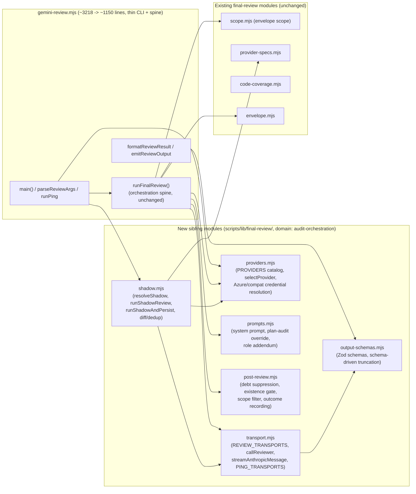

# Plan: Decompose `gemini-review.mjs`

- **Date**: 2026-09-16
- **Status**: Approved (GPT: 2 rounds, 100% acceptance both rounds, H:0 M:0 L:0 at R2; Gemini: 2 rounds, CONCERNS → APPROVE after fixing G1 HIGH test-pinning gap, G2 MEDIUM top-level-export gap, G3 LOW consistency nits)
- **Author**: Claude + Louis
- **Scope**: backend
- **Target domain(s)**: `audit-orchestration`

## Neighbourhood considered

`get-neighbourhood` (targetPath: `scripts/gemini-review.mjs`, k=10) returned 10
candidates, all from the file itself, all banded `review` (below noise floor)
— expected: there is no duplicate-elsewhere to find, the neighbourhood IS the
target. The top hits (`runFinalReview`, `callReviewer`, `formatReviewResult`,
`main`, `runShadowReview`, `runShadowAndPersist`, `applyScopeFilter`,
`parseReviewArgs`) map directly onto the extraction boundaries below.

`compute-target-domains` returned a single domain (`audit-orchestration`, no
cross-domain warning). `get-incident-neighbourhood` returned two incidents
(INC-001 symlink path classification, INC-002 the 2026-07-14 DB wipe from an
undisposable test DSN) — neither is triggered by this plan: no sensitive-path
classification logic and no destructive DB test fixture is touched. No
Security Considerations section required.

## Code Trace

`scripts/gemini-review.mjs` is currently **3218 lines** (`wc -l`), up from
622 at filing (tech-debt topicId `86b51ca4ba56`, 2026-04-05) — a 5x
uncontrolled growth with no decomposition plan, unlike its sibling
`scripts/lib/audit/legacy-production-audit.mjs`, which went through exactly
this kind of pass in `docs/plans/legacy-production-audit-decomposition.md`
(2026-08-28, 5065 → 1701 lines, 12 new modules) — the precedent this plan
follows.

`scripts/lib/final-review/` already exists and holds 6 modules extracted from
this same file over time (`code-coverage.mjs`, `code-render.mjs`,
`envelope.mjs`, `gap-projection.mjs`, `provider-specs.mjs`, `scope.mjs`) —
confirmed via `ls`. Each follows the same pattern, visible in
`provider-specs.mjs`'s own docblock: a pure relocation, re-exported back
through `gemini-review.mjs`'s `_internals` object (`gemini-review.mjs:3191`)
so existing tests need no import-path changes. This plan's new modules follow
the identical pattern — same directory, same re-export contract.

Top-level structure, read via `Grep` for function/section boundaries
(`gemini-review.mjs`, full file):

| Lines | Symbol(s) | Concern |
|---|---|---|
| 99–157 | `finishAndExit`, `armReviewWatchdog` | CLI process/termination lifecycle |
| 159–321 | Zod schemas, `_collectMaxLengths`, `truncateToSchema` | structured-output schema + truncation |
| 323–483 | system prompt, plan-audit-mode override, role addendum, `getReviewPrompt` | prompt construction |
| 484–806 | `parseReviewJson`, `REVIEW_TRANSPORTS` | multi-provider call-transport table |
| 807–985 | `callReviewer`, `streamAnthropicMessage` | the one abort-correct call seam |
| 986–1281 | `PROVIDERS` catalog, `resolveCompatCreds`, `resolveOpenRouterCreds` | provider descriptors + Azure/compat credential resolution |
| 1293–1615 | `runFinalReview` | **orchestration spine** |
| 1616–1687 | `formatReviewResult` | CLI output formatting |
| 1688–2272 | `resolveShadow`, `buildShadowClient`, `mapRouteToShadowProvider`, `resolveModelEvalShadowOverride`, `runShadowReview`, `dedupByHash`, `diffFindingBuckets`, `buildMatchedBuckets`, `shadowErrorBlock`, `shadowSkipBlock`, `buildFinalReviewPersistPayload`, `runShadowAndPersist` | shadow-review A/B comparison (largest single concern, 585 lines) |
| 2277–2372 | `refreshCatalogAndWarn`, `PING_TRANSPORTS`, `runPing` | CLI ping subcommand |
| 2373–2611 | `parseReviewArgs`, `selectProvider`, `resolveProviderSetting`, `applyProviderSetting`, `runSetProvider`, `assertAzureClaudeReady`, `buildClient`, `isJsonTruncationError`, `runReviewWithRetry`, `runAdjudicatorOnlyReview` | CLI arg parsing + provider selection + retry wrapper |
| 2612–2908 | `applyDebtSuppression`, `projectWronglyDismissed`, `applyExistenceGate`, `applyScopeFilter`, `addSemanticIds`, `recordNewFindings`, `recordWronglyDismissed`, `recordGeminiOutcomes` | post-review findings pipeline |
| 2909–3218 | `runFixtureReview`, `shouldWarnMissingRunId`, `canAttemptRunIdRecovery`, `recoverRunIdFromMarker`, `readGateEvidenceMarker`, `main` | CLI dispatch |

22 existing test files touch this file/domain directly (`tests/gemini-review-*.test.mjs`, 7 files; `tests/final-review-*.test.mjs`, 15 files) — the byte-identity bar this decomposition must clear.

## Proposed Architecture

### Right-sizing gate

- **Band-aid**: extract only the shadow-review block (the single largest
  concern, 585 lines) and stop. Real reduction (3218 → ~2650), but leaves
  the provider catalog, transport seam, and schema/prompt construction — four
  more genuinely separate concerns — tangled in one file, which is the same
  "did some of the work, called it done" shape `legacy-production-audit`'s
  own decomposition explicitly rejected at its Phase-1 gate.
- **Over-engineered**: a generic reviewer-plugin framework (register a
  provider/transport/post-processor via a declarative descriptor array,
  dynamic module loading per provider). No current requirement asks for
  this — providers, transports, and shadow behaviour are fixed, hand-written
  sets that change by editing code, not by runtime configuration; a plugin
  loader would solve a problem this repo does not have (mirrors the identical
  reasoning in `legacy-production-audit-decomposition.md`'s own right-sizing
  gate).
- **Chosen**: extract six sibling modules to `scripts/lib/final-review/`
  along the concern boundaries the Code Trace table already shows (transport,
  providers, schemas, prompts, shadow, post-review), each a pure relocation
  re-exported through the existing `_internals` object. `runFinalReview`
  stays exactly where it is, as one function — the orchestration spine,
  identical role to `runLegacyProductionAudit` in its own decomposition —
  because splitting a linear "resolve scope → call provider → apply
  filters → maybe run shadow → return" sequence into more pieces would not
  reduce coupling, only relocate it.

### Component diagram

### Key design decisions

- **Extract by existing dependency, not by guessed boundary** (#1 DRY, #5
  single source of truth) — the new modules land in the SAME
  `scripts/lib/final-review/` directory the 6 prior extractions already use,
  matching an edge that already exists in the import graph and the domain
  tagger (`compute-target-domains` returned one domain, `audit-orchestration`,
  for the whole file).
- **`runFinalReview` is not split further than one spine function** (#3
  modularity, right-sizing gate) — same reasoning as
  `legacy-production-audit-decomposition.md`'s identical decision for
  `runLegacyProductionAudit`: the call sequence is not a source of
  duplication or reuse pressure; only the *responsibilities surrounding it*
  (five distinct concerns tangled in one file) were the debt.
- **Every extraction is re-exported through the existing `_internals`
  object, unchanged** (#11 testability, #1 DRY) — the 22 existing test files
  mostly import via `_internals`, not via new per-module paths, so most of
  this decomposition is a zero-test-edit relocation. **Two confirmed
  exceptions** (Gemini gate round 1, G1/G2 — verified directly against the
  test sources, not taken on faith):
  - `tests/gemini-review-provider.test.mjs:18` imports `selectProvider` as a
    **top-level named export**
    (`const { selectProvider, _internals } = await import(...)`), not via
    `_internals`. `gemini-review.mjs` must keep re-exporting it at the top
    level too: `export { selectProvider } from './lib/final-review/providers.mjs';`
    — in addition to, not instead of, the `_internals` entry.
  - `tests/gemini-review-shadow.test.mjs` has two **source-pinning**
    assertions that `fs.readFileSync('scripts/gemini-review.mjs', 'utf8')`
    and search the raw text for `'async function callReviewer'` (line ~89)
    and `'async function buildShadowClient'` (line ~342) — proving a specific
    assignment (`_activeReviewController = controller`;
    `backend: 'sdk'`) is present in the function body, not just that the
    function exists. These are real, deliberate regression pins (their own
    comments name the incidents they guard), not incidental test debt — they
    move WITH their functions: Phase 2 updates the `callReviewer` pin's
    target path to `scripts/lib/final-review/transport.mjs`, Phase 3 updates
    the `buildShadowClient` pin's target path to
    `scripts/lib/final-review/shadow.mjs`. Same assertion, same protection,
    new location — this is the plan's only test-file edit.
- **`formatReviewResult`/`emitReviewOutput` stay in `gemini-review.mjs`**
  — CLI-presentation concerns, the same category `legacy-production-audit`'s
  own decomposition kept in `openai-audit.mjs`'s `main()` rather than
  extracting. Small (90 lines combined) and specific to how THIS CLI renders
  output; no second reader.
- **`post-review.mjs` is named to avoid colliding with the existing
  `scope.mjs`** (#5 single source of truth) — `scope.mjs` already owns
  "envelope scope" (what code the reviewer sees); `applyScopeFilter` is a
  different concept (which FINDINGS survive post-review), so it moves to
  `post-review.mjs` alongside the rest of the findings pipeline rather than
  into `scope.mjs`, where the shared name would suggest they are the same
  concern.

### Symbol/Dependency Matrix (resolves R1 M1: shared mutable state)

"Byte-identical" below means **each moved function's own body is a pure
relocation** — no logic edits. It does NOT mean zero lines change in
`gemini-review.mjs`: call sites necessarily gain an import, and the two
mutable-state dependencies below need an explicit contract, not a bare
shared global reaching across a module boundary. Enumerated from source
(`Grep` for the two globals' every read/write site), not guessed:

| Symbol | Kind | Owner after this plan | Cross-module contract |
|---|---|---|---|
| `MODEL`, `CLAUDE_OPUS_MODEL`, `XAI_MODEL` | `let`/`const`, live-refreshed | **moves to `providers.mjs`** (they are provider-resolution state, not CLI state) | `refreshCatalogAndWarn` (currently `gemini-review.mjs:2277-2301`, whose entire body only reads/reassigns these two) **moves with them**, exported as `refreshProviderModels()`. `gemini-review.mjs`'s `main()` calls `providers.refreshProviderModels()`; the `PROVIDERS` table's existing lazy-getter closures (`resolveModel: () => MODEL`, already the pattern at `gemini-review.mjs:1000`/`1010`/`1145` — not a new indirection this plan introduces) keep working unchanged because both the state and its readers now live in the same module. |
| `_activeReviewController` | `let`, module-level | **stays in `gemini-review.mjs`** (owned by the watchdog, which stays put) | `callReviewer` (moving to `transport.mjs`) currently writes this global directly at `gemini-review.mjs:820` (set) and `:887` (clear). It instead accepts an optional `onController(controller \| null)` callback in its options object, called at the same two points. `gemini-review.mjs`'s call site (inside `armReviewWatchdog`'s caller) passes `onController: (c) => { _activeReviewController = c; }`. `transport.mjs` ends up with zero references to any `gemini-review.mjs`-owned identifier. |
| `TIMEOUT_MS`, `MAX_OUTPUT_TOKENS` | `const`, from `geminiConfig` | **read directly in `transport.mjs`** via its own `import { geminiConfig } from '../config.mjs'` | No cross-module contract needed — read-only config, not CLI-owned mutable state; duplicating the import is correct, not a DRY violation (both `gemini-review.mjs` and `transport.mjs` are reading the one config module, not each other). |
| `_terminalState`, `_watchdogTimer` | `let`, module-level | **stays in `gemini-review.mjs`** | Read/written only by `finishAndExit`/`armReviewWatchdog`, neither of which moves. No cross-module contract — purely internal to the CLI lifecycle layer. |

## Sustainability Notes

- **Assumptions that could change**: the provider set (Gemini/Azure-Claude/
  Anthropic/OpenAI-compatible/OpenRouter/xAI/Alibaba/Deepseek) grows over
  time — `providers.mjs` isolates that growth to one file instead of one
  section of a 3000-line file, the same value the extraction already proved
  for `provider-specs.mjs`.
- **Extension points already built in**: `transport.mjs`'s `REVIEW_TRANSPORTS`
  table and `providers.mjs`'s `PROVIDERS` table are both keyed lookups — a new
  provider or transport is one new entry, not a new code path threaded
  through the file.
- **Pattern or exception**: this follows the established pattern
  (`legacy-production-audit-decomposition.md`) rather than inventing a new
  one — a second file in this repo hitting the same "grew past 3000 lines
  with 5+ tangled concerns, no plan" shape confirms the pattern generalises.

## File-Level Plan

**Phase 1 — Extract schemas + prompts**: pure data/string construction, no
orchestrator-state coupling — independent of every other phase. Moves the
Zod review schemas + schema-driven truncation, and the system-prompt /
plan-audit-mode / role-addendum construction, into two new sibling modules;
`gemini-review.mjs` imports both back and re-exports the same symbols
through the existing `_internals` object (unchanged shape). Files:
`scripts/lib/final-review/output-schemas.mjs` (create),
`scripts/lib/final-review/prompts.mjs` (create),
`scripts/gemini-review.mjs` (modify).

**Phase 2 — Extract transport + providers**: the multi-provider call seam
(transport) and the provider descriptor catalog + Azure/compat credential
resolution + live model-catalog refresh (providers) — sequenced together
because `runFinalReview` and `shadow.mjs` (Phase 3) need both, and
transport's schema use depends on Phase 1 already having landed.
`providers.mjs` takes ownership of `MODEL`/`CLAUDE_OPUS_MODEL`/`XAI_MODEL`
and `refreshCatalogAndWarn` (renamed `refreshProviderModels`) per the
Symbol/Dependency Matrix above; `transport.mjs`'s `callReviewer` takes an
`onController` callback instead of writing `gemini-review.mjs`'s
`_activeReviewController` global directly. `gemini-review.mjs` keeps a
top-level `export { selectProvider }` alongside its `_internals` entry
(Gemini gate G2 — `tests/gemini-review-provider.test.mjs` imports it as a
named export, not via `_internals`). Also updates
`tests/gemini-review-shadow.test.mjs`'s `callReviewer` source-pinning
assertion (currently reads `scripts/gemini-review.mjs`) to read
`scripts/lib/final-review/transport.mjs` instead — same assertion, new
location (Gemini gate G1). Files:
`scripts/lib/final-review/transport.mjs` (create),
`scripts/lib/final-review/providers.mjs` (create),
`scripts/gemini-review.mjs` (modify),
`tests/gemini-review-shadow.test.mjs` (modify — pin target path only).

**Phase 3 — Extract shadow review**: the largest single concern (585
lines) — the shadow-review A/B comparison, diffing, dedup, and persistence.
Depends on Phase 2's transport + providers modules being in place. Also
updates `tests/gemini-review-shadow.test.mjs`'s `buildShadowClient`
source-pinning assertion to read `scripts/lib/final-review/shadow.mjs`
instead of `scripts/gemini-review.mjs` (Gemini gate G1, same shape as
Phase 2's `callReviewer` pin). Files:
`scripts/lib/final-review/shadow.mjs` (create),
`scripts/gemini-review.mjs` (modify),
`tests/gemini-review-shadow.test.mjs` (modify — pin target path only).

**Phase 4 — Extract the post-review findings pipeline**: debt suppression,
existence gate, post-review scope filter, semantic-id assignment, and
outcome recording — independent of Phases 1–3, depends only on the
existing `finding-match.mjs`/`findings.mjs`. Files:
`scripts/lib/final-review/post-review.mjs` (create),
`scripts/gemini-review.mjs` (modify).

**Close-out (not a phase)**: run all 22 existing
`tests/gemini-review-*.test.mjs` + `tests/final-review-*.test.mjs` files —
20 of them unmodified, 2 pin-target-path edits from Phases 2–3 (see above,
Gemini gate G1) — plus the new fresh-process CLI smoke test (Testing
Strategy); run full `npm test`; resolve tech-debt topicId
`86b51ca4ba56` via `npm run debt:resolve` once the audit converges.

## Risk & Trade-off Register

- **Risk**: a function reads a module-level variable (e.g. `MODEL`,
  `_activeReviewController`) that stays in `gemini-review.mjs` after its
  owning function moves out. **Mitigation**: each extracted function's
  free variables are enumerated before the move (not assumed); anything
  still needed from `gemini-review.mjs` is passed as an explicit parameter,
  matching the `legacy-production-audit` precedent's Phase 4 "the real
  enumerated field list, read from source, not guessed."
- **Risk**: a subtle behavior change during the mechanical move (e.g. a
  changed import path resolves a different module version). **Mitigation**:
  each phase is a byte-for-byte body relocation — no logic edits — verified
  by running the full existing test suite unchanged after every phase, not
  only at the end.
- **Deliberately deferred**: `formatReviewResult`/`emitReviewOutput`
  extraction (see Key design decisions) — CLI-presentation, no second reader,
  not worth a new module.

## Testing Strategy

**"22 existing test files pass" establishes only what they actually assert
plus export-name presence — not byte-identical behavior on its own** (R1
M2). The coverage map below identifies, for each relocation-sensitive
invariant this plan's Risk Register calls out, which existing test already
pins it — found by reading each file's `describe()` titles, not assumed:

| Invariant | Covered by (existing, unmodified) |
|---|---|
| Timeout rejection fires even when an SDK ignores the abort signal | `tests/gemini-review-callreviewer.test.mjs` — `describe('callReviewer — timeout & abort ownership')` |
| `_activeReviewController` cancellation reaches the in-flight call | same file/describe block above |
| Structured-output fallback only on explicit rejection, not silently | `tests/final-review-structured-output.test.mjs` — `describe('openai final-review transport — structured output')`; `tests/gemini-review-provider.test.mjs` — `describe('G1 — no silent egress via auto-fallback')` |
| Forced SDK routing for Opus primary/shadow clients | `tests/gemini-review-shadow.test.mjs` — `describe('resolveShadow — Azure guard (load-bearing: shadow is a no-op on Foundry)')`, `describe('resolveShadow — provider/key/model resolution')` |
| Provider/credential resolution (Azure, compat, OpenRouter) | `tests/gemini-review-provider.test.mjs` — `describe('PROVIDERS catalog')`, `describe('selectProvider — explicit-only new routes')`, `describe('credential resolution')` |
| Shadow finding dedup/diff does not inflate counts | `tests/gemini-review-shadow.test.mjs` — `describe('dedupByHash — no count inflation (R3 M2)')`, `describe('diffFindingBuckets — three-way partition by semantic hash')` |
| Shadow persistence's three-state contract (ran / skipped / errored) | `tests/gemini-review-shadow-persist.test.mjs` — both `describe()` blocks |
| CLI process termination (background-safe, watchdog abort) | `tests/gemini-review-termination.test.mjs` — `describe('review CLI terminates (background-safe)')` |

**Gap found by this mapping, not covered above**: no existing test drives
the real CLI entrypoint (`main()`) from a fresh process to assert
environment-initialization order (e.g. `providers.mjs`'s module load
resolving `MODEL` before `main()` calls `refreshProviderModels()`) or
stdout/stderr/exit-code behavior post-decomposition specifically. **Add
one** (Phase 2 close-out): a `spawnSync` smoke test invoking
`node scripts/gemini-review.mjs ping` against a fixture/mocked transport,
asserting exit 0 and the expected stdout shape — cheap, and it is the only
gap this mapping surfaces.

- **Unit**: the 22 existing test files run after each phase — 20 unmodified,
  2 pin-target-path edits in `tests/gemini-review-shadow.test.mjs` (Phases 2–3,
  Gemini gate G1) — plus the one new smoke test above (Phase 2 close-out).
- **Integration**: `npm test` (full suite) after each phase and at close-out.
- **Edge cases**: the `_internals` object's key set must be a
  **backwards-compatible superset** before vs. after (`Object.keys(_internals)`
  pre-decomposition ⊆ post-decomposition) — dropping an existing key is a
  regression; adding a new one is fine and expected.

## Execution Clustering

- **Cluster A** — Phases 1–2 — fix-gate: yes
  - Coupling: both are prerequisite data/call-seam layers `runFinalReview`
    and the shadow-review path (Cluster B) both depend on; landing them
    together keeps the intermediate diff buildable.
- **Cluster B** — Phase 3 — fix-gate: yes
  - Coupling: shadow.mjs is the single largest, most self-contained
    extraction (585 lines) and depends on Cluster A's transport/providers
    modules being in place first.
- **Cluster C** — Phase 4 — fix-gate: final
  - Coupling: the post-review findings pipeline is independent of Clusters
    A/B, but close-out (full-suite verification + debt resolution) can only
    run once every extraction has landed, so it groups with the last
    cluster rather than standing alone.

- **Final gate**: mandatory consolidated Gemini review over the union diff
  after all three clusters converge.
