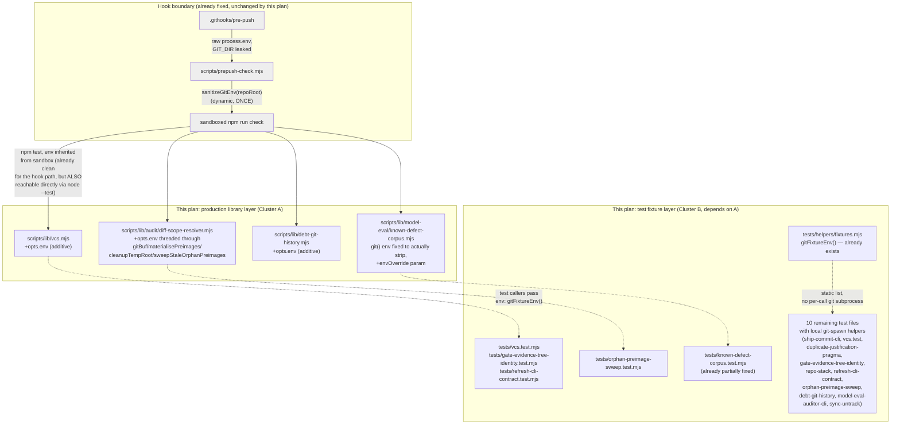

# Plan: Close the GIT_DIR/GIT_WORK_TREE Env-Leak Class (full blast radius)

- **Date**: 2026-07-23
- **Status**: Complete
- **Author**: Claude + Louis
- **Scope**: backend

**Implementation note (2026-07-24)**: one additional call site was found and fixed during implementation, beyond this plan's original audit — `scripts/lib/sync-untrack.mjs::untrackNewlyIgnored`'s injectable `exec()` calls (`git ls-files`, `git rm --cached`) had no `env` override either, discovered via the same "verify each Cluster B test's underlying production call graph" discipline that caught the `findStalePragmas` wrapper gap. Given `git rm --cached` under a leaked `GIT_DIR` could remove tracked files from the WRONG repo's index, this is comparable in severity to `sweepStaleOrphanPreimages`. Fixed with the same additive `opts.env` pattern; covered by `tests/vcs-env-override.test.mjs`. All Cluster A + Cluster B work is complete; full suite green (8505 tests, 0 failures).

**Implementation note (2026-07-24, `/audit-code` Step 7 — Gemini final review)**: the mandatory Gemini gate ran 2 rounds. Round 1 returned `REJECT` — the review transcript (built by hand from raw per-round GPT findings) omitted the adjudication ledger's triage disposition, so Gemini could not distinguish "deferred with a documented independence rationale" from "ignored" and flagged 7 recurring findings plus 2 new ones. Every claim was independently re-verified against current code before acting (not re-argued from the transcript): 3 were genuine bugs and got fixed (`gitWorktreeTree()`'s over-broad `read-tree HEAD` catch, `known-defect-corpus.mjs`'s `SAFE_KD_ID_RE` type-coercion gap, `sync-untrack.mjs`'s N+1 subprocess loop), 1 was factually incorrect and was rebutted with cited evidence (a `classifyChildError` claim that didn't match Node's actual `spawnSync` error shape or the 6 real call sites), and the remaining ~4 were reaffirmed as genuinely independent pre-existing debt. Round 2 (re-run with a corrected transcript carrying `changed_files`/`code_files` and an explicit debt-disposition section) returned `CONCERNS` with `claude_bias_detected: false` and one new, real, trivial finding (missing `maxBuffer` override on two bulk `execFileSync` call sites) — fixed, then **capped at 2 rounds per policy** rather than spending a third chasing further polish. Full detail: `docs/plans/git-env-leak-sustainability-audit-summary.md`. Final suite: 8516 pass / 0 fail / 22 skipped.

## 1. Context Summary

**Detected scope**: backend (git hooks, test fixtures, library code — no UI, no frontend, no deployed instance). **Stack**: js-ts (`package.json`).

**What exists today, and what's already fixed this session**: git's own hook-invocation machinery exports `GIT_DIR`/`GIT_WORK_TREE`/etc. into `.githooks/pre-push`'s process — documented behaviour (`githooks(5)`: *"these variables... are exported so that Git commands run by the hook can correctly locate the repository"*). `scripts/prepush-check.mjs` spawned `npm run check` inheriting raw `process.env`, so any test building an "isolated" fixture git repo via `execFileSync('git', [...], {cwd: tmpDir})` with no `env` override got **no isolation at all** — git gives `GIT_DIR` precedence over `cwd`, so the fixture's own `git init`/`git commit` silently redirected onto the **real repo's real HEAD**. This was not theoretical: it fired **six times live** in one session, including commits reading `"seed"`, `"init"`, `"add data + readme"` — the literal strings from `tests/diff-scope-resolver.test.mjs`'s own fixture helper. Each incident was recovered manually (`git cat-file -t <sha>` → confirm object survives; `git branch -r --contains <sha>` → confirm never pushed; plain `git reset <sha>`, never `--hard`) — safe every time, but manual, and a genuinely dangerous class of bug to leave open.

Already fixed and passing (8494/8494 tests green):
- `scripts/lib/git-env-sanitize.mjs` — `getGitLocalEnvVarNames()`/`sanitizeGitEnv()`, the **dynamic**, `git rev-parse --local-env-vars`-based sanitizer, used **once** at the `prepush-check.mjs` hook→sandbox boundary.
- `tests/helpers/fixtures.mjs` — `GIT_LOCAL_ENV_VARS` (**static** list) + `gitFixtureEnv()`, wired into `gitInit`/`gitInitWithEmptyCommit`/`commit`/`makeGitRunner`.
- `tests/diff-scope-resolver.test.mjs`'s `sh()`, `tests/known-defect-corpus.test.mjs`'s `makeRepo()`, `tests/drift-stale-pragma.test.mjs`'s `mkGitRepo()`/`commitAll()` — all now pass `env: gitFixtureEnv()`.
- Regression coverage: `tests/git-env-sanitize.test.mjs`, `tests/git-env-fixture-isolation.test.mjs` (deliberately injects `GIT_DIR`/`GIT_WORK_TREE` against a throwaway victim repo and proves the fixture helpers are immune — and proves the leak simulation itself is real, not assumed).

**Why this plan exists**: a completed audit-agent sweep found the fix so far covers only the two call sites that happened to fire live. The **full** blast radius is 16 more test call sites plus — materially more consequential — **10 production library call sites** reachable from fixture-repo tests with a throwaway `cwd`, one of them (`sweepStaleOrphanPreimages`'s `git worktree add/remove/prune`) capable of mutating/pruning a **real** worktree registration if `GIT_DIR` leaks during its own test, not just corrupting a throwaway fixture's HEAD. One call site (`known-defect-corpus.mjs`'s `git()` helper) *looks* sanitized — it passes an explicit `env` option — but only *adds* `GIT_PAGER`, never strips `GIT_DIR`-family vars, so the leak wins regardless.

**Code Trace** (Phase 1 exploration, this session):
- `scripts/lib/vcs.mjs` (537 lines, read in full) — `gitCommitSha`/`gitIndexTree`/`gitDiffWithWorkingTree`/`gitNumstatWithWorkingTree`/`gitUnifiedDiffWithWorkingTree`/`gitShowFileAtRevision` all call `execSync`/`spawnSync` with `cwd` and **no `env` option at all** (implicit full inherit). `gitWorktreeTree` (line 177) is the one exception — it **already** builds an explicit `env` object and its docblock says so on purpose: *"Inherit the caller's env so git still sees GIT_DIR/credentials/etc; only GIT_INDEX_FILE is overridden."* This is genuinely correct for real production use (a caller invoking these functions against the real repo wants `GIT_DIR` honoured) — the bug only appears when the SAME functions are exercised against an isolated test fixture, which is exactly the situation `tests/vcs.test.mjs`, `tests/gate-evidence-tree-identity.test.mjs`, and `tests/refresh-cli-contract.test.mjs` are in.
- `scripts/lib/audit/diff-scope-resolver.mjs` (read lines 130–360) — `gitBuf()` (private, line 138), `sweepStaleOrphanPreimages()` (exported, line 253), `materialisePreimages()`/`cleanupTempRoot()` (private, lines 304/345) all spawn `git` with `cwd: repoPath` and no `env` override. `resolveDiffScope` (exported, line 545) calls `gitBuf` five times and `materialisePreimages`/`cleanupTempRoot` once each. **Confirmed directly exercised against a throwaway fixture repo**: `tests/orphan-preimage-sweep.test.mjs:31-39` creates a real standalone git repo via `git init` in a temp dir, then calls the exported `sweepStaleOrphanPreimages({repoPath: repo, tmpDir: tmpHome})` — a production entry point, not a test-local reimplementation. If `GIT_DIR` leaks during that test, `sweepStaleOrphanPreimages`'s own `git worktree prune`/`git worktree unlock`/`git worktree remove --force 
` calls (lines 266, 284, 293, 298) would run against whatever `GIT_DIR` points to — i.e. potentially the **real** claude-engineering-skills repo, pruning a legitimately in-progress sandbox worktree from a concurrent session. This is the single highest-severity finding in the whole sweep.
- `scripts/lib/debt-git-history.mjs` (read in full, 135 lines) — `countCommitsTouchingTopic`/`findFirstDeferCommit`/`detectGitHubRepoUrl` each already take an options object (`{ledgerPath, cwd}` / `{ledgerPath, remoteUrl, cwd}` / `{cwd}`) with no `env` key. Straightforward to extend.
- `scripts/lib/model-eval/known-defect-corpus.mjs` (read lines 1–90) — `git(root, args)` (private, line 58) uses `git -C root` (not `cwd` — same exposure: `-C` does not protect against a leaked `GIT_DIR` either) and passes `env: { ...process.env, GIT_PAGER: 'cat' }` — an env option that exists but never strips the `GIT_DIR` family, so it reads as safe on a skim and isn't. Reached via `loadCorpusCase({kdEntry, repoRoots})`, confirmed exercised against a fixture dir at `tests/known-defect-corpus.test.mjs:113,126`.
- `tests/orphan-preimage-sweep.test.mjs` (read lines 1–60) — confirms the exact call shape above.

**Neighbourhood considered** (Phase 0.5 — `get-neighbourhood`, 8 candidates, all `review` band, nothing above this repo's noise floor): `tests/helpers/fixtures.mjs::makeGitRunner`/`gitInit`, `scripts/lib/vcs.mjs::gitCommitSha`/`isRetryableVcsError`, `scripts/lib/debt-git-history.mjs::deriveOccurrencesFromGit`, `scripts/lib/model-eval/known-defect-corpus.mjs::tryGit`, `scripts/lib/audit/diff-scope-resolver.mjs::resolveDiffScope`/`cleanupTempRoot`. All are the exact real symbols this plan touches — no reuse-vs-extend ambiguity, this plan extends each in place (no sibling needed; a parallel "sanitized variant" of each function would violate #1 DRY and #10 Single Source of Truth for no benefit).

**Target domain(s)**: `audit-orchestration`, `model-eval`, `shared-lib`, `tech-debt`, `tests`. ⚠ **Cross-domain work** — touches 5 domains; each is a genuinely independent call site with the same fix shape, not an accidental coupling.

**Past incidents to verify against** (Phase 0.5c, 2 shown of 2 total — moderate relevance, not a strict precedent match, cited for the shared lesson):

| Incident | Affected paths | Status | Lessons |
|---|---|---|---|
| **INC-002** — Supabase test DB wipe (2026-07-14) | `tests/db-setup.test.mjs`, `scripts/lib/db/client.mjs` | `manual-verification-required` | *"An env-gate that checks 'is this variable set' is not a safety gate — it only proves intent to run, never that the target is safe."* Directly analogous here: `known-defect-corpus.mjs`'s `git()` **has** an `env` key (proves intent to handle env) without actually stripping the dangerous vars (doesn't prove safety) — the same "looks handled, isn't" failure shape. |
| **INC-001** — symlink bypass of lexical path classification | `scripts/lib/sensitive-paths.mjs` | `manual-verification-required` | *"Fail-closed on resolution errors. Never 'I couldn't classify it so I'll allow it.'"* Round-1 of this plan's own audit initially read `sanitizeGitEnv()`'s fail-open-to-`[]` design as already safe by analogy to this lesson's opposite (never-crash-the-caller) direction — round-3 audit correctly caught that "fails open" and "fails open to *nothing stripped*" are not the same guarantee; see §6 for the fixed design (fails open to a static baseline, never to zero coverage). |

## 2. Proposed Architecture

**Key design decision — the ONE idea this whole plan hangs on**: every production function that spawns `git` against a caller-supplied path gets an **optional, additive `env` override**, threaded through its existing options object (or a new one where none exists). **Omitted → byte-identical to current behaviour** (full `process.env` inherit, exactly like `gitWorktreeTree` already does on purpose). **Supplied → used instead of `process.env`** as the base environment. This is *not* a blind "strip everywhere" pass — `vcs.mjs`'s `gitWorktreeTree` docblock is explicit that inheriting `GIT_DIR` is *correct* for real production callers reading the real repo; only test callers exercising these functions against a throwaway fixture need to opt in to a sanitized env. The design makes the isolation the CALLER's explicit choice, not a global behaviour change to code with real production callers elsewhere in this repo (`(#6 Dependency Inversion, #18 Backward Compatibility)`.

Concretely, per module:

- **`scripts/lib/vcs.mjs`**: `gitCommitSha(cwd, opts={})`, `gitIndexTree(cwd, opts={})`, `gitDiffWithWorkingTree(cwd, sinceCommit, opts={})`, `gitNumstatWithWorkingTree(cwd, sinceCommit, opts={})`, `gitShowFileAtRevision(cwd, revision, filePath, opts={})`, `contentExistsAtMappedRange(cwd, filePath, mappedBaseRange, quote, baseSha, opts={})` each read `opts.env` and pass it as the subprocess `env` when present (`execSync`/`spawnSync`'s `env` option, omitted → Node's own default full inherit — no code path needed for the "no override" case). `gitUnifiedDiffWithWorkingTree(cwd, sinceCommit, {maxBytes, env}={})` already has an opts object; just add the key. `gitWorktreeTree(cwd, opts={})` changes its internal `{...process.env, GIT_INDEX_FILE}` to `{...(opts.env ?? process.env), GIT_INDEX_FILE}` — same intentional-inherit default, now overridable.
- **`scripts/lib/audit/diff-scope-resolver.mjs`** — exact current signatures verified against source (round-1 audit flagged this as ambiguous; both checked directly, not assumed): `gitBuf(repoPath, args, env)` (private — positional 3rd arg is fine, never called outside this file); `sweepStaleOrphanPreimages({repoPath, tmpDir, maxAgeMs, env})` (already an options object at line 253 — add the key, thread to all 5 internal `execFileSync` calls); `materialisePreimages(repoPath, baseRef, changedFiles, env)` and `cleanupTempRoot(repoPath, tempRoot, env)` (private, thread through). `resolveDiffScope({repoPath, baseRef, headRef, diffPatch})` already destructures a single options object at line 545 — add `env` to it, threaded to every `gitBuf`/`materialisePreimages`/`cleanupTempRoot` call inside. **`computeEntryPoints(repoPath)` (line 444) spawns no git subprocess at all** (verified: it only reads `package.json` off disk) — needs no `env` parameter and is dropped from this plan's touch list; including it in round-1's draft was this plan's own over-broad phrasing, not a real gap in the code.
- **`scripts/lib/debt-git-history.mjs`**: add `env` to `countCommitsTouchingTopic`'s and `findFirstDeferCommit`'s existing options object (`{ledgerPath, cwd, env}`), and `detectGitHubRepoUrl`'s (`{cwd, env}`), passed straight to `execFileSync`'s `env` option (omitted → default inherit, unchanged). **`deriveOccurrencesFromGit(entries, opts={})` — the exported orchestration entry point round-1 audit correctly flagged as unaddressed — needs NO code change.** Verified against the source (lines 154-161): it forwards its `opts` parameter verbatim to `countCommitsTouchingTopic(e.topicId, opts)` for every entry, so once that function accepts `opts.env`, any caller of `deriveOccurrencesFromGit` already has a working env-override path with zero additional wiring. Named explicitly here so the call chain is traceable end-to-end rather than merely asserted.
- **`scripts/lib/model-eval/known-defect-corpus.mjs`**: fix the private `git(root, args, opts={})` (renamed from a positional `envOverride` to the same `opts.env` contract used everywhere else in this plan — round-1 audit M4, interface consistency) so its env-merge becomes `env: { ...(opts.env ?? process.env), GIT_PAGER: 'cat' }` — this is the ONE call site that needs an actual bug fix, not just a new parameter: its existing `env` key currently *looks* handled and isn't (§1 INC-002 lesson — an env key that exists proves intent, not safety). `tryGit(root, args, opts={})` forwards `opts` to `git()` unchanged. `loadCorpusCase`'s existing public options object gains `env` (same name across the whole plan now, no alias) and threads it to `tryGit`.

**Test-fixture layer (10 remaining files)**: same mechanical pattern already proven on the two files fixed this session — import `gitFixtureEnv` from `tests/helpers/fixtures.mjs` (`#1 DRY` — one static list, not 10 copies), wire it into each file's local git-spawn helper, and where the test calls into one of the now-extended production functions above, pass `{env: gitFixtureEnv()}` as that function's new `opts.env`.

## 3. Sustainability Notes

- **Assumption this design encodes**: a production caller that omits `opts.env` WANTS the ambient environment (including any legitimately-set `GIT_DIR`, e.g. a caller deliberately operating through a worktree's `GIT_DIR`). This could break if a future caller relies on *implicit* env inheritance while operating on a path that ISN'T what `GIT_DIR` points to — but that's already exactly today's bug, now at least visible and fixable per-call-site rather than baked into every function silently.
- **Migration path if this outgrows its design**: if a 6th+ production module needs the same treatment later, the pattern is copy-paste-obvious from this plan's four modules — no new abstraction needed. Deliberately NOT centralizing "wrap every git spawn in this repo" into one universal helper (`#20`) — the repo has at least 3 independent conventions already (`execSync`, `execFileSync`, `spawnSync`; template-string vs. args-array; some `-C`, some `cwd`) and forcing a single wrapper now would be a bigger, riskier refactor than the bug being fixed (**band-aid-vs-over-engineering gate**: the over-engineered extreme is "one universal sanitized-git-spawn wrapper for the whole repo, migrate every call site"; the band-aid is "only fix the two that already fired"; the chosen middle is "fix every call site the audit actually found reachable from a test fixture, via the smallest per-module change, using the pattern already proven twice this session" — the *current* requirement is closing the confirmed blast radius, not building infrastructure for hypothetical future git-spawning code).
- **Pattern for future git-spawning test fixtures**: `gitFixtureEnv()` in `tests/helpers/fixtures.mjs` is now the documented, single answer to "how do I make an isolated git fixture in this repo's test suite" — its own docblock (added this session) explains why. A future test author writing a NEW fixture helper has one obvious place to look.

## 4. File-Level Plan

### Cluster A — production library API (foundational; Cluster B depends on these signatures existing)

- **`scripts/lib/git-env-sanitize.mjs`** (modify — round-3 audit H1) — move `GIT_LOCAL_ENV_VARS` (the static baseline) here from `tests/helpers/fixtures.mjs`, exported; `getGitLocalEnvVarNames()` returns the union of the baseline + dynamic `git rev-parse --local-env-vars` result on success, and the baseline alone (never `[]`) on discovery failure. See §6 for the full rationale.
- **`tests/helpers/fixtures.mjs`** (modify) — `gitFixtureEnv()` imports `GIT_LOCAL_ENV_VARS` from `scripts/lib/git-env-sanitize.mjs` instead of defining its own copy (closes round-1 audit M1's two-lists drift risk at the source, not just via a comparison test).
- **`scripts/lib/vcs.mjs`** (modify) — add optional `opts.env` to `gitCommitSha`, `gitIndexTree`, `gitDiffWithWorkingTree`, `gitNumstatWithWorkingTree`, `gitShowFileAtRevision`, `contentExistsAtMappedRange`; extend `gitUnifiedDiffWithWorkingTree`'s existing opts; change `gitWorktreeTree`'s internal env-build to `opts.env ?? process.env`. Every change additive/default-preserving (`#18`).
- **`scripts/lib/audit/diff-scope-resolver.mjs`** (modify) — thread an `env` parameter through `gitBuf`, `sweepStaleOrphanPreimages`, `materialisePreimages`, `cleanupTempRoot`, and the one exported entry point that needs it (`resolveDiffScope`; `computeEntryPoints` spawns no git — excluded, see §2).
- **`scripts/lib/debt-git-history.mjs`** (modify) — add `env` to the options object of `countCommitsTouchingTopic`, `findFirstDeferCommit`, `detectGitHubRepoUrl`. `deriveOccurrencesFromGit` needs no change (forwards `opts` verbatim — see §2).
- **`scripts/lib/model-eval/known-defect-corpus.mjs`** (modify) — fix `git()`'s env-merge to actually strip `GIT_DIR`-family vars when `opts.env` is supplied (renamed from `envOverride` for naming consistency across the plan — round-1 audit M4); thread `opts.env` from `loadCorpusCase`'s options through `tryGit`/`git`.
- **`scripts/lib/duplicate-justification-pragma.mjs`** (modify — Gemini final-gate G1, verified against source): `findRepoPragmas(repoRoot, {strict=false})` (line 57) spawns `git grep` with `cwd: repoRoot` and no `env` override — a genuine call site the original audit-agent sweep missed entirely (it wasn't inside `tests/`, so a tests-scoped sweep couldn't find it). Add `env` to its existing options object (`{strict, env}`).
- **`scripts/lib/symbol-index/stale-pragma-sweep.mjs`** (modify — Gemini final-gate G1 round 2, correcting an error in this plan's OWN round-1 dismissal): `findStalePragmas(repoRoot)` (line 51) spawns no git subprocess *directly*, but it unconditionally calls `findRepoPragmas(repoRoot)` at line 53 with **no options forwarded at all** — so even after `findRepoPragmas` accepts `opts.env`, this wrapper has no path to pass one through. Round-1's plan dismissal of this file checked only "does it spawn git itself," missing that a transparent wrapper with no options parameter is exactly as unsanitizable as the function it wraps (Gemini's own critique: "relying on a literal technicality... while ignoring that it wraps a git-spawning function" — a fair correction, not a false positive, verified directly against the source before accepting it). Fix: `findStalePragmas(repoRoot, opts={})`, forwarding `opts` to `findRepoPragmas(repoRoot, opts)` — the exact same "does this orchestration entry point forward its options object verbatim" question already answered correctly for `deriveOccurrencesFromGit` in Cluster A above, just missed here on the first pass.
- **`tests/vcs-env-override.test.mjs`** (create) — regression coverage for the new `opts.env` seam itself: proves (a) omitting it preserves exact current behaviour (a real git call against `process.cwd()` still works), and (b) supplying a poisoned/sanitized env actually changes which repo a call resolves against — mirrors `tests/git-env-fixture-isolation.test.mjs`'s victim-repo pattern, scoped to `vcs.mjs`'s functions specifically. **Also covers `scripts/lib/debt-git-history.mjs` and `scripts/lib/model-eval/known-defect-corpus.mjs`'s poisoned-env paths** (round-1 audit M3 — clean-environment execution of the existing Cluster B test bodies proves the override is ACCEPTED, not that it's ACTUALLY THREADED to every internal spawn; each of these two modules gets its own explicit poisoned-`GIT_DIR` assertion here, same victim-repo shape as `tests/git-env-fixture-isolation.test.mjs` and the one already planned for `sweepStaleOrphanPreimages`, so every production module in Cluster A has one, not just `vcs.mjs` and the orphan sweep).
- **`tests/git-env-sanitize.test.mjs`** (modify) — update the existing exactness assertion (`getGitLocalEnvVarNames` output === `git rev-parse --local-env-vars` output) to account for the new union-with-baseline behavior (round-1 M1 / round-3 H1 fix): assert the result is the *union* of the baseline and the live dynamic list rather than exact equality, plus a new case forcing discovery failure (an invalid `cwd`) and asserting the baseline — never `[]` — comes back.

### Cluster B — test-fixture hardening (depends on Cluster A's new `opts.env` signatures)

- **`tests/diff-scope-resolver.test.mjs`** (modify — round-2 audit H1, verified against source): its `sh()` fixture-setup helper was already fixed this session, but that only protects `newRepo()`'s own `git init`/`git commit`. Every `resolveDiffScope({repoPath: repo, ...})` call in this file (confirmed present, e.g. lines 63/72 and throughout) exercises the PRODUCTION function itself, which internally spawns `gitBuf`/`materialisePreimages`/`cleanupTempRoot` — these need the new `opts.env` passed as `{env: gitFixtureEnv()}` at every call site, not just the setup helper. This was the one file this plan's round-1 draft got wrong: fixing a test's fixture SETUP is not the same as sanitizing the PRODUCTION code path under test.
- **`tests/ship-commit-cli.test.mjs`** (modify) — `commitCount()`, the inline `git interpret-trailers --parse` call, and the two local `g()` helpers (no-skills-layout test, unborn-HEAD test) all get `env: gitFixtureEnv()`.
- **`tests/vcs.test.mjs`** (modify) — the inline add/commit/mv/rev-parse calls in the "rename pairs" test get sanitized env; any direct `vcs.mjs` function calls against a fixture repo pass `{env: gitFixtureEnv()}`.
- **`tests/duplicate-justification-pragma.test.mjs`** (modify) — `beforeEach` + test-body inline `execSync` calls get sanitized env; `findRepoPragmas(fixtureDir, {env: gitFixtureEnv()})` calls against the fixture repo pass the new option (Gemini final-gate G1 — the production function under test, not just its own local setup calls).
- **`tests/drift-stale-pragma.test.mjs`** (modify — Gemini final-gate G1 round 2): its own fixture-setup helpers (`mkGitRepo()`/`commitAll()`) were already fixed this session, but all 6 `findStalePragmas(repo)` calls need updating to `findStalePragmas(repo, {env: gitFixtureEnv()})` once `findStalePragmas` accepts and forwards `opts` (see Cluster A).
- **`tests/gate-evidence-tree-identity.test.mjs`** (modify) — `g()` inside `mkRepo()` AND the inline call that currently bypasses even that helper both get sanitized env; any `vcs.mjs::gitWorktreeTree`/`gitIndexTree` calls against the fixture pass `{env: gitFixtureEnv()}`.
- **`tests/repo-stack.test.mjs`** (modify) — inline calls across all 3 affected tests get sanitized env.
- **`tests/refresh-cli-contract.test.mjs`** (modify) — `gitAddAll()`/`gitCommit()`/`headSha()` + the inline `mv` get sanitized env (it already calls the now-fixed `gitInit()` from fixtures.mjs — this closes the remaining gap in the SAME file).
- **`tests/orphan-preimage-sweep.test.mjs`** (modify) — local `git(cwd, ...args)` setup helper gets sanitized env; the `sweepStaleOrphanPreimages({repoPath, tmpDir})` call itself passes `env: gitFixtureEnv()` (this is the highest-severity fix in the whole plan — see §1).
- **`tests/debt-git-history.test.mjs`** (modify) — local `git(args, {allowFail})` helper gets sanitized env; calls into `debt-git-history.mjs`'s functions pass `{env: gitFixtureEnv()}`.
- **`tests/model-eval-auditor-cli.test.mjs`** (modify) — local `g()` (currently `git -C dir`) gets sanitized env.
- **`tests/sync-untrack.test.mjs`** (modify) — module-level `git(cmd)` (currently a template-string `execSync`) gets sanitized env.
- **`tests/known-defect-corpus.test.mjs`** (modify) — `loadCorpusCase({kdEntry, repoRoots})` calls at the two fixture-repo test sites pass the new `opts.env` through to exercise the fixed `known-defect-corpus.mjs::git()`.
- **`tests/gate-contract-ratchet.test.mjs`** (modify, defense-in-depth) — the real `git worktree add` calls against `repoRoot` (intentionally targeting the real repo, not a fixture-isolation bug per se) get a defense-in-depth `env: sanitizeGitEnv(repoRoot)` — a *different* leaked `GIT_DIR` pointing somewhere else entirely would otherwise still break this test in a different way.

**Close-out (not a phase)**: `npm test` full suite green; no `skills:regenerate`/build step needed (backend-only, no `.claude/skills/**` touched).

## 5. Risk & Trade-off Register

- **Trade-off**: additive `opts.env` on ~13 exported/private functions is more surface area than a single universal wrapper — accepted because it's zero-risk to existing callers and matches the one intentional precedent (`gitWorktreeTree`) already in the codebase, rather than introducing a new abstraction (§3, right-sizing gate).
- **What could go wrong**: a future call site copy-pastes one of the now-fixed helpers without noticing the `env` param exists, reintroducing an unsanitized fixture. Mitigated by `tests/git-env-fixture-isolation.test.mjs` (already exists) as the pattern to extend, and by `gitFixtureEnv()` being the one documented, discoverable answer. See "Out of Scope (Future)" below for the mechanical-prevention answer to this specific risk.

## Out of Scope (Future)

**Mechanical prevention gate for future git-spawn call sites** (round-1 audit-plan M2, re-raised round-2 as M1, resolved by GPT deliberation as a `compromise`) — an AST-aware repository check flagging any NEW `execFileSync('git', ...)`/`spawnSync('git', ...)`/`execSync('git ...')` in `tests/` that lacks a recognized env-sanitization source, with documented exemptions for tests intentionally targeting `repoRoot` (e.g. `gate-contract-ratchet.test.mjs`'s worktree-integration test). **Deferred out of THIS plan, not folded in — but not open-ended either**, per the deliberation's compromise ruling: closing the 26 call sites this audit-agent sweep actually found does not depend on having a mechanical gate against a 27th appearing later (independent, not load-bearing — building an AST-aware checker is comparable in size to this plan's entire Cluster A on its own, the over-engineered extreme the plan's own right-sizing gate (§3) exists to catch absent a current requirement). What changes from round 1: the deliberation correctly pushed back that "revisit if X happens" alone under-commits given six live incidents already occurred from convention-only enforcement. **Concrete next step**: file a follow-up `/plan` for the recurrence-control gate (inventory git subprocess creation in `tests/`, require an approved isolation source per fixture-targeted call, narrowly-scoped exemption format for intentional real-repo tests) immediately after this plan ships — not conditional on a future incident, a scheduled next unit of work with this plan's own call-site inventory as its seed data.

## 6. Testing Strategy

- **Unit**: `tests/vcs-env-override.test.mjs` (new) proves the `opts.env` seam for all four Cluster A modules (`vcs.mjs`, `diff-scope-resolver.mjs`, `debt-git-history.mjs`, `known-defect-corpus.mjs`), each with its own poisoned-`GIT_DIR`-against-a-victim-repo assertion (round-1 audit M3 — a clean-environment pass proves the parameter is *accepted*, not that it reaches every internal `execFileSync` hop) — mirrors the already-proven `tests/git-env-fixture-isolation.test.mjs` pattern, both directions (default-preserved, override-effective) per module.
- **Integration**: every Cluster B test file continues to pass with its git calls now sanitized — the existing test bodies are the integration coverage; no new integration suite needed, since the fix is "make the existing tests actually isolated," not new behaviour.
- **The regression that matters most**: `tests/orphan-preimage-sweep.test.mjs` after the fix should be provably unable to touch a real repo's worktree registry even under an injected `GIT_DIR` — one explicit assertion in that file mirroring the "leak is real, then proven blocked" shape already used in `tests/git-env-fixture-isolation.test.mjs`.
- **Drift detection** (round-1 audit M1): `tests/git-env-fixture-isolation.test.mjs` gains an assertion that the static `GIT_LOCAL_ENV_VARS` list is a superset of the dynamic, git-version-authoritative list — run once per suite invocation (not per fixture spawn, for the performance reason `/brainstorm`'s debate round already settled), so a future git version adding a new local-scope var fails this test loudly instead of silently reopening the fixture-isolation gap.
- **Fail-open discovery has a real floor, not an empty one** (round-3 audit H1 — verified concern, not rigor pressure: `git rev-parse --local-env-vars` can genuinely fail transiently under the resource-contended, multi-concurrent-session conditions this whole plan exists to harden against, and `sanitizeGitEnv()` returning `[]` on that failure means the hook boundary silently strips nothing at exactly the worst moment). Fix, which also cleanly resolves round-1's M1 (one shared source of truth instead of two independently-maintained lists) in the same change: **move `GIT_LOCAL_ENV_VARS` from `tests/helpers/fixtures.mjs` into `scripts/lib/git-env-sanitize.mjs`** as the one canonical static baseline; `gitFixtureEnv()` imports it from there instead of maintaining its own copy. `getGitLocalEnvVarNames()` becomes: on `git rev-parse --local-env-vars` success, return the **union** of the static baseline and the dynamic result (dynamic still catches anything new a future git version adds; the baseline is a floor, not a ceiling); on failure, return the **static baseline** — never `[]`. `sanitizeGitEnv()` and `gitFixtureEnv()` therefore always strip at least the known-dangerous vars, with dynamic discovery only ever adding coverage, never being the sole source of it.
- **Edge case**: after the round-3 fix above, `sanitizeGitEnv`/`getGitLocalEnvVarNames` fail open **to the static baseline**, never to `[]` — a `git` discovery failure still lets the caller's own `git` calls proceed (never fail-closed, which would break every legitimate caller on a machine with a transient `git` hiccup — a strictly worse outcome for a defense-in-depth layer), but the known-dangerous vars are always stripped regardless of whether discovery itself succeeded.
