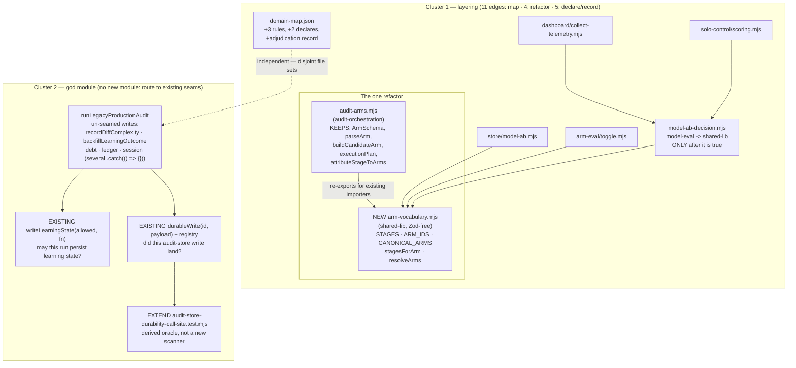

# Plan: God-module and layering debt — two problems, two answers

- **Date**: 2026-08-12
- **Status**: Draft
- **Author**: Claude + Louis
- **Scope**: backend
- **Stack**: `js-ts` (detect-stack: `{stack:"js-ts", stackKinds:["js-ts","postgres"]}`)
- **Target domain(s)**: `shared-lib`, `audit-orchestration`, `model-eval`, `stores`, `arm-eval`, `dashboard`, `solo-control`
- ⚠ **Cross-domain work** — six domains. That is the *subject*, not a smell: the
  work is about where domain boundaries fall. Confirm at audit that no edge is
  crossed except the ones §2 names.
- ⚠ **Untagged path**: `.audit-loop/domain-map.json` matches no rule. Expected —
  it is the map itself, not mapped code.

> **Traces back to** [`audit-store-write-durability.md`](audit-store-write-durability.md) §9:
> *"The god-module / layering family (26 rows, 2 HIGH) — architectural
> refactoring; bundling it would prevent convergence."* The deferral was
> correct. **Its figures were not**, and §11 of this plan corrects them.

---

## 1. Context Summary

**Detected scope**: backend. No frontend surface; no acceptance-criteria section.

### The headline: this is not one problem, and most of it is not code

Re-measured at HEAD `a146bb7b`, the deferred "family" splits into two problems
with **different root causes, different fixes, and different convergence risk**.
Only one of them is a refactor.

| | Claimed in §9 | **Measured 2026-08-12** |
|---|---|---|
| `legacy-production-audit.mjs` | ~1,600 lines | **4,152 lines** — but see below, the file size is not the defect |
| Layering finding set | "26 rows, 2 HIGH" | **194 open rows, 10 HIGH** |
| Distinct code edges behind them | — | **14 file edges / 9 domain edges** (~14 rows per edge) |
| Of those, real code coupling | — | **4** |

### Code Trace

Read at `581fea0b` unless stated (the `a146bb7b` citations name the commit that
caused group (E), not the read point). Mechanical ground truth produced by running
`scripts/lib/arch-intent/adapters/js-ts.mjs`
(`analyseImports`) over all **1,247** tracked `.mjs` files, mapped through
`resolveFileToDomain` against `.audit-loop/domain-map.json`:
**exactly 14 `not-in-allowedDeps` violations across 9 domain edges** at
`581fea0b` (measured twice, identical).

> ⚠ **The measurement moved under this plan mid-session, and that is itself a
> finding.** The first pass measured **20 / 11** and resolved
> `scripts/lib/cross-skill/**` to `shared-lib`. Two later passes measured
> **14 / 9** and resolve it to `cross-skill-bridge` — the difference being
> exactly the `scripts/lib/cross-skill/** → cross-skill-bridge` rule added by
> **`a146bb7b`** ("close out the command-registry migration"), the rule this plan
> was about to propose. **Why the first pass did not see it is not established**
> — this is a shared working tree with four live worktrees and another session
> committing throughout, and the reflog shows `a146bb7b` as an ancestor of the
> session-start HEAD. Rather than guess at a cause, record the consequence: the
> baseline is reproducible at **14 / 9 at `581fea0b`** (measured twice), the 10
> cross-skill edges are closed, and **4 new ones appeared** (§1.1 group E).
> **A layering baseline is only meaningful with its sha, and must be re-derived
> rather than remembered** — this one moved inside one session.

- `scripts/lib/audit-arms.mjs:47,53,54,57,62,63` —
  `STAGES`/`SHARED_STAGES`/`ARM_SPECIFIC_STAGES`/`ARM_IDS`/`SHADOW_STAGES`/`BASELINE_STAGES`,
  all `Object.freeze`d string arrays; `:166` `CANONICAL_ARMS`, frozen literals;
  `:223` `stagesForArm`, `:342` `resolveArms` — **both Zod-free at runtime** (the
  `z.infer` is JSDoc only). `:112,116` `ArmGenerationSchema`/`ArmSchema` and
  `:205` `parseArm`, `:245` `buildCandidateArm` **do** need Zod and
  `CandidateSpecSchema` from `model-eval/contracts.mjs` (`:44`).
- `scripts/lib/model-ab-decision.mjs:44,45` —
  its **only two imports** are `EUR_PER_USD` from `model-pricing.mjs` (shared-lib)
  and **`ARM_IDS` from `audit-arms.mjs`** — a frozen three-string array. Every
  export (`:48` `DECISION_CONSTANTS`, `:65` `normalizeSeverity`, `:74` `sevW`,
  `:83` `qualMult`, `:100` `buildClusters`, `:176` `distinctCodeUnits`,
  `:203` `aggregateCost`, `:237` `evaluateDecision`) is **pure — zero I/O**.
- `scripts/lib/store/model-ab.mjs:24` —
  `import { CANONICAL_ARMS, stagesForArm } from '../audit-arms.mjs'`.
- `scripts/lib/arm-eval/toggle.mjs:25` —
  `import { resolveArms } from '../audit-arms.mjs'`.
- `scripts/lib/dashboard/collect-telemetry.mjs:25` —
  `import { evaluateDecision, DECISION_CONSTANTS } from '../model-ab-decision.mjs'`.
- `scripts/lib/solo-control/scoring.mjs:12` —
  `import { DECISION_CONSTANTS } from '../model-ab-decision.mjs'`.
- `scripts/lib/audit/legacy-production-audit.mjs:1395–3996` —
  `runLegacyProductionAudit`, **2,602 lines in one function declaration**.
  `:1407` destructures `noCloudRecording`; `:1410–1420` the comment *"May THIS
  run write learning state (cloud or local)? One policy, one place."* declaring
  `learningWritesAllowed`; `:3496–3502` the comment recording audit finding H1
  (2026-07-18): *"these were the two cloud writes NOT transitively covered by
  the `if (cloudRunId)` key"*.
- `scripts/lib/requirements/extract.mjs:28`
  `CHUNK_TOKEN_BUDGET = 18_000`; `:176–185` the tier-escalation comment naming
  *"one huge declaration"*; `:210` `splitOversizedFile`; `:398` the call site.
- Precedent, read in full: `scripts/lib/status-vocabulary.mjs`
  header and `scripts/lib/preview-gate-vocabulary.mjs`
  header — both record *"A vocabulary shared across a layer boundary belongs to
  neither side."*
- `git show d5e66d35` (2026-08-10) — the retag commit; see §1.2.

### 1.1 Triage — the original 20, and the 14 that remain at `581fea0b`

Every flagged import was read in context before being counted. **Only group (B)
is code debt.**

| # | Group | Edge | Verdict |
|---|---|---|---|
| ~~10~~ | ~~A — map defect~~ | ~~`scripts/lib/cross-skill/**`~~ | **CLOSED by `a146bb7b` mid-session** |
| 1 | **A — map defect** | `install → scripts` (`check-db-suite-enrolment.mjs → db-test-container.mjs`) | Not code debt. Fix the map. |
| **4** | **E — NEW, caused by `a146bb7b`** | `tests → cross-skill-bridge` | **The §1.2 defect, one day later.** See below. |
| 4 | **B — real coupling** | `stores/arm-eval → audit-orchestration`; `dashboard/solo-control → model-eval` | **Real. Refactor.** |
| 3 | **C — deliberate** | `audit-store-writers.mjs → store/*`; `durable-write.mjs → db/errors.mjs` | Correct design. Retag (decision 4). |
| 2 | **D — benign** | `scripts → install`; `tests → root-scripts` | Retag or refactor — **not** a grant. |

**(E) — `a146bb7b` repeated `d5e66d35`'s mistake, one day later, and this plan
predicted it.** Retagging the 15 `scripts/lib/cross-skill/**` files cleared the
10 outbound violations — and changed the `to` domain of every edge *into* them.
Four test files import cross-skill modules, and `tests`' grant does not include
`cross-skill-bridge`:

```
tests/cross-skill-registry-conformance.test.mjs   -> lib/cross-skill/registry.mjs
tests/cross-skill-scope-resolver.test.mjs         -> lib/cross-skill/scope.mjs
tests/cross-skill-store-calls.test.mjs            -> lib/cross-skill/dispatch.mjs
tests/cross-skill-write-outcome-contract.test.mjs -> lib/cross-skill/dispatch.mjs
```

§1.2 wrote the rule; the shadow reviewer pointed out this plan had not applied it
to the *largest* retag it was proposing; the re-measurement then proved it
empirically. **This is now the strongest evidence in the plan that the
two-direction check must be mechanical, not remembered** — three independent
retags (`d5e66d35`, this plan's draft, `a146bb7b`) made the same one-directional
error inside four days.

**(A) — the map, not the code (11 edges, including *both* HIGHs).**
`scripts/lib/cross-skill/**` — 15 files, 4,408
lines — was created **on 2026-08-12** by the in-flight cross-skill-command-registry
work (`67189e99`, `87c1a19c`, `29b93ddc`, `ef1220c1`). There is **no domain rule
for it**, so the `scripts/lib/**` catch-all tags it `shared-lib`, while its own
CLI entry point `scripts/cross-skill.mjs` is tagged `cross-skill-bridge`. One
subsystem, split across two domains by a glob. Every one of the 10 edges is
already in `cross-skill-bridge`'s grant.
The 11th is `scripts/check-db-suite-enrolment.mjs → scripts/db-test-container.mjs`,
via the `scripts/check-*.mjs → install` glob. **The map predicted this itself** —
the `_why` note on the `check-plan-status.mjs` rule reads: *"That glob assigns
every check-\* CLI to `install`… manufactured a recurring install → plan
violation out of a naming coincidence. The code was right; the map was wrong.
Other check-\* CLIs are likely miscategorised too."*

**(C) — deliberate, and already adjudicated once (3 edges).**
`audit-store-writers.mjs → store/bandit-fp.mjs` + `store/runs-findings.mjs` is
[durability plan](audit-store-write-durability.md) **decision 1b** — that module
is the writer registry's *only* bootstrap and must be importable by both the
orchestrator and a fresh CLI process. `durable-write.mjs → db/errors.mjs` is
**decision 2c** — reusing `normalizePostgresError` as the retryable/permanent
classifier rather than writing a second one. Both were argued and accepted.
Nothing records that, so the auditor re-raises them every round.

**(D) — benign entry-point edges (2).** `update-auditloop.mjs → lib/install/deps.mjs`
is the entry-point-to-implementation shape **already declared** for
`root-scripts → install` on 2026-07-26; it was never extended to this third
installer. `tests/setup-access-routes.test.mjs → setup.mjs` is a test importing
the script it tests — the `tests` grant lists 29 domains and omits `root-scripts`.

### 1.2 (B): the four "anchors" were manufactured by an incomplete re-baseline

The four edges the deferral pointed at are real code coupling — and **two days
old**. The code never changed; the map did.

Commit `d5e66d35` (2026-08-10) retagged `audit-arms.mjs → audit-orchestration`
and `model-ab-decision.mjs → model-eval`, correctly clearing `shared-lib`'s
upward grant from 7 domains to 3. It then re-baselined `allowedDeps` **for the
edges it removed** — and not for the edges the retag *created inbound*. Its own
message contains the one-direction check:

> *"model-ab-decision adds no new edge: model-eval → audit-orchestration was
> already declared and observed."*

That verifies what the file **imports**. It never asks who imports **it**.
Retagging a module changes the `from` domain of every edge *into* it, and four
importers were sitting there: `store/model-ab.mjs`, `arm-eval/toggle.mjs`,
`dashboard/collect-telemetry.mjs`, `solo-control/scoring.mjs`.

This is exactly the defect class AGENTS.md names as shape (3): *"A check
verifying one direction only — ask of any set comparison: **which side am I
iterating, and what is unrepresentable from it?**"* The commit iterated the
retagged files' outbound edges; their inbound edges were unrepresentable from
that side.

**Confirmed by date, not by argument**: all four first appear in
`audit_findings` on **2026-08-10**, the retag date. Before it they were legal
`* → shared-lib` edges.

### 1.3 Neighbourhood considered — and the mechanism grep that corrected it

`get-neighbourhood` (refresh `130ea6c0`) returned 8 records, **all banded
`review`**, top score 0.789, `bandReason: below-noise-floor`. Taken alone that
reads "proceed greenfield".

**It is wrong here, for the same reason it was wrong in the durability plan** —
`review` means "nothing cleared this repo's noise floor", not "nothing exists".
Grepping for the **mechanism** rather than the intent found the pattern shipped
**twice**: `status-vocabulary.mjs` (extracted to kill a `stores → plan` edge)
and `preview-gate-vocabulary.mjs` (extracted to kill a `shared-lib →
audit-orchestration` edge, in `d5e66d35` itself). This plan reuses that
precedent rather than inventing a third shape.

### 1.4 Past incidents

INC-001 and INC-002 returned at cosine ~0.60, `pathOverlap: false` — not
governing. INC-002's lesson transfers and is made testable in §9: *"an env-gate
that checks 'is this variable set' is not a safety gate — it only proves intent
to run."* §1.5's finding is the same shape: `if (cloudRunId)` proves a run id
exists, not that this run is permitted to write.

### 1.5 The god module: an accretion problem, and prior art that already owns it

`legacy-production-audit.mjs` is 4,152 lines, but **the file is not the unit that
hurts**. `runLegacyProductionAudit` is **2,602 lines — 63% of the file — in a
single function declaration**. The other 23 top-level functions average 67 lines
(max 225). Measured with `estimateTokens`: the whole file is 55,355 tokens; that
one function alone is **34,312 tokens against `CHUNK_TOKEN_BUDGET = 18_000`
— 1.9× over as an indivisible declaration.** That is why `splitOversizedFile`
exists, and why its tier escalation bottoms out: no finer tier can split *inside*
one declaration, which its own comment says in as many words.

**Its cost does not surface as `[Architecture]`.** Only 4 open `[Architecture]`
rows name the file, none since 2026-07-19. What it produces instead is a long
tail of `[backend]`/`[be-services]` findings — **25 distinct HIGH categories in
this one file between 2026-07-17 and 2026-08-12**.

#### 1.5a Prior art this plan initially missed — and the corrected mechanism

**`docs/plans/audit-backlog-triage-hardening.md` (2026-07-23, Status: Complete)
item 5 already owns "God-orchestrator decomposition."** Its right-sizing gate
already enumerated the concern boundary — *"scope resolution, provider execution,
suppression, persistence, cloud-write policy, bandit substitution, telemetry,
verification, verdicting, shadow execution, ledger/debt"* — and deliberately
extracted exactly **one** of them, explicitly recording the rest as accepted debt
*"with a pointer back to this plan so the next person doesn't have to re-derive
the boundary list."*

The first draft of this plan re-derived it anyway, and got the mechanism wrong.
That is the same defect §1.3 names, committed one section later: the
`get-neighbourhood` band said `review`, and **no grep for the mechanism was run
on the god-module side.** Recorded rather than quietly corrected, because it is
the plan's own instance of its own lesson.

**Two first-draft premises were falsified at source (plan audit R1, H1/H2):**

- **FALSE**: *"the four bare `if (cloudRunId)` sites don't exclude an
  observation-only run."* `cloudRunId` has **exactly one assignment**
  (`legacy-production-audit.mjs:1568`, `a146bb7b`), inside the block gated at
  `:1523` on `!noCloudRecording && (await isCloudEnabled()) && repoProfile`.
  **`if (cloudRunId)` therefore transitively implies `!noCloudRecording`** and is
  *stricter*, not weaker. The `:3496` comment says so in the other direction —
  the two sites it fixed were writes **not covered by** that key (`syncBanditArms`
  takes no `repoId`), i.e. writes that could fire *without* a `cloudRunId` at all.
- **FALSE**: *"one policy, four spellings, needs one predicate."* The two
  spellings answer **different questions**, and each already has its own choke
  point: `writeLearningState(allowed, fn)` (`:1001–1022`) for *learning state*
  (local **and** cloud), and `durableWrite(id, payload)` with a 6-writer registry
  (`scripts/lib/audit-store-writers.mjs:119–186`) for *audit-store* writes. A
  single `mayPersist` requiring `cloudRunId` would have **blocked local bandit
  persistence whenever cloud was off** — a regression, not a fix.

#### 1.5b What the evidence actually supports

`writeLearningState`'s own docstring (`:1009–1015`) names the real gap, and names
it as deferred debt:

> *"**NOT exhaustive over every persistence-capable call in this file** — a later
> audit (H1-H4, 2026-07-24) correctly found OTHER cloud-write/telemetry sites this
> wrapper does not cover: `recordDiffComplexity(...)`, `backfillLearningOutcome(...)`,
> debt-memory writes, ledger writes, and session writes, several of which also
> silently discard failures (`.catch(() => {})`)."*

So the recurrence mechanism is **accretion past two partial seams**, not one
policy with four spellings. The prior plan measured the accretion directly:
**~1,650 → ~2,227 lines in the two weeks to 2026-07-23**; this plan measures
**2,602 on 2026-08-12** — *+375 lines in 20 days*, still climbing.

**That is the evidence that picks the first slice**: the persistence-capable
calls that neither existing seam covers — a set already enumerated by a
docstring, in a plan that deferred it. Not "the file is big", and not a new
universal predicate.

---

## 2. Proposed Architecture



### Why two clusters, and why they must not be bundled

They share the word "architecture" and nothing else:

- **Different root cause.** Cluster 1's 20 edges are 11 map defects, 4 edges
  manufactured by a 2-day-old re-baseline, 3 deliberate, 2 benign. Cluster 2 is
  one policy smeared across one function.
- **Different evidence stream.** Cluster 1 is `[Architecture]`; Cluster 2
  produces **no** `[Architecture]` findings at all (§1.5) — it emits
  `[backend]`/`[be-services]`. A single audit scope cannot converge both.
- **Nearly disjoint file sets — with one real coupling, now stated.** The shadow
  review caught the draft's "disjoint / could run in parallel" claim as **false**:
  Phase 4 adds `registerWriter` entries to `scripts/lib/audit-store-writers.mjs`,
  which imports the store modules those writers live in — and that file is tagged
  `shared-lib` until **Phase 1** (Cluster 1) retags it to `audit-orchestration`.
  Run Cluster 2 first or in parallel and Phase 4 manufactures fresh
  `shared-lib → stores` violations, the very edge decision 4 refuses to grant.
  **Cluster 1 therefore strictly precedes Cluster 2** (§4), and they are not
  parallel-safe. Everything else about them is independent.
- **Different risk.** Cluster 1 is behaviour-preserving by construction
  (re-exports + map edits). Cluster 2 changes a write-gating predicate — the
  exact surface INC-002 warns about.

Bundling them is what §9 correctly predicted would prevent convergence. The
correction is not "do them together carefully"; it is **two gates**.

### Key design decisions — Cluster 1

1. **The map is fixed with rules, not refactors — and the biggest one landed
   without this plan** *(#5 Single Source of Truth)*. `a146bb7b` added
   `scripts/lib/cross-skill/** → cross-skill-bridge` mid-session, closing the 10
   edges that were group (A)'s bulk. What remains for the map is
   `scripts/check-db-suite-enrolment.mjs → scripts` above the `check-*` glob —
   exactly as `check-plan-status.mjs` already sits, and exactly the recurrence
   the map's own `_why` predicted.

   **But the retag's inbound half was never done, so this plan now owns it.**
   `tests → cross-skill-bridge` (4 edges, §1.1 group E) is the debt `a146bb7b`
   created. The repo's own precedent decides the treatment, and it is *not* a
   grant: `_adjudication_2026_07_31` records the identical question and rejects
   the grant explicitly —

   > *"Declaring `tests -> root-scripts` would have granted every test module
   > access to the whole current and future root-scripts domain to express one
   > narrow relationship; **re-tagging removes the edge instead**."*

   So group (E) is resolved the way the repo already resolved its twin: a rule
   change, not a widened grant. The concrete question Phase 1 must answer is
   whether the four `tests/cross-skill-*.test.mjs` files are better read as
   `cross-skill-bridge`'s own tests (a rule) — and it must answer it **with the
   inbound direction checked**, which is what the Phase 0 oracle is for.

   **The facade tension, restated now that the retag has landed.** AGENTS.md
   calls `cross-skill-bridge` *"a thin facade"* and records 11 deps as debt;
   `a146bb7b` moved 4,408 lines into that domain. This plan does not settle
   that — §10 keeps it as the registry work's own follow-up — but it stops
   pretending the tag change was free.

2. **One extraction fixes all four (B) edges — and it is the repo's own twice-shipped
   move** *(#1 DRY; the AGENTS.md single-oracle rule)*. `audit-arms.mjs` is a
   **mixed** module: a domain-neutral *vocabulary* welded to audit-orchestration
   *coordination*. `d5e66d35` was right about the coordination half and wrong
   about the vocabulary half, and it stated the tiebreak itself: **refactor >
   retag > declare — "when the primitive is innocent, refactor beats retag."**

   Extract `scripts/lib/arm-vocabulary.mjs`
   (shared-lib) holding the frozen sets plus `stagesForArm` and `resolveArms`.
   **Verified liftable**: none of them touches Zod at runtime (the `z.infer` is
   JSDoc), so nothing drags `CandidateSpecSchema`/`model-eval` along.
   `audit-arms.mjs` re-exports, so its 13 importers are untouched — the same
   mechanic `topology.mjs` used for `PREVIEW_GATE_MODES`.

   Carrying `resolveArms` is deliberate: it is pure over the vocabulary plus
   `env`, and `preview-gate-vocabulary.mjs` sets the precedent that a vocabulary
   module carries its own pure predicates (`isPreviewGateMode`). What stays
   behind is everything that needs Zod or an arm *set*.

3. **`model-ab-decision.mjs` is retagged to `shared-lib` — but only after the
   extraction makes that true** *(#5)*. Today it imports `ARM_IDS` from
   `audit-arms.mjs`; that is its **only** feature-domain import, and it is a
   frozen three-string array — another trapped vocabulary constant. Once decision
   2 lands, its imports are `model-pricing.mjs` + `arm-vocabulary.mjs`, both
   shared-lib, and every export is pure with zero I/O. It then passes the same
   test `d5e66d35` applied to `config.mjs`.

   **The ordering is the whole point, and it is not cosmetic.** Retagging first
   would be asserting a property; retagging second is *earning* it. This is
   also the direct antidote to §1.2 — a retag is only complete when both
   directions have been checked, and the extraction is what makes the inbound
   direction safe.

4. **`allowedDeps` is DOMAIN-scoped, so two of the five edges get a narrow retag
   instead of a grant** *(#5; preference order refactor > retag > declare)*. The
   first draft called groups (C) and (D) "five file-level grants". The plan audit
   killed that (R2-M1) and it was right — a grant names a **domain pair**, not an
   import. Resolved at source, the five file edges are only **three** domain
   edges:

   | Domain edge | File edges it would cover | Verdict |
   |---|---|---|
   | `shared-lib → stores` | all 3 of group (C) | **REFUSED** — see below |
   | `tests → root-scripts` | 1 (group D) | **REFUSED** — already rejected 2026-07-31 |
   | `scripts → install` | 1 (group D) | grant, with `_why` — the one genuine case |

   **Granting `shared-lib → stores` would reverse `d5e66d35`.** That commit
   removed `stores` from `shared-lib`'s grant nine days ago (7 → 3), and
   `_comment_allowedDeps` records the edge as *debt, not intent*. A grant is
   domain-wide, so it would also pre-authorise every future `shared-lib → stores`
   import — the opposite of the ratchet's purpose. The draft would have undone
   recent, deliberate progress to make a close-out assertion go green. That is
   the band-aid cliff, reached by accident.

   Both group-(C) files are lib-root modules swept up by the `scripts/lib/**`
   catch-all — **the exact shape `d5e66d35` retagged five files for**:

   - `scripts/lib/audit-store-writers.mjs` → **`audit-orchestration`**. It is the
     audit store's writer-registry bootstrap; its location is fine and its tag is
     wrong. Clears 2 edges and **adds no new domain edge** —
     `audit-orchestration → stores` is already declared *and* observed.
   - `scripts/lib/db/errors.mjs` → **`shared-lib`**, as a narrow rule above the
     `scripts/lib/db/** → stores` glob. Verified at source: the module has
     **zero imports** and exports one pure classifier (`normalizePostgresError`)
     over Postgres error codes. A pure error classifier is a primitive, not
     persistence — the same "the code was right, the glob was wrong" call as
     `check-plan-status.mjs`. Clears the 3rd edge; the resulting `stores →
     shared-lib` edges are already declared.

   **`tests → root-scripts` is refused on the repo's own precedent.**
   `_adjudication_2026_07_31` already faced this exact edge and rejected the
   grant — *"would have granted every test module access to the whole current and
   future root-scripts domain to express one narrow relationship; re-tagging
   removes the edge instead"* — retagging `install.mjs` instead. That pass simply
   never reached `setup.mjs`, which is why
   `tests/setup-access-routes.test.mjs → setup.mjs` survives. Finish the 2026-07-31
   job: **retag `setup.mjs` to `install`**, its sibling's domain. The draft
   proposing a grant here was proposing the option the repo had already
   considered and rejected — the failure mode `git log --grep="considered and
   rejected"` exists to prevent.

   So groups (C) and (D) cost **one** grant between them (`scripts → install`),
   not five. `shared-lib`'s cleared grant stays cleared, and no `tests →` grant
   is created. The `_adjudication_2026_08_12` record documents durability
   decisions 1b/2c for humans — documentation, never the mechanism (R1-H3).

5. **`npm run check` gains no new gate in this plan — deliberately, and the gap
   is named** *(right-sizing)*. Nothing in `check` compares observed-vs-`allowedDeps`
   today: `docs:architecture-intent:check` only reconciles the domain *roster*
   in `docs/architecture-intent.md` against the map. The ratchet is consulted
   **only** by the `/audit-code` arch-intent pass, which is why a 2-day-old
   regression produced **146 finding rows instead of one failed push**.

   That is a real hole and it is **not** closed here. Reason: a gate added in the
   same change that fixes the violations is a gate nobody has seen fail against a
   dirty tree — and this repo's own rule is *"a check is not trustworthy until
   seen to fail."* Sequencing it after Cluster 1 gives it a clean baseline to
   ratchet from and a real red-then-green. §10 owns it, with the trigger
   written down.

6. **Two layering mechanisms — name the one being counted, and nothing more**
   *(#19)*. `docs/architecture-map.md`'s header reads `Layering violations: 0`;
   that counter is `symbol_layering_violations` (dependency-cruiser *rules*), a
   different mechanism from the `allowedDeps` comparison that reads 20. Two
   numbers for one word, one of them reassuring and vacuous.

   The first draft also promised to render an empty rule set as `n/a`. **The plan
   audit killed that as unimplementable (R1-M1), and it was right**: verified at
   source, `renderHeader` (`scripts/lib/arch-render.mjs:200`) receives only
   `violationCount` — a bare number. There is **no rule-set status in its input**,
   so "empty" versus "unavailable" versus "configured and clean" is not
   recoverable, and the renderer would have had to guess — inferring an empty rule
   set from a zero count is precisely the conflation the decision exists to stop.

   Narrowed to what today's input supports: **label the mechanism.**
   `Layering violations (dep-cruiser rules): 0`, and the section body likewise
   scoped to that mechanism instead of the unqualified *"No violations detected
   on this snapshot."* No new field, no producer change, no guessing — and a
   reader stops reading the zero as "the architecture is clean". The three-state
   provenance contract M1 asks for needs a producer change and is deferred with
   named independence (§10).

### Key design decisions — Cluster 2

7. **No new universal predicate. Extend the two seams that already exist**
   *(#1 DRY, #5)*. The first draft proposed one `mayPersist(ctx)` for all 24
   sites; the plan audit killed it (R1-H1) and verification confirmed why. The
   sites answer **two different questions**, each with its own existing seam:

   | Question | Existing seam | Governs |
   |---|---|---|
   | May this run persist *learning state*? | `writeLearningState(allowed, fn)` (`:1001`) | local bandit **and** cloud learning writes |
   | Did this run's *audit-store* write land? | `durableWrite(id, payload)` + registry | the 6 registered store writers |

   Collapsing them into one predicate requiring `cloudRunId` would have **blocked
   local bandit persistence whenever cloud was off** — turning a documented
   graceful-degradation path into a silent data loss. The correct move is
   subtraction, not addition: **no third mechanism.**

7b. **The slice is the writes NEITHER seam covers** *(#15 Error Handling, #19)*.
   The set is not invented here — `writeLearningState`'s docstring (`:1009–1015`)
   points at it, and R2-H1 correctly refused the docstring's *categories* as a
   migration set. **Enumerated at source (`a146bb7b`), it is exactly five call
   sites inside `runLegacyProductionAudit`:**

   | Site | Call | Question it answers |
   |---|---|---|
   | `:1589` | `recordDiffComplexity(cloudRunId, …)` | audit-store |
   | `:3000` | `reconcileRemediationProjection(cloudRepoId, mergedLedger)` | audit-store |
   | `:3009` | `markFindingsRemediation(cloudRepoId, committed)` | audit-store |
   | `:3699` | `recordConvergenceState(cloudRunId, …)` | audit-store |
   | `:3804` | `backfillLearningOutcome({…})` | learning state |

   **All five route to `durableWrite`, because it is the only seam with an
   outcome receipt.** `writeLearningState(allowed, fn)` is, verified at source
   (`:1022`), `if (!allowed) return; return fn();` — a **pure permission gate
   that reports nothing**. "Delete the failure swallow" is therefore
   unspecifiable against it (shadow review, MEDIUM), and `:3804` would have been
   left with no failure representation at all.

   The composition is already shipped and is what the plan adopts: `:3510`
   reads `await writeLearningState(learningWritesAllowed, async () => { …
   tallyWriteOutcomes(writeOutcomes, [await durableWrite('learning.banditArms',
   …)]) })`. **Permission wraps durability.** So `:3804` becomes a registered
   writer wrapped in `writeLearningState`; the other four call `durableWrite`
   directly. Still no new mechanism.

   **Phase 4 is done when these five are routed — the set is closed, not a
   category.** A sixth persistence-capable call discovered during
   implementation, or any one of the five that fits neither seam, **blocks Phase
   4** and is raised before proceeding: it means a third question exists, which
   is exactly the thing decision 7 refuses to invent pre-emptively. It is not a
   note to file and move past. Each site is routed to whichever seam owns it —
   `durableWrite` when it is an audit-store write (registering a writer is one
   `registerWriter` call by design), `writeLearningState` when it is learning
   state — and a write that fits neither is the finding to surface, not to wrap.

   **Silent-discard is the defect being fixed**, which is the durability plan's
   own principle applied one file over: *a failed write must not be representable
   as a normal outcome.*

7c. **Two directions, because one oracle structurally cannot see the other side**
   *(R1-H2, then R3-H2)*. R1-H2 killed the first draft's "scan for a cloud-write
   call guarded by anything other than `mayPersist`" — no set defined, and no way
   to establish dominance over async or indirect writes. The R2 answer swung too
   far the other way, and R3-H2 reopened it correctly:

   `tests/audit-store-durability-call-site.test.mjs` iterates the **store
   modules** and asserts each write export is registered or exempt. That proves
   *registry completeness* — and **an orchestrator call that bypasses a seam
   entirely is unrepresentable from that side.** This is §1.2's defect class
   (*"which side am I iterating, and what is unrepresentable from it?"*) turning
   up in this plan's own test design.

   So: keep the existing store-side oracle (extended for the newly-routed
   writers), and add an **orchestrator-side import check** over the *same derived
   writer set* — `legacy-production-audit.mjs` must not reference a store write
   symbol except through a seam module. This is structural, not a dominance
   analysis: it reads the import graph, which is exactly what R1-H2 said a text
   scan could not do.

   **It must cover dynamic imports.** Verified at source: four of the five
   writers are static imports at `:98`, and `recordConvergenceState` is a
   **dynamic** `await import('../store/learning-decisions.mjs')` at `:3648`. A
   static-import-only check would silently miss it — the same blind spot one
   level down. The arch-intent adapter already classifies `dynamic` edges, so the
   machinery exists.

8. **Line count is a consequence, not the goal.** This slice removes a bounded
   set of un-seamed writes; it will not, by itself, take a 2,602-line function
   under any threshold. Stated so the next round is not measured against the
   wrong number. **Deliberately not pre-planned beyond slice 1** — and the
   boundary list for slices 2..N already exists in
   `docs/plans/audit-backlog-triage-hardening.md` item 5, which is where the next
   slice should start rather than re-deriving it (as this plan's first draft
   did). Whether there *is* a next slice depends on whether the
   `[be-services]` persistence tail stops.

### Right-sizing gate

Per AGENTS.md, both extremes written out so the middle is visible.

**Cluster 1 — layering**

- **Band-aid** — add the 7 missing domain edges to `allowedDeps` and move on.
  Cheapest, and it is what the ratchet's design invites. It would silently
  endorse a layer inversion (`stores → audit-orchestration`) created by a
  bookkeeping mistake, grow the very grants `_comment_allowedDeps` records as
  debt, and leave the *next* retag free to repeat §1.2 exactly.
- **Over-engineered** — refactor all 14 remaining edges to satisfy the current map, plus a
  full layering-enforcement gate in `check`, plus unifying the two
  violation-counting mechanisms. Most are the map being wrong; this
  spends refactor effort making code apologise for a glob, and adds a gate with
  no seen-to-fail baseline.
- **Chosen** — **1 extraction + 3 retags (1 of them earned by the extraction) +
  3 map rules + 2 documented grants + 1 adjudication record + 1 mechanism
  label.** It serves a requirement that exists today: *14 real violations produce
  194 audit rows and no push failure*. Each of the 14 gets the treatment its own
  evidence supports — refactor where the primitive is innocent, retag where the
  tag was wrong, grant **with a written rationale and a decision reference** only
  where the edge is genuinely benign.

  The difference from the band-aid is *which* edges are granted and *with what*.
  The band-aid grants all 7 undeclared domain edges silently — including
  `shared-lib → stores`, which `d5e66d35` deliberately removed nine days ago.
  This grants **two**, each with a `_why`, and refuses that one outright
  (decision 4). Granting is not the failure mode; granting without a reason, or
  granting back something just cleared, is.

**Cluster 2 — god module**

- **Band-aid** — split the *file* into topic modules (`cache.mjs`, `prompts.mjs`,
  `scheduling.mjs`, …) leaving `runLegacyProductionAudit` intact. It looks like
  progress, moves ~1,550 lines that were never the problem, and **achieves
  nothing measurable**: the 2,602-line function is the unit that blew the token
  budget and the unit the persistence findings live in.
- **Over-engineered (two flavours, and the first draft picked one)** — (a)
  rewrite the orchestrator as a phase/plugin pipeline with declarative contracts
  and injected capabilities: nothing needs runtime-pluggable phases, and its
  audit would never converge, which is exactly what §9 deferred to avoid. (b)
  **a third universal admission predicate layered over the two seams that already
  exist** — the first draft's `mayPersist`. It reads as consolidation and is
  addition: two partial mechanisms plus a new one that must agree with both, and
  it would have regressed local persistence (§1.5a).
- **Chosen** — **route the writes that neither existing seam covers into
  whichever seam owns them, and extend the existing derived oracle to see them.**
  The set is enumerated by a docstring, was deferred by a completed plan, and
  several of its members swallow failures today. New abstractions: **zero**. It
  is a true function of the problem because the problem is *accretion past two
  partial seams* — measured at ~1,650 → ~2,227 → 2,602 lines — and the fix is to
  close the gap the accretion flows through. Small enough to converge;
  falsifiable — if the `[be-services]` persistence tail continues after this
  lands, the diagnosis was wrong, and slice 2 starts from
  `audit-backlog-triage-hardening.md` item 5's boundary list rather than from a
  fresh guess.

**Manual vs scripted.** Cluster 1: 4 import rewrites + map edits — **by hand**
(under the ~5-site threshold, and each needs a judgement). Cluster 2: the
un-seamed write set is small, and each member needs a per-site decision about
*which* seam owns it (audit-store vs learning state) plus, for the
`durableWrite` ones, whether a `rowKey` can be declared. Irregular and
judgement-heavy ⇒ **by hand**, one write at a time.

---

## 3. Sustainability Notes

- **Assumption encoded**: a domain tag is a property of what a module *is*, not
  of where a glob happens to catch it. The `check-*` and `lib/**` catch-alls will
  keep mis-reading new subsystems; the answer is a specific rule above the
  catch-all, which the map already does twice.
- **The re-baseline defect will recur** unless the two-direction check becomes
  routine. §10's gate is the mechanical answer; until it exists the human answer
  is in the map's `_why`: **retagging a module changes every edge INTO it.**
- **Extension point**: `arm-vocabulary.mjs` is where a fifth arm or a new stage
  goes. A consumer needing the vocabulary imports shared-lib; a consumer needing
  arm *coordination* imports `audit-arms.mjs`. The split makes that choice
  explicit instead of accidental.
- **The two persistence seams stay two.** `writeLearningState` answers "may this
  run persist learning state"; `durableWrite` answers "did this audit-store write
  land". A future write picks the seam that owns its question — the failure mode
  to guard against is a *third* mechanism that must agree with both.
- **Deliberately NOT built**: any new admission predicate (§2 decision 7), a
  layering gate in `check` (§10), the three-state layering-provenance contract
  (§2 decision 6 / §10), slices 2..N of the orchestrator (§2 decision 8), any
  change to the `cross-skill-bridge` facade itself (§10).

---

## 4. Execution Model

1. **Cluster 1 is internally ordered and the order is load-bearing.** The oracle
   (Phase 0) **must precede every fix**, or it never gets a tree to go red
   against (R3-M1). The `arm-vocabulary.mjs` extraction (Phase 2) **must precede**
   the `model-ab-decision.mjs` retag (Phase 3): retagging first asserts a property
   the code does not yet have — the exact mistake §1.2 documents.
2. **Map rules (Phase 1) are independent** of the extraction and land first, so
   the 11 group-(A) edges clear before the refactor is audited. This keeps the
   Cluster 1 audit scope to the edges that are actually about code.
3. **Cluster 2 must NOT start before Cluster 1's Phase 1** — and this is a
   correctness constraint, not a preference. Phase 4 registers writers in
   `audit-store-writers.mjs`, a file Phase 1 retags out of `shared-lib`. Starting
   Cluster 2 first creates exactly the `shared-lib → stores` edges decision 4
   refuses to grant, and the Phase 0 oracle would (correctly) go red on work that
   is otherwise right. The draft called the clusters parallel-safe; they are not.
4. **Within Cluster 2 the un-seamed writes are routed one at a time**, each with
   its own decision about which seam owns it. A write routed to `durableWrite`
   also needs its `registerWriter` entry (and a `rowKey`, or an explicit
   `lost`-only declaration) in the same edit — the durability plan's contract,
   not a new one.

No migration, no schema change, no backfill. Every phase is independently
revertable.

---

## 5. File-Level Plan

| File | Intent | Purpose |
|---|---|---|
| `.audit-loop/domain-map.json` | modify | +3 rules (`scripts/lib/cross-skill/**` → `cross-skill-bridge`; `scripts/check-db-suite-enrolment.mjs` → `scripts` above the `check-*` glob; `scripts/lib/arm-vocabulary.mjs` → `shared-lib`), **+2 narrow retags** (`audit-store-writers.mjs` → `audit-orchestration`; `db/errors.mjs` → `shared-lib`) and **+2 domain grants with `_why`** (`scripts → install`, `tests → root-scripts`) — decision 4, and deliberately **no `shared-lib → stores` grant**; +1 `_adjudication_2026_08_12` record; the `model-ab-decision.mjs` retag in Phase 3. |
| `scripts/lib/arm-vocabulary.mjs` | create | The Zod-free arm vocabulary: `STAGES`, `SHARED_STAGES`, `ARM_SPECIFIC_STAGES`, `ARM_IDS`, `SHADOW_STAGES`, `BASELINE_STAGES`, `CANONICAL_ARMS`, `stagesForArm`, `resolveArms`. Header records why it is in shared-lib, mirroring `status-vocabulary.mjs`. |
| `scripts/lib/audit-arms.mjs` | modify | Delete the moved declarations; re-export from `arm-vocabulary.mjs` so all 13 importers are unaffected. Keeps `ArmSchema`, `ArmGenerationSchema`, `parseArm`, `buildCandidateArm`, `executionPlan`, `attributeStageToArms`. |
| `scripts/lib/store/model-ab.mjs` | modify | Re-point `CANONICAL_ARMS`, `stagesForArm` at `arm-vocabulary.mjs`. Kills `stores → audit-orchestration`. |
| `scripts/lib/arm-eval/toggle.mjs` | modify | Re-point `resolveArms`. Kills `arm-eval → audit-orchestration`. |
| `scripts/lib/model-ab-decision.mjs` | modify | Re-point `ARM_IDS` at `arm-vocabulary.mjs` — the change that makes the Phase 3 retag true. |
| `tests/arm-vocabulary-layering.test.mjs` | create | The layering oracle — see §6. |
| `scripts/lib/arch-render.mjs` | modify | Name the mechanism on the `Layering violations` counter and scope the section body to it (decision 6). No new input field — `renderHeader:200` receives only `violationCount`. |
| `scripts/lib/audit/legacy-production-audit.mjs` | modify | Route **the five sites in decision 7b's table** (`:1589`, `:3000`, `:3009`, `:3699`, `:3804`) into `durableWrite` or `writeLearningState`; delete their failure swallows; drop the now-unused direct writer imports at `:98` and the dynamic one at `:3648`. **No new predicate; `learningWritesAllowed` stays.** |
| `scripts/lib/audit-store-writers.mjs` | modify | `registerWriter` entries for any write newly routed to `durableWrite`, each declaring a `rowKey` or an explicit `lost`-only rationale. |
| `tests/audit-store-durability-call-site.test.mjs` | modify | Extend the **existing** derived oracle to cover the newly-routed writers (decision 7c) — not a second scanner. |
| `docs/architecture-intent.md` | modify | Phase 1 falsifies two of its domain descriptions: `stores` is documented as "`scripts/lib/store/**`, `scripts/lib/db/**`" (`:154`) and `cross-skill-bridge` as "`scripts/cross-skill.mjs` — the CLI facade" (`:118`), which `a146bb7b` already made wrong. `docs:architecture-intent:check` compares only the domain **roster**, so neither drift is caught — it is prose, and it needs hand-editing. |
| `docs/plans/audit-store-write-durability.md` | modify | Correct §9's stale figures; point at this plan (§11). |
| `AGENTS.md` | modify | One line: retagging a module changes every edge INTO it — re-baseline both directions. |

### 5b. Implementation Phases

**Phase 0 — Build the layering oracle and see it fail**: create
`tests/arm-vocabulary-layering.test.mjs` against unmodified HEAD and confirm it
reports the §11 baseline (**14 violations / 9 domain edges** at `581fea0b`). Nothing is fixed in
this phase — its whole purpose is the red. Files:
`tests/arm-vocabulary-layering.test.mjs` (create).

**Phase 1 — Map defects, retags and grants (16 edges, no code change)**: add the
remaining group-(A) rule (`check-db-suite-enrolment.mjs`); resolve group (E)
(`tests → cross-skill-bridge`) by rule, not grant; add the two group-(C) retags
(`audit-store-writers.mjs`, `db/errors.mjs`); retag `setup.mjs` → `install` to
finish the 2026-07-31 job; add the single `scripts → install` grant with its
`_why`; add the `_adjudication_2026_08_12` record; correct the two now-false
domain descriptions. Files: `.audit-loop/domain-map.json` (modify),
`docs/architecture-intent.md` (modify).

**Phase 2 — Extract the arm vocabulary (3 edges)**: create the shared-lib module,
re-export from `audit-arms.mjs`, re-point the three importers. Files:
`scripts/lib/arm-vocabulary.mjs` (create), `scripts/lib/audit-arms.mjs` (modify),
`scripts/lib/store/model-ab.mjs` (modify), `scripts/lib/arm-eval/toggle.mjs` (modify),
`scripts/lib/model-ab-decision.mjs` (modify), `tests/arm-vocabulary-layering.test.mjs` (modify — add the moved-set, public-surface and presence assertions).

**Phase 3 — Earn the retag (2 edges) + stop the counter lying**: retag
`model-ab-decision.mjs` to `shared-lib` *now that it is true*, clearing
`dashboard → model-eval` and `solo-control → model-eval`; label the
`Layering violations` counter. Files: `.audit-loop/domain-map.json` (modify),
`scripts/lib/arch-render.mjs` (modify).

**Phase 4 — Route the five un-seamed writes**: the set is exactly decision 7b's
table (`:1589`, `:3000`, `:3009`, `:3699`, `:3804`) — the docstring is provenance
for how it was found, **never the set itself**. Route each to its owning seam,
delete its failure swallow, and give any `durableWrite` one its `registerWriter`
entry in the same edit. A sixth persistence-capable call found here **blocks the
phase**. Files:
`scripts/lib/audit/legacy-production-audit.mjs` (modify),
`scripts/lib/audit-store-writers.mjs` (modify).

**Phase 5 — Close both directions of the oracle**: widen
`tests/audit-store-durability-call-site.test.mjs` so the newly-routed writers stay
derived rather than hand-listed, and add the orchestrator-side import check
(static **and** dynamic) so a future direct persistence call in
`runLegacyProductionAudit` fails the suite. Files:
`tests/audit-store-durability-call-site.test.mjs` (modify).

**Phase 6 — Correct the record**: fix §9's figures, add the AGENTS.md line.
Files: `docs/plans/audit-store-write-durability.md` (modify), `AGENTS.md` (modify).

**Close-out (not a phase)**: `npm run arch:refresh` then `npm run arch:render`
(the map must be regenerated after the rule edits — editing `domain-map.json`
alone does not retag existing DB rows) · re-run the §6 mechanical measurement and
assert **0** violations — reachable because Phase 1 *retags* groups (C), (D) and
(E) and grants only `scripts → install`, never `shared-lib → stores` or a
`tests →` edge (decision 4) · `npm run check` · `npm test` ·
close each addressed
finding with `cross-skill.mjs final-review-record-fix` against its commit.

---

## 6. Testing Strategy

Tier 1 (test-first) — the one new module (`arm-vocabulary.mjs`) and both oracles
are deterministic with no LLM. **Cluster 2 adds no new module, so it adds no new
suite** — it extends one that exists (decision 7c).

- **The layering oracle is DERIVED, not enumerated.**
  `tests/arm-vocabulary-layering.test.mjs` re-runs the §1 measurement in-process
  (`analyseImports`, mapped through the committed `domain-map.json`) and asserts
  the violation set is **empty**. **Its inventory is tracked *plus non-ignored
  untracked* `.mjs`, not `git ls-files` alone** (R2-M3): Phase 2 *creates*
  `arm-vocabulary.mjs`, which a tracked-only scan cannot see until it is staged —
  so the oracle could report zero having never examined the module the phase
  exists to add. The suite asserts the analysed inventory **contains
  `scripts/lib/arm-vocabulary.mjs`**, which is the vacuous-pass guard for this
  specific blind spot. The §1 baseline figure (20 edges) stays tracked-only for
  comparability and is labelled with its sha. A hand-listed
  set of 20 expected edges would prove only that someone updated the list —
  the failure mode `/audit-code` R2-M3 killed in the durability plan. This is
  the same disk-iterating shape as `db:enrolment:gate`.
- **Seen-to-fail, and the instrument first — which is why the oracle is Phase 0.**
  R3-M1 caught the draft's sequencing as impossible: Phase 1 clears 16 of the 20
  edges, so an oracle first written in Phase 2 had no tree left to go red
  against. The oracle is therefore built **before any map edit**, run against
  unmodified HEAD, and must report exactly **14 violations across 9 domain
  edges at `581fea0b`** — the §11 baseline, reproduced by the instrument that
  will later claim zero. **Pin the baseline to a sha and re-derive it if HEAD
  moved**: this figure was 20/11 four hours earlier, and a concurrent commit
  changed it (§1 Code Trace). An oracle reporting 0 on a broken tree and 0 on a fixed one is
  indistinguishable from a working one, and this repo has burned six consecutive
  sessions on instrument defects.

  **The `arm-vocabulary.mjs` presence assertion is NOT part of that baseline run**
  (same finding): the module does not exist at Phase 0, so asserting its presence
  there would fail the guard rather than demonstrate the measurement. It is
  scoped to the post-Phase-2 assertion set, where the file exists and its absence
  would be the real defect.
- **Both directions of the retag** (the §1.2 defect, made testable): after the
  Phase 3 retag, assert both that `model-ab-decision.mjs` has no feature-domain
  *imports* **and** that no violation names it as a *target*. The second
  assertion is the one `d5e66d35` could not have made.
- **Re-export equivalence, as TWO contracts** (Phase 2). The draft's single
  criterion was unsatisfiable (R2-M2): the retained exports (`ArmSchema`,
  `ArmGenerationSchema`, `parseArm`, `buildCandidateArm`, `executionPlan`,
  `attributeStageToArms`) have no `arm-vocabulary.mjs` binding to be identical
  to. Split:
  1. **Moved set** — a frozen named list (`STAGES`, `SHARED_STAGES`,
     `ARM_SPECIFIC_STAGES`, `ARM_IDS`, `SHADOW_STAGES`, `BASELINE_STAGES`,
     `CANONICAL_ARMS`, `stagesForArm`, `resolveArms`): for each, the
     `audit-arms.mjs` export is `===` the `arm-vocabulary.mjs` binding.
  2. **Public surface** — asserted against an **explicit frozen expected-name
     manifest committed in the test**, not against "its names before" (R3-M2: a
     test reading only post-change code cannot detect an export that was
     accidentally *removed*, and there is no pre-extraction snapshot to compare
     with). The manifest is a maintained contract: changing `audit-arms.mjs`'s
     public surface means editing it deliberately, which is the point.
- **Each routed write proves its outcome, not its wrapping** (Cluster 2). For
  every write moved in Phase 4, assert the *observable* contract the seam
  promises: a `durableWrite` one tallies into `writeOutcomes` and is
  spill-or-`lost` on failure; a `writeLearningState` one does not fire under
  `noCloudRecording: true`. Asserting "it now calls the wrapper" would test the
  edit, not the behaviour.
- **The failure swallow is the regression test.** For each `.catch(() => {})`
  deleted, force the underlying write to reject and assert the outcome is
  *represented* — counted in `writeOutcomes`, not absorbed. Written first; it
  must fail against HEAD, which is the whole point of the finding.
- **Negative control** (mandatory): with the store healthy, every routed write
  reports `written` and the run is not marked `incomplete`. A seam that reports
  failure unconditionally passes every test above — "no silent losses" and a
  stuck classifier are otherwise identical.
- **Extended derived oracle, and its vacuous-pass guard**:
  `tests/audit-store-durability-call-site.test.mjs` already derives the writer set
  from the store modules; the extension keeps that derivation (never a hand list)
  and must **fail if it derives zero writers** — a scan matching nothing reports
  clean.
- **No live DSN** in any test (INC-002).

**Seen-to-fail**: every guard run red before green, one defect at a time,
mutation-tested individually (fix reverted, test confirmed red, fix restored).

---

## 7. Risk & Trade-off Register

| Risk | Mitigation |
|---|---|
| The `cross-skill-bridge` retag hides real facade debt behind a legal tag | Named, not papered over (§2 decision 1). The 10 edges exist today; the retag makes their true size visible instead of hiding them under `shared-lib`. §10 owns the facade question with the registry work as its natural owner. |
| Extraction breaks one of `audit-arms.mjs`' 13 importers | Re-export keeps the public surface byte-identical; §6's equivalence test asserts identity, not just presence. Same mechanic as `topology.mjs`/`PREVIEW_GATE_MODES`. |
| The retag in Phase 3 repeats §1.2's one-direction mistake | §6 asserts **both** directions explicitly, and Phase 3 is ordered *after* the extraction that makes the inbound direction safe. |
| Routing a write into `durableWrite` changes failure behaviour | It is *supposed* to — the swallow is the defect. But a newly-spill-eligible writer needs a real `ON CONFLICT` target; where none exists it is declared `lost`-only, per the durability plan's own rule that a logical key is not a constraint. Each write is a separate justified edit. |
| A routed write turns out to belong to neither seam | Surface it as a finding rather than forcing a fit. That is the signal that a third question exists — which is exactly what decision 7 refuses to invent pre-emptively. |
| Cluster 2 does not stop the `[be-services]` persistence tail | Then the §1.5b diagnosis was wrong, and that is **useful** — slice 2 starts from `audit-backlog-triage-hardening.md` item 5's boundary list. Explicitly falsifiable (§2 decision 8). |
| This plan re-derives something that already exists (again) | It already did once — §1.5a records it. The standing mitigation is the durability plan's rule: grep for the **mechanism**, not the intent, before concluding greenfield. Applied to Cluster 2 after the fact; applies to slice 2 before it starts. |
| `arch:refresh` cost | Close-out only, once. Domain re-tagging happens in `arch:refresh` against `symbol_index` — editing the map alone does not retag existing rows, so skipping it leaves the dashboard reading the old domains. |
| 194 open store rows remain after the code is fixed | Out of scope here and deliberately so — bulk finding-state reconciliation is classifier-gated, never raw SQL. §10. |

---

## 8. Execution Clustering

- **Cluster 1** — Phases 0–3 — fix-gate: `yes`
  - Coupling: Phase 0's oracle is the instrument Phases 1–3 are measured by (and
    must go red before any of them run); Phase 2's extraction is what makes
    Phase 3's retag true, and both read the Phase 1 rules to resolve domains. A change to the vocabulary's
    membership breaks all three at once. Auditing them together is the only way
    the wiring pass sees the extraction seam *and* both retags — which is exactly
    the seam `d5e66d35` got wrong looking at one side.
  - author-tier: `standard`
- **Cluster 2** — Phases 4–5 — fix-gate: `yes`
  - Coupling: Phase 5 widens the derived oracle to see exactly the writers Phase 4
    routes; the routing and the thing that proves no write escapes are one
    contract. Split, Phase 4 lands writes nothing derives and Phase 5 widens an
    oracle over a set that has not moved.
  - author-tier: `standard`
- **Cluster 3** — Phase 6 — fix-gate: `final`
  - Coupling: documentation-only; stands alone by design, so the wiring pass can
    see it touches no code path.
  - author-tier: `economy`
- **Final gate**: consolidated Gemini review over the union diff of Clusters 1, 2
  and 3.

---

## 9. Security Considerations

Cluster 2 moves writes onto persistence seams and deletes failure swallows. The
governing lesson is INC-002's: *"an env-gate that checks 'is this variable set'
is not a safety gate — it only proves intent to run."* Applied here, the
first-draft reading of `if (cloudRunId)` was the mirror-image error — it assumed
a weak gate without checking, and verification showed the gate is
**transitively correct** (§1.5a). Both directions of that mistake are cheap to
make and cheap to check; the rule is to check.

Two consequences, both testable and both in §6:

- **`.catch(() => {})` is the security-relevant defect**, not a style issue: a
  swallowed persistence failure is the "believable false zero" the durability
  plan exists to stop. Deleting it is the fix; representing the outcome is the
  proof.
- **The negative control is mandatory**, because a seam that reports failure
  unconditionally passes every leak test while silently degrading every run.

No credentials, no egress, no new external surface. Group (C)'s
`durable-write.mjs → db/errors.mjs` edge is *retained* deliberately — writing a
second Postgres error classifier would be the real security regression.

---

## 10. Out of Scope (Future)

Deferred with named **independence** — this plan's correctness rests on none of
them:

- **A layering gate in `npm run check`.** The hole is real (§2 decision 5): 20
  violations produced 194 finding rows and zero push failures. Not closed here
  because a gate born in the same change that fixes its subject has never been
  seen to fail. **Trigger**: immediately after Cluster 1's close-out reports 0
  violations — that is its clean baseline and its red-then-green opportunity.
- **The `cross-skill-bridge` facade itself** — 11 declared deps against an
  AGENTS.md description of "a thin facade". Independent: this plan only changes
  which domain those edges are *attributed* to, not how many there are.
  **Trigger**: the cross-skill-command-registry work, which owns that subsystem
  and is the only change with the context to narrow it.
- **The three-state layering-provenance contract** (`configured` / `empty` /
  `unavailable`) that R1-M1 asked for, and unifying the two violation counters.
  Independent: §2 decision 6's label change needs no new data, and is honest
  about the mechanism it names. Both of these need a **producer** change —
  `renderHeader` (`arch-render.mjs:200`) receives only a bare `violationCount` —
  which is a schema change with no current requirement. **Trigger**: any work
  that already touches the `symbol_layering_violations` producer.
- **Reconciling the 194 open store rows.** Independent of the code fix. Backfill
  is classifier-gated, never raw SQL.
- **Orchestrator slices 2..N.** Deliberately undesigned (§2 decision 8) —
  pre-committing to them before slice 1 reports is the over-engineering cliff.
  **Trigger**: the `[be-services]` persistence tail measured 4 weeks after
  Cluster 2 lands.
- **The other mis-globbed `check-*` CLIs** the map's own note predicts
  (`check-rls` → security, `check-stale-skill-surface` → skills). Only the one
  with an *observed* violation is retagged here — the same discipline the map
  applied on 2026-07-17, and for the same reason: reshuffling a glob blind
  trades a known defect for unknown ones.

---

## 11. Evidence and corrections to the record

Figures re-derived at HEAD `581fea0b` on 2026-08-12. §9 of
[`audit-store-write-durability.md`](audit-store-write-durability.md) is corrected
by Phase 6 as follows:

| §9 claim | Measured | Method |
|---|---|---|
| "26 rows, 2 HIGH" | **194 open rows, 10 HIGH** (146 raised since 2026-08-10) | `audit_findings` ⋈ `audit_runs` ⋈ `audit_repos`, category `ILIKE '%architect%'`, excluding `dismissed`/`fixed` |
| implied ≈26 distinct issues | **14 file edges / 9 domain edges** at `a146bb7b` — a ~14:1 re-raise ratio | `analyseImports` over 1,250 tracked `.mjs` at `581fea0b` |
| — | read **20 / 11** on the session's first pass; `a146bb7b`'s cross-skill rule closed 10 and opened 4 | re-measured twice at `581fea0b`; the first reading's provenance is unresolved (see §1 Code Trace) |
| "~1,600 lines" (session brief) | **4,152 lines**; the defect is one **2,602-line function** | `wc -l`; per-function line spans computed from declaration offsets |
| — | **34,312 tokens** for that one function vs an 18,000 budget (1.9×) | `estimateTokens` from `scripts/lib/repo-context.mjs` |
| — | function growth **~1,650 → ~2,227 → 2,602 lines** (2026-07-09 → 07-23 → 08-12) | first two from `audit-backlog-triage-hardening.md`'s right-sizing gate; third measured here |

**All four "still open" anchors were confirmed live at source** —
`store/model-ab.mjs:24`, `arm-eval/toggle.mjs:25`,
`dashboard/collect-telemetry.mjs:25`, `solo-control/scoring.mjs:12` — and all
four turned out to be **two days old, created by a map edit rather than by code**
(§1.2). The brief's instruction to check whether they were already fixed was the
right one; the answer is stranger than "fixed or not fixed".

### 11.1 Two of THIS plan's own first-draft premises were falsified

Recorded rather than silently corrected, because both are instances of rules the
plan itself cites (plan audit R1, H1/H2 — see §1.5a for the code):

| First-draft claim | Status | What it was |
|---|---|---|
| "the 4 bare `if (cloudRunId)` sites don't exclude an observation-only run" | **FALSE** | `cloudRunId` has one assignment (`:1568`) inside a `!noCloudRecording` block, so the check is *stricter*, not weaker |
| "one policy, four spellings, needs one `mayPersist` predicate" | **FALSE** | two questions, two existing seams; the predicate would have blocked local persistence with cloud off |
| "proceed greenfield on the god module" | **FALSE** | `audit-backlog-triage-hardening.md` item 5 already owns it and already derived the boundary list |

The third is the same failure the durability plan documents about itself: the
neighbourhood band said `review`, and **no mechanism grep was run** on the
god-module side. §1.3 quotes that lesson; §1.5a is where this plan broke it.

**One figure this plan does NOT claim**: whether Cluster 2 reduces the
`[be-services]` persistence finding rate. That is the hypothesis it exists to
test (§7), and it is measured after the fact, not asserted here.

---

## 12. Audit trail

| Gate | Verdict | Findings | Disposition |
|---|---|---|---|
| GPT plan-audit R1 | `NEEDS_REVISION` | H:3 M:1 | 4/4 accepted fix-now (100%) |
| GPT plan-audit R2 | `NEEDS_REVISION` | H:1 M:3 | 4/4 accepted fix-now (100%) |
| GPT plan-audit R3 | `NEEDS_REVISION` | H:2 M:2 (1 reopen) | 4/4 accepted fix-now (100%) |
| **Gemini final gate** | **`APPROVE`** | 0 new · 0 wrongly-dismissed · 0 over-engineering | coherence **Strong** |
| Shadow reviewer (observation-only, claude-opus-5) | `CONCERNS` | 5 shadow-only (H:2 M:3) | **5/5 accepted fix-now** |

**17 findings, 17 accepted, 0 dismissed, 0 deferred-as-rigor-pressure.**

> **The gate approved; the shadow found five real defects.** Gemini returned
> `APPROVE` with zero findings while the observation-only shadow returned
> `CONCERNS` with five — two HIGH — and **all five verified true at source**,
> including one that invalidated the plan's headline measurement. Consistent with
> this repo's own shadow-A/B verdict (KEEP): shadow-only findings are frequently
> real. An `APPROVE` from the primary gate is not evidence the shadow is noise.

**Stop decision**: stopped at the 3-round default. Acceptance held at **100%
across all three rounds**, and the HIGH count moved 3 → 1 → 2 — by the skill's
own rule (*rising HIGH with high acceptance means the plan is gaining real
surface, not that the auditor is reaching*) a 4th round would have been
defensible. Stopped anyway because R3's four findings were **all propagation debt
from R2's own fixes** — three contradictions introduced by those edits plus one
reopen — rather than net-new design defects, and the independent Gemini gate is
the right instrument for the revised design. Every finding was verified against
source before triage.

**Every R1 finding was verified against source before triage, and all four
held.** Two of them (H1, H2) named seams that already exist and the first draft
had not found — the audit did not just improve the plan's specification, it
falsified its design. A third (H3) was a flat internal contradiction: group (C)
edges left ungranted while close-out asserted zero violations. H1's verification
in turn surfaced two further defects the audit had *not* raised (§11.1), both
first-draft premises of Cluster 2.

R2 and R3 then went after the *revised* design and found four more real defects
each; the shadow reviewer found five more after the gate approved. Four are worth
recording because they are this plan's own rules failing on this plan:

- **R2-M1** caught that `allowedDeps` is domain-scoped, so the draft's "five
  file-level grants" were three domain grants — one of which,
  `shared-lib → stores`, `d5e66d35` had **deliberately removed nine days
  earlier**. The plan would have reversed recent progress to make its own
  close-out assertion go green. Replaced with two narrow retags and zero
  `shared-lib` grants.
- **R3-H2** reopened the oracle question and landed on §1.2's defect class
  exactly: the store-side oracle **cannot represent** an orchestrator call that
  bypasses a seam. The plan had written that lesson in §1.2 and then designed a
  one-directional test. Now both directions, and the orchestrator-side check
  covers dynamic imports because one of the five writers is one.

- **Shadow-2** caught that the plan applied its own two-direction rule to two
  small retags and **not to the largest one it was proposing**
  (`scripts/lib/cross-skill/**`, 15 files). The re-measurement then proved it:
  `a146bb7b` shipped that retag and created 4 new `tests → cross-skill-bridge`
  violations. Three retags in four days — `d5e66d35`, this plan's draft,
  `a146bb7b` — made the same one-directional error.
- **Shadow-1** caught the cluster-independence claim as false: Phase 4 registers
  writers in a file Phase 1 retags, so the clusters are strictly ordered, not
  parallel-safe.

**Net effect on scope**: Cluster 2 went from "create a new predicate module and
migrate 24 sites" to "route five enumerated call sites into the one seam that
carries an outcome receipt, composed with the permission gate exactly as `:3510`
already does, and close both directions of one existing oracle" — **strictly less
new structure**, an exactly-bounded migration set, and a verification story that
survived four independent attacks. Cluster 1 lost its largest item to a
concurrent commit and gained that commit's unpaid inbound half.
