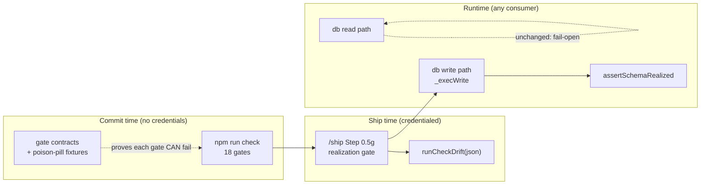

# Plan: Closing the Green-but-Unrealized Gap

- **Date**: 2026-07-31
- **Status**: Approved (3 GPT rounds + 2 Gemini rounds; 29 findings, all fixed — see Audit Trail)
- **Author**: Claude + Louis
- **Scope**: backend (CLI gates + DB write seam + skill protocol — no UI)

> **Target domain(s)**: `scripts`, `shared-lib`, `skills-content`, `stores`, `tests`.
> ⚠ **Cross-domain work** — by construction: the subject is the seam between committed
> source, runtime state, and the gates that claim to connect them.
> **Origin**: `/brainstorm` with GPT-5.6-terra + Gemini-pro (2026-07-31, session
> `1785572820700`), after four incidents in 48h.

## 1. Context Summary

**Scope/stack**: backend, `js-ts` + `postgres` (ESM), per `detect-stack`.

**The gap.** "Green" currently conflates three distinct claims (GPT's framing, adopted):
committed source is internally consistent; the required *external* state exists and
matches it; and the check actually evaluated the intended invariant over the intended
scope. One undifferentiated success signal covers all three, so a failure in the second
or third is indistinguishable from success.

**Four incidents, all in the last 48 hours, all green:**

| # | Incident | Which claim failed |
|---|---|---|
| 1 | Commit added a migration + code depending on it; tests passed; pushed. The migration was never applied, so the fix was byte-for-byte inert until a human ran `--migrate`. | Runtime state |
| 2 | `build-manifest --check` compared only `bundleVersion`/`schemaVersion` — it returned OK having authenticated almost nothing. I then *dismissed* the finding after verifying the **write** path's byte-comparison, i.e. verified the wrong branch. | Scope of check |
| 3 | Audit reported 1 non-atomic writer (there were 4); reported 3 misnamed call sites (there were 5). | Scope of finding |
| 4 | My own first fixes twice reproduced the class being fixed: a read-then-write guard for a read-then-write bug; a pure string containment check for a symlink bypass. | Author mimicry |

**The shape underneath all four** — and the reason prose has not fixed them — is that the
rule existed and was applied to **only part of its scope**. `last_audited_at` was guarded
on UPDATE but not INSERT. The byte-comparison was in the write path but not `--check`.
`DANGEROUS_KEYS` covered two accumulators of three. My containment fix covered zero but
not null. Prose cannot police symmetry; a detector can.

**Code Trace** (read this session — grounds every decision below):

- **Drift checking already exists and is already reusable.**
  [`setup-postgres.mjs:1100`](../../scripts/setup-postgres.mjs#L1100) exports
  `runCheckDrift(pool, {format, migrationsDir, stdout, stderr})` returning
  `{hasDrift, needsBootstrap, exitCode}` — including a JSON mode. It is wired to a CLI
  flag and to nothing else. **It is not in the `check` chain** (18 gates enumerated from
  `package.json`; drift is absent).
- **The write path is already a distinguished seam.**
  [`db/query.mjs:420`](../../scripts/lib/db/query.mjs#L420) `_exec` is the single funnel
  for *all* SQL, but the four write builders (`buildInsert` :193, `buildUpsert` :236,
  `buildUpdate` :374, `buildDelete` :400) are separate from the read path — and
  `serializeWriteParam` (:62) already exists *because* writes need handling reads do not.
  A write-only assertion belongs beside it.
- **Fail-closed assertions are an established pattern in the client.**
  [`db/client.mjs:352`](../../scripts/lib/db/client.mjs#L352) `getPool()` calls
  `assertPublicSchema()` (:247) and `assertSafeDsn()` (:60) before connecting;
  `assertDisposableDbUrl` (:125) guards the test path. Three precedents for "refuse rather
  than proceed on unsafe state".
- **A gate-contract schema already exists — with a `fixture` field.**
  15 `skills/*/gate-contract.json` files, validated by
  [`check-gate-contracts.mjs`](../../scripts/check-gate-contracts.mjs). The schema already
  carries `implementation`, `tests`, `fixture` and `proof: "unit-seam"` — e.g.
  `skills/audit-code/gate-contract.json`'s `tiered-shadow-window-honesty` entry ships a
  20-row fixture. **What it does NOT cover is the 18 CLI gates in the `check` chain**,
  which have no contract at all.
- **The push-range resolver is the canonical "what is being pushed" oracle.**
  [`push-range.mjs:85`](../../scripts/lib/push-range.mjs#L85) `resolvePushRange(opts)`
  returns a result carrying `source`/`trusted` — already the evidence-receipt shape GPT
  proposed, implemented once, for one consumer.
- **`/ship` Step 0.5 is the existing pre-ship gate-query block**
  ([`skills/ship/SKILL.md:48`](../../skills/ship/SKILL.md#L48)), already running four
  credentialed store queries (0.5a/0.5b/0.5e/0.5f).
- **`/audit-code`'s triage → fix → verify loop** is Steps 3 / 4 / 5
  ([`skills/audit-code/SKILL.md:211`](../../skills/audit-code/SKILL.md#L211), :377, :401).

**Neighbourhood considered** (`get-neighbourhood`, k=6): all `review` band — nothing above
this repo's noise floor. The nearest symbols are `client.mjs`'s `assertSafeDsn` /
`assertDisposableDbUrl` / `assertPublicSchema`, which is the *pattern* mechanism 2 extends
rather than a duplicate to reuse.

**Patterns reused**: `runCheckDrift`'s JSON mode; `resolvePushRange`; the
`assert*`-before-connect convention; the `gate-contract.json` schema and its validator;
`/ship` Step 0.5's query block; `/audit-code`'s R2+ ledger loop.
**New**: one write-path assertion + its epoch reader, one gate-contract extension for CLI
gates, two SKILL.md protocol steps.

## 2. Proposed Architecture



### Key design decisions

1. **Three gates, three authorities — do not merge them (#3 Modularity, #16 Graceful
   Degradation).** The pre-push sandbox runs in a clean worktree with no credentials, so a
   live DB check there would either block every contributor or acquire a skip that makes it
   green having checked nothing — the exact failure this plan exists to remove. `/ship` is
   already credentialed and is the moment the migration ships. Runtime is the backstop for
   consumers and cold starts. Cheapest-first: ship-time catches the common case at zero
   rigidity; runtime catches what ships past it.

   **The ship check is UNCONDITIONAL, and it lives in code, not prose** (R1-H2). An earlier
   draft ran it only when `resolvePushRange()` showed the range touching
   `supabase/migrations/`. That is wrong twice: a **code-only** push can depend on a
   migration left unapplied by an *earlier* push, a branch switch, or a failed run — the
   exact 2026-07-31 sequence, where the migration and its dependent code shipped together
   and the *next* session was the one exposed. And the range condition bought nothing: the
   check is a single indexed `SELECT` against a table the ship flow already connects to.
   So it runs whenever cloud is on, full stop.

   **Enforcement belongs in `ship-commit.mjs`, not `SKILL.md`.** A SKILL step is an
   instruction to an agent; it cannot block. `ship-commit.mjs` is already the enforcing
   binary — it refuses an unevidenced `AI-Gate: passed` and exits 2 with `AGENT FIX:`
   guidance. The realization check joins it there: **refuse the commit** when migrations
   are unapplied, with the exact `--migrate` command. The SKILL step documents it; the
   binary enforces it.
2. **Fail closed on WRITES ONLY; reads keep degrading gracefully (#16).** The store's
   whole posture is that a cloud failure never blocks the local task (`cloud:false` is a
   normal, documented state). A hard boot-lock would contradict that and turn a forgotten
   `--migrate` into "every command dies". Writing to a schema you do not have is the
   actual hazard; reading from it is already handled by the existing null/unknown paths.

   **Realization is a SET comparison, not a count** (R1-H1). An earlier draft proposed an
   `applied: number` epoch compared to a `bundled` number — a count cannot establish that
   the applied *identities* match, and it would have been a second, weaker definition of
   realization sitting beside `runCheckDrift`'s real one. The check is:
   `findUnappliedMigrations(bundledFilenames, appliedFilenames) → string[]`, a pure set
   difference over migration FILENAMES. Two questions, two checks, both named:

   | Question | Mechanism | Where |
   |---|---|---|
   | Is the DB **missing** a migration this bundle ships? | filename set difference | write path (cheap, one query) |
   | Do applied migrations **differ in content** from source? | `runCheckDrift` (sha256 per file) | ship time (already exists) |

   The write path deliberately does NOT re-implement checksum drift: a content mismatch is
   an operator/reconciliation problem, not "this write will hit a missing table".

   **The chokepoint is SQL-verb detection in `_exec`, and it guards DML ONLY** (R1-H3,
   R2-H1). Routing only `insertReturning`/`upsert`/`updateWhere`/`deleteWhere` assumed
   those are the whole mutation surface. **Censused before believing it**: `query()` is
   exported and takes raw SQL, and `scripts/reconcile-repo-identity.mjs:307` already issues
   a raw `DELETE` through it — the builder list was incomplete on the day it was written.
   So `_exec` classifies the statement's leading verb.

   **Classification is allow-list by shape, not a leading-verb match** (R3-H2). A leading
   verb misses PostgreSQL's data-modifying CTEs — `WITH d AS (DELETE … RETURNING *) SELECT …`
   begins with `WITH` and mutates. So the classifier does not try to enumerate mutations;
   it recognises the **non-application-write** shapes and treats everything else as a
   mutation. Two groups, both allowed:
   *(a) reads* — first keyword `SELECT`, `WITH` *without* any `INSERT`/`UPDATE`/`DELETE`
   token, `SHOW`, or `EXPLAIN` without `ANALYZE`;
   *(b) session and transaction control* — `BEGIN`, `COMMIT`, `ROLLBACK`, `SAVEPOINT`,
   `RELEASE`, `SET`, `RESET`, `DISCARD`. Group (b) is load-bearing (Gemini gate r2):
   `withTx` issues `BEGIN`/`COMMIT` through this same seam, so classifying them as
   mutations would make a purely **read-only transaction** fail on a behind schema — the
   fail-open read guarantee broken by the write guard. Unknown ⇒ guarded is
   the safe direction here, and it inverts the failure mode: a shape we did not anticipate
   gets checked rather than waved through. Comments are stripped before matching.

   **`CREATE`/`ALTER`/`DROP` and the migrator's own writes are exempt via an explicit
   bypass, not via verb classification** (R3-H3). An earlier draft excluded DDL by verb and
   called that sufficient — it is not: migrations routinely contain **seed/backfill DML**,
   and the migrator must `INSERT` its own `audit_loop_migrations` ledger row, both of which
   the guard would refuse precisely while the schema is behind. Deadlock. So realization is
   bypassed inside one explicitly-scoped async context — `withMigrationContext(fn)`, an
   `AsyncLocalStorage` flag set only by `setup-postgres.mjs`'s apply path, mirroring the
   `getActiveTxClient()` pattern `_exec` already consults. (Today the migrator uses
   `pool.query` directly and never enters `_exec` — verified — so this is belt-and-braces;
   but a design that works only because the migrator happens to bypass the seam is one
   refactor away from locking the operator out of the only command that fixes the state.)

   **One migration root, resolved once** (R2-H2). `assertSchemaRealized` takes the pool
   AND a resolved migrations directory; nobody hardcodes it. The resolver handles the two
   real layouts — `supabase/migrations/` in this repo and **`.audit-loop/migrations/` in a
   consumer** (`LAYOUT_CONSTANTS.MIGRATIONS_DEST_PREFIX`) — and is the same helper
   `ship-commit` uses, so the two callers cannot disagree about what is bundled. A
   consumer with **no** migrations directory is `indeterminate`, not "zero missing".

   **Indeterminate ALLOWS, and says so loudly — a stated trade-off, not a safe default**
   (R2-H3). Only `to_regclass` returning null (ledger genuinely absent → pre-ledger DB,
   `--adopt` territory) is a *known* benign state. A permission-denied, a timeout, or a
   malformed row is genuinely unknown, and the plan allows the write anyway, with a
   one-time `stderr` warning naming the error and **no caching**. Rationale, stated because
   it cuts against this repo's usual freshness rule: refusing on unknown would let one
   transient ledger blip block every write in every consumer — converting a degraded read
   into a total outage. The asymmetry is deliberate: an unknown *schema* blocks nothing
   and warns; an unknown *coverage verdict* claims nothing. Both refuse to lie; they differ
   in which direction silence is dangerous.

3. **ONE validator, one schema — genuinely extended, not a look-alike sibling** (R1-M1).
   An earlier draft created `scripts/.gate-contracts.json` plus its own checker while
   claiming to "extend" the existing protocol; that is a parallel system with a shared
   name, which is how the first one rots. Instead
   [`check-gate-contracts.mjs`](../../scripts/check-gate-contracts.mjs) gains a second
   **source** — CLI-gate contracts — validated by the same code, same `id`/`stated`/
   `implementation`/`tests`/`proof` vocabulary, same ratchet. A CLI gate's contract lives
   beside its script as `scripts/gate-contracts/<gate>.json`, so the file layout mirrors
   `skills/<name>/gate-contract.json` rather than inventing a registry blob.

   **Every pill needs a negative AND a positive control, and must prove it failed for the
   RIGHT reason** (R2-H4). `expectExit: 1` alone is worthless: a pill "passes" when its
   fixture path is unreadable, a dependency is missing, or argv parsing fails — the gate
   never examined the artifact at all, which is the poison pill contracting the very
   disease it tests for. So each entry declares both runs:

   ```json
   { "poisonPill": {
       "isolation": "tmpdir",
       "overlay":  { "skills.manifest.json": "tests/fixtures/poison/manifest-tampered.json" },
       "expectExit": 1,
       "expectStderr": "versions match" } }
   ```

   - **control run** — the gate against the tmpdir copy with **no overlay applied** MUST
     exit 0. The control needs no second fixture (Gemini gate): the pristine copy *is* the
     control, which is why `overlay` maps a destination to one source. This proves the
     harness feeds the gate correctly; without it a broken harness reads as a working pill.
   - **poison run** — MUST exit non-zero **and** its stderr must match `expectStderr`, the
     gate's own specific failure message. Exit code alone cannot distinguish "detected the
     tampering" from "crashed".
   - **`overlay`** names where each fixture lands (R3-H5): `{"overlay": {"skills.manifest.json":
     "tests/fixtures/poison/manifest-tampered.json"}}` — a map from repo-relative
     destination to fixture source, applied into the tmpdir copy. Without it a fixture is
     an orphan file the gate never reads, and the pill passes on a crash. The runner
     asserts every overlay destination exists in the pristine copy first, so a typo'd
     destination fails loudly rather than producing an unread fixture.

   **Isolation covers OUTPUTS, not just inputs** (R2-H5). `isolation: "flag"` redirects one
   argument; it says nothing about where else the gate writes. So `flag` is permitted ONLY
   for gates that are read-only by construction (a `--check`/`--gate` mode that never
   writes), and that claim is itself verified by the tmpdir comparison below. Anything that
   can write uses `isolation: "tmpdir"`: the runner copies the repo's relevant subtree to a
   temp root, runs the gate with that root as cwd, and asserts the **real** working tree is
   byte-identical afterwards — including untracked files, since a stray generated artifact
   is exactly what a mis-isolated gate leaves behind. `isolation: "none"` is not a value; a
   gate that cannot be isolated is `exempt` with a written reason.

   **Mandatory scope, and the complete initial inventory** (R2-M1). A gate is REQUIRED to
   carry a pill if it guards a **Category-B artifact** or is added after this plan lands.
   That resolves to exactly five contracted gates in Phase 3 — the rest are `exempt` with
   a reason, decided once and recorded:

   | Gate (npm script) | Guards | Decision |
   |---|---|---|
   | `skills:check` | `.claude/skills/**` + `skills.manifest.json` | **contract** |
   | `plans:index:check` | `docs/plans/README.md` | **contract** |
   | `requirements:map:check` | `docs/requirements-map.md` | **contract** |
   | `parity:check-coupling` | `tests/fixtures/expected-schema.json` coupling | **contract** |
   | `context:check` | `AGENTS.md`/`CLAUDE.md` topology | **contract** |
   | `docs:check`, `docs:refs:gate`, `plans:status`, `plans:lint`, `efficacy:check`, `on-conflict:check`, `arch:coverage-gate`, `db:check-rls:gate`, `cli:flags:gate`, `knip:gate`, `npm-args:gate`, `db:suites:gate`, `test` | linters / advisory / suite runners — no committed artifact whose staleness they alone certify | **exempt** (reason recorded per gate) |

   **Terminal-gate extraction recurses, and refuses what it cannot parse** (R3-M1): the
   runner walks `package.json`'s `check` script **transitively** through `npm run <x>`
   references (depth-limited, cycle-guarded) and collects **any terminal `node …`
   invocation**, not only `node scripts/<file>.mjs` (Gemini gate: the existing
   `scriptsIn()` regex is `scripts/`-prefixed, so `node --test tests/**` — the `test` gate
   itself — would fail to resolve and trip the hard error on a legitimately exempt entry).
   A node it cannot resolve to either a terminal `node` command or a further `npm run` is a
   **hard error**, not a silently-dropped gate: a parse that quietly ignores a wrapper would
   under-count the gate set, which is this plan's own failure mode turned on itself. A gate that appears in `check` and is neither contracted nor exempt fails the
   meta-test, so a 19th gate cannot be added silently. The meta-test enforces *a decision
   per gate*, never a fixture per gate.

4. **The detector is ONE artifact serving two gaps — and it is a recorded command, not a
   concept (#1, R1-M2).** Gemini proposed tool-first census (gap c) and ban-first fixing
   (gap d) as separate mechanisms; they are the same object. The query that enumerates a
   class is the query that catches the author's fix reproducing it. Concretely, a
   cross-cutting finding's ledger entry gains:

   ```json
   { "detector": { "kind": "regex",
                   "pattern": "fs\.writeFileSync\(",
                   "globs": ["scripts/**/*.mjs"],
                   "baseline": 4,
                   "disposition": { "scripts/x.mjs::const tmp = fs.writeFileSync(":
                                    "exempt — temp file" } } }
   ```

   **It is a STRUCTURED detector, never a shell command** (R2-H6). An earlier draft stored
   a free-form `cmd` string and executed it. The ledger is authored by an LLM and edited by
   merges — storing an executable string there is an injection surface, and interpolating
   changed-file paths into it compounds it. Instead `kind` is a closed set (`regex` today),
   `pattern` and `globs` are passed to ripgrep **as argv**, never through a shell, and the
   changed-file list is likewise argv. No string is ever concatenated into a command line.

   - **Storage**: the existing adjudication ledger (`--ledger`), which R2+ rounds already
     read. No new artifact type, no new file.
   - **Contract**: `baseline` is the match count at triage time; every match is either
     fixed or carries a `disposition`. **Dispositions key on `<path>::<trimmed matched
     line>`, never on a line number** (Gemini gate r2) — a line number orphans the moment
     anything above it shifts, and an orphaned disposition fails the build for a reason
     that has nothing to do with the defect. Keying on the matched text survives insertions
     and is still specific enough to force a fresh decision if the line itself changes.
   - **Re-run at FULL scope, never restricted to the diff** (Gemini gate). Restricting to
     the round's changed files defeats the very gap this closes: fix 1 of 4 occurrences and
     the other 3 are absent from the diff, so the detector returns 0 and convergence passes
     clean — the audit's undercount reproduced by the tool meant to prevent it. So Step 5
     re-runs the detector over its **original `globs`** and requires
     `matches − dispositioned === 0`. This covers both gaps with one run: a class member
     left unfixed still matches (gap c), and a NEW occurrence the author just wrote also
     matches (gap d). `baseline` is retained only as the triage-time number, for reporting
     progress — it is never the pass condition.
   - **"Cross-cutting" is `affectedFiles.length > 1`, full stop** (R3-M2). An earlier
     draft also sniffed the finding's prose for plurality words; model-generated text is
     not a semantic authority — "three duplicated writers" contains no marker while "check
     all callers" may describe one file. `affectedFiles` is structured data the audit
     already emits. A single-file finding the triager *believes* is a class can be opted in
     explicitly (`crossCutting: true` in the ledger entry); the automatic trigger stays
     mechanical and under-inclusive rather than guessing from prose.

5. **Mandatory only where the cost is justified (#20 Long-Term Flexibility).** Poison
   pills for all 18 gates up-front is bureaucracy; the plan makes them mandatory for
   **new** gates and for the gates guarding **Category-B artifacts** (where a false green
   means a tracked file rots), and opportunistic elsewhere. Detectors are mandatory only
   for **cross-cutting** findings, not every bug.

## 3. Security Considerations

`_execWrite`'s assertion runs before every write, so it must not itself become an egress or
availability hazard:

- **No new credential handling.** It reads the already-open pool; it never resolves a DSN.
- **Cache keyed on the pool, and ONLY a positive result is cached** (R1-H4). A
  process-global memo would authorize writes against a *different* database — tests hold
  multiple pools, and `_resetForTest` exists precisely because pool identity changes within
  a process. The key is the pool instance. And only `realized` is cached: caching
  `indeterminate` would let one transient ledger failure permit every subsequent write,
  while caching `behind` would keep refusing after the operator ran `--migrate`. Both of
  those are the cache lying about state that has since changed, so neither is cached — the
  cost is one extra query in the (rare, already-degraded) non-realized path.
- **Degrades to ALLOW when the epoch is unknowable** (ledger table absent → the DB predates
  the ledger; that is `--adopt` territory, not a realization failure). Refusing there would
  break bootstrap. Unknown ⇒ allow-with-warning is the honest direction here, and is the
  opposite of the freshness rule elsewhere in the repo — stated explicitly because the
  asymmetry is deliberate: an unknown *schema* blocks nothing, an unknown *coverage
  verdict* claims nothing.

## 5. Right-sizing gate

- **Band-aid** — add `--check-drift` to `npm run check` and call it done. It would go green
  in the pre-push sandbox having read nothing (no credentials in a clean worktree), i.e.
  a new instance of the very class this plan closes.
- **Over-engineered** — GPT's full attestation-receipt store (per-environment realization
  receipts keyed on commit sha), a universal evidence-receipt protocol retrofitted to all
  18 gates, and boot-locks on every command.
- **Chosen** — one ship-time query, one write-path assertion, a contract extension for ~5
  gates, and two protocol steps. Current requirements: incidents 1–4 each stop being
  possible. Attestation receipts are deferred with a named trigger (below).

**Manual vs scripted**: the gate-contract entries are ~5 hand-written JSON blocks, each
requiring a judgement about what that gate's false-green looks like. **By hand** — a
generator would produce uniform fixtures that prove nothing.

## 6. Sustainability Notes

- **Assumption that could change**: one operator, one shared database. GPT's attestation
  receipts become necessary the moment a *second* machine (CI, another dev) can apply
  migrations, because then "the DB is realized" is no longer answerable from local state.
  **Named revisit trigger**: a second migration applier.
- **What breaks in 6 months**: if the migration ledger schema changes, `readSchemaEpoch`
  breaks — it is deliberately one small function reading one table, so the blast radius is
  one file.
- **Extension point built in**: `GATE_CONTRACTS` is a list; a 19th gate joins by adding an
  entry, and the meta-test fails if a new `check`-chain gate has no contract *and* is not
  explicitly listed as exempt.

## 7. File-Level Plan

- **`scripts/lib/db/schema-realization.mjs`** (create) — `resolveMigrationsDir(cwd)`
  (handles both `supabase/migrations/` and a consumer's `.audit-loop/migrations/`),
  `listBundledMigrations(dir)`, `readAppliedMigrations(pool)` → `Set<filename>`, pure
  `findUnappliedMigrations(bundled, applied)` → `string[]`, and
  **`assertSchemaRealized({ pool, migrationsDir })`** throwing `ERR_SCHEMA_BEHIND` naming
  the missing files. **Cache key is `(pool, migrationsDir, bundledDigest)`** (R3-H1 + Gemini gate r2) — one
  pool checked against two different bundles is reachable in tests and in a consumer
  sharing the source DB, so a pool-only key answers the second question with the first
  question's result; and `migrationsDir` is a *static path string*, so without the digest a
  long-running process that gains a migration (a `git pull` mid-session) keeps serving a
  stale "realized". `bundledDigest` is a hash of the sorted bundled filenames, read once
  per process — which bounds this to the same limit AGENTS.md's accepted-debt table already
  records for module-global caches under the CLI-per-invocation model. Positive results
  only. *Why*: one definition of "the DB is missing a
  migration we ship", by filename identity not count (#5, R1-H1/H4).
- **`scripts/lib/db/query.mjs`** (modify) — `_exec` classifies the statement's leading SQL
  verb; mutations await `assertSchemaRealized()` first, reads are untouched.
  *Why*: covers raw `query('DELETE …')` (1 such caller exists today) and every future
  caller, which a four-builder list does not (#2, R1-H3).
- **`scripts/ship-commit.mjs`** (modify) — refuse the commit when migrations are unapplied,
  with the exact `--migrate` command, in the same `AGENT FIX:` shape it already uses for an
  unevidenced gate. *Why*: the SKILL step documents, the binary enforces (R1-H2).
- **`skills/ship/SKILL.md`** (modify) — Step 0.5g documenting the realization gate as
  unconditional-when-cloud-on, and what `unmeasured` means.
- **`skills/ship/gate-contract.json`** (modify) — declare the realization gate.
- **`scripts/gate-contracts/`** (create, dir) — one `<gate>.json` per contracted CLI gate,
  mirroring `skills/<name>/gate-contract.json`'s layout.
- **`scripts/check-gate-contracts.mjs`** (modify) — accept CLI-gate contracts as a second
  source; same schema, same ratchet. *Why*: one validator, not a look-alike (#1, R1-M1).
- **`scripts/check-gate-poison-pills.mjs`** (create) — run each declared pill in its
  declared isolation; fail if a gate exits 0 on its broken fixture, if a `check`-chain gate
  is neither contracted nor exempt, or if the working tree changed during the run.
- **`package.json`** (modify) — add `gates:poison`; insert into `check`.
- **`scripts/lib/audit/detector.mjs`** (create) — `DetectorSchema` (Zod: closed `kind`,
  `pattern`, `globs`, `baseline`, `disposition`), `runDetector(detector, {paths})` shelling
  ripgrep with **argv only** (never a shell string), and
  `checkDetectors(ledger)` → `{blocked, undispositioned[]}` — run at the detector's own
  **full `globs` scope**, never a changed-files subset (§2 dec. 4).
  *Why*: R3-H4 — the plan called the protocol "mechanical and blocking" while listing only
  a SKILL.md edit. Prose cannot block; this is the executor and the convergence input.
- **`scripts/lib/audit/convergence.mjs`** (modify) — convergence additionally requires
  `checkDetectors(...).blocked === false`. *Why*: the existing convergence
  oracle is the one place the threshold lives (it already backs `audit-code`'s
  gate-contract); adding a second gate elsewhere would be a parallel threshold.
- **`skills/audit-code/SKILL.md`** (modify) — Step 3 records the detector on cross-cutting
  findings (mechanical trigger, §2 dec. 4); Step 5 re-runs it at **full scope**. The SKILL
  documents; `convergence.mjs` enforces.
- **`tests/schema-realization.test.mjs`** (create) — Tier-1: set difference (behind /
  level / bundle-ahead-of-ledger), ledger absent → indeterminate → ALLOW, cache keyed per
  pool, indeterminate and behind are NOT cached.
- **`tests/write-path-fail-closed.test.mjs`** (create) — Tier-3: the verb classifier
  (builders AND a raw `DELETE`), writes refuse when behind, reads do not, one ledger query
  per pool.
- **`tests/gate-poison-pills.test.mjs`** (create) — every `check`-chain gate contracted or
  exempt; each pill makes its gate exit non-zero; the working tree is byte-identical after
  the run.

### 7b. Implementation Phases

**Phase 1 — Schema realization + write-path fail-closed**: Files:
`scripts/lib/db/schema-realization.mjs` (create), `scripts/lib/db/query.mjs` (modify),
`tests/schema-realization.test.mjs` (create), `tests/write-path-fail-closed.test.mjs` (create).

**Phase 2 — Ship-time realization gate (enforced in the binary)**: Files:
`scripts/ship-commit.mjs` (modify), `skills/ship/SKILL.md` (modify),
`skills/ship/gate-contract.json` (modify).

**Phase 3 — Poison-pill protocol**: contracts for the five Category-B gates named in §2
dec. 3, exemptions recorded for the other thirteen. Files:
`scripts/gate-contracts/skills-check.json` (create),
`scripts/gate-contracts/plans-index.json` (create),
`scripts/gate-contracts/requirements-map.json` (create),
`scripts/gate-contracts/parity-coupling.json` (create),
`scripts/gate-contracts/context-check.json` (create),
`scripts/gate-contracts/_exemptions.json` (create),
`scripts/check-gate-contracts.mjs` (modify),
`scripts/check-gate-poison-pills.mjs` (create), `package.json` (modify),
`tests/gate-poison-pills.test.mjs` (create).

**Phase 4 — Detector-first fix protocol**: Files: `scripts/lib/audit/detector.mjs`
(create), `scripts/lib/audit/convergence.mjs` (modify), `skills/audit-code/SKILL.md`
(modify), `tests/audit-detector.test.mjs` (create).

**Close-out (not a phase)**: `npm run skills:regenerate`, `npm test`, `npm run check`.

## 8. Risk & Trade-off Register

| Risk | Mitigation |
|---|---|
| `_execWrite` breaks every write if the epoch read is wrong | Memoised, and **allow** on any indeterminate state (ledger absent, query error). The failure direction is deliberately permissive; only a *definitely behind* schema refuses. Tested for all four states. |
| The ship gate blocks a legitimate push when the DB is unreachable | Cloud off / unreachable ⇒ `unmeasured` + warn, never block. Blocking on an unmeasurable condition is the cried-wolf shape that earns `--no-verify`. |
| Poison pills become 18 units of busywork | Mandatory for new gates + Category-B artifact gates only; every other gate may register `exempt` with a written reason. The meta-test enforces *a decision*, not a fixture. |
| Detector-first slows every audit | Scoped to **cross-cutting** findings (the finding names a class, or plausible scope exceeds one file). Single-file findings are unaffected. |
| A detector's regex over-matches and inflates fix scope | Over-inclusive is the correct direction — dispositions for false positives are recorded, an undercount is silent. Stated in the SKILL text. |

**Deliberately deferred**: attestation receipts per environment (trigger: a second
migration applier); an evidence-receipt protocol retrofitted to all 18 gates (trigger: a
third false-green in a gate that has a pill); consumer boot-locks (the write-path
assertion already covers consumers, since they share this `query.mjs`).

## 9. Testing Strategy

- **Tier 1 (test-first)**: `readSchemaEpoch` (ledger present/absent), `assertSchemaRealized`
  (behind → throws `ERR_SCHEMA_BEHIND`; level → resolves; ahead → resolves; indeterminate →
  resolves), memoisation (N writes ⇒ 1 ledger query).
- **Tier 3 (hard test-first — same commit)**: the write/read asymmetry. A regression here
  either blocks every write in every consumer or silently restores the original hazard;
  both ship without a local symptom.
- **Poison pills are themselves the test** for mechanism 3: `gates:poison` fails if any
  registered gate returns 0 on its broken fixture.
- **Success-path adversarialism** (AGENTS.md): assert that `gates:poison` **fails** when a
  gate is unregistered and unexempt — i.e. the meta-gate cannot go green by having no
  registry, which is precisely how this plan's own mechanism could rot.
- **Empirical, pre-ship**: against the disposable container, roll the ledger back one
  migration and confirm (a) a write throws `ERR_SCHEMA_BEHIND`, (b) a read still returns
  data, (c) `--check-drift --format json` reports the unapplied file. Unit tests cannot
  establish (a)+(b) together against a real pool.

## 11. Execution Clustering

- **Cluster A** — Phases 1–2 — fix-gate: yes
  - Coupling: both assert the same fact — "the DB has the schema this revision needs" — at
    two authorities (runtime write, ship time). They share the `runCheckDrift`/ledger
    reading seam, and auditing them apart would review one half of one invariant.
- **Cluster B** — Phases 3–4 — fix-gate: final
  - Coupling: both make a *gate* prove it did its job — the poison pill proves a gate can
    fail, the detector proves a fix covered its class. Same "evidence, not assertion"
    seam, and both are protocol-plus-enforcement pairs.
- **Final gate**: consolidated Gemini review over the union diff.


---

## Audit Trail

`/audit-plan` — 3 GPT rounds (H 4 → 6 → 6) + 2 Gemini gate rounds. **29 findings, all
accepted and fixed; zero rebutted, zero deferred.** Both caps reached, neither exceeded.

**The through-line: nine of the fixes were cases where a mechanism I proposed was itself an
instance of the class this plan exists to close.** That is the finding worth keeping.

| Round | Defect in my own design | Why it mattered |
|---|---|---|
| R1 | Realization as a migration **count** | A count cannot establish identity — a second, weaker definition of "realized" beside `runCheckDrift`'s real one |
| R1 | Guard routed through **four named builders** | A census found a raw `query('DELETE …')` caller already bypassing them — the half-applied-rule shape, in the fix for the half-applied-rule shape |
| R1 | Ship gate **conditional** on the range touching migrations | Misses a code-only push depending on an *earlier* unapplied migration — the actual 2026-07-31 sequence |
| R1 | Ship gate in **SKILL prose** | Prose cannot block; moved to `ship-commit.mjs`, the binary that already refuses unevidenced gates |
| R2 | Guarding **DDL** | Realizing a behind schema *means* executing DDL — the guard would deadlock the only command that fixes it |
| R2 | Poison pill asserting only `expectExit: 1` | Passes when the fixture is unreadable or argv fails — the pill contracting the disease it tests for |
| R2 | Detector as an executable **shell string in an LLM-authored ledger** | An injection surface; now a structured regex passed as argv |
| R3 | **Leading-verb** SQL classification | Misses `WITH d AS (DELETE … ) SELECT …`; inverted to an allow-list where unknown-is-guarded |
| **Gate** | Detector **restricted to the diff** | The sharpest finding: fix 1 of 4 and the other 3 are absent from the diff, so it returns 0 and converges clean — the audit's undercount reproduced by the tool built to prevent it |

Also corrected: DML-only exclusion was insufficient (migrations carry seed DML and INSERT
their own ledger row → explicit `withMigrationContext` bypass); session/transaction control
(`BEGIN`/`COMMIT`/`SET`) would have been classified as mutations, breaking read-only
transactions; the cache key missed `bundledDigest`, so a long-running process gaining a
migration kept serving a stale "realized"; detector dispositions keyed on line numbers,
which orphan on any insertion above them; terminal-gate extraction used a `scripts/`-
prefixed regex that could not resolve `node --test tests/**`.

**Deliberately left to `/audit-code`**: the exact `ship-commit.mjs` data flow for obtaining
a pool, and per-gate invocation detail beyond the declared `overlay`/`isolation` contract.
Both are how-not-what and are verifiable against real code, which is the artifact the code
audit reviews.

---

## Implementation Log

**Status**: Implemented 2026-08-01. Both clusters shipped; the consolidated Gemini gate
returned **APPROVE** on round 2 ("the code is production-ready").

### What the code audit found that the plan audit could not

The plan audit's through-line was *nine designs that were instances of the class they
closed*. The **code** audit's through-line is narrower and sharper: **three defects that
made the mechanism inert while every unit test stayed green.** None was visible to static
review; each needed something to actually run.

| # | Defect | How it hid | What caught it |
|---|---|---|---|
| 1 | `resolveMigrationsDir()`'s default parameter called an undefined `defaultRepoRoot` | A plain `ReferenceError`, swallowed by the write path's own fail-open. Every test passed the directory explicitly, so the default expression was never evaluated | Running a real audit — `[learning] syncBanditArms failed: defaultRepoRoot is not defined` in the log |
| 2 | `assertSchemaRealized` took a SECOND pool connection | On a `max: 1` pool it deadlocks against the transaction holding the only one; the connect timeout is then caught as *indeterminate* and the write is ALLOWED. So the guard was inert for every write inside a transaction | `db:suites:gate` — the DB integration tier, not the unit tier |
| 3 | A gate's identity was the npm **script**, not the terminal **command** | `skills:check` runs six commands; one pill over `build-manifest --check` accounted for all six, so five real checks were counted as covered by evidence that never touched them | The code audit, then confirmed instantly by the gate itself once identity moved to the command |

Defect 2 is the one worth remembering: the guard against silent inertness was *itself*
silently inert, in the direction its own fail-open was designed to allow. The plan's own
doctrine names the fix — **any mechanism that asserts on runtime state must be observed
refusing something real, once, against a real runtime.** That is now
[`tests/db-schema-realization-live.test.mjs`](../../tests/db-schema-realization-live.test.mjs):
it evicts a migration ledger row, asserts the write is refused with `ERR_SCHEMA_BEHIND`
while reads still succeed, restores the row and asserts writes resume immediately. It runs
in `db:suites:gate` and in the postgres-parity CI job.

### Deviations from the plan, and why

- **§2 dec. 3 named five gates to contract; the first pass contracted three and exempted
  `parity:check-coupling` and `context:check`** with plausible-sounding reasons. That is the
  half-applied rule this plan exists to close, performed on the plan. Corrected: all five are
  contracted, and `tests/gate-poison-pills.test.mjs` now pins the mandatory set by gate id so
  the same shortcut cannot be taken silently again.
- **`skills:check` carries THREE pills, not one** — the manifest, the generated
  `.claude/skills/**` copies, and the shared audit references each certify a distinct
  Category-B artifact. Its other three commands are exempt by exact command.
- **`mutate` joins `overlay` as a tamper shape.** A committed snapshot is right for a stable
  artifact and wrong for one that regenerates on every edit: `skills.manifest.json` carries a
  `bundleVersion` digest, and the property its pill must prove is *versions match, content
  differs* — which a snapshot stops reproducing the moment any skill changes. The pill would
  then go red for reasons unrelated to the gate, and a gate that cries wolf gets bypassed.
- **The exemption list is a ratchet.** §2 dec. 3 required a post-2026-07-31 gate to carry a
  pill, but nothing expressed that — a new gate could simply be appended to `_exemptions.json`
  with a plausible sentence. The grandfathered set is now pinned in the test: it may shrink
  freely; growing it takes a deliberate, reviewable edit.

### Accepted with rationale (not silently deferred)

- **`REALIZATION_TTL_MS` stays 60s.** The cache key sees a changed *bundle*; only elapsed time
  sees a change on the *database* — one indexed `SELECT` per minute is cheap insurance against
  a second migration applier the key cannot see.
- **The detector requirement stays keyed on `affectedFiles`.** Deliberately mechanical and
  under-inclusive: scanning model prose for plurality was proposed in the plan audit and
  rejected, because generated text is not a semantic authority in either direction.
- **`matchKey` ordinals re-point rather than orphan** when an earlier duplicate is deleted.
  Identical text is interchangeable, so a disposition written about the text still applies.
