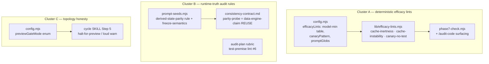

# Plan: Closing the "GREEN ≠ REALIZED" gap

- **Date**: 2026-06-28
- **Status**: In Progress — **Cluster A SHIPPED** (efficacy-lints.mjs + CLI + `efficacy:check`, AST detection, Gemini APPROVE 2026-06-28). Clusters B (runtime-truth audit rules) + C (topology config) outstanding. (Plan: Approved — GPT 3-round + Gemini 3-round; see §7c.)
- **Author**: Claude + Louis
- **Scope**: backend (CLI tooling + skill rubrics + config — no UI)

> **Target domain(s)**: `shared-lib` (lints/config/prompts). Not cross-domain.
> **Origin**: `/brainstorm --with-gemini` synthesis (2026-06-28). Both models rejected a single
> "efficacy lens / LLM pass" and split the seven session instances by **proof type**:
> deterministic → static lints; runtime-truth → audit-prompt rules that demand a *checkable
> artifact* + reuse the existing persona-consistency contract; topology → explicit config, no sniffing.
> **Neighbourhood considered**: 50 candidates, top cosine 0.77 (`runArchitecturePass`,
> `shouldMapReduceHighReasoning` — audit-pass siblings, none ≥0.85) → `efficacy-lints` is greenfield;
> it sits beside the existing pass machinery, not duplicating it.

## 1. Context Summary

**Scope/stack**: backend, js-ts (ESM). The "green ≠ realized" failure: a check passes (test green /
audit APPROVE / a contract marker present) but the implied thing isn't realized at runtime. Seven
session instances, two proof classes:

- **Deterministic (statically provable):** cache prefix below the model's minimum cacheable length
  (#1, provably inert), `cache_control` on a per-request-varying block (#2, caches nothing turn 2+),
  a canary-gated branch with no test that flips the canary true (#3), a plan asserting "tests already
  cover X / the default path resolves Y" with no command+result (#6).
- **Runtime-truth (NOT statically provable):** a new user-visible value that must agree with an
  existing surface at runtime (#4 — a P0 shipped to prod past both `/audit-code` and the Gemini gate),
  a discovery-freeze that named a source but never proved its *semantics* match the contract (#5).
- **Topology (#7):** deploy-from-main/no-preview → `/cycle`'s persona-test verify can only run
  post-merge, so it cannot gate.

**Code Trace** (where each piece lands; read this session):
- `scripts/lib/prompt-seeds.mjs:22` (`PASS_BACKEND_RUBRIC`) + the frontend pass seed — the audit-prompt
  rubric home (#4,#5). `getPassPrompt`/`bootstrapFromConstants` feed `openai-audit.mjs`.
- `scripts/lib/config.mjs` (`openaiConfig`, validated env reads) — config home for the lint table + `#7`.
- `scripts/lib/model-resolver.mjs` — model→family resolution for the #1 min-token table. (NB: the audit
  builder's `estimateStablePrefixTokens` is audit-specific; #1 uses a GENERAL conservative token estimate, not it.)
- `scripts/phase7-check.mjs` — pre-flight check, the wiring point for the deterministic lints.
- `docs/consistency-contract.md` + persona-test `--mode consistency` `data-engine-claim` — the EXISTING
  cross-surface runtime contract (#4 reuses it; we do not build a new parity tool).
- `skills/audit-plan/SKILL.md` grounding rubric (#6); `skills/cycle/SKILL.md` Step 5 persona-test (#7).

Patterns reused: the **two-artifact split** (committed config + tolerant defaults) from nav/visual-audit;
a general conservative token estimate; the `data-engine-claim` consistency contract; the
`prompt-seeds` rubric-injection path. New: one `efficacy-lints.mjs` recognizer module.

## 2. Proposed Architecture

Three independent workstreams, mapped to proof type (the synthesis table):

**Key design decisions (principles):**
- **Deterministic problems get deterministic code, never an LLM pass** (#1 SSoT, #11 testability) — both
  models: LLMs can't reliably count tokens / trace ASTs. `efficacy-lints.mjs` is pure regex/estimator.
- **Config-driven, not hardcoded** (#1, #20 long-term flex) — the model→min-token table, the canary-helper
  pattern, and prompt-source globs are a committed `efficacyLints` config block, NOT wine-cellar-specific
  literals. Unknown model / no config → **degrade to yellow ("unable to prove")**, never a fake green.
- **Runtime-truth rules demand a CHECKABLE ARTIFACT, not prose** (#15 error handling, the recursive
  doctrine) — the derived-state-parity rule REJECTS a duplicated dynamic value unless it shares the SSoT
  OR ships a parity assertion / a declared `data-engine-claim` surface. A rule that only asks the model to
  "consider agreement" is itself green-but-not-realized.
- **Reuse the consistency contract for #4** (#1 DRY) — "0 to move" vs "30 to move" is a cross-surface
  contradiction `--mode consistency` already detects; the audit nudges the author to DECLARE the value as
  a `data-engine-claim` surface rather than inventing a parity tool.
- **Topology is config, not sniffing** (#20, right-sizing) — an explicit `previewGateMode` enum;
  auto-detecting deploy-from-main is the over-engineering cliff both models named.

## 2a. Explicit contracts & artifacts (R1-HIGH — apply the doctrine to THIS plan)

The plan audit correctly flagged that every piece must be a **checkable artifact with an
explicit contract**, not prose — otherwise the fix is itself green-but-not-realized. Pinned here:

**Result contract (PER-RULE, R2-HIGH)** — `runEfficacyLints({root, config})` returns
`{ status, ruleResults, findings, coverage }` where `ruleResults` is
`Record<ruleId, { status: 'skipped'|'clean'|'findings'|'unverified', coverage, findings, skipReason? }>`
and the top-level `status` is the WORST per-rule status (`findings` > `unverified` > `clean` > `skipped`):
- `skipped` — the category was off (no config / `enabled:false`). `unverified` — a category RAN but
  COULD NOT LOOK / could not prove (globs matched 0 files, unknown model family, estimator uncertain).
  `clean` — looked at real files and found nothing applicable (incl. genuinely-no-sites). `findings` — real
  findings. **`unverified` ≠ `clean`** (the doctrine
  applied to our own lint: a scan that matched 0 files must NOT read as a pass). Per-rule reporting means a
  reader sees exactly WHICH lint was unverified vs clean, never a misleading aggregate green.
- **Exit-code policy is separate from display**: `phase7-check` is **advisory** (always exit 0, print
  findings) UNLESS `efficacyLints.gate:true`. When gating, exit 1 on `findings` **AND on `unverified`**
  (Gemini-gate MED — fail-closed): a repo that opted into strict gating but whose globs matched nothing
  (a typo → 0 files → `unverified`) must NOT silently exit 0 thinking it's protected — "you asked me to
  gate and I couldn't verify" is a failure, not a pass. Advisory mode (`gate:false`) leaves `unverified`
  as a non-blocking yellow. The CLI always prints the resolved per-rule status + coverage counters.

**`coverage` counters + the `unverified` vs `clean` distinction (R1-HIGH#2; Gemini-R2 MED — DON'T conflate
two causes of "nothing found")** — `{ scannedFiles, applicableSites, cacheBreakpoints, canaryGates, canaryTestsMatched, modelsResolved }`. Two genuinely different "found nothing" cases:
- **`scannedFiles:0`** — the configured globs matched NO files (a typo / misconfiguration → we COULDN'T LOOK)
  → `unverified` + a `SkipReason`. This is what fails closed under `gate:true`.
- **`scannedFiles>0` but `applicableSites:0`** — we looked at real files and there is genuinely nothing to
  check (e.g. a repo with no canary gates at all, or no `cache_control` anywhere) → **`clean`**, NOT a failure.
  A repo that enabled a lint but legitimately has no applicable sites must NOT fail its build.
This split is the whole point: a green-but-couldn't-look is `unverified`; a green-because-genuinely-nothing is `clean`.

**`EfficacyFinding` schema** (Zod, at the module boundary; M3) —
`{ ruleId: 'cache-inertness'|'cache-instability'|'canary-no-test', severity, confidence: 'high'|'unable-to-prove', file, loc, evidence, message }`. Stable IDs via the existing `semanticId()` (findings.mjs) over `ruleId + normalized-evidence` — no bespoke ID scheme.

**`EfficacyLintsConfig` schema** (Zod in config.mjs; M1) —
`{ enabled: bool=false, gate: bool=false, promptSourceGlobs: string[], canarySourceGlobs: string[], canaryTestGlobs: string[], canaryPattern: string|null, canaryTestPattern: string|null, modelMinTokens: Record<family, int> }` (Gemini-gate LOW — the canary lint inherently needs BOTH a source-glob set and a test-glob set, since `lintCanaryCoverage(sourceFiles, testFiles, …)` compares the two; these are flat keys, NOT the per-rule nesting §7c defers) with documented defaults (`modelMinTokens` seeded `{opus:1024, sonnet:1024, haiku:2048}`, extensible; an UNKNOWN family → `unable-to-prove`, never a guessed minimum). Precedence: repo config → built-in defaults. `dynamicPatterns` for the instability lint is an **audited built-in constant** (Date.now/random/request-id/summary/diff/turn-id), tested, not user config.

**Robust matching — AST OR stripped-regex, never both (Gemini-gate HIGH — they're mutually exclusive)** —
two ALTERNATIVE paths chosen by file type, NOT a sequence (you cannot regex-strip strings/comments and then
`@babel/parser`-parse — stripping corrupts the parse; and the AST already distinguishes code from
strings/comments, so no pre-stripping is needed):
- **JS/TS → `@babel/parser`** (ALREADY a repo dependency — nav-audit's extractor uses it): walk the AST to
  the real `cache_control` object-property / canary call nodes; comments and string literals are inherently
  excluded because they are not those node types. No pre-stripping.
- **Non-JS, or a parse failure → regex over a comment/string-stripped copy** (the cruder fallback), so a
  marker inside a comment/string still can't false-match.
The extraction method is recorded in the finding; any uncertainty (parse failure, unknown shape) →
`confidence:'unable-to-prove'`, never a confident false positive.

**Detection ≠ measurement (Gemini-R3 HIGH)** — the AST/stripped path is used ONLY to *detect* the marker's
location (avoiding comment/string false-matches). The token-count *measurement* for cache-inertness must run
on the **ORIGINAL, unstripped** prefix bytes (the real cached content includes strings/comments) — measuring
the stripped copy would undercount. So: locate via AST/stripped-regex → then estimate tokens over
`source.slice(0, markerOffset)` of the original. Keep the two steps distinct.

**Cache-breakpoint extraction + token + family (M2; Gemini-R2 HIGH/MED)** —
`extractCacheBreakpoints(source, filePath) → {model, family, loc, prefixContent, confidence, uncertaintyReasons}[]`,
via the babel/stripped-source path above. Two resolution steps the plan pins explicitly:
- **Model→family**: the literal model string at the call site (or a `model-resolver.mjs` sentinel) is resolved
  to a family for the `modelMinTokens` lookup via `model-resolver.mjs` (already in the Code Trace). A model
  that resolves to NO known family → `confidence:'unable-to-prove'` (never a guessed minimum).
- **Token estimate**: a **GENERAL, conservative token estimate** (a chars→tokens heuristic, clearly
  approximate → reflected in `confidence`), NOT `estimateStablePrefixTokens` — that helper is specialised to
  the audit-prompt-builder's structure and would mis-estimate an arbitrary repo's prompt blocks. If a shared
  generic token util is later extracted it can back this; v1 uses the conservative heuristic.

**Canary recognition contract** (R1-HIGH#3, R2-HIGH) — a gate is `<canaryPattern>('X')` in a source glob
(matched on stripped source / babel nodes, not in comments); coverage is a `<canaryTestPattern>` referencing
`'X'` (e.g. `setCanary('X', true)`) in a test glob. BOTH are configurable; if `canaryPattern` is unset the
lint is a **no-op** (not a false finding) — cross-repo-safe. We do NOT mandate a canary-helper convention on
consumers; we recognize whatever they configure. **This repo's own config** (the dogfood + empirical-verify
target): `promptSourceGlobs: ['scripts/lib/prompt-seeds.mjs','scripts/lib/audit/**','scripts/lib/anthropic-client.mjs']`,
`canaryPattern: null` (no canary gating here), `modelMinTokens` = defaults.

**Artifact-to-command workflow** (R1-HIGH#4) — when `/audit-code` flags a duplicated dynamic value, the
required artifact is ONE of: (a) the new value derives from the **same SSoT selector/field** as the existing
surface (cited in the diff), or (b) a declared **`data-engine-claim`** surface on the value, runnable via
`persona-test --mode consistency --canary <name>`, or (c) an explicit parity assertion in a spec. The audit
output names the SSoT + the runnable command — prose alone does not clear the finding.

**Executable topology seam** (R1-HIGH#5; R2-MED enum) — `scripts/lib/cycle/topology.mjs`
`resolvePreviewGate(config) → { mode, action: 'halt'|'warn'|'none', message }`, reading a 3-value
`previewGateMode: 'pre_merge_required'|'post_merge_warning'|'not_applicable'` (NOT a boolean — the topology
has three honest states). Default `not_applicable` (silent — opt-in, matching off-by-default). A pure,
unit-tested helper; `/cycle` Step 5 CALLS it (the testable artifact), never re-implementing the decision in prose.

## 5. Sustainability (right-sizing gate)

New structure on the table: one lint module + a config block + rubric additions + a cycle config flag.
- **Band-aid extreme**: only add the audit-prompt nudges → misses #1/#2/#3 (statically catchable) → they resurface; and prose-only rules get ignored.
- **Over-engineered extreme**: an "efficacy engine" with pluggable analyzers, an LLM efficacy pass, and auto-topology detection (an AST coverage tracer, a live token-counter service). Both models explicitly rejected this.
- **Chosen**: three deterministic recognizers (config-driven, degrade-to-yellow) + targeted prompt rules that require a checkable artifact + explicit-config topology. Each piece serves a CURRENT session hit. No speculative generality.

## 7. File-Level Plan

- **`scripts/lib/efficacy-lints.mjs`** (create) — pure recognizers, each returning structured findings
  with `confidence: 'high'|'unable-to-prove'`:
  - `lintCacheInertness(blocks, {model, minTokens})` — for each `cache_control` breakpoint, estimate the
    cumulative prefix tokens (a general conservative chars→tokens estimate, NOT the audit-specific `estimateStablePrefixTokens`); below the model min → `inert` finding;
    unknown model/estimator → `unable-to-prove` (yellow).
  - `lintCacheInstability(source, {dynamicPatterns})` — `cache_control` in proximity to per-request inputs
    (`Date.now()`, random, request/summary/diff/turn ids) → `unstable` finding.
  - `lintCanaryCoverage(sourceFiles, testFiles, {canaryPattern})` — a `<canaryPattern>('X')` gate present
    in source but no test that forces `X` true → `uncovered-canary` finding.
  - `runEfficacyLints({root, config})` — orchestrates the three; returns the **§2a result contract**
    (`{status, findings: EfficacyFinding[], coverage, skipped}`); pure I/O-bounded, no LLM, no network.
  - `extractCacheBreakpoints` (§2a) + the `EfficacyFinding` Zod schema live here (or a sibling
    `efficacy-lints-schema.mjs` if findings.mjs reuse needs it); stable IDs via `semanticId()`.
- **`scripts/lib/config.mjs`** (modify) — add the validated **`EfficacyLintsConfig`** block (§2a Zod
  schema: `enabled`, `gate`, `promptSourceGlobs`, `canarySourceGlobs`, `canaryTestGlobs`, `canaryPattern`, `canaryTestPattern`, `modelMinTokens`)
  and a top-level `previewGateMode` boolean (default `false`). All reads centralized here (config SSoT).
- **`scripts/lib/cycle/topology.mjs`** (create) — `resolvePreviewGate(config)` (§2a) — the pure,
  unit-tested decision seam `/cycle` calls; returns `{mode, action, message}`.
- **`scripts/phase7-check.mjs`** (modify) — invoke `runEfficacyLints`; print the resolved per-rule
  `status` + `coverage`; **advisory by default** (exit 0). Under `gate:true`, exit 1 on `findings` or
  `unverified` (fail-closed — matches §2a); advisory mode leaves `unverified` a non-blocking yellow.
- **`scripts/lib/prompt-seeds.mjs`** (modify) — (a) **derived-state-parity** rule in the FRONTEND pass
  rubric, fire-walled to UI files rendering *dynamic data* (counts/statuses/eligibility/classification),
  REJECT unless same-SSoT or a parity artifact; (b) **freeze-semantics** upgrade note usable by audit-plan.
- **`skills/audit-plan/SKILL.md`** (modify) — grounding-rubric line (#6): flag "tests already cover / the
  default path resolves / already exercised" plan assertions as **build-time spikes** unless an executed
  command+result is attached; freeze sub-step "name the field → prove its semantics match the contract".
- **`skills/audit-code/SKILL.md`** (modify) — Step 6.x honesty clause: static approval is
  necessary-but-insufficient for cross-surface agreement; nudge to declare a `data-engine-claim` surface.
- **`docs/consistency-contract.md`** (modify) — document the **parity-probe** use of the existing
  `data-engine-claim` attribute for "value A must equal surface B's source" (reuse, not a new tool).
- **`skills/cycle/SKILL.md`** (modify) — Step 5: **call `resolvePreviewGate`** (not re-implement in prose);
  `action:'halt'` → halt before merge, require a preview `--url`; `action:'warn'` → bright warning
  "persona-test is POST-HOC — cannot prevent prod exposure".
- **`tests/efficacy-lints.test.mjs`** (create) — fixture tests for all three recognizers incl. the
  degrade-to-yellow paths and the cross-repo config-driven behaviour.

### 7b. Implementation Phases

- **Phase 1 — efficacy-lints core**: the three recognizers + `runEfficacyLints`. Files: `scripts/lib/efficacy-lints.mjs` (create).
- **Phase 2 — config block**: `EfficacyLintsConfig` (Zod) + `previewGateMode` enum. Files: `scripts/lib/config.mjs` (modify).
- **Phase 3 — wiring**: invoke the lints in the pre-push check (advisory; status + coverage). Files: `scripts/phase7-check.mjs` (modify).
- **Phase 4 — lint tests**: recognizers + degrade-to-yellow + `unverified`≠`clean` + config-driven. Files: `tests/efficacy-lints.test.mjs` (create).
- **Phase 5 — runtime-truth audit rules**: derived-state-parity + freeze-semantics + test-premise (+ the artifact-to-command workflow). Files: `scripts/lib/prompt-seeds.mjs` (modify), `skills/audit-plan/SKILL.md` (modify), `skills/audit-code/SKILL.md` (modify).
- **Phase 6 — parity-probe doc (reuse)**: `data-engine-claim` parity pattern + runnable consistency command. Files: `docs/consistency-contract.md` (modify).
- **Phase 7 — topology honesty**: `resolvePreviewGate` seam + `/cycle` Step 5 call. Files: `scripts/lib/cycle/topology.mjs` (create), `skills/cycle/SKILL.md` (modify).
- **Close-out (not a phase)**: `npm run skills:regenerate` + `npm run skills:check` + `npm test`.

## 7c. Plan-audit stop decision + deferred-to-build details

**GPT plan-audit: 3 rounds (R1 H:5 → R2 H:3 → R3 H:4 — plateaued → STOP per the rigor-pressure cap).**
**Gemini gate: 3 rounds (R1 CONCERNS → R2 REJECT → R3 CONCERNS — STOP).** R2/R3 each caught a GENUINE
design defect (a self-introduced exit-code contradiction; a `scannedFiles:0` vs `applicableSites:0`
false-build-failure; a detection-vs-measurement conflation) — the genuine-bug exception that justifies
exceeding the 2-round cap — all now fixed. R3's residual MEDIUM (the exact `modelMinTokens` family-key
strings must match `model-resolver.mjs`'s parsed families) is implementation-completeness → deferred.
R1 surfaced the real design gap (pieces were prose, not checkable contracts) — fixed in §2a. Later rounds
decayed to **implementation-granularity spec** that the BUILD's `/audit-code` verifies against real code far
better than another plan round can. Deliberately deferred to implementation (NOT silent — listed here):
- The exact `modelMinTokens` family keys must equal `model-resolver.mjs`'s parsed family tokens (Phase 2,
  asserted by the config test); a family the resolver doesn't produce → `unable-to-prove`.
- Exact exported Zod type names (`EfficacyRuleResult`, `EfficacyLintResult` alongside `EfficacyFinding`) —
  a code-shape choice; the contract (per-rule status + coverage) is fixed above.
- A machine-readable `.audit/phase7-efficacy.json` summary — a cheap additive artifact, authored in Phase 3.
- Per-rule glob NESTING (`rules.canaryCoverage.{…}`) — start flat (the canary lint's own `canarySourceGlobs`/
  `canaryTestGlobs` ARE flat keys, not nesting); nest under `rules.X` only if a third rule needs its own globs (YAGNI).
- The exact model-family resolution order (literal id → `model-resolver.mjs` sentinel → unknown→`unable-to-prove`) —
  reuses `model-resolver.mjs` (already in the Code Trace); pinned at build.
- An adversarial golden-fixture **eval** that the parity rule FIRES — an LLM eval, deferred per the testing doctrine (§9).

## 8. Risk & Trade-off Register

- **Token estimator inaccuracy (#1)** → the lint must NEVER emit a confident "inert" on an uncertain count;
  it degrades to `unable-to-prove` (yellow). Uses a general conservative token estimate (no new tokenizer dep; the audit-specific `estimateStablePrefixTokens` is NOT reused — it would mis-estimate arbitrary prompts).
- **Prompt-rule boilerplate-blindness** → the derived-state-parity rule is fire-walled to dynamic-data UI and
  demands an artifact (REJECT), not a "consider it" — so it can't degrade into ignored prose.
- **Canary lint false-positives** → driven by a configurable `canaryPattern` (per-repo); absent config → the
  recognizer is a no-op (not a wrong finding). Cross-repo-safe by construction.
- **Deferred**: an actual preview-deploy automation step for #7 (only the explicit-config warning ships now —
  cross-repo deploy automation is its own project, both models flagged it as messy). Documented as Out of Scope.
- **Deferred**: gating (vs advisory) on the efficacy lints — ships advisory; flip to gate per-repo via config
  once the false-green/false-positive rates are observed.

## 9. Testing Strategy

- **Unit/fixture (Tier-1 test-first, deterministic seam)**: `efficacy-lints.test.mjs` — each recognizer on a
  positive fixture (inert cache / dynamic-block cache / uncovered canary) AND a negative (above-min cache /
  static block / covered canary), PLUS the degrade-to-yellow path (unknown model → `unable-to-prove`) and the
  config-driven path (custom `canaryPattern` matches; absent config → no-op).
- **Config**: `config.mjs` validation test for the new block (existing config-test pattern).
- **Prompt rubric (Tier-2 invariant, M5)**: NOT grep-only — an invariant test that calls
  `getPassPrompt('frontend')` / `bootstrapFromConstants` with canned inputs and asserts the
  derived-state-parity + freeze-semantics rule text + required-artifact language are present in the BUILT
  prompt (the actual injection path), plus a `skills:check` byte-match on the SKILL prose.
- **Topology seam (deterministic)**: `tests/cycle-topology.test.mjs` — `resolvePreviewGate` returns
  `halt`/`warn`/`none` for each `previewGateMode` value (pure, no `/cycle` run needed).
- **Rule EFFICACY boundary (M3, honest)**: that the model *fires* the derived-state-parity rule on a bad
  diff is an LLM **eval** (non-deterministic, real API) — deliberately DEFERRED per the testing doctrine
  (no offline LLM-eval matrix, no new deps). We test the deterministic half (rule text PRESENT in the built
  prompt) now; an adversarial golden-fixture eval is in Out of Scope, revisited if the rule proves weak.
  This boundary is itself "green ≠ realized" honesty — we don't claim the rule works because its text is present.
- **Test-first per phase (R2-LOW)**: each deterministic seam lands with its test IN its phase — recognizer
  fixtures alongside Phase 1, config-validation in Phase 2, the topology test in Phase 7 — not a trailing test phase.
- **Pre-ship empirical verify**: run `runEfficacyLints` against THIS repo once (it has `cache_control` +
  model usage) before declaring done — the doctrine for any new analyzer.

## 11. Execution Clustering

- **Cluster A** — Phases 1–4 — fix-gate: yes
  - Coupling: the deterministic lint engine — module (P1) + its config block (P2) + the pre-push wiring (P3)
    + fixture tests (P4) are one seam; the wiring imports the module and reads the config, and the tests pin both.
- **Cluster B** — Phases 5–6 — fix-gate: yes
  - Coupling: the runtime-truth half — the audit-prompt rules (P5: derived-state-parity, freeze-semantics,
    test-premise) and the parity-probe doc (P6) share the same `data-engine-claim` reuse target; the doc is
    the artifact the rules nudge toward, so they must agree.
- **Cluster C** — Phases 7 — fix-gate: final
  - Coupling: a single self-contained concern (#7) — the `resolvePreviewGate` seam (`lib/cycle/topology.mjs`)
    + its unit test + the `/cycle` Step 5 call that consumes it; independent of A/B; gated by the consolidated review.
- **Final gate**: mandatory consolidated Gemini review over the union diff.

> **Domain note (M4)**: `compute-target-domains` over the lib paths returned `['shared-lib']`,
> `crossDomain:false`. The SKILL-prose edits (audit-plan, audit-code, cycle) are cross-cutting tooling
> rubrics, not a second product domain — no domain owner gate is added. **Adoption/rollback**: every piece
> ships **advisory + off-by-default** (`efficacyLints.enabled:false`, `previewGateMode:not_applicable`), so a
> repo opts in per-config; rollback = flip the config or revert the additive prompt lines (no migration,
> no data).

## Implementation Log

### 2026-06-28 — Cluster A (deterministic efficacy lints) shipped
- **Built**: `scripts/lib/efficacy-lints.mjs` (3 recognizers — cache-inertness, cache-instability,
  canary-no-test — + `loadEfficacyConfig` + `runEfficacyLints`), `scripts/efficacy-lints-check.mjs`
  (CLI), `npm run efficacy:check` chained into `check` (advisory; silent no-op until a repo commits
  an `efficacy-lints.config.json` with `enabled:true`).
- **Detection**: plan-mandated `@babel/parser` AST for JS/TS (reuses `nav/ast.mjs`); language-aware
  strip+regex fallback for non-JS / parse-failure. Detection ≠ measurement (token estimate on
  ORIGINAL bytes). Per-rule status with the `scannedFiles:0` (unverified) vs `applicableSites:0`
  (clean) split; degrade-to-yellow on unknown model / malformed config (fails loud, never silent-off).
- **Audit**: GPT R1 H:4 → R2 H:2 (in-scope HIGHs fixed: malformed-config-fail-loud, sensitive-path
  SSoT, Zod validation, deterministic order). Gemini R1 CONCERNS (sync gap + null-config) → R2 REJECT
  (plan-mandated AST not implemented) → **R3 APPROVE** after the AST rewrite + `semanticId` ids.
- **Verified**: 15 unit tests; empirical run on this repo (30 files, AST path, 0 false positives, clean).
- **Deferred to later clusters**: B = runtime-truth audit rules (Phases 5–6); C = topology config
  (`resolvePreviewGate`, Phase 7).
