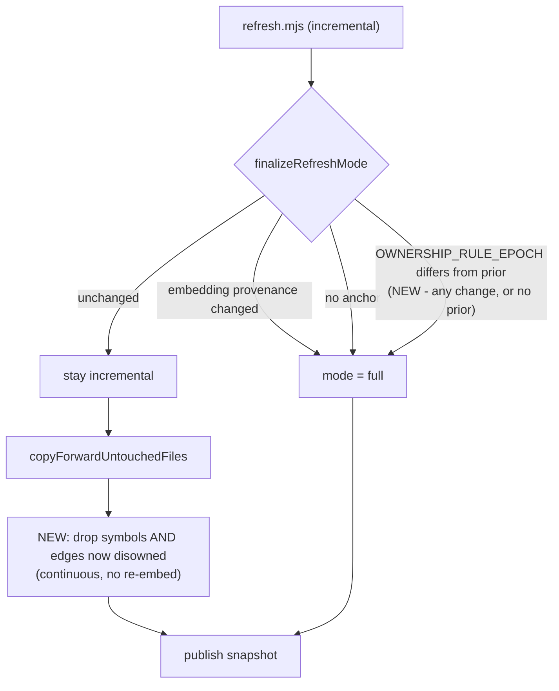

# Incremental refresh must propagate an ownership-rule change

**Status:** Approved
**Created:** 2026-09-05
**Upstream report:** `edc0948e` (MEDIUM) — Lbstrydom/wine-cellar-app, bundle sync 90822348
**Base commit:** `5bf80dea`

---

## 0. The one theme

**A row nobody touched still lives under rules that moved.** Copy-forward
already knows this — it carries a `retagDomain` hook so a `domain-map.json` edit
reaches untouched rows. Ownership has the identical shape and no equivalent, so
the corpus fix lands only under `--full` and every consumer is told to run a
plain incremental.

---

## 1. What was measured

From the upstream report, **re-verified against this repo's source at `5bf80dea`**
before planning (all three citations hold; line numbers below are ours, at that
commit):

| Claim | Verified at | Holds? |
|---|---|---|
| Ownership filter is asked of the RESTRICTED set | [extract.mjs:1098](scripts/symbol-index/extract.mjs:1098) — `enumerateFilesWithOwnership(repoRoot, args.files)` | ✅ |
| Copy-forward's only predicates are *not touched* + *still on disk* | [symbols.mjs:549-636](scripts/lib/store/arch/symbols.mjs:549) — `keep = rows.filter(r => !touchedFileSet.has(r.file_path) && (!fileStillExists \|\| fileStillExists(r.file_path)))` | ✅ |
| No promotion on a corpus/ownership-rule change | [refresh-mode.mjs:52-96](scripts/symbol-index/refresh-mode.mjs:52) — promotes on embedding-provenance change and missing anchor **only** | ✅ |
| `retagDomain` asymmetry | `copyForwardUntouchedFiles` signature carries `retagDomain`; no ownership equivalent | ✅ |

**The mechanism, stated once.** On an incremental, `args.files` is the git-diff
scope. A gitignored-and-untracked file *cannot appear in a git diff*, so it is
never a candidate and is never reclassified. Copy-forward then carries its
already-indexed row into the new snapshot, indefinitely.

**Reporter's measured effect** (their repo, `--full`): disowned clusters
**5 of 9 → 0 of 41**. Under incremental those 5 survive. Treat as *reported*,
not reproduced here — this repo vendors nothing and is all `.mjs`, so it cannot
exhibit the defect locally. That asymmetry is itself a finding: see §9.

---

## 2. Neighbourhood considered

`get-neighbourhood` (k=8) returned **no `precedent` band** — all eight `review`,
the top at `below-noise-floor-near` (cliff 0.0135). It did surface exactly the
right symbols, and two are load-bearing here:

- `provenanceRequiresFullReembed` ([refresh-mode.mjs:31](scripts/symbol-index/refresh-mode.mjs:31)) — the pattern the reporter says to mirror.
- `copyForwardUntouchedFiles` — where `retagDomain` already proves the shape.

Nothing to reuse; this is a sibling to `provenanceRequiresFullReembed`, not an
extension of it.

---

## 3. The design fork, adjudicated

The reporter proposed: *record the ownership-rule identity in the snapshot the
way embedding provenance already is, and promote incremental → full when it
changes.* **Reading the code changed the answer.** Two findings the report could
not have had:

### 3.1 Promotion is expensive, and the expense is not incidental

`mode='full'` skips copy-forward entirely, so every file is
extract → summarise → **embed**. Promotion is therefore a *full re-embed* on
every consumer's next refresh. For a defect whose symptom is *stale rows carried
forward* — not *wrong embeddings* — paying for a re-embed is buying the wrong
thing.

### 3.2 The obvious storage location is the costly one

Embedding provenance lives on `audit_repos.active_embedding_model`, written by
the **`publish_refresh_run` RPC** — a Postgres function with a pinned signature
`(UUID, UUID, TEXT, INTEGER)` and an explicit `REVOKE ... FROM PUBLIC, anon,
authenticated` ([20260721130000](supabase/migrations/20260721130000_advisor_security_hardening.sql)).

Carrying an extra value through it means **adding a parameter**, and that does
not replace the function — a different argument list is a **different function**,
created with the default ACL (`EXECUTE` to `PUBLIC`). The existing `REVOKE`
names the old signature and does not cover it, so the hardening migration would
be silently un-applied for the new overload while still reading as applied.
That is the cost, and it is uncontested. (An earlier draft rested this on
`CREATE OR REPLACE` resetting the ACL for a *same-signature* replacement; a
round-1 reviewer disputed that, and it is not the mechanism at issue here —
see §10.)

`openRefreshRun` ([refresh-runs.mjs](scripts/lib/store/arch/refresh-runs.mjs))
is a plain `insertReturning` on `refresh_runs`, and `getActiveSnapshot` already
joins that table for `walk_start_commit`. One column there costs one migration
and one SELECT field, with no function signature and no ACL in the blast radius.

### 3.3 The four options

| Option | Verdict |
|---|---|
| **Band-aid** — amend the release note to say `--full` | **Rejected.** The reporter themselves calls this the weaker option. It leaves the mechanism intact and relies on every consumer reading a note. |
| **Narrow** — ownership predicate in copy-forward | **Adopted as the primary fix.** Cheap, continuous, self-healing on the next incremental, no re-embed. |
| **Reporter's** — snapshot rule-id + promote to full | **Adopted, but narrowed to the direction the filter cannot represent** (§3.4), and stored on `refresh_runs`, not via the RPC. |
| **Over-built** — a general "rule provenance" framework | **Rejected.** One rule does not earn a framework. |

### 3.4 Why BOTH, and exactly what each covers

This is the *"which side am I iterating, and what is unrepresentable from it?"*
test. A copy-forward filter iterates **rows already in the index**:

- A rule change that **disowns more** — the row is present, the filter sees it, drops it. **Representable.**
- A rule change that **owns more** — the file is not in the index and cannot enter a git diff, so no iteration over rows can ever find it. **Unrepresentable.**

So the filter alone is **not sufficient**: it can never re-admit a file the
index does not have. That is what the epoch promotion is for, and it is why two
mechanisms are one solution rather than two — the filter handles what an
iteration over existing rows *can* express, and the epoch covers the whole
transition precisely because nobody can tell from the rows which direction the
rule moved. (§3.5 explains why the epoch does not try to.)

### 3.5 The identity is a DECLARED constant, and any change promotes

`OWNERSHIP_RULE_EPOCH` is a hand-bumped string in
[disowned-paths.mjs](scripts/lib/disowned-paths.mjs). Two properties, and the
naming carries both:

- **Not a source hash.** Hashing that module would force a full re-embed across
  every consumer on a **comment edit** — real spend from a cosmetic change.
- **Bumped on ANY rule change, in either direction.** An earlier draft made this
  an expansion-only epoch — advance on widening, hold on narrowing — to avoid
  billing a re-embed for a change the cheap filter already handles. **Round 2
  showed that scheme has a hole**, and it is worth stating because the hole is
  structural rather than a detail: *deliberately sharing one identity across
  different rules makes a transition between them undetectable.* Build A owns
  file X at epoch E; build B narrows, keeps E, and the filter correctly drops X;
  rolling back to A also presents E, so nothing promotes and X stays missing.

  The fix the reviewer proposed is a second, monotonic revision alongside the
  epoch, with directional and rollback logic. **The cheaper correct answer is to
  delete the direction instead**: one hand-bumped constant, promote on any
  inequality. The cost worry §3.5 exists to answer — a cosmetic edit billing
  every consumer a re-embed — is already answered by it being *hand-bumped*, not
  by directional semantics. And an ownership-rule change is a rare, deliberate
  event (this rule has changed once, ever), so the narrowing case pays for an
  authoritative walk it does not strictly need, a handful of times per decade,
  in exchange for no rollback logic and no undetectable transition.

  §3.4's two-mechanism split is unchanged and still load-bearing: the filter is
  the *continuous* fix that runs on every incremental; the epoch is the
  *discrete* one that fires when the rule itself moves.

An unrecognised or absent epoch is not "compatible" — see §3.6.

### 3.6 A missing prior epoch means UNVERIFIED, and must promote

The tempting guard is `provenanceRequiresFullReembed`'s
`Boolean(prior?.activeEmbeddingModel)` — only a real prior identity promotes.
**Copying it here would be wrong**, and an earlier draft of this plan did.

A NULL prior epoch does not mean the snapshot is compatible; it means nobody
asked. A consumer can skip the release that introduces the epoch and land
directly on a later widening release: the NULL guard suppresses promotion, the
run then publishes the *current* epoch, and every file the old index never had
stays missing forever — with no mismatch left for any later run to notice. The
guard would convert a one-time gap into a permanent one.

So **NULL prior ⇒ promote**, and the same for an epoch this build does not
recognise. This also costs nothing that was not already owed: every consumer is
in the dirty-index state *now* and needs one authoritative walk to leave it.
That is the reporter's own framing — *"only the migration needs `--full`"* —
and making the epoch self-executing on first sight is what removes the release
note entirely.

The epoch is persisted **only on a successfully published run**, so an aborted
run cannot record compatibility it never established.

### 3.7 The copy-forward predicate's candidate set is the CARRIED rows

The defect is that ownership is asked of the *restricted* `args.files`. A new
check that inherits that scope inherits the bug — a disowned carried path is,
by definition, absent from the diff.

The contract, stated so it cannot be wired that way:

- **Candidates = every unique `file_path` among the rows copy-forward is about to carry.** Not `args.files`, not the repo.
- **One batched call per refresh**, not one per row — `disowned-paths.mjs` takes candidates on **stdin** precisely so neither output size nor argv length scales, and a per-row spawn would be thousands of git invocations.
- Results are cached by **normalised** path for the run, and injected into `copyForwardUntouchedFiles` as a **pure membership predicate** — the same shape as `fileStillExists`, so nothing in that function reaches for git.
- **The SAME classification reaches both copy-forward paths.** This is not a
  consistency nicety — it is half the defect. `copyForwardImports`
  ([imports.mjs](scripts/lib/store/arch/imports.mjs)) carries edges on its own
  `touchedFileSet` + `fileStillExists` predicates and **does not derive from
  retained symbols**, so dropping a disowned file's symbols while carrying its
  edges leaves `symbol_file_imports` — the table that generates
  `.audit-loop/domain-deps-observed.json`, the *observed* evidence layer —
  still attributing the bundle's own imports to the consumer. The reporter's
  own `--full` output has a disowned bucket for edges (`1629 disowned`) for
  exactly this reason. One classification, computed once, injected into both.
- **Degradation vetoes only the drop.** `disowned-paths.mjs` returns `{degraded:true, warning}` and an EMPTY set when git is unavailable. An empty set there means *nothing was checked*, never *nothing is disowned*, so a degraded oracle must carry every row forward unchanged and leave the touched-file, existence and domain-retag behaviour untouched. A fail-open that silently deletes index rows is worse than the bug being fixed.

---

## 4. Proposed architecture



---

## 5. Right-sizing gate

- **Band-aid** would be the release-note edit — rejected in §3.3, with the reporter's own agreement.
- **Over-built** would be a rule-provenance framework, or hashing module source — both rejected in §3.3/§3.5 with the cost named.
- **Mine is the smallest true function of the problem**: the cheap filter runs continuously and costs nothing, and the expensive promotion fires only when a human declares the rule itself moved — a rare, deliberate event. Confining the promotion by *direction* was tried and removed in round 2; sharing one identity across different rules makes the transition between them undetectable (§3.5), and the directional version needed strictly more machinery to be strictly less correct.

---

## 6. Sustainability

`copyForwardUntouchedFiles` gains a third injected predicate alongside
`fileStillExists` and `retagDomain` — the shape the function already has, not a
new one.

### 6.1 `finalizeRefreshMode` needs a restructure, NOT another `else if`

An earlier draft said the epoch check "goes after both existing checks" as one
more `else if`. **That branch would be unreachable**, and the Gemini plan gate
caught it. `refresh.mjs` sets `sinceCommit = args.sinceCommit`, which is
undefined on a plain `arch:refresh` — so the ordinary incremental *always*
enters the `!sinceCommit` anchor-resolution branch, the chain terminates there,
and an `else if (epochChanged)` after it never evaluates. The mechanism would
have been dead code on precisely the path it exists for, while every unit test
of the pure predicate passed.

The two concerns are different in kind and must stop sharing a chain:

- **Anchor resolution** is *how* an incremental runs (derive `sinceCommit` from the prior snapshot). It promotes only as a fallback when no anchor exists.
- **Promotion triggers** are *whether* it may run incrementally at all — provenance, and now the epoch. These are independent predicates, and any one firing wins.

So: resolve the anchor first, then evaluate the promotion triggers as
independent conditions. **The constraint from the prior incident is preserved
explicitly** — the ordering comment (Gemini-r2-G3) exists so that the
provenance-change log fires ahead of the no-anchor log when both are true, and
the restructure must keep that precedence in the *logging*, which is what the
comment is actually about. A test asserting which line is emitted when both
conditions hold is the only thing that makes that guarantee real, so §9 gains
it as property 7.

---

## 7. File-Level Plan

**Phase 1 — the ownership predicate in copy-forward (continuous reclassification).**
Per the §3.7 contract: the caller batches ONE oracle call over the carried
`file_path` set and injects a pure membership predicate; `symbols.mjs` never
reaches for git.
The candidate set needs a **lightweight path accessor that does not exist yet**.
`listSymbolsForSnapshot` paginates FULL symbol records at `limit = 200`, so
using it to collect paths would pull the whole index into memory on every
incremental; and reaching for SQL from the orchestrator would put a query in a
layer that has none. Add `listSnapshotFilePaths({ repoId, refreshId })` beside
its siblings in `symbols.mjs` (`SELECT DISTINCT file_path FROM symbol_index
WHERE refresh_id = $1`, repo-bound the way `getActiveSnapshot` binds its join)
and export it through `learning-store.mjs`.

**The candidate set is the UNION of both tables, not just `symbol_index`.** A
file that imports modules but exports no extractable symbol of its own appears
in `symbol_file_imports.importer_path` and **never** in `symbol_index` — the two
tables are keyed independently. Feeding the oracle only `symbol_index` paths
would leave every pure importer unclassified, `isDisowned` would answer false by
omission, and its edges would carry forward forever: the exact
`domain-deps-observed.json` corruption the §3.7 both-paths rule exists to close.
So:

```sql
SELECT file_path AS path FROM symbol_index WHERE refresh_id = $1
UNION
SELECT importer_path AS path FROM symbol_file_imports WHERE refresh_id = $1
```

Files: `scripts/lib/store/arch/symbols.mjs` (modify — `listSnapshotFilePaths` + accept `isDisowned`),
`scripts/lib/store/arch/imports.mjs` (modify — accept the SAME `isDisowned`),
`scripts/learning-store.mjs` (modify — export the accessor),
`scripts/symbol-index/refresh.mjs` (modify — build the set once, inject into both),
`tests/copy-forward-ownership.test.mjs` (create).

**Phase 2 — the rule epoch and its promotion (authoritative re-walk on any change).**
Files: `scripts/lib/disowned-paths.mjs` (modify — export `OWNERSHIP_RULE_EPOCH` + its bump discipline),
`supabase/migrations/20260905120000_refresh_run_ownership_rule.sql` (create),
`scripts/lib/store/arch/refresh-runs.mjs` (modify — write it at open, **and add
`ownership_rule_epoch` to the file-private `GET_REFRESH_RUN_COLUMNS` allowlist**;
`tests/refresh-runs-column-allowlist.test.mjs` checks that set against the
committed schema and fails the moment the migration lands without it),
`scripts/lib/store/arch/snapshots.mjs` (modify — select it),
`scripts/symbol-index/refresh-mode.mjs` (modify — the promotion predicate AND the §6.1 restructure),
`scripts/symbol-index/refresh.mjs` (modify — pass it),
`tests/refresh-modes.test.mjs` (modify),
`tests/refresh-ownership-epoch-db.test.mjs` (create — the real-Postgres suite, §9),
`scripts/lib/db-test-container.mjs` (modify — enrol it),
`.github/workflows/postgres-parity.yml` (modify — enrol it, same commit).

**Phase 3 — close the upstream report and correct the release note.**
Files: `docs/plans/incremental-refresh-ownership-propagation.md` (modify — outcome),
plus `npm run upstream:issues` closure with a `--note` on stdin.

**Close-out (not a phase)**: `npm run skills:regenerate && npm run check`.

---

## 8. Risk & Trade-off Register

| Risk | Mitigation |
|---|---|
| A migration adding a column to `refresh_runs` must stay schema-portable | `parity:check-coupling` already fails on schema qualification; keep the migration idempotent and unqualified |
| The ownership oracle degrades to an EMPTY set when git is unavailable, and it fails **open** | A degraded classification must NOT drop rows — an empty disowned set means *nothing was checked*, not *nothing is disowned*. Treat `degraded:true` as "carry everything forward unchanged" and say so loudly. This is the single highest-risk line in the change. |
| Promotion fires on the first run after upgrade (epoch NULL → set) | **Accepted deliberately, not mitigated.** §3.6: NULL means unverified, and every consumer already owes one authoritative walk. Suppressing it is what turns a one-time gap into a permanent one. |
| The new predicate is wired to `args.files` and inherits the very bug | §3.7 fixes the candidate set at the CARRIED rows, and §9 property 1 tests exactly a disowned carried file that is absent from the diff scope — the case a restricted-scope wiring cannot pass. |
| Any rule edit bumps the epoch and bills every consumer one authoritative walk | **Accepted deliberately** (§3.5). The epoch is hand-bumped, so no cosmetic edit reaches it, and an ownership-rule change is a rare event — this rule has changed once, ever. The alternative, promoting only in one direction, was removed in round 2 for a rollback hole. |
| This repo cannot exhibit the defect locally | §9 — the test must construct the disowned state rather than rely on this repo having one |

---

## 9. Testing Strategy

**Tier 1** (deterministic, test-first) for both predicates — they are pure
functions over injected inputs, exactly like `provenanceRequiresFullReembed`.

Eight properties, each with a stated negative control:

1. **A disowned carried row that is ABSENT from the diff scope is dropped.** The "absent from the diff scope" half is the point — it is the case a predicate wired to `args.files` (§3.7) structurally cannot pass, so this test is what separates the fix from the bug. Negative control: remove the predicate, assert the row survives.
2. **A degraded oracle drops NOTHING.** The direction that must not fire; a fail-open that silently deletes index rows is worse than the bug. Negative control: force `degraded:true` and assert the full set is carried, with touched-file and retag behaviour unchanged.
3. **A NULL or unrecognised prior epoch DOES promote** (§3.6). Negative control: assert an *equal* known epoch does not — otherwise a predicate that always promotes passes.
4. **Any epoch change promotes, in either direction, including A → B → A.** The rollback sequence is the specific case the removed directional scheme could not see: widen, narrow, roll back, and assert the previously-removed file is re-admitted. Negative control: an UNCHANGED epoch must stay incremental — without it a predicate that always promotes passes.
5. **Symbols and imports drop the same file.** A disowned carried file loses its symbols AND its outgoing edges; a retained owned file keeps both. Negative control: wire the predicate into symbols only, assert the edge survives — the inconsistent-snapshot state this property exists to forbid. Asserted on real Postgres, since it spans two tables.
6. **The batched oracle is called ONCE per refresh**, not once per row.
7. **A pure importer is classified.** A file present in `symbol_file_imports.importer_path` but absent from `symbol_index`, now disowned, loses its edges. Negative control: build the candidate set from `symbol_index` alone and assert the edge survives — the omission this property exists to forbid, and one no symbol-level assertion can see.
8. **An epoch change promotes even when the anchor is unresolved** — the §6.1 shadowing case, and the one an `else if` fails. Negative control: the pre-restructure chain, which must NOT promote. Plus: when provenance AND anchor conditions both hold, the provenance log line is the one emitted (the Gemini-r2-G3 precedence, previously guaranteed only by a comment). Negative control: a fixture with N carried rows asserts a single invocation — a per-row spawn is a performance defect no correctness assertion would catch.

**This repo cannot reproduce the reporter's corpus**, so every fixture must
CONSTRUCT the disowned state rather than sample the repo — a test that passes
here because nothing happens to be disowned is vacuous, the
`bundle-only fixtures cannot separate predicates` failure.

**A real-Postgres suite is an explicit deliverable, not a conditional.** The
pure predicates cannot see an omitted `SELECT` field, a wrong field mapping, an
epoch read from an unpublished run, or a promotion that never actually admits
the previously-excluded file — and this repo has a documented incident
(SQLSTATE 42703, `getActiveSnapshot` returning null for every healthy repo)
where exactly that gap survived five audit rounds and two Gemini gates while
every unit test passed. `tests/refresh-ownership-epoch-db.test.mjs` asserts,
against a migrated disposable Postgres: the migration re-applies idempotently;
the epoch round-trips `openRefreshRun` → publish → `getActiveSnapshot`; an
**aborted** run does NOT change the active epoch; and an epoch change admits a
file the prior snapshot lacked.

**DB enrolment is two edits in the SAME commit** — `db-test-container.mjs`'s
`*_SUITE_FILES` **and** `postgres-parity.yml`. A suite no runner names has never
run, and node reports a never-run suite as a clean pass.

---

## 10. Out of Scope (Future)

- `imports.mjs:322` still selects the phantom `refresh_runs.commit_sha` column (pre-existing, filed separately by the earlier session). Not touched here.
- ~~Unresolved disagreement about `CREATE OR REPLACE FUNCTION`~~ — **SETTLED 2026-09-05 by measurement** on `pgvector/pgvector:pg16`, and both sides were half right. A same-signature replacement **resets `proconfig`** (the repo's claim, confirmed — restate `SET search_path`) but **preserves the ACL** (the reviewer's claim, confirmed — the EXECUTE revoke survives). The privilege hazard is the shape §3.2 already rested on: adding a parameter creates a different function whose default ACL is `EXECUTE` to `PUBLIC`, confirmed by `has_function_privilege('anon', 'probe_fn(integer,text)', 'EXECUTE') = true` against `false` for the original. AGENTS.md and `docs/reference/memory-health-gate.md` §Trap 2 are corrected.
- The second open upstream report, `c446e6c1` (consistency-contract.md naming upstream's `scripts/` layout).

---

## 11. Execution Clustering

- **Cluster A** — Phase 1 — fix-gate: yes
  `Coupling:` self-contained; the copy-forward predicate is the continuous fix and lands independently of any schema change.
- **Cluster B** — Phase 2 — fix-gate: yes
  `Coupling:` depends on A only for shared understanding, not code; carries the migration, so it is second in case A alone proves sufficient in review.
- **Cluster C** — Phase 3 — fix-gate: final
  `Coupling:` documentation and upstream closure, deliberately last so the report is closed against the shipped behaviour rather than the intended one.

Final gate: consolidated Gemini review over the union diff.
