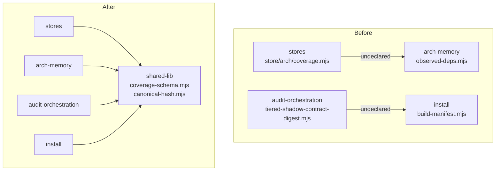

# Plan: Cross-Domain Layering + Mutation-Contract Cleanup

- **Date**: 2026-07-31
- **Status**: Complete (shipped 2026-07-31 — see Implementation Log)
- **Author**: Claude + Louis
- **Scope**: backend (CLI handlers + domain-map + two module moves — no UI)

> **Target domain(s)**: `cross-skill-bridge`, `stores`, `arch-memory`, `audit-orchestration`,
> `install`, `shared-lib`, `tests`.
> ⚠ **Cross-domain work** — by construction: the subject *is* the domain boundaries.

## 1. Context Summary

**Scope/stack**: backend, `js-ts` + `postgres` (ESM).

**The gap.** Two finding classes were deferred as "independent" across three separate
audits (2026-07-31 Cluster A R1/R2, Cluster B R1/R2). Deferring was correct each time —
the code being shipped did not ride on them — but "independent of *that* change" is not
"not a problem". This plan is the dedicated pass those deferrals were promising.

**Every finding below was executed before being accepted.** Per AGENTS.md, an audit
finding about untouched code is a hypothesis; three findings in the last run asserted a
file was absent and were false. So each row here carries its verification.

### Class 1 — undeclared cross-domain imports (4 edges)

Domains resolved with `cross-skill.mjs compute-target-domains` (not by hand):

| Edge | Importer → target | Declared in `allowedDeps`? | Disposition |
|---|---|---|---|
| L1 | `stores` → `arch-memory` — [`store/arch/coverage.mjs:23`](../../scripts/lib/store/arch/coverage.mjs#L23) imports `CoverageSchema` from [`observed-deps.mjs`](../../scripts/lib/observed-deps.mjs) | No (`stores` allows `model-eval`, `persona-test`, `shared-lib`) | **Refactor** |
| L2 | `cross-skill-bridge` → `model-eval` — [`cross-skill.mjs:133`](../../scripts/cross-skill.mjs#L133) imports `computeShadowOverlap` | No | **Declare** |
| L3 | `audit-orchestration` → `install` — [`tiered-shadow-contract-digest.mjs:64`](../../scripts/lib/audit/tiered-shadow-contract-digest.mjs#L64) imports `canonicaliseForHash` from [`build-manifest.mjs`](../../scripts/build-manifest.mjs) | No | **Refactor** |
| L4 | `tests` → `root-scripts` — [`install-bootstrap-e2e.test.mjs:36`](../../tests/install-bootstrap-e2e.test.mjs#L36) imports `bootstrap` from root `install.mjs` | No (`tests` allows `install`, but `install.mjs` tags `root-scripts`) | **Re-tag** |

**Declare vs refactor is not a coin-flip — it is the two-layer model in AGENTS.md.**
`allowedDeps` is the *intent* layer: it exists to record architectural relationships the
import graph cannot infer. So the test is **"is this edge intended architecture, or is it
a module in the wrong place?"**

- **L2 declare** — `cross-skill.mjs` is the CLI facade; it already declares dispatch edges
  to `arm-eval`, `audit-orchestration`, `nav-audit`, `persona-test`, `stores`.
  `model-eval` is missing from that list, which makes this an **omission in the intent
  layer**, not a violation. The audit itself allowed for this ("may be a legitimate
  dispatch relationship").
- **L4 re-tag, NOT declare** (corrected in plan-audit R1). Declaring `tests → root-scripts`
  would grant *every* test module access to the *whole* current and future `root-scripts`
  domain in order to express one narrow relationship — widening the intent layer to
  silence a gate. The real defect is the **tag**: `install.mjs` is the installer and is
  classified `root-scripts` only by the catch-all `{"pattern":"*.mjs"}` rule, while its
  sibling `scripts/install-skills.mjs` is already tagged `install`. Adding a specific rule
  `install.mjs → install` puts the file in the domain it belongs to and **eliminates the
  edge entirely** — `tests` already declares `install`.
- **L1 / L3 refactor** — both import a **contract**, not a behaviour: a Zod schema and a
  pure canonicalisation function. A shared contract consumed by two domains belongs in
  `shared-lib`, which both already depend on. Declaring these would encode "persistence
  depends on architecture-observation internals" as intent, which is exactly the coupling
  the finding names.

### Class 2 — mutation-contract defects in `cross-skill.mjs`

| # | Defect | Verification run this session |
|---|---|---|
| C1 | `resolveRepoIdentityQuiet()` returns **`repoUuid`**, but 3 call sites ([1283](../../scripts/cross-skill.mjs#L1283), [1340](../../scripts/cross-skill.mjs#L1340), [1696](../../scripts/cross-skill.mjs#L1696)) assign it to `repoId` and query on it | Read the function: `return r?.repoUuid \|\| null`. This is the **exact class** of the 2026-07-30 two-repo-ids incident — `audit_repos.id` (v4) vs `repo_uuid` (v5) — which produced an authoritative **0** for a repo that was never queried |
| C2 | `groundingNoteFor` ([863](../../scripts/cross-skill.mjs#L863)) checks containment with `p.startsWith(path.resolve(root))` — no separator | **Demonstrated live**: `path.resolve('/repo','../repo-evil/x')` → `C:\repo-evil\x`, and `.startsWith(resolve('/repo'))` returns **true**. Adding `+ path.sep` returns false |
| C3 | `cmdLockWithTest` resolves + prefix-checks with `+ sep` (boundary-safe) but never `realpath`s the **target**, and accepts a **directory** (`existsSync` only) | Read lines 2459–2470: `realpathSync(process.cwd())` for the root only; target is `resolve()`d, then `existsSync(abs)` |
| C4 | `cmdUpdatePlanStatus` resolves `repoId` **only on the `path` branch**; an explicit `planId` writes with no tenant scoping | Read: `if (!planId) { const repoId = await resolveRepoId(p); … }` — the `planId`-supplied branch skips it entirely |
| C5 | `cmdRecordPlanVerifyRun` validates `typeof totalCriteria !== 'number'`, which admits `NaN`, negative and fractional values, then persists them | Read the guard; `typeof NaN === 'number'` |

**C5's command contract** (R1-M4 — the predicate alone was not implementable):
`validateCriteriaCount(n)` accepts a **finite, non-negative, integral** number
`0 ≤ n ≤ Number.MAX_SAFE_INTEGER`. `0` **is** valid — a verify run over a plan with no
parseable acceptance criteria is a real state and already reachable. Validation runs
**before** repo resolution and before any store call, so an invalid payload never reaches
persistence. Failure is `emitError('BAD_INPUT', …)` → **exit 2**, matching every other
argv/contract error in this dispatcher (`ok:false`, no write).

**Applied to every count in the payload, not just `totalCriteria`** (corrected at the
Gemini gate). Guarding one field while its peers (`passedCriteria`, `failedCriteria`, …)
accept `NaN` and negatives through the same handler would fix the example rather than the
defect — and a `NaN` peer is *more* misleading than a `NaN` total, because a satisfaction
percentage computed from it renders as a plausible number. The implementation enumerates
the payload's numeric fields from one list and validates each with the same predicate;
where the schema implies a relationship (`passed + failed ≤ total`), that cross-field
check runs in the same pass. The test asserts a bad **peer** field is rejected, so a
single-field fix cannot pass.

**Dismissed with rationale — `cmdAbortRefreshRun` returns `ok:true` when `aborted:false`.**
The finding reads it as a false-success. Reading the code, the surrounding comment shows a
*prior* audit already fixed exactly this by surfacing `aborted` in the payload, deliberately
keeping `ok` as "the command executed". A caller is told the real outcome; flipping `ok`
to false now would change a contract external callers (CI, other skills) already consume,
to express something the payload already expresses. Recorded rather than changed.

**Patterns reused**: `resolveAndClassify` from
[`sensitive-paths.mjs`](../../scripts/lib/sensitive-paths.mjs) (the canonical realpath +
containment helper — C3 is precisely what it exists for); the `allowedDeps` intent layer;
`shared-lib` as the shared-contract home.

## 2. Proposed Architecture



### Key design decisions

1. **Move the contract and migrate every importer — no permanent re-export
   (#2 SOLID, #5 Single Source of Truth).** An earlier draft kept back-compat re-exports
   from the old homes. Plan-audit R1 was right that this leaves obsolete architectural
   entry points as permanent internal APIs, so a future consumer can keep importing a
   contract from `observed-deps.mjs` and silently recreate the edge this plan removes.
   **Counted before deciding**: `CoverageSchema` has exactly 2 real importers
   (`store/arch/coverage.mjs`, `tests/observed-deps-coverage-schema.test.mjs`) and
   `canonicaliseForHash` exactly 2 (`lib/audit/tiered-shadow-contract-digest.mjs`,
   `tests/skills-artifact-freshness-wiring.test.mjs`). Four call sites is a migration, not
   a sweep — so the old export is **removed**, and the layering test then has a real
   property to assert (the symbol is gone from its old home) rather than an identity
   check that a copy-paste would also satisfy.
2. **C1/C4 identity — the executable contract (#5, #12 Validation).**
   `resolveRepoIdentityQuiet` → **`resolveRepoUuidQuiet`** (it returns `r?.repoUuid`), and
   each of the 3 sites ([1283](../../scripts/cross-skill.mjs#L1283),
   [1340](../../scripts/cross-skill.mjs#L1340), [1696](../../scripts/cross-skill.mjs#L1696))
   binds it to `repoUuid`, then translates via
   **`getRepoIdByUuid(repoUuid, { strict: true })`** from
   [`scripts/lib/store/repo.mjs:214`](../../scripts/lib/store/repo.mjs#L214) — the same
   seam `resolveRepoId` already uses.
   **Null/……failure policy, stated so it is implementable**:
   - `resolveRepoUuidQuiet()` → `null` (not a git checkout / no identity): the command
     proceeds **unscoped exactly as today**. This is a rename, not a behaviour change, so
     it must not newly fail a command that works now.
   - `getRepoIdByUuid` returns **no row**: emit `reason: 'unknown-repo'` with
     `measured: false` — the same not-found shape `list-unlocked-fixes` already uses. An
     empty result must never render as a clean zero.
   - `getRepoIdByUuid` **throws** (transient DB): fail closed via `emitError`, never
     silently downgrade to an unscoped query. `strict: true` is what makes this
     distinguishable from not-found.
   - **All three sites** are converted; a partial migration leaves the same believable
     false zero in the sites that were missed.
   **C4** (`cmdUpdatePlanStatus`) — **resolving a `repoId` in the CLI is not a security
   boundary** (R2-H2). A variable in the handler constrains nothing; the tenant key has to
   be a predicate in the mutation itself. So:
   - **change `updatePlanStatus`'s own signature** to
     `updatePlanStatus({ repoId, planId, status })`, whose `UPDATE … WHERE id = $planId
     AND repo_id = $repoId` carries **both** keys in one statement. **Counted first**
     (R3-M3): [`store/plans-ship.mjs:183`](../../scripts/lib/store/plans-ship.mjs#L183) has
     exactly **one** caller, [`cross-skill.mjs:390`](../../scripts/cross-skill.mjs#L390).
     One caller means there is no migration cost to changing it — and adding a safer
     *sibling* while leaving the unscoped original exported would leave two APIs for one
     job, with the unsafe one still reachable. No unscoped update remains.
   - **zero rows updated** is the cross-tenant (or unknown-plan) case → return
     `{ok:false, reason:'plan-not-in-repo'}`; the handler maps it to `emitError` exit 2 and
     writes nothing. A `rowCount` that is not checked is an `/audit-code` HIGH in this repo.
   - `cmdUpdatePlanStatus` resolves `repoId` for **both** entry paths (hoisted out of
     `if (!planId)`) and calls the scoped writer on both.
   - **Test**: a `planId` belonging to repo A, updated while scoped to repo B, must leave
     the row untouched and return `plan-not-in-repo` — the assertion that a CLI-only fix
     would pass and a SQL-predicate fix would not.
3. **C3 — the accept/reject policy, stated as a table (#1 DRY, #12).** "Delegate to
   `resolveAndClassify`" is a mechanism, not a policy; plan-audit R1 was right that the
   command-level decision has to be written down.

   | Target after `realpathSync` | Decision |
   |---|---|
   | regular file, canonical path inside `repoRoot` | **accept** (a symlink whose target resolves in-repo is fine — the file is ours) |
   | canonical path outside `repoRoot` (incl. via symlink) | **reject** `path-escapes-repo` |
   | directory | **reject** `not-a-file` — `existsSync` accepts these today |
   | missing | **reject** `test-file-not-found` (current behaviour, preserved) |
   | `realpath` throws (broken symlink, EPERM) | **reject** `path-unresolvable` — fail closed, matching `resolveAndClassify`'s own posture |
   | classified `sensitive` by `resolveAndClassify` | **reject** `sensitive-path` |

   **C2 uses the same resolution, for the same reason** (corrected at the Gemini gate). An
   earlier draft specified a *pure* `isPathContained` for `groundingNoteFor` — adding
   `path.sep` and nothing else. That is wrong, and dangerously so: `groundingNoteFor`
   **`readFileSync`s the path** ([`cross-skill.mjs:874`](../../scripts/cross-skill.mjs#L874))
   and feeds the contents into an audit prompt, on a `primary_file` value the comment
   itself calls "model-authored text … not a trusted path source". A string-only check
   passes an in-repo symlink whose target is `~/.ssh/id_rsa`, reads it, and sends it to a
   third-party LLM — the precise INC-001 symlink-bypass class, on the repo's Tier-3
   sensitive-egress seam. So C2 resolves via `resolveAndClassify` too, and
   `isPathContained` survives only as the internal boundary primitive both classifiers
   share (it is never a call site's whole answer).

   All rejections are `BAD_INPUT` (exit 2) with the reason string above, and none of them
   write. The repo's canonical realpath+containment oracle
   (`resolveAndClassify`, written after symlink-bypass INC-001) does the resolution; this
   table is only the mapping from its verdict to the command's answer.
4. **The declared edge records WHY — via the file's existing underscore-key convention,
   because JSON has no comments (#19 Observability).** `.audit-loop/domain-map.json`
   already carries `_comment`, `_comment_allowedDeps`, `_comment_tests` and a dated
   `_adjudication_2026_07_20` key; this plan adds `_adjudication_2026_07_31` in the same
   shape. No parser or schema change is needed — underscore-prefixed top-level keys are
   already ignored by every consumer, which is precisely why the convention exists. (An
   earlier draft of this plan said "rationale comment", which is unimplementable in JSON.)

## 5. Right-sizing gate

- **Band-aid** — add all four edges to `allowedDeps` and call the layering pass done.
  Two of them are genuine misplacement, so the coupling stays and the gate now blesses it.
- **Over-engineered** — introduce a formal `contracts/` domain, a schema registry, or
  invert `install`/`audit-orchestration` wholesale.
- **Chosen** — two contract moves (each: new shared module + **all importers migrated,
  old export removed**), one re-tag, one declaration, five bounded handler fixes. Current requirements: the gate stops
  reporting edges nobody has adjudicated, and five verified defects stop being live.

**Manual vs scripted**: ~10 edits, each judgment-heavy and in a different file. **By hand**
— a codemod for irregular, one-off edits is the over-engineering cliff.

## 6. Sustainability Notes

- **Assumption that could change**: `shared-lib` stays dependency-light. If it ever grows
  a dependency on `stores` or `arch-memory`, these moves would create a cycle — the
  layering gate would catch it.
- **What breaks in 6 months**: an importer added *between* now and the merge that still
  reaches for the old export will fail loudly at import time — which is the intended
  behaviour, not a regression. There is no compatibility re-export by design (§2 dec. 1):
  a silent fallback is exactly how the removed edge would grow back.

## 7. File-Level Plan

> **Domain ownership of the new modules — verified, not assumed** (R1-M1, extended R3-L1).
> Ran `compute-target-domains` on **all five** new paths before writing this:
> `coverage-schema.mjs`, `canonical-hash.mjs`, `path-validation.mjs`, `command-input.mjs`
> and `repo-scope.mjs` each resolve to **`shared-lib`** under the existing 70-rule set, so
> no domain-map rule change is needed for any of them. `path-validation.mjs` imports
> `resolveAndClassify` from `sensitive-paths.mjs`, which also resolves to **`shared-lib`**
> — an intra-domain edge, so it introduces no new cross-domain dependency. The layering
> test asserts the resolved domain, not just import identity.

- **`scripts/lib/coverage-schema.mjs`** (create) — `CoverageSchema` (moved verbatim).
  *Why*: a schema is a contract shared by `stores` + `arch-memory` (#1).
- **`scripts/lib/observed-deps.mjs`** (modify) — import `CoverageSchema` from the new
  home for its own use; **remove the export** (no back-compat re-export — see §2 dec. 1).
- **`scripts/lib/store/arch/coverage.mjs`** (modify) — import from `shared-lib`. Kills L1.
- **`tests/observed-deps-coverage-schema.test.mjs`** (modify) — import `CoverageSchema`
  from its new home (the second of its two importers).
- **`scripts/lib/canonical-hash.mjs`** (create) — `canonicaliseForHash` (moved verbatim).
- **`scripts/build-manifest.mjs`** (modify) — import from the new home; **remove the
  export**.
- **`scripts/lib/audit/tiered-shadow-contract-digest.mjs`** (modify) — import from
  `shared-lib`. Kills L3.
- **`tests/skills-artifact-freshness-wiring.test.mjs`** (modify) — import
  `canonicaliseForHash` from its new home.
- **`scripts/lib/path-validation.mjs`** (create) — `isPathContained` (pure) +
  `classifyTestPath` (filesystem-backed; delegates resolution to `resolveAndClassify`).
  Module doc states the I/O contract.
- **`scripts/lib/command-input.mjs`** (create) — `validateCriteriaCount` (pure). Separate
  module: a numeric argv rule does not belong under a path name (R2-M1).
- **`scripts/lib/repo-scope.mjs`** (create) — `resolveRepoScope({resolveRepoUuid,
  getRepoIdByUuid})` returning the four tagged variants of §9. Dependencies injected so
  the variants are unit-testable without a store (R2-M2).
- **`scripts/lib/store/plans-ship.mjs`** (modify) — `updatePlanStatus` takes `{repoId,
  planId, status}` and predicates the `UPDATE` on **both** keys, so tenant scope is a SQL
  predicate rather than a CLI variable; zero rows → `plan-not-in-repo` (R2-H2). Signature
  changed rather than a sibling added — one caller, no unscoped path left (R3-M3).
- **`.audit-loop/domain-map.json`** (modify) — add rule `install.mjs → install` (kills L4,
  §2 dec. L4); add `model-eval` to `allowedDeps['cross-skill-bridge']` (L2); record both
  under a new `_adjudication_2026_07_31` key (the file's existing underscore-key
  convention — JSON has no comments).
- **`scripts/cross-skill.mjs`** (modify) — C1 rename + `getRepoIdByUuid` translation at 3
  sites; C2/C3 delegate to `path-validation.mjs`, C5 to `command-input.mjs`, C1 to
  `repo-scope.mjs`; C4 resolves `repoId` on **both** entry paths and calls the
  repo-predicated writer.
- **`tests/layering-contracts.test.mjs`** (create) — the four properties in §9.
- **`tests/cross-skill-mutation-contracts.test.mjs`** (create) — C2/C3/C5 behaviour via
  the extracted helpers; **C1 via `resolveRepoScope`'s four variants against a stub** (no
  DB) plus the per-handler mapping table in §9; **C4 via the behavioural cross-tenant test
  against `AUDIT_DB_TEST_URL`** — seed plan P in repo A, write scoped to repo B, assert
  `plan-not-in-repo` AND that P's status is unchanged, then assert the same write scoped to
  repo A succeeds. Source-level assertions remain **only** as a belt-and-braces
  anti-bypass check; they are explicitly not the coverage (§9).

### 7b. Implementation Phases

**Phase 1 — Shared contracts + importer migration**: move both contracts into
`shared-lib` and repoint all four importers; remove the old exports. Files:
`scripts/lib/coverage-schema.mjs` (create), `scripts/lib/canonical-hash.mjs` (create),
`scripts/lib/observed-deps.mjs` (modify), `scripts/build-manifest.mjs` (modify),
`scripts/lib/store/arch/coverage.mjs` (modify),
`scripts/lib/audit/tiered-shadow-contract-digest.mjs` (modify),
`tests/observed-deps-coverage-schema.test.mjs` (modify),
`tests/skills-artifact-freshness-wiring.test.mjs` (modify).

**Phase 2 — Domain map**: re-tag `install.mjs` → `install` (kills L4); declare
`cross-skill-bridge → model-eval` (L2); record both in `_adjudication_2026_07_31`.
Files: `.audit-loop/domain-map.json` (modify).

**Phase 3 — Mutation contracts C1–C5**: extract the helpers + the repo-scoped writer,
then rewire the handlers. Files: `scripts/lib/path-validation.mjs` (create),
`scripts/lib/command-input.mjs` (create), `scripts/lib/repo-scope.mjs` (create),
`scripts/lib/store/plans-ship.mjs` (modify), `scripts/cross-skill.mjs` (modify).

**Phase 4 — Lock both classes**: Files: `tests/layering-contracts.test.mjs` (create),
`tests/cross-skill-mutation-contracts.test.mjs` (create).

**Close-out (not a phase)**: `npm run arch:refresh`, `npm test`, `npm run check`.

## 8. Risk & Trade-off Register

| Risk | Mitigation |
|---|---|
| A contract move breaks an importer the walker cannot see (dynamic import, string path) | Grep both symbol names repo-wide (incl. `tests/`) before and after; the old export is removed, so any missed consumer fails **loudly at import** rather than silently resolving. `npm run check` runs the full suite, which is where a dynamic importer surfaces. |
| C1's rename touches call sites whose behaviour I cannot fully exercise (cloud-dependent) | Rename + translate is mechanical; the tests assert the translation is *called*. Where a site cannot be exercised offline, say so rather than claim coverage. |
| Declaring L2/L4 is mistaken for silencing the gate | Each entry carries a rationale comment; the plan states the declare-vs-refactor test explicitly. |
| `arch:refresh` re-tags domains and changes the observed graph | It is close-out, run after the moves; the observed envelope is Category A (gitignored, regenerated). |

**Deliberately deferred**: inverting the `install` ↔ `audit-orchestration` relationship
wholesale; a `contracts/` domain. No current requirement.

## 9. Testing Strategy

**Test design — how the handlers are reachable at all (this was unspecified in R1).**
`cross-skill.mjs` command handlers are module-private and DB-bound, so they cannot be
called directly and **will not be monkey-patched** (patching an ESM binding to prove a
translation happened tests the patch). Instead the *decidable* part of each fix is
extracted into a named, exported, pure helper, and the tests assert on that:

| Fix | Extracted helper | Home | I/O? |
|---|---|---|---|
| C2 | `classifyReadPath({ root, candidate })` — resolves, then decides | `scripts/lib/path-validation.mjs` (new, `shared-lib`) | **touches the filesystem** — see below |
| C3 | `classifyTestPath({ repoRoot, testPath })` → `{ok}` \| `{ok:false, reason}` | same module | **touches the filesystem** — `realpath` + `stat` via `resolveAndClassify` |
| C5 | `validateCriteriaCount(n)` → `{ok}` \| `{ok:false, reason}` | `scripts/lib/command-input.mjs` (new, `shared-lib`) | **pure** |

Two modules, not one (R2-M1). `validateCriteriaCount` is a numeric argv rule with nothing
to do with paths; bundling it under a path name would have produced a
miscellaneous-utilities module whose name tells a reader nothing. And `classifyTestPath`
is **not pure** — it resolves symlinks and stats the target, which is the whole point of
it; the earlier draft called the module "the pure core", which was simply wrong. The
module doc states the I/O contract explicitly: `classifyTestPath` performs filesystem
reads and never writes, and every failure mode (including a throwing `realpath`) maps to a
`{ok:false, reason}` rather than propagating.

C2 and C3 do share the one containment primitive — that part was right, and is why they
stay together: two hand-rolled containment checks is how the first one drifted.

**C4 gets a behavioural cross-tenant test, not a source assertion** (R3-H1). Against the
disposable `AUDIT_DB_TEST_URL` container: seed plan P in repo A, call the writer scoped to
repo B, then assert (a) it returns `plan-not-in-repo`, and (b) **P's status column is
byte-identical to before** — the row-level proof that a source assertion cannot give. The
same test scoped to repo A must succeed, so the check cannot pass by refusing everything.

**Per-handler outcome mapping for C1** (R3-M4 — `measured:false` is
`list-unlocked-fixes`-specific and must not be assumed universal). Each of the three sites
declares its own rendering of the adapter's variants, and each is asserted:

The three sites are **three different commands** with three different response shapes, so
the table below gives each its own mapping rather than "same" — writing `measured:false`
into all three would have re-imported the very assumption R3-M4 rejected (that field is
`list-unlocked-fixes` vocabulary):

| Variant | 1283 — persona-outcomes summary | 1340 — arm-eval session (`runArmEvalSession`) | 1696 — persona-outcomes worksheet (`getActionablePersonaOutcomeItems`) |
|---|---|---|---|
| `scoped` | query with the translated `repoId` | same | same |
| `no-identity` | proceed unscoped, exactly as today | same | same |
| `unknown-repo` | `{ok:true, cloud:true, rows:[], reason:'unknown-repo'}` | `emitError('BAD_INPUT','unknown repo')` — a session must not *start* unscoped | `{ok:true, items:[], reason:'unknown-repo'}` |
| `lookup-failed` | `emitError('REPO_RESOLVE_FAILED')`, exit 1, no query | same | same |

**The invariant is what generalises, not the field name**: no site may render an
unresolved repo as a clean empty result. Each site expresses that in its own existing
vocabulary, and each mapping is asserted in the tests.

**C1 gets a real adapter, not a source-text assertion** (R2-M2). Grepping for a variable
name cannot establish that the translated id reaches the query, that `unknown-repo`
suppresses it, or that a lookup failure fails closed — so the outcome policy in §2 dec. 2
is extracted into an injectable function and unit-tested against a stub:

```
resolveRepoScope({ resolveRepoUuid, getRepoIdByUuid })
  → { kind: 'scoped',        repoId }        // uuid resolved, row found
  → { kind: 'no-identity' }                  // not a checkout — proceed unscoped, as today
  → { kind: 'unknown-repo',  repoUuid }      // uuid resolved, NO row → measured:false
  → { kind: 'lookup-failed', error }         // transient DB → fail closed, never unscoped
```

Both dependencies are parameters, so the four variants are tested with a stub and **no
database**. The three C1 call sites then consume this one function, which is also what
stops the next site drifting. A source-level assertion is kept **only** as a
belt-and-braces check that no site bypasses the adapter — it is a supplement, not the
coverage.

- **Tier 1 (test-first)**: C2 containment (`/repo` vs `/repo-evil` — the demonstrated
  case, plus the trailing-separator boundary), C5 numeric guard (`NaN`, `-1`, `1.5`, `0`,
  `Number.MAX_SAFE_INTEGER + 1`), C3 (one case per row of the §2 dec. 3 table, including a
  real symlink fixture pointing outside a temp repo).
- **Layering**: with the old exports removed, "same object from both import paths" is no
  longer expressible (R3-M2) — and the absence assertions (§9 properties 1–2) are the
  stronger check anyway, because a copy-paste-instead-of-move leaves the original in
  place and therefore FAILS them. Additionally assert each new module's **resolved
  domain** is `shared-lib`, so a module that landed in the wrong domain cannot pass
  silently.
- **Success-path adversarialism, scoped to this plan's claims** (R1-M3 corrected an
  earlier over-reach here). The layering test asserts exactly four properties and **does
  not** freeze global `allowedDeps` state — pinning the whole map into a feature test
  would make any future, independently-reviewed dependency require editing an unrelated
  cleanup test, which is shotgun surgery that trains people to weaken the test:
  1. `CoverageSchema` is **no longer exported** from `observed-deps.mjs`;
  2. `canonicaliseForHash` is **no longer exported** from `build-manifest.mjs`;
  3. `allowedDeps['cross-skill-bridge']` **contains** `model-eval` (the adjudicated declare);
  4. the domain rule resolves `install.mjs` → `install` (so the L4 edge cannot exist).
  Properties 1–2 are what a copy-paste-instead-of-move would fail.
- **Empirical**: run `npm run arch:refresh` and confirm the observed graph no longer
  reports L1/L3, and reports L2/L4 as `both` (observed + manual) rather than observed-only.

## 11. Execution Clustering

- **Cluster A** — Phases 1–2 — fix-gate: yes
  - Coupling: both change what the layering gate sees. Phase 1 removes two edges, Phase 2
    declares two; auditing them apart would show a half-adjudicated graph in which the
    remaining edges look like unfixed violations.
- **Cluster B** — Phases 3–4 — fix-gate: final
  - Coupling: the handler fixes and the tests that pin them are one surface — C1–C5 are
    only meaningfully verifiable against the fixtures added in Phase 4.
- **Final gate**: consolidated Gemini review over the union diff.

---

## Implementation Log

### 2026-07-31 — all four phases (`/cycle --autonomous`, clustered)

Plan audit 3 GPT rounds (H 5→2→1) + 3 Gemini rounds → APPROVE. Cluster A converged;
Cluster B gated by the consolidated review → **APPROVE, 0 findings**.

**Both contract moves verified byte-identical** to their originals before anything else
was concluded — which is what let Cluster A's 14 non-Cluster-B findings be deferred
honestly: a verbatim relocation cannot have introduced them.

**Empirically confirmed after `arch:refresh` + `arch:render`**: `stores → arch-memory`
and `audit-orchestration → install` are **gone** from the observed graph;
`cross-skill-bridge → model-eval` is observed and now declared; `install.mjs` resolves to
`install`. Layering violations: **0**.

**Five discoveries the plan did not anticipate:**

1. **C1 had FIVE call sites, not three.** The original finding said three and an early
   grep confirmed three — because `head` truncated it. The rename surfaced all five. A
   partial migration would have left the identical believable-false-zero in the two
   missed sites, which is exactly what the plan warned about.
2. **`resolveAndClassify` fails CLOSED**, so a *missing* file returns
   `category: 'sensitive'`. The naive check order therefore reported a typo'd filename as
   "sensitive path" — wrong and unactionable. Reordered to lexical → existence → resolve,
   with `lstat` (not `stat`) so a dangling symlink reads as unresolvable, not missing.
3. **`isPathContained` falsely rejected on Windows drive-letter case.** `path.resolve`
   preserves the case it is given, so `c:\repo` vs `C:\repo` compared unequal on a
   case-insensitive filesystem. Reproduced on win32, fixed by folding on win32 only, with
   a test asserting the fold does not weaken the boundary check.
4. **`updatePlanStatus` had exactly one caller**, so its signature changed rather than
   gaining a safer sibling — no unscoped write path remains.
5. **A hand-rolled glob resolver in the layering test was wrong.** The self-check assert
   placed above it caught that immediately; switched to the repo's real `tagDomain`.

**One consolidated-gate HIGH was verified false**: `z.iso.datetime()` was claimed not to
exist in Zod 4. It does — zod 4.4.3 exposes `z.iso` with a `datetime` function, the schema
imports and parses, and the block was a byte-identical move of running code.

**Deferred, unchanged**: the 14 pre-existing findings Cluster A surfaced in touched files
(non-atomic `skills.manifest.json` write, `--check` comparing only `bundleVersion`,
copy-forward concurrency, coverage cross-field validation, digest whitespace
canonicalisation). None were introduced here and none is depended on by this change —
but several are worth their own pass.
