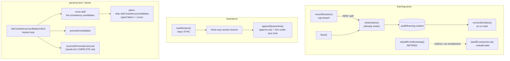

# Plan: Honest failure across the learning / brainstorm / persona-promote seams

- **Date**: 2026-08-01
- **Status**: Complete (2026-08-09) — all 5 phases shipped across 3 clusters;
  all 7 topicIds resolved with attributable commit shas. See the Execution
  Record at the end of this document.
- **Author**: Claude + Lbstrydom
- **Scope**: backend
- **Implements**: the 7 open entries in
  [`refactor-learning-persona-quickfix-2026-07.md`](refactor-learning-persona-quickfix-2026-07.md) §0
- **Closes**: tech-debt topicIds `222b036e`, `191fca35`, `f1a716cf`,
  `e0623c0a`, `e51bacd2`, `fa86b341`, `bbd58a09`
- **Target domain(s)**: `learning-store`, `brainstorm`, `persona-test`,
  `cross-skill-bridge`, `stores`, `shared-lib`
- ⚠ **Cross-domain work** — touches 6 domains. All six are *existing*
  intra-domain edits plus one already-declared bridge hop
  (`cross-skill-bridge → stores`); no new domain edge is created. See §6.

---

## 1. Context Summary

**Scope**: backend · **Stack**: `js-ts` (+ postgres) · no Python.

### The shared invariant (stated once, not fixed three ways)

Five of these seven entries are the same defect wearing different clothes:

> **An un-done or failed job reports success.**

- `222b036e` — a decision is evicted and lost; the caller gets a
  `decisionKey` back as if it were queued.
- `191fca35`/`f1a716cf` — a rebuild that never ran its heuristic returns
  `{ok:true}` and overwrites the cache with inert weights.
- `e0623c0a` — a record the loader cannot interpret is accepted, and
  affirmatively mislabelled as a legacy record it is not.
- `bbd58a09` — a truncated page reads as the complete candidate list.

This is the identical shape that [`refactor-failure-contract.md`](refactor-failure-contract.md)
closed for the *other* fourteen entries in the parent triage. **This plan
does not build a shared mechanism for it** — the four sites have genuinely
different substrates (an in-memory queue, a cache file, a JSONL line, a SQL
page) and a common abstraction over them would be the over-engineering
cliff. What they share is a *rule*, applied four times:

> **A caller must be able to distinguish "nothing was there" from "we could
> not tell."** Where those two states are currently one value, split them.

`e51bacd2`/`fa86b341` (locking) are a different defect class and are
treated as such.

### Code Trace

Read this session, in this order:

- [`scripts/lib/learning/decision-logger.mjs`](../../scripts/lib/learning/decision-logger.mjs)
  — full read. `recordDecision` `:219` → cap breach `:240` → `queue.shift()`
  `:242` + `bumpDropped` `:243` + `throttledWarn` `:244`. Compared against
  the same module's `flush()` `:308` → local branch `:349`
  `writeOutbox(entry, outboxDir)` → on failure `summary.retained` `:353`
  and splice-back `:361-373`. `writeOutbox` `:454` is **synchronous**
  (`atomicWriteFileSync`), and `reconcileOutbox` `:388` already replays the
  directory at run start.
- [`scripts/lib/learning/quickfix-stats.mjs`](../../scripts/lib/learning/quickfix-stats.mjs)
  `:165-209` `rebuildFromBootstrap` → no `child_process` import in the
  module at all; `outcome: 'no_action'` hardcoded `:188`; `writeAtomic`
  `:207` unconditional; `{ok:true}` `:208`. Cross-checked against
  `aggregateDecisions` `:237-262`: `'no_action'` bumps `totalHits` only,
  never `alpha`/`beta` — so the written cache is **inert**, not merely weak.
- [`scripts/learning/backfill-outcomes.mjs`](../../scripts/learning/backfill-outcomes.mjs)
  `:1-60` + `:868-939` — **this is the finding that reshapes items 2+3**.
  It already implements the exact heuristic `rebuildFromBootstrap`'s
  docstring promises: same `.audit/quickfix-hits.jsonl` source, same
  `STALENESS_MS = 30 * 60 * 1000` `:58`, same `HOOK_IGNORE_MARKER` `:59`,
  and the full four-way detector at `:909` (`file-deleted`→accept), `:922`
  (`snippet-removed`→accept), `:934` (`ignore-marker-found`→suppress),
  `:939` (`still-present-no-marker`→ignore). It shells to git (`:751`),
  and it already carries `--rebuild-stats` to refresh the same cache.
- [`scripts/lib/brainstorm/session-store.mjs`](../../scripts/lib/brainstorm/session-store.mjs)
  — full read. Guard `:188`; V1 synthesis `:196-215` overwriting
  `schemaVersion: 2` `:201` *before* `safeParse` `:207`;
  `appendQuarantine` `:229-263` read `:248` → combine `:254` → trim `:255`
  → `atomicWriteFileSync` `:259`; `appendSession` `:84` takes
  `withFileLock`, `loadSession` `:150` takes none.
- [`scripts/lib/file-lock.mjs`](../../scripts/lib/file-lock.mjs) — only
  `withFileLock` (async) `:238` is exported; the underlying
  `tryAcquireLock` `:69` and `safeRelease` `:208` are **synchronous** and
  module-private.
- [`scripts/persona-consistency-promote.mjs`](../../scripts/persona-consistency-promote.mjs)
  `:221-230` `listConsistencyCandidatesViaCli` (`limit: 100`, no cursor) →
  two callers: `promoteCandidates` `:343` and `reconcilePromotionJournal`
  `:590`.
- [`scripts/cross-skill.mjs`](../../scripts/cross-skill.mjs) `:479-487`
  `cmdListConsistencyCandidates` — passes `sinceTs` + `limit` only; **no
  offset/cursor parameter exists**.
- [`scripts/lib/store/plans-ship.mjs`](../../scripts/lib/store/plans-ship.mjs)
  `:345-376` `listConsistencyCandidates` — `LIMIT` only, and `catch → []`
  at `:374`.

### Three findings the parent triage did not have

**(A) Items 2+3 are a duplicate of working code, not a missing feature.**
`backfill-outcomes.mjs` already does the job, is already wired to the
weekly cron and `npm run learning:backfill-outcomes`, and already rebuilds
the same cache. `rebuildFromBootstrap` is a second, stubbed implementation
of one capability — a Single-Source-of-Truth violation (#10) and dead code
(#9). This moves the honest answer from "implement it or label the stub"
(the two options the task named) to a third: **retire it and redirect**.
Recorded here because it is a scope judgement, not a mechanical fix.

**(B) `bbd58a09`'s real severity is above MEDIUM — truncation causes a
*wrong action*, not a missed one.** In `reconcilePromotionJournal` `:641`,
`stillCandidate` is computed from `candidateByFingerprint.has(...)` over a
map built from the same truncated 100-row page `:590-593`. A pending
journal entry whose candidate sits beyond row 100 is therefore read as
**"not a candidate any more" → "the DB committed" → complete the rename and
delete the journal** `:653-666`. The spec file is moved into place and the
recovery record destroyed, while the DB row is still an unpromoted
candidate. That is silent state corruption, reachable without any DB error.
Verified by reading the branch, not inferred from the entry text.

**(C) The Theme-1 failure-contract fix is one layer short.**
`interpretCandidateListResult` faithfully reports what the CLI hands it —
but `plans-ship.mjs:374` converts a DB exception into `return []`, and the
CLI then emits a clean `{ok:true, candidates:[]}`. So a store-layer failure
still presents as a genuine empty list. Entries `4294a043`/`6b6263b8` are
recorded closed; the *bridge* layer they name is fixed, the *store* layer
underneath is not. **In scope by impact, not authorship** (AGENTS.md): the
pagination loop this plan adds terminates on a short page, so a loop built
over a function that returns `[]` on error would stop early and report a
complete list — the fix cannot be correct without this.

### Patterns reused vs new

| Reused (no new abstraction) | Where it already lives |
|---|---|
| Outbox spill + replay | `decision-logger.mjs::writeOutbox` / `reconcileOutbox` |
| Git-archeology outcome detection | `backfill-outcomes.mjs` (item 2+3 redirects to it) |
| Sync lock acquire/release | `file-lock.mjs::tryAcquireLock` / `safeRelease` (private) |
| Typed `{ok:true,…}｜{ok:false,error}` result | `quickfix-stats.mjs::readQuickfixDecisions` |

**One genuinely new thing**: a `withFileLockSync` export in
`file-lock.mjs`. Justified in §6.

### Neighbourhood considered

`get-neighbourhood` returned 8 records, **all `review` band**
(`bandReason: below-noise-floor`) — every hit was one of the target symbols
itself (`appendQuarantine`, `loadSession`, `flush`, `reconcileOutbox`,
`rebuildFromCloud`, `promoteOne`, `reconcilePromotionJournal`,
`quarantinePath`). Nothing above this repo's noise floor, i.e. no
near-duplicate to reuse. Expected: this plan modifies existing symbols and
introduces one new exported function. The `flush`/`reconcileOutbox` hits
are what led to the item-1 reuse decision above.

### Past incidents to verify against

| Incident | Status | Bearing on this plan |
|---|---|---|
| **INC-001** — lexical path classification bypassed by symlink | `manual-verification-required` | Item 1 writes a file whose name derives from `entry.decisionKey` (hashed, `:456`) into a fixed dir — no caller-controlled path component. No new exposure. Item 2+3 **removes** a filesystem read path. Confirm no new path is built from untrusted input. |
| **INC-002** — test suite wiped production via an unverified DSN | `manual-verification-required` | Item 7 touches store-layer SQL. The new tests must not point at a real DSN; `assertDisposableDbUrl` already gates the integration suites. Keep item 7's store tests **pure** (SQL-shape assertions), not live-DB. |

Neither incident's mitigation is failing; both are recorded as
`manual-verification-required`, so §9 restates the relevant checks rather
than assuming them.

---

## 2. Proposed Architecture



### Key design decisions

**Item 1 — `222b036e`: eviction becomes durable-or-reject.**
`recordDecision` stays synchronous; `writeOutbox` already is.
`reconcileOutbox` needs **no change** — it already replays the directory.

> **R2-H4 correction — "spill, and count it if the spill fails" is still
> silent loss.** The R1 draft spilled the evicted entry and, when
> `writeOutbox` failed, incremented `evictedLost` and dropped it anyway.
> Counting a loss makes it *observable*, not *prevented* — and it violates
> the module's own established contract: `flush()` already **retains** an
> entry in memory when its outbox write fails (`summary.retained` `:353`)
> rather than discarding it. The draft applied a weaker rule to the same
> data on a different code path.

> **R3-H1 correction — the CI carve-out imported a precedent that does not
> apply.** The R2 draft kept CI eviction lossy by inheriting `flush()`'s
> `lostInCI` stance. But `flush()`'s losses are of **already-admitted**
> entries: a receipt was issued, and only later could the write not be made.
> Eviction happens at **admission** time, where refusing costs the caller
> nothing but a `null` it already handles. Dropping post-receipt is a lie;
> refusing pre-receipt is not. The two paths are not analogous, so the
> carve-out was reasoning by surface similarity — and it also conflicts with
> `REQ-persistence-18856855` (a decision whose telemetry cannot be persisted
> must be outboxed or retained). Removing it makes the rule **uniform across
> environments**, which is also strictly simpler: no CI branch, no
> `evictedLostInCi` counter.

### The eviction transition table (authoritative — §7 and §9 cite it, never restate it)

Environment-independent. This table is the single source of truth for item 1;
if any prose elsewhere in this plan disagrees with it, **this table wins**
(R3-H2 — the R2 edit updated §2 and left §7 describing the superseded
behaviour, which would have let an implementer rebuild the R2-H4 bug while
following the file-level plan).

| Condition | Queue action | `recordDecision` returns | Counter |
|---|---|---|---|
| Under cap | enqueue new | `decisionKey` | — |
| At cap, `writeOutbox(oldest)` **succeeds** | shift oldest, enqueue new | `decisionKey` | `evictedOutboxed++` |
| At cap, `writeOutbox(oldest)` **fails or is unavailable (incl. CI)** | **retain oldest, do not enqueue new** | **`null`** | `backpressureRejected++` |

Load-bearing consequences:

- **The shift is conditional on a successful spill.** Never capture-then-shift.
- Memory stays bounded either way — the queue never grows past the cap.
- A `decisionKey` is a **receipt**; issuing one for a decision that was never
  admitted is the same lie this plan exists to remove. `recordDecision`
  already returns `null` under `LEARNING_DISABLE`, so callers tolerate the
  shape; the JSDoc `@returns` must document the second null case.
- `dropped` retains a **single, narrow** meaning: entries that were
  *admitted* (a receipt was issued) and later permanently lost by `flush()`.
  Eviction never contributes to it — a rejected decision was never admitted.
  *(#15, #16, #19)*

**Items 2+3 — `191fca35`/`f1a716cf`: retire, don't reimplement.**
`rebuildFromBootstrap` becomes a refusal that names the working command:

```js
return { ok: false, totalHits: 0, patternCount: 0, error: 'bootstrap-retired',
         hint: 'run: npm run learning:backfill-outcomes -- --rebuild-stats' };
```

It writes **nothing** — the current code's worst behaviour is overwriting a
cloud-built cache with inert weights, and a retired path must not do that.
The JSONL-parsing body and the `HITS_JSONL_PATH` constant are deleted (#9),
and `cross-skill.mjs`'s `--bootstrap` dispatch surfaces the same redirect
rather than silently succeeding. *(#1, #9, #10, #19)*

**Item 4 — `e0623c0a`: three-way, and stop lying in `_synthesised`.**

| `schemaVersion` | Branch | Rationale |
|---|---|---|
| `=== 2` | V2 validate | unchanged |
| key **absent** | V1 synthesis | V1 predates the field |
| anything else (`3`, `"3"`, `null`, `false`, `{}`) | quarantine, `reason: unsupported-schema-version-<json>` | present-but-unsupported is neither |

The task asked whether a legitimate V1 record can carry a *falsy*
`schemaVersion`. **Checked**: across the 43 live records in
`.brainstorm/sessions/`, `0` lack the key and `43` have exactly `2` — no
record carries a falsy-but-present value, and a V1 writer never wrote the
key at all. So key-absence is the correct V1 test. The V1 path is retained
for consumer repos (#18). `_synthesised` is only stamped on records that
were genuinely synthesised. *(#12, #18, #19)*

**Items 5+6 — `e51bacd2`/`fa86b341`: one lock protocol over every mutation.**
`loadSession` **stays synchronous** (4 call sites: `brainstorm-round.mjs:615`,
`resume-context.mjs:121`, and tests — making it async ripples through all of
them for a diagnostic file).

> **R1-H1 correction — an append-only design does NOT remove this race.**
> The first draft of this plan proposed `fs.appendFileSync` (O_APPEND) plus a
> separately-locked opportunistic trim, claiming that removed the race at the
> root. **It does not.** O_APPEND serialises appends against *other appends to
> the same inode*; it gives no protection against the trim, which reads a
> snapshot and then `rename()`s a replacement file over it. An append landing
> after the trim's read but before its rename goes to the *old* inode and
> vanishes when the new file replaces it. The draft narrowed the window and
> called it closed — the exact band-aid-as-root-fix move AGENTS.md's
> right-sizing rule exists to catch, and it is recorded here rather than
> silently corrected.

**Every mutation of the quarantine file participates in one lock protocol.**
`appendQuarantine` acquires `withFileLockSync`, then appends *and* enforces
the cap inside that one critical section, releasing in `finally`. There is no
unlocked write path.

Contention is where the never-throw contract meets this plan's own invariant.
A caller that cannot acquire the bounded lock **must not** write concurrently
with a trimmer, and **must not** silently pretend it recorded the line.
`appendQuarantine` therefore returns a typed, non-throwing result —
`{recorded:true, count}` or `{recorded:false, reason:'lock-contention'}` —
and `loadSession` folds a `recorded:false` into its existing stderr warning
line. Nothing throws; nothing lies. *(#2, #14, #15, #16)*

**Item 7 — `bbd58a09`: two different questions, two different queries.**

> **R1-H2 correction — pagination is the wrong tool for the reconcile path.**
> The first draft paginated one global candidate list and fed it to both
> callers. Keyset pagination fixes OFFSET skew, but **a sequence of pages is
> not a snapshot**: rows can be created, promoted, or leave candidate status
> between page 1 and page N. So `complete:true` would still have been a false
> statement about the state `reconcilePromotionJournal` makes an irreversible
> rename-and-journal-delete decision on. That trades a truncation bug for a
> concurrency-dependent completeness bug — strictly harder to reproduce, no
> safer. The two callers are asking genuinely different questions, and the
> draft's single shared query was the actual design error.

| Caller | Question | Query |
|---|---|---|
| `promoteCandidates` | "what is pending, for a human to approve?" | paginated enumeration — an approximate, point-in-time view is *fine* here |
| `reconcilePromotionJournal` | "for these N specific fingerprints, what is each one's state?" | **targeted batch resolution**, bounded by N |

1. **Store** (`plans-ship.mjs`) — two operations.
   (a) `listConsistencyCandidates` gains a keyset cursor (contract in §7),
   **not `OFFSET`**: `ORDER BY created_at DESC` + `OFFSET` is unstable under
   concurrent inserts and would re-introduce the silent-loss class being
   fixed. (b) A **new** `resolveCandidateStatesByFingerprint(repoId,
   fingerprints[])` returning the closed union below per fingerprint from one
   `= ANY($2)` query. Both fix `catch → []` to a typed failure (finding
   **C**). *(#15, #17)*

> **R2-M6 correction — "a handful" is an assumption, not a bound, and the
> draft's stated protection does not protect.** The R1 draft said reconcile
> handles "a handful, never paginated" and that the query is "chunked only to
> the parameter limit". **An array bound to `= ANY($2)` is ONE bind
> parameter** — the parameter limit places no bound at all on the array's
> size. A corrupted or long-accumulated journal directory therefore reaches
> an unbounded allocation, request payload and result map *inside the
> recovery path* — the one path that most needs to stay robust.

**Bounded and resumable — two separate bounds, and an anti-starvation rule**
(R3-M2 sharpened this; the R2 draft conflated payload size with per-run work,
gave the "per-run limit" no name or value, and had a test requirement that
contradicted its own design — 201 journals would simply have made a second
request, not an incomplete run):

| Bound | Value | Bounds what |
|---|---|---|
| `RECONCILE_BATCH_SIZE` | 200 | fingerprints per **resolver request** (payload/query cost) |
| `RECONCILE_MAX_BATCHES_PER_RUN` | 5 | **batches per run** ⇒ ≤1 000 journals; hitting it is `incomplete: true` |

**Starvation is the non-obvious hazard.** Journals in `absent`/`unknown` are
*retained* by the transition table, so a naive "always take the first N in a
stable order" traversal re-processes the same stuck prefix forever and never
reaches journal 1 001. Traversal is therefore **deterministic and advancing**:
order journals by filename (the specId, stable), and persist a validated
traversal checkpoint in the journal directory so the next run *starts after*
the last fingerprint examined, wrapping to the beginning once exhausted.
Retained journals are re-examined on a later pass, not on every pass.

Fingerprints are deduplicated and shape-validated before the query, and the
store helper is **independently defensive** — it rejects an oversized array
rather than trusting its caller, so a future second caller cannot reintroduce
the gap.
2. **CLI** (`cross-skill.mjs`) — thread `cursor` through the list command;
   add a command for the batch resolver. Both propagate typed failure.
3. **Callers** (`persona-consistency-promote.mjs`) —
   `reconcilePromotionJournal` asks the batch resolver about exactly the
   fingerprints it holds journals for, and acts on the transition table
   below. This closes finding **B** without depending on completeness at
   all — the bounded question has a bounded, consistent answer. *(#12, #15, #16)*

> **R2-H5 correction — "act on a definitive answer" is not a specification,
> and one reading of it rebuilds the original bug.** The R1 draft said
> reconcile acts only on a "definitive per-fingerprint answer", listed the
> union as `candidate｜promoted｜absent` in §2 but referred to `unknown` in
> §9, and never said which state authorises what. Under that wording
> **`absent` is "definitive"** — and `absent` is precisely what a
> beyond-page-100 candidate looked like in finding **B**. An implementer
> could therefore treat `absent` as "it must have been promoted", rename and
> delete the journal, and reproduce the exact defect this item exists to
> fix, while passing a test suite that only checks failure handling.

**Closed resolver union**: `promoted ｜ candidate ｜ absent ｜ unknown`
(Zod-validated at the store boundary; any other value is a typed failure).
**Recovery transition table — the authorisation rule is positive-evidence-only:**

| Resolver state | Meaning | Action |
|---|---|---|
| `promoted` | row exists for **this repo + fingerprint** and is `persona-consistency-locked` | **Only** state that authorises the spec rename + journal deletion |
| `candidate` | row exists, still a candidate — the DB write never landed | Roll back the `.tmp`, delete the journal (the existing `stillCandidate` branch `:644-652`) |
| `absent` | no row at all — deleted, wrong repo, or never written. **Not proof of promotion.** | Retain the journal, no filesystem finalisation, warn |
| `unknown` / resolver failure / typed error | we could not tell | Retain the journal, no filesystem finalisation (existing safe path `:629-633`) |

Finalisation requires **positive** evidence of the promoted state; every
other state — including every "we couldn't tell" — retains. A journal
retained in error costs one extra reconcile pass; a journal finalised in
error destroys the recovery record. *(#12, #15)*

**R1-H3 — a promoted prefix is a first-class outcome, not a warning.**
The draft let `promoteCandidates` "warn and continue" on the page cap. A
warning is not a machine-readable terminal state, which contradicts this
plan's own §1 invariant. `promoteCandidates` may safely promote the bounded
prefix, but must then report it as such: `EXIT.PARTIAL_FAILURE` (2 — already
in the `EXIT` enum, already meaning "some succeeded, some didn't"), an
`incomplete: true` field plus `promoted`, `remaining` and `nextCursor` in the
`--out` JSON, and a stderr line naming the exact resume command. `ok:true`
with exit 0 is reserved for a genuinely exhausted list. *(#15, #19)*

> **R3-H3 correction — the advertised resume command did not exist.** The R2
> draft added `cursor` to the *list* command only, and had
> `listConsistencyCandidatesViaCli` **start its own loop from the beginning**
> every invocation. So `nextCursor` was emitted and then had nowhere to go:
> the promote CLI had no input that accepted it. A resume instruction the
> tool cannot execute is worse than none — it reads as recoverable when it
> is not.

**Resume, threaded end-to-end**: `persona-consistency-promote.mjs` gains
`--resume <cursor>`, registered in `parseArgs` `:259` and (per the repo's CLI
contract) in `assertKnownFlags`. It is Zod-validated with the same store-owned
schema, passed into `promoteCandidates` → `listConsistencyCandidatesViaCli` →
the cross-skill list command as the loop's *starting* cursor.

**Filter composition is validated, not silently reinterpreted**: a cursor is
only meaningful against the filter set that produced it, so the cursor payload
carries a digest of `{repoId, sinceTs}` and `--resume` **rejects** (exit
`BAD_INPUT`) when that digest disagrees with the current invocation — rather
than resuming into a different result set and reporting success. `--resume`
with `--auto` is the intended automation path; `--resume` with a changed
`--since` is the error case.

---

## 3. Sustainability Notes

- **Assumption that could change**: that `backfill-outcomes.mjs` remains the
  single owner of quickfix outcome resolution. If a second consumer ever
  needs it programmatically, extract the detector — do not re-stub a copy.
  The retirement message is the seam that makes the next person ask.
- **Assumption**: the quarantine cap is diagnostic. If it ever becomes
  load-bearing, the opportunistic trim must become mandatory and
  `appendQuarantine`'s never-throw contract has to be revisited together
  with it.
- **Coupling**: item 7 loosens it (the store stops lying to three callers);
  items 1 and 4 leave it unchanged; items 2+3 remove a coupling entirely.
- **Deliberate non-abstraction**: four sites get the same *rule*, four
  different implementations. Recorded in §1 so a future reader sees this was
  a decision, not an oversight.

### Right-sizing gate

| # | Band-aid | Over-engineered | **Chosen** — and the current requirement |
|---|---|---|---|
| 1 | Raise `LEARNING_QUEUE_CAP_PER_TYPE`; loss resurfaces at the new cap | Disk-backed ring buffer / SQLite spill queue with its own reconciler | **Call the module's existing `writeOutbox` at the eviction site.** New code = one call + one counter split. The outbox, its writer and its replayer all already exist and are already wired. |
| 2+3 | `console.warn('stub')`, keep returning `ok:true` | Implement git archeology inside `quickfix-stats.mjs` — a second detector that can diverge from `backfill-outcomes.mjs`'s | **Retire and redirect.** Deletes code. The capability is not lost: it already exists, already runs weekly. |
| 4 | Loosen `typeof === 'number'` to truthy — still two-way, still wrong for `null` | Version-negotiation framework with per-version adapters | **A three-way branch.** The current requirement is exactly three cases; there is no second supported version to negotiate between. |
| 5+6 | Leave it — "best effort" already; **or the draft's append-only + separate trim, which only narrows the window (R1-H1)** | Make `loadSession` async, ripple through 4 call sites + tests | **One sync lock over every mutation, + a typed non-throwing contention result.** The lock is what actually closes it; the typed result is what keeps the never-throw contract from becoming a silent lie. |
| 7 | `limit: 1000` | Generic cursor-pagination framework across every store list function; **or the draft's one-paginated-list-for-both-callers, which makes an irreversible decision on a non-snapshot (R1-H2)** | **Two queries for two questions**: keyset pagination for human enumeration, a bounded `= ANY` batch resolve for reconcile. The batch query is *smaller* than pagination and needs no completeness claim at all. |

**Manual vs scripted**: all edits are judgement-heavy and site-specific
across 6 files. **By hand** — a codemod here would be the over-engineering
cliff.

---

## 4. Security Considerations

- **INC-001 (path canonicalisation)**: item 1's outbox filename is
  `${ts}-${sha256(decisionKey).slice(0,12)}.json` under a fixed dir — no
  caller-controlled path segment, no new symlink surface. Item 2+3 deletes
  a filesystem read. Item 5+6 keeps `quarantinePath`'s existing derivation
  (`validateSid` already gates the `sid`). **No new path is constructed
  from untrusted input in this plan** — assert this in review rather than
  assuming it.
- **INC-002 (destructive DSN)**: item 7's store change must be covered by
  **pure** SQL-shape tests, not live-DB tests. No new `DROP`/`TRUNCATE`
  anywhere. Do not add `AUDIT_DB_TEST_URL` usage.
- Item 1 spills decision payloads to disk. `context`/`choice` are
  audit-metadata, already written to the same outbox by `flush()` on the
  same path — no new class of data reaches disk.

---

## 5. Execution Model

Dependencies are almost entirely absent — the four subsystems do not call
each other. The one real chain is **inside item 7**: store → CLI → caller
must land together, because a caller looping against an unpaginated store
would spin, and a store returning a typed failure to a CLI that expects an
array would break the bridge. Item 7 is therefore atomic: one commit, three
layers.

Everything else is independent and parallelisable.

---

## 6. Domain-boundary check

Consulted [`.audit-loop/domain-map.json`](../../.audit-loop/domain-map.json)
`_comment_allowedDeps`, `_adjudication_2026_07_20`, `_adjudication_2026_07_31`
before designing:

- **No `allowedDeps` entry is added by this plan.** The three edges recorded
  as *debt* (`shared-lib → audit-orchestration/…`, `stores → model-eval/
  persona-test`, `cross-skill-bridge → 11 domains`) must keep firing and are
  **not** touched or silenced here.
- Item 7's `cross-skill-bridge → stores` hop is pre-existing and already
  declared (`cross-skill.mjs` already imports `listConsistencyCandidates`);
  adding a cursor parameter changes no edge.
- **The one new export** — `withFileLockSync` in `file-lock.mjs` — lands in
  `shared-lib`, consumed by `brainstorm`. `brainstorm → shared-lib` is a
  normal downward dependency, not an inversion. Note `_comment_allowedDeps`
  debt (1) warns that `shared-lib` has accreted *feature coordinators*; a
  file-lock primitive is the opposite — a genuinely domain-neutral
  primitive, which is what `shared-lib` is for. It is also the same move
  `_adjudication_2026_07_31` L1/L3 made (`coverage-schema.mjs`,
  `canonical-hash.mjs`).
- Re-run `npm run arch:refresh` is **not** required (no file moves, no new
  modules — only a new export in an existing one).

---

## 7. File-Level Plan

**`scripts/lib/learning/decision-logger.mjs`** (modify) — durable-or-reject
admission.
- `recordDecision` `:240-247`: implement **exactly the §2 eviction transition
  table** — attempt `writeOutbox(oldest, OUTBOX_DIR_DEFAULT)` *first*, and
  make the `queue.shift()` **conditional on its success**. No capture-then-
  shift; no CI branch. Keep the throttled warn, with distinct text per row.
- Why: #15 (no swallowed loss), #16, #19. Reuses `writeOutbox` (#1).

> This bullet deliberately **cites** the §2 table rather than restating it.
> R3-H2 was caused by exactly that duplication: the R2 edit updated §2 and
> left this section describing the superseded capture-then-shift behaviour,
> so the two sections disagreed and the file-level plan — the one an
> implementer follows — still specified the bug. One table, one owner.

**Flush-summary contract (R1-M3)** — a behavioural change to a result shape,
not a counter rename, so the semantics are pinned here:

| Field | Meaning after this change |
|---|---|
| `dropped` | entries that were **admitted** (a receipt was issued) and later permanently lost by `flush()`. **Eviction never contributes** — a rejected decision was never admitted. Narrowed from "evicted", which conflated recoverable with gone. |
| `evictedOutboxed` | new, additive — evicted from memory *after* a successful spill, so recoverable by `reconcileOutbox` |
| `backpressureRejected` | new, additive — admission refused because the oldest could not be made durable. **Nothing was lost**: the oldest is still in memory and the caller got `null`. |

**Consumer inventory (done, not deferred)**: `flush()`'s summary has **no
consumer outside `decision-logger.mjs` and `tests/learning-decision-logger.test.mjs`**
— verified by grep; the `bandit.flush()` hits in `evolve-prompts.mjs`,
`gemini-review.mjs` and `legacy-production-audit.mjs` are an unrelated method
on a different object. R1-M3's recommendation to keep a compatibility field
for one release and treat this as a versioned internal API is therefore
**over-engineering for an object with zero external consumers** — the finding
is accepted, the maximal remedy is not (AGENTS.md right-sizing). The
narrowing of `dropped` plus a summary-level regression test is the whole fix.

**`tests/learning-decision-logger.test.mjs`** (modify) — Tier-1 test-first.
**One test per row of the §2 eviction transition table**, asserting all four
observables together (queue length, queue *contents*, return value, counter)
— a test that checks only the counter would pass against the R2-H4 bug.
Environment-independent: `CI=1` must produce the **same** behaviour, since
R3-H1 removed the carve-out.

**`scripts/lib/learning/quickfix-stats.mjs`** (modify) — retire bootstrap.
- `rebuildFromBootstrap` → refusal object above; **no `writeAtomic` call on
  this path**. Delete the JSONL parse body and `HITS_JSONL_PATH`; drop it
  from `_internals` `:391`. Update the `@fileoverview` two-modes block
  `:10-13` and the `--bootstrap` line.
- Why: #9, #10, #19.

**`scripts/cross-skill.mjs`** (modify) — three edits (two unrelated to each
other, plus one new command).
- `cmdLearningQuickfixStats` `:2999-3001`: `--bootstrap` emits the redirect
  and a non-zero-signalling `ok:false`.
- `cmdListConsistencyCandidates` `:479-487`: accept + forward `cursor`,
  return `nextCursor` and propagate a store-layer typed failure as
  `emitError`, never as `{ok:true, candidates:[]}`.
- **NEW command `resolve-consistency-candidate-states`** (gate finding G1 —
  §2 mandates this bridge hop and §7 previously omitted it entirely, so an
  implementer following §7 would have built a reconcile path with no way to
  reach the store). Add `cmdResolveConsistencyCandidateStates`, register it
  in the command dispatch table (near `:3029`, beside
  `list-consistency-candidates`), accept `{repoId, fingerprints[]}`, forward
  to `resolveCandidateStatesByFingerprint`, and emit the per-fingerprint
  state map — propagating a typed store failure as `emitError`, never as an
  empty map (an empty map would read as "all absent", which the transition
  table treats as actionable).

**`tests/learning-quickfix-stats.test.mjs`** (modify) — assert the retired
path returns `ok:false` **and leaves an existing cache file byte-identical**
(the regression that matters most).

**Retirement migration contract (R1-M4)** — the draft only grepped
`package.json` and `.github/workflows/`. Full inventory, done now:

| Call site | Disposition |
|---|---|
| `scripts/cross-skill.mjs:3017` | emits the redirect; `ok:false` |
| `scripts/lib/learning/quickfix-stats.mjs:349` (own CLI `--rebuild --bootstrap`) | same redirect; `process.exit(1)` already fires on `!result.ok` |
| `tests/learning-quickfix-stats.test.mjs:209`, `:224`, `:241` | **assert the retired `{ok:true}` contract today — all three must be rewritten**, not merely left passing |

Result/exit policy: the retired path returns a **stable typed** refusal
(`error:'bootstrap-retired'` + `hint`) and exits non-zero, so an automation
consumer fails loudly rather than believing a rebuild happened. Add an
**end-to-end CLI test** driving `cross-skill.mjs learning-quickfix-stats
--action rebuild --bootstrap` that asserts the non-success result, the
redirect hint, the non-zero exit, and a byte-identical cache file. Update the
CLI's user-facing help/catalog text (`scripts/.cli-catalog.json:314` still
advertises the old behaviour).

**`scripts/lib/brainstorm/session-store.mjs`** (modify) — items 4, 5, 6.
- `loadSession` `:176-215`: implement **exactly the §2 three-way table**
  (`=== 2` → V2; key **absent** → V1 synthesis; anything else → quarantine
  with `reason: unsupported-schema-version-<json>`). `_synthesised` is
  stamped **only** on genuine V1 synthesis. Signature unchanged (stays
  sync). Cites §2 rather than restating it — same rule as the eviction
  bullet above.
- `appendQuarantine` `:229-263`: acquire `withFileLockSync`; append **and**
  enforce `QUARANTINE_CAP` inside that one critical section; release in
  `finally`. No unlocked write path (R1-H1). Returns
  `{recorded:true, count}｜{recorded:false, reason:'lock-contention'}`;
  never throws. `loadSession` reflects `recorded:false` in its warning line.

**`scripts/lib/file-lock.mjs`** (modify) — export `withFileLockSync(lockPath, opts, fn)`
built from the existing private `tryAcquireLock` `:69` / `safeRelease` `:208`.
Bounded non-blocking attempts (no sleep loop — this is a sync path). Why:
#7, and it is the module that already owns this primitive (#10).

**Also in this phase — a dead TOCTOU guard in the same module (gate finding
G6, verified against source).** `forceRelease` `:173`:

```js
const mtimeMovedForward = fresh.state === 'owned' && verifyStat.mtimeMs !== (fs.statSync(lockPath).mtimeMs);
void mtimeMovedForward;
```

`verifyStat` is a `statSync` from `:169`; the right-hand side is a **second
`statSync` microseconds later**, so the comparison is between two
back-to-back reads of the same value and is effectively always `false`. The
intent was plainly to compare against the mtime observed at `fresh`-inspection
time. The result is then discarded outright by `void`. So the guard reads as
a TOCTOU protection and provides none.

**In scope by impact, not authorship** (AGENTS.md): this plan adds a
*synchronous* lock acquisition path to this module, and a sync caller that
meets a stale lock lands in exactly this force-release recovery code — the
safety of `appendQuarantine`'s never-throw contract rides on it. Fix: compare
against the mtime captured at inspection time and actually *use* the result
(abort the force-release when it moved), or delete the dead lines and state
that the owner/pid check is the whole guard. Do **not** leave a comment-shaped
guard that does nothing.

**`tests/brainstorm-session-store.test.mjs`** (modify) — the empirical repro
from §0 becomes a permanent test: `"3"`, `null`, `false`, `{}` each
quarantine with an `unsupported-schema-version` reason and never appear in
`rounds`; numeric `3` unchanged; a key-absent V1 record still synthesises;
contention returns `{recorded:false}` without throwing. **The concurrency
test spawns real child processes** (R1-H1) — a same-process "two interleaved
calls" test, which the draft proposed, cannot interleave inside a synchronous
critical section and would pass against the broken design.

**`scripts/lib/store/plans-ship.mjs`** (modify) — `listConsistencyCandidates`
`:345-376` gains the cursor contract below; a **new**
`resolveCandidateStatesByFingerprint` serves reconcile (R1-H2). Both `catch`
paths return `{ok:false, error}` instead of `[]` (finding **C**). This changes
the return type — **audit every caller** before landing (#18).

**Cursor contract (R1-M1)** — owned by the store boundary, so the CLI and the
caller treat cursors as opaque:

| Aspect | Decision |
|---|---|
| Order | `ORDER BY created_at DESC, id DESC` — `id` breaks ties; without it equal timestamps can duplicate or skip |
| First page | no cursor → no continuation predicate |
| Continuation | strict lexicographic: `(created_at, id) < ($cursorTs, $cursorId)`, as a row-comparison, bound as parameters — never interpolated |
| Encoding | versioned `base64url(JSON)` `{v:1, ts, id, digest}`; `id` canonical UUID string. **`digest` is required, not optional** (gate finding G3): §2's `--resume` contract rejects a cursor whose filter digest disagrees with the current invocation, and this table previously omitted the field the check reads — so the schema and the check disagreed. `digest` = a stable hash of `{repoId, sinceTs}`; a cursor without it fails validation rather than resuming unchecked. |
| **Timestamp precision + wire format (R2-M5, tightened by R3-M1)** | **`ts` is produced by SQL, never by JS**, in exactly **one** form — `to_char(created_at AT TIME ZONE 'UTC', 'YYYY-MM-DD"T"HH24:MI:SS.US"Z"') AS cursor_ts` — carried through the cursor unmodified and bound back as `$n::timestamptz`. **`created_at::text` is not an accepted alternative**: R2's draft offered both, but `::text` renders per the session's `TimeZone`/`DateStyle` and `to_char` without an explicit offset is likewise session-dependent, so "portable and opaque" was untrue of either as written. **Never derive `ts` from a JS `Date`**: `pg` materialises `timestamptz` as a ms-precision `Date` while Postgres stores µs, so `toISOString()` rounds *down*, producing a predicate earlier than the last row returned — repeating rows or tripping the non-advancing check. Needs a **wire-value** test (two rows differing only in sub-ms `created_at`) run under a non-UTC session `TimeZone`; a pre-normalised mock cannot see either failure. |
| Validation | Zod-parsed on receipt; malformed / wrong-version / oversize (>512 B) → typed `{ok:false, error:'invalid-cursor'}`, never a raw DB error |
| Page size | `CANDIDATE_PAGE_SIZE = 100` (named constant, unchanged from today's effective limit) |
| Page cap | `CANDIDATE_MAX_PAGES = 50` (⇒ 5 000 candidates) — bounds a pathological loop; hitting it is the `incomplete:true` outcome above, never a silent stop |
| Non-advancing cursor | a page whose last row equals the cursor it was fetched with is a typed failure, not a re-loop |

**`tests/plans-ship-consistency-candidates.test.mjs`** (create — R1-M2;
verified absent, `plans-ship-persona-correlation.test.mjs` covers correlation
only). Pure store tests over a **mocked query executor** — no DSN, no live DB
(INC-002). Assert: exact first-page vs continuation SQL and parameter
*binding* (not interpolation); equal-timestamp ties neither duplicate nor
skip; next-cursor derivation; malformed/oversize/wrong-version cursor →
typed failure; a DB throw → typed failure, never `[]`; and the batch
resolver **rejects an input array larger than `RECONCILE_BATCH_SIZE` with a
typed failure** (gate finding G2 — this line previously said "asserts the
resolver's `= ANY` chunking at the parameter limit", which contradicted §2:
the helper does **not** chunk internally, it is independently defensive and
refuses. That phrasing was a leftover from the pre-R2-M6 design, and a test
written to it would have asserted behaviour the plan no longer specifies).
Caller-level fakes cannot catch a bad SQL predicate — that is exactly why
this file exists.

**`scripts/persona-consistency-promote.mjs`** (modify) —
`listConsistencyCandidatesViaCli` `:221-230` loops on the cursor to
`CANDIDATE_MAX_PAGES`, returning `{ok, candidates, complete, nextCursor}`.
`interpretCandidateListResult` `:131` accepts and validates `nextCursor`.
`promoteCandidates` `:343` promotes the prefix but exits
`EXIT.PARTIAL_FAILURE` with `incomplete:true` + resume command when
`complete:false` (R1-H3). `parseArgs` `:259` gains `--resume <cursor>`,
also registered in `assertKnownFlags` (repo CLI contract), Zod-validated,
and rejected with `BAD_INPUT` on a filter-digest mismatch (R3-H3).

`reconcilePromotionJournal` `:590` **stops using the candidate list
entirely** and is rebuilt around the batch resolver (finding **B**, R1-H2).
Gate finding G4 — §7 previously compressed this to "calls the batch
resolver and acts only on definitive answers", silently dropping every
bound and the whole anti-starvation mechanism §2 specifies. Spelled out:

1. Enumerate journals and **sort by filename** (the specId — stable,
   deterministic).
2. Read the traversal checkpoint from the journal directory; **start after**
   the last fingerprint examined, wrapping to the beginning when exhausted.
   Validate it on read; a corrupt checkpoint restarts from the beginning
   rather than throwing.
3. Resolve in chunks of `RECONCILE_BATCH_SIZE` (200), at most
   `RECONCILE_MAX_BATCHES_PER_RUN` (5) chunks per run.
4. Act **only** per the §2 recovery transition table — `promoted`
   finalises; `candidate` rolls back; `absent`, `unknown` and every typed
   failure retain.
5. Write the advanced checkpoint; report `incomplete:true` when the run cap
   was reached, never a silent stop.

Without step 2 the retained `absent`/`unknown` journals form a stuck prefix
that a fixed-order traversal re-processes forever, so journals behind it are
never reached — the starvation R3-M2 identified.

**`tests/persona-consistency-promote.test.mjs`** (modify) — a 250-candidate
fake returns all 250 with `complete:true`; a mid-loop page failure yields
`ok:false`, never a short `ok:true`; hitting the page cap yields
`incomplete:true` + exit 2 + a resume cursor; and
`reconcilePromotionJournal` resolves via the batch query, leaving journals
untouched on any typed failure or `unknown`.

**`docs/runbooks/learning-system.md`** (modify) — document the eviction
spill next to the existing flush-failure outbox path, and record the
bootstrap retirement + its replacement command.

### 7b. Implementation Phases

- **Phase 1 — Eviction spill**: item 1. Files:
  `scripts/lib/learning/decision-logger.mjs` (modify),
  `tests/learning-decision-logger.test.mjs` (modify).
- **Phase 2 — Retire bootstrap**: items 2+3. Files:
  `scripts/lib/learning/quickfix-stats.mjs` (modify),
  `scripts/cross-skill.mjs` (modify),
  `tests/learning-quickfix-stats.test.mjs` (modify).
- **Phase 3 — Sync lock primitive + the dead TOCTOU guard**: enabling work
  for Phase 4, plus gate finding G6 in the same module. Files:
  `scripts/lib/file-lock.mjs` (modify), `tests/file-lock.test.mjs` (create
  — verified absent; `withFileLock` currently has no direct unit test, only
  incidental coverage in `tests/maintenance-checks.test.mjs`, so this phase
  adds the module's first dedicated suite).
- **Phase 4 — Session-store honesty + locking**: items 4, 5, 6. Files:
  `scripts/lib/brainstorm/session-store.mjs` (modify),
  `tests/brainstorm-session-store.test.mjs` (modify).
- **Phase 5 — Candidate enumeration + targeted reconcile**: item 7, all three
  layers together. Files: `scripts/lib/store/plans-ship.mjs` (modify),
  `scripts/cross-skill.mjs` (modify),
  `scripts/persona-consistency-promote.mjs` (modify),
  `tests/plans-ship-consistency-candidates.test.mjs` (create),
  `tests/persona-consistency-promote.test.mjs` (modify).
- **Close-out (not a phase)**: `npm test`, `npm run check`, then
  `node scripts/debt-resolve.mjs <topicId> --rationale "Fixed by commit <sha> …"`
  for all 7 topicIds — **one attributable commit sha per entry, no
  unattributed resolutions**.

> `scripts/cross-skill.mjs` appears in Phases 2 and 5, with **three** edits
> total. Phase 2 owns one (`cmdLearningQuickfixStats`); Phase 5 owns two
> (`cmdListConsistencyCandidates` **and the new
> `resolve-consistency-candidate-states` handler + its dispatch-table
> registration**). All three are in unrelated command handlers with no
> shared state; if the clusters are executed non-contiguously, land Phase
> 2's edit first. (This note previously said "two edits" and named only the
> first two — the same §2-updated/§7-stale class as gate findings G1–G4,
> caught in the follow-up sweep rather than by a reviewer.)

---

## 8. Risk & Trade-off Register

| Risk | Likelihood | Mitigation |
|---|---|---|
| **Finding C's return-type change breaks an unaudited caller of `listConsistencyCandidates`** | Medium | Grep every caller before landing Phase 5; currently only `cross-skill.mjs:483`. This is the highest-risk edit in the plan. |
| Retiring bootstrap breaks a consumer's muscle memory or a synced script | Low | Redirect message names the exact replacement; grep `package.json` + `.github/workflows/` for `--bootstrap` in Phase 2. |
| Sync disk write on `recordDecision`'s hot path | Low | Only at cap breach (64 same-type entries), and `flush()` already does per-entry sync writes on the same path. |
| Opportunistic trim lets the quarantine file exceed `QUARANTINE_CAP` | Low, accepted | Diagnostic bound; overshoot is bounded by contention duration and self-corrects on the next uncontended load. Documented in the code. |
| Keyset cursor mis-implemented → infinite loop or tie-skew | Low | `CANDIDATE_MAX_PAGES` cap, a non-advancing cursor treated as a typed failure, and an equal-timestamp tie test (R1-M1/M2). |
| Sync lock in `appendQuarantine` deadlocks or stalls `loadSession` | Low | Bounded non-blocking attempts, no sleep loop; contention returns a typed result rather than waiting. Covered by the child-process test (R1-H1). |
| Another session is editing this tree concurrently | **High — observed** | Commit path-scoped; never `git add -A`. |

**Deliberately deferred**: `b093444897a3`; the `dashboard → scripts` edge
(owned by [`dashboard-skills-index-layering.md`](dashboard-skills-index-layering.md));
extracting `backfill-outcomes.mjs`'s detector into a shared module (no
second consumer exists — YAGNI).

---

## 9. Testing Strategy

**Tier 1 (test-first)** — all five phases. Every phase's test lands in the
same commit as its change.

Edge cases that must be covered, because each is a way the fix could pass
review and still be wrong:

1. Eviction with `writeOutbox` **failing** — the oldest entry is **retained**
   (queue length unchanged, entry still present) and `recordDecision`
   returns **`null`**, not a `decisionKey` (R2-H4). Never throws.
2. Eviction under `CI=1` — **identical** to non-CI (R3-H1 removed the
   carve-out): spill attempted, and on failure the oldest is retained and
   admission refused.
3. Flush summary: `dropped` counts only permanently-lost, across a normal
   flush, a successful spill, a CI eviction and a failed spill (R1-M3).
4. Retired bootstrap over an **existing populated cache** — file unchanged
   byte-for-byte; plus the e2e CLI test and the three rewritten call-site
   assertions (R1-M4).
5. `schemaVersion: {}` and `[]` — objects/arrays, not just the four probed
   scalars.
6. A key-absent V1 record — still synthesises (backward compat, #18).
7. **Concurrency — split into two deterministic tests** (R3-L1). The R2 draft
   asked one test to assert *both* "every line survives" *and* a non-blocking
   contention contract that explicitly permits `recorded:false` with no
   retry — those cannot both hold, so that test was either flaky or forced an
   implementation that violates the stated contract.
   (a) **Contention**: hold the lock from a coordinating process, assert the
   contending call returns `{recorded:false, reason:'lock-contention'}`, does
   not throw, and leaves the file byte-intact.
   (b) **Durability**: child-process writers with a caller-level retry until
   each observes `recorded:true`, then assert every acknowledged line is
   present and the capped file is structurally valid. Must be
   **child processes** — synchronous JS never interleaves inside the critical
   section, so a same-process test passes against the broken design and is
   not evidence.
9. Equal-`created_at` ties across a page boundary — neither duplicated nor
   skipped (R1-M1).
10. Malformed / wrong-version / oversize / non-advancing cursor → typed
    failure (R1-M1).
11. Store throws mid-loop → `ok:false`, never a short `ok:true`.
12. Page cap reached → `incomplete:true`, `EXIT.PARTIAL_FAILURE`, resume
    cursor present (R1-H3).
13. **One case per row of the recovery transition table** (R2-H5) — most
    importantly `absent` → journal **retained**, no rename, no deletion.
    That is the state a beyond-page-100 candidate presented as in finding
    **B**, so a suite that omits it cannot prove the bug is dead.
14. Sub-millisecond `created_at` difference across a page boundary — no
    repeat, no non-advancing trip (R2-M5). Needs a wire-value test; a
    pre-normalised mock timestamp cannot exercise it.
15. `RECONCILE_BATCH_SIZE + 1` journals → a **second batch**, not an
    incomplete run; `RECONCILE_BATCH_SIZE * RECONCILE_MAX_BATCHES_PER_RUN + 1`
    → `incomplete:true` with nothing dropped; the store helper rejects an
    oversized array on its own (R2-M6, R3-M2).
16. **Anti-starvation** (R3-M2): with a stuck prefix of retained `absent`
    journals larger than one run's capacity, a later run must still reach the
    journals behind them — assert the checkpoint advances and wraps.
17. `--resume` with a cursor whose filter digest disagrees with the current
    `--since` → `BAD_INPUT`, never a silent resume into a different result
    set (R3-H3).

**Not doing**: live-DB tests for Phase 5 (INC-002). **Not doing**: an
empirical browser verify — no browser-driving skill is touched.

---

## 10. Execution Clustering

- **Cluster A** — Phases 1–2 — fix-gate: `yes`
  - Coupling: both are `learning-store` reliability edits to the same
    subsystem's telemetry path, sharing the outbox/cache-durability seam —
    Phase 1 makes the outbox load-bearing for a second producer, Phase 2
    removes a writer of the sibling cache. An auditor should see them
    together to check that "spill" and "refuse to write" agree about what
    durable means.
  - author-tier: `standard`
- **Cluster B** — Phases 3–4 — fix-gate: `yes`
  - Coupling: Phase 3 exists **only** to serve Phase 4 — `withFileLockSync`
    has exactly one consumer, `appendQuarantine`. Splitting them would ship
    an unused export and hide the seam that matters (whether a sync lock is
    the right primitive for a never-throw caller).
  - author-tier: `standard`
- **Cluster C** — Phase 5 — fix-gate: `final`
  - Coupling: single phase, but three layers that must land atomically
    (§5). The cross-layer contract — a typed store failure surviving the
    CLI bridge into a loop that reports `complete` honestly — is exactly
    what the wiring pass should inspect.
  - author-tier: `frontier`
- **Final gate**: consolidated Gemini review over the union diff of
  Clusters A–C.

**Partition check**: Phases 1,2,3,4,5 — each in exactly one cluster, none
omitted, none duplicated. Close-out is excluded per §7b.

---

## Audit Trail

### Plan-audit Round 2 (GPT, R2+ with ledger) — `NEEDS_REVISION`, H:2 M:2 L:0

**0 suppressed, 0 reopened** — every R2 finding is genuinely new surface
created by the R1 fixes, not a re-raise. HIGH 3 → 2 (-33%), total 7 → 4. All
4 valid / in-scope / fix-now; no rebuttal round.

| ID | Sev | Verdict | Where it landed |
|---|---|---|---|
| H4 | HIGH | **Real gap in the R1 fix** — "spill, and count it if the spill fails" still discards the decision. Counting a loss makes it observable, not prevented, and `flush()` already *retains* on outbox failure, so the draft applied a weaker rule to the same data on a different path | §2 item 1 rewritten to **durable-or-reject**: retain the oldest and return `null` for the new decision rather than issue a receipt for something never admitted |
| H5 | HIGH | **Real gap** — "act on a definitive answer" is not a specification, and `absent` is *definitive* yet is exactly what finding **B**'s beyond-page-100 candidate looked like. One reading rebuilds the original bug while passing the planned tests | §2 item 7: closed resolver union + an explicit recovery transition table where **only** `promoted` authorises finalisation |
| M5 | MED | Valid and subtle — `pg` materialises `timestamptz` as a ms-precision JS `Date` while Postgres stores µs, so a `toISOString()` cursor rounds *down* and repeats rows. Mock-only tests cannot see it | §7 cursor contract: `ts` is produced by SQL as text and carried unmodified; wire-value test required |
| M6 | MED | Valid — and the draft's stated protection was simply wrong: an array bound to `= ANY($2)` is **one** parameter, so the parameter limit bounds nothing | §2 item 7: `RECONCILE_BATCH_MAX`, dedupe, resumable batches, store-side rejection of oversized input |

Both HIGHs are the same species as R1's: a fix that *narrows* a failure mode
and reads as if it closed it. Recorded inline as `R2-Hn correction` blocks.


### Plan-audit Round 1 (GPT, `--mode plan`) — `NEEDS_REVISION`, H:3 M:4 L:0

All 7 triaged `valid` / `in-scope` / `fix-now`. **No rebuttal round** — none
was disputed on validity, so GPT deliberation would have been ceremony. Each
premise was verified against current source before acceptance (the repo's own
"an audit finding about code you did not just write is a hypothesis" rule);
all 7 held.

| ID | Sev | Verdict | Where it landed |
|---|---|---|---|
| H1 | HIGH | **Genuine design defect in the draft** — `O_APPEND` does not serialise an append against a read+rename trim, so the draft narrowed a race and claimed to remove it | §2 items 5+6 rewritten to one lock protocol + typed contention result; §3 right-sizing row corrected; §9 test upgraded to child-process |
| H2 | HIGH | **Genuine design defect in the draft** — a sequence of keyset pages is not a snapshot, so `complete:true` would still have been false for an irreversible decision | §2 item 7 split into two queries for two questions; reconcile now uses a bounded `= ANY` batch resolver and needs no completeness claim |
| H3 | HIGH | Valid — the draft violated this plan's own §1 invariant by reporting a partial promotion as a warning | §2: `EXIT.PARTIAL_FAILURE` + `incomplete:true` + resume cursor |
| M1 | MED | Valid — "keyset on (created_at,id)" was not implementable | §7 cursor-contract table |
| M2 | MED | Valid — verified no store test for this query exists | §7 new `tests/plans-ship-consistency-candidates.test.mjs` |
| M3 | MED | **Finding accepted, remedy right-sized** — `dropped` semantics were genuinely undefined, but the summary has zero consumers outside its own module and tests (verified), so a versioned-API compatibility field would be over-engineering | §7 flush-summary contract table + inventory |
| M4 | MED | Valid — verified 3 call sites incl. 3 tests asserting the retired contract | §7 retirement migration contract |

**Two of the three HIGHs were real bugs in my design, not rigor pressure** —
both were cases of narrowing a race/window and calling it closed, which is
precisely the band-aid-as-root-fix move AGENTS.md's right-sizing rule names.
Both corrections are recorded inline in §2 as `R1-Hn correction` blocks
rather than silently rewritten, so a reader can see what was wrong and why.

Ledger: 7 entries written to the session ledger and **verified persisted on
disk** — the first write attempt reported success while the schema silently
rejected every entry, which is the same false-success shape this plan exists
to fix.

### Plan-audit Round 3 (GPT, R2+ with ledger) — `NEEDS_REVISION`, H:3 M:2 L:1

**0 suppressed, 0 reopened** again. HIGH 2 → 3.

| ID | Sev | Verdict | Where it landed |
|---|---|---|---|
| H1 | HIGH | Valid — the R2 CI carve-out reasoned by surface similarity. `flush()`'s `lostInCI` losses are of **already-admitted** entries (receipt issued, write later impossible); eviction is at **admission**, where refusing costs the caller only a `null` it already handles. Also conflicts with `REQ-persistence-18856855` | §2: carve-out removed, rule is now uniform across environments — and strictly simpler (no CI branch, no `evictedLostInCi`) |
| H2 | HIGH | **My own inconsistency** — the R2 edit fixed §2 and left §7 still describing capture-then-shift with `evictedLost`. The two sections disagreed, and §7 is the one an implementer follows, so the file-level plan still specified the R2-H4 bug | One authoritative §2 transition table; §7 and §9 **cite** it and never restate it |
| H3 | HIGH | **My own gap** — R2 added `cursor` to the *list* command only and had the loop always restart from the beginning, so the advertised `nextCursor` and "exact resume command" had nowhere to go | §2: `--resume <cursor>` threaded through `parseArgs` → `promoteCandidates` → the CLI, with a filter digest that rejects a mismatched resume |
| M1 | MED | Valid — R2 offered `to_char(…)` *or* `created_at::text` as alternatives; both are session-`TimeZone`/`DateStyle` dependent as written, so "portable and opaque" was untrue | §7: exactly one format pinned; `::text` explicitly disallowed; wire test runs under a non-UTC session |
| M2 | MED | Valid — `RECONCILE_BATCH_MAX` bounded one *request*, not the *run*; the "per-run limit" had no name or value; and the stated test contradicted the design. Plus a starvation hazard: retained `absent` journals form a stuck prefix a naive traversal never gets past | §2: `RECONCILE_BATCH_SIZE` + `RECONCILE_MAX_BATCHES_PER_RUN`, deterministic ordering, advancing/wrapping checkpoint |
| L1 | LOW | Valid — one test was asked to assert both "every line survives" and a no-retry contention contract that permits `recorded:false`. Those cannot both hold | §9: split into a contention test and a retry-until-acknowledged durability test |

### Stop decision — GPT loop closed at round 3

**Stopped at the round cap with HIGH not decreasing (3 → 2 → 3).** Per the
skill's rigor-pressure rule, the cap is exceeded only for a concrete net-new
*design* bug; that is not the situation here, but neither is the usual
"remaining findings are scope pressure" reading:

- **None of the six is rigor pressure** — all are concrete and verifiable.
- **Three (H2, H3, L1) exist only because of my own R2 edits** — a section
  left contradicting another, a promised affordance never threaded, a test
  asserting two incompatible things. That is *edit hygiene*, not unresolved
  design uncertainty, and a fourth GPT round would most likely surface more
  of the same rather than new design risk.
- The remaining three (H1, M1, M2) each sharpened a bound or removed a
  wrong-by-analogy carve-out. All are folded in.

So the loop stops and the **independent Gemini gate** takes it from here —
"is this plan internally coherent" is precisely what that reviewer is for,
and it is the right instrument for the failure mode this round exposed.

### Final gate, attempt 1 — INVALID (category error, operator misconfiguration)

`gemini-review.mjs review <plan> <transcript>` was run **without
`--mode plan`**. The skill's Step 2 states the requirement plainly — *"always
pass `--mode plan`. Without it, Gemini in Step 6 can flag absent
implementations"* — but its Step 6 example command omits the flag, and the
example was followed. Operator error, recorded rather than quietly re-rolled.

Result: `REJECT`, coherence `Weak`, 6 findings — and the `overall_reasoning`
gives the error away: *"the submitted code implementation fails completely to
adhere to the plan."* **No code has been submitted.** Four findings (G1, G2,
G3, G5) are categorised "Plan Violation" and describe the **current source** —
i.e. the exact bugs this plan proposes to fix — as though they were this
change's output. G1 reports the `typeof === 'number'` guard; that guard *is*
`e0623c0a`. A REJECT premised on unwritten code is not a verdict on the plan.

**The two findings that made checkable claims about real code were both
checked** (this repo's rule: a finding about code you did not just write is a
hypothesis):

| ID | Claim | Verified? |
|---|---|---|
| G4 | `writeAtomic` is undefined in `quickfix-stats.mjs` → `ReferenceError` on the rebuild success path | **FALSE.** It is defined at `:317` and called at `:141`/`:207`. Discarded. |
| G6 | `file-lock.mjs:173`'s TOCTOU mtime guard compares two back-to-back `statSync` calls and discards the result | **TRUE.** Confirmed by reading `:169-174`. Kept — folded into Phase 3 above as in-scope-by-impact, since this plan adds a sync acquisition path that lands in this same force-release recovery code. |

So attempt 1 yielded exactly one real finding out of six, and it was
incidental to the misconfiguration. **It is not counted against the 2-round
Gemini cap** — it never reviewed the plan *as a plan*. Attempt 2 re-runs with
`--mode plan`; the cap applies from there.

### Final gate, attempt 2 (`--mode plan`) — `CONCERNS`, coherence **Strong**, 4 findings

A real review this time. `deliberation_was_fair: true`,
`claude_bias_detected: false`, `wrongly_dismissed: []`,
`over_engineering_flags: []`.

**All four findings are one class**, and the reviewer named it exactly:
*"the iterative audit rounds caused the author to update the high-level
conceptual design in Section 2 … but they failed to propagate those changes
down to the prescriptive, file-by-file instructions in Section 7."*

| ID | Sev | The §2/§7 divergence |
|---|---|---|
| G1 | HIGH | §2 mandates a cross-skill bridge command for the batch resolver; §7 listed only the two pre-existing handlers, so an implementer would have built a reconcile path with no way to reach the store |
| G2 | HIGH | §7's test asked to assert `= ANY` **chunking at the parameter limit** — but §2 says the helper does *not* chunk, it **rejects** oversized input. Leftover phrasing from the pre-R2-M6 design; a test written to it would assert behaviour the plan no longer specifies |
| G3 | MED | §2's `--resume` rejects a cursor whose filter digest mismatches; §7's cursor schema `{v:1, ts, id}` omitted `digest` — the schema and the check disagreed |
| G4 | HIGH | §2's anti-starvation mechanism (deterministic ordering, traversal checkpoint, run cap) was compressed in §7 to "acts only on definitive answers", dropping every bound |

**This is the same class R3-H2 raised, and I had fixed only the one instance
GPT named** (the eviction table) rather than sweeping for the class — the
"census before calling a class small" failure. Two reviewers found it
independently before it was taken seriously as a class.

**Follow-up sweep (mine, not the reviewer's) found three more instances**,
now also fixed: §7's `loadSession` bullet compressed the three-way table to
the phrase "three-way branch"; Phase 3's title didn't cover the G6 TOCTOU
fix added to its scope; and the §7b cross-skill note still said "two edits"
naming the wrong two, after G1 made it three.

**Structural fix, not just instance fixes**: §7 now **cites** §2's
authoritative tables (eviction, schemaVersion, recovery transitions) instead
of paraphrasing them. A paraphrase is what drifts.

### Gate closed — round 2 of 2, stopping per the skill's own rule

All four findings are `Missing Implementation Step` / `Logical
Contradiction` / `Contract Inconsistency` — squarely the
**implementation-completeness** row of the Gemini-cap table, whose
prescribed action is *"STOP — fold into the plan as captured items; hand off
to `/cycle`'s code audit, which verifies them against real code (the right
artifact)."* Not a concrete design defect, and coherence is already
`Strong`. Folded in; gate closed at round 2.

**Audit totals**: GPT 3 rounds (17 findings, all accepted, 0 rebuttals,
0 suppressed, 0 reopened) + 1 invalid gate attempt (operator error, 1 real
finding salvaged, 1 disproved) + 1 valid gate round (4 findings) + 1
self-sweep (3 findings). **Plan is ready for `/cycle --autonomous`.**

---

## Execution Record (2026-08-09) — `/cycle --autonomous`

| Cluster | Phases | Commit | Audit rounds | In-cluster HIGH at close |
|---|---|---|---|---|
| A | 1–2 | `e370eba5` | 3 | 0 |
| B | 3–4 | `8a7a65c5` | 2 | 0 |
| C | 5 | `63243441` | 1 (`fix-gate: final`) | 0 |

**Deferred-declared debts all came due and were satisfied** before the
consolidated gate: `tests/file-lock.test.mjs` (A→B),
`tests/plans-ship-consistency-candidates.test.mjs` (A→C),
`resolveCandidateStatesByFingerprint` + its `resolve-consistency-candidate-states`
bridge (B→C). Verified by existence/type check, not by memory.

### Defects the audit found in this plan's own new code — all fixed

1. **The eviction spill made a pre-existing validation gap load-bearing.**
   `choice`/`outcome` were never checked for JSON-serialisability (`context`
   was, implicitly, via `contextHash`). Reproduced with a standalone probe: a
   BigInt in `choice` was admitted, and once it reached the head of a full
   queue *every* later `recordDecision` returned `null`, permanently. Refused
   at admission now, on both doors into the queue.
2. **`_canonicalise` rebuilt objects with a plain `{}`**, so an own `__proto__`
   key from parsed JSON reassigned the prototype instead of becoming data and
   two different contexts hashed identically. `Object.create(null)` — the same
   fix the sibling `quickfix-stats` module had already made.
3. **False-success siblings in the edited CLI handler**: an unrecognised
   `--action` fell through to the stats reader on exit 0, and a failed cloud
   rebuild emitted `ok:false` on exit 0.
4. **A present-but-empty cursor** was truthiness-tested and silently restarted
   at page 1 — the same present-vs-absent confusion Cluster B fixed in the
   `schemaVersion` branch.
5. **`buildCandidatePageQuery` honoured any positive limit**, defeating its own
   bounded-work design. Clamped to a ceiling *derived* from the documented page
   size (contrast Cluster A's queue-cap finding, deferred because any maximum
   there would have been invented).

### Deviations from §7, and why

- **`scripts/lib/store/candidate-pagination.mjs` is a NEW file** §7 did not
  anticipate. The `learning-store.mjs` barrel `export *`s `plans-ship.mjs`, and
  its pinned public surface is store *operations* with constants excluded by
  design; putting a cursor codec there tripped the export-surface guard.
  Extracting the pure logic satisfies both that invariant and §7's requirement
  that the SQL predicate be directly assertable. The one genuinely new public
  operation, `resolveCandidateStatesByFingerprint`, is pinned deliberately.
- **`--resume` was not registered in `assertKnownFlags`** as §7 directs,
  because `persona-consistency-promote.mjs` does not call it — the script sits
  in `check-cli-flags.mjs`'s accepted baseline of 65 scripts that ignore
  unknown flags. There was no registry to add to; inventing a flag-validation
  surface for one flag was out of proportion. `cli:flags:gate` is clean.
- **`docs/runbooks/learning-system.md`** is declared in §7 but belongs to no
  §7b phase, so it was done in close-out rather than inside a cluster (editing
  it mid-cluster would have tripped the out-of-scope reconciliation).

### Consolidated gate (Step 3C.2) — Gemini, round 1 of 2: `CONCERNS`

0 wrongly-dismissed, 0 over-engineering flags, **1 new MEDIUM (G1)**.

G1: `validatePlanPath` accepts `opts.repoRoot`, but its callers `upsertPlan`
and `getPlanIdByPath` neither accept nor pass one, so both default to
`process.cwd()`. **Reproduced rather than assumed** — from `scripts/`, a valid
absolute in-repo plan path is rejected as `escapes-repo`; passing `repoRoot`
explicitly returns `ok:true`. GPT raised the filesystem-root edge of the same
check independently (Cluster C L2).

**Deferred, and the loop stopped at round 1.** Independence was established
mechanically, not argued: a scan of the union diff found **zero** new call
sites touching `validatePlanPath`, `upsertPlan` or `getPlanIdByPath`. The
minimal fix — threading `opts.repoRoot` through both — is *inert* until their
callers also pass a resolved root, making it a cross-caller contract change
that needs its own regression coverage. Re-running the gate against unchanged
code would have re-raised the identical finding, which is ceremony rather than
deliberation. Captured as debt **`0fd6bf8f`** so it is tracked, not dropped.

### Accepted limitation, stated rather than narrowed

Three audit passes re-raised the stale-lock **check-then-unlink race** in
`file-lock.mjs`. It is a property of the substrate: `fs.flockSync` and
`fs.constants.LOCK_EX` are both `undefined` in this Node, so no atomic
compare-and-unlink exists. Rename-to-claim was evaluated and rejected — the
winner frees the lock path for a legitimate acquirer, and a rollback would
rename back into a possibly-occupied path, which POSIX silently overwrites.
Rather than narrow the window again and call it closed, the limitation is now
documented in the module with what bounds the damage. Closing it means changing
the locking substrate — a different plan.
