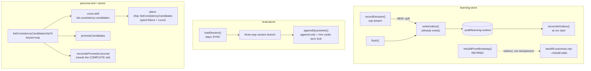

# Plan: Honest failure across the learning / brainstorm / persona-promote seams

- **Date**: 2026-08-01
- **Status**: Draft
- **Author**: Claude + Lbstrydom
- **Scope**: backend
- **Implements**: the 7 open entries in
  [`refactor-learning-persona-quickfix-2026-07.md`](refactor-learning-persona-quickfix-2026-07.md) §0
- **Closes**: tech-debt topicIds `222b036e`, `191fca35`, `f1a716cf`,
  `e0623c0a`, `e51bacd2`, `fa86b341`, `bbd58a09`
- **Target domain(s)**: `learning-store`, `brainstorm`, `persona-test`,
  `cross-skill-bridge`, `stores`, `shared-lib`
- ⚠ **Cross-domain work** — touches 6 domains. All six are *existing*
  intra-domain edits plus one already-declared bridge hop
  (`cross-skill-bridge → stores`); no new domain edge is created. See §6.

---

## 1. Context Summary

**Scope**: backend · **Stack**: `js-ts` (+ postgres) · no Python.

### The shared invariant (stated once, not fixed three ways)

Five of these seven entries are the same defect wearing different clothes:

> **An un-done or failed job reports success.**

- `222b036e` — a decision is evicted and lost; the caller gets a
  `decisionKey` back as if it were queued.
- `191fca35`/`f1a716cf` — a rebuild that never ran its heuristic returns
  `{ok:true}` and overwrites the cache with inert weights.
- `e0623c0a` — a record the loader cannot interpret is accepted, and
  affirmatively mislabelled as a legacy record it is not.
- `bbd58a09` — a truncated page reads as the complete candidate list.

This is the identical shape that [`refactor-failure-contract.md`](refactor-failure-contract.md)
closed for the *other* fourteen entries in the parent triage. **This plan
does not build a shared mechanism for it** — the four sites have genuinely
different substrates (an in-memory queue, a cache file, a JSONL line, a SQL
page) and a common abstraction over them would be the over-engineering
cliff. What they share is a *rule*, applied four times:

> **A caller must be able to distinguish "nothing was there" from "we could
> not tell."** Where those two states are currently one value, split them.

`e51bacd2`/`fa86b341` (locking) are a different defect class and are
treated as such.

### Code Trace

Read this session, in this order:

- [`scripts/lib/learning/decision-logger.mjs`](../../scripts/lib/learning/decision-logger.mjs)
  — full read. `recordDecision` `:219` → cap breach `:240` → `queue.shift()`
  `:242` + `bumpDropped` `:243` + `throttledWarn` `:244`. Compared against
  the same module's `flush()` `:308` → local branch `:349`
  `writeOutbox(entry, outboxDir)` → on failure `summary.retained` `:353`
  and splice-back `:361-373`. `writeOutbox` `:454` is **synchronous**
  (`atomicWriteFileSync`), and `reconcileOutbox` `:388` already replays the
  directory at run start.
- [`scripts/lib/learning/quickfix-stats.mjs`](../../scripts/lib/learning/quickfix-stats.mjs)
  `:165-209` `rebuildFromBootstrap` → no `child_process` import in the
  module at all; `outcome: 'no_action'` hardcoded `:188`; `writeAtomic`
  `:207` unconditional; `{ok:true}` `:208`. Cross-checked against
  `aggregateDecisions` `:237-262`: `'no_action'` bumps `totalHits` only,
  never `alpha`/`beta` — so the written cache is **inert**, not merely weak.
- [`scripts/learning/backfill-outcomes.mjs`](../../scripts/learning/backfill-outcomes.mjs)
  `:1-60` + `:868-939` — **this is the finding that reshapes items 2+3**.
  It already implements the exact heuristic `rebuildFromBootstrap`'s
  docstring promises: same `.audit/quickfix-hits.jsonl` source, same
  `STALENESS_MS = 30 * 60 * 1000` `:58`, same `HOOK_IGNORE_MARKER` `:59`,
  and the full four-way detector at `:909` (`file-deleted`→accept), `:922`
  (`snippet-removed`→accept), `:934` (`ignore-marker-found`→suppress),
  `:939` (`still-present-no-marker`→ignore). It shells to git (`:751`),
  and it already carries `--rebuild-stats` to refresh the same cache.
- [`scripts/lib/brainstorm/session-store.mjs`](../../scripts/lib/brainstorm/session-store.mjs)
  — full read. Guard `:188`; V1 synthesis `:196-215` overwriting
  `schemaVersion: 2` `:201` *before* `safeParse` `:207`;
  `appendQuarantine` `:229-263` read `:248` → combine `:254` → trim `:255`
  → `atomicWriteFileSync` `:259`; `appendSession` `:84` takes
  `withFileLock`, `loadSession` `:150` takes none.
- [`scripts/lib/file-lock.mjs`](../../scripts/lib/file-lock.mjs) — only
  `withFileLock` (async) `:238` is exported; the underlying
  `tryAcquireLock` `:69` and `safeRelease` `:208` are **synchronous** and
  module-private.
- [`scripts/persona-consistency-promote.mjs`](../../scripts/persona-consistency-promote.mjs)
  `:221-230` `listConsistencyCandidatesViaCli` (`limit: 100`, no cursor) →
  two callers: `promoteCandidates` `:343` and `reconcilePromotionJournal`
  `:590`.
- [`scripts/cross-skill.mjs`](../../scripts/cross-skill.mjs) `:479-487`
  `cmdListConsistencyCandidates` — passes `sinceTs` + `limit` only; **no
  offset/cursor parameter exists**.
- [`scripts/lib/store/plans-ship.mjs`](../../scripts/lib/store/plans-ship.mjs)
  `:345-376` `listConsistencyCandidates` — `LIMIT` only, and `catch → []`
  at `:374`.

### Three findings the parent triage did not have

**(A) Items 2+3 are a duplicate of working code, not a missing feature.**
`backfill-outcomes.mjs` already does the job, is already wired to the
weekly cron and `npm run learning:backfill-outcomes`, and already rebuilds
the same cache. `rebuildFromBootstrap` is a second, stubbed implementation
of one capability — a Single-Source-of-Truth violation (#10) and dead code
(#9). This moves the honest answer from "implement it or label the stub"
(the two options the task named) to a third: **retire it and redirect**.
Recorded here because it is a scope judgement, not a mechanical fix.

**(B) `bbd58a09`'s real severity is above MEDIUM — truncation causes a
*wrong action*, not a missed one.** In `reconcilePromotionJournal` `:641`,
`stillCandidate` is computed from `candidateByFingerprint.has(...)` over a
map built from the same truncated 100-row page `:590-593`. A pending
journal entry whose candidate sits beyond row 100 is therefore read as
**"not a candidate any more" → "the DB committed" → complete the rename and
delete the journal** `:653-666`. The spec file is moved into place and the
recovery record destroyed, while the DB row is still an unpromoted
candidate. That is silent state corruption, reachable without any DB error.
Verified by reading the branch, not inferred from the entry text.

**(C) The Theme-1 failure-contract fix is one layer short.**
`interpretCandidateListResult` faithfully reports what the CLI hands it —
but `plans-ship.mjs:374` converts a DB exception into `return []`, and the
CLI then emits a clean `{ok:true, candidates:[]}`. So a store-layer failure
still presents as a genuine empty list. Entries `4294a043`/`6b6263b8` are
recorded closed; the *bridge* layer they name is fixed, the *store* layer
underneath is not. **In scope by impact, not authorship** (AGENTS.md): the
pagination loop this plan adds terminates on a short page, so a loop built
over a function that returns `[]` on error would stop early and report a
complete list — the fix cannot be correct without this.

### Patterns reused vs new

| Reused (no new abstraction) | Where it already lives |
|---|---|
| Outbox spill + replay | `decision-logger.mjs::writeOutbox` / `reconcileOutbox` |
| Git-archeology outcome detection | `backfill-outcomes.mjs` (item 2+3 redirects to it) |
| Sync lock acquire/release | `file-lock.mjs::tryAcquireLock` / `safeRelease` (private) |
| Typed `{ok:true,…}｜{ok:false,error}` result | `quickfix-stats.mjs::readQuickfixDecisions` |

**One genuinely new thing**: a `withFileLockSync` export in
`file-lock.mjs`. Justified in §6.

### Neighbourhood considered

`get-neighbourhood` returned 8 records, **all `review` band**
(`bandReason: below-noise-floor`) — every hit was one of the target symbols
itself (`appendQuarantine`, `loadSession`, `flush`, `reconcileOutbox`,
`rebuildFromCloud`, `promoteOne`, `reconcilePromotionJournal`,
`quarantinePath`). Nothing above this repo's noise floor, i.e. no
near-duplicate to reuse. Expected: this plan modifies existing symbols and
introduces one new exported function. The `flush`/`reconcileOutbox` hits
are what led to the item-1 reuse decision above.

### Past incidents to verify against

| Incident | Status | Bearing on this plan |
|---|---|---|
| **INC-001** — lexical path classification bypassed by symlink | `manual-verification-required` | Item 1 writes a file whose name derives from `entry.decisionKey` (hashed, `:456`) into a fixed dir — no caller-controlled path component. No new exposure. Item 2+3 **removes** a filesystem read path. Confirm no new path is built from untrusted input. |
| **INC-002** — test suite wiped production via an unverified DSN | `manual-verification-required` | Item 7 touches store-layer SQL. The new tests must not point at a real DSN; `assertDisposableDbUrl` already gates the integration suites. Keep item 7's store tests **pure** (SQL-shape assertions), not live-DB. |

Neither incident's mitigation is failing; both are recorded as
`manual-verification-required`, so §9 restates the relevant checks rather
than assuming them.

---

## 2. Proposed Architecture



### Key design decisions

**Item 1 — `222b036e`: spill on eviction, reusing the module's own outbox.**
`recordDecision` stays synchronous; `writeOutbox` already is. On cap breach,
spill the evicted entry before dropping it, mirroring `flush()`'s
local-runtime branch. In CI, do **not** write an outbox (the runtime is
ephemeral and `flush()` deliberately skips it there) — count it instead.
Replace the single `_droppedCounts` with two counters so the flush summary
stops conflating *spilled-and-recoverable* with *gone*: `evictedOutboxed`
and `evictedLost`. `reconcileOutbox` needs **no change** — it already
replays whatever is in the directory. *(#15, #16, #19)*

**Items 2+3 — `191fca35`/`f1a716cf`: retire, don't reimplement.**
`rebuildFromBootstrap` becomes a refusal that names the working command:

```js
return { ok: false, totalHits: 0, patternCount: 0, error: 'bootstrap-retired',
         hint: 'run: npm run learning:backfill-outcomes -- --rebuild-stats' };
```

It writes **nothing** — the current code's worst behaviour is overwriting a
cloud-built cache with inert weights, and a retired path must not do that.
The JSONL-parsing body and the `HITS_JSONL_PATH` constant are deleted (#9),
and `cross-skill.mjs`'s `--bootstrap` dispatch surfaces the same redirect
rather than silently succeeding. *(#1, #9, #10, #19)*

**Item 4 — `e0623c0a`: three-way, and stop lying in `_synthesised`.**

| `schemaVersion` | Branch | Rationale |
|---|---|---|
| `=== 2` | V2 validate | unchanged |
| key **absent** | V1 synthesis | V1 predates the field |
| anything else (`3`, `"3"`, `null`, `false`, `{}`) | quarantine, `reason: unsupported-schema-version-<json>` | present-but-unsupported is neither |

The task asked whether a legitimate V1 record can carry a *falsy*
`schemaVersion`. **Checked**: across the 43 live records in
`.brainstorm/sessions/`, `0` lack the key and `43` have exactly `2` — no
record carries a falsy-but-present value, and a V1 writer never wrote the
key at all. So key-absence is the correct V1 test. The V1 path is retained
for consumer repos (#18). `_synthesised` is only stamped on records that
were genuinely synthesised. *(#12, #18, #19)*

**Items 5+6 — `e51bacd2`/`fa86b341`: one lock protocol over every mutation.**
`loadSession` **stays synchronous** (4 call sites: `brainstorm-round.mjs:615`,
`resume-context.mjs:121`, and tests — making it async ripples through all of
them for a diagnostic file).

> **R1-H1 correction — an append-only design does NOT remove this race.**
> The first draft of this plan proposed `fs.appendFileSync` (O_APPEND) plus a
> separately-locked opportunistic trim, claiming that removed the race at the
> root. **It does not.** O_APPEND serialises appends against *other appends to
> the same inode*; it gives no protection against the trim, which reads a
> snapshot and then `rename()`s a replacement file over it. An append landing
> after the trim's read but before its rename goes to the *old* inode and
> vanishes when the new file replaces it. The draft narrowed the window and
> called it closed — the exact band-aid-as-root-fix move AGENTS.md's
> right-sizing rule exists to catch, and it is recorded here rather than
> silently corrected.

**Every mutation of the quarantine file participates in one lock protocol.**
`appendQuarantine` acquires `withFileLockSync`, then appends *and* enforces
the cap inside that one critical section, releasing in `finally`. There is no
unlocked write path.

Contention is where the never-throw contract meets this plan's own invariant.
A caller that cannot acquire the bounded lock **must not** write concurrently
with a trimmer, and **must not** silently pretend it recorded the line.
`appendQuarantine` therefore returns a typed, non-throwing result —
`{recorded:true, count}` or `{recorded:false, reason:'lock-contention'}` —
and `loadSession` folds a `recorded:false` into its existing stderr warning
line. Nothing throws; nothing lies. *(#2, #14, #15, #16)*

**Item 7 — `bbd58a09`: two different questions, two different queries.**

> **R1-H2 correction — pagination is the wrong tool for the reconcile path.**
> The first draft paginated one global candidate list and fed it to both
> callers. Keyset pagination fixes OFFSET skew, but **a sequence of pages is
> not a snapshot**: rows can be created, promoted, or leave candidate status
> between page 1 and page N. So `complete:true` would still have been a false
> statement about the state `reconcilePromotionJournal` makes an irreversible
> rename-and-journal-delete decision on. That trades a truncation bug for a
> concurrency-dependent completeness bug — strictly harder to reproduce, no
> safer. The two callers are asking genuinely different questions, and the
> draft's single shared query was the actual design error.

| Caller | Question | Query |
|---|---|---|
| `promoteCandidates` | "what is pending, for a human to approve?" | paginated enumeration — an approximate, point-in-time view is *fine* here |
| `reconcilePromotionJournal` | "for these N specific fingerprints, what is each one's state?" | **targeted batch resolution**, bounded by N |

1. **Store** (`plans-ship.mjs`) — two operations.
   (a) `listConsistencyCandidates` gains a keyset cursor (contract in §7),
   **not `OFFSET`**: `ORDER BY created_at DESC` + `OFFSET` is unstable under
   concurrent inserts and would re-introduce the silent-loss class being
   fixed. (b) A **new** `resolveCandidateStatesByFingerprint(repoId,
   fingerprints[])` returning `candidate｜promoted｜absent` per fingerprint
   from one `= ANY($2)` query, chunked only to the parameter limit. Both fix
   `catch → []` to a typed failure (finding **C**). *(#15, #17)*
2. **CLI** (`cross-skill.mjs`) — thread `cursor` through the list command;
   add a command for the batch resolver. Both propagate typed failure.
3. **Callers** (`persona-consistency-promote.mjs`) —
   `reconcilePromotionJournal` asks the batch resolver about exactly the
   fingerprints it holds journals for (a handful, never paginated) and acts
   **only** on a definitive per-fingerprint answer; any typed failure or
   `unknown` leaves that journal untouched via the existing safe path
   `:629-633`. This closes finding **B** without depending on completeness at
   all — the bounded question has a bounded, consistent answer. *(#12, #15, #16)*

**R1-H3 — a promoted prefix is a first-class outcome, not a warning.**
The draft let `promoteCandidates` "warn and continue" on the page cap. A
warning is not a machine-readable terminal state, which contradicts this
plan's own §1 invariant. `promoteCandidates` may safely promote the bounded
prefix, but must then report it as such: `EXIT.PARTIAL_FAILURE` (2 — already
in the `EXIT` enum, already meaning "some succeeded, some didn't"), an
`incomplete: true` field plus `promoted`, `remaining` and `nextCursor` in the
`--out` JSON, and a stderr line naming the exact resume command. `ok:true`
with exit 0 is reserved for a genuinely exhausted list. *(#15, #19)*

---

## 3. Sustainability Notes

- **Assumption that could change**: that `backfill-outcomes.mjs` remains the
  single owner of quickfix outcome resolution. If a second consumer ever
  needs it programmatically, extract the detector — do not re-stub a copy.
  The retirement message is the seam that makes the next person ask.
- **Assumption**: the quarantine cap is diagnostic. If it ever becomes
  load-bearing, the opportunistic trim must become mandatory and
  `appendQuarantine`'s never-throw contract has to be revisited together
  with it.
- **Coupling**: item 7 loosens it (the store stops lying to three callers);
  items 1 and 4 leave it unchanged; items 2+3 remove a coupling entirely.
- **Deliberate non-abstraction**: four sites get the same *rule*, four
  different implementations. Recorded in §1 so a future reader sees this was
  a decision, not an oversight.

### Right-sizing gate

| # | Band-aid | Over-engineered | **Chosen** — and the current requirement |
|---|---|---|---|
| 1 | Raise `LEARNING_QUEUE_CAP_PER_TYPE`; loss resurfaces at the new cap | Disk-backed ring buffer / SQLite spill queue with its own reconciler | **Call the module's existing `writeOutbox` at the eviction site.** New code = one call + one counter split. The outbox, its writer and its replayer all already exist and are already wired. |
| 2+3 | `console.warn('stub')`, keep returning `ok:true` | Implement git archeology inside `quickfix-stats.mjs` — a second detector that can diverge from `backfill-outcomes.mjs`'s | **Retire and redirect.** Deletes code. The capability is not lost: it already exists, already runs weekly. |
| 4 | Loosen `typeof === 'number'` to truthy — still two-way, still wrong for `null` | Version-negotiation framework with per-version adapters | **A three-way branch.** The current requirement is exactly three cases; there is no second supported version to negotiate between. |
| 5+6 | Leave it — "best effort" already; **or the draft's append-only + separate trim, which only narrows the window (R1-H1)** | Make `loadSession` async, ripple through 4 call sites + tests | **One sync lock over every mutation, + a typed non-throwing contention result.** The lock is what actually closes it; the typed result is what keeps the never-throw contract from becoming a silent lie. |
| 7 | `limit: 1000` | Generic cursor-pagination framework across every store list function; **or the draft's one-paginated-list-for-both-callers, which makes an irreversible decision on a non-snapshot (R1-H2)** | **Two queries for two questions**: keyset pagination for human enumeration, a bounded `= ANY` batch resolve for reconcile. The batch query is *smaller* than pagination and needs no completeness claim at all. |

**Manual vs scripted**: all edits are judgement-heavy and site-specific
across 6 files. **By hand** — a codemod here would be the over-engineering
cliff.

---

## 4. Security Considerations

- **INC-001 (path canonicalisation)**: item 1's outbox filename is
  `${ts}-${sha256(decisionKey).slice(0,12)}.json` under a fixed dir — no
  caller-controlled path segment, no new symlink surface. Item 2+3 deletes
  a filesystem read. Item 5+6 keeps `quarantinePath`'s existing derivation
  (`validateSid` already gates the `sid`). **No new path is constructed
  from untrusted input in this plan** — assert this in review rather than
  assuming it.
- **INC-002 (destructive DSN)**: item 7's store change must be covered by
  **pure** SQL-shape tests, not live-DB tests. No new `DROP`/`TRUNCATE`
  anywhere. Do not add `AUDIT_DB_TEST_URL` usage.
- Item 1 spills decision payloads to disk. `context`/`choice` are
  audit-metadata, already written to the same outbox by `flush()` on the
  same path — no new class of data reaches disk.

---

## 5. Execution Model

Dependencies are almost entirely absent — the four subsystems do not call
each other. The one real chain is **inside item 7**: store → CLI → caller
must land together, because a caller looping against an unpaginated store
would spin, and a store returning a typed failure to a CLI that expects an
array would break the bridge. Item 7 is therefore atomic: one commit, three
layers.

Everything else is independent and parallelisable.

---

## 6. Domain-boundary check

Consulted [`.audit-loop/domain-map.json`](../../.audit-loop/domain-map.json)
`_comment_allowedDeps`, `_adjudication_2026_07_20`, `_adjudication_2026_07_31`
before designing:

- **No `allowedDeps` entry is added by this plan.** The three edges recorded
  as *debt* (`shared-lib → audit-orchestration/…`, `stores → model-eval/
  persona-test`, `cross-skill-bridge → 11 domains`) must keep firing and are
  **not** touched or silenced here.
- Item 7's `cross-skill-bridge → stores` hop is pre-existing and already
  declared (`cross-skill.mjs` already imports `listConsistencyCandidates`);
  adding a cursor parameter changes no edge.
- **The one new export** — `withFileLockSync` in `file-lock.mjs` — lands in
  `shared-lib`, consumed by `brainstorm`. `brainstorm → shared-lib` is a
  normal downward dependency, not an inversion. Note `_comment_allowedDeps`
  debt (1) warns that `shared-lib` has accreted *feature coordinators*; a
  file-lock primitive is the opposite — a genuinely domain-neutral
  primitive, which is what `shared-lib` is for. It is also the same move
  `_adjudication_2026_07_31` L1/L3 made (`coverage-schema.mjs`,
  `canonical-hash.mjs`).
- Re-run `npm run arch:refresh` is **not** required (no file moves, no new
  modules — only a new export in an existing one).

---

## 7. File-Level Plan

**`scripts/lib/learning/decision-logger.mjs`** (modify) — spill on eviction.
- `recordDecision` `:240-247`: before `queue.shift()`, capture the evicted
  entry; if `!isCiEnv()` call `writeOutbox(evicted, OUTBOX_DIR_DEFAULT)`;
  count `evictedOutboxed` on success, `evictedLost` otherwise (and always
  in CI). Keep the throttled warn, make its text distinguish the two.
- Why: #15 (no swallowed loss), #16, #19. Reuses `writeOutbox` (#1).

**Flush-summary contract (R1-M3)** — this is a behavioural change to a
result shape, not a counter rename, so the semantics are pinned here:

| Field | Meaning after this change |
|---|---|
| `dropped` | **permanently lost only** — evicted and *not* durable anywhere. Narrowed from "evicted", which conflated recoverable with gone. |
| `evictedOutboxed` | new, additive — evicted from memory but spilled to the outbox, so recoverable by `reconcileOutbox` |
| `evictedLost` | new, additive — eviction where the spill failed or CI skipped it. Feeds `dropped`. |

**Consumer inventory (done, not deferred)**: `flush()`'s summary has **no
consumer outside `decision-logger.mjs` and `tests/learning-decision-logger.test.mjs`**
— verified by grep; the `bandit.flush()` hits in `evolve-prompts.mjs`,
`gemini-review.mjs` and `legacy-production-audit.mjs` are an unrelated method
on a different object. R1-M3's recommendation to keep a compatibility field
for one release and treat this as a versioned internal API is therefore
**over-engineering for an object with zero external consumers** — the finding
is accepted, the maximal remedy is not (AGENTS.md right-sizing). The
narrowing of `dropped` plus a summary-level regression test is the whole fix.

**`tests/learning-decision-logger.test.mjs`** (modify) — Tier-1 test-first.
- Cap breach outside CI writes exactly one outbox file whose content
  round-trips to the evicted entry; cap breach with `CI=1` writes none and
  increments `evictedLost`; an outbox write failure counts `evictedLost`,
  never throws out of `recordDecision`.

**`scripts/lib/learning/quickfix-stats.mjs`** (modify) — retire bootstrap.
- `rebuildFromBootstrap` → refusal object above; **no `writeAtomic` call on
  this path**. Delete the JSONL parse body and `HITS_JSONL_PATH`; drop it
  from `_internals` `:391`. Update the `@fileoverview` two-modes block
  `:10-13` and the `--bootstrap` line.
- Why: #9, #10, #19.

**`scripts/cross-skill.mjs`** (modify) — two unrelated edits.
- `cmdLearningQuickfixStats` `:2999-3001`: `--bootstrap` emits the redirect
  and a non-zero-signalling `ok:false`.
- `cmdListConsistencyCandidates` `:479-487`: accept + forward `cursor`,
  return `nextCursor` and propagate a store-layer typed failure as
  `emitError`, never as `{ok:true, candidates:[]}`.

**`tests/learning-quickfix-stats.test.mjs`** (modify) — assert the retired
path returns `ok:false` **and leaves an existing cache file byte-identical**
(the regression that matters most).

**Retirement migration contract (R1-M4)** — the draft only grepped
`package.json` and `.github/workflows/`. Full inventory, done now:

| Call site | Disposition |
|---|---|
| `scripts/cross-skill.mjs:3017` | emits the redirect; `ok:false` |
| `scripts/lib/learning/quickfix-stats.mjs:349` (own CLI `--rebuild --bootstrap`) | same redirect; `process.exit(1)` already fires on `!result.ok` |
| `tests/learning-quickfix-stats.test.mjs:209`, `:224`, `:241` | **assert the retired `{ok:true}` contract today — all three must be rewritten**, not merely left passing |

Result/exit policy: the retired path returns a **stable typed** refusal
(`error:'bootstrap-retired'` + `hint`) and exits non-zero, so an automation
consumer fails loudly rather than believing a rebuild happened. Add an
**end-to-end CLI test** driving `cross-skill.mjs learning-quickfix-stats
--action rebuild --bootstrap` that asserts the non-success result, the
redirect hint, the non-zero exit, and a byte-identical cache file. Update the
CLI's user-facing help/catalog text (`scripts/.cli-catalog.json:314` still
advertises the old behaviour).

**`scripts/lib/brainstorm/session-store.mjs`** (modify) — items 4, 5, 6.
- `loadSession` `:176-215`: three-way branch; `_synthesised` only on real
  synthesis. Signature unchanged (stays sync).
- `appendQuarantine` `:229-263`: acquire `withFileLockSync`; append **and**
  enforce `QUARANTINE_CAP` inside that one critical section; release in
  `finally`. No unlocked write path (R1-H1). Returns
  `{recorded:true, count}｜{recorded:false, reason:'lock-contention'}`;
  never throws. `loadSession` reflects `recorded:false` in its warning line.

**`scripts/lib/file-lock.mjs`** (modify) — export `withFileLockSync(lockPath, opts, fn)`
built from the existing private `tryAcquireLock` `:69` / `safeRelease` `:208`.
Bounded non-blocking attempts (no sleep loop — this is a sync path). Why:
#7, and it is the module that already owns this primitive (#10).

**`tests/brainstorm-session-store.test.mjs`** (modify) — the empirical repro
from §0 becomes a permanent test: `"3"`, `null`, `false`, `{}` each
quarantine with an `unsupported-schema-version` reason and never appear in
`rounds`; numeric `3` unchanged; a key-absent V1 record still synthesises;
contention returns `{recorded:false}` without throwing. **The concurrency
test spawns real child processes** (R1-H1) — a same-process "two interleaved
calls" test, which the draft proposed, cannot interleave inside a synchronous
critical section and would pass against the broken design.

**`scripts/lib/store/plans-ship.mjs`** (modify) — `listConsistencyCandidates`
`:345-376` gains the cursor contract below; a **new**
`resolveCandidateStatesByFingerprint` serves reconcile (R1-H2). Both `catch`
paths return `{ok:false, error}` instead of `[]` (finding **C**). This changes
the return type — **audit every caller** before landing (#18).

**Cursor contract (R1-M1)** — owned by the store boundary, so the CLI and the
caller treat cursors as opaque:

| Aspect | Decision |
|---|---|
| Order | `ORDER BY created_at DESC, id DESC` — `id` breaks ties; without it equal timestamps can duplicate or skip |
| First page | no cursor → no continuation predicate |
| Continuation | strict lexicographic: `(created_at, id) < ($cursorTs, $cursorId)`, as a row-comparison, bound as parameters — never interpolated |
| Encoding | versioned `base64url(JSON)` `{v:1, ts, id}`; `ts` canonical UTC ISO-8601 with the column's full precision; `id` canonical UUID string |
| Validation | Zod-parsed on receipt; malformed / wrong-version / oversize (>512 B) → typed `{ok:false, error:'invalid-cursor'}`, never a raw DB error |
| Page size | `CANDIDATE_PAGE_SIZE = 100` (named constant, unchanged from today's effective limit) |
| Page cap | `CANDIDATE_MAX_PAGES = 50` (⇒ 5 000 candidates) — bounds a pathological loop; hitting it is the `incomplete:true` outcome above, never a silent stop |
| Non-advancing cursor | a page whose last row equals the cursor it was fetched with is a typed failure, not a re-loop |

**`tests/plans-ship-consistency-candidates.test.mjs`** (create — R1-M2;
verified absent, `plans-ship-persona-correlation.test.mjs` covers correlation
only). Pure store tests over a **mocked query executor** — no DSN, no live DB
(INC-002). Assert: exact first-page vs continuation SQL and parameter
*binding* (not interpolation); equal-timestamp ties neither duplicate nor
skip; next-cursor derivation; malformed/oversize/wrong-version cursor →
typed failure; a DB throw → typed failure, never `[]`; the batch resolver's
`= ANY` chunking at the parameter limit. Caller-level fakes cannot catch a
bad SQL predicate — that is exactly why this file exists.

**`scripts/persona-consistency-promote.mjs`** (modify) —
`listConsistencyCandidatesViaCli` `:221-230` loops on the cursor to
`CANDIDATE_MAX_PAGES`, returning `{ok, candidates, complete, nextCursor}`.
`interpretCandidateListResult` `:131` accepts and validates `nextCursor`.
`promoteCandidates` `:343` promotes the prefix but exits
`EXIT.PARTIAL_FAILURE` with `incomplete:true` + resume command when
`complete:false` (R1-H3). `reconcilePromotionJournal` `:590` **stops using
this list entirely** — it calls the batch fingerprint resolver for the
journals it holds and acts only on definitive answers (finding **B**,
R1-H2).

**`tests/persona-consistency-promote.test.mjs`** (modify) — a 250-candidate
fake returns all 250 with `complete:true`; a mid-loop page failure yields
`ok:false`, never a short `ok:true`; hitting the page cap yields
`incomplete:true` + exit 2 + a resume cursor; and
`reconcilePromotionJournal` resolves via the batch query, leaving journals
untouched on any typed failure or `unknown`.

**`docs/runbooks/learning-system.md`** (modify) — document the eviction
spill next to the existing flush-failure outbox path, and record the
bootstrap retirement + its replacement command.

### 7b. Implementation Phases

- **Phase 1 — Eviction spill**: item 1. Files:
  `scripts/lib/learning/decision-logger.mjs` (modify),
  `tests/learning-decision-logger.test.mjs` (modify).
- **Phase 2 — Retire bootstrap**: items 2+3. Files:
  `scripts/lib/learning/quickfix-stats.mjs` (modify),
  `scripts/cross-skill.mjs` (modify),
  `tests/learning-quickfix-stats.test.mjs` (modify).
- **Phase 3 — Sync lock primitive**: enabling work for Phase 4. Files:
  `scripts/lib/file-lock.mjs` (modify), `tests/file-lock.test.mjs` (create
  — verified absent; `withFileLock` currently has no direct unit test, only
  incidental coverage in `tests/maintenance-checks.test.mjs`, so this phase
  adds the module's first dedicated suite).
- **Phase 4 — Session-store honesty + locking**: items 4, 5, 6. Files:
  `scripts/lib/brainstorm/session-store.mjs` (modify),
  `tests/brainstorm-session-store.test.mjs` (modify).
- **Phase 5 — Candidate enumeration + targeted reconcile**: item 7, all three
  layers together. Files: `scripts/lib/store/plans-ship.mjs` (modify),
  `scripts/cross-skill.mjs` (modify),
  `scripts/persona-consistency-promote.mjs` (modify),
  `tests/plans-ship-consistency-candidates.test.mjs` (create),
  `tests/persona-consistency-promote.test.mjs` (modify).
- **Close-out (not a phase)**: `npm test`, `npm run check`, then
  `node scripts/debt-resolve.mjs <topicId> --rationale "Fixed by commit <sha> …"`
  for all 7 topicIds — **one attributable commit sha per entry, no
  unattributed resolutions**.

> `scripts/cross-skill.mjs` appears in Phases 2 and 5. The two edits are in
> unrelated command handlers (`cmdLearningQuickfixStats` vs
> `cmdListConsistencyCandidates`) with no shared state; if the clusters are
> executed non-contiguously, land Phase 2's edit first.

---

## 8. Risk & Trade-off Register

| Risk | Likelihood | Mitigation |
|---|---|---|
| **Finding C's return-type change breaks an unaudited caller of `listConsistencyCandidates`** | Medium | Grep every caller before landing Phase 5; currently only `cross-skill.mjs:483`. This is the highest-risk edit in the plan. |
| Retiring bootstrap breaks a consumer's muscle memory or a synced script | Low | Redirect message names the exact replacement; grep `package.json` + `.github/workflows/` for `--bootstrap` in Phase 2. |
| Sync disk write on `recordDecision`'s hot path | Low | Only at cap breach (64 same-type entries), and `flush()` already does per-entry sync writes on the same path. |
| Opportunistic trim lets the quarantine file exceed `QUARANTINE_CAP` | Low, accepted | Diagnostic bound; overshoot is bounded by contention duration and self-corrects on the next uncontended load. Documented in the code. |
| Keyset cursor mis-implemented → infinite loop or tie-skew | Low | `CANDIDATE_MAX_PAGES` cap, a non-advancing cursor treated as a typed failure, and an equal-timestamp tie test (R1-M1/M2). |
| Sync lock in `appendQuarantine` deadlocks or stalls `loadSession` | Low | Bounded non-blocking attempts, no sleep loop; contention returns a typed result rather than waiting. Covered by the child-process test (R1-H1). |
| Another session is editing this tree concurrently | **High — observed** | Commit path-scoped; never `git add -A`. |

**Deliberately deferred**: `b093444897a3`; the `dashboard → scripts` edge
(owned by [`dashboard-skills-index-layering.md`](dashboard-skills-index-layering.md));
extracting `backfill-outcomes.mjs`'s detector into a shared module (no
second consumer exists — YAGNI).

---

## 9. Testing Strategy

**Tier 1 (test-first)** — all five phases. Every phase's test lands in the
same commit as its change.

Edge cases that must be covered, because each is a way the fix could pass
review and still be wrong:

1. Eviction with `writeOutbox` **failing** — counted, never thrown.
2. Eviction under `CI=1` — no outbox file at all.
3. Flush summary: `dropped` counts only permanently-lost, across a normal
   flush, a successful spill, a CI eviction and a failed spill (R1-M3).
4. Retired bootstrap over an **existing populated cache** — file unchanged
   byte-for-byte; plus the e2e CLI test and the three rewritten call-site
   assertions (R1-M4).
5. `schemaVersion: {}` and `[]` — objects/arrays, not just the four probed
   scalars.
6. A key-absent V1 record — still synthesises (backward compat, #18).
7. **Concurrent `appendQuarantine` across real OS processes** — a same-process
   test cannot demonstrate R1-H1's race (synchronous JS never interleaves
   inside the critical section), so this must be a **child-process** test:
   spawn N writers against one session, assert every line survives. A test
   that can only pass is not evidence.
8. Lock contention → `{recorded:false, reason:'lock-contention'}`, no throw,
   and the warning line reflects it.
9. Equal-`created_at` ties across a page boundary — neither duplicated nor
   skipped (R1-M1).
10. Malformed / wrong-version / oversize / non-advancing cursor → typed
    failure (R1-M1).
11. Store throws mid-loop → `ok:false`, never a short `ok:true`.
12. Page cap reached → `incomplete:true`, `EXIT.PARTIAL_FAILURE`, resume
    cursor present (R1-H3).
13. Batch resolver returns a typed failure or `unknown` for a fingerprint →
    `reconcilePromotionJournal` performs **no** rename and **no** journal
    deletion for it (finding **B**, R1-H2).

**Not doing**: live-DB tests for Phase 5 (INC-002). **Not doing**: an
empirical browser verify — no browser-driving skill is touched.

---

## 10. Execution Clustering

- **Cluster A** — Phases 1–2 — fix-gate: `yes`
  - Coupling: both are `learning-store` reliability edits to the same
    subsystem's telemetry path, sharing the outbox/cache-durability seam —
    Phase 1 makes the outbox load-bearing for a second producer, Phase 2
    removes a writer of the sibling cache. An auditor should see them
    together to check that "spill" and "refuse to write" agree about what
    durable means.
  - author-tier: `standard`
- **Cluster B** — Phases 3–4 — fix-gate: `yes`
  - Coupling: Phase 3 exists **only** to serve Phase 4 — `withFileLockSync`
    has exactly one consumer, `appendQuarantine`. Splitting them would ship
    an unused export and hide the seam that matters (whether a sync lock is
    the right primitive for a never-throw caller).
  - author-tier: `standard`
- **Cluster C** — Phase 5 — fix-gate: `final`
  - Coupling: single phase, but three layers that must land atomically
    (§5). The cross-layer contract — a typed store failure surviving the
    CLI bridge into a loop that reports `complete` honestly — is exactly
    what the wiring pass should inspect.
  - author-tier: `frontier`
- **Final gate**: consolidated Gemini review over the union diff of
  Clusters A–C.

**Partition check**: Phases 1,2,3,4,5 — each in exactly one cluster, none
omitted, none duplicated. Close-out is excluded per §7b.

---

## Audit Trail

### Plan-audit Round 1 (GPT, `--mode plan`) — `NEEDS_REVISION`, H:3 M:4 L:0

All 7 triaged `valid` / `in-scope` / `fix-now`. **No rebuttal round** — none
was disputed on validity, so GPT deliberation would have been ceremony. Each
premise was verified against current source before acceptance (the repo's own
"an audit finding about code you did not just write is a hypothesis" rule);
all 7 held.

| ID | Sev | Verdict | Where it landed |
|---|---|---|---|
| H1 | HIGH | **Genuine design defect in the draft** — `O_APPEND` does not serialise an append against a read+rename trim, so the draft narrowed a race and claimed to remove it | §2 items 5+6 rewritten to one lock protocol + typed contention result; §3 right-sizing row corrected; §9 test upgraded to child-process |
| H2 | HIGH | **Genuine design defect in the draft** — a sequence of keyset pages is not a snapshot, so `complete:true` would still have been false for an irreversible decision | §2 item 7 split into two queries for two questions; reconcile now uses a bounded `= ANY` batch resolver and needs no completeness claim |
| H3 | HIGH | Valid — the draft violated this plan's own §1 invariant by reporting a partial promotion as a warning | §2: `EXIT.PARTIAL_FAILURE` + `incomplete:true` + resume cursor |
| M1 | MED | Valid — "keyset on (created_at,id)" was not implementable | §7 cursor-contract table |
| M2 | MED | Valid — verified no store test for this query exists | §7 new `tests/plans-ship-consistency-candidates.test.mjs` |
| M3 | MED | **Finding accepted, remedy right-sized** — `dropped` semantics were genuinely undefined, but the summary has zero consumers outside its own module and tests (verified), so a versioned-API compatibility field would be over-engineering | §7 flush-summary contract table + inventory |
| M4 | MED | Valid — verified 3 call sites incl. 3 tests asserting the retired contract | §7 retirement migration contract |

**Two of the three HIGHs were real bugs in my design, not rigor pressure** —
both were cases of narrowing a race/window and calling it closed, which is
precisely the band-aid-as-root-fix move AGENTS.md's right-sizing rule names.
Both corrections are recorded inline in §2 as `R1-Hn correction` blocks
rather than silently rewritten, so a reader can see what was wrong and why.

Ledger: 7 entries written to the session ledger and **verified persisted on
disk** — the first write attempt reported success while the schema silently
rejected every entry, which is the same false-success shape this plan exists
to fix.
