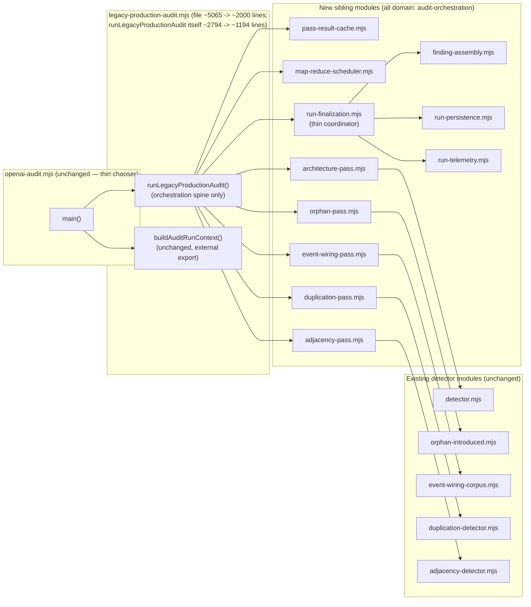

# Plan: Decompose `legacy-production-audit.mjs`

- **Date**: 2026-08-28
- **Status**: Approved — `/audit-plan` complete: GPT 5 rounds (absolute cap,
  24/24 findings accepted), Gemini 2 rounds (hard cap, both fixed,
  `architectural_coherence: Strong`). See Audit Trail at the bottom. Not
  yet implemented.
- **Author**: Claude + Louis
- **Scope**: backend
- **Target domain(s)**: `audit-orchestration`
- **Origin**: standing tech-debt ledger's #1 cluster by leverage (28 entries,
  leverage 9 — three times the next-highest cluster). Confirmed current via
  two independent signals, not the ledger alone: (1) the cluster's debt
  entries are dated 2026-07-24–07-26, all *after* the related
  [`audit-orchestrator-hardening.md`](./audit-orchestrator-hardening.md) plan
  shipped (2026-07-10, Complete) — this is not stale pre-hardening leftover
  debt, that plan covered a different, earlier round of hardening on the same
  file and never claimed to address module size; (2) the
  [Standing Queue Burndown](./standing-queue-burndown.md) plan's 2026-08-28
  pass independently re-surfaced the identical finding, unprompted, while
  triaging an unrelated queue.

## Neighbourhood considered

`get-neighbourhood` (targetPath: this file, k=8) returned 8 candidates, **all
from the file itself** — expected for a decomposition (there is no
duplicate-elsewhere to find; the neighbourhood IS the target). All banded
`review` (below the repo's noise floor). This confirms the shape below: 5 of
the 8 returned symbols (`runArchitecturePass`, `runOrphanIntroducedPass`,
`runEventWiringSymmetryPass`, plus their finding-conversion/scope-resolution
helpers) are exactly the pass-wrapper functions this plan extracts first.

## Past incidents considered

`get-incident-neighbourhood` returned INC-001 (symlink path-classification
bypass) and INC-002 (disposable-DSN test-safety gap), both at low relevance
(composite score ~0.47/0.46, no path overlap). Neither applies: this plan is
a pure code relocation inside one file's own module — it does not touch path
classification, DSN handling, or any trust boundary. No Security
Considerations section is warranted.

---

## 1. Context Summary

**What exists today.** `scripts/lib/audit/legacy-production-audit.mjs` is
**5,065 lines** (`wc -l`, pinned `40f9694b`). Its two production exports —
`runLegacyProductionAudit` and `buildAuditRunContext` — are the entire
orchestration body of the always-on 5-pass GPT audit pipeline.
`runLegacyProductionAudit` alone spans lines 2057–4850: **2,793 lines, 55% of
the file, in one function.**

**Correcting the debt ledger's own stated size.** Several of the 28 debt
entries (and this plan's own origin note above, before this correction) cite
"~1,600 lines." That figure is real but describes something else: the size
of `runMultiPassCodeAudit`'s body **inside `openai-audit.mjs`, before it was
extracted** into this file as a documented pure relocation (commit
`b0e72398`, this file's own docblock lines 1–37). The file then grew to its
current 5,065 lines through subsequent additions. The debt entries' category
descriptions (mixed CLI/cache/scheduling/provider/finding/ledger/learning
responsibilities) are accurate; only the size figure was stale.

**Code Trace** (pinned `40f9694b`, full inventory —
`scripts/lib/audit/legacy-production-audit.mjs`):
- `runLegacyProductionAudit` `:2057-4850` — the orchestrator (§2 below)
- `buildAuditRunContext` `:4886-5036` — CLI-args → `AuditRunContext` mapper (external export, keeps working)
- `runMapReducePass` `:685-926`, `runOneMapUnit` `:656-683`, `shouldMapReduce`/`shouldMapReduceHighReasoning` `:189-204`, `decideSeed` `:586-651`, `throwIfConfigError` `:560-566` — scheduling/provider-call cluster
- `initResultCache`/`cachePassResult`/`cacheWaveResults`/`cleanupCache`/`normalizeFindingsForOutput` `:249-347`, `collectReducePassStatuses` `:463-470` — cache-lifecycle cluster
- `runArchitecturePass` `:944-1088`, `groundArchFindingsToReport` `:1846-1884` (exported), `formatViolationsForPrompt` `:1885-1952`, `deriveFindingsFromReport` `:1953-2018` — architecture-intent pass
- `runOrphanIntroducedPass` `:1323-1409`, `resolveOrphanScopeRefs` `:1438-1465`, `orphanToStandardFinding` `:1098-1121` — orphan-introduced pass
- `runEventWiringSymmetryPass` `:1466-1560`, `eventWiringToStandardFinding` `:1137-1190` — event-wiring-symmetry pass
- `runDuplicationPass` `:1594-1728` — duplication pass
- `runAdjacencyPass` `:1729-1845` — adjacency pass
- `validateLedgerForR2` `:387-446`, `buildSuppressionStats` `:503-532` (exported), `tallyWriteOutcomes` `:1291-1322`, `writeLearningState` `:1268-1290` — ledger/durable-write/learning-sync cluster, mostly consumed inside the orchestrator's finalization tail

**Call sites — deliberately narrow, verified by grep, not assumed.** Only
**3 external imports** exist across the whole repo:
`scripts/openai-audit.mjs:96-98` imports `runLegacyProductionAudit,
buildAuditRunContext` (the only production call site — `openai-audit.mjs`'s
own comment at line 320 already calls itself a "thin chooser" between this
file and `tiered-pipeline.mjs`); `tests/tiered-pipeline-wiring.test.mjs:22`
imports `buildAuditRunContext`; `tests/arch-bouncer-grounding.test.mjs:15`
imports `groundArchFindingsToReport`. `buildSuppressionStats` is exported
but has no external importer found. **Every other symbol in the file is
internal-only** — this plan can freely move internals; only these 3 (4
counting `buildSuppressionStats`'s export contract) need their import paths
kept working, either by re-export or by updating the 2 test files' imports.

**Patterns reused, not invented.** This file's own docblock documents the
exact convention this plan follows one level down: when it was extracted
from `openai-audit.mjs`, mode-agnostic primitives needed by other CLI modes
went to a **third, neutral module** (`llm-helpers.mjs`) specifically to avoid
a two-file import cycle, and the caller (`openai-audit.mjs`) became a "thin
chooser" — orchestration-body-only concerns moved, CLI-presentation concerns
(`--out`/`--json`, `printAuditResult`) stayed behind.
`scripts/lib/audit/findings-pipeline.mjs` shows the same shape one layer
down: its header states it is "pure-data: NO I/O, NO telemetry" specifically
so it is reusable across pass types — this file already imports and uses it
(line 85). This plan reuses that identical convention rather than inventing
a new one (#1 DRY, #5 single source of truth).

**The natural boundary already exists.** 5 of the orchestrator's `run*Pass`
wrapper functions (architecture, orphan-introduced, event-wiring-symmetry,
duplication, adjacency) each call a **sibling detector module that already
lives in its own file** in this same directory (`detector.mjs`,
`orphan-introduced.mjs`, `event-wiring-corpus.mjs`,
`duplication-detector.mjs`/`duplication-report.mjs`,
`adjacency-detector.mjs`/`adjacency-report.mjs`/`adjacency-compose.mjs`).
These wrappers are not architecturally coupled to the orchestrator's local
state beyond the arguments already passed to them — they are prime,
low-risk, mechanical extractions.

## 2. Proposed Architecture

### Right-sizing gate (new structure: 12 new lib modules)

- **Band-aid**: extract only the 5 already-separable pass-wrapper functions
  (§1's natural boundary) and stop. Real debt reduction, but leaves the
  single biggest problem untouched — the finalization tail
  (`:3251-4850`, ~1,600 lines: cloud-record finalization, learning-state
  sync, cache telemetry, ledger writes) stays monolithic and is the harder,
  more valuable half of this decomposition.
- **Over-engineered**: a generic, config-driven pass-registration framework
  — dynamic pass loading, a plugin interface, declarative pipeline
  definitions. No current requirement asks for that generality: the wave
  sequence (Wave 1 → 1.5 → 1.5b → 1.5c → 2 → 3 → 4 → 5 → 6 → finalize) is
  fixed, known, and has been stable; building an abstract plugin system to
  run a sequence nobody varies at runtime is solving a problem this repo
  does not have.
- **Chosen**: extract the 5 pass-wrapper functions to sibling
  `<name>-pass.mjs` files next to the detector modules they already call
  (mirroring the file's own documented precedent), extract the
  cache-lifecycle and map-reduce-scheduling clusters (self-contained, no
  orchestrator-state coupling) to their own small modules, and split the
  ~1,600-line finalization tail into focused modules the orchestrator calls
  in sequence. `runLegacyProductionAudit` itself stays one function — a
  genuine orchestration spine, not further abstracted — following the
  "thin chooser" pattern already modeled one layer up in `openai-audit.mjs`.

### Component diagram

### Key design decisions

- **Extract by existing dependency, not by guessed boundary** (#1 DRY, #5
  single source of truth) — the 5 pass modules land next to the detector
  each already imports, so the new file's whole reason to exist matches an
  edge that already exists in the import graph.
- **Cache lifecycle and map-reduce scheduling are self-contained utility
  extractions** (#3 modularity) — neither reads orchestrator-local state
  beyond its own parameters; both are Tier-1-testable (deterministic, no
  LLM calls in the scheduling/cache logic itself).
- **The finalization tail is FOUR focused modules plus a thin coordinator,
  not one relocated god-function** (#3 modularity, #1 SOLID — corrected
  after round-1 audit finding M1, which correctly identified the original
  single-`run-finalization.mjs` draft as moving the god-module problem
  rather than solving it): finding/verdict assembly, ledger/run-record
  persistence, and learning/telemetry are three independently testable
  stages with genuinely different failure semantics (§4 Phase 4 below),
  called in a fixed order by a coordinator that owns only sequencing.
- **Every stage boundary is a validated `FinalizationContext`, not an
  informal object** (#2 no hardcoding, #11 testability — corrected after H1,
  which correctly noted that a missing JS object property degrades to
  `undefined`, not a construction-time failure, unless the boundary
  validates it): Phase 4a's first deliverable is the real enumerated field
  list (read from source, not guessed) plus a Zod schema and an
  entry-point validator per stage, so a malformed or incomplete context
  fails loudly before any write.
- **`runLegacyProductionAudit` is not split further than one spine function**
  — per the right-sizing gate, the wave-calling sequence itself is not a
  current source of duplication or reuse pressure; only the *mixed
  responsibilities inside it* were the debt.

## 3. Sustainability Notes

- **Assumption that could change**: the wave sequence (1 → 1.5 → 1.5b → 1.5c
  → 2 → 3 → 4 → 5 → 6) is currently fixed in code. If a future plan needs to
  make waves conditionally skippable or reorderable, the orchestration spine
  (post-decomposition, ~a few hundred lines of sequential calls) is the
  right place for that — the pass modules themselves stay agnostic to
  ordering.
- **6-months-out risk**: none of the 12 new modules introduce a new external
  contract — all stay `audit-orchestration`-domain-internal except the 2
  symbols `openai-audit.mjs` already imports (which keep re-exporting from
  the same file). A future consumer of an individual pass (e.g. a smaller
  "just run the duplication check" CLI) becomes possible without touching
  the orchestrator, but is not built here (no current requirement).
- **Extension points deliberately built in**: none beyond what already
  exists — this is a decomposition, not a redesign. Per the right-sizing
  gate, no new pluggability is added.
- **Coupling**: strictly reduces, governed by an explicit acyclic import
  policy (**corrected after round-2 M1, widened after round-3 M1** — the
  round-2 fix still omitted the two Phase 1–2 modules the component diagram
  and Phase 1–2 text always showed being imported directly):
  `legacy-production-audit.mjs` may import `pass-result-cache.mjs`,
  `map-reduce-scheduler.mjs`, the 5 pass modules, and `run-finalization.mjs`;
  `run-finalization.mjs` may import `finalization-contract.mjs` and the 3
  stage modules (`finding-assembly.mjs`, `run-persistence.mjs`,
  `run-telemetry.mjs`); each stage module may import
  `finalization-contract.mjs` and pre-existing domain primitives
  (`ledger.mjs`, `findings-pipeline.mjs`, etc.); pass modules may import
  only their named detector dependency and established shared primitives;
  `pass-result-cache.mjs`/`map-reduce-scheduler.mjs` import only established
  shared primitives, same as the pass modules. **Explicitly prohibited**:
  stage-to-stage imports (4b importing 4c, etc.), any new module importing
  back into `legacy-production-audit.mjs`, and any cycle. This is the exact
  allow-list §4's layering-guard test enforces — the earlier "none of the new modules
  import each other" was true only of the pass/cache/scheduler modules
  (Phases 1–3), never of Phase 4's necessarily-hierarchical finalization
  split.

## 4. File-Level Plan

### Pre-Phase-1 gate (not a phase — verification, like Close-out): requirements-layer check

**Added after round-2 M2.** `.requirements/ledger.json` already governs **84
requirements** whose `provenance`/`appliesTo` cite
`scripts/lib/audit/legacy-production-audit.mjs` (confirmed live —
`node scripts/requirements.mjs index` — e.g. `REQ-behavioural-114a24f1`,
"an adjacency audit without an audit-base diff contract must be treated as
not applicable... without running adjacency analysis solely to report
missing diff coverage," anchored to Wave 6). This is exactly the class of
load-bearing invariant a line-range-based extraction can silently drop —
the ownership manifest above tracks *code*, not the *behavioral contracts*
riding on it.

**Before Phase 1 starts**: re-run `node scripts/requirements.mjs extract
--files scripts/lib/audit/legacy-production-audit.mjs` (the 12 new target
paths do not exist yet, so only the source file is extractable at this
point) and `reconcile`, to get a current baseline against `40f9694b`. For
each of the resulting requirements whose `appliesTo` cites this file,
record which destination module (Phases 1–4's ownership manifest) now owns
the code the requirement's `provenance.anchor` points at, and name the
regression test that will assert it post-move — extending the
characterization-test fixture set (§5) rather than adding a parallel
mechanism. A requirement with no assignable destination is a signal the
ownership manifest itself has a gap (the same class of error round-2 H1
just caught) and must be resolved before Phase 1, not discovered after.

**At each cluster boundary, not only at the very end** (closes round-3
M4 — Clusters A and B are independently fix-gated per §7 and may ship
before Phase 4 starts, so a requirement whose provenance moved into a
Phase 1–3 file could go stale for an arbitrarily long window if the only
check is pre-Phase-1/post-Phase-4): re-run `extract --files` + `reconcile`
against the files Cluster A touched (`pass-result-cache.mjs`,
`map-reduce-scheduler.mjs`, plus the shrinking orchestrator) at Cluster A's
close, and again against Cluster B's 5 pass files at Cluster B's close —
each diffed against the pre-Phase-1 baseline for requirements whose
`provenance` cites the lines that cluster just moved. **After Phase 4
lands** (Cluster C): the same reconcile against all 12 new files + the
fully-shrunken orchestrator, diffed against the pre-Phase-1 baseline for
everything not already confirmed at the two earlier checkpoints. Any
requirement that silently disappeared at any checkpoint (rather than being
explicitly retired with a stated reason) is a regression the
characterization tests may not have been scoped to catch, and blocks that
cluster's fix-gate.

### Phase 1 — Extract cache lifecycle (independent, no orchestrator-state coupling)

- **`scripts/lib/audit/pass-result-cache.mjs`** (create): `initResultCache`,
  `cachePassResult`, `cacheWaveResults`, `cleanupCache`,
  `normalizeFindingsForOutput`, `collectReducePassStatuses` — relocated
  verbatim from `:249-347` / `:463-470`.
- **`scripts/lib/audit/legacy-production-audit.mjs`** (modify): replace the
  6 function bodies with imports from the new module; no call-site changes
  inside the orchestrator (same function names, same call shape).
- **`tests/pass-result-cache.test.mjs`** (create): relocate any existing
  cache-lifecycle assertions currently living in the orchestrator's own test
  coverage (find via `grep -l "initResultCache\|cachePassResult"
  tests/*.mjs` before assuming none exist); add coverage for the 2 functions
  the debt ledger's own `.audit/tech-debt.json` cites by name if not already
  covered.

### Phase 2 — Extract map-reduce scheduling (independent, no orchestrator-state coupling)

- **`scripts/lib/audit/map-reduce-scheduler.mjs`** (create):
  `shouldMapReduce`, `shouldMapReduceHighReasoning`, `decideSeed`,
  `throwIfConfigError`, `runOneMapUnit`, `runMapReducePass` — relocated from
  `:189-204`, `:586-683`, `:685-926`.
- **`scripts/lib/audit/legacy-production-audit.mjs`** (modify): replace with
  imports; wave call sites (Wave 1, 1.5b Wave-adjacent, 2, 3, etc. that
  invoke `runMapReducePass`) unchanged in shape.
- **`tests/map-reduce-scheduler.test.mjs`** (create): cover `decideSeed`'s
  policy and `shouldMapReduce*`'s thresholds directly (both currently
  test-exported per the explore agent's inventory — confirm via
  `__testExports` at `:5043-5065` before assuming a fresh test is needed vs.
  relocating an existing one).

### Phase 3 — Extract the 5 pass-wrapper functions (repeated pattern, one seam)

- **`scripts/lib/audit/architecture-pass.mjs`** (create): `runArchitecturePass`
  `:944-1088`, `groundArchFindingsToReport` `:1846-1884` (**exported —
  update `tests/arch-bouncer-grounding.test.mjs:15`'s import path**),
  `formatViolationsForPrompt` `:1885-1952`, `deriveFindingsFromReport`
  `:1953-2018`.
- **`scripts/lib/audit/orphan-pass.mjs`** (create): `runOrphanIntroducedPass`
  `:1323-1409`, `resolveOrphanScopeRefs` `:1438-1465`,
  `orphanToStandardFinding` `:1098-1121`.
- **`scripts/lib/audit/event-wiring-pass.mjs`** (create):
  `runEventWiringSymmetryPass` `:1466-1560`, `eventWiringToStandardFinding`
  `:1137-1190`.
- **`scripts/lib/audit/duplication-pass.mjs`** (create): `runDuplicationPass`
  `:1594-1728`.
- **`scripts/lib/audit/adjacency-pass.mjs`** (create): `runAdjacencyPass`
  `:1729-1845`.
- **`scripts/lib/audit/legacy-production-audit.mjs`** (modify): 5 wave
  call sites (Wave 1.5, 1.5b, 1.5c, 5, 6) become imports; no signature
  changes.
- **`tests/architecture-pass.test.mjs`, `tests/orphan-pass.test.mjs`,
  `tests/event-wiring-pass.test.mjs`, `tests/duplication-pass.test.mjs`,
  `tests/adjacency-pass.test.mjs`** (create, or relocate from wherever this
  logic is currently exercised — `grep -l` each function name across
  `tests/*.mjs` before assuming greenfield).

### Phase 4 — Extract the finalization tail as FOUR modules, not one (highest risk, most valuable)

**Revised after round-1 audit (M1, H1, H2, H3)** — the original draft
proposed a single `run-finalization.mjs` for the entire `:3251-4850` tail,
which M1 correctly identified as relocating the god-module problem rather
than solving it, with no defined data contract (H1), no defined ordering/
failure semantics (H2), and no executable parity test plan (H3). Phase 4 is
now four sub-phases: define the contract, then extract three genuinely
independent stages, then wire a thin coordinator — in that order, because
H1/H2's fixes are prerequisites for doing H3's characterization tests
correctly (you cannot write a parity test against an undefined contract).

**Phase 4a — Define the finalization contract as shared data + per-stage
capabilities, not one monolithic object (no code moves yet)**:
- Enumerate the tail's actual closed-over locals by reading
  `:2057-3251` (everything before the tail) — **the real field list, not
  the "~15 values" placeholder this draft used before it was checked
  against source.** For each field, record: name, type, whether it is an
  immutable snapshot (e.g. `ctx`, run identifiers) or a mutable accumulator
  the tail writes into (e.g. `mergedResult`), and which of 4b/4c/4d
  actually reads or writes it — this per-field consumer mapping is what
  the split below is built from.
- **Corrected after round-4 M1**: a single `.strict()` `FinalizationContext`
  covering every field forces 4b (a pure function, per its own Phase 4b
  description) to validate — and a test fixture to supply — the
  persistence/telemetry service handles it never touches, contradicting
  this plan's own "data-only fixture" claim; making those fields optional
  to fix that would instead weaken the "malformed context throws" guarantee
  for the stages that DO need them. Resolved by splitting the contract in
  two:
  - **`FinalizationDataSchema`** (`.strict()`): the shared, serializable,
    immutable INPUT snapshot the coordinator builds once — `ctx`, run
    identifiers, the raw pre-assembly `mergedResult`/`passRegistry`, and
    whatever else the enumeration above marks as shared data. No handles.
  - **Data flow, made explicit** (**closes round-5 H2** — "immutable
    snapshot" and "4b performs registry merge/ID assignment" are only
    reconcilable if stated precisely, which the round-4 draft did not do):
    nothing mutates `FinalizationData` in place. 4b receives it, and
    returns a NEW, separate `AssembledFindingsSchema` value (the merged
    registry, assigned IDs, suppression/verification results, computed
    verdict) — it does not write back into its input. The coordinator then
    builds `FinalizationData`'s downstream form by composing the original
    immutable fields with 4b's `AssembledFindings` output, and THAT
    composed value — never the pre-4b snapshot — is what 4c and 4d each
    receive alongside their own capability schema.
  - **Per-stage capability schemas** (`.strict()` each):
    `PersistenceServices` (4c's cache/DB/ledger-file handles),
    `TelemetryServices` (4d's learning-store/bandit handles) — non-
    serializable, injected only into the stage that uses them. 4b takes
    `FinalizationData` alone; 4c and 4d each take the POST-4b composed data
    plus their own capability schema (`PersistenceServices` /
    `TelemetryServices` respectively) — never each other's.
- **`scripts/lib/audit/finalization-contract.mjs`** (create): the schemas
  above, `.strict()` per this repo's own "Zod without `.strict()` is
  inert" lesson, one `validate*` entry-point function per schema — **the
  coordinator alone validates the full orchestration input** (constructing
  `FinalizationData` once) and passes each stage only its own slice, per
  M1's recommendation; a malformed or incomplete input still throws before
  any write, now scoped to exactly what each stage declares it needs. Also
  defines `FinalizationResultSchema` for what the coordinator returns to
  the orchestration spine (`generatorOutcomes`, `runStatus`,
  `writeOutcomes`, and whatever else the spine's return value needs —
  enumerated from the spine's actual `return` statement at `:4850`, same
  discipline as the input side).
- **`tests/finalization-contract.test.mjs`** (create, test-first per this
  file's Tier-1 status — the schemas are pure/deterministic): a missing
  required field is rejected on each schema independently; an extra
  undeclared field is rejected (`.strict()` doing its job); 4b's fixture
  constructs `FinalizationData` alone, with no capability handles faked —
  the concrete proof the split actually delivers the data-only-fixture
  guarantee this plan claims.
- **Characterization-test harness and golden-master baseline** (moved here
  from Phase 5 — closes round-3 H1's ordering contradiction; invocation
  seam corrected round-5 H1): the tail at `:3251-4850` is not itself an
  exported, independently-callable unit — it is inline body closing over
  `runLegacyProductionAudit`'s own locals — so the baseline is captured
  through the ONE seam that genuinely is callable today: the exported
  `runLegacyProductionAudit` itself, run end-to-end with the fixture/fake
  adapters (cache, ledger, durable-writer, learning-store, provider) wired
  in at their real injection points. For each of the 7 named scenarios,
  record the OBSERVABLE outputs the finalization behavior matrix makes
  claims about — the function's normalized return value, `runStatus`/
  verdict, the ordered persistence-call trace, and any thrown/propagated
  error — never internal-only state the tail doesn't expose. This is
  captured and committed before any of 4b/4c/4d's code moves, exactly as
  originally intended — round-3's contradiction was in the phase
  ORDERING, round-5's was in assuming an invocation seam that doesn't
  exist; both are now resolved by testing at the one real boundary.

**Phase 4b — `finding-assembly.mjs`** (create, depends on 4a's contract):
pass-result-registry assembly `:3251-3495`, run-wide finding-counter/id
assignment and registry-merge `:3496-3804` (**closes round-2 H1, boundary
corrected round-5 L1 — line 3496 was double-counted; the second range now
starts there, not the first also ending there**; this
range was omitted from the original draft's ownership assignment, an
enumeration gap, not a deliberate exclusion**), post-output suppression
`:3805-3831`, deterministic finding-verification gate `:3832-3936`,
shared-verdict computation `:3937-3975`. Pure function of
`FinalizationContext`'s data fields; no cloud/learning I/O. **Every byte of
`:3251-3975` is now explicitly owned by 4b — no gap.**

**Phase 4c — `run-persistence.mjs`** (create, depends on 4a): ledger and
audit-record persistence — `validateLedgerForR2` `:387-446`,
`buildSuppressionStats` `:503-532`, `tallyWriteOutcomes` `:1291-1322`,
commit-provenance gate evidence `:4373-4506`, cloud run-record
finalization `:4507-4606`, pass_selection backfill `:4607-4693`, Step 3.5b
ledger resolution `:4694-4777` — the write-shaped half of the tail.

**Phase 4d — `run-telemetry.mjs`** (create, depends on 4a): cache
telemetry `:3976-4092`, learning/pass-stats recording (local + cloud)
`:4093-4205`, `writeLearningState` `:1268-1290`, model-A/B/C shadow
observation `:4206-4258`, bandit-state flush `:4259-4372` — the
observation-only half; per this repo's own convention, a failure here must
never block or corrupt 4b/4c's results.

**Finalization behavior matrix** (closes H2 — the ordering and failure
contract, not just a prose list):

| Stage | Prerequisite | On cloud-off | On retryable failure | On permanent failure |
|---|---|---|---|---|
| 4b finding-assembly | validated context | runs (no cloud dependency) | N/A — pure function, no I/O | throws; coordinator aborts before 4c/4d |
| 4d run-telemetry | 4b's assembled result | recorded locally only | best-effort, logged, never retried; swallowed | logged, swallowed — **never** propagates to fail 4b/4c's already-committed result |

**4d's uniform fail-open row, evidenced per operation, not asserted from
one citation** (closes round-5 M1 — the round-4 draft cited only
`writeLearningState` for all 4 of 4d's operations): cache telemetry
(`:3976-4092`) is a pure read/report over already-in-memory state, so it
cannot fail in a way that needs a swallow policy at all — listed here only
for placement completeness, not because it shares a failure contract with
the other three. Learning/pass-stats recording and `writeLearningState`
itself (`:4093-4205`, `:1268-1290`) are the directly-evidenced case. Model-
A/B/C shadow observation (`:4206-4258`) is explicitly documented elsewhere
in this file as observation-only (its own docblock states the shadow "never
gates"), so fail-open is consistent with its existing design intent, not
newly asserted here. Bandit-state flush (`:4259-4372`) is the one operation
whose existing failure behavior Phase 4a's enumeration step must verify
directly against source before assuming it matches the other three — flagged
as a specific check, not carried over by analogy.

**4c run-persistence, broken out per operation** (closes round-3 M3 — the
single "writes skipped" row conflated 4 operations with genuinely
different cloud-dependency):

| 4c operation | On cloud-off | On retryable/permanent failure |
|---|---|---|
| Ledger resolution (`validateLedgerForR2`, Step 3.5b) | **runs regardless** — the ledger is a local file (`.audit/*-ledger.json`), not a cloud write; ledger decisions apply whether or not cloud is on | local file-write failure rethrows with the original error (matches the finding's own H1-original "never swallow" concern) |
| Commit-provenance gate evidence | cloud-off skips the evidence write; `AI-Gate: passed` cannot be claimed without it (existing repo invariant, unchanged by this plan) | per `durableWrite`'s existing 4-outcome contract below |
| Cloud run-record finalization, pass-selection backfill | skipped entirely; contributes a `cloudPersistence: 'local-only'` **dimension**, not an overwrite of `runStatus` (**corrected round-5 H3** — see below) | retried per the existing `durableWrite` contract (`written`/`spilled`/`lost`/`skipped` — never a 5th silent outcome) on retryable; rethrown with the original error, never swallowed to a declined result, on permanent |

**`runStatus` is composed from independent dimensions, never last-writer-wins**
(closes round-5 H3 — the round-4 draft's "cloud-off → `runStatus` marks
`local-only`" would silently overwrite a `fallback_legacy` or
`incomplete: true` status the spine/4b already established, contradicting
this repo's existing requirement that fallback runs self-identify as
`fallback_legacy` and unresolved Tier-2 adjudications yield
`incomplete: true`). 4c never WRITES `runStatus`; it contributes a
separate `cloudPersistence` field (`'persisted' | 'local-only'`) that the
coordinator's `FinalizationResult` composition (§4, coordinator scope)
folds in ALONGSIDE whatever `runStatus`/`incomplete` value 4b already
computed from the spine's fallback/adjudication state — the two are
orthogonal dimensions of one result, not one field two stages compete to
set. The Pre-Phase-1 requirements gate (§4) explicitly re-verifies this
composition against the cited `fallback_legacy`/`incomplete` requirements
once Phase 4 lands.

- **`scripts/lib/audit/run-finalization.mjs`** (create): the thin
  coordinator — validates the context (4a), calls 4b then 4d then 4c, in
  that fixed order (**corrected after round-4 H1**: this preserves the
  ORIGINAL source order — 4b `:3251-3975`, 4d `:3976-4372`, 4c
  `:4373-4777` — not the round-1 through round-3 drafts' invented
  "persistence before telemetry" ordering, which was an undeclared
  behavior change this decomposition never set out to make; per this
  plan's own scope, a side-effect reorder is not a pure extraction. If
  persistence-before-telemetry is ever wanted, it is a separate, explicitly
  scoped follow-up plan with its own before/after semantic-delta
  justification, not a side effect of this one), then owns `:4778-4850`
  directly
  (**closes round-2 H1's other gap**: Phase 7 readiness nudge, and
  assembling `generatorOutcomes`/`runStatus`/`writeOutcomes` into
  `FinalizationResult` from 4b/4c/4d's return values plus the
  spine-computed fields `FinalizationData` already carries). Scope is
  **sequencing plus final result composition — never independent business
  logic**: it may compose 4b/4c/4d's own return values into the declared
  `FinalizationResultSchema` shape, but must not compute a NEW value
  4b/4c/4d did not already produce.
  **Cache-lifecycle ownership — corrected after round-4 M2, corrected
  again after the Gemini gate round 1 (G1)**: round-4's fix made the
  coordinator the sole owner of `cleanupCache` via a `try/finally` around
  its OWN 4b→4d→4c sequence. Gemini correctly caught that this narrows
  cleanup scope in exactly the way M2 warned against, just relocated: the
  coordinator is only invoked at `:4850`, AFTER every earlier wave
  (structure/wiring/architecture/orphan/event-wiring/sustainability/
  quickfix/duplication/adjacency, `:2140-3250`) has already run — an error
  thrown during ANY of those waves never reaches the coordinator at all,
  so its `try/finally` never executes and the cache leaks. **Cache cleanup
  moves to a top-level `try/finally` in the orchestration spine
  (`runLegacyProductionAudit` itself)**, wrapping the entire lifecycle —
  setup, every wave, AND the finalization coordinator call — not scoped to
  Phase 4 at all. **The coordinator itself has NO `try/finally` of its own
  (corrected after Gemini gate round 2, G1)**: an earlier draft of this
  paragraph said the coordinator retained one "to preserve the original
  error's identity when a cleanup-time failure would otherwise mask it" —
  Gemini correctly caught that this is now incoherent, since `cleanupCache`
  runs in the spine's frame, after the coordinator's own `finally` has
  already completed; a `finally` block that cannot observe the failure it
  claims to guard against does nothing. Error-preservation (attaching a
  cleanup-time failure as `cause` on the primary error, never replacing it)
  belongs entirely to the SPINE's `try/finally`, the one frame that
  actually calls `cleanupCache`. Phase 5's characterization tests are
  revised to match: the 3 scenarios (forced 4b failure, forced permanent
  4c failure, forced early-wave failure) now assert `cleanupCache` ran via
  the SPINE's
  `finally`, plus a 3rd new scenario — a forced failure during an EARLY
  wave, before the coordinator is ever reached — asserting cleanup still
  ran. **10 scenarios total** (was 9).
  **`:3251-4850` is
  now fully partitioned across 4b/4c/4d/coordinator with no unassigned
  range** — the line-count target below is computed from this partition,
  not asserted.
- **`scripts/lib/audit/legacy-production-audit.mjs`** (modify): the
  orchestration spine now ends with one call into `run-finalization.mjs`,
  passing the assembled `FinalizationContext`.

**Line-count target, computed from the completed partition (closes the
"unsubstantiated" half of round-2 H1)**: summing every range this plan
assigns to Phases 1–4 (cache 107 + scheduler 359 + 5 pass wrappers/helpers
858 + ledger/learning helpers to 4c/4d 145 + the now-fully-owned Phase-4
tail 1,600 = **3,069 lines extracted**) against the file's current 5,065
gives a file remainder of **~1,996 lines** — not the round-1 draft's
unsubstantiated "~1,200," which conflated the FUNCTION's shrink with the
FILE's. `runLegacyProductionAudit` itself (2,794 lines today) shrinks by
exactly Phase 4's 1,600-line tail extraction to **~1,194 lines** — Phases
1–3 remove function *definitions* elsewhere in the file that the
orchestrator body calls, not lines inside the orchestrator body itself
(call sites become import-based calls, a negligible per-site delta this
estimate does not attempt to quantify further).
- **`buildSuppressionStats`'s re-export removal condition** (closes L1 —
  this repo ships continuously direct-to-main with no versioned release
  cycle, so "one release cycle" was never a real boundary here): the
  re-export from `legacy-production-audit.mjs` stays until Phase 5's
  close-out grep (below) confirms zero consumers outside test files
  reference the old path, and is removed in that same close-out commit —
  not left as indefinite dead compatibility surface.

**Extraction/ownership manifest** (closes M2 — every moved symbol, its
destination, and its consumers, not just a "won't import each other"
claim):

| Symbol | Destination | Production consumers | Test consumers | Disposition |
|---|---|---|---|---|
| `runLegacyProductionAudit` | stays (spine) | `openai-audit.mjs:96-98` | — | unchanged export |
| `buildAuditRunContext` | stays (spine) | `openai-audit.mjs:96-98` | `tests/tiered-pipeline-wiring.test.mjs:22` | unchanged export |
| `groundArchFindingsToReport` | `architecture-pass.mjs` | none found | `tests/arch-bouncer-grounding.test.mjs:15` | **update the test's import path in the same commit** — no re-export, single consumer, no compatibility cost |
| `buildSuppressionStats` | `run-persistence.mjs` | none found (grep may be incomplete) | none found | re-export from spine until Phase 5 close-out confirms, then remove (see above) |
| all other symbols in §1's Code Trace inventory | their named destination module (Phases 1–4) | internal-only (no external importer found by grep) | relocate with the function, per Phase 1–4's own "grep before assuming greenfield" instruction | production-private; no compatibility re-export needed |
| `__testExports` (`:5043-5065`) | **retired, not relocated** (closes round-3 M2) | none found | `grep -rn "__testExports" tests/*.mjs` BEFORE Phase 1 to name every consumer of `shouldMapReduce*`/`decideSeed` (the two fields it currently carries, per §1's Code Trace) | each identified consumer switches to importing the symbol directly from `map-reduce-scheduler.mjs` (which exports it plainly — no aggregate test-export object needed once the symbol lives in its own small file); `__testExports` itself is deleted once its consumers are updated, in the same commit as Phase 2 |

**Dependency direction, enforced not just claimed** (the exact allow-list
also stated in §3 Sustainability Notes — corrected together with round-2
M1, widened together with round-3 M1):
`legacy-production-audit.mjs` → `pass-result-cache.mjs`,
`map-reduce-scheduler.mjs`, the 5 pass modules, and `run-finalization.mjs`
→ (`run-finalization.mjs` only) the 3 stage modules → (every stage + pass
+ cache/scheduler module) `finalization-contract.mjs` (stages only) and
pre-existing domain primitives (`ledger.mjs`, `findings-pipeline.mjs`, the
detector modules). **Prohibited**: stage-to-stage imports, any new module
importing back into `legacy-production-audit.mjs`, any cycle. Enforced by this
repo's existing layering-guard pattern (the same class of mechanical check
as `tests/arm-vocabulary-layering.test.mjs`, scoped to this file's 12 new
modules against exactly this allow-list) rather than left as an unenforced
claim in prose — a new test asserting the import graph, added in Phase 4's
close-out.

- **`tests/finding-assembly.test.mjs`, `tests/run-persistence.test.mjs`,
  `tests/run-telemetry.test.mjs`** (create) — see the characterization-test
  plan below; these replace the single, under-specified
  `tests/run-finalization.test.mjs` the original draft proposed.

### Phase 5 — Verification and close-out

**Revised after round-3 H1** — the original draft said characterization
tests are "written before moving Phase 4b/4c/4d's code" but placed their
authoring in Phase 5, sequenced AFTER Phase 4 by both the phase numbering
and Cluster C's own "4a → ... → coordinator" ordering, and a test cannot
import a module that does not exist yet. Resolved as a **golden-master**
pattern, moving harness authoring into Phase 4a where it belongs:

- **Phase 4a** (revised) now also delivers the characterization-test
  **harness and fixtures**, invoked through `runLegacyProductionAudit`
  itself (**corrected round-5 H1** — the tail is not independently
  callable; see §4 Phase 4a): canned/fake adapters for the cache, ledger,
  durable-writer, learning-store, and provider layers (this repo's existing
  pattern — never a whole-provider mock, never assertions on model prose),
  and the 7 named fixture scenarios (round 1, round 2+ with ledger
  rulings, cloud-off, generator fallback, incomplete adjudication, empty
  pass, forced write failure — covering the finalization behavior
  matrix's branches). The harness runs FIRST against the **existing,
  unextracted** file, capturing a committed baseline artifact per scenario
  from `runLegacyProductionAudit`'s OWN observable outputs: normalized
  final result, verdict/`runStatus`, finding IDs/ordering where
  order-sensitive, the exact persistence call trace, and error propagation.
- **After each of 4b/4c/4d's move**, re-run the SAME 7-scenario harness
  through the SAME `runLegacyProductionAudit` entry point (now delegating
  internally to whichever modules have landed), diffing the observable
  outputs against the Phase-4a baseline — not a fresh assertion written
  after the fact, and not dependent on every stage existing yet, since the
  entry point stays constant across the whole of Phase 4.
- **After the spine's top-level `try/finally` lands** (**added round-4
  M2, relocated after Gemini gate G1** — cache cleanup lives in the
  orchestration spine, not the coordinator; see §4's coordinator scope),
  3 more scenarios assert `cleanupCache` still ran exactly once and the
  original error's identity survived: forced 4b failure, forced permanent
  4c failure, and forced failure during an early wave BEFORE the
  coordinator is ever reached — the last one is the scenario G1 exists
  because of, and the one the round-4-only pair would have missed. These
  are new-code verification, not diffed against a pre-Phase-4 baseline (no
  equivalent behavior exists yet to diff against). **10 scenarios total**
  across Phase 4a–4d, not double-counted as two separate sets.
- A live pre/post `/audit-code --scope diff` run remains an empirical
  smoke check only (closes H3 from round 1) — provider output, timing,
  cache state, and cloud persistence all vary between two live runs, so it
  cannot serve as the parity oracle the golden-master baseline does.

**Close-out (not a phase)**: baseline `npm test` pass/fail/skip counts
captured BEFORE Phase 1 (not diffed ad hoc per phase) — closes round-1 M3:
relocated tests keep the total unchanged by definition (same assertions,
new file), so the expected post-Phase-N total is `baseline + (new tests
added in phases 1..N) + 0` for every relocation; a mismatch against that
computed expectation is the failure signal, zero new skips/todos asserted
explicitly. Confirm the 3 external imports (`openai-audit.mjs`,
`tiered-pipeline-wiring.test.mjs`, `arch-bouncer-grounding.test.mjs`) still
resolve; `npm run arch:refresh` + confirm all 12 new files auto-tag
`audit-orchestration`; grep-confirm `buildSuppressionStats` has zero
external consumers before removing its re-export; the final requirements
reconcile-and-diff (Pre-Phase-1 gate, above); one live `/audit-code
--scope diff` run against this repo pre/post as the empirical smoke check
described above, per the pre-ship-empirical-verify doctrine.

## 5. Risk & Trade-off Register

| Risk | Mitigation |
|---|---|
| A closed-over local is enumerated wrong or omitted when building the `FinalizationContext` field list | Phase 4a is a dedicated, code-first enumeration step BEFORE any extraction, with a `.strict()` Zod schema and entry-point validator per stage (H1) — a missing or extra field throws at construction, not somewhere mid-tail |
| The 4-way finalization split (4b/4c/4d) reintroduces coupling between stages that were supposed to be independent | The finalization behavior matrix (§4 Phase 4) fixes stage ORDER and failure semantics explicitly; the layering-guard test (§4, closing M2) mechanically asserts no sideways imports between the three |
| A test currently living inside broader orchestrator coverage gets lost rather than relocated | `grep -l <function name> tests/*.mjs` before writing each new test file, per Phase 1–4's own instructions — never assume greenfield; Phase 5's close-out computes the expected test-count delta from a captured baseline rather than eyeballing a before/after diff (M3) |
| `buildSuppressionStats`'s "no external importer found" grep was incomplete (e.g. a dynamic `import()`) | Re-export stays live until Phase 5's close-out grep explicitly re-confirms zero consumers, removed in that same commit — not left as indefinite dead surface (L1; this repo has no versioned "release cycle" to anchor a vaguer removal condition to) |
| This is the always-on production audit path — a regression here is high-blast-radius | Characterization tests (§5) written BEFORE each code move, not a post-hoc live diff; each phase is independently revertable (pure code relocation, `git revert` per phase) |
| Five near-identical Phase-3 extractions invite copy-paste drift (e.g. one wrapper's error handling silently diverges from the others during the move) | Reviewed as one cluster/seam (§ Execution Clustering below) specifically so the audit pass can compare all 5 against each other, not just each against the original |
| A forced write-failure fixture (finalization behavior matrix's rethrow row) is never actually exercised, so the "never swallow" claim goes unverified | Named as one of Phase 5's 7 required characterization-test scenarios, not left implicit |

## 6. Testing Strategy

- **Unit tests**: cache lifecycle, map-reduce scheduling (Phases 1–2), and
  the `FinalizationData`/`PersistenceServices`/`TelemetryServices`/
  `FinalizationResult` schemas (Phase 4a, split per round-4 M1) are Tier-1
  deterministic — test-first per this repo's testing doctrine.
- **Integration/invariant tests**: the 5 pass wrappers and the 4b/4c/4d
  finalization stages (Phases 3–4) are Tier-2 LLM-orchestration seams —
  invariants + canned fixtures, never assertions on model prose or a
  whole-provider mock.
- **Characterization tests, written and baseline-captured in Phase 4a,
  before any of 4b/4c/4d's code moves** (**corrected round-5 M2 — this
  bullet previously said "Phase 5," stale after the round-3 H1 fix moved
  harness authoring to 4a**; closes round-1 H3): **10 total scenarios** —
  the 7 named in the finalization behavior matrix (round 1, round 2+,
  cloud-off, generator fallback, incomplete adjudication, empty pass,
  forced write failure) plus the 3 cache-lifecycle scenarios (forced 4b
  failure, forced permanent 4c failure, and forced early-wave failure
  before the coordinator is ever reached — the 3rd added after the Gemini
  gate's G1 caught that the first 2 alone would miss it), all asserting
  `cleanupCache` still ran via the orchestration spine's top-level
  `finally` (§4, corrected after G1 — not the coordinator's own, narrower
  one). Each stage re-runs the full set against the 4a-captured
  golden-master baseline immediately after its own move — this is the
  parity oracle; the live `/audit-code` diff run is a smoke check only,
  not proof of equivalence (variable provider output/timing/cache state
  cannot establish that).
- **Key edge cases**: a pass wrapper receiving zero findings (must not read
  as "pass failed"); 4c's cloud-off / retryable / permanent failure paths
  per the finalization behavior matrix (rethrow vs. degrade vs. swallow are
  three DIFFERENT rows, not one "degrade gracefully" catch-all);
  `buildAuditRunContext`'s external contract (unchanged — no new test
  needed, Phase 4 does not touch it).
- **Regression floor, computed not eyeballed** (closing M3): capture
  `npm test`'s pass/fail/skip counts as a baseline BEFORE Phase 1. Each
  phase's expected post-change total = baseline + (new tests that phase
  adds) — relocated tests contribute 0 to the delta by definition (same
  assertions, new file). A mismatch against that computed expectation is
  the failure signal; zero new skips/todos is asserted as its own explicit
  check, not inferred from the aggregate count.

## 7. Execution Clustering

- **Cluster A** — Phases 1–2 — fix-gate: yes
  Coupling: both are self-contained utility extractions (cache lifecycle,
  map-reduce scheduling) with no orchestrator-state coupling and no
  dependency on each other or on Cluster B/C's work — grouped because
  they're the two lowest-risk, independently-verifiable wins, reviewable
  together as "does either introduce accidental behavior change in a pure
  relocation."
- **Cluster B** — Phase 3 — fix-gate: yes
  Coupling: 5 pass-wrapper extractions sharing one identical shape (move a
  wrapper next to the detector it already calls) — grouped so the audit
  pass can compare all 5 against each other for copy-paste drift, not just
  each in isolation against the original file.
- **Cluster C** — Phases 4–5 — fix-gate: final
  Coupling: Phase 4's four sub-stages, in coordinator call order
  (4a contract + harness → 4b finding-assembly → 4d run-telemetry → 4c
  run-persistence → coordinator wiring), and Phase 5's close-out are one
  unit — the contract and characterization-test harness (4a) are a
  prerequisite for 4b/4c/4d's own extractions, each of which is verified
  against the 4a-captured baseline as it lands (§5), so none of this can be
  reviewed piecemeal without seeing the whole seam. **(corrected round-5
  M2: harness authoring lives in 4a, not Phase 5 — the earlier text here
  and in §6 still said "Phase 5"; both now match §4's actual structure.)**
  The riskiest, most valuable extraction; splitting verification into a
  separate cluster would let it ship unverified.
- **Final gate**: one consolidated Gemini review over the union diff,
  mandatory regardless of per-cluster GPT convergence.

---

## Audit Trail

- **GPT (`/audit-plan`, SID `audit-plan-1787907043`)** — 5 rounds (**absolute
  cap reached**): H:3/M:3/L:1 → H:1/M:2/L:0 → H:1/M:4/L:0 → H:1/M:2/L:0 →
  H:3/M:2/L:1. **24 of 24 findings accepted as fix-now — zero dismissals,
  zero deferrals, zero rebuttals, every round.** Extended past the 3-round
  default every time because every round's findings were concrete design
  defects (a genuine sequencing bug in round 4 H1 that inverted the source
  code's real execution order; a genuine unexecutable-baseline gap in
  round 5 H1; a genuine `runStatus` composition conflict in round 5 H3),
  never rigor pressure or implementation-completeness — the round-5 H
  count rising to 3 reflected the plan surviving contact with a much more
  detailed, now-fully-specified Phase 4 design, not the auditor reaching.
  Stopped only because round 5 is this repo's hard absolute ceiling, with
  100% acceptance still holding.
- **Gemini (`gemini-pro-latest`, `--mode plan`, mandatory)** — 2 rounds
  (hard cap): R1 `CONCERNS` (1 new HIGH, G1 — a genuine resource-leak bug:
  the round-4 fix scoped cache cleanup to the coordinator's own
  `try/finally`, which is unreachable if an earlier wave throws before the
  coordinator is ever invoked; fixed by relocating cleanup to a top-level
  `finally` in the orchestration spine). R2 `CONCERNS` (1 new MEDIUM, G1 —
  a leftover sentence from the R1 fix claimed the coordinator's own
  `try/finally` still preserved error identity, which is incoherent once
  cleanup moved to the spine's frame; fixed by removing the coordinator's
  `try/finally` entirely and stating error-preservation belongs to the
  spine). **Stopped at the 2-round cap** — round 2's finding was TRIVIAL
  effort, mechanical (deleting a now-incoherent sentence, no design
  change), and `architectural_coherence: Strong` with rising praise
  ("textbook example... only remaining issue is a minor logical
  contradiction, easily corrected") — the round-2-CONCERNS "record the nit,
  close the gate" signal, not the genuine-net-new-design-bug exception that
  would warrant a 3rd round. `claude_bias_detected: false` both rounds;
  `gpt_false_positive_count: 0` both rounds; `wrongly_dismissed: []` both
  rounds. The R2 fix is applied in this document; a 3rd Gemini round was
  not run, per the cap.
- **Deliberation quality** (Gemini's own R1 assessment, still accurate at
  close): "highly constructive... Claude accepted all 24 of GPT's findings
  across 5 rounds without resistance, substantially improving the plan's
  architectural boundaries, data flow traceability, and regression safety.
  However, one of GPT's recommendations (Round 4 M2) contained a logical
  flaw regarding exception safety, which Claude implemented literally,
  leading to a new resource leak bug identified in this review" — worth
  keeping verbatim: even a 100%-acceptance deliberation with a real
  independent architectural gate caught something GPT's own suggestion
  introduced, which is exactly what the mandatory Gemini gate exists for.

**Residual, explicitly out of scope, not silently dropped**: none. Every
finding across both GPT (24) and Gemini (2) rounds was fixed in this
document, not deferred. Implementation-level precision beyond what a plan
can specify (the exact `gh api`-style low-level detail, if any arises) is
deferred to `/audit-code` against the real diff, per this repo's own
plan/code-audit division of labor — not a residual finding from this
audit.
