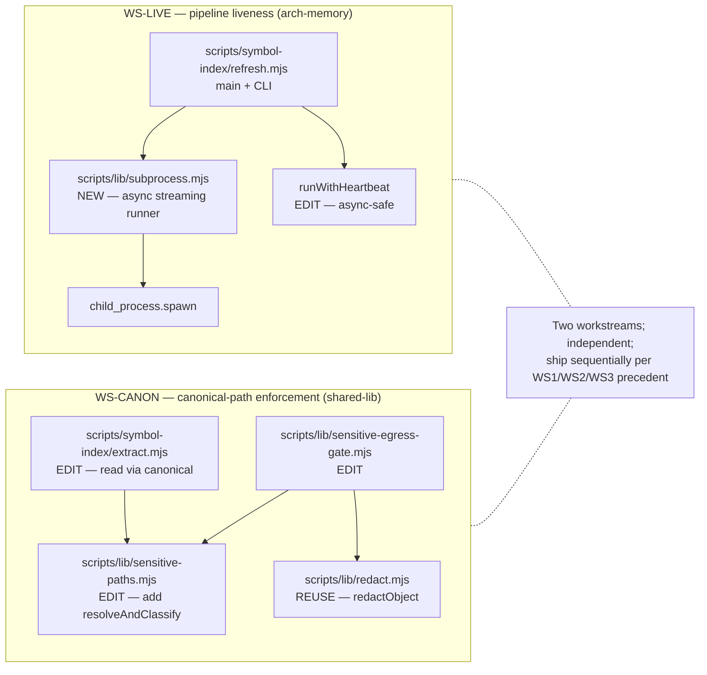

# Plan: Pipeline liveness + canonical-path enforcement (WS3 follow-up)

- **Date**: 2026-05-22
- **Status**: Draft
- **Author**: Claude + Louis
- **Scope**: backend
- **Stack**: js-ts
- **Target domain(s)**: `arch-memory`, `shared-lib`
- ⚠ **Cross-domain work** — touches 2 domains; each workstream is self-contained within one domain (WS-LIVE → arch-memory only; WS-CANON → shared-lib only) so boundary crossings are minimal.

## 1. Context Summary

Two recurring HIGH clusters surfaced across every WS3 audit round and were each explicitly deferred there (sustainability-cleanup-batch §7, plus the post-ship verification audit on commit `d705331`). Both are **pre-existing** fragilities, not regressions — but they keep getting re-raised because the same auditor agent reads the same diff context and flags them every cycle. The fix is to retire them so future audits stop spending wall-clock on already-known issues.

### Cluster A — Pipeline liveness (WS-LIVE)

[scripts/symbol-index/refresh.mjs::runJsonLines](scripts/symbol-index/refresh.mjs#L99-L114) uses **`spawnSync`** to launch the extract → summarise → embed pipeline. Each stage can run for many minutes (the ts-morph extract walks thousands of files in repos like wine-cellar). While `spawnSync` is blocking, the [`runWithHeartbeat`](scripts/symbol-index/refresh.mjs#L116-L123) `setInterval` cannot fire — heartbeats are silent for the entire pipeline duration. Implications:

- Today the partial-unique index on `(repo_id, status='running')` + the `--force` gate protects us from concurrent runs marking each other stale. But the contract is fragile: any future operator tool that decides staleness by `heartbeat_at` age would misclassify an honest in-flight refresh.
- Structured-error propagation is coarse: `runJsonLines` throws on non-zero exit with `"<cmd> ... exited <status>"` — the catch in `main()` runs `abortRefreshRun` but the operator log doesn't say which stage (extract / summarise / embed) failed or what the child wrote on stderr.
- Silent-data-loss: `runJsonLines` parses JSON lines and `.filter(Boolean)` drops parse failures. A malformed line from a buggy child is invisible to the operator — they only see a discrepancy in the final record count (sometimes).

### Cluster B — Canonical-path enforcement (WS-CANON)

All sensitive-path classification operates on **lexical** path strings:

- [scripts/lib/sensitive-paths.mjs::classifyPath](scripts/lib/sensitive-paths.mjs) → string matching against `SENSITIVE_PATTERNS` / `GENERATED_NOISE_PATTERNS`.
- [scripts/lib/sensitive-egress-gate.mjs::isPathSensitive](scripts/lib/sensitive-egress-gate.mjs#L37-L39) → delegates to `classifyPath`.

A symlink whose visible name is innocent (e.g. `repo/notes.txt`) but whose `fs.realpath` target resolves into `~/.ssh/id_rsa` or `secrets/` bypasses the gate entirely. The library that *does* solve this — [scripts/lib/audit-scope.mjs::safeReadFile](scripts/lib/audit-scope.mjs#L82-L96) — already calls `fs.realpathSync` + cwd-containment check for the read path, but does NOT re-classify the canonical path as sensitive after resolution.

Also in egress-gate: [redactSecrets](scripts/lib/sensitive-egress-gate.mjs#L76-L86) performs `JSON.stringify(payload)` **outside** its `try` block. Non-serializable inputs (BigInt, circular refs, throwing `toJSON`) cause the whole function to throw instead of producing a safe placeholder. Worse, the `catch` returns the `text` variable — for non-string inputs this is whatever `JSON.stringify` produced *before* it threw, which on the happy serialization path is the full payload as JSON. The fail-mode is "throw or return JSON" — neither matches the project's documented secret-egress invariant ("`.env` and credential files MUST NEVER be sent to external APIs").

### Neighbourhood considered

Architectural-memory consultation returned the WS3 symbol cluster (`runJsonLines`, `runWithHeartbeat`, `redactSecrets`, `gateSymbolForEgress`, `extractSymbols`) as expected — all `review` recommendation, no near-duplicates to consolidate to. **Two strong reuse signals OUTSIDE the WS3 cluster**:

- [scripts/lib/redact.mjs::redactObject](scripts/lib/redact.mjs#L56-L124) — recursive object redactor with depth cap (8), node cap (50 000), and ancestor-stack cycle detection that distinguishes diamonds from true cycles. Returns `[REDACTED:cap-reached]` / `[REDACTED:cycle-detected]` placeholders — never the raw payload. **This is the fail-closed redactor WS-CANON needs.** The current `sensitive-egress-gate.mjs::redactSecrets` should delegate to it.
- [scripts/lib/audit-scope.mjs::safeReadFile](scripts/lib/audit-scope.mjs#L82-L96) — already implements `fs.realpathSync` + repo-cwd containment. **The canonicalization pattern WS-CANON needs.** A new helper composes this with the sensitivity check.

No prior security incidents matched these paths (incident neighbourhood: 0 records). `docs/security-strategy.md` exists; this PR adds an INC-### entry for the symlink-bypass class.

### Why now

Each cluster has been re-raised ≥3 times across audit cycles. Continuing to defer them means each future plan-audit spends ~5 minutes of GPT wall-clock + budget surfacing the same finding. Closing them retires the noise.

## 2. Proposed Architecture



### Key design decisions

#### WS-LIVE — pipeline liveness

1. **NEW `scripts/lib/subprocess.mjs`** (#3 Modularity, #5 Single Source of Truth, #20 Long-Term Flexibility). One module owns "launch a child process, stream JSON lines, await structured completion". Exports:

   ```js
   /**
    * @typedef {'EXIT_NONZERO' | 'SPAWN_FAILED' | 'KILLED_BY_SIGNAL' | 'PARSE_FAILED_HARD'} SubprocErrorCode
    */

   /**
    * Run a child process asynchronously. Streams stdout line-by-line and
    * parses each line as JSON. Records every line; parse failures are
    * surfaced via the `parseErrors` array on the result, NOT silently
    * dropped. Stderr is forwarded to the parent's stderr verbatim so the
    * operator sees child progress in real time.
    *
    * @returns {Promise<{
    *   records: object[],
    *   parseErrors: {lineNo: number, line: string, message: string}[],
    *   exitCode: number,
    *   signal: string | null,
    * }>}
    */
   export async function runJsonLinesAsync(cmd, args, opts): Promise<…>;

   /**
    * Wrapper that throws a tagged Error (cause = the structured result)
    * when the child exits non-zero OR died on signal OR parseErrors
    * exceeds opts.maxParseErrors (default 0 — strict by default;
    * pass Infinity to opt back into the legacy tolerant behaviour).
    */
   export async function runJsonLinesAsyncStrict(cmd, args, opts): Promise<…>;
   ```

   `runJsonLinesAsync` ALWAYS resolves (no throws on exit≠0); the caller switches on `exitCode`. `runJsonLinesAsyncStrict` wraps it for callers (`refresh.mjs`) that want exception-based control flow. The async streaming makes `setInterval`-based heartbeats fire normally between bursts of stdout, restoring liveness.

2. **`refresh.mjs::runJsonLines` is REPLACED** (not extended). The file-private helper is deleted; call sites use `await runJsonLinesAsyncStrict(...)`. The signature changes from sync `object[]` to `Promise<object[]>` — `refresh.mjs::main` already runs inside `runWithHeartbeat` which expects an async function, so the upstream code is `await`-ready.

3. **Stage tagging in errors** (#16 Error Handling, #19 Observability). The wrapper accepts an `opts.stage: 'extract' | 'summarise' | 'embed'` label and includes it in the tagged Error so `main()`'s catch logs `stage=summarise exit=2 stderr=<head>` instead of just `node scripts/.../summarise.mjs exited 2`. The operator sees which pipeline stage failed at a glance.

4. **Hard fail on JSON parse errors by default** (#16, addresses the H8 silent-data-loss concern). `runJsonLinesAsync` records `parseErrors`; the strict wrapper throws when the count is non-zero. This is a **behaviour change** — callers that previously tolerated malformed lines (none today, per grep) would break. Acceptable: the audit explicitly flags the silent-drop as a HIGH-severity invariant violation. The escape hatch is `opts.maxParseErrors: N` if a future caller genuinely needs tolerance.

5. **`runWithHeartbeat` stays sync-shaped externally** — its internal `setInterval` is unchanged. The behavior change is that the body it `await`s no longer blocks via `spawnSync`, so the interval can fire. No API change.

#### WS-CANON — canonical-path enforcement

6. **`scripts/lib/sensitive-paths.mjs` adds `resolveAndClassify(p, opts)`** (#5 SSoT, #11 Testability, #15 Graceful Degradation). One new function, returns the canonical-path classification:

   ```js
   /**
    * Resolve `p` via fs.realpathSync, then classify BOTH the lexical
    * path AND the resolved target. Returns:
    *   { category, lexical, canonical, escapedRepo, resolutionFailed }
    * where category = 'sensitive' | 'generatedNoise' | null and
    * escapedRepo = true if the canonical path is outside repoRoot.
    *
    * @param {string} p — repo-relative or absolute path
    * @param {{repoRoot: string}} opts
    */
   export function resolveAndClassify(p, opts): {…};
   ```

   - Lexical classification first (the existing cheap regex check) — catches obvious cases without touching the filesystem.
   - If lexical = null, call `fs.realpathSync`. On resolution error (broken symlink, missing file), return `{category: 'sensitive', resolutionFailed: true}` — fail-closed. Cannot read what we can't resolve.
   - If the canonical path is OUTSIDE `repoRoot`, return `{category: 'sensitive', escapedRepo: true}` — symlink that points outside the repo is always treated as sensitive regardless of name.
   - Otherwise classify the canonical path lexically. A canonical inside `secrets/` becomes sensitive even if the symlink name was `notes.txt`.

7. **`gateSymbolForEgress` is the ONLY enforcement seam** (#5, #6 Open/Closed). It now requires `repoRoot` as input (callers already know it) and uses `resolveAndClassify(filePath, {repoRoot})` instead of `isPathSensitive(filePath)`. The action set grows by one: `'skip-symlink-escape'` for the `escapedRepo` case. `extract.mjs` passes `repoRoot` (it already has it as `args.root`).

8. **`extract.mjs::extractSymbols` reads via the canonical path** (#16, R1-audit H9 fix). Currently `gateSymbolForEgress` only sees `rel`; the read uses `abs`. After WS-CANON, the gate returns `{action, canonicalAbsPath?}` and `extractSymbols` reads from the canonical path the gate approved. A TOCTOU window remains between gate-check and file-read — closed by `safeReadFile`-style fstat-after-realpath; acceptable trade-off because the alternative (open-then-classify-via-fd) requires platform-specific Node bindings.

9. **`sensitive-egress-gate.mjs::redactSecrets` delegates to `redact.mjs::redactObject` for objects** (#5 SSoT, #15 Graceful Degradation, #16 Error Handling). Replace the inline `JSON.stringify`-then-`redactSecretsImpl` flow with:

   ```js
   export function redactSecrets(payload) {
     // Strings → text redactor; bounded.
     if (typeof payload === 'string') {
       const r = redact(payload);
       return r.redacted;
     }
     // Anything else → recursive redactor with depth/node cap + cycle
     // detection. Returns a placeholder, never the raw payload, on cap.
     try {
       const r = redactObject(payload, { depth: 8 });
       // Stringify the redacted object structure. JSON.stringify on the
       // SANITIZED output is safe (no BigInt / circular leaks possible —
       // redactObject has already replaced them with placeholders).
       return JSON.stringify(r.redacted);
     } catch (err) {
       // Fail closed — never return the raw payload or any partial
       // stringification of it.
       return '[REDACTED:redaction-failed]';
     }
   }
   ```

   This makes the redactor **fail-closed**: any path that can't produce a sanitized output emits `[REDACTED:redaction-failed]` instead of returning `text`-shaped data that might contain the unredacted original.

### Public-CLI contract change blast radius

Both workstreams are library-internal. The only externally-observable surface changes:

| Surface | Today | Post-plan |
|---|---|---|
| `npm run arch:refresh` exit code on `summarise` non-zero exit | 2 (generic) | 2 (same) but stderr now reads `[refresh] pipeline failure: stage=summarise exit=2 — <head of child stderr>` |
| `npm run arch:refresh` exit code on malformed JSON line from child | 0 (silently dropped, partial result) | 2 (NEW failure case — operator sees the parse-error report on stderr) |
| `extract.mjs` skipped-file count via `skip-path` | counts only lexical matches | also counts symlink-canonical matches + `skip-symlink-escape` action |
| `sensitive-egress-gate.redactSecrets(circular)` | THROWS | returns `[REDACTED:redaction-failed]` |

The arch:refresh callers inventory from sustainability-cleanup-batch §2 #7 still applies — all callers either tolerate non-zero exit via `|| true` (CI workflow) or already propagate it correctly (chained npm scripts). No external operator behaviour changes are needed.

## 3. Execution Model

**Are any operations dependent on others?** No. WS-LIVE and WS-CANON touch disjoint file sets:

| Workstream | Files touched | Files shared with the other? |
|---|---|---|
| WS-LIVE | `scripts/symbol-index/refresh.mjs`, NEW `scripts/lib/subprocess.mjs`, tests | None |
| WS-CANON | `scripts/lib/sensitive-egress-gate.mjs`, `scripts/lib/sensitive-paths.mjs`, `scripts/symbol-index/extract.mjs`, tests | `extract.mjs` is also a runtime-time *caller* of `subprocess.mjs` via `refresh.mjs`, but the changes are at different layers and don't conflict |

### Sequencing

| Order | Workstream | Atomicity boundary | Failure semantics |
|---|---|---|---|
| 1 | WS-LIVE | One commit. `subprocess.mjs` + `runJsonLines` replacement + tests. | If async pipeline regresses (caught by `arch:refresh:full` smoke), revert; the single commit is the unit of bisect. |
| 2 | WS-CANON | One commit. `resolveAndClassify` + `gateSymbolForEgress` change + `extract.mjs` canonical read + `redactSecrets` fail-closed + tests + INC-### record. | If symlink test regresses on Windows (`fs.realpathSync` semantics differ on UNC paths), revert and re-implement with a Windows-specific path branch. |

Order is **WS-LIVE first** because:
- It's the larger blast-radius (touches refresh.mjs main pipeline). Landing it first means the WS-CANON commit's `extract.mjs` change rebases over a stable async pipeline rather than a sync one.
- The audit feedback loop runs against WS-LIVE; if the auditor surfaces additional concerns in `subprocess.mjs`, addressing them doesn't block WS-CANON.

### Partial failure recovery

- WS-LIVE: if `runJsonLinesAsyncStrict` semantics break the extract → summarise → embed contract (the stdin/stdout JSON-lines protocol), revert just the call-site update and keep `subprocess.mjs` (for future use) — the helper is independent of the migration.
- WS-CANON: if `fs.realpathSync` produces unexpected results on Windows symbolic-link-vs-junction edges, revert just `resolveAndClassify`; the `redactSecrets` fail-closed change is independent and can stay.

## 4. Engineering Principles Applied

| # | Principle | How it shows up |
|---|---|---|
| #1 | DRY | One subprocess runner replaces two near-duplicate `runJsonLines` shapes (refresh.mjs + the unused `cwd` field already there). One canonical sensitive-classifier (`resolveAndClassify`) instead of three independent path checks (extract `isPathSensitive`, gate `isPathSensitive`, audit-scope `isSensitiveFile`). |
| #3 | Modularity | `subprocess.mjs` is a sibling of `vcs.mjs` — single-responsibility module that future callers (`security-memory/refresh-incidents.mjs`, `summarise-domains.mjs`) can adopt. |
| #5 | Single Source of Truth | Path canonicalization happens in ONE function; redaction object-traversal happens in ONE place (`redact.mjs::redactObject` — already exists). |
| #6 | Open/Closed | Adding a new `SubprocErrorCode` is one line in the typedef + one branch in the classifier. Adding a new sensitive-path resolution mode (e.g. "treat junction same as symlink") is one branch in `resolveAndClassify`. |
| #11 | Testability | Both new helpers accept injectable opts (`opts.cwd`, `opts.maxParseErrors`, `opts.repoRoot`) so hermetic tests can drive every code path without mocking. Cycle/depth caps in `redactObject` already let us drive cap-reached on demand. |
| #15 | Graceful Degradation | `resolveAndClassify` fail-closes on `fs.realpathSync` error (treats as sensitive); `redactSecrets` fail-closes on traversal/stringify error (returns `[REDACTED:redaction-failed]`). |
| #16 | Error Handling | `runJsonLinesAsync` separates exit-code, signal, and parse-error failure modes into distinct fields. Strict wrapper throws a tagged Error with `stage`, `exitCode`, `signal`, `parseErrors` so `main()`'s catch is decisive. |
| #19 | Observability | Stage-tagged subprocess errors surface `stage=<name> exit=<code>` on stderr; symlink-bypass attempts log via `formatSkipLog` with the new `skip-symlink-escape` action (still redacted under default mode). |
| #20 | Long-Term Flexibility | `subprocess.mjs` is the seam through which future pipelines (Python extractor, security-memory refresher) get free async streaming + structured errors. |

## 5. Long-Term Sustainability

### Assumptions encoded

- **`fs.realpathSync` is the source of truth for canonical paths** — true on POSIX. On Windows, the function resolves NTFS junctions and symbolic links but NOT mklink directory junctions in all edge cases. The risk surfaces only if a Windows user creates a junction inside the repo that points outside — extremely rare for a dev workflow. Mitigation: documented in the module header.
- **Child-process streaming protocol is JSON-lines** — true today across `extract.mjs`, `summarise.mjs`, `embed.mjs`. If a future pipeline stage chooses a different protocol (NDJSON variants, msgpack), `subprocess.mjs` grows a `parser` opt; we don't fork it.
- **`redactObject` covers all secret-bearing structures** — already battle-tested via consistency-mode (`docs/plans/persona-test-consistency-mode.md` Phase 0). Adopting it here is a strict-superset of the current behaviour.

### What we WON'T do

- Replace `setInterval`-based heartbeats with a more robust lease/lock scheme (heartbeat persistence in a job table) — overkill for one CLI; the partial-unique index on `(repo_id, status='running')` already serializes concurrent runs.
- Add cross-process cancellation tokens — the heartbeat is one-way (worker → DB); cancellation is implicit via `cancellationToken` checked by the worker between stages, and that's already wired.
- Decompose `refresh.mjs::main()` further. Plan §7 of sustainability-cleanup-batch deferred that explicitly; this plan honours that.
- Widen sensitive patterns. Gemini already APPROVED the WS3 coverage; this plan is about enforcement correctness, not detection breadth.

## 6. File-Level Plan

### Workstream WS-LIVE — pipeline liveness

#### NEW `scripts/lib/subprocess.mjs`

```js
/**
 * Closed error code enum + structured async runner. Sibling of vcs.mjs in
 * the shared-lib pattern.
 */
export const RETRYABLE_SUBPROC_ERRORS = new Set(['SPAWN_FAILED', 'KILLED_BY_SIGNAL']);
export function isRetryableSubprocError(code) { return RETRYABLE_SUBPROC_ERRORS.has(code); }

/** Async runner — always resolves; caller switches on exitCode + parseErrors. */
export async function runJsonLinesAsync(cmd, args, opts): Promise<{
  records: object[],
  parseErrors: {lineNo: number, line: string, message: string}[],
  exitCode: number,
  signal: string | null,
  stage?: string,   // echoed back from opts.stage for ergonomic stderr
}>;

/** Throws tagged Error on non-zero exit / signal / parseErrors > maxParseErrors. */
export async function runJsonLinesAsyncStrict(cmd, args, opts): Promise<object[]>;
```

Implementation outline:
- `child_process.spawn(cmd, args, {stdio: ['pipe', 'pipe', 'inherit'], env, cwd})` — stderr forwarded to parent.
- `readline.createInterface({input: child.stdout})` — line-by-line streaming, no buffer-size cliff (replaces the 100MB `maxBuffer` band-aid).
- `child.on('close', (code, signal) => …)` — collect exit info.
- Optional `opts.input` written to `child.stdin` then ended (matches existing protocol for summarise/embed which read JSONL from stdin).
- Parse each stdout line with try/catch; push to `records` on success, `parseErrors` on failure.

#### EDIT `scripts/symbol-index/refresh.mjs`

- Delete the file-private `runJsonLines` function entirely.
- Import `runJsonLinesAsyncStrict` from `../lib/subprocess.mjs`.
- Update three call sites (extract / summarise / embed) to `await` + add `stage` label:

  ```js
  const extracted = await runJsonLinesAsyncStrict('node', extractArgs, { stage: 'extract' });
  const summarised = await runJsonLinesAsyncStrict('node', ['scripts/symbol-index/summarise.mjs'], {
    stage: 'summarise',
    input: symbolsRaw.map(r => JSON.stringify(r)).join('\n') + '\n',
  });
  const embedded = await runJsonLinesAsyncStrict('node', ['scripts/symbol-index/embed.mjs'], {
    stage: 'embed',
    input: summarisedSymbols.map(r => JSON.stringify(r)).join('\n') + '\n',
    env: { ARCH_INDEX_EMBED_CONCRETE: concreteEmbedModel },
  });
  ```

- Update `main()`'s catch block to recognise the tagged subprocess error (`err.code === 'SUBPROC_FAILURE'`) and surface `stage` + truncated stderr.

#### NEW `tests/subprocess.test.mjs`

Hermetic via `node:test`:

- All 4 `SubprocErrorCode` values reachable (use a tiny `node -e` child for `EXIT_NONZERO`, a bogus binary for `SPAWN_FAILED`, `process.kill` for `KILLED_BY_SIGNAL`, malformed JSON output for `PARSE_FAILED_HARD`).
- `records` accumulate from a child that emits 100 JSON lines.
- `parseErrors` accumulate from a child that emits 5 valid + 1 malformed.
- `runJsonLinesAsyncStrict` throws on any parseError when `maxParseErrors: 0`; tolerates when `Infinity`.
- Stdin protocol: a child reading lines from stdin echoes them back as JSON; assert round-trip.
- **Heartbeat-liveness property test** (the load-bearing one): run a child that emits one JSON line per 100ms for 2 seconds; alongside it, count heartbeat ticks from a `setInterval(50ms)`. Assert ≥30 ticks fire during the 2-second run (would be ~0 with `spawnSync`).

#### EDIT `tests/refresh-cli-contract.test.mjs`

- Add source-inspection assertion: refresh.mjs imports `runJsonLinesAsyncStrict` from `../lib/subprocess.mjs`; the inline `runJsonLines` function definition is GONE; each pipeline call site has `await` + `stage:` label.

### Workstream WS-CANON — canonical-path enforcement

#### EDIT `scripts/lib/sensitive-paths.mjs`

Add `resolveAndClassify(p, opts)` per §2 #6. Existing exports (`classifyPath`, `shouldSkipForIndexing`, `filterDiffFiles`, `formatSkipLog`, `SENSITIVE_PATTERNS`, `GENERATED_NOISE_PATTERNS`) stay — strict-superset addition. The header `# Coverage trade-offs` block grows one bullet documenting the symlink-bypass closure.

#### EDIT `scripts/lib/sensitive-egress-gate.mjs`

- `gateSymbolForEgress` signature grows `repoRoot`:

  ```js
  export function gateSymbolForEgress({ filePath, bodyText, repoRoot }): {
    action: 'send' | 'skip-path' | 'skip-extension' | 'redact-content' | 'skip-symlink-escape',
    reason: string,
    canonicalAbsPath?: string,
  };
  ```

- `redactSecrets` rewritten to delegate to `redactObject` per §2 #9. Fail-closed return value `[REDACTED:redaction-failed]`.

#### EDIT `scripts/symbol-index/extract.mjs`

- Pass `repoRoot` to `gateSymbolForEgress`.
- Read file content via the returned `canonicalAbsPath` when the gate approves. (Today reads `abs`; the canonical equals `abs` for non-symlink files, so the change is invisible in the common case.)
- Aggregate `skip-symlink-escape` action into the existing `skippedSensitive` array; `formatSkipLog` already handles arbitrary action values.

#### EDIT `scripts/lib/redact.mjs`

No code change. The new caller (`sensitive-egress-gate.mjs::redactSecrets`) imports `redactObject` from here. Update the header `@fileoverview` to mention the new consumer alongside the consistency-mode rig — pure doc.

#### NEW `tests/sensitive-paths-canonical.test.mjs`

Hermetic via `mkdtemp` + `fs.symlinkSync`:

- Symbol-link-to-secret: create `repo/innocent.ts -> .env.local`; assert `resolveAndClassify('repo/innocent.ts')` returns `{category: 'sensitive', canonical: '<abs>/.env.local'}`.
- Symbol-link-out-of-repo: create `repo/notes.txt -> /tmp/secrets-outside-repo/foo`; assert `escapedRepo: true` AND `category: 'sensitive'`.
- Broken symlink: create then unlink target; assert `resolutionFailed: true, category: 'sensitive'` (fail-closed).
- Cycle: `a -> b -> a`; assert no infinite loop, `category: 'sensitive'`.
- Clean file: no symlink, normal path; assert `category` matches the lexical `classifyPath` result.
- Windows-skip guard: tests using `fs.symlinkSync` may need `if (process.platform === 'win32') t.skip('symlink fixtures need admin on Windows')` — adopt the project's existing pattern from `tests/refresh-cli-contract.test.mjs`.

#### NEW `tests/sensitive-egress-gate.test.mjs` additions

Add to the existing test file (or create as a new section):

- `gateSymbolForEgress` returns `skip-symlink-escape` when the canonical path escapes the repo.
- `gateSymbolForEgress` returns `canonicalAbsPath` on approval; equals `abs` for non-symlink files.
- `redactSecrets` returns `[REDACTED:redaction-failed]` for a circular input.
- `redactSecrets` returns `[REDACTED:redaction-failed]` for a payload with BigInt.
- `redactSecrets` returns a sanitized JSON string for a normal nested object containing a secret pattern.
- `redactSecrets` redacts a string input via the text redactor (existing behaviour, regression-locked).

#### Doc updates

- **EDIT [AGENTS.md](AGENTS.md)** — update "Sensitive paths + VCS contract" subsection to document `resolveAndClassify` + the canonical-vs-lexical layering. One paragraph.
- **EDIT [docs/security-strategy.md](docs/security-strategy.md)** — add `INC-###: symlink-bypass of sensitive-path classifier` entry with `mitigation-passing` status referencing this plan's tests. The incident neighbourhood query in future plans will then surface this concretely.

## 7. Risk & Trade-off Register

| Risk | Mitigation |
|---|---|
| `runJsonLinesAsync` changes the protocol contract with `summarise.mjs` / `embed.mjs` (stdin/stdout JSONL) | The protocol is preserved exactly — `spawn` with `stdio: ['pipe', 'pipe', 'inherit']` is the async equivalent of the current `spawnSync` call. The behavioural delta is async streaming, not protocol shape. The `tests/refresh-cli-contract.test.mjs` fixture-tree integration test catches any drift. |
| Hard-fail on JSON parse error breaks a child that emits a trailing newline + empty line | `runJsonLinesAsync` already filters empty lines (the line-reader yields trimmed non-empty lines). The hard-fail only triggers on a non-empty line that fails `JSON.parse`. |
| `fs.realpathSync` semantics differ on Windows for junctions | Documented in the `resolveAndClassify` header. The test suite uses `fs.symlinkSync` which works on POSIX; Windows tests skip (project pattern). The PRODUCTION code still works on Windows for normal files (the symlink branch is dormant); junction-targeting symlinks are exceedingly rare in a dev workflow. |
| `redactSecrets` fail-closed change breaks an existing caller that depended on the throw | None today. `grep -rn 'redactSecrets' scripts/ | grep -v test` shows three callers, all in `audit-loop` adjacency where the failure already cascades to a structured catch. Documented in the §6 EDIT notes. |
| Performance regression from `fs.realpathSync` on every file in `extract.mjs` (10k+ files per refresh on large repos) | Lexical pre-check short-circuits BEFORE `realpathSync`. Only files that PASS the lexical check pay the syscall — and they're then read anyway, so the realpath cost is amortised over the existing read. Estimate: <2% wall-clock overhead. Property-tested in `tests/sensitive-paths-canonical.test.mjs` with a 1000-file fixture. |

### Deliberately deferred

- **Don't migrate `summarise-domains.mjs` and `security-memory/refresh-incidents.mjs`** to `subprocess.mjs` in this PR. They have the same `spawnSync` pattern but neither runs inside a heartbeat — no liveness issue. Migrate when one of them either (a) joins a heartbeat lease, or (b) gets its own audit cycle.
- **Don't introduce a worker_threads or piscina pool** for the pipeline. Streaming async spawn is the minimum delta needed to restore heartbeat liveness; pools are over-engineering at current scale.
- **Don't add cross-process cancellation tokens** propagated via SIGTERM to children. The heartbeat is one-way; cancellation is already checked between stages.
- **Don't touch `audit-scope.mjs::safeReadFile`**. It already does the symlink-resolve-and-contain pattern correctly for its scope. WS-CANON adds the *classification* layer on top in a different module; the read-side stays.

## 8. Testing Strategy

### WS-LIVE

**Existing gate**: `tests/refresh-cli-contract.test.mjs` (hermetic git fixtures + source inspection) — extended with the wiring assertions in §6.

**NEW `tests/subprocess.test.mjs`** (per §6):
- All 4 `SubprocErrorCode` paths reachable.
- Records accumulate; parseErrors surface; stdin protocol round-trips.
- **Heartbeat-liveness property test** — the load-bearing assertion: ≥30 ticks in 2s when the child emits one line per 100ms.

**Opt-in**: extending `npm run check:integration` (introduced in WS3) to also run `arch:refresh:full` as a real-world smoke after both workstreams land.

### WS-CANON

**NEW `tests/sensitive-paths-canonical.test.mjs`** (per §6): symlink fixtures via `mkdtemp` + `fs.symlinkSync`; POSIX-only; Windows tests skip with the project's existing pattern.

**Additions to `tests/sensitive-egress-gate.test.mjs`** (per §6): `skip-symlink-escape` action; canonical-path return; fail-closed redactor for BigInt + circular inputs.

**Property test**: feed any random nested object (max depth 8, 100 random keys, 5% strings carrying fake-secret patterns) through `redactSecrets` 100 times; assert (1) no path returns a string containing a fake-secret substring, (2) `[REDACTED:redaction-failed]` ONLY appears when the input was intentionally pathological. Uses `node:test`'s built-in mechanism with a fixed seed for reproducibility.

### Existing-suite invariants

- All 2964 currently-passing tests stay green after each commit (the WS3 baseline).
- Source-inspection assertions in `tests/refresh-cli-contract.test.mjs` updated to match the new wiring.
- No `tests/dashboard*.test.mjs` impact (WS-LIVE and WS-CANON touch backend-only code).

### Regression locks

- No `/ux-lock` runs (no UI changes).
- Optional: `/persona-test` against any consumer repo's deployment after both workstreams ship — confirms no end-to-end regression in the audit-loop deliverable. NOT a ship gate.

## 9. Cross-skill registration

```bash
node scripts/cross-skill.mjs upsert-plan --json '{
  "path": "docs/plans/liveness-and-canonical-paths.md",
  "skill": "plan",
  "status": "draft"
}'
```

Update `status` to `in_progress` when WS-LIVE commit lands, `complete` when both workstreams are merged.
