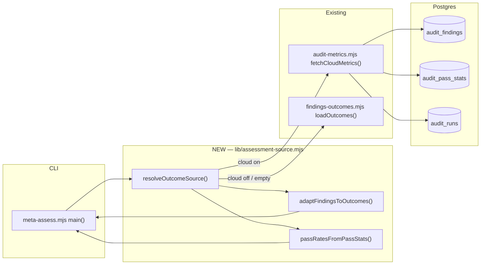

# Plan: Store-backed outcome source for `meta-assess`

- **Date**: 2026-08-23
- **Status**: Approved
- **Author**: Claude + pill
- **Scope**: backend
- **Target domain(s)**: `learning-store`, `findings`, `audit-orchestration`, `shared-lib`
- ⚠ **Cross-domain work** — touches 4 domains; the boundary crossings are read-only
  (a new source module in `learning-store` reads `findings`-owned tables through the
  existing `audit-metrics` seam). Confirm that stays true if the design changes.

---

## 1. Context Summary

**Detected scope**: backend · **Stack**: `js-ts` (+ `postgres`) · no Python.

### The defect, measured

`scripts/meta-assess.mjs` is the repo's periodic self-assessment — FP rate per
pass, signal quality, severity calibration, convergence speed. It has **never
produced output**: `.audit/meta-assessments.jsonl` has never existed.

Measured 2026-08-23 against the live NAS store (`repo_id
6461a693-6690-4bf3-98ee-14c0385cc357`):

| Fact | Value | How |
|---|---|---|
| Every invocation | `{"skipped":true,"reason":"Insufficient data: 8 outcomes (need 20)"}` | `node scripts/meta-assess.mjs --metrics-only --json` |
| Local outcome file | **volatile** — 20 lines at one point, 7 lines (6 parseable) ~1h later, same session | `wc -l .audit/outcomes.jsonl`, twice |
| Store, same repo | **6,451 findings, 2,848 adjudicated**, 2026-07-17..2026-08-23 | `SELECT count(*), count(adjudication_outcome) FROM audit_findings f JOIN audit_runs r …` |
| Interval gate | NOT the blocker — `runCount` 692, no `lastAssessmentAtRun` ⇒ `shouldRunAssessment()` returns `true` | `cat .audit/pipeline-state.json` |

So the instrument reads a local file holding single digits while the store holds
thousands. Every figure it would emit describes ~6 findings.

### Code Trace

Pinned to `989faf1f` (the commit these were read at):

`audit-loop.mjs:547 (989faf1f)` Step 8.5 → `execFileSync('node',
['scripts/meta-assess.mjs','--force','--out',…])` → `meta-assess.mjs:main()
:402` → `loadOutcomes('.audit/outcomes.jsonl') :422` →
`findings-outcomes.mjs:loadOutcomes :82` → `file-store.mjs:readJsonlFile :94`.
The count gate is `meta-assess.mjs:423`; the metrics consumer is
`computeAssessmentMetrics :48–150`; persistence is `storeAssessment :337`.

### Three further defects found while measuring

Each is real, each was verified, and each shapes the design:

**(a) `pass` is unrecoverable from `audit_findings`.** The originating pass is
discarded at merge time:

| `pass_name` | rows |
|---|---|
| `merged` | 4,480 |
| `plan` | 1,196 |
| `final-review-shadow` | 469 |
| `final-review` | 306 |

`computeAssessmentMetrics`'s `byPass` loop filters `o.pass === pass` against
`PASS_NAMES`, so a naive `audit_findings` adapter yields **zero** per-pass
rates — silently, as an empty object that reads like "no false positives".
Per-pass accept/dismiss counts exist **only** in `audit_pass_stats`
(`findings_raised` / `findings_accepted` / `findings_dismissed` per
`pass_name` per round).

**(b) `PASS_NAMES` is stale.** `config.mjs` declares six —
`structure, wiring, backend, frontend, sustainability, gemini-review` — and
**none of them appear in `audit_findings.pass_name`**, while `audit-metrics`
reports 13 real passes over 30 days (`structure`, `sustainability`, `quickfix`,
`architecture`, `duplication`, `adjacency`, `orphan-introduced`, `frontend`,
`wiring`, `be-services`, `backend`, `event-wiring-symmetry`, `be-routes`).
A hardcoded roster of pass names is a second source of truth for something the
data already knows (#10).

**(c) `fpTracker` and `bandit` are dead parameters.** `computeAssessmentMetrics(
outcomes, fpTracker, bandit, options)` — the only line in `:48–150` mentioning
either is the signature itself. They are constructed in `main()` and threaded in
for nothing. (`fpTracker.getReport()` *is* used, separately, at `:436`, for the
LLM phase — that use is real and stays.)

**Correction to an earlier claim of mine**: I previously said nothing writes
`lastAssessmentAtRun`. It is written — `markAssessmentComplete() :190`, called
at `:463`. But `:463` sits **after** the `--metrics-only` early return (`:441`),
so a metrics-only run never marks completion, and no run has ever got past the
data gate to reach it at all. The field is absent because the writer is
unreached, not because it is missing.

### Patterns reused vs new

- **Reused**: `fetchCloudMetrics(_sb, days, repoId)` — already exported from
  `audit-metrics.mjs:57` for exactly this purpose ("Exported so the dashboard
  telemetry collector can reuse it"), already reads all three tables, already
  repo-scoped, already returns `null` when there is no pool. **What is reused
  is the query + connection, not an assumed shape** — see D1a/M1 below for
  the exact contract and how the new adapter is decoupled from a name that
  says "dashboard".
- **Reused**: `resolveRepoIdentity()` / `getRepoIdByUuid()` — the established
  repo-scoping path (`collect-telemetry.mjs` uses both).
- **New**: one adapter module. Nothing existing maps store rows onto the
  outcome-record shape.

### Neighbourhood considered

All 8 nearest symbols returned `recommendation: review`, `bandReason:
below-noise-floor-near` (top score 0.832, cliff 0.0067) — and every one is a
function *inside the two target files* (`computeAssessmentMetrics`,
`storeAssessment`, `sampleOutcomes`, `shouldRunAssessment`,
`formatAssessmentReport`, `main`, `compactOutcomes`, `appendOutcome`). Nothing
in the repo already occupies the "store-backed outcome source" space. Proceed
greenfield on the new module; extend the existing functions in place.

### Security incidents considered

`get-incident-neighbourhood` returned INC-001 (symlink path classification) and
INC-002 (the 2026-07-14 production wipe), both `pathOverlap: false` and both
below the relevance bar for a read-only query path. **One line of INC-002 does
apply**: any test added here that touches a real database must go through
`assertDisposableDbUrl` — never a bare "is the env var set" gate. §9 honours it.

---

## 2. Proposed Architecture



### Key design decisions

**D1 — One resolver, two sources, an explicit provenance label (#10, #16).**
`resolveOutcomeSource()` returns `{records, byPass, provenance, scope,
coverage, window}` where `provenance ∈ {'store','local','none'}`. Callers
never branch on "is cloud on" themselves; there is exactly one place that
decides. Cloud off, pool absent, or query failure ⇒ fall back to
`loadOutcomes()` and label `local`.

**Precise state table (audit-plan R2/H2 — the original prose was
self-contradictory on this).** `provenance` is decided by what happened, not
by row count:

| Condition | `provenance` | `records` |
|---|---|---|
| Cloud on, query succeeds (any row count, including 0) | `'store'` | the rows, possibly `[]` |
| `source:'auto'`, cloud off/pool absent/query throws | `'local'` (fall back) | `loadOutcomes()`'s result, possibly `[]` |
| `source:'auto'`, repo identity cannot be resolved (D1a, Gemini G2) | `'local'` (fall back — the store half of `'auto'` is unreachable, not the whole assessment) | `loadOutcomes()`'s result, possibly `[]` |
| `source:'store'`, repo identity cannot be resolved (D1a) | `'none', scope:'unresolved'` | `[]` — **no query runs at all** |
| `source:'store'`, cloud off/pool absent/query throws | `'store-unavailable'` | `[]` — **no local read** |
| Local fallback's/`'local'` mode's file is missing/unreadable | `'none'` | `[]` |

A **successful, empty** store query is a real, measured absence — "this
window/scope genuinely has no findings" — and reports `provenance:'store'`,
never falls back to local (falling back would silently substitute a different
question's answer) and never reports `'none'` (that would claim nothing was
even checked). `'none'` means literally that: no source was queryable at
all. This replaces the earlier "both empty ⇒ none" rule, which conflated
"empty" with "unavailable."

**D1a — Wiring, identity ownership, and config (audit-plan R1/H1, R2/H1,
R2/M3: three findings converging on the same section).**

- **Identity ownership — one owner, no round-trip.** `main()` resolves
  `repoId` the same way `collect-telemetry.mjs` already does —
  `resolveRepoIdentity()` → `getRepoIdByUuid()` — and passes the RESULT into
  `resolveOutcomeSource({repoId, …})`. `resolveOutcomeSource` itself imports
  **neither** `resolveRepoIdentity` nor `getRepoIdByUuid` — it is a pure
  function of the `repoId` it's given, which is what keeps it testable with
  injected deps (M1, D1c below) and closes the R2/M3 contradiction (the
  earlier draft said both "`main()` resolves and passes `repoId`" and "the
  source module imports identity resolution modules" — only the first is
  true; the File-Level Plan's import line for `assessment-source.mjs` is
  corrected in §7 to drop the identity-resolution imports).
- **Identity failure blocks the STORE, never the whole assessment (audit-plan
  R2/H1, corrected at R3/H2, corrected again at Gemini G1 — the pattern
  across all three is the same over-correction happening one level higher
  each time).** R2 gated identity resolution unconditionally before
  `resolveOutcomeSource` was ever called, breaking `source:'local'`. R3 fixed
  that by skipping the gate entirely for `'local'` — but left `'auto'`
  identical to `'store'`: any identity failure produced a hard
  `provenance:'none'`, even for `'auto'`, whose entire contract elsewhere in
  this plan (D1, D1d) is graceful degradation to local data. That silently
  broke every offline, un-onboarded, or legacy repo that has never registered
  `.audit-loop/repo-id` but has a perfectly ordinary local
  `.audit/outcomes.jsonl` — **a regression against TODAY's behaviour**,
  where `loadOutcomes()` runs unconditionally with no identity concept at
  all. Fixed by ordering `main()`'s checks as:
  - **(1)** `source === 'local'` — skip identity resolution entirely, call
    `resolveOutcomeSource({source:'local', localPath, deps})`. Unchanged from
    R3/H2.
  - **(2)** `source === 'store'` — resolve identity first; failure ⇒
    `provenance:'none', scope:'unresolved'` immediately, no query. A caller
    who explicitly pinned the store gets a hard failure, not a silent
    substitution — matches D1a's `'store'`-mode "no fallback" contract.
  - **(3)** `source === 'auto'` (the default) — resolve identity; **on
    failure, degrade exactly like a pool-absent/query-failure case**:
    `resolveOutcomeSource({source:'local', localPath, deps})`,
    `provenance:'local', scope:'unresolved'`. The store side of `'auto'` is
    simply unreachable without an identity — that is a fact about what can be
    queried, not a reason to fail the whole assessment when a perfectly good
    local source exists.

  The cross-repo risk this whole chain of fixes was protecting against is
  real but **narrower than R2/R3 treated it**: it only applies to the STORE
  query (an unscoped read can span repos); a local file read has no such risk
  — it is inherently this-repo-only by being a file under this checkout's
  `.audit/`. `'auto'` mode's identity failure therefore reads as "the store
  half of auto couldn't run", not as "nothing can be measured" — the same
  distinction `'store'` mode still enforces strictly for its own, explicitly
  narrower promise.
- **`assessmentConfig.source`** is a closed enum, `'auto'|'store'|'local'`:
  - `'auto'` (default) — try store; on pool-absent or query failure, fall
    back to local and label `provenance:'local'`. D1's fallback path,
    unchanged.
  - `'store'` — **no fallback.** Pool absent or query failure returns
    `provenance:'store-unavailable'` with the underlying error/reason and an
    **empty** record set. `main()` treats `store-unavailable` the same as
    `none`: skip with a reason, never synthesize a local answer to a store
    request.
  - `'local'` — never touches the pool, even if cloud is on. Its own
    availability contract (audit-plan R4/L1 — the earlier drafts only
    described local availability as a POST-cloud-failure fallback, which does
    not cover this direct mode): file missing ⇒ `provenance:'none'`,
    `records:[]`; file present but unreadable (permissions, not valid JSONL)
    ⇒ same, logged at error level (distinguishable from "missing" only in the
    log, never in the returned shape — both are "no data available",
    identically actionable to a caller); a malformed **individual** JSONL
    line ⇒ `loadOutcomes`'s existing per-line handling applies unchanged
    (this plan does not alter local-file parsing), and the file's other valid
    lines still contribute.
  - **Config wiring, stated (audit-plan R2/M3, bounds added R4/M2):** read
    via `process.env.META_ASSESS_SOURCE`, normalised lowercase,
    `validatedEnum` against the three values (same helper `config.mjs`
    already uses for `OPENAI_AUDIT_REASONING` and others) — blank/unrecognised
    falls back to `'auto'`, never throws. `windowDays` reads
    `process.env.META_ASSESS_WINDOW_DAYS` via `clampConfigNumber(…, {fallback:
    30, min: 1, max: 365, parser: Number.parseInt, envVar:
    'META_ASSESS_WINDOW_DAYS'})` — the exact helper
    `auditRuntimeConfig.mapReduceConcurrency` already uses in this file (bounds
    `[1, 20]` there), not a hand-rolled `safeInt` + manual clamp. A
    malformed-but-integer value (0, negative, or a multi-year span) would
    otherwise query an unintended future window or scan the entire findings
    history on every periodic run. Out-of-range values clamp, they do not
    throw — consistent with every other numeric knob in this file.
    **No CLI flag in v1** — env-only, matching how
    `assessmentConfig.interval`/`minOutcomes` already work; independent of
    this plan's correctness, deferred (§8).
- `main()` does not call `fetchCloudMetrics` directly; it calls
  `resolveOutcomeSource`, which is the ONLY caller of both `fetchCloudMetrics`
  and `loadOutcomes`. This keeps D1's "exactly one decision point" true at the
  code level, not just in prose.

**D1c — Dependency boundary for testing (audit-plan R2/M1).**
`resolveOutcomeSource({days, repoId, source, localPath, deps})`, where `deps`
defaults to `{fetchCloudMetrics, loadOutcomes}` (the real imports) and a test
overrides it with stubs — no ESM mocking framework needed, and this is the
concrete mechanism the earlier §9 "injected deps, no DB" line assumed but
never wired into the signature.

**D1d — `'auto'` mode's fallback does not treat every exception the same
(audit-plan R3/M1).** The earlier "cloud throws ⇒ fall back" rule was too
coarse: it silently converted a connection outage AND a genuine bug (a schema
regression, an auth failure, a malformed query) into the identical "clean
local fallback", so a periodic run could keep publishing "successful"
assessments off the known-sparse local file while masking a real defect this
plan exists to surface, not hide. `resolveOutcomeSource` reuses
`classifyDbConnectionError` (`db/client.mjs`) — already the repo's one
classifier for exactly this distinction — on any thrown error:

- **Classified** (`unreachable`, `tls-rejected`, `auth-failed`,
  `database-missing`, `schema-missing`, …) — genuine unavailability. Fall
  back silently, `provenance:'local'`, matching D1's unchanged behaviour.
- **Unclassified** (anything `classifyDbConnectionError` doesn't recognise —
  a malformed query, an unexpected column error, anything code-shaped) —
  still fall back per this repo's graceful-degradation policy (#16 — a
  self-assessment tool must not crash the audit loop), but the returned
  envelope carries `queryError: {cause, message}` alongside
  `provenance:'local'`, and `main()` surfaces it prominently in both the JSON
  output and the markdown report. A clean fallback and a masked bug now
  produce visibly different output, even though both still complete the run.

**D1b — Window predicate (audit-plan R1/H2: the plan didn't say).** The store
window is **time-bounded**: `created_at >= now() - days`, applied identically
to `audit_findings` and `audit_pass_stats` — the SAME predicate
`fetchCloudMetrics` already uses for both tables, reused rather than
re-derived. Inclusion is decided by when the finding/pass-stat row was
**created**, never by when it was adjudicated: `adjudication_outcome` is read
**at query time, as it currently stands**, regardless of how long ago the
decision was made. A finding created inside the window but adjudicated after
the query runs simply reads as unadjudicated this round — no different from
any other in-flight finding, and exactly what `adjudication_outcome IS NULL`
already means in `adaptFindingsToOutcomes` (§9). There is no second,
adjudication-time predicate to reconcile against the creation-time one.

The **local** fallback is deliberately **count-bounded, not time-bounded** —
`loadOutcomes()`'s existing `windowSize`-tail slice in
`computeAssessmentMetrics`, unchanged. This is not an oversight to align with
the store path; it is what `provenance` exists to make legible: a
`days`-bounded pull (store) and a tail-of-the-log read (local) are two
different sampling strategies for two different data shapes, and forcing them
into one mechanism would mean either time-stamping the local file (a local
format change with no current requirement) or count-limiting the store query
(discarding the store's actual advantage — a real calendar window). The report
states which sampling rule produced the window it shows, via `provenance`.

**`window`'s exact shape (audit-plan R2/H4 — named but never defined
before):**

```
{ mode: 'time'|'count', days: number|null, sinceIso: string|null,
  windowSize: number|null }
```

`mode:'time'` (store) populates `days`/`sinceIso`, leaves `windowSize: null`;
`mode:'count'` (local) populates `windowSize`, leaves `days`/`sinceIso: null`.
Never a mixed object — a caller reading `window.mode` knows unambiguously
which pair to read.

**`adaptFindingsToOutcomes` and the resolver's `coverage` field (audit-plan
R2/H4, formula clarified R4/M4).** `adaptFindingsToOutcomes(findings)` does
not return a bare array — it returns `{records: OutcomeRecord[], excluded:
{unrecognisedOutcomeCount, invalidSeverityCount, invalidDateCount,
missingRoundCount}}` (§9 names each count). `resolveOutcomeSource` folds that
`excluded` object, plus `passRatesFromPassStats`'s `invalidRowCount`, into its
own top-level `coverage`:

```
{ recordsTotal: number, recordsExcluded: number,
  passStatRowsTotal: number, passStatRowsExcluded: number }
```

**Exact formula, resolving the R4/M4 ambiguity between "raw rows received"
and "valid records emitted":** `recordsTotal` is the raw row count
`fetchCloudMetrics`/`loadOutcomes` returned — **before** adapter filtering;
`recordsExcluded` is the sum of `adaptFindingsToOutcomes`'s `excluded` counts;
the valid/emitted count is always derivable as `recordsTotal -
recordsExcluded` and is not stored separately (one number, one source of
truth). Same relationship for `passStatRowsTotal`/`passStatRowsExcluded`. For
`provenance:'none'` or `'store-unavailable'`, every `coverage` field is `0`
(a real, honest zero — no rows were ever fetched to count, distinct from D4's
"absent is not zero" rule, which applies to computed RATES over records that
existed, not to a count of records that were never retrieved).
`recordsTotal: 0` is therefore correct here, not the fabrication D4 forbids
elsewhere.

**D2 — Per-pass rates come from `audit_pass_stats`, NOT from adapted records
(#10, #12).** This is the whole reason the change is not a one-line swap. The
adapter produces per-finding records for the metrics that are genuinely
per-finding (overall FP rate, severity calibration, signal quality, convergence)
and a **separate** `passRates` map for `byPass`, derived by summing
`findings_accepted` / `findings_dismissed` per `pass_name`.
`computeAssessmentMetrics` gains an optional `options.passRates` that, when
supplied, replaces the `byPass` loop. When absent, today's loop runs unchanged.

**D2a — ONE shape for `byPass`, chosen by provenance, not two incompatible
ones (audit-plan R1/H3, R2/H3, R2/H4 — three findings on this one
function).** `passRatesFromPassStats(passStats)` returns:

```
{ byPass: { [pass: string]: { raised: number, accepted: number, dismissed: number,
                               decided: number, coverage: number|null,
                               dismissRate: number|null, measured: boolean } },
  measured: boolean, reason: string|null, invalidRowCount: number }
```

Two nesting levels, not one flat map (R2/H4): the OUTER `measured`/`reason`
covers "no pass-stat rows existed for this window at all" (distinct from
"every individual pass is unlabelled", which the R1 draft's flat map had no
room for without a key collision); each INNER pass entry carries its own
`measured`.

**`dismissRate`'s denominator is `decided` (`accepted + dismissed`), NOT
`raised` (audit-plan R2/H3 — corrects R1's own fix).** The R1 version used
`raised` as the denominator, which hides low adjudication coverage: a pass
with 100 raised findings, 1 accepted, 1 dismissed reported `dismissRate:
0.01` (1%) under the R1 formula, while its ADJUDICATED-outcome FP rate — the
thing every other rate in this report actually measures — is 50%, over just
2% coverage. `decided = accepted + dismissed`; `coverage = decided / raised`
(or `null` when `raised = 0`); `dismissRate = dismissed / decided` when
`decided > 0`, else `null` with `measured:false`. This mirrors how
`fpRate.overall` is already computed elsewhere in this file — over adjudicated
outcomes, because a null-adjudication finding is excluded upstream in
`adaptFindingsToOutcomes` rather than counted as "not a false positive." The
new `coverage` field makes a low-coverage rate visibly inspectable rather than
just quietly imprecise. This is the shape for `provenance:'store'` **only**.

**`resolveOutcomeSource().byPass` for `provenance:'local'` is explicitly
`null` (audit-plan R3/M2 — the earlier draft left this resolver-level
question unanswered, which is what made "mirror vs. derive" read as a
contradiction).** `null` is the signal to `computeAssessmentMetrics`: no
resolver-computed value exists, so it runs TODAY'S existing internal loop
over the per-finding `records` (each already carries a `.pass` field) and
produces today's existing `{[pass]: number}` shape — never the D2a object,
because the local file has no `raised`/`accepted`/`dismissed` counts to build
it from. `computeAssessmentMetrics`'s rule is therefore driven by presence,
not by a policy branch: `options.byPass` non-null ⇒ mirror it into the
report; `null`/omitted ⇒ derive it from `records` exactly as today. Two
shapes are correct here because two genuinely different data sources feed
them — the contradiction was in the earlier drafts' silence about which
layer decides, not in having two.

**The tail-slice must be gated on `provenance`, or store mode defeats its own
purpose (Gemini G1, round 2 — a genuine design bug, not the pattern above).**
`computeAssessmentMetrics`'s existing first line is
`outcomes.slice(-windowSize)` (`windowSize` default 50, read from
`assessmentConfig.windowSize`), and it is **unconditional on the array it is
given** — nothing in the plan as written stopped a `provenance:'store'` call
carrying thousands of time-bounded records from being silently truncated to
the last 50 before a single metric was computed. That is not a minor
imprecision: it would make the store-backed path complete successfully while
analysing a sample no larger than the local path ever was, defeating the
plan's entire premise while looking like it worked.

Fixed: `computeAssessmentMetrics(outcomes, options)` reads
`options.provenance` and the tail-slice runs **only when `provenance !==
'store'`** — for `'local'` (or `provenance` omitted, preserving today's exact
call shape for any caller that predates this plan), `windowed =
outcomes.slice(-windowSize)` unchanged; for `'store'`, `windowed = outcomes`
directly. The store path is already bounded — by D1b's `created_at >= now() -
days` predicate at the SQL layer — so a second, count-based slice on top of a
time-based one would silently discard whichever end of the window (oldest?
newest? undefined by either bound) `slice(-N)` happened to keep, on top of
already defeating the point.

**"Byte-identical" (§9's regression guard) is scoped precisely: identical
NUMERIC VALUES for `provenance:'local'` with a non-empty window** — the only
case any existing caller has ever exercised (`.audit/meta-assessments.jsonl`
has never existed). It does **not** mean an unchanged JSON shape overall: D4
below adds `measured`/`reason` keys to every metric object, additively, in
BOTH provenances — the numbers a local run computes today are unchanged, the
envelope carrying them is a strict superset. For an EMPTY window (either
provenance), `emptyMetrics()`'s output changes on purpose (D4) — nulls instead
of zeros — because nothing downstream reads the old zero-shape and the old
shape is the exact defect D4 exists to fix.

**D3 — The pass roster is derived from data, not from `PASS_NAMES` (#8, #10).**
`byPass` keys become whatever `audit_pass_stats` actually reports for the
window. `PASS_NAMES` stops being consulted by this path. **It is not deleted
here** — other callers exist and auditing them is a different change (§8).

**D4 — Absent is not zero (#12, #19).** `emptyMetrics()` currently returns
`fpRate.overall: 0`, `changeRate: 0`, `avgRoundsToConverge: 0` — figures
indistinguishable from a genuinely perfect run. With a store-backed source,
empty and partial windows become common, so every metric gains a `measured`
boolean, and unmeasurable ones report `null` with a `reason`. This is the
repo's own recurring lesson ("a hardcoded 0 in telemetry reads as a
measurement") applied to the file that will publish these numbers.

**D5 — `prompt_variant_id` is unmeasurable, and MEASURED to be so, not
hardcoded (audit-plan R2/M2 — corrects R1's own fix).** Populated on **0 of
6,451** rows today, but the R1 draft only stated the current fact without
giving the code any way to notice if it changes — the M1(R1) widened SELECT
never actually added the column. Fixed here: `prompt_variant_id` is added to
the same widened `findings` SELECT (M1), and
`promptVariantMeasured = records.some(r => r.promptVariantId != null)` is
computed from the real query result on every run. Any prompt-variant
dimension reports `{measured: promptVariantMeasured, reason:
promptVariantMeasured ? null : 'prompt_variant_id unpopulated in this
window'}` — a live measurement, not a constant, so the day the upstream
producer starts populating it, this report starts reflecting that with no
further change required here.

**D6 — Kill the dead parameters (#9).** `computeAssessmentMetrics` drops
`fpTracker` and `bandit` from its signature. `main()`'s real
`fpTracker.getReport()` use for the LLM phase is untouched: `fpTracker`
continues to be constructed from and read against the **local**
`.audit/outcomes.jsonl` unconditionally, in every `provenance` (audit-plan
R4/H1) — its FP-pattern tracking is a separate, pre-existing concern this
plan does not touch or extend to store data.

**M1 — `fetchCloudMetrics`'s row contract, stated — and one gap it exposed
(audit-plan R1/M1).** Its return today (`audit-metrics.mjs:57–81`, read
directly, not assumed): `{runs, passStats, findings, labeled}`. `runs` and
`passStats` are `SELECT *` on `audit_runs`/`audit_pass_stats`; `findings` is a
**narrow projection** — `SELECT severity, adjudication_outcome, pass_name FROM
audit_findings` — unordered (no `ORDER BY`), all three filtered to `created_at
>= $1` and the repo scope from D1a, and `labeled = runs.filter(r =>
r.labeled)`.

That narrow `findings` projection is missing `created_at` and `round_raised`
— fields `adaptFindingsToOutcomes` needs beyond `adjudication_outcome`/
`severity`. Checked before assuming otherwise: the function's **one existing
caller**
([`collect-telemetry.mjs:83`](../../scripts/lib/dashboard/collect-telemetry.mjs))
reads only `cloud.runs`, `cloud.labeled`, `cloud.passStats` — `cloud.findings`
is fetched and never consumed downstream. Widening the SELECT is therefore
purely additive with **zero existing consumers** to break; this plan adds
these columns to `fetchCloudMetrics`'s `findings` query rather than running a
second, duplicate query for the same rows.

**`repo_id` is NOT one of the widened columns — `audit_findings` has no such
column (audit-plan Gemini G1, R1 — corrects a real bug in R1/M1's own draft,
verified against the live schema: `information_schema.columns` returns zero
rows for `audit_findings.repo_id`, and `fetchCloudMetrics`'s own docstring
already says `audit_pass_stats`/`audit_findings` "carry only `run_id`").**
Selecting a nonexistent column would fail every store query with a Postgres
`42703 undefined_column` error — unconditionally, on every `auto`/`store`
run — which D1d's fallback-on-unclassified-error path would then silently
convert into "clean" local degradation, hiding a 100%-broken store
integration behind an apparently-working tool. `repoFingerprint` is instead
set from the resolver's own `repoId` parameter — already known before any
query runs (D1a resolves it in `main()`), the same value the `WHERE run_id IN
(SELECT id FROM audit_runs WHERE repo_id = $2)` subquery already scoped every
row to. It is a resolver-level constant applied to every record, never a
per-row read.

The function's name and its one caller name a *dashboard* purpose;
`resolveOutcomeSource` reuses it for SQL + pooling only. The new adapter
functions declare their OWN, narrower input contracts —
`adaptFindingsToOutcomes` reads exactly `{adjudication_outcome, severity,
created_at, round_raised, prompt_variant_id}` off each finding row (audit-plan
R3/H3 added `prompt_variant_id`; G1 above removes `repo_id`, which was never
a real column to read); its output `OutcomeRecord.repoFingerprint` is set by
the CALLER (`resolveOutcomeSource`) from its own `repoId` input, not read off
any row. `passRatesFromPassStats` reads exactly `{pass_name, findings_raised,
findings_accepted, findings_dismissed}` off each pass-stat row — so a FUTURE
narrowing of the SELECT breaks loudly (missing column ⇒ `undefined` ⇒ the M2
validity rules below exclude the row) rather than by silently assuming a
shape nobody wrote down. §9 adds a contract test asserting a REAL call to
`fetchCloudMetrics`
returns rows carrying every column both adapters read.

`adaptFindingsToOutcomes`'s output `OutcomeRecord` carries `promptVariantId:
string|null` (mapped straight through, never defaulted to a sentinel).
`promptVariantMeasured` (D5) is computed **once, at the `resolveOutcomeSource`
level**, over the adapter's `records` output — `records.some(r =>
r.promptVariantId != null)` — not inside the adapter itself: the adapter's
job is per-record mapping, and "is this dimension measurable across the whole
window" is a window-level question the resolver already owns (it's the same
level `coverage` is computed at).

### Right-sizing gate

New structure is on the table (a new module + a config surface), so:

- **Band-aid**: lower `minOutcomes` from 20 to 5. The gate opens, the
  assessment runs, and every figure it publishes describes six local findings.
  The instrument reports confidently about nothing — strictly worse than not
  running, because now there is a number to cite.
- **Over-engineered**: a general "metrics source" abstraction with pluggable
  backends, a registry, and a query DSL so any future consumer can define its
  own projection. No second consumer exists. Nothing asks for it.
- **Chosen**: one resolver + one adapter + one derived pass-rate map, serving
  the current requirement *"meta-assess must read the store that already holds
  the data"*. The seam is a plain function returning a labelled record set —
  the smallest thing that lets the local path survive (#16) and the store path
  be honest (#12).

**Manual vs scripted**: manual. Four files, judgment-heavy, no repeated regular
transformation.

---

## 6. Sustainability Notes

- **Assumption**: `audit_pass_stats.pass_name` stays the per-pass grain. If a
  future merge step ever flattens it the way `audit_findings.pass_name` was
  flattened, `byPass` loses its last source — so D2's dependency is stated
  explicitly here rather than left implicit in a query.
- **Assumption**: adjudication continues to be written. Coverage is currently
  2,848 / 6,451 (44%); the source reports coverage so a *drop* is visible
  rather than silently shrinking the window.
- **Extension point deliberately built in**: `provenance` on the returned
  envelope. A later consumer (dashboard, weekly review) can consume the same
  resolver and know which source answered without re-deriving it.
- **Deliberately NOT built**: no caching layer, no incremental window. The query
  is three indexed reads at an interval of every 4 audit runs.

---

## 7. File-Level Plan

**`scripts/lib/assessment-source.mjs`** *(create)* — the resolver + adapter.
- `resolveOutcomeSource({days, repoId, source, localPath, deps})` → `{records,
  byPass, provenance, scope, coverage, window}` (exact per-field shapes in
  D1/D1b/D2a). Single decision point (#10, #16); `source` semantics per D1a;
  `deps` injection per D1c; window predicate per D1b. **Does not** resolve
  repo identity itself — `repoId` arrives already resolved (D1a).
- `adaptFindingsToOutcomes(findings)` → `{records, excluded}` (D1b's
  `adaptFindingsToOutcomes` entry) per the M2 validity rules in §9.
- `passRatesFromPassStats(passStats)` → the D2a shape (nested `byPass` +
  top-level `measured`/`reason`/`invalidRowCount`), with the M2
  validity/exclusion rules in §9.
- Imports `fetchCloudMetrics` from `audit-metrics.mjs`, `loadOutcomes` from
  `findings-outcomes.mjs` — **and nothing identity-related** (D1a corrects
  the R1 draft, which listed `resolveRepoIdentity`/`getRepoIdByUuid` here;
  those stay in `meta-assess.mjs`'s `main()`, the sole identity owner).
  Imported by `meta-assess.mjs`.
- **Why this file**: `meta-assess.mjs` is a CLI; putting a store-reading
  projection inside it makes the projection untestable without spawning the CLI
  (#2, #7, #11).

**`scripts/audit-metrics.mjs`** *(modify)* — added by the M1 fix; not in the
original three-file sketch.
- Widen the `findings` query in `fetchCloudMetrics` (`:67–71`) from
  `SELECT severity, adjudication_outcome, pass_name` to additionally include
  `created_at, round_raised, prompt_variant_id` (the last added by M2/D5) —
  every column `adaptFindingsToOutcomes` reads. **Not `repo_id`** — that
  column does not exist on `audit_findings` (Gemini G1; verified against the
  live schema). Purely additive; verified safe (M1): the one existing caller
  (`collect-telemetry.mjs:83`) never reads `cloud.findings`.

**`scripts/meta-assess.mjs`** *(modify)*
- `main()`: for `source:'local'`, skips identity resolution and calls
  `resolveOutcomeSource({source:'local', …})` directly. For `source:'store'`
  or `'auto'`, resolves `repoId` via `resolveRepoIdentity()` →
  `getRepoIdByUuid()` (D1a) first — **never** a project-wide query
  (D1a/Gemini G1's namesake regression class). On identity failure:
  `source:'store'` reports `provenance:'none', scope:'unresolved'` and skips
  the resolver entirely; `source:'auto'` calls
  `resolveOutcomeSource({source:'local', …})` instead (Gemini G2 — the store
  half of `'auto'` is unreachable, not the whole assessment). On success,
  calls `resolveOutcomeSource({repoId, …})` in place of `loadOutcomes(…)`;
  threads `byPass` AND `provenance` into `computeAssessmentMetrics` options
  (Gemini G1/round 2 — `provenance` was previously only reported, never fed
  back in); reports `provenance`/`scope`/`coverage` in the output envelope
  and the markdown report.
- `computeAssessmentMetrics(outcomes, options)`: drop the two dead params
  (#9); honour `options.byPass` (replaces the `options.passRates` naming from
  R1, matching D2a); honour `options.provenance` to skip the tail-slice for
  `'store'` (Gemini G1/round 2 — the store path's own time-bound is not a
  second count-based slice); add `measured` flags per D4, additively (H3/D2a
  — existing numeric fields for `provenance:'local'` are unchanged).
- `emptyMetrics()`: nulls + `measured:false` instead of zeros (#12).
- The count gate stays, but tests against the RESOLVED record count and names
  the provenance in its skip reason (#19).

**`scripts/lib/config.mjs`** *(modify)*
- `assessmentConfig` gains `windowDays` (default 30, clamped `[1,365]` via
  `clampConfigNumber` reading `META_ASSESS_WINDOW_DAYS`) and `source`
  (`auto|store|local`, default `auto`, via `validatedEnum` reading
  `META_ASSESS_SOURCE`) — exact parsing rules in D1a.

**`tests/assessment-source.test.mjs`** *(create)* — see §9.

**`tests/audit-metrics-findings-contract.test.mjs`** *(create)* — the one
DB-gated integration test named in §9/M1(R2).

**`scripts/db-test-container.mjs`** *(modify)* — added by the audit-plan
R3/H1 fix: the R2/M1 fix said this test "is enrolled in
`db-test-container.mjs` + `postgres-parity.yml`" but never added either file
to §7's scope, making the plan internally impossible under its own two-edits
enrolment rule (an unaudited/unplanned edit either way). Add
`tests/audit-metrics-findings-contract.test.mjs` to the appropriate
`*_SUITE_FILES` array.

**`.github/workflows/postgres-parity.yml`** *(modify)* — the second of the
two required enrolment edits (R3/H1); add the same test to the workflow's
suite list, mirroring an existing entry's format.

*(8 files, 1 subsystem, no dependency chain, one sitting — §7b Gate 1 not met,
so no phase list.)*

> **Audit this plan with an explicit `--files` list — do NOT let scope discovery
> run.** Measured on this file (R1, before the M1 fix added a 5th/6th file):
> `node scripts/lib/plan-paths.mjs docs/plans/meta-assess-store-backed-source.md`
> reports **`regex-resolvable: 4`** (fuzzy fires below 5), so **fuzzy keyword
> discovery ran and added 98 files**, filling the scope from plan *words* —
> "findings", "outcomes", "store", "assessment" are everywhere in this repo.
> That is the documented failure where an audit returns findings citing files
> the change never touched. Re-run the check after R2+ edits before auditing,
> since the file count changed.
>
> The count is honest, not a formatting slip: this plan modifies eight files
> total (R3/H1 added the two DB-suite enrolment files the R2/M1 fix
> introduced an obligation for but never scoped). The other paths in the Code
> Trace (`audit-loop.mjs`, `file-store.mjs`) are **read, not modified**, and
> padding `Files:` with them to clear the threshold would be inventing scope.
> So:
>
> ```bash
> node scripts/openai-audit.mjs code docs/plans/meta-assess-store-backed-source.md \
>   --scope plan \
>   --files scripts/meta-assess.mjs,scripts/lib/assessment-source.mjs,scripts/lib/config.mjs,scripts/audit-metrics.mjs,tests/assessment-source.test.mjs,tests/audit-metrics-findings-contract.test.mjs,scripts/db-test-container.mjs,.github/workflows/postgres-parity.yml
> ```
>
> (`--files` overrides `--scope` entirely, which is the point.) The two
> `.audit/*.json` entries in the tool's `unresolved` list are its extractor
> clipping `.jsonl` → `.json`; they are prose references to runtime artifacts,
> not source files, and are correctly out of scope.

---

## 8. Risk & Trade-off Register

| Risk / trade-off | Decision |
|---|---|
| `byPass` from a different table than the other metrics — two grains in one report | Accepted, and **labelled**: the report states per-pass rates are pass-stat-derived over the window while the rest are finding-derived. The alternative is no per-pass rates at all. |
| Changing `computeAssessmentMetrics`'s signature | It is exported and `--metrics-only` output shape changes (nulls where zeros were). Nothing consumes the JSON downstream today (`.audit/meta-assessments.jsonl` has never existed), so this is the cheapest moment in the project's life to make it (#18). |
| Store query cost | Three indexed reads, at most once per 4 audit runs. Not cached deliberately. |
| **Deferred — `PASS_NAMES` cleanup.** | Stale (defect (b)) but consumed elsewhere. **Independence**: this plan stops *this* path consulting it and never writes it, so the fix here does not depend on the roster being correct. Auditing its other callers is its own change. |
| **Deferred — populating `prompt_variant_id`.** | Genuinely unwritten upstream. **Independence**: D5 reports it unmeasured; nothing here reads it. |
| **Deferred — backfilling `.audit/outcomes.jsonl`.** | The local file stays as the cloud-off fallback. Making it match the store is a different problem and would defeat D1's point. |

---

## 9. Testing Strategy

Tier 1 (test-first) for the pure seams; Tier 2 fixtures for the resolver.

**Unit — `adaptFindingsToOutcomes` (pure) — validity rules (audit-plan
R1/M2, complete enumeration, not the original three-value sketch):**
- `adjudication_outcome = 'severity_adjusted'` → `accepted: true` (it is an
  acceptance); `'dismissed'` → `accepted: false`; `NULL` → **excluded**, not
  coerced to false — an unadjudicated finding is not a false positive, and
  coercing it is the D4 defect in miniature.
- Any **non-null value outside** `{accepted, severity_adjusted, dismissed}` →
  **excluded**, same as null, and counted in a returned `unrecognisedOutcomeCount`
  — the same "an action outside the known set degrades loudly, never silently
  reads as closed" rule `classifyFinalReviewOutcome` already applies to
  `user_action`, extended here to `adjudication_outcome`.
- Missing/invalid `severity` (not one of `HIGH`/`MEDIUM`/`LOW`) → excluded,
  counted in `invalidSeverityCount`.
- `created_at` → ms epoch; `round_raised` → `round`; either missing or
  unparseable → excluded, counted in `invalidDateCount`/`missingRoundCount`
  respectively — never defaulted to `0`/`Date.now()`, which would silently
  misplace the row's window position.
- Every count above is summed and surfaced on the returned envelope, never
  swallowed — a window with, say, 40% excluded rows should be visible to
  whoever reads the report, not silently thinned.

**Unit — `passRatesFromPassStats` (pure) — validity rules (audit-plan R1/M2):**
- Sums across multiple rounds for one `pass_name`.
- A pass with `raised > 0, accepted = 0, dismissed = 0` (unlabelled) reports
  `measured:false`, **not** a 0% or 100% rate.
- `raised`/`accepted`/`dismissed` non-finite, negative, non-integer, or
  outside `Number.isSafeInteger` → the row is **excluded** from that pass's
  sums (never clamped/rounded to a valid-looking value — clamping a count is
  a fabricated measurement, the same class D4 exists to remove elsewhere) and
  counted in `invalidRowCount` (audit-plan R4/M3, extending R1/M2's rule from
  "non-finite or negative" to the full integer-validity check).
  **`findings_raised`/`findings_accepted`/`findings_dismissed` are `integer`
  columns** (verified against the migration; not `numeric`), so node-pg
  parses them as native JS numbers, not strings — this repo's own documented
  "Postgres numeric arrives as a string over node-pg" footgun does not apply
  to this adapter, and no string-to-number coercion is needed or performed.
- `accepted + dismissed > raised` → excluded and counted in
  `invalidRowCount` — an impossible state, never silently trusted.
- Missing/empty `pass_name` → excluded and counted in `invalidRowCount`.
- A `passStats` row containing findings-shaped data but no pass statistics
  (i.e. the input array is empty while `records` is non-empty) → the whole
  `byPass` map reports `measured:false` at the top level with
  `reason:'no pass-stat rows in window'`, distinct from "all passes
  individually unlabelled".
- Keys come from the data — feed it a pass absent from `PASS_NAMES` and assert
  it appears (locks D3).

**Unit — `resolveOutcomeSource` (via `deps` injection per D1c, no DB) —
locks the D1/H2 provenance table exactly:**
- Cloud query succeeds, **non-empty** rows ⇒ `provenance:'store'`.
- Cloud query succeeds, **zero** rows ⇒ `provenance:'store'`, `records:[]` —
  **not** `'none'`, **not** a local fallback (the R2/H2 regression case: this
  is the assertion that would have caught the earlier contradiction).
- Cloud `null` (no pool) ⇒ falls back, `provenance:'local'`, no `queryError`.
- Cloud throws a `classifyDbConnectionError`-recognised error (e.g.
  `{code:'ECONNREFUSED'}`) ⇒ falls back, `provenance:'local'`, no
  `queryError` (D1d — indistinguishable from intentional unavailability, by
  design).
- Cloud throws an **unclassified** error (e.g. a bare syntax error) ⇒ falls
  back, `provenance:'local'`, **with** `queryError:{cause, message}` present
  (D1d — the R3/M1 regression case: a masked bug must be visibly different
  from a clean fallback).
- `source:'local'` + `repoId` unresolvable ⇒ `provenance:'local'` succeeds
  anyway — **no** identity check runs at all (the R3/H2 regression case:
  local mode must not depend on identity resolution succeeding).
- `source:'store'` + cloud unavailable ⇒ `provenance:'store-unavailable'`,
  never a local read.
- Local file missing/unreadable after a cloud failure ⇒ `provenance:'none'`.

**`resolveOutcomeSource` is never given an unresolved identity to handle for
`source:'store'`; it IS given one for `source:'auto'`, converted to `'local'`
at the `main()` boundary (audit-plan R4/M1, corrected at Gemini G2 — the
distinction narrowed once more).** `main()` owns identity resolution. On
failure: for `source:'store'`, `main()` returns `{provenance:'none',
scope:'unresolved'}` **without calling `resolveOutcomeSource` at all** — a
behavioural test asserts the stub was never invoked. For `source:'auto'`
(the default), `main()` calls `resolveOutcomeSource({source:'local', …})` —
the SAME call it would make on a pool-absent/query-throw failure — so
`resolveOutcomeSource` never sees "identity failed" as a distinct case
either; it only ever sees `source:'local'` or a real `repoId`. Both branches
keep the resolver a pure function of well-formed inputs; the "what does
identity failure mean" decision lives entirely in `main()`, and differs only
by which `source` was requested.

**Unit — `computeAssessmentMetrics`:**
- `options.byPass` supplied ⇒ the report's `byPass` mirrors it and the
  internal per-finding loop does not run.
- Omitted ⇒ byte-identical NUMERIC values to today's output for the same
  input, envelope carries the additive `measured`/`reason` keys (D2a's scoped
  definition of "byte-identical" — not an unchanged shape).
- Empty window ⇒ `measured:false` + `null`s, and **no `0`** anywhere in the
  metrics block. This is the assertion that would have caught D4.
- A pass at 2% adjudication coverage (100 raised, 1 accepted, 1 dismissed)
  reports `dismissRate: 0.5`, not `0.01` — the assertion that would have
  caught R2/H3.
- **`options.provenance: 'store'` with a 200-record input and
  `windowSize: 50` reports `window.outcomeCount: 200`, not `50`** — the
  assertion that would have caught Gemini G1/round 2 (the unconditional
  tail-slice silently truncating a store-backed call).
- `options.provenance: 'local'` (or omitted) with the same 200-record input
  still slices to `windowSize` — the negative-direction pairing, so the fix
  above cannot be satisfied by simply deleting the slice for everyone.

**Verification method, stated precisely (audit-plan R1/M3 — correcting an
overclaim).** The original draft called the paired assertions above a
"negative control" implying an automated proof; that is not what will exist.
What actually happens, per this repo's own established convention (a
"red-then-green" manual check, not a mutation-testing pipeline — see
`AGENTS.md`'s verification-discipline section and every prior fix in this
session): **during implementation**, for each of the three "must not
fabricate" guards (D4's `measured` flags, D2a's `dismissRate:null` on an
unlabelled pass, M2's row-exclusion rules), the guard is manually reverted,
the corresponding test is re-run and observed to fail, then the guard is
restored and the test re-confirmed green. This is done **once, by the
implementer, at implementation time** — not wired into CI as a mutation
suite, not re-run automatically. The result (which assertion failed, on which
revert) is recorded in this plan's Implementation Log, the same place every
other fix in this cycle already records it. No mutation-testing tool,
command, or threshold is introduced by this plan.

**Integration — ONE required test, named (audit-plan R2/M1 — corrects R1's
own "none required" claim, which contradicted R1's own M1 fix in the same
round).** `tests/audit-metrics-findings-contract.test.mjs` *(create)* — a
single DB-gated test asserting a REAL `fetchCloudMetrics` call against a
seeded row returns every column both adapters read
(`created_at, round_raised, prompt_variant_id` on findings — **not**
`repo_id`, per Gemini G1; the four `audit_pass_stats` columns from M1/R1).
This is the ONLY DB-gated
test this plan adds; `resolveOutcomeSource`'s own unit tests use `deps`
injection (D1c) and need no database. Gates on `assertDisposableDbUrl`, never
on "is `AUDIT_DB_TEST_URL` set" (INC-002), and is enrolled in **both**
`db-test-container.mjs`'s `*_SUITE_FILES` and `postgres-parity.yml` — two
edits, never one, per this repo's own db-suite-enrolment rule.

**Manual verification before calling it done:** run
`node scripts/meta-assess.mjs --metrics-only --json` against the live store and
confirm it emits real figures with `provenance:'store'` — the current failure is
precisely that this command has never produced output, so the fix is unproven
until that exact invocation does.

## Audit Trail — GPT round cap decision (audit-plan, SID audit-plan-1787494550)

| Round | H | M | L | Findings | Acceptance |
|---|---|---|---|---|---|
| 1 | 3 | 3 | 0 | 6 | 100% (6/6) |
| 2 | 3 | 3 | 0 | 6 | 100% (6/6) |
| 3 | 3 | 2 | 0 | 5 | 100% (5/5) |
| 4 | 2 | 4 | 1 | 7 | 86% (6/7) |

**Stopped after round 4** (one past the 3-round default cap, within the
5-round absolute). Rounds 2–4 were overwhelmingly propagation debt from the
prior round's own fixes — each fix specified a new interface precisely enough
for the next round to find a gap in the specification, not in the design
(the documented "R2's findings are largely propagation debt from R1's fixes"
pattern, extended one round further). Round 4's single dismissal (H2) named
the character shift precisely: it asked for exhaustive per-consumer schema
documentation (`formatAssessmentReport`, persistence, JSON output, the LLM
prompt) across every union combination — implementation-completeness that
`/audit-code` verifies against real code, the documented stop signal. The
other six round-4 findings were folded in as cheap, genuinely-useful
precision fixes (bounds, formulas, one test-structure correction) without
triggering a round 5, since none was a design defect.

## Audit Trail — Gemini gate round 1 (mandatory final review)

`gemini-pro-latest`, verdict `CONCERNS_REMAINING`, 2 new findings, 0 wrongly
dismissed (Gemini explicitly agreed the R4/H2 dismissal was correct: "GPT
demanded exhaustive per-consumer schema documentation... which pushes past
plan-level architecture into code-level implementation completeness").

- **G1 (HIGH, accepted)** — the M1 fix's widened SELECT included `repo_id` on
  `audit_findings`, a column that does not exist (verified against the live
  schema: `information_schema.columns` returns zero rows). Every store query
  would have failed with `42703 undefined_column`, and D1d's own
  fallback-on-unclassified-error rule would have silently converted that into
  "clean" local degradation on every run — a correctness bug caught before
  any code was written. Fixed: `repo_id` removed from the SELECT;
  `repoFingerprint` is set from the resolver's own already-known `repoId`
  parameter, never read off a row.
- **G2 (HIGH, accepted)** — `'auto'` mode's identity-failure handling had been
  tightened (R2→R3) to match `'store'` mode's hard fail-closed behaviour,
  which broke graceful degradation for offline/un-onboarded/legacy repos that
  work fine under TODAY's `loadOutcomes()`-unconditional behaviour — a real
  regression against the baseline this plan is supposed to improve on, not
  match. Fixed: `'auto'` now degrades to `resolveOutcomeSource({source:
  'local', …})` on identity failure, the same path a pool-absent/query-throw
  failure already takes; only `'store'` mode (which explicitly promises no
  fallback) hard-fails.

Both are concrete design/correctness defects, not rigor pressure — proceeding
to Gemini round 2 (of the 2-round cap) per the mandatory-close-the-loop rule.

## Audit Trail — Gemini gate round 2

`gemini-pro-latest`, verdict `CONCERNS` (down from `CONCERNS_REMAINING`),
1 new finding (down from 2), 0 wrongly dismissed. Deliberation quality
explicitly praised: "Claude appropriately pushed back on GPT's demands for
excessive implementation-level schema enumeration and unrelated subsystem
tracing (fpTracker)."

- **G1 (HIGH, accepted — a concrete design bug, the cap's own exception)** —
  `computeAssessmentMetrics`'s existing tail-slice
  (`outcomes.slice(-windowSize)`, default 50) is unconditional on whatever
  array it receives. The plan never gated it on provenance, so a
  `provenance:'store'` call carrying thousands of time-bounded records would
  be silently truncated to the last 50 before any metric was computed — the
  plan's entire premise (analyse thousands, not a handful) defeated by its
  own downstream function while looking like it worked. Fixed: `main()`
  threads `options.provenance` through; the slice runs only for `'local'`
  (unchanged) or when `provenance` is omitted (preserves any caller that
  predates this plan); `'store'` skips it entirely, relying on D1b's
  time-bound instead.

Proceeding to Gemini round 3 — the cap's named exception for a concrete
net-new design bug found at the cap.

## Audit Trail — Gemini gate round 3 — APPROVE

`gemini-pro-latest`, verdict **APPROVE**, 0 new findings, 0 wrongly dismissed.
Plan audit gate closed. 4 GPT rounds (audit-plan-1787494550), 3 Gemini rounds
(1 over the default 2-round cap, justified per the cap's own exception — round
2's G1 was a concrete design bug, not rigor pressure).

Status → **Approved**, ready for implementation.

## Implementation Log

### 2026-08-23

**Completed**: All 8 files from §7, plus 2 the implementation itself required
(`tests/meta-assess.test.mjs`, pre-existing and broken by the signature
change — see below).

**Manual verification (§9's mandated method — never automated mutation
testing)**: `node scripts/meta-assess.mjs --metrics-only --json --force`
against the live NAS store. First run surfaced a real bug the plan's own
design did not predict: `resolveOutcomeSource`'s `byPass` field was set to
`passRatesFromPassStats`'s WHOLE wrapper object (`{byPass, measured, reason,
invalidRowCount}`) instead of its inner `byPass` map — the markdown report's
"FP Rate by Pass" section rendered `invalidRowCount` as a fake pass name with
a percentage. Fixed by unwrapping to `passRates.byPass`; added a locking
regression test. Re-ran manually — confirmed 12 real pass names with correct
dismiss rates and coverage, `window.outcomeCount: 2231` (not 50 — confirms
the Gemini G1/round-2 tail-slice fix holds against real data), `provenance:
'store'`. All three explicit `source` modes (`store`/`local`/`auto`)
independently verified live.

**Red-then-green (§9's three named guards, each reverted and restored,
never left reverted)**:
1. D2a's `dismissRate:null` on an unlabelled pass — reverted to
   `dismissed/(decided||1)`: `tests/assessment-source.test.mjs` 31 pass / 1
   fail (exactly the guarded test). Restored: 32/32.
2. M2's row-exclusion (non-finite/negative/non-integer counts) — reverted
   `isValidCount` to `() => true`: 31/32. Restored: 32/32.
3. D4's `measured` flags (severityCalibration null-vs-fabricated-0) —
   reverted the per-bucket null substitution: `tests/meta-assess.test.mjs`
   18/19 (the guarded test). Restored: 19/19.

**Scope correction found by verification, not by review**: the pre-existing
`tests/meta-assess.test.mjs` called `computeAssessmentMetrics` with the OLD
4-arg signature (`outcomes, fpTracker, bandit, options`) at 7 call sites.
JS silently accepts extra positional args, so 5 of 7 calls degraded
harmlessly (no test depended on the now-misplaced 2nd/3rd args); 2 broke for
real — the zero-outcomes case (asserted `fpRate.overall === 0`, now
correctly `null` per D4) and the windowSize case (`options` landed on the
wrong positional slot, silently defaulting to 50 instead of 10). Both are
addressed and 4 more tests added locking the store-provenance path this file
had no coverage for at all.

**Not predicted by any of the 4 GPT + 3 Gemini rounds**: a domain-layering
violation. `scripts/lib/assessment-source.mjs` auto-tagged `shared-lib`
(the fallback domain — no glob rule matched its path), which cannot depend
on `audit-orchestration` (`fetchCloudMetrics`) or `stores`
(`classifyDbConnectionError`). Per AGENTS.md's stated preference — refactor
> retag > declare — refactor was not viable (the dependency is the module's
entire purpose); the existing domains that already permit both edges
(`dashboard`, `model-eval`, `scripts`, `cross-skill-bridge`) would all have
been a semantically wrong home. Retagged to `learning-store` (matching its
sole caller, `meta-assess.mjs`, and its actual purpose) — which already
permitted `stores` but not `audit-orchestration`; added that one edge to
`learning-store`'s `allowedDeps`, following the file's own established
single-file-rule pattern for `scripts/meta-assess.mjs`.

**Verification**: `npm test` — 13,872 tests, 0 fail (32 skipped — 1 is this
plan's own DB-gated suite reporting skipped outside the disposable
container, matching its sibling suites' identical pattern; the remaining 3
beyond the pre-existing 28 are unrelated pre-existing Windows-symlink-
privilege and live-store-content-dependent skips, not something this plan's
code touches). `tests/audit-metrics-findings-contract.test.mjs` (the one
DB-gated integration test) run against a disposable Postgres container:
3/3. `npm run db:enrolment:gate`, `npm run plans:lint`,
`node scripts/lib/plan-paths.mjs` (fuzzy discovery confirmed non-firing at
every plan revision), `docs:refs:gate` (clean once the plan doc was
staged — it resolves against the git index, not the filesystem),
`plans:index:check` (regenerated `docs/plans/README.md`), and
`tests/arm-vocabulary-layering.test.mjs` (clean post-retag) all pass.
`npm run check`'s remaining gates were not exhaustively re-verified against
the full shared working tree — a concurrent session's own unrelated,
uncommitted files (`tests/fixtures/tiered-shadow-airgap-probe.mjs`,
`tests/install/fixtures/**`) trip `knip:gate` independent of anything in
this plan; the authoritative check is the pre-push hook's isolated worktree
at the commit actually being pushed, which will not contain those files.
