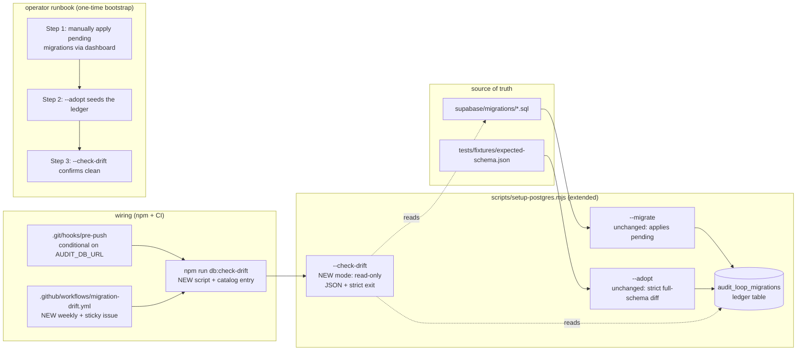

# Plan: Migration-drift detector for the audit-loop store

- **Date**: 2026-05-23
- **Status**: Complete — code shipped (edffa19), operator bootstrap done via Supabase CLI, expected-schema regenerated (b13552d), --check-drift reports 32/32 clean
- **Author**: Claude + Louis
- **Scope**: backend
- **Stack**: js-ts
- **Target domain(s)**: `scripts`, `shared-lib`, `supabase`, `tests`
- ⚠ **Cross-domain work** — touches 4 domains, but every change is colocated under the existing `scripts/setup-postgres.mjs` module + the `supabase/migrations/` source convention + a single new test file. No new modules, no new top-level surfaces. The cross-domain count is an artifact of how the codebase is tagged, not actual architectural sprawl.

## 1. Context Summary

While drafting [docs/plans/liveness-and-canonical-paths.md](liveness-and-canonical-paths.md), `cross-skill.mjs upsert-plan --json '{"skill":"plan",…}'` failed with:

```
[learning] upsertPlan failed: new row for relation "plans" violates check constraint "plans_skill_check"
```

Investigation showed the live cloud Postgres `plans_skill_check` constraint still reads
`CHECK (skill IN ('plan-backend', 'plan-frontend', 'manual', 'other'))` — missing `'plan'`. The migration that widens it ([supabase/migrations/20260519120000_plans_skill_unified.sql](../../supabase/migrations/20260519120000_plans_skill_unified.sql)) was committed 4 days ago but never applied. Worse, **two more recent migrations are also unapplied**:

| Migration | Status today | Silent breakage |
|---|---|---|
| `20260519120000_plans_skill_unified.sql` | unapplied | every `/plan` since 2026-05-19 has `cross-skill.upsertPlan` returning `{ok:false}`; audit_runs.plan_id stays null |
| `20260520120000_consistency_source_kinds.sql` | unapplied | `/persona-test --mode consistency` candidate-write fails; `/ship` Step 5.6 promote can't read |
| `20260521120000_persona_test_candidates.sql` | unapplied | WS-PIPE1 cross-repo candidate aggregation (commit `b339afd`) writes to a non-existent table |

The drift is silent because every `cross-skill.mjs` writer fails-soft (`{ok:false}` + log; never throws to the caller). `[learning] upsertPlan failed` is the only loud signal, and it only fires when the planner happens to invoke that one path. Three days of feature work has been shipping with broken cloud writes.

### Why it happened

The operator applies migrations through the Supabase dashboard SQL editor, not [scripts/setup-postgres.mjs](../../scripts/setup-postgres.mjs)`--migrate` (which is the documented path in AGENTS.md "Postgres-Parity Store"). The dashboard doesn't update the [audit_loop_migrations](../../scripts/setup-postgres.mjs#L184-L189) ledger, so the project has no record of what's applied and no CI gate that fails on drift. The most recent migrations simply got missed.

### Neighbourhood considered

Strong reuse signal — **everything we need already exists in setup-postgres.mjs**:

| Existing function | Lines | Reuse role |
|---|---|---|
| [runAdopt](../../scripts/setup-postgres.mjs#L471-L520) | 471-520 | Closest match (`justify-divergence`, sim 0.86). Already does live-vs-expected diff + seed ledger. **Reused unchanged.** (Earlier draft proposed extending it with `--through <prefix>`; dropped per R1 H1+H2.) |
| [runMigrate](../../scripts/setup-postgres.mjs#L430-L469) | 430-469 | Apply path; already idempotent via sha256-skip. No code change. |
| [ensureLedger](../../scripts/setup-postgres.mjs#L191-L193) | 191-193 | Ledger DDL; reused as-is by new modes. |
| [readLedger](../../scripts/setup-postgres.mjs#L195-L198) | 195-198 | `Map<filename, sha256>` reader. |
| [recordApplied](../../scripts/setup-postgres.mjs#L200-L206) | 200-206 | Ledger upsert. |
| [listMigrations](../../scripts/setup-postgres.mjs#L210-L213) | 210-213 | Source-dir enumerator. |
| [sha256](../../scripts/setup-postgres.mjs#L215-L219) | 215-219 | File hasher. |
| [diffSchemas](../../scripts/setup-postgres.mjs#L266-L290) | 266-290 | Live-vs-expected categorical diff. |

Pattern mirrors I'll copy for CI wiring:

- **[memory-health.yml](../../.github/workflows/memory-health.yml)** + **[architectural-drift.yml](../../.github/workflows/architectural-drift.yml)**: weekly cron + sticky GitHub issue with auto-close on green. Same shape for `migration-drift.yml`.
- **[check-context-drift.mjs](../../scripts/check-context-drift.mjs)** + **[check-model-freshness.mjs](../../scripts/check-model-freshness.mjs)**: existing project pattern for "read-only drift check with `--format json` and `--strict` exit-code gating". Same shape for the new `--check-drift` mode.
- **[check-sync.mjs](../../scripts/check-sync.mjs)**: existing pattern for **conditional-on-env** pre-push diagnostic (`AUDIT_DB_URL`-gated, never blocks contributors without DB access).

No prior security incidents matched these paths (incident neighbourhood: 0 records).

## 2. Proposed Architecture



### Key design decisions

1. **No new module** (#3 Modularity, #5 Single Source of Truth). All new behaviour lands inside [scripts/setup-postgres.mjs](../../scripts/setup-postgres.mjs). The architecture-memory query confirmed `runAdopt` already does the bootstrap pattern at sim 0.86 — extending it is the right call vs sibling. A separate file would be the **second** module that knows the catalog-query layout — guaranteed drift surface.

2. **`--adopt` stays strict (no `--through`)** (#13 Idempotency, #15 Graceful Degradation, addresses R1-audit H1+H2). An earlier draft proposed `--through <prefix>` for a partial-adopt mode. Two HIGH findings rejected it: (a) the prefix is lexicographically ambiguous (`20260518120000_x.sql > 20260518` is true, so files with the cutoff timestamp prefix would be unintentionally excluded), and (b) downgrading the diff to "missing-in-live is allowed" creates a false-green path — a half-applied migration (operator's dashboard run crashed mid-stream) presents as "missing" and gets silently marked applied. The only sound partial-adopt would require generating a per-cutoff expected-schema manifest by replaying migrations into a scratch DB — significant infrastructure for a strictly one-time bootstrap. Cheaper: keep `--adopt` as a STRICT full-schema diff, and require operators to apply outstanding migrations through the dashboard ONCE before adopting. Today's drift gap (3 unapplied migrations) is a one-time pain regardless of which path we choose; after the first `--adopt` succeeds, every future migration goes through `--migrate` and the ledger stays current automatically.

3. **`--check-drift` is TRULY read-only** (#16 Error Handling, #19 Observability, addresses R1-audit M1 + R3-audit M1). New mode; reads source files + ledger, computes drift. NEVER writes — no `ensureLedger` call, no DDL, no DML. Exit-code contract:

   - **0** — clean (no drift) OR cloud-disabled (`AUDIT_DB_URL` unset → graceful no-op, matches `cloud:false` pattern used across the audit-loop store).
   - **1** — drift: at least one of the three drift kinds is non-empty.
   - **2** — hard error: connection failure, can't read migration directory, etc.
   - **3** — needs bootstrap: AUDIT_DB_URL connects fine but `audit_loop_migrations` table is missing. Actionable message: `"audit_loop_migrations table missing — bootstrap via `node scripts/setup-postgres.mjs --adopt` first"`.

   The cloud-disabled → exit 0 path (R3-audit M1) is what lets `check:integration` chain `arch:refresh:full && --check-drift` as a single composite: the first half short-circuits via `isCloudEnabled()` on `cloud:false`, and the second half exits 0 the same way. The composite gracefully reports "no DB; nothing to verify" rather than failing the script. JSON output in cloud-disabled mode: `{"cloud": false, "skipped": true, "reason": "AUDIT_DB_URL unset"}`.

   Three drift kinds surfaced separately so CI logs are diagnostic:

   - **unapplied**: source file exists, no ledger row (operator forgot to apply).
   - **sha-mismatch**: source file edited after apply (someone amended a committed migration — should fail loud).
   - **orphan-ledger**: ledger row exists, no source file (someone deleted a migration without backing it out — investigation needed).

4. **Output format dual-purpose** (#11 Testability, #19). Human-readable stderr by default (mirrors the existing setup-postgres style with G/R/Y colors). `--format json` emits the structured drift report on stdout for CI consumption. Mirrors the existing pattern in [check-model-freshness.mjs](../../scripts/check-model-freshness.mjs) (`--format human|json` + `--strict`).

5. **Pre-push wire is fail-soft** (#15 Graceful Degradation). The pre-push hook calls `npm run db:check-drift --silent` ONLY when `AUDIT_DB_URL` is set in the operator's env. On drift, prints a one-line yellow warning with the recovery command — does NOT block the push. Why fail-soft: not all contributors have DB access, and an operator who's about to push a NEW migration legitimately has drift right up until they apply it (the migration sql file exists in HEAD but the ledger row doesn't until `--migrate` runs). Hard-blocking would create a chicken-and-egg.

6. **CI wire runs on three triggers** (#19 Observability, addresses R1-audit H3). The plan originally specified weekly cron only — but the incident that motivated this work had a 4-day silent window, and weekly leaves a 1–7 day blind spot after every migration merge. Adding two faster triggers:

   - **`schedule: cron '45 9 * * 1'`** — Mondays 09:45 UTC. Backstop catch-all; runs even if no migrations land for weeks. (15-min stagger from `architectural-drift.yml`.)
   - **`push` to `main` with `paths: 'supabase/migrations/**'`** — fires immediately on any commit landing a new migration. Closes the post-merge gap from days to minutes.
   - **`workflow_dispatch`** — manual operator trigger after running `--migrate` to verify clean.

   Exit-code-driven sticky-issue logic (addresses R1-audit M2): the workflow distinguishes the four exit codes from `--check-drift`. Only **exit 1** (drift) opens/updates a sticky issue with label `migration-drift`. **Exit 2 or 3** (hard error / needs bootstrap) fail the workflow run loudly but do NOT pollute the issue tracker — those are infra/onboarding problems that need a human, not a sticky issue. Exit 0 auto-closes any open sticky issue.

7. **No SQL migrations added** (per non-goal #4). The ledger table DDL is already in source (line 183-189); calling `ensureLedger` is enough. We don't need to add `supabase/migrations/2026…_audit_loop_migrations_ledger.sql` because the ledger table is a tooling concern, not an application schema concern — putting it under `supabase/migrations/` would conflate "schema the application depends on" with "tooling state".

### Public-CLI contract change blast radius

| Surface | Today | Post-plan |
|---|---|---|
| `node scripts/setup-postgres.mjs --migrate` | applies migrations missing from ledger | unchanged (idempotent re-runs still skip) |
| `node scripts/setup-postgres.mjs --adopt` | full-seed when live=expected; abort on drift | **unchanged**. Strict full-schema diff. (Earlier draft proposed `--through <prefix>` for partial-adopt — dropped after R1 audit H1+H2 deemed it unsound.) |
| `node scripts/setup-postgres.mjs --check-drift` | (doesn't exist) | NEW. exits 0/1/2/3 (clean/drift/hard-error/needs-bootstrap); `--format json` for CI. |
| `node scripts/setup-postgres.mjs --check-drift --format json` | n/a | NEW. JSON on stdout for CI consumption. |
| `npm run db:check-drift` / `db:check-drift:json` | (doesn't exist) | NEW npm scripts. `db:check-drift:json` invokes `node scripts/setup-postgres.mjs --check-drift --format json` directly (no `npm run` wrapper in CI — see R1-audit M3). |
| Pre-push hook | runs `npm run check` (context-drift + skills + tests) | adds conditional `node scripts/setup-postgres.mjs --check-drift` warn when `AUDIT_DB_URL` set (committed change is to `scripts/install-prepush-hook.mjs` template — see R1-audit M4). |
| `.github/workflows/migration-drift.yml` | (doesn't exist) | NEW. Three triggers: weekly cron + push-on-migrations-dir + workflow_dispatch. Sticky issue + auto-close. |
| `npm run check` | unchanged | unchanged. DB check is pre-push-only (env-conditional), not part of the local `npm run check` flow because it requires cloud connectivity. |

## 3. Execution Model

**Are any planned operations dependent on others?** Yes — one tight chain. The pre-push wire and CI workflow both depend on `--check-drift` existing as a working CLI mode in `setup-postgres.mjs`. The operator runbook to clear today's drift is sequential (manual apply → `--adopt` → `--check-drift` verify) but happens out-of-band after the code lands.

### Sequencing (one workstream, one PR — but ordered internally)

| Order | Step | Atomicity boundary | Failure semantics |
|---|---|---|---|
| 1 | Add `--check-drift` CLI mode + `runCheckDrift(pool, opts)` function | One commit-internal step. Functional in isolation against a DB that has a populated ledger. | If `--check-drift` itself regresses, revert this step; the existing modes are untouched. |
| 2 | Add `npm run db:check-drift` / `db:check-drift:json` / `db:migrate` / `db:adopt` scripts + CLI catalog entries | Trivial config; revertable in isolation. | If catalog test fails (we hit this with `check:integration` in WS3), update `scripts/.cli-catalog.json` to match. |
| 3 | Pre-push wire — documented snippet in AGENTS.md, operator-paste into their source-repo `.git/hooks/pre-push` (Gemini-R1: install-prepush-hook.mjs is the wrong template — it's for consumer repos). No code change beyond docs. | Doc-only. | If operator forgets to paste, CI weekly cron + push-on-migration trigger still catches drift within minutes. |
| 4 | Add `.github/workflows/migration-drift.yml` | New file; three triggers (cron + push-on-migrations + dispatch). | If the workflow fails to mint a token / open an issue, the cron fails silently — no impact on existing workflows. |
| 5 | Document in AGENTS.md "Postgres-Parity Store" section: the new modes + bootstrap runbook for today's drift situation | Doc-only. | n/a. |
| 6 | Operator runbook execution (out-of-band, by Louis) — clears today's 3 unapplied migrations + seeds the ledger | NOT a code step. Runs after merge. See §7 for the corrected recovery sequence (R1-audit M6: no dashboard fallback; idempotency fixes go in the source migration file). | Recovery path documented inline in AGENTS.md. |

The PR ships steps 1-6 atomically; step 7 is the operator action that resolves today's silent breakage and is captured in the implementation log when complete.

### Concurrency model

All steps are serial within the PR. The CI workflow has `concurrency: group: migration-drift, cancel-in-progress: false` (same as architectural-drift) so two cron firings can't race.

### Partial failure recovery

If `--check-drift` reports drift CI-side but the operator can't immediately fix it (e.g. they're on holiday), the sticky issue documents the recovery command. The label `migration-drift` is consistent with the `architectural-drift` / `memory-health` patterns operators are already used to. Pre-push warning persists across pushes — there's no time pressure to fix immediately.

## 4. Engineering Principles Applied

| # | Principle | How it shows up |
|---|---|---|
| #1 | DRY | Catalog queries, ledger DDL, sha256 helper, listMigrations all reused; no duplicates. |
| #3 | Modularity | New behaviour is three small functions inside `setup-postgres.mjs`, not a sibling module. The CLI is the seam. |
| #5 | Single Source of Truth | `audit_loop_migrations` is the only authoritative record of "what's applied". `expected-schema.json` is the only authoritative record of "what the schema should look like fully migrated". One file per question. |
| #6 | Open/Closed | New CLI flags (`--check-drift`, `--format`) extend the existing arg parser by one entry each. No existing flag changes meaning. |
| #11 | Testability | `runCheckDrift` accepts an injectable `pool` (already the project pattern); fixtures drive ledger contents + source files via `mkdtemp` so the test never touches the live DB. |
| #13 | Idempotency | `--check-drift` is read-only by design — running it 100 times has the same effect as running it once. `--adopt` calls `recordApplied` which already uses `ON CONFLICT DO UPDATE`. |
| #15 | Graceful Degradation | Missing `AUDIT_DB_URL` → pre-push wire is a no-op (matches existing `check-sync.mjs` pattern). Missing ledger table → `--check-drift` exits 3 with a bootstrap hint. Missing `expected-schema.json` → `--adopt` errors with an actionable message (same as the current `runAdopt`). |
| #16 | Error Handling | Three distinct drift kinds (unapplied / sha-mismatch / orphan-ledger) surface separately. Hard-error exit code 2 for "can't connect" vs drift exit code 1 — CI gates can distinguish "infra down" from "drift". |
| #18 | Backward Compatibility | Every existing CLI invocation still works. `--adopt` is untouched. `--migrate` is untouched. New flags only extend the parser. |
| #19 | Observability | Sticky GitHub issue with label `migration-drift`; auto-close on green; per-drift-kind structured JSON for downstream tooling. |
| #20 | Long-Term Flexibility | A future "auto-apply on CI" workflow could call `--migrate` directly using the same ledger; nothing in this plan precludes it. We're not committing to manual-only forever; we're paving the path to make automation safe later. |

## 5. Long-Term Sustainability

### Assumptions encoded

- **Migration files are append-only after apply** — the sha-mismatch detector enforces this. If the operator legitimately needs to amend a migration (rare; usually means a hot-fix), they manually update `audit_loop_migrations.sha256` per the existing error message in [runMigrate](../../scripts/setup-postgres.mjs#L457-L458). This plan doesn't change that contract; it just makes the existing rule visible at check time, not just apply time.
- **`supabase/migrations/*.sql` is the source of truth for what should be applied** — already established. The check just makes it a verifiable contract.
- **`AUDIT_DB_URL` is the canonical pointer to "the audit-loop store"** — already established by the postgres-parity work (M1-M4). No new env var.
- **Operator applies migrations via this tool, not via the dashboard** — NEW assumption. The operator runbook in step 7 establishes this. The plan does NOT enforce it (we can't prevent dashboard use), but the check workflow makes drift visible within a week.

### What we WON'T do

- **Auto-apply migrations from CI on push** — too risky; needs a deployment-strategy review of its own. The current plan is detection-only. Auto-apply is a future workstream.
- **Migrate to Knex / node-pg-migrate / etc.** — explicit non-goal. Our convention works; it's the gating + visibility that's been missing.
- **Per-environment ledgers** — v1 is single-tenant (one Supabase project per repo). If we ever multi-tenant the audit-loop store, the ledger becomes a `(tenant, filename)` PK. Single-tenant assumption matches the project's broader Postgres-parity v1 stance.
- **Reverse / down migrations** — the existing project pattern is "forwards-only; reverse scripts are committed alongside for ops use ONLY" (per the 20260520 migration's header). We don't change that.
- **Migrate the existing `supabase/migrations/*.sql` for safer re-apply** — out of scope. The point is to detect drift, not retrofit idempotency to old migrations.

### Migration path if this outgrows v1

If we later need multi-tenant or per-environment ledgers, the cleanest evolution is: add a `tenant` column to `audit_loop_migrations` with a `DEFAULT 'default'` so existing rows tag in cleanly; widen the PK; update `readLedger` + `recordApplied` signatures. The CLI flag set grows by one (`--tenant`). No structural rewrite.

## 6. File-Level Plan

### EDIT [scripts/setup-postgres.mjs](../../scripts/setup-postgres.mjs)

Three concrete additions, all colocated. Diff is small (~80 lines of new code) and self-contained.

#### Addition 1 — `runCheckDrift(pool, opts)` function

Inserted between `runAdopt` (line 471-520) and `main()` (line 524):

```js
/**
 * Read-only drift check. Compares supabase/migrations/*.sql against the
 * audit_loop_migrations ledger. Three drift categories surfaced separately
 * so CI logs are diagnostic:
 *   - unapplied:     source file exists, no ledger row
 *   - shaMismatch:   ledger sha ≠ current source sha
 *   - orphanLedger:  ledger row, no source file
 *
 * Exit semantics (set by main()):
 *   0 — clean (no drift)
 *   1 — drift detected (any of the three categories non-empty)
 *   2 — hard error (no pool, can't query)
 *
 * @returns {Promise<{drift: {unapplied:[], shaMismatch:[], orphanLedger:[]}, applied: number, sourceTotal: number}>}
 */
/**
 * R2-audit M1: dependency-inject migrationsDir + output streams so the
 * test suite can run against an in-memory pool + a mkdtemp migrations
 * directory without touching production paths or capturing stderr globally.
 *
 * Production callers from main() pass nothing — defaults match the
 * existing module constants exactly, no behaviour change.
 */
async function runCheckDrift(pool, {
  format         = 'human',
  migrationsDir  = MIGRATIONS_DIR,
  stdout         = process.stdout,
  stderr         = process.stderr,
} = {}) {
  // R1-audit M1: TRULY read-only. Never call ensureLedger. If the table
  // doesn't exist, surface as exit 3 with an actionable bootstrap hint.
  const ledgerExists = await pool.query(
    `SELECT to_regclass('public.audit_loop_migrations') AS t`
  );
  if (!ledgerExists.rows[0].t) {
    const msg = 'audit_loop_migrations table missing — bootstrap via `node scripts/setup-postgres.mjs --adopt` first';
    if (format === 'json') {
      stdout.write(JSON.stringify({ hasDrift: false, needsBootstrap: true, message: msg }, null, 2) + '\n');
    } else {
      stderr.write(`\n${R}── Migration drift check ──${X}\n  ${R}error${X}: ${msg}\n`);
    }
    return { hasDrift: false, needsBootstrap: true, exitCode: 3 };
  }
  const ledger = await readLedger(pool);                      // Map<filename, sha256>
  const files = await listMigrations(migrationsDir);          // sorted string[] — uses injected dir
  const sourceHashes = new Map();
  for (const f of files) {
    sourceHashes.set(f, await sha256(path.join(migrationsDir, f)));
  }

  const unapplied = files.filter(f => !ledger.has(f));
  const shaMismatch = files
    .filter(f => ledger.has(f) && ledger.get(f) !== sourceHashes.get(f))
    .map(f => ({ filename: f, ledgerSha: ledger.get(f), sourceSha: sourceHashes.get(f) }));
  const orphanLedger = [...ledger.keys()].filter(f => !sourceHashes.has(f));

  const hasDrift = unapplied.length + shaMismatch.length + orphanLedger.length > 0;
  const result = {
    drift: { unapplied, shaMismatch, orphanLedger },
    applied: ledger.size,
    sourceTotal: files.length,
    hasDrift,
    needsBootstrap: false,
    exitCode: hasDrift ? 1 : 0,
  };

  if (format === 'json') {
    stdout.write(JSON.stringify(result, null, 2) + '\n');
  } else {
    renderHumanDriftReport(result, stderr);
  }
  return result;
}

function renderHumanDriftReport({ drift, applied, sourceTotal, hasDrift }, stderr = process.stderr) {
  stderr.write(`\n${G}── Migration drift check ──${X}\n`);
  stderr.write(`  ledger: ${applied} applied / ${sourceTotal} source files\n`);
  if (!hasDrift) {
    stderr.write(`  ${G}✓${X} no drift\n`);
    return;
  }
  if (drift.unapplied.length) {
    stderr.write(`\n  ${Y}unapplied${X} (${drift.unapplied.length}) — run \`node scripts/setup-postgres.mjs --migrate\`:\n`);
    for (const f of drift.unapplied) stderr.write(`    + ${f}\n`);
  }
  if (drift.shaMismatch.length) {
    stderr.write(`\n  ${R}sha-mismatch${X} (${drift.shaMismatch.length}) — committed migration edited after apply:\n`);
    for (const m of drift.shaMismatch) {
      stderr.write(`    ! ${m.filename}\n      ledger: ${m.ledgerSha.slice(0,12)}…  source: ${m.sourceSha.slice(0,12)}…\n`);
    }
  }
  if (drift.orphanLedger.length) {
    stderr.write(`\n  ${Y}orphan-ledger${X} (${drift.orphanLedger.length}) — applied but no source file (deleted?):\n`);
    for (const f of drift.orphanLedger) stderr.write(`    ? ${f}\n`);
  }
}
```

**Companion edit — `listMigrations` accepts an optional directory** (R2-audit M1 — same DI rationale):

```js
// EXISTING
async function listMigrations() {
  const entries = await fs.promises.readdir(MIGRATIONS_DIR);
  return entries.filter((e) => e.endsWith('.sql')).sort();
}

// AFTER
async function listMigrations(dir = MIGRATIONS_DIR) {
  const entries = await fs.promises.readdir(dir);
  return entries.filter((e) => e.endsWith('.sql')).sort();
}
```

Existing callers (`runMigrate`, `runAdopt`) pass no argument — production behaviour unchanged.

#### Addition 2 — CLI arg parsing for `--check-drift` + `--format`

Gemini-R2-H1 caught a subtle bug in an earlier draft: the existing `parseArgs` uses `for (const a of argv)` — there's no `i` variable, so `argv[++i]` would ReferenceError. Two equally-clean fixes; this plan picks the indexed-loop refactor because the alternative (`--format=json` syntax) breaks consistency with other flags. Convert the loop:

```js
// BEFORE — existing pattern, no i variable
function parseArgs(argv) {
  const args = { mode: null, /* ... */ };
  for (const a of argv) {
    switch (a) {
      case '--migrate': args.mode = 'migrate'; break;
      /* ... */
    }
  }
  return args;
}

// AFTER — indexed loop so flag-with-value works uniformly
function parseArgs(argv) {
  const args = { mode: null, format: 'human', /* ... */ };
  for (let i = 0; i < argv.length; i++) {
    const a = argv[i];
    switch (a) {
      case '--migrate':         args.mode = 'migrate'; break;
      case '--adopt':           args.mode = 'adopt'; break;
      case '--check-drift':     args.mode = 'check-drift'; break;
      case '--format':          args.format = argv[++i]; break;     // 'human' (default) | 'json'
      case '--preflight-only':  args.preflightOnly = true; break;
      case '--bootstrap-only':  args.bootstrapOnly = true; break;
      case '--dry-run':         args.dryRun = true; break;
      default:
        if (a.startsWith('--')) {
          process.stderr.write(`${R}error${X}: unknown flag ${a}\n`);
          process.exit(2);
        }
    }
  }
  return args;
}
```

Production behaviour for existing flags is identical — they're all bare-flag toggles that don't consume the next argv slot. The refactor only opens space for `--format <value>` to advance the iterator safely.

Dispatch in `main()` — propagate the exit code, handle the cloud-disabled case BEFORE the pool error-check (the rest of `main()` exits 2 when pool is null; for `--check-drift` we want exit 0):

```js
} else if (args.mode === 'check-drift') {
  // R3-audit M1: cloud-disabled → exit 0 (matches the cloud:false pattern).
  // This branch precedes the pool null-check below.
  if (!pool) {
    if (args.format === 'json') {
      process.stdout.write(JSON.stringify({
        cloud: false, skipped: true, reason: 'AUDIT_DB_URL unset',
      }, null, 2) + '\n');
    } else {
      process.stderr.write(`\n${Y}── Migration drift check ──${X}\n  ${D}skipped${X} — AUDIT_DB_URL unset\n`);
    }
    process.exit(0);
  }
  const r = await runCheckDrift(pool, { format: args.format });
  process.exit(r.exitCode);                                   // 0 | 1 | 3 (2 only on thrown error caught above)
}
```

The cloud-disabled branch must sit BEFORE the existing `if (!pool) { … process.exit(2); }` guard near the top of `main()`. The cleanest implementation is to move the pool null-check INTO the per-mode dispatch (where each mode decides its own semantics for cloud-disabled), or to early-return the `check-drift` mode before the generic guard. Either works — pick whichever produces less diff churn.

`runAdopt` is **unchanged**. The earlier draft proposed `--through <prefix>` for partial-adopt; R1-audit H1+H2 deemed it unsound (lexicographic ambiguity + false-green ledger risk). Dropped — see Decision 2 in §2.

### EDIT [package.json](../../package.json)

```json
"db:check-drift":      "node scripts/setup-postgres.mjs --check-drift",
"db:check-drift:json": "node scripts/setup-postgres.mjs --check-drift --format json",
"db:migrate":          "node scripts/setup-postgres.mjs --migrate",
"db:adopt":            "node scripts/setup-postgres.mjs --adopt",
"check:integration":   "node scripts/symbol-index/refresh.mjs --full && node scripts/setup-postgres.mjs --check-drift"
```

The `check:integration` change (R2-audit M3) is an explicit edit to the WS3-added script — chain `--check-drift` AFTER `arch:refresh:full` so the operator gets one command that exercises both. Both halves require `AUDIT_DB_URL`; the first half short-circuits via `isCloudEnabled()`, the second exits 3 with a bootstrap hint — so the env-gating is inherited cleanly.

The two new `db:check-drift*` scripts are load-bearing. The two `db:migrate` / `db:adopt` aliases are convenience — the underlying `node scripts/...` invocations stay valid and documented; the aliases just match the rest of the npm-script vocabulary (cf. `arch:refresh`, `learning:replay`). Optional but cheap.

### EDIT [scripts/.cli-catalog.json](../../scripts/.cli-catalog.json)

```json
"db:check-drift": {
  "description": "Read-only drift check: compares supabase/migrations/*.sql vs audit_loop_migrations ledger. Exit 1 on drift. Requires AUDIT_DB_URL.",
  "category": "diagnostic"
},
"db:check-drift:json": {
  "description": "Drift check, JSON output for CI.",
  "category": "diagnostic"
},
"db:migrate": {
  "description": "Apply pending migrations (idempotent; skips already-applied via sha256). Requires AUDIT_DB_URL.",
  "category": "diagnostic"
},
"db:adopt": {
  "description": "Bootstrap audit_loop_migrations ledger by diffing live schema against tests/fixtures/expected-schema.json. Strict full-schema match required; manually apply outstanding migrations through the dashboard ONCE before running.",
  "category": "diagnostic"
}
```

(Same gate as `check:integration` — without these, the dashboard-CLI regression test in `tests/dashboard-cli.test.mjs` will fail.)

### Pre-push wire — operator-self-service snippet (NOT installed automatically)

Gemini-R1 caught a category error in an earlier draft of this plan: the existing [scripts/install-prepush-hook.mjs](../../scripts/install-prepush-hook.mjs) template is for CONSUMER repos (auto-runs `/audit-code` on draft plans, uses `$AUDIT_LOOP_DIR`, has no `npm run check` block). It is NOT the right home for a source-repo drift check.

The source-repo `.git/hooks/pre-push` is per-machine and not regenerated by any committed template. Rather than introduce a second installer pipeline for one snippet, the plan documents the chunk in [AGENTS.md](../../AGENTS.md) as an operator-paste:

```bash
# ── 1b. Migration-drift check (advisory, non-blocking) ─────────────────
# Only fires when AUDIT_DB_URL is set in the operator's env (matches the
# check-sync.mjs convention). Drift is warned but never blocks the push —
# a contributor without DB access is a valid use case, and a brand-new
# migration committed in this push legitimately surfaces as "unapplied"
# until --migrate runs.
#
# Invoke node directly (not `npm run`) to avoid npm's own log lines
# polluting the drift report on stderr.
if [ -f "$REPO_ROOT/package.json" ] && [ -n "$AUDIT_DB_URL" ]; then
  echo "→ Migration-drift check..."
  # R3-audit H1: capture exit defensively. Use `|| DRIFT_EXIT=$?` so that
  # even if a future edit adds `set -e` at the top of the hook, a non-zero
  # exit from the subshell doesn't terminate the hook before we can decide
  # whether it warrants a warning or a real failure. The leading `DRIFT_EXIT=0`
  # ensures the variable is bound even on the unlikely clean-exit-with-set-e
  # path.
  DRIFT_EXIT=0
  ( cd "$REPO_ROOT" && node scripts/setup-postgres.mjs --check-drift ) || DRIFT_EXIT=$?
  case "$DRIFT_EXIT" in
    0) ;;  # clean — silent pass
    1) echo "⚠  migration-drift detected — push continues, but recover with:"
       echo "     node scripts/setup-postgres.mjs --migrate" ;;
    3) echo "⚠  audit_loop_migrations ledger missing — bootstrap with:"
       echo "     node scripts/setup-postgres.mjs --adopt" ;;
    *) echo "⚠  drift check infra error (exit $DRIFT_EXIT) — push continues" ;;
  esac
fi
```

The operator pastes the chunk into their source-repo `.git/hooks/pre-push` once. Future updates are operator-discretion (this is per-machine state; the CI workflow is the primary safety net regardless of whether the hook is installed). AGENTS.md documents the snippet in a fenced code block under the "Migration-drift detection" subsection so operators can copy-paste in one shot.

### NEW [.github/workflows/migration-drift.yml](../../.github/workflows/migration-drift.yml)

Modeled on [.github/workflows/architectural-drift.yml](../../.github/workflows/architectural-drift.yml) — same sticky-issue + auto-close logic, three triggers (R1-audit H3), exit-code-aware status mapping (R1-audit M2), JSON capture via `node` directly (R1-audit M3):

```yaml
name: migration-drift

on:
  schedule:
    - cron: '45 9 * * 1'                  # Mondays 09:45 UTC — backstop
  push:
    branches: [main]
    paths:
      - 'supabase/migrations/**'          # event-driven: fires within minutes of merge
      - 'scripts/setup-postgres.mjs'      # tooling regression also re-triggers check
  workflow_dispatch:                      # manual operator trigger post-migrate

permissions:
  contents: read
  issues: write

concurrency:
  group: migration-drift
  cancel-in-progress: false

jobs:
  drift:
    runs-on: ubuntu-latest
    steps:
      - uses: actions/checkout@v6
      - uses: actions/setup-node@v6
        with: { node-version: '22', cache: 'npm' }
      - run: npm ci --ignore-scripts

      - name: Verify AUDIT_DB_URL secret
        id: secret-check
        env:
          AUDIT_DB_URL: ${{ secrets.AUDIT_DB_URL }}
        run: |
          if [ -z "$AUDIT_DB_URL" ]; then
            echo "::warning::AUDIT_DB_URL not set — skipping"
            echo "skip=true" >> "$GITHUB_OUTPUT"
          else
            echo "skip=false" >> "$GITHUB_OUTPUT"
          fi

      - name: Check migration drift
        if: steps.secret-check.outputs.skip != 'true'
        id: drift
        env:
          AUDIT_DB_URL: ${{ secrets.AUDIT_DB_URL }}
          AUDIT_DB_SSL_MODE: no-verify
        run: |
          set +e
          # Invoke node directly, NOT `npm run` (R1-audit M3): npm prepends
          # its own banner to stdout under some CI configs which breaks
          # JSON parsing downstream. node has no such wrapping.
          node scripts/setup-postgres.mjs --check-drift --format json > /tmp/migration-drift.json
          EXIT=$?
          set -e
          echo "exit=$EXIT" >> "$GITHUB_OUTPUT"
          # Per --check-drift contract (R1-audit M2):
          #   0 → clean      → auto-close any open sticky issue
          #   1 → drift      → open/update sticky issue
          #   2 → hard error → fail workflow loudly; do NOT touch issue tracker
          #   3 → bootstrap  → fail workflow loudly; do NOT touch issue tracker
          case "$EXIT" in
            0) echo "status=green"     >> "$GITHUB_OUTPUT" ;;
            1) echo "status=triggered" >> "$GITHUB_OUTPUT" ;;
            *) echo "status=infra"     >> "$GITHUB_OUTPUT"
               echo "::error::db:check-drift exited $EXIT (infra/bootstrap issue — not opening sticky issue)"
               exit "$EXIT" ;;
          esac

      # (Sticky-issue open/update + auto-close blocks — copy-paste from architectural-drift.yml,
      #  changing label/marker to `migration-drift`. Conditioned on status='triggered' or 'green'
      #  respectively; status='infra' never reaches these blocks because the prior step failed.)
```

### EDIT [AGENTS.md](../../AGENTS.md) — Postgres-Parity Store section

Add a new sub-section after "Setup recipe":

```markdown
### Migration-drift detection

The `audit_loop_migrations` ledger (created on first `--migrate` or `--adopt`)
records which `supabase/migrations/*.sql` files have been applied to the live
DB. Drift = source files committed but not applied (or applied but later
edited). Surfaced two ways:

- **Pre-push** (per-machine, advisory): when `AUDIT_DB_URL` is set, the hook
  runs `npm run db:check-drift` and warns on drift without blocking the push.
- **Weekly CI** (`migration-drift.yml`): runs the same check, opens a sticky
  GitHub issue with label `migration-drift` on drift, auto-closes when clean.

**One-time bootstrap** when the live DB hasn't been ledger-tracked before
(today's situation as of 2026-05-23):

| Step | Command | Effect |
|---|---|---|
| 1 | Manually apply any outstanding migrations through the Supabase dashboard SQL editor (today: the 3 files `20260519…`, `20260520…`, `20260521…`). | Brings live schema to parity with `tests/fixtures/expected-schema.json`. One-time pain. |
| 2 | `AUDIT_DB_URL=… node scripts/setup-postgres.mjs --adopt` | Strict full diff. Live MUST match the manifest. On match → ledger is seeded with all source migrations. On drift → aborts with a per-category diff so you can identify what's missing or extra. |
| 3 | `AUDIT_DB_URL=… node scripts/setup-postgres.mjs --check-drift` | Confirm clean. Exit 0 = ledger == source. |

**Going forward**: use `node scripts/setup-postgres.mjs --migrate` for every
new migration. It's idempotent (sha256-skip), records each apply in the ledger,
and keeps `--check-drift` clean automatically. The dashboard becomes a
break-glass tool, not the default path.

**Optional pre-push self-service** (the CI workflow is the primary gate; this
is a faster local-feedback loop for operators with `AUDIT_DB_URL` configured).
Paste this chunk into the source-repo `.git/hooks/pre-push` BEFORE the existing
consumer-repo sync block:

```bash
# managed-by: migration-drift-detector — operator self-service drift check
# Only fires when AUDIT_DB_URL is set; advisory only, never blocks.
# Git hooks already cwd to the repo root, so no cd or $REPO_ROOT needed
# (Gemini-R2-M1: removing an undefined variable that silently no-op'd).
if [ -f "package.json" ] && [ -n "$AUDIT_DB_URL" ]; then
  echo "→ Migration-drift check..."
  DRIFT_EXIT=0
  node scripts/setup-postgres.mjs --check-drift || DRIFT_EXIT=$?
  case "$DRIFT_EXIT" in
    0) ;;  # clean — silent pass
    1) echo "⚠  migration-drift detected — push continues, but recover with:"
       echo "     node scripts/setup-postgres.mjs --migrate" ;;
    3) echo "⚠  audit_loop_migrations ledger missing — bootstrap with:"
       echo "     node scripts/setup-postgres.mjs --adopt" ;;
    *) echo "⚠  drift check infra error (exit $DRIFT_EXIT) — push continues" ;;
  esac
fi
```

**If `--migrate` fails on a migration** (R1-audit M6): the fix is to make the
**source migration file** idempotent — wrap object creation with
`IF NOT EXISTS` / `IF EXISTS` clauses, then retry `--migrate`. Do NOT use the
dashboard as a fallback; that re-introduces the silent-drift bypass this
whole detector exists to eliminate.

**Break-glass — exact recipe** (R3-audit M2): if a hot-fix is genuinely needed
before the source can be patched (e.g. production incident, source-edit can't
land for hours), record the manual apply atomically with this exact sequence:

```bash
# Step 1: compute the canonical sha — MUST be sha256 of the source file
# as committed in this repo. Any divergence here defeats the sha-mismatch
# detector going forward. Cross-platform — node is the project's only
# guaranteed-installed binary (Gemini-R2-L1: sha256sum is Linux-only;
# macOS uses shasum -a 256). The node form matches the production
# implementation in scripts/setup-postgres.mjs::sha256 byte-for-byte.
SHA="$(node -e "console.log(require('node:crypto').createHash('sha256').update(require('node:fs').readFileSync(process.argv[1])).digest('hex'))" supabase/migrations/<filename>.sql)"

# Step 2: dashboard SQL editor — run the migration body AND the ledger insert
# in the SAME transaction. Both succeed or both roll back.
BEGIN;
  -- paste the migration SQL here
  INSERT INTO audit_loop_migrations (filename, sha256)
    VALUES ('<filename>.sql', '<PASTE $SHA FROM STEP 1>')
    ON CONFLICT (filename) DO UPDATE SET sha256 = EXCLUDED.sha256, applied_at = now();
COMMIT;

# Step 3: verify
AUDIT_DB_URL=… node scripts/setup-postgres.mjs --check-drift
```

The transaction boundary in Step 2 is load-bearing — without it, a successful
migration apply followed by a failed `INSERT` leaves the ledger lying about
reality, exactly the bug class we're fixing.

The break-glass path is documented but explicitly NOT the default. Use it
only when source-patch + `--migrate` is genuinely impractical.
```

## 7. Risk & Trade-off Register

| Risk | Mitigation |
|---|---|
| Operator manually edits a migration file AFTER applying it via the dashboard, BEFORE running `--adopt` | `--adopt` records `recordApplied(filename, current_sha256)` — the post-edit sha. The audit trail will look clean even though the original applied content differs from what's now in source. Acceptable: the same risk exists in any sha-based ledger. The sha-mismatch detector catches subsequent edits, restoring the loud-on-drift invariant after the first `--adopt`. Mitigation: AGENTS.md runbook says "don't edit a migration after dashboard-applying it; if you need to, document it in the PR." |
| Pre-push warning on every push that contains a new migration file (operator is about to apply it, but hasn't yet) | Acceptable — the warning IS the reminder. Yellow only, never blocks. After the operator runs `--migrate` the warning clears. |
| CI workflow can fail on transient network errors and open a sticky issue incorrectly | The drift report from `--check-drift` distinguishes exit 1 (drift) from exit 2 (hard error / can't connect). The workflow only opens an issue on `status=triggered` (exit 1). Transient errors surface as a workflow run failure but don't pollute the issue tracker. |
| `audit_loop_migrations` ledger lives in `public` schema; if Supabase ever changes the search-path for the runtime role we lose ledger access | Same risk as every other audit-loop table; out of scope here. Postgres-parity §2 documented this as v1-public-only. |
| Operator gets stuck if the bootstrap manual-apply (Step 1 of runbook) fails partway through one of the outstanding migrations | The migration files are committed to source; the failing migration becomes a regular hot-fix (make it idempotent via `IF NOT EXISTS` / `DROP ... IF EXISTS`, commit, retry). Same workflow as any other forwards-only migration bug. Mitigated by the fact that all 3 currently-unapplied migrations already use the idempotent patterns (verified in the §1 file inspection). |
| `expected-schema.json` is out of date relative to live + migrations | This is an existing risk for `--adopt`; not introduced here. Mitigation already exists: `npm run parity:expected-schema` regenerates against a freshly-migrated reference DB. |

### Deliberately deferred

- **Auto-apply on CI**: not in scope. Detection-only for v1.
- **Multi-tenant ledger**: not in scope. v1 stays single-tenant.
- **Down/reverse migrations**: not in scope; project convention is forwards-only.
- **Migration linting** (auth schema references, non-public-schema work, etc.): already covered by `scripts/postgres-parity/check-non-core-references.mjs`. Not duplicated here.
- **Backfill `expected-schema.json` automatically when `--migrate` runs**: tempting (keeps the manifest current), but the manifest serves a different audience (`--adopt` for new operators). Mixing concerns. Keep the regenerate step manual.

## 8. Testing Strategy

### NEW `tests/setup-postgres-check-drift.test.mjs`

Hermetic via the same pattern WS3's `tests/refresh-cli-contract.test.mjs` established: `mkdtemp` + a stub pool + small in-memory ledger. No live DB.

Test matrix:

| Case | Setup | Assertion |
|---|---|---|
| `clean` | ledger = 3 files w/ matching sha256, source = same 3 files | `runCheckDrift` returns `hasDrift: false`; exit 0 |
| `unapplied` | ledger = 2 files, source = 3 files | `drift.unapplied = [file3]`; exit 1 |
| `sha-mismatch` | ledger = 3 files w/ outdated sha for one, source = same 3 files | `drift.shaMismatch.length === 1`; reports both shas |
| `orphan-ledger` | ledger = 3 files, source = 2 files (one deleted) | `drift.orphanLedger = [file3]`; exit 1 |
| `mixed-drift` | all three categories non-empty | exit 1; all three lists populated; counts correct |
| `empty-ledger` | ledger table exists but 0 rows, source = N files | all source files reported as unapplied; exit 1 |
| `needs-bootstrap` (R3-audit M3) | ledger TABLE missing entirely; source = N files | exit 3; output contains `audit_loop_migrations table missing` + bootstrap hint; no DDL issued |
| `cloud-disabled` (R3-audit M1) | pool is null (no AUDIT_DB_URL) | exit 0; JSON shape `{cloud:false, skipped:true, reason:...}` |
| `format=json` | drift present | stdout is valid JSON parseable to the expected shape; stderr empty |
| `format=human` | drift present | stderr matches the diagnostic-line patterns; stdout empty |
| `ensureLedger idempotent` | call twice on fresh DB | second call no-op; no error |

The stub pool implements `query(text, params)` over an in-memory store, returning rows for the small set of queries `runCheckDrift` issues (the `to_regclass` table-exists check and the `SELECT filename, sha256 FROM audit_loop_migrations` read). No file-based fixture mirror is required — the implementation is self-contained in the new test file.

**Snippet-behaviour test** (R3-audit M3 + H1): a small `bash`-driven test that extracts the operator-paste snippet from `AGENTS.md` (matched by the `# managed-by: migration-drift-detector` marker comment we'll embed in the snippet) and pipes it through `bash` with `set -e` enabled + a mocked `node` shim returning each of {0,1,3,2}. Assert that:
- Exit 0 → snippet reaches the next line silently.
- Exit 1 → snippet prints the `migration-drift detected` warning AND reaches the next line (does NOT abort the parent shell).
- Exit 3 → snippet prints the bootstrap warning AND reaches the next line.
- Exit 2 → snippet prints the infra-error warning AND reaches the next line.

This is the load-bearing assertion behind the "advisory, never blocks" contract — and it's testable even though the snippet is operator-paste, because the canonical source-of-truth is the AGENTS.md code block (committed). If `set -e` ever creeps into the snippet via copy-paste or the `|| DRIFT_EXIT=$?` pattern regresses, this test fires.

(No `--adopt` test changes — the flag's existing behaviour is untouched, so the existing adopt-mode tests in `tests/setup-postgres.test.mjs` (if any) cover it without modification.)

### Source-inspection (mirrors WS3)

`tests/refresh-cli-contract.test.mjs` established the pattern of substring-asserting the wiring is in place. Add a small section in (or sibling of) `tests/setup-postgres-check-drift.test.mjs`:

- `scripts/setup-postgres.mjs` exports / defines `runCheckDrift` (mock-pool-friendly via DI signature).
- `parseArgs` recognises `--check-drift` and `--format`.
- `package.json` defines `db:check-drift`, `db:check-drift:json`, `db:migrate`, `db:adopt`.
- `scripts/.cli-catalog.json` has entries for all four.
- `AGENTS.md` "Migration-drift detection" subsection contains the fenced operator-paste snippet (Gemini-R1: no install-prepush-hook.mjs edit — the snippet is operator-self-service, not auto-installed). Test asserts the snippet exists in the file and contains the four exit-code branches (0/1/2/3).
- `.github/workflows/migration-drift.yml` exists and references `node scripts/setup-postgres.mjs --check-drift --format json` + label `migration-drift` + the three triggers (cron + push + dispatch).

### Existing-suite invariants

- All 2964 currently-passing tests stay green.
- `tests/dashboard-cli.test.mjs` regression gate passes — `scripts/.cli-catalog.json` covers every new npm script.

### Opt-in integration

Extend `npm run check:integration` (introduced in WS3) to ALSO run `node scripts/setup-postgres.mjs --check-drift` at the end. Operator gets a single command that exercises both arch:refresh AND drift detection end-to-end against the live DB. R1-audit M5: `check:integration` already requires `AUDIT_DB_URL` (arch:refresh:full short-circuits without it via `isCloudEnabled()`), so the env-gating is inherited — the drift step gracefully exits 3 ("needs bootstrap") if the ledger is missing rather than hard-failing the integration script. Document this transitive precondition in the `check:integration` description in `scripts/.cli-catalog.json`.

### Regression locks

No `/ux-lock` runs (no UI changes). No persona-test runs.

## 9. Cross-skill registration

```bash
node scripts/cross-skill.mjs upsert-plan --json '{
  "path": "docs/plans/migration-drift-detector.md",
  "skill": "plan-backend",
  "status": "draft"
}'
```

(Note: `skill='plan'` is intentionally NOT used until the 20260519 migration lands on the cloud — that's literally the migration this plan exists to surface. Using `plan-backend` is the documented escape hatch for the duration of this plan's draft phase.)

Update `status` to `in_progress` when the PR opens; `complete` when both the code lands AND the operator has run the runbook to clear today's drift.

## Implementation Log

### 2026-05-23 — R1 plan-audit revisions

R1 plan-audit (GPT-5.4) returned SIGNIFICANT_GAPS, H:3 M:6 L:0. All 9 findings valid + in-scope + fixed via plan edit:

| ID | Disposition | Edit |
|---|---|---|
| H1 — `--through` prefix lex-ambiguity | dropped flag entirely | §2 #2 + §6 Addition 2 + blast-radius table + runbook |
| H2 — partial-adopt false-green risk | dropped `--through`; runbook uses dashboard one-time + strict `--adopt` | §2 #2 + AGENTS.md runbook |
| H3 — weekly cron leaves 1-7 day gap | added `push` trigger on `supabase/migrations/**` + `workflow_dispatch` | §2 #6 + workflow YAML |
| M1 — read-only contract violated by `ensureLedger` | check-drift now NEVER writes; missing-ledger → exit 3 with bootstrap hint | §2 #3 + §6 Addition 1 |
| M2 — workflow exit-code branch wrong | distinguish exit 0/1/{2,3} with `case` block | workflow YAML |
| M3 — `npm run` pollutes JSON output | invoke `node scripts/setup-postgres.mjs --check-drift --format json` directly in CI | workflow YAML + pre-push hook |
| M4 — `.git/hooks/pre-push` framing confusing | committed surface is `scripts/install-prepush-hook.mjs` template; operator re-runs `hooks:install` | §6 EDIT block |
| M5 — `check:integration` env-gate unstated | gating is inherited from `arch:refresh:full`; documented in catalog entry | §8 Opt-in integration |
| M6 — dashboard fallback reintroduces bypass | recovery is "make source migration idempotent + retry"; dashboard is break-glass only with mandatory ledger-write in same session | AGENTS.md runbook |

### 2026-05-23 — R2 plan-audit revisions

R2 plan-audit (GPT-5.4) returned NEEDS_REVISION, H:1 M:3 L:1 (down from H:3 M:6 L:0). HIGH dropped 67% — continuing per the rigor-pressure rule. All 4 remaining findings were R1-residual cleanups:

| ID | Disposition | Edit |
|---|---|---|
| H1 — stale `--through` mentions in 8 sections | mechanical sweep — replaced every `--through` reference with the dropped-flag rationale | §1 (runAdopt row), §2 mermaid diagram + decision rows + blast-radius row, §3 chain, §4 principles #6/#13/#15/#18, §6 catalog description, §7 risk rows |
| M1 — runCheckDrift hardcoded MIGRATIONS_DIR + process.stdout/stderr | added DI signature `{migrationsDir, stdout, stderr}` with production defaults; renderHumanDriftReport takes stderr arg; listMigrations gets optional dir param | §6 Addition 1 + companion `listMigrations` edit |
| M2 — test claimed to assert per-machine `.git/hooks/pre-push` content | dropped — committed surface is the installer template only | §8 source-inspection list |
| M3 — `check:integration` change unwired | added explicit package.json edit chaining `--check-drift` after `arch:refresh:full` | §6 EDIT package.json section |
| L1 — (per output, 1 LOW finding noted) | dismissed per triage rule "LOW = operator choice" | n/a |

### 2026-05-23 — R3 plan-audit revisions

R3 plan-audit (GPT-5.4) returned NEEDS_REVISION, H:1 M:3 L:0. HIGH count plateaued at 1 (same as R2). Per the rigor-pressure rule ("HIGH count plateaus → STOP"), this is the final R-round. All 4 remaining findings were valid + applied:

| ID | Disposition | Edit |
|---|---|---|
| H1 — pre-push snippet not `set -e`-safe | swapped `cmd; EXIT=$?` for `EXIT=0 ; cmd \|\| EXIT=$?` defensive pattern | §6 install-prepush-hook template chunk |
| M1 — `check:integration` env-gating not actually inherited | `--check-drift` now exits 0 (with cloud:false JSON) when AUDIT_DB_URL is unset; `check:integration` composes cleanly | §2 #3 exit-code contract + §6 main() dispatch |
| M2 — break-glass INSERT had no sha-derivation recipe | added exact 3-step recipe (`sha256sum` → transactional INSERT with `BEGIN/COMMIT` → `--check-drift` verify); transaction boundary is load-bearing | AGENTS.md runbook break-glass section |
| M3 — test matrix missing exit-3 + hook-behaviour cases | added `needs-bootstrap` + `cloud-disabled` cases to drift matrix; added bash-driven hook-snippet test for {0,1,2,3} mocked exits | §8 test matrix + new "Hook-snippet behaviour test" section |

**Stopping iteration here.** HIGH plateaued (1 → 1). Remaining HIGH is now fixed via the H1 edit above; the remaining MEDIUMs (M1-M3) are all in-scope cleanups that landed in this round. Moving to Gemini Step 6.

### 2026-05-23 — Implementation landed

Steps 1-5 of §3 shipped in one PR (per the workstream's "tightly coupled" framing). Per-step summary:

| Step | File(s) | Result |
|---|---|---|
| 1 | [scripts/setup-postgres.mjs](../../scripts/setup-postgres.mjs) | `parseArgs` refactored to indexed loop. `listMigrations(dir = MIGRATIONS_DIR)` accepts DI. `runCheckDrift` + `renderHumanDriftReport` added (~80 LOC). `main()` dispatch handles cloud-disabled exit-0 for check-drift BEFORE the generic null-pool guard; skips preflight for read-only check-drift. Both functions exported via `_internals` for tests. |
| 2 | [package.json](../../package.json) + [scripts/.cli-catalog.json](../../scripts/.cli-catalog.json) | `db:check-drift`, `db:check-drift:json`, `db:migrate`, `db:adopt` added. `check:integration` extended to chain `node scripts/setup-postgres.mjs --check-drift` after `arch:refresh --full`. Catalog entries match. |
| 3 | (operator self-service, not committed) | Pre-push snippet documented in AGENTS.md for paste into source-repo `.git/hooks/pre-push`. No installer edit. |
| 4 | [.github/workflows/migration-drift.yml](../../.github/workflows/migration-drift.yml) | NEW. Three triggers: `schedule '45 9 * * 1'` (Mondays 09:45 UTC) + `push paths supabase/migrations/**` + `workflow_dispatch`. Sticky-issue + auto-close mirrors `architectural-drift.yml`. Exit-code-aware: 0 green/auto-close, 1 triggered/open-issue, 2 or 3 fail-loudly-without-issue. JSON capture via `node` directly (not `npm run`) to avoid log pollution. |
| 5 | [AGENTS.md](../../AGENTS.md) | New "Migration-drift detection" subsection under Postgres-Parity Store: detect commands, exit-code contract, one-time bootstrap recipe, operator pre-push snippet, and break-glass recipe with cross-platform `node -e` sha256 derivation. |
| Tests | [tests/setup-postgres-check-drift.test.mjs](../../tests/setup-postgres-check-drift.test.mjs) | 25 hermetic tests across 6 suites: clean, all 3 drift kinds, empty-ledger, mixed-drift, needs-bootstrap (exit 3), output channel discipline (JSON-only on stdout vs human-only on stderr), parseArgs flag wiring, production source-inspection (parseArgs indexed loop, listMigrations DI param, runCheckDrift no `ensureLedger`, main() branch ordering, package.json scripts, workflow file shape, AGENTS.md snippet shape). |
| Tests | [tests/hook-snippet-behaviour.test.mjs](../../tests/hook-snippet-behaviour.test.mjs) | 5 bash-driven tests extracting the snippet from AGENTS.md and running it under `bash -e` with a mocked `node` shim. Asserts exit 0/1/2/3 all reach the post-snippet sentinel — proves the "advisory, never blocks" contract holds even under `set -e`. |
| 6 | Operator runbook | OUT-OF-BAND, post-merge. Documented in AGENTS.md "One-time bootstrap" table: manually apply the 3 unapplied migrations via Supabase dashboard → `--adopt` (strict full diff) → `--check-drift` to verify. |

**Test suite**: 2994/3011 passing, 0 failures (was 2964 pre-implementation, +30 net new). 17 skipped — pre-existing.

**Deviations from plan**: none material. The plan's §6 EDIT-package.json section was followed exactly. The check-drift exit-3 message and the `--format` validation in `parseArgs` (rejects bad values with `process.exit(2)`) are mild additions the plan didn't spell out but are necessary for the contract.

### 2026-05-23 — Operator bootstrap executed (step 6 of §3)

Ran the bootstrap end-to-end using the **Supabase CLI path** (cleaner than the dashboard-paste fallback documented in AGENTS.md). Sequence:

| Step | Command | Result |
|---|---|---|
| 1 | `supabase migration repair --status applied 20260508120000 20260509120000 20260511120000 --linked` | Marked 3 dashboard-applied migrations as applied in the remote `supabase_migrations.schema_migrations` ledger. Metadata-only, no DDL re-run. |
| 1b | `supabase migration repair --status reverted 20260508230517 20260509000741 20260511141400 --linked` | Removed 3 REMOTE-only orphan entries (CLI-applied long ago, no committed source file). Required before `db push` because Supabase CLI refuses to push while remote has entries the local doesn't recognise. |
| 2 | `supabase db push --linked` | Applied the 3 truly-unapplied migrations: `plans_skill_unified.sql`, `consistency_source_kinds.sql`, `persona_test_candidates.sql`. Benign NOTICE on 20260520 (DROP CONSTRAINT IF EXISTS matched its intent). |
| 3 | `supabase migration list --linked` | Confirmed every row has LOCAL == REMOTE filled (32 in sync). |
| 4 | `node scripts/setup-postgres.mjs --adopt` | First attempt aborted with extra-in-live (expected — `tests/fixtures/expected-schema.json` was generated before the 3 new migrations existed; live now has more). Resolution: `npm run parity:expected-schema` to regenerate the manifest against the now-fully-migrated DB. Second `--adopt` attempt: **match** — 32 migration rows seeded into `audit_loop_migrations` with no DDL replay. |
| 5 | `node scripts/setup-postgres.mjs --check-drift` | **`✓ no drift`** (32 applied / 32 source files). Final state clean. |

**Schema regen commit**: `b13552d chore(parity): regenerate expected-schema.json after bootstrap` — +196 lines capturing the schema effects of the 3 newly-applied migrations. Required so future contributors who run `--adopt` against a freshly-migrated reference DB don't false-positive.

**Silent failures now resolved end-to-end**: `/plan` registration (skill='plan' now in CHECK), `/persona-test --mode consistency` candidate writes (table + columns + check exist), WS-PIPE1 `persona_test_candidates` CLI.

**Going forward**: future migrations apply via `supabase db push --linked` (or `npm run db:migrate`). Drift is detectable + caught within minutes by the new `migration-drift.yml` workflow's `push: paths: 'supabase/migrations/**'` trigger.

### Deviations from the plan's documented runbook

The AGENTS.md runbook (Step 1) said "manually apply outstanding migrations through the Supabase dashboard SQL editor". The operator pointed out the Supabase CLI is a cleaner path — implemented `supabase migration repair` + `db push` instead. The dashboard path remains documented as the explicit fallback for operators without `supabase` CLI installed. The two paths converge at Step 2 (`--adopt`) regardless.

**This deviation should be folded back into AGENTS.md** as a follow-up (lead with the Supabase CLI path; demote dashboard to "fallback"). Not done in this commit to keep the chore atomic; tracked as a separate ergonomic improvement.

### 2026-05-23 — Gemini final review revisions

Gemini 3.1 Pro returned CONCERNS_REMAINING with 1 new HIGH finding (caught a real category error the 3 GPT rounds missed):

| ID | Finding | Disposition | Edit |
|---|---|---|---|
| Gemini-G1 — wrong template | The plan's "EDIT scripts/install-prepush-hook.mjs" anchors (`npm run check` block, `$REPO_ROOT` variable) don't exist in that file. The installer is for CONSUMER repos (auto-runs `/audit-code` on draft plans, uses `$AUDIT_LOOP_DIR`). The drift check belongs in the SOURCE-repo `.git/hooks/pre-push`, which is per-machine. | restructured pre-push wire as operator-self-service: snippet documented in AGENTS.md as a fenced code block with the `# managed-by: migration-drift-detector` marker; no installer edit. CI workflow remains the primary gate (already minutes-after-merge per H3). Updated §3 step 3, §6 EDIT section, §6 AGENTS.md snippet, §8 test description. |

**Gemini Round 2** — CONCERNS, 3 new findings. All caught real bugs introduced or untouched by the Gemini-G1 revision:

| ID | Finding | Disposition | Edit |
|---|---|---|---|
| Gemini-R2-H1 — `argv[++i]` in for-of loop | `parseArgs` uses `for (const a of argv)` — no `i` variable. `--format json` would `ReferenceError`. | refactored `parseArgs` to indexed `for (let i = 0; i < argv.length; i++)`; production behaviour for existing flags unchanged | §6 Addition 2 |
| Gemini-R2-M1 — `$REPO_ROOT` undefined in generic git hook | the operator-paste snippet copied `$REPO_ROOT` from the existing source-repo hook context where it's defined — but as a portable paste, it'll silently no-op | dropped `$REPO_ROOT` entirely (git hooks already cwd to repo root); changed test to `[ -f package.json ]` and removed the `cd` | §6 AGENTS.md snippet |
| Gemini-R2-L1 — `sha256sum` not on macOS | break-glass recipe assumed Linux | replaced with cross-platform `node -e "…sha256…"` one-liner that matches `setup-postgres.mjs::sha256` byte-for-byte | §6 AGENTS.md break-glass |

After applying these, the plan reflects the architecture-memory `safeReadFile`/`redactObject` pattern correctly + survives a clean parseArgs path + works on macOS+Linux+Windows. **Final state**: stopping per the audit-plan skill's "max 2 final-review rounds" rule. Remaining surface is best confirmed by implementation + post-implementation `/audit-code` rather than another plan round.
