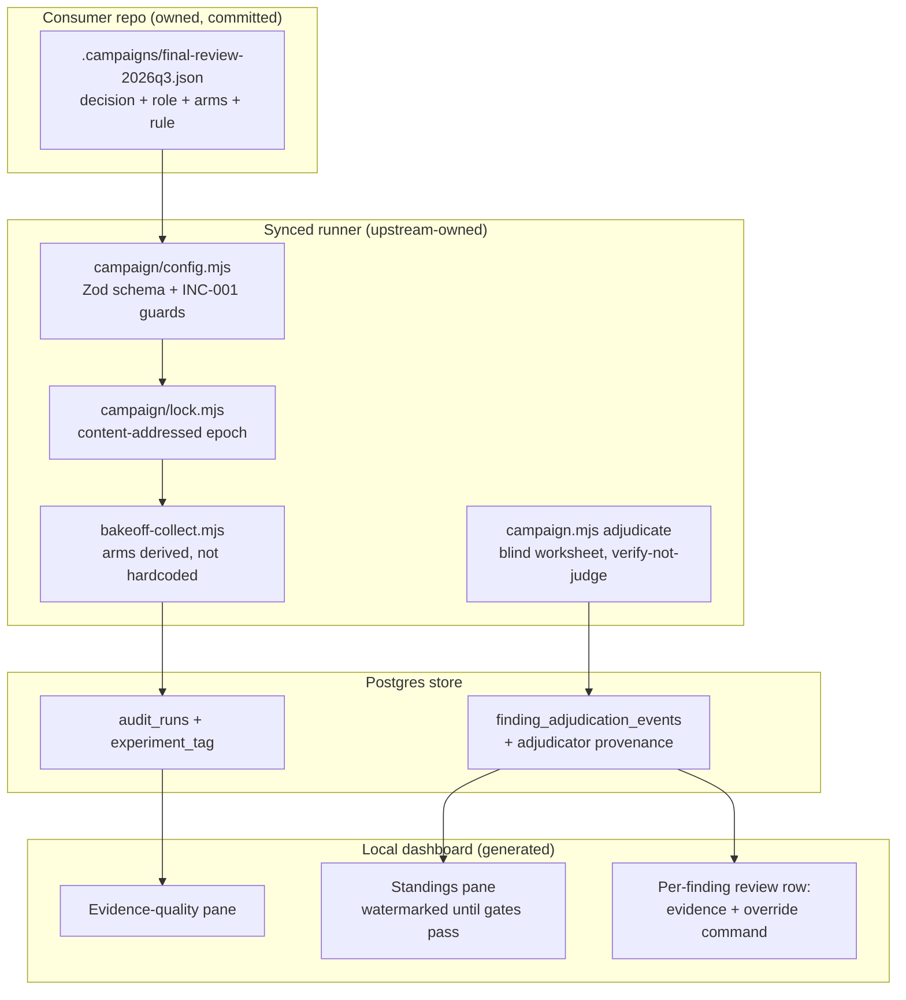

# Plan: Model-Comparison Campaigns — declarative arms, AI-first adjudication, decision-grade dashboard

- **Date**: 2026-08-10
- **Status**: Complete — shipped 2026-08-10 via `/cycle --autonomous`

  All three §11 clusters implemented and gate-clear. Cluster A audited before
  this run; Cluster B took 6 GPT rounds to convergence (in-cluster HIGH 0,
  MEDIUM 0) plus a Gemini APPROVE; Cluster C's `fix-gate: final` deferred to the
  consolidated Gemini review over the union diff of A–C, which ran its 2-round
  cap — 3 findings in round 1, all fixed; 1 in round 2, disproved by execution.
  Coherence `Strong`, over-engineering flags 0, `claude_bias_detected: false`
  in every round.

  **Two corrections this plan owes its reader**, because implementation
  falsified them:

  1. §7 assigns four dashboard integration points to `scripts/build-dashboard.mjs`.
     They live one layer down — `render.mjs` (nav entry, renderer call),
     `collect-reference.mjs` (collector invocation, degraded-status propagation)
     and `schema.mjs` (payload survival). `build-dashboard.mjs` is the CLI
     wrapper and was not modified. §4's "the existing copy-to-clipboard helper"
     also did not exist; a delegated handler was added.
  2. §7b's close-out expects the live readout to show "the real 5/12 state".
     It shows **0/12**, and that is correct: the seven collected snapshots
     predate the campaign declaration, carry no `lockDigest`, and `reconcile`
     refuses to promote them. Adopting evidence collected under an unknown
     contract is precisely the relabelling that produced five false "window met"
     reads — the rule the lock exists to enforce, applied to this plan's own
     history.
- **Author**: Claude + Louis
- **Scope**: full-stack (CLI + store + generated dashboard page)

## Audit trail

| Gate | Rounds | Result |
|---|---|---|
| GPT (`/audit-plan`) | 3 (default cap) | H 6→6→6, M 3→1→2. **24 of 24 findings accepted as fix-now — zero dismissals, zero deferrals, zero rebuttals** (acceptance 100% every round). |
| Gemini (`--mode plan`, mandatory) | 2 of 2 (cap) | R1 `CONCERNS` 4 new (3H/1M) · R2 `CONCERNS` 4 new (3H/1M). **0 wrongly-dismissed both rounds**; deliberation graded fair, `claude_bias_detected: false`, coherence `Strong`, over-engineering flags **none** in either round. All 8 accepted. |
| Opus shadow (observation-only) | 2 | 6 then 7 findings, disjoint from Gemini's each time. All real, all fixed. Never gated. |

**Total: 45 findings, 45 accepted, 0 dismissed, 0 deferred, 0 rebutted.**

**Stop decision.** Stopped at the 3-round default despite a flat HIGH count and
a 100% acceptance rate — which the rule permits continuing on. The reason is
finding *character*, not fatigue: every round's findings were **propagation debt
from the previous round's fixes** (R2 audited the worksheet/lock/receipt surface
R1's fixes created; R3 audited the schema R2's fixes created), and R3's were
converging on schema and API precision — a unique-index contradiction, an
`atomicWriteFileSync`-vs-`flag:'wx'` API error, an HTML-escaping requirement.
Those are exactly the class `/audit-code` settles against real code, and a
fourth pass from the same reviewer would keep generating them from my own edits.
The marginal value is now in a *different* lens, which is the mandatory gate
below.

Three defects worth recording because they were mine, not the auditor reaching:
`atomicWriteFileSync` cannot provide exclusive-create (it is temp+rename, so
`flag:'wx'` was meaningless); the `--force` supersede protocol contradicted its
own three-column unique key; and `costCeilingUsd` / `costCeilingUsdPerAccepted`
disagreed between the example config and the rules table, which under `.strict()`
would have made this repo's own dogfood campaign fail to load.

**The final gate found four more, and every one was propagation debt from an R3
fix** — which is the strongest available evidence that the stop decision above
was right about *character* and that stopping was still correct: a fourth GPT
round would have been the same author's lens on the same edits. Gemini's G1 is
the sharpest example: R3/H1 added `attempt` to the arm-run unique key so
`--force` could retry, and R3/H2 made the receipt an exclusive-create — two
fixes that were individually right and jointly guaranteed `EEXIST` on the first
retry. Neither round that produced them could see the collision; a reader of the
whole could.

**The Opus shadow ran alongside and found six more, disjoint from Gemini's four
— and the finding that matters most is what the matcher said about that.** The
cross-model matcher scored `both: 0, primaryOnly: 4, shadowOnly: 6` but reported
`coverage: 0.20, verdict: unknown` — and shadow/S1 is plainly the same defect as
Gemini/G2 (the adjudicator cannot see the code it is told to verify). The
matcher was **right to refuse**: plan-mode findings cite `§`-sections rather than
file paths, so `affectedFilesOf()` has nothing to intersect and the file-set
prefilter can never fire. Two things follow. First, this is exactly the
`unknown`-vs-`measured-zero` discipline working under its own weight — the
instrument declined to report `both: 0` as a measurement, which is what lesson
(d) cost us to learn. Second, it is a **scope limit worth stating**: the matcher
is calibrated for code findings and is *not* an instrument for plan-mode
comparison. A campaign declared over plan-mode transcripts would silently
inherit that blindness, so `campaign.mjs cluster` refuses a snapshot whose
findings yield no resolvable file paths, recording `coverage: unknown` rather
than a cluster set — the §7a rule that an unclustered snapshot blocks
attribution then does the rest.

Six of the ten round-1 gate findings came from the second reviewer, none of them
duplicating the first — and round 2 repeated the pattern at 4 and 7, again
disjoint. That is a live datum for the very question this plan builds machinery
to answer, and it is *not* evidence that a second gate pays for itself in
general: two rounds on one artifact, unblinded, with no adjudication of whether
the split holds elsewhere, and with me — an interested party — judging what
counts as "real". It is a hypothesis the campaign framework exists to test
properly, recorded here so it is not later mistaken for a result.

**Gate round 2 and the stop at the cap.** R2 found four more, all again
propagation debt, and again the sharpest one was created by the previous
round's fix: G1 put `attempt` into the receipt path, and G7 observed that
resolving that attempt from the database alone wedges an arm-run permanently
whenever a crash lands between the file claim and the store write — silently,
and including under `--force`. The shadow independently found the whole-file
`configDigest` still hashing the analysis-time fields I had just finished
arguing must not orphan evidence: the fix was right and I had applied it in
one place out of two.

Stopping here, at the 2-round cap, and this stop needs stating honestly:
**round 2 was not rigor pressure.** All eight findings were concrete design
defects, the acceptance rate is 100%, and the skill's own rule says a net-new
design bug can earn another round. I am stopping anyway, because the *pattern*
has now repeated four times across two reviewers, and it is not converging on a
correct document — it is a stable rate of one-to-two real defects introduced per
round of fixes to a specification of this size. Another gate round would find
the debt from these eleven fixes. The instrument that settles that class is not
a fifth reading of the prose; it is `/audit-code` against the implementation,
where a wedged retry path and an under-summed cost column are executable rather
than argued. Three of round 2's findings (the mangled §4 sentence, the renderer
named two ways, the list numbered 1,2,3,3,4,5) were editorial damage from my own
edits, which is the clearest possible signal that the document has passed the
point where more prose-editing per round adds correctness.

Carried into implementation, explicitly: every §7a schema claim, the receipt
attempt-resolution logic, and the calibration filter are Phase-1 test targets
before any provider call is wired.

> **Target domain(s)**: `audit-orchestration`, `dashboard`, `scripts`, `shared-lib`, `supabase`
> ⚠ **Cross-domain work** — by construction: a consumer-owned config drives an
> upstream-owned runner, verdicts land in the store, and the dashboard reads them
> back. §11 clusters each seam so the audit inspects it.
> **Origin**: `/brainstorm` session `1786346723030` (GPT-5.6-terra + Gemini-pro,
> 2026-08-10) over the live `scripts/bakeoff-collect.mjs`, synthesised after the
> operator's decision: **the agent adjudicates, the human reviews and can
> override** — full human blind adjudication does not scale beyond this repo.

---

## 1. Context Summary

**Detected scope**: full-stack · **Stack**: `js-ts` + `postgres`.

### What exists, and why it cannot be reused as-is

The repo compares models in three roles today, with three disjoint harnesses:

| Role | Current model | Comparison harness | State |
|---|---|---|---|
| 1 — Auditor (5-pass generation) | GPT | `scripts/model-eval-auditor.mjs` (swap-eval, curated corpus) | shipped; verdict-of-record keep-GPT 2026-07-13 |
| 2 — Overview / final gate | Gemini | `scripts/model-eval-adjudicator.mjs` | built, never run |
| 3 — Second final reviewer (shadow) | Opus vs Kimi | `scripts/bakeoff-collect.mjs` | live campaign, 5/12 snapshots, $29.24 |

Role 3's collector is the most evolved — pre-registered N, `CONTRACT_EPOCH`,
request fingerprints, per-arm cost, a matched-buckets view — and it is
**hardcoded**: `ARMS` is a frozen table in a synced, upstream-owned file that
consumer repos are forbidden to patch (AGENTS.md consumer-governance). An
engineer in another repo cannot declare "compare X vs Y for role Z" at all.

### The five measured lessons any redesign must preserve

Each was measured in this repo, not theorised — they are the plan's invariants:

| # | Lesson | Measurement |
|---|---|---|
| a | Only blind adjudication of **accepted** findings is a verdict | Kimi 14 raw uniques vs Opus 25 *looked* competitive; dismissal rates 86% vs 50% → accepted 0.25 vs 1.50 per snapshot |
| b | Arms must share one reasoning dial or you measure the setting | Kimi at `low`: 0 findings; at `high`: 3, identical transcript |
| c | A byte-identical request is a reroll, not a scenario | `opus`/`solo-opus` input counts equal to the byte (81,182/81,182); discovered only by archaeology |
| d | Exact-hash matching over model prose never matches cross-model | 0/48 pairs matched; "unique" silently meant "total"; fixed by `finding-match.mjs`, threshold **provisional** (model-generated labels) |
| e | An always-null metric reads as free, not broken | `total_cost_estimate` NULL on all 128 runs for the column's life; one missing payload line |

Plus the standing failure the epoch string exists for: **five false "window
met" reads** on the tiered-shadow collector — evidence counted under a contract
it was not produced under.

### The operator's decision this plan implements

**The agent adjudicates; the human reviews and overrides.** Named hazard: LLM
*re-judgement* of historical findings measured **52% agreement** with a human
here, and `tests/fixtures/cross-model-pairs.json` is marked PROVISIONAL for
exactly this class. What makes the workflow sound anyway, and what this plan
makes mechanical rather than aspirational:

1. The adjudication we already trust (2026-08-08, 21 findings) was
   **verification, not judgement** — each finding checked against current code,
   blind. Verification is instrument-settleable; opinion is not.
2. Human override, **measured**, is a calibration instrument: the per-arm
   override rate tells you whether this campaign's AI verdicts can be trusted.
3. When the adjudicating agent's model family coincides with an arm under test
   (Claude adjudicating an Opus arm — our literal current situation), every
   verdict is stamped `self_family: true` and the share is surfaced. Bias made
   visible, not denied.

### Code Trace

Verified this session against the working tree (symbols, not line numbers —
several files changed this week; the plan audit re-pins at its commit):

- `scripts/bakeoff-collect.mjs` — `ARMS` (frozen table, the thing consumers cannot edit) → `runArm` → `buildArmArgs` → spawns `scripts/gemini-review.mjs review` per arm; `isComplete` gates on `CONTRACT_EPOCH` equality; `cohortDigest` already content-addresses the *matcher* config; `summarise`/`printProgress` own the readout.
- `scripts/gemini-review.mjs` — `runShadowAndPersist` writes `_shadow` (buckets + `bucketsMatched` + `requestFingerprint` + usage incl. cache fields); `FINAL_REVIEW_SHADOW*` env selects the shadow; `finalReviewConfig.reasoningEffort` is the one shared dial (lesson b's fix).
- `scripts/lib/finding-match.mjs` — `matchFindings` / `affectedFilesOf` (lesson d's fix); calibration corpus committed at `tests/fixtures/cross-model-pairs.json`.
- `scripts/lib/model-pricing.mjs` — `costFromUsage` (null-honest analytics) / `costForBudget` (fail-closed spend cap via `FALLBACK_PRICE_USD`). Both directions already exist; the plan changes neither.
- `scripts/lib/store/runs-findings.mjs` — `recordRunComplete` (cost now wired, lesson e's fix); `audit_runs.experiment_tag` already isolates replay runs from organic rates.
- `scripts/build-dashboard.mjs` — `main` builds the local pages from the store; `scripts/lib/dashboard/collect-nav.mjs` is the per-page collector pattern to copy.
- `supabase/migrations/…finding_adjudication_events` — existing verdict table: `ruling` CHECK'd, `remediation_state`+`round` NOT NULL (memory: write constraints).

### Neighbourhood considered

`get-neighbourhood` over the three target files: all `review` band (nothing
above the repo's noise floor) — greenfield is legitimate for the new
`campaign/` modules. The one real precedent it surfaced is **`cohortDigest`**
(bakeoff-collect): a fixed-key-order, fixed-precision content digest already
guarding the matched-buckets cohort. The campaign lock (§2.5b) extends that
pattern rather than inventing a sibling.

### Past incidents to verify against

- **INC-001** (lexical path classification bypassed by symlink): binds the ONE
  new read seam — the campaign config file. It is read by the runner and its
  values reach provider calls (model ids) and subprocess argv. Mitigation:
  config is loaded via a strict Zod schema (closed field set, pattern-validated
  model ids `^[\w.\/-]+$`), never interpolated into shell strings (argv arrays
  only, the existing `buildArmArgs` discipline), and the config path is
  repo-root-contained + `resolveAndClassify`d before read.
- **INC-002** (prod wiped by a test suite with an env-gate instead of a
  disposable-DSN guard): binds the new migration's tests — they join
  `db:suites:gate` behind the existing `assertDisposableDbUrl` loopback
  allowlist. No new destructive surface.

---

## 2. Proposed Architecture



### Key design decisions

**D1 — Consumer-owned committed JSON config; runner derives the arms (#5 SSoT).**
`.campaigns/<id>.json`, committed and reviewed in the consumer repo — the
`.requirements/` precedent (committed contract dir + README), NOT env vars and
NOT a `.mjs` config (a code file from a consumer is an eval surface the synced
runner must never execute). The runner's Zod schema is the contract; consumers
own only data. The current hardcoded 3-arm table becomes **this repo's own
committed campaign file** — the framework's first consumer is us, which is the
only honest proof the seam works (dogfood before ship, pre-ship-empirical-verify
doctrine).

**D2 — Campaign declares a DECISION, not an arm soup (GPT's constraint, adopted).**
Required fields: `decision` (`select_default` | `keep_or_switch`), `role`
(`final_review_shadow` in v1 — see D7), `arms` (each: `model`, `mode`
∈ `shadow|primary`, optional `type: "replicate"`), `controls` (the shared
dials: `reasoning_effort`, prompt-template id), `target_n`, `decision_rule`.
Free-form Cartesian permutation is deliberately unexpressible — a constrained
vocabulary is what keeps the eventual verdict interpretable.

**D3 — The lock replaces `CONTRACT_EPOCH` with a digest that sees every
meaning-bearing input (§2.5b).** Five false "window met" reads came from
evidence counted under the wrong contract; the hand-maintained string fixed
that only for changes someone remembered to bump it for. The lock digest is
computed over *resolved* reality at collect time — including the prompt-template
hash, which the current epoch string cannot see.

**D4 — Rerolls are classified before spend, never discovered after (lesson c).**
The runner computes each arm's request fingerprint pre-flight (the
`_requestFingerprint` seam already exists); two arms colliding is a **hard
refusal** unless one is declared `type: "replicate"` in the config. Declared
replicates are excluded from model-level evidence and reported as their own
line. Gemini wanted `process.exit(1)` unconditionally; the declaration escape
matters because our own `solo-opus` arm is a *deliberate, valuable* replicate.

**D5 — Effectiveness floor before cost (GPT's rule, adopted; fixes our own
perverse arithmetic).** The default `decision_rule` is two-stage: an arm must
first clear `accepted HIGH/MED per snapshot ≥ floor` (default: non-inferior to
the incumbent minus a declared margin); only arms clearing the floor compete on
cost-per-accepted. Today's rule would select Kimi at $0.58/accepted having
found one-sixth the real defects — measured, not hypothetical.

**The floor is relative AND absolute, because relative alone admits a
zero-finding arm (shadow/S2).** As written, the rule was
`arm ≥ incumbent − floorMargin` with `floorMargin: 0.5`. If the incumbent itself
scores ≤ 0.5 on the cohort — entirely reachable on 12 snapshots of clean
transcripts — then an arm that found **nothing at all** satisfies
`0 ≥ 0 − 0.5` and proceeds to the cost stage, where it is by construction the
cheapest thing in the campaign. It would then win. That directly contradicts
§2.5c-i's "an arm with 0 accepted fails the effectiveness floor and never
reaches the cost stage", and it is the *same* perverse arithmetic D5 exists to
kill, one level up: the earlier version rewarded finding one-sixth as much, this
one rewards finding none. So the floor is a conjunction — an arm must clear the
relative test **and** `accepted_per_snapshot > 0`.

There is a second, quieter failure in the same place: when the incumbent scores
at or near zero, the comparison is **uninformative rather than favourable**. A
cohort on which the incumbent finds nothing has not discriminated between the
arms; it has failed to pose the question. `verdict.mjs` therefore emits
`INCONCLUSIVE` with reason `incumbent-floor-degenerate` when the incumbent's own
accepted-per-snapshot is below the margin, instead of running a comparison whose
baseline carries no signal. Both rules are pre-registered config
(`floorMargin`, plus the implicit `> 0`), not runtime judgement, and
`tests/campaign-verdict.test.mjs` carries the degenerate case explicitly — a
zero-accepted, zero-cost arm must NOT select.
**Pre-registration integrity**: the running Opus/Kimi campaign completes under
its ORIGINAL §6.3 rule; the floor applies to campaigns declared after this
ships. Changing a live campaign's rule mid-flight is the exact relabelling sin
the epoch machinery exists to stop.

**D6 — Unpriced cost breaks the verdict, not the build (Gemini's crash
rejected).** Analytics stays null-honest (`costFromUsage`), the spend cap stays
fail-closed via over-estimation (`costForBudget` + `FALLBACK_PRICE_USD`) — both
directions already exist and are tested. What's added: a campaign whose spend
contains any `unpriced` arm-run has `cost_evidence: unknown`, and the decision
rule refuses the cost stage (floor stage may still run). Collection never
halts on a pricing-table gap.

**D7 — v1 generalises role 3 only; roles 1–2 keep the swap-eval harness (right-
sizing).** The unified declaration surface would be *three* role adapters; but
roles 1–2 already have a shipped harness with its own verdict discipline. v1
ships the config/lock/adjudication/dashboard stack for `final_review_shadow`
and a `role` enum with one value — the seam exists, the speculative adapters do
not. Trigger to widen: the first real request to compare auditor models from a
consumer repo (or our own next GPT-swap decision).

### Right-sizing gate

- **Band-aid extreme**: keep the hardcoded table, tell consumers to fork the
  file. Violates upstream-ownership governance; every sync erases their config.
- **Over-engineered extreme**: three role adapters + a YAML DSL with factor
  matrices + a live web adjudication app with auth + a stats engine computing
  non-inferiority CIs. No current requirement needs any of it; the adjudication
  app alone would need a server the local-only dashboard deliberately lacks.
- **Chosen**: committed JSON + Zod, lock digest extending `cohortDigest`,
  adjudication as a blind CLI worksheet the agent fills and the human overrides,
  dashboard page in the existing generator. Every piece extends a shipped
  pattern; the only new storage is two columns and one small table.

---

## 2.5 Contracts

### 2.5a Campaign config (consumer-owned, committed)

```jsonc
// .campaigns/final-review-2026q3.json
{
  "schemaVersion": 1,
  "id": "final-review-2026q3",
  "role": "final_review_shadow",
  "decision": { "type": "select_default", "incumbent": "claude-opus" },
  "arms": [
    { "id": "opus",      "model": "claude-opus",                      "mode": "shadow" },
    { "id": "solo-opus", "model": "claude-opus",                      "mode": "primary", "type": "replicate" },
    { "id": "kimi",      "model": "moonshotai/kimi-k2-thinking",      "mode": "shadow" }
  ],
  // DECLARED effective request spec (R1/M1). The lock hashes what actually
  // resolved; this is what the consumer reviewed and approved. Both exist
  // deliberately: a hash detects drift AFTER it happens and is unreadable in a
  // PR, while a declaration is reviewable but cannot prove what ran. The
  // runner REFUSES when the resolved request disagrees with the declaration —
  // that mismatch is the whole point of keeping both.
  "controls": {
    "reasoningEffort": "high",
    "promptTemplateId": "final-review-shadow@4",
    "outputSchemaId": "final-review@3",
    "maxOutputTokens": 32000,
    "toolPolicy": "structured-output-only",
    "temperature": 0
  },
  // The adjudicator is a declared participant, not ambient (R2/H2). §2.5c says
  // it is pinned in the lock; it must therefore be declarable and reviewable.
  "adjudicator": {
    "model": "latest-opus",
    "promptTemplateId": "campaign-adjudicate@1",
    "outputSchemaId": "adjudication-verdict@1"
  },
  "calibration": { "sampleRate": 0.2 },
  "targetN": 12,
  "decisionRule": {
    "floorMetric": "accepted_high_med_per_snapshot",
    "floorMargin": 0.5,
    "tiebreak": "cost_per_accepted",
    "costCeilingUsdPerAccepted": 8
  }
}
```

Validation is strict (Zod, closed fields, `.strict()`): unknown keys reject —
a typo'd `reasoningEfort` must fail loudly, not silently run at a default dial
(lesson b). Model ids pattern-validated; nothing from this file ever reaches a
shell string (argv arrays only).

**Semantic validation, stated numerically (R2/M1)** — structural strictness is
not enough; each of these is a config that parses and produces a meaningless
campaign:

| Rule | Constraint |
|---|---|
| `targetN` floor | **`≥ 12`**, and `verdict.mjs` emits INCONCLUSIVE below it regardless of config. 12 is inherited from §6.3 row 1, not re-derived here |
| `calibration.sampleRate` | `0.1 ≤ r ≤ 1.0` |
| `id` (campaign id) | **`^[a-z0-9][a-z0-9-]{0,63}$`** (R3/H5). It is interpolated into `.audit/campaigns/<id>/…` lock and receipt paths, so an unconstrained value is a path-traversal surface reachable from a consumer-owned file — the INC-001 class, one layer out. Every derived path is additionally `path.resolve`d and asserted repo-root-contained before any write, so the pattern is defence-in-depth rather than the only guard |
| Arm ids | unique, non-empty, `^[a-z0-9][a-z0-9-]*$` (same reason — arm id is a receipt filename component) |
| Non-replicate arms | **≥ 2** (one arm is not a comparison) |
| `decision.incumbent` | must name exactly one **non-replicate** arm's `model` |
| Replicate arms | must share `model` + `controls` with a non-replicate arm — a "replicate" of nothing is a mislabelled scenario |
| `arms[].mode` | at most one `primary` per campaign (the shadow protocol has one primary) |
| `floorMargin` | `≥ 0`; a negative margin would let a strictly worse arm clear the floor |

### 2.5b The campaign lock — a `CONTRACT_EPOCH` that cannot be forgotten

At each collect, the runner resolves reality and digests it (fixed key order,
fixed precision — the `cohortDigest` discipline):

```
lockDigest = sha256({ schemaVersion, configDigest, resolvedModels (post-sentinel),
  providerRoutes, reasoningEffort, promptTemplateHash (sha256 of the assembled
  system prompt template), outputSchemaHash, adjudicatorModel, pricingVersion })
```

**Collection-time inputs only** — `matcherVersion` and `matcherThreshold` were
in this list until the shadow reviewer pointed out (S3, §7a) that they are
*analysis-time* parameters over already-paid evidence, so including them made a
free re-clustering destroy a whole cohort. The membership test is stated in §7a:
an input belongs here if changing it would make already-collected evidence mean
something different.

**`configDigest` is over the collection-relevant SUBSET, not the whole file
(shadow/S1).** Removing the matcher from the list did not finish the job: the
committed config also carries `targetN`, `calibration.sampleRate` and the entire
`decisionRule` (`floorMargin`, tiebreak, cost ceilings) — all analysis-time, all
hashed by a whole-file digest, so editing a cost ceiling would have orphaned
every snapshot ever collected. That is the *same* defect as the matcher one, one
level up, and it would have bitten harder because §2.5c.6 and the D5 tuning both
schedule edits to exactly those fields. So `configDigest = sha256` over
`{ role, decision, arms, controls }` only — the fields that determine what was
asked of the models — with a canonical key order. The analysis-time fields are
deliberately *outside* every digest: they change how already-collected evidence
is *read*, never what it means, and the standings pane names the values it
applied so a reader is never guessing which rule produced a verdict.

**Pre-registration is still protected, by a different mechanism.** Leaving
`decisionRule` out of the lock must not become a licence to retune the rule
until the answer is agreeable — that is the relabelling sin D5 names. The
guard is `campaign_events`: every change to an analysis-time field appends a
`rule_changed` event with before/after and the operator, and `verdict.mjs`
**watermarks any standings whose decision rule changed after the first arm-run
was collected**. The evidence survives; the fact that the goalposts moved is
recorded next to the number, which is the honest treatment. A digest would have
protected the same property by destroying the data, at a cost of a full
re-collection per edit.

- Every snapshot is stamped with the `lockDigest` it ran under.
- `isComplete` counts a snapshot only when its digest equals the CURRENT
  resolution — a meaning-changing drift (new model resolution, edited prompt,
  swapped adjudicator) **automatically** orphans prior evidence into its own cohort.
  No string to remember to bump; the failure mode that produced five false
  "window met" reads becomes unrepresentable.
- Orphaned cohorts are reported (`N under superseded lock <digest>: not
  counted`), never deleted and never relabelled — the existing e1/e2 posture,
  mechanised.
- The lock file itself is Category A (gitignored, derived from live
  resolution); the digest travels in the store rows.

### 2.5b-i Cohort and snapshot contract (R1/H1)

`N ≥ targetN` and "accepted per snapshot" are meaningless without a defined
population. The campaign's unit of observation:

| Term | Definition |
|---|---|
| **snapshot** | One audit transcript at one source revision: `snapshotId` = first 12 hex of sha256 over **`transcriptBytes ‖ audited_sha`** (R3/H3). Content-addressed, so a copy or rename is the same snapshot and an edit is a new one — but two revisions with byte-identical transcripts stay **distinct**, because the revision is what adjudication verifies against and collapsing them would make a verdict depend on which one was collected first. Extends the existing `bakeoff-collect.mjs::snapshotId`, which hashed bytes alone |
| **source revision** | `audited_sha` — the commit the transcript's diff was taken at. **Part of snapshot identity**, not mutable metadata on the arm-run. A transcript with no resolvable `audited_sha` is ineligible (it cannot be adjudicated per §2.5c) |
| **arm-run** | (snapshot × arm) — one provider call set. Identified by `(campaignId, cohortDigest, snapshotId, armId)` |
| **complete snapshot** | Every **non-replicate** arm produced a parseable result under the CURRENT `cohortDigest`. Replicates are collected but never gate completeness |
| **eligible transcript** | `mode: 'code'`, plan reference resolvable, `audited_sha` recorded. Enumerated by the existing `findEligibleTranscripts` |

**Completion matrix, not a count.** The store holds one row per arm-run;
`N complete` is `COUNT(snapshots WHERE every non-replicate arm has a row)`.
A partially-collected snapshot is visible as its own row set with the missing
arms named — never rounded up to complete, never silently dropped.
`INCONCLUSIVE (N unreachable)` requires an explicit operator declaration or an
exhausted eligible-transcript pool; it is never inferred from slow progress.

**The cohort manifest is a lock input.** `lockDigest` (§2.5b) includes the
**eligibility rule** and the **arm-id set**, so widening eligibility or adding
an arm orphans prior evidence rather than silently mixing two populations. It
deliberately does NOT include the snapshot list itself — the population grows
as ordinary work happens, which is the point; freezing it would make the
campaign uncollectable.

### 2.5c Adjudication protocol — agent verifies, human overrides

1. **Blindness is a DTO plus a redactor, not a column omission (R1/H3).**
   Omitting `source_model` from the projection is necessary and nowhere near
   sufficient: the finding `detail` is model-authored prose that routinely names
   its own provider ("Opus 5 thinks by default", "the OpenRouter arm"), and
   transcript excerpts carry model ids and provider headers outright. So:
   - **Blind DTO**: the worksheet row is a closed shape —
     `{ worksheetRowId, category, section, detail, evidenceExcerpt, severity,
     citedSources }`.
     Constructed by whitelist, never by deleting keys from a wider row (a new
     column added later must not auto-leak into the worksheet).
   - **`citedSources` carries the actual code, and without it step 2 is
     unperformable (Gemini/G2).** Step 2 asks the adjudicator to check the claim
     against the tree at `audited_sha`, but the DTO otherwise contains only
     `evidenceExcerpt` — *model-authored prose*. Asking an LLM with no tool
     access to verify code it cannot see does not produce `unverifiable`; it
     produces confident hallucinated verification, which is worse than no
     adjudication because it is scored as evidence. So `campaign.mjs adjudicate`
     resolves every path the finding cites, reads it at `audited_sha` via the
     repo's `vcs.mjs` seam (structured `{ok:false, error}` on a missing blob, not
     a throw), and injects `citedSources: [{ path, sha, content }]` as a typed
     read-only field. Bounds and honesty rules: cited files are truncated to a
     per-row budget with an explicit `truncated: true` marker, and **truncation
     must never manufacture a `verified-false` (Gemini/G8)** — if an arm
     correctly finds a defect at line 800 of a file truncated at line 500, the
     adjudicator sees a resolved file without the defect and will report it
     absent, penalising the arm for being right. Two mitigations, both needed:
     the window is **centred on the line range the finding cites** rather than
     taken from the top, so the relevant span is normally present; and when
     `truncated: true`, the prompt requires `unverifiable` — never
     `verified-false` — for a defect not visible in the shown span. This is the
     capture-honesty rule the repo already applies to browser lenses: a partial
     observation degrades to `unverified`, it does not become a negative finding.
     A path that does
     not resolve at that sha yields `{ path, resolved: false }`, and a row whose
     citations ALL fail to resolve is forced to `method: unverifiable` before the
     call is made — never sent to the model to guess about. The path set comes
     from `affectedFilesOf()` (the union built for the matcher), so a finding
     citing its file only in prose still resolves. Sensitive paths are refused
     and marked, never read — this is an egress seam like any other.
   - **Redaction pass** over `detail` + `evidenceExcerpt` before rendering:
     every model id and provider name known to `model-resolver.mjs`'s catalog ∪
     `OSS_PRICING` keys ∪ the campaign's own arm ids → `[MODEL-A]`/`[PROVIDER]`
     placeholders, applied case-insensitively. **`citedSources` is deliberately
     exempt** — it is repo source at a fixed sha, identical whichever arm cited
     it, so it carries no arm signal; and this repo's own source legitimately
     contains model ids (`model-resolver.mjs`'s `STATIC_POOL`), so redacting it
     would corrupt the evidence the adjudicator is meant to read. Blindness is
     about which arm spoke, not about which strings exist in the tree.
   - **Leak canary in the test suite**: the blind-worksheet test asserts no
     row's serialised text matches any arm's model id or provider — run against
     the REAL campaign fixture, not a synthetic row (§9 case 6).
   - **One-way mapping**: `worksheetRowId` is an HMAC (per-run key, store-side
     only). There is no agent-reachable path from row to arm.
   - Ordering is a seeded hash shuffle, so insert order (which is arm-ordered)
     carries no signal.
2. **Verify against the snapshot's OWN revision, not `HEAD` (R1/H2).** The
   agent checks each claim against the tree at that snapshot's `audited_sha`
   (`git show <sha>:<path>`), never the working tree. Verifying against current
   code is a **moving target**: a finding that was true when collected and has
   since been fixed would be recorded `verified-false`, penalising the arm that
   correctly found a real defect — and the penalty would grow with how long the
   campaign runs. If `audited_sha` is unresolvable (rebased away, shallow
   clone), the finding is `method: unverifiable` and routes to the human queue;
   it never defaults to false.
3. **Verify, not judge.** Record `method`: `verified-true` / `verified-false` /
   `judgement` / `unverifiable`. `judgement` (the claim resists instrument
   settlement) and `unverifiable` **route to the human queue**, never
   auto-accepted. This is the discipline that made the 2026-08-08 adjudication
   trustworthy where 52%-agreement re-judgement is not.

   **Executable contract for `campaign.mjs adjudicate` (R1/H2):**
   - **Model**: resolved via the existing `resolveModel()` sentinel path;
     recorded on every verdict as `adjudicator_model`. Pinned in the lock —
     changing the adjudicator orphans the cohort, same as changing an arm.
   - **Tool policy: explicitly none** (shadow/S1). The adjudicator runs
     forced-structured-output with no tool loop, which is a deliberate choice and
     not an omission: retrieval happens in the CLI (`citedSources`, step 1
     above), where it is deterministic, bounded, sensitive-path-gated and
     reproducible from the receipt. Giving the model a `git show` tool would put
     an unbounded, unlogged read loop inside a spend-bearing blind adjudication —
     the opposite of what makes these verdicts auditable. `toolPolicy` therefore
     stays an *arm* control (`controls`), and the adjudicator's absence of tools
     is asserted in `tests/campaign-adjudication.test.mjs` so it cannot be
     quietly granted later.
   - **Output**: forced structured output against a Zod schema
     (`AdjudicationVerdictSchema`) — `{ worksheetRowId, method, ruling,
     evidence, confidence }`. Validation is **reject-and-retry once, then fail
     the row**, never warn-and-keep: a malformed verdict must not become a
     silent `pending`.
   - **Evidence is mandatory and typed.** `verified-true` requires
     `{ path, sha, lineRange, quotedSpan }`; `verified-false` requires the same
     plus `absenceReason` (why the cited defect is not present at that sha). A
     verdict with unparseable evidence is downgraded to `judgement` — an
     unsupported machine verdict is worth less than an honest hand-off.
   - **Batching**: one finding per call (isolation — a batch lets one row's
     reasoning contaminate the next); bounded concurrency 4; per-row retry once
     on a retryable `classifyLlmError`, then `method: unverifiable`.
   - **Reconciliation**: the worksheet row carries an opaque
     `worksheetRowId` (HMAC of `findingId` under a per-run key held only by the
     store seam). The agent returns that id; the store maps it back. The agent
     never sees, and cannot derive, the finding id or arm.
   - **Key lifecycle (shadow/S6).** The key is generated once per campaign on
     first `adjudicate`, stored in the operator's gitignored `.env` as
     `CAMPAIGN_HMAC_KEY_<campaignKey>` (the repo's existing secret channel — no
     new store), and `campaign_worksheets.hmac_key_ref`
     records only that variable's *name*. Rules, because each has a failure mode
     that is silent otherwise: (a) **absent key at `adjudicate` or `override`
     time is a hard refusal**, never a regenerated key — a new key produces
     different `worksheetRowId`s, which would orphan every human disposition
     already recorded against the old ones; (b) the key is **per campaign, not
     per run**, so `worksheetRowId` is stable across the campaign's whole life
     (the R2/H1 stability property depends on this, and "per-run key" in the R1
     wording was wrong); (c) the calibration selection uses the **same** key and
     the row's own id (`HMAC(worksheetRowId, campaignId)`), so a reader can
     reproduce the sample without a second secret; (d) the key is **never**
     written to the store, a receipt, the dashboard, or a log line, and
     `sensitive-paths`' redactor already covers `.env` egress; (e) rotation is
     not supported and is refused with an explanatory error rather than
     half-implemented — a rotated key silently re-randomises the sample, and
     there is no current requirement that justifies the migration machinery to
     do it safely.
   - **Provenance on every verdict** (new columns, §7): `adjudicator_kind`
     (`agent` | `human`), `adjudicator_model`, `method`, `self_family` (true when
     `adjudicator_model` family == the finding's arm family — computed at write
     time from the unblinded row, by the store, not by the blinded agent).
     *(Demoted from a second item numbered "3" — shadow/S7. The list printed
     1,2,3,3,4,5 while §7a cites `§2.5c.4` for append-only overrides and
     `§2.5c.5` for the deterministic sample, so the cross-references matched the
     printed numbers and renumbering would have broken them. This is provenance
     recorded by the same write step as item 3, not a separate protocol step.)*
4. **Human override is terminal.** An override writes a new event
   (`adjudicator_kind: human`, `overrides_event_id` set) — append-only, the
   original agent verdict stays visible. Override rate per arm **is** the
   campaign's calibration figure and renders on the dashboard.
5. **Calibration gate — deterministic sample, not reviewer's choice (R1/H6).**
   Standings are decision-eligible only when BOTH hold:
   - every `judgement` / `unverifiable` finding has a human disposition; and
   - the human has dispositioned the **assigned calibration sample** per arm.

   The sample is **selected by the tool, not the reviewer** — otherwise the
   gate measures which rows the reviewer felt like opening. Contract:
   - **Frame**: agent verdicts for that arm under the current cohort, both
     rulings (accepted *and* dismissed — sampling only accepted rows would
     never catch a false dismissal, which is exactly how Kimi's 86% could hide
     a real finding).
   - **Selection**: a per-row streaming filter — a row is in the sample iff
     `HMAC(worksheetRowId, campaignId) / 2^k < rate`. Deterministic,
     reproducible across machines, and **stable as the campaign grows**, which a
     top-N sort is not (Gemini/G6). The R1 rule was "sort by HMAC ascending, take
     the first `ceil(rate × n)`" — but campaigns collect snapshots continuously,
     so `n` grows, and a row in the top 2 at `n=10` can fall out at `n=15`. That
     left only bad options: recompute and the assignment churns, *overwriting
     human review work already done*; freeze it and the stored boolean no longer
     means "top N by HMAC", so the persisted `calibration_assigned` (R2/H1)
     silently contradicted the rule that defines it. Evaluating each row against
     its own hash removes `n` from the decision entirely — inclusion is a
     property of the row, decided once, identical whenever it is asked. Expected
     size is `rate × n` rather than exactly `ceil(rate × n)`; that is the correct
     trade, since an exact count is worth nothing here and stability is worth the
     campaign's human effort.
   - **Minimum 5 per arm** (or all, if `n < 5`) is applied *after* the filter as
     a top-up: if the filter selects fewer than 5, extend by HMAC-ascending order
     over the unselected rows until 5 is reached. The top-up is itself
     deterministic, and because it only ever *adds*, a row once assigned is never
     unassigned — the property that protects completed human work.
   - **Stratified per arm**, so a lopsided arm cannot be under-sampled.
   - **Zero/thin arms**: an arm with 0 agent verdicts is `calibration:
     not-applicable` (it contributed no evidence to calibrate) — distinct from
     `pending`. An arm with `0 < n < 5` requires **all** its verdicts reviewed.
   - **Direct human adjudications do not count** toward the sample — the sample
     measures agreement *with the agent*, and a row the agent never judged
     yields no agreement datum.
   - **Rate lives in the config** (`calibration.sampleRate`, default `0.2`,
     schema range `0.1–1.0`) — R1/H6 correctly noted the plan described a
     config-overridable rate with no config field. Lowering it below the
     schema floor is unrepresentable.

   Adjudication *coverage* was lesson (a)'s prerequisite; this deterministic
   sample is what replaces "human does 100%" without replacing it with "human
   does the easy ones".
6. ~~**Retirement path for the PROVISIONAL matcher labels**: the 9 file-sharing
   calibration pairs enter this same review queue; human disposition of them
   retires the fixture's caveat (or corrects the threshold).~~
   **SUPERSEDED 2026-08-10 — the premise was false, and measurement is what
   falsified it.**

   This step assumed the matcher threshold gates the switch decision. It does
   not. Measured on the live cohort: the floor metric took **one distinct
   value across thresholds 0.00 → 0.90**, and a controlled probe shows the
   mechanism — §2.5c-i credits each arm on its **OWN** member's terminal event,
   so a CROSS-arm merge cannot move any arm's count, and the denominator is
   complete snapshots (`evaluateFloor` divides by `nComplete`), not clusters.
   Only WITHIN-arm merging moves the metric; the probe's positive control
   confirms it does, so the sweep is not a vacuous pass.

   Labelling the 9 pairs would therefore have validated a number no decision
   depends on. What the check found instead was worse and real: **within-arm
   dedup — the one thing the threshold IS load-bearing for — was not
   implemented.** `clusterSnapshotFindings` iterated `i < k` over *distinct*
   arms, so two findings from one arm could only merge via a transitive bridge
   through a third. Two byte-identical findings from one arm, same file,
   produced 2 clusters at every threshold from 0.00 to 0.50. The anti-inflation
   rule in §2.5c-i row 2 was prose beside a loop that could not enforce it.

   **What replaces this step:**

   1. **Within-arm dedup implemented, with its own threshold**
      (`findingMatchConfig.withinArmThreshold`). Cross-model matching is hard
      (two vocabularies, ~17% signature overlap → 0.14); within-arm matching is
      easy (one voice), so both its distributions sit higher and reusing 0.14
      there would merge distinct defects sharing a file — under-counting the
      arm, the inverse of the inflation this rule targets. The new number is
      **uncalibrated** and says so, because no labelled within-arm corpus
      exists.
   2. **A sensitivity gate replaces validating a point threshold.**
      `campaign.mjs verdict` re-clusters across a band of both cutoffs
      (including *no clustering at all*) and `assessThresholdSensitivity`
      compares the resulting decisions. Invariant → proceed, and state that the
      verdict did not depend on the calibration, which is a stronger claim than
      "the calibration was validated". Flips → `threshold-invariance` fails and
      the verdict is withheld, naming the human effort actually worth spending.
      Shipping an uncalibrated constant is acceptable precisely because its
      wrongness is detected per decision.
   3. **Matcher provenance renders with the numbers it produced** — version,
      both thresholds, `provisional` for the cross cutoff and `uncalibrated`
      for the within-arm one, beside the sweep result.
   4. **The fixture stays PROVISIONAL and becomes a regression guard**
      (`tests/cross-model-buckets.test.mjs`), pinning that 0.14 still separates
      the 9 known pairs so a tokenizer or signature change fails loudly. It
      does not establish that 0.14 is right, and nothing load-bearing now needs
      it to be.

   Blind re-labelling of the 9 pairs is therefore **optional** — worth doing
   before quoting the co-detection figure externally, not a prerequisite for a
   campaign verdict.

### 2.5c-i Metric attribution — deterministic, and stated (R1/H5)

The metric names in D5 are meaningless without these rules. Each was a real
ambiguity, and the cross-arm one is live: `finding-match.mjs` now merges
findings *across models*, so "accepted per arm" needs an explicit rule.

| Question | Rule | Why |
|---|---|---|
| A finding matched across two arms | **Each arm is credited if and only if its OWN member finding's terminal event is accepted** — never because a sibling in the cluster was (Gemini/G3). | Two things were conflated here, and the R1 wording ("credited to BOTH arms") got one of them wrong. The *right* half: crediting both arms for independently catching the same defect is correct, because the metric asks "would this arm have caught it", per arm — deduplicating to one canonical producer would answer "who got there first", which is a race, not a capability. The *wrong* half: an arm whose own prose was rejected — for hallucinated evidence, say — would have been credited for a sibling's correct finding, which inflates the weaker model with the stronger one's work. That is the exact failure the whole campaign exists to avoid, since lesson (a) is that a high-dismissal arm looks productive until you adjudicate. Clustering therefore defines the **denominator** (how many distinct real defects existed) and the co-detection line; it never transfers a verdict. |
| Same defect raised twice **within** one arm | Deduplicated by the matcher; counts **once**. | Otherwise a verbose arm inflates itself. |
| Which events count | The finding's **terminal** event, under a **total order** (R3/M2): `adjudicator_kind` rank (`human` > `agent`) → `created_at` desc → `id` desc as the final tiebreak. `created_at` alone is not a total order — concurrent agent retries can share a timestamp, and "latest" would then be nondeterministic across reads. A direct human disposition and a human override rank **identically**: both are human verdicts, and the later one wins on the timestamp/id tiebreak. | An accepted-then-overridden finding must not count twice, and two reads of the same data must not disagree. |
| Which severities | `HIGH` and `MEDIUM` only, using the severity on the **terminal** event (an adjudicator may downgrade). | Matches the pre-registered §6.3 metric. |
| Denominator | **Complete snapshots under the current cohort** (§2.5b-i), identical for every arm. | A per-arm denominator would reward an arm that errored out of hard snapshots. |
| Replicate arms | Excluded from all model-level metrics; reported only as the reroll/variance line. | D4. |
| Incumbent incomplete | If the incumbent arm is not complete on a snapshot, that snapshot is not complete — so it enters no denominator. | Non-inferiority against a partly-absent baseline is not a comparison. |
| `costCeilingUsd` scope | **Per accepted finding** (`arm total spend ÷ arm accepted count`), campaign-wide. Named `costCeilingUsdPerAccepted` in the schema to remove the ambiguity. | The $8 figure inherited from §6.3 is a per-accepted-cluster ceiling. |
| An arm with 0 accepted | Cost-per-accepted is **`null` (undefined), never `Infinity` or a large number**. It fails the effectiveness floor and never reaches the cost stage. | Division-by-zero must not render as "infinitely expensive" — a computable-looking number invites comparison. |

### 2.5d Dashboard campaign page — decision console, not sports ticker

Two panes, strictly ordered (GPT's design, adopted):

1. **Evidence quality** (always shown): lock digest + drift status, N complete
   vs target with per-snapshot incompleteness reasons, per-arm spend (`unknown`
   rendered as the word, never $0.00 — lesson e), adjudication coverage,
   calibration (override rate, `self_family` share, `judgement` count pending),
   replicate classification.
2. **Standings** (accepted per snapshot, cost per accepted, dismissal rates
   side-by-side with raw counts): **watermarked `NOT DECISION-ELIGIBLE`** until
   `N ≥ targetN` AND adjudication coverage AND calibration gate pass. The
   watermark names the failing gate — a gate that doesn't say why reads as
   arbitrary.

**Review click-through (the operator's requirement).** Each finding row links
to its evidence (detail, cited file, transcript excerpt) and renders a
**prefilled override command** with a copy affordance:

```
node scripts/campaign.mjs override --finding <uuid> --verdict dismissed --note ""
```

The dashboard is generated static HTML with no server — a write path from the
page would be new infrastructure for no current requirement (the over-built
cliff). The copy-command pattern is the repo's existing `--worksheet`
convention; the page renders the command, the human runs it, the next
`npm run dashboard` reflects it. Trigger to revisit: if override volume makes
copy-paste the bottleneck (>~20 overrides/campaign observed), a local POST
endpoint on the existing `dashboard serve` mode is the next step up.

---

## 3. UX Design Decisions (dashboard page)

- **Evidence-before-standings ordering** (Gestalt: sequence implies priority) —
  the eye must cross the quality gates to reach the numbers they qualify (#3
  visual hierarchy, #24 error prevention).
- **The watermark is text + reason, not just style** — colour alone fails
  accessibility and screenshots (#20 colour-independence).
- **Raw counts always beside accepted counts** — lesson (a) was raw-count
  seduction; the cure is adjacency, not hiding (#7 recognition over recall).
- **`unknown` is a word** — an em-dash or blank reads as zero at a glance
  (lesson e applied to pixels).
- **One primary action per finding row** (copy override command) — #10 minimal
  cognitive load; accept-as-adjudicated is the default no-op.

## 4. Technical Architecture (dashboard page)

New collector `scripts/lib/dashboard/collect-campaigns.mjs` (mirrors
`collect-nav.mjs`: pure read from store + local log, returns a wrapped
envelope with `status`), new renderer section in `build-dashboard.mjs`. No new
JS framework, no client-side state beyond the existing copy-to-clipboard
helper; the page is regenerated, never mutated.

**Every interpolated value is escaped; the page adds no CSP (R3/M1, corrected
by shadow/S6).** This
page renders the least trustworthy content in the repo: model-authored finding
prose, transcript excerpts, and free-text human override notes. "It's a local
static file" is not a safety argument — the file is generated from provider
output, the operator opens it in a browser, and an injected `<script>` would run
with access to whatever that origin can reach.

**Why no CSP, corrected against the real renderer (shadow/S6).** The R3/M1
wording called for a restrictive `<meta http-equiv="Content-Security-Policy">`.
That would have been a regression, and the reason is structural: this page is a
*section* of one generated document, not a file of its own.
[`render.mjs`](scripts/lib/dashboard/render.mjs) emits `<style>${assets.css}</style>`,
`<script type="application/json" id="dashboard-data">…</script>` and
`<script>${assets.js}</script>` — all inline, by design, because the dashboard
is a single self-contained local file. A meta CSP applies to the whole document,
so any `script-src` without `'unsafe-inline'` would disable `dashboard.js`
outright, breaking the tabstrip and the copy-to-clipboard helper this very plan
depends on — a new section silently breaking every existing one. A hash-based
policy is the over-engineered branch: it demands the generator hash its own
inline assets on every build, for a `file://` document with no origin to
protect. **Escaping is the control here, and it is sufficient** — the injection
sink is text content, not script execution policy.

So, concretely: every dynamic value goes through
[`escapeHtml`](scripts/lib/dashboard/helpers.mjs) (the existing helper, passed
into sections as `ui` — the renderer must never template a raw value), attribute
contexts are quoted and escaped separately from text contexts, and the
copy-override affordance uses a `data-` attribute read by the existing delegated
handler, never an inline `onclick` built from a finding id. Test:
`tests/dashboard-campaigns.test.mjs` renders a fixture whose finding `detail`
contains `</script>` and asserts the emitted HTML contains no
unescaped `<` from that field — plus a negative control that the same fixture
DOES fail the assertion when escaping is bypassed, so the test cannot pass
vacuously.

## 5. State Map (campaign lifecycle + page states)

Campaign: `COLLECTING → AWAITING_ADJUDICATION → AWAITING_REVIEW →
DECISION_READY | INCONCLUSIVE(terminal) | SUPERSEDED(lock drift)`. Every state
renders; empty states are explicit ("no campaigns declared — see
docs/runbooks/model-campaigns.md"); a store-offline build renders the page with
`status: degraded` and no standings (never a blank pane reading as "no
campaigns").

**State is DERIVED, and there is no state column at all (R1/M2, corrected by
shadow/S5).** `verdict.mjs` computes state from the arm-run + event rows on
every read. R1/M2 additionally described `campaigns.state` as "a cached
projection the dashboard may read but no writer may branch on" — but §7a's
schema for that table, written in a different round, has no `state` column, and
the two sections were never reconciled. The right resolution is to delete the
projection rather than add the column: a cache no writer may branch on is a
column whose only possible contribution is to be stale, and the derivation is a
cheap query over rows the page already loads. A stored state machine with
multiple writers (collector, adjudicator, override CLI) is the concurrency bug
this rule exists to prevent; a half-stored one is the same bug plus a
disagreement.

### Operational failure and resume semantics (R1/M2)

Spend-bearing provider calls and append-only writes must be safely
re-runnable — the whole reason `unique (cohort_id, snapshot_id, arm_id)` exists.

| Situation | Behaviour |
|---|---|
| No config in `.campaigns/` | Exit 0 with a hint; not an error (a repo may never run campaigns) |
| Multiple configs, no `--campaign` | **Refuse** and list ids. Never "pick the first" |
| `--campaign <id>` | Selects; unknown id is a hard error naming available ids |
| Arm provider failure | Persist an arm-run row with `error` set; snapshot stays incomplete with that arm named. Never a silent gap |
| Re-run of an existing arm-run | The unique key makes it a no-op **unless** `--force`, which supersedes rather than overwrites (append a new row, mark the prior `superseded_at`). Re-running never double-charges the recorded spend |
| Provider call succeeded, store write failed | Recovered from the receipt — protocol below (R2/H3) |
| Lock drift mid-collection | The collect that observes it **stops before its next provider call** and reports the new digest. Rows already written keep their original digest — they are not relabelled (the five-false-greens rule) |
| Concurrent collectors | Advisory lock on `(campaignId)` via the existing `withFileLock`; acquire failure stops, never races |
| Malformed adjudicator response | Retry once, then `method: unverifiable` → human queue (§2.5c) |

**Lock file location**: `.audit/campaigns/<campaignId>.lock.json` — Category A
(gitignored, derived from live resolution), written atomically via
`atomicWriteFileSync`. It is a cache of the resolution for display and drift
comparison; the authoritative digest travels on `campaign_cohorts.lock_digest`.

#### Receipt protocol — the crash window is named, not waved at (R2/H3)

"Recoverable from the `--out` JSON" was an assertion, not a protocol. A
spend-bearing call has a window between provider-accepted and durably-recorded;
the honest goal is **never lose a paid result, never double-charge**, and the
weaker guarantee is stated rather than implied.

Deterministic receipt path — derivable without any store read, which is what
makes recovery possible when the store is the thing that failed:

```
.audit/campaigns/<campaignId>/<cohortDigest>/<snapshotId>--<armId>--<attempt>.receipt.json
```

**`<attempt>` is load-bearing (Gemini/G1)**, and its absence was a direct
contradiction between two R3 fixes: R3/H1 made `attempt` part of the arm-run
unique key so `--force` could append a retry, while R3/H2 made the receipt claim
an exclusive-create (`flag:'wx'`). Without `attempt` in the path, the *first*
thing a `--force` retry does is collide with its own predecessor's receipt and
die `EEXIST` — the resume protocol would have broken the retry it exists to
enable.

**Attempt resolution reads DISK ∪ DB, never the DB alone (Gemini/G7).** The
obvious implementation — "next attempt = (live arm-run row's attempt) + 1,
defaulting to 1 when no row exists" — wedges the arm-run permanently, and the
`attempt`-in-path fix above is what creates the wedge. Trace it: the runner
claims `…--1.receipt.json`, then crashes before the store write. No row exists,
so every later run resolves `attempt = 1`, tries to claim the same path, gets
`EEXIST`, concludes it lost a concurrency race, and exits — including under
`--force`. The arm-run is unrunnable forever, and the symptom is a silent skip,
which is the worst available failure shape. So the runner scans the receipt
directory for `(cohort, snapshot, arm)` and takes
`attempt = max(maxOnDisk, maxInDb) + 1`. The receipt directory is the authority
on what was *claimed*; the store is the authority on what was *recorded*; a
crash is precisely the window where those differ, so consulting only one is
consulting the wrong one. A genuinely concurrent second runner still loses the
`wx` race on the same attempt number and exits — that mutual exclusion is
preserved, because two live runners resolve the same `max + 1` and exactly one
creates the file.

Orphaned `intent` receipts are still never auto-retried (see recovery below):
raising the attempt number lets a *new* attempt proceed, it does not decide that
the abandoned one went unpaid. Both facts stay on disk.

Write ordering per arm-run:

1. **Claim** — `fs.writeFileSync(path, body, { flag: 'wx' })`, **not**
   `atomicWriteFileSync` (R3/H2). The repo's atomic helper is temp-file +
   rename, and rename *replaces* the destination — it cannot express
   exclusive-create, so pairing it with `flag:'wx'` was an API error that would
   have silently destroyed the mutual exclusion. Direct `wx` open is the only
   primitive that fails when the destination exists, and that failure IS the
   attempt ownership: a second collector loses the race and skips. (Atomicity
   is not needed for the claim — the file is a lock token whose mere existence
   is the signal; the `complete` receipt at step 3 does use the atomic helper,
   because there the *content* must never be torn.)
2. **Call** the provider.
3. **Persist the receipt first** (`state: 'complete'`, usage, cost, result
   path) — file before database, because the file is the cheaper thing to
   re-read and the database is the thing that just failed.
4. **Write the store row** (`unique (cohort_id, snapshot_id, arm_id)`).
5. **Mark** the receipt `state: 'recorded'`.

Recovery — `campaign.mjs reconcile` scans for receipts in `complete` (paid,
unrecorded → insert the row, then mark `recorded`) and `intent` (the true crash
window: paid-or-not is **unknown**). An `intent` receipt is **never
auto-retried**; it is reported for operator decision, because silently
re-calling is exactly the double-charge this protocol exists to prevent. That
is the honest boundary — a crash between provider-accept and receipt-write
leaves an unresolvable state, and the design surfaces it rather than guessing.

This generalises the ad-hoc recovery that recovered $10.71 of NULL-cost runs
from `.audit/` result files — with the retention caveat that made half of that
unrecoverable: receipts are excluded from `audit-clean`'s pruning while their
campaign is not terminal.

---

## 6. Sustainability Notes

- **Assumption**: campaigns are per-repo and low-cardinality (<10 live). The
  config dir scan and dashboard collector are O(campaigns × snapshots); no
  pagination built (YAGNI; trigger: first repo with >25 campaigns).
- **Extension seam**: `role` enum + per-role runner dispatch is the single
  point where auditor/adjudicator roles plug in (D7). The lock, adjudication
  protocol, and dashboard are role-agnostic by construction.
- **The matcher threshold is deliberately NOT in the lock** (shadow/S3) —
  re-clustering is a free post-hoc transform, so recalibrating it must never
  orphan paid evidence. Both cluster sets coexist and every standings read names
  the matcher version it used. (This bullet asserted the opposite until the final
  gate; the membership rule is in §7a.)

## 7. File-Level Plan

| File | Intent | Purpose |
|---|---|---|
| `scripts/lib/campaign/config.mjs` | create | Zod `.strict()` schema, INC-001-guarded loader, `.campaigns/` scan. Pure. |
| `scripts/lib/campaign/lock.mjs` | create | `computeLockDigest(resolved)` — fixed-order, fixed-precision; extends `cohortDigest` discipline. Pure. |
| `scripts/lib/campaign/verdict.mjs` | create | Decision-rule evaluation: floor stage → cost stage; `cost_evidence: unknown` refusal; state machine (§5). Pure. |
| `scripts/bakeoff-collect.mjs` | modify | `ARMS` derived from the campaign config (default = this repo's committed campaign); lock stamping; pre-flight fingerprint collision refusal (D4). |
| `.campaigns/final-review-2026q3.json` | create | This repo's own campaign — the hardcoded table, externalised. First consumer = us. |
| `.campaigns/README.md` | create | Contract doc for consumers (mirrors `.requirements/README.md`). |
| `scripts/campaign.mjs` | create | CLI: `status` / `adjudicate` (blind worksheet) / `override` / `verdict`. `assertKnownFlags` + `--selfcheck-relocation`. |
| `supabase/migrations/<ts>_campaign_adjudication.sql` | create | See §7a — ALTER of the existing events table + three new tables. Idempotent; schema-portable (no `<schema>.` qualification); regen `expected-schema.json` via `db:local:regen`. |
| `scripts/lib/store/campaign.mjs` | create | Store seam: blind worksheet query (source_model NOT selected), verdict/override writers (jsonb-safe), calibration aggregates. |
| `scripts/lib/dashboard/collect-campaigns.mjs` | create | Page collector (mirrors `collect-nav.mjs`): pure store read → wrapped envelope with `status`. |
| `scripts/lib/dashboard/sections/campaigns.mjs` | create | Section renderer, following the existing `sections/<name>.mjs` convention with the `default({src, campaigns}, ui) → string` signature (verified against `sections/nav-audit.mjs`) — emits the two panes with `data-testid` hooks and ARIA-named regions §10 asserts on. Separate from the collector so the markup is testable without a store; all interpolation via `ui`'s `escapeHtml`. |
| `scripts/build-dashboard.mjs` | modify | Register the campaigns section: nav entry, collector invocation, renderer call, degraded-status propagation (the four integration points R1/M3 named). |
| `tests/dashboard-campaigns.test.mjs` | create | Tier 1 — renderer against fixture envelopes: watermark present when gates unmet + names the failing gate; `unknown` spend renders as the word; pane DOM order; copy-override affordance per finding; degraded envelope omits standings. Asserts on emitted HTML, no browser. |
| `tests/e2e/campaigns-page.spec.mjs` | create | Playwright over the GENERATED file (`dashboard/index.html`) — the §10 P0/P1 criteria, incl. the clipboard interaction a string assertion cannot cover. R1/M3: §10 promised Playwright verification that §7 never created. |
| `docs/runbooks/model-campaigns.md` | create | Consumer adoption: declare → collect → adjudicate → review → decide. Worksheet-style commands (PowerShell-safe, no angle brackets). |
| `tests/campaign-config.test.mjs` | create | Tier 1: schema strictness, INC-001 refusals, unknown-key rejection, targetN floor. |
| `tests/campaign-lock.test.mjs` | create | Tier 1: digest stability, drift detection per input (incl. prompt-template hash), orphaning never relabels. |
| `tests/campaign-verdict.test.mjs` | create | Tier 1: floor-before-cost; the measured perverse case (0.25-accepted arm cheapest) must NOT select; unknown-cost refusal; watermark gate logic. |
| `tests/campaign-adjudication.test.mjs` | create | Tier 1/2: blind query never returns source_model; `judgement` routes to human; override append-only; `self_family` computed store-side; calibration gate arithmetic. |

### 7a. Persistence model (R1/H4)

The R1 wording ("`finding_adjudication_events` + columns") was ambiguous about
create-vs-alter and silent about the relational spine. Both settled:

**ALTER, not create.** `finding_adjudication_events` already exists, with
`ruling` CHECK'd and `remediation_state` + `round` **NOT NULL** (a documented
write constraint that has already caused one crash-on-every-call defect here).
The migration adds nullable columns only — `adjudicator_kind`,
`adjudicator_model`, `method`, `self_family`, `overrides_event_id`,
`campaign_arm_run_id`, `evidence jsonb`, **`superseded_at timestamptz null`**.
That last one was missing while R3/H6's partial unique index below already
filtered on it (Gemini/G4), so the migration would have failed to apply at
`CREATE INDEX` — caught here rather than at `--migrate` time. **No backfill and no default**: an
existing row legitimately has no campaign provenance, and `adjudicator_kind IS
NULL` reads as "pre-campaign", which is true. Campaign writers must supply the
NOT NULL pair explicitly (`remediation_state: 'pending'`, `round: 1`) — the
schema will not paper over an omission.

**Three new tables** give the missing spine — campaign → cohort → arm-run →
event, so multiple superseded cohorts per campaign are representable (the
R1/H4 gap: `campaigns(id, digest, state)` could hold only one):

```
campaigns            (id pk, repo_id fk, campaign_key, config_digest,
                      created_at)                      -- one row per campaign
campaign_cohorts     (id pk, campaign_id fk, lock_digest, resolved jsonb,
                      superseded_at null)              -- one row per lock epoch
campaign_snapshots   (id pk, cohort_id fk, snapshot_id, audited_sha,
                      transcript_path,
                      unique (cohort_id, snapshot_id))  -- one sha per snapshot
campaign_arm_runs    (id pk, cohort_id fk, snapshot_row_id fk, snapshot_id, arm_id,
                      attempt int not null default 1, superseded_at null,
                      audit_run_id fk null, usage jsonb, cost_usd null,
                      cost_status, error null,
                      unique (cohort_id, snapshot_id, arm_id, attempt),
                      -- at most ONE live attempt per arm-run
                      unique (cohort_id, snapshot_id, arm_id)
                        where superseded_at is null)
```

**R2/H3 corrected in R3**: the unique key now carries `attempt`, plus a partial
unique index on live rows. The R2 wording promised `--force` would "append a new
row and mark the prior superseded" against a three-column unique key that makes
that insert impossible — a direct contradiction.

**Effectiveness reads live rows; spend reads ALL rows (shadow/S4).** The tidy
version of this rule — "metrics read live rows only (`superseded_at is null`),
so a superseded attempt cannot double-count" — is right for the numerator and
wrong for the money. A superseded attempt **was paid for**. Counting only the
final attempt means an arm that failed once and was re-run under `--force`
reports less spend than it actually cost, while an arm that succeeded first time
reports all of its own — and since the cost stage is a *comparison between
arms*, that asymmetry systematically flatters the flakier model. This is lesson
(e) in its subtler form: not a null read as free, but a real charge read as
never having happened. So: `accepted_per_snapshot` and every effectiveness
metric sum over live rows only; `arm_spend_usd` and `cost_per_accepted` sum
`cost_usd` over **all attempts including superseded ones**, and the dashboard's
per-arm spend line shows the attempt count when it exceeds one, so a
re-run-heavy arm is visible rather than merely expensive. `cost_status:
'unpriced'` on ANY attempt — live or superseded — still forces
`cost_evidence: unknown` per D6.

**No `state` and no `target_n` on `campaigns` (shadow/S5).** Both would have
been second sources of truth: state is derived (§5), and `targetN` lives in the
committed config, which §2.5a declares the SSoT — a stored copy can only drift
from the file the operator edits. `config_digest` stays, and is *not* the same
kind of duplication: it is a historical witness of what was declared when the
evidence was collected, which is precisely what the file cannot tell you after
it changes.

`unique (cohort_id, snapshot_id, arm_id)` is the idempotency key for M2's
resume semantics. `cost_usd null` + `cost_status` keeps lesson (e) honest at
the schema level: an unpriced run stores `null` with `cost_status:'unpriced'`,
never `0`. `audit_run_id` links to the existing `audit_runs` row so
`experiment_tag` keeps replays out of organic rates.

**Three more tables the R1 spine could not represent** — each closes a contract
§2.5c/§2.5c-i asserts but nothing stored:

```
campaign_worksheets       (id pk, cohort_id fk, created_at,
                           hmac_key_ref)          -- one adjudication session
campaign_worksheet_rows   (id pk, worksheet_id fk, worksheet_row_id,
                           finding_id fk, calibration_assigned bool,
                           agent_event_id fk null, attempt int not null default 1,
                           unique (worksheet_id, worksheet_row_id),
                           unique (worksheet_id, finding_id))
campaign_clusters         (id pk, cohort_id fk, snapshot_id, matcher_version,
                           matcher_threshold, canonical_finding_id fk,
                           unique (cohort_id, snapshot_id, matcher_version,
                                   canonical_finding_id))
campaign_cluster_members  (cluster_id fk, finding_id fk, arm_id,
                           primary key (cluster_id, finding_id))
campaign_adjudication_attempts
                          (id pk, worksheet_row_id fk, attempt int not null,
                           status, usage jsonb, cost_usd null, cost_status,
                           superseded_at null, created_at,
                           unique (worksheet_row_id, attempt))
campaign_events           (id pk, campaign_id fk, kind, actor, detail jsonb,
                           created_at)            -- append-only lifecycle
```

- **Gemini/G5 — adjudication spend has a table, because it is spend.** R3/H6
  gave adjudication a receipt protocol and an `attempt` counter but nowhere to
  record what the attempts cost: neither `finding_adjudication_events` nor
  `campaign_worksheet_rows` carries `usage` / `cost_usd` / `cost_status`, and an
  `attempt` integer on the worksheet row cannot hold *per-attempt* data at all —
  a superseded adjudication attempt had no row to exist in. Lesson (e) is
  precisely that an unrecorded charge reads as free, and adjudication is a paid
  provider call per finding, so this is the same hole in the same campaign's
  other half. `campaign_adjudication_attempts` receives the receipt data, with
  the same all-attempts-count spend rule as arm-runs. The dashboard reports it
  as **campaign overhead, on its own line, never folded into per-arm
  cost-per-accepted** — adjudication is paid once per finding regardless of
  which arm produced it, so charging it to an arm would penalise the arm that
  found more.
- **Shadow/S3 — one snapshot, one revision, enforced.** `audited_sha` is part of
  snapshot identity per §2.5b-i, yet it sat as a plain column on
  `campaign_arm_runs` with nothing stopping two arm-runs under the same
  `snapshot_id` from recording different shas — which would make the identity
  claim false and adjudication non-reproducible, since §2.5c verifies against
  that sha. Fixed by giving snapshots their own row:
  `campaign_snapshots (id pk, cohort_id fk, snapshot_id, audited_sha,
  transcript_path, unique (cohort_id, snapshot_id))`, with
  `campaign_arm_runs.snapshot_row_id` a FK to it and `audited_sha` dropped from
  the arm-run. The constraint now *is* the invariant, rather than restating it
  in prose next to a schema that permits the violation.
- **Shadow/S2 — findings are persisted before anything keys on them.** Every
  contract here keys on a durable `finding_id`: `campaign_worksheet_rows`,
  `campaign_cluster_members`, the agent-verdict unique index, and §2.5c-i's
  own-member-accepted credit rule. But the second-reviewer findings this campaign
  compares are currently produced inside `gemini-review.mjs`'s shadow path and
  land in the run's JSON result, not as `audit_findings` rows — so the FK target
  did not reliably exist. Phase 2 therefore persists each arm's findings to
  `audit_findings` (with `experiment_tag`, as §7a already assumes) **as part of
  recording the arm-run**, in the same transaction as the arm-run row, and
  returns the ids the receipt records. No id, no arm-run: a paid call whose
  findings vanished must not read as a completed arm.

- **R2/H1 — worksheet reconciliation is durable.** The row↔finding mapping and
  the calibration assignment are *persisted*, not recomputed. `hmac_key_ref`
  names the key (an env-held secret, never the key itself), so a rerun
  reproduces the same `worksheet_row_id`; and because `calibration_assigned` is
  a stored boolean, the assignment is stable even if the key rotates. Without
  this the "deterministic sample" of §2.5c.5 was reproducible only by accident.
- **R2/H4 — cross-arm attribution is representable.** `campaign_clusters` +
  `campaign_cluster_members` persist the matcher's output *with its version and
  threshold*, so cross-arm credit (§2.5c-i) is a join, not a re-run of a
  matcher whose threshold may since have changed. Re-running the matcher at a
  new threshold writes a new cluster set; the old one stays readable.
- **R2/H4 corrected — the matcher is NOT a lock input (shadow/S3).** R2 put
  matcher version+threshold in the lock digest, so changing either orphaned the
  cohort and forced full re-collection. That is backwards, and expensively so:
  the lock exists to protect *evidence that was paid for under a contract*, but
  the matcher is a **purely post-hoc analytical transform** over findings
  already collected and billed — re-clustering costs zero provider calls. Worse,
  the plan schedules exactly this event: §2.5c.6 has a human disposing of the 9
  PROVISIONAL calibration pairs, whose stated purpose is to *correct the
  threshold*. As written, acting on that correction would have destroyed the
  campaign that produced it. So the lock covers collection-time inputs (models,
  effort, prompt template, adjudicator); the matcher version+threshold are
  **analysis-time** parameters, stamped on each cluster set and surfaced on the
  dashboard, never orphaning. Re-clustering is `campaign.mjs cluster --recluster`,
  and because `campaign_clusters` is keyed by `(cohort, snapshot,
  matcher_version, canonical_finding)`, both sets coexist and any standings read
  states which one it used. The general rule, worth stating once: **an input
  belongs in the lock if changing it would make already-collected evidence mean
  something different — not merely if changing it changes a number.**
- **R3/H4 — the clusters have a producer, and the verdict depends on it.**
  Tables without a writer are decoration. `campaign.mjs cluster --campaign <id>`
  runs `matchFindings` over each **complete snapshot** (clusters are
  per-snapshot, not cohort-wide — two arms reviewing *different* transcripts
  must never merge) and writes the cluster set with `matcher_version` +
  `matcher_threshold`. It runs automatically at the end of a `collect` that
  completes a snapshot, and idempotently by snapshot. `verdict.mjs` **refuses**
  (`attribution: unavailable`, standings watermarked) when any complete
  snapshot lacks a cluster set under the current matcher version — an
  unclustered snapshot cannot answer "credited to both arms", and guessing
  would silently revert to the pre-`finding-match` behaviour that made "unique"
  mean "total".
- **R3/H6 — adjudication is spend-bearing too, and is made idempotent.**
  `campaign_worksheet_rows` gains `agent_event_id fk null` + `attempt int`, and
  `finding_adjudication_events` gains a partial unique index
  `(campaign_arm_run_id, finding_id, adjudicator_kind) where adjudicator_kind =
  'agent' and superseded_at is null` — one live agent verdict per finding, so a
  re-run of `adjudicate` cannot silently stack duplicate paid verdicts and
  inflate calibration denominators. Human overrides are deliberately exempt
  from the constraint (they are append-only by design, §2.5c.4). Adjudication
  calls use the same receipt protocol as collection, under
  `…/<cohortDigest>/adjudicate--<worksheetRowId>--<attempt>.receipt.json`
  (the `attempt` component for the same reason as §5's — see Gemini/G1).
- **R2/H6 — INCONCLUSIVE has somewhere to live.** `campaign_events` is the
  append-only lifecycle log; an operator declaration is
  `kind: 'declared-inconclusive'` with actor and reason. `verdict.mjs` still
  DERIVES state (§5) — it now derives it from arm-runs, events, *and* this log,
  which is what makes a terminal state expressible without a mutable
  `state` column anyone can write. The CLI verb is
  `campaign.mjs declare-inconclusive --campaign <id> --reason "…"`, and
  exhaustion evidence (`eligible pool exhausted`) is recorded as its own event
  kind with the enumerated count.

### 7b. Implementation Phases

- **Phase 1 — Config + lock.** Files: `scripts/lib/campaign/config.mjs` (create),
  `scripts/lib/campaign/lock.mjs` (create), `.campaigns/final-review-2026q3.json` (create),
  `.campaigns/README.md` (create), `tests/campaign-config.test.mjs` (create),
  `tests/campaign-lock.test.mjs` (create).
- **Phase 2 — Runner derives arms.** Files: `scripts/bakeoff-collect.mjs` (modify).
- **Phase 3 — Store + adjudication.** Files:
  `supabase/migrations/20260811000000_campaign_adjudication.sql` (create),
  `scripts/lib/store/campaign.mjs` (create), `scripts/campaign.mjs` (create),
  `tests/campaign-adjudication.test.mjs` (create).
- **Phase 4 — Verdict engine.** Files: `scripts/lib/campaign/verdict.mjs` (create),
  `tests/campaign-verdict.test.mjs` (create).
- **Phase 5 — Dashboard page.** Files:
  `scripts/lib/dashboard/collect-campaigns.mjs` (create),
  `scripts/lib/dashboard/sections/campaigns.mjs` (create),
  `scripts/build-dashboard.mjs` (modify),
  `tests/dashboard-campaigns.test.mjs` (create),
  `tests/e2e/campaigns-page.spec.mjs` (create).
- **Phase 6 — Consumer docs + dogfood.** Files: `docs/runbooks/model-campaigns.md` (create).

**Close-out (not a phase)**: `npm run check`; `npm run db:local:regen`;
one live `campaign.mjs status` against this repo's campaign (pre-ship
empirical verify — the readout must show the real 5/12 state, not a demo).

## 8. Risk & Trade-off Register

| Risk | Mitigation |
|---|---|
| AI adjudicator systematically favours its own family | `self_family` stamped store-side on unblinded rows; share surfaced; human sample is stratified per arm; override rate per arm is the published calibration figure. Residual risk stated on the page, not hidden. |
| The lock digest misses a meaning-bearing input (the gap that survived `CONTRACT_EPOCH`) | The digest input list is a named, tested constant; `tests/campaign-lock.test.mjs` asserts drift detection per input including the prompt-template hash. Adding a prompt input later orphans old evidence — the safe failure direction. |
| Copy-command override UX is too much friction | Measured trigger (not vibes): >~20 overrides per campaign → local POST endpoint on `dashboard serve`. Deferred, named. |
| Consumers game `targetN` down to get fast verdicts | Schema minimum = the terminal-INCONCLUSIVE floor; below it the verdict engine emits INCONCLUSIVE regardless of config. |
| Mid-campaign rule change relabels evidence | **NOT** by making the rule a lock input — §2.5b removes it deliberately, because hashing an analysis-time field means editing a cost ceiling destroys every snapshot ever collected. Instead: every change to an analysis-time field appends a `rule_changed` event with before/after and the operator, and `verdict.mjs` watermarks any standings whose rule changed after the first arm-run was collected. The evidence survives; the fact that the goalposts moved is recorded next to the number (D5's pre-registration integrity, mechanised). |
| Migration drifts live schema from ledger | Idempotent migration + `--check-drift` in CI + `db:local:regen` from a fresh replay only (INC-002 allowlist). |

**Deliberately deferred** (independence named): roles 1–2 adapters (swap-eval
harness serves them; no current consumer request); reference-prior "divergence
test" statistics for consumer repos (v1 ships our adjudicated reference table as
context on the page — comparing against it formally needs a stats design that
nothing yet requires); live override endpoint (trigger above).

## 9. Testing Strategy

Tier 1 test-first for all four pure modules (config/lock/verdict/matching
already covered). Key cases, each with its negative control:

1. Strict schema: unknown key rejects; `reasoningEfort` typo fails loudly (lesson b).
2. Lock: each digest input mutated alone → new digest; unchanged inputs → byte-stable digest; superseded cohort reported, never merged (five-false-greens class).
3. Fingerprint collision without `replicate` declaration → refusal before any provider call (lesson c); with declaration → collected, excluded from model-level evidence.
4. Verdict: the real measured table (opus 1.50/$1.98 vs kimi 0.25/$0.58) must select opus under floor-then-cost, and would select kimi under cost-only — both asserted, the second as the documented anti-case (lesson a).
5. Unknown cost → cost stage refuses, floor stage still evaluates (D6).
6. Blind worksheet query: `source_model` structurally absent from the row shape (not merely unused).
7. Override append-only: original event survives; terminal precedence to human.
8. Dashboard collector: store-offline → `degraded` envelope, never an empty-that-reads-as-none page (sandbox honesty).

## 10. Acceptance Criteria (dashboard page — Playwright-verifiable against the generated file)

- [P0] [visibility] Standings watermark when gates unmet
  - Setup: build dashboard from a store where campaign N < targetN
  - Assert: element with role `region` and accessible name matching /standings/i contains text `NOT DECISION-ELIGIBLE` and names the failing gate
- [P0] [text] Unknown cost renders as a word
  - Setup: campaign with one unpriced arm-run
  - Assert: the spend cell for that arm has text `unknown`; no cell in the spend row renders `$0.00` for that arm
- [P1] [state] Evidence-quality pane precedes standings in DOM order
  - Setup: any campaign
  - Assert: `getByTestId('campaign-evidence')` precedes `getByTestId('campaign-standings')` in document order
- [P1] [interaction] Override command is copyable per finding
  - Setup: campaign with ≥1 agent-adjudicated finding
  - Assert: each finding row contains a `button` with accessible name matching /copy override/i whose associated code text starts `node scripts/campaign.mjs override --finding `
- [P2] [state] Store-offline degradation
  - Setup: build with store unreachable
  - Assert: page region `campaign-standings` absent; region with text matching /store unavailable|degraded/i present

## 11. Execution Clustering

- **Cluster A** — Phases 1–2 — fix-gate: yes
  - Coupling: the schema/lock and the runner that consumes them are one
    contract — auditing a config format with no consumer, or a runner against
    an unspecified format, reviews half an invariant each.
  - `author-tier: frontier`
- **Cluster B** — Phases 3–4 — fix-gate: yes
  - Coupling: the verdict engine reads exactly what the adjudication store
    writes (verdicts, overrides, calibration aggregates); the decision-
    eligibility gate is meaningless without the provenance columns it gates on.
  - `author-tier: frontier`
- **Cluster C** — Phases 5–6 — fix-gate: final
  - Coupling: the page and the runbook document the same operator workflow;
    both are read-side consumers of everything upstream and cannot regress it.
  - `author-tier: standard`
- **Final gate**: consolidated Gemini review over the union diff of Clusters A–C.
