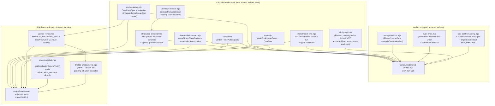

# Plan: Model Swap-In Evaluation Harness

- **Date**: 2026-07-11
- **Status**: Complete
- **Author**: Claude + Louis Strydom
- **Scope**: backend
- **Target domain(s)**: `scripts`, `shared-lib`
- ⚠ **Cross-domain work** — touches both domains; boundary is already an allowed edge (`scripts → shared-lib`, `.audit-loop/domain-map.json`), confirmed via `compute-target-domains`.

## Context Summary

**Origin**: `/brainstorm --with-gemini` (2 rounds + a debate round, sessions `1783716413349` → continued as `1783737916093`). Round 1 established the base design (deterministic core before LLM-judge, different ground truth per role, tiered corpus). Round 2 forced in a load-bearing constraint the round-1 designs missed: this must run identically in a **restricted-catalog Azure-only repo** (no Gemini/Haiku, only approved Foundry deployments) via the SAME code, not a public-repo-shaped design with an Azure exception bolted on. The debate converged on: LLM-as-structured-extractor scored deterministically is not a different philosophy from "oracle-first" — it's the same spectrum with more paraphrase tolerance — so the single-deployment (Tier C) path should be the FIRST-CLASS mode, not a fallback.

**What exists today that this plan must extend, not rebuild** — this is the single most important finding from Phase 1 exploration: **most of the auditor-role harness and roughly a third of the adjudicator-role harness already exist**, built for a different but structurally identical purpose (the audit-effectiveness research + the shadow-final-review A/B). The gap is narrower than the brainstorm's round-1 proposals assumed.

### Auditor-role prior art (near-complete)

- **`scripts/lib/audit-arms.mjs:108-139`** — `CANONICAL_ARMS`, a frozen array of arm-config rows (`{id, label, generation:{modelSentinel, provider, role?}, gptRound, geminiGate, isBaseline}`), each declaring an audit-pipeline COMPOSITION to compare. Arm A is the GPT production baseline; B/C swap in `latest-oss-reasoner` as the auditor-generation model while keeping Gemini review fixed. **Line 110's own comment**: *"A 4th/5th candidate = one more row here (extension seam)."* This is a working, tested, shadow-mode-executable (`AUDIT_MODEL_SHADOW` env var → `resolveArms()`, line 253) auditor-swap-in mechanism today.
- **`scripts/lib/audit-arms.mjs:71-106`** — `ArmSchema` (Zod), fail-closed validation: `generation.modelSentinel` MUST be a registered sentinel (`isSentinel()` from `model-resolver.mjs`), never a concrete id — concrete overrides live in env (`OSS_CODER_MODEL`/`OSS_REASONER_MODEL`), resolved by `model-resolver.mjs::pickOssModel(role)` (`model-resolver.mjs:359-367`). `provider` is currently `z.enum(['openai', 'oss'])` — **no `'azure'` option today**, the first concrete gap.
- **`scripts/lib/solo-control/scoring.mjs::scoreArms(rows, {knownDefects, underpowered, apparatusArm})`** (lines 32-105) — pure, deterministic. Collapses labeled adjudication rows into `(commit, arm, human_cluster)` units, computes per-arm `value` (severity-weighted accepted), `precision`, `falseRate`, `noiseRate`, **`knownDefectRecall`** (line 74-75: `kdMatched.size / kdIds.size`), and `matchesApparatus` (line 96-101 — a boolean: eligible AND value ≥ 0.9×apparatus AND recall ≥ apparatus's). **This `matchesApparatus` boolean is the direct ancestor of the verdict logic this plan needs to generalize** — it already encodes "is the candidate at least as good as the baseline," just not yet as a confidence-tiered switch/keep/inconclusive vocabulary, and with no cost term at all.
- **`scripts/solo-control-audit.mjs::cmdJudgeGpt()`** (line 1125) and **`cmdScore()`** (line 1479) — **corrected during implementation, see Audit Trail**: this is NOT dedicated auditor-swap infrastructure. It is the **solo author-model control experiment** (a solo Claude model as a null-hypothesis control replacing the whole audit apparatus, not a candidate for the auditor role) — a live, stateful, CSV/JSON-file-based pipeline (`run`→`merge`→`judge-gpt`→`score`, private `.blind-map.json`, per-commit checkpoint/resume) with an active experiment mid-run. What IS reusable: `runGptJudgeBatch`'s cross-family blind-judge PROTOCOL (judge system prompt + grading schema + KD-rubric joining) as a *pattern* to fork, not a live dependency to extract from — see the redesigned Phase 2 below. `cmdMerge` does join this pipeline's local solo-Claude findings with SQL-stored `model_ab_finding_scores WHERE arm IN ('A','B','C')` (the GPT/OSS auditor-arm data from `audit-arms.mjs` below), which is why the two experiments looked more entangled than they are — they share a scoring function (`scoreArms()`) and a corpus, not an execution pipeline.
- **`docs/experiments/audit-effectiveness/known-defects.json`** — the ground-truth corpus. `version: 1`, **14 entries**, schema per entry: `{id, repo, buggyCommit, fixCommit, files[], evidenceHunk, defectDesc, expectedFindingRubric, severity}`. Covers 3 repos (`claude-engineering-skills`, `wine-cellar-app`, `ai-organiser`); 10 HIGH + 4 MEDIUM severity, no LOW/CRITICAL.
- **$/KD cost formula — NOT in code today**, only in `docs/research/analysis-cost-rescoring.md` (one-off analysis, 2026-07-09): `$ / (count of distinct KD ids matched by accepted findings)`, using real per-commit diff-char extraction × pass composition × real per-MTok pricing. `scoring.mjs` computes recall (`knownDefectRecall`) but never divides by cost — **this plan must add that join**, either as a `scoreArms()` extension or a sibling function.

### Adjudicator-role prior art (partial — the live-parallel half exists, the ground-truth-corpus half does not)

- **`scripts/gemini-review.mjs:900-908`** — `SHADOW_PROVIDER_SPECS`: `{'claude-opus'|'anthropic': {family:'claude', defaultSentinel:'latest-opus', keyEnv:'ANTHROPIC_API_KEY'}, 'gemini': {family:'gemini', defaultSentinel:'latest-pro', keyEnv:'GEMINI_API_KEY'}}`. Comment at line 900-902: gated so `FINAL_REVIEW_SHADOW` unset ⇒ shadow path never entered (byte-identical), and **"a no-op under an active Azure profile (these models aren't on Foundry)"** — confirms this exact mechanism is where the Azure gap already lives today, undocumented as a gap until now.
- **`runShadowReview`** (line 967) / **`runShadowAndPersist`** (line 1039) — runs a second reviewer BLIND, in parallel with the primary, on the SAME transcript; buckets findings into `primary`/`shadow` via `diffFindingBuckets`, tags `_sourceModel`, persists to `_shadow` on the result envelope. This is a genuine two-model comparison mechanism, but it requires **two live model families running simultaneously** — under a restricted single-deployment Azure catalog, there is no second family to shadow against, so this mechanism structurally cannot produce Tier A/B evidence there (confirms the brainstorm's Round-2 finding empirically, not just architecturally).
- **`runAdjudicatorOnlyReview`** (`gemini-review.mjs:1366-1381`, per architectural-memory hit) — injects a role-specific system-prompt addendum via a module-level toggle without touching `runFinalReview`'s body; used by the tiered-recall pipeline's Stage 2 adjudicator. This is the seam a Tier-C adjudicator candidate should also go through (same prompt-addendum injection point), not a new prompt-construction path.
- **What does NOT exist**: a ground-truth corpus of past auditor findings labeled true/false-positive for scoring an ADJUDICATOR candidate's precision/recall. The brainstorm explicitly rejected building a new production-diff-scraping ingestion pipeline to create one (security/IP-exfiltration risk in a corporate repo, and it doesn't survive Azure portability either — you'd be scraping into a system that may not exist in that repo). The resolution reached in the brainstorm's synthesis: **this data already accumulates** in `model_ab_finding_scores` (per-finding `outcome`/`remediation_state`/`severity`, read via `scripts/lib/store/model-ab.mjs::getModelAbFindingScores({runId})`) and the session adjudication ledger's `dismissed`/`accepted` rulings (`scripts/lib/ledger.mjs`) — both are the SAME trust boundary the audit pipeline already operates inside, so querying them is not a new egress/IP surface. **This plan reads that existing data; it does not create a new ingestion pipeline.**

### Shared decision-math prior art

- **`scripts/lib/model-ab-decision.mjs:48-60`** — `DECISION_CONSTANTS.SEV_WEIGHTS = {LOW:1, MEDIUM:3, HIGH:8, CRITICAL:15}` — identical weights independently mirrored in `scoring.mjs:13` (`SEV_WEIGHTS`). Two copies of the same constant is a latent DRY gap this plan should NOT widen by adding a third; see File-Level Plan.
- **`scripts/lib/model-ab-decision.mjs::evaluateDecision(findingRows, costRows, constants)`** (line 237) — pure, no I/O, Level-1 gate (conformance/precision floors) → Level-2 rank by weighted-quality score, cost reported SEPARATELY as a Pareto frontier (`frontier.eurPerAcceptedWeighted`, `frontier.eurPerAcceptedHigh`, lines 340-344) — i.e. **this codebase's own established convention is "rank on quality, report cost alongside, never blend them into one number."** This plan's verdict layer follows the same convention rather than inventing a blended score.
- **`scripts/cross-skill.mjs:689-707,889-909`** — `model-ab-stats`/`model-ab-decision` CLI verbs, both thin read-only wrappers calling `evaluateDecision`/store functions — **the CLI-surface pattern this plan's new verbs should match** (report existing computed state, don't recompute it inline).

**Code Trace**: `scripts/lib/audit-arms.mjs:108-139,71-106,253-281` (auditor arm model + shadow resolution) → `scripts/lib/solo-control/scoring.mjs:32-105` (auditor scoring, `matchesApparatus`) → `scripts/solo-control-audit.mjs:363-451,1125-1078` (read in full during implementation — `cmdRun`/`cmdJudgeGpt`/`cmdScore`, confirmed to be the SEPARATE solo-control experiment, NOT extracted from; `runMultiPassCodeAudit`'s `openai` parameter confirmed to accept any OpenAI-SDK-shaped client, which IS reused) → `docs/experiments/audit-effectiveness/known-defects.json` (corpus) → `scripts/gemini-review.mjs:900-908,967,1039,1366-1381` (adjudicator shadow mechanism + Azure no-op gate + role-addendum seam) → `scripts/lib/store/model-ab.mjs::getModelAbFindingScores` (adjudicator ground-truth source) → `scripts/lib/model-ab-decision.mjs:48-60,237,340-344` (shared severity weights + rank-then-report-cost convention) → `scripts/lib/openai-client.mjs:91-160` + `scripts/lib/config.mjs:494-591` (`azureConfig`, the byte-identical-when-inactive routing pattern this plan's Azure candidate-routing must match) → `scripts/lib/model-resolver.mjs` (`resolveModel`, `SENTINEL_TO_TIER`, `OSS_POOL` env-override seam, `STATIC_POOL` append seam — confirmed via a grounding sub-agent, no line-level trace re-verified directly).

**Neighbourhood considered**: `get-neighbourhood` (kind: function/class/other) returned only `review`-tier matches (max score 0.396, well under the 0.75 `reuse`/`extend` threshold) — no direct near-duplicate. Consistent with the Phase 1 finding above: the CLOSEST matches were `scoreArms`-adjacent (`cmdScore`, `deliberationSignal`) and adjudicator-orchestration functions (`runFinalReview`, `runShadowReview`), which this plan explicitly extends rather than treating as "near-duplicates to dedupe."

## Security Considerations

Phase 0.5c returned `INC-001` (symlink path-classification bypass, composite score 0.46, `pathOverlap: false`) — **not applicable**: this plan performs no new path-classification or symlink resolution. Reusing existing labeled-finding data instead of a new production-diff-ingestion pipeline (documented above) was the brainstorm's explicit resolution to the corporate-IP-exfiltration risk Gemini raised in round 2.

**Round-1 audit H5 (Sensitive Egress Gap) — a real gap the above did not cover, fixed**: the harness DOES create new outbound LLM payloads — the structured-extraction prompts (Phase 1) send known-defect evidence (`defectDesc`, `evidenceHunk`, file paths) and, for the adjudicator path, finding text drawn from the adjudication ledger, to whichever provider the resolved route points at (public OpenAI/Anthropic/Gemini, or an Azure Foundry deployment). That is new egress surface even though the *source* data isn't new. **Mandatory**: every payload `structured-extractor.mjs` builds is routed through the existing `sensitive-egress-gate`/`redact`/sensitive-path checks (`scripts/lib/sensitive-egress-gate.mjs`, `scripts/lib/redact.mjs`) before any provider call — no model-eval-specific bypass. A payload that fails the gate produces a `failed_egress` run status (see the Run Status enum below), never a silently-degraded or partially-redacted send. `tests/sensitive-egress.test.mjs` gains model-eval fixtures: known-defect evidence text, ledger row text, and both Azure/public routes, asserting the gate is actually invoked (not just present in the import graph).

## Execution Model

**Dependency chain** (round-1 audit H4; **corrected round-5 audit H1 — the Phase 2 redesign was not propagated here, a real contradiction, now fixed**): the shared core (`route-catalog.mjs`, `structured-extractor.mjs`, `deterministic-scorer.mjs`, `verdict.mjs`, `store/model-eval.mjs`, threshold configs) must exist first — both role paths import it directly. The auditor-role path's second prerequisite is `blind-judge.mjs` (Phase 2 — the shared cross-family blind-judge primitive, forked from `solo-control-audit.mjs`'s protocol, NOT extracted from it) plus `arm-generation.mjs` (the uniform generation-call boundary) — both must exist before `model-eval-auditor.mjs` (Phase 3) is built on top of them. **`scripts/solo-control-audit.mjs` is explicitly NOT a dependency of this chain** — it is frozen, out of scope, and must not appear in any implementation diff (Audit Trail).

**Chain**: shared core → {`blind-judge.mjs` + `arm-generation.mjs` → auditor CLI} ∥ {adjudicator CLI} → close-out. The adjudicator-role path remains independent of the auditor-role path (neither imports the other, neither touches the other's files) and can be built/audited in parallel with the auditor-path pair.

**Failure semantics**: the shared core is pure/no-I/O except `store/model-eval.mjs` (append-only, via the existing `pg`-direct write pattern — no new transaction semantics beyond what `store/model-ab.mjs` already establishes) and `structured-extractor.mjs` (the new egress surface — see Security Considerations). A run that fails partway persists a typed terminal status (`completed|failed_preflight|failed_egress|failed_provider`, plus the non-terminal `running`/`pending_shadow` pair for checkpointed runs, File-Level Plan Phase 1 — **`inconclusive`/`unverified` removed from this enum, round-5 audit M1 / round-6 audit L1**: `inconclusive` is a `verdict` value, not a process-state value — a completed-but-inconclusive run persists `status:'completed', verdict:'inconclusive'`; `unverified` had no defined producer and was dropped) rather than either a false-clean silent success or no record at all — round-1 audit M7 correction; the original text ("a failed eval run simply doesn't get a result bundle persisted") was itself a success-path-honesty gap, since a *partially* completed run needs a record explaining what didn't finish, not just an absence.

## Proposed Architecture

**Right-sizing gate** (new module directory + 2 new CLI entry points + a new persisted result schema — Gate-1 trigger):

- **Band-aid extreme**: keep doing what happens today — manually re-run `cmdJudgeGpt`/`cmdScore` by hand whenever someone wants to eyeball a new model, no cost term, no persisted verdict, no adjudicator path at all, no Azure story. This is the literal status quo the user asked to move past.
- **Over-engineered extreme**: OpenAI's round-2 proposal taken literally — a single generic `evaluate-route` CLI abstracting auditor and adjudicator as interchangeable "roles" behind one execution engine, with a full capability-negotiation resolver. This ignores that `CANONICAL_ARMS` (multi-pass audit generation, shadow-mode-executed) and `FINAL_REVIEW_SHADOW` (single-shot review, live-parallel-executed) are structurally different enough that forcing them through one abstraction means rewriting both — a large, risky blast radius for a harness whose whole point is to be a *low-risk* decision-support tool.
- **Chosen**: extend each existing mechanism with exactly what it's missing (cost-join + a callable library extraction for the auditor path, a ground-truth-query + Azure candidate spec for the adjudicator path), and share only the pieces genuinely identical across both — candidate-route resolution, structured extraction, deterministic scoring, verdict computation, and result-persistence shape. This is the "resolved route bindings" idea from the brainstorm, narrowed to what this codebase's existing architecture actually supports without a rewrite (#1 DRY only where truly shared, #5 Single Source of Truth for `SEV_WEIGHTS`/verdict logic/route resolution, #18 Backward Compat — `CANONICAL_ARMS`/`FINAL_REVIEW_SHADOW` behavior is unchanged when this plan's new code isn't invoked).

**Key design decisions**:
- Route resolution (#4 No Hardcoding, #18 Backward Compat, round-1 audit H6/M3, **narrowed by round-3 audit M2 compromise**) — `route-catalog.mjs` is the sole authority for **model-eval candidate route resolution, lineage, and tier eligibility** — every model-eval path, including public Gemini/Claude candidates evaluated for the adjudicator role AND the new Azure candidate, computes its persisted `candidate_ref`/`resolvedModel`/`modelLineage`/`independenceGroup`/`judgeTier` through it. This is NOT a claim that `route-catalog.mjs` replaces every existing `SHADOW_PROVIDER_SPECS` entry's day-to-day shadow-review invocation — the round-1/round-2 text overstated this as a blanket "sole authority for candidate identity," which a broad refactor of the legacy, tested, unrelated-to-this-plan Gemini/Claude live-shadow-review specs would require; that refactor is out of scope (unnecessary blast radius on working code this plan doesn't otherwise touch). Instead: `gemini-review.mjs`'s Azure shadow spec resolves through `route-catalog.mjs` (closing the documented no-op gap), and a **compatibility regression test** (Testing Strategy) asserts the legacy Gemini/Claude shadow aliases' sentinel/family metadata still matches what `route-catalog.mjs` would resolve for the same candidate — so model-eval eligibility (independence grouping, tier) can never silently diverge from what the live shadow path actually runs, without requiring the legacy specs themselves to be rewritten. Candidates are typed (`CandidateSpec`, File-Level Plan Phase 1) — a registered sentinel, an OSS-role sentinel, or a named Azure deployment profile ONLY; a raw concrete public model ID is rejected, never silently evaluated outside the model-resolution policy.
- Verdict vocabulary is shared but **thresholds are role-specific config**, not shared numbers (#3 Modularity) — auditor thresholds gate on recall/cost/FP-ratio; adjudicator thresholds gate on F1/consensus-agreement. Both configs are pre-registered (committed to the repo, reviewed like code) before a promotion-tier run, per the shadow-reviewer's own established stopping-rule discipline (`docs/plans/final-review-shadow-reviewer.md`). **`verdict` and `nextAction` are separate fields** (round-1 audit H7) — `verdict` is the role-agnostic confidence-tiered outcome (`keep|switch|inconclusive|manual_review_required`); `nextAction` is the tier-specific operational instruction (`reject|promote_to_full|eligible_for_shadow|none`) — a screening-tier run can never set `nextAction:'promote_to_full'`\-implies-`verdict:'switch'`, because the two are independent fields, not overloaded meanings of one enum.
- The deterministic scorer (#11 Testability) treats "LLM extracts a structured field, compared exactly/fuzzily to a known answer" as ONE mechanism serving both a Tier-C auditor smoke test (does the candidate's extracted defect-location match `expectedFindingRubric`) and a Tier-C adjudicator smoke test (does the candidate's T/F verdict match the ground-truth label) — this is the debate's core reconciliation (oracle-first and structured-extraction-judge are the same mechanism, not competing philosophies). **`structured-extractor.mjs` (round-1 audit H1) is the missing layer BEFORE the scorer** — it owns the prompt contract, the role-specific Zod extraction schemas, the client invocation (via `route-catalog.mjs`'s resolved route), retry/malformed-output handling, and the mandatory egress gate (Security Considerations) — `deterministic-scorer.mjs` only ever sees already-extracted, already-validated structured data, never builds a prompt itself.

## Sustainability Notes

- **Assumption encoded**: exactly 2 roles (auditor, adjudicator) and today's known provider shapes (public OpenAI/Anthropic/Gemini, Azure Foundry, OSS router). If a 3rd role or a genuinely novel provider shape (not resolvable via sentinel or Azure deployment-id) appears, `route-catalog.mjs` is the one file that needs a new branch — everything else (verdict vocabulary, scorer primitive, persistence shape) is role/provider-agnostic already.
- **Extension points deliberately built in**: `CANONICAL_ARMS`' own "one more row" seam (line 110) is reused verbatim for the auditor candidate slot — no new extension mechanism invented. `SHADOW_PROVIDER_SPECS` gets the same treatment for the adjudicator candidate slot.
- **What changes in 6 months**: a new model generation ships. The harness should need zero code changes for a same-provider swap (sentinel resolution already picks up new releases via `model-resolver.mjs`'s live-catalog refresh) — only a genuinely new provider/vendor needs a `route-catalog.mjs` edit.
- **Round-1 audit M2 — self-correction**: the line above originally argued the pre-existing `SEV_WEIGHTS` duplication (`model-ab-decision.mjs:48-60` vs `scoring.mjs:13`) was independent pre-existing debt, out of scope. That was a misapplication of this repo's own scope-by-impact test (AGENTS.md): this plan's `verdict.mjs` consumes BOTH `scoring.mjs`'s auditor metrics AND (indirectly, via the shared decision-math convention) `model-ab-decision.mjs`'s cost-frontier shape in the SAME cross-role decision layer — so a future edit to one copy and not the other would silently desync auditor vs. adjudicator verdicts through code this plan directly builds on. That makes the duplication load-bearing for this plan's correctness, not independent. **Fixed, not deferred**: `scoring.mjs` now imports `SEV_WEIGHTS` from `model-ab-decision.mjs` (the canonical copy, per that module's own comment) instead of keeping its own; a regression test asserts both modules' consumers observe the same object.

## File-Level Plan

**Phase 1 — Shared core**: the route-resolution, extraction, deterministic-scoring, verdict-computation, and persistence primitives every downstream phase imports. Files:
- `scripts/lib/model-eval/route-catalog.mjs` (create, **`transport` field added round-5 audit H5**) — `resolveCandidateRoute({role, candidateSpec, env})` → `{candidateSpec, provider, resolvedModel, deploymentId|null, modelLineage, lineageStatus: 'known'|'unknown', independenceGroup|null, independenceEligible: boolean, judgeTier: 'A'|'B'|'C', availableFamilies: string[], transport: 'openai-compatible'|'native-anthropic'|'native-gemini'}`. **Round-5 audit H5 fix — provider capability mismatch**: `CandidateSpec`'s `kind:'sentinel'` accepts ANY registered sentinel (including `latest-opus`/`latest-pro`, which resolve to native Anthropic/Gemini transports), but `arm-generation.mjs`'s auditor-generation boundary (Phase 3) only knows how to drive `runMultiPassCodeAudit` through an OpenAI-SDK-shaped client (`openai-client.mjs::createOpenAIClient`) — this is exactly the repo's current real-world shape (Azure profile: GPT-5.4 as auditor via `createOpenAIClient`, Opus-4.8 as the *adjudicator*/final-reviewer via the separate native-Anthropic Foundry path, never the reverse). `transport` makes this explicit rather than implicit: `resolveModel`'s underlying `SENTINEL_TO_TIER[...].provider` maps `openai`/`oss` → `'openai-compatible'`, `anthropic` → `'native-anthropic'`, `google` → `'native-gemini'`. `model-eval-auditor.mjs` (Phase 3) checks `transport === 'openai-compatible'` at preflight for the AUDITOR role specifically and fails `failed_preflight` (never silently falling back to a single `provider-adapter.mjs` structured call as a workaround — that would recreate the exact fairness bug Gemini round-3 caught) for any other transport; the ADJUDICATOR role has no such restriction. **Round-6 audit M2 fix — this sentence originally (incorrectly) said adjudicator Tier A/B is `blind-judge.mjs`-mediated, contradicting Phase 4's actual design**: adjudicator Tier A/B is `gemini-review.mjs`'s live-shadow mechanism + `finalize-shadow-eval.mjs` (Phase 4) — `blind-judge.mjs` (Phase 2) is scoped to the AUDITOR role's `unit:'findings-vs-diff'` grading only in this plan (`unit:'verdict-vs-finding'` is explicitly reserved, unimplemented future work, not a current adjudicator dependency — Phase 2's own bullet). Adjudicator Tier C uses `provider-adapter.mjs`-mediated structured T/F extraction (`structured-extractor.mjs`), which already supports Anthropic/Gemini/Azure transports — that's the correct, narrower claim: adjudicator Tier C, not Tier A/B, is unrestricted by the auditor-only `transport` check, because Tier C never calls `runMultiPassCodeAudit`. `candidateSpec` is a Zod discriminated union — `{kind:'sentinel', value}` | `{kind:'oss-role', role:'coder'|'reasoner'}` | `{kind:'azure-deployment', profile}` — a raw concrete public model ID is REJECTED (round-1 audit H6), never silently evaluated outside `model-resolver.mjs`'s policy. `independenceGroup` is keyed on `modelLineage` (the underlying provider identity from `SENTINEL_TO_TIER`), not transport — so an Azure-hosted and public instance of the same lineage count as ONE family for Tier A/B eligibility. **Round-2 audit H1 fix — fails closed on unknown lineage**: a route whose lineage cannot be resolved gets `lineageStatus:'unknown'` and `independenceEligible: false` — it does NOT get its own group (the round-1 design's mistake, which would have let an unknown model earn Tier A/B independence credit it hadn't proven). Tier A/B promotion requires `lineageStatus:'known'` on BOTH routes being compared; otherwise the run is forced to Tier C / `manual_review_required`. Wraps `azureConfig` (`config.mjs`) + `resolveModel`/`isSentinel` (`model-resolver.mjs`); never constructs its own provider client. **Round-4 audit M1 fix — Azure profile contract was unspecified**: `{kind:'azure-deployment', profile}`'s `profile` is a key into a new committed `scripts/lib/model-eval/config/azure-routes.json` (Category B — pure, deterministic, reviewed like code, NOT a runtime-generated cache), each entry `{profile: string, role: 'auditor'|'adjudicator', deploymentEnvVar: string, modelLineage: string, lineageStatus: 'known'|'unknown'}` — `deploymentEnvVar` names the EXISTING `AZURE_*_DEPLOYMENT` env var (`azureConfig`, `config.mjs`) this profile resolves to, so `route-catalog.mjs` never invents a new deployment-naming scheme. `resolveCandidateRoute` looks up the profile, reads the named env var via `azureConfig`, and fails `failed_preflight` (not a runtime provider error) if the profile is unknown, the env var is unset, or `azureConfig.active` is false. The CLI's `--candidate` flag accepts a JSON string validated against `CandidateSpec`'s Zod schema at startup (round-4 audit M1's "exact serialization format" ask) — e.g. `--candidate '{"kind":"azure-deployment","profile":"foundry-claude-audit"}'` — never a bare model-id string.
- `scripts/lib/model-eval/provider-adapter.mjs` (create, round-2 audit H3, **scope corrected Gemini round-3 audit G1**) — `invokeStructured({route, messages, schema, signal})` → `{data, raw, usage}`. The missing normalization layer between a resolved route and an actual provider call: one adapter function per transport (OpenAI/Azure `responses.parse`, Gemini JSON mode, Anthropic JSON-mode prompting, OSS routing), each built ONLY on the existing client factories (`openai-client.mjs`, `anthropic-client.mjs`, the Gemini call path, the OSS `createOpenAIClient({oss})` path) — never ad-hoc SDK construction. `structured-extractor.mjs` calls only this interface, never a provider SDK directly — it is the correct shape for genuinely single-call structured tasks: adjudicator Tier-C T/F extraction and auditor Tier-C defect-localization extraction. **Round-4 audit H4's framing was corrected by Gemini round-3 audit G1**: round-4 proposed reusing `invokeStructured` for AUDITOR Tier A/B GENERATION too (a candidate arm's actual finding-producing audit pass) — Gemini correctly identified this as a fairness bug (one structured call cannot match the production baseline's 5-pass ensemble; see Phase 3's `arm-generation.mjs::runAuditGenerationArm` for the actual fix, which does NOT use `provider-adapter.mjs` for this path). Captures `usage` (tokens, cost hints) uniformly across all transports into the `ModelEvalUsageEvent` shape (see `cost.mjs` below) for the extraction paths that do use it.
- `scripts/lib/model-eval/structured-extractor.mjs` (create, round-1 audit H1, **signature fixed Gemini round-2 audit G3**, **ground-truth leakage fixed round-6 audit H1**) — `extractStructured({role, route, rawContext, schema})` → `{data, raw, usage}` | throws on malformed output after retry. **Gemini round-2 audit G3 fix — interface contradiction**: round-4's text took a pre-built `prompt` string as input while ALSO claiming `extractStructured` "owns role-specific prompt builders" and calls the egress gate "before building the prompt" — a caller that builds the prompt string itself both violates ownership and defeats structural redaction (the gate could only scan an already-flattened string, not the raw fields). Fixed: the parameter is `rawContext` (a plain object of source fields, never a pre-built string). **Round-6 audit H1 fix — CRITICAL, ground-truth leakage**: the round-4 `rawContext` shape for the auditor role, `{defectDesc, evidenceHunk, filePaths}`, included `defectDesc` — which IS the known-defect's ANSWER LABEL (`known-defects.json`'s own schema field, Context Summary), not production-visible audit input. A candidate model could pass Tier-C by restating the supplied label back, measuring "can this model parrot a hint" rather than "can this model find the defect" — this would have made every Tier-C result meaningless while looking like real evidence. Fixed: `rawContext` is now a discriminated shape by field VISIBILITY, not just by role — `{visibleInput: {evidenceHunk, filePaths}, hiddenGroundTruth: {defectDesc, expectedFindingRubric, severity, kdId}}` (auditor role; adjudicator role's `{findingText, severity}` has no hidden-label equivalent, so its shape is unchanged). `extractStructured`'s prompt builders receive ONLY `visibleInput` (post-egress-gate) — `hiddenGroundTruth` is passed around `extractStructured` entirely, straight to `deterministic-scorer.mjs::scoreDefectLocalization` as the comparison target, never entering any provider-bound payload. A test (Testing Strategy) inspects the final provider message and fails if any `hiddenGroundTruth` field appears in it. Owns: `AuditorExtractionSchema`/`AdjudicatorExtractionSchema` (Zod), role-specific prompt builders, retry-once-on-malformed-output policy, and calls `provider-adapter.mjs::invokeStructured` for the actual invocation. **Egress-preparation contract made explicit round-4 audit M3, reordered round-2 audit G3**: `extractStructured` calls `prepareModelEvalPayloadForEgress({route, rawContext})` → `{approvedContext, redactionReport, egressDecision: 'send-as-is'|'send-redacted'|'blocked'}` FIRST, on the raw structured fields (structural redaction sees `evidenceHunk` as its own field, not buried inside a flattened prompt string) — itself built on the existing `sensitive-egress-gate`/`redact` (`scripts/lib/sensitive-egress-gate.mjs`, `scripts/lib/redact.mjs`), no new redaction logic, only a named orchestration point. ONLY THEN do the role-specific prompt builders consume `approvedContext` to construct the actual prompt text passed to `provider-adapter.mjs::invokeStructured` — the prompt builders never see `rawContext` directly, so there is no path that bypasses the gate. `egressDecision:'blocked'` throws a typed `EgressGateError`, mapped to run status `failed_egress`. **Redaction is permitted for BOTH public and Azure routes** (the trust boundary is "does this leave the process," not "which provider"), but a redaction that would remove content the deterministic scorer needs to match against (e.g. `evidenceHunk`'s file path) is a design constraint the known-defects corpus fixtures are chosen to avoid (round-1's corpus-provenance argument — this repo's own private commit history, not public PII), not something the gate special-cases.
- `scripts/lib/model-eval/deterministic-scorer.mjs` (create, round-2 audit H5 — split into role-specific metric functions) — `scoreBinaryClassification(candidatePredictions, groundTruthLabels)` → `{truePositives, falsePositives, trueNegatives, falseNegatives, precision, recall, f1, accuracy}` (adjudicator T/F extraction scoring). `scoreDefectLocalization(candidateOutputs, expectedRubrics, {matchMode: 'exact'|'fuzzy', fuzzyConfig})` → `{correct, total, accuracy, mismatches: [...]}` — auditor Tier-C scoring; `fuzzyConfig` is a committed, versioned normalization+threshold algorithm (lowercase + whitespace-collapse + file-path-basename match + a fixed Levenshtein-ratio threshold on the defect description, all constants named in `deterministic-scorer.mjs` itself, not implicit). Both functions are pure, no I/O — consume `structured-extractor.mjs`'s already-validated output only, never build a prompt or make an LLM call.
- `scripts/lib/model-eval/verdict.mjs` (create, **input restructured round-3 audit H4**) — `computeVerdict(input)` → `{verdict: 'keep'|'switch'|'inconclusive'|'manual_review_required', nextAction: 'reject'|'promote_to_full'|'eligible_for_shadow'|'none', reasons: string[]}` (round-1 audit H7 — `verdict` and `nextAction` are separate fields, not one overloaded enum). `input` is a Zod discriminated union on `mode`, because Tier C has no baseline to compare against (it scores the candidate directly against ground truth) while Tier A/B is inherently comparative — the round-1/round-2 signature (`{role, tier, metrics, baselineMetrics, thresholds}`) wrongly implied `baselineMetrics` is always required. **Round-4 audit H3 fix — the round-3 union omitted the very fields the plan claimed it enforced invariants over**, **restructured again round-5 audit H6 — a single route's self-reported tier cannot certify a COMPARISON**: `routeEvidence` (a single route's own `{judgeTier, lineageStatus, independenceEligible}`) let a caller pass `judgeTier:'A'` evidence from ONLY the candidate route while the baseline or judge route was actually same-lineage or unknown — the decision table validated the shape but never the pairwise relationship the tier claim depends on. Fixed: comparative-mode input carries `comparisonEvidence: {candidateRoute, baselineRoute, judgeRoute: RouteEvidence|null, computedJudgeTier: 'A'|'B'|'C', independenceChecks: {candidateVsBaseline: boolean, candidateVsJudge: boolean|null, baselineVsJudge: boolean|null}}` — produced by a NEW pure function `route-catalog.mjs::resolveEvaluationTier({role, mode, candidateRoute, baselineRoute, judgeRoute})` that `model-eval-auditor.mjs`/`model-eval-adjudicator.mjs` call once per run (never hand-assembled by a caller): it requires `lineageStatus:'known'` on every route involved AND pairwise-distinct `independenceGroup`s between candidate/baseline (and candidate/judge, baseline/judge, when a judge route participates) before computing anything above `'C'` — a single unknown or same-lineage pair anywhere in the triple caps `computedJudgeTier` at `'C'`, fail-closed. `computeVerdict` consumes `comparisonEvidence.computedJudgeTier` — it never trusts a caller-supplied tier string. Oracle mode keeps the simpler single-route `routeEvidence: {judgeTier: 'C', lineageStatus, independenceEligible}` (Tier C has no baseline/judge triple to check). Full signature: `{mode:'comparative', role, tier: 'screen'|'promotion', comparisonEvidence, candidateMetrics, baselineMetrics, costDelta, thresholds}` (Tier A/B) | `{mode:'oracle', role, tier: 'screen'|'promotion', routeEvidence, candidateMetrics, sampleSize, corpusVersion, thresholds}` (Tier C — scores the candidate against ground truth directly, using the threshold config's own absolute floors, e.g. `minRecallRatioVsBaseline`-shaped fields become fixed minimums rather than baseline-relative ratios). Pure. Generalizes `scoreArms()`'s `matchesApparatus` boolean. **A single committed `(role, mode, tier, judgeTier) → allowed {verdict, nextAction} pairs` decision table** (a plain data structure inside `verdict.mjs`, not duplicated per-CLI) is the one place these are enforced: `computeVerdict` looks up the input's key, computes the candidate `{verdict, nextAction}` from metrics/thresholds, and Zod-refines the result against the table entry — `mode:'oracle' ⇒ verdict ≠ 'switch'` and `mode:'comparative' ⇒ comparisonEvidence.computedJudgeTier ≠ 'C' \| verdict ≠ 'switch'` (a comparative-mode input whose OWN `resolveEvaluationTier` call capped it at `'C'` — round-5 audit H6 — cannot promote to `switch` either, closing the same fail-closed gap for the pairwise case) are two rows of that table, not separately-remembered conventions. **Reconciles the round-3 Phase-3/Risk-Register conflict on `eligible_for_shadow`**: the decision table's `screen` rows (both roles) never allow `nextAction:'eligible_for_shadow'` — it is reachable ONLY from an adjudicator `promotion`-tier, Tier-C-mode row (the "Tier-C-only run's `nextAction` is at most `eligible_for_shadow`" language in the Risk Register refers exclusively to this one promotion-tier row, not to screening).
- `scripts/lib/model-eval/config/schema.mjs` (create, round-1 audit L1, **restructured round-3 audit H3**, **thresholds split by mode round-6 audit M3**) — `ThresholdConfigSchema` (Zod): `{version: number, role: 'auditor'|'adjudicator', calibrationNote: string, screen: {minSampleSize: number, thresholds: TierThresholds}, promotion: {minSampleSize: number, thresholds: TierThresholds}}`, where `TierThresholds = {comparative?: {...baseline-relative fields}, oracle?: {...absolute-floor fields}, allowUnpricedPromotion?: boolean}`. Split into `screen`/`promotion` sub-objects (round-1/round-2's single flat `minSampleSize` conflicted with the auditor screening tier's own "4-5 stratified commits" selection) — each tier's `minSampleSize` is achievable by construction for that tier's own corpus subset. **Round-6 audit M3 fix — `comparative`/`oracle` are now separate sub-keys, never a shared field name**: the round-3/round-5 text reused the SAME field name (e.g. `minRecallRatioVsBaseline`) for both modes, saying it "becomes a fixed minimum" in oracle mode — the same key meaning a ratio in one context and an absolute floor in another is exactly the kind of ambiguity a calibration edit could silently misinterpret. `computeVerdict` (`verdict.mjs`) reads ONLY the sub-key matching its own `input.mode` (`comparative`→`thresholds.comparative`, `oracle`→`thresholds.oracle`) — a config missing the sub-key its own tier needs fails validation at CLI startup, never falls through to the other mode's numbers. Validated at CLI startup (Phase 3/4 CLIs); a malformed or unversioned config fails loud, never silently falls back to defaults.
- `scripts/lib/model-eval/config/auditor-thresholds.json` (create, round-2 audit H7 — compromise: conservative provisional numbers, not fabricated final calibration; restructured round-3 H3, round-6 M3) — `version: 2`, `calibrationNote` per above, `screen: {minSampleSize: 4, thresholds: {comparative: {minRecallRatioVsBaseline: 1.0, maxFalsePositiveRatioVsBaseline: 1.15}, oracle: {minRecall: 0.7, maxFalsePositiveRate: 0.2}}}` (4 — matches the deterministic stratified-selector's "4-5 commits" floor; both mode sub-objects present since screen tier can land in either mode depending on `resolveEvaluationTier`'s outcome), `promotion: {minSampleSize: 8, thresholds: {comparative: {minRecallRatioVsBaseline: 1.0, maxFalsePositiveRatioVsBaseline: 1.15, switchIfCostPerKdImprovesByPct: 20, orSwitchIfQualityImprovesByPct: 10}, oracle: {minRecall: 0.7, maxFalsePositiveRate: 0.2}, allowUnpricedPromotion: false}}` (8, of the 14-entry corpus) — deliberately conservative (bias toward `keep`/`inconclusive` over `switch`, matching the brainstorm's "auditor false negatives are expensive and invisible" conclusion). The `oracle.minRecall`/`maxFalsePositiveRate` absolute floors are DELIBERATELY looser than the comparative ratios (a Tier-C-only run has no baseline to lean on, so its bar is calibrated as "plausibly useful in isolation," not "matches production") — noted explicitly in `calibrationNote` rather than left implicit.
- `scripts/lib/model-eval/config/adjudicator-thresholds.json` (create, same compromise; restructured round-3 H3, round-6 M3) — `version: 2`, same `calibrationNote` pattern, `screen: {minSampleSize: 10, thresholds: {oracle: {minF1: 0.95}}}` (Tier C, deterministic — a small labeled-row sample from `getAdjudicatorGroundTruth()`; screen is oracle-mode-only for the adjudicator role, so no `comparative` sub-key exists here), `promotion: {minSampleSize: 30, thresholds: {comparative: {minF1VsBaseline: 0.98, maxFalseAcceptDeltaAbs: 0.05, switchIfCostImprovesByPct: 30, minLiveShadowRuns: 20}, allowUnpricedPromotion: false}}` (the `minLiveShadowRuns: 20` mirrors the shadow-final-review A/B's own pre-registered `N≥20` stopping rule).
- `scripts/lib/model-eval/cost.mjs` (create, round-2 audit H6 — explicit correlation shape; **pricing source fixed round-4 audit M2**) — `ModelEvalUsageEventSchema` (Zod: `{runId, role, phase, armId|null, candidateRef, provider, resolvedModel, deploymentId|null, inputTokens, outputTokens, priceTableVersion, costUsd, capturedAt}`) + `CostRowSchema` (aggregated per `candidateRef`) + `assembleCostRows(usageEvents, priceTable)`. **`priceTable` is NOT a new bespoke pricing source** — the round-3 text left this unnamed, and GPT round-4 correctly flagged it as load-bearing for promotion verdicts: `assembleCostRows` calls the EXISTING `scripts/lib/model-pricing.mjs::priceFor(modelId)`/`isPriced(modelId)`, and `priceTableVersion` is that module's own `PRICING_VERSION` export — no second pricing source to keep in sync. `model-pricing.mjs` has no Azure-deployment-specific entries today; `isPriced(resolvedModel)` returning false for an Azure deployment sets `costStatus:'unavailable'` on that row (not a fabricated $0) — extending `model-pricing.mjs` with organization-specific Azure per-deployment pricing (a follow-up to THIS plan, since it touches shared, already-audited pricing infrastructure the shadow-final-review cost tracking also depends on) is out of scope here; until then, Azure-candidate promotion-tier runs with a cost-gated threshold enabled fail `failed_preflight` rather than silently running quality-only. `provider-adapter.mjs` emits one `ModelEvalUsageEvent` per invocation (`phase:'extraction'` or `'judge'`). **Round-5 audit H4 fix — auditor generation cost was unaccounted for after the Phase 2 redesign**: `runMultiPassCodeAudit(client, ...)`'s returned envelope already aggregates `_usage` (verified directly — `mergedResult._usage`, `openai-audit.mjs`) across all 5 passes, so `arm-generation.mjs::runAuditGenerationArm` (Phase 3) reads THAT existing field — no wrapping proxy, no new usage-capture mechanism — and converts it into one `ModelEvalUsageEvent` with `{phase:'generation', armId, candidateRef}` per generation call (candidate and baseline each produce their own event, tagged separately, so `assembleCostRows` never mixes them). `blind-judge.mjs` (Phase 2) emits its own `phase:'judge'` events via `provider-adapter.mjs`. All three phases (`generation`/`extraction`/`judge`) thread the same `runId`/`role`/`armId` so candidate, baseline, and judge usage are never mixed (tested explicitly). `verdict.mjs`'s cost-gated thresholds treat `costStatus:'unavailable'` as a hard block on any `switch`/`promote_to_full` outcome, never a silent pass-through; a threshold config MAY explicitly opt into quality-only promotion via a named `allowUnpricedPromotion: boolean` field (default `false`) rather than an implicit missing-price fallback.
- `scripts/lib/store/model-eval.mjs` (create, round-1 audit H2/M6, round-2 audit L1 pagination fix, **lifecycle split round-4 audit H2**) — the module is NOT append-only end to end (round-3/round-1 text calling it "append-only" while also needing a `pending_shadow → terminal` transition was self-contradictory): three explicit operations, not one `persistEvalRun` blob-write. `createEvalRun(bundle)` — first write for any run. **Round-6 audit H2 fix — every checkpointed run needs a non-terminal row to exist BEFORE checkpointed work begins**: the round-5 text only gave adjudicator Tier A/B a non-terminal state (`pending_shadow`), but Phase 2's `model_eval_judge_batches` has an FK to `model_eval_runs(run_id)` and auditor promotion-tier runs ALSO checkpoint judge batches via `blind-judge.mjs` — with no row to reference, the FK would fail or implementers would be forced to mark the run terminal before it's actually done. Fixed: `bundle.status` is `running` for ANY run that will checkpoint work before reaching a verdict — auditor promotion-tier (blind-judge batches) and adjudicator Tier A/B (`pending_shadow` is now a sub-state entered only from `running`, not a first-write state) — auditor screening-tier and adjudicator Tier C (single-shot, no checkpointing) still go straight to a terminal status, no `running` row. `updateEvalRunTerminal({repoId, runId, expectedStatus:'running'|'pending_shadow', terminalBundle})` (**repo-scoped round-5 audit H2; `expectedStatus` widened round-6 audit H2** to cover both the generic checkpointed-run state and the adjudicator-specific sub-state) — the ONLY way a run transitions out of a non-terminal status; issues `UPDATE model_eval_runs SET status=$terminal, verdict=..., metrics=..., ... WHERE run_id=$1 AND repo_id=$2 AND status=$expectedStatus` and checks the affected-row count is exactly 1 — zero rows means the run was already finalized (another process won the race) or doesn't exist, and the caller treats that as a no-op success (idempotent), never a silent overwrite of a terminal row. `getEvalRuns({repoId, role, limit, cursor})` (read-only, repo-scoped consistently with the index — round-5 audit H2 applies here too, a listing CLI must not leak another repo's runs on a shared DB). Once a run reaches a terminal status it is immutable through this API — the only way to alter a terminal row is a documented admin/repair script (Risk Register), never a normal write path. `finalize-shadow-eval.mjs` (Phase 4) uses `createEvalRun`/`updateEvalRunTerminal` exclusively; nothing else writes a status transition. **Gemini round-1 audit G1 fix — discovery API, repo-scoping fixed round-5 audit H2**: `getActiveEvalRunId({repoId, role})` → `{runId, candidateRef} | null` — a single read query (`SELECT run_id, candidate_ref FROM model_eval_runs WHERE repo_id=$1 AND role=$2 AND status='pending_shadow' LIMIT 1`) that `gemini-review.mjs` calls at startup so it can discover an in-flight adjudicator evaluation without any out-of-band signaling (env var, file, IPC). **Round-5 audit H2 fix — the original signature omitted `repoId`**: on a shared database (multiple repos pointed at the same `AUDIT_DB_URL`, e.g. this repo's own cloud setup), an ordinary `/audit-code` run in Repo X could have discovered Repo Y's `pending_shadow` run and appended its shadow observations to the wrong `run_id` — silently contaminating another repo's evaluation with structurally-valid-looking but wrong data. `repoId` is now REQUIRED, derived by `gemini-review.mjs` through the same repo-identity resolution every other store module uses (`resolveRepoIdentity`), never an ambient/implicit assumption. **Every function touching a `model_eval_runs`/`model_eval_shadow_observations` row is repo-scoped the same way**: `appendModelEvalShadowObservation`, `getShadowObservationsForEvalRun`, `getTerminalShadowObservations` (Phase 4), and `updateEvalRunTerminal` all take/verify `repoId` and reject (never silently no-op) a call whose `runId` belongs to a different repo. A **partial unique index** (`CREATE UNIQUE INDEX ON model_eval_runs (repo_id, role) WHERE status = 'pending_shadow'`) enforces at most one `pending_shadow` run per `(repo_id, role)` at a time — `createEvalRun` surfaces the resulting unique-violation as a typed `EvalRunAlreadyActive` error rather than a raw DB error, so a second concurrently-started Tier A/B run in the SAME repo fails fast instead of racing the first for shadow observations (a different repo's concurrent run is unaffected — different `repo_id`, different index cell). `model_eval_runs` columns: `run_id uuid PK`, `repo_id`, `role text CHECK (role IN ('auditor','adjudicator'))`, `tier text CHECK (tier IN ('screen','promotion'))`, `candidate_ref jsonb`, `baseline_ref jsonb`, `judge_tier text CHECK (judge_tier IN ('A','B','C'))`, `status text CHECK (status IN ('completed','failed_preflight','failed_egress','failed_provider','running','pending_shadow'))` (`running` — round-6 audit H2 — the generic non-terminal state for ANY checkpointed run, auditor promotion-tier or adjudicator Tier A/B, entered by `createEvalRun` before any batch/observation exists; `pending_shadow` — round-3 audit H1, entered from `running` — the adjudicator-specific sub-state while live shadow runs are accumulating, see Phase 4). **`unverified` removed (round-6 audit L1)** — it had no defined producer, transition, or reporting semantics; every actual outcome this plan needs is already covered by `completed`+`verdict` or the `failed_*` statuses. **Round-5 audit M1 fix — `status` and `verdict` both had an `'inconclusive'` value with no defined mapping between them**: `status` is now PROCESS-STATE-ONLY (did the run execute to completion, and if not, why) — `'inconclusive'` is REMOVED from the status enum entirely; a run that executed successfully but couldn't reach a confident decision (e.g. below `minSampleSize`) persists `status:'completed', verdict:'inconclusive'` — the SAME terminal status as every other successful run, distinguished only by its `verdict`. `verdict text`, `next_action text`, `metrics jsonb`, `thresholds_version int`, `cost jsonb`, `evidence jsonb`, `harness_sha text`, `corpus_version text`, `created_at timestamptz DEFAULT now()`. Index on `(repo_id, role, created_at DESC, run_id DESC)`; `getEvalRuns` orders `ORDER BY created_at DESC, run_id DESC` (composite tie-breaker — a `created_at`-only cursor can skip/duplicate rows within the same timestamp bucket) with a hard `limit` cap (default 50, max 500) and a `{createdAt, runId}` composite cursor, never an unbounded scan. `jsonb` columns are written via the existing `serializeWriteParam` seam (`scripts/lib/db/query.mjs`) — never hand-`JSON.stringify`'d (AGENTS.md's jsonb-safe write-seam invariant).
- `supabase/migrations/<timestamp>_model_eval_runs.sql` (create) — **round-2 audit M1 verified as the correct path** (dismissed a "may be wrong location" finding with direct evidence): `ls supabase/migrations/` shows 51 existing `.sql` files today, and `scripts/setup-postgres.mjs:14-15,47-51` explicitly documents `supabase/migrations/` as this source repo's canonical migration path (consumers get `.audit-loop/migrations/*.sql` via `sync-to-repos.mjs::syncMigrations()`). Applied via the existing `node scripts/setup-postgres.mjs --migrate`, following `model_ab_*`'s migration conventions (idempotent, ledger-tracked via `audit_loop_migrations`).

**Phase 2 — Shared blind-judge primitive** (depends on Phase 1; **redesigned post-implementation — see Audit Trail**). NOT an extraction from `scripts/solo-control-audit.mjs` — that file was discovered mid-implementation to be the **live, active solo author-model control experiment** (a solo Claude model as a null-hypothesis control replacing the whole audit apparatus — unrelated to auditor-role candidate swaps), stateful and CSV/JSON-file-based, with a real experiment mid-run. Extracting from it risked corrupting active research data for zero architectural benefit. Instead: fork the reusable PROTOCOL (cross-family blind judging) into a new, clean, DB-backed primitive; freeze the original file untouched.
- `scripts/lib/model-eval/blind-judge.mjs` (create) — `runBlindJudgeProtocol({runId, role, unit, candidateFindings, baselineFindings, knownDefects, judgeRoute, signal})` → `{gradings: [...], usage, batchId}`. Owns: cross-family judge route selection (built on `route-catalog.mjs`'s existing `independenceEligible`/Azure-degraded-tier fields — a judge whose lineage isn't independent from the candidate/baseline degrades the run to Tier C rather than silently same-family judging, never a silent credibility downgrade); identity-blinding (strips arm/model labels before any payload is built, so the judge never sees which side produced which finding); the grading Zod schema + judge system prompt, **forked VERBATIM from `solo-control-audit.mjs`'s `JUDGE_SYSTEM`/`GradingSchema`** (a provenance comment citing the source lines + a cross-file byte-identity fixture test, `tests/blind-judge-fork-parity.test.mjs`, pins the two copies until the source experiment is archived — so any future prompt/schema drift between the two is a deliberate, tested decision, never silent divergence that would make solo-control's historical labels and this harness's labels incomparable). **Round-5 audit M2 fix — the parity test must not import the frozen file**: `solo-control-audit.mjs` is a CLI entry point (top-level `main()` invocation on `import.meta.url` match) — importing it as an ES module to read its constants would execute CLI code as a test-suite side effect and creates exactly the coupling-to-active-research-infra this redesign exists to avoid. **Round-6 audit M1 fix — the marker-comment approach itself contradicted the freeze**: requiring `// PARITY-MARKER` comments in BOTH files meant editing the supposedly-untouched `solo-control-audit.mjs` to add them — a real contradiction with "frozen, must not appear in the implementation diff." Corrected: a committed SNAPSHOT FIXTURE — `tests/fixtures/solo-control-judge-protocol-snapshot.js` — captures the exact `JUDGE_SYSTEM` string + `GradingSchema` shape as of the fork date, with a provenance comment citing the source file/line range and date. The parity test compares `blind-judge.mjs`'s copies against THIS fixture (a file this plan owns and creates), never against `solo-control-audit.mjs` directly — no read, import, or edit of the frozen file at all, in code or in tests; per-batch DB checkpointing via `store/model-eval.mjs` (no CSVs, no `.blind-map.json` — see the new migration below, so a killed/restarted evaluation run resumes from the last completed batch); retry-once-on-malformed-output; calls `provider-adapter.mjs::invokeStructured` for the actual judge call (never a raw provider SDK). **Round-6 audit H3 fix — judge route selection was entirely unspecified**: `runBlindJudgeProtocol` requires a `judgeRoute`, but nothing said how the CLI obtains one. Rather than inventing an auto-selection algorithm (which would itself need the same independence guarantees it's supposed to provide), promotion-tier comparative runs REQUIRE an explicit `--judge <CandidateSpec-shaped arg>` CLI flag (`model-eval-auditor.mjs`/`model-eval-adjudicator.mjs`, Phase 3/4) — the operator names the judge the same way they name the candidate, resolved through the SAME `route-catalog.mjs::resolveCandidateRoute`. `route-catalog.mjs::resolveEvaluationTier` (round-5 audit H6) validates the judge's pairwise independence against BOTH candidate and baseline before any judge call; a run started without `--judge` at promotion tier is forced to Tier C (never a silent same-family judge or a hardcoded default). `model_eval_runs.evidence` persists the resolved `judge_ref` alongside `candidate_ref`/`baseline_ref` so a run's exact evidence triple is always reconstructable later. `unit` parameterizes the grading payload SHAPE — `'findings-vs-diff'` (auditor role: grade candidate findings against the full commit diff + known-defect rubric — the only unit implemented now) | `'verdict-vs-finding'` (adjudicator role: reserved, NOT implemented in this plan — grading a reviewer's verdict against finding text is a structurally different payload; a future phase adds it as a second branch on the same primitive, not a new module). Egress-gated identically to `structured-extractor.mjs` (same `sensitive-egress-gate`/`redact` path, same fail-closed `EgressGateError`→`failed_egress` mapping).
- `supabase/migrations/<timestamp>_model_eval_judge_batches.sql` (create) — `model_eval_judge_batches`: `batch_id uuid PK`, `run_id uuid NOT NULL REFERENCES model_eval_runs(run_id) ON DELETE CASCADE`, `commit_sha text`, `unit text CHECK (unit IN ('findings-vs-diff','verdict-vs-finding'))`, `gradings jsonb`, `judge_route jsonb`, `created_at timestamptz DEFAULT now()`. Index `(run_id, created_at)`. DB-backed checkpoint replaces `cmdJudgeGpt`'s CSV-resume mechanism — a killed process re-invokes the CLI, which queries existing batches for this `run_id` and skips them, never re-grading or losing in-flight work.
- **`scripts/solo-control-audit.mjs` — untouched, explicitly frozen.** Not a code change — a governance note: this file stays exactly as-is until the active solo author-model control experiment concludes (project memory: first result 2026-07-07, re-run pending after a diff-truncation confound fix). Archiving it and optionally migrating future solo-control re-runs onto `blind-judge.mjs` is a separate, later decision outside this plan's scope. `model_eval_runs.candidate_ref`/`baseline_ref` are already open `jsonb` (Phase 1) — no schema change is needed to eventually represent a solo-arm comparison through this harness.

**Phase 3 — Auditor-role path** (depends on Phase 1 + Phase 2): extends `CANONICAL_ARMS`/`scoring.mjs` with a candidate-arm slot, cost-per-known-defect scoring, the auditor-role generation boundary, and the CLI that calls `blind-judge.mjs`.
- `scripts/lib/model-eval/arm-generation.mjs` (create — **relocated here from the old Phase 2 `evaluation-runner.mjs`, corrected — see Audit Trail**) — `runAuditGenerationArm({arm, auditInput, signal})`: the candidate-arm generation call boundary. **Round-5 audit H5 — checks `route.transport === 'openai-compatible'` first** (throws a typed `UnsupportedGenerationTransport` error otherwise, mapped by the CLI to `failed_preflight`) — see `route-catalog.mjs`'s `transport` field, Phase 1. **Simpler than every prior draft**: `openai-audit.mjs::runMultiPassCodeAudit(client, ...)`'s first parameter already accepts ANY OpenAI-SDK-shaped client (verified directly, no special-casing), and `route-catalog.mjs`'s three `CandidateSpec` kinds are ALL served by `openai-client.mjs::createOpenAIClient({purpose|oss|azure})` — so generation is UNIFORM across every arm kind: resolve the appropriate client (`sentinel`→public `createOpenAIClient({purpose:'gpt'})` + `resolveModel`, `oss-role`→`createOpenAIClient({oss:{...}})`, `resolved-route`→`createOpenAIClient({azure:...})` with the resolved deployment), then call the SAME `runMultiPassCodeAudit(client, auditInput, ...)` for all three — identical 5-pass search effort and cross-verification regardless of candidate. **Emits cost data (round-5 audit H4)**: reads the returned envelope's existing `_usage` aggregate (`openai-audit.mjs::runMultiPassCodeAudit`) and converts it to one `ModelEvalUsageEvent` (`cost.mjs`, Phase 1) with `phase:'generation'` per call — no new usage-capture mechanism. No dependency on `solo-control-audit.mjs` (round-3/round-4's "delegate to `cmdJudgeGpt`'s path" framing was itself part of the same mid-implementation misunderstanding this Audit Trail entry corrects — `cmdRun` uses `createAnthropicClient`/Claude for the solo experiment, never `runMultiPassCodeAudit`; there was never a real "existing path" to delegate to). `audit-arms.mjs` stays purely declarative (schema + metadata); this is the only place a candidate arm's generation call happens.
- `scripts/lib/model-eval/known-defect-corpus.mjs` (create, **round-6 audit H6 fix — entirely missing from every prior round**): the plan never specified how `known-defects.json` entries become `auditInput` for `runAuditGenerationArm`/`runMultiPassCodeAudit`, now that `solo-control-audit.mjs`'s `locateCommit`/`extractDiff`/`chunkDiff` helpers are frozen and out of scope. `loadCorpusCase({kdEntry, repoRoots})` → `{visibleInput: {diff, files}, hiddenGroundTruth: {defectDesc, expectedFindingRubric, severity, kdId}}` | throws a typed `CorpusCaseUnavailable` error. Resolves `kdEntry.repo` against the SAME multi-repo root configuration `/audit-code` itself already uses to locate sibling checkouts (the known-defects corpus already spans 3 repos, Context Summary — this is not a new capability, only a new caller of an existing lookup), checks out `kdEntry.buggyCommit`, and extracts a bounded diff (reusing the SAME diff-extraction+chunking primitives `openai-audit.mjs`'s own production pass already calls — NOT `solo-control-audit.mjs`'s copies). A missing repo/commit fails preflight with a typed reason (`repo_not_found`/`commit_not_found`) rather than silently falling back to `evidenceHunk`-only input (which would test something other than the real audit path). `model-eval-auditor.mjs`'s screening/promotion tiers both go through this loader exclusively; the selected KD ids + `corpusLoaderVersion` are persisted in the run's `evidence` JSON (Phase 3 below) so a run is always reproducible against a pinned corpus.
- `scripts/lib/audit-arms.mjs` (modify, round-2 audit H2 — evolved to a discriminated union, not a bolted-on enum value; **`OssRoleGeneration` field-completeness fixed Gemini round-3 audit G2**) — `ArmGenerationSchema` becomes `z.discriminatedUnion('kind', [SentinelGeneration, OssRoleGeneration, ResolvedRouteGeneration])`: `{kind:'sentinel', modelSentinel, provider:'openai'}` | `{kind:'oss-role', modelSentinel, provider:'oss', role:'coder'|'reasoner'}` | `{kind:'resolved-route', candidateSpec, resolvedModel, deploymentId|null}` (the Azure/candidate case — carries `route-catalog.mjs`'s already-resolved output directly, never smuggling a deployment id through the sentinel field). `OssRoleGeneration` keeps `modelSentinel`/`provider` alongside `role` — `pickOssModel(role)` uses `role` to pick the sentinel in the first place; `modelSentinel` is what `arm-generation.mjs` above actually reads to resolve a client, so dropping it would break generation regardless of any extraction question. `stagesForArm`/`attributeStageToArms` branch on `generation.kind` instead of `generation.provider`. `buildCandidateArm(routeCatalogResult)` constructs a `resolved-route` arm from `route-catalog.mjs`'s output — declarative only. **Regression test**: `CANONICAL_ARMS` A/B/C, re-expressed under the new union (A/B as `kind:'sentinel'`/`'oss-role'`), produce byte-identical `stagesForArm`/`attributeStageToArms` behavior to today (this IS still meaningful — it's testing the existing, real `audit-arms.mjs` schema migration, unrelated to the retired Phase 2 extraction question).
- `scripts/lib/solo-control/scoring.mjs` (modify) — import `SEV_WEIGHTS` from `model-ab-decision.mjs` instead of the local duplicate (round-1 audit M2 self-correction, Sustainability Notes); add `costPerKnownDefect(perArmScore, costRows)`, computed as `costRows.total / perArmScore.knownDefectsMatched` — **round-3 audit H2 verified false positive, dismissed**: `scoreArms()` (`scoring.mjs:88`) already returns `knownDefectsMatched: kdMatched.size` as a plain integer count alongside the `knownDefectRecall` ratio, so the cost-per-known-defect denominator is already present and `scoreArms()`'s existing return shape needs NO change — `costPerKnownDefect` is a pure sibling function over the existing fields, with a zero-matched guard (`knownDefectsMatched === 0 ⇒ costStatus:'undefined'`, never a divide-by-zero or fabricated $0).
- `scripts/model-eval-auditor.mjs` (create) — thin CLI (`--candidate <CandidateSpec-shaped arg> --tier screen|promotion`), `--selfcheck-relocation` handled at the head of `main()` per this repo's CLI smoke-set contract (round-1 audit M5) and registered in `CLI_SMOKE_SET`. Validates the threshold config via `ThresholdConfigSchema` at startup. **Screening tier is deterministic** (round-2 audit M2): the "4-5 stratified `known-defects.json` commits" are selected by a seeded selector (`seed = hash(corpusVersion + role + tier)`), stratified across severity/repo, with the selected KD ids persisted in the run's `evidence` JSON — the same corpus version always yields the same subset (tested). **Round-3 audit H3 fix — `nextAction`/`inconclusive` self-contradiction**: `inconclusive` is a `verdict` value, not a `nextAction` value (`verdict.mjs`'s canonical enum, File-Level Plan Phase 1) — the round-1/round-2 text conflated them. Corrected: at the screening tier, `verdict` may be any of `keep|inconclusive|manual_review_required` (never `switch` — screening tier structurally cannot promote to a switch decision) while `nextAction` is restricted to `reject`/`promote_to_full`/`none` (never `eligible_for_shadow`, which is adjudicator-Tier-A/B-only). Promotion tier: `arm-generation.mjs::runAuditGenerationArm` generates candidate + baseline findings, **`blind-judge.mjs::runBlindJudgeProtocol` (Phase 2, redesigned) grades them blind** (`unit:'findings-vs-diff'`) for Tier A/B, `structured-extractor.mjs` + `deterministic-scorer.mjs::scoreDefectLocalization` for Tier C. Intermediate artifacts write to `.audit/tmp/model-eval/<run_id>/` (round-1 audit M4 — Category A, gitignored; the persisted DB row via `createEvalRun`/`updateEvalRunTerminal` is the sole canonical result).

**Phase 4 — Adjudicator-role path** (depends on Phase 1; independent of Phases 2-3 — see Execution Model): extends `SHADOW_PROVIDER_SPECS` with an Azure candidate resolved through `route-catalog.mjs`, and adds the adjudicator ground-truth query.
- `scripts/gemini-review.mjs` (modify) — `SHADOW_PROVIDER_SPECS`'s Azure entry resolves its client via `route-catalog.mjs::resolveCandidateRoute` (round-1 audit M3 — one route-resolution authority, not a second inline Azure construction), closing the documented "no-op under Azure" gap (line 900-902); reuses `runAdjudicatorOnlyReview`'s role-addendum seam (line 1366) unchanged. **Round-3 audit H1 fix — Tier A/B shadow-eval lifecycle, previously undefined**: `runShadowAndPersist` (line 1039) gains an optional `modelEvalRunId` parameter — when a Tier A/B evaluation run is active, every live shadow observation it produces is tagged with that id via `appendModelEvalShadowObservation` (Phase 4 below). `createEvalRun` (Phase 1) writes the run at `status:'pending_shadow'` the moment Tier A/B live-shadow collection starts, BEFORE any of the `minLiveShadowRuns` observations exist — never a silent absence while runs accumulate. `pending_shadow` is non-terminal: it is excluded from `getEvalRuns()`'s default "completed evaluations" view (an explicit `--include-pending` flag surfaces it) and from any verdict computation. **Gemini round-1 audit G1 fix — the discovery handshake was missing entirely**: `gemini-review.mjs` runs as an ordinary subprocess during everyday `/audit-code` invocations, days or weeks after a Tier A/B evaluation might have started — nothing in the round-1 through round-4 text explained how it would learn a `pending_shadow` run exists or what `run_id` to tag observations with, so `modelEvalRunId` would never actually be populated and every `pending_shadow` run would hang forever. Fixed, **corrected round-6 audit H4 — the round-1 fix still gated discovery behind `FINAL_REVIEW_SHADOW`, which defeats its own purpose**: an operator starts a Tier A/B eval today, but the `/audit-code` runs that need to collect shadow observations happen days or weeks later, in a normal session where `FINAL_REVIEW_SHADOW` was never set (there is no reason it would be — that env var is the OPERATOR's manual shadow-reviewer choice, unrelated to whether an eval run is active). Gating discovery behind it recreated exactly the hidden out-of-band-signaling gap this fix was supposed to remove. Corrected: at startup, whenever DB/cloud is configured (independent of `FINAL_REVIEW_SHADOW`), `gemini-review.mjs` resolves `repoId` and calls `getActiveEvalRunId({repoId, role:'adjudicator'})` (Phase 1, **repo-scoping fixed round-5 audit H2**) UNCONDITIONALLY. A non-null result means an adjudicator Tier A/B evaluation is actively collecting — its `candidateRef` is used to resolve the shadow route for THIS invocation (overriding, not requiring, any `FINAL_REVIEW_SHADOW` setting), with the returned `run_id` threaded into `runShadowAndPersist`. A null result (the common case — no active eval run) falls through to today's ordinary behavior: `FINAL_REVIEW_SHADOW`-driven if set, otherwise no shadow review at all — byte-identical to pre-plan behavior in that case. This makes the persisted `running`/`pending_shadow` row itself the collection gate, never ambient shell state.
- `scripts/lib/model-eval/finalize-shadow-eval.mjs` (create, round-3 audit H1, **persistence contract made explicit round-4 audit H1**, **adjudication-gated round-2 Gemini audit G1**, **finding-identity bridge grounded + repo-scoped round-5 audit H2/H3**) — `finalizeShadowEval({repoId, runId})`: counts ONLY the shadow observations tagged with this `runId` **whose referenced findings have ALL reached a terminal state**, and only once that terminal-labeled count `>= minLiveShadowRuns` (adjudicator threshold config). **Gemini round-2 audit G1 fix — a serious correctness bug in the round-3/round-4 design**: `runShadowAndPersist` writes an observation at the end of audit generation, BEFORE a human has reviewed and adjudicated the underlying findings — gating purely on raw observation count would let `finalizeShadowEval` compute F1 against still-`pending` findings, silently treating them as false and producing a fabricated `keep` verdict from garbage data. **Round-5 audit H3 fix — grounded the finding-identity bridge in EXISTING infrastructure, verified directly** (`scripts/lib/store/runs-findings.mjs:432-462`): `runShadowAndPersist` ALREADY calls `recordFinalReviewFindings(runId, {primary, shadow, models})`, which inserts shadow findings into the canonical `audit_findings` table (`pass_name:'final-review-shadow'`) with a stable `finding_fingerprint` — shadow findings are already first-class persisted rows; no new persistence bridge or table was needed for that part, only a correct reference. Each `model_eval_shadow_observations.observation` jsonb includes `findingRefs: [{auditRunId, findingFingerprint, passName, bucket: 'primary'|'shadow'}]` (**round-6 audit H5 fix — disambiguated two distinct "run" concepts**: `{findingFingerprint, bucket}` alone conflated the MODEL-EVAL run — `model_eval_runs.run_id`, this table's own FK — with the UNDERLYING AUDIT run `recordFinalReviewFindings` writes findings against, `audit_runs.id`, a DIFFERENT id; `finding_fingerprint` is only unique WITHIN one audit run, so an unscoped join could silently match a same-fingerprint finding from an unrelated audit run — `auditRunId` + `passName` make the join target unambiguous), populated from the SAME `_hash`/fingerprint values `runShadowAndPersist` already computes via `diffFindingBuckets` plus the `runId` it's invoked with — no new ID scheme. **But the existing HUMAN adjudication writeback for these specific findings is a different, narrower path than the general model-ab queue**: `adjudicateFinalReviewFinding` (`runs-findings.mjs:477-498`) sets ONLY `audit_findings.user_action` (`'accepted-permanent'|'dismissed'`), never `adjudication_outcome` (which is the general model-A/B/C queue's column, written by `setFindingOutcome`/`applyModelAbAdjudication` in `model-ab.mjs`) — so `getTerminalShadowObservations` must read `user_action`, not `adjudication_outcome`, for `pass_name IN ('final-review','final-review-shadow')` rows: `user_action='accepted-permanent' → terminal(true_positive)`, `user_action='dismissed' → terminal(false_positive)`, `NULL → pending`. This matches the EXISTING adjudication workflow byte-for-byte rather than requiring a UI/CLI change to also populate `adjudication_outcome`. `getTerminalShadowObservations({repoId, runId})` — the ONLY read `finalizeShadowEval` calls, replacing the raw `getShadowObservationsForEvalRun` — joins observations to `audit_findings` on `(run_id = findingRefs[].auditRunId, finding_fingerprint = findingRefs[].findingFingerprint, pass_name = findingRefs[].passName)` (round-6 audit H5's disambiguated key — never just the model-eval `runId`) and returns only observations where every referenced finding's `user_action` is terminal; an observation with any `NULL`/pending reference is excluded from BOTH the threshold count and the score computation (it stays in the table, uncounted, until a human adjudicates via the existing `adjudicateFinalReviewFinding` flow — the idempotent re-invocation design already handles "not enough yet" as a no-op progress report, so this required no new polling mechanism). **Round-4 audit H1 fix — the round-3 text left the storage location unnamed, risking an unindexed JSON-blob implementation**: shadow observations are persisted to a dedicated `model_eval_shadow_observations` table (new migration, Phase 4), NOT embedded in the `gemini_review` result envelope — columns `id uuid PK`, `model_eval_run_id uuid NOT NULL REFERENCES model_eval_runs(run_id)`, `observation jsonb` (the primary/shadow finding-bucket comparison for one review, including `findingRefs`), `idempotency_key text` (derived from the underlying audit run's id + finding fingerprint — repeated writes for the same underlying event upsert, never duplicate), `created_at timestamptz DEFAULT now()`. `UNIQUE (model_eval_run_id, idempotency_key)`; index `(model_eval_run_id, created_at)`. Store functions owning all access — `appendModelEvalShadowObservation({repoId, runId, observation, idempotencyKey})` (called by `runShadowAndPersist` when `modelEvalRunId` is set; **repo-scoped round-5 audit H2** — verifies `runId` belongs to `repoId` before writing, rejects otherwise), `getShadowObservationsForEvalRun({repoId, runId})` (raw, unfiltered — used only for progress reporting, never for scoring), and `getTerminalShadowObservations({repoId, runId})` (the scoring-eligible subset, above) — no other code queries this table directly. Computes F1/consensus-agreement over the terminal-labeled closed set via `deterministic-scorer.mjs::scoreBinaryClassification`, calls `verdict.mjs::computeVerdict`, and transitions the run from `pending_shadow` to a terminal status via the compare-and-set transition described in Phase 1's `store/model-eval.mjs` entry (round-4 audit H2, `updateEvalRunTerminal({repoId, runId, expectedStatus:'pending_shadow', terminalBundle})` — also repo-scoped; adjudicator Tier A/B always transitions FROM `pending_shadow` specifically, never `running` directly). `model-eval-adjudicator.mjs`'s Tier A/B command is idempotent: re-invoking it while `pending_shadow` reports current progress as `terminal/minLiveShadowRuns` (from `getTerminalShadowObservations`) alongside a raw `total` count (from `getShadowObservationsForEvalRun`) so an operator can see pending-adjudication backlog separately from genuine shortfall, without double-finalizing; invoking it once the terminal-labeled threshold is met performs the finalize/reconcile transition.
- `supabase/migrations/<timestamp>_model_eval_shadow_observations.sql` (create, round-4 audit H1) — creates the table above; `run_id` FK ON DELETE CASCADE (a shadow observation has no independent lifecycle from its eval run).
- `scripts/lib/store/model-ab.mjs` (modify, round-1 audit H3, **simplified per round-2 audit H4**) — add `getAdjudicatorGroundTruth({repoId, limit, cursor, sinceDecidedAt})`, returning a versioned `AdjudicatorGroundTruthRow[]`: `{repoId, runId, findingId, findingFingerprint, sourceModel, severity, humanLabel: 'true_positive'|'false_positive', adjudicationOutcome, decidedAt}`. **No ledger-file join** — round-1's design incorrectly proposed joining `model_ab_finding_scores` with `ledger.mjs`'s adjudication ledger; verified directly (`scripts/lib/store/model-ab.mjs:308-367`) that `ledger.mjs` is ephemeral, per-session, file-based scratch state, NOT a durable queryable corpus, while `adjudication_outcome` (`'accepted'|'dismissed'|'pending'`) is ALREADY a persistent SQL column on `audit_findings`/`model_ab_finding_scores`. The query reads `adjudication_outcome` directly: `accepted → true_positive`, `dismissed → false_positive`, `pending` EXCLUDED (non-terminal). **Round-4 audit M4 fix — dedup happens BEFORE pagination, at the SQL level, not in application code after a limited query** (the round-1/round-3 text left this order unspecified, risking a page containing fewer logical rows than requested or an unstable result set across duplicate fingerprints straddling a page boundary): the query uses `DISTINCT ON (finding_fingerprint) ... ORDER BY finding_fingerprint, decided_at DESC, finding_id` as an inner deduplication subquery (Postgres's `DISTINCT ON` gives most-recent-`decidedAt`-wins per fingerprint directly), THEN the outer query orders the already-deduplicated rows `ORDER BY decidedAt DESC, findingId` and applies the composite `{decidedAt, findingId}` cursor + hard `limit` cap (default 200, max 1000). **Gemini round-2 audit G2 fix — bounded window, because the outer sort key (`decided_at`) differs from the inner dedup key (`finding_fingerprint`), Postgres cannot push the outer `LIMIT` into the `DISTINCT ON` subquery, forcing a full scan+dedup of the repo's entire finding history on every page**: `sinceDecidedAt` defaults to a `DEFAULT_GROUND_TRUTH_WINDOW_DAYS = 180` constant, applied as a `WHERE decided_at >= $sinceDecidedAt` filter INSIDE the dedup subquery, bounding the scan for any realistic per-repo audit-finding volume. This is not just a performance mitigation — an adjudicator's ground truth should reflect its RECENT accuracy (the harness already recalibrates thresholds periodically, Sustainability Notes), so excluding stale multi-year-old adjudications is the semantically correct default, not merely a workaround; callers needing the full unbounded history may pass `sinceDecidedAt: null` explicitly. The migration's index (M1 above) leads with `finding_fingerprint` where the dedup subquery needs it: `(repo_id, finding_fingerprint, decided_at DESC, finding_id)` — a genuinely unbounded-scale dataset (multi-year, high-volume) would need a maintained terminal-state view for the outer sort key too; deferred to the Risk Register as this harness's corpus size does not warrant it today. An empty or below-`minSampleSize` result (from the adjudicator threshold config) is NOT silently treated as "no findings, verdict keep" — the caller (Phase 4's CLI) surfaces `verdict:'inconclusive'`.
- `supabase/migrations/<timestamp>_adjudicator_ground_truth_index.sql` (create, round-3 audit M1) — `getAdjudicatorGroundTruth()` queries the EXISTING `audit_findings`/`model_ab_finding_scores` tables (not the new `model_eval_runs` table) filtering/ordering on `(repo_id, decided_at DESC, finding_id)` and `adjudication_outcome` — a query pattern those tables were not previously indexed for (their existing indexes serve `/audit-code`'s own read patterns, not this one). `CREATE INDEX IF NOT EXISTS idx_model_ab_finding_scores_adjudicator_gt ON model_ab_finding_scores (repo_id, finding_fingerprint, decided_at DESC, finding_id) WHERE adjudication_outcome IN ('accepted','dismissed')` — partial index (excludes non-terminal `pending` rows, matching the query's own exclusion), leading with `finding_fingerprint` to serve the `DISTINCT ON` dedup subquery (round-4 audit M4, Phase 4 below) directly, idempotent, additive-only (no existing index dropped or altered).
- `scripts/model-eval-adjudicator.mjs` (create) — thin CLI (`--candidate <CandidateSpec-shaped arg> --tier screen|promotion`), `--selfcheck-relocation` + `CLI_SMOKE_SET` registration (round-1 audit M5), `ThresholdConfigSchema` validation at startup. Tier C always available: `structured-extractor.mjs` runs the candidate as a structured T/F extractor over `getAdjudicatorGroundTruth()`'s labeled rows, `deterministic-scorer.mjs::scoreBinaryClassification` reports F1/precision/recall/confusion-matrix. Tier A/B when both routes have `lineageStatus:'known'` and distinct `independenceGroup` values: points `FINAL_REVIEW_SHADOW` at the candidate for `minLiveShadowRuns` (threshold config, default 20) live runs, reads accumulated `final-review-stats`-style data for the verdict. Intermediate artifacts follow the same `.audit/tmp/model-eval/<run_id>/` contract as Phase 3.

**Close-out (not a phase)**: `npm run skills:check` (no skill doc is expected to reference these commands — verify); `npm test` full suite.

## Execution Clustering

- **Cluster A** — Phase 1 — fix-gate: yes
  - Coupling: the sole shared-core phase; every downstream cluster imports its files directly, so it must reach `/audit-code` convergence before either downstream cluster builds on it.
- **Cluster B** — Phases 2-3 — fix-gate: none
  - Coupling: Phase 2's `blind-judge.mjs` primitive exists ONLY to serve Phase 3's auditor CLI's Tier A/B path today (no other consumer until a future adjudicator `unit:'verdict-vs-finding'` phase) — auditing them together lets `/audit-code`'s wiring pass verify it's actually called correctly, not just structurally present. `scripts/solo-control-audit.mjs` is explicitly NOT part of this cluster's diff (frozen, out of scope — Audit Trail). Independent of Cluster C.
- **Cluster C** — Phase 4 — fix-gate: final
  - Coupling: the adjudicator-role extension is self-contained (touches `gemini-review.mjs`/`store/model-ab.mjs`/`finalize-shadow-eval.mjs`/one index migration/one new CLI); independent of Cluster B (Execution Model above), last cluster in declared order.
- **Final gate**: mandatory consolidated Gemini review over the union diff of Clusters A+B+C, regardless of per-cluster GPT convergence.

## Risk & Trade-off Register

- **Trade-off**: the shared core is intentionally thin rather than a rich framework — per the right-sizing gate, the two role-specific paths stay separately maintainable, accepting some structural asymmetry (auditor path is multi-pass/shadow-mode; adjudicator path is single-shot/live-parallel) rather than forcing symmetry neither role actually has.
- **What could go wrong**: `route-catalog.mjs`'s independence-group logic (round-1 audit H6, corrected by round-2 audit H1) could still overcount if a future provider's `SENTINEL_TO_TIER` lineage metadata is present but WRONG (e.g. mislabels two same-lineage deployments as different lineages) — the fail-closed design (`lineageStatus:'unknown' ⇒ independenceEligible:false`) only protects against MISSING metadata, not incorrect metadata. Mitigation: `SENTINEL_TO_TIER` is existing, already-audited infrastructure this plan doesn't modify; a lineage-mislabeling bug there is pre-existing risk, not new surface this plan introduces (scope-by-impact test).
- **Round-1 threshold numbers were provisional, not final** (round-2 audit H7 compromise): the v0.1 thresholds in `auditor-thresholds.json`/`adjudicator-thresholds.json` are conservative bootstrap values with no empirical calibration behind them yet — each config's `calibrationNote` says so explicitly, and both are versioned so a recalibration after real runs is a `version: 2` bump, not a silent edit. Verdicts computed against v0.1 thresholds should be read as "passed a conservative bar," not "empirically optimal."
- **Deferred, explicitly (Gemini round-2 audit G2)**: `getAdjudicatorGroundTruth()`'s bounded 180-day `sinceDecidedAt` window keeps the `DISTINCT ON`-based dedup query fast for this harness's realistic per-repo corpus size; a genuinely unbounded-scale, high-volume adjudication history would need a maintained terminal-state materialized view (or equivalent) to keep the outer `decided_at`-ordered pagination index-backed, since Postgres cannot push a `LIMIT` through a `DISTINCT ON` on a different key. Revisit if a repo's `audit_findings` volume within the window ever makes the bounded scan itself slow.
- **Deferred, explicitly**: no automatic "run this every model release" scheduler — per the brainstorm's OpenAI take, chasing every point release is a hobby-project failure mode. Triggers (major release, >25% claimed price/performance change, baseline deprecation) are a documented operator checklist, not automated polling; revisit if that becomes a real friction point.
- **Deferred**: a private, rotated holdout corpus (beyond `known-defects.json`) to guard against future models having the public corpus in training data — real concern (OpenAI's round-1 pushback), but `known-defects.json`'s 14 entries are drawn from THIS repo's own private commit history, not public GitHub, so the leakage risk is lower than the general case; revisit if a specific candidate model is suspected of having ingested this repo.
- **Accepted false-negative direction**: a Tier-C-only run (single deployment, e.g. Azure-restricted repo) can never emit `verdict:'switch'` regardless of how good the metrics look — only `keep`/`inconclusive`/`manual_review_required`, with `nextAction` at most `eligible_for_shadow`. This is deliberate and schema-enforced (`ThresholdConfigSchema`/`verdict.mjs`, not a convention someone could forget) — a restricted-catalog repo can still get real signal, just not the highest-confidence one, and a human makes the final call for an actual production swap.

## Testing Strategy

- **Unit (Tier 1 — deterministic)**: `deterministic-scorer.mjs` (`scoreBinaryClassification` confusion-matrix edge cases incl. all-same-label degenerate sets; `scoreDefectLocalization` exact/fuzzy modes with the committed normalization+threshold algorithm, empty candidate output, malformed structured extraction), `verdict.mjs` (**round-3 audit H4** — every threshold-boundary condition per role AND per `mode` — both `comparative` and `oracle` input shapes tested independently, confirms `mode:'oracle'` structurally cannot reach `verdict:'switch'`, confirms `independenceEligible:false` structurally cannot reach `judgeTier:'A'|'B'`, confirms a `mode:'comparative'` input missing `baselineMetrics` is rejected by the Zod union rather than silently treated as `undefined`), `route-catalog.mjs` (independence-group counting under public/Azure/mixed env fixtures + the round-2 audit H1 fail-closed case: unresolvable lineage → `independenceEligible:false`, NOT its own group, mirroring `config.test.mjs`'s existing `buildAzureConfig` test-injection pattern; **round-3 audit M2 compatibility test** — the legacy Gemini/Claude `SHADOW_PROVIDER_SPECS` sentinel/family metadata resolves to the SAME `modelLineage`/`independenceGroup` `route-catalog.mjs` would compute for an equivalent `CandidateSpec`, so model-eval eligibility can't silently diverge from what the live shadow path runs), `provider-adapter.mjs` (mocked-client tests per transport — OpenAI/Azure/Gemini/Anthropic/OSS — asserting each calls only the existing client factory, never constructs a raw SDK client), `structured-extractor.mjs` (malformed-output retry, egress-gate rejection → `EgressGateError`), the `costPerKnownDefect` join in `scoring.mjs` (**round-3 audit H2 dismissed** — asserts `costPerKnownDefect` reads `perArmScore.knownDefectsMatched` directly, no new field required; reuses `scoreArms()`'s existing test fixtures; zero-matched guard returns `costStatus:'undefined'`, not a divide-by-zero), `cost.mjs` (`costStatus:'unavailable'` blocks a `switch`/`promote_to_full` verdict; a test proving candidate/baseline/judge `ModelEvalUsageEvent`s are never aggregated into the wrong `candidateRef`), `ThresholdConfigSchema` (**round-3 audit H3** — both v0.1 configs load and validate under the `screen`/`promotion` split; boundary tests at each tier's own threshold; a test proving the auditor screening tier's `minSampleSize:4` is satisfiable by the deterministic selector's own "4-5 commits" output), the deterministic screening selector (same `corpusVersion` → same selected KD ids, tested).
- **Tier 3 (hard test-first, same commit as the code)**: model-eval fixtures added to `tests/sensitive-egress.test.mjs` (round-1 audit H5) BEFORE `structured-extractor.mjs` ships — known-defect evidence text, `audit_findings` row text, both Azure/public routes, asserting the gate is actually invoked.
- **Integration**: `model-eval-auditor.mjs`/`model-eval-adjudicator.mjs` CLI smoke tests (`--selfcheck-relocation`, `CLI_SMOKE_SET` registration), a screening-tier dry run against the deterministically-selected fixture subset of `known-defects.json`, asserting the CLI never emits `verdict:'switch'` at the screening tier regardless of fixture outcome (**round-3 audit H3** — and that `nextAction` is never `eligible_for_shadow` at screening). `audit-arms.mjs`'s discriminated-union migration (round-2 audit H2) gets a byte-identical-behavior regression test for `CANONICAL_ARMS` A/B/C under the new schema. **Round-3 audit H1** — `finalize-shadow-eval.mjs`: a fixture with `< minLiveShadowRuns` tagged `_shadow` observations stays `pending_shadow` (finalize is a no-op, re-invocation reports progress, never double-finalizes); a fixture at/above the threshold transitions to a terminal status exactly once; two concurrent `pending_shadow` runs' `_shadow` observations (different `modelEvalRunId`s) never cross-contaminate each other's count.
- **Round-4 audit fixes**: `updateEvalRunTerminal` (H2) — a concurrent-write test asserting two simultaneous finalize attempts on the same `pending_shadow` run result in exactly one terminal write and one idempotent no-op (affected-row-count check), never a double-finalize or lost update. `verdict.mjs`'s decision table (H3) — a test enumerating every `(role, mode, tier, judgeTier)` key asserts the table (not scattered per-CLI logic) is the sole source of allowed `{verdict, nextAction}` pairs, including the screen-tier `eligible_for_shadow` exclusion. `runAuditGenerationArm` (H4, **generation-path corrected Gemini round-3 G1** — see below) — mocked-client test proving a `resolved-route` arm never constructs a raw SDK client (reuses `openai-client.mjs::createOpenAIClient`'s existing Azure/OSS test-injection pattern, NOT `provider-adapter.mjs`, which round-4's original H4 fix incorrectly pointed at for this path). `azure-routes.json` profile resolution (M1) — unknown profile / unset deployment env var / inactive `azureConfig` each produce `failed_preflight`, never a provider-level error. `cost.mjs` (M2) — asserts `assembleCostRows` calls `model-pricing.mjs::priceFor`/`isPriced` (no second pricing source), and `allowUnpricedPromotion:false` (the default) blocks promotion on an unpriced Azure deployment. `prepareModelEvalPayloadForEgress` (M3) — spies on `provider-adapter.mjs`'s input to prove it never receives `rawPayload`, and a hard-blocked fixture produces `failed_egress` with zero provider invocations. `getAdjudicatorGroundTruth`'s `DISTINCT ON` dedup (M4) — a fixture with duplicate `findingFingerprint`s straddling a cursor page boundary returns a stable, non-duplicated result set across repeated calls.
- **Gemini round-1 audit fix**: `getActiveEvalRunId` (G1) — a test asserting `gemini-review.mjs` with `FINAL_REVIEW_SHADOW` set and no active `pending_shadow` row behaves byte-identically to today (null discovery result); a test asserting a present `pending_shadow` row's `candidateRef`/`run_id` are the ones used for that invocation's shadow route and `runShadowAndPersist` call; a test asserting the partial unique index rejects a second concurrent `pending_shadow` row for the same `(repo_id, role)` and `createEvalRun` surfaces it as `EvalRunAlreadyActive`, not a raw constraint-violation error.
- **Gemini round-2 audit fixes**: `getTerminalShadowObservations` (G1) — a fixture with a mix of `accepted`/`dismissed`/`pending` finding refs asserts observations with ANY `pending` reference are excluded from both the threshold count and the F1 computation, and that they remain queryable (uncounted) rather than lost; a fixture where all observations become terminal only after a second `finalizeShadowEval` invocation (simulating adjudication catching up between polls) asserts the run correctly transitions on that later call. `getAdjudicatorGroundTruth`'s `sinceDecidedAt` window (G2) — a boundary test at exactly the window edge, and a test asserting `sinceDecidedAt: null` returns the full unbounded history. `extractStructured`'s `rawContext`/egress ordering (G3) — a test asserting the prompt builder never receives `rawContext` directly (only `approvedContext`), and that a redaction hit on a raw field is reflected in the final prompt text.
- **Gemini round-3 audit fixes**: `runAuditGenerationArm` (G1) — a mocked-client test asserting a `resolved-route` arm invokes `runMultiPassCodeAudit` with the SAME pass count / cross-verification path as a `sentinel` arm (never a single `invokeStructured` call), i.e. call-count parity between candidate and baseline generation for an identical input. `OssRoleGeneration` schema (G2) — a test asserting `CANONICAL_ARMS` B/C (re-expressed under the union) still carry `modelSentinel`, and that `runAuditGenerationArm` on an `oss-role` arm resolves the same model `pickOssModel(arm.generation.role)` would have resolved directly (no drift between the two).
- **Key edge cases**: zero known defects matched (existing `scoreArms()` already handles `kdIds.size > 0 ? ... : null`, reused); `getAdjudicatorGroundTruth()` returning an empty or below-`minSampleSize` set (surfaces `verdict:'inconclusive'`, never a false `keep`); a `findingFingerprint` with conflicting `adjudication_outcome` history (most-recent-`decidedAt`-wins, tested explicitly); Azure profile active but the specific role's deployment env var unset (fail loud, matching `azureConfig`'s existing all-or-nothing pattern, not a silent Tier-C downgrade that masks a misconfiguration); a partially-completed run (provider failure mid-batch) persists `status:'failed_provider'` with expected-vs-actual counts, not a silently-omitted record; a `pending_shadow` run that never reaches `minLiveShadowRuns` (operator abandons/re-scopes) is a permanently-non-terminal row, not a leak — `getEvalRuns()`'s default view excludes it and an operator runbook note (Risk Register) documents manual cleanup.
- **Phase 2 redesign (post-audit)**: `blind-judge.mjs` — a fixture-driven test that a same-family judge/candidate pair degrades to Tier C (never silently same-family-judges); `tests/blind-judge-fork-parity.test.mjs` (Tier-3-adjacent, hard test-first) — asserts `JUDGE_SYSTEM`/`GradingSchema` in `blind-judge.mjs` are byte-identical to the committed `tests/fixtures/solo-control-judge-protocol-snapshot.js` (round-6 audit M1 — never reads or imports `solo-control-audit.mjs` itself) UNLESS a version marker is bumped in both `blind-judge.mjs` and the snapshot fixture (drift must be a decision, not an accident); a DB-checkpoint-resume test (kill mid-batch, re-invoke, assert no re-grade and no lost batch). `arm-generation.mjs::runAuditGenerationArm` — a mocked-client test asserting all three `CandidateSpec` kinds call `runMultiPassCodeAudit` with the same pass count (uniform generation, no special-casing); asserts the correct `createOpenAIClient` variant (`purpose`/`oss`/`azure`) is selected per kind.
- **Manual**: none — this is backend CLI tooling with no UI surface.

## Audit Trail

**GPT plan-audit**: 4 rounds (H:7 → 7 → 4 → 4). Round-3→4 HIGH count plateaued (the standard stop signal), but all 8 round-4 findings (H1–H4, M1–M4) were concrete, specific gaps in material this plan had just added in round 3 — not rigor pressure — so they were fixed directly without a further GPT round. One round-3 finding (H2, metric contract) was verified as a false positive against the actual `scoring.mjs` source and dismissed; one (M2, single-source-of-truth) was a compromise narrowing an overstated claim rather than a full legacy refactor.

**Gemini final review**: 3 rounds against the repo's normal 2-round cap — the round-3 extension is the documented "genuine-bug exception," invoked because round-2's findings (G1: `finalizeShadowEval` would score against unlabeled/`pending` findings; G2: an unbounded `DISTINCT ON` pagination scan; G3: a real `extractStructured` interface contradiction) were concrete correctness/performance/interface bugs, not polish. Round 3 then surfaced G1 (HIGH — comparing a 1-pass candidate against the production 5-pass ensemble baseline would have invalidated the entire auditor Tier A/B comparison; the actual fix reuses the existing `runMultiPassCodeAudit` with a swapped client rather than `provider-adapter.mjs`'s single-call primitive) and G2 (MEDIUM — a schema field omission that would crash the existing shadow pipeline at runtime). Both were fixed directly. **Round 3 is the final Gemini round** — the 2-round cap plus one genuine-bug exception has now been used; any further Gemini findings would be re-submitted only if they represent a similarly concrete, verified design/correctness defect, never for additional polish.

Every finding across both loops is recorded in the adjudication ledger with `resolvedRound`/`ruling`/`rulingRationale` for each.

**Post-audit implementation discovery — Phase 2 redesigned (2026-07-11), before Cluster B was implemented**: mid-way through `/cycle code`'s autonomous Cluster A implementation, direct inspection of `scripts/solo-control-audit.mjs` (its full `cmdRun`/`cmdJudgeGpt`/`cmdScore` source, not just the line numbers cited in Context Summary) revealed that the original Phase 2 ("pure library extraction, no behavior change") was built on a mistaken premise carried through all 4 GPT rounds and all 3 Gemini rounds: this file is not dedicated auditor-role-swap infrastructure but the **live, active solo author-model control experiment** (a stateful CSV/JSON pipeline with an experiment mid-run per project memory). Neither audit loop caught this because it required reading the full ~1200-line file rather than the cited line ranges — a limitation of citation-based grounding that a purely-textual audit (even a rigorous one) cannot fully close. Paused `/cycle`, ran `/brainstorm --with-gemini` on the redesign (session `1783756369261`) — both external models converged on **fork the reusable protocol, freeze the original file untouched, promote blind-judging to a shared Phase 2 primitive** — and applied the synthesis directly to this document.

**Delta re-audit, rounds 5-6 (2026-07-11)**: per the redesign's own next step, ran one focused GPT pass over the delta (round 5) rather than a full re-round. It found real, substantive issues the redesign edit had introduced — most consequentially, stale `evaluation-runner.mjs` references left in the Execution Model/diagram/Testing Strategy (H1), a missing `repoId` scope on the new discovery API that would let one repo contaminate another's evaluation on a shared database (H2), and a genuine gap in how shadow findings bridge to human adjudication (H3). These were concrete, verified bugs (H3 in particular was grounded by reading `scripts/lib/store/runs-findings.mjs` directly), not rigor pressure, so they were fixed — but a confirmation pass (round 6) then caught BOTH new genuine bugs the round-5 fixes had missed (most seriously, H1: the auditor Tier-C `rawContext` shape leaked `defectDesc` — the known-defect's own answer label — into the candidate's prompt, which would have made every Tier-C result meaningless) AND two self-contradictions the round-5 fixes had themselves introduced (M1: a "frozen file" governance rule contradicted by a parity-test design that required editing that same file; M2: a stray sentence misattributing the adjudicator role to `blind-judge.mjs`, contradicting Phase 4's actual live-shadow design). All 10 round-6 findings were fixed directly. **Round 6 is the hard stop for GPT plan-audit** — 6 rounds total, far beyond this repo's normal cap, justified only because each round surfaced genuine, previously-undetected correctness bugs (ground-truth leakage, cross-repo data contamination, an unreferenced-able persistence FK) rather than diminishing-returns polish; but the self-contradiction pattern in round 6 is itself a signal that further prose-only patching of an increasingly dense document has a rising defect-introduction rate. The mandatory **consolidated Gemini gate** (Execution Clustering, "Final gate") still applies — over the REAL union diff once Clusters A+B+C are implemented, not over more plan prose. Real code + `/audit-code`'s test-grounded review is expected to surface any remaining gaps more reliably than a 7th round of textual audit would.

## Implementation Log

### 2026-07-11

- **Completed**: all three execution clusters. Cluster A (Phase 1 — shared core: route-catalog, provider-adapter, egress-path-scan, known-defect-corpus, structured-extractor, deterministic-scorer, verdict, cost, threshold configs) converged over 15 `/audit-code` rounds (fix-gate: yes). Cluster B (Phases 2-3 — `blind-judge.mjs` forked protocol + `model-eval-auditor.mjs` CLI + `arm-generation.mjs`) converged over 2 rounds (fix-gate: none). Cluster C (Phase 4 — adjudicator-role: `getAdjudicatorGroundTruth`, `finalize-shadow-eval.mjs`, `gemini-review.mjs` live-shadow wiring, `model-eval-adjudicator.mjs` CLI, 2 migrations) converged over 1 round (fix-gate: final). Close-out (`skills:check`, full `npm test`) ran clean. The mandatory consolidated Gemini gate ran over the full union diff and returned **APPROVE** after 1 round, with one real finding (a key-collision bug in `redact.mjs`, unrelated to this plan's own code but touched by the union diff) found and fixed.
- **Pre-ship empirical verify** (AGENTS.md doctrine — a real run against a live runtime catches what static multi-LLM review structurally cannot) found and fixed 4 genuine bugs invisible to all 15+2+1+3-round audits above: a missing `--no-ext-diff`/`--no-textconv` git hardening gap in `known-defect-corpus.mjs`'s diff extraction; a case-sensitivity mismatch between `parseDiffFile`'s lowercased paths (`normalizePath`) and `kdEntry.files`' case-preserving paths, causing false `declared_files_not_in_diff` rejections; the `redact.mjs` key-collision bug caught by the Gemini gate above; and, most severe, a **critical bug in `zodToGeminiSchema`** (`scripts/lib/schemas.mjs`) — `stripJsonSchemaExtras` filtered JSON-Schema-keyword-named keys (`pattern`, `default`, etc.) at every recursion level indiscriminately, including inside a `properties` map where those same strings are arbitrary Zod field names, not keywords. Any schema with a field literally named `pattern` (e.g. `blind-judge.mjs`'s `GradingSchema`) silently lost that field from `properties` while it stayed listed in `required`, so Gemini rejected every such structured-output call with `400 INVALID_ARGUMENT` — making the adjudicator's Gemini-judge Tier A/B blind-judging path completely non-functional. Fixed by making `stripJsonSchemaExtras` shape-aware (recurse into `properties`/`$defs`/`definitions` as name-maps whose keys are never filtered); verified against a real Gemini API call via `runBlindJudgeProtocol` end-to-end, and regression-tested per this repo's Tier-1 hard-test-first doctrine for schema-boundary bugs (`tests/shared.test.mjs`).
- **Remaining**: none within this plan's declared scope. Deferred items are recorded explicitly in the Risk & Trade-off Register above (empirical threshold calibration, unbounded-scale ground-truth pagination, a private holdout corpus, a release-triggered eval scheduler) — none block shipping the harness itself.
