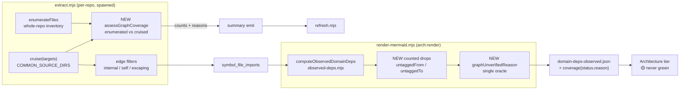

# Plan: Observed-Graph Coverage Honesty

- **Date**: 2026-07-18
- **Status**: Draft — audited, gate closed by decision (see Audit Trail)
- **Audit trail**: GPT plan-audit R1 (H:3 M:3 L:1) → R2 (H:2 M:3) → R3 (H:4 M:2);
  **all 18 findings folded in**. GPT loop stopped at the max-3 cap: HIGH went
  3→2→4, and the R3 rise was concrete defects *introduced by the R2 fixes*, not
  rigor pressure. Gemini final gate ×3 (CONCERNS each), 9 findings, all fixed —
  round 3 exceeded the 2-round cap under the skill's genuine-design-bug exception
  (round 2 surfaced a real contract defect: `runJsonLinesAsyncStrict` throws
  rather than returning a flag). **Stopped after round 3 by decision**: three of
  its four findings shared one root cause — §7's file table drifting out of sync
  with the normative §2.1 sections as each round patched the latter. That is
  document-consistency debt from iterative patching, not undiscovered design
  risk, so the correct response was one systematic pass over §7 rather than a
  fourth round. Remaining risk is concentrated in Phase 6 (an investigation
  deliberately off the critical path, §7c) and in the `..`-artifact caveat (§8),
  both explicitly flagged rather than resolved.
- **Author**: Claude + Louis Strydom
- **Scope**: backend (detected `--scope=backend`; stack `js-ts` + `postgres`)
- **Target domain(s)**: `arch-memory`, `dashboard`, `scripts`
- ⚠ **Cross-domain work** — touches >1 domain. The crossing is intentional and
  minimal: the defect lives in `arch-memory`, and `dashboard` is touched only to
  render a status the reader must not mistake for green (Phase 5).
- **Relationship to [observed-graph-discovery-unification.md](observed-graph-discovery-unification.md)**:
  that plan owns design (e) (unified discovery) and stays Draft/blocked. This plan
  owns that plan's **§4** (null-domain accounting) and that plan's **§3
  measurement #2** (the unsatisfiable cost gate), plus a defect discovered while
  measuring it. Every `§N` reference in THIS document is to this document's own
  sections unless it names the other plan explicitly. Design (e) is deliberately
  **out of scope** — see §8.

---

## 1. Context Summary

### What this fixes

The observed import graph reports what survived, never what it dropped. Three
independent silent-loss sites compound into a graph that can be missing most of
its edges while every surface reads authoritative.

Measured 2026-07-18 via [`scripts/spikes/observed-graph-discovery-spike.mjs`](../../scripts/spikes/observed-graph-discovery-spike.mjs):

| Repo | cruisable files | invisible to import layer |
|---|---|---|
| claude-engineering-skills | 891 | 22 (2%) |
| wine-cellar-app | 2426 | 23 (1%) |
| **ai-organiser** | 1389 | **945 (68%)** |

This matters commercially rather than cosmetically: architectural-memory
consultation (`get-neighbourhood`), the `/audit-code` duplication wave, and the
dashboard's Architecture tier all read this graph. On a TypeScript consumer they
are currently answering confidently from a graph missing two thirds of its
files — the "can this return green without having checked anything?" failure
(AGENTS.md, pre-ship empirical verify) at the **data** layer rather than the gate
layer.

### Code Trace

The evidence path, followed end-to-end:

- **Domain resolution**: [`lib/symbol-index/domain-tagger.mjs:89`](../../scripts/lib/symbol-index/domain-tagger.mjs)
  `tagDomain()` → `return null` at `:95` when no rule matches; `makeFastTagger`
  (`:111`) is the hot-path variant, same `null` at `:130`.
  `computeTargetDomains` (`:150`) is the ONE caller that does not drop unmatched
  paths — it accumulates `untaggedPaths` (`:158`) — but that is the `/plan` path,
  **not** the observed-graph path.
- **The silent drop (site 1)**: [`lib/observed-deps.mjs:76`](../../scripts/lib/observed-deps.mjs)
  ```js
  if (!fromDomain || !toDomain) continue;
  ```
  No counter, no accumulator, no warning. The docstring at `:57-58` declares it
  as intended behaviour.
- **The false-authority surface**: [`symbol-index/render-mermaid.mjs:250-283`](../../scripts/symbol-index/render-mermaid.mjs)
  writes `.audit-loop/domain-deps-observed.json`
  (`listFileImportsForSnapshot` `:258` → `loadDomainRules` `:259` →
  `computeObservedDomainDeps` `:260` → `ObservedDepsSchema.parse` `:271` →
  `atomicWriteFileSync` `:275`). The only stderr line, `:277`, reports
  `N domains, M edges` — **what survived**, never what was dropped.
- **The discovery allowlist (site 2)**: [`symbol-index/extract.mjs:292-301`](../../scripts/symbol-index/extract.mjs)
  `COMMON_SOURCE_DIRS`, with a `targets.length === 0` fallback that fires only
  when a repo matches *nothing*. Its own comment (`:281-291`) already names it "a
  silent-blindness generator".
- **Edge filters (site 3)**: `extract.mjs:328-340` — `isInternalEdge` (`:332`,
  defined `:357`), self-edge (`:335`), and `imported.startsWith('..')` (`:336`).
  Each is individually defensible; none is counted.
- **The missing invariant**: `extractGraphAndViolations` returns only
  `{violationCount, importCount}` (`:342`). `result.output.modules.length` is
  never recorded (`:326`). The symbol layer separately walks the whole repo
  (`enumerateFiles` `:410`) and logs `scanning ${files.length} files` (`:437`).
  **Nothing compares the two numbers** — which is precisely the two-layers-
  disagree gap.
- **Failure mode on throw**: `extract.mjs:307-308` returns `{violationCount: 0}`
  with `importCount` undefined — a failed cruise is indistinguishable from a repo
  with no imports.
- **Pipeline**: `refresh.mjs:144` `repoRoot = path.resolve(process.cwd())`,
  spawns `extract.mjs --root <repoRoot>` (`:319`) → `recordSymbolFileImports`
  (`:451`) → `copyForwardImports` (`:477`) → `markImportGraphPopulated`
  (`:491-497`). `arch:refresh` does **not** call render; only
  `dashboard:setup` (`package.json:91`) chains refresh → render → build.

### Patterns reused vs new

**Reused — the capture-honesty pattern already shipped twice.** Not a new idea;
this plan applies the existing one to a third surface:

| Layer | nav-audit v1.4 | visual-audit | this plan |
|---|---|---|---|
| pure assessor | `computeCaptureStatus` (`lib/nav/live-attribution.mjs:86`) | `assessColorCoverage` (`lib/visual/unadapted-color.mjs:114`) | `assessGraphCoverage` (new) |
| status enum | `STATUS.UNVERIFIED` (`:16`) | `status: 'unverified'` (`lib/visual/render.mjs:101`) | `coverage.status` |
| persisted field | `unverifiableLayers` (`lib/nav/schema.mjs:160`) | `unverifiableSurfaces` | `coverage` on `ObservedDepsSchema` |
| single gate oracle | gate-eligible scoping (`nav-audit.mjs:250`) | `gateUnverifiedReason` (`lib/visual/drift.mjs:89`) | `graphUnverifiedReason` (new) |
| never-green render | 🟡 (`dashboard/sections/nav-audit.mjs:41`) | 🟡 (`sections/visual-audit.mjs:41`) | 🟡 Architecture tier |
| exit convention | — | `0 clean · 1 divergence · 2 unverified` | same |

**New**: only the coverage assessor + its envelope field. Everything else is
this repo's existing shape.

### Neighbourhood considered

`get-neighbourhood` (k=6) returned all `review`-band candidates; the top hit
(0.773, `justify-divergence`) is `extractGraphAndViolations` itself — the
modification target, not a duplicate. No reuse candidate exists for a coverage
assessor. Proceeding greenfield for `assessGraphCoverage`, deliberately shaped
after the two precedents above rather than invented.

---

## 2. Proposed Architecture



### Key design decisions

1. **Count the drop; do not stop dropping.** `observed-deps.mjs:76` keeps
   skipping untagged edges — that is correct behaviour. It gains an accumulator
   so the skip becomes reportable (#19 Observability). Changing the skip itself
   would alter the graph's meaning; changing its *silence* is the whole fix.
2. **One oracle for the verdict** (`graphUnverifiedReason`), mirroring
   `gateUnverifiedReason` (`lib/visual/drift.mjs:89`). Two call sites (CLI exit,
   dashboard cell) must never be able to disagree about whether a graph is
   trustworthy (#5 Single Source of Truth).
3. **Coverage is measured where the two layers already both exist** — inside
   `extractGraphAndViolations`, which is the only place holding both
   `enumerateFiles` output and the cruise result. Measuring anywhere else would
   re-derive one of them and reintroduce the disagreement (#5).
4. **Budget is data, not code** (#4 No Hardcoding): a `coverageFloor` +
   `maxCruiseMs` in the existing `.audit-loop/domain-map.json`, defaulted so an
   un-configured consumer behaves exactly as today except for the new warning.
5. **Degrade, never fail the pipeline** (#16 Graceful Degradation).
   `arch:refresh` must still complete on a repo whose graph is unverifiable —
   the symbol index is independently valuable. Only the *claim* changes.
6. **(B) is diagnosis-first, fix-second.** The plan commits to characterising
   the ai-organiser defect and to a decision point; it does NOT pre-commit to a
   fix, because the obvious hypothesis is already refuted (§8).

### 2.1 Coverage contract (normative)

Everything below is the contract implementation must satisfy. It exists because
the first draft of this plan named `coverage.status`, `coverageFloor` and an
exit-2 convention without defining any of them — and contradicted itself on
rollout (R1 H3).

#### 2.1.1 The canonical eligible-file universe (R1 H2)

**One definition, used as the DENOMINATOR only — cruise targets are unchanged
(R3 M1).** An earlier revision derived cruise *targets* from this universe too.
That is design (e) by another name: it replaces `COMMON_SOURCE_DIRS` with
whole-repo targeting, changing the graph this plan claims only to *measure*.
Corrected: `COMMON_SOURCE_DIRS` keeps selecting targets exactly as today, and
the eligible universe is the yardstick we hold it against. The allowlist's
blindness then shows up as a **number** rather than as a silent behaviour
change — which is the whole point, and leaves (e) genuinely out of scope.

The first draft compared `enumerateFiles()` output against
`result.output.modules.length`; those are **not the same universe** and the
comparison would have produced a fabricated ratio:

- `enumerateFiles` (`extract.mjs:410`) returns **every** non-skipped file —
  `.md`, `.json`, `.sql` included. It is not a source-file list.
- `result.output.modules` includes **non-repo modules**. Measured on
  ai-organiser: of 485 modules, ~20 are node builtins and npm packages
  (`crypto`, `fs`, `path`, `@babel`, `eslint`, `obsidian`, …).

So the naive ratio divides a partly-non-source denominator into a partly-
non-repo numerator. Instead:

```
eligible(repoRoot) = enumerateFiles(repoRoot)                     // SKIP_DIRS applied
                     ∩ { ext ∈ CRUISABLE_EXTENSIONS }             // .js .mjs .cjs .jsx
                                                                  // .ts .tsx .mts .cts
                                                                  // .vue .svelte
                     ∩ { size ≤ MAX_FILE_BYTES }                  // extract.mjs:399
                   → normalized to repo-relative POSIX paths
```

- **Identity**: repo-relative, forward-slash, `fs.realpathSync`-resolved, then
  case-normalized on Windows. dep-cruiser `source` values are normalized through
  the **same** function before comparison — this is the single place path
  spelling is decided.
- **Numerator** = `|{ m ∈ modules : normalize(m.source) ∈ eligible }|`. A module
  outside `eligible` (builtin, npm, escaping path) is **not** counted as covered
  and **not** added to the denominator.
- `CRUISABLE_EXTENSIONS` is exported from the new module so the spike, the
  assessor, and the cruise-target derivation cannot drift apart.

#### 2.1.2 Two coverage layers, never summed (R1 M1)

They measure different things in different units and are reported separately:

| Layer | Unit | Where measured | Field |
|---|---|---|---|
| **extraction** | eligible source *files* | `extract.mjs` (both layers in scope) | `coverage.extraction` |
| **attribution** | internal import *edges* | `observed-deps.mjs` (edges only) | `coverage.attribution` |

**Each bucket is counted where its data still exists (R3 H2).** The first draft
assigned all buckets to `observed-deps.mjs` — impossible, because
`extract.mjs:328-340` drops `external` / `selfEdge` / `escaping` **before** the
DB write, so the edges never reach the module that reads persisted imports.
Split accordingly:

| Bucket | Counted in | Why there |
|---|---|---|
| `external` (not `isInternalEdge`) | `extract.mjs:332` | dropped at that line |
| `selfEdge` | `extract.mjs:335` | dropped at that line |
| `escaping` (`..`-prefixed) | `extract.mjs:336` | dropped at that line |
| `persisted` | `extract.mjs:337` | the survivors it emits |
| `untaggedFrom` / `untaggedTo` / `untaggedBoth` | `observed-deps.mjs:76` | needs domain rules |
| `attributed` | `observed-deps.mjs` | survivors of tagging |

Two assertions, each local to where its numbers exist and both enforced in code
rather than described in prose:
`external + selfEdge + escaping + persisted == cruisedEdges` (extraction side)
and `untaggedFrom + untaggedTo + untaggedBoth + attributed == persistedEdges`
(attribution side). The extraction-side counts travel with the coverage record
(§2.1.7); they are not recomputable downstream.

#### 2.1.3 Status, reasons, precedence (R1 H3)

`coverage.status ∈ {verified, degraded, unverified, unknown}`.
`coverage.reason` is a closed enum. **Precedence — first match wins**, so a
failure can never be masked by a ratio that looks fine:

`graphVerdict` takes **both** layers. Precedence — **first match wins**, so a
failure can never be masked by a ratio that looks fine:

| # | Condition | status | reason |
|---|---|---|---|
| 1 | cruise threw / non-zero exit | `unverified` | `extraction_failed` |
| 2 | cruise exceeded its hard timeout (§2.1.8) | `unverified` | `extraction_timeout` |
| 3 | envelope predates this feature (no `coverage`) | `unknown` | `not_measured` |
| 4 | coverage row copied forward from an earlier run (any incremental refresh) | `unknown` | `stale_measurement` |
| 5 | `eligible == 0` | `unverified` | `empty_universe` |
| 6 | `cruised == 0 && eligible > 0` | `unverified` | `zero_cruised` |
| 7 | `candidateEdges > 0 && attributed == 0` (R2 H2) | `unverified` | `zero_attributed` |
| 8 | `elapsedMs > maxCruiseMs` | `degraded` | `budget_exceeded` |
| 9 | `extractionRatio < floor` | `degraded` | `below_floor` |
| 10 | `attributionRatio < attributionFloor` (R2 H2) | `degraded` | `below_attribution_floor` |
| 11 | otherwise | `verified` | `null` |

Rows 5, 6 and 7 are the **vacuity guards**: neither a cruise that returned
nothing nor a graph where every edge was dropped as untagged may read
`verified` (AGENTS.md "audit your success paths"). Row 7 is the ai-organiser
case specifically — 100% extraction coverage with every edge untagged is
exactly the silent blindness this plan exists to end, and without it the
headline defect could still render green.

`unknown` is distinct from `verified` everywhere — an un-measured or stale
envelope is not a clean one.

**Staleness — an incremental refresh NEVER inherits a verdict (R3 H3).** An
earlier revision proposed an `eligibleDigest` over the sorted eligible-file
list. That is insufficient and would have been false comfort: editing a `.ts`
file's imports — adding edges, making every import untagged, making the file
uncruisable — leaves the file *list* byte-identical, so the digest matches and a
stale `verified` survives. Chasing this with a content hash re-derives work the
cruise itself does.

So the rule is categorical rather than heuristic: **coverage is a full-run
measurement.** An incremental refresh copies the row forward for *display*
(preserving `measuredAt` + the originating `refreshId`) and unconditionally
reports `status: unknown`, `reason: stale_measurement` (row 4). Only a full
`arch:refresh:full` can produce `verified`. This trades a little precision for
an invariant that cannot silently rot — and it matches how the measurement is
actually produced, rather than pretending an incremental run measured something
it never looked at.

#### 2.1.4 Config schema and defaults

Under a new `coverage` key in `.audit-loop/domain-map.json`:

| Key | Type | Default | Meaning |
|---|---|---|---|
| `floor` | number 0–1 | `0.90` | minimum extraction ratio for `verified` |
| `attributionFloor` | number 0–1 | `0.50` | minimum attributed-edge ratio (R2 H2) |
| `maxCruiseMs` | integer > 0 | `120000` | soft budget → `budget_exceeded` |
| `hardTimeoutMs` | integer > 0 | `300000` | hard abort (§2.1.8) |
| `enforce` | boolean | `false` | see rollout below |
| `sampleCap` | integer 0–100 | `20` | see 2.1.5 |

`attributionFloor` defaults deliberately low: an untagged domain is a
domain-map gap, which is common and not itself a correctness bug — the
load-bearing guard is row 7 (`zero_attributed`), not the ratio.

**Ownership (R2 M2).** `loadDomainRules` ([`lib/symbol-index/domain-tagger.mjs:181`](../../scripts/lib/symbol-index/domain-tagger.mjs))
is the existing parser of `.audit-loop/domain-map.json` and is **the single
owner** of this block: it gains `parseCoverageConfig` returning a fully
normalized, defaulted config object. `graphVerdict` accepts that object and
performs **no** defaulting of its own — two defaulting sites is how the two
call sites would drift. Invalid/out-of-range → log once, use the default, never
throw (#16). Absent `coverage` key → all defaults. Unknown keys → ignored with
one warning (forward-compat for consumers on an older sync).

#### 2.1.8 Cruise timeout — needs a process boundary, not a timer (R3 H1)

Timing the cruise *after it returns* cannot classify a run that never returns.
But an earlier revision then promised a "hard abort" via timer/AbortController,
which is **unimplementable as stated**: `cruise()` does substantial synchronous
work on the calling event loop, so no timer callback can run while it is
blocked. A promise-race would leave the work running and the process wedged.

The only boundary that actually interrupts is a **process** boundary — and
`extract.mjs` is *already* a child process of `refresh.mjs` (`:319`). Rather
than add a second nesting level, the timeout is enforced at that existing spawn.

**But `refresh.mjs` does not own the `ChildProcess` (final-gate finding).** It
delegates to `runJsonLinesAsyncStrict` in
[`lib/subprocess.mjs`](../../scripts/lib/subprocess.mjs), which spawns, streams,
and resolves on `close` — it has **no timeout, and never kills the child**. So
the capability has to be added there, not assumed:

- `lib/subprocess.mjs` gains an **optional** `timeoutMs` option: SIGTERM, then
  SIGKILL after a short grace. Optional and default-off, so every existing call
  site is byte-identical in behaviour (#20 Backward Compat).
- **The signal must arrive as a THROW, not a flag (final-gate round 2).** An
  earlier revision had the strict wrapper return `timedOut: true` on the result
  — which `runJsonLinesAsyncStrict` cannot do: it **throws** `KILLED_BY_SIGNAL`
  on abnormal child exit and returns only the `records` array on success, so a
  flag on the result wrapper is unreachable by construction. Rather than fork the
  wrapper's return shape (which would change its contract for every caller), the
  timeout surfaces through the channel that already exists: the thrown error
  gains `cause.timedOut = true` alongside the existing `cause.signal`.
- `refresh.mjs` therefore **wraps the extract call in try/catch** and maps
  `err.code === 'KILLED_BY_SIGNAL' && err.cause?.timedOut` → synthesise the
  coverage record with `extraction_timeout` (precedence row 2), then continue.
  Any other `KILLED_BY_SIGNAL` keeps today's failure behaviour — a timeout is a
  degraded measurement, an unexplained kill is still an error. The child cannot
  report its own death, which is precisely why the parent must own this.
- `refresh.mjs` then continues normally; the symbol index still publishes
  (#16 Graceful Degradation).

This adds no new process, uses the boundary already in the design, and keeps
the "degrade, never fail" promise deliverable instead of aspirational. Cost:
`extract.mjs` cannot self-report a soft `budget_exceeded` if it is killed first
— hence `hardTimeoutMs` (300s) > `maxCruiseMs` (120s), so the soft budget
reports on every run that finishes at all.

#### 2.1.5 Diagnostic bound (R1 L1)

Scalar totals are kept for **every** drop (unbounded counters, cheap). Retained
**path samples** are capped at `sampleCap` (default 20) per bucket, taken as the
first N in deterministic sorted order — not a reservoir, because reproducibility
across runs matters more than representativeness for a diagnostic. Samples are
repo-relative paths only; the envelope carries no absolute paths.

#### 2.1.6 Rollout and exit codes — resolves the R1 H3 contradiction

The first draft said both "report-only for one cycle" (§8) and "exit 2" (§2).
Both, in a defined order, controlled by `enforce`:

**`arch:render` NEVER carries the enforcement exit code (R3 H4).** An earlier
revision had it exit 2 under enforcement — which breaks the very thing it is
meant to protect: `dashboard:setup` is `arch:refresh && arch:render &&
dashboard:build` (`package.json:91`), so a non-zero render would abort the
chain and the dashboard would **not build precisely when it has yellow to
show**. The gate therefore lives in its own command, downstream of rendering:

| Command | Owns | Exit codes |
|---|---|---|
| `arch:render` | writes the envelope, prints status + reason | **always 0** (unless a genuine tool error) |
| `arch:coverage-gate` (new) | reads the envelope, applies `enforce` | `0` verified/unknown · `2` degraded/unverified |

| Stage | `enforce` | `arch:coverage-gate` | Dashboard |
|---|---|---|---|
| ship | `false` | always `0`; prints the verdict | 🟡 from the first release |
| after one cycle of real data | `true` | `2` on degraded/unverified | 🟡 unchanged |

`dashboard:setup` does **not** include the gate — the pre-push `check` does, so
enforcement never blocks the artifact that displays the problem. Exit `1` is
unused by this feature; `1` stays "tool error", matching visual-audit's
`0 clean · 1 divergence · 2 unverified`. `arch:refresh` always exits on its own
terms (the symbol index is independently valuable, #16).

#### 2.1.6b The persisted shape, exactly (R3 M2)

One shape, used verbatim in both `symbol_refresh_coverage.payload` and the
`domain-deps-observed.json` `coverage` field. Status/reason live **only** at the
`verdict` root — never duplicated per layer, so there is one answer to "is this
graph trustworthy":

```jsonc
"coverage": {
  "schemaVersion": 1,
  "verdict":    { "status": "verified|degraded|unverified|unknown",
                  "reason": "below_floor|zero_attributed|…|null" },
  "measuredAt": "2026-07-18T15:04:05.000Z",
  "refreshId":  "<uuid of the run that MEASURED it>",
  "stale":      false,                     // true when copied forward (§2.1.3 row 4)
  "extraction": { "outcome": "ok",         // ok | failed | timedOut  (final-gate r3)
                  "eligible": 1389, "cruised": 465, "ratio": 0.335,
                  "elapsedMs": 6903,
                  "edges": { "external": 20, "selfEdge": 0,
                             "escaping": 3, "persisted": 1672 },
                  "samples": { "uncruised": ["src/commands/x.ts", "…"] } },
  "attribution": { "candidates": 1672, "attributed": 1650, "ratio": 0.987,
                   "edges": { "untaggedFrom": 12, "untaggedTo": 8,
                              "untaggedBoth": 2 },
                   "samples": { "untagged": ["extension/background/sw.js"] } }
}
```

- `extraction.outcome` carries the failure states the precedence table needs
  (rows 1-2). On `failed`/`timedOut` the count fields are `null`, **not `0`** —
  zero is a measurement, null is the absence of one, and conflating them is how
  a failed cruise would read as an empty repo (the exact bug at
  `extract.mjs:307`). `elapsedMs` is still recorded on `timedOut` (it equals the
  budget) because it is the evidence for the verdict.
- `schemaVersion` is present from day one so a future shape change is a version
  bump, not a guess at the reader.
- Absent `coverage` → `unknown` / `not_measured` (§2.1.3 row 3). A reader must
  never infer `verified` from absence.
- `samples` are capped per §2.1.5 and are repo-relative paths only.
- `extraction.edges` is carried, not recomputed — those buckets do not survive
  to the attribution layer (§2.1.2).

#### 2.1.7 Persistence lineage (R1 H1)

The measurement is taken in a **subprocess** (`refresh.mjs:319` spawns
`extract.mjs`) but consumed by a **different process** reading from the DB
(`render-mermaid.mjs:258` `listFileImportsForSnapshot`). The first draft
measured coverage and then dropped it on the floor. The route, made explicit:

```
extract.mjs  ──emit({type:'coverage', …})──▶  refresh.mjs (JSON-lines reader)
             │                                      │
             │                                      ▼
             │                        recordGraphCoverage(refreshId, …)
             │                                      │
             ▼                                      ▼
     summary emit (:440)                   symbol_refresh_coverage
                                                    │
                        render-mermaid.mjs ◀────────┘ (by refreshId)
                                                    │
                                                    ▼
                                   domain-deps-observed.json .coverage
```

- Keyed on the **existing `refreshId`** — the snapshot identity `refresh.mjs`
  already owns — so coverage cannot be attributed to the wrong run. No new
  identity concept.
- `render-mermaid.mjs` reads coverage for the **same** `snap.refreshId` it
  already resolves at `:258`. A missing row → `status: unknown`,
  `reason: not_measured` (precedence row 2), never `verified`.
- Incremental refreshes: coverage is a **full-run** measurement. An incremental
  run copies forward the prior row (mirroring `copyForwardImports`
  `refresh.mjs:477`) and sets `stale: true` (§2.1.6b) while preserving the
  originating `refreshId` + `measuredAt`, so the dashboard can say
  "measured 3 refreshes ago" rather than implying it was measured now.

---

## 6.1 Right-sizing gate

New structure introduced: one assessor, one oracle, one schema field, two config
keys.

- **Band-aid extreme** — add `extension`, `docs`, `e2e` to `COMMON_SOURCE_DIRS`.
  Fixes ai-organiser's headline number, leaves the generator intact, and the next
  repo with an unlisted layout is silently blind again. This is precisely the
  interim patch [observed-graph-discovery-unification.md](observed-graph-discovery-unification.md)
  was written as the follow-on to; repeating it is regression, not progress.
- **Over-engineered extreme** — design (e) unified discovery + a pluggable
  resolver abstraction + a per-consumer coverage policy engine. §3.1 of that plan
  now records (e) cannot fix a resolution defect, so this spends the most effort
  on the least-evidenced part.
- **Chosen** — count what is already being dropped, publish it, and refuse to
  claim authority below a floor. Current requirement it serves: a real consumer
  is 68% invisible today and no surface says so. Every piece is load-bearing for
  that sentence; nothing is added for a future caller.

**Manual vs scripted**: manual. Four workstreams, ~8 files, judgment-heavy
(especially B). No regular repeated transformation to codemod.

---

## 6. Sustainability Notes

- **Assumption that could change**: dep-cruiser stays the graph engine. The
  coverage assessor deliberately consumes only `{enumerated, cruised}` counts, so
  swapping engines changes one call site, not the honesty layer.
- **The durable property**: this ships to adopter repos we will never see, so
  correctness cannot depend on us having pre-measured them. A repo that breaks
  the graph now says so **on that repo**, at run time. That is what makes the
  other plan's §3 measurement #2's
  "measure a hypothetical monorepo first" gate replaceable (workstream D) rather
  than merely postponed.
- **Extension point deliberately built in**: `coverage.reason` is a string enum,
  so a future third loss site (a new filter) reports through the same field
  rather than inventing a parallel warning channel.

---

## 7. File-Level Plan

| File | Intent | Purpose |
|---|---|---|
| `scripts/lib/symbol-index/graph-coverage.mjs` | create | The §2.1 contract as pure code: `CRUISABLE_EXTENSIONS`, `normalizeRepoPath`, `eligibleFiles`, `assessExtractionCoverage`, `assessAttributionCoverage`, and the §2.1.3 precedence table. No I/O — Tier 1. |
| `scripts/symbol-index/extract.mjs` | modify | **Cruise targets stay `COMMON_SOURCE_DIRS` — unchanged (§2.1.1, R3 M1).** Compute `eligibleFiles` as the **denominator only**; record `modules` filtered through `normalizeRepoPath`; count the §2.1.2 extraction-side edge buckets at their existing drop sites (`:332`/`:335`/`:336`/`:337`); time the cruise; `emit({type:'coverage', …})` (§2.1.7); distinguish cruise-throw (`:307`) from genuinely-zero. |
| `scripts/symbol-index/refresh.mjs` | **modify (was missing — R1 H1)** | Read the new `coverage` JSON-line from the extract subprocess (it already parses extract's JSON-lines); persist via `recordGraphCoverage(refreshId, …)`; enforce `hardTimeoutMs` on the spawn it already owns and synthesise `extraction_timeout` when it kills the child (R3 H1); copy forward on incremental runs with `stale: true` (R3 H3). |
| `scripts/arch-coverage-gate.mjs` | **create (R3 H4)** | Owns the enforcement exit code, downstream of `arch:render`, so a non-zero gate can never abort the `dashboard:setup` chain that renders the warning. Reads the envelope; applies `enforce`. Needs the `--selfcheck-relocation` handler (AGENTS.md CLI smoke contract). |
| `package.json` | **modify (R3 H4)** | Add `arch:coverage-gate`; wire it into `check`, NOT into `dashboard:setup`. |
| `scripts/lib/subprocess.mjs` | **modify (final-gate finding)** | Add an optional `timeoutMs` to `runJsonLinesAsync{,Strict}` — SIGTERM → SIGKILL grace. The strict wrapper signals it by **throwing** `KILLED_BY_SIGNAL` with `cause.timedOut = true` — NOT a flag on the result, which is unreachable because that wrapper strips the wrapper object on success (§2.1.8). Default-off so every existing call site is unchanged (#20). Without this, §2.1.8's timeout has no owner: `refresh.mjs` never touches the `ChildProcess`. |
| `scripts/lib/store/arch/coverage.mjs` | **create (was missing — R1 H1)** | `recordGraphCoverage(refreshId, coverage)` / `getGraphCoverage(refreshId)`. Sibling of `store/arch/imports.mjs`; same upsert shape. |
| `supabase/migrations/<ts>_symbol_refresh_coverage.sql` | **create (was missing — R1 H1)** | `symbol_refresh_coverage` keyed on `refresh_id`. jsonb columns passed raw (AGENTS.md jsonb seam); any genuine array uses `pgArray()`. |
| `scripts/lib/observed-deps.mjs` | modify | `:76` becomes a counted, bucketed drop per §2.1.2 (exclusive buckets + the `sum == candidates` assertion). Add optional `coverage` to `ObservedDepsSchema` (`:35`) so old envelopes still parse as `unknown`. |
| `scripts/symbol-index/render-mermaid.mjs` | modify | Read persisted coverage for `snap.refreshId` (`:258`), merge with attribution coverage, call the oracle, write both layers into the envelope (`:260-275`), and replace the survivors-only stderr line (`:277`). **Always exits 0** — the enforcement exit lives in `arch:coverage-gate` so it can never abort the `dashboard:setup` chain (§2.1.6, R3 H4). |
| `scripts/lib/symbol-index/graph-verdict.mjs` | create | `graphVerdict({extraction, attribution, config})` → `{status, reason}` implementing §2.1.3 precedence. The single oracle CLI + dashboard share. |
| `scripts/lib/dashboard/sections/architecture.mjs` | modify | Render 🟡 for `degraded`/`unverified` and ⚪ for `unknown`, each with reason; never green. Mirrors `sections/nav-audit.mjs:41`. |
| `.audit-loop/domain-map.json` | modify | Add the §2.1.4 `coverage` block with defaults (`enforce: false`). |
| `tests/graph-coverage.test.mjs` | create | Tier 1: the full §2.1.3 precedence table, the §2.1.1 universe rules, bucket exhaustivity, and the **vacuity guards** (rows 3-4 — a zero-file cruise must never read `verified`). |
| `tests/observed-deps-coverage.test.mjs` | create | Counted-drop correctness + schema back-compat (envelope without `coverage` parses and reads `unknown`, never `verified`). |
| `tests/graph-coverage-lineage.test.mjs` | **create (R1 M2)** | Deterministic fixture-repo integration test over the whole cross-process seam: extract → refresh → store → render → dashboard string. Asserts snapshot identity, the `unknown` path for a legacy envelope, and the §2.1.6 exit codes under both `enforce` values. Uses the existing disposable-DSN test harness (`assertDisposableDbUrl`). |

### 7b. Implementation Phases

**Phase 1 — The §2.1 contract as pure code.** Universe, buckets, precedence
table, and their tests; no wiring. Files:
`scripts/lib/symbol-index/graph-coverage.mjs` (create),
`scripts/lib/symbol-index/graph-verdict.mjs` (create),
`scripts/lib/observed-deps.mjs` (modify), `tests/graph-coverage.test.mjs`
(create), `tests/observed-deps-coverage.test.mjs` (create).

**Phase 2 — Measure at the seam.** Derive targets + denominator from one
universe; emit the coverage line. Files: `scripts/symbol-index/extract.mjs`
(modify).

**Phase 3 — Persist the measurement (R1 H1) + the timeout boundary.** The
cross-process route, without which Phase 2's numbers are discarded. Files:
`supabase/migrations/<ts>_symbol_refresh_coverage.sql` (create),
`scripts/lib/store/arch/coverage.mjs` (create),
`scripts/lib/subprocess.mjs` (modify), `scripts/symbol-index/refresh.mjs`
(modify).

**Phase 4 — Publish the verdict.** Envelope (§2.1.6b shape), oracle wiring,
honest stderr, and the separate gate command. Files:
`scripts/symbol-index/render-mermaid.mjs` (modify),
`scripts/arch-coverage-gate.mjs` (create), `package.json` (modify),
`.audit-loop/domain-map.json` (modify),
`scripts/lib/symbol-index/domain-tagger.mjs` (modify — `parseCoverageConfig`,
R2 M2).

**Phase 5 — Never render green.** Files:
`scripts/lib/dashboard/sections/architecture.mjs` (modify),
`tests/graph-coverage-lineage.test.mjs` (create).

**Phase 6 — Replace the unsatisfiable cost gate.** Rewrites §3 measurement #2 of
[observed-graph-discovery-unification.md](observed-graph-discovery-unification.md)
in terms of the coverage metric Phase 1 defines. Depends only on Phase 1. Files:
`docs/plans/observed-graph-discovery-unification.md` (modify).

**Close-out (not a phase)**: `npm run check`, `npm run dashboard:setup`,
re-run the spike on all three repos with `cwd == repoRoot` to confirm reported
coverage matches measured reality.

---

### 7c. Follow-on investigation (NOT in the execution path — R2 M3)

**Deliberately outside §7b and §11.** Phases 1-6 are the shippable honesty fix
and must not be gated on a third-party diagnosis that may not converge. The
first draft put this on the final-gated critical path, which would have let an
unbounded investigation block a complete, independently-valuable change.

**Trigger**: after Phases 1-5 land and report real coverage — at which point the
defect is *safe* (loudly reported) even while un-diagnosed, and the investigation
is prioritised on evidence rather than on this plan's schedule.

**Diagnose the ai-organiser resolution defect.** Bounded protocol (R1 M3):
- **Pinned**: the `dependency-cruiser` version in `package-lock.json` at the time
  of the run, the ai-organiser commit sha, and the exact invocation
  (`cwd == repoRoot`, `--root <repoRoot>`). The cwd variable is already
  eliminated — re-measured 2026-07-18, figures unchanged (§8) — so this phase
  starts from a confirmed 945/1389 rather than a suspect one.
- **Required evidence**: the eligible-universe count (§2.1.1), the normalized
  cruised-source list, their set difference bucketed by top-level dir, and a
  minimal reproducer — the smallest file set that reproduces `deps == 0` for a
  file whose imports resolve on disk.
- **Exit criterion — one of**: (a) a fix with a regression test; (b) an upstream
  `dependency-cruiser` issue with the minimal reproducer attached, plus the repo
  reporting `degraded`/`unverified` honestly; (c) a documented
  non-defect explanation. Ambiguity is **not** an exit — it extends the
  investigation, which is safe precisely because it is off the critical path.
- Files: `docs/plans/observed-graph-coverage-honesty.md` (modify, findings
  appendix). Code files unknown until diagnosed — that is the point.

---

## 8. Risk & Trade-off Register

- **Phase 5 may not yield a fix, and that is an acceptable outcome.** The obvious
  hypothesis is already refuted by measurement: `enhancedResolveOptions.extensions`,
  `tsConfig`, and `tsPreCompilationDeps` each produce **byte-identical** output
  (485 modules, 28 unresolved, `irToHtml deps=0`). So the cause is upstream of
  resolver configuration. If diagnosis shows an upstream dep-cruiser limitation,
  the honest deliverable is an accurate `unverified` on that repo plus an upstream
  report — Phases 1-4 make that outcome *safe* rather than *silent*, which is why
  they are sequenced first.
- **A floor that is too high turns healthy repos yellow.** Mitigation is now
  normative rather than prose: `floor` defaults to `0.90` against measured
  behaviour (this repo 98%, wine-cellar 99%), and `enforce: false` ships first —
  §2.1.6 defines exactly which exit code each stage produces, resolving the
  first draft's contradiction between "report-only for one cycle" here and
  "exit 2" in §2 (R1 H3).
- **Deliberately deferred: design (e) unified discovery.** [§3.1](observed-graph-discovery-unification.md)
  records that (e) cannot fix a resolution defect and would feed more files to a
  resolver that still cannot resolve them. Re-evaluate only after Phases 1-5. This
  is a scope boundary, not a band-aid: (e)'s value is *unmeasurable* until coverage
  is reportable, which is exactly what this plan builds.
- **The `..`-prefixed path artifact — RESOLVED 2026-07-18, figures confirmed.**
  The spike originally ran with cwd ≠ repo root, producing `..`-prefixed module
  paths; since `extract.mjs:336` drops `..`-prefixed edges, this raised a real
  risk that the headline numbers were measured under a path spelling production
  never uses. **Re-measured with `cwd == repoRoot` on both consumers — every
  figure is unchanged:**

  | Repo | invisible (cwd ≠ root) | invisible (cwd == root) |
  |---|---|---|
  | wine-cellar-app | 23 / 2426 | **23 / 2427** |
  | ai-organiser | 945 / 1389 | **945 / 1389 (68%)** |

  Module paths are now clean (`src/services/…` rather than `../ai-organiser/src/…`),
  confirming the prefix never reached the coverage arithmetic — `path.resolve`
  normalised it away. M1's verdicts also survive unchanged: 0 semantic diffs on
  this repo and wine-cellar, 10 on ai-organiser. So the 68% is **evidence, not
  an artifact**, and Phase 6 starts from a confirmed baseline rather than a
  suspect one. §2.1.1's `normalizeRepoPath` is retained regardless — it removes
  the variable permanently rather than relying on callers to set cwd correctly.
- **Trade-off**: counting drops costs a `Set` and a bounded sample per render.
  Negligible against a multi-second cruise, and it buys the only signal that
  distinguishes "no edges" from "no visibility".

---

## 9. Testing Strategy

Per the repo's testing doctrine (AGENTS.md), by tier:

- **Tier 1 (test-first, deterministic)**: `assessGraphCoverage` and
  `graphUnverifiedReason` are pure — they land with their tests. Table-driven over
  the state matrix: full coverage · partial · zero-cruised · zero-enumerated ·
  over-budget · missing-config.
- **Audit the success path (mandatory, AGENTS.md)**: the highest-value test is
  the vacuity guard — *a cruise that returned nothing must never read
  `verified`*. Both precedents needed this exact guard (`visual-audit.mjs:130-131`
  → exit 2 on no states captured). Assert it directly.
- **Back-compat**: an existing `domain-deps-observed.json` without `coverage`
  must still parse (`ObservedDepsSchema` optional field), and the dashboard reader
  must treat absent-coverage as "unknown", never as "verified".
- **Cross-process integration (R1 M2)**: `tests/graph-coverage-lineage.test.mjs`
  is the CI oracle for the seam Phase 3 creates — a deterministic fixture repo
  driven through extract → refresh → store → render → dashboard string. It
  asserts snapshot identity (coverage attaches to the right `refreshId`), the
  legacy-envelope `unknown` path, incremental copy-forward setting `stale: true`, and
  both §2.1.6 exit codes. This is deliberately NOT the spike: a real-repo spike
  cannot be a stable oracle.
- **Timeout integration test (final-gate r3)**: a deliberately non-returning
  cruise child, asserting that `refresh.mjs` completes, records
  `extraction_timeout` with `outcome: 'timedOut'` and null counts, publishes the
  symbol index anyway, and **leaves no child process alive**. Without the
  last assertion the timeout could "pass" while orphaning a wedged process — the
  success-path audit this feature most needs, since §2.1.8 is the one part that
  cannot be validated by a pure unit test.
- **Empirical verify (not a CI gate)**: re-run the spike against all three repos
  post-change and confirm reported coverage matches independently-measured
  reality. Required by the repo's pre-ship doctrine for anything asserting on a
  real runtime — but see §8 on the `..` artifact: the comparison must be taken
  with `cwd == repoRoot`, or it re-measures the artifact rather than the repo.
- **Not tested**: dep-cruiser's own resolution behaviour. Phase 5 characterises
  it; we do not pin a third party's internals.

---

## 11. Execution Clustering

- **Cluster A** — Phases 1-2 — fix-gate: `yes`
  - `Coupling:` Phase 2 wires the exact functions Phase 1 creates, and the
    §2.1.1 universe definition is only validated once a real cruise result flows
    through it. Auditing them together lets the wiring pass inspect the seam
    between the pure contract and the two-layer measurement point — the seam
    where this whole class of bug lives.
  - `author-tier: standard`
- **Cluster B** — Phases 3-5 — fix-gate: `yes`
  - `Coupling:` the persistence route (R1 H1) is one contract end-to-end —
    migration, store module, refresh reader, envelope, oracle, dashboard cell.
    Splitting it is what produced the first draft's defect: a measurement taken
    and then dropped, or a green cell rendered against an `unverified` envelope.
    Phase 5's lineage test is the assertion that the whole seam holds, so it
    cannot be audited apart from the seam it tests.
  - `Additional files:` `tests/dashboard.test.mjs` (modify)
  - `author-tier: frontier`
- **Cluster C** — Phase 6 — fix-gate: `final`
  - `Coupling:` single-phase cluster by necessity, not preference — it is the only
    documentation output, and its replacement threshold must be stated in terms of
    the coverage metric Clusters A-B actually make real. Gating it `final` is what
    stops the other plan's §3 being rewritten against a metric that never
    converged.
  - `author-tier: frontier`
- **Final gate**: consolidated Gemini review over the union diff of Clusters A-C.

> Partition check: Phases 1-6 each appear in exactly one cluster (A:1-2, B:3-5,
> C:6), contiguous and ascending. Close-out and §7c's follow-on investigation are
> both outside the phase set — §7c deliberately so (R2 M3), since an unbounded
> third-party diagnosis must not gate an independently shippable fix.
> `fix-gate: yes` on A and B because C's documentation claims are only truthful
> if the measurement they describe actually converged.
