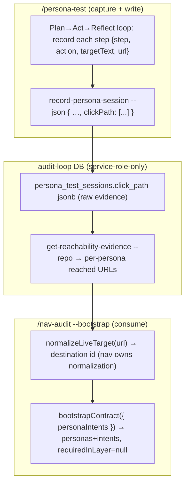

# Plan: Persona Click-Path Capture → nav-audit Reachability Seeding

- **Date**: 2026-06-26
- **Status**: Approved (GPT 3-round + Gemini 2-round — see §12)
- **Author**: Claude + Louis
- **Scope**: backend (DB migration + store + CLI + skill-prompt capture; no UI)

> **Target domain(s)**: `persona-test` (store/capture), `nav-audit` (consumption). Cross-skill via the existing data-loop seam.
> **Origin**: `/brainstorm --with-gemini` synthesis (2026-06-26). All three models agreed the two persona systems should connect, rejected LLM-inferred-contracts, and that the real bridge is *behavioral evidence*. The reality-check found the evidence **doesn't exist yet** — `persona_test_sessions` stores only `steps_taken` (an integer). This plan captures it.

## 1. Context Summary

**Detected scope/stack**: backend · `js-ts` + postgres.

**The gap**: `/nav-audit`'s per-persona reachability scorecard — its highest-value output — is grounded in a hand-authored `personas → intents → requiredInLayer` block in `nav-contract.json`. `--bootstrap` drafts `navLayers` + `observedTargets` but leaves `personas` **empty**, so first-value friction is high. Meanwhile `/persona-test` already walks the app as each persona (Plan→Act→Reflect, 8–12 steps, each a real click/navigate) — it *knows* which destinations each persona reached — but **discards** that path, persisting only a step count. The behavioral evidence that could seed nav-audit is thrown away.

**The fix (synthesis decision)**: capture the structured click-path in persona-test → store it → `/nav-audit --bootstrap` consumes it (when `PERSONA_TEST_REPO_NAME` is set) to auto-seed the **descriptive** half of the contract (persona → intent → *destination actually reached*). The **normative** half (`requiredInLayer` — "this intent deserves primary nav") is left `null` for a human, because no behavioral evidence can derive a product judgment. **No LLM inference** of the contract (keeps nav-audit deterministic). **No new static framework adapters.**

**Code Trace** (evidence Phase 1 happened):
- `supabase/migrations/20260413224948_persona_test_sessions.sql:4-33` — table has `steps_taken integer`, `findings jsonb`; **no** per-step path. Views (`recurring_issues:45`) unnest `findings` jsonb — the established read pattern.
- `scripts/lib/store/persona.mjs:91-121` — `recordPersonaSession()` upserts the session; `steps_taken: session.stepsTaken || 0` is the only step data written.
- `scripts/cross-skill.mjs:701-722` — `cmdRecordPersonaSession` validates via `RecordPersonaSessionRequestSchema`, resolves canonical `repo_id`, calls `recordPersonaSession`.
- `skills/persona-test/SKILL.md:527-544` — the runner posts `record-persona-session` with `"stepsTaken": <N>` (count only). The agent has each step's action at runtime; it just isn't structured.
- `scripts/lib/nav/contract.mjs:205-217` — `bootstrapContract({ personaIntents })` **already** maps seeds to `{id, destination, approvedAnchors:[], requiredInLayer:null, source:'inferred'}`. The param exists but `nav-audit.mjs:81` never passes it.
- `scripts/nav-audit.mjs:81` — `bootstrapContract({ destinations, draftNavLayers, observedTargets })` — the injection point for `personaIntents`.
- `scripts/lib/nav/verify.mjs:31` — `normalizeLiveTarget(raw, baseUrl)` — the canonical URL→destination normalization. Nav-domain; the consumer (nav-audit) applies it, not persona-test.
- `supabase/migrations/20260507130000_persona_service_role_only.sql` — persona tables are RLS deny-all + service-role bypass. `click_path` on `persona_test_sessions` inherits this posture for free.

**Patterns reused vs new**: ~90% reuse. New: one `jsonb` column + one reader command + one bootstrap consumer + the skill-prompt capture instructions. Reuses `recordPersonaSession`, `bootstrapContract`'s existing `personaIntents` seam, `normalizeLiveTarget`, the cross-skill CLI facade, and the `findings`-jsonb-unnest precedent.

**Neighbourhood considered**: arch-memory cloud:true, 50 records. `bootstrapContract` (the seed consumer) and `recordPersonaSession` (the writer) are the reuse targets — this plan **extends** both rather than creating siblings.

## 2. Proposed Architecture



**Key design decisions** (principles from `references/engineering-principles.md`):

1. **Store RAW landed URLs as evidence; normalize on READ in nav-audit** (#1 DRY, #5 SSoT, loose coupling). persona-test records the raw URL each step landed on; nav-audit applies `normalizeLiveTarget` at consumption. This keeps the URL→destination normalization a **single source of truth in the nav domain** and avoids coupling persona-test to nav internals. The evidence row is durable even if normalization rules later change.
   - **Band-aid**: persona-test hardcodes a slug guess per step → diverges from nav's real normalization. **Over-built**: a shared cross-domain "normalization service" module both import. **Chosen**: store raw, let each consumer normalize with its own owned function — zero new shared surface.

2. **`click_path jsonb` column, NOT a normalized `persona_session_steps` table** (#16, right-sizing). The access pattern is "read all steps for a session, unnest to reached destinations" — exactly what `findings jsonb` + `recurring_issues` already do. A normalized table adds an FK, a second RLS policy set, and a second write with orphan risk, for querying we don't need (no per-step indexing requirement).
   - **Band-aid**: stuff a comma-joined string into a text column → unparseable. **Over-built**: `persona_session_steps` table + FK + RLS + indexes + its own migration. **Chosen**: one `jsonb` column atomic with the session upsert — matches the `findings` precedent; **current** requirement is unnest-to-destinations, nothing finer.

3. **Auto-source the DESCRIPTIVE half only; `requiredInLayer = null` always** (the honest abstraction boundary). Evidence proves a persona *reached* a destination; it cannot prove the destination *should* live in primary nav (a persona reaching `/cellar` via a buried hamburger says nothing normative). Seeds carry `source:"persona-test-evidence"` and `requiredInLayer:null` so CI gives them **no authority** until a human sets the layer — never a trusted baseline (mirrors the existing `source:'inferred'` posture).

4. **Deterministic end-to-end; graceful no-op when cloud off** (#15, #16). No LLM anywhere in the path. `clickPath` absent/empty → behaves exactly as today (writes empty array). `PERSONA_TEST_REPO_NAME` unset or no evidence → bootstrap seeds nothing, identical to current behaviour.

5. **Idempotent capture, preserve-on-omit** (#13). `click_path` is part of the `recordPersonaSession` upsert keyed on `session_id`. Re-posting a session **with** a clickPath replaces the path (no duplication); re-posting **without** one leaves the existing path untouched (the column is omitted from the SET list — never `[]` over real evidence; R3-M1).

## 3. Data Contracts

**`click_path` jsonb shape** (array; one entry per recorded step):
```json
[
  { "step": 1, "action": "navigate", "targetText": null, "url": "/?view=today" },
  { "step": 2, "action": "click", "targetText": "My Wines", "url": "/?view=grid" }
]
```
- `action ∈ {navigate, click, type, back, other}` (closed set; validated).
- `url` = the page URL after the action settled, **SANITIZED server-side in `recordPersonaSession` before the upsert** (R1-H3) — NOT in the skill prompt (a structural guarantee, not a model instruction). `sanitizeStepUrl`:
  1. keeps `pathname`, but **collapses likely-dynamic/secret segments to `:param`** — numeric ids, uuids, long hex, anything ≥ 24 chars, an email-ish `.`/`@` token, OR a **high-entropy segment** (mixed-case + digit, ≥ 12 chars — catches base64-ish tokens) — so `/reset/SECRET`, `/invite/<token>`, `/u/me@x.com` → `/reset/:param` etc. (R2-H1, R3-H2). Same collapse family `normalizeLiveTarget` applies on read;
  2. keeps ONLY the nav-routing query params (whitelist `view,tab,page,screen`) + a hash-router fragment (`#/…`) — and applies the **same step-1 dynamic-segment collapse to the hash-route path** so `#/reset/TOKEN` → `#/reset/:param` (a token in the fragment is neutralized identically to one in the pathname — Gemini1-H1); origin, all other query params, all other fragments dropped;
  3. runs the result through `redactSecrets()` as a final net.
  So `?access_token=…`, OAuth `?code=`, reset tokens (query *or* path), `?email=…`, tenant ids cannot land in the row regardless of what the runner posts. Fail-closed.
  - **Documented residual (R3-H2)**: shape-based path classification cannot be perfect — a *short, low-entropy, non-hex* opaque token (e.g. an 8-char all-lowercase code) in a path segment could survive collapse, because indistinguishable from a legitimate route slug (`/wines`, `/pairing-lab`) we MUST keep for destination identity. Mitigated by the `redactSecrets` net; accepted as residual because the realistic secret shapes (tokens, JWTs, uuids, long hex, emails) ARE caught, and over-collapsing every non-dictionary segment would destroy the destination signal the feature needs. This is an explicit accept, not an oversight.
- `targetText` = trimmed visible text/aria-label, run through the existing `redactSecrets()` then capped at 80 chars — **also applied server-side in `recordPersonaSession`** (`null` for navigate/type). Evidence only.
- **No typed-value field exists** (R1-H4): the schema has no `value`/`input` key, so a `type` step structurally *cannot* carry the typed string (the closed shape is the enforcement, not a prompt instruction). `action:"type"` records only that a type occurred.
- Bounded + resilient (R2-M1, R3-H1, Gemini2-M2): the request schema keeps `clickPath` **lenient** — `z.array(z.unknown()).optional()` (an array, no length rejection) — so neither a malformed entry NOR an over-length path can fail the whole session write. The **cap and the real per-entry validation + sanitization happen in `recordPersonaSession`**: each entry is `ClickPathStepSchema.safeParse`d (invalid → **dropped**, logged), valid ones sanitized, then the array is **sliced to the first 40**. So "≤40" is a store-side slice (never a request rejection — that's the Gemini2-M2 fix), and a bad entry is discarded, not blanket-`.catch`-swallowed. No sentinel, no extra column (R1-H2).

**Reachability-evidence reader output** (`get-reachability-evidence`):
```json
{ "ok": true, "cloud": true, "personas": [
  { "personaId": "uuid|null", "persona": "Pieter…", "reached": [
    { "url": "/?view=grid", "clickedText": "My Wines", "sessions": 2, "lastSeen": "2026-06-25T…" }
  ] }
] }
```
**Reader query contract** (R1-M1/M2/H5, Gemini2-M1): `getReachabilityEvidence({ repoName, perPersona = 10, sinceDays = 90 })` selects `persona, persona_id, click_path, created_at` `WHERE repo_name = $1 AND created_at >= now() - sinceDays`, keeping the most-recent `perPersona` sessions **per persona** via `row_number() OVER (PARTITION BY persona ORDER BY created_at DESC)` (so no persona starves another), under an overall safety ceiling. Querying by `repo_name` (not canonical `repo_id`) is deliberate and consistent with `getPersonaSessionsByRepo`: the consumer has `PERSONA_TEST_REPO_NAME`, not the uuid; `recordPersonaSession` always writes `repo_name` alongside `repo_id`. `created_at` is selected so `lastSeen` is real. **Graceful on DB error (R2-H2)**: the query is wrapped in try/catch returning `[]`/`{personas:[]}` (mirrors `getPersonaSessionsByRepo`), so a connection/timeout failure degrades to "no evidence," never throws.
**Deterministic aggregation (R2-M3)**: per-persona `reached` collapses duplicate sanitized URLs; `sessions` = count of distinct sessions reaching that URL; `lastSeen` = max `created_at`; `clickedText` = the **most-recent non-null** `targetText` for that URL (deterministic tie-break by `created_at DESC`, then array order). Output validated against `ReachabilityEvidenceResponseSchema` before emit (R2-M2) so the consumer can trust the shape.

## 4. Security Considerations

- **URL sanitization is the primary control, applied at the STORE seam (R1-H3)**: a raw landed URL can carry `?access_token=`, OAuth `?code=`, reset/magic-link tokens, `?email=`, tenant ids. `recordPersonaSession` runs every `click_path[].url` through `sanitizeStepUrl` **before the upsert** — path + whitelisted routing params (+ hash-route) only, fail-closed. Because it's server-side, a misbehaving/old runner that posts a raw URL still cannot persist a secret. Defence-in-depth: `targetText` passes through `redactSecrets()` (also server-side) before the 80-char cap. (The routing-param whitelist is a 4-element list mirroring nav's `VIEW_PARAMS`; a small accepted duplication kept local to avoid coupling the persona store to the nav domain — divergence only means a step fails to seed, never a leak.)
- **Typed values structurally impossible (R1-H4)**: the step schema has **no value/input field**, so a `type` step cannot carry the typed string regardless of runner behaviour — the closed shape is the guarantee, not a prompt instruction a model might ignore.
- **PII posture inherited**: `click_path` lives on `persona_test_sessions`, already RLS deny-all + service-role-only (`20260507130000`). No new policy; the `--adopt` diff sees the new column under the existing locked table. *Verify post-migration: anon SELECT still returns `[]`.*
- **No new egress**: deterministic path — `click_path` never enters an LLM payload (no inference step). Read only by `normalizeLiveTarget` (pure, local).

## 6. Sustainability Notes

- **Assumption that could change**: nav-audit's destination normalization. Because we store raw URLs, a future change to `normalizeLiveTarget` re-derives destinations correctly from existing evidence with no backfill.
- **Extension seam**: the reader command is the contract between the two skills. A future dashboard "reachability" panel reads the same command/view — no new query surface. (A SQL `persona_reached_destinations` view is **deferred** until a dashboard needs it — no current requirement; the reader command suffices for nav-audit.)
- **Forward path if evidence gets richer**: if per-step network/state capture is ever added (consistency-mode already has `capture.mjs`), it appends keys to the jsonb entries — no schema migration.

## 7. File-Level Plan

- `supabase/migrations/<ts>_persona_click_path.sql` (**create**) — `ALTER TABLE persona_test_sessions ADD COLUMN IF NOT EXISTS click_path jsonb NOT NULL DEFAULT '[]'`; `ADD CONSTRAINT persona_click_path_is_array CHECK (jsonb_typeof(click_path) = 'array')` (R1-M3, idempotent `DO $$ … IF NOT EXISTS` block); **`CREATE INDEX IF NOT EXISTS persona_test_sessions_repo_name_created_idx ON persona_test_sessions (repo_name, created_at DESC)`** to serve the reader's `WHERE repo_name … ORDER BY created_at DESC` access path (R2-M4); column comment. RLS unchanged (inherited).
- `tests/fixtures/expected-schema.json` (**modify**) — add the `click_path` column, the check constraint, **and the new index** so `setup-postgres --adopt` strict diff passes (the diff covers columns, constraints, and indexes).
- `scripts/lib/schemas.mjs` (**modify**) — add `ClickPathStepSchema` as a **`.strict()`** object (`action` closed enum; `url` string; `targetText` `z.string().max(80).nullable()`; **no value field** — `.strict()` makes an injected `value`/`input` key a validation *error* used by the store's per-entry drop, R2-M5/R3-H1). The request field is **lenient** — extend `RecordPersonaSessionRequestSchema` with `clickPath: z.array(z.unknown()).optional()` (no `.max` — Gemini1-H2/Gemini2-M2: a malformed entry OR an over-length path must not fail the whole session; the cap + `ClickPathStepSchema` per-entry validation + drop-invalid all live in `recordPersonaSession`, which slices to 40). Add `ReachabilityEvidenceRequestSchema` (`{ repoName, limit?, sinceDays? }`) **and `ReachabilityEvidenceResponseSchema`** (R2-M2).
- `scripts/lib/nav/schema.mjs` (**modify**) — extend the intent `source` enum/validator to allow `'persona-test-evidence'` alongside the existing values (R1-H1 — this is where nav-contract `source` is validated; without it a seeded contract fails its own schema).
- `scripts/lib/store/persona.mjs` (**modify**) — `recordPersonaSession`: per-entry `safeParse`+drop-invalid, then **sanitize every `clickPath[].url` via `sanitizeStepUrl` and redact `targetText` via `redactSecrets`, server-side, before** writing `click_path` (the structural control for R1-H3/H4, R3-H1). Add the pure `sanitizeStepUrl` helper here. **Preserve-on-omit (R3-M1)**: include `click_path` in the upsert SET list ONLY when `session.clickPath` is provided — an omitted `clickPath` on a re-posted `session_id` leaves the existing path untouched (never writes `[]` over real evidence). New `getReachabilityEvidence({ repoName, perPersona = 10, sinceDays = 90 })`: bounded by the **time window** (sinceDays) AND a **per-persona** cap so a chatty persona can't starve others (R3-M4, Gemini2-M1) — `row_number() OVER (PARTITION BY persona ORDER BY created_at DESC) <= perPersona` (the most-recent `perPersona` sessions *of each persona*), plus an overall safety ceiling (e.g. 500 rows) to bound a pathological repo; unnest in JS to per-persona reached `{url, clickedText, sessions, lastSeen}`. Service-role read (mirrors `getPersonaSessionsByRepo`).
- `scripts/cross-skill.mjs` (**modify**) — `cmdRecordPersonaSession` passes `clickPath` through (schema validates). New `get-reachability-evidence` command → `getReachabilityEvidence`; register in dispatch; graceful `{ok:true, cloud:false, personas:[]}` when cloud off.
- `scripts/lib/nav/contract.mjs` (**modify**) — `bootstrapContract`: extend the `personaIntents` seed to honor an explicit `source` (default `'inferred'`; persona-evidence passes `'persona-test-evidence'`) and carry the destination; `requiredInLayer` stays `null`. Backward-compatible.
- `scripts/nav-audit.mjs` (**modify**) — `--bootstrap` branch: when `PERSONA_TEST_REPO_NAME` set, call `get-reachability-evidence`, map each persona's reached URLs through `normalizeLiveTarget(url, bootUrl)`. **A URL that normalizes to `null` (unrecognized route) is DROPPED — it never produces a seed (no false destination); a persona whose every reached URL drops contributes no intents** (R1-M4). Dedupe destinations per persona; build `personaIntents` (`personaId`, **`intentId` = slugified `destination`** so two controls with the same label but different destinations never collide — R3-M2; `clickedText` carried as a human-readable `label` only, not the id; dedupe intents per `(persona, destination)`); pass to `bootstrapContract`. No URL/no env/no evidence **/ evidence fetch errored** → seeds nothing and bootstrap proceeds normally (R2-H2 — a reader failure never aborts `--bootstrap`).
- `skills/persona-test/SKILL.md` (**modify**) — Phase 6 (record): runner accumulates a `clickPath` across the loop (one entry per Act step: `{step, action, targetText, sanitized url-after-settle}`, **never** typed input values) and includes it in `record-persona-session`. (Regenerates to `.claude/skills/persona-test/**` — generated Category-B copy, byte-verified by `skills:check`, R1-M6.)
- `skills/nav-audit/SKILL.md` (**modify**) — document `--bootstrap` persona-evidence seeding (what it seeds, `requiredInLayer` left for the human, `source:"persona-test-evidence"` authority). (Same generated-copy note.)
- `tests/persona-clickpath.test.mjs` (**create**) — Tier-1: `ClickPathStepSchema` validation (closed enum; `.strict()` **rejects** an injected `value` key — R2-M5; `targetText` cap); `clickPath` over-cap **truncates to 40, doesn't reject** (R2-M1); `sanitizeStepUrl` (strips query tokens/email/origin AND **collapses path-embedded tokens** `/reset/SECRET`→`/reset/:param`, keeps path + routing params + hash-route — R2-H1); `getReachabilityEvidence` unnest/dedupe + `clickedText` most-recent-non-null selection (fixture rows, no DB — R2-M3); the nav-audit evidence→personaIntents mapping (sanitized URLs → normalized destinations, unnormalizable **dropped**, `requiredInLayer:null`, slug intentId); cross-skill `get-reachability-evidence` **cloud-off no-op** AND **reader-error → `{personas:[]}`** graceful path (R1-M5, R2-H2); **#5 bootstrap ranking** — `draftContractFromLive` ranks a sticky/fixed multi-target bottom bar as `primary` over a hamburger toggle (fixture evidence).

**Close-out (not a phase)**: `npm run skills:regenerate && npm run skills:check` (regenerates + byte-verifies the `.claude/skills/**` copies of both edited SKILLs); `npm test`.

### 7b. Implementation Phases (Gate 1: ≥6 files, 2 subsystems, capture→store→consume dependency chain)

- **Phase 1 — Storage + schema**: the migration + expected-schema fixture + the Zod schemas (`ClickPathStepSchema`, request extensions). Files: `supabase/migrations/<ts>_persona_click_path.sql` (create), `tests/fixtures/expected-schema.json` (modify), `scripts/lib/schemas.mjs` (modify).
- **Phase 2 — Store write + read (incl. the sanitize/redact controls)**: `recordPersonaSession` sanitizes+redacts then writes `click_path`; the `sanitizeStepUrl` helper; `getReachabilityEvidence` reader; cross-skill passthrough + `get-reachability-evidence` command. Files: `scripts/lib/store/persona.mjs` (modify), `scripts/cross-skill.mjs` (modify).
- **Phase 3 — Capture (persona-test prompt)**: runner accumulates + posts `clickPath`. Files: `skills/persona-test/SKILL.md` (modify).
- **Phase 4 — nav-audit consumption**: bootstrap seeds personaIntents from evidence; `bootstrapContract` source extension; the nav `source` enum gains `persona-test-evidence`; **bootstrap container-ranking fix (#5)** — `draftContractFromLive` currently ranks a hamburger over a role-less JS-built bottom-nav bar, so authenticated bootstrap still drafts the wrong primary (live wine-cellar finding, 2026-06-26). Strengthen the prominence heuristic so a sticky/fixed bottom bar holding ≥2 distinct targets (even without a semantic id/role) outranks a hamburger toggle for `primary`; skill docs. Files: `scripts/lib/nav/schema.mjs` (modify), `scripts/lib/nav/contract.mjs` (modify), `scripts/lib/nav/bootstrap-draft.mjs` (modify), `scripts/nav-audit.mjs` (modify), `skills/nav-audit/SKILL.md` (modify).
- **Phase 5 — Tests**: schema + reader-unnest + evidence→personaIntents mapping. Files: `tests/persona-clickpath.test.mjs` (create).

## 8. Risk & Trade-off Register

- **Trade-off — jsonb over normalized table**: lose per-step SQL indexing; gain atomic write + RLS-inheritance + the `findings` precedent. Reachability is read by full-row fetch + unnest (persona runs are tiny), so no index is needed. Revisit only if step-level cross-session analytics emerge.
- **Risk — agent doesn't record a clean URL per step** (SPA where the URL doesn't change on `switchView`). Mitigation: `url` is best-effort; when the URL is unchanged, the entry still carries `action`+`targetText` and nav-audit simply can't normalize it → that step contributes no seed (no false destination). Honest degradation, not a wrong seed.
- **Deliberately deferred**: (a) the auth-capture `--login`/`--from-browser` helper (the *other* high-leverage gap — separate plan, it's a secret-handling feature); (b) a `persona_reached_destinations` SQL view (until a dashboard needs it); (c) `--suggest-intents-ai` (explicitly out — would reintroduce the LLM-inference trap the synthesis rejected); (d) new static framework adapters (the agreed trap).

## 9. Testing Strategy

- **Tier 1 (test-first, deterministic)**: `ClickPathStepSchema` + request validation (closed `action` enum rejects junk; `max(40)`; `targetText` length cap; `clickPath` optional → empty default). `getReachabilityEvidence` unnest/dedupe from fixture session rows (no DB) — per-persona reached URLs, `sessions` count, `lastSeen`. The nav-audit mapping: fixture evidence (raw URLs incl. a `?view=` and a `#/` and an unnormalizable one) → `normalizeLiveTarget` → expected destination ids, `source:'persona-test-evidence'`, `requiredInLayer:null`, unnormalizable dropped.
- **Tier 2 (invariant)**: persona-evidence seeding is a **no-op** when `PERSONA_TEST_REPO_NAME` unset or evidence empty (bootstrap output byte-identical to today). `clickPath` omitted from a session write → `click_path` defaults `[]`, no error.
- **Migration**: `--adopt` strict diff passes with the fixture updated; anon SELECT on `persona_test_sessions` still returns `[]` post-migration (RLS unchanged).
- **Edge cases**: 41-step path → first 40 kept (no sentinel — R2-M1/R3-M3); a malformed entry → dropped server-side, session still written (R3-H1); a `type` step never carries a typed value (`.strict()` rejects a `value` key); re-posted session omitting clickPath → prior path preserved (R3-M1); duplicate reached URLs collapse with a `sessions` count.

## 11. Execution Clustering (Gate 2)

- **Cluster A** — Phases 1–3 — fix-gate: yes
  - **Coupling**: the capture→store path is one seam — the migration defines `click_path`, the store writes/reads it, and the persona-test prompt produces the shape the schema validates. They must be consistent (column ↔ Zod ↔ posted payload) and audited together; Cluster B builds on a working store, so it must converge first.
- **Cluster B** — Phases 4–5 — fix-gate: final
  - **Coupling**: nav-audit consumption + its tests + the bootstrap container-ranking fix (#5). All three live on the same `--bootstrap` seam (`bootstrap-draft.mjs` + `nav-audit.mjs` bootstrap branch), so the persona-evidence seeding (personaIntents) and the navLayers ranking are edited and audited together. Depends on Cluster A's reader command + schema existing; the tests exercise the evidence→personaIntents mapping end-of-chain and the ranking heuristic.
- **Final gate**: mandatory consolidated Gemini review over the union diff.

## 12. Plan Audit Trail

- **GPT plan audit (gpt-5.5)**: R1 H:5 M:6 → R2 H:2 M:5 → R3 H:2 M:4. Hardened progressively: nav `source`-enum file (R1-H1), `_truncated`-vs-`max(40)` contradiction removed (R1-H2), **URL sanitization moved to the store seam** + no-value-field structural guarantee (R1-H3/H4), reader bounded/identity-aligned (R1-M1/M2/H5), then path-embedded-secret collapse (R2-H1), reader DB-error graceful (R2-H2), truncate-not-reject + `.strict()` + response schema + index (R2-M*), then per-entry validate-and-drop instead of blanket `.catch` (R3-H1), strengthened collapse + **documented residual** (R3-H2), preserve-on-omit upsert (R3-M1), collision-free `intentId=slug(destination)` (R3-M2), sampling de-bias (R3-M4). **Stopped at R3** (plan cap): remaining HIGH was the impossibility of perfect shape-based path-secret classification — solidly mitigated (collapse + redactSecrets) and accepted as explicit residual, not chased further.
- **Gemini final review**: appended after the gate.
- **Gemini final review (gemini-pro-latest, `--mode plan`)**: R1 CONCERNS (2 HIGH) → R2 CONCERNS (2 MEDIUM, no HIGH). Folded: hash-route fragment now gets the same dynamic-segment collapse (no token survives in `#/…`); request schema confirmed lenient (`z.array(z.unknown())`, cap+per-entry-validation in the store, never rejects the session); reader de-biased with a per-persona window (`row_number() PARTITION BY persona`). **Stopped at the Gemini round-2 cap** — the round-2 items were implementation-completeness consistency nits on an already-sound design, not new design defects; the code audit (`/cycle`/`/audit-code`) will verify them against real code. Plan **Approved**.

### Post-approval addendum (2026-06-26)
Folded the **#5 bootstrap container-ranking** fix into Cluster B (same `--bootstrap` seam as the persona-evidence seeding) per user direction — adds `scripts/lib/nav/bootstrap-draft.mjs` to Phase 4 + a ranking test. This is a small, additive ranking-heuristic change on already-touched files; it is covered by Cluster B's `/audit-code` gate during `/cycle` implementation rather than a fresh plan-audit round (the plan-level design — seeding contract, security, store — is unchanged). Live findings #4 + multi-state capture #3 are a separate plan: `docs/plans/nav-audit-v1.3-live-findings.md`.
