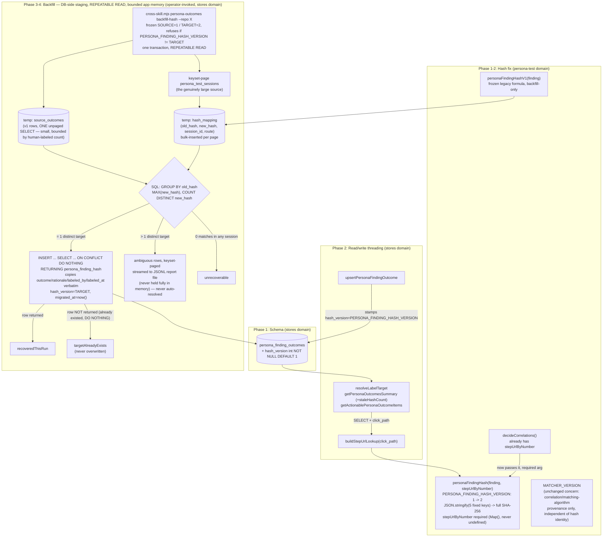

# Plan: Version `personaFindingHash` (route/expected context) + safe backfill

- **Date**: 2026-07-27
- **Status**: Approved (3 GPT audit rounds + 3 Gemini gate rounds — see Audit Trail; not yet implemented)
- **Author**: Claude + Lbstrydom
- **Scope**: backend
- **Target domain(s)**: `persona-test`, `stores`
- ⚠ **Cross-domain work** — touches both `persona-test` (the hash function
  itself, `audit-correlator.mjs`) and `stores` (`persona-outcomes.mjs`, the
  durable outcome-label table). Boundary crossing is intentional: the hash
  is a shared identity contract both domains already depend on.

> Origin: tech-debt topicId `c6b3df92`, surfaced during a backlog-verification
> pass. `personaFindingHash()` hashes only `{element, code, observed}`,
> omitting the page/route the finding was observed on (`finding.step`,
> resolved to a URL via the session's clickPath) and the finding's expected
> behavior. Two genuinely different persona findings — same UI element, same
> severity, same observed text, but on different pages or in different user
> flows — collide onto the same durable identity in `persona_finding_outcomes`.
> Fixing the composition is the easy part; the hard part is that this hash is
> the PRIMARY KEY component of a durable, cross-session, cross-repo table —
> changing what goes into it silently orphans every existing
> `dismissed`/`wont_fix`/`fixed` label, everywhere, unless there's a real
> migration path. This plan designs both.

## 1. Context Summary

**What exists today** (verified 2026-07-27 against current source, not
assumed from the debt entry's summary text):

- `personaFindingHash(finding)` (`scripts/lib/persona/audit-correlator.mjs:62-67`)
  computes `semanticId({ section: finding.element, category: finding.code,
  detail: finding.observed })` — a SHA-256 hash of the pipe-joined, lowercased
  fields, truncated to 8 hex chars (`scripts/lib/findings.mjs:38-39`,
  `semanticId`, a generic function ALSO used by ordinary audit findings — not
  persona-specific, must not be modified).
- **The versioning contract already exists and was already anticipated.**
  `audit-correlator.mjs:14-17`'s own docstring: *"Versioned matching contract:
  bump `MATCHER_VERSION` on any change to `personaFindingHash()` or the
  matching algorithm. A version bump orphans OLD outcome labels from NEW
  sessions only (accepted single-operator debt — see the plan's Risks
  table)."* `MATCHER_VERSION = 1` today. The originating plan
  (`docs/plans/persona-nav-feedback-recovery.md` WS1, line 56) named **"the
  first actual version bump"** as the trigger to revisit that acceptance —
  this plan IS that first bump, so it is the intended moment to look again,
  not a violation of the prior decision.
- **`MATCHER_VERSION` is already wired into `persona_audit_correlations`**
  (a `matcher_version int` column, stamped on every correlation row,
  `audit-correlator.mjs:296,318`) but **NOT into `persona_finding_outcomes`**
  (the durable label table this bug is actually about) — that table has
  **no version column at all**
  (`supabase/migrations/20260713180000_persona_finding_outcomes.sql:8-31`,
  just `persona_finding_hash text NOT NULL`). The "accepted debt" framing
  was scoped to correlation-row provenance; the outcome-label table was
  never given the same treatment.
- **Route context is already computed and available, just not threaded
  into the hash.** `decideCorrelations` (`audit-correlator.mjs:264-279`)
  already builds `stepUrlByNumber = buildStepUrlLookup(clickPath)` (line
  265) for its OWN fuzzy-matching (`personaFilePathTokens`, line 122-129,
  combines `finding.element` + the sanitized step URL) — but then calls
  `personaFindingHash(finding)` at line 279 **without** passing it. The
  data is already in scope at the one production call site; it's a
  last-mile wiring gap, not a missing capability.
- `buildStepUrlLookup(clickPath)` → `Map<number, sanitizedUrl>`, and
  `sanitizeStepUrl` (`scripts/lib/store/persona.mjs:99+`) already
  origin-strips, redacts secrets/PII, and collapses auth-keyword-adjacent
  path segments to `:param` — this is the established, already-tested
  mechanism for turning a raw URL into a stable, safe hash-input component.
  No new sanitization logic is needed.
- `persona_test_sessions.click_path` is a real, already-populated `jsonb`
  column (`supabase/migrations/20260627120000_persona_click_path.sql`,
  `NOT NULL DEFAULT '[]'`) — every session, old or new, has SOME value
  here (possibly empty). `persona-outcomes.mjs`'s three read functions
  (`resolveLabelTarget`, `getPersonaOutcomesSummary`,
  `getActionablePersonaOutcomeItems`) currently `SELECT ... findings FROM
  persona_test_sessions ...` but do **not** select `click_path` — so even
  once `personaFindingHash` accepts a `stepUrlByNumber` argument, these
  three callers have nothing to build it from yet.
- **No retention/pruning job deletes `persona_test_sessions`** (verified:
  no matching code anywhere in `scripts/`) — every session a repo has ever
  recorded is still queryable, which is what makes a backfill from session
  history *possible* rather than merely hopeful.
- `upsertPersonaFindingOutcome` (`persona-outcomes.mjs:98-134`) does a
  plain `ON CONFLICT (repo_id, persona_finding_hash) DO UPDATE` upsert —
  the exact idempotent-write pattern a backfill script can reuse safely
  (re-running it can never double-count or corrupt state).

**Code Trace**: `scripts/lib/persona/audit-correlator.mjs:62-67`
(`personaFindingHash`) is called from `audit-correlator.mjs:279`
(`decideCorrelations`, the session-record-time correlator) and from
`scripts/lib/store/persona-outcomes.mjs:50` (`resolveLabelTarget`, the
`label` CLI's hash-verification path) — `getPersonaOutcomesSummary`
(persona-outcomes.mjs:184) and `getActionablePersonaOutcomeItems`
(persona-outcomes.mjs:270) call it too, both re-deriving hashes from
`session.findings` to join against `persona_finding_outcomes`
(persona-outcomes.mjs:185-192, 278-284). All four call sites are in-scope.

**Patterns reused**: `semanticId` (unmodified — enriched only via its
existing 3-field input shape), `buildStepUrlLookup`/`sanitizeStepUrl`
(unmodified, already exported), the `ON CONFLICT ... DO UPDATE` upsert
idiom already used throughout `persona-outcomes.mjs` and
`scripts/lib/store/arch/symbols.mjs`, the `MATCHER_VERSION`-stamping
convention already used for `persona_audit_correlations`, and the
`cross-skill.mjs` "all cross-skill writes/reads go through here"
convention (AGENTS.md).

**Neighbourhood considered**: `get-neighbourhood` flagged
`personaFindingHash` itself (`review` band — no near-duplicate structure to
reuse, expected for a fix to the function itself) and
`resolveLabelTarget`/`upsertPersonaFindingOutcome` (`precedent` band,
above-floor-cluster in the same file — the existing sibling functions this
plan threads `stepUrlByNumber` through). No incident-neighbourhood record
was materially relevant (checked; the two nearest hits were about symlink
path resolution and test-DB disposability, unrelated to hash-identity
design).

## 2. Proposed Architecture

**Key design decisions**:

- **v2 gets its own compact, explicit serialization — not a reuse of
  `semanticId`'s pipe-joined 3-field shape** (#1 DRY reconsidered, #5 SSoT;
  revised in R1 audit, findings H4/compromise). `semanticId` stays
  completely untouched (still used verbatim by ordinary non-persona audit
  findings and by `personaFindingHashV1`, below) — but folding route/expected
  context into its `section`/`detail` strings via ad-hoc delimiters
  (`` `${element} @ ${route}` ``) reintroduces exactly the kind of
  string-concatenation field-boundary ambiguity this repo's hashing
  conventions otherwise avoid, and `semanticId`'s 8-hex-char truncation is
  too small a space for a NEW durable, cross-repo identity when the column
  is untyped `text` and a full digest costs nothing extra. `personaFindingHash`
  instead defines its own v2 payload as five **always-present** canonical
  string fields — `element`, `code`, `route`, `expected`, `observed` — each
  explicitly coerced with `?? ''` (never left `undefined`, so
  `JSON.stringify` can't silently omit a key depending on which fields
  happen to be present), each lowercased (preserving `semanticId`'s
  historical case-insensitivity behavior), `route` read directly from
  `stepUrlByNumber` (already sanitized once by `buildStepUrlLookup` — R3
  finding M7: `personaFindingHash` does NOT call `sanitizeStepUrl` a
  second time, so canonicalization has exactly one owner and the hashed
  value can never diverge from the value the backfill reports for the
  same finding), serialized via one `JSON.stringify` call over a
  **fixed literal key order** (quote/escape structure disambiguates field
  boundaries for free — no hand-rolled delimiter), then hashed with
  **full, untruncated SHA-256** (`crypto.createHash('sha256').update(json).digest('hex')`,
  64 hex chars). This is documented as a small, explicit, local contract
  next to `personaFindingHash` — not a new named encoder module, not a
  second version constant, not a length-prefix scheme (rejected as
  over-engineered per the R1 rebuttal — see Round History below).
- **`stepUrlByNumber` is a REQUIRED second parameter** (revised in R2 audit,
  finding M4/compromise — reversing the original "optional" decision).
  After this plan ships, every actual production call site
  (`decideCorrelations`, `resolveLabelTarget`, `getPersonaOutcomesSummary`,
  `getActionablePersonaOutcomeItems`, the backfill) always has SOME
  `stepUrlByNumber` map available; making it optional meant a future call
  that forgot to pass it would silently produce a valid-looking but weaker
  hash (`route: ''`), recreating the exact route-collision gap this plan
  exists to close — with no compiler or runtime signal. The parameter is
  now required — omitting it throws immediately (no `?.` before `.get()`).
  An explicit **empty `Map()`** remains the supported, non-throwing way to
  represent "no route context for this session" (a route-less or
  pre-migration session) — that is legitimate data, distinct from a caller
  forgetting the argument entirely. `personaFindingHashV1` (the frozen
  legacy formula) is unaffected — it never accepted route context and
  still doesn't; a second differently-named "route-less" variant of the
  NEW function was considered and rejected as redundant with it.
- **Split `MATCHER_VERSION` from a new, narrowly-scoped
  `PERSONA_FINDING_HASH_VERSION`** (revised in R2 audit, finding M3/accepted
  — reversing the original "reuse `MATCHER_VERSION`" decision). The
  existing `audit-correlator.mjs:14` docstring commits to bumping
  `MATCHER_VERSION` for EITHER a `personaFindingHash()` change OR a
  matching-algorithm change — two genuinely different concerns that can
  diverge. Reusing it for `hash_version`/staleness/the backfill guard
  silently assumed they never would; a future matching-algorithm-only
  change (unrelated to the hash formula) would falsely mark every existing
  v2 outcome row "stale" and disable the (by-then-irrelevant) backfill
  guard. `PERSONA_FINDING_HASH_VERSION` now governs `hash_version`
  stamping, staleness queries, and the backfill's
  `SOURCE_HASH_VERSION`/`TARGET_HASH_VERSION` guard exclusively.
  `MATCHER_VERSION` remains exclusively for
  `persona_audit_correlations.matcher_version` (correlation/matching-
  algorithm provenance) and **stays at `1`** — this plan does not change
  `decideCorrelations`'s fuzzy-matching logic itself (thresholds,
  `personaFilePathTokens` comparisons), only the hash formula used
  elsewhere, so bumping it would misrepresent the correlation algorithm as
  having changed. `PERSONA_FINDING_HASH_VERSION` alone moves `1 -> 2` this
  round. The docstring at `audit-correlator.mjs:14` is narrowed accordingly
  (drop the "or `personaFindingHash()`" clause — that concern now belongs
  to `PERSONA_FINDING_HASH_VERSION`'s own docstring). The two constants are
  independently versioned from here forward. The backfill module
  additionally freezes its OWN `SOURCE_HASH_VERSION`/`TARGET_HASH_VERSION`
  constants (R1 finding M1 — see §4) rather than reading live
  `PERSONA_FINDING_HASH_VERSION`, so a future v2→v3 bump can never silently
  repurpose this transition's command.
- **`persona_finding_outcomes.hash_version` is metadata, not part of the
  identity key.** The `UNIQUE (repo_id, persona_finding_hash)` constraint
  is untouched — different hash *versions* already produce different hash
  *strings* (the input composition changed), so the existing constraint
  remains correct. `hash_version` exists solely so the backfill script (and
  future operators) can query "which rows are still on the old scheme"
  without re-deriving that from timestamps.
- **The backfill is a real, best-effort recovery, not a magic guarantee**
  (Design right-sizing, AGENTS.md) — see §3 below for the full band-aid /
  over-engineered / chosen analysis. Ambiguous or already-occupied targets
  are surfaced for operator review, never auto-resolved or overwritten
  (R1 findings H1/H2 — see §4).

### Right-sizing (Gate 1 — new abstraction introduced: `hash_version` column + a backfill CLI)

- **Band-aid extreme**: fix the hash composition, bump `MATCHER_VERSION`,
  ship it, document "old labels are orphaned" in a comment and move on —
  the literal reading of the pre-existing "accepted single-operator debt"
  note. Rejected because the plan that wrote that note explicitly named
  this exact moment ("the first actual version bump") as the point to
  revisit it, and because real recovery data (unpruned session history)
  exists and costs little to use.
- **Over-engineered extreme**: build a generic, pluggable multi-version
  hash-migration framework (a version registry, an automatic on-write
  migration trigger, a scheduled reconciliation job) that makes every
  *future* hash change seamless forever. Rejected — nothing indicates this
  will happen often (this is the *first* bump since the table's creation),
  and building infrastructure for a hypothetical second bump before a first
  one has even shipped is solving a problem that doesn't exist yet (YAGNI).
- **Chosen**: a `hash_version` column (cheap, permanent, honest metadata)
  + ONE operator-invoked, idempotent, non-destructive backfill command
  scoped to THIS transition, with full accounting output (recovered vs
  unrecoverable — never a silent partial result). If a second hash change
  is ever needed, a future session repeats this same pattern rather than
  reaching for machinery pre-built here on spec. **Current requirement it
  serves**: don't silently re-open every dismissed/wont_fix persona finding
  across every consumer repo the first time this hash is ever touched.

## 3. Sustainability Notes

- **What assumptions does this design encode?** That `persona_test_sessions`
  is retained indefinitely (verified true today — no pruning job exists).
  If a retention policy is added later, the backfill's recovery rate would
  degrade gracefully (older orphaned rows simply become genuinely
  unrecoverable, reported honestly as such) rather than break.
- **`PERSONA_FINDING_HASH_VERSION` covers more than edits to
  `personaFindingHash` itself** (Gemini gate R1 shadow finding): the v2 hash's
  `route` component depends on `sanitizeStepUrl`'s normalization behavior
  (`scripts/lib/store/persona.mjs`), which has already been revised more
  than once by prior security audits (auth-keyword lists, routing-key
  allowlists, secret-shape rules). Any FUTURE change to what
  `sanitizeStepUrl` normalizes a given route string TO is, transitively,
  a `personaFindingHash` identity change — and must bump
  `PERSONA_FINDING_HASH_VERSION` exactly as a direct edit to
  `personaFindingHash` would, even though the code change happens in a
  different file. Documented beside both declarations so this isn't
  missed by someone touching `sanitizeStepUrl` for an unrelated (security)
  reason.
- **If requirements change in 6 months** (e.g., a THIRD hash-relevant field
  needs to be added): the same pattern repeats — bump
  `PERSONA_FINDING_HASH_VERSION` again (independently of `MATCHER_VERSION`,
  per the R2 M3 fix above), freeze the current formula as
  `personaFindingHashV2` (renaming today's `V1` stays `V1`), write a new
  dated backfill command. The `hash_version` column already supports an
  arbitrary integer, not just `{1,2}`.
- **Migration path if this outgrows its design**: the scan is already
  keyset-paged and DB-staged (§4/§5, R1 finding H3), so memory/query size
  don't degrade with history size. If total *runtime* on an enormous
  history ever becomes a problem, the fix is a `--since-days` flag
  narrowing which sessions get staged — a small, backward-compatible
  addition to the same command, not a redesign.

## 4. File-Level Plan

- **`scripts/lib/persona/audit-correlator.mjs`** (modify)
  - `personaFindingHash(finding, stepUrlByNumber)` — `stepUrlByNumber` is
    now a **required** second param (R2 finding M4 — see §2): no default,
    no `?.` before `.get()`; an omitted argument throws immediately, an
    explicit empty `Map()` is the supported "no route context" value.
    Rewrite the v2 body to build the 5-key payload explicitly (order
    fixed, every value `?? ''`-coerced, **trimmed then lowercased** —
    Gemini gate R3 finding G3: `expected`/`observed` are free-form
    AI-generated report text that routinely carries incidental leading/
    trailing whitespace; without `.trim()`, two visually-identical
    findings from different sessions would hash differently and silently
    fail to match an existing label, exactly the false-negative
    re-flagging this plan exists to prevent): `{ element:
    (finding?.element ?? '').trim().toLowerCase(), code: (finding?.code ??
    '').trim().toLowerCase(), route: (stepUrlByNumber.get(finding?.step) ??
    '').trim().toLowerCase(), expected: (finding?.expected ?? '').trim().toLowerCase(),
    observed: (finding?.observed ?? '').trim().toLowerCase() }`, then
    `crypto.createHash('sha256').update(JSON.stringify(payload)).digest('hex')`
    (full 64-char hex — no truncation). **No second call to
    `sanitizeStepUrl` here** (R3 finding M7 — reopened a leaky
    canonicalization boundary): `stepUrlByNumber`'s values are ALREADY
    sanitized by `buildStepUrlLookup` at construction time; re-sanitizing
    inside `personaFindingHash` made the persisted hash depend on
    `sanitizeStepUrl` being idempotent (an undeclared, unlocked property)
    and risked the value reported in the backfill's ambiguity report
    (§ below) diverging from the value actually hashed. `personaFindingHash`
    now consumes the lookup's value directly — sanitization has exactly
    ONE owner, `buildStepUrlLookup`/`sanitizeStepUrl`, unchanged from
    today. Document this exact contract in a docstring immediately above
    the function (per R1 finding H4's compromise: "document this compact
    serialization contract beside `personaFindingHash`"), including the
    required-argument note (R2 M4) and the single-canonicalization-owner
    note (R3 M7).
  - Add `export const PERSONA_FINDING_HASH_VERSION = 2;` (was implicitly
    `1` pre-fix) — a NEW constant, independent of `MATCHER_VERSION` (R2
    finding M3 — see §2). `MATCHER_VERSION` is untouched by this plan;
    it continues to govern `persona_audit_correlations.matcher_version`
    (correlation/matching-algorithm provenance) exclusively. Document
    beside both declarations which concern each governs, so a future
    matching-algorithm-only change knows NOT to touch
    `PERSONA_FINDING_HASH_VERSION`.
  - Add `export function personaFindingHashV1(finding)` — the CURRENT
    (pre-fix) formula, frozen verbatim (still delegates to `semanticId`,
    unchanged, 8-hex truncated), exported ONLY for the backfill script's
    use. Docstring explicitly marks it deprecated/backfill-only — "never
    call this from new code; it exists so the backfill can compute what an
    old outcome row's hash WAS."
  - `decideCorrelations` (line 279): pass the already-in-scope
    `stepUrlByNumber` into `personaFindingHash(finding, stepUrlByNumber)`.
    No other change needed here for the `persona_audit_correlations.hash_version`
    column (corrected at the Gemini gate, R3 finding G2 — `decideCorrelations`
    only COMPUTES emission data, it never writes to the DB itself; the
    actual writer, `recordPersonaAuditCorrelation`, is a separate module —
    see its own bullet below, which is where the stamping actually
    belongs). See the corrected Out-of-Scope entry for what stays
    deliberately unaddressed (backfilling EXISTING correlation rows).
- **`scripts/lib/store/plans-ship.mjs`** (modify — Gemini gate R3 finding
  G2, verified against the real file: `recordPersonaAuditCorrelation`
  lives here, not in `learning-store.mjs` as Gemini's finding text named
  it, but the SUBSTANCE of the finding is real)
  - `recordPersonaAuditCorrelation` (line 484): its `row` object (line
    500-510) builds every `persona_audit_correlations` column EXCEPT the
    new `hash_version` — add `hash_version: PERSONA_FINDING_HASH_VERSION`
    (import the constant from `audit-correlator.mjs`) to that object,
    stamped **unconditionally**, not threaded through as a per-call
    parameter. This is deliberately simpler than passing a `hashVersion`
    field through `decideCorrelations`'s `emissions` array: this function
    is the SOLE writer to `persona_audit_correlations` (both the automatic
    path — `decideCorrelations` → `emissions` → `cross-skill.mjs` →
    `recordPersonaAuditCorrelation` — and the manual CLI repair path —
    `cross-skill.mjs record-correlation` → `recordPersonaAuditCorrelation`
    directly), and there is no legitimate scenario where a row written
    TODAY should be stamped with anything other than the CURRENT
    `PERSONA_FINDING_HASH_VERSION` (unlike `matcher_version`, which is a
    genuinely call-site-varying value already threaded through
    `correlation.matcherVersion`). One change in the one write chokepoint
    closes both call paths at once.
  - Regression-lock: four fixture/contract tests — (a) `personaFindingHashV1`'s
    output for a fixed fixture never changes (the backfill's correctness
    depends on it staying byte-identical to what actually shipped as v1);
    (b) the NEW v2 payload/hash for a fixed fixture never changes either
    (locks the JSON-key-order + trim-then-lowercase + full-SHA-256 contract
    itself, per R1 finding H4 and Gemini gate R3 finding G3 — a future
    refactor that reorders the object literal, drops the `.trim()`, or
    swaps `JSON.stringify` for something "equivalent" would silently
    change every v2 hash without this test); (c) `personaFindingHash`
    throws when called without a second argument, and behaves correctly
    (route: `''`) when called with an explicit empty `Map()` (R2 finding
    M4 — proves the required-argument distinction actually holds);
    (d) two findings whose `expected`/`observed` text differ ONLY by
    incidental leading/trailing whitespace produce the SAME v2 hash
    (Gemini gate R3 finding G3 regression lock).
- **`scripts/lib/store/persona-outcomes.mjs`** (modify)
  - Add `buildStepUrlLookup` to the existing
    `import { personaFindingHash, isP0OrP1 } from
    '../persona/audit-correlator.mjs'` line (`persona-outcomes.mjs:21`) —
    `buildStepUrlLookup` is already exported from `audit-correlator.mjs`
    (line 236 in the current file), the SAME module `personaFindingHash`
    and `isP0OrP1` are already imported from here. **Not** from
    `scripts/lib/store/persona.mjs`, which exports `sanitizeStepUrl` but
    not `buildStepUrlLookup` — a Gemini gate R2 finding (G3) initially
    flagged this as a missing export, but that check was against the
    wrong file; verified directly (`grep '^export function' audit-correlator.mjs`)
    that `buildStepUrlLookup` is already correctly exported there, so no
    change to `audit-correlator.mjs`'s exports is needed — spelling out the
    exact import line here removes the ambiguity that produced the false
    positive.
  - `resolveLabelTarget`: `SELECT id, repo_id, findings, click_path FROM
    persona_test_sessions WHERE id = $1` (add `click_path`); build
    `stepUrlByNumber = buildStepUrlLookup(session.click_path)`; pass to
    `personaFindingHash`.
  - `getPersonaOutcomesSummary`: same `click_path` addition to both the
    `repoId`-primary and `repoName`-fallback SELECT branches (from the
    just-shipped 88bc75e1/8993b96f fix); build and thread
    `stepUrlByNumber`.
  - `getActionablePersonaOutcomeItems`: same addition; note this function
    already iterates MULTIPLE sessions (`WORKSHEET_SESSION_LIMIT`) — build
    one `stepUrlByNumber` PER session (each session has its own
    `click_path`), not one shared map, since `step` numbers are
    session-relative indices.
  - `upsertPersonaFindingOutcome`: add `hash_version:
    PERSONA_FINDING_HASH_VERSION` to the upserted row and to the `update:`
    column list (import `PERSONA_FINDING_HASH_VERSION` from
    `audit-correlator.mjs` — R2 finding M3, NOT `MATCHER_VERSION`).
  - `getPersonaOutcomesSummary` / `getActionablePersonaOutcomeItems`
    (R1 finding M2): add a `staleHashCount` field to both return shapes —
    a cheap `SELECT count(*) FROM persona_finding_outcomes WHERE repo_id =
    $1 AND hash_version < $2` (current `PERSONA_FINDING_HASH_VERSION`) alongside the
    existing query, no new round-trip pattern. When `staleHashCount > 0`,
    include a one-line hint in the returned object. **Hint wording is
    deliberately honest about a possible non-zero floor** (Gemini gate R3
    finding G1 — a real UX bug, not just a style nit: the backfill is
    additive-only, `hash_version=1` rows are NEVER deleted whether
    `recovered` or `unrecoverable`, so `staleHashCount` can NEVER
    mechanically reach zero for a repo with even one genuinely
    unrecoverable finding — a hint phrased as an unconditional command to
    "run the backfill to clear this" would nag the operator every single
    `/ship` forever, exactly the "permanent alert fatigue" this finding
    warns about). The right-sized fix is NOT a new tracking column/table
    recording "already attempted" state (over-engineered for what is
    fundamentally a wording problem, and a stale "already attempted, don't
    ask again" marker would itself go stale the day a matching NEW session
    appears and makes a previously-unrecoverable finding recoverable after
    all) — instead the hint text itself sets the expectation: `hint: "N
    outcome label(s) are on an old hash scheme. Run: node
    scripts/cross-skill.mjs persona-outcomes backfill-hash --repo <name>
    (safe to re-run). Some may be permanently unrecoverable — this count
    is not guaranteed to reach zero."` `staleHashCount` itself stays a
    plain, honest fact ("N rows are on the old scheme"), not a proxy for
    "N rows need action." `/ship`'s existing Step 0.5a UX-gate call
    already renders this object's fields — no new surface needed, same
    principle as the existing P0/P1 gate.
- **`supabase/migrations/20260727120000_persona_finding_outcomes_hash_version.sql`**
  (create) — `ALTER TABLE persona_finding_outcomes ADD COLUMN IF NOT EXISTS
  hash_version integer NOT NULL DEFAULT 1;` + a comment explaining `1` =
  the pre-context-inclusion scheme, `2` = route+expected included.
  **Also** (R3 finding H7 — the backfill's row projection needs a place to
  record migration provenance distinct from the original label timestamp):
  `ALTER TABLE persona_finding_outcomes ADD COLUMN IF NOT EXISTS migrated_at
  timestamptz;` — `NULL` for every row created directly by the `label`
  command (never migrated); set to the backfill's run time for any row
  the backfill creates. **Also** (Gemini gate R1 finding G1 — missing
  index for the backfill's keyset pagination): `CREATE INDEX IF NOT EXISTS
  idx_persona_test_sessions_repo_created_id ON persona_test_sessions
  (repo_id, created_at, id);` — without this composite index, keyset
  pagination on `(repo_id, created_at, id)` forces a sequential scan +
  in-memory sort per page (O(N²) over the repo's session history) instead
  of an index-backed pipeline. **Also** (Gemini gate R1 shadow finding,
  verified against `decideCorrelations`/`retireMissedCorrelationsForHash` —
  see the corrected Out-of-Scope entry below): `ALTER TABLE
  persona_audit_correlations ADD COLUMN IF NOT EXISTS hash_version integer
  NOT NULL DEFAULT 1;`, stamped from `PERSONA_FINDING_HASH_VERSION` by
  `recordPersonaAuditCorrelation` (NOT `matcher_version`, which is a
  different concern — see §2/§4). **`DEFAULT 1` is deliberate, not an
  unverified guess** (Gemini gate R3 shadow finding — the column comment
  states this explicitly, since the sibling `matcher_version` column takes
  the OPPOSITE convention — nullable, for "pre-existing/manual rows" per
  `persona-nav-feedback-recovery.md` WS1 — and a future reader could
  otherwise assume `DEFAULT 1` here was copied from that pattern without
  thought): every `persona_audit_correlations` row that exists BEFORE this
  migration runs was necessarily written by the pre-fix `personaFindingHash`
  formula (there is no other formula that has ever existed), so `DEFAULT 1`
  is a verified fact about this table's history, not a placeholder. No
  constraint change on either table (see §2 "Key design decisions").
- **`scripts/cross-skill.mjs`** (modify) — add a `persona-outcomes
  backfill-hash --repo <name> [--dry-run]` subcommand (extends the
  existing `cmdPersonaOutcomes` dispatcher). Resolves `repoId` the same way
  the `--worksheet`/`summary` paths do (§ prior fix,
  `resolveRepoIdentityQuiet()` or explicit `--repo-id`). Calls into the new
  backfill function (below) and prints its accounting result (recovered /
  ambiguous / targetAlreadyExists / unrecoverable — see below). `--dry-run`
  computes and reports the would-be recovery count without writing.
- **`scripts/lib/store/persona-outcomes-hash-backfill.mjs`** (create) — the
  actual backfill logic, as an importable function
  (`backfillPersonaFindingHashV2({repoId, dryRun})`), separate from its CLI
  wiring so it's unit-testable without spawning a subprocess (matches this
  repo's established `scripts/lib/store/*` + thin CLI-wrapper convention).
  Rewritten per R1 findings H1 (ambiguous many-to-one collisions), H2
  (non-destructive writes), H3 (bounded memory via DB-side staging — GPT's
  compromise on Claude's rebuttal), and M1 (frozen version guard); further
  revised per R3 findings H6 (the ambiguity-reporting path reopened the
  same unbounded-memory concern H3 had just closed for the staging path),
  H7 (an unspecified v1→v2 column-level migration contract), M6 (no
  stable read snapshot across keyset pages under `READ COMMITTED`), and
  M7 (double-sanitized route — see the `personaFindingHash` fix above):
  - **Frozen constants, not live `PERSONA_FINDING_HASH_VERSION`** (M1;
    updated in R2 to reference the split constant from M3): module-level
    `const SOURCE_HASH_VERSION = 1; const TARGET_HASH_VERSION = 2;` — this
    command's identity is THIS transition, not "whatever the current
    scheme is." At invocation, refuse to run (clear thrown error, not a
    silently wrong answer) if `PERSONA_FINDING_HASH_VERSION !==
    TARGET_HASH_VERSION` — once a real v2→v3 bump ships, this exact
    command self-disables and a new dated command is written for that
    transition, rather than this one silently misinterpreting
    `hash_version < PERSONA_FINDING_HASH_VERSION` as "still means v1."
    (`MATCHER_VERSION` is never read here — it governs an unrelated
    concern, per M3.)
  - **Step 0 — cheap short-circuit**: `SELECT count(*) FROM
    persona_finding_outcomes WHERE repo_id = $1 AND hash_version =
    SOURCE_HASH_VERSION`. Zero → return `{scanned: 0, recovered: 0,
    ambiguous: 0, targetAlreadyExists: 0, unrecoverable: 0,
    alreadyCurrent: true}` immediately; no session scan performed.
  - **Step 1 — DB-side staging, not an unbounded in-process map** (H3,
    replacing the flawed "keyset-paginate the reads but still accumulate
    everything in one JS `Map` forever" design Claude's own rebuttal first
    proposed — GPT's compromise correctly identified that pagination alone
    doesn't bound memory when the accumulator itself grows with total
    distinct-hash count). On one dedicated connection, inside one
    transaction opened at **`REPEATABLE READ`** (R3 finding M6 — `READ
    COMMITTED`, Postgres's default, does not give a stable snapshot across
    the several queries this step runs; a v1 outcome or a session could be
    added/changed mid-scan and produce accounting that was never true for
    one coherent database state; `REPEATABLE READ` pins one snapshot for
    the whole staging + classification pass). Obtained via this repo's
    existing `withTx(fn)` transaction helper (`scripts/lib/db/query.mjs`),
    which already checks out ONE pooled client for the whole callback and
    only releases it back to the pool after `COMMIT`/`ROLLBACK` — the
    "one dedicated connection" this design needs, no new connection-
    management code required. **Both temp tables are created `ON COMMIT
    DROP`** (Gemini gate R3 shadow finding — verified against `withTx`'s
    real implementation: it recycles its client back to the pool via
    `client.release()`, and Postgres temp tables are SESSION-scoped by
    default, not transaction-scoped — without `ON COMMIT DROP`, a temp
    table would silently survive into whatever LATER, unrelated query
    happens to borrow this exact recycled connection next, and a
    subsequent backfill run unlucky enough to reuse that same connection
    would hit `relation "hash_mapping" already exists`). **Two staging
    tables, sized to what each source actually needs** (right-sized in the
    Gemini gate review — the R1/R2 drafts over-applied keyset pagination
    to BOTH sources uniformly, when only one of them can plausibly be
    large):
    - `source_outcomes` (temp table, `ON COMMIT DROP`, mirroring the
      relevant `persona_finding_outcomes` columns): populated by a SINGLE
      `INSERT INTO source_outcomes SELECT * FROM persona_finding_outcomes
      WHERE repo_id = $1 AND hash_version = SOURCE_HASH_VERSION` — **no
      pagination loop**. A repo's outcome-label count is bounded by how
      many findings a human has ever manually dismissed/fixed, not by
      session volume; keyset-paging a table this small adds SQL and
      transaction complexity for a risk that doesn't exist in practice.
    - `hash_mapping(id serial PRIMARY KEY, old_hash text, new_hash text,
      session_id uuid, route text)` (temp table, `ON COMMIT DROP` — the
      `id` surrogate key is required per Gemini gate R2 finding G1, see
      below): population IS
      keyset-paged — `persona_test_sessions` (ordered by `(created_at,
      id)`, batch size e.g. 500, same pattern this repo already uses for
      `UPSERT_CHUNK_SIZE`-bounded writes elsewhere) is the genuinely
      unbounded source (every retained session's full findings history).
      For each page: in application code, for each session's P0/P1
      findings, compute `oldHash = personaFindingHashV1(finding)` and
      `newHash = personaFindingHash(finding, stepUrlByNumber)`;
      bulk-insert the page's `(old_hash, new_hash, session_id, route)`
      rows into `hash_mapping` in one batched statement (`id` auto-assigns).
      Peak application memory is bounded to one page of sessions at a time
      — never the full session history. **Why `hash_mapping` needs its
      own surrogate key** (Gemini gate R2 finding G1 — a genuine
      correctness bug in the R1 draft, not just a style nit): the
      ambiguity-report streaming in Step 2 keyset-pages `hash_mapping`
      ordered by `old_hash` alone — but `old_hash` is NOT unique in this
      table (one old hash can have many rows, one per session/route it
      appeared in), and keyset pagination REQUIRES a unique sort key or a
      page boundary landing mid-group silently skips the rest of that
      group's rows, permanently dropping ambiguous candidates from the
      report with no error. `ORDER BY (old_hash, id)` restores a unique,
      stable total order across page boundaries.
  - **Step 2 — ambiguity detection in SQL, not app code** (H1): after
    staging completes, one query — **projecting the candidate `new_hash`
    itself, not just its distinct count** (Gemini gate R1 finding G3 — the
    R1-R3 drafts specified `SELECT old_hash, count(DISTINCT new_hash)`
    alone, which gives Step 3 no column to actually insert; `MAX(new_hash)`
    is
    safe here specifically because it's only READ when
    `distinct_targets = 1`, so there is exactly one value to pick from):
    `SELECT old_hash, MAX(new_hash) AS new_hash, count(DISTINCT new_hash)
    AS distinct_targets FROM hash_mapping GROUP BY old_hash`. Join this
    against the `SOURCE_HASH_VERSION` candidate rows staged in
    `source_outcomes`. For each candidate's `old_hash`:
    - **0 rows in `hash_mapping`** → `unrecoverable` (the finding never
      reappeared in ANY retained session — honestly not recoverable, never
      silently dropped from the count).
    - **exactly 1 distinct `new_hash`** → unambiguous; eligible for
      migration.
    - **>1 distinct `new_hash`** → `ambiguous`. **Never auto-resolved**
      (picking "the last one" or "the most common one" would recreate the
      exact many-to-one collision defect this plan exists to fix) — an
      operator must decide by hand. **Reporting is streamed, not
      accumulated in memory** (R3 finding H6 — reopened the bounded-memory
      concern H3 had just closed: the earlier draft collected every
      ambiguous source hash + all its candidates + sessions + routes into
      one in-memory array, unbounded by the same total-history size H3
      bounded for staging). Instead: query the ambiguous rows from
      `hash_mapping`/`source_outcomes`, keyset-paged **`ORDER BY (old_hash,
      id)`** — the surrogate `id` column, NOT `old_hash` alone (Gemini gate
      R2 finding G1 — `old_hash` is not unique across `hash_mapping`'s
      rows, so pagination on it alone silently skips rows whenever a page
      boundary lands inside a group of same-hash rows; `id` restores a
      unique, gapless order) — and for each page, append the rows as one
      batch to a **JSONL report file**, written with this repo's
      established same-directory-temp-file-then-rename atomic-write
      convention (cleanup on failure — no partial/corrupt report left
      behind). **Default report location** (Gemini gate R1 shadow finding —
      the earlier draft never specified a default path or a sensitivity
      posture): `.audit-loop/persona-hash-backfill-reports/<repo>-<unix
      timestamp>.jsonl`, matching this repo's existing gitignored
      `.audit-loop/` convention for local, non-committed operational
      output (added to `.gitignore`); `--report-path <file>` overrides it.
      The report's `route` field is already sanitized (same
      `sanitizeStepUrl` value the hash uses), but the file is still
      treated as operator-local, never committed or transmitted anywhere.
      `backfillPersonaFindingHashV2`'s return value carries only
      the **count** of ambiguous rows and the report file's path — never
      the rows themselves.
  - **Step 3 — non-destructive, atomically-accounted writes with an
    explicit column-level projection** (H2, rewritten in R2 per H5/M5 —
    the original "read-then-decide" framing was both racy and produced a
    rerun-accounting contradiction — rewritten again in R3 per H7, which
    found the v1→v2 row projection itself was never actually specified —
    and corrected once more at the Gemini gate per G2, which caught that
    the R3 projection still didn't match the REAL
    `persona_finding_outcomes` schema — verified directly against
    `supabase/migrations/20260713180000_persona_finding_outcomes.sql`).
    The exact `INSERT ... SELECT` projection, joining the unambiguous
    mapping relation to `source_outcomes`, using the table's REAL column
    names (no invented shorthand): `outcome` / `rationale` / `labeled_by`
    / **`last_seen_session_id`** copy **verbatim** from the v1 source row
    (a backfill preserves the historical judgement AND its session
    provenance, it doesn't re-derive either — the R3 draft named the
    first three but omitted `last_seen_session_id` entirely, which would
    have silently defaulted to `NULL`); `repo_id` copies verbatim (same
    repo); `persona_finding_hash` becomes the candidate's `new_hash`;
    `hash_version` becomes `TARGET_HASH_VERSION`; **`created_at` AND
    `updated_at`** (the table's actual timestamp columns — the R3 draft's
    `labeled_at (or equivalent timestamp column)` did not name a real
    column and would have left both defaulting to `now()`, silently
    overriding history) are BOTH preserved AS-IS from the v1 row on the
    new row (they record when the human's judgement was made and last
    touched, which didn't change; the table's `BEFORE UPDATE` touch
    trigger only fires on `UPDATE`, never `INSERT`, so an explicit
    `updated_at` value in the `INSERT` is not overwritten). A separate
    **`migrated_at = now()`** column records when THIS backfill ran
    (distinct concern — this repo's `persona_finding_outcomes` schema
    gains `migrated_at timestamptz` alongside `hash_version` in the same
    migration file below). For each unambiguous candidate, write via a
    single **batched `INSERT ... SELECT ... ON CONFLICT (repo_id,
    persona_finding_hash) DO NOTHING RETURNING persona_finding_hash`** —
    NOT the `DO UPDATE` idiom `upsertPersonaFindingOutcome` uses
    elsewhere, and NOT a separate existence check before the write (a
    read-then-insert would race with a concurrent `label` command or
    another backfill invocation — R2 finding M5). A backfill must never
    treat historical data as more authoritative than a live label.
    **Accounting is derived entirely from
    what `RETURNING` actually returns, never guessed**: hashes present in
    the `RETURNING` set increment `recoveredThisRun` (this exact run
    performed the insert); eligible candidates whose hash is NOT in the
    `RETURNING` set increment `targetAlreadyExists` (something — a prior
    run, a live label, a concurrent backfill — already holds that row).
    This closes R2 finding M5 (atomic, race-free by construction — no
    window between "check" and "write") and R2 finding H5 (the counters
    are now unambiguously per-run facts, not a claim about the row's
    entire history — see the corrected rerun test in §6). The old (v1)
    row is NEVER deleted or modified — a mistaken or interrupted run
    cannot lose data, and re-running from scratch is always safe (every
    write is idempotent `DO NOTHING`, every candidate is re-derived fresh
    from source data each run — no persisted resume state needed; per
    Claude's accepted H3 rebuttal point, a killed process's only
    consequence is "run it again," which is bounded work, not risk). The
    normal `label` command remains the ONLY path that ever *updates* an
    existing v2 outcome row's `outcome`/`rationale`.
  - **Return shape** (revised in R2 per H5 — `recovered` renamed to make
    clear it's a per-run fact, not cumulative history; revised again in
    R3 per H6 — the ambiguity detail is a report-file path, never an
    in-memory collection): `{scanned, recoveredThisRun, ambiguousCount,
    ambiguousReportPath, targetAlreadyExists, unrecoverable,
    alreadyCurrent}`. `ambiguousReportPath` is `null` when
    `ambiguousCount === 0` (no report file is created for a clean run).
    The CLI prints the summary counts directly and, when a report exists,
    tells the operator where to find it — it does not itself hold or
    re-render the full contents. `--dry-run` runs Steps 0-2 and the
    classification in Step 3, but skips the actual `INSERT`
    (`recoveredThisRun` in dry-run mode reports what WOULD be inserted,
    computed the same way minus the write; the ambiguity report is still
    written, since it costs nothing extra and is exactly what an operator
    needs to review before a real run).
- **Tests**:
  - `tests/persona-audit-correlator.test.mjs` (modify) — new hash
    composition (with/without `stepUrlByNumber`, with/without `expected`),
    `PERSONA_FINDING_HASH_VERSION === 2` (independent of `MATCHER_VERSION`
    — R2 M3), the `personaFindingHashV1` regression-lock, the NEW v2
    payload/hash regression-lock (fixed fixture — locks JSON-key-order +
    lowercase + full-SHA-256, per H4), `personaFindingHash` throwing when
    called without `stepUrlByNumber` and behaving correctly with an
    explicit empty `Map()` (R2 M4), `decideCorrelations` now threading
    `stepUrlByNumber` into the hash (assert two findings differing only by
    `step` now produce different hashes when `personaFindingHash` is
    called with a real lookup); a dedicated test asserting a
    `MATCHER_VERSION`-only bump does NOT change any `personaFindingHash`
    output (R2 M3 regression lock — proves the two constants are truly
    decoupled); a contract test asserting `personaFindingHash` does NOT
    re-sanitize its `route` input — feed it a lookup map whose value is
    ALREADY sanitized and assert the hash uses that value verbatim,
    catching any accidental re-introduction of a second `sanitizeStepUrl`
    call (R3 M7 regression lock).
  - `tests/persona-outcomes.test.mjs` (modify) — DB-off tests confirming
    the new `click_path` selection / `stepUrlByNumber` threading doesn't
    break the existing cloud-off degradation paths; `hash_version` present
    in `upsertPersonaFindingOutcome`'s schema-validated write shape (stamped
    from `PERSONA_FINDING_HASH_VERSION`); `staleHashCount`/`hint` present
    in both summary functions' return shapes, computed against
    `PERSONA_FINDING_HASH_VERSION` (M2); the hint text names both the
    backfill command AND the "not guaranteed to reach zero" caveat (Gemini
    gate R3 finding G1 regression lock — a future edit that reverts to an
    unconditional "run this to fix it" phrasing should fail this test).
  - `tests/plans-ship-persona-correlation.test.mjs` (or the existing test
    file covering `recordPersonaAuditCorrelation`, whichever this repo
    already has — modify): assert every row written by
    `recordPersonaAuditCorrelation` — both the auto-emitted path and the
    manual `record-correlation` CLI path — carries `hash_version:
    PERSONA_FINDING_HASH_VERSION` (Gemini gate R3 finding G2 regression
    lock — the second-writer gap).
  - `tests/persona-outcomes-hash-backfill.test.mjs` (create) —
    `AUDIT_DB_TEST_URL`-gated (mirrors
    `tests/symbol-index-drift-justification.test.mjs`'s pattern: skips
    cleanly when absent). Scenarios: (a) a v1 outcome row whose finding
    reappears in exactly one session/route → `recoveredThisRun: 1`, new row
    exists at `hash_version=2` with `outcome`/`rationale`/`labeled_by`
    copied verbatim from the v1 row, original `labeled_at` preserved,
    `migrated_at` set to the run time, old row untouched (H7 regression
    lock — asserts the FULL field-level projection, not just "a row
    exists"); (b) a v1 outcome row whose finding never reappears in any
    session → `unrecoverable`, no new row created; (c) a v1 outcome row
    whose old hash maps to TWO distinct new hashes across different
    sessions → `ambiguousCount: 1`, the report file at `ambiguousReportPath`
    names both candidates (H1 regression lock), NEITHER is written; (d) a
    v1 row whose computed v2 target already has a live outcome row →
    `targetAlreadyExists`, the existing row's `outcome`/`rationale` is
    UNCHANGED after the backfill runs (H2 regression lock — proves `DO
    NOTHING`, not `DO UPDATE`); (e) **corrected rerun contract** (H5): run
    the backfill twice on the same fixture — after run 1, the previously-
    unrecovered candidate is `recoveredThisRun: 1`; after run 2 (same
    fixture, nothing changed), that SAME candidate is `targetAlreadyExists:
    1` and `recoveredThisRun: 0` — assert the underlying database state
    (row count, row contents) is identical after both runs, NOT that the
    two runs' returned counters are identical (they're intentionally not).
    Running the backfill twice against the SAME pool in one test process
    also exercises the Gemini gate R3 shadow finding on temp-table
    lifecycle: with a small pool, run 2 plausibly reuses the exact pooled
    connection run 1 used — if `hash_mapping`/`source_outcomes` weren't
    `ON COMMIT DROP`, run 2 would fail with `relation already exists`
    rather than proceeding normally, so this scenario doubles as that
    regression lock without a dedicated test;
    (f) **concurrent-write race** (M5): simulate a competing insert landing
    between candidate discovery and this backfill's write for the same
    target hash — assert the live/competing row's data is preserved
    untouched and the backfill correctly reports `targetAlreadyExists`
    rather than erroring or double-writing; (g) **bounded ambiguity
    reporting** (H6): a fixture with more ambiguous source hashes than one
    keyset page — assert peak memory/call shape never materializes the
    full set at once (call-count/streaming behavior, not just the final
    report's correctness) and the JSONL report file contains every
    ambiguous row across pages, not just the first page; (h) `--dry-run`
    reports counts (and still writes the ambiguity report, per §4) but
    performs no `INSERT`; (i) a repo with zero v1 rows → `alreadyCurrent:
    true`, no session scan performed (cheap no-op verified via call-count,
    not just output shape); (j) the command throws a clear error (not a
    silent wrong answer) when invoked with `PERSONA_FINDING_HASH_VERSION
    !== TARGET_HASH_VERSION` (M1 regression lock — simulate a future
    bump); (k) **snapshot consistency** (M6): a v1 outcome row inserted by
    a concurrent connection AFTER this backfill's transaction begins is
    NOT observed mid-run (proves `REPEATABLE READ`, not the default `READ
    COMMITTED`) — **not** a test for a `40001` error on the final insert
    (Gemini gate R1 finding G2 — corrected a factual error in the R3 draft:
    `INSERT ... ON CONFLICT DO NOTHING` resolves a concurrent-insert
    conflict by cleanly omitting the row from `RETURNING`, it does not
    raise a serialization error even under `REPEATABLE READ`; scenario (f)
    above already covers that exact behavior via `targetAlreadyExists`).

## 5. Risk & Trade-off Register

| Risk | Mitigation |
|---|---|
| A repo's session history is large enough that a naive full-history scan is slow or exhausts process memory | **Resolved by design, not deferred** (R1 finding H3, right-sized in the Gemini gate review): the session scan (the genuinely unbounded source) is keyset-paged into a DB-side temp table; matching and ambiguity-detection run in SQL, not an ever-growing in-process `Map`. The source-outcome scan is a single un-paginated query — deliberately NOT keyset-paged, since a repo's outcome-label count is bounded by human dismissal volume, not session volume, and pagination there would be complexity without a real risk to bound. Peak application memory is bounded to one session page at a time regardless of total historical volume. `--since-days` remains a possible *future* narrowing (§3) but is no longer needed to bound memory/query size — only to reduce total work on a very large history |
| Keyset pagination over `persona_test_sessions` has no supporting index, forcing a sequential scan + in-memory sort per page (O(N²) over the repo's history) | **Resolved by design** (Gemini gate R1 finding G1): the migration file adds `CREATE INDEX ON persona_test_sessions (repo_id, created_at, id)`, matching the exact keyset-pagination predicate |
| Keyset-paging the ambiguity report `ORDER BY old_hash` alone silently skips rows when a page boundary lands inside a group of same-hash candidates (`old_hash` is not unique in `hash_mapping`) | **Resolved by design** (Gemini gate R2 finding G1 — a genuine data-loss bug, not a style nit): `hash_mapping` gains a surrogate `id serial PRIMARY KEY`; the ambiguity report pages `ORDER BY (old_hash, id)`, a unique and stable total order |
| The v1→v2 row projection (H7's fix) named `outcome`/`rationale`/`labeled_by` and an invented `labeled_at` column, omitting the real `last_seen_session_id` column and using a timestamp name that doesn't exist in the schema | **Resolved by design** (Gemini gate R2 finding G2 — verified directly against `supabase/migrations/20260713180000_persona_finding_outcomes.sql`): the projection now names the table's REAL columns — `last_seen_session_id` added to the verbatim-copy set; `created_at`/`updated_at` (not `labeled_at`) named explicitly and preserved AS-IS (the table's touch trigger only fires on `UPDATE`, so an explicit `INSERT` value isn't overwritten) |
| An old hash maps to MULTIPLE distinct new-hash candidates across different sessions (the same old hash was legitimately re-used, or the old formula's coarser identity collapsed two now-distinguishable findings) | **Resolved by design** (R1 finding H1): SQL-side `GROUP BY old_hash HAVING count(DISTINCT new_hash) > 1` routes every such case to an `ambiguous` bucket with all candidates + sessions + routes reported. Never auto-resolved (picking "most recent" or "most common" would recreate the exact collision defect this plan fixes) — requires one-time operator judgment, surfaced honestly in the accounting output rather than silently guessed |
| The backfill overwrites a live, already-labeled v2 outcome with stale historical data | **Resolved by design** (R1 finding H2, tightened in R2 per H5/M5): writes are a single atomic `INSERT ... ON CONFLICT DO NOTHING RETURNING`, not `DO UPDATE` and not a read-then-decide check. An existing target is counted as `targetAlreadyExists` (derived from what `RETURNING` did NOT return), distinct from `recoveredThisRun`, and is never modified — race-free against a concurrent `label` command or another backfill invocation. The normal `label` CLI path remains the sole writer of live label updates |
| Two runs of the backfill appear to disagree because a row `recoveredThisRun` on run 1 correctly becomes `targetAlreadyExists` on run 2 | **Resolved by design** (R2 finding H5 — a genuine contradiction in this plan's own R1 draft, caught by GPT): counters are documented and tested as PER-RUN facts, not cumulative history. The idempotency test asserts identical final DATABASE STATE across reruns, not identical per-run counters (§6) |
| The ambiguity-reporting path re-introduces the same unbounded-memory risk H3 closed for staging (a large historical collision set materialized as one in-memory array + fully rendered by the CLI) | **Resolved by design** (R3 finding H6 — a genuine hole in this plan's own R2 fix, caught by GPT): ambiguous rows are keyset-paged and streamed to an atomically-written JSONL report file; `backfillPersonaFindingHashV2` returns only a count + the report's path, never the rows themselves |
| The v1→v2 row projection was never specified at the column level, risking silent loss of the original label's provenance (who labeled it, when) during migration | **Resolved by design** (R3 finding H7 — a genuine spec gap, caught by GPT): an explicit `INSERT ... SELECT` projection copies `outcome`/`rationale`/`labeled_by`/`labeled_at` verbatim from the v1 row; a new `migrated_at` column records the backfill's own run time as a separate, non-conflicting concern. A field-level regression test locks this (§6) |
| The staging transaction's default `READ COMMITTED` isolation lets a v1 outcome or session be added/changed mid-scan, so the reported counts may never correspond to one coherent database state | **Resolved by design** (R3 finding M6, caught by GPT): the staging + classification transaction runs at `REPEATABLE READ`, pinning one snapshot for the whole pass. (An earlier draft of this mitigation also specified handling a `40001` serialization conflict on the final `INSERT ... ON CONFLICT DO NOTHING` — corrected by Gemini gate R1 finding G2: that statement resolves a concurrent-insert conflict cleanly via `targetAlreadyExists`, it does not raise a serialization error, so no such handling is needed) |
| Temp tables (`source_outcomes`, `hash_mapping`) are session-scoped in Postgres by default, not transaction-scoped; `withTx` returns its pooled client to the pool after `COMMIT`, so an un-dropped temp table would silently persist into whatever LATER, unrelated query happens to reuse that exact connection, and a subsequent backfill run reusing it would hit `relation already exists` | **Resolved by design** (Gemini gate R3 shadow finding, verified against `withTx`'s real implementation — `pool.connect()` for the whole callback, `client.release()` after commit/rollback): both temp tables are created `ON COMMIT DROP`. Running the backfill twice against the same pool in one test process (already an existing scenario, §6) doubles as the regression lock |
| `expected`/`observed` are free-form AI-generated report text that routinely carries incidental leading/trailing whitespace; without trimming, two visually-identical findings from different sessions hash differently and silently fail to match an existing label | **Resolved by design** (Gemini gate R3 finding G3): every v2 payload field is `.trim()`-ed before lowercasing. Regression-locked (§6) |
| A second writer to `persona_audit_correlations` (`recordPersonaAuditCorrelation`, covering both the automatic `decideCorrelations` path and the manual `record-correlation` CLI repair path) was never updated to stamp the new `hash_version` column, so manually-repaired or freshly-emitted correlation rows would silently default to `hash_version=1` even when keyed by a v2 hash | **Resolved by design** (Gemini gate R3 finding G2 — verified the actual writer lives in `scripts/lib/store/plans-ship.mjs`, not `learning-store.mjs` as the finding text named): `recordPersonaAuditCorrelation` stamps `hash_version: PERSONA_FINDING_HASH_VERSION` unconditionally on every row it writes — the single write chokepoint closes both call paths. Regression-locked (§6) |
| `staleHashCount` can never mechanically reach zero for a repo with even one genuinely unrecoverable v1 finding (the backfill is additive-only; v1 rows are never deleted), so an unconditional "run the backfill to fix this" hint would nag every `/ship` forever | **Resolved by design** (Gemini gate R3 finding G1 — a real UX bug, not a style nit): the hint text itself sets the expectation ("safe to re-run... not guaranteed to reach zero") rather than implying the count is actionable to completion. Deliberately NOT a new "already attempted" tracking column — that would itself go stale the day a matching new session makes a previously-unrecoverable finding recoverable. Regression-locked (§6) |
| `personaFindingHash` re-sanitizing an already-sanitized route value creates an undeclared dependency on `sanitizeStepUrl` being idempotent, and risks the hashed value diverging from the value reported in the ambiguity report | **Resolved by design** (R3 finding M7, caught by GPT): `personaFindingHash` consumes `stepUrlByNumber`'s value directly with no second sanitize call — canonicalization has exactly one owner (`buildStepUrlLookup`). A contract test locks the hashed value and the reported value as identical (§6) |
| `sanitizeStepUrl` is an evolving heuristic stack (auth-keyword/routing-key allowlists, secret-shape rules) that prior security audits have already changed more than once; a future tightening would silently change v2 hashes for affected routes with no version signal | Documented as an explicit maintenance rule (§3): any future behavioral change to `sanitizeStepUrl`'s normalization (not just its call site) is ALSO a `personaFindingHash` identity change and requires a `PERSONA_FINDING_HASH_VERSION` bump, exactly like a direct edit to `personaFindingHash` itself — noted beside both declarations (Gemini gate R1 shadow finding) |
| `persona_audit_correlations` rows (written by `recordPersonaAuditCorrelation`, from data `decideCorrelations` computes) share the exact `personaFindingHash` this plan changes, but the plan's original Out-of-Scope reasoning incorrectly assumed `matcher_version` already tracked hash-formula identity for that table | **Resolved by design** (Gemini gate R1 shadow finding, verified against `decideCorrelations`/`retireMissedCorrelationsForHash` in `plans-ship.mjs:569` — a best-effort, never-throws cascade, so old-hash rows go silently unretired rather than erroring): `persona_audit_correlations` gains its OWN `hash_version` column, stamped from `PERSONA_FINDING_HASH_VERSION` by `recordPersonaAuditCorrelation` (the actual writer — see the R3 G2 row above) going forward, so future code can at least tell v1-hash rows from v2-hash rows. Backfilling/re-scoring EXISTING correlation rows remains explicitly out of scope (see the corrected Out-of-Scope entry) — correlation rows feed the bandit's statistical reward signal, not user-facing dismissal state, so a lower-stakes, honestly-documented residual gap is the right-sized answer here, not a second backfill tool |
| An old hash maps to MULTIPLE distinct new-hash candidates across different sessions (the same old hash was legitimately re-used, or the old formula's coarser identity collapsed two now-distinguishable findings) | **Resolved by design** (R1 finding H1): SQL-side `GROUP BY old_hash HAVING count(DISTINCT new_hash) > 1` routes every such case to an `ambiguous` bucket with all candidates + sessions + routes reported (streamed to a report file, not held in memory — R3 H6). Never auto-resolved (picking "most recent" or "most common" would recreate the exact collision defect this plan fixes) — requires one-time operator judgment, surfaced honestly in the accounting output rather than silently guessed |
| The ambiguity report is written to disk outside the DB's RLS boundary, containing sanitized-but-still-somewhat-sensitive route/session data, with no stated default location or gitignore requirement | Report defaults to `.audit-loop/persona-hash-backfill-reports/<repo>-<timestamp>.jsonl` (mirrors this repo's existing gitignored `.audit-loop/` convention for local, non-committed operational artifacts — see AGENTS.md's generated-artifact policy, Category A); `--dry-run`/real runs both write there unless `--report-path` overrides it. Added to `.gitignore` alongside the rest of `.audit-loop/`. Contents are already sanitized (`route` via `sanitizeStepUrl`) but are treated as operator-local, not committed or transmitted anywhere (Gemini gate R1 shadow finding) |
| An operator never runs the backfill command after upgrading | Non-fatal: old v1 rows remain queryable and simply stop matching new findings, same as the pre-existing "accepted debt" baseline — this plan makes recovery *possible*, not automatic. The pending migration is no longer silently invisible, though (R1 finding M2): `getPersonaOutcomesSummary`/`getActionablePersonaOutcomeItems` now report `staleHashCount` + a one-line hint naming the exact command, surfaced through `/ship`'s existing UX-gate output path |
| The backfill silently mis-attributes an old outcome to the wrong new finding (hash collision across different findings during matching) | Matching key is the OLD hash STRING itself (`personaFindingHashV1`, an 8-hex-char SHA-256 truncation via `semanticId`, not a fuzzy match) — a collision here is already the pre-existing, accepted probability of that hash's collision space, unchanged by this plan. Note this is orthogonal to the NEW v2 hash, which is full untruncated SHA-256 (H4) precisely so this residual risk does not recur for the identity going forward |
| `personaFindingHashV1` drifts from what actually shipped as v1, silently corrupting backfill correctness | Frozen verbatim at write-time, protected by a dedicated regression-lock test (§4). A second, sibling regression-lock test pins the NEW v2 payload/hash contract too (fixed key order, lowercase, full SHA-256) — a future refactor that "simplifies" the JSON construction would otherwise silently change every v2 hash without either test catching it |
| A future matching-algorithm-only change (unrelated to the hash formula) bumps `MATCHER_VERSION` and incidentally makes every v2 outcome row look stale / disables the backfill guard | **Resolved by design** (R2 finding M3): `PERSONA_FINDING_HASH_VERSION` is a separate, narrowly-scoped constant governing `hash_version`/staleness/the backfill guard exclusively; `MATCHER_VERSION` continues to govern only `persona_audit_correlations.matcher_version`. A dedicated test asserts a `MATCHER_VERSION`-only change never alters `personaFindingHash` output or staleness semantics |
| A future v2→v3 hash change reuses this backfill command by mistake, misinterpreting stale rows | **Resolved by design** (R1 finding M1, updated in R2 to reference the split constant): `SOURCE_HASH_VERSION`/`TARGET_HASH_VERSION` are frozen module constants describing THIS transition specifically, not derived from live `PERSONA_FINDING_HASH_VERSION`. The command refuses to run (explicit error) once `PERSONA_FINDING_HASH_VERSION` no longer equals `TARGET_HASH_VERSION` — a new dated command is written for the next transition rather than this one silently misbehaving |
| A future refactor forgets to pass `stepUrlByNumber` to `personaFindingHash`, silently producing a route-less (weaker) v2 hash | **Resolved by design** (R2 finding M4, GPT-validated compromise): the parameter is required, not optional — omission throws immediately rather than silently degrading to `route: ''`. An explicit empty `Map()` remains the correct way to represent a genuinely route-less/pre-migration session |
| Consumer repos on different sync-bundle versions could disagree about which `PERSONA_FINDING_HASH_VERSION` is "current" mid-rollout | Each repo re-hashes purely at read-time from its OWN currently-synced code (no hash is ever cached across the sync boundary) — a repo that hasn't synced yet keeps computing v1 hashes consistently with its OWN v1 outcome rows until it updates; no cross-version confusion is possible within one un-upgraded repo |

## 6. Testing Strategy

- **Unit** (`tests/persona-audit-correlator.test.mjs`): pure function tests
  for `personaFindingHash`'s new composition (required `stepUrlByNumber` —
  throws on omission, correct with an explicit empty `Map()`, per M4), the
  NEW v2 payload/hash fixture regression-lock (fixed key order, lowercase,
  full SHA-256 — H4), `personaFindingHashV1`'s frozen output,
  `PERSONA_FINDING_HASH_VERSION === 2` and its independence from
  `MATCHER_VERSION` (M3 regression lock); `decideCorrelations` stamps
  `hash_version: PERSONA_FINDING_HASH_VERSION` on every
  `persona_audit_correlations` row it writes (Gemini gate shadow finding
  regression lock).
- **Unit, DB-free** (`tests/persona-outcomes.test.mjs`): cloud-off
  degradation paths unaffected by the `click_path`/`stepUrlByNumber`
  additions; `staleHashCount`/hint fields present in both summary
  functions' return shapes, computed against `PERSONA_FINDING_HASH_VERSION`
  (M2).
- **Integration, DB-gated** (`tests/persona-outcomes-hash-backfill.test.mjs`):
  the 11 scenarios in §4 — including the H1 ambiguous-mapping regression
  lock (two distinct new-hash targets for one old hash → neither is
  written), the H2 non-destructive-write regression lock (an existing v2
  target's `outcome`/`rationale` is byte-unchanged after a backfill run),
  the H5 corrected-rerun-contract lock (per-run counters, invariant final
  DB state across reruns — NOT identical per-run counters), the H6
  bounded-ambiguity-reporting test (streamed report, never a full
  in-memory collection, written under the default
  `.audit-loop/persona-hash-backfill-reports/` path unless overridden),
  the H7 field-level projection lock (every copied/preserved/newly-stamped
  column asserted against the REAL schema — `last_seen_session_id`,
  `created_at`, `updated_at`, `migrated_at` — per Gemini gate R2 finding
  G2, not just "a row exists"), the M5 concurrent-write-race test
  (competing insert between discovery and write never lost or
  double-written, cleanly reported as `targetAlreadyExists` per Gemini
  gate R1 finding G2 — not an error), the M6 snapshot-consistency test
  (`REPEATABLE READ` — a concurrently-inserted v1 row is not observed
  mid-run), the Gemini gate R1 finding G3 regression lock (the
  ambiguity-detection query's `MAX(new_hash)` projection is present and
  correct — Step 3's `INSERT ... SELECT` would otherwise have no
  target-hash column to project), the Gemini gate R2 finding G1
  regression lock (a fixture with several rows sharing one `old_hash`,
  spanning more than one report page — asserts every row surfaces in the
  JSONL report, none silently skipped at a page boundary), and the M1
  frozen-version-guard regression lock (command throws when
  `PERSONA_FINDING_HASH_VERSION !== TARGET_HASH_VERSION`) — against a real
  disposable test database (`AUDIT_DB_TEST_URL`) — skips cleanly when
  unset, per this repo's established pattern. **Not run during this
  planning/implementation session** (no test DB configured
  here) — must be run by whoever implements this, or in CI, before
  considering the backfill script trustworthy.
- **DB-side staging correctness** (same integration file, H3): a scenario
  with more source rows / sessions than one keyset page (batch size) to
  prove pagination doesn't drop or duplicate candidates across page
  boundaries — not just a single-page happy path.
- **Key edge cases**: empty `click_path` (pre-migration or route-less
  session) degrades to `''` route component, never throws; a finding
  missing `expected` entirely degrades to `''`, consistent with this file's
  existing defensive posture; a repo with zero `persona_finding_outcomes`
  rows at any version (backfill no-ops cheaply, no session scan); an old
  hash present in staged `hash_mapping` with zero matching source-outcome
  row (a session finding that was never actually labeled) — correctly
  ignored, not miscounted as `unrecoverable`.

## Out of Scope (Future)

- **Deleting/pruning old (`hash_version=1`) rows after a successful
  backfill** — a separate, later, manual decision once operators have
  confirmed recovery worked across their consumer repos. This plan is
  additive-only.
- **A generic, reusable hash-versioning framework** for hypothetical future
  bumps — explicitly rejected in §2's right-sizing analysis as solving a
  problem that doesn't exist yet.
- **Backfilling/re-scoring EXISTING `persona_audit_correlations` rows**
  (corrected in the Gemini gate review — the earlier version of this
  bullet claimed independence via `matcher_version`, which was factually
  wrong: `matcher_version` tracks the correlation/matching ALGORITHM, not
  the `personaFindingHash` FORMULA those rows are keyed by, and
  `decideCorrelations` computes that hash with the exact function this
  plan changes). What IS in scope: `persona_audit_correlations` gains its
  own `hash_version` column (§4), stamped going forward so future rows are
  at least distinguishable by hash-formula era. What stays OUT of scope:
  a second backfill tool that re-derives and migrates EXISTING correlation
  rows' `persona_finding_hash` values the way this plan's backfill does
  for `persona_finding_outcomes`. Rationale: `persona_audit_correlations`
  feeds the bandit's statistical reward signal and `audit_missed` ground
  truth — a real but lower-stakes and self-healing-over-time consumer
  (new sessions naturally produce new, correctly-versioned rows; the
  `retireMissedCorrelationsForHash` cascade is already documented
  "best-effort: never throws," so a stale v1-hash row goes silently
  un-retired rather than causing an error) — versus
  `persona_finding_outcomes`, which is durable, user-facing dismissal
  state this plan exists specifically to protect. Building a second
  backfill tool for a lower-stakes, already-fail-open consumer, on the
  same day as the first one, is more machinery than the evidence
  currently justifies; revisit if `persona_audit_correlations` staleness
  is ever observed to actually degrade the bandit's signal.
- **A `--since-days` bounded backfill scan** — no longer needed to bound
  memory or query size (§5 — DB-side keyset staging already does that);
  would only reduce total *work* on an unusually large history. Add if and
  when a real repo's history makes that worthwhile.
- **Automatic resolution of ambiguous mappings** (e.g. picking the
  most-recent or most-frequent candidate) — deliberately rejected (§2, §5,
  R1 finding H1). Auto-resolving is the exact defect class this plan
  fixes; ambiguous cases always require one-time operator judgment.
- **A bespoke UI/reconciliation tool for resolving the `ambiguous` bucket**
  — the CLI's accounting report (source hash + candidates + sessions +
  routes) is sufficient for what is expected to be a rare, small,
  one-time set of cases; a dedicated tool would be solving for a volume
  this transition has no evidence of producing.

## Audit Trail

- **2026-07-27** — `/audit-plan` (GPT auditor; Gemini final gate pending).
  - R1: H1 (many-to-one collision in naive last-occurrence-wins backfill
    matching), H2 (destructive `ON CONFLICT DO UPDATE` overwrite of a live
    v2 label), H3 (unbounded query/in-process memory over full session
    history), H4 (pipe-delimiter field-boundary ambiguity + 8-hex-char
    truncation in the proposed v2 hash encoding), M1 (backfill command
    coupled to mutable `MATCHER_VERSION`, unsafe after a future bump), M2
    (no visibility into a pending/stale-hash migration).
  - H1, H2, M1, M2 accepted outright, fixed as recommended.
  - H3, H4 rebutted in part — Claude agreed with the underlying risk but
    proposed a smaller fix than GPT's initial recommendation for each; GPT
    ruled **compromise** on both. H3: rejected persisted cross-invocation
    resume state (unnecessary — the design is already idempotent and
    insert-only, so a killed run just needs re-running), but correctly
    caught that Claude's own counter-proposal (keyset-paginate the reads,
    still accumulate everything into one in-process `Map`) did not actually
    bound memory — adopted DB-side temp-table staging instead. H4: agreed
    on `JSON.stringify` + full untruncated SHA-256 over a hand-rolled
    delimited string (rejected a bespoke encoder module / second version
    constant as over-engineered), but correctly caught that Claude's
    counter-proposal (bare `JSON.stringify` of raw finding fields) was not
    behaviorally equivalent to the historical `semanticId` path (`undefined`
    keys silently omitted; no lowercasing) — adopted GPT's refinement: 5
    always-present, explicitly `?? ''`-coerced, lowercased, fixed-order
    keys, plus a regression-locked fixture test for both v1 and v2.
  - Plan edited to incorporate all 6 resolutions (§2, §4, §5, §6, §7 above).
- **2026-07-27** — `/audit-plan` Round 2 (GPT auditor, R2+ mode with
  ledger-driven suppression of the 6 R1 topics; Gemini final gate
  pending). **H:4→1 (75% drop) — continued per the rigor-pressure rule
  (a concrete new design defect, not rigor pressure).**
  - R2 surfaced 4 NEW findings, none re-raises of R1's topics: H5
    (Claude's own R1 edit introduced a contradiction — the "identical
    counts across reruns" test assertion is incompatible with the
    DO-NOTHING/targetAlreadyExists accounting it specified), M3
    (`MATCHER_VERSION`'s pre-existing docstring already covers BOTH
    hash-formula changes AND matching-algorithm changes — reusing it for
    `hash_version` silently assumed the two never diverge), M4
    (`stepUrlByNumber` staying optional meant a future omission would
    silently produce a weaker, route-less v2 hash with no signal), M5
    (read-then-decide target-existence accounting races with a concurrent
    `label` command or another backfill invocation).
  - H5, M3, M5 accepted outright, fixed as recommended.
  - M4 rebutted in part — Claude agreed the risk was real but proposed a
    required positional parameter (throws on omission, explicit empty
    `Map()` supported) instead of GPT's primary recommendation (an options-
    object signature). GPT ruled **compromise**, fully validating Claude's
    smaller fix as sufficient (demoted to LOW, `is_quick_fix: true`) — no
    material safety gap versus the options-object alternative, and the
    positional shape stays consistent with the rest of this module.
  - Self-correction while editing: M3's fix (`MATCHER_VERSION` decoupled
    from hash identity) also required correcting an inconsistency in this
    plan's OWN R1/R2 draft text, which had claimed "`MATCHER_VERSION` bumps
    to 2 alongside `PERSONA_FINDING_HASH_VERSION` this round" — on
    reflection this contradicts M3's premise: this plan does not change
    `decideCorrelations`'s matching algorithm, so bumping `MATCHER_VERSION`
    here would misrepresent it as having changed. Corrected: only
    `PERSONA_FINDING_HASH_VERSION` moves `1 -> 2`; `MATCHER_VERSION` stays
    at `1` (§2, §4, Out of Scope).
  - Plan edited to incorporate all 4 R2 resolutions, plus the
    `MATCHER_VERSION` self-correction above.
- **2026-07-27** — `/audit-plan` Round 3 (GPT auditor, R2+ mode; Gemini
  final gate pending). **H:1→2 (nominal increase) — continued anyway
  under the genuine-bug exception**, not the rigor-pressure stop rule:
  both new HIGHs are concrete holes in this plan's OWN Round 2 fixes
  (the precedent already established in this repo, e.g.
  `docs/plans/extract-idle-timeout.md`'s R2 — HIGHs that don't drop but
  are design holes in the prior round's fix warrant fixing, not stopping).
  **This is Round 3, the GPT round cap — fixed now, proceeding to the
  mandatory Gemini gate rather than opening a Round 4.**
  - R3 surfaced 4 NEW findings, none re-raises of R1/R2's topics: H6
    (the R2 H3/H5 fix bounded the STAGING path's memory but the
    `ambiguousDetail` REPORTING path was still one unbounded in-memory
    array + full CLI render — reopened the same risk class H3 had just
    closed, just in a different part of the same design), H7 (the v1→v2
    row projection was never specified at the column level — no explicit
    statement of which columns copy, which change, and how
    timestamp/provenance fields are handled), M6 (the "one transaction"
    language never specified an isolation level; `READ COMMITTED`,
    Postgres's default, doesn't guarantee one stable snapshot across the
    keyset-paged queries), M7 (`personaFindingHash` was redundantly
    re-sanitizing a route value `buildStepUrlLookup` already sanitized,
    an undeclared idempotency dependency and a report-vs-hash divergence
    risk).
  - All 4 accepted outright, fixed as recommended — no rebuttal round
    needed (GPT's recommendations were already right-sized; for M6,
    adopted the simpler "no bounded-retry loop, just `REPEATABLE READ` for
    snapshot stability" option, consistent with the tool's already-accepted
    idempotent-rerun model from H3 — the specific 40001-on-final-insert
    handling this entry originally described was itself removed one round
    later, per the Gemini gate finding below).
  - Plan edited to incorporate all 4 R3 resolutions (§2, §4, §5, §6, the
    mermaid diagram, and a new `migrated_at` column in the migration file).
- **2026-07-27** — `/audit-plan` Step 6, Gemini final gate, Round 1
  (`gemini-pro-latest`; Claude Opus ran in parallel as an observation-only
  shadow reviewer, per this repo's `FINAL_REVIEW_SHADOW` config — its
  verdict never gates, see below). **Verdict: CONCERNS** (3 new findings,
  0 wrongly-dismissed prior findings — the 3-round GPT deliberation itself
  was independently rated fair, unbiased, and rigorous).
  - G1 (MEDIUM, mechanical): keyset pagination on `persona_test_sessions`
    had no supporting index — added `CREATE INDEX ... (repo_id,
    created_at, id)` to the migration file.
  - G2 (MEDIUM, mechanical): the R3 M6 fix's test requirement (assert a
    `40001` serialization conflict on the final `INSERT ... ON CONFLICT DO
    NOTHING`) demanded a database behavior Postgres does not exhibit —
    that statement resolves a concurrent-insert conflict cleanly via
    `targetAlreadyExists`, never a serialization error. Removed the
    incorrect test requirement (the M5 concurrent-write-race test already
    covers the real behavior); `REPEATABLE READ` itself remains, for
    snapshot stability across the staged reads (M6's actual concern).
  - G3 (LOW, mechanical): the ambiguity-detection SQL projected
    `count(DISTINCT new_hash)` but never `new_hash` itself, so Step 3's
    `INSERT ... SELECT` had no column to project as the migration target —
    added `MAX(new_hash) AS new_hash` to the grouping query (safe: only
    read when `distinct_targets = 1`).
  - All 3 accepted outright, fixed as recommended.
  - **Over-engineering flag** (advisory, doesn't gate): keyset-paging
    `source_outcomes` (a repo's existing v1 outcome-label rows — small,
    bounded by human dismissal volume) the same way as the genuinely large
    `persona_test_sessions` scan was unnecessary complexity. Simplified to
    a single un-paginated staging query for `source_outcomes`; only
    `persona_test_sessions` stays keyset-paged.
  - **Shadow-only findings** (Claude Opus, observation-only, never
    gates): 6 findings the primary Gemini pass didn't surface, one HIGH.
    Verified two against the real codebase before acting: the HIGH
    (`persona_audit_correlations` rows share `personaFindingHash` with
    `persona_finding_outcomes`, but the plan's Out-of-Scope reasoning
    incorrectly assumed `matcher_version` already tracked hash-formula
    identity for that table — confirmed false by reading
    `decideCorrelations`/`retireMissedCorrelationsForHash` directly) was
    real and load-bearing per this repo's "impact, not authorship" scope
    doctrine — accepted: `persona_audit_correlations` gains its own
    `hash_version` column, stamped going forward; backfilling EXISTING
    correlation rows stays explicitly (and now honestly) out of scope, for
    documented reasons (§ Out of Scope). The duplicate H1 risk-register row
    (LOW) was also real and fixed. The `sanitizeStepUrl`-is-an-evolving-
    dependency point (MEDIUM) was accepted as a cheap documentation
    addition (§3). The ambiguity-report default-path/sensitivity gap (LOW)
    was accepted and specified (§4). The remaining two MEDIUMs (P2/P3 rows
    in the outcome table; mixed v1/v2 read-window behavior) were checked
    against the code and found to be either speculative (every real write
    path already filters `isP0OrP1`) or already substantively covered by
    the existing `staleHashCount`/risk-register mitigation — not folded in.
  - Plan edited to incorporate all resolutions above.
- **2026-07-27** — `/audit-plan` Step 6, Gemini final gate, Round 2
  (`gemini-pro-latest`; Claude Opus shadow ran in parallel). **Verdict:
  CONCERNS** (3 new findings, 0 wrongly-dismissed). **This is the Gemini
  round cap (2) — proceeding per the genuine-bug exception for G1
  specifically** (a concrete correctness/data-loss defect, not an
  implementation nit), fixing all 3, and stopping the Gemini loop here
  rather than opening a 3rd round; the shadow reviewer's verdict this
  round moved to **APPROVE with 0 shadow-only findings** — a second
  independent model found nothing further, which is the practical signal
  that diminishing returns have set in for further Gemini iteration.
  - G1 (HIGH, mechanical, genuine bug — not rigor pressure): the R1-fixed
    ambiguity-report streaming keyset-pages `hash_mapping` `ORDER BY
    old_hash` alone; `old_hash` is NOT unique in that table (many rows per
    old hash), so a page boundary landing mid-group silently drops the
    rest of that group's ambiguous candidates from the report with no
    error — a real, silent-data-loss defect in this plan's own R1 fix.
    Fixed: `hash_mapping` gains a surrogate `id serial PRIMARY KEY`;
    pagination becomes `ORDER BY (old_hash, id)`.
  - G2 (MEDIUM, mechanical): the R3/Gemini-R1 H7 column projection named
    `outcome`/`rationale`/`labeled_by` and an invented `labeled_at` column
    — verified against the real migration
    (`20260713180000_persona_finding_outcomes.sql`): the real schema has
    `last_seen_session_id` (omitted entirely — would have silently
    defaulted to `NULL`) and `created_at`/`updated_at` (no `labeled_at`
    column exists at all). Fixed: the projection now names all four real
    columns explicitly.
  - G3 (LOW) — **investigated and REJECTED, not fixed**: claimed
    `buildStepUrlLookup` isn't exported from `scripts/lib/store/persona.mjs`.
    Verified directly (`grep '^export function' audit-correlator.mjs`):
    `buildStepUrlLookup` IS exported, from `audit-correlator.mjs` (line
    236) — the module the plan always cited, not `persona.mjs` (which
    exports `sanitizeStepUrl`, a *different* function). Gemini appears to
    have checked the wrong file. Rather than silently dismiss, made the
    plan's own text unambiguous (the `persona-outcomes.mjs` bullet now
    spells out the exact existing import line to extend) so the same false
    positive can't recur from an under-specified plan.
  - Plan edited to incorporate G1 and G2; G3 documented as a verified false
    positive with the plan text tightened regardless.
  - **Gemini final gate**: Round 2's G1 was a concrete correctness/data-loss
    defect (not rigor pressure), so — per this skill's own genuine-bug
    exception to the 2-round cap — one verification round is warranted.
- **2026-07-27** — `/audit-plan` Step 6, Gemini final gate, Round 3
  (`gemini-pro-latest`; Claude Opus shadow ran in parallel — **verdict:
  APPROVE**, 0 shadow-only findings this round on the PRIMARY's own set,
  but the shadow surfaced 3 new LOWs Gemini's primary pass didn't).
  **Verdict: CONCERNS** (3 new findings — G1 MEDIUM, G2 MEDIUM, G3 LOW —
  0 wrongly-dismissed).
  - G1 (MEDIUM, real UX bug — not mechanical): `staleHashCount` can never
    mechanically reach zero once even one v1 finding is genuinely
    unrecoverable (the backfill never deletes v1 rows), so an
    unconditional "run this to fix it" hint would nag every ship forever.
    Fixed via honest hint wording (no new tracking column — that would
    itself go stale the moment a matching new session reappears).
  - G2 (MEDIUM, mechanical, file citation wrong but substance real):
    claimed `recordPersonaAuditCorrelation` lives in `learning-store.mjs`
    — verified it actually lives in `scripts/lib/store/plans-ship.mjs:484`
    — but the actual defect was real: that function is the sole writer to
    `persona_audit_correlations` (both the automatic and manual
    `record-correlation` CLI paths) and was never updated to stamp the new
    `hash_version` column. Fixed: stamps `PERSONA_FINDING_HASH_VERSION`
    unconditionally.
  - G3 (LOW, mechanical): the v2 hash payload lowercased AI-generated
    `expected`/`observed` text but never trimmed it, so incidental
    whitespace differences would silently produce different hashes for
    visually-identical findings. Fixed: `.trim()` added before
    `.toLowerCase()` on every payload field.
  - All 3 accepted outright, fixed as recommended.
  - **Shadow-only findings** (Claude Opus, 3 LOW, observation-only, never
    gates): verified two directly against the code. (1) Temp-table
    lifecycle under `withTx`'s pooled-connection reuse — verified
    `withTx`'s real implementation (`pool.connect()` for the callback,
    `client.release()` after commit) confirms the risk is real: without
    `ON COMMIT DROP`, a leftover temp table could survive into a later,
    unrelated borrower of the same recycled connection. Fixed: both temp
    tables now `ON COMMIT DROP`. (2) `DEFAULT 1` on the new
    `persona_audit_correlations.hash_version` column lacked a stated
    rationale, and the sibling `matcher_version` column uses the OPPOSITE
    (nullable) convention for a different reason — cheap documentation fix
    added, explaining every pre-migration row was necessarily written
    under the v1 formula. (3) **Investigated and REJECTED**: claimed
    `cross-skill.mjs` has a "5th call site" that directly calls
    `personaFindingHash`, which would throw once `stepUrlByNumber` becomes
    required (M4). Verified directly (`grep 'personaFindingHash\('
    cross-skill.mjs`): the import exists but the function is NEVER
    actually invoked there — `cross-skill.mjs` only calls
    `decideCorrelations`, which already correctly threads
    `stepUrlByNumber`. A second verified false positive from the shadow
    reviewer this session (after Round 2's `buildStepUrlLookup` claim),
    both sharing the same failure mode: flagging an import's mere
    presence as a call site without confirming an actual invocation.
  - Plan edited to incorporate G1, G2, G3, and the two real shadow
    findings; the third shadow finding recorded here as a verified false
    positive, no code/plan change needed for it.
  - **Gemini final gate: closed at Round 3.** This was the one
    genuine-bug exception round (justified by Round 2's G1); Round 3's own
    findings, while real, are UX/second-writer/robustness polish rather
    than a further "wrong contract, unsafe migration" tier design defect —
    exactly the "implementation-completeness, not rigor pressure" signal
    this skill's own stopping rule names as the point to hand off to
    `/audit-code` (which verifies against the REAL implementation, the
    right artifact for any remaining call-site-level detail) rather than
    opening a 4th Gemini round. The plan is ready for implementation.

## Implementation Log

### (pending)
