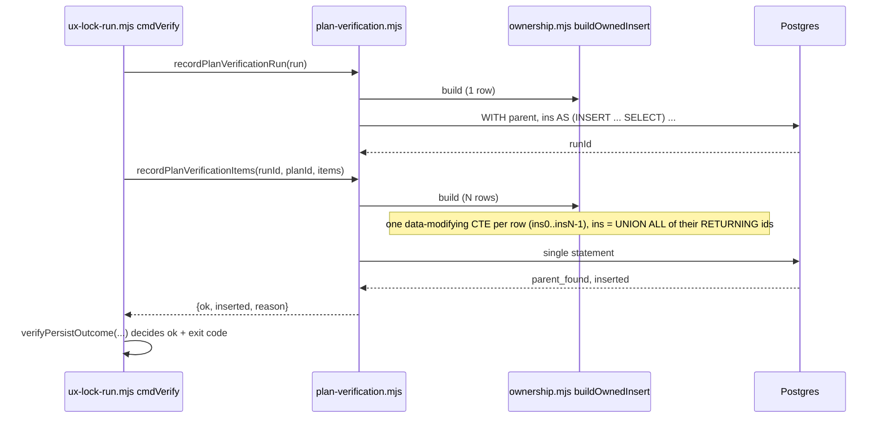

# Plan: plan_verification_items run_id uuid/text — multi-row owned insert + verify exit honesty

- **Date**: 2026-10-10
- **Status**: Complete (implemented + audited 2026-10-10; awaiting review)
- **Author**: Claude + Louis
- **Scope**: backend (store write builder + one CLI exit path; no migration, no UI)

> **Target domain(s)**: `stores`, `scripts`. ⚠ **Cross-domain work** — the root
> cause is in the `stores` builder; the silent-success half is in the `scripts`
> CLI. Both are needed: fixing only the SQL leaves the next write failure
> exiting 0 the same way.
> **Origin**: upstream report `512cf1c9-89a3-46fc-9ff0-745a4236dc37` (MEDIUM,
> Lbstrydom/wine-cellar-app, bundle `5c430d5c`).

## 1. Context Summary

**Detected**: scope `backend`, stack `js-ts`.

**Symptom (reported)**: `node scripts/ux-lock-run.mjs verify …` records the
`plan_verification_runs` row, then every call logs
`[learning] recordPlanVerificationItems failed: column "run_id" is of type uuid
but expression is of type text`, writes zero `plan_verification_items` rows, and
the command emits `ok: true` and exits 0.

**Reproduced (measured, 2026-10-10)** against a disposable
`pgvector/pgvector:0.8.7-pg16` container (127.0.0.1:55433, migrated with
`node scripts/setup-postgres.mjs --migrate`, 138 migrations), calling the real
`recordPlanVerificationRun` + `recordPlanVerificationItems`:

| items | result | rows written |
|---|---|---|
| 2 | `{ok:false, reason:'column "run_id" is of type uuid but expression is of type text'}` — SQLSTATE `42804` | 0 |
| 1 (control) | `{ok:true, inserted:1}` | 1 |

Failing statement (2 items; params `$1`=run id, `$2`=null, then 12 per row):

```sql
WITH parent AS (SELECT p.id AS id, f.repo_id AS repo_id, p.plan_id
                FROM plan_verification_runs p LEFT JOIN plans f ON f.id = p.plan_id
                WHERE p.id = $1),
ins AS (INSERT INTO plan_verification_items ("run_id", "plan_id", …, "duration_ms")
        SELECT $3, parent.plan_id, $4, … $14 FROM parent WHERE ($2::uuid IS NULL OR parent.repo_id = $2)
        UNION ALL
        SELECT $15, parent.plan_id, $16, … $26 FROM parent WHERE (…)
        RETURNING id)
SELECT (SELECT count(*) FROM parent)::int AS parent_found, …
```

**Root cause.** node-postgres binds every parameter untyped. In a single-row
`INSERT … SELECT $n FROM parent`, Postgres leaves the unknown-typed outputs
unresolved and coerces them to the INSERT target column types. A `UNION ALL`
is a set operation: Postgres resolves its output column types first, and an
all-`unknown` column resolves to `text` — so the INSERT then receives `text`
for `run_id uuid` (and would for `criterion_index int`, `passed boolean`,
`duration_ms int`; `run_id` is merely the first column it checks). Every verify
run with ≥2 criteria — i.e. every real one — fails.

**Code Trace** (all at `5884285b`):
- `scripts/ux-lock-run.mjs:477` (5884285b) `cmdVerify` → `recordPlanVerificationRun`
  (`scripts/lib/store/plan-verification.mjs:34`) — single-row, succeeds.
- `scripts/ux-lock-run.mjs:499` (5884285b) → `recordPlanVerificationItems`
  (`scripts/lib/store/plan-verification.mjs:128`) — **return value discarded**.
- `scripts/lib/store/plan-verification.mjs:193-211` (5884285b) `insertItems` →
  `buildOwnedInsert({rows: rows.map(...)})` — the only multi-row caller.
- `scripts/lib/store/ownership.mjs:135-150` (5884285b) — `rowSelects.join(' UNION ALL ')`:
  the defect. Introduced in `5c952bc6` (2026-08-12, "Phases 7–8 — parent-ownership
  joins"); before it, items used a plain multi-row `INSERT … VALUES`, which
  types each value from the target column.
- `scripts/ux-lock-run.mjs:503-518` (5884285b) — `emit({ok: true, …})` then
  `process.exit(0)` unconditionally, even when `verifyPersistFailed` is set.
- The other two `buildOwnedInsert` callers are single-row:
  `plan-verification.mjs:75` and `scripts/lib/store/regression-specs.mjs:203`.

**Why tests missed it.** `tests/store-ownership-db.test.mjs` (enrolled, runs in
CI) exercises the hop-to-tenant child insert with exactly ONE row; the pure
`tests/store-ownership.test.mjs` asserts SQL text, which cannot show a typing
fault. No test drove `recordPlanVerificationItems` with ≥2 items against
Postgres.

**`path_recognised: false` — finding.** Mechanically correct under the current
recogniser contract: `validateAffectedPath` (`scripts/lib/upstream/commands.mjs:120`)
checks the CONSUMER's `scripts/.sync-manifest.json`, whose key for this file is
`scripts/.claude-skills/ux-lock-run.mjs`; the reporter wrote the upstream-layout
path `scripts/ux-lock-run.mjs`. But the reporter named a real synced file, so it
is a recogniser false-negative of the "upstream-layout path" class, not a wrong
path. Separately, the root cause is not in that file at all (it is in
`scripts/lib/store/ownership.mjs`); `ux-lock-run.mjs` owns only the silent-exit
half. Reported, not fixed here (another session owns the recogniser).

**Neighbourhood considered**: `buildOwnedInsert` — `precedent` /
`above-floor-standout`. Decision: **extend it in place** (fix the multi-row
shape); it is the single owner of parent-joined child writes and a sibling
builder would be a second source of truth for the ownership SQL.

**Incidents**: INC-002 (destructive test against production). The new DB suite
calls `assertDisposableDbUrl` before any pool reset and never touches
`AUDIT_DB_URL` outside its own scoped swap.

## 2. Proposed Architecture



### D1 — Multi-row `buildOwnedInsert`: one INSERT CTE per row (#5 SSoT, #14, #15)

Replace the `INSERT … SELECT … UNION ALL SELECT …` body with one data-modifying
CTE per row, each a plain single-row `INSERT INTO child (cols) SELECT $a, $b, …
FROM parent WHERE (<tenant predicate>) RETURNING id`, then
`ins AS (SELECT id FROM ins0 UNION ALL SELECT id FROM ins1 …)`. The union now
runs over the typed `uuid` RETURNING column, never over bind parameters, so
every value is coerced by the INSERT target exactly as the proven single-row
path is. The trailing three-count SELECT (`parent_found`, `inserted`,
`inserted_id`) and therefore `classifyOwnedWrite` are unchanged.

- Still ONE statement: all CTEs commit or roll back together, so the
  all-or-nothing semantics and the `row-count-mismatch` check are preserved.
- Single-row output is the same statement shape it was (one `ins0`), so the two
  single-row callers' behaviour does not change.
- Parameter count is unchanged (same `$n` per value); only SQL text grows,
  linearly. The 65 535 bind-parameter ceiling is unchanged from today.

**Right-sizing.**
- *Band-aid*: special-case `recordPlanVerificationItems` to loop single-row
  inserts (N round-trips, non-atomic — a mid-loop failure leaves a partial
  criterion set, which the time-series by `criterion_hash` would read as real).
- *Over-engineered*: thread per-column SQL types into the builder (read
  `information_schema` or a type map per child table) and emit `$n::type`
  casts — a second schema description to keep in sync with migrations.
- *Chosen*: per-row CTEs. The INSERT target is already the type oracle; the fix
  removes the one construct (a set operation over parameters) that bypassed it.

Rejected alternative: `json_populate_recordset(NULL::child, $3)` — types also
come from the table, but it changes the value transport for every caller
(JSON-serialising each value) and drags the jsonb write-seam rules into a
builder that today passes values raw.

### D2 — Verify must not exit 0 when its recording failed (#15, #19)

Extract the post-run half of `cmdVerify` (everything after the Playwright
report has been mapped to `items`) into an exported function in
`scripts/ux-lock-run.mjs` with the two writers INJECTED:

```js
export async function persistAndReportVerify({
  items, orphanTests, policyTotal, cloud, planId, commit, url,
  writers = { recordPlanVerificationRun, recordPlanVerificationItems },
}) // → { envelope, exitCode }
```

It performs both writes, keeps the items result instead of discarding it,
builds the complete JSON envelope, and returns the exit code; `cmdVerify` is
left with `emit(envelope); await finishAndExit(exitCode)` (drained, not a bare
`process.exit`). Inside it, the
ok/exit decision is a small pure `verifyPersistOutcome({cloud, planId, runRes,
itemsRes})`. The seam is the dependency injection of the writers — no
production-only flag. This is what lets tests exercise the real wiring (the
discarded result was the defect, not the decision) — audit-plan R1 M1.

| state | ok | exit |
|---|---|---|
| cloud off | true | 0 (unchanged: documented graceful skip) |
| no `--plan-id` | true | 0 (unchanged: documented "records nothing") |
| run write failed | **false** | **4** |
| items write `ok:false` | **false** | **4** |
| items ok, `degraded` (skipped column missing) | true | 0, `itemsDegraded` reported |
| both ok | true | 0 |

`cmdVerify` stores `itemsRes` instead of discarding it, emits the FULL report
(criteria, counts, items) with `ok` / `error: {code: 'PERSIST_FAILED', …}` /
`persistFailed` / `itemsInserted` from the decision, and exits with its
`exitCode`. Criteria failures still exit 0 — verify stays a report; exit 4
means "the report ran but was not recorded", distinct from 3 (could not run),
5 (Playwright missing), 6 (strict selectors). 4 is unused by this CLI today.

Why non-zero and not just a field: AGENTS.md "emit({ok:false}) sets a
non-zero exit code" — an envelope that says failure while `$?` says success is
read as success by every caller checking the exit code, which is exactly how
this went unnoticed in four consecutive consumer runs.

## 6. Sustainability Notes

- Any future multi-row child write through `buildOwnedInsert` (regression spec
  runs, persona children) inherits correct typing — the defect was in the
  builder, so the fix is too.
- The new DB test drives the WRITER (`recordPlanVerificationItems`) with ≥2
  rows, so a future builder rewrite that reintroduces a set operation over
  parameters fails in CI.

## 7. File-Level Plan

- `scripts/lib/store/ownership.mjs` (modify) — `buildOwnedInsert`: per-row
  CTEs; doc comment records why a set operation over bind params is forbidden.
  Code-audit R1 additions: every row is validated against the column count
  (M7), and a `fromParent` mapping onto the CTE's own `id`/`repo_id` reuses
  that projection instead of duplicating it (H2/M6).
- `scripts/lib/store/plan-verification.mjs` (modify, code-audit R1 H1) — the
  child's parent key now comes from the proven parent row: items take
  `run_id` via `fromParent: { run_id: 'id' }`, runs take `plan_id` via
  `fromParent: { plan_id: 'id' }`, so the ownership-checked parent and the
  recorded FK cannot diverge.
- `scripts/ux-lock-run.mjs` (modify) — export `persistAndReportVerify` +
  `verifyPersistOutcome`; `cmdVerify` delegates to them and emits/exits with
  their result.
- `tests/plan-verification-items-db.test.mjs` (create) — DB-gated: disposable
  guard; seeds repo + plan; real `recordPlanVerificationRun` +
  `recordPlanVerificationItems` with 3 items; asserts `ok`, `inserted: 3`, and
  the rows' `run_id`/`plan_id`/`criterion_index`/`passed`/`duration_ms` as
  typed in the table; a 1-row control; a dangling-run refusal; and
  `persistAndReportVerify` with the REAL writers: 3 items → `exitCode 0`,
  `envelope.ok true`, `itemsInserted 3`; dangling `planId` → `exitCode 4`,
  `PERSIST_FAILED`.
- `tests/plan-verification-outcome.test.mjs` (create) — `persistAndReportVerify`
  with stub writers: run-write failure, items-write failure (`ok:false` and a
  THROWN writer), degraded success, cloud-off and no-plan-id skips. Asserts
  `exitCode`, `envelope.ok`, `error.code`, `persistFailed`, and that criteria
  counts and `items` are present on every failure path; the stub items writer
  is asserted to have been CALLED with the run id (the discarded-result shape).
- `tests/store-ownership.test.mjs` (modify only if its SQL-text assertions pin
  the `UNION ALL` shape).
- `scripts/db-test-container.mjs` (modify) — enrol the DB suite in
  `ISOLATED_SUITE_FILES`.
- `.github/workflows/postgres-parity.yml` (modify) — enrol the same file (two
  edits, always).
- `skills/ux-lock/SKILL.md` + `skills/ux-lock/references/verify-mode-generation.md`
  (modify) — the "non-zero means could not RUN" sentence gains exit 4 =
  ran but not recorded; regenerate `.claude/skills/**`.

- `.stdout-flush-baseline.json` (modify, implementation-time addition) —
  `cmdVerify` now exits via `await finishAndExit(exitCode)` instead of
  `process.exit`, so the JSON envelope a caller parses drains before exit
  (AGENTS.md "An exit that stdout can reach must drain first"); the ratchet
  went 217 → 216 and was re-baselined down.

No migration; `tests/fixtures/expected-schema.json` unchanged.

## 8. Risk & Trade-off Register

- **SQL text grows with N** — one CTE per row. Verify plans carry tens of
  criteria; acceptable. The parameter ceiling is unchanged.
- **Exit-code change for consumers** — a verify run that previously exited 0
  while losing its rows now exits 4. That is the intended behaviour change; a
  caller that relied on 0 was relying on the defect. Criteria failures are
  unaffected.
- **Deferred**: verify passes no `repoId` to either writer (tenant predicate
  relaxed). Independent of this fix — the typing fault occurs with `$2` null
  and non-null alike — and unchanged here.
- **Deferred**: the `path_recognised` recogniser (another session).

## 9. Testing Strategy

- **Red → green on real Postgres**: run the new DB suite against a disposable
  container with the builder change reverted (expect the `42804` failure,
  `inserted: 0`), then with it (expect green). Keep the 1-row control so a
  green 3-row case is not explained by a vacuous fixture.
- Existing `tests/store-ownership-db.test.mjs` must stay green (single-row
  shape, both refusals, the hop).
- Pure: `verifyPersistOutcome` table; existing `tests/ux-lock-run.test.mjs`
  and `tests/store-ownership.test.mjs` stay green.
- `npm run db:enrolment:gate`, `npm run skills:check`, full `npm test` via the
  pre-push sandbox.

## Audit Trail

- `/audit-plan` session `audit-plan-1791636413`: R1 NEEDS_REVISION H:0 M:1 L:0
  (M1: decision-table tests alone cannot prove the cmdVerify wiring) — accepted,
  100% acceptance, fixed by the injected-writer `persistAndReportVerify` seam.
  R2 READY_TO_IMPLEMENT H:0 M:0 L:0. Stopped at 2 rounds (converged).
- Gemini final gate (round 1/2): **APPROVE**, gate `approve` (blocking 0, debt 0).
- `/audit-code` session `audit-code-1791637392` (`--scope diff`):
  - R1 SIGNIFICANT_ISSUES H:4 M:10 L:0 — 10 accepted (H1, H2, H4, M1, M3,
    M6, M7, M10 fixed; H3 and M5 deferred to the debt ledger as independent
    pre-existing CLI debt), 4 dismissed (M2, M8, M9; M4 overruled by GPT
    deliberation). Acceptance 71%.
  - R2 PASS H:0 M:0 L:0. **Coverage caveat, stated rather than hidden**: both
    rounds reported `coverage: PARTIAL` — the fixed head-cut read windows left
    most changed lines of the three source files unrendered (R2:
    `changedLinesUnread` 63 / 15 / 144), and a first R2 attempt over 7 files
    went through the unmetered map-reduce path and read `INCOMPLETE`. That is
    the audit-tool defect in upstream report `58f4e3a5`, not a property of this
    change; the evidence for the changed lines is therefore the red→green DB
    suite, the negative controls, and the final gate below.
  - Gemini final gate (round 1/2): **APPROVE**, gate `approve` (blocking 0, debt 0).
