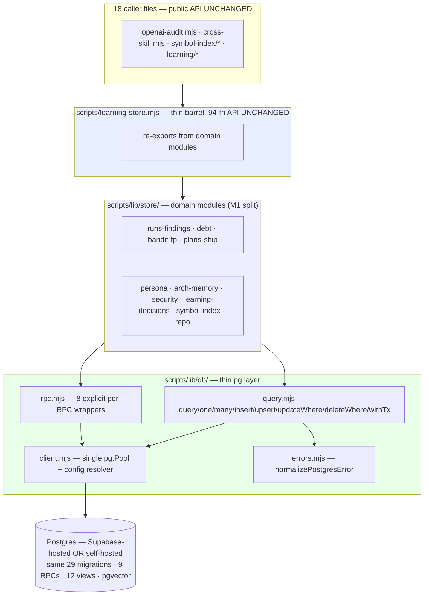

# Plan: Postgres Parity — One Postgres Code Path for the Audit-Loop Store

- **Date**: 2026-05-19
- **Status**: Draft
- **Author**: Claude + Louis
- **Scope**: backend
- **Audit**: R1 GPT-5.4 (9) + R2 (6) + R3 (6) + Gemini ×2 (3 + 4) — 28 findings,
  all addressed. GPT stopped at R3 (rigor-pressure rule); Gemini loop stopped at
  the 2-round cap with all findings accepted-and-fixed (no open disagreements).

---

## 1. Context Summary

**Detected scope/stack**: backend · `js-ts` (+ `postgres` stack kind detected) · no Python.

**Goal**: make the audit-loop store reach **full feature parity** on a self-hosted
Postgres so a downstream user of this shared/public repo can run the audit-loop
without Supabase. The maintainer stays on Supabase — so the postgres path must be
*correct by construction and CI-enforced*, not validated by daily use.

### What exists today

- **`scripts/learning-store.mjs`** — 2705 lines, **94 exported functions**, the entire
  persistence surface. Talks to Supabase via the `@supabase/supabase-js` PostgREST
  builder + 7 `.rpc()` calls. **18 files import it.**
- **`supabase/migrations/`** — 29 SQL files: tables, RLS policies, **9 RPC
  functions**, **12 views**, **pgvector** columns (4 migrations).
- **`scripts/lib/stores/`** — the Phase G adapter subsystem (`index.mjs` with
  `pickAdapter`/`loadAdapterModule` — **zero importers**), `interfaces.mjs`,
  `supabase-store.mjs`, `postgres-store.mjs`, `sqlite-store.mjs`, `github-store.mjs`,
  `github/*`, `sql/factory.mjs`, `sql/sql-dialect.mjs`, `sql/sql-errors.mjs`,
  bespoke schema `sql-schema/00{1..4}-*.sql`.
- **`pg` `^8.20.0`** and **`@supabase/supabase-js` `^2.103.0`** both already dependencies.

### Why the Phase G adapter is the wrong foundation

Not merely unwired — **internally inconsistent**: three conflicting `recordRunStart`
contracts; a divergent bespoke schema; `factory.mjs` missing the `learning`
capability group; ~70 of 94 functions with no adapter representation;
`supabase-store.mjs` a stale fork. An operation-level adapter (94 methods × N
backends) is a perpetual-drift tar pit.

### The reframe that makes full parity tractable

**Supabase *is* Postgres.** The 29 migrations, 9 RPCs, 12 views, pgvector columns
are all **plain Postgres DDL**. Full parity is **collapse to one Postgres code
path over the `pg` driver**, where "Supabase-hosted vs self-hosted" is nothing but
a connection string. Parity becomes structural — one implementation, nothing to drift.

### Neighbourhood considered (Phase 0 consultation)

`get-neighbourhood` for the `db/` seam: the closest symbols are the **four separate
Supabase-client initialisers** in `learning-store.mjs` — `initLearningStore` (0.75,
`justify-divergence`), `getWriteClient` (0.72), `getReadClient` (0.71),
`getPersonaSupabase` (0.72), `_safeWriteCall` (0.69). **Divergence justified**: the
plan *consolidates* all four into one `pg.Pool` — replacement, not a new sibling
(#1). `_safeWriteCall`'s error-swallowing is preserved (#16).
`get-incident-neighbourhood`: **0 matching incidents**.

---

## Phase 0 — Prerequisites (artefacts that precede coding)

1. **Consultations** — ✅ done (results in §1).
2. **Non-core dependency inventory** — every non-core object the 29 migrations
   reference, so the compat bootstrap is *complete*:

   | Non-core reference | Vanilla-PG status | Compat-bootstrap action |
   |---|---|---|
   | `auth.uid()` | absent | `auth` schema + `auth.uid()` — returns `NULL`, or a constant sentinel UUID if the audit below finds DEFAULT-bound `NOT NULL` columns |
   | `auth.users` (table) | absent | stub `auth.users(id uuid primary key)` |
   | `DEFAULT auth.uid()` columns (Gemini G2) | stub returns `NULL` → a `NOT NULL` insert that omits the column fails | Phase 0 audits every column for `DEFAULT auth.uid()`; if any are also `NOT NULL`, the `auth.uid()` stub returns a constant sentinel UUID, **and the bootstrap inserts that sentinel row into stub `auth.users`** so any FK → `auth.users(id)` resolves (Gemini round-2) |
   | roles `anon`, `authenticated`, `service_role` | absent | `CREATE ROLE … NOLOGIN` — **needs `CREATEROLE`** (see R3 below) |
   | `CREATE EXTENSION` (`vector`, `pg_trgm`, `pgcrypto`) | pkgs may be absent | `CREATE EXTENSION IF NOT EXISTS …`; loud failure + hint if missing |
   | `GRANT EXECUTE … TO <role>` | role-dependent | succeeds once the roles exist |

   A CI lint (§9) re-runs the inventory so a future migration adding an
   un-inventoried non-core reference fails the build.

   **Compat bootstrap is skipped on a Supabase-managed DB** (Gemini round-2):
   `setup-postgres.mjs` detects a real `auth` schema (owned by `supabase_admin`)
   and skips the bootstrap entirely — it is for fresh self-hosted Postgres only.
   Even when it runs, every statement is existence-guarded (`CREATE SCHEMA/TABLE
   IF NOT EXISTS`; `CREATE FUNCTION` only when absent — **never `CREATE OR
   REPLACE`**), so it can never clobber a real `auth.uid()`.
3. **Migration schema-coupling audit** (R3/H2) — scan all 29 migrations for
   explicit `public.` qualifications and `search_path`-sensitive constructs. Its
   result fixes the v1 schema scope (see §2 "Schema scope").
4. **Expected-schema manifest** (R3/M3) — `tests/fixtures/expected-schema.json`:
   generated from a *pristine* fully-migrated DB via catalog introspection —
   tables/columns/defaults, functions, views, policies, constraints, indexes,
   triggers, sequences, extensions, grants, owners. Drives adopt-mode (§7 P2).
   Regenerated (reviewed) whenever a migration is added.
5. **Golden contract fixtures** — `tests/fixtures/contract/` + the index
   `docs/plans/postgres-parity-contract-matrix.md`: one row per the 94 functions —
   input fixture, expected DB mutations, expected return shape, **and ordering
   semantics** (R3/M1). Recorded once by running the frozen legacy (`supabase-js`)
   path against a **local `supabase start` stack** (never the production project).
   Committed; the §9 contract suite diffs against them.

---

## 1.5 Execution Model

**Phase 0 (artefacts) + 4 sequential PRs**:

```
P0 inventory + manifests + golden fixtures → P1 db layer → P2 setup CLI
        → P3 store rewrite + split + caller de-leak (atomic) → P4 cutover + cleanup
```

- **Atomicity** — each PR independently build-clean and test-green. **P3 is one
  atomic unit**: rewrite + domain split + the 5 raw-client caller migrations +
  removal of `getReadClient`/`getWriteClient`/`getPersonaSupabase` land together —
  splitting them leaves a non-buildable intermediate.
- **Failure semantics** — P1/P2 additive (no behaviour change). P3 is the
  live-path risk; the §9 contract suite must be green in remote CI before P3
  merges. P4 (drop `@supabase/supabase-js`) only after P3 + the maintainer's
  `.env` cutover.
- **Concurrency** — phases serial.

---

## 2. Proposed Architecture

### The decision: one Postgres code path (`pg`), no adapter layer



**Rejected**: Approach A — operation-level adapter (method explosion, perpetual
drift; violates DRY #1 / SSoT #5); Approach C — dual transport behind a builder.
**Approach B — chosen** (user-confirmed): one implementation, raw SQL over `pg`.

### Connection model (revised — R3/H1)

`AUDIT_DB_URL` is the **only** supported runtime input — a complete `postgres://`
DSN. A Supabase project URL is an HTTP endpoint, **not** a database locator (it
encodes no host/port/user/dbname/pooler-mode/sslmode), so the R2 idea of *deriving*
a DSN from `SUPABASE_AUDIT_URL` is dropped — it cannot be done reliably.

The resolver:
1. `AUDIT_DB_URL` set → use it.
2. Only legacy `SUPABASE_AUDIT_*` set (no `AUDIT_DB_URL`) → **fail fast with an
   actionable message**: "Set `AUDIT_DB_URL` to your Postgres connection string —
   for Supabase, dashboard → Connect → Direct/Session pooler." No silent
   derivation, no half-working state.
3. Neither → cloud-disabled (the existing silent no-op path, #16).

The maintainer's cutover is one line: `AUDIT_DB_URL=<Supabase Connect string>`.
`SUPABASE_AUDIT_*` is then dead config; AGENTS.md documents the sunset.

### Schema scope (revised — R3/H2)

**v1 targets the `public` schema only.** The R2 promise of arbitrary
`AUDIT_DB_SCHEMA` support is withdrawn: the 29 migrations are Supabase-era DDL not
audited for schema portability (explicit `public.` qualifications,
`search_path`-sensitive function bodies). `setup-postgres.mjs` and the runtime
**assert the target schema is `public`** and refuse otherwise with a clear message.
Test isolation uses an **ephemeral database/container per run** + per-test
`TRUNCATE`, not a non-default schema. Arbitrary-schema support → §10 Out of Scope.

### Privilege model (revised — R2/H4 + R3/H3)

Two distinct roles, both documented in AGENTS.md:

- **Setup role** (`setup-postgres.mjs`, one-time) — needs **`CREATEROLE`** (to
  create the `anon`/`authenticated`/`service_role` stub roles) + `CREATE EXTENSION`
  privilege. `setup-postgres.mjs` **preflights** these and aborts early with a
  precise message if absent — managed-Postgres environments that withhold
  `CREATEROLE` are an explicit unsupported case for v1 (the migration-preprocessing
  alternative is §10 Out of Scope).
- **Runtime role** (the `pg.Pool`) — owns the audit-loop objects, or holds full
  DML + `EXECUTE` on the 9 RPCs + schema/sequence `USAGE`. Ownership **bypasses
  RLS** — correct for a single-tenant store where the DSN *is* the secret (it
  replaces both the anon and service-role keys). This is why the four Supabase
  clients collapse to one pool with no read/write split.
- **Supabase-hosted** — `AUDIT_DB_URL` is the project's `postgres`-role string;
  that role owns `public`, so behaviour matches self-hosted.

### RPC handling (R1/H1)

`scripts/lib/db/rpc.mjs` exports **one explicit wrapper per RPC** — pinning ordered
parameters, `vector`/array casts, and return mode — *not* a generic
`callFn(name,argMap)` (which would make JS object key-order a DB API contract):

| RPC | Return | Wrapper |
|---|---|---|
| `defer_finding` / `mark_finding_needs_triage` | void | `deferFinding` / `markFindingNeedsTriage` |
| `drift_score` | scalar | `driftScore` |
| `memory_health_metrics` / `top_duplicate_clusters` | set | `memoryHealthMetrics` / `topDuplicateClusters` |
| `symbol_neighbourhood` / `incident_neighbourhood` | set | `vector`/`text[]` params |
| `publish_refresh_run` | void/scalar | `publishRefreshRun` |

(`touch_security_incidents_updated_at` is a trigger.) One integration test per wrapper.

### Public API surface (revised — R3/M2)

The **frozen public contract is the 94 named persistence functions** — and only
those. `getReadClient`/`getWriteClient`/`getPersonaSupabase` are **internal
implementation leaks**, never part of the contract (their existence *is* the
abstraction breach P3 closes). Removing them is intentional, not a breaking change
to the frozen API. P3 adds `tests/learning-store-exports.test.mjs` pinning the
intended public surface so future drift (accidental new export, or a removed
contract function) fails CI.

### Domain-module split (M1)

`learning-store.mjs` becomes a **thin barrel** re-exporting from
`scripts/lib/store/<domain>.mjs` (runs-findings, debt, bandit-fp, plans-ship,
persona, arch-memory, security, learning-decisions, symbol-index, repo). The
PostgREST→SQL rewrite is the moment to undo the 2700-line God-module (#3) — the
repo already did this for `shared.mjs`→`lib/*`. 18 callers unaffected.

### pg-driver fidelity (Gemini gate — G1, G3)

Two `pg`-vs-PostgREST behavioural differences must be neutralised so the frozen
return shapes (#18) are *genuinely* preserved:

- **Date typing (G1)** — `@supabase/supabase-js` (PostgREST) returns
  `date`/`timestamp`/`timestamptz` columns as **ISO-8601 strings**; the raw `pg`
  driver parses them into JS `Date` objects. Unconfigured, this silently changes
  every date field in every return shape. `db/client.mjs` registers
  **pool-scoped** type parsers for OIDs **1184** (`timestamptz`), **1114**
  (`timestamp`), **1082** (`date`) **via the `Pool` `types` option — never the
  process-global `pg.types.setTypeParser`** (Gemini round-2), which would mutate
  date parsing for any other `pg` consumer in the process. A dedicated unit test
  asserts date fields come back as strings (§9); the contract suite's timestamp
  *value*-normalisation then runs on top of pinned *types* and cannot mask a type
  regression.
- **Transaction-client propagation (G3)** — in `pg`, `BEGIN`/work/`COMMIT` must run
  on the *same* checked-out client. `withTx` establishes the transaction client in
  an `AsyncLocalStorage` context; every `query.mjs` helper checks that context and
  binds to the active transaction client when one is present, else the pool.
  `withTx` is **re-entrant** (Gemini round-2): a nested `withTx` inside an active
  context joins the existing transaction via a `SAVEPOINT` rather than checking out
  a second client — a second checkout would deadlock against `AUDIT_DB_POOL_MAX`.
  Domain functions need no client-passing boilerplate and cannot run transactional
  work outside the tx.

### Why this is correct, by principle

#1 DRY / #5 SSoT — one implementation, schema only in `supabase/migrations/`.
#3 Modularity — `db/` 4-file seam; `lib/store/*` focused domains.
#13 Idempotency — `ON CONFLICT`; migration ledger. #14 — `withTx`.
#16 Graceful Degradation — no-DB no-op preserved. #18 — 94-function barrel frozen.
#20 — swap DB host = connection-string change.

---

## 6. Sustainability Notes

- **Assumption**: one Postgres DB with the `supabase/migrations/` schema in
  `public` + `vector` — an explicit, documented bet.
- **Schema SSoT** — `supabase/migrations/` serves both Supabase and self-hosted.
- **The non-core inventory + expected-schema manifest are CI-checked** — a
  migration that drifts either fails the build.
- **The `db/` seam** localises a future driver swap to `client.mjs`.

---

## 7. File-Level Plan

### Phase 1 — `pg` query layer (additive, zero behaviour change)

| File | Action | Purpose |
|---|---|---|
| `scripts/lib/db/client.mjs` | **new** | Single `pg.Pool`; resolver (R3/H1 — `AUDIT_DB_URL`-only, fail-fast on legacy-only); asserts schema `public` (R3/H2); **pool-scoped type parsers (OIDs 1184/1114/1082 → string, via the `Pool` `types` option, not the global API)** (G1); re-entrant `AsyncLocalStorage` transaction context (G3); SSL/pool config salvaged from `postgres-store.mjs`; `getPool()`, `closePool()`, `_resetForTest()`. |
| `scripts/lib/db/errors.mjs` | **new** (salvage) | `normalizePostgresError` from `stores/sql/sql-errors.mjs`. |
| `scripts/lib/db/query.mjs` | **new** | Helpers for the census (12 insert / 23 upsert / 16 update / 2 delete / 54 select). `withTx` binds the tx client via `AsyncLocalStorage` and is **re-entrant** (nested `withTx` joins via `SAVEPOINT` — no second checkout); every helper auto-binds to the active tx client when present (G3). Non-trivial JOIN (`listSymbolsForSnapshot`) hand-written. |
| `scripts/lib/db/rpc.mjs` | **new** | 8 explicit per-RPC wrappers. |
| `scripts/lib/config.mjs` | modify | Add `AUDIT_DB_URL`, `AUDIT_DB_SSL_MODE`, `AUDIT_DB_POOL_MAX`. (No `AUDIT_DB_SCHEMA` — v1 is `public`-only.) |
| `tests/db-query.test.mjs`, `tests/db-config-resolver.test.mjs` | **new** | Unit: SQL generation; resolver precedence + the legacy-only fail-fast message. |

### Phase 2 — setup / migration CLI

| File | Action | Purpose |
|---|---|---|
| `scripts/lib/db/compat-bootstrap.sql` | **new** | The Phase 0 inventory's compatibility surface (`auth` schema/`auth.uid()`/stub `auth.users`/roles/extensions). |
| `scripts/setup-postgres.mjs` | **rewrite** | **Preflight** `CREATEROLE` + `CREATE EXTENSION` privilege; abort early with a precise message if absent (R3/H3). **Detect a Supabase-managed `auth` schema (owned by `supabase_admin`) and skip the compat bootstrap entirely when present** (Gemini round-2 — the bootstrap is for fresh self-hosted Postgres only). Otherwise run the existence-guarded compat bootstrap; then apply `supabase/migrations/*.sql` in order; record applied set in `audit_loop_migrations`; idempotent (#13). **Adopt-mode** — below. |
| `scripts/setup-postgres.mjs` (adopt-mode) | — | For a pre-provisioned DB, compare the live schema against the **expected-schema manifest** (Phase 0 #4) — tables/columns/defaults, functions, views, policies, constraints, indexes, **triggers, sequences, grants, owners** (R3/M3). All-match → seed the ledger as fully applied without replay; any mismatch → abort with a diff. |
| `tests/db-setup.test.mjs` | **new** | Integration (remote CI): fresh-apply + adopt-mode; privilege-preflight failure path; idempotent re-run. |

### Phase 3 — rewrite + split `learning-store.mjs`, de-leak callers (one atomic PR)

| File | Action | Purpose |
|---|---|---|
| `tests/fixtures/learning-store.legacy.mjs` | **new (frozen)** | Verbatim pre-rewrite supabase-js snapshot — the off-CI fixture generator (§9). |
| `scripts/lib/store/*.mjs` | **new** | The 94 functions, PostgREST→SQL, grouped by domain (M1). RPC calls → `db/rpc.mjs`. Null-guards + `_safeWriteCall` error-swallowing preserved (#16). |
| `scripts/learning-store.mjs` | **rewrite → barrel** | Re-exports the 94 functions; signatures + return shapes unchanged. `getReadClient`/`getWriteClient`/`getPersonaSupabase` removed (internal — R3/M2). |
| `symbol-index/prune.mjs`, `symbol-index/refresh.mjs`, `lib/learning/quickfix-stats.mjs`, `learning/replay.mjs`, `learning/backfill-outcomes.mjs` | modify | The 5 raw-client callers → new named exports (`listPrunableRefreshRuns`, `deleteRefreshRuns`, `demoteRefreshRuns`, `getRefreshRun`, `readDecisionsPaginated`, `readUnresolvedDecisions`). |
| `tests/learning-store-contract.test.mjs` | **new** | The §9 equivalence gate. |
| `tests/learning-store-exports.test.mjs` | **new** | Pins the intended public export surface (R3/M2). |

### Phase 4 — cutover + cleanup

| File | Action | Purpose |
|---|---|---|
| `package.json` | modify | Remove `@supabase/supabase-js`, `better-sqlite3`, `@octokit/*`; promote `pg` to non-optional. |
| **GitHub/SQLite store removal** (explicit, user-confirmed feature drop) | **delete** | `scripts/lib/stores/**`; `scripts/setup-github-store.mjs`; `scripts/setup-sqlite.mjs`; `tests/stores/github-store.test.mjs`, `tests/stores/noop-store.test.mjs`. The `noop` "no DB" behaviour survives as `learning-store`'s null-guards. |
| `AGENTS.md` | modify | Replace `AUDIT_STORE`/`SUPABASE_AUDIT_*` tables + adapter prose with: the `AUDIT_DB_URL` model + legacy sunset; the setup-role vs runtime-role privilege model + minimum grants; the `pgvector`/`pg_trgm` prerequisite; `public`-schema-only scope. |
| `.github/workflows/postgres-parity.yml` | **new** | The DB-backed parity suite in remote CI — §9. |
| `scripts/sync-to-repos.mjs` | modify | `setup-postgres.mjs` → `CORE_ENTRY`; **`supabase/migrations/**` AND `scripts/lib/db/compat-bootstrap.sql`** → `CORE_ASSETS` (non-importable; the closure can't see fs-read files). |
| `tests/sync-packaging.test.mjs` | **new** | Synced `setup-postgres.mjs` runs against an ephemeral DB — proves the migrations + `compat-bootstrap.sql` shipped. |

---

## 8. Risk & Trade-off Register

| # | Risk / trade-off | Mitigation |
|---|---|---|
| R1 | **P3 rewrites the maintainer's live persistence path** — `learning-store` swallows errors, so a regression is silent. | The §9 golden-fixture contract suite must be green in **remote CI** before P3 merges. |
| R2 | **Coexistence vs clean cut.** | No dual path shipped; equivalence proven against committed golden fixtures; P3 is a clean cut. |
| R3 | **Non-core migration dependencies** break self-hosted setup. | Phase 0 inventory → complete `compat-bootstrap.sql`; CI lint fails on un-inventoried references. |
| R4 | **Adopt-mode mis-detection** on a drifted DB. | Compares the live schema against the versioned **expected-schema manifest** — incl. triggers/defaults/sequences/grants/owners (R3/M3); mismatch aborts with a diff. |
| R5 | **`@supabase/supabase-js` removal breaks an unaudited caller.** | P4-gated: tree-wide grep; §9 green; maintainer `.env` cutover confirmed. |
| R6 | **pgvector / pg_trgm availability.** | `CREATE EXTENSION IF NOT EXISTS` + loud failure + install hint; documented prerequisite. |
| R7 | **Pool exhaustion** in tight upsert loops. | Single shared pool; `AUDIT_DB_POOL_MAX` default 4; chunked writes batch. |
| R8 | **GitHub/SQLite store removal is a feature drop.** | Explicit, enumerated, user-confirmed (§7 P4); deps + docs updated. |
| R9 | **Supabase transaction-mode pooler** — no server-side prepared statements. | Use the session/direct string for setup + runtime; documented in AGENTS.md. |
| R10 | **`CREATEROLE` unavailable** on some managed Postgres → compat bootstrap can't create the stub roles. | `setup-postgres.mjs` preflights and aborts with a precise message; managed-PG-without-`CREATEROLE` is an explicit v1-unsupported case (§10). |
| R11 | **Raw-client accessors may be consumed externally** (shared/public repo). | Declared internal (never public contract); `learning-store-exports.test.mjs` pins the real surface; AGENTS.md states the contract is the 94 named functions. |
| R12 | **M1 split widens P3's blast radius.** | Mechanical (move bodies behind the barrel); the contract suite covers it regardless of layout. |
| R13 | **`pg` parses dates to `Date`; PostgREST returns ISO strings** — silent return-shape drift (Gemini G1). | `db/client.mjs` registers `pg` type parsers (OIDs 1184/1114/1082 → string); a unit test asserts string typing; the contract suite's timestamp value-normalisation runs on top of pinned types. |
| R14 | **`DEFAULT auth.uid()` + `NOT NULL`** — a `NULL` stub fails such inserts (Gemini G2). | Phase 0 audits for `DEFAULT auth.uid()` columns; if any are `NOT NULL`, the compat stub returns a constant sentinel UUID instead of `NULL`. |
| R15 | **`withTx` client propagation + nesting** — work outside the tx, or a nested `withTx` deadlocking on a second pool checkout (Gemini G3 + round-2). | `AsyncLocalStorage`-bound tx context; helpers auto-bind; `withTx` is re-entrant (nested → `SAVEPOINT`, no second checkout); a rollback + a nested-tx unit test verify both. |
| R16 | **Compat bootstrap clobbers a live Supabase `auth` schema** — the maintainer's cutover points `AUDIT_DB_URL` at a real Supabase DB whose `auth` schema is `supabase_admin`-managed (Gemini round-2). | `setup-postgres.mjs` detects the managed `auth` schema and skips the bootstrap; every bootstrap statement is existence-guarded (`IF NOT EXISTS`, never `CREATE OR REPLACE`), so it cannot overwrite a real `auth.uid()` even if run. |
| R17 | **Sentinel UUID has no matching `auth.users` row** — an FK → `auth.users(id)` would fail (Gemini round-2). | When the sentinel-UUID stub path is taken, the bootstrap also inserts the sentinel row into stub `auth.users`. |

**Deliberately deferred** → §10.

---

## 9. Testing Strategy

| Layer | What | Where |
|---|---|---|
| **Unit** | `db/query.mjs` SQL generation; `db/client.mjs` resolver + fail-fast message + **date-type-parser fidelity** (date fields return as `string`, not `Date` — G1); **`withTx` runs work on the tx client** (rollback test — G3); the non-core-inventory lint; the expected-schema-manifest freshness check. Pure / local DB. | `npm test` + **pre-push hook**. |
| **Setup integration** | `setup-postgres.mjs` — fresh-apply, adopt-mode, privilege-preflight failure, idempotent re-run. | **Remote CI** (postgres+pgvector). |
| **RPC integration** | One test per the 8 `db/rpc.mjs` wrappers vs the live RPC. | **Remote CI.** |
| **Contract equivalence (R1 gate)** | New path, all 94 functions, vs the **committed golden fixtures**. | **Remote CI — blocks P3 merge.** |
| **Export contract** | `learning-store-exports.test.mjs` — the public surface is exactly the 94 functions. | `npm test`. |
| **Caller smoke / Sync packaging** | 5 de-leaked callers vs golden; synced `setup-postgres.mjs` on an ephemeral DB. | **Remote CI.** |

### Golden-fixture contract model (R2/H1)

The legacy path is `@supabase/supabase-js` (PostgREST) and **cannot talk to a plain
Postgres container**. So: fixtures are **generated once, off-CI** — the frozen
`learning-store.legacy.mjs` is run against a local `supabase start` stack (full
Supabase in Docker; never production), recording per-function return value + table
mutations into `tests/fixtures/contract/`. CI runs the **new path only** against
postgres+pgvector and diffs vs the committed fixtures.

### Ordering semantics (R3/M1)

Rewriting 54 selects PostgREST→SQL can surface implicit-ordering differences. The
contract matrix specifies, per multi-row function: either a **contractual
`ORDER BY`** (the new SQL must include it; the fixture is order-sensitive), or
**order-insensitive** (the comparator sorts both sides by a canonical key before
diff). Snapshot queries of touched tables are always sorted by primary key before
comparison.

### Harness specifics (R1/H6)

- **Isolation** — per-test `TRUNCATE … RESTART IDENTITY CASCADE` + deterministic
  re-seed; ephemeral database per CI run (no non-`public` schema — R3/H2).
- **Determinism** — fixed-seed fixtures; the comparator normalises server-generated
  UUIDs → positional tokens and `now()` → a sentinel before deep-equal.
- **Coverage** — driven by the 94-row contract matrix; a function with no
  matrix row / golden fixture fails the suite.

### CI topology

`.github/workflows/postgres-parity.yml`, every PR: `unit` job (pure) + `db-suite`
job (`postgres:16`+`pgvector` service). Running the DB suite in **remote CI** is a
deliberate, documented exception to the repo's "local-first CI" preference — the
parity suite is the *sole* correctness gate for a path the maintainer never runs
locally; a gate that depends on the maintainer's local environment is not a gate.

---

## 10. Out of Scope (Future)

| Deferred | Rationale |
|---|---|
| **Arbitrary `AUDIT_DB_SCHEMA`** (non-`public`) | The 29 migrations are unaudited for schema portability. v1 is `public`-only; multi-schema support needs a migration-portability pass first (Phase 0 #3 audits *whether* it's needed, not delivers it). |
| **Managed Postgres without `CREATEROLE`** | The compat bootstrap needs `CREATEROLE` for the Supabase stub roles. Supporting locked-down managed PG needs a migration-preprocessing layer that strips/translates Supabase-only role grants — a separate effort. v1 preflights and fails clearly. |
| **sqlite / github / noop store backends** | Removed per the user decision (postgres + Supabase only). The "no DB" path survives as `learning-store`'s null-guards. |
| **Realtime / Storage / Auth** | Supabase product features the audit-loop never used. |

---

## 11. Milestones & Audit Cadence

The 5 phases ship as 5 PRs in strict order. Each milestone has explicit
deliverables, exit criteria, and audit/validation gates. **`/audit-code
docs/plans/postgres-parity.md --scope diff` runs on every code-bearing PR**;
`/audit-plan` re-runs only if a scope assumption shifts during implementation
(e.g. the migration schema-coupling audit forces something to §10 Out of Scope).

### M0 — Prerequisites (artefacts only, no production code)

Deliverables: non-core dependency inventory · migration schema-coupling audit ·
expected-schema manifest (`tests/fixtures/expected-schema.json`) · 94 golden
contract fixtures recorded off-CI against a local `supabase start` stack ·
contract matrix `docs/plans/postgres-parity-contract-matrix.md`.

- **Exit criterion**: human review of all artefacts.
- **Trigger for `/audit-plan` re-run**: the schema-coupling audit shifts scope
  (e.g. migration preprocessing becomes necessary).
- **No `/audit-code`** — no production code yet.

### M1 — DB layer (PR1, additive, no behaviour change)

Deliverables: `scripts/lib/db/{client,query,rpc,errors}.mjs`; `config.mjs` env
additions; unit tests (SQL gen · resolver fail-fast · date-type-parser fidelity
G1 · `withTx` rollback + nesting G3). No DB required for unit tests.

- **Audit gate**: `/audit-code` after the PR opens.
- **Merge gate**: CI green; `/audit-code` HIGH = 0.

### M2 — Setup CLI (PR2, additive, no runtime behaviour change)

Deliverables: `db/compat-bootstrap.sql`; `setup-postgres.mjs` rewrite (privilege
preflight · Supabase-managed `auth` detection · adopt-mode · idempotent re-run);
integration tests in remote CI (postgres + pgvector).

- **Validation milestone — the M3 confidence check**: `setup-postgres.mjs` runs
  green (a) against a fresh self-hosted Postgres → audit-loop-ready schema, and
  (b) in adopt-mode against the maintainer's Supabase → proposes a clean ledger
  seed, no replay attempted.
- **Audit gate**: `/audit-code` after the PR opens.
- **Merge gate**: validation milestone passed + CI green + `/audit-code` HIGH = 0.

### M3 — Live-path rewrite + domain split + caller de-leak (PR3 — the big one)

Deliverables: `lib/store/*.mjs` (10 domain modules) · `learning-store.mjs` →
barrel · 5 raw-client callers migrated · `getReadClient`/`getWriteClient`/
`getPersonaSupabase` removed · `learning-store-contract.test.mjs` ·
`learning-store-exports.test.mjs`.

- **Pre-merge HARD gate (R1)**: contract-equivalence suite green in **remote CI**
  against the postgres + pgvector container — diff vs the M0 golden fixtures, all
  94 functions, no exceptions.
- **Audit gate**: `/audit-code` — request extra rigor; this rewrites the live path.
- **Manual e2e**: one full audit-loop run via the new path against a real DB
  (the maintainer's Supabase) produces a sane result vs a recent prior run.
- **Merge gate**: contract suite green + `/audit-code` HIGH = 0 + e2e pass.

### M4 — Cutover + cleanup (PR4)

Deliverables: drop `@supabase/supabase-js`, `better-sqlite3`, `@octokit/*` ·
delete `lib/stores/**`, `setup-{github,sqlite}-store.mjs` + their tests · AGENTS.md
rewrite · `.github/workflows/postgres-parity.yml` · sync additions; promote `pg`
to non-optional.

- **Pre-PR gate**: maintainer's `.env` cut over to `AUDIT_DB_URL`; M3 merged and
  soaked against Supabase for the operator's chosen period.
- **Audit gate**: `/audit-code` after the PR opens.
- **Final validation**: full audit-loop smoke run on the new path. No
  `/persona-test` (backend-only — no UI surface touched).
- **Merge gate**: smoke clean + `/audit-code` HIGH = 0.

### Cadence at a glance

| # | Action | Type | When |
|---|---|---|---|
| 1 | `/audit-plan` on this plan | audit | ✅ done |
| 2 | Build M0 artefacts (inventory · manifest · golden fixtures · matrix) | manual | one-off, before M1 |
| 3 | Review M0; re-run `/audit-plan` only if scope shifts | manual | before M1 |
| 4 | Open PR M1 → `/audit-code` → merge | code audit | M1 cycle |
| 5 | Open PR M2 → M2 validation milestone → `/audit-code` → merge | manual + code audit | M2 cycle |
| 6 | Open PR M3 → contract suite green (HARD) + `/audit-code` + manual e2e → merge | hard gate + code audit + manual | M3 cycle |
| 7 | Maintainer `.env` cutover | manual | between M3 and M4 |
| 8 | Open PR M4 → `/audit-code` → final smoke → merge | code audit + manual | M4 cycle |

---

## Appendix — Phase / PR summary

| Phase | PR | Risk | Blocks |
|---|---|---|---|
| P0 | inventory + schema-coupling audit + expected-schema manifest + golden fixtures | none | — |
| P1 | `db/` query+rpc layer + config resolver | none (additive) | P0 |
| P2 | `setup-postgres.mjs` + compat bootstrap + adopt-mode | none (additive) | P1 |
| P3 | `learning-store.mjs` rewrite + domain split + 5-caller de-leak + raw-client removal (atomic) | **high (live path)** | P1, P2, §9 contract suite green in CI |
| P4 | drop `@supabase/supabase-js`; remove GitHub/SQLite stores; CI workflow; docs; sync | medium | P3, maintainer `.env` cutover |
